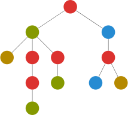
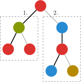

# 树上启发式合并 - OI Wiki

- Source: https://oi-wiki.org/graph/dsu-on-tree/

# 树上启发式合并

## 引入

启发式算法是什么呢？

启发式算法是基于人类的经验和直观感觉，对一些算法的优化．

举个例子，最常见的就是并查集的启发式合并了，代码是这样的：

```text 1 2 3 4 5 6 ``` |  ```text void merge ( int x , int y ) { int xx = find ( x ), yy = find ( y ); if ( size [ xx ] < size [ yy ]) swap ( xx , yy ); fa [ yy ] = xx ; size [ xx ] += size [ yy ]; } ```   
---|---  
  
在这里，对于两个大小不一样的集合，我们将小的集合合并到大的集合中，而不是将大的集合合并到小的集合中．

为什么呢？这个集合的大小可以认为是集合的高度（在正常情况下），而我们将集合高度小的并到高度大的显然有助于我们找到父亲．

让高度小的树成为高度较大的树的子树，这个优化可以称为启发式合并算法．

## 算法内容

树上启发式合并（dsu on tree）对于某些树上离线问题可以速度大于等于大部分算法且更易于理解和实现的算法．

考虑下面的问题：[树上数颜色](https://www.luogu.com.cn/problem/U41492)．

例题引入

给出一棵 𝑛n 个节点以 11 为根的树，节点 𝑢u 的颜色为 𝑐𝑢cu，现在对于每个结点 𝑢u 询问以 𝑢u 为根的子树里一共出现了多少种不同的颜色．

𝑛 ≤2 ×105n≤2×105．



对于这种问题解决方式大多是运用大量的数据结构（树套树等），如果可以离线，是不是有更简单的方法？

## 过程

既然支持离线，考虑预处理后 𝑂(1)O(1) 输出答案．

直接暴力预处理的时间复杂度为 𝑂(𝑛2)O(n2)，即对每一个子节点进行一次遍历，每次遍历的复杂度显然与 𝑛n 同阶，有 𝑛n 个节点，故复杂度为 𝑂(𝑛2)O(n2)．

可以发现，每个节点的答案由其子树和其本身得到，考虑利用这个性质处理问题．

我们可以先预处理出每个节点子树的大小和它的重儿子，重儿子同树链剖分一样，是拥有节点最多子树的儿子，这个过程显然可以 𝑂(𝑛)O(n) 完成．

我们用 𝑐𝑛𝑡𝑖cnti 表示颜色 𝑖i 的出现次数，𝑎𝑛𝑠𝑢ansu 表示结点 𝑢u 的答案．

遍历一个节点 𝑢u，我们按以下的步骤进行遍历：

  1. 先遍历 𝑢u 的轻（非重）儿子，并计算答案，但 **不保留遍历后它对 𝑐𝑛𝑡cnt 数组的影响**；
  2. 遍历它的重儿子，**保留它对 𝑐𝑛𝑡cnt 数组的影响**；
  3. 再次遍历 𝑢u 的轻儿子的子树结点，加入这些结点的贡献，以得到 𝑢u 的答案．



上图是一个例子．

这样，对于一个节点，我们遍历了一次重子树，两次非重子树，显然是最划算的．

通过执行这个过程，我们获得了这个节点所有子树的答案．

为什么不合并第一步和第三步呢？因为 𝑐𝑛𝑡cnt 数组不能重复使用，否则空间会太大，需要在 𝑂(𝑛)O(n) 的空间内完成．

显然若一个节点 𝑢u 被遍历了 𝑥x 次，则其重儿子会被遍历 𝑥x 次，轻儿子（如果有的话）会被遍历 2𝑥2x 次．

注意除了重儿子，每次遍历完 𝑐𝑛𝑡cnt 要清零．

## 证明

我们像树链剖分一样定义重边和轻边（连向重儿子的为重边，其余为轻边）．关于重儿子和重边的定义，可以见下图，对于一棵有 𝑛n 个节点的树：

根节点到树上任意节点的轻边数不超过 log⁡𝑛log⁡n 条．我们设根到该节点有 𝑥x 条轻边该节点的子树大小为 𝑦y，显然轻边连接的子节点的子树大小小于父亲的一半（若大于一半就不是轻边了），则 𝑦 <𝑛/2𝑥y<n/2x，显然 𝑛 >2𝑥n>2x，所以 𝑥 <log⁡𝑛x<log⁡n．

又因为如果一个节点是其父亲的重儿子，则它的子树必定在它的兄弟之中最多，所以任意节点到根的路径上所有重边连接的父节点在计算答案时必定不会遍历到这个节点，所以一个节点的被遍历的次数等于它到根节点路径上的轻边数 +1+1（之所以要 +1+1 是因为它本身要被遍历到），所以一个节点的被遍历次数 =log⁡𝑛 +1=log⁡n+1, 总时间复杂度则为 𝑂(𝑛(log⁡𝑛 +1)) =𝑂(𝑛log⁡𝑛)O(n(log⁡n+1))=O(nlog⁡n)，输出答案花费 𝑂(𝑚)O(m)．


 _图中标粗的即为重边，重边连向的子节点为重儿子_

## 优化

在证明过程中提到，dsu on tree 利用了重链剖分中的轻重儿子概念加速合并．既然如此，我们也可以直接利用重链剖分得到的 dfs 序，化递归为迭代，进一步优化 dsu on tree 的常数．

dfs 序本身就有如下的性质：一个节点的子树在 dfs 序上一定连续．因此，可以倒序遍历 dfs 序数组．这样保证了在遍历到一个节点时，它的子树中的其他节点一定已经得到了处理．

重链剖分得到的 dfs 序有着如下优良的性质：一条重链在 dfs 序上一定是连续的．因此，当按照 dfs 序倒序遍历节点时，对于一条重链顶端的节点，要遍历的下一个节点一定不是该节点的父亲，所以要清空它的影响；除此之外，对于不在重链顶端的节点，遍历的前一个节点要么是自己的重儿子，要么是已经清除了影响的其他分支的节点，所以可以直接继承其影响．在此基础上，再利用 dfs 序快速统计所有轻儿子的影响，记录答案．

以上过程称为 dsu on tree 的非递归/迭代实现（也被称为 dsu on tree 的 dfs 序实现）．相较于原本递归实现，它减小了递归调用函数的时空开销，获得了不小的常数优化，**尤其在处理包含大量链状结构的树时，拥有显著的栈空间优势．**

## 实现

参考实现

递归实现非递归实现

```text 1 2 3 4 5 6 7 8 9 10 11 12 13 14 15 16 17 18 19 20 21 22 23 24 25 26 27 28 29 30 31 32 33 34 35 36 37 38 39 40 41 42 43 44 45 46 47 48 49 50 51 52 53 54 55 56 57 58 59 60 61 62 63 64 65 66 67 68 69 70 71 72 73 74 75 76 77 78 79 80 81 82 83 84 85 86 87 88 89 90 91 92 93 94 ``` |  ```text #include <cstdio> #include <vector> using namespace std ; constexpr int N = 2e5 \+ 5 ; int n , m ; // g[u]: 存储与 u 相邻的结点 vector < int > g [ N ]; // sz: 子树大小 // big: 重儿子 // col: 结点颜色 // L[u]: 结点 u 的 DFS 序 // R[u]: 结点 u 子树中结点的 DFS 序的最大值 // Node[i]: DFS 序为 i 的结点 // totdfn: 节点计数器，也是当前遍历过节点的 DFS 序最大值 // ans: 存答案 // cnt[i]: 颜色为 i 的结点个数 // totColor: 目前出现过的颜色个数 int sz [ N ], big [ N ], col [ N ], L [ N ], R [ N ], Node [ N ], totdfn ; int ans [ N ], cnt [ N ], totColor ; void add ( int u ) { if ( cnt [ col [ u ]] == 0 ) ++ totColor ; cnt [ col [ u ]] ++ ; } void del ( int u ) { cnt [ col [ u ]] \-- ; if ( cnt [ col [ u ]] == 0 ) \-- totColor ; } int getAns () { return totColor ; } void dfs0 ( int u , int p ) { L [ u ] = ++ totdfn ; Node [ totdfn ] = u ; sz [ u ] = 1 ; for ( int v : g [ u ]) if ( v != p ) { dfs0 ( v , u ); sz [ u ] += sz [ v ]; if ( ! big [ u ] || sz [ big [ u ]] < sz [ v ]) big [ u ] = v ; } R [ u ] = totdfn ; } void dfs1 ( int u , int p , bool keep ) { // 计算轻儿子的答案 for ( int v : g [ u ]) if ( v != p && v != big [ u ]) { dfs1 ( v , u , false ); } // 计算重儿子答案并保留计算过程中的数据（用于继承） if ( big [ u ]) { dfs1 ( big [ u ], u , true ); } for ( int v : g [ u ]) if ( v != p && v != big [ u ]) { // 子树结点的 DFS 序构成一段连续区间，可以直接遍历 for ( int i = L [ v ]; i <= R [ v ]; i ++ ) { add ( Node [ i ]); } } add ( u ); ans [ u ] = getAns (); if ( ! keep ) { for ( int i = L [ u ]; i <= R [ u ]; i ++ ) { del ( Node [ i ]); } } } int main () { scanf ( "%d" , & n ); for ( int i = 1 ; i < n ; i ++ ) { int u , v ; scanf ( "%d%d" , & u , & v ); g [ u ]. push_back ( v ); g [ v ]. push_back ( u ); } for ( int i = 1 ; i <= n ; i ++ ) scanf ( "%d" , & col [ i ]); dfs0 ( 1 , 0 ); dfs1 ( 1 , 0 , false ); scanf ( "%d" , & m ); for ( int i = 1 ; i <= m ; i ++ ) { int q ; scanf ( "%d" , & q ); printf ( "%d \n " , ans [ q ]); } return 0 ; } ```   
---|---  
  
```text 1 2 3 4 5 6 7 8 9 10 11 12 13 14 15 16 17 18 19 20 21 22 23 24 25 26 27 28 29 30 31 32 33 34 35 36 37 38 39 40 41 42 43 44 45 46 47 48 49 50 51 52 53 54 55 56 57 58 59 60 61 62 63 64 65 66 67 68 69 70 71 72 73 74 75 76 77 78 79 80 81 82 83 84 85 86 87 88 89 90 91 92 93 94 95 96 97 98 99 ``` |  ```text #include <cstdio> #include <vector> using namespace std ; constexpr int N = 2e5 \+ 5 ; int n , m ; // g[u]: 存储与 u 相邻的节点 vector < int > g [ N ]; // sz: 子树大小 // son[u]: 节点u的重儿子的编号 // col: 节点颜色 // dfn[u]: 节点 u 的 DFS 序 // bottom[u]: 节点 u 子树中节点的 DFS 序的最大值 // totdfn: 节点计数器，也是当前遍历过节点的 DFS 序最大值 // fa[u]: 节点u的父亲编号 // top[u]:节点u所在重链的顶端节点编号 // rnk[i]: DFS 序为 i 的节点 // ans[u]: 存答案 // cnt[i]: 颜色为 i 的节点个数 // totColor: 目前出现过的颜色个数 int sz [ N ], son [ N ], col [ N ], dfn [ N ], fa [ N ], bottom [ N ], totdfn ; int top [ N ], rnk [ N ]; int ans [ N ], cnt [ N ], totColor ; void add ( int u ) { if ( cnt [ col [ u ]] == 0 ) ++ totColor ; cnt [ col [ u ]] ++ ; } void del ( int u ) { cnt [ col [ u ]] \-- ; if ( cnt [ col [ u ]] == 0 ) \-- totColor ; } int getAns () { return totColor ; } void dfs0 ( int u , int p ) { sz [ u ] = 1 ; fa [ u ] = p ; for ( int v : g [ u ]) if ( v != p ) { dfs0 ( v , u ); sz [ u ] += sz [ v ]; if ( ! son [ u ] || sz [ son [ u ]] < sz [ v ]) son [ u ] = v ; } } void dfs1 ( int u , int t ) { rnk [ bottom [ u ] = dfn [ u ] = ++ totdfn ] = u ; top [ u ] = t ; if ( ! son [ u ]) return ; dfs1 ( son [ u ], t ); for ( int v : g [ u ]) if ( v != fa [ u ] && v != son [ u ]) dfs1 ( v , v ); bottom [ u ] = totdfn ; } void dsu_on_tree () { for ( int i = totdfn ; i >= 1 ; i \-- ) { int u = rnk [ i ]; for ( int v : g [ u ]) if ( v != fa [ u ] && v != son [ u ]) { for ( int i = dfn [ v ]; i <= bottom [ v ]; i ++ ) { add ( rnk [ i ]); } } add ( u ); ans [ u ] = getAns (); if ( u == top [ u ]) { for ( int i = dfn [ u ]; i <= bottom [ u ]; i ++ ) { del ( rnk [ i ]); } } } } int main () { scanf ( "%d" , & n ); for ( int i = 1 ; i < n ; i ++ ) { int u , v ; scanf ( "%d%d" , & u , & v ); g [ u ]. push_back ( v ); g [ v ]. push_back ( u ); } for ( int i = 1 ; i <= n ; i ++ ) scanf ( "%d" , & col [ i ]); dfs0 ( 1 , 1 ); dfs1 ( 1 , 1 ); dsu_on_tree (); scanf ( "%d" , & m ); for ( int i = 1 ; i <= m ; i ++ ) { int q ; scanf ( "%d" , & q ); printf ( "%d \n " , ans [ q ]); } return 0 ; } ```   
---|---  
  
## 运用

  1. 某些出题人设置的正解是 dsu on tree 的题

如 [CF741D](http://codeforces.com/problemset/problem/741/D)．给一棵树，每个节点的权值是'a' 到'v' 的字母，每次询问要求在一个子树找一条路径，使该路径包含的字符排序后成为回文串．

因为是排列后成为回文串，所以一个字符出现了两次相当于没出现，也就是说，这条路径满足 **最多有一个字符出现奇数次** ．

正常做法是对每一个节点 dfs，每到一个节点就强行枚举所有字母找到和它异或后结果为 1 的个数大于 1 的路径，再取最长值，这样是 𝑂(𝑛2log⁡𝑛)O(n2log⁡n) 的，可以用 dsu on tree 优化到 𝑂(𝑛log2⁡𝑛)O(nlog2⁡n)．关于具体做法，可以参考下面的扩展阅读．

  2. 可以用 dsu 乱搞的题

可以水一些树套树的部分分（没有修改操作），而且 dsu 的复杂度优于树上莫队的 𝑂(𝑛√𝑚)O(nm)．

## 练习题

[CF600E Lomsat gelral](http://codeforces.com/problemset/problem/600/E)

题意翻译：树的节点有颜色，一种颜色占领了一个子树，当且仅当没有其他颜色在这个子树中出现得比它多．求占领每个子树的所有颜色之和．

[UOJ284 快乐游戏鸡](https://uoj.ac/problem/284)

[CF1709E XOR Tree](https://codeforces.com/contest/1709/problem/E)

## 参考资料/扩展阅读

[CF741D 作者介绍的 dsu on tree](http://codeforces.com/blog/entry/44351)

[这位作者的题解](http://codeforces.com/blog/entry/48871)

* * *

>  __本页面最近更新： 2026/1/7 08:56:54，[更新历史](https://github.com/OI-wiki/OI-wiki/commits/master/docs/graph/dsu-on-tree.md)  
>  __发现错误？想一起完善？[在 GitHub 上编辑此页！](https://oi-wiki.org/edit-landing/?ref=/graph/dsu-on-tree.md "edit.link.title")  
>  __本页面贡献者：[Ir1d](https://github.com/Ir1d), [abc1763613206](https://github.com/abc1763613206), [Tiphereth-A](https://github.com/Tiphereth-A), [cesonic](https://github.com/cesonic), [hsefz-ChenJunJie](https://github.com/hsefz-ChenJunJie), [TrisolarisHD](mailto:orzcyand1317@gmail.com), [xiaofu-15191](https://github.com/xiaofu-15191), [xinchengo](https://github.com/xinchengo), [Alpacabla](https://github.com/Alpacabla), [alphagocc](https://github.com/alphagocc), [c-forrest](https://github.com/c-forrest), [ChungZH](https://github.com/ChungZH), [CroMarmot](https://github.com/CroMarmot), [Early0v0](https://github.com/Early0v0), [Enonya](https://github.com/Enonya), [Enter-tainer](https://github.com/Enter-tainer), [iamtwz](https://github.com/iamtwz), [ksyx](https://github.com/ksyx), [mcendu](https://github.com/mcendu), [MingqiHuang](mailto:hmq011212@163.com), [MingqiHuang](https://github.com/MingqiHuang), [Penguint](https://github.com/Penguint), [r-value](https://github.com/r-value), [SmallTualatin](https://github.com/SmallTualatin), [sshwy](https://github.com/sshwy), [StableAgOH](https://github.com/StableAgOH), [StudyingFather](https://github.com/StudyingFather), [woshiluo](https://github.com/woshiluo)  
>  __本页面的全部内容在**[CC BY-SA 4.0](https://creativecommons.org/licenses/by-sa/4.0/deed.zh) 和 [SATA](https://github.com/zTrix/sata-license)** 协议之条款下提供，附加条款亦可能应用
