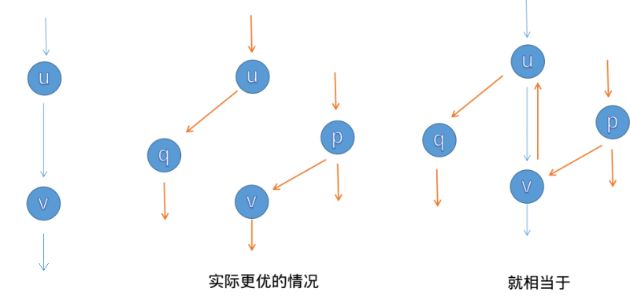
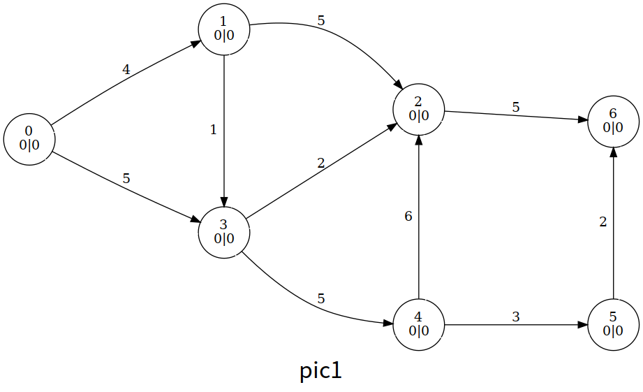
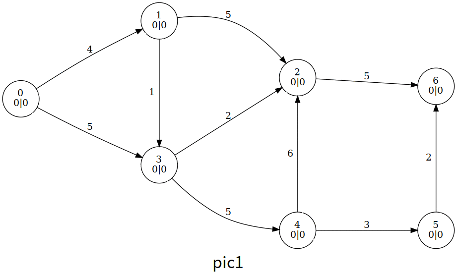
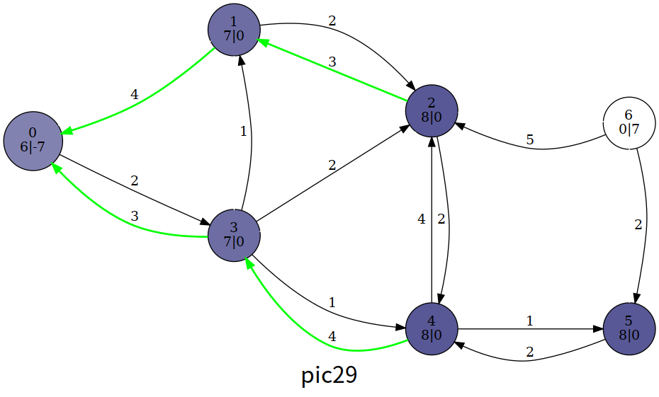
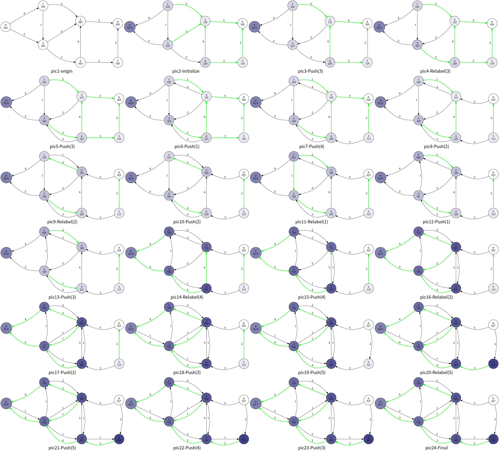

# 最大流 - OI Wiki

- Source: https://oi-wiki.org/graph/flow/max-flow/

# 最大流

本页面主要介绍最大流问题相关的算法知识．

## 概述

网络流基本概念参见 [网络流简介](../)．

令 𝐺 =(𝑉,𝐸)G=(V,E) 是一个有源汇点的网络，我们希望在 𝐺G 上指定合适的流 𝑓f，以最大化整个网络的流量 |𝑓||f|（即 ∑𝑥∈𝑉𝑓(𝑠,𝑥) −∑𝑥∈𝑉𝑓(𝑥,𝑠)∑x∈Vf(s,x)−∑x∈Vf(x,s)），这一问题被称作最大流问题（Maximum flow problem）．

## Ford–Fulkerson 增广

Ford–Fulkerson 增广是计算最大流的一类算法的总称．该方法运用贪心的思想，通过寻找增广路来更新并求解最大流．

### 概述

给定网络 𝐺G 及 𝐺G 上的流 𝑓f，我们做如下定义．

对于边 (𝑢,𝑣)(u,v)，我们将其容量与流量之差称为剩余容量 𝑐𝑓(𝑢,𝑣)cf(u,v)（Residual Capacity），即 𝑐𝑓(𝑢,𝑣) =𝑐(𝑢,𝑣) −𝑓(𝑢,𝑣)cf(u,v)=c(u,v)−f(u,v)．

我们将 𝐺G 中所有结点和剩余容量大于 00 的边构成的子图称为残量网络 𝐺𝑓Gf（Residual Network），即 𝐺𝑓 =(𝑉,𝐸𝑓)Gf=(V,Ef)，其中 𝐸𝑓 ={(𝑢,𝑣)∣𝑐𝑓(𝑢,𝑣)>0}Ef={(u,v)∣cf(u,v)>0}．

Warning

正如我们马上要提到的，流量可能是负值，因此，𝐸𝑓Ef 的边有可能并不在 𝐸E 中．引入增广的概念后，下文将具体解释这一点．

我们将 𝐺𝑓Gf 上一条从源点 𝑠s 到汇点 𝑡t 的路径称为增广路（Augmenting Path）．对于一条增广路，我们给每一条边 (𝑢,𝑣)(u,v) 都加上等量的流量，以令整个网络的流量增加，这一过程被称为增广（Augment）．由此，最大流的求解可以被视为若干次增广分别得到的流的叠加．

此外，在 Ford–Fulkerson 增广的过程中，对于每条边 (𝑢,𝑣)(u,v)，我们都新建一条反向边 (𝑣,𝑢)(v,u)．我们约定 𝑓(𝑢,𝑣) = −𝑓(𝑣,𝑢)f(u,v)=−f(v,u)，这一性质可以通过在每次增广时引入退流操作来保证，即 𝑓(𝑢,𝑣)f(u,v) 增加时 𝑓(𝑣,𝑢)f(v,u) 应当减少同等的量．

Tip

在最大流算法的代码实现中，我们往往需要支持快速访问反向边的操作．在邻接矩阵中，这一操作是 trivial 的（𝑔𝑢,𝑣 ↔𝑔𝑣,𝑢gu,v↔gv,u）．但主流的实现是更加优秀的链式前向星．其中，一个常用的技巧是，我们令边从偶数（通常为 00）开始编号，并在加边时总是紧接着加入其反向边使得它们的编号相邻．由此，我们可以令编号为 𝑖i 的边和编号为 𝑖 ⊕1i⊕1 的边始终保持互为反向边的关系．

初次接触这一方法的读者可能察觉到一个违反直觉的情形——反向边的流量 𝑓(𝑣,𝑢)f(v,u) 可能是一个负值．实际上我们可以注意到，在 Ford–Fulkerson 增广的过程中，真正有意义的是剩余容量 𝑐𝑓cf，而 𝑓(𝑣,𝑢)f(v,u) 的绝对值是无关紧要的，我们可以将反向边流量的减少视为反向边剩余容量 𝑐𝑓(𝑣,𝑢)cf(v,u) 的增加——这也与退流的意义相吻合——反向边剩余容量的增加意味着我们接下来可能通过走反向边来和原先正向的增广抵消，代表一种「反悔」的操作．

以下案例有可能帮助你理解这一过程．假设 𝐺G 是一个单位容量的网络，我们考虑以下过程：

  * 𝐺G 上有多条增广路，其中，我们选择进行一次先后经过 𝑢,𝑣u,v 的增广（如左图所示），流量增加 11．
  * 我们注意到，如果进行中图上的增广，这个局部的最大流量不是 11 而是 22．但由于指向 𝑢u 的边和从 𝑣v 出发的边在第一次增广中耗尽了容量，此时我们无法进行中图上的增广．这意味着我们当前的流是不够优的，但局部可能已经没有其他（只经过原图中的边而不经过反向边的）增广路了．
  * 现在引入退流操作．第一次增广后，退流意味着 𝑐𝑓(𝑣,𝑢)cf(v,u) 增加了 11 剩余容量，即相当于新增 (𝑣,𝑢)(v,u) 这条边，因此我们可以再进行一次先后经过 𝑝,𝑣,𝑢,𝑞p,v,u,q 的增广（如右图橙色路径所示）．无向边 (𝑢,𝑣)(u,v) 上的流量在两次增广中抵消，我们惊奇地发现两次增广叠加得到的结果实际上和中图是等价的．



以上案例告诉我们，退流操作带来的「抵消」效果使得我们无需担心我们按照「错误」的顺序选择了增广路．

容易发现，只要 𝐺𝑓Gf 上存在增广路，那么对其增广就可以令总流量增加；否则说明总流量已经达到最大可能值，求解过程完成．这就是 Ford–Fulkerson 增广的过程．

### 最大流最小割定理

我们大致了解了 Ford–Fulkerson 增广的思想，可是如何证明这一方法的正确性呢？为什么增广结束后的流 𝑓f 是一个最大流？

实际上，Ford–Fulkerson 增广的正确性和最大流最小割定理（The Maxflow-Mincut Theorem）等价．这一定理指出，对于任意网络 𝐺 =(𝑉,𝐸)G=(V,E)，其上的最大流 𝑓f 和最小割 {𝑆,𝑇}{S,T} 总是满足 |𝑓| =||𝑆,𝑇|||f|=||S,T||．

为了证明最大流最小割定理，我们先从一个引理出发：对于网络 𝐺 =(𝑉,𝐸)G=(V,E)，任取一个流 𝑓f 和一个割 {𝑆,𝑇}{S,T}，总是有 |𝑓| ≤||𝑆,𝑇|||f|≤||S,T||，其中等号成立当且仅当 {(𝑢,𝑣)|𝑢 ∈𝑆,𝑣 ∈𝑇}{(u,v)|u∈S,v∈T} 的所有边均满流，且 {(𝑢,𝑣)|𝑢 ∈𝑇,𝑣 ∈𝑆}{(u,v)|u∈T,v∈S} 的所有边均空流．

证明 |𝑓|=𝑓(𝑠)=∑𝑢∈𝑆𝑓(𝑢)=∑𝑢∈𝑆(∑𝑣∈𝑉𝑓(𝑢,𝑣)−∑𝑣∈𝑉𝑓(𝑣,𝑢))=∑𝑢∈𝑆(∑𝑣∈𝑇𝑓(𝑢,𝑣)+∑𝑣∈𝑆𝑓(𝑢,𝑣)−∑𝑣∈𝑇𝑓(𝑣,𝑢)−∑𝑣∈𝑆𝑓(𝑣,𝑢))=∑𝑢∈𝑆(∑𝑣∈𝑇𝑓(𝑢,𝑣)−∑𝑣∈𝑇𝑓(𝑣,𝑢))+∑𝑢∈𝑆∑𝑣∈𝑆𝑓(𝑢,𝑣)−∑𝑢∈𝑆∑𝑣∈𝑆𝑓(𝑣,𝑢)=∑𝑢∈𝑆(∑𝑣∈𝑇𝑓(𝑢,𝑣)−∑𝑣∈𝑇𝑓(𝑣,𝑢))≤∑𝑢∈𝑆∑𝑣∈𝑇𝑓(𝑢,𝑣)≤∑𝑢∈𝑆∑𝑣∈𝑇𝑐(𝑢,𝑣)=||𝑆,𝑇|||f|=f(s)=∑u∈Sf(u)=∑u∈S(∑v∈Vf(u,v)−∑v∈Vf(v,u))=∑u∈S(∑v∈Tf(u,v)+∑v∈Sf(u,v)−∑v∈Tf(v,u)−∑v∈Sf(v,u))=∑u∈S(∑v∈Tf(u,v)−∑v∈Tf(v,u))+∑u∈S∑v∈Sf(u,v)−∑u∈S∑v∈Sf(v,u)=∑u∈S(∑v∈Tf(u,v)−∑v∈Tf(v,u))≤∑u∈S∑v∈Tf(u,v)≤∑u∈S∑v∈Tc(u,v)=||S,T||

为了取等，第一个不等号需要 {(𝑢,𝑣) ∣𝑢 ∈𝑇,𝑣 ∈𝑆}{(u,v)∣u∈T,v∈S} 的所有边均空流，第二个不等号需要 {(𝑢,𝑣) ∣𝑢 ∈𝑆,𝑣 ∈𝑇}{(u,v)∣u∈S,v∈T} 的所有边均满流．原引理得证．

那么，对于任意网络，以上取等条件是否总是能被满足呢？如果答案是肯定的，则最大流最小割定理得证．以下我们尝试证明．

证明

假设某一轮增广后，我们得到流 𝑓f 使得 𝐺𝑓Gf 上不存在增广路，即 𝐺𝑓Gf 上不存在 𝑠s 到 𝑡t 的路径．此时我们记从 𝑠s 出发可以到达的结点组成的点集为 𝑆S，并记 𝑇 =𝑉 ∖𝑆T=V∖S．

显然，{𝑆,𝑇}{S,T} 是 𝐺𝑓Gf 的一个割，且 ||𝑆,𝑇|| =∑𝑢∈𝑆∑𝑣∈𝑇𝑐𝑓(𝑢,𝑣) =0||S,T||=∑u∈S∑v∈Tcf(u,v)=0．由于剩余容量是非负的，这也意味着对于任意 𝑢 ∈𝑆,𝑣 ∈𝑇,(𝑢,𝑣) ∈𝐸𝑓u∈S,v∈T,(u,v)∈Ef，均有 𝑐𝑓(𝑢,𝑣) =0cf(u,v)=0．以下我们将这些边分为存在于原图中的边和反向边两种情况讨论：

  * (𝑢,𝑣) ∈𝐸(u,v)∈E：此时，𝑐𝑓(𝑢,𝑣) =𝑐(𝑢,𝑣) −𝑓(𝑢,𝑣) =0cf(u,v)=c(u,v)−f(u,v)=0，因此有 𝑐(𝑢,𝑣) =𝑓(𝑢,𝑣)c(u,v)=f(u,v)，即 {(𝑢,𝑣) ∣𝑢 ∈𝑆,𝑣 ∈𝑇}{(u,v)∣u∈S,v∈T} 的所有边均满流；
  * (𝑣,𝑢) ∈𝐸(v,u)∈E：此时，𝑐𝑓(𝑢,𝑣) =𝑐(𝑢,𝑣) −𝑓(𝑢,𝑣) =0 −𝑓(𝑢,𝑣) =𝑓(𝑣,𝑢) =0cf(u,v)=c(u,v)−f(u,v)=0−f(u,v)=f(v,u)=0，即 {(𝑣,𝑢) ∣𝑢 ∈𝑆,𝑣 ∈𝑇}{(v,u)∣u∈S,v∈T} 的所有边均空流．

因此，增广停止后，上述流 𝑓f 满足取等条件．根据引理指出的大小关系，自然地，𝑓f 是 𝐺G 的一个最大流，{𝑆,𝑇}{S,T} 是 𝐺G 的一个最小割．

容易看出，Kőnig 定理是最大流最小割定理的特殊情形．实际上，它们都和线性规划中的对偶有关．

### 时间复杂度分析

在整数流量的网络 𝐺 =(𝑉,𝐸)G=(V,E) 上，平凡地，我们假设每次增广的流量都是整数，则 Ford–Fulkerson 增广的时间复杂度的一个上界是 𝑂(|𝐸||𝑓|)O(|E||f|)，其中 𝑓f 是 𝐺G 上的最大流．这是因为单轮增广的时间复杂度是 𝑂(|𝐸|)O(|E|)，而增广会导致总流量增加，故增广轮数不可能超过 |𝑓||f|．

对于 Ford–Fulkerson 增广的不同实现，时间复杂度也各不相同．其中较主流的实现有 Edmonds–Karp, Dinic, SAP, ISAP 等算法，我们将在下文中分别介绍．

### Edmonds–Karp 算法

#### 算法思想

如何在 𝐺𝑓Gf 中寻找增广路呢？当我们考虑 Ford–Fulkerson 增广的具体实现时，最自然的方案就是使用 BFS．此时，Ford–Fulkerson 增广表现为 Edmonds–Karp 算法．其具体流程如下：

  * 如果在 𝐺𝑓Gf 上我们可以从 𝑠s 出发 BFS 到 𝑡t，则我们找到了新的增广路．

  * 对于增广路 𝑝p，我们计算出 𝑝p 经过的边的剩余容量的最小值 Δ =min(𝑢,𝑣)∈𝑝𝑐𝑓(𝑢,𝑣)Δ=min(u,v)∈pcf(u,v)．我们给 𝑝p 上的每条边都加上 ΔΔ 流量，并给它们的反向边都退掉 ΔΔ 流量，令最大流增加了 ΔΔ．

  * 因为我们修改了流量，所以我们得到新的 𝐺𝑓Gf，我们在新的 𝐺𝑓Gf 上重复上述过程，直至增广路不存在，则流量不再增加．

以上算法即 Edmonds–Karp 算法．

#### 时间复杂度分析

接下来让我们尝试分析 Edmonds–Karp 算法的时间复杂度．

显然，单轮 BFS 增广的时间复杂度是 𝑂(|𝐸|)O(|E|)．

增广总轮数的上界是 𝑂(|𝑉||𝐸|)O(|V||E|)．这一论断在网络资料中常被伪证（或被含糊其辞略过）．以下我们尝试给出一个较正式的证明1．

增广总轮数的上界的证明

首先，我们引入一个引理——最短路非递减引理．具体地，我们记 𝑑𝑓(𝑢)df(u) 为 𝐺𝑓Gf 上结点 𝑢u 到源点 𝑠s 的距离（即最短路长度，下同）．对于某一轮增广，我们用 𝑓f 和 𝑓′f′ 分别表示增广前的流和增广后的流，我们断言，对于任意结点 𝑢u，增广总是使得 𝑑𝑓′(𝑢) ≥𝑑𝑓(𝑢)df′(u)≥df(u)．我们将在稍后证明这一引理．

不妨称增广路上剩余容量最小的边是饱和边（存在多条边同时最小则取任一）．如果一条有向边 (𝑢,𝑣)(u,v) 被选为饱和边，增广会清空其剩余容量导致饱和边的消失，并且退流导致反向边的新增（如果原先反向边不存在），即 (𝑢,𝑣) ∉𝐸𝑓′(u,v)∉Ef′ 且 (𝑣,𝑢) ∈𝐸𝑓′(v,u)∈Ef′．以上分析使我们知道，对于无向边 (𝑢,𝑣)(u,v)，其被增广的两种方向总是交替出现．

在 𝐺𝑓Gf 上沿 (𝑢,𝑣)(u,v) 增广时，𝑑𝑓(𝑢) +1 =𝑑𝑓(𝑣)df(u)+1=df(v)，此后残量网络变为 𝐺𝑓′Gf′．在 𝐺𝑓′Gf′ 上沿 (𝑣,𝑢)(v,u) 增广时，𝑑𝑓′(𝑣) +1 =𝑑𝑓′(𝑢)df′(v)+1=df′(u)．根据最短路非递减引理又有 𝑑𝑓′(𝑣) ≥𝑑𝑓(𝑣)df′(v)≥df(v)，我们连接所有式子，得到 𝑑𝑓′(𝑢) ≥𝑑𝑓(𝑢) +2df′(u)≥df(u)+2．换言之，如果有向边 (𝑢,𝑣)(u,v) 被选为饱和边，那么与其上一次被选为饱和边时相比，𝑢u 到 𝑠s 的距离至少增加 22．

𝑠s 到任意结点的距离不可能超过 |𝑉||V|，结合上述性质，我们发现每条边被选为饱和边的次数是 𝑂(|𝑉|)O(|V|) 的，与边数相乘后得到增广总轮数的上界 𝑂(|𝑉||𝐸|)O(|V||E|)．

接下来我们证明最短路非递减引理，即 𝑑𝑓′(𝑢) ≥𝑑𝑓(𝑢)df′(u)≥df(u)．这一证明并不难，但可能稍显绕口，读者可以停下来认真思考片刻．

最短路非递减引理的证明

考虑反证．对于某一轮增广，我们假设存在若干结点，它们在该轮增广后到 𝑠s 的距离较增广前减小．我们记 𝑣v 为其中到 𝑠s 的距离最小的一者（即 𝑣 =arg⁡min𝑥∈𝑉,𝑑𝑓′(𝑥)<𝑑𝑓(𝑥)𝑑𝑓′(𝑥)v=arg⁡minx∈V,df′(x)<df(x)df′(x)）．注意，根据反证假设，此时 𝑑𝑓′(𝑣) <𝑑𝑓(𝑣)df′(v)<df(v) 是已知条件．

在 𝐺𝑓′Gf′ 中 𝑠s 到 𝑣v 的最短路上，我们记 𝑢u 是 𝑣v 的上一个结点，即 𝑑𝑓′(𝑢) +1 =𝑑𝑓′(𝑣)df′(u)+1=df′(v)．

为了不让 𝑢u 破坏 𝑣v 的「距离最小」这一性质，𝑢u 必须满足 𝑑𝑓′(𝑢) ≥𝑑𝑓(𝑢)df′(u)≥df(u)．

对于上式，我们令不等号两侧同加，得 𝑑𝑓′(𝑣) ≥𝑑𝑓(𝑢) +1df′(v)≥df(u)+1．根据反证假设进行放缩，我们得到 𝑑𝑓(𝑣) >𝑑𝑓(𝑢) +1df(v)>df(u)+1．

以下我们尝试讨论 (𝑢,𝑣)(u,v) 上的增广方向．

  * 假设有向边 (𝑢,𝑣) ∈𝐸𝑓(u,v)∈Ef．根据 BFS「广度优先」的性质，我们有 𝑑𝑓(𝑢) +1 ≥𝑑𝑓(𝑣)df(u)+1≥df(v)．该式与放缩结果冲突，导出矛盾．
  * 假设有向边 (𝑢,𝑣) ∉𝐸𝑓(u,v)∉Ef．根据 𝑢u 的定义我们已知 (𝑢,𝑣) ∈𝐸𝑓′(u,v)∈Ef′，因此这条边的存在必须是当前轮次的增广经过了 (𝑣,𝑢)(v,u) 并退流产生反向边的结果，也即 𝑑𝑓(𝑣) +1 =𝑑𝑓(𝑢)df(v)+1=df(u)．该式与放缩结果冲突，导出矛盾．

由于 (𝑢,𝑣)(u,v) 沿任何方向增广都会导出矛盾，我们知道反证假设不成立，最短路非递减引理得证．

将单轮 BFS 增广的复杂度与增广轮数的上界相乘，我们得到 Edmonds–Karp 算法的时间复杂度是 𝑂(|𝑉||𝐸|2)O(|V||E|2)．

#### 代码实现

Edmonds–Karp 算法的可能实现如下．

参考代码

```text 1 2 3 4 5 6 7 8 9 10 11 12 13 14 15 16 17 18 19 20 21 22 23 24 25 26 27 28 29 30 31 32 33 34 35 36 37 38 39 40 41 42 43 44 45 46 47 48 49 50 51 52 53 54 55 56 57 58 59 60 61 62 ``` |  ```text constexpr int MAXN = 250 ; constexpr int INF = 0x3f3f3f3f ; struct Edge { int from , to , cap , flow ; Edge ( int u , int v , int c , int f ) : from ( u ), to ( v ), cap ( c ), flow ( f ) {} }; struct EK { int n , m ; // n：点数，m：边数 vector < Edge > edges ; // edges：所有边的集合 vector < int > G [ MAXN ]; // G：点 x -> x 的所有边在 edges 中的下标 int a [ MAXN ], p [ MAXN ]; // a：点 x -> BFS 过程中最近接近点 x 的边给它的最大流 // p：点 x -> BFS 过程中最近接近点 x 的边 void init ( int n ) { for ( int i = 0 ; i < n ; i ++ ) G [ i ]. clear (); edges . clear (); } void AddEdge ( int from , int to , int cap ) { edges . push_back ( Edge ( from , to , cap , 0 )); edges . push_back ( Edge ( to , from , 0 , 0 )); m = edges . size (); G [ from ]. push_back ( m \- 2 ); G [ to ]. push_back ( m \- 1 ); } int Maxflow ( int s , int t ) { int flow = 0 ; for (;;) { memset ( a , 0 , sizeof ( a )); queue < int > Q ; Q . push ( s ); a [ s ] = INF ; while ( ! Q . empty ()) { int x = Q . front (); Q . pop (); for ( int i = 0 ; i < G [ x ]. size (); i ++ ) { // 遍历以 x 作为起点的边 Edge & e = edges [ G [ x ][ i ]]; if ( ! a [ e . to ] && e . cap > e . flow ) { p [ e . to ] = G [ x ][ i ]; // G[x][i] 是最近接近点 e.to 的边 a [ e . to ] = min ( a [ x ], e . cap \- e . flow ); // 最近接近点 e.to 的边赋给它的流 Q . push ( e . to ); } } if ( a [ t ]) break ; // 如果汇点接受到了流，就退出 BFS } if ( ! a [ t ]) break ; // 如果汇点没有接受到流，说明源点和汇点不在同一个连通分量上 for ( int u = t ; u != s ; u = edges [ p [ u ]]. from ) { // 通过 u 追寻 BFS 过程中 s -> t 的路径 edges [ p [ u ]]. flow += a [ t ]; // 增加路径上边的 flow 值 edges [ p [ u ] ^ 1 ]. flow -= a [ t ]; // 减小反向路径的 flow 值 } flow += a [ t ]; } return flow ; } }; ```   
---|---  
  
### Dinic 算法

#### 算法思想

考虑在增广前先对 𝐺𝑓Gf 做 BFS 分层，即根据结点 𝑢u 到源点 𝑠s 的距离 𝑑(𝑢)d(u) 把结点分成若干层．令经过 𝑢u 的流量只能流向下一层的结点 𝑣v，即删除 𝑢u 向层数标号相等或更小的结点的出边，我们称 𝐺𝑓Gf 剩下的部分为层次图（Level Graph）．形式化地，我们称 𝐺𝐿 =(𝑉,𝐸𝐿)GL=(V,EL) 是 𝐺𝑓 =(𝑉,𝐸𝑓)Gf=(V,Ef) 的层次图，其中 𝐸𝐿 ={(𝑢,𝑣)∣(𝑢,𝑣)∈𝐸𝑓,𝑑(𝑢)+1=𝑑(𝑣)}EL={(u,v)∣(u,v)∈Ef,d(u)+1=d(v)}．

如果我们在层次图 𝐺𝐿GL 上找到一个极大的增广流 𝑓𝑏fb，使得仅在 𝐺𝐿GL 上是不可能进一步扩大流 𝑓𝑏fb 的，则我们称 𝑓𝑏fb 是 𝐺𝐿GL 的阻塞流（Blocking Flow）．

Warning

尽管在上文中我们仅在单条增广路上定义了增广/增广流，广义地，「增广」一词不仅可以用于单条路径上的增广流，也可以用于若干增广流的并——后者才是我们定义阻塞流时使用的意义．

定义层次图和阻塞流后，Dinic 算法的流程如下．

  1. 在 𝐺𝑓Gf 上 BFS 出层次图 𝐺𝐿GL．
  2. 在 𝐺𝐿GL 上 DFS 出阻塞流 𝑓𝑏fb．
  3. 将 𝑓𝑏fb 并到原先的流 𝑓f 中，即 𝑓 ←𝑓 +𝑓𝑏f←f+fb．
  4. 重复以上过程直到不存在从 𝑠s 到 𝑡t 的路径．

此时的 𝑓f 即为最大流．

在分析这一算法的复杂度之前，我们需要特别说明「在 𝐺𝐿GL 上 DFS 出阻塞流 𝑓𝑏fb」的过程．尽管 BFS 层次图对于本页面的读者应当是 trivial 的，但 DFS 阻塞流的过程则稍需技巧——我们需要引入当前弧优化．

注意到在 𝐺𝐿GL 上 DFS 的过程中，如果结点 𝑢u 同时具有大量入边和出边，并且 𝑢u 每次接受来自入边的流量时都遍历出边表来决定将流量传递给哪条出边，则 𝑢u 这个局部的时间复杂度最坏可达 𝑂(|𝐸|2)O(|E|2)．为避免这一缺陷，如果某一时刻我们已经知道边 (𝑢,𝑣)(u,v) 已经增广到极限（边 (𝑢,𝑣)(u,v) 已无剩余容量或 𝑣v 的后侧已增广至阻塞），则 𝑢u 的流量没有必要再尝试流向出边 (𝑢,𝑣)(u,v)．据此，对于每个结点 𝑢u，我们维护 𝑢u 的出边表中第一条还有必要尝试的出边．习惯上，我们称维护的这个指针为当前弧，称这个做法为当前弧优化．

多路增广

多路增广是 Dinic 算法的一个常数优化——如果我们在层次图上找到了一条从 𝑠s 到 𝑡t 的增广路 𝑝p，则接下来我们未必需要重新从 𝑠s 出发找下一条增广路，而可能从 𝑝p 上最后一个仍有剩余容量的位置出发寻找一条岔路进行增广．考虑到其与回溯形式的一致性，这一优化在 DFS 的代码实现中也是自然的．

常见误区

可能是由于大量网络资料的错误表述引发以讹传讹的情形，相当数量的选手喜欢将当前弧优化和多路增广并列称为 Dinic 算法的两种优化．实际上，当前弧优化是用于保证 Dinic 时间复杂度正确性的一部分，而多路增广只是一个不影响复杂度的常数优化．

#### 时间复杂度分析

应用当前弧优化后，对 Dinic 算法的时间复杂度分析如下．

首先，我们尝试证明单轮增广中 DFS 求阻塞流的时间复杂度是 𝑂(|𝑉||𝐸|)O(|V||E|)．

单轮增广的时间复杂度的证明

考虑阻塞流 𝑓𝑏fb 中的每条增广路，它们都是在 𝐺𝐿GL 上每次沿当前弧跳转而得到的结果，其中每条增广路经历的跳转次数不可能多于 |𝑉||V|．

每找到一条增广路就有一条饱和边消失（剩余容量清零）．考虑阻塞流 𝑓𝑏fb 中的每条增广路，我们将被它们清零的饱和边形成的边集记作 𝐸1E1．考虑到 𝐺𝐿GL 分层的性质，饱和边消失后其反向边不可能在同一轮增广内被其他增广路经过，因此，𝐸1E1 是 𝐸𝐿EL 的子集．

此外，对于沿当前弧跳转但由于某个位置阻塞所以没有成功得到增广路的情形，我们将这些不完整的路径上的最后一条边形成的边集记作 𝐸2E2．𝐸2E2 的成员不饱和，所以 𝐸1E1 与 𝐸2E2 不交，且 𝐸1 ∪𝐸2E1∪E2 仍是 𝐸𝐿EL 的子集．

由于 𝐸1 ∪𝐸2E1∪E2 的每个成员都没有花费超过 |𝑉||V| 次跳转（且在使用多路增广优化后一些跳转将被重复计数），因此，综上所述，DFS 过程中的总跳转次数不可能多于 |𝑉||𝐸𝐿||V||EL|．

常见伪证一则

对于每个结点，我们维护下一条可以增广的边，而当前弧最多变化 |𝐸||E| 次，从而单轮增广的最坏时间复杂度为 𝑂(|𝑉||𝐸|)O(|V||E|)．

Bug

「当前弧最多变化 |𝐸||E| 次」并不能推得「每个结点最多访问其出边 |𝐸||E| 次」．这是因为，访问当前弧并不一定耗尽上面的剩余容量，结点 𝑢u 可能多次访问同一条当前弧．

注意到层次图的层数显然不可能超过 |𝑉||V|，如果我们可以证明层次图的层数在增广过程中严格单增，则 Dinic 算法的增广轮数是 𝑂(|𝑉|)O(|V|) 的．接下来我们尝试证明这一结论2．

层次图层数单调性的证明

我们需要引入预流推进类算法（另一类最大流算法）中的一个概念——高度标号．为了更方便地结合高度标号表述我们的证明，在证明过程中，我们令 𝑑𝑓(𝑢)df(u) 为 𝐺𝑓Gf 上结点 𝑢u 到 **汇点** 𝑡t 的距离，从 **汇点** 而非源点出发进行分层（这并没有本质上的区别）．对于某一轮增广，我们用 𝑓f 和 𝑓′f′ 分别表示增广前的流和增广后的流．在该轮增广中求解并加入阻塞流后，记层次图由 𝐺𝐿 =(𝑉,𝐸𝐿)GL=(V,EL) 变为 𝐺′𝐿 =(𝑉,𝐸′𝐿)GL′=(V,EL′)．

我们给高度标号一个不严格的临时定义——在网络 𝐺 =(𝑉,𝐸)G=(V,E) 上，令 ℎh 是点集 𝑉V 到整数集 𝑁N 上的函数，ℎh 是 𝐺G 上合法的高度标号当且仅当 ℎ(𝑢) ≤ℎ(𝑣) +1h(u)≤h(v)+1 对于 (𝑢,𝑣) ∈𝐸(u,v)∈E 恒成立．

考察所有 𝐸𝑓′Ef′ 的成员 (𝑢,𝑣)(u,v)，我们发现 (𝑢,𝑣) ∈𝐸𝑓′(u,v)∈Ef′ 的原因是以下二者之一．

  * (𝑢,𝑣) ∈𝐸𝑓(u,v)∈Ef，且剩余容量在该轮增广过程中未耗尽——根据最短路的定义，此时我们有 𝑑𝑓(𝑢) ≤𝑑𝑓(𝑣) +1df(u)≤df(v)+1；
  * (𝑢,𝑣) ∉𝐸𝑓(u,v)∉Ef，但在该轮增广过程中阻塞流经过 (𝑣,𝑢)(v,u) 并退流产生反向边——根据层次图和阻塞流的定义，此时我们有 𝑑𝑓(𝑢) +1 =𝑑𝑓(𝑣)df(u)+1=df(v)．

以上观察让我们得出一个结论——𝑑𝑓df 在 𝐺𝑓′Gf′ 上是一个合法的高度标号．当然，在 𝐺𝑓′Gf′ 的子图 𝐺′𝐿GL′ 上也是．

现在，对于一条 𝐺′𝐿GL′ 上的增广路 𝑝 =(𝑠,…,𝑢,𝑣,…,𝑡)p=(s,…,u,v,…,t)，按照 𝑝p 上结点的反序（从 𝑡t 到 𝑠s 的顺序）考虑从空路径开始每次添加一个结点的过程．假设结点 𝑣v 已加入，结点 𝑢u 正在加入，我们发现，加入结点 𝑢u 后，根据层次图的定义，𝑑𝑓′(𝑢)df′(u) 的值较 𝑑𝑓′(𝑣)df′(v) 增加 11；与此同时，由于 𝑑𝑓df 是 𝐺′𝐿GL′ 上的高度标号，𝑑𝑓(𝑢)df(u) 的值既可能较 𝑑𝑓(𝑣)df(v) 增加 11，也可能保持不变或减少．因此，在整条路径被添加完成后，我们得到 𝑑𝑓′(𝑠) ≥𝑑𝑓(𝑠)df′(s)≥df(s)，其中取等的充要条件是 𝑑𝑓(𝑢) =𝑑𝑓(𝑣) +1df(u)=df(v)+1 对于 (𝑢,𝑣) ∈𝑝(u,v)∈p 恒成立．如果该不等式不能取等，则有 𝑑𝑓′(𝑠) >𝑑𝑓(𝑠)df′(s)>df(s)——即我们想要的结论「层次图的层数在增广过程中严格单增」．以下我们尝试证明该不等式不能取等．

考虑反证，我们假设 𝑑𝑓′(𝑠) =𝑑𝑓(𝑠)df′(s)=df(s) 成立，并尝试导出矛盾．现在我们断言，在 𝐺′𝐿GL′ 上，𝑝p 至少包含一条边 (𝑢,𝑣)(u,v) 满足 (𝑢,𝑣)(u,v) 在 𝐺𝐿GL 上不存在．如果没有这样的边，考虑到 𝑑𝑓(𝑠) =𝑑𝑓′(𝑠)df(s)=df′(s)，结合层次图和阻塞流的定义，𝐺𝐿GL 上的增广应尚未完成．为了不产生以上矛盾，我们的断言只好是正确的．

令 (𝑢,𝑣)(u,v) 是满足断言条件的那条边，其满足断言的原因只能是以下二者之一．

  * (𝑢,𝑣) ∈𝐸𝑓(u,v)∈Ef 但 𝑑𝑓(𝑢) ≤𝑑𝑓(𝑣) +1df(u)≤df(v)+1 未取等，故根据层次图的定义可知 (𝑢,𝑣) ∉𝐸𝐿(u,v)∉EL，并在增广后新一轮重分层中被加入到 𝐸′𝐿EL′ 中；
  * (𝑢,𝑣) ∉𝐸𝑓(u,v)∉Ef，这意味着 (𝑢,𝑣)(u,v) 这条边的产生是当前轮次增广中阻塞流经过 (𝑣,𝑢)(v,u) 并退流产生反向边的结果，也即 𝑑𝑓(𝑢) =𝑑𝑓(𝑣) −1df(u)=df(v)−1．

由于我们无论以何种方式满足断言均得到 𝑑𝑓(𝑢) ≠𝑑𝑓(𝑣) +1df(u)≠df(v)+1，也即 𝑑𝑓′(𝑠) ≥𝑑𝑓(𝑠)df′(s)≥df(s) 取等的充要条件无法被满足，这与反证假设 𝑑𝑓′(𝑠) =𝑑𝑓(𝑠)df′(s)=df(s) 冲突，原命题得证．

常见伪证另一则

考虑反证．假设层次图的层数在一轮增广结束后较原先相等，则层次图上应仍存在至少一条从 𝑠s 到 𝑡t 的增广路满足相邻两点间的层数差为 11．这条增广路未被增广说明该轮增广尚未结束．为了不产生上述矛盾，原命题成立．

Bug

「一轮增广结束后新的层次图上 𝑠s-𝑡t 最短路较原先相等」并不能推得「旧的层次图上该轮增广尚未结束」．这是因为，没有理由表明两张层次图的边集相同，新的层次图上的 𝑠s-𝑡t 最短路有可能经过旧的层次图上不存在的边．

将单轮增广的时间复杂度 𝑂(|𝑉||𝐸|)O(|V||E|) 与增广轮数 𝑂(|𝑉|)O(|V|) 相乘，Dinic 算法的时间复杂度是 𝑂(|𝑉|2|𝐸|)O(|V|2|E|)．

如果需要令 Dinic 算法的实际运行时间接近其理论上界，我们需要构造有特殊性质的网络作为输入．由于在算法竞赛实践中，对于网络流知识相关的考察常侧重于将原问题建模为网络流问题的技巧．此时，我们的建模通常不包含令 Dinic 算法执行缓慢的特殊性质；恰恰相反，Dinic 算法在大部分图上效率非常优秀．因此，网络流问题的数据范围通常较大，「将 |𝑉|,|𝐸||V|,|E| 的值代入 |𝑉|2|𝐸||V|2|E| 以估计运行时间」这一方式并不适用．实际上，进行准确的估计需要选手对 Dinic 算法的实际效率有一定的经验，读者可以多加练习．

#### 特殊情形下的时间复杂度分析

在一些性质良好的图上，Dinic 算法有更好的时间复杂度．

对于网络 𝐺 =(𝑉,𝐸)G=(V,E)，如果其所有边容量均为 11，即 𝑐(𝑢,𝑣) ∈{0,1}c(u,v)∈{0,1} 对于 (𝑢,𝑣) ∈𝐸(u,v)∈E 恒成立，则我们称 𝐺G 是单位容量（Unit Capacity）的．

在单位容量的网络中，Dinic 算法的单轮增广的时间复杂度为 𝑂(|𝐸|)O(|E|)．

证明

这是因为，每次增广都会导致增广路上的所有边均饱和并消失，故单轮增广中每条边只能被增广一次．

在单位容量的网络中，Dinic 算法的增广轮数是 𝑂(|𝐸|12)O(|E|12) 的．

证明

以源点 𝑠s 为中心分层，记 𝑑𝑓(𝑢)df(u) 为 𝐺𝑓Gf 上结点 𝑢u 到源点 𝑠s 的距离．另外，我们定义将点集 {𝑢∣𝑢∈𝑉,𝑑𝑓(𝑢)=𝑘}{u∣u∈V,df(u)=k} 定义为编号为 𝑘k 的层次 𝐷𝑘Dk，并记 𝑆𝑘 = ∪𝑖≤𝑘𝐷𝑖Sk=∪i≤kDi．

假设我们已经进行了 |𝐸|12|E|12 轮增广．根据鸽巢原理，至少存在一个 𝑘k 满足边集 {(𝑢,𝑣)∣𝑢∈𝐷𝑘,𝑣∈𝐷𝑘+1,(𝑢,𝑣)∈𝐸𝑓}{(u,v)∣u∈Dk,v∈Dk+1,(u,v)∈Ef} 的大小不超过 |𝐸||𝐸|12 ≈|𝐸|12|E||E|12≈|E|12．显然，{𝑆𝑘,𝑉 −𝑆𝑘}{Sk,V−Sk} 是 𝐺𝑓Gf 上的 𝑠s-𝑡t 割，且其割容量不超过 |𝐸|12|E|12．根据最大流最小割定理，𝐺𝑓Gf 上的最大流不超过 |𝐸|12|E|12，也即 𝐺𝑓Gf 上最多还能执行 |𝐸|12|E|12 轮增广．因此，总增广轮数是 𝑂(|𝐸|12)O(|E|12) 的．

在单位容量的网络中，Dinic 算法的增广轮数是 𝑂(|𝑉|23)O(|V|23) 的．

证明

假设我们已经进行了 2|𝑉|232|V|23 轮增广．由于至多有半数的（|𝑉|23|V|23 个）层次包含多于 |𝑉|13|V|13 个点，故无论我们如何分配所有层次的大小，至少存在一个 𝑘k 满足相邻两个层次同时包含不多于 |𝑉|13|V|13 个点，即 |𝐷𝑘| ≤|𝑉|13|Dk|≤|V|13 且 |𝐷𝑘+1| ≤|𝑉|13|Dk+1|≤|V|13．

为最大化 𝐷𝑘Dk 和 𝐷𝑘+1Dk+1 之间的边数，我们假定这是一个完全二分图，此时边集 {(𝑢,𝑣)∣𝑢∈𝐷𝑘,𝑣∈𝐷𝑘+1,(𝑢,𝑣)∈𝐸𝑓}{(u,v)∣u∈Dk,v∈Dk+1,(u,v)∈Ef} 的大小不超过 |𝑉|23|V|23．显然，{𝑆𝑘,𝑉 −𝑆𝑘}{Sk,V−Sk} 是 𝐺𝑓Gf 上的 𝑠s-𝑡t 割，且其割容量不超过 |𝑉|23|V|23．根据最大流最小割定理，𝐺𝑓Gf 上的最大流不超过 |𝑉|23|V|23，也即 𝐺𝑓Gf 上最多还能执行 |𝑉|23|V|23 轮增广．因此，总增广轮数是 𝑂(|𝑉|23)O(|V|23) 的．

在单位容量的网络中，如果除源汇点外每个结点 𝑢u 都满足 degin(𝑢) =1degin(u)=1 或 degout(𝑢) =1degout(u)=1，则 Dinic 算法的增广轮数是 𝑂(|𝑉|12)O(|V|12) 的．其中，degin(𝑢)degin(u) 和 degout(𝑢)degout(u) 分别代表结点 𝑢u 的入度和出度．

证明

我们引入以下引理——对于这一形式的网络，其上的任意流总是可以分解成若干条单位流量的、**点不交** 的增广路．

假设我们已经进行了 |𝑉|12|V|12 轮增广．根据层次图的定义，此时任意新的增广路的长度至少为 |𝑉|12|V|12．

考虑 𝐺𝑓Gf 上的最大流的增广路分解，我们得到的增广路的数量不能多于 |𝑉||𝑉|12 ≈|𝑉|12|V||V|12≈|V|12，这意味着 𝐺𝑓Gf 上最多还能执行 |𝑉|12|V|12 轮增广．因此，总增广轮数是 𝑂(|𝑉|12)O(|V|12) 的．

综上，我们得出一些推论．

  * 在单位容量的网络上，Dinic 算法的总时间复杂度是 𝑂(|𝐸|min(|𝐸|12,|𝑉|23))O(|E|min(|E|12,|V|23))．
  * 在单位容量的网络上，如果除源汇点外每个结点 𝑢u 都满足 degin(𝑢) =1degin(u)=1 或 degout(𝑢) =1degout(u)=1，Dinic 算法的总时间复杂度是 𝑂(|𝐸||𝑉|12)O(|E||V|12)．对于二分图最大匹配问题，我们常使用 Hopcroft–Karp 算法解决，而这一算法实际上是 Dinic 算法在满足上述度数限制的单位容量网络上的特例．

#### 代码实现

参考代码

```text 1 2 3 4 5 6 7 8 9 10 11 12 13 14 15 16 17 18 19 20 21 22 23 24 25 26 27 28 29 30 31 32 33 34 35 36 37 38 39 40 41 42 43 44 45 46 47 48 49 50 51 52 53 54 55 56 57 58 59 60 61 62 63 64 65 66 67 ``` |  ```text struct MF { struct edge { int v , nxt , cap , flow ; } e [ N ]; int fir [ N ], cnt = 0 ; int n , S , T ; ll maxflow = 0 ; int dep [ N ], cur [ N ]; void init () { memset ( fir , -1 , sizeof fir ); cnt = 0 ; } void addedge ( int u , int v , int w ) { e [ cnt ] = { v , fir [ u ], w , 0 }; fir [ u ] = cnt ++ ; e [ cnt ] = { u , fir [ v ], 0 , 0 }; fir [ v ] = cnt ++ ; } bool bfs () { queue < int > q ; memset ( dep , 0 , sizeof ( int ) * ( n \+ 1 )); dep [ S ] = 1 ; q . push ( S ); while ( q . size ()) { int u = q . front (); q . pop (); for ( int i = fir [ u ]; ~ i ; i = e [ i ]. nxt ) { int v = e [ i ]. v ; if (( ! dep [ v ]) && ( e [ i ]. cap > e [ i ]. flow )) { dep [ v ] = dep [ u ] \+ 1 ; q . push ( v ); } } } return dep [ T ]; } int dfs ( int u , int flow ) { if (( u == T ) || ( ! flow )) return flow ; int ret = 0 ; for ( int & i = cur [ u ]; ~ i ; i = e [ i ]. nxt ) { int v = e [ i ]. v , d ; if (( dep [ v ] == dep [ u ] \+ 1 ) && ( d = dfs ( v , min ( flow \- ret , e [ i ]. cap \- e [ i ]. flow )))) { ret += d ; e [ i ]. flow += d ; e [ i ^ 1 ]. flow -= d ; if ( ret == flow ) return ret ; } } return ret ; } void dinic () { while ( bfs ()) { memcpy ( cur , fir , sizeof ( int ) * ( n \+ 1 )); maxflow += dfs ( S , INF ); } } } mf ; ```   
---|---  
  
### MPM 算法

**MPM**(Malhotra, Pramodh-Kumar and Maheshwari) 算法得到最大流的方式有两种：使用基于堆的优先队列，时间复杂度为 𝑂(𝑛3log⁡𝑛)O(n3log⁡n)；常用 BFS 解法，时间复杂度为 𝑂(𝑛3)O(n3)．注意，本章节只专注于分析更优也更简洁的 𝑂(𝑛3)O(n3) 算法．

MPM 算法的整体结构和 Dinic 算法类似，也是分阶段运行的．在每个阶段，在 𝐺G 的残量网络的分层网络中找到增广路．它与 Dinic 算法的主要区别在于寻找增广路的方式不同：MPM 算法中寻找增广路的部分的只花了 𝑂(𝑛2)O(n2), 时间复杂度要优于 Dinic 算法．

MPM 算法需要考虑顶点而不是边的容量．在分层网络 𝐿L 中，如果定义点 𝑣v 的容量 𝑝(𝑣)p(v) 为其传入残量和传出残量的最小值，则有：

𝑝𝑖𝑛(𝑣)=∑(𝑢,𝑣)∈𝐿(𝑐(𝑢,𝑣)−𝑓(𝑢,𝑣))𝑝𝑜𝑢𝑡(𝑣)=∑(𝑣,𝑢)∈𝐿(𝑐(𝑣,𝑢)−𝑓(𝑣,𝑢))𝑝(𝑣)=min(𝑝𝑖𝑛(𝑣),𝑝𝑜𝑢𝑡(𝑣))pin(v)=∑(u,v)∈L(c(u,v)−f(u,v))pout(v)=∑(v,u)∈L(c(v,u)−f(v,u))p(v)=min(pin(v),pout(v))

我们称节点 𝑟r 是参考节点当且仅当 𝑝(𝑟) =min𝑝(𝑣)p(r)=minp(v)．对于一个参考节点 𝑟r，我们一定可以让经过 𝑟r 的流量增加 𝑝(𝑟)p(r) 以使其容量变为 00．这是因为 𝐿L 是有向无环图且 𝐿L 中节点容量至少为 𝑝(𝑟)p(r)，所以我们一定能找到一条从 𝑠s 经过 𝑟r 到达 𝑡t 的有向路径．那么我们让这条路上的边流量都增加 𝑝(𝑟)p(r) 即可．这条路即为这一阶段的增广路．寻找增广路可以用 BFS．增广完之后所有满流边都可以从 𝐿L 中删除，因为它们不会在此阶段后被使用．同样，所有与 𝑠s 和 𝑡t 不同且没有出边或入边的节点都可以删除．

#### 时间复杂度分析

MPM 算法的每个阶段都需要 𝑂(𝑉2)O(V2)，因为最多有 𝑉V 次迭代（因为至少删除了所选的参考节点），并且在每次迭代中，我们删除除最多 𝑉V 之外经过的所有边．求和，我们得到 𝑂(𝑉2 +𝐸) =𝑂(𝑉2)O(V2+E)=O(V2)．由于阶段总数少于 𝑉V，因此 MPM 算法的总运行时间为 𝑂(𝑉3)O(V3)．

阶段总数小于 V 的证明

MPM 算法在少于 𝑉V 个阶段内结束．为了证明这一点，我们必须首先证明两个引理．

**引理 1** ：每次迭代后，从 𝑠s 到每个点的距离不会减少，也就是说，𝑙𝑒𝑣𝑒𝑙𝑖+1[𝑣] ≥𝑙𝑒𝑣𝑒𝑙𝑖[𝑣]leveli+1[v]≥leveli[v]．

**证明** ：固定一个阶段 𝑖i 和点 𝑣v．考虑 𝐺𝑅𝑖GiR 中从 𝑠s 到 𝑣v 的任意最短路径 𝑃P．𝑃P 的长度等于 𝑙𝑒𝑣𝑒𝑙𝑖[𝑣]leveli[v]．注意 𝐺𝑅𝑖GiR 只能包含 𝐺𝑅𝑖GiR 的后向边和前向边．如果 𝑃P 没有 𝐺𝑅𝑖GiR 的后边，那么 𝑙𝑒𝑣𝑒𝑙𝑖+1[𝑣] ≥𝑙𝑒𝑣𝑒𝑙𝑖[𝑣]leveli+1[v]≥leveli[v]．因为 𝑃P 也是 𝐺𝑅𝑖GiR 中的一条路径．现在，假设 𝑃P 至少有一个后向边且第一个这样的边是 (𝑢,𝑤)(u,w)，那么 𝑙𝑒𝑣𝑒𝑙𝑖+1[𝑢] ≥𝑙𝑒𝑣𝑒𝑙𝑖[𝑢]leveli+1[u]≥leveli[u]（因为第一种情况）．边 (𝑢,𝑤)(u,w) 不属于 𝐺𝑅𝑖GiR，因此 (𝑢,𝑤)(u,w) 受到前一次迭代的增广路的影响．这意味着 𝑙𝑒𝑣𝑒𝑙𝑖[𝑢] =𝑙𝑒𝑣𝑒𝑙𝑖[𝑤] +1leveli[u]=leveli[w]+1．此外，𝑙𝑒𝑣𝑒𝑙𝑖+1[𝑤] =𝑙𝑒𝑣𝑒𝑙𝑖+1[𝑢] +1leveli+1[w]=leveli+1[u]+1．从这两个方程和 𝑙𝑒𝑣𝑒𝑙𝑖+1[𝑢] ≥𝑙𝑒𝑣𝑒𝑙𝑖[𝑢]leveli+1[u]≥leveli[u] 我们得到 𝑙𝑒𝑣𝑒𝑙𝑖+1[𝑤] ≥𝑙𝑒𝑣𝑒𝑙𝑖[𝑤] +2leveli+1[w]≥leveli[w]+2．路径的剩余部分也可以使用相同思想．

**引理 2** ：𝑙𝑒𝑣𝑒𝑙𝑖+1[𝑡] >𝑙𝑒𝑣𝑒𝑙𝑖[𝑡]leveli+1[t]>leveli[t]．

**证明** ：从引理一我们得出，𝑙𝑒𝑣𝑒𝑙𝑖+1[𝑡] ≥𝑙𝑒𝑣𝑒𝑙𝑖[𝑡]leveli+1[t]≥leveli[t]．假设 𝑙𝑒𝑣𝑒𝑙𝑖+1[𝑡] =𝑙𝑒𝑣𝑒𝑙𝑖[𝑡]leveli+1[t]=leveli[t]，注意 𝐺𝑅𝑖GiR 只能包含 𝐺𝑅𝑖GiR 的后向边和前向边．这意味着 𝐺𝑅𝑖GiR 中有一条最短路径未被增广路阻塞．这就形成了矛盾．

#### 实现

参考代码

```text 1 2 3 4 5 6 7 8 9 10 11 12 13 14 15 16 17 18 19 20 21 22 23 24 25 26 27 28 29 30 31 32 33 34 35 36 37 38 39 40 41 42 43 44 45 46 47 48 49 50 51 52 53 54 55 56 57 58 59 60 61 62 63 64 65 66 67 68 69 70 71 72 73 74 75 76 77 78 79 80 81 82 83 84 85 86 87 88 89 90 91 92 93 94 95 96 97 98 99 100 101 102 103 104 105 106 107 108 109 110 111 112 113 114 115 116 117 118 119 120 121 122 123 124 125 126 127 128 129 130 131 132 133 134 135 136 137 138 139 140 141 142 143 144 145 146 147 148 149 150 151 152 153 154 155 156 157 158 159 160 161 162 163 164 165 166 167 168 169 170 171 172 173 174 175 176 177 178 179 ``` |  ```text struct MPM { struct FlowEdge { int v , u ; long long cap , flow ; FlowEdge () {} FlowEdge ( int _v , int _u , long long _cap , long long _flow ) : v ( _v ), u ( _u ), cap ( _cap ), flow ( _flow ) {} FlowEdge ( int _v , int _u , long long _cap ) : v ( _v ), u ( _u ), cap ( _cap ), flow ( 0l l ) {} }; constexpr static long long flow_inf = 1e18 ; vector < FlowEdge > edges ; vector < char > alive ; vector < long long > pin , pout ; vector < list < int >> in , out ; vector < vector < int >> adj ; vector < long long > ex ; int n , m = 0 ; int s , t ; vector < int > level ; vector < int > q ; int qh , qt ; void resize ( int _n ) { n = _n ; ex . resize ( n ); q . resize ( n ); pin . resize ( n ); pout . resize ( n ); adj . resize ( n ); level . resize ( n ); in . resize ( n ); out . resize ( n ); } MPM () {} MPM ( int _n , int _s , int _t ) { resize ( _n ); s = _s ; t = _t ; } void add_edge ( int v , int u , long long cap ) { edges . push_back ( FlowEdge ( v , u , cap )); edges . push_back ( FlowEdge ( u , v , 0 )); adj [ v ]. push_back ( m ); adj [ u ]. push_back ( m \+ 1 ); m += 2 ; } bool bfs () { while ( qh < qt ) { int v = q [ qh ++ ]; for ( int id : adj [ v ]) { if ( edges [ id ]. cap \- edges [ id ]. flow < 1 ) continue ; if ( level [ edges [ id ]. u ] != -1 ) continue ; level [ edges [ id ]. u ] = level [ v ] \+ 1 ; q [ qt ++ ] = edges [ id ]. u ; } } return level [ t ] != -1 ; } long long pot ( int v ) { return min ( pin [ v ], pout [ v ]); } void remove_node ( int v ) { for ( int i : in [ v ]) { int u = edges [ i ]. v ; auto it = find ( out [ u ]. begin (), out [ u ]. end (), i ); out [ u ]. erase ( it ); pout [ u ] -= edges [ i ]. cap \- edges [ i ]. flow ; } for ( int i : out [ v ]) { int u = edges [ i ]. u ; auto it = find ( in [ u ]. begin (), in [ u ]. end (), i ); in [ u ]. erase ( it ); pin [ u ] -= edges [ i ]. cap \- edges [ i ]. flow ; } } void push ( int from , int to , long long f , bool forw ) { qh = qt = 0 ; ex . assign ( n , 0 ); ex [ from ] = f ; q [ qt ++ ] = from ; while ( qh < qt ) { int v = q [ qh ++ ]; if ( v == to ) break ; long long must = ex [ v ]; auto it = forw ? out [ v ]. begin () : in [ v ]. begin (); while ( true ) { int u = forw ? edges [ * it ]. u : edges [ * it ]. v ; long long pushed = min ( must , edges [ * it ]. cap \- edges [ * it ]. flow ); if ( pushed == 0 ) break ; if ( forw ) { pout [ v ] -= pushed ; pin [ u ] -= pushed ; } else { pin [ v ] -= pushed ; pout [ u ] -= pushed ; } if ( ex [ u ] == 0 ) q [ qt ++ ] = u ; ex [ u ] += pushed ; edges [ * it ]. flow += pushed ; edges [( * it ) ^ 1 ]. flow -= pushed ; must -= pushed ; if ( edges [ * it ]. cap \- edges [ * it ]. flow == 0 ) { auto jt = it ; ++ jt ; if ( forw ) { in [ u ]. erase ( find ( in [ u ]. begin (), in [ u ]. end (), * it )); out [ v ]. erase ( it ); } else { out [ u ]. erase ( find ( out [ u ]. begin (), out [ u ]. end (), * it )); in [ v ]. erase ( it ); } it = jt ; } else break ; if ( ! must ) break ; } } } long long flow () { long long ans = 0 ; while ( true ) { pin . assign ( n , 0 ); pout . assign ( n , 0 ); level . assign ( n , -1 ); alive . assign ( n , true ); level [ s ] = 0 ; qh = 0 ; qt = 1 ; q [ 0 ] = s ; if ( ! bfs ()) break ; for ( int i = 0 ; i < n ; i ++ ) { out [ i ]. clear (); in [ i ]. clear (); } for ( int i = 0 ; i < m ; i ++ ) { if ( edges [ i ]. cap \- edges [ i ]. flow == 0 ) continue ; int v = edges [ i ]. v , u = edges [ i ]. u ; if ( level [ v ] \+ 1 == level [ u ] && ( level [ u ] < level [ t ] || u == t )) { in [ u ]. push_back ( i ); out [ v ]. push_back ( i ); pin [ u ] += edges [ i ]. cap \- edges [ i ]. flow ; pout [ v ] += edges [ i ]. cap \- edges [ i ]. flow ; } } pin [ s ] = pout [ t ] = flow_inf ; while ( true ) { int v = -1 ; for ( int i = 0 ; i < n ; i ++ ) { if ( ! alive [ i ]) continue ; if ( v == -1 || pot ( i ) < pot ( v )) v = i ; } if ( v == -1 ) break ; if ( pot ( v ) == 0 ) { alive [ v ] = false ; remove_node ( v ); continue ; } long long f = pot ( v ); ans += f ; push ( v , s , f , false ); push ( v , t , f , true ); alive [ v ] = false ; remove_node ( v ); } } return ans ; } }; ```   
---|---  
  
### ISAP

在 Dinic 算法中，我们每次求完增广路后都要跑 BFS 来分层，有没有更高效的方法呢？

答案就是下面要介绍的 ISAP 算法．

#### 过程

和 Dinic 算法一样，我们还是先跑 BFS 对图上的点进行分层，不过与 Dinic 略有不同的是，我们选择在反图上，从 𝑡t 点向 𝑠s 点进行 BFS．

执行完分层过程后，我们通过 DFS 来找增广路．

增广的过程和 Dinic 类似，我们只选择比当前点层数少 11 的点来增广．

与 Dinic 不同的是，我们并不会重跑 BFS 来对图上的点重新分层，而是在增广的过程中就完成重分层过程．

具体来说，设 𝑖i 号点的层为 𝑑𝑖di，当我们结束在 𝑖i 号点的增广过程后，我们遍历残量网络上 𝑖i 的所有出边，找到层最小的出点 𝑗j，随后令 𝑑𝑖 ←𝑑𝑗 +1di←dj+1．特别地，若残量网络上 𝑖i 无出边，则 𝑑𝑖 ←𝑛di←n．

容易发现，当 𝑑𝑠 ≥𝑛ds≥n 时，图上不存在增广路，此时即可终止算法．

和 Dinic 类似，ISAP 中也存在 **当前弧优化** ．

而 ISAP 还存在另外一个优化，我们记录层数为 𝑖i 的点的数量 𝑛𝑢𝑚𝑖numi，每当将一个点的层数从 𝑥x 更新到 𝑦y 时，同时更新 𝑛𝑢𝑚num 数组的值，若在更新后 𝑛𝑢𝑚𝑥 =0numx=0，则意味着图上出现了断层，无法再找到增广路，此时可以直接终止算法（实现时直接将 𝑑𝑠ds 标为 𝑛n），该优化被称为 **GAP 优化** ．

#### 实现

参考代码

```text 1 2 3 4 5 6 7 8 9 10 11 12 13 14 15 16 17 18 19 20 21 22 23 24 25 26 27 28 29 30 31 32 33 34 35 36 37 38 39 40 41 42 43 44 45 46 47 48 49 50 51 52 53 54 55 56 57 58 59 60 61 62 63 64 65 66 67 68 69 70 71 72 73 74 75 76 77 78 79 80 81 82 83 84 85 86 87 88 89 90 91 92 93 94 95 96 97 98 99 100 101 102 103 104 105 106 107 108 109 110 111 ``` |  ```text struct Edge { int from , to , cap , flow ; Edge ( int u , int v , int c , int f ) : from ( u ), to ( v ), cap ( c ), flow ( f ) {} }; bool operator < ( const Edge & a , const Edge & b ) { return a . from < b . from || ( a . from == b . from && a . to < b . to ); } struct ISAP { int n , m , s , t ; vector < Edge > edges ; vector < int > G [ MAXN ]; bool vis [ MAXN ]; int d [ MAXN ]; int cur [ MAXN ]; int p [ MAXN ]; int num [ MAXN ]; void AddEdge ( int from , int to , int cap ) { edges . push_back ( Edge ( from , to , cap , 0 )); edges . push_back ( Edge ( to , from , 0 , 0 )); m = edges . size (); G [ from ]. push_back ( m \- 2 ); G [ to ]. push_back ( m \- 1 ); } bool BFS () { memset ( vis , 0 , sizeof ( vis )); queue < int > Q ; Q . push ( t ); vis [ t ] = true ; d [ t ] = 0 ; while ( ! Q . empty ()) { int x = Q . front (); Q . pop (); for ( int i = 0 ; i < G [ x ]. size (); i ++ ) { Edge & e = edges [ G [ x ][ i ] ^ 1 ]; if ( ! vis [ e . from ] && e . cap > e . flow ) { vis [ e . from ] = true ; d [ e . from ] = d [ x ] \+ 1 ; Q . push ( e . from ); } } } return vis [ s ]; } void init ( int n ) { this -> n = n ; for ( int i = 0 ; i < n ; i ++ ) G [ i ]. clear (); edges . clear (); } int Augment () { int x = t , a = INF ; while ( x != s ) { Edge & e = edges [ p [ x ]]; a = min ( a , e . cap \- e . flow ); x = edges [ p [ x ]]. from ; } x = t ; while ( x != s ) { edges [ p [ x ]]. flow += a ; edges [ p [ x ] ^ 1 ]. flow -= a ; x = edges [ p [ x ]]. from ; } return a ; } int Maxflow ( int s , int t ) { this -> s = s ; this -> t = t ; int flow = 0 ; BFS (); memset ( num , 0 , sizeof ( num )); for ( int i = 0 ; i < n ; i ++ ) num [ d [ i ]] ++ ; int x = s ; memset ( cur , 0 , sizeof ( cur )); while ( d [ s ] < n ) { if ( x == t ) { flow += Augment (); x = s ; } int ok = 0 ; for ( int i = cur [ x ]; i < G [ x ]. size (); i ++ ) { Edge & e = edges [ G [ x ][ i ]]; if ( e . cap > e . flow && d [ x ] == d [ e . to ] \+ 1 ) { ok = 1 ; p [ e . to ] = G [ x ][ i ]; cur [ x ] = i ; x = e . to ; break ; } } if ( ! ok ) { int m = n \- 1 ; for ( int i = 0 ; i < G [ x ]. size (); i ++ ) { Edge & e = edges [ G [ x ][ i ]]; if ( e . cap > e . flow ) m = min ( m , d [ e . to ]); } if ( \-- num [ d [ x ]] == 0 ) break ; num [ d [ x ] = m \+ 1 ] ++ ; cur [ x ] = 0 ; if ( x != s ) x = edges [ p [ x ]]. from ; } } return flow ; } }; ```   
---|---  
  
## Push-Relabel 预流推进算法

该方法在求解过程中忽略流守恒性，并每次对一个结点更新信息，以求解最大流．

### 通用的预流推进算法

首先我们介绍预流推进算法的主要思想，以及一个可行的暴力实现算法．

预流推进算法通过对单个结点的更新操作，直到没有结点需要更新来求解最大流．

算法过程维护的流函数不一定保持流守恒性，对于一个结点，我们允许进入结点的流超过流出结点的流，超过的部分被称为结点 𝑢(𝑢 ∈𝑉 −{𝑠,𝑡})u(u∈V−{s,t}) 的 **超额流** 𝑒(𝑢)e(u)：

𝑒(𝑢)=∑(𝑥,𝑢)∈𝐸𝑓(𝑥,𝑢)−∑(𝑢,𝑦)∈𝐸𝑓(𝑢,𝑦)e(u)=∑(x,u)∈Ef(x,u)−∑(u,y)∈Ef(u,y)

若 𝑒(𝑢) >0e(u)>0，称结点 𝑢u **溢出**3，注意当我们提到溢出结点时，并不包括 𝑠s 和 𝑡t．

预流推进算法维护每个结点的高度 ℎ(𝑢)h(u)，并且规定溢出的结点 𝑢u 如果要推送超额流，只能向高度小于 𝑢u 的结点推送；如果 𝑢u 没有相邻的高度小于 𝑢u 的结点，就修改 𝑢u 的高度（重贴标签）．

#### 高度函数4

准确地说，预流推进维护以下的一个映射 ℎ :𝑉 →𝐍h:V→N：

  * ℎ(𝑠) =|𝑉|,ℎ(𝑡) =0h(s)=|V|,h(t)=0
  * ∀(𝑢,𝑣) ∈𝐸𝑓,ℎ(𝑢) ≤ℎ(𝑣) +1∀(u,v)∈Ef,h(u)≤h(v)+1

称 ℎh 是残量网络 𝐺𝑓 =(𝑉𝑓,𝐸𝑓)Gf=(Vf,Ef) 的高度函数．

引理 1：设 𝐺𝑓Gf 上的高度函数为 ℎh，对于任意两个结点 𝑢,𝑣 ∈𝑉u,v∈V，如果 ℎ(𝑢) >ℎ(𝑣) +1h(u)>h(v)+1，则 (𝑢,𝑣)(u,v) 不是 𝐺𝑓Gf 中的边．

算法只会在 ℎ(𝑢) =ℎ(𝑣) +1h(u)=h(v)+1 的边执行推送．

#### 推送（Push）

适用条件：结点 𝑢u 溢出，且存在结点 𝑣((𝑢,𝑣) ∈𝐸𝑓,𝑐(𝑢,𝑣) −𝑓(𝑢,𝑣) >0,ℎ(𝑢) =ℎ(𝑣) +1)v((u,v)∈Ef,c(u,v)−f(u,v)>0,h(u)=h(v)+1)，则 push 操作适用于 (𝑢,𝑣)(u,v)．

于是，我们尽可能将超额流从 𝑢u 推送到 𝑣v，推送过程中我们只关心超额流和 𝑐(𝑢,𝑣) −𝑓(𝑢,𝑣)c(u,v)−f(u,v) 的最小值，不关心 𝑣v 是否溢出．

如果 (𝑢,𝑣)(u,v) 在推送完之后满流，将其从残量网络中删除．

#### 重贴标签（Relabel）

适用条件：如果结点 𝑢u 溢出，且 ∀(𝑢,𝑣) ∈𝐸𝑓,ℎ(𝑢) ≤ℎ(𝑣)∀(u,v)∈Ef,h(u)≤h(v)，则 relabel 操作适用于 𝑢u．

则将 ℎ(𝑢)h(u) 更新为 min(𝑢,𝑣)∈𝐸𝑓ℎ(𝑣) +1min(u,v)∈Efh(v)+1 即可．

#### 初始化

∀(𝑢,𝑣)∈𝐸, 𝑓(𝑢,𝑣)={𝑐(𝑢,𝑣),𝑢=𝑠0,𝑢≠𝑠∀(u,v)∈E, f(u,v)={c(u,v),u=s0,u≠s∀𝑢∈𝑉, ℎ(𝑢)={|𝑉|,𝑢=𝑠0,𝑢≠𝑠∀u∈V, h(u)={|V|,u=s0,u≠s𝑒(𝑢)=∑(𝑥,𝑢)∈𝐸𝑓(𝑥,𝑢)−∑(𝑢,𝑦)∈𝐸𝑓(𝑢,𝑦)e(u)=∑(x,u)∈Ef(x,u)−∑(u,y)∈Ef(u,y)

上述将 (𝑠,𝑣) ∈𝐸(s,v)∈E 充满流，并将 ℎ(𝑠)h(s) 抬高，使得 (𝑠,𝑣) ∉𝐸𝑓(s,v)∉Ef，因为 ℎ(𝑠) >ℎ(𝑣)h(s)>h(v)，而且 (𝑠,𝑣)(s,v) 毕竟满流，没必要留在残量网络中；上述还将 𝑒(𝑠)e(s) 初始化为 ∑(𝑠,𝑣)∈𝐸𝑓(𝑠,𝑣)∑(s,v)∈Ef(s,v) 的相反数．

#### 过程

我们每次扫描整个图，只要存在结点 𝑢u 满足 push 或 relabel 操作的条件，就执行对应的操作．

如图，每个结点中间表示编号，左下表示高度值 ℎ(𝑢)h(u)，右下表示超额流 𝑒(𝑢)e(u)，结点颜色的深度也表示结点的高度；边权表示 𝑐(𝑢,𝑣) −𝑓(𝑢,𝑣)c(u,v)−f(u,v)，绿色的边表示满足 ℎ(𝑢) =ℎ(𝑣) +1h(u)=h(v)+1 的边 (𝑢,𝑣)(u,v)（即残量网络的边 𝐸𝑓Ef）：



整个算法我们大致浏览一下过程，这里笔者使用的是一个暴力算法，即暴力扫描是否有溢出的结点，有就更新



最后的结果



可以发现，最后的超额流一部分回到了 𝑠s，且除了源点汇点，其他结点都没有溢出；这时的流函数 𝑓f 满足流守恒性，为最大流，流量即为 𝑒(𝑡)e(t)．

但是实际上论文5指出只处理高度小于 𝑛n 的溢出节点也能获得正确的最大流值，不过这样一来算法结束的时候预流还不满足流函数性质，不能知道每条边上真实的流量．

#### 实现

核心代码

```text 1 2 3 4 5 6 7 8 9 10 11 12 13 14 15 16 17 18 19 20 21 22 23 24 25 ``` |  ```text constexpr int N = 1e4 \+ 4 , M = 1e5 \+ 5 , INF = 0x3f3f3f3f ; int n , m , s , t , maxflow , tot ; int ht [ N ], ex [ N ]; void init () { // 初始化 for ( int i = h [ s ]; i ; i = e [ i ]. nex ) { const int & v = e [ i ]. t ; ex [ v ] = e [ i ]. v , ex [ s ] -= ex [ v ], e [ i ^ 1 ]. v = e [ i ]. v , e [ i ]. v = 0 ; } ht [ s ] = n ; } bool push ( int ed ) { const int & u = e [ ed ^ 1 ]. t , & v = e [ ed ]. t ; int flow = min ( ex [ u ], e [ ed ]. v ); ex [ u ] -= flow , ex [ v ] += flow , e [ ed ]. v -= flow , e [ ed ^ 1 ]. v += flow ; return ex [ u ]; // 如果 u 仍溢出，返回 1 } void relabel ( int u ) { ht [ u ] = INF ; for ( int i = h [ u ]; i ; i = e [ i ]. nex ) if ( e [ i ]. v ) ht [ u ] = min ( ht [ u ], ht [ e [ i ]. t ]); ++ ht [ u ]; } ```   
---|---  
  
### HLPP 算法

最高标号预流推进算法（Highest Label Preflow Push）在上述通用的预流推送算法中，在每次选择结点时，都优先选择高度最高的溢出结点，其算法复杂度为 𝑂(𝑛2√𝑚)O(n2m)．

#### 过程

具体地说，HLPP 算法过程如下：

  1. 初始化（基于预流推进算法）；
  2. 选择溢出结点中高度最高的结点 𝑢u，并对它所有可以推送的边进行推送；
  3. 如果 𝑢u 仍溢出，对它重贴标签，回到步骤 2；
  4. 如果没有溢出的结点，算法结束．

一篇对最大流算法实际表现进行测试的论文6表明，实际上基于预流的算法，有相当一部分时间都花在了重贴标签这一步上．以下介绍两种来自论文7的能显著减少重贴标签次数的优化．

#### BFS 优化

HLPP 的上界为 𝑂(𝑛2√𝑚)O(n2m)，但在使用时卡得比较紧；我们可以在初始化高度的时候进行优化．具体来说，我们初始化 ℎ(𝑢)h(u) 为 𝑢u 到 𝑡t 的最短距离；特别地，ℎ(𝑠) =𝑛h(s)=n．

在 BFS 的同时我们顺便检查图的连通性，排除无解的情况．

#### GAP 优化

HLPP 推送的条件是 ℎ(𝑢) =ℎ(𝑣) +1h(u)=h(v)+1，而如果在算法的某一时刻，存在某个 𝑘k，使得 ℎ(𝑢) =𝑘h(u)=k 的结点个数为 00，那么对于 ℎ(𝑢) >𝑘h(u)>k 的结点就永远无法推送超额流到 𝑡t，因此只能送回 𝑠s，那么我们就在这时直接让他们的高度变成至少 𝑛 +1n+1，以尽快推送回 𝑠s，减少重贴标签的操作．

以下的实现采取论文6中的实现方法，使用 𝑁 ∗2 −1N∗2−1 个桶 `B`，其中 `B[i]` 中记录所有当前高度为 𝑖i 的溢出节点．加入了以上提到的两种优化，并且只处理了高度小于 𝑛n 的溢出节点．

值得注意的是论文6中使用的桶是基于链表的栈，而 STL 中的 `stack` 默认的容器是 `deque`．经过简单的测试发现 `vector`，`deque`，`list` 在本题的实际运行过程中效率区别不大．

#### 实现

LuoguP4722【模板】最大流 加强版/预流推进

```text 1 2 3 4 5 6 7 8 9 10 11 12 13 14 15 16 17 18 19 20 21 22 23 24 25 26 27 28 29 30 31 32 33 34 35 36 37 38 39 40 41 42 43 44 45 46 47 48 49 50 51 52 53 54 55 56 57 58 59 60 61 62 63 64 65 66 67 68 69 70 71 72 73 74 75 76 77 78 79 80 81 82 83 84 85 86 87 88 89 90 91 92 93 94 95 96 97 98 99 100 101 102 103 104 105 106 107 108 109 ``` |  ```text #include <cstdio> #include <cstring> #include <queue> #include <stack> using namespace std ; constexpr int N = 1200 , M = 120000 , INF = 0x3f3f3f3f ; int n , m , s , t ; struct qxx { int nex , t ; long long v ; }; qxx e [ M * 2 \+ 1 ]; int h [ N \+ 1 ], cnt = 1 ; void add_path ( int f , int t , long long v ) { e [ ++ cnt ] = qxx { h [ f ], t , v }, h [ f ] = cnt ; } void add_flow ( int f , int t , long long v ) { add_path ( f , t , v ); add_path ( t , f , 0 ); } int ht [ N \+ 1 ]; // 高度; long long ex [ N \+ 1 ]; // 超额流; int gap [ N ]; // gap 优化. gap[i] 为高度为 i 的节点的数量 stack < int > B [ N ]; // 桶 B[i] 中记录所有 ht[v]==i 的v int level = 0 ; // 溢出节点的最高高度 int push ( int u ) { // 尽可能通过能够推送的边推送超额流 bool init = u == s ; // 是否在初始化 for ( int i = h [ u ]; i ; i = e [ i ]. nex ) { const int & v = e [ i ]. t ; const long long & w = e [ i ]. v ; // 初始化时不考虑高度差为1 if ( ! w || ( init == false && ht [ u ] != ht [ v ] \+ 1 ) || ht [ v ] == INF ) continue ; long long k = init ? w : min ( w , ex [ u ]); // 取到剩余容量和超额流的最小值，初始化时可以使源的溢出量为负数． if ( v != s && v != t && ! ex [ v ]) B [ ht [ v ]]. push ( v ), level = max ( level , ht [ v ]); ex [ u ] -= k , ex [ v ] += k , e [ i ]. v -= k , e [ i ^ 1 ]. v += k ; // push if ( ! ex [ u ]) return 0 ; // 如果已经推送完就返回 } return 1 ; } void relabel ( int u ) { // 重贴标签（高度） ht [ u ] = INF ; for ( int i = h [ u ]; i ; i = e [ i ]. nex ) if ( e [ i ]. v ) ht [ u ] = min ( ht [ u ], ht [ e [ i ]. t ]); if ( ++ ht [ u ] < n ) { // 只处理高度小于 n 的节点 B [ ht [ u ]]. push ( u ); level = max ( level , ht [ u ]); ++ gap [ ht [ u ]]; // 新的高度，更新 gap } } bool bfs_init () { memset ( ht , 0x3f , sizeof ( ht )); queue < int > q ; q . push ( t ), ht [ t ] = 0 ; while ( q . size ()) { // 反向 BFS, 遇到没有访问过的结点就入队 int u = q . front (); q . pop (); for ( int i = h [ u ]; i ; i = e [ i ]. nex ) { const int & v = e [ i ]. t ; if ( e [ i ^ 1 ]. v && ht [ v ] > ht [ u ] \+ 1 ) ht [ v ] = ht [ u ] \+ 1 , q . push ( v ); } } return ht [ s ] != INF ; // 如果图不连通，返回 0 } // 选出当前高度最大的节点之一, 如果已经没有溢出节点返回 0 int select () { while ( level > -1 && B [ level ]. size () == 0 ) level \-- ; return level == -1 ? 0 : B [ level ]. top (); } long long hlpp () { // 返回最大流 if ( ! bfs_init ()) return 0 ; // 图不连通 memset ( gap , 0 , sizeof ( gap )); for ( int i = 1 ; i <= n ; i ++ ) if ( ht [ i ] != INF ) gap [ ht [ i ]] ++ ; // 初始化 gap ht [ s ] = n ; push ( s ); // 初始化预流 int u ; while (( u = select ())) { B [ level ]. pop (); if ( push ( u )) { // 仍然溢出 if ( !-- gap [ ht [ u ]]) for ( int i = 1 ; i <= n ; i ++ ) if ( i != s && ht [ i ] > ht [ u ] && ht [ i ] < n \+ 1 ) ht [ i ] = n \+ 1 ; // 这里重贴成 n+1 的节点都不是溢出节点 relabel ( u ); } } return ex [ t ]; } int main () { scanf ( "%d%d%d%d" , & n , & m , & s , & t ); for ( int i = 1 , u , v , w ; i <= m ; i ++ ) { scanf ( "%d%d%d" , & u , & v , & w ); add_flow ( u , v , w ); } printf ( "%lld" , hlpp ()); return 0 ; } ```   
---|---  
  
感受一下运行过程



其中 pic13 到 pic14 执行了 Relabel(4)，并进行了 GAP 优化．

## 脚注

* * *

  1. [http://pisces.ck.tp.edu.tw/~peng/index.php?action=showfile&file=f6cdf7ef750d7dc79c7d599b942acbaaee86a2e3e](http://pisces.ck.tp.edu.tw/~peng/index.php?action=showfile&file=f6cdf7ef750d7dc79c7d599b942acbaaee86a2e3e) ↩

  2. <https://people.orie.cornell.edu/dpw/orie633/LectureNotes/lecture9.pdf> ↩

  3. 英语文献中通常称为「active」． ↩

  4. 在英语文献中，一个结点的高度通常被称为「distance label」．此处使用的「高度」这个术语源自算法导论中的相关章节．你可以在机械工业出版社算法导论（原书第 3 版）的 P432 脚注中找到这么做的理由． ↩

  5. Cherkassky B V, Goldberg A V. On implementing push-relabel method for the maximum flow problem[C]//International Conference on Integer Programming and Combinatorial Optimization. Springer, Berlin, Heidelberg, 1995: 157-171. ↩

  6. Ahuja R K, Kodialam M, Mishra A K, et al. Computational investigations of maximum flow algorithms[J]. European Journal of Operational Research, 1997, 97(3): 509-542. ↩↩↩

  7. Derigs U, Meier W. Implementing Goldberg's max-flow-algorithm—A computational investigation[J]. Zeitschrift für Operations Research, 1989, 33(6): 383-403. ↩

* * *

>  __本页面最近更新： 2026/1/7 08:56:54，[更新历史](https://github.com/OI-wiki/OI-wiki/commits/master/docs/graph/flow/max-flow.md)  
>  __发现错误？想一起完善？[在 GitHub 上编辑此页！](https://oi-wiki.org/edit-landing/?ref=/graph/flow/max-flow.md "edit.link.title")  
>  __本页面贡献者：[sshwy](https://github.com/sshwy), [Tiphereth-A](https://github.com/Tiphereth-A), [StudyingFather](https://github.com/StudyingFather), [Ir1d](https://github.com/Ir1d), [Marcythm](https://github.com/Marcythm), [black-desk](https://github.com/black-desk), [Enter-tainer](https://github.com/Enter-tainer), [MegaOwIer](https://github.com/MegaOwIer), [Xeonacid](https://github.com/Xeonacid), [argvchs](https://github.com/argvchs), [c-forrest](https://github.com/c-forrest), [HeRaNO](https://github.com/HeRaNO), [ksyx](https://github.com/ksyx), [Nanarikom](https://github.com/Nanarikom), [aofall](https://github.com/aofall), [CCXXXI](https://github.com/CCXXXI), [Chrogeek](https://github.com/Chrogeek), [CoelacanthusHex](https://github.com/CoelacanthusHex), [frank-xjh](https://github.com/frank-xjh), [gavinliu266](https://github.com/gavinliu266), [iamtwz](https://github.com/iamtwz), [ImpleLee](https://github.com/ImpleLee), [isdanni](https://github.com/isdanni), [Kaiser-Yang](https://github.com/Kaiser-Yang), [Konano](https://github.com/Konano), [LeeLin2602](https://github.com/LeeLin2602), [liqwang](https://github.com/liqwang), [megakite](https://github.com/megakite), [ouuan](https://github.com/ouuan), [Persdre](https://github.com/Persdre), [PeterlitsZo](https://github.com/PeterlitsZo), [renbaoshuo](https://github.com/renbaoshuo), [shuzhouliu](https://github.com/shuzhouliu), [Sshwy](mailto:hwy1272918035@outlook.com), [Unnamed2964](https://github.com/Unnamed2964), [UserUnauthorized](https://github.com/UserUnauthorized), [VLTHellolin](https://github.com/VLTHellolin), [Wajov](https://github.com/Wajov), [wen999di](https://github.com/wen999di), [wlbksy](https://github.com/wlbksy), [zymooll](https://github.com/zymooll)  
>  __本页面的全部内容在**[CC BY-SA 4.0](https://creativecommons.org/licenses/by-sa/4.0/deed.zh) 和 [SATA](https://github.com/zTrix/sata-license)** 协议之条款下提供，附加条款亦可能应用
