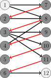
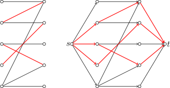
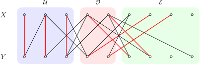
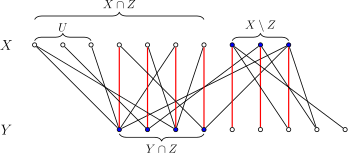

# 二分图最大匹配 - OI Wiki

- Source: https://oi-wiki.org/graph/graph-matching/bigraph-match/

# 二分图最大匹配

前置知识：[二分图](../../bi-graph/)、[图匹配](../graph-match/)

## 引入

本文讨论二分图 𝐺 =(𝑋,𝑌,𝐸)G=(X,Y,E) 的最大匹配问题．

生活中一个典型的二分图匹配的例子是男女配对．设有若干男生（𝑋X）和女生（𝑌Y），每个人只能配对一次，且允许配对的组合已由某个列表（𝐸E）限定．此时，二分图最大匹配算法的任务就是在这些限制下，找到最多的配对对数，使尽可能多的人成功配对．

提示

本文假设已知二分图顶点集 𝑉V 的一种划分（染色）方式：𝑉 =𝑋 ∪𝑌V=X∪Y．如果事先不清楚二分图的顶点集 𝑉V 的划分方法，可以通过 [二分图的染色算法](../../bi-graph/#判定) 在 𝑂(|𝑉| +|𝐸|)O(|V|+|E|) 时间内求出这样一个划分．

## Kuhn 算法

Kuhn 算法是 [Berge 引理](../graph-match/#berge-引理) 的直接应用．它也是 [匈牙利算法](../bigraph-weight-match/#hungarian-algorithmkuhnmunkres-algorithm) 的一部分．

### 过程

为了求出最大匹配，算法依次枚举所有顶点，求出从它出发的一条增广路，并进行增广．因为增广路的长度总是奇数，所以在二分图中，它的端点必然分别位于左右两个部分．这说明，只需要考虑从左部出发的增广路即可．

为了寻找增广路，可以依据当前的匹配 𝑀M 给二分图定向．从左部的未匹配点出发的增广路（或者任何一条交错路）中，只能沿着非匹配边从左部点到达右部点，再沿着匹配边从右部点到达左部点．因此，可以规定所有非匹配边都指向右部点，而所有匹配边都指向左部点．寻找增广路的问题就转换为从某个未匹配的左部点出发，在有向图中寻找一条简单路径通向某个未匹配点．这一问题很容易通过 [DFS](../../dfs/) 或 [BFS](../../bfs/) 在 𝑂(|𝐸|)O(|E|) 时间内解决．



（图中，深色点为匹配点，浅色点为未匹配点，红边为匹配边，黑边为非匹配边，箭头表示当前匹配对应的定向．由图可知，路径 1 →8 →3 →11 →6 →121→8→3→11→6→12 是相对于当前匹配的一条增广路．）

算法开始时，所有边都指向右部点．每次寻找到增广路后，都需要沿着增广路将经过的所有边都反向，以表示它们的匹配状态已经反转．算法结束时，所有指向左部点的边就是匹配边．

因为至多只需要枚举 𝑂(|𝑉|)O(|V|) 个左部点 [各一次](../graph-match/#berge-引理)，所以，算法总的时间复杂度为 𝑂(|𝑉||𝐸|)O(|V||E|)．

### 优化

有一些简单的技巧，可以优化 Kuhn 算法的常数：

  1. Kuhn 算法基于 Berge 引理，而后者并不要求事先给出二分图的左右部分．因此，即使在左右两部分未明确划分的情况下，Kuhn 算法也能正确运行，只要图本身是二分图．但是，先将二分图染色，确定好它的左部和右部，往往效率更高．
  2. 因为上文描述的 Kuhn 算法的时间复杂度实际上是 𝑂(|𝑋||𝐸|)O(|X||E|) 的，所以，可以选取二分图的两个部分中较小的那个作为左部 𝑋X．
  3. 在寻找增广路时，用于避免重复查找的标记无需每次 DFS 都清空．可以在清空标记前，尝试为所有未匹配的左部点都寻找增广路．在一轮这样的查找中，所有边至多访问一次，复杂度仍然是 𝑂(|𝐸|)O(|E|) 的；但是，在一轮查找中，可能找到多条增广路，因此总的轮数 𝑘k 不会超过 |𝑀| +1|M|+1，其中，𝑀M 为最大匹配．相应地，算法整体复杂度降低到了 𝑂(𝑘|𝐸|)O(k|E|)．
  4. 寻找增广路时，优先考虑未匹配的右部点，因为这意味着更短的增广路．
  5. 因为 Berge 引理并不要求初始匹配为空，所以，Kuhn 算法开始时，可以随机地选取一些互不相交的边作为初始匹配，以减少后续搜索的次数．如果已经应用优化 3，本优化可以忽略．

虽然最差复杂度仍然是 𝑂(|𝑉||𝐸|)O(|V||E|)，但是，充分优化的 Kuhn 算法效率并不差．但是为了避免个别数据将它卡到最差复杂度，在匹配前需要首先随机打乱边或顶点的顺序．

### 参考实现

实现时，不需要真正维护定向，只需要为每个顶点都维护与它相匹配的顶点即可．

模板题 [Library Checker - Matching on Bipartite Graph](https://judge.yosupo.jp/problem/bipartitematching)

```text 1 2 3 4 5 6 7 8 9 10 11 12 13 14 15 16 17 18 19 20 21 22 23 24 25 26 27 28 29 30 31 32 33 34 35 36 37 38 39 40 41 42 43 44 45 46 47 48 49 50 51 52 53 54 55 56 57 58 59 60 61 62 63 64 65 66 67 68 69 70 71 72 73 74 75 76 77 78 79 80 81 82 83 84 85 86 87 ``` |  ```text #include <algorithm> #include <ctime> #include <iostream> #include <random> #include <tuple> #include <vector> std :: mt19937_64 rng ( static_cast < std :: mt19937_64 :: result_type > ( std :: time ( nullptr ))); struct BipartiteGraph { int n1 , n2 ; // number of vertices in X and Y, resp. std :: vector < std :: vector < int >> g ; // edges from X to Y std :: vector < int > ma , mb ; // matches from X to Y and from Y to X, resp. std :: vector < bool > vis ; // visiting marks for DFS. BipartiteGraph ( int n1 , int n2 ) : n1 ( n1 ), n2 ( n2 ), g ( n1 ), ma ( n1 , -1 ), mb ( n2 , -1 ) {} // Add an edge from u in X to v in Y. void add_edge ( int u , int v ) { g [ u ]. emplace_back ( v ); } // Find an augmenting path starting at u. bool dfs ( int u ) { vis [ u ] = true ; // Heuristic: find unsaturated vertices whenever possible. for ( int v : g [ u ]) { if ( mb [ v ] == -1 ) { ma [ u ] = v ; mb [ v ] = u ; return true ; } } for ( int v : g [ u ]) { if ( ! vis [ mb [ v ]] && dfs ( mb [ v ])) { ma [ u ] = v ; mb [ v ] = u ; return true ; } } return false ; } // Kuhn's maximum matching algorithm. std :: vector < std :: pair < int , int >> kuhn_maximum_matching () { // Randomly shuffle the edges. for ( int u = 0 ; u < n1 ; ++ u ) { std :: shuffle ( g [ u ]. begin (), g [ u ]. end (), rng ); } // Find a maximal set of vertex-disjoint augmenting paths in each round. while ( true ) { bool succ = false ; vis . assign ( n1 , false ); for ( int u = 0 ; u < n1 ; ++ u ) { succ |= ma [ u ] == -1 && dfs ( u ); } if ( ! succ ) break ; } // Collect the matched pairs. std :: vector < std :: pair < int , int >> matches ; matches . reserve ( n1 ); for ( int u = 0 ; u < n1 ; ++ u ) { if ( ma [ u ] != -1 ) { matches . emplace_back ( u , ma [ u ]); } } return matches ; } }; int main () { std :: ios :: sync_with_stdio ( false ), std :: cin . tie ( nullptr ); int n1 , n2 , m ; std :: cin >> n1 >> n2 >> m ; BipartiteGraph gr ( n1 , n2 ); for ( int i = 0 ; i < m ; ++ i ) { int u , v ; std :: cin >> u >> v ; gr . add_edge ( u , v ); } auto res = gr . kuhn_maximum_matching (); std :: cout << res . size () << '\n' ; for ( int i = 0 ; i < res . size (); ++ i ) { std :: cout << res [ i ]. first << ' ' << res [ i ]. second << '\n' ; } return 0 ; } ```   
---|---  
  
## Hopcroft–Karp 算法

Hopcroft–Karp 算法进一步优化了 Kuhn 算法查找增广路的过程，将总的轮数降低到了 𝑂(|𝑉|1/2)O(|V|1/2)，从而获得了 𝑂(|𝑉|1/2|𝐸|)O(|V|1/2|E|) 的时间复杂度．这一算法实际上是 [Dinic 算法](../../flow/max-flow/#dinic-算法) 的一种特殊情形．

### 过程

算法依然是在寻找增广路，但是为了在更少的轮次内完成匹配，算法在每一轮中都采取了如下策略：

  1. 将匹配边定向为指向左部点，非匹配边定向为指向右部点．
  2. 从所有未匹配的左部点出发，在有向图上进行 BFS，记录每个访问到的顶点所在的层数 𝑑(𝑣)d(v)，直到某一层出现未匹配的右部点为止．若 BFS 结束仍未找到未匹配的右部点，说明当前匹配已是最大匹配．
  3. 依次从每个未匹配的左部点出发进行 DFS，寻找增广路并进行增广．DFS 时沿着满足层数连续且严格递增（即 𝑑(𝑣′) =𝑑(𝑣) +1d(v′)=d(v)+1）的边向前扩展，且只访问尚未在本轮 DFS 中访问过的顶点．特别地，DFS 中不会访问到前一步 BFS 中尚未访问到的顶点．

用网络流的术语说，步骤 2 是构造了一个层次图，而步骤 3 则是找到了层次图上的阻塞流．所谓层次图，是指它的每条边都必然从这一层指向下一层；而所谓阻塞流，在当前语境下，就是指一组极大的、两两之间没有公共顶点的增广路．步骤 3 得到的这一组增广路必然是极大的：假设不然，存在一条新的增广路，那么在当初枚举到它的起点时，就应当已经找到这样一条路．

比起前文的 Kuhn 算法，Hopcroft–Karp 算法最关键的改变就是在求阻塞流之前，添加了求层次图这一步骤．基于层次图进行 DFS，相当于限制了算法总是沿着最短路径到达各个顶点．这样做的好处是，在算法的不同轮次间，算法找到的增广路的长度是严格递增的．而且，可以证明的是，直到求出最大匹配为止，增广路的长度至多增加 3|𝑀|1/23|M|1/2 次，其中，|𝑀||M| 为最大匹配的大小．所以，这就将总的增广的轮次控制在 𝑂(|𝑀|1/2)O(|M|1/2)，进而得到 𝑂(|𝑀|1/2|𝐸|)O(|M|1/2|E|) 的时间复杂度．由于 2|𝑀| ≤|𝑉|2|M|≤|V|，所以，时间复杂度也可以写成更宽松的上界 𝑂(|𝑉|1/2|𝐸|)O(|V|1/2|E|)．

证明

首先说明，在算法的不同轮次之间，算法找到的增广路的长度是严格递增的．

假设当前轮次的 BFS 中，顶点向前延伸了 ℓℓ 层，那么，因为 BFS 中找到的未匹配的右部点都位于同一层，所以本轮 DFS 能够找到的所有增广路的长度就都是 ℓℓ．需要证明的是，沿着本轮找到的这组增广路 {𝑃𝑖}{Pi} 增广结束后，重新定向得到的有向图中，将不再存在长度不超过 ℓℓ 的增广路．

实际上，如果 𝑃P 是相对于 𝑀M 的最短的增广路，而 𝑃′P′ 是相对于 𝑀 ⊕𝑃M⊕P 的增广路，都有 |𝑃′| ≥|𝑃| +2|𝑃 ∩𝑃′||P′|≥|P|+2|P∩P′| 成立．这是因为 𝑁 =(𝑀 ⊕𝑃) ⊕𝑃′N=(M⊕P)⊕P′ 相对于 𝑀M 增广了两次，故而类似 [Berge 引理的证明](../graph-match/#berge-引理)，可以说明对称差 𝑀 ⊕𝑁 =𝑃 ⊕𝑃′M⊕N=P⊕P′ 中至少包含两条相对于 𝑀M 的不交的增广路 𝑃1P1 和 𝑃2P2．由于 𝑃P 的最短性，有

2|𝑃|≤|𝑃1|+|𝑃2|≤|𝑃⊕𝑃′|=|𝑃|+|𝑃′|−2|𝑃∩𝑃′|.2|P|≤|P1|+|P2|≤|P⊕P′|=|P|+|P′|−2|P∩P′|.

这就说明 |𝑃′| ≥|𝑃| +2|𝑃 ∩𝑃′||P′|≥|P|+2|P∩P′|．因此，如果添加完增广路 {𝑃𝑖}{Pi} 之后，新的增广路 𝑃′P′ 仍然和它们一样长，就必然与它两两不交，这与 {𝑃𝑖}{Pi} 的极大性相矛盾．这一矛盾说明，增广完阻塞流后，新的增广路一定严格更长．

最后，需要说明，增广路的长度至多增加 3|𝑀|1/23|M|1/2 次．

记 𝑝 =⌊|𝑀|1/2⌋p=⌊|M|1/2⌋．在前 𝑝p 个轮次结束后，剩下的增广路的长度至少是 |𝑀|1/2|M|1/2．设当前匹配为 𝑀𝑝Mp，那么，与前文情形类似，可以说明图 (𝑉,𝑀 ⊕𝑀𝑝)(V,M⊕Mp) 中有 |𝑀| −|𝑀𝑝||M|−|Mp| 条两两之间没有公共顶点的相对于 𝑀𝑝Mp 的增广路．每条增广路至少用到 |𝑀|1/2/2|M|1/2/2 条 𝑀M 中的匹配边，因此，这些增广路的总数不会超过 2|𝑀|1/22|M|1/2，也就是说，|𝑀| −|𝑀𝑝| ≤2|𝑀|1/2|M|−|Mp|≤2|M|1/2．这说明从 𝑀𝑝Mp 开始，至多只能再增广 2|𝑀|1/22|M|1/2 次，这同样意味着算法至多再进行 2|𝑀|1/22|M|1/2 轮增广．所以，增广路的长度总共至多增加 3|𝑀|1/23|M|1/2 次．

这仅仅是对 Hopcroft–Karp 算法的最差复杂度的估计．实际上，在随机图中，Hopcroft–Karp 算法的时间复杂度有很大概率是 𝑂(|𝐸|log⁡|𝑉|)O(|E|log⁡|V|) 的1．

### 优化

在建立层次图时，和一般的 Dinic 算法一样，Hopcroft–Karp 算法在到达未匹配的右部点时就终止．但是，仅仅就二分图匹配问题来说，这样做是没有必要的．而且，因为 BFS 过早终止，限制了后续 DFS 的范围，会导致每轮找到的增广路数目有限，从而拖慢整体匹配效率．在有些图上，它的效率甚至不如经过优化的 Kuhn 算法．所以，一个简单的改进是，不提前终止 BFS，而是为所有可以到达的顶点建立层次图．

正确性证明

在优化后的算法中，阻塞流中增广路的长度将不再相同，因此，前文中关于复杂度的证明也不再成立．但是，可以说明的是，通过为算法的每个轮次建立辅助图，同样可以建立最短增广路长度严格递增的结论，进而保证最差复杂度依然是正确的．

设二分图为 𝐺 =(𝑋,𝑌,𝐸)G=(X,Y,E)，当前的匹配为 𝑀M．设通过 BFS 可以访问到的未匹配的右部点的集合为 𝑊 ⊆𝑌W⊆Y，且到达 𝑦 ∈𝑊y∈W 的最短的增广路的长度为 𝑑(𝑦)d(y)．记 𝑑max =max𝑦∈𝑊𝑑(𝑦)dmax=maxy∈Wd(y)，那么，对于每个 𝑦 ∈𝑊y∈W，都可以新建一条从 𝑦y 开始且长度为 𝑑max −𝑑(𝑦)dmax−d(y) 的链，并将新建的顶点依次标记为左部点和右部点，将新建的边依次标记为匹配边和非匹配边．设这样得到的图为 𝐺′ =(𝑋′,𝑌′,𝐸′)G′=(X′,Y′,E′)，匹配为 𝑀′M′，最短增广路的长度为 𝑑maxdmax．那么，图 𝐺G 中沿着层次图能够找到的相对于 𝑀M 的增广路——也就是那些到达相应顶点的最短的增广路——与图 𝐺′G′ 中相对于 𝑀′M′ 的全局最短的增广路之间存在双射．因此，在图 𝐺G 的层次图中找到阻塞流并进行增广，就相当于在图 𝐺′G′ 的层次图中找到阻塞流并进行增广．按照前文的证明，增广后，图 𝐺′G′ 中将不再存在长度为 𝑑maxdmax 的增广路．所以，图 𝐺G 中也不再存在长度为 𝑑min =min𝑦∈𝑊𝑑(𝑦)dmin=miny∈Wd(y) 的增广路：因为这样的增广路通过新延长的交错路，必然对应着一条图 𝐺′G′ 中长度为 𝑑maxdmax 的增广路．这样就再次得到了算法的不同轮次间，最短增广路的长度严格递增的结论．因此，整体复杂度也仍然是 𝑂(|𝑀|1/2|𝐸|)O(|M|1/2|E|) 的．

### 参考实现

模板题 [Library Checker - Matching on Bipartite Graph](https://judge.yosupo.jp/problem/bipartitematching)

```text 1 2 3 4 5 6 7 8 9 10 11 12 13 14 15 16 17 18 19 20 21 22 23 24 25 26 27 28 29 30 31 32 33 34 35 36 37 38 39 40 41 42 43 44 45 46 47 48 49 50 51 52 53 54 55 56 57 58 59 60 61 62 63 64 65 66 67 68 69 70 71 72 73 74 75 76 77 78 79 80 81 82 83 84 85 86 87 88 89 90 91 92 93 94 95 96 97 ``` |  ```text #include <algorithm> #include <iostream> #include <queue> #include <tuple> #include <vector> struct BipartiteGraph { int n1 , n2 ; // number of vertices in X and Y, resp. std :: vector < std :: vector < int >> g ; // edges from X to Y std :: vector < int > ma , mb ; // matches from X to Y and from Y to X, resp. std :: vector < int > dist ; // distance from unsaturated vertices in X. BipartiteGraph ( int n1 , int n2 ) : n1 ( n1 ), n2 ( n2 ), g ( n1 ), ma ( n1 , -1 ), mb ( n2 , -1 ) {} // Add an edge from u in X to v in Y. void add_edge ( int u , int v ) { g [ u ]. emplace_back ( v ); } // Build the level graph. bool bfs () { dist . assign ( n1 , -1 ); std :: queue < int > q ; for ( int u = 0 ; u < n1 ; ++ u ) { if ( ma [ u ] == -1 ) { dist [ u ] = 0 ; q . emplace ( u ); } } // Build the level graph for all reachable vertices. bool succ = false ; while ( ! q . empty ()) { int u = q . front (); q . pop (); for ( int v : g [ u ]) { if ( mb [ v ] == -1 ) { succ = true ; } else if ( dist [ mb [ v ]] == -1 ) { dist [ mb [ v ]] = dist [ u ] \+ 1 ; q . emplace ( mb [ v ]); } } } return succ ; } // Find an augmenting path starting at u. bool dfs ( int u ) { for ( int v : g [ u ]) { if ( mb [ v ] == -1 || ( dist [ mb [ v ]] == dist [ u ] \+ 1 && dfs ( mb [ v ]))) { ma [ u ] = v ; mb [ v ] = u ; return true ; } } dist [ u ] = -1 ; // Mark this point as inreachable after one visit. return false ; } // Hopcroft-Karp maximum matching algorithm. std :: vector < std :: pair < int , int >> hopcroft_karp_maximum_matching () { // Build the level graph and then find a blocking flow. while ( bfs ()) { for ( int u = 0 ; u < n1 ; ++ u ) { if ( ma [ u ] == -1 ) { dfs ( u ); } } } // Collect the matched pairs. std :: vector < std :: pair < int , int >> matches ; matches . reserve ( n1 ); for ( int u = 0 ; u < n1 ; ++ u ) { if ( ma [ u ] != -1 ) { matches . emplace_back ( u , ma [ u ]); } } return matches ; } }; int main () { std :: ios :: sync_with_stdio ( false ), std :: cin . tie ( nullptr ); int n1 , n2 , m ; std :: cin >> n1 >> n2 >> m ; BipartiteGraph gr ( n1 , n2 ); for ( int i = 0 ; i < m ; ++ i ) { int u , v ; std :: cin >> u >> v ; gr . add_edge ( u , v ); } auto res = gr . hopcroft_karp_maximum_matching (); std :: cout << res . size () << '\n' ; for ( int i = 0 ; i < res . size (); ++ i ) { std :: cout << res [ i ]. first << ' ' << res [ i ]. second << '\n' ; } return 0 ; } ```   
---|---  
  
## 归约为最大流问题

二分图最大匹配问题可以归约为最大流问题．



如图所示，添加两个顶点分别作为源点和汇点．从源点出发，向每个左部点连接一条边；从每个右部点出发，向汇点连接一条边；并为二分图中的每条无向边，都连接一条从左部点指向右部点的边．所有边的容量都是 11．这样得到的有向图中的每个网络流，都和二分图中的一组匹配一一对应，且网络流的容量就是相应的匹配的大小．因此，求解二分图最大匹配，就相当于求解相应的有向图中的最大流．

任何可以解决最大流问题的算法都可以用于解决二分图最大匹配问题．容易发现，Kuhn 算法和 Hopcroft–Karp 算法都是最大流问题中相应算法的特例．同样地，[预流推进算法](../../flow/max-flow/#push-relabel-预流推进算法) 等同样可以用于解决二分图最大匹配问题．但是，应当注意的是，任何最大流算法，在应用于二分图最大匹配问题时，都需要有针对性地进行相应的优化，以避免过大的常数．

### 线性规划形式

和其他最大流问题一样，二分图 𝐺 =(𝑉,𝐸)G=(V,E) 的最大匹配问题可以写作线性规划问题．如果用 𝑥𝑒 ∈{0,1}xe∈{0,1} 表示边 𝑒e 是否属于匹配，那么，可以得到如下的线性规划问题：

max{𝑥𝑒}∑𝑒∈𝐸𝑥𝑒subject to ∑𝑒∼𝑣𝑥𝑒≤1, ∀𝑣∈𝑉,𝑥𝑒≥0, ∀𝑒∈𝐸.max{xe}∑e∈Exesubject to ∑e∼vxe≤1, ∀v∈V,xe≥0, ∀e∈E.

其中，𝑒 ∼𝑣e∼v 表示关联关系，即顶点 𝑣v 是边 𝑒e 的端点之一．除了非负限制之外，问题的约束还要求每个顶点 𝑣 ∈𝑉v∈V 处至多与一条边关联，这正是匹配的定义．因此，所有的匹配都对应于该线性规划可行域中的某些整点．

反过来却不然．在可行解中，𝑥𝑒xe 可能是小数，这并不代表任何实际的匹配．尽管如此，对于二分图 𝐺G，上述线性规划的所有极点解都是整点．这意味着，目标函数的最优值总能在整点处取得，而无需考虑非整数的情形．这一性质对一般图并不成立，因此，上述线性规划在一般图中并不等价于最大匹配问题．

这一线性规划问题的对偶问题可以写作如下形式：

min{𝑦𝑣}∑𝑣∈𝑉𝑦𝑣subject to 𝑦𝑢+𝑦𝑣≥1, ∀(𝑢,𝑣)∈𝐸,𝑦𝑣≥0, ∀𝑣∈𝑉.min{yv}∑v∈Vyvsubject to yu+yv≥1, ∀(u,v)∈E,yv≥0, ∀v∈V.

随后就会看到，这正是二分图的最小点覆盖问题．

## Dulmage–Mendelsohn 分解

利用二分图的最大匹配，可以将顶点划分为若干互不相交的子集，从而完整刻画该二分图所有最大匹配的分布及结构特征．这就是 Dulmage–Mendelsohn 分解．算法竞赛中，利用这一分解，可以识别最大匹配中的关键点和关键边，进而判断最大匹配的唯一性或求解二分图博弈等问题．

### 构造方法

设二分图 𝐺 =(𝑋,𝑌,𝐸)G=(X,Y,E) 的一个最大匹配为 𝑀M．



如图所示，可以为所有顶点 𝑉 =𝑋 ∪𝑌V=X∪Y 定义如下三个子集：

  * 偶可达点 EE，即所有可以从一个未匹配点出发，沿着偶数长度的交错路可以到达的顶点集合；
  * 奇可达点 OO，即所有可以从一个未匹配点出发，沿着奇数长度的交错路可以到达的顶点集合；
  * 不可达点 UU，即所有无法从一个未匹配点出发，沿着交错路到达的顶点集合．

可以证明，这样得到的三个顶点集合 E,O,UE,O,U 有如下性质：

性质

  1. 集合 E,O,UE,O,U 构成顶点集合的一个划分，且这一划分和最大匹配 𝑀M 的选取无关．
  2. 图 𝐺G 的任一最大匹配都包含 UU 的顶点之间的一个完美匹配，且将 OO 中的每一个顶点都匹配到 EE 中的一个顶点．也就是说，图 𝐺G 的最大匹配的大小等于 |O| +|U|/2|O|+|U|/2．
  3. 图 𝐺G 中不包含连接 EE 中顶点和 E ∪UE∪U 中顶点的边．

证明

  1. 按照定义，UU 和 E ∪OE∪O 不交．只需要证明 EE 和 OO 不交．假若不然，对于顶点 𝑣 ∈E ∩Ov∈E∩O，存在一条从未匹配点 𝑎a 到 𝑣v 的长度为偶数的交错路，也存在一条从未匹配点 𝑏b 到 𝑣v 的长度为奇数的交错路．由于图 𝐺G 是二分图，𝑎 ≠𝑏a≠b，且两条路径到达 𝑣v 时的边分别是匹配边和非匹配边．因此，将两条路连接起来，就得到一条从 𝑎a 经 𝑣v 到 𝑏b 的交错路．这是一条增广路．这与 𝑀M 是最大匹配这一点相矛盾．因此，E ∩O =∅E∩O=∅．

设 𝑀′M′ 是一个与 𝑀M 不同的最大匹配．重复 [Berge 引理的证明](../graph-match/#berge-引理) 可以说明，𝑀′ ⊕𝑀M′⊕M 仅由偶数长度的路径和偶环组成．从最大匹配 𝑀M 出发，可以逐个将这些连通块（路径和环）中的边翻转（匹配边和非匹配边交换），就能得到最大匹配 𝑀′M′．翻转偶环时，未匹配点仍然是未匹配点，从它出发的交错路的长度奇偶性也不会改变；翻转偶数长度路径时，路径两个端点的匹配状态互换，但是从它们出发到达路径中的任何一个点的路径长度的奇偶性也是一致的．因此，在翻转过程中，集合 E,O,UE,O,U 均始终保持不变．这就说明这一分解与最大匹配 𝑀M 的选取无关．

  2. 如果一条匹配边出现在某条从未匹配点 𝑣v 出发的交错路中，那么它的两个端点与点 𝑣v 的距离的奇偶性必然不同，因而分别属于集合 EE 和 OO；否则，它的两个端点必然都在 UU 中．这说明，最大匹配中的匹配边必然是 EOEO 边或 UUUU 边．反过来说，未匹配点可以沿着从它自身出发、长度为零的交错路到达，所以只会出现在集合 EE 中，这说明，集合 OO 和 UU 中都是匹配点．简单计数可知，最大匹配的大小就是 |O| +|U|/2|O|+|U|/2．

  3. 按照定义，EE 中的任一顶点 𝑎a 可以从未匹配点 𝑣v 出发沿偶数长度交错路到达，也就是说，EE 中的顶点要么是未匹配点，要么到达该点的交错路 𝑃P 以匹配边结束．如果图 𝐺G 中存在连接 𝑎a 和 E ∪UE∪U 中某个顶点 𝑏b 的一条边，那么根据上一段的讨论，这条边必然是非匹配边，可以沿着它延长交错路 𝑃P．这说明顶点 𝑏b 也属于集合 OO，这就与第一条性质矛盾．因此，图 𝐺G 中不存在连接 EE 中顶点和 E ∪UE∪U 中顶点的边．

由此得到的顶点集合的分解 𝑉 =E ∪O ∪UV=E∪O∪U 就称为 **Dulmage–Mendelsohn 分解** ．在利用前文所述算法求得最大匹配之后，可以通过 BFS 在 𝑂(|𝑉| +|𝐸|)O(|V|+|E|) 的时间内求出 Dulmage–Mendelsohn 分解．

### 最大匹配关键点

如果一个顶点 𝑣v 在二分图 𝐺G 的每一个最大匹配中都是匹配点，那么它就称为最大匹配的关键点．下面的结论说明：一个顶点是关键点，当且仅当在一个最大匹配中，不存在从未匹配点出发到达该顶点的偶数长度的交错路．

定理

设二分图 𝐺 =(𝑋,𝑌,𝐸)G=(X,Y,E) 的 Dulmage–Mendelsohn 分解为 𝑉 =E ∪O ∪UV=E∪O∪U．那么，顶点 𝑣 ∈𝑉v∈V 是关键点，当且仅当 𝑣 ∈O ∪Uv∈O∪U．

证明

根据 Dulmage–Mendelsohn 分解的性质可知，在图 𝐺G 的任一最大匹配中，OO 和 UU 中的顶点都必然是匹配点．因此，O ∪UO∪U 中的顶点必然是关键点．然后，需要说明集合 EE 中一定没有关键点．如果在最大匹配 𝑀M 中，顶点 𝑎 ∈Ea∈E 是关键点，那么存在一条偶数长度的交错路 𝑃P 连接顶点 𝑎a 和某个未匹配点 𝑏 ∈Eb∈E．将这条路上的所有边翻转，得到的最大匹配 𝑀 ⊕𝑃M⊕P 中，顶点 𝑎a 就变成未匹配点．因此，集合 EE 中没有关键点．

因此，要求出最大匹配的关键点，只需要求出 Dulmage–Mendelsohn 分解即可．

### 最大匹配关键边

类似地，如果一条边 𝑒e 在二分图 𝐺G 的每一个最大匹配中都是匹配边，那么它就称为最大匹配的关键边．二分图的最大匹配是唯一的，当且仅当它的一个最大匹配中，所有匹配边都是关键边．

定理

设二分图 𝐺 =(𝑋,𝑌,𝐸)G=(X,Y,E) 的 Dulmage–Mendelsohn 分解为 𝑉 =E ∪O ∪UV=E∪O∪U，且 𝑀M 是它的一个最大匹配．那么，边 𝑒 ∈𝐸e∈E 是关键边，当且仅当 𝑒e 的端点都在 UU 中，边 𝑒e 是 𝑀M 中匹配边，且相对于 𝑀M 不存在一个包含边 𝑒e 的交错环．

证明

关键边的端点必须是关键点．根据 Dulmage–Mendelsohn 分解的性质，最大匹配的边只能是 EOEO 边或 UUUU 边．但是，EE 中没有关键点，所以，关键边只能是 UUUU 边．当然，关键边也必须是 𝑀M 中的匹配边．设 𝑒 ∈𝑀e∈M 是一条 UUUU 边．它不是关键边，当且仅当存在另一个最大匹配 𝑀′ ≠𝑀M′≠M 使得 𝑒 ∈𝑀 ⊕𝑀′e∈M⊕M′．重复 [Berge 引理的证明](../graph-match/#berge-引理) 可以说明，𝑀′ ⊕𝑀M′⊕M 仅由偶数长度的路径和偶环组成．这些路径的端点之一是相对于 𝑀M 的未匹配点，所以路径中的顶点都不是 UU 中的点，这与边 𝑒e 的选取矛盾．因此，边 𝑒e 只能出现在偶环中．因此，一条 UUUU 边 𝑒 ∈𝑀e∈M 不是关键边，当且仅当相对于 𝑀M 存在一个包含边 𝑒e 的交错环．这就是所要求证的．

因此，要求出最大匹配的关键边，需要按照如下步骤进行：

  1. 求出图 𝐺G 的最大匹配 𝑀M；
  2. 按照 𝑀M 将图 𝐺G 的边定向，得到有向图 𝐺𝑀GM；
  3. 进行 BFS 求出 Dulmage–Mendelsohn 分解中的集合 UU，即无法通过未匹配点沿着交错路到达的顶点集合；
  4. 利用 [Tarjan 算法](../../scc/#tarjan-算法) 求出有向图 𝐺𝑀GM 的全部强连通分量；
  5. 遍历匹配 𝑀M 中的边，如果它的端点都在 UU 中，但是不在同一个强连通分量中，它就是一条关键边．

得到最大匹配后，后续步骤的时间复杂度为 𝑂(|𝑉| +|𝐸|)O(|V|+|E|)．

## 相关问题

利用二分图最大匹配的算法，可以解决其它组合优化问题．

### 二分图最小点覆盖

最小点覆盖问题是指，在一张无向图中选择最少的顶点，满足每条边至少有一个端点被选．

一般图的最小点覆盖问题是 NP 困难的，但是对于二分图，Kőnig 定理说明它可以归约为最大匹配问题，从而高效求解．定理的证明同时也给出了最小点覆盖的构造．

Kőnig 定理

二分图中，最小点覆盖中的顶点数量等于最大匹配中的边数量．

证明

设二分图 𝐺 =(𝑋,𝑌,𝐸)G=(X,Y,E) 的一个最大匹配为 𝑀M．设图 𝐺G 中可以由未匹配的左部点 𝑈U 出发，沿着某条交错路到达的顶点集合为 𝑍Z．于是，顶点集合 𝐶 =(𝑋 ∖𝑍) ∪(𝑌 ∩𝑍)C=(X∖Z)∪(Y∩Z) 就是所求的最小点覆盖．



首先，集合 𝐶C 是点覆盖．假设不然，存在边 (𝑢,𝑣) ∈𝐸(u,v)∈E 使得 𝑢 ∈𝑋 ∩𝑍u∈X∩Z 且 𝑣 ∈𝑌 ∖𝑍v∈Y∖Z．设 𝑃𝑢Pu 是到达 𝑢u 的一条交错路．如果边 (𝑢,𝑣)(u,v) 是匹配边，那么，路径 𝑃𝑢Pu 中的最后一条边就是 (𝑣,𝑢)(v,u)，这与 𝑣 ∉𝑍v∉Z 矛盾；如果边 (𝑢,𝑣)(u,v) 不是匹配边，那么，可以沿着边 (𝑢,𝑣)(u,v) 延长 𝑃𝑢Pu 得到一条到达 𝑣v 的交错路，同样与 𝑣 ∉𝑍v∉Z 矛盾．这些矛盾说明所有边都至少包含一个 𝐶C 中的端点，所以 𝐶C 是点覆盖．

然后，需要说明 𝐶C 是最小点覆盖．为了覆盖最大匹配 𝑀M 的所有边，任何点覆盖都至少需要 |𝑀||M| 个顶点．因此，只需要证明 |𝐶| =|𝑀||C|=|M|，它就一定是最小点覆盖．这等价于证明，除了包含每条匹配边各一个端点之外，𝐶C 再不包含其它顶点；也就是说，𝐶C 不包含未匹配点．假设不然，存在未匹配点 𝑣 ∈𝐶v∈C．如果 𝑣 ∈𝑋v∈X，就一定有 𝑣 ∈𝑈 ⊆𝑍v∈U⊆Z，这与 𝐶C 的构造矛盾；如果 𝑣 ∈𝑌v∈Y，那么，到达 𝑣v 的一条交错路是相对于 𝑀M 的一条增广路，由 Berge 引理，这与 𝑀M 是最大匹配矛盾．这些矛盾说明不存在这样的未匹配点，进而 𝐶C 是最小点覆盖．

从网络流的角度看，最小点覆盖问题就是最小割问题：选择左部点，相当于切割它与源点的连边；选择右部点，相当于切割它与汇点的连边．从线性规划的角度看，最小点覆盖问题就是最大匹配问题的对偶问题．因此，König 定理可以看作是 [最大流最小割定理](../../flow/max-flow/#最大流最小割定理) 的特殊情形，或者更一般地，线性规划的强对偶定理的特殊情形．

### 二分图最大独立集

最大独立集问题是指，在一张无向图中选择最多的顶点，满足两两之间互不相邻．

对于一般图，成立如下定理：

定理

图 𝐺 =(𝑉,𝐸)G=(V,E) 中，点集 𝐶 ⊆𝑉C⊆V 是点覆盖，当且仅当它的补集 𝑉 ∖𝐶V∖C 是独立集．

证明

点集 𝐶C 是点覆盖，当且仅当 𝐸E 中任何一条边 𝑒e 的两个端点至少有一个出现在集合 𝐶C 中，当且仅当 𝐸E 中没有一条边的两个端点都出现在集合 𝑉 ∖𝐶V∖C 中，当且仅当，𝑉 ∖𝐶V∖C 是独立集．

推论

图 𝐺 =(𝑉,𝐸)G=(V,E) 中，最小点覆盖与最大独立集的大小之和等于顶点数目．

因此，与最小点覆盖问题一样，最大独立集问题对于一般图是 NP 困难的，但是对于二分图它可以归约为最大匹配问题，从而高效求解．

### 有向无环图最小路径覆盖

最小路径覆盖问题是指，在一张有向图中，选择最少数量的简单路径，使得所有顶点都恰好出现在一条路径中．

一般的有向图上的最小路径覆盖问题是 NP 困难的，但是对于有向无环图，该问题可以归约为二分图最大匹配问题．对于有向无环图 𝐺 =(𝑉,𝐸)G=(V,E)，可以二分图 𝐺′ =(𝑉in,𝑉out,𝐸′)G′=(Vin,Vout,E′) 如下：

  * 为每个顶点 𝑣 ∈𝑉v∈V，分别建立一个入点 𝑣invin 和一个出点 𝑣outvout．设全体入点和出点的集合分别为 𝑉inVin 和 𝑉outVout．它们分别成为新图的左部和右部．
  * 为每条有向边 (𝑢,𝑣) ∈𝐸(u,v)∈E，建立无向边 (𝑢out,𝑣in)(uout,vin)．全体无向边的集合就是 𝐸′E′．

为此，有如下结论：

定理

有向无环图 𝐺 =(𝑉,𝐸)G=(V,E) 的最小路径覆盖与相应的二分图 𝐺′ =(𝑉in,𝑉out,𝐸′)G′=(Vin,Vout,E′) 的最大匹配的大小之和等于顶点数量．

证明

二分图 𝐺′G′ 的每个匹配 𝑀′M′，都对应着图 𝐺G 的一张子图 𝐹F，且子图 𝐹F 中每个顶点的入度和出度都至多为一，也就是说，子图 𝐹F 实际上是有向图 𝐺G 中若干互不相交的路径或环的集合．但是，已经假设 𝐺G 中不存在环路，所以 𝐹F 只包含若干不交的路径．反过来，对于每个这样的子图 𝐹F，都能构造出相应的匹配．因为匹配 𝑀M 的大小，就是顶点数量与 𝐹F 中路径数量的差值，所以，图 𝐺G 的最小路径覆盖问题，就对应着图 𝐺′G′ 的最大匹配问题．

证明是构造性的，因此，很容易根据得到的最大匹配构造出相应的最小路径覆盖．而且，这个构造说明，对于一般的有向图，这个归约不再成立，正是因为二分图中的匹配可能对应着有向图中的环．

特别地，对于集合 𝑋X 和它上面的偏序关系 𝑃P，可以建立有向无环图 𝐺 =(𝑋,𝑃)G=(X,P)．此时，根据 [Dilworth 定理](../../../math/order-theory/#dilworth-定理与-mirsky-定理)，图 𝐺G 的最小路径覆盖的大小，就等于它的最长反链的长度，也就是偏序集 (𝑋,𝑃)(X,P) 的宽度．因此，本节实际上给出了任意偏序集的宽度的高效计算方法．

## 例题

应用二分图匹配的难点在于建图，本节通过一些例题展示建图的技巧．

[Luogu P1129 矩阵游戏](https://www.luogu.com.cn/problem/P1129)

有一个 01 方阵，每一次可以交换两行或两列，问是否可以交换使得主对角线（左上到右下）全都是 1．

解法

注意到，当存在 𝑛n 个 11，使得这些 11 不在同一行、同一列，那么必然有解，否则必然无解．问题转化成了能否找到这 𝑛n 个 11．

考虑对于一个 11 而言，最终的方案中选了这个 11 代表这个 11 的行、列被占用．于是可以建出一个 𝑛n 个左部点、𝑛n 个右部点的二分图，其中对于某个为 11 的元素，我们建一条连接它的行的左部点和它的列的右部点．于是就可以二分图匹配了．

代码

```text 1 2 3 4 5 6 7 8 9 10 11 12 13 14 15 16 17 18 19 20 21 22 23 24 25 26 27 28 29 30 31 32 33 34 35 36 37 38 39 40 41 42 43 44 45 46 47 48 49 50 51 52 53 54 55 56 57 58 59 60 61 62 63 64 65 66 67 68 69 70 71 72 73 74 75 76 77 78 79 80 81 82 83 84 85 86 ``` |  ```text #include <algorithm> #include <iostream> #include <queue> #include <vector> using namespace std ; int ct , n , t [ 100010 ], x , r [ 100010 ], ans , vis [ 100010 ], dis [ 100010 ]; vector < int > to [ 100010 ]; queue < int > q ; int DFS ( int x ) { if ( vis [ x ]) { return 0 ; } vis [ x ] = 1 ; for ( auto i : to [ x ]) { if ( ! r [ i ]) { r [ i ] = x ; t [ x ] = i ; return 1 ; } if ( dis [ r [ i ]] == dis [ x ] \+ 1 && DFS ( r [ i ])) { r [ i ] = x ; t [ x ] = i ; return 1 ; } } return 0 ; } int BFS () { fill ( vis \+ 1 , vis \+ n \+ 1 , 0 ); fill ( dis \+ 1 , dis \+ n \+ 1 , 0 ); for ( int i = 1 ; i <= n ; i ++ ) { if ( ! t [ i ]) { q . push ( i ); dis [ i ] = 1 ; } } int f = 0 ; for (; q . size (); q . pop ()) { int tmp = q . front (); for ( auto i : to [ tmp ]) { if ( ! r [ i ]) { f = 1 ; } if ( r [ i ]) { if ( ! dis [ r [ i ]]) { dis [ r [ i ]] = dis [ tmp ] \+ 1 ; q . push ( r [ i ]); } } } } return f ; } int main () { ios :: sync_with_stdio ( false ); cin . tie ( nullptr ), cout . tie ( nullptr ); for ( cin >> ct ; ct \-- ;) { cin >> n ; for ( int i = 1 ; i <= n ; i ++ ) { for ( int j = 1 ; j <= n ; j ++ ) { cin >> x ; if ( x ) { to [ i ]. push_back ( j ); } } } for (; BFS ();) { for ( int i = 1 ; i <= n ; i ++ ) { if ( ! t [ i ] && DFS ( i )) { ans ++ ; } } } cout << ( ans == n ? "Yes" : "No" ) << '\n' ; for ( int i = 1 ; i <= n ; i ++ ) { t [ i ] = r [ i ] = 0 ; to [ i ]. clear (); } ans = 0 ; } return 0 ; } ```   
---|---  
  
[Gym 104427B Lawyers](https://codeforces.com/gym/104427/problem/B)

有 𝑛n 个律师，都被指控有欺诈罪．于是，他们需要互相辩护，确保每一名律师都被释放．这 𝑛n 个律师有 𝑚m 对信任关系，一个信任关系 (𝑎,𝑏)(a,b) 表示 𝑎a 可以为 𝑏b 辩护．任何一个受到辩护的律师都会被无罪释放，除了一个例外：如果 𝑎a 和 𝑏b 互相辩护，他们都会被判有罪．

求是否可以使得每一名律师都被释放．

解法

对于每一个 **无序对** (𝑎,𝑏)(a,b)，当 𝑎a 可以辩护 𝑏b，连这个无序对向 𝑏b 的边，反之亦然．

只保存有边相连的 (𝑎,𝑏)(a,b)，问题被转化成了一个 𝑚m 个左部点、𝑛n 个右部点的二分图最大匹配．

代码

```text 1 2 3 4 5 6 7 8 9 10 11 12 13 14 15 16 17 18 19 20 21 22 23 24 25 26 27 28 29 30 31 32 33 34 35 36 37 38 39 40 41 42 43 44 45 46 47 48 49 50 51 52 53 54 55 56 57 58 59 60 61 62 63 64 65 66 67 68 69 70 71 72 73 74 75 76 77 78 79 80 81 82 83 84 85 86 ``` |  ```text #include <algorithm> #include <iostream> #include <map> #include <queue> #include <utility> #include <vector> using namespace std ; int n , k , u , v , t [ 200020 ], r [ 200020 ], ans , vis [ 200020 ], dis [ 200020 ], c ; map < pair < int , int > , int > mp ; vector < int > to [ 200020 ]; queue < int > q ; int DFS ( int x ) { if ( vis [ x ]) { return 0 ; } vis [ x ] = 1 ; for ( auto i : to [ x ]) { if ( ! r [ i ]) { r [ i ] = x ; t [ x ] = i ; return 1 ; } if ( dis [ r [ i ]] == dis [ x ] \+ 1 && DFS ( r [ i ])) { r [ i ] = x ; t [ x ] = i ; return 1 ; } } return 0 ; } int BFS () { fill ( vis \+ 1 , vis \+ n \+ 1 , 0 ); fill ( dis \+ 1 , dis \+ n \+ 1 , 0 ); for ( int i = 1 ; i <= n ; i ++ ) { if ( ! t [ i ]) { q . push ( i ); dis [ i ] = 1 ; } } int f = 0 ; for (; q . size (); q . pop ()) { int tmp = q . front (); for ( auto i : to [ tmp ]) { if ( ! r [ i ]) { f = 1 ; } if ( r [ i ]) { if ( ! dis [ r [ i ]]) { dis [ r [ i ]] = dis [ tmp ] \+ 1 ; q . push ( r [ i ]); } } } } return f ; } void mxf () { for (; BFS ();) { for ( int i = 1 ; i <= n ; i ++ ) { if ( ! t [ i ] && DFS ( i )) { ans ++ ; } } } } int main () { ios :: sync_with_stdio ( false ); cin . tie ( nullptr ), cout . tie ( nullptr ); cin >> n >> k ; for ( int i = 1 ; i <= k ; i ++ ) { cin >> u >> v ; if ( mp . find ({ u , v }) == mp . end ()) { mp [{ u , v }] = mp [{ v , u }] = ++ c ; } to [ v ]. push_back ({ mp [{ u , v }]}); } mxf (); cout << ( ans == n ? "YES" : "NO" ) << '\n' ; ans = 0 ; return 0 ; } ```   
---|---  
  
[Codeforces 1404E Bricks](https://codeforces.com/problemset/problem/1404/E)

用一些 1 ×𝑥1×x 的砖精确覆盖一个 𝑛 ×𝑚n×m 的网格，砖可以旋转，其中有一些格子不能覆盖．

解法

考虑最终的方案是如何构成的：

先在所有能覆盖的网格上全部铺上 1 ×11×1 的砖．对于一个 1 ×𝑥1×x 的砖，可以由同一行的 𝑥x 个连续的 1 ×11×1 砖依次「行合并」形成．同理，对于一个 𝑥 ×1x×1 的砖．可以由同一列的 𝑥x 个连续的 1 ×11×1 砖依次「列合并」形成．

显然，一次行合并和一次列合并不能干涉到同一个砖，而且合并的次数越多，砖块数量越少．于是，可以以行合并作为左部点，列合并作为右部点，以前面的冲突作为边，建出一个二分图．随即原问题变成了一个二分图最大独立集问题．

代码

```text 1 2 3 4 5 6 7 8 9 10 11 12 13 14 15 16 17 18 19 20 21 22 23 24 25 26 27 28 29 30 31 32 33 34 35 36 37 38 39 40 41 42 43 44 45 46 47 48 49 50 51 52 53 54 55 56 57 58 59 60 61 62 63 64 65 66 67 68 69 70 71 72 73 74 75 76 77 78 79 80 81 82 83 84 85 86 87 88 89 90 91 92 93 94 95 96 97 98 99 100 101 102 103 104 105 106 107 108 109 110 111 112 113 114 ``` |  ```text #include <algorithm> #include <iostream> #include <queue> #include <vector> using namespace std ; int n , m , belr [ 220 ][ 220 ], beld [ 220 ][ 220 ], dcnt , rcnt , vis [ 100010 ], dis [ 100010 ], t [ 100010 ], r [ 100010 ], cnt ; char c [ 220 ][ 220 ]; vector < int > to [ 100010 ]; queue < int > q ; int DFS ( int x ) { if ( vis [ x ]) { return 0 ; } vis [ x ] = 1 ; for ( auto i : to [ x ]) { if ( ! r [ i ]) { r [ i ] = x ; t [ x ] = i ; return 1 ; } if ( dis [ r [ i ]] == dis [ x ] \+ 1 && DFS ( r [ i ])) { r [ i ] = x ; t [ x ] = i ; return 1 ; } } return 0 ; } int BFS () { fill ( vis \+ 1 , vis \+ rcnt \+ 1 , 0 ); fill ( dis \+ 1 , dis \+ rcnt \+ 1 , 0 ); for ( int i = 1 ; i <= rcnt ; i ++ ) { if ( ! t [ i ]) { q . push ( i ); dis [ i ] = 1 ; } } int f = 0 ; for (; q . size (); q . pop ()) { int tmp = q . front (); for ( auto i : to [ tmp ]) { if ( ! r [ i ]) { f = 1 ; } if ( r [ i ]) { if ( ! dis [ r [ i ]]) { dis [ r [ i ]] = dis [ tmp ] \+ 1 ; q . push ( r [ i ]); } } } } return f ; } int solve () { int rt = 0 ; for (; BFS ();) { for ( int i = 1 ; i <= rcnt ; i ++ ) { if ( ! t [ i ] && DFS ( i )) { rt ++ ; } } } return rt ; } int main () { ios :: sync_with_stdio ( false ); cin . tie ( nullptr ), cout . tie ( nullptr ); cin >> n >> m ; for ( int i = 1 ; i <= n ; i ++ ) { for ( int j = 1 ; j <= m ; j ++ ) { cin >> c [ i ][ j ]; } } for ( int i = 1 ; i <= n ; i ++ ) { for ( int j = 1 ; j <= m ; j ++ ) { if ( c [ i ][ j ] == '#' ) { cnt ++ ; if ( c [ i \+ 1 ][ j ] == '#' ) { beld [ i ][ j ] = ++ dcnt ; } if ( c [ i ][ j \+ 1 ] == '#' ) { belr [ i ][ j ] = ++ rcnt ; } } } } for ( int i = 1 ; i <= n ; i ++ ) { for ( int j = 1 ; j <= m ; j ++ ) { if ( c [ i ][ j ] == '#' ) { if ( c [ i \- 1 ][ j ] == '#' && c [ i ][ j \- 1 ] == '#' ) { to [ belr [ i ][ j \- 1 ]]. push_back ( beld [ i \- 1 ][ j ]); } if ( c [ i \+ 1 ][ j ] == '#' && c [ i ][ j \+ 1 ] == '#' ) { to [ belr [ i ][ j ]]. push_back ( beld [ i ][ j ]); } if ( c [ i \+ 1 ][ j ] == '#' && c [ i ][ j \- 1 ] == '#' ) { to [ belr [ i ][ j \- 1 ]]. push_back ( beld [ i ][ j ]); } if ( c [ i \- 1 ][ j ] == '#' && c [ i ][ j \+ 1 ] == '#' ) { to [ belr [ i ][ j ]]. push_back ( beld [ i \- 1 ][ j ]); } } } } cout << cnt \- rcnt \- dcnt \+ solve () << '\n' ; return 0 ; } ```   
---|---  
  
[Codeforces 1139E - Maximize Mex](https://codeforces.com/problemset/problem/1139/E)

有 𝑚m 个共有 𝑛n 个元素的可重集，每一次从某一个可重集里面删除一个元素，然后查询「在每一个可重集里面选至多一个元素，可以达到的最大 mexmex」．

解法

先考虑如果没有删除元素时怎么做．

对于每一个多重集，开一个新点；对于每一个可能的答案，开一个新点．然后，对于某一个对应点 𝑙𝑖li 的多重集的一个元素 𝑎a，连一条 𝑙𝑖li 至 𝑟𝑎ra 的边．此时这个弱化版本变成了一个二分图最大匹配．

现在加回来删除元素的操作，发现根本搞不了：删了一条边可能引起匹配的巨变，复杂度无法接受．于是，不如反过来，我们每一次加一条边，然后顺过去重新增广．所以本题只能使用 Kuhn 算法．

代码

```text 1 2 3 4 5 6 7 8 9 10 11 12 13 14 15 16 17 18 19 20 21 22 23 24 25 26 27 28 29 30 31 32 33 34 35 36 37 38 39 40 41 42 43 44 45 46 47 48 49 50 51 52 53 54 55 56 57 58 59 60 61 62 63 64 65 66 67 68 69 70 71 72 73 74 75 76 77 78 79 80 ``` |  ```text #include <algorithm> #include <iostream> #include <vector> using namespace std ; struct node { int u , v ; } arr [ 5050 ]; int n , m , t [ 5050 ], r [ 5050 ], d , ot [ 5050 ], kil [ 5050 ], vis [ 5050 ], ans , out [ 5050 ]; vector < int > to [ 5050 ]; int DFS ( int x ) { if ( vis [ x ]) { return 0 ; } vis [ x ] = 1 ; for ( auto i : to [ x ]) { if ( r [ i ] == -1 ) { r [ i ] = x ; t [ x ] = i ; return 1 ; } if ( DFS ( r [ i ])) { r [ i ] = x ; t [ x ] = i ; return 1 ; } } return 0 ; } int main () { cin >> n >> m ; for ( int i = 1 ; i <= n ; i ++ ) { cin >> arr [ i ]. u ; if ( arr [ i ]. u > m ) { arr [ i ]. u = m \+ 1 ; } } for ( int i = 1 ; i <= n ; i ++ ) { cin >> arr [ i ]. v ; } cin >> d ; for ( int i = 1 ; i <= d ; i ++ ) { cin >> ot [ i ]; kil [ ot [ i ]] = 1 ; } for ( int i = 1 ; i <= n ; i ++ ) { if ( ! kil [ i ]) { to [ arr [ i ]. u ]. push_back ( arr [ i ]. v ); } } fill ( r \+ 1 , r \+ m \+ 1 , -1 ); for (; ans <= m ;) { fill ( vis , vis \+ m \+ 2 , 0 ); if ( DFS ( ans )) { ans ++ ; } else { break ; } } out [ d ] = ans ; for ( int i = d ; i > 1 ; i \-- ) { to [ arr [ ot [ i ]]. u ]. push_back ( arr [ ot [ i ]]. v ); for (; ans <= m ;) { fill ( vis , vis \+ m \+ 2 , 0 ); if ( DFS ( ans )) { ans ++ ; } else { break ; } } out [ i \- 1 ] = ans ; } for ( int i = 1 ; i <= d ; i ++ ) { cout << out [ i ] << '\n' ; } return 0 ; } ```   
---|---  
  
[Luogu P3355 - 骑士共存问题](https://www.luogu.com.cn/problem/P3355)

有一个 𝑛 ×𝑛n×n 的国际象棋棋盘，其中一些位置不能放棋子，问最多可以放多少个马使得这些马不会互相攻击．

解法

可以发现，如果对整个棋盘染色使得所有黑格、白格均不相邻，那么马只能够攻击到与其异色的格子．

然后就可以直接二分图最大独立集了．

代码

```text 1 2 3 4 5 6 7 8 9 10 11 12 13 14 15 16 17 18 19 20 21 22 23 24 25 26 27 28 29 30 31 32 33 34 35 36 37 38 39 40 41 42 43 44 45 46 47 48 49 50 51 52 53 54 55 56 57 58 59 60 61 62 63 64 65 66 67 68 69 70 71 72 73 74 75 76 77 78 79 80 81 82 83 84 85 86 87 88 89 90 91 92 93 94 95 96 97 98 99 100 101 102 103 104 105 106 107 108 109 110 111 112 113 114 115 116 117 118 119 120 121 122 123 124 125 126 127 128 ``` |  ```text #include <algorithm> #include <iostream> #include <queue> #include <vector> using namespace std ; const int kD [ 8 ][ 2 ] = {{ -2 , -1 }, { -1 , -2 }, { 1 , -2 }, { 2 , -1 }, { 2 , 1 }, { 1 , 2 }, { -1 , 2 }, { -2 , 1 }}; int n , m , ib ; int vis [ 200020 ], dis [ 200020 ], t [ 200020 ], r [ 200020 ], ans , u , v , cnta , x [ 220 ][ 220 ], cl [ 220 ][ 220 ], idx , bel [ 220 ][ 220 ]; vector < int > to [ 200020 ]; queue < int > q ; int DFS ( int x ) { if ( vis [ x ]) { return false ; } vis [ x ] = true ; for ( auto i : to [ x ]) { if ( ! r [ i ]) { r [ i ] = x ; t [ x ] = i ; return true ; } if ( dis [ r [ i ]] == dis [ x ] \+ 1 && DFS ( r [ i ])) { r [ i ] = x ; t [ x ] = i ; return true ; } } return false ; } int BFS () { fill ( vis \+ 1 , vis \+ cnta \+ 1 , false ); fill ( dis \+ 1 , dis \+ cnta \+ 1 , 0 ); for ( int i = 1 ; i <= cnta ; i ++ ) { if ( ! t [ i ]) { q . push ( i ); dis [ i ] = 1 ; } } int f = 0 ; for (; q . size (); q . pop ()) { int tmp = q . front (); for ( auto i : to [ tmp ]) { if ( ! r [ i ]) { f = 1 ; } if ( r [ i ]) { if ( ! dis [ r [ i ]]) { dis [ r [ i ]] = dis [ tmp ] \+ 1 ; q . push ( r [ i ]); } } } } return f ; } void din () { for (; BFS ();) { for ( int i = 1 ; i <= cnta ; i ++ ) { if ( ! t [ i ] && DFS ( i )) { ans ++ ; } } } } int main () { ios :: sync_with_stdio ( false ); cin . tie ( nullptr ), cout . tie ( nullptr ); cin >> n >> m ; for ( int i = 1 ; i <= m ; i ++ ) { cin >> u >> v ; x [ u ][ v ] = true ; } cl [ 1 ][ 1 ] = 1 ; if ( ! x [ 1 ][ 1 ]) { bel [ 1 ][ 1 ] = ++ idx ; } for ( int i = 2 ; i <= n ; i ++ ) { cl [ 1 ][ i ] = cl [ 1 ][ i \- 1 ] ^ 1 ; if ( ! x [ 1 ][ i ] && cl [ 1 ][ i ]) { bel [ 1 ][ i ] = ++ idx ; } else { if ( ! x [ 1 ][ i ]) { bel [ 1 ][ i ] = ++ ib ; } } } for ( int i = 2 ; i <= n ; i ++ ) { for ( int j = 1 ; j <= n ; j ++ ) { cl [ i ][ j ] = cl [ i \- 1 ][ j ] ^ 1 ; if ( ! x [ i ][ j ] && cl [ i ][ j ]) { bel [ i ][ j ] = ++ idx ; } else { if ( ! x [ i ][ j ]) { bel [ i ][ j ] = ++ ib ; } } } } for ( int i = 1 ; i <= n ; i ++ ) { for ( int j = 1 ; j <= n ; j ++ ) { if ( ! x [ i ][ j ]) { cnta += cl [ i ][ j ]; for ( int k = 0 ; k < 8 ; k ++ ) { if ( i \+ kD [ k ][ 0 ] > 0 && j \+ kD [ k ][ 1 ] > 0 && bel [ i \+ kD [ k ][ 0 ]][ j \+ kD [ k ][ 1 ]] && ! x [ i \+ kD [ k ][ 0 ]][ j \+ kD [ k ][ 1 ]]) { if ( cl [ i \+ kD [ k ][ 0 ]][ j \+ kD [ k ][ 1 ]]) { to [ bel [ i \+ kD [ k ][ 0 ]][ j \+ kD [ k ][ 1 ]]]. push_back ( bel [ i ][ j ]); } else { to [ bel [ i ][ j ]]. push_back ( bel [ i \+ kD [ k ][ 0 ]][ j \+ kD [ k ][ 1 ]]); } } } } } } din (); cout << n * n \- m \- ans << '\n' ; return 0 ; } ```   
---|---  
  
## 习题

  * [Codeforces 1765A - Access Levels](https://codeforces.com/problemset/problem/1765/A)
  * [AtCoder abc274G - Security Camera 3](https://atcoder.jp/contests/abc274/tasks/abc274_g)
  * [Codeforces 1773D - Dominoes](https://codeforces.com/problemset/problem/1773/D)
  * [Luogu P5030 - 长脖子鹿放置](https://www.luogu.com.cn/problem/P5030)
  * [Luogu P2071 - 座位安排](https://www.luogu.com.cn/problem/P2071)
  * [LibreOJ 6002 - 最小路径覆盖](https://loj.ac/p/6002)

## 参考资料

  * [Kuhn's Algorithm - Maximum Bipartite Matching](https://cp-algorithms.com/graph/kuhn_maximum_bipartite_matching.html)
  * [二分图最大匹配的 König 定理及其证明](https://matrix67.com/blog/archives/116)
  * [Implementing Dinitz on bipartite graphs by adamant - Codeforces blogs](https://codeforces.com/blog/entry/118098)
  * Bondy, John Adrian, and Uppaluri Siva Ramachandra Murty. Graph theory with applications. Vol. 290. London: Macmillan, 1976.
  * 陈胤伯．浅谈图的匹配算法及其应用．2015 年信息学奥林匹克中国国家队候选队员论文集．
  * [Dulmage–Mendelsohn decomposition - Wikipedia](https://en.wikipedia.org/wiki/Dulmage%E2%80%93Mendelsohn_decomposition)
  * [Notes on Dulmage–Mendelsohn decomposition](https://www.cse.iitm.ac.in/~meghana/matchings/bip-decomp.pdf)

* * *

  1. Bast, Holger; Mehlhorn, Kurt; Schäfer, Guido; Tamaki, Hisao (2006), "Matching algorithms are fast in sparse random graphs", Theory of Computing Systems, 39 (1): 3–14. ↩

* * *

>  __本页面最近更新： 2026/1/7 08:56:54，[更新历史](https://github.com/OI-wiki/OI-wiki/commits/master/docs/graph/graph-matching/bigraph-match.md)  
>  __发现错误？想一起完善？[在 GitHub 上编辑此页！](https://oi-wiki.org/edit-landing/?ref=/graph/graph-matching/bigraph-match.md "edit.link.title")  
>  __本页面贡献者：[StudyingFather](https://github.com/StudyingFather), [countercurrent-time](https://github.com/countercurrent-time), [Enter-tainer](https://github.com/Enter-tainer), [H-J-Granger](https://github.com/H-J-Granger), [c-forrest](https://github.com/c-forrest), [Tiphereth-A](https://github.com/Tiphereth-A), [NachtgeistW](https://github.com/NachtgeistW), [CCXXXI](https://github.com/CCXXXI), [Early0v0](https://github.com/Early0v0), [thallium](https://github.com/thallium), [310552025atNYCU](https://github.com/310552025atNYCU), [5ab-juruo](https://github.com/5ab-juruo), [AngelKitty](https://github.com/AngelKitty), [Chrogeek](https://github.com/Chrogeek), [cjsoft](https://github.com/cjsoft), [diauweb](https://github.com/diauweb), [ezoixx130](https://github.com/ezoixx130), [GCVillager](https://github.com/GCVillager), [GekkaSaori](https://github.com/GekkaSaori), [Henry-ZHR](https://github.com/Henry-ZHR), [hhc0001](https://github.com/hhc0001), [Ir1d](https://github.com/Ir1d), [Konano](https://github.com/Konano), [ksyx](https://github.com/ksyx), [LovelyBuggies](https://github.com/LovelyBuggies), [Makkiy](https://github.com/Makkiy), [mgt](mailto:i@margatroid.xyz), [minghu6](https://github.com/minghu6), [P-Y-Y](https://github.com/P-Y-Y), [PotassiumWings](https://github.com/PotassiumWings), [SamZhangQingChuan](https://github.com/SamZhangQingChuan), [sshwy](https://github.com/sshwy), [Suyun514](mailto:suyun514@qq.com), [weiyong1024](https://github.com/weiyong1024), [william-song-shy](https://github.com/william-song-shy), [Xeonacid](https://github.com/Xeonacid), [accelsao](https://github.com/accelsao), [billchenchina](https://github.com/billchenchina), [GavinZhengOI](https://github.com/GavinZhengOI), [Gesrua](https://github.com/Gesrua), [Great-designer](https://github.com/Great-designer), [Haohu Shen](mailto:haohu.shen@ucalgary.ca), [HeRaNO](https://github.com/HeRaNO), [iamtwz](https://github.com/iamtwz), [kxccc](https://github.com/kxccc), [lychees](https://github.com/lychees), [ouuan](https://github.com/ouuan), [Peanut-Tang](https://github.com/Peanut-Tang), [SukkaW](https://github.com/SukkaW), [TianKong-y](https://github.com/TianKong-y), [XiaoQuQuSD](https://github.com/XiaoQuQuSD)  
>  __本页面的全部内容在**[CC BY-SA 4.0](https://creativecommons.org/licenses/by-sa/4.0/deed.zh) 和 [SATA](https://github.com/zTrix/sata-license)** 协议之条款下提供，附加条款亦可能应用
