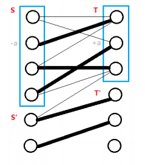

# 二分图最大权匹配 - OI Wiki

- Source: https://oi-wiki.org/graph/graph-matching/bigraph-weight-match/

# 二分图最大权匹配

二分图的最大权匹配是指二分图中边权和最大的匹配．

## Hungarian Algorithm（Kuhn–Munkres Algorithm）

匈牙利算法又称为 **KM** 算法，可以在 𝑂(𝑛3)O(n3) 时间内求出二分图的 **最大权完美匹配** ．

考虑到二分图中两个集合中的点并不总是相同，为了能应用 KM 算法解决二分图的最大权匹配，需要先作如下处理：将两个集合中点数比较少的补点，使得两边点数相同，再将不存在的边权重设为 00，这种情况下，问题就转换成求 **最大权完美匹配问题** ，从而能应用 KM 算法求解．

可行顶标

给每个节点 𝑖i 分配一个权值 𝑙(𝑖)l(i)，对于所有边 (𝑢,𝑣)(u,v) 满足 𝑤(𝑢,𝑣) ≤𝑙(𝑢) +𝑙(𝑣)w(u,v)≤l(u)+l(v)．

相等子图

在一组可行顶标下原图的生成子图，包含所有点但只包含满足 𝑤(𝑢,𝑣) =𝑙(𝑢) +𝑙(𝑣)w(u,v)=l(u)+l(v) 的边 (𝑢,𝑣)(u,v)．

定理 1 : 对于某组可行顶标，如果其相等子图存在完美匹配，那么，该匹配就是原二分图的最大权完美匹配．

证明 1.

考虑原二分图任意一组完美匹配 𝑀M，其边权和为

𝑣𝑎𝑙(𝑀) =∑(𝑢,𝑣)∈𝑀𝑤(𝑢,𝑣) ≤∑(𝑢,𝑣)∈𝑀𝑙(𝑢)+𝑙(𝑣) ≤∑𝑛𝑖=1𝑙(𝑖)val(M)=∑(u,v)∈Mw(u,v)≤∑(u,v)∈Ml(u)+l(v)≤∑i=1nl(i)

任意一组可行顶标的相等子图的完美匹配 𝑀′M′ 的边权和

𝑣𝑎𝑙(𝑀′) =∑(𝑢,𝑣)∈𝑀𝑙(𝑢)+𝑙(𝑣) =∑𝑛𝑖=1𝑙(𝑖)val(M′)=∑(u,v)∈Ml(u)+l(v)=∑i=1nl(i)

即任意一组完美匹配的边权和都不会大于 𝑣𝑎𝑙(𝑀′)val(M′)，那个 𝑀′M′ 就是最大权匹配．

有了定理 1，我们的目标就是透过不断的调整可行顶标，使得相等子图是完美匹配．

因为两边点数相等，假设点数为 𝑛n，𝑙𝑥(𝑖)lx(i) 表示左边第 𝑖i 个点的顶标，𝑙𝑦(𝑖)ly(i) 表示右边第 𝑖i 个点的顶标，𝑤(𝑢,𝑣)w(u,v) 表示左边第 𝑢u 个点和右边第 𝑣v 个点之间的权重．

首先初始化一组可行顶标，例如

𝑙𝑥(𝑖) =max1≤𝑗≤𝑛{𝑤(𝑖,𝑗)}, 𝑙𝑦(𝑖) =0lx(i)=max1≤j≤n{w(i,j)},ly(i)=0

然后选一个未匹配点，如同最大匹配一样求增广路．找到增广路就增广，否则，会得到一个交错树．

令 𝑆S，𝑇T 表示二分图左边右边在交错树中的点，𝑆′S′，𝑇′T′ 表示不在交错树中的点．



在相等子图中：

  * 𝑆 −𝑇′S−T′ 的边不存在，否则交错树会增长．
  * 𝑆′ −𝑇S′−T 一定是非匹配边，否则他就属于 𝑆S．

假设给 𝑆S 中的顶标 −𝑎−a，给 𝑇T 中的顶标 +𝑎+a，可以发现

  * 𝑆 −𝑇S−T 边依然存在相等子图中．
  * 𝑆′ −𝑇′S′−T′ 没变化．
  * 𝑆 −𝑇′S−T′ 中的 𝑙𝑥 +𝑙𝑦lx+ly 有所减少，可能加入相等子图．
  * 𝑆′ −𝑇S′−T 中的 𝑙𝑥 +𝑙𝑦lx+ly 会增加，所以不可能加入相等子图．

所以这个 𝑎a 值的选择，显然得是 𝑆 −𝑇′S−T′ 当中最小的边权，

𝑎 =min{𝑙𝑥(𝑢) +𝑙𝑦(𝑣) −𝑤(𝑢,𝑣)|𝑢 ∈𝑆,𝑣 ∈𝑇′}a=min{lx(u)+ly(v)−w(u,v)|u∈S,v∈T′}．

当一条新的边 (𝑢,𝑣)(u,v) 加入相等子图后有两种情况

  * 𝑣v 是未匹配点，则找到增广路
  * 𝑣v 和 𝑆′S′ 中的点已经匹配

这样至多修改 𝑛n 次顶标后，就可以找到增广路．

每次修改顶标的时候，交错树中的边不会离开相等子图，那么我们直接维护这棵树．

我们对 𝑇T 中的每个点 𝑣v 维护

𝑠𝑙𝑎𝑐𝑘(𝑣) =min{𝑙𝑥(𝑢) +𝑙𝑦(𝑣) −𝑤(𝑢,𝑣)|𝑢 ∈𝑆}slack(v)=min{lx(u)+ly(v)−w(u,v)|u∈S}．

所以可以在 𝑂(𝑛)O(n) 算出顶标修改值 𝑎a

𝑎 =min{𝑠𝑙𝑎𝑐𝑘(𝑣)|𝑣 ∈𝑇′}a=min{slack(v)|v∈T′}

交错树新增一个点进入 𝑆S 的时候需要 𝑂(𝑛)O(n) 更新 𝑠𝑙𝑎𝑐𝑘(𝑣)slack(v)．修改顶标需要 𝑂(𝑛)O(n) 给每个 𝑠𝑙𝑎𝑐𝑘(𝑣)slack(v) 减去 𝑎a．只要交错树找到一个未匹配点，就找到增广路．

一开始枚举 𝑛n 个点找增广路，为了找增广路需要延伸 𝑛n 次交错树，每次延伸需要 𝑛n 次维护，共 𝑂(𝑛3)O(n3)．

参考代码

```text 1 2 3 4 5 6 7 8 9 10 11 12 13 14 15 16 17 18 19 20 21 22 23 24 25 26 27 28 29 30 31 32 33 34 35 36 37 38 39 40 41 42 43 44 45 46 47 48 49 50 51 52 53 54 55 56 57 58 59 60 61 62 63 64 65 66 67 68 69 70 71 72 73 74 75 76 77 78 79 80 81 82 83 84 85 86 87 88 89 90 91 92 93 94 95 96 97 98 99 100 101 102 103 104 105 106 107 108 109 110 111 112 113 114 115 116 117 118 119 120 121 122 123 124 125 126 127 128 129 130 131 132 133 134 ``` |  ```text template < typename T > struct hungarian { // km int n ; vector < int > matchx ; // 左集合对应的匹配点 vector < int > matchy ; // 右集合对应的匹配点 vector < int > pre ; // 连接右集合的左点 vector < bool > visx ; // 拜访数组 左 vector < bool > visy ; // 拜访数组 右 vector < T > lx ; vector < T > ly ; vector < vector < T >> g ; vector < T > slack ; T inf ; T res ; queue < int > q ; int org_n ; int org_m ; hungarian ( int _n , int _m ) { org_n = _n ; org_m = _m ; n = max ( _n , _m ); inf = numeric_limits < T >:: max (); res = 0 ; g = vector < vector < T >> ( n , vector < T > ( n )); matchx = vector < int > ( n , -1 ); matchy = vector < int > ( n , -1 ); pre = vector < int > ( n ); visx = vector < bool > ( n ); visy = vector < bool > ( n ); lx = vector < T > ( n , \- inf ); ly = vector < T > ( n ); slack = vector < T > ( n ); } void addEdge ( int u , int v , int w ) { g [ u ][ v ] = max ( w , 0 ); // 负值还不如不匹配 因此设为0不影响 } bool check ( int v ) { visy [ v ] = true ; if ( matchy [ v ] != -1 ) { q . push ( matchy [ v ]); visx [ matchy [ v ]] = true ; // in S return false ; } // 找到新的未匹配点 更新匹配点 pre 数组记录着"非匹配边"上与之相连的点 while ( v != -1 ) { matchy [ v ] = pre [ v ]; swap ( v , matchx [ pre [ v ]]); } return true ; } void bfs ( int i ) { while ( ! q . empty ()) { q . pop (); } q . push ( i ); visx [ i ] = true ; while ( true ) { while ( ! q . empty ()) { int u = q . front (); q . pop (); for ( int v = 0 ; v < n ; v ++ ) { if ( ! visy [ v ]) { T delta = lx [ u ] \+ ly [ v ] \- g [ u ][ v ]; if ( slack [ v ] >= delta ) { pre [ v ] = u ; if ( delta ) { slack [ v ] = delta ; } else if ( check ( v )) { // delta=0 代表有机会加入相等子图 找增广路 // 找到就return 重建交错树 return ; } } } } } // 没有增广路 修改顶标 T a = inf ; for ( int j = 0 ; j < n ; j ++ ) { if ( ! visy [ j ]) { a = min ( a , slack [ j ]); } } for ( int j = 0 ; j < n ; j ++ ) { if ( visx [ j ]) { // S lx [ j ] -= a ; } if ( visy [ j ]) { // T ly [ j ] += a ; } else { // T' slack [ j ] -= a ; } } for ( int j = 0 ; j < n ; j ++ ) { if ( ! visy [ j ] && slack [ j ] == 0 && check ( j )) { return ; } } } } void solve () { // 初始顶标 for ( int i = 0 ; i < n ; i ++ ) { for ( int j = 0 ; j < n ; j ++ ) { lx [ i ] = max ( lx [ i ], g [ i ][ j ]); } } for ( int i = 0 ; i < n ; i ++ ) { fill ( slack . begin (), slack . end (), inf ); fill ( visx . begin (), visx . end (), false ); fill ( visy . begin (), visy . end (), false ); bfs ( i ); } // custom for ( int i = 0 ; i < n ; i ++ ) { if ( g [ i ][ matchx [ i ]] > 0 ) { res += g [ i ][ matchx [ i ]]; } else { matchx [ i ] = -1 ; } } cout << res << " \n " ; for ( int i = 0 ; i < org_n ; i ++ ) { cout << matchx [ i ] \+ 1 << " " ; } cout << " \n " ; } }; ```   
---|---  
  
## Dynamic Hungarian Algorithm

原论文 [The Dynamic Hungarian Algorithm for the Assignment Problem with Changing Costs](https://www.ri.cmu.edu/publications/the-dynamic-hungarian-algorithm-for-the-assignment-problem-with-changing-costs/)

伪代码更清晰的论文 [A Fast Dynamic Assignment Algorithm for Solving Resource Allocation Problems](https://www.researchgate.net/publication/352490780_A_Fast_Dynamic_Assignment_Algorithm_for_Solving_Resource_Allocation_Problems)

相关 OJ 问题 [DAP](https://www.spoj.com/problems/DAP/)

算法思路

  1. 修改单点 𝑢𝑖ui 和所有 𝑣𝑗vj 之间的权重，即权重矩阵中的一行
     * 修改顶标 𝑙𝑥(𝑢𝑖) =𝑚𝑎𝑥(𝑤𝑖𝑗 −𝑣𝑗),∀𝑗lx(ui)=max(wij−vj),∀j
     * 删除 𝑢𝑖ui 相关的匹配
  2. 修改所有 𝑢𝑖ui 和单点 𝑣𝑗vj 之间的权重，即权重矩阵中的一列
     * 修改顶标 𝑙𝑦(𝑣𝑗) =𝑚𝑎𝑥(𝑤𝑖𝑗 −𝑢𝑖),∀𝑖ly(vj)=max(wij−ui),∀i
     * 删除 𝑣𝑗vj 相关的匹配
  3. 修改单点 𝑢𝑖ui 和单点 𝑣𝑗vj 之间的权重，即权重矩阵中的单个元素
     * 做 1 或 2 两种操作之一即可
  4. 添加某一单点 𝑢𝑖ui，或者某一单点 𝑣𝑗vj，即在权重矩阵中添加或者删除一行或者一列
     * 对应地做 1 或 2 即可，注意此处加点操作仅为加点，不额外设定权重值，新加点与其他点的权重为 0.

算法证明

  * 设原图为 G，左右两边的顶标为 𝛼𝑖αi 和 𝛽𝑗βj，可行顶标为 l，那 𝐺𝑙Gl 是 G 的一个子图，包含图 G 中满足 𝑤𝑖𝑗 =𝑎𝑙𝑝ℎ𝑎𝑖 +𝑏𝑒𝑡𝑎𝑗wij=alphai+betaj 的点和边．
  * 在上面匈牙利算法的部分，定理一证明了：对于某组可行顶标，如果其相等子图存在完美匹配，那么，该匹配就是原二分图的最大权完美匹配．
  * 假设原来的最优匹配是 𝑀∗M∗, 当一个修改发生的时候，我们会根据规则更新可行顶标，更新后的顶标设为 𝛼𝑖∗αi∗, 或者 𝛽𝑗∗βj∗，会出现以下情况：
    1. 权重矩阵的一整行被修改了，设被修改的行为 𝑖∗i∗ 行，即 𝑣𝑖∗vi∗ 的所有边被修改了，所以 𝑣𝑖∗vi∗ 原来的顶标可能不满足条件，因为我们需要 𝑤𝑖∗𝑗 ≤𝑎𝑙𝑝ℎ𝑎𝑖∗ +𝑏𝑒𝑡𝑎𝑗wi∗j≤alphai∗+betaj，但对于其他的 𝑢𝑗uj 来说，除了 𝑖∗i∗ 相关的边，他们的边权是不变的，因此他们的顶标都是合法的，所以算法中修改了 𝑣𝑖∗vi∗ 相关的顶标使得这组顶标是一组可行顶标．
    2. 权重矩阵的一整列被修改了，同理可得算法修改顶标使得这组顶标是一组可行顶标．
    3. 修改权重矩阵某一元素，任意修改其中一个顶标即可满足顶标条件
  * 每一次权重矩阵被修改，都关系到一个特定节点，这个节点可能是左边的也可能是右边的，因此我们直接记为 𝑥x, 这个节点和某个节点 𝑦y 在原来的最优匹配中匹配上了．每一次修改操作，最多让这一对节点 unpair，因此我们只要跑一轮匈牙利算法中的搜索我们就能得到一个新的 match，而根据定理一，新跑出来的 match 是最优的．

以下代码应该为论文 2 作者提交的代码（以下代码为最大化权重版本，原始论文中为最小化 cost）

动态匈牙利算法参考代码

```text 1 2 3 4 5 6 7 8 9 10 11 12 13 14 15 16 17 18 19 20 21 22 23 24 25 26 27 28 29 30 31 32 33 34 35 36 37 38 39 40 41 42 43 44 45 46 47 48 49 50 51 52 53 54 55 56 57 58 59 60 61 62 63 64 65 66 67 68 69 70 71 72 73 74 75 76 77 78 79 80 81 82 83 84 85 86 87 88 89 90 91 92 93 94 95 96 97 98 99 100 101 102 103 104 105 106 107 108 109 110 111 112 113 114 115 116 117 118 119 120 121 122 123 124 125 126 127 128 129 130 131 132 133 134 135 136 137 138 139 140 141 142 143 144 145 146 147 148 149 150 151 152 153 154 155 156 157 158 159 160 161 162 163 164 165 166 167 168 169 170 171 172 173 174 175 176 177 178 179 180 181 182 183 184 185 186 187 ``` |  ```text #include <algorithm> #include <cstring> #include <iostream> #include <list> using namespace std ; using LL = long long ; constexpr LL INF = ( LL ) 1e15 ; constexpr int MAXV = 105 ; int N , mateS [ MAXV ], mateT [ MAXV ], p [ MAXV ]; LL u [ MAXV ], v [ MAXV ], slack [ MAXV ]; LL W [ MAXV ][ MAXV ]; bool m [ MAXV ]; list < int > Q ; void readMatrix () { cin >> N ; for ( int i = 0 ; i < N ; i ++ ) for ( int j = 0 ; j < N ; j ++ ) cin >> W [ i ][ j ]; } void initHungarian () { memset ( mateS , -1 , sizeof ( mateS )); memset ( mateT , -1 , sizeof ( mateT )); for ( int i = 0 ; i < N ; i ++ ) { u [ i ] = \- INF ; for ( int j = 0 ; j < N ; j ++ ) u [ i ] = max ( u [ i ], W [ i ][ j ]); v [ i ] = 0 ; } } void augment ( int j ) { int i , next ; do { i = p [ j ]; mateT [ j ] = i ; next = mateS [ i ]; mateS [ i ] = j ; if ( next != -1 ) j = next ; } while ( next != -1 ); } LL hungarian () { int nres = 0 ; for ( int i = 0 ; i < N ; i ++ ) if ( mateS [ i ] == -1 ) nres ++ ; while ( nres > 0 ) { for ( int i = 0 ; i < N ; i ++ ) { m [ i ] = false ; p [ i ] = -1 ; slack [ i ] = INF ; } bool aug = false ; Q . clear (); for ( int i = 0 ; i < N ; i ++ ) if ( mateS [ i ] == -1 ) { Q . push_back ( i ); break ; } do { int i , j ; i = Q . front (); Q . pop_front (); m [ i ] = true ; j = 0 ; while ( ! aug && j < N ) { if ( mateS [ i ] != j ) { LL minSlack = u [ i ] \+ v [ j ] \- W [ i ][ j ]; if ( minSlack < slack [ j ]) { slack [ j ] = minSlack ; p [ j ] = i ; if ( slack [ j ] == 0 ) { if ( mateT [ j ] == -1 ) { augment ( j ); aug = true ; nres \-- ; } else Q . push_back ( mateT [ j ]); } } } j ++ ; } if ( ! aug && Q . size () == 0 ) { LL minSlack = INF ; for ( int k = 0 ; k < N ; k ++ ) if ( slack [ k ] > 0 ) minSlack = min ( minSlack , slack [ k ]); for ( int k = 0 ; k < N ; k ++ ) if ( m [ k ]) u [ k ] -= minSlack ; int x = -1 ; bool X [ MAXV ]; for ( int k = 0 ; k < N ; k ++ ) if ( slack [ k ] == 0 ) v [ k ] += minSlack ; else { slack [ k ] -= minSlack ; if ( slack [ k ] == 0 && mateT [ k ] == -1 ) x = k ; if ( slack [ k ] == 0 ) X [ k ] = true ; else X [ k ] = false ; } if ( x == -1 ) { for ( int k = 0 ; k < N ; k ++ ) if ( X [ k ]) Q . push_back ( mateT [ k ]); } else { augment ( x ); aug = true ; nres \-- ; } } } while ( ! aug ); } LL ans = 0 ; for ( int i = 0 ; i < N ; i ++ ) ans += ( u [ i ] \+ v [ i ]); return ans ; } void dynamicHungarian () { char type [ 2 ]; LL w ; int i , j ; cin >> type ; if ( type [ 0 ] == 'C' ) { cin >> i >> j >> w ; if (( w < W [ i ][ j ]) && ( mateS [ i ] == j )) { W [ i ][ j ] = w ; if ( mateS [ i ] != -1 ) { mateT [ mateS [ i ]] = -1 ; mateS [ i ] = -1 ; } } else if (( w > W [ i ][ j ]) && ( u [ i ] \+ v [ j ] < w )) { W [ i ][ j ] = w ; u [ i ] = \- INF ; for ( int c = 0 ; c < N ; c ++ ) u [ i ] = max ( u [ i ], W [ i ][ c ] \- v [ c ]); if ( mateS [ i ] != j ) { mateT [ mateS [ i ]] = -1 ; mateS [ i ] = -1 ; } } else W [ i ][ j ] = w ; } else if ( type [ 0 ] == 'X' ) { cin >> i ; for ( int c = 0 ; c < N ; c ++ ) cin >> W [ i ][ c ]; if ( mateS [ i ] != -1 ) { mateT [ mateS [ i ]] = -1 ; mateS [ i ] = -1 ; } u [ i ] = \- INF ; for ( int c = 0 ; c < N ; c ++ ) u [ i ] = max ( u [ i ], W [ i ][ c ] \- v [ c ]); } else if ( type [ 0 ] == 'Y' ) { cin >> j ; for ( int r = 0 ; r < N ; r ++ ) cin >> W [ r ][ j ]; if ( mateT [ j ] != -1 ) { mateS [ mateT [ j ]] = -1 ; mateT [ j ] = -1 ; } v [ j ] = \- INF ; for ( int r = 0 ; r < N ; r ++ ) v [ j ] = max ( v [ j ], W [ r ][ j ] \- u [ r ]); } else if ( type [ 0 ] == 'A' ) { i = j = N ++ ; u [ i ] = \- INF ; for ( int c = 0 ; c < N ; c ++ ) u [ i ] = max ( u [ i ], W [ i ][ c ] \- v [ c ]); v [ j ] = \- INF ; for ( int r = 0 ; r < N ; r ++ ) v [ j ] = max ( v [ j ], W [ r ][ j ] \- u [ r ]); } else if ( type [ 0 ] == 'Q' ) cout << hungarian () << '\n' ; } int main () { cin . tie ( nullptr ) -> sync_with_stdio ( false ); readMatrix (); initHungarian (); LL ans = hungarian (); int M ; cin >> M ; while ( M \-- ) dynamicHungarian (); return 0 ; } ```   
---|---  
  
## 转化为费用流模型

与 [二分图最大匹配](../bigraph-match/) 类似，二分图的最大权匹配也可以转化为网络流问题来求解．

首先，在图中新增一个源点和一个汇点．

从源点向二分图的每个左部点连一条流量为 11，费用为 00 的边，从二分图的每个右部点向汇点连一条流量为 11，费用为 00 的边．

接下来对于二分图中每一条连接左部点 𝑢u 和右部点 𝑣v，边权为 𝑤w 的边，则连一条从 𝑢u 到 𝑣v，流量为 11，费用为 𝑤w 的边．

另外，考虑到最大权匹配下，匹配边的数量不一定与最大匹配的匹配边数量相等，因此对于每个左部点，还需向汇点连一条流量为 11，费用为 00 的边．

求这个网络的 [最大费用最大流](../../flow/min-cost/) 即可得到答案．此时，该网络的最大流量一定为左部点的数量，而最大流量下的最大费用即对应一个最大权匹配方案．

## 习题

[UOJ #80. 二分图最大权匹配](https://uoj.ac/problem/80)

模板题

```text 1 2 3 4 5 6 7 8 9 10 11 12 13 14 15 16 17 18 19 20 21 22 23 24 25 26 27 28 29 30 31 32 33 34 35 36 37 38 39 40 41 42 43 44 45 46 47 48 49 50 51 52 53 54 55 56 57 58 59 60 61 62 63 64 65 66 67 68 69 70 71 72 73 74 75 76 77 78 79 80 81 82 83 84 85 86 87 88 89 90 91 92 93 94 95 96 97 98 99 100 101 102 103 104 105 106 107 108 109 110 111 112 113 114 115 116 117 118 119 120 121 122 123 124 125 126 127 128 129 130 131 132 133 134 135 136 137 138 139 140 141 142 143 144 145 146 147 148 ``` |  ```text #include <iostream> #include <limits> #include <queue> #include <vector> using namespace std ; template < typename T > struct hungarian { // km int n ; vector < int > matchx , matchy , pre ; vector < bool > visx , visy ; vector < T > lx , ly ; vector < vector < T >> g ; vector < T > slack ; T inf , res ; queue < int > q ; int org_n , org_m ; hungarian ( int _n , int _m ) { org_n = _n ; org_m = _m ; n = max ( _n , _m ); inf = numeric_limits < T >:: max (); res = 0 ; g = vector < vector < T >> ( n , vector < T > ( n )); matchx = vector < int > ( n , -1 ); matchy = vector < int > ( n , -1 ); pre = vector < int > ( n ); visx = vector < bool > ( n ); visy = vector < bool > ( n ); lx = vector < T > ( n , \- inf ); ly = vector < T > ( n ); slack = vector < T > ( n ); } void addEdge ( int u , int v , int w ) { g [ u ][ v ] = max ( w , 0 ); // 负值还不如不匹配 因此设为0不影响 } bool check ( int v ) { visy [ v ] = true ; if ( matchy [ v ] != -1 ) { q . push ( matchy [ v ]); visx [ matchy [ v ]] = true ; return false ; } while ( v != -1 ) { matchy [ v ] = pre [ v ]; swap ( v , matchx [ pre [ v ]]); } return true ; } void bfs ( int i ) { while ( ! q . empty ()) { q . pop (); } q . push ( i ); visx [ i ] = true ; while ( true ) { while ( ! q . empty ()) { int u = q . front (); q . pop (); for ( int v = 0 ; v < n ; v ++ ) { if ( ! visy [ v ]) { T delta = lx [ u ] \+ ly [ v ] \- g [ u ][ v ]; if ( slack [ v ] >= delta ) { pre [ v ] = u ; if ( delta ) { slack [ v ] = delta ; } else if ( check ( v )) { return ; } } } } } // 没有增广路 修改顶标 T a = inf ; for ( int j = 0 ; j < n ; j ++ ) { if ( ! visy [ j ]) { a = min ( a , slack [ j ]); } } for ( int j = 0 ; j < n ; j ++ ) { if ( visx [ j ]) { // S lx [ j ] -= a ; } if ( visy [ j ]) { // T ly [ j ] += a ; } else { // T' slack [ j ] -= a ; } } for ( int j = 0 ; j < n ; j ++ ) { if ( ! visy [ j ] && slack [ j ] == 0 && check ( j )) { return ; } } } } void solve () { // 初始顶标 for ( int i = 0 ; i < n ; i ++ ) { for ( int j = 0 ; j < n ; j ++ ) { lx [ i ] = max ( lx [ i ], g [ i ][ j ]); } } for ( int i = 0 ; i < n ; i ++ ) { fill ( slack . begin (), slack . end (), inf ); fill ( visx . begin (), visx . end (), false ); fill ( visy . begin (), visy . end (), false ); bfs ( i ); } // custom for ( int i = 0 ; i < n ; i ++ ) { if ( g [ i ][ matchx [ i ]] > 0 ) { res += g [ i ][ matchx [ i ]]; } else { matchx [ i ] = -1 ; } } cout << res << " \n " ; for ( int i = 0 ; i < org_n ; i ++ ) { cout << matchx [ i ] \+ 1 << " " ; } cout << " \n " ; } }; int main () { ios :: sync_with_stdio ( false ), cin . tie ( nullptr ); int n , m , e ; cin >> n >> m >> e ; hungarian < long long > solver ( n , m ); int u , v , w ; for ( int i = 0 ; i < e ; i ++ ) { cin >> u >> v >> w ; u \-- , v \-- ; solver . addEdge ( u , v , w ); } solver . solve (); } ```   
---|---  
  
* * *

> __本页面最近更新： 2026/1/7 08:56:54，[更新历史](https://github.com/OI-wiki/OI-wiki/commits/master/docs/graph/graph-matching/bigraph-weight-match.md)  
>  __发现错误？想一起完善？[在 GitHub 上编辑此页！](https://oi-wiki.org/edit-landing/?ref=/graph/graph-matching/bigraph-weight-match.md "edit.link.title")  
>  __本页面贡献者：[StudyingFather](https://github.com/StudyingFather), [Enter-tainer](https://github.com/Enter-tainer), [H-J-Granger](https://github.com/H-J-Granger), [Tiphereth-A](https://github.com/Tiphereth-A), [countercurrent-time](https://github.com/countercurrent-time), [NachtgeistW](https://github.com/NachtgeistW), [guodong2005](https://github.com/guodong2005), [310552025atNYCU](https://github.com/310552025atNYCU), [AngelKitty](https://github.com/AngelKitty), [Backl1ght](https://github.com/Backl1ght), [CCXXXI](https://github.com/CCXXXI), [Chrogeek](https://github.com/Chrogeek), [cjsoft](https://github.com/cjsoft), [diauweb](https://github.com/diauweb), [Early0v0](https://github.com/Early0v0), [ezoixx130](https://github.com/ezoixx130), [GekkaSaori](https://github.com/GekkaSaori), [Henry-ZHR](https://github.com/Henry-ZHR), [Ir1d](https://github.com/Ir1d), [Konano](https://github.com/Konano), [LovelyBuggies](https://github.com/LovelyBuggies), [Makkiy](https://github.com/Makkiy), [mgt](mailto:i@margatroid.xyz), [minghu6](https://github.com/minghu6), [P-Y-Y](https://github.com/P-Y-Y), [PotassiumWings](https://github.com/PotassiumWings), [SamZhangQingChuan](https://github.com/SamZhangQingChuan), [sshwy](https://github.com/sshwy), [Suyun514](mailto:suyun514@qq.com), [weiyong1024](https://github.com/weiyong1024), [Xeonacid](https://github.com/Xeonacid), [accelsao](https://github.com/accelsao), [GavinZhengOI](https://github.com/GavinZhengOI), [Gesrua](https://github.com/Gesrua), [Great-designer](https://github.com/Great-designer), [kxccc](https://github.com/kxccc), [lychees](https://github.com/lychees), [Peanut-Tang](https://github.com/Peanut-Tang), [SukkaW](https://github.com/SukkaW), [TachikakaMin](https://github.com/TachikakaMin)  
>  __本页面的全部内容在**[CC BY-SA 4.0](https://creativecommons.org/licenses/by-sa/4.0/deed.zh) 和 [SATA](https://github.com/zTrix/sata-license)** 协议之条款下提供，附加条款亦可能应用
