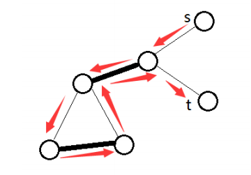
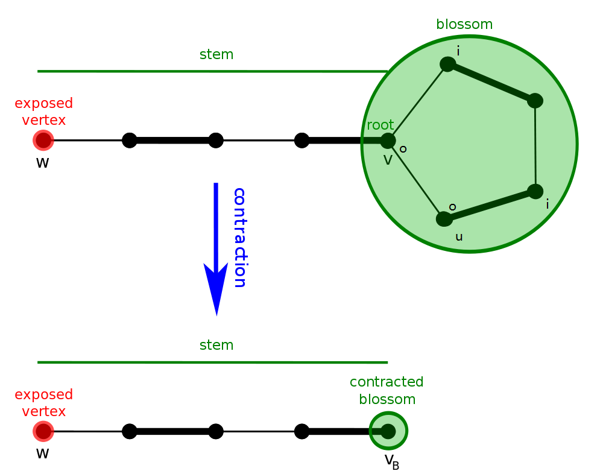
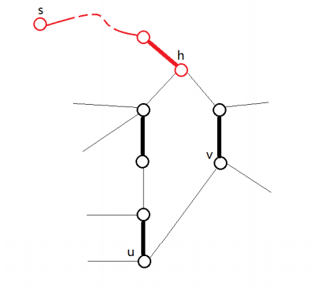
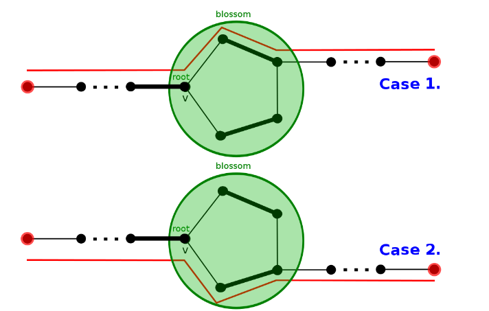

# 一般图最大匹配 - OI Wiki

- Source: https://oi-wiki.org/graph/graph-matching/general-match/

# 一般图最大匹配

## 带花树算法（Blossom Algorithm）

开花算法（Blossom Algorithm，也被称做带花树）可以解决一般图最大匹配问题（maximum cardinality matchings）．此算法由 Jack Edmonds 在 1961 年提出． 经过一些修改后也可以解决一般图最大权匹配问题． 此算法是第一个给出证明说最大匹配有多项式复杂度．

一般图匹配和二分图匹配（bipartite matching）不同的是，图可能存在奇环．



以此图为例，若直接取反（匹配边和未匹配边对调），会使得取反后的 𝑀M 不合法，某些点会出现在两条匹配上，而问题就出在奇环．

下面考虑一般图的增广算法． 从二分图的角度出发，每次枚举一个未匹配点，设出发点为根，标记为 **「o」** ，接下来交错标记 **「o」** 和 **「i」** ，不难发现 **「i」** 到 **「o」** 这段边是匹配边．

假设当前点是 𝑣v，相邻点为 𝑢u，可以分为以下两种情况：

  1. 𝑢u 未拜访过，当 𝑢u 是未匹配点，则找到增广路径，否则从 𝑢u 的配偶找增广路．
  2. 𝑢u 已拜访过，遇到标记「o」代表需要 **缩花** ，否则代表遇到偶环，跳过．

遇到偶环的情况，将他视为二分图解决，故可忽略．**缩花** 后，再新图中继续找增广路．



设原图为 𝐺G，**缩花** 后的图为 𝐺′G′，我们只需要证明：

  1. 若 𝐺G 存在增广路，𝐺′G′ 也存在．
  2. 若 𝐺′G′ 存在增广路，𝐺G 也存在．



设非树边（形成环的那条边）为 (𝑢,𝑣)(u,v)，定义花根 ℎ =𝐿𝐶𝐴(𝑢,𝑣)h=LCA(u,v)． 奇环是交替的，有且仅有 ℎh 的两条邻边类型相同，都是非匹配边． 那么进入 ℎh 的树边肯定是匹配边，环上除了 ℎh 以外其他点往环外的边都是非匹配边．

观察可知，从环外的边出去有两种情况，顺时针或逆时针．



于是 **缩花** 与 **不缩花** 都不影响正确性．

实作上找到 **花** 以后我们不需要真的 **缩花** ，可以用数组纪录每个点在以哪个点为根的那朵花中．

### 复杂度分析 Complexity Analysis

每次找增广路，遍历所有边，遇到 **花** 会维护 **花** 上的点，𝑂(|𝐸|2)O(|E|2)．

枚举所有未匹配点做增广路，总共 𝑂(|𝑉||𝐸|2)O(|V||E|2)．

### 参考代码

参考代码

```text 1 2 3 4 5 6 7 8 9 10 11 12 13 14 15 16 17 18 19 20 21 22 23 24 25 26 27 28 29 30 31 32 33 34 35 36 37 38 39 40 41 42 43 44 45 46 47 48 49 50 51 52 53 54 55 56 57 58 59 60 61 62 63 64 65 66 67 68 69 70 71 72 73 74 75 76 77 78 79 80 81 82 83 84 85 86 87 88 89 90 91 92 93 94 95 96 97 98 99 100 101 102 103 104 105 106 107 108 109 110 111 112 113 114 115 116 117 118 119 120 121 122 123 124 125 126 127 128 129 130 131 132 133 134 135 136 137 138 139 140 141 142 143 144 145 146 147 148 149 150 151 152 153 154 155 156 157 158 159 160 161 162 ``` |  ```text // graph template < typename T > class graph { public : struct edge { int from ; int to ; T cost ; }; vector < edge > edges ; vector < vector < int >> g ; int n ; graph ( int _n ) : n ( _n ) { g . resize ( n ); } virtual int add ( int from , int to , T cost ) = 0 ; }; // undirectedgraph template < typename T > class undirectedgraph : public graph < T > { public : using graph < T >:: edges ; using graph < T >:: g ; using graph < T >:: n ; undirectedgraph ( int _n ) : graph < T > ( _n ) {} int add ( int from , int to , T cost = 1 ) { assert ( 0 <= from && from < n && 0 <= to && to < n ); int id = ( int ) edges . size (); g [ from ]. push_back ( id ); g [ to ]. push_back ( id ); edges . push_back ({ from , to , cost }); return id ; } }; // blossom / find_max_unweighted_matching template < typename T > vector < int > find_max_unweighted_matching ( const undirectedgraph < T > & g ) { std :: mt19937 rng ( std :: random_device {}()); vector < int > match ( g . n , -1 ); // 匹配 vector < int > aux ( g . n , -1 ); // 时间戳记 vector < int > label ( g . n ); // 「o」或「i」 vector < int > orig ( g . n ); // 花根 vector < int > parent ( g . n , -1 ); // 父节点 queue < int > q ; int aux_time = -1 ; auto lca = [ & ]( int v , int u ) { aux_time ++ ; while ( true ) { if ( v != -1 ) { if ( aux [ v ] == aux_time ) { // 找到拜访过的点 也就是LCA return v ; } aux [ v ] = aux_time ; if ( match [ v ] == -1 ) { v = -1 ; } else { v = orig [ parent [ match [ v ]]]; // 以匹配点的父节点继续寻找 } } swap ( v , u ); } }; // lca auto blossom = [ & ]( int v , int u , int a ) { while ( orig [ v ] != a ) { parent [ v ] = u ; u = match [ v ]; if ( label [ u ] == 1 ) { // 初始点设为「o」找增广路 label [ u ] = 0 ; q . push ( u ); } orig [ v ] = orig [ u ] = a ; // 缩花 v = parent [ u ]; } }; // blossom auto augment = [ & ]( int v ) { while ( v != -1 ) { int pv = parent [ v ]; int next_v = match [ pv ]; match [ v ] = pv ; match [ pv ] = v ; v = next_v ; } }; // augment auto bfs = [ & ]( int root ) { fill ( label . begin (), label . end (), -1 ); iota ( orig . begin (), orig . end (), 0 ); while ( ! q . empty ()) { q . pop (); } q . push ( root ); // 初始点设为「o」，这里以「0」代替「o」，「1」代替「i」 label [ root ] = 0 ; while ( ! q . empty ()) { int v = q . front (); q . pop (); for ( int id : g . g [ v ]) { auto & e = g . edges [ id ]; int u = e . from ^ e . to ^ v ; if ( label [ u ] == -1 ) { // 找到未拜访点 label [ u ] = 1 ; // 标记「i」 parent [ u ] = v ; if ( match [ u ] == -1 ) { // 找到未匹配点 augment ( u ); // 寻找增广路径 return true ; } // 找到已匹配点 将与她匹配的点丢入queue 延伸交错树 label [ match [ u ]] = 0 ; q . push ( match [ u ]); continue ; } else if ( label [ u ] == 0 && orig [ v ] != orig [ u ]) { // 找到已拜访点 且标记同为「o」代表找到「花」 int a = lca ( orig [ v ], orig [ u ]); // 找LCA 然后缩花 blossom ( u , v , a ); blossom ( v , u , a ); } } } return false ; }; // bfs auto greedy = [ & ]() { vector < int > order ( g . n ); // 随机打乱 order iota ( order . begin (), order . end (), 0 ); shuffle ( order . begin (), order . end (), rng ); // 将可以匹配的点匹配 for ( int i : order ) { if ( match [ i ] == -1 ) { for ( auto id : g . g [ i ]) { auto & e = g . edges [ id ]; int to = e . from ^ e . to ^ i ; if ( match [ to ] == -1 ) { match [ i ] = to ; match [ to ] = i ; break ; } } } } }; // greedy // 一开始先随机匹配 greedy (); // 对未匹配点找增广路 for ( int i = 0 ; i < g . n ; i ++ ) { if ( match [ i ] == -1 ) { bfs ( i ); } } return match ; } ```   
---|---  
  
[UOJ #79. 一般图最大匹配](https://uoj.ac/problem/79)

```text 1 2 3 4 5 6 7 8 9 10 11 12 13 14 15 16 17 18 19 20 21 22 23 24 25 26 27 28 29 30 31 32 33 34 35 36 37 38 39 40 41 42 43 44 45 46 47 48 49 50 51 52 53 54 55 56 57 58 59 60 61 62 63 64 65 66 67 68 69 70 71 72 73 74 75 76 77 78 79 80 81 82 83 84 85 86 87 88 89 90 91 92 93 94 95 96 97 98 99 100 101 102 103 104 105 106 107 108 109 110 111 112 113 114 115 116 117 118 119 120 121 122 123 124 125 126 127 128 129 130 131 132 133 134 135 136 137 138 139 140 141 142 143 144 145 146 147 148 149 150 151 152 153 154 155 156 157 158 159 160 161 162 163 164 165 166 167 168 169 170 171 172 173 174 175 176 177 178 179 180 181 182 183 184 185 186 187 188 189 190 191 192 193 194 195 196 197 ``` |  ```text #include <algorithm> #include <cassert> #include <iostream> #include <numeric> #include <queue> #include <random> #include <vector> using namespace std ; // graph template < typename T > class graph { public : struct edge { int from ; int to ; T cost ; }; vector < edge > edges ; vector < vector < int >> g ; int n ; graph ( int _n ) : n ( _n ) { g . resize ( n ); } virtual int add ( int from , int to , T cost ) = 0 ; }; // undirectedgraph template < typename T > class undirectedgraph : public graph < T > { public : using graph < T >:: edges ; using graph < T >:: g ; using graph < T >:: n ; undirectedgraph ( int _n ) : graph < T > ( _n ) {} int add ( int from , int to , T cost = 1 ) { assert ( 0 <= from && from < n && 0 <= to && to < n ); int id = ( int ) edges . size (); g [ from ]. push_back ( id ); g [ to ]. push_back ( id ); edges . push_back ({ from , to , cost }); return id ; } }; // blossom / find_max_unweighted_matching template < typename T > vector < int > find_max_unweighted_matching ( const undirectedgraph < T > & g ) { std :: mt19937 rng ( 114514 ); // 这里随机种子是无关紧要的 // 也可以用 chrono::steady_clock::now().time_since_epoch().count() // 获取当前时间 vector < int > match ( g . n , -1 ); // 匹配 vector < int > aux ( g . n , -1 ); // 时间戳记 vector < int > label ( g . n ); // "o" or "i" vector < int > orig ( g . n ); // 花根 vector < int > parent ( g . n , -1 ); // 父节点 queue < int > q ; int aux_time = -1 ; auto lca = [ & ]( int v , int u ) { aux_time ++ ; while ( true ) { if ( v != -1 ) { if ( aux [ v ] == aux_time ) { // 找到拜访过的点 也就是LCA return v ; } aux [ v ] = aux_time ; if ( match [ v ] == -1 ) { v = -1 ; } else { v = orig [ parent [ match [ v ]]]; // 以匹配点的父节点继续寻找 } } swap ( v , u ); } }; // lca auto blossom = [ & ]( int v , int u , int a ) { while ( orig [ v ] != a ) { parent [ v ] = u ; u = match [ v ]; if ( label [ u ] == 1 ) { // 初始点设为"o" 找增广路 label [ u ] = 0 ; q . push ( u ); } orig [ v ] = orig [ u ] = a ; // 缩花 v = parent [ u ]; } }; // blossom auto augment = [ & ]( int v ) { while ( v != -1 ) { int pv = parent [ v ]; int next_v = match [ pv ]; match [ v ] = pv ; match [ pv ] = v ; v = next_v ; } }; // augment auto bfs = [ & ]( int root ) { fill ( label . begin (), label . end (), -1 ); iota ( orig . begin (), orig . end (), 0 ); while ( ! q . empty ()) { q . pop (); } q . push ( root ); // 初始点设为 "o", 这里以"0"代替"o", "1"代替"i" label [ root ] = 0 ; while ( ! q . empty ()) { int v = q . front (); q . pop (); for ( int id : g . g [ v ]) { auto & e = g . edges [ id ]; int u = e . from ^ e . to ^ v ; if ( label [ u ] == -1 ) { // 找到未拜访点 label [ u ] = 1 ; // 标记 "i" parent [ u ] = v ; if ( match [ u ] == -1 ) { // 找到未匹配点 augment ( u ); // 寻找增广路径 return true ; } // 找到已匹配点 将与她匹配的点丢入queue 延伸交错树 label [ match [ u ]] = 0 ; q . push ( match [ u ]); continue ; } else if ( label [ u ] == 0 && orig [ v ] != orig [ u ]) { // 找到已拜访点 且标记同为"o" 代表找到"花" int a = lca ( orig [ v ], orig [ u ]); // 找LCA 然后缩花 blossom ( u , v , a ); blossom ( v , u , a ); } } } return false ; }; // bfs auto greedy = [ & ]() { vector < int > order ( g . n ); // 随机打乱 order iota ( order . begin (), order . end (), 0 ); shuffle ( order . begin (), order . end (), rng ); // 将可以匹配的点匹配 for ( int i : order ) { if ( match [ i ] == -1 ) { for ( auto id : g . g [ i ]) { auto & e = g . edges [ id ]; int to = e . from ^ e . to ^ i ; if ( match [ to ] == -1 ) { match [ i ] = to ; match [ to ] = i ; break ; } } } } }; // greedy // 一开始先随机匹配 greedy (); // 对未匹配点找增广路 for ( int i = 0 ; i < g . n ; i ++ ) { if ( match [ i ] == -1 ) { bfs ( i ); } } return match ; } int main () { ios :: sync_with_stdio ( false ); int n , m ; cin >> n >> m ; undirectedgraph < int > g ( n ); while ( m \-- ) { int u , v ; cin >> u >> v ; g . add ( u \- 1 , v \- 1 ); // 0-based } auto match = find_max_unweighted_matching ( g ); cout << count_if ( match . begin (), match . end (), []( int x ) { return x != -1 ; }) / 2 << endl ; for ( int i = 0 ; i < n ; i ++ ) cout << match [ i ] \+ 1 << " \n " [ i == n \- 1 ]; return 0 ; } ```   
---|---  
  
## 基于高斯消元的一般图匹配算法

提示

在阅读以下内容前，你可能需要先阅读「线性代数」部分中关于矩阵的内容：

  * [矩阵](../../../math/linear-algebra/matrix/)
  * [行列式](../../../math/linear-algebra/determinant/)
  * [高斯消元](../../../math/numerical/gauss/)

这一部分将介绍一种基于高斯消元的一般图匹配算法．与传统的带花树算法相比，它的优势在于更易于理解与编写，同时便于解决「最大匹配中的必须点」等问题；缺点在于常数比较大，因为高斯消元的 𝑂(𝑛3)O(n3) 基本是跑满的，而带花树一般跑不满．

### 前置知识：Tutte 矩阵

**定义** ：对于一张 𝑛n 个点的无向图 𝐺 =(𝑉,𝐸)G=(V,E)，其 Tutte 矩阵 ˜𝐴(𝐺)A~(G) 为一个 𝑛 ×𝑛n×n 的矩阵，其中：

˜𝐴(𝐺)𝑖,𝑗=⎧{ {⎨{ {⎩𝑥𝑖,𝑗,𝑖<𝑗,(𝑣𝑖,𝑣𝑗)∈𝐸−𝑥𝑖,𝑗,𝑖>𝑗,(𝑣𝑖,𝑣𝑗)∈𝐸0,otherwiseA~(G)i,j={xi,j,i<j,(vi,vj)∈E−xi,j,i>j,(vi,vj)∈E0,otherwise

其中 𝑥𝑖,𝑗xi,j 是一个变量，因此 ˜𝐴(𝐺)A~(G) 中共有 |𝐸||E| 个变量．

在无歧义的情况下，以下将 ˜𝐴(𝐺)A~(G) 简写为 ˜𝐴A~．

**定理** （Tutte 定理）：𝐺G 存在完美匹配当且仅当 det⁡˜𝐴 ≠0det⁡A~≠0．

证明

这里引入「偶环覆盖」的概念：一个无向图 𝐺G 的偶环覆盖指用若干偶环（包括二元环）不重不漏地覆盖所有的点．

易证 𝐺G 存在完美匹配当且仅当 𝐺G 存在偶环覆盖．

  * 如果 𝐺G 存在偶环覆盖，我们只需要在每个环都隔一条取一条边，就可以得到一个完美匹配．
  * 如果 𝐺G 存在完美匹配，我们只需要将匹配边对应的二元环取出，就可以得到一个偶环覆盖．

然后证明 𝐺G 存在偶环覆盖当且仅当 ˜𝐴 ≠0A~≠0．

考虑行列式的定义

det⁡𝐴=∑𝜋(−1)𝜋∏𝑖𝐴𝑖,𝜋𝑖det⁡A=∑π(−1)π∏iAi,πi

其中 𝜋π 是任意排列，( −1)𝜋(−1)π 表示若 𝜋π 中的逆序对数为奇数，则取 −1−1，否则取 11．

不难看出每个排列都可以被看作 𝐺G 的一个环覆盖．如果这个环覆盖中存在奇环，则将这个环翻转后的和一定为 00，因此只有偶环覆盖才能使行列式不为 00，证毕．

**定理** ：rank⁡˜𝐴rank⁡A~ 一定为偶数，并且 𝐺G 的最大匹配的大小等于 rank⁡˜𝐴rank⁡A~ 的一半．

证明

反对称矩阵的秩只能是偶数；后者请读者自行思考．

实际应用中不可能带着 |𝐸||E| 个变量进行计算，不过可以取一个数域，例如取某个素数 𝑝p 的剩余系 Z𝑝Zp，将变量分别随机替换为 Z𝑝Zp 中的数，再进行计算．方便起见，在无歧义的情况下，以下用 ˜𝐴A~ 直接指代替换后的矩阵．

**定理** ：rank⁡˜𝐴rank⁡A~ 至多为 𝐺G 的最大匹配大小的两倍，并且二者相等的概率至少为 1 −𝑛𝑝1−np．

考虑到一般图最大匹配中 𝑛n 基本不会超过 103103，实际中 𝑝p 取 109109 数量级的素数就足够了．

由定理可知，如果只需要求最大匹配数，而无需匹配方案，那么只需要用一次高斯消元求出 rank⁡˜𝐴rank⁡A~ 即可，远比带花树简洁．不过如果需要输出方案，会稍微复杂一些，需要用到下面介绍的算法．

### 构造完美匹配

由 Tutte 定理和上面的定理可知，如果 𝐺G 存在完美匹配，那么 ˜𝐴A~ 有很大概率满秩．方便起见，以下叙述中均省略「有很大概率」．

记 𝐺G 中标号为 𝑖i 的点为 𝑣𝑖vi，进一步地我们有如下定理：

**定理** ：˜𝐴−1𝑗,𝑖 ≠0 ⟺ 𝐺 −{𝑣𝑖,𝑣𝑗}A~j,i−1≠0⟺G−{vi,vj} 有完美匹配．

逆矩阵与伴随矩阵

对任意 𝑛n 阶方阵 𝐴A，定义其伴随矩阵为 𝐴∗𝑖,𝑗 =( −1)𝑖+𝑗𝑀𝑗,𝑖Ai,j∗=(−1)i+jMj,i，其中 𝑀𝑗,𝑖Mj,i 为删去第 𝑗j 行第 𝑖i 列的余子式．换言之，设 𝐴A 的代数余子式矩阵为 𝑀M，则 𝐴∗ =𝑀𝑇A∗=MT．

**定理** ：如果 𝐴A 可逆，那么 𝐴−1 =1det⁡𝐴𝐴∗A−1=1det⁡AA∗．

所以这里的 𝐴−1𝑗,𝑖 ≠0 ⟺ 𝑀𝑖,𝑗 ≠0Aj,i−1≠0⟺Mi,j≠0，也就是 𝐴A 删去第 𝑖i 行第 𝑗j 列后的部分满秩．

换言之，如果 (𝑣𝑖,𝑣𝑗) ∈𝐸(vi,vj)∈E，并且 ˜𝐴−1𝑗,𝑖 ≠0A~j,i−1≠0，就表明存在一个完美匹配方案包含 (𝑣𝑖,𝑣𝑗)(vi,vj) 这条边．以下将这种边称为 **可行边** ．

由如上定理，对于一个有完美匹配的无向图 𝐺G，我们可以得到一个比较显然的暴力算法来寻找一组完美匹配：每次枚举 𝑖,𝑗i,j，如果 (𝑣𝑖,𝑣𝑗)(vi,vj) 是一条可行边（连边存在，并且 ˜𝐴−1𝑗,𝑖 ≠0A~j,i−1≠0），就将 (𝑣𝑖,𝑣𝑗)(vi,vj) 加入匹配方案，并在 𝐺G 中都删掉这两个点，再重新计算新的 ˜𝐴−1A~−1．

总共要做 𝑛2n2 轮，每轮都是 𝑂(𝑛3)O(n3) 的，总的复杂度是 𝑂(𝑛4)O(n4)，有点慢了．实际上我们在重新计算 ˜𝐴−1A~−1 时，不必每次都重新用高斯消元求逆矩阵，而是可以利用如下定理：

**定理** （消去定理）：令

𝐴=[𝑎1,1𝑣𝑇𝑢𝐵]𝐴−1=[ˆ𝑎1,1ˆ𝑣𝑇ˆ𝑢ˆ𝐵]A=[a1,1vTuB]A−1=[a^1,1v^Tu^B^]

并且 ˆ𝑎1,1 ≠0a^1,1≠0, 那么就有

𝐵−1=ˆ𝐵−ˆ𝑢ˆ𝑣𝑇ˆ𝑎1,1B−1=B^−u^v^Ta^1,1

定理中描述的是消去第一行第一列的情况．实际上，它可以非常显然地推广到消去任意一行一列的情况，因此我们只需在算法最开始计算一次 ˜𝐴−1A~−1，后面每次删除两个点时，只需执行两次 𝑂(𝑛2)O(n2) 的消去过程即可．

描述有些抽象，可以参考 C++ 代码

```text 1 2 3 4 5 6 7 8 9 10 11 12 13 14 ``` |  ```text void eliminate ( int A [][ MAXN ], int r , int c ) { // 消去第 r 行第 c 列 row_marked [ r ] = col_marked [ c ] = true ; // 已经被消掉 int inv = quick_power ( A [ r ][ c ], p \- 2 ); // 逆元 for ( int i = 1 ; i <= n ; i ++ ) if ( ! row_marked [ i ] && A [ i ][ c ]) { int tmp = ( long long ) A [ i ][ c ] * inv % p ; for ( int j = 1 ; j <= n ; j ++ ) if ( ! col_marked [ j ] && A [ r ][ j ]) A [ i ][ j ] = ( A [ i ][ j ] \- ( long long ) tmp * A [ r ][ j ]) % p ; } } ```   
---|---  
  
总共要做 𝑛2n2 轮，每轮复杂度为 𝑂(𝑛2)O(n2)，因此上述算法可以在 𝑂(𝑛3)O(n3) 的时间内找到一组完美匹配．

### 构造最大匹配

我们刚刚已经解决了构造一组完美匹配的问题，但是求解问题时一般需要最大匹配．

前面已经提到，𝐺G 的最大匹配大小等于 rank⁡˜𝐴rank⁡A~ 的一半．如果我们能找到 ˜𝐴A~ 的一个最大满秩子方阵，那么对子方阵对应的导出子图求出一组完美匹配，即可找到 𝐺G 的一组最大匹配．

换一个角度考虑，如果 𝐺G 有完美匹配，那么 ˜𝐴A~ 满秩，换言之，˜𝐴A~ 是线性无关的．那么如果 ˜𝐴A~ 不是满秩的，我们可以求出 ˜𝐴A~ 的一组线性基，然后只保留线性基对应的行列，就可以得到 ˜𝐴A~ 的一个最大满秩子方阵．

求出最大满秩子方阵之后，再用上面的算法找出导出子图的一组完美匹配，即可得到原图的一组最大匹配．注意由于高斯消元中可能会有行的交换，因此实现时要注意维护好点的编号．

[UOJ #79. 一般图最大匹配](https://uoj.ac/problem/79)

```text 1 2 3 4 5 6 7 8 9 10 11 12 13 14 15 16 17 18 19 20 21 22 23 24 25 26 27 28 29 30 31 32 33 34 35 36 37 38 39 40 41 42 43 44 45 46 47 48 49 50 51 52 53 54 55 56 57 58 59 60 61 62 63 64 65 66 67 68 69 70 71 72 73 74 75 76 77 78 79 80 81 82 83 84 85 86 87 88 89 90 91 92 93 94 95 96 97 98 99 100 101 102 103 104 105 106 107 108 109 110 111 112 113 114 115 116 117 118 119 120 121 122 123 124 125 126 127 128 129 130 131 132 133 134 135 136 137 ``` |  ```text #include <cstring> #include <iostream> #include <random> #include <utility> using namespace std ; constexpr int MAXN = 505 , p = ( int ) 1e9 \+ 7 ; int qpow ( int a , int b ) { int ans = 1 ; while ( b ) { if ( b & 1 ) ans = ( long long ) ans * a % p ; a = ( long long ) a * a % p ; b >>= 1 ; } return ans ; } int A [ MAXN ][ MAXN ], B [ MAXN ][ MAXN ], t [ MAXN ][ MAXN ], id [ MAXN ]; // 高斯消元 O(n^3) // 在传入 B 时表示计算逆矩阵, 传入 nullptr 则只需计算矩阵的秩 void Gauss ( int A [][ MAXN ], int B [][ MAXN ], int n ) { if ( B ) { memset ( B , 0 , sizeof ( t )); for ( int i = 1 ; i <= n ; i ++ ) B [ i ][ i ] = 1 ; } for ( int i = 1 ; i <= n ; i ++ ) { if ( ! A [ i ][ i ]) { for ( int j = i \+ 1 ; j <= n ; j ++ ) if ( A [ j ][ i ]) { swap ( id [ i ], id [ j ]); for ( int k = i ; k <= n ; k ++ ) swap ( A [ i ][ k ], A [ j ][ k ]); if ( B ) for ( int k = 1 ; k <= n ; k ++ ) swap ( B [ i ][ k ], B [ j ][ k ]); break ; } if ( ! A [ i ][ i ]) continue ; } int inv = qpow ( A [ i ][ i ], p \- 2 ); for ( int j = 1 ; j <= n ; j ++ ) if ( i != j && A [ j ][ i ]) { int t = ( long long ) A [ j ][ i ] * inv % p ; for ( int k = i ; k <= n ; k ++ ) if ( A [ i ][ k ]) A [ j ][ k ] = ( A [ j ][ k ] \- ( long long ) t * A [ i ][ k ]) % p ; if ( B ) { for ( int k = 1 ; k <= n ; k ++ ) if ( B [ i ][ k ]) B [ j ][ k ] = ( B [ j ][ k ] \- ( long long ) t * B [ i ][ k ]) % p ; } } } if ( B ) for ( int i = 1 ; i <= n ; i ++ ) { int inv = qpow ( A [ i ][ i ], p \- 2 ); for ( int j = 1 ; j <= n ; j ++ ) if ( B [ i ][ j ]) B [ i ][ j ] = ( long long ) B [ i ][ j ] * inv % p ; } } bool row_marked [ MAXN ] = { false }, col_marked [ MAXN ] = { false }; int sub_n ; // 极大满秩子矩阵的大小 // 消去一行一列 O(n^2) void eliminate ( int r , int c ) { row_marked [ r ] = col_marked [ c ] = true ; // 已经被消掉 int inv = qpow ( B [ r ][ c ], p \- 2 ); for ( int i = 1 ; i <= sub_n ; i ++ ) if ( ! row_marked [ i ] && B [ i ][ c ]) { int t = ( long long ) B [ i ][ c ] * inv % p ; for ( int j = 1 ; j <= sub_n ; j ++ ) if ( ! col_marked [ j ] && B [ r ][ j ]) B [ i ][ j ] = ( B [ i ][ j ] \- ( long long ) t * B [ r ][ j ]) % p ; } } int vertices [ MAXN ], girl [ MAXN ]; // girl 是匹配点, 用来输出方案 int main () { cin . tie ( nullptr ) -> sync_with_stdio ( false ); auto rng = mt19937 ( random_device {}()); int n , m ; cin >> n >> m ; // 点数和边数 while ( m \-- ) { int x , y ; cin >> x >> y ; A [ x ][ y ] = rng () % p ; A [ y ][ x ] = \- A [ x ][ y ]; // Tutte 矩阵 } for ( int i = 1 ; i <= n ; i ++ ) id [ i ] = i ; // 输出方案用的，因为高斯消元的时候会交换列 memcpy ( t , A , sizeof ( t )); Gauss ( A , nullptr , n ); for ( int i = 1 ; i <= n ; i ++ ) if ( A [ id [ i ]][ id [ i ]]) vertices [ ++ sub_n ] = i ; // 找出一个极大满秩子矩阵 for ( int i = 1 ; i <= sub_n ; i ++ ) for ( int j = 1 ; j <= sub_n ; j ++ ) A [ i ][ j ] = t [ vertices [ i ]][ vertices [ j ]]; Gauss ( A , B , sub_n ); for ( int i = 1 ; i <= sub_n ; i ++ ) if ( ! girl [ vertices [ i ]]) for ( int j = i \+ 1 ; j <= sub_n ; j ++ ) if ( ! girl [ vertices [ j ]] && t [ vertices [ i ]][ vertices [ j ]] && B [ j ][ i ]) { // 注意上面那句 if 的写法, 现在 t 是邻接矩阵的备份， // 逆矩阵 j 行 i 列不为 0 当且仅当这条边可行 girl [ vertices [ i ]] = vertices [ j ]; girl [ vertices [ j ]] = vertices [ i ]; eliminate ( i , j ); eliminate ( j , i ); break ; } cout << sub_n / 2 << '\n' ; for ( int i = 1 ; i <= n ; i ++ ) cout << girl [ i ] << ' ' ; return 0 ; } ```   
---|---  
  
## 习题

  * [UOJ #79. 一般图最大匹配](https://uoj.ac/problem/79)
  * [UOJ#171.【WC2016】挑战 NPC](https://uoj.ac/problem/171)

## 参考资料

  1. Mucha M, Sankowski P.[Maximum matchings via Gaussian elimination](http://web.eecs.umich.edu/~pettie/matching/Mucha-Sankowski-maximum-matching-matrix-multiplication.pdf)
  2. 周子鑫，杨家齐《基于线性代数的一般图匹配》
  3. ZYQN [《基于线性代数的一般图匹配算法》](https://oi.cyo.ng/wp-content/uploads/2017/02/maximum_matchings_via_gaussian_elimination.pdf)

* * *

>  __本页面最近更新： 2026/1/7 08:56:54，[更新历史](https://github.com/OI-wiki/OI-wiki/commits/master/docs/graph/graph-matching/general-match.md)  
>  __发现错误？想一起完善？[在 GitHub 上编辑此页！](https://oi-wiki.org/edit-landing/?ref=/graph/graph-matching/general-match.md "edit.link.title")  
>  __本页面贡献者：[H-J-Granger](https://github.com/H-J-Granger), [Tiphereth-A](https://github.com/Tiphereth-A), [Ir1d](https://github.com/Ir1d), [StudyingFather](https://github.com/StudyingFather), [countercurrent-time](https://github.com/countercurrent-time), [Early0v0](https://github.com/Early0v0), [NachtgeistW](https://github.com/NachtgeistW), [310552025atNYCU](https://github.com/310552025atNYCU), [CCXXXI](https://github.com/CCXXXI), [Enter-tainer](https://github.com/Enter-tainer), [AngelKitty](https://github.com/AngelKitty), [antileaf](https://github.com/antileaf), [cjsoft](https://github.com/cjsoft), [diauweb](https://github.com/diauweb), [ezoixx130](https://github.com/ezoixx130), [GekkaSaori](https://github.com/GekkaSaori), [HeliumOI](https://github.com/HeliumOI), [Henry-ZHR](https://github.com/Henry-ZHR), [Konano](https://github.com/Konano), [LovelyBuggies](https://github.com/LovelyBuggies), [Makkiy](https://github.com/Makkiy), [mgt](mailto:i@margatroid.xyz), [minghu6](https://github.com/minghu6), [P-Y-Y](https://github.com/P-Y-Y), [PotassiumWings](https://github.com/PotassiumWings), [pukui](https://github.com/pukui), [SamZhangQingChuan](https://github.com/SamZhangQingChuan), [ShizuhaAki](https://github.com/ShizuhaAki), [sshwy](https://github.com/sshwy), [Suyun514](mailto:suyun514@qq.com), [weiyong1024](https://github.com/weiyong1024), [Xeonacid](https://github.com/Xeonacid), [yusancky](https://github.com/yusancky), [accelsao](https://github.com/accelsao), [AntiLeaf](https://github.com/AntiLeaf), [GavinZhengOI](https://github.com/GavinZhengOI), [Gesrua](https://github.com/Gesrua), [ksyx](https://github.com/ksyx), [kxccc](https://github.com/kxccc), [lychees](https://github.com/lychees), [Peanut-Tang](https://github.com/Peanut-Tang), [SukkaW](https://github.com/SukkaW)  
>  __本页面的全部内容在**[CC BY-SA 4.0](https://creativecommons.org/licenses/by-sa/4.0/deed.zh) 和 [SATA](https://github.com/zTrix/sata-license)** 协议之条款下提供，附加条款亦可能应用
