# 图匹配 - OI Wiki

- Source: https://oi-wiki.org/graph/graph-matching/graph-match/

# 图匹配

## 引入

**匹配** 或是 **独立边集** 是一张图中不具有公共端点的边的集合．图匹配算法是信息学竞赛中常用的算法，大致可以分为最大匹配以及最大权匹配两类．因为 [二分图](../../bi-graph/) 中的匹配等价于网络流问题，性质良好，相对容易处理，所以，此处将先从二分图开始介绍两类算法，再讨论一般图的算法．

## 图的匹配

设 𝐺 =(𝑉,𝐸)G=(V,E) 是一张无向图，其中，𝑉V 是顶点集，𝐸E 是边集．如果一组边 𝑀 ⊆𝐸M⊆E 不包含自环，且两两之间没有公共顶点，那么，边集 𝑀M 就称为图 𝐺G 的一个 **匹配** （matching）或 **独立边集** （independent edge set）．一条边 𝑒 ∈𝐸e∈E，如果出现在匹配 𝑀M 中，就称为 **匹配边** ，否则称为 **非匹配边** ．相应地，一个顶点 𝑣 ∈𝑉v∈V，如果它是一条匹配边的一个端点，就称为 **匹配点** ，否则称为 **未匹配点** ．

匹配 𝑀M 的大小，就是它包含的边的数量．对于（加权）无向图中的匹配，常常会考虑如下概念：

  * **极大匹配** （maximal matching）：无法继续增加匹配边的匹配．极大匹配不一定是最大匹配．

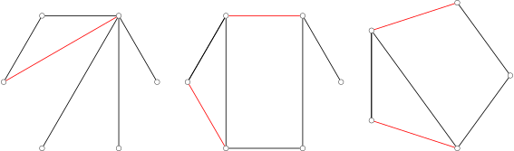

  * **最大匹配** （maximum matching or maximum cardinality matching）：匹配边数最多的匹配．最大匹配可能有不止一个，但最大匹配的边数是确定的，而且不可能超过图中顶点数的一半．

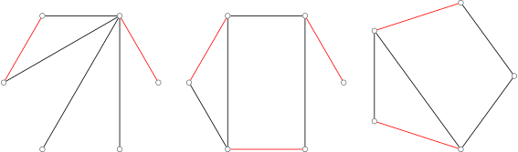

  * **最大权匹配** （maximum weight matching）：加权图中，边权和最大的匹配．

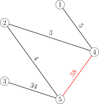

  * **最大权最大匹配** （maximum weight maximum cardinality matching）：匹配数最多的前提下，边权和最大的匹配．即所有最大匹配中，边权和最大的匹配．

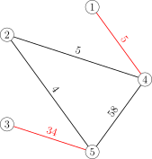

  * **完美匹配** （perfect matching）：每个顶点都是匹配点的匹配．完美匹配一定是最大匹配．顶点数为偶数的完全图，必然存在完美匹配．

  * **近完美匹配** （near-perfect matching）：有且只有一个未匹配点的匹配．这只能发生在图的顶点数是奇数时．近完美匹配也一定是最大匹配．顶点数为奇数的完全图，必然存在近完美匹配．

算法竞赛中涉及的图的匹配问题，主要指的是图的最大匹配或最大权匹配．

## 增广路

图匹配算法中，增广路是用于改进匹配的核心结构．

### 定义

对于图 𝐺 =(𝑉,𝐸)G=(V,E) 和它的一个匹配 𝑀M，可以定义如下两种（简单）路径：

  * **交错路** （alternating path）是由匹配边与非匹配边交错而成的路径；
  * **增广路** （augmenting path）是始于未匹配点且终于未匹配点的交错路．

因为增广路上非匹配边比匹配边数量多 11，所以增广路中边的数量一定是奇数．如果将增广路上的匹配边和非匹配边反转，那么它依然是交错路，而且匹配数量会增加 11．寻找增广路并反转它以增加匹配大小的过程，就称为 **增广** （augmentation）．用数学语言说，增广相当于将匹配 𝑀M 与增广路 𝑃P 取对称差，得到新的匹配 𝑀 ⊕𝑃M⊕P．

下图展示了在一次增广操作后，匹配数量由 22 增加为 33 的过程．

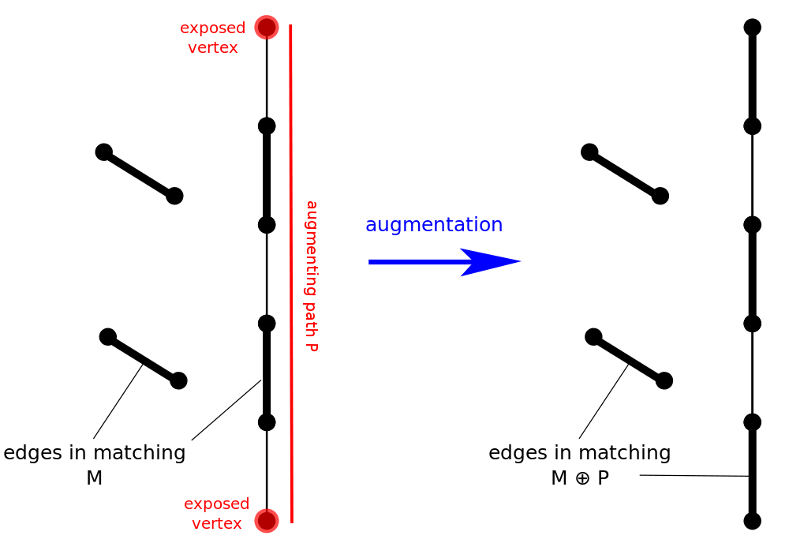

### Berge 引理

Berge 引理说明，利用增广路改进匹配的方法是充分的．也就是说，当找不到增广路时，就说明已经得到了最大匹配．

Berge 引理

对于图 𝐺 =(𝑉,𝐸)G=(V,E) 和它的一个匹配 𝑀M，匹配 𝑀M 是最大匹配，当且仅当不存在相对于匹配 𝑀M 的增广路．

证明

前文已经说明，存在增广路 𝑃P 时，匹配 𝑀 ⊕𝑃M⊕P 是比 𝑀M 更大的匹配，因此 𝑀M 一定不是最大匹配．

反过来，需要说明，如果存在比匹配 𝑀M 更大的匹配 𝑀′M′，那么，一定存在相对于 𝑀M 的增广路 𝑃P．为此，考察对称差 𝑀 ⊕𝑀′M⊕M′．图 (𝑉,𝑀 ⊕𝑀′)(V,M⊕M′) 中顶点的度数只能是 00、11 或 22；这样的图的连通分量必然是路径、环路、孤立点之一．而且，与度数为 22 的顶点相邻的两条边必定来自不同的匹配，所以，这些环路中来自 𝑀M 和 𝑀′M′ 的边的数量是一样的．因为 𝑀′M′ 比 𝑀M 大，所以存在至少一条路径中来自 𝑀′M′ 的边的数量多于 𝑀M；记该路径为 𝑃P．那么，𝑃P 的起点和终点都是 𝑀M 的未匹配点，且 𝑃P 是相对于 𝑀M 的交错路，所以 𝑃P 一定是相对于 𝑀M 的增广路．这就完成了证明．

由此定理可知我们求最大匹配的核心思路：

  * 枚举所有未匹配点，找增广路径，直到找不到增广路径．

事实上，每次增广操作结束后，不需要重新遍历一次所有未匹配点．在整个求最大匹配的过程中，每个顶点只需要遍历一次就好．

证明

只需要说明，如果在枚举进行到顶点 𝑣v 时，不存在以 𝑣v 为起点的增广路，那么在若干轮增广之后，也不存在以 𝑣v 为起点的增广路．这就说明，即使增广引起了匹配的改变，也不需要再次检查之前已经枚举过的未匹配点．

假设不然．也就是说，假设 𝑣v 是已经枚举过的未匹配点，在某一轮沿着自 𝑢u 至 𝑤w 的增广路 𝑃P 增广后，新增了之前不存在的以 𝑣v 为起点的增广路 𝑃′P′．那么，路径 𝑃′P′ 必然与 𝑃P 有公共边；否则，沿着 𝑃P 增广不会引起 𝑃′P′ 中的边的匹配状态改变，𝑃′P′ 也就不是因为此次增广而新增的增广路．

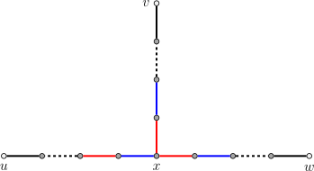

（图中黑色表示非匹配边，红色和蓝色表示不同的匹配状态）

设 𝑥x 是自 𝑣v 出发，沿着路径 𝑃′P′ 最先到达的 𝑃P 中的顶点．因为在本次增广前，就存在自 𝑣v 到 𝑥x 的交错路，所以 𝑥x 必然是匹配点，也就不能是顶点 𝑢u 或顶点 𝑤w 中的一个．因此，在增广路 𝑃P 上，与 𝑥x 相邻的边有两条，且它们的匹配状态相反．这说明，无论沿着以 𝑣v 为起点的交错路到达顶点 𝑥x 时，边的匹配状态如何，都可以沿着路径 𝑃P 将交错路延长至 𝑢u 或 𝑤w 中的一个．这说明，增广之前就已经存在以 𝑣v 为起点的增广路，与假设矛盾．

### 交错树

另一个与增广路紧密相关的概念是交错树．它是从未匹配点 𝑟r 进行 DFS 或 BFS 寻找增广路的过程中产生的树．

对于图 𝐺 =(𝑉,𝐸)G=(V,E) 和它的一个匹配 𝑀M，如果子图 𝐻 ⊆𝐺H⊆G 是以未匹配点 𝑟r 为根的树，且连接 𝑟r 和任意 𝑣 ∈𝐻v∈H 的路径都是交错路，那么，就称 𝐻H 是一个 **交错树** （alternating tree）．其中，树上深度为偶数的点称为偶点，树上深度为奇数的点称为奇点．

下图展示了自未匹配点 11 开始进行 BFS 可能得到的一个交错树．（图中，红边为匹配边，黑边为非匹配边；深色顶点为匹配点，浅色顶点为未匹配点．）

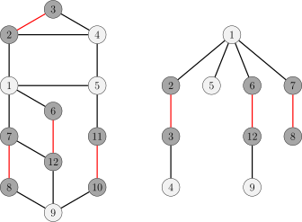

## 完美匹配的存在性

图匹配理论中，有两个重要的存在性定理，可以用于判定二分图或一般图中完美匹配是否存在．

### Hall 定理

假设 𝐺 =(𝑋,𝑌,𝐸)G=(X,Y,E) 是二分图，且 |𝑋| ≤|𝑌||X|≤|Y|．对于图 𝐺G 的一个匹配 𝑀M，如果 𝑋X 中的所有顶点都是匹配点，那么就称 𝑀M 是一个 **𝑋 X‑完美匹配**，有时也简称作（二分图 𝐺G 的）完美匹配．这是二分图中可能达成的最大的匹配．Hall 定理提供了判断这种匹配是否存在的充要条件．

Hall 定理说明，只要保证对于 𝑋X 的任何子集，𝑌Y 中都有足够多的顶点可以与它匹配，就一定存在 𝑋X‑完美匹配．

Hall 定理

假设 𝐺 =(𝑋,𝑌,𝐸)G=(X,Y,E) 是二分图，且 |𝑋| ≤|𝑌||X|≤|Y|．对于任何 𝑊 ⊆𝑋W⊆X，记 𝑁𝐺(𝑊)NG(W) 为图 𝐺G 中所有与 𝑊W 中的顶点相邻的顶点集合．那么，𝑋X‑完美匹配存在，当且仅当 |𝑊| ≤|𝑁𝐺(𝑊)||W|≤|NG(W)| 对于所有 𝑊 ⊆𝑋W⊆X 都成立．

证明

条件显然是必要的．假设 𝑋X‑完美匹配 𝑀M 存在，那么 𝑋X 中的每个顶点都匹配到了 𝑌Y 中的不同顶点．集合 𝑁𝐺(𝑊)NG(W) 至少包括了与 𝑊W 中顶点匹配的那些顶点，所以它的大小至少为 |𝑊||W|．

条件也是充分的．假设 𝑋X‑完美匹配不存在，那么一定有最大匹配 𝑀M 使得顶点 𝑣 ∈𝑋v∈X 仍然是未匹配点．设 𝑍Z 是所有可以通过由 𝑣v 出发的交错路到达的顶点集合，并设 𝑆 =𝑍 ∩𝑋S=Z∩X，𝑇 =𝑍 ∩𝑌T=Z∩Y．集合 𝑆 ∖{𝑣}S∖{v} 一定全部是匹配点，否则就会出现奇环，与 𝐺G 是二分图矛盾；集合 𝑇T 也一定全部是匹配点，否则就存在增广路，根据 Berge 引理，这与 𝑀M 是最大匹配矛盾．因为全部是匹配点，且匹配只能发生在 𝑋X 和 𝑌Y 之间，所以集合 𝑆 ∖{𝑣}S∖{v} 和集合 𝑇T 中的顶点一一对应，也就是说，|𝑇| =|𝑆| −1|T|=|S|−1．同时，因为 𝑇T 中的顶点已经和 𝑆S 中顶点匹配，所以至少有 𝑇 ⊆𝑁𝐺(𝑆)T⊆NG(S)；但是，𝑁𝐺(𝑆)NG(S) 中并不存在未匹配点 𝑢u，因为如果设它与 𝑆S 中的 𝑣′v′ 相邻，那么，必然可以通过延长到达 𝑣′v′ 的交错路得到到达 𝑢u 的交错路：这说明 𝑇 =𝑁𝐺(𝑆)T=NG(S)．这些论证说明 |𝑁𝐺(𝑆)| <|𝑆||NG(S)|<|S|，这与 Hall 定理所设条件矛盾．这就说明了 𝑋X‑完美匹配存在．

推论

所有正则的二分图都有完美匹配．

证明

正则二分图中，所有顶点的度数都相同，设为 𝑘k．首先验证 Hall 条件成立，即对于任何 𝑊 ⊆𝑋W⊆X，都有 |𝑁𝐺(𝑊)| ≥|𝑊||NG(W)|≥|W|．因为与 𝑊W 中顶点相邻的边的数量是 𝑘|𝑊|k|W|，而集合 𝑁𝐺(𝑊)NG(W) 中每个顶点至多只能与其中 𝑘k 条边相邻，所以必然有 𝑘|𝑊| ≤𝑘|𝑁𝐺(𝑊)|k|W|≤k|NG(W)|，也就是 |𝑊| ≤|𝑁𝐺(𝑊)||W|≤|NG(W)|．特别地，有 |𝑋| ≤|𝑌||X|≤|Y|；因为 𝑋X 和 𝑌Y 是对称的，所以有 |𝑋| =|𝑌||X|=|Y|．这说明，正则二分图中，𝑋X‑完美匹配也一定是完美匹配．由于 Hall 定理保证了 𝑋X‑完美匹配存在，那么完美匹配也一定存在．

### Tutte 定理

Tutte 定理提供了判断一般图中是否存在完美匹配的充要条件．这个条件源于一个直接的观察：顶点数量为奇数的图中一定不存在完美匹配．

Tutte 定理

图 𝐺 =(𝑉,𝐸)G=(V,E) 存在完美匹配，当且仅当对于任何 𝑈 ⊆𝑉U⊆V，都有 odd⁡(𝐺 −𝑈) ≤|𝑈|odd⁡(G−U)≤|U|，其中，𝐺 −𝑈G−U 表示从图 𝐺G 中删去 𝑈U 中的顶点以及与之相邻的边得到的子图，而 odd⁡(𝐺 −𝑈)odd⁡(G−U) 表示子图 𝐺 −𝑈G−U 中顶点数量为奇数的连通分量的数量．

证明

只需要考虑简单图即可，因为重边和自环不影响 Tutte 条件和完美匹配的存在性．

条件的必要性相对容易．假设存在完美匹配 𝑀M．对于任意 𝑈 ⊆𝑉U⊆V，从图 𝐺G 中删去 𝑈U 中的顶点之后，每一个顶点数量为奇数的连通分量都至少有一个无法与同一个连通分量顶点匹配的顶点，这些顶点只能寻求与 𝑈U 中的顶点匹配．这样的匹配存在，至少要求 odd⁡(𝐺 −𝑈) ≤|𝑈|odd⁡(G−U)≤|U|．这就是 Tutte 条件．

条件的充分性较为复杂．假设 𝐺G 满足 Tutte 条件，但是没有完美匹配．因为向 𝐺G 中添加任何边都会使得 Tutte 条件依然成立，所以不妨设 𝐺G 是一个极大的这样的图，也就是说，𝐺G 不存在完美匹配，但是，向 𝐺G 中添加任何尚不存在的边 𝑒e，都会使得 𝐺 +𝑒G+e 存在完美匹配．设 𝑈 ⊆𝑉U⊆V 是所有度数为 |𝑉| −1|V|−1 的顶点的集合．可以证明，𝐺 −𝑈G−U 的每一个连通分量都是一个完全图．由此，可以构造出一个 𝐺G 的完美匹配：首先取每个 𝐺 −𝑈G−U 的连通分量的最大匹配，这样只有连通分量顶点数量为奇数时，才会出现一个未匹配点；将这些未匹配点匹配到 𝑈U 中顶点；因为 𝐺G 的顶点数量为偶数（在 Tutte 条件中取 𝑈 =∅U=∅），所以，𝑈U 中剩余的尚未匹配的顶点数量也是偶数，将它们两两配对即可．这一矛盾就说明，不存在满足 Tutte 条件但是没有完美匹配的 𝐺G．

关键是要证明 𝐺 −𝑈G−U 的每一个连通分量都是一个完全图．假设不然．不妨设顶点 𝑥,𝑦,𝑧x,y,z 属于这样的一个连通分量，且 (𝑥,𝑦) ∈𝐸(x,y)∈E，(𝑦,𝑧) ∈𝐸(y,z)∈E，(𝑥,𝑧) ∉𝐸(x,z)∉E．而且，因为 𝑦 ∉𝑈y∉U，必然存在 𝑤 ∈𝑉 ∖𝑈w∈V∖U 但是 (𝑦,𝑤) ∉𝐸(y,w)∉E．由于 𝐺G 的极大性，图 𝐺 +(𝑥,𝑧)G+(x,z) 和图 𝐺 +(𝑦,𝑤)G+(y,w) 中分别存在完美匹配 𝑀1M1 和 𝑀2M2．考察它们的对称差 𝑀1 ⊕𝑀2M1⊕M2．因为图 (𝑉,𝑀1 ⊕𝑀2)(V,M1⊕M2) 中所有顶点的度数要么是 00 要么是 22，所以 𝑀1 ⊕𝑀2M1⊕M2 实际上是若干个偶环的不交并，且每个偶环都是 𝑀1M1 和 𝑀2M2 中的匹配边交错组成的．

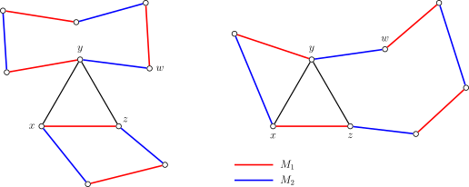

如图所示，可以分两种情形：

  * (𝑥,𝑧)(x,z) 和 (𝑦,𝑤)(y,w) 位于不同的环路（如图左所示）：设 (𝑦,𝑤)(y,w) 所在环路为 𝐶C，那么，边集 𝑀2 ⊕𝐶M2⊕C 就是图 𝐺G 的完美匹配；
  * (𝑥,𝑧)(x,z) 和 (𝑦,𝑤)(y,w) 位于相同的环路（如图右所示）：由对称性，不妨设环路依次经过 𝑥,𝑦,𝑤,𝑧x,y,w,z，因此可以取环路上从 𝑦y 经过 𝑤w 到达 𝑧z 的路径 𝑃P，记 {(𝑦,𝑧)} ∪𝑃{(y,z)}∪P 为环路 𝐶C，那么，边集 𝑀2 ⊕𝐶M2⊕C 同样是图 𝐺G 的完美匹配．

无论是哪种情形，都与 𝐺G 的选取矛盾．这个矛盾说明了 𝐺 −𝑈G−U 的每一个连通分量都是一个完全图．

推论

无桥 3‑正则图都有完美匹配．

证明

为了验证 Tutte 条件成立，任取 𝑈 ⊆𝑉U⊆V，需要证明 odd⁡(𝐺 −𝑈) ≤|𝑈|odd⁡(G−U)≤|U|．设 𝐺1,⋯,𝐺𝑛G1,⋯,Gn 是 𝐺 −𝑈G−U 的顶点数为奇数的所有连通分量．设 𝑚𝑖mi 是连接 𝐺𝑖Gi 中顶点和 𝑈U 中顶点的边的数量．简单的计数可知

3|𝑉(𝐺𝑖)|=∑𝑣∈𝑉(𝐺𝑖)𝑑(𝑣)=2|𝐸(𝐺𝑖)|+𝑚𝑖.3|V(Gi)|=∑v∈V(Gi)d(v)=2|E(Gi)|+mi.

因此，𝑚𝑖mi 必然是奇数．因为 𝐺G 中没有桥（即割边），所以 𝑚𝑖 ≥3mi≥3．这就说明

odd⁡(𝐺−𝑈)=𝑛≤13𝑛∑𝑖=1𝑚𝑖≤13∑𝑣∈𝑈𝑑(𝑣)=|𝑈|.odd⁡(G−U)=n≤13∑i=1nmi≤13∑v∈Ud(v)=|U|.

因此，Tutte 条件成立，图 𝐺G 必然有完美匹配．

## 常见算法

组合优化中的一个基本问题是求图的最大匹配和最大权匹配．

### 二分图最大匹配

详见 [二分图最大匹配](../bigraph-match/) 页面．

在无权二分图中，可以使用 Kuhn 算法在 𝑂(|𝑉||𝐸|)O(|V||E|) 时间内解决，也可以使用 Hopcroft–Karp 算法在 𝑂(|𝑉|1/2|𝐸|)O(|V|1/2|E|) 时间内解决．

### 二分图最大权匹配

详见 [二分图最大权匹配](../bigraph-weight-match/) 页面．

在加权二分图中，可用 Hungarian 算法解决．如果在寻找最短路时使用 Bellman–Ford 算法，时间复杂度为 𝑂(|𝑉|2|𝐸|)O(|V|2|E|)；如果使用 Dijkstra 算法或 Fibonacci heap，可在 𝑂(|𝑉|2log⁡|𝑉| +|𝑉||𝐸|)O(|V|2log⁡|V|+|V||E|) 时间内解决．

### 一般图最大匹配

详见 [一般图最大匹配](../general-match/) 页面．

无权一般图中，可以使用 Edmonds' blossom 算法在 𝑂(|𝑉|2|𝐸|)O(|V|2|E|) 时间内解决．

### 一般图最大权匹配

详见 [一般图最大权匹配](../general-weight-match/) 页面．

加权一般图中，可以使用 Edmonds' blossom 算法在 𝑂(|𝑉|2|𝐸|)O(|V|2|E|) 时间内解决．

## 相关问题

最大（权）匹配与其它图论问题有着紧密的联系．本节仅讨论一般图，关于二分图的结论可以参考 [二分图最大匹配](../bigraph-match/#相关问题) 页面．

### 最大权最大匹配

最大权最大匹配问题和最大权匹配问题可以相互归约．它们之间一个很显著的区别是，最大权最大匹配中可能存在负权边，但是最大权匹配中不会存在负权边．

首先，最大权匹配问题可以归约为最大权最大匹配问题．首先，将图 𝐺G 的所有负权边的权重设为 00；然后，通过连接若干权重为 00 的边，将图扩充为完全图 𝐺′G′．注意到，边权非负的完全图中，最大权最大匹配和最大权匹配是一致的．所以，只需要计算 𝐺′G′ 的最大权最大匹配 𝑀′M′，再删去 𝑀′M′ 中的所有零权边，得到的边集 𝑀M 就是图 𝐺G 的最大权匹配．1

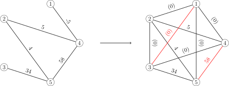

反过来，最大权最大匹配问题也可以归约为最大权匹配问题．只需要对图 𝐺G 所有边的边权都加一个足够大的正数 𝐾K，就可以保证得到的图 𝐺′G′ 的最大权匹配也一定是最大匹配，故而必然是最大权最大匹配．这是因为计算图 𝐺′G′ 的最大权匹配相当于在图 𝐺G 的所有匹配中最大化

𝐾|𝑀|+∑𝑒∈𝑀𝑤(𝑒).K|M|+∑e∈Mw(e).

当 𝐾K 充分大时，多匹配一条边带来的增益 𝐾K，会超过后面一项的权值和的变化．因此，算法会首先尽可能地多匹配边，然后才会最大化匹配边的边权和．常数 𝐾K 的选择，只要保证它严格大于两个可能的匹配的差值即可．一个显然的选择是

𝐾=∑𝑒∈𝐸|𝑤(𝑒)|+1.K=∑e∈E|w(e)|+1.

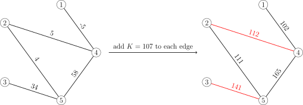

### 最小（权）边覆盖

另一个与最大（权）匹配紧密相关的问题是最小（权）边覆盖．边覆盖与匹配（又称边独立集）的关系，和点覆盖与独立集的关系相似．

图 𝐺 =(𝑉,𝐸)G=(V,E) 中的一组边 𝐶 ⊆𝐸C⊆E，如果任意顶点 𝑣 ∈𝑉v∈V 都是 𝐶C 中某条边的端点，那么，就称 𝐶C 是图 𝐺G 的一组 **边覆盖** （edge cover）．讨论边覆盖时，总是假设图 𝐺G 没有孤立点．

对于无权图，最小边覆盖问题几乎就是最大匹配问题．对于图 𝐺G 的任何最大匹配 𝑀M，只要为每个未匹配点都加入一条相连的边，就可以得到一个最小边覆盖 𝐶C．它们的大小满足简单的数量关系：|𝑀| +|𝐶| =|𝑉||M|+|C|=|V|．下图是一些最小边覆盖的例子：

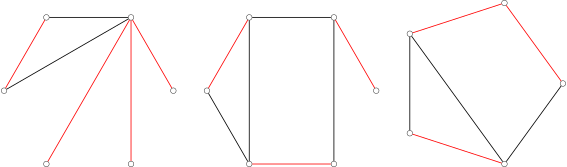

对于加权图，最小权边覆盖问题可以归约为一个 **最小权完美匹配** 问题．首先，将图 𝐺 =(𝑉,𝐸)G=(V,E) 拷贝一份得到 ˜𝐺 =(˜𝑉,˜𝐸)G~=(V~,E~)，边权与原图一致；然后，将每个顶点 𝑣 ∈𝑉v∈V 都与它的拷贝 ˜𝑣 ∈˜𝑉v~∈V~ 连接起来，边权为图 𝐺G 中与 𝑣v 关联的边的权值最小值．这样得到的图记作 𝐺′ =(𝑉′,𝐸′)G′=(V′,E′)．如果图 𝐺G 是二分图或稀疏图，那么图 𝐺′G′ 同样分别是二分图或稀疏图．而且，图 𝐺G 的最小权边覆盖问题，就归约为图 𝐺′G′ 的最小权完美匹配问题2：对于图 𝐺′G′ 的最小权完美匹配 𝑀′M′，只要保留 𝐸E 中的边，再将所有匹配到的 (𝑣,𝑣′)(v,v′) 替换成图 𝐺G 中与 𝑣v 关联的权值最小的边，就得到图 𝐺G 的最小权边覆盖．

## 参考资料

  1. [Wikiwand - Matching (graph theory)](https://www.wikiwand.com/en/Matching_%28graph_theory%29)
  2. [Wikiwand - Blossom algorithm](https://www.wikiwand.com/en/Blossom_algorithm)
  3. 2015 年《浅谈图的匹配算法及其应用》- 陈胤伯
  4. [演算法笔记 - Matching](http://web.ntnu.edu.tw/~algo/Matching.html)
  5. [the-tourist/algo](https://github.com/the-tourist/algo)
  6. [Bill Yang's Blog - 带花树学习笔记](https://blog.bill.moe/blossom-algorithm-notes/)
  7. [二分图的最大匹配、完美匹配和匈牙利算法](https://www.renfei.org/blog/bipartite-matching.html)
  8. [Wikiwand - Hopcroft–Karp algorithm](https://www.wikiwand.com/en/Hopcroft%E2%80%93Karp_algorithm)
  9. Bondy, John Adrian, and Uppaluri Siva Ramachandra Murty. Graph theory with applications. Vol. 290. London: Macmillan, 1976.

* * *

  1. 当然，这并不是唯一的归约方式．对于图 𝐺 =(𝑉,𝐸)G=(V,E)，还可以将它的一份拷贝 ˜𝐺 =(˜𝑉,˜𝐸)G~=(V~,E~) 逐点地连接到原来的图上，并将所有相对于原图 𝐺G 新加的边（包括拷贝中的边）的权重设为 00，得到图 𝐺′ =(𝑉′,𝐸′)G′=(V′,E′)．换句话说，新图 𝐺′G′ 的顶点集是 𝑉 ∪𝑉′V∪V′，而它的边集除了图 𝐺G 中的边之外，还将所有顶点 𝑣 ∈𝑉v∈V 都与它的拷贝 ˜𝑣 ∈𝑉v~∈V 用零权边连接，且对于所有边 (𝑢,𝑣) ∈𝐸(u,v)∈E，都将 ˜𝑢u~ 与 ˜𝑣v~ 用零权边连接．图 𝐺G 中的所有匹配 𝑀M 都对应着图 𝐺′G′ 中的一个权值和相同的完美匹配：只需要将 𝐺G 中所有未匹配点 𝑣v 都与它的拷贝 ˜𝑣v~ 匹配，而对于所有匹配边 (𝑢,𝑣)(u,v)，都将 ˜𝑢u~ 与 ˜𝑣v~ 匹配．因此，图 𝐺′G′ 中的最大权最大匹配，也就是最大权完美匹配，限制到 𝐸E 上，就得到图 𝐺G 的最大权匹配．这样归约的好处是，如果图 𝐺G 是二分图或稀疏图，那么扩充得到的图 𝐺′G′ 也分别是二分图或稀疏图． ↩

  2. 对于图 𝐺′G′ 的每个完美匹配 𝑀′M′，都可以按照此处描述的方式得到一个图 𝐺G 的边覆盖 𝐶C，且后者的权值和为前者的一半；将这个构造过程反过来，对于图 𝐺G 的每个边覆盖 𝐶C，都可以构造出一个图 𝐺′G′ 的完美匹配 𝑀′M′，且后者的权值和不超过前者的二倍．这就说明归约是成立的． ↩

* * *

>  __本页面最近更新： 2026/1/7 08:56:54，[更新历史](https://github.com/OI-wiki/OI-wiki/commits/master/docs/graph/graph-matching/graph-match.md)  
>  __发现错误？想一起完善？[在 GitHub 上编辑此页！](https://oi-wiki.org/edit-landing/?ref=/graph/graph-matching/graph-match.md "edit.link.title")  
>  __本页面贡献者：[Tiphereth-A](https://github.com/Tiphereth-A), [StudyingFather](https://github.com/StudyingFather), [310552025atNYCU](https://github.com/310552025atNYCU), [c-forrest](https://github.com/c-forrest), [aaron20100919](https://github.com/aaron20100919), [Enter-tainer](https://github.com/Enter-tainer), [mcendu](https://github.com/mcendu), [Shen-Linwood](https://github.com/Shen-Linwood), [t4rf9](https://github.com/t4rf9), [TrickEye](https://github.com/TrickEye), [wlbksy](https://github.com/wlbksy), [Xeonacid](https://github.com/Xeonacid), [yuhuoji](https://github.com/yuhuoji), [accelsao](https://github.com/accelsao), [Chrogeek](https://github.com/Chrogeek), [iamtwz](https://github.com/iamtwz), [shuzhouliu](https://github.com/shuzhouliu)  
>  __本页面的全部内容在**[CC BY-SA 4.0](https://creativecommons.org/licenses/by-sa/4.0/deed.zh) 和 [SATA](https://github.com/zTrix/sata-license)** 协议之条款下提供，附加条款亦可能应用
