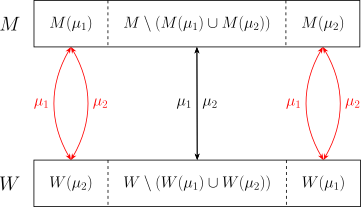

# 稳定匹配 - OI Wiki

- Source: https://oi-wiki.org/graph/graph-matching/stable-match/

# 稳定匹配

## 引入

**稳定匹配问题** （stable matching problem）是组合优化和合作博弈论中的经典问题．相较于传统的图论匹配问题，稳定匹配引入了个体偏好和稳定性的限制，这使得算法设计更多地依赖于偏好顺序而非单纯的图结构．稳定匹配问题的模型中，每个个体对潜在的匹配对象具有偏好，而稳定匹配问题希望能在它们之间建立一种稳定的匹配关系．一个稳定的匹配中，不存在任何一组个体，会因为能得到更优的选择而合谋偏离当前的匹配结果．稳定匹配及其相关问题广泛地应用于劳动力市场、学校录取、医疗资源分配等场景中．

算法竞赛中最常出现的稳定匹配问题是双边市场的一对一匹配，即稳定婚姻问题．本文将重点介绍稳定婚姻问题及其算法．

## 稳定婚姻问题

稳定婚姻问题是最早研究的稳定匹配问题．类似于二分图匹配，它可以描述为婚恋市场上的匹配问题：假设有男士和女士若干，每个人都对异性有一组偏好顺序，目标是找到一种匹配方式，使得没有一对男女更愿意抛弃各自的匹配对象而选择彼此．

### 问题描述

匹配市场由若干男士 𝑀M 和若干女士 𝑊W 构成．每个人都对异性有严格的偏好顺序：

  * 对于每位男士 𝑚 ∈𝑀m∈M，都存在集合 𝑊 ∪{𝑚}W∪{m} 上一个严格的全序 ⪯𝑚⪯m；
  * 对于每位女士 𝑤 ∈𝑊w∈W，都存在集合 𝑀 ∪{𝑤}M∪{w} 上一个严格的全序 ⪯𝑤⪯w．

除了在异性之间相互比较之外，每个人还会将自身加入到这个偏好顺序中．这表示，这个人只会接受与排在自身前面的异性匹配；这些异性称为 **可接受的** （acceptable）．显然，不可接受的异性的偏好顺序是无足轻重的；原则上，只需要给出可接受的异性之间的偏好顺序即可．所以，这些存在不可接受异性的偏好也称为列表不完整的偏好（preferences with incomplete lists）．

例子

假设 𝑚m 是一位男士，𝑤1,𝑤2,𝑤3w1,w2,w3 是三位女士，且有偏好关系 𝑤1 ≺𝑚𝑚 ≺𝑚𝑤2 ≺𝑚𝑤3w1≺mm≺mw2≺mw3 成立．那么，男士 𝑚m 相对于和女士 𝑤1w1 匹配，更喜欢单身；相对于单身，更喜欢和女士 𝑤2w2 匹配；相对于和女士 𝑤2w2 匹配，更喜欢和女士 𝑤3w3 匹配．对于男士 𝑚m，女士 𝑤1w1 就是不可接受的，女士 𝑤2,𝑤3w2,w3 就是可接受的．

市场上的一个 **匹配** 𝜇 :𝑀 ∪𝑊 →𝑀 ∪𝑊μ:M∪W→M∪W 需要满足如下性质：

  * 每个人只能匹配异性或其自身，即对所有 𝑚 ∈𝑀m∈M 都有 𝜇(𝑚) ∈𝑊 ∪{𝑚}μ(m)∈W∪{m} 且对所有 𝑤 ∈𝑊w∈W 都有 𝜇(𝑤) ∈𝑊 ∪{𝑤}μ(w)∈W∪{w}．
  * 匹配是相互的，即对所有 𝑖 ∈𝑀 ∪𝑊i∈M∪W 都有 𝑖 =𝜇(𝜇(𝑖))i=μ(μ(i))．

一个匹配 𝜇μ 中可能存在两种不稳定因素：

  * 如果存在个体 𝑖 ∈𝑀 ∪𝑊i∈M∪W 使得 𝜇(𝑖) ≺𝑖𝑖μ(i)≺ii，也就是说，相对于当前的匹配对象，个体 𝑖i 宁愿单身，那么，就称 𝑖i 是匹配 𝜇μ 的 **阻塞个体** （blocking individual）．
  * 如果存在一对异性 𝑚 ∈𝑀m∈M 和 𝑤 ∈𝑊w∈W 使得 𝜇(𝑚) ≺𝑚𝑤μ(m)≺mw 且 𝜇(𝑤) ≺𝑤𝑚μ(w)≺wm，也就是说，相对于当前各自的匹配对象，男士 𝑚m 和女士 𝑤w 更希望和对方在一起，那么，就称 (𝑚,𝑤)(m,w) 是匹配 𝜇μ 的 **阻塞对** （blocking pair）．

如果一个匹配 𝜇μ 既不存在阻塞个体，也不存在阻塞对，就称匹配 𝜇μ 是 **稳定的** （stable）．稳定匹配中，所有人都无法破坏当前的局面：单身的人找不到愿意同他在一起的人；结婚的人既不愿意离婚单身，也找不到愿意同他私奔的人．

稳定匹配问题就是在问：对于任意给定的一组偏好顺序，是否都存在一个稳定匹配？如果是，如何求出这样的稳定匹配？

### Gale–Shapley 算法

Gale 和 Shapley 在 1962 年提出了 **延迟接受算法** （deferred acceptance algorithm），可以对任意给定的一组偏好顺序求出一个稳定匹配．因此，稳定匹配一定是存在的．

Gale–Shapley 算法有两个对称的版本，分别由男士求婚和女士求婚．以男士求婚的 Gale–Shapley 算法为例，算法流程如下：

  1. 算法开始时，每位女士都视为保留着她对其自身的求婚请求，每位男士都标记为活跃的．
  2. 活跃的男士会向他可接受但是尚未求婚过的女士中最喜欢的那位求婚；如果这样的女士不存在，就无需进行任何操作．无论求婚与否，将所有男士都标记为不活跃的．
  3. 收到新的求婚请求的女士，会将他们与之前保留的求婚请求比较，只保留其中最喜欢的那一个（可能是她自身），并拒绝所有其他的求婚请求．将遭到拒绝的男士恢复标记为活跃的．
  4. 重复前两个步骤，直到没有活跃的男士为止．此时，女士接受她们当前保留的求婚请求．这样得到的匹配结果，就是一个稳定匹配．

由于每位男士向每位女士至多求婚一次，算法在 𝑂(|𝑀||𝑊|)O(|M||W|) 时间内一定会结束．

参考实现如下：

模板题 [SPOJ STABLEMP - Stable Marriage Problem](https://www.spoj.com/problems/STABLEMP/) 参考实现

```text 1 2 3 4 5 6 7 8 9 10 11 12 13 14 15 16 17 18 19 20 21 22 23 24 25 26 27 28 29 30 31 32 33 34 35 36 37 38 39 40 41 42 43 44 45 46 47 48 49 50 51 52 53 54 55 56 57 58 59 60 61 62 63 64 65 66 67 68 69 70 71 72 73 74 75 76 77 78 79 80 81 82 83 84 85 86 87 88 89 90 91 92 93 94 95 96 ``` |  ```text #include <iostream> #include <queue> #include <vector> // Solver for stable marriage problems. // Assume strict preferences with incomplete lists. struct StableMatching { int nx , ny ; std :: vector < std :: vector < int >> pref_x , pref_y ; // Preferences: preferred first, only acceptable. std :: vector < int > match_x , match_y ; // Matching: -1 means unmatched. StableMatching ( int nx , int ny ) : nx ( nx ), ny ( ny ), pref_x ( nx ), pref_y ( ny ), match_x ( nx , -1 ), match_y ( ny , -1 ) {} // Gale-Shapley algorithm. // Complexity: O(nx * ny). void solve () { // Compute Y's ranks over X. std :: vector < std :: vector < int >> ranks ( ny , std :: vector < int > ( nx )); for ( int j = 0 ; j != ny ; ++ j ) { for ( int i = 0 ; i != pref_y [ j ]. size (); ++ i ) { ranks [ j ][ pref_y [ j ][ i ]] = nx \- i ; } } // Initialize. std :: vector < int > waitlist ( ny ); // Best proposal rank for j in Y. std :: vector < int > ids ( nx ); // Next j in Y for i in X to propose to. std :: queue < int > q ; // Currently active i's in X. for ( int i = 0 ; i != nx ; ++ i ) q . push ( i ); // Loop. while ( ! q . empty ()) { auto i = q . front (); q . pop (); auto j = pref_x [ i ][ ids [ i ] ++ ]; if ( ranks [ j ][ i ] > waitlist [ j ]) { if ( waitlist [ j ]) q . push ( pref_y [ j ][ nx \- waitlist [ j ]]); waitlist [ j ] = ranks [ j ][ i ]; } else { q . push ( i ); } } // Output. for ( int j = 0 ; j != ny ; ++ j ) { if ( waitlist [ j ]) { int i = pref_y [ j ][ nx \- waitlist [ j ]]; match_x [ i ] = j ; match_y [ j ] = i ; } } } }; void solve () { // Input. int n ; std :: cin >> n ; StableMatching solver ( n , n ); for ( int j = 0 , x ; j < n ; ++ j ) { auto & cur = solver . pref_y [ j ]; std :: cin >> x ; for ( int i = 0 ; i < n ; ++ i ) { std :: cin >> x ; cur . push_back ( x \- 1 ); } } for ( int i = 0 , y ; i < n ; ++ i ) { auto & cur = solver . pref_x [ i ]; std :: cin >> y ; for ( int j = 0 ; j < n ; ++ j ) { std :: cin >> y ; cur . push_back ( y \- 1 ); } } // Solve the problem. solver . solve (); // Output. for ( int i = 0 ; i < n ; ++ i ) { std :: cout << ( i \+ 1 ) << ' ' << ( solver . match_x [ i ] \+ 1 ) << '\n' ; } } int main () { std :: ios :: sync_with_stdio ( false ), std :: cin . tie ( nullptr ); int t ; std :: cin >> t ; for (; t ; \-- t ) { solve (); } return 0 ; } ```   
---|---  
  
### 稳定匹配的性质

稳定匹配有着良好的理论性质．首先，Gale–Shapley 算法构造性地证明，稳定匹配一定存在．

定理 1（Gale and Shapley, 1962）

Gale–Shapley 算法得到的是一个稳定匹配．因此，稳定匹配存在．

证明

男士不会对他不接受的女士求婚，女士也会立即拒绝她不接受的男士的求婚．因此，最终互相匹配的男士和女士一定是彼此接受的，不可能存在阻塞个体．要证明它是稳定匹配，只需要说明不存在阻塞对．

反证法．假设 (𝑚,𝑤)(m,w) 是一个阻塞对．那么，在男士 𝑚m 向 𝜇(𝑚)μ(m) 求婚之前，他一定已经向 𝑤w 求过婚．但是，既然女士 𝑤w 拒绝了 𝑚m，她一定是收到了她更喜欢的人 𝑚′m′ 的求婚请求．如果 𝑚′ ≠𝜇(𝑤)m′≠μ(w)，那么，女士 𝑤w 相对于 𝑚′m′ 只会更喜欢 𝜇(𝑤)μ(w)．由此，相对于 𝑚m，女士 𝑤w 一定更喜欢最终的匹配对象 𝜇(𝑤)μ(w)．这与 (𝑚,𝑤)(m,w) 是阻塞对矛盾．所以，匹配是稳定的．

推论

如果 |𝑀| =|𝑊||M|=|W| 且所有异性都是可接受的，那么，存在一个稳定的完美匹配．

Gale–Shapley 算法中，可以由男士求婚，也可以由女士求婚．一般情况下，这两个版本的 Gale–Shapley 算法得到的稳定匹配并不相同．事实上，由男士求婚的 Gale–Shapley 算法得到的稳定匹配是所有稳定匹配中，对于男士最有利的；反之亦然．

定理 2（Gale and Shapley, 1962）

设 𝜇𝑀μM 和 𝜇𝑊μW 分别是由男士和女士求婚的 Gale–Shapley 算法得到的稳定匹配．对于任何稳定匹配 𝜇μ，都有 𝜇(𝑚) ⪯𝑚𝜇𝑀(𝑚)μ(m)⪯mμM(m) 对于所有 𝑚 ∈𝑀m∈M 成立，且 𝜇(𝑤) ⪯𝑤𝜇𝑊(𝑤)μ(w)⪯wμW(w) 对所有 𝑤 ∈𝑊w∈W 成立．

证明

根据对称性，只需要证明 𝜇(𝑚) ⪯𝑚𝜇𝑀(𝑚)μ(m)⪯mμM(m) 对于所有 𝑚 ∈𝑀m∈M 成立．为此，仍然考虑由男士求婚的 Gale–Shapley 算法，并记 𝑘(𝑚,𝑤)k(m,w) 为女士 𝑤w 拒绝男士 𝑚m 的求婚时，算法进行到的轮次．这个轮次对于所有满足 𝜇𝑀(𝑚) ≺𝑚𝑤μM(m)≺mw 的 (𝑚,𝑤)(m,w) 都是良定义的．

假设 𝜇𝑀μM 并非对所有男士都最有利的，也就是说，存在稳定匹配 𝜇μ 和男士 𝑚 ∈𝑀m∈M 使得 𝜇𝑀(𝑚) ≺𝑚𝜇(𝑚)μM(m)≺mμ(m) 成立．由于匹配 𝜇𝑀μM 是稳定的，就有 𝑚 ⪯𝑚𝜇𝑀(𝑚) ≺𝑚𝜇(𝑚)m⪯mμM(m)≺mμ(m)，所以 𝜇(𝑚)μ(m) 是女士，一定有良定义的 𝑘(𝑚,𝜇(𝑚))k(m,μ(m))．于是，不妨设 𝑚m 恰为所有这样的男士中，𝑘(𝑚,𝜇(𝑚))k(m,μ(m)) 最小的那个．设算法过程中，女士 𝑤 =𝜇(𝑚)w=μ(m) 拒绝男士 𝑚m 时保留的是男士 𝑚′m′ 的求婚请求，也就是说，𝑚 =𝜇(𝑤) ≺𝑤𝑚′m=μ(w)≺wm′．由于 𝜇μ 是稳定匹配，(𝑤,𝑚′)(w,m′) 不能是阻塞对，又有 𝜇(𝑚′) ≠𝑤μ(m′)≠w，所以，𝑤 ≺𝑚′𝜇(𝑚′)w≺m′μ(m′)．由于 Gale–Shapley 算法过程中，女士 𝑤w 未必会保留 𝑚′m′ 的求婚请求到最后，所以 𝜇𝑀(𝑚′) ⪯𝑚′𝑤 ≺𝑚′𝜇(𝑚′)μM(m′)⪯m′w≺m′μ(m′)．此时，𝑘(𝑚′,𝜇(𝑚′))k(m′,μ(m′)) 是良定义的．而且，由于 𝑤 ≺𝑚′𝜇(𝑚′)w≺m′μ(m′)，所以，女士 𝜇(𝑚′)μ(m′) 拒绝 𝑚′m′ 的求婚请求之后，才会有 𝑤w 保留 𝑚′m′ 的求婚请求，也就是说，𝑘(𝑚′,𝜇(𝑚′)) <𝑘(𝑚,𝜇(𝑚))k(m′,μ(m′))<k(m,μ(m))．这与 𝑚m 的选取相矛盾．所以，根据反证法，𝜇𝑀μM 是对所有男士最有利的稳定匹配．

一个匹配市场可能存在指数级数量的稳定匹配．设 SS 为全体稳定匹配的集合．在这个集合上，可以定义两个偏序：

  * 𝜇1 ⪯𝑀𝜇2μ1⪯Mμ2，当且仅当 𝜇1(𝑚) ⪯𝑚𝜇2(𝑚)μ1(m)⪯mμ2(m) 对所有 𝑚 ∈𝑀m∈M 都成立；
  * 𝜇1 ⪯𝑊𝜇2μ1⪯Wμ2，当且仅当 𝜇1(𝑤) ⪯𝑤𝜇2(𝑤)μ1(w)⪯wμ2(w) 对所有 𝑤 ∈𝑊w∈W 都成立．

这两个偏序分别表示匹配结果对于所有男士和所有女士都更优．一般地，两个稳定匹配未必是可比的．但是，任意两个稳定匹配都诱导如图所示的分解，使得分解所得的三个部分中，分别成立 𝜇1 ⪯𝑀𝜇2μ1⪯Mμ2，𝜇1 =𝜇2μ1=μ2 和 𝜇2 ⪯𝑀𝜇1μ2⪯Mμ1．注意，尽管没有直接绘制出，但是 𝜇1 =𝜇2μ1=μ2 的那一部分其实包含了匹配到自身（即未匹配）的情形．



这一分解依赖于如下的引理：

引理（Knuth, 1976）

设 𝜇1μ1 和 𝜇2μ2 是两个稳定匹配．设 𝑀(𝜇𝑖) ={𝑚 ∈𝑀 :𝜇𝑗(𝑚) ≺𝑚𝜇𝑖(𝑚)}M(μi)={m∈M:μj(m)≺mμi(m)} 和 𝑊(𝜇𝑖) ={𝑤 ∈𝑊 :𝜇𝑗(𝑤) ≺𝑤𝜇𝑖(𝑤)}W(μi)={w∈W:μj(w)≺wμi(w)} 分别为更偏好 𝜇𝑖μi 中的匹配结果的男士和女士的集合，其中，𝑖,𝑗 =1,2i,j=1,2 且 𝑖 ≠𝑗i≠j．那么，𝜇1μ1 和 𝜇2μ2 都是 𝑀(𝜇1)M(μ1) 与 𝑊(𝜇2)W(μ2) 之间的双射，也都是 𝑀(𝜇2)M(μ2) 与 𝑊(𝜇1)W(μ1) 之间的双射．

证明

设 𝑚 ∈𝑀(𝜇1)m∈M(μ1)．由于 𝑚 ⪯𝑚𝜇2(𝑚) ≺𝑚𝜇1(𝑚)m⪯mμ2(m)≺mμ1(m)，所以 𝜇1(𝑚) ∈𝑊μ1(m)∈W．令 𝑤 =𝜇1(𝑚)w=μ1(m)．因为 𝜇2(𝑤) ≠𝑚μ2(w)≠m，而 𝜇2(𝑤) ≺𝑤𝑚μ2(w)≺wm 又意味着 (𝑚,𝑤)(m,w) 是 𝜇2μ2 的阻塞对，所以，𝜇1(𝑤) =𝑚 ≺𝑤𝜇2(𝑤)μ1(w)=m≺wμ2(w)．也就是说，𝑤 ∈𝑊(𝜇2)w∈W(μ2)．这说明，𝜇1(𝑀(𝜇1)) ⊆𝑊(𝜇2)μ1(M(μ1))⊆W(μ2)．由对称性，还可以建立 𝜇2(𝑊(𝜇2)) ⊆𝑀(𝜇1)μ2(W(μ2))⊆M(μ1)．由于 𝜇1μ1 和 𝜇2μ2 都是单射，所以，|𝑀(𝜇1)| =|𝑊(𝜇2)||M(μ1)|=|W(μ2)| 且这两个映射都是满射．这就说明，𝜇1μ1 和 𝜇2μ2 都是 𝑀(𝜇1)M(μ1) 与 𝑊(𝜇2)W(μ2) 之间的双射．同理，它们也都是 𝑀(𝜇2)M(μ2) 与 𝑊(𝜇1)W(μ1) 之间的双射．

这一引理说明，偏序集 (S, ⪯𝑀)(S,⪯M) 和 (S, ⪯𝑊)(S,⪯W) 互为 [对偶](../../../math/order-theory/#对偶)．而且，在每个偏序下，集合 SS 都构成一个 [格](../../../math/order-theory/#有向集与格)．因为 SS 是有限的，这两个格一定存在最大元和最小元．这两个最值元素，分别就是前文提到的两个版本的 Gale–Shapley 算法所得到的稳定匹配．

定理 3（Conway and Knuth, 1976）

偏序集 (S, ⪯𝑀)(S,⪯M) 和 (S, ⪯𝑊)(S,⪯W) 是相互对偶的格．而且，𝜇𝑀μM 和 𝜇𝑊μW 分别是 (S, ⪯𝑀)(S,⪯M) 的最大元和最小元，也分别是 (S, ⪯𝑊)(S,⪯W) 的最小元和最大元．

证明

根据引理，容易说明两个偏序集是对偶的．如果 𝜇1 ⪯𝑀𝜇2μ1⪯Mμ2，这说明 𝑀(𝜇1) =∅M(μ1)=∅；由引理，𝑊(𝜇2) =∅W(μ2)=∅，此即 𝜇2 ⪯𝑊𝜇1μ2⪯Wμ1．反之亦然．这就说明两者互为对偶．再结合前文的定理 2，就得到 𝜇𝑀μM 和 𝜇𝑊μW 是两个偏序集的最值元素．命题中还需要证明的是，两个偏序集是格．由对称性，只需要证明 (S, ⪯𝑀)(S,⪯M) 是格．再根据交和并运算的对称性，只需要证明稳定匹配的并仍然是稳定匹配．形式化地，对于任意 𝜇1,𝜇2 ∈Sμ1,μ2∈S，需要证明对于所有 𝑚 ∈𝑀m∈M 都满足 𝜇(𝑚) =𝜇1(𝑚) ∨𝑚𝜇2(𝑚)μ(m)=μ1(m)∨mμ2(m) 的匹配 𝜇 =𝜇1 ∨𝑀𝜇2μ=μ1∨Mμ2 是稳定匹配，其中，∨𝑚∨m 是全序 ⪯𝑚⪯m 下的并运算（即两者中 𝑚m 更喜欢的那个）．

仍采用引理中的记号．对于 𝑖 ∈𝑀(𝜇1) ∪𝑊(𝜇2)i∈M(μ1)∪W(μ2)，有 𝜇(𝑖) =𝜇1(𝑖)μ(i)=μ1(i)；否则，有 𝜇(𝑖) =𝜇2(𝑖)μ(i)=μ2(i)．由于 𝜇1μ1 和 𝜇2μ2 都是稳定的，不存在阻塞个体，𝜇μ 也同样如此．假设 (𝑚,𝑤)(m,w) 是 𝜇μ 的阻塞对．如果 𝑚 ∈𝑀(𝜇1)m∈M(μ1)，那么，𝜇2(𝑚) ≺𝑚𝜇1(𝑚) =𝜇(𝑚) ≺𝑚𝑤μ2(m)≺mμ1(m)=μ(m)≺mw．此时，如果 𝑤 ∈𝑊(𝜇2)w∈W(μ2)，那么，𝜇1(𝑤) =𝜇(𝑤) ≺𝑤𝑚μ1(w)=μ(w)≺wm，所以，(𝑚,𝑤)(m,w) 是 𝜇1μ1 的阻塞对，矛盾；否则，𝑤 ∈𝑊 ∖𝑊(𝜇2)w∈W∖W(μ2)，有 𝜇2(𝑤) =𝜇(𝑤) ≺𝑤𝑚μ2(w)=μ(w)≺wm，所以，(𝑚,𝑤)(m,w) 是 𝜇2μ2 的阻塞对，也矛盾．类似地，𝑚 ∈𝑀 ∖𝑀(𝜇1)m∈M∖M(μ1) 的情形也只能导出矛盾．由反证法可知，这样的阻塞对不存在．所以，𝜇1 ∨𝑀𝜇2μ1∨Mμ2 是稳定匹配．命题得证．

最后，在所有稳定匹配中，未匹配的男士和女士的集合都是固定的．

定理 4（McVitie and Wilson, 1970）

设 𝜇1μ1 和 𝜇2μ2 是两个稳定匹配．那么，𝜇1μ1 和 𝜇2μ2 的不动点集合相同．

证明

假设存在 𝑚 ∈𝑀m∈M 使得 𝜇1(𝑚) =𝑚μ1(m)=m 且 𝜇2(𝑚) ≠𝑚μ2(m)≠m 对某组 𝜇1,𝜇2 ∈Sμ1,μ2∈S 成立．此时，有 𝑚 ∈𝑀(𝜇2)m∈M(μ2)．由引理可知，𝑚 =𝜇1(𝑚) ∈𝑊(𝜇1)m=μ1(m)∈W(μ1)，这与 𝑚 ∈𝑀m∈M 矛盾．所以，不存在这样的 𝑚 ∈𝑀m∈M．同理，也不存在这样的 𝑤 ∈𝑊w∈W．所以，任意两个稳定匹配的不动点集合必然相同．

除了本节讨论的这些性质外，稳定匹配还有一些良好的策略性质．关于这些内容，可以参见文末提供的文献．

## 相关问题

稳定匹配及其类似问题还出现在许多其他的情境中．

### 学院招生问题

如果将稳定婚姻问题中的一对一匹配的限制放宽，允许多对一匹配，就得到了 **学院招生问题** （college admissions problem）．此时，一个学院可以招收多名学生，只要不超过招生限额；但是，一名学生仍然只允许进入至多一个学院学习．类似的情景还出现在公司招聘、医院招收实习医生等场景中．

对于这类问题，Gale–Shapley 算法仍然适用．例如，由学生申请的 Gale–Shapley 算法中，学院可以维持一个不超过限额长度的候选名单（waitlist），每次只要在申请数量超过限额时，拒绝最差学生的申请即可．前文关于稳定匹配性质的讨论对于这一场景仍然适用．特别地，定理 4 对应的版本是，在所有稳定匹配中，学校能够招到的学生人数是固定的．这也称为 **乡村医院定理** （rural hospitals theorem）．因为它意味着，无论如何更改匹配机制，只要得到的结果是稳定的，那些招不满医生的乡村医院永远招不到人．

### 稳定室友问题

如果将稳定婚姻问题中，只能匹配异性的条件放宽，就得到了 **稳定室友问题** （stable roommates problem）．此时，初始只有若干名学生，需要两两结对成为室友．对于这类问题，稳定匹配未必存在．Irving 在 1985 年提出了可以在 𝑂(𝑛2)O(n2) 时间内解决该问题的算法．

### 住房分配问题

稳定婚姻问题中，两组个体互相有偏好，所以是双边匹配问题．除此之外，还可以考虑单边匹配问题．一个常见的场景是 **住房分配问题** （house allocation problem）．有 𝑛n 名居民，各自拥有一套住房．每人对所有住房有一个严格偏好．现在，要将这些住房重新分配给这些居民，要求每名居民都不能分配到比初始更差的住房，且不存在任何数量的居民，可以私自交换房产，得到更满意的结局．对于这一问题，可以通过 Top Trading Cycle 算法在 𝑂(𝑛2)O(n2) 时间内解决．这类问题还出现在肾移植等场景中．

## 习题

  * [UOJ 41.【清华集训 2014】矩阵变换](https://uoj.ac/problem/41)
  * [Codeforces 1147 F. Zigzag Game](https://codeforces.com/problemset/problem/1147/F)

## 参考资料与注释

  * [什么是算法：如何寻找稳定的婚姻搭配 - Matrix67](https://matrix67.com/blog/archives/2976)
  * [Gale–Shapley 算法：在二分图中寻找稳定匹配](https://reimuyk.github.io/2021-03-24-Gale-Shapley-Algorithm/)
  * [Stable matching problem - Wikipedia](https://en.wikipedia.org/wiki/Stable_matching_problem)
  * [Lattice of stable matchings - Wikipedia](https://en.wikipedia.org/wiki/Lattice_of_stable_matchings)
  * [Stable roommates problem - Wikipedia](https://en.wikipedia.org/wiki/Stable_roommates_problem)
  * [Top trading cycle - Wikipedia](https://en.wikipedia.org/wiki/Top_trading_cycle)
  * [Stable matching: Theory, evidence, and practical design - the 2012 Nobel Prize in Economics](https://www.nobelprize.org/uploads/2018/06/popular-economicsciences2012.pdf)
  * [Notes on Matching and Market Design by Xiang Sun](https://www.xiangsun.org/wp-content/uploads/2013/02/notes-2015-matching.pdf)
  * Gale, David, and Lloyd S. Shapley. "College admissions and the stability of marriage." The American mathematical monthly 69, no. 1 (1962): 9-15.
  * Irving, Robert W. "An efficient algorithm for the stable roommates problem." Journal of Algorithms 6, no. 4 (1985): 577-595.
  * Knuth, Donald Ervin. "Marriages stables." Technical report (1976).
  * McVitie, David G., and Leslie B. Wilson. "Stable marriage assignment for unequal sets." BIT Numerical Mathematics 10, no. 3 (1970): 295-309.
  * Roth, Alvin E., and Marilda Sotomayor. "Two-sided matching." Handbook of game theory with economic applications 1 (1992): 485-541.
  * Roth, Alvin E. "Deferred acceptance algorithms: History, theory, practice, and open questions." international Journal of game Theory 36, no. 3-4 (2008): 537-569.

* * *

> __本页面最近更新： 2026/1/7 08:56:54，[更新历史](https://github.com/OI-wiki/OI-wiki/commits/master/docs/graph/graph-matching/stable-match.md)  
>  __发现错误？想一起完善？[在 GitHub 上编辑此页！](https://oi-wiki.org/edit-landing/?ref=/graph/graph-matching/stable-match.md "edit.link.title")  
>  __本页面贡献者：[c-forrest](https://github.com/c-forrest), [Tiphereth-A](https://github.com/Tiphereth-A)  
>  __本页面的全部内容在**[CC BY-SA 4.0](https://creativecommons.org/licenses/by-sa/4.0/deed.zh) 和 [SATA](https://github.com/zTrix/sata-license)** 协议之条款下提供，附加条款亦可能应用
