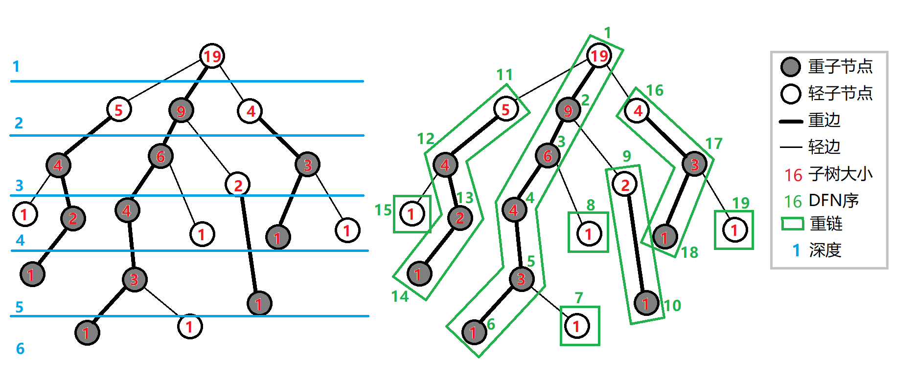
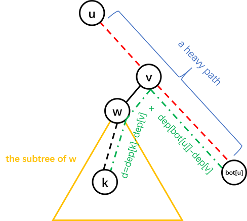

# 树链剖分 - OI Wiki

- Source: https://oi-wiki.org/graph/hld/

# 树链剖分

## 引入

树链剖分用于将树分割成若干条链的形式，以维护树上路径的信息．

具体来说，将整棵树剖分为若干条链，使它组合成线性结构，然后用其他的数据结构维护信息．

**树链剖分** （树剖/链剖）有多种形式，如 **重链剖分** ，**长链剖分** 和用于 Link/cut Tree 的剖分（有时被称作「实链剖分」）．大多数情况下（没有特别说明时），「树链剖分」都指「重链剖分」．

重链剖分可以将树上的任意一条路径划分成不超过 𝑂(log⁡𝑛)O(log⁡n) 条连续的链，每条链上的点深度互不相同（即是自底向上的一条链，链上所有点的 LCA 为链的一个端点）．

重链剖分还能保证划分出的每条链上的结点 DFS 序连续，因此可以方便地用一些维护序列的数据结构（如线段树）来维护树上路径的信息．例如：

  1. 修改 **树上两点之间的路径上** 所有点的值．
  2. 查询 **树上两点之间的路径上** 结点权值的 **和/极值/其它（在序列上可以用数据结构维护，便于合并的信息）** ．

除了配合数据结构来维护树上路径信息，树剖还可以用来 𝑂(log⁡𝑛)O(log⁡n)（且常数较小）地求 LCA．在某些题目中，还可以利用其性质来灵活地运用树剖．

## 重链剖分

我们给出一些定义：

定义 **重子结点** 表示其子结点中子树最大的子结点．如果有多个子树最大的子结点，取其一．如果没有子结点，就无重子结点．

定义 **轻子结点** 表示剩余的所有子结点．

从这个结点到重子结点的边为 **重边** ．

到其他轻子结点的边为 **轻边** ．

若干条首尾衔接的重边构成 **重链** ．

把落单的结点也当作重链，那么整棵树就被剖分成若干条重链．

如图：



## 实现

树剖的实现分两个 DFS 的过程．伪代码如下：

第一个 DFS 记录每个结点的父结点（𝑓𝑎𝑡ℎ𝑒𝑟father）、深度（𝑑𝑒𝑝𝑡ℎdepth）、子树大小（𝑠𝑖𝑧𝑒size）、重子结点（ℎ𝑠𝑜𝑛hson）．

TREE-BUILD (𝑢,𝑑𝑒𝑝)1𝑢.ℎ𝑠𝑜𝑛←02𝑢.ℎ𝑠𝑜𝑛.𝑠𝑖𝑧𝑒←03𝑢.𝑑𝑒𝑝𝑡ℎ←𝑑𝑒𝑝4𝑢.𝑠𝑖𝑧𝑒←15𝐟𝐨𝐫 each son 𝑣 of 𝑢6𝑢.𝑠𝑖𝑧𝑒←𝑢.𝑠𝑖𝑧𝑒+TREE-BUILD (𝑣,𝑑𝑒𝑝+1)7𝑣.𝑓𝑎𝑡ℎ𝑒𝑟←𝑢8𝐢𝐟 𝑣.𝑠𝑖𝑧𝑒>𝑢.ℎ𝑠𝑜𝑛.𝑠𝑖𝑧𝑒9𝑢.ℎ𝑠𝑜𝑛←𝑣10𝐫𝐞𝐭𝐮𝐫𝐧 𝑢.𝑠𝑖𝑧𝑒TREE-BUILD (u,dep)1u.hson←02u.hson.size←03u.depth←dep4u.size←15for each son v of u6u.size←u.size+TREE-BUILD (v,dep+1)7v.father←u8if v.size>u.hson.size9u.hson←v10return u.size

第二个 DFS 记录所在链的链顶（𝑡𝑜𝑝top，应初始化为结点本身）、重边优先遍历时的 DFS 序（𝑑𝑓𝑛dfn）、DFS 序对应的结点编号（𝑟𝑎𝑛𝑘rank）．

TREE-DECOMPOSITION (𝑢,𝑡𝑜𝑝)1𝑢.𝑡𝑜𝑝←𝑡𝑜𝑝2𝑡𝑜𝑡←𝑡𝑜𝑡+13𝑢.𝑑𝑓𝑛←𝑡𝑜𝑡4𝑟𝑎𝑛𝑘(𝑡𝑜𝑡)←𝑢5𝐢𝐟 𝑢.ℎ𝑠𝑜𝑛 is not 06TREE-DECOMPOSITION (𝑢.ℎ𝑠𝑜𝑛,𝑡𝑜𝑝)7𝐟𝐨𝐫 each son 𝑣 of 𝑢8𝐢𝐟 𝑣 is not 𝑢.ℎ𝑠𝑜𝑛9TREE-DECOMPOSITION (𝑣,𝑣)TREE-DECOMPOSITION (u,top)1u.top←top2tot←tot+13u.dfn←tot4rank(tot)←u5if u.hson is not 06TREE-DECOMPOSITION (u.hson,top)7for each son v of u8if v is not u.hson9TREE-DECOMPOSITION (v,v)

以下为代码实现．

我们先给出一些定义：

  * fa⁡(𝑥)fa⁡(x) 表示结点 𝑥x 在树上的父亲．
  * dep⁡(𝑥)dep⁡(x) 表示结点 𝑥x 在树上的深度．
  * siz⁡(𝑥)siz⁡(x) 表示结点 𝑥x 的子树的结点个数．
  * son⁡(𝑥)son⁡(x) 表示结点 𝑥x 的 **重儿子** ．
  * top⁡(𝑥)top⁡(x) 表示结点 𝑥x 所在 **重链** 的顶部结点（深度最小）．
  * dfn⁡(𝑥)dfn⁡(x) 表示结点 𝑥x 的 **DFS 序** ，也是其在线段树中的编号．
  * rnk⁡(𝑥)rnk⁡(x) 表示 DFS 序所对应的结点编号，有 rnk⁡(dfn⁡(𝑥)) =𝑥rnk⁡(dfn⁡(x))=x．

我们进行两遍 DFS 预处理出这些值，其中第一次 DFS 求出 fa⁡(𝑥)fa⁡(x)，dep⁡(𝑥)dep⁡(x)，siz⁡(𝑥)siz⁡(x)，son⁡(𝑥)son⁡(x)，第二次 DFS 求出 top⁡(𝑥)top⁡(x)，dfn⁡(𝑥)dfn⁡(x)，rnk⁡(𝑥)rnk⁡(x)．

```text 1 2 3 4 5 6 7 8 9 10 11 12 13 14 15 16 ``` |  ```text void dfs1 ( int u , int f ) { fa [ u ] = f , dep [ u ] = dep [ f ] \+ 1 , siz [ u ] = 1 ; for ( auto v : G [ u ]) { if ( v == f ) continue ; dfs1 ( v , u ); siz [ u ] += siz [ v ]; if ( siz [ v ] > siz [ son [ u ]]) son [ u ] = v ; } } void dfs2 ( int u , int ftop ) { top [ u ] = ftop , dfn [ u ] = ++ idx , rnk [ idx ] = u ; if ( son [ u ]) dfs2 ( son [ u ], ftop ); for ( auto v : G [ u ]) if ( v != son [ u ] && v != fa [ u ]) dfs2 ( v , v ); } ```   
---|---  
  
## 重链剖分的性质

**树上每个结点都属于且仅属于一条重链** ．

重链开头的结点一定不是重子结点（因为重链开头的结点要么是根，要么是其父亲结点的轻子结点）．

所有的重链将整棵树 **完全剖分** ．

在剖分时 **重边优先遍历** ，最后树的 DFS 序上，重链内的 DFS 序是连续的．按 DFN 排序后的序列即为剖分后的链．

一棵子树内的 DFS 序是连续的．

可以发现，当我们向下经过一条 **轻边** 时，所在子树的大小至少会除以二．

因此，对于树上的任意一条路径，把它拆分成从 [LCA](../lca/) 分别向两边往下走，分别最多走 𝑂(log⁡𝑛)O(log⁡n) 次，因此，树上的每条路径都可以被拆分成不超过 𝑂(log⁡𝑛)O(log⁡n) 条重链．

怎么有理有据地卡树剖

一般情况下树剖的 𝑂(log⁡𝑛)O(log⁡n) 常数不满很难卡，如果要卡只能建立二叉树深度低．

于是我们可以考虑折中方案．

我们建立一棵 √𝑛n 个结点的二叉树．对于每个结点到其儿子的边，我们将其替换成一条长度为 √𝑛n 的链．

这样子我们可以将随机询问轻重链切换次数卡到平均 log⁡𝑛2log⁡n2 次，同时有 𝑂(√𝑛log⁡𝑛)O(nlog⁡n) 的深度．

加上若干随机叶子看上去可以卡树剖．但是树剖常数小有可能卡不掉．

## 常见应用

### 路径上维护

用树链剖分求树上两点路径权值和，伪代码如下：

TREE-PATH-SUM (𝑢,𝑣)1𝑡𝑜𝑡←02𝐰𝐡𝐢𝐥𝐞 𝑢.𝑡𝑜𝑝 is not 𝑣.𝑡𝑜𝑝3𝐢𝐟 𝑢.𝑡𝑜𝑝.𝑑𝑒𝑝𝑡ℎ<𝑣.𝑡𝑜𝑝.𝑑𝑒𝑝𝑡ℎ4SWAP(𝑢,𝑣)5𝑡𝑜𝑡←𝑡𝑜𝑡+sum of values between 𝑢 and 𝑢.𝑡𝑜𝑝6𝑢←𝑢.𝑡𝑜𝑝.𝑓𝑎𝑡ℎ𝑒𝑟7𝑡𝑜𝑡←𝑡𝑜𝑡+sum of values between 𝑢 and 𝑣8𝐫𝐞𝐭𝐮𝐫𝐧 𝑡𝑜𝑡TREE-PATH-SUM (u,v)1tot←02while u.top is not v.top3if u.top.depth<v.top.depth4SWAP(u,v)5tot←tot+sum of values between u and u.top6u←u.top.father7tot←tot+sum of values between u and v8return tot

链上的 DFS 序是连续的，可以使用线段树、树状数组维护．

每次选择深度较大的链往上跳，直到两点在同一条链上．

同样的跳链结构适用于维护、统计路径上的其他信息．

### 子树维护

有时会要求，维护子树上的信息，譬如将以 𝑥x 为根的子树的所有结点的权值增加 𝑣v．

在 DFS 搜索的时候，子树中的结点的 DFS 序是连续的．

每一个结点记录 bottom 表示所在子树连续区间末端的结点．

这样就把子树信息转化为连续的一段区间信息．

### 求最近公共祖先

不断向上跳重链，当跳到同一条重链上时，深度较小的结点即为 LCA．

向上跳重链时需要先跳所在重链顶端深度较大的那个．

参考代码：

```text 1 2 3 4 5 6 7 8 9 ``` |  ```text int lca ( int u , int v ) { while ( top [ u ] != top [ v ]) { if ( dep [ top [ u ]] > dep [ top [ v ]]) u = fa [ top [ u ]]; else v = fa [ top [ v ]]; } return dep [ u ] > dep [ v ] ? v : u ; } ```   
---|---  
  
### 换根操作

考虑一类新的问题：除了树链剖分支持的基本操作外，加上了换根操作．

由于树链剖分维护的信息是静态的，不支持动态修改．同时，不可能每次换根后重新预处理信息，复杂度过高．那么，需要充分利用之前得到的信息来帮助解决换根操作．

对于路径修改和查询操作，由于树上两点之间的简单路径唯一，所以不会发生变化，与正常的处理方式相同．

对于子树修改和查询操作，一般的思路就是将换根后的子树映射到原来的子树．这需要分类讨论操作子树的根结点、换根后的整个树的根结点，以及原来树的根结点的相对位置关系．具体细节详见 [后文例题](./#loj-139-树链剖分)．

## 例题

本文通过例题展示如何应用重链剖分．首先是一道模板题．

[「ZJOI2008」树的统计](https://loj.ac/problem/10138)

对一棵有 𝑛n 个结点，结点带权值的静态树，进行三种操作共 𝑞q 次：

  1. 修改单个结点的权值；
  2. 查询 𝑢u 到 𝑣v 的路径上的最大权值；
  3. 查询 𝑢u 到 𝑣v 的路径上的权值之和．

保证 1 ≤𝑛 ≤300001≤n≤30000，0 ≤𝑞 ≤2000000≤q≤200000．

解答

根据题面以及前文所述性质，线段树需要维护三种操作：

  1. 单点修改；
  2. 区间查询最大值；
  3. 区间查询和．

单点修改很容易实现．

由于子树的 DFS 序连续（无论是否树剖都是如此），修改一个结点的子树只用修改这一段连续的 DFS 序区间．

问题是如何修改/查询两个结点之间的路径．

考虑我们是如何用 **倍增法求解 LCA** 的．首先我们 **将两个结点提到同一高度，然后将两个结点一起向上跳** ．对于树链剖分也可以使用这样的思想．

在向上跳的过程中，如果当前结点在重链上，向上跳到重链顶端，如果当前结点不在重链上，向上跳一个结点．如此直到两结点相同．沿途更新/查询区间信息．

对于每个询问，最多经过 𝑂(log⁡𝑛)O(log⁡n) 条重链，每条重链上线段树的复杂度为 𝑂(log⁡𝑛)O(log⁡n)，因此总时间复杂度为 𝑂(𝑛log⁡𝑛 +𝑞log2⁡𝑛)O(nlog⁡n+qlog2⁡n)．实际上重链个数很难达到 𝑂(log⁡𝑛)O(log⁡n)（可以用完全二叉树卡满），所以树剖在一般情况下常数较小．

参考代码

```text 1 2 3 4 5 6 7 8 9 10 11 12 13 14 15 16 17 18 19 20 21 22 23 24 25 26 27 28 29 30 31 32 33 34 35 36 37 38 39 40 41 42 43 44 45 46 47 48 49 50 51 52 53 54 55 56 57 58 59 60 61 62 63 64 65 66 67 68 69 70 71 72 73 74 75 76 77 78 79 80 81 82 83 84 85 86 87 88 89 90 91 92 93 94 95 96 97 98 99 100 101 102 103 104 105 106 107 108 109 110 111 112 113 114 115 116 117 118 119 120 121 122 123 124 125 126 127 128 129 130 131 132 133 134 135 136 137 138 139 140 141 142 143 ``` |  ```text #include <algorithm> #include <cstring> #include <iostream> #define lc o << 1 #define rc o << 1 | 1 constexpr int MAXN = 60010 ; constexpr int inf = 2e9 ; int n , a , b , w [ MAXN ], q , u , v ; int cur , h [ MAXN ], nxt [ MAXN ], p [ MAXN ]; int siz [ MAXN ], top [ MAXN ], son [ MAXN ], dep [ MAXN ], fa [ MAXN ], dfn [ MAXN ], rnk [ MAXN ], cnt ; char op [ 10 ]; void add_edge ( int x , int y ) { // 加边 cur ++ ; nxt [ cur ] = h [ x ]; h [ x ] = cur ; p [ cur ] = y ; } struct SegTree { int sum [ MAXN * 4 ], maxx [ MAXN * 4 ]; void build ( int o , int l , int r ) { if ( l == r ) { sum [ o ] = maxx [ o ] = w [ rnk [ l ]]; return ; } int mid = ( l \+ r ) >> 1 ; build ( lc , l , mid ); build ( rc , mid \+ 1 , r ); sum [ o ] = sum [ lc ] \+ sum [ rc ]; maxx [ o ] = std :: max ( maxx [ lc ], maxx [ rc ]); } int query1 ( int o , int l , int r , int ql , int qr ) { // 查询 max if ( l > qr || r < ql ) return \- inf ; if ( ql <= l && r <= qr ) return maxx [ o ]; int mid = ( l \+ r ) >> 1 ; return std :: max ( query1 ( lc , l , mid , ql , qr ), query1 ( rc , mid \+ 1 , r , ql , qr )); } int query2 ( int o , int l , int r , int ql , int qr ) { // 查询 sum if ( l > qr || r < ql ) return 0 ; if ( ql <= l && r <= qr ) return sum [ o ]; int mid = ( l \+ r ) >> 1 ; return query2 ( lc , l , mid , ql , qr ) \+ query2 ( rc , mid \+ 1 , r , ql , qr ); } void update ( int o , int l , int r , int x , int t ) { // 更新 if ( l == r ) { maxx [ o ] = sum [ o ] = t ; return ; } int mid = ( l \+ r ) >> 1 ; if ( x <= mid ) update ( lc , l , mid , x , t ); // 左右分别更新 else update ( rc , mid \+ 1 , r , x , t ); sum [ o ] = sum [ lc ] \+ sum [ rc ]; maxx [ o ] = std :: max ( maxx [ lc ], maxx [ rc ]); } } st ; void dfs1 ( int o ) { son [ o ] = -1 ; siz [ o ] = 1 ; for ( int j = h [ o ]; j ; j = nxt [ j ]) if ( ! dep [ p [ j ]]) { dep [ p [ j ]] = dep [ o ] \+ 1 ; fa [ p [ j ]] = o ; dfs1 ( p [ j ]); siz [ o ] += siz [ p [ j ]]; if ( son [ o ] == -1 || siz [ p [ j ]] > siz [ son [ o ]]) son [ o ] = p [ j ]; } } void dfs2 ( int o , int t ) { top [ o ] = t ; cnt ++ ; dfn [ o ] = cnt ; rnk [ cnt ] = o ; if ( son [ o ] == -1 ) return ; dfs2 ( son [ o ], t ); for ( int j = h [ o ]; j ; j = nxt [ j ]) if ( p [ j ] != son [ o ] && p [ j ] != fa [ o ]) dfs2 ( p [ j ], p [ j ]); } int querymax ( int x , int y ) { // 查询，看main函数理解一下 int ret = \- inf , fx = top [ x ], fy = top [ y ]; while ( fx != fy ) { if ( dep [ fx ] >= dep [ fy ]) ret = std :: max ( ret , st . query1 ( 1 , 1 , n , dfn [ fx ], dfn [ x ])), x = fa [ fx ]; else ret = std :: max ( ret , st . query1 ( 1 , 1 , n , dfn [ fy ], dfn [ y ])), y = fa [ fy ]; fx = top [ x ]; fy = top [ y ]; } if ( dfn [ x ] < dfn [ y ]) ret = std :: max ( ret , st . query1 ( 1 , 1 , n , dfn [ x ], dfn [ y ])); else ret = std :: max ( ret , st . query1 ( 1 , 1 , n , dfn [ y ], dfn [ x ])); return ret ; } int querysum ( int x , int y ) { int ret = 0 , fx = top [ x ], fy = top [ y ]; while ( fx != fy ) { if ( dep [ fx ] >= dep [ fy ]) ret += st . query2 ( 1 , 1 , n , dfn [ fx ], dfn [ x ]), x = fa [ fx ]; else ret += st . query2 ( 1 , 1 , n , dfn [ fy ], dfn [ y ]), y = fa [ fy ]; fx = top [ x ]; fy = top [ y ]; } if ( dfn [ x ] < dfn [ y ]) ret += st . query2 ( 1 , 1 , n , dfn [ x ], dfn [ y ]); else ret += st . query2 ( 1 , 1 , n , dfn [ y ], dfn [ x ]); return ret ; } using std :: cin ; using std :: cout ; int main () { cin . tie ( nullptr ) -> sync_with_stdio ( false ); cin >> n ; for ( int i = 1 ; i < n ; i ++ ) cin >> a >> b , add_edge ( a , b ), add_edge ( b , a ); for ( int i = 1 ; i <= n ; i ++ ) cin >> w [ i ]; dep [ 1 ] = 1 ; dfs1 ( 1 ); dfs2 ( 1 , 1 ); st . build ( 1 , 1 , n ); cin >> q ; while ( q \-- ) { cin >> op >> u >> v ; if ( ! strcmp ( op , "CHANGE" )) st . update ( 1 , 1 , n , dfn [ u ], v ); if ( ! strcmp ( op , "QMAX" )) cout << querymax ( u , v ) << '\n' ; if ( ! strcmp ( op , "QSUM" )) cout << querysum ( u , v ) << '\n' ; } return 0 ; } ```   
---|---  
  
然后是一道带换根操作的重链剖分模板题．

[LOJ 139. 树链剖分](https://loj.ac/p/139)

给定一棵 𝑛n 个结点的树（初始根结点为 11），要求支持如下的 𝑚m 次操作：

  * 换根，将结点 𝑢u 设为新的树根．
  * 修改路径上结点权值，将结点 𝑢u 和结点 𝑣v 之间路径上的所有结点（包括这两个结点）的权值增加 𝑤w．
  * 修改子树上结点权值，将以结点 𝑢u 为根的子树上的所有结点的权值增加 𝑤w．
  * 询问路径，询问结点 𝑢u 和结点 𝑣v 之间路径上的所有结点（包括这两个结点）的权值和．
  * 询问子树，询问以结点 𝑢u 为根的子树上的所有结点的权值和．

1 ≤𝑛,𝑚 ≤1051≤n,m≤105．

解法

先以 11 作为根结点跑 DFS，预处理出树链剖分所必需的信息．为方便表述，称以 11 为根结点的树为「原始树」，而称经历了若干次换根操作之后的树为「当前树」．在操作过程中，需要维护 𝑟𝑜𝑜𝑡root 为当前树的根结点．由于线段树中存储的是原始树的 DFS 序的信息，所以每次查询和修改时，都需要将当前树的查询和修改操作转换到原始树上．

对于换根操作，我们直接令 𝑟𝑜𝑜𝑡 ←𝑢root←u．对于路径操作，由于换根不影响路径，所以直接在原始树上做对应操作即可．

重点考虑操作子树的问题．我们根据 𝑢u 和 𝑟𝑜𝑜𝑡root 的相对位置关系做分类讨论：

  * 𝑢 =𝑟𝑜𝑜𝑡u=root：这是最特殊的情况，相当于对整棵树做操作．为此，直接对线段树的根结点打上标记或查询答案即可．
  * 𝑢u 是 𝑟𝑜𝑜𝑡root 在原始树上的祖先，即 𝑢u 位于 11 到 𝑟𝑜𝑜𝑡root 的简单路径上．

这是最值得注意的情况．定义 𝑣v 为原始树上 𝑢u 到 𝑟𝑜𝑜𝑡root 的简单路径上除 𝑢u 以外的深度最小的点，可以发现原始树上 𝑣v 及其子树以外的部分恰好是当前树上 𝑢u 及其子树．

考虑如何高效找到 𝑣v．我们先令 𝑣 ←𝑟𝑜𝑜𝑡v←root，然后沿着重链往上跳直到 dep⁡(top⁡(𝑣)) ≤dep⁡(𝑢) +1dep⁡(top⁡(v))≤dep⁡(u)+1．

    * 若 dep⁡(top⁡(𝑣)) =dep⁡(𝑢) +1dep⁡(top⁡(v))=dep⁡(u)+1，令 𝑣 ←top⁡(𝑣)v←top⁡(v)．此时，𝑣v 是 𝑢u 的一个轻儿子．
    * 若 dep⁡(top⁡(𝑣)) <dep⁡(𝑢) +1dep⁡(top⁡(v))<dep⁡(u)+1，亦即 dep⁡(top⁡(𝑣)) ≤dep⁡(𝑢)dep⁡(top⁡(v))≤dep⁡(u)，这说明 𝑢,𝑣u,v 处在同一条重链上．根据同一条重链上 DFS 序连续的性质，所求的 𝑣v 必然满足 dfn⁡(𝑣) =dfn⁡(𝑢) +1dfn⁡(v)=dfn⁡(u)+1．所以，可以令 𝑣 ←rnk⁡(dfn⁡(𝑢) +1)v←rnk⁡(dfn⁡(u)+1)．

注意，这两种情形中可以合并：在跳完之后可以直接令

𝑣←rnk⁡(dfn⁡(top⁡(𝑣))+dep⁡(𝑢)+1−dep⁡(top⁡(𝑣))).v←rnk⁡(dfn⁡(top⁡(v))+dep⁡(u)+1−dep⁡(top⁡(v))).

容易验证，利用这一表达式找到的 𝑣v，和分类讨论找到的 𝑣v 是等价的．参考实现中就用到了这一表达式．

由于 𝑣v 子树覆盖的区间为 [dfn⁡(𝑣),dfn⁡(𝑣) +siz⁡(𝑣))[dfn⁡(v),dfn⁡(v)+siz⁡(v))，所以只需要对 [1,dfn⁡(𝑣)) ∪[dfn⁡(𝑣) +siz⁡(𝑣),𝑛][1,dfn⁡(v))∪[dfn⁡(v)+siz⁡(v),n] 操作即可．

  * 其它情况．可以发现换根操作不会影响 𝑢u 的子树，用正常的方式维护即可．

这样做的复杂度与不带换根的做法相同，均为 𝑂(𝑛log2⁡𝑛)O(nlog2⁡n)．

参考代码

```text 1 2 3 4 5 6 7 8 9 10 11 12 13 14 15 16 17 18 19 20 21 22 23 24 25 26 27 28 29 30 31 32 33 34 35 36 37 38 39 40 41 42 43 44 45 46 47 48 49 50 51 52 53 54 55 56 57 58 59 60 61 62 63 64 65 66 67 68 69 70 71 72 73 74 75 76 77 78 79 80 81 82 83 84 85 86 87 88 89 90 91 92 93 94 95 96 97 98 99 100 101 102 103 104 105 106 107 108 109 110 111 112 113 114 115 116 117 118 119 120 121 122 123 124 125 126 127 128 129 130 131 132 133 134 135 136 137 138 139 140 141 142 143 144 145 146 147 148 149 150 151 152 153 154 155 156 ``` |  ```text #include <iostream> #include <vector> using lint = long long ; constexpr int N = 1e5 \+ 10 ; int n , m , root , a [ N ]; std :: vector < int > G [ N ]; int idx , fa [ N ], dep [ N ], siz [ N ], son [ N ], top [ N ], dfn [ N ], rnk [ N ]; struct SegmentTree { // 区间加，区间求和的线段树实现 lint sum [ N << 2 ], lzy [ N << 2 ]; void maketag ( int u , int l , int r , lint x ) { sum [ u ] += ( r \- l \+ 1 ) * x ; lzy [ u ] += x ; } void pushup ( int u ) { sum [ u ] = sum [ u << 1 ] \+ sum [ u << 1 | 1 ]; } void pushdown ( int u , int l , int r ) { int mid = l \+ r >> 1 ; maketag ( u << 1 , l , mid , lzy [ u ]); maketag ( u << 1 | 1 , mid \+ 1 , r , lzy [ u ]); lzy [ u ] = 0 ; } void build ( int u , int l , int r ) { if ( l == r ) { sum [ u ] = a [ rnk [ l ]]; return ; } int mid = l \+ r >> 1 ; build ( u << 1 , l , mid ), build ( u << 1 | 1 , mid \+ 1 , r ); pushup ( u ); } void upd ( int u , int l , int r , int ql , int qr , lint x ) { if ( ql <= l && r <= qr ) { maketag ( u , l , r , x ); return ; } int mid = l \+ r >> 1 ; pushdown ( u , l , r ); if ( ql <= mid ) upd ( u << 1 , l , mid , ql , qr , x ); if ( qr > mid ) upd ( u << 1 | 1 , mid \+ 1 , r , ql , qr , x ); pushup ( u ); } lint ask ( int u , int l , int r , int ql , int qr ) { if ( ql <= l && r <= qr ) return sum [ u ]; int mid = l \+ r >> 1 ; pushdown ( u , l , r ); if ( qr <= mid ) return ask ( u << 1 , l , mid , ql , qr ); if ( ql > mid ) return ask ( u << 1 | 1 , mid \+ 1 , r , ql , qr ); return ask ( u << 1 , l , mid , ql , qr ) \+ ask ( u << 1 | 1 , mid \+ 1 , r , ql , qr ); } } T ; void dfs1 ( int u , int f ) { // 树剖预处理 1 fa [ u ] = f , dep [ u ] = dep [ f ] \+ 1 , siz [ u ] = 1 ; for ( auto v : G [ u ]) { if ( v == f ) continue ; dfs1 ( v , u ); siz [ u ] += siz [ v ]; if ( siz [ v ] > siz [ son [ u ]]) son [ u ] = v ; } } void dfs2 ( int u , int tp ) { // 树剖预处理 2 top [ u ] = tp , dfn [ u ] = ++ idx , rnk [ idx ] = u ; if ( son [ u ]) dfs2 ( son [ u ], tp ); for ( auto v : G [ u ]) if ( v != fa [ u ] && v != son [ u ]) dfs2 ( v , v ); } void modify_path ( int u , int v , int w ) { // 正常树剖 while ( top [ u ] != top [ v ]) { if ( dep [ top [ u ]] < dep [ top [ v ]]) std :: swap ( u , v ); T . upd ( 1 , 1 , n , dfn [ top [ u ]], dfn [ u ], w ); u = fa [ top [ u ]]; } if ( dep [ u ] < dep [ v ]) std :: swap ( u , v ); T . upd ( 1 , 1 , n , dfn [ v ], dfn [ u ], w ); } void modify_subtree ( int u , int w ) { if ( u == root ) T . maketag ( 1 , 1 , n , w ); else if ( dfn [ u ] <= dfn [ root ] && dfn [ root ] <= dfn [ u ] \+ siz [ u ] \- 1 ) { int v = root ; while ( dep [ top [ v ]] > dep [ u ] \+ 1 ) v = fa [ top [ v ]]; // 向上跳 v = rnk [ dfn [ top [ v ]] \+ dep [ u ] \+ 1 \- dep [ top [ v ]]]; // 计算 v // 上面这一句可以替换为如下两句： // if (dep[top[v]] == dep[u] + 1) v = top[v]; // else if (dep[top[v]] < dep[u] + 1) v = rnk[dfn[u] + 1]; if ( 1 <= dfn [ v ] \- 1 ) T . upd ( 1 , 1 , n , 1 , dfn [ v ] \- 1 , w ); if ( dfn [ v ] \+ siz [ v ] <= n ) T . upd ( 1 , 1 , n , dfn [ v ] \+ siz [ v ], n , w ); } else T . upd ( 1 , 1 , n , dfn [ u ], dfn [ u ] \+ siz [ u ] \- 1 , w ); } lint query_path ( int u , int v ) { // 正常树剖 lint res = 0 ; while ( top [ u ] != top [ v ]) { if ( dep [ top [ u ]] < dep [ top [ v ]]) std :: swap ( u , v ); res += T . ask ( 1 , 1 , n , dfn [ top [ u ]], dfn [ u ]); u = fa [ top [ u ]]; } if ( dep [ u ] < dep [ v ]) std :: swap ( u , v ); res += T . ask ( 1 , 1 , n , dfn [ v ], dfn [ u ]); return res ; } lint query_subtree ( int u ) { if ( u == root ) return T . sum [ 1 ]; if ( dfn [ u ] <= dfn [ root ] && dfn [ root ] <= dfn [ u ] \+ siz [ u ] \- 1 ) { int v = root ; while ( dep [ top [ v ]] > dep [ u ] \+ 1 ) v = fa [ top [ v ]]; v = rnk [ dfn [ top [ v ]] \+ dep [ u ] \+ 1 \- dep [ top [ v ]]]; lint res = 0 ; if ( 1 <= dfn [ v ] \- 1 ) res += T . ask ( 1 , 1 , n , 1 , dfn [ v ] \- 1 ); if ( dfn [ v ] \+ siz [ v ] <= n ) res += T . ask ( 1 , 1 , n , dfn [ v ] \+ siz [ v ], n ); return res ; } return T . ask ( 1 , 1 , n , dfn [ u ], dfn [ u ] \+ siz [ u ] \- 1 ); } int main () { std :: cin . tie ( nullptr ) -> sync_with_stdio ( false ); std :: cin >> n , root = 1 ; for ( int i = 1 ; i <= n ; ++ i ) std :: cin >> a [ i ]; for ( int i = 2 , f ; i <= n ; ++ i ) { std :: cin >> f ; G [ i ]. emplace_back ( f ); G [ f ]. emplace_back ( i ); } dfs1 ( 1 , 0 ), dfs2 ( 1 , 1 ), T . build ( 1 , 1 , n ); // 预处理 for ( std :: cin >> m ; m ; \-- m ) { int op , u , v , w ; std :: cin >> op >> u ; if ( op == 1 ) root = u ; // 换根 else if ( op == 2 ) std :: cin >> v >> w , modify_path ( u , v , w ); // 修改路径 else if ( op == 3 ) std :: cin >> w , modify_subtree ( u , w ); // 修改子树 else if ( op == 4 ) std :: cin >> v , std :: cout << query_path ( u , v ) << " \n " ; // 查询路径 else std :: cout << query_subtree ( u ) << " \n " ; // 查询子树 } std :: cout . flush (); return 0 ; } ```   
---|---  
  
最后是一道交互题，也是树剖的非传统应用．

[Nauuo and Binary Tree](https://loj.ac/problem/6669)

有一棵以 11 为根的二叉树，你可以询问任意两点之间的距离，求出每个点的父亲．

结点数不超过 30003000，你最多可以进行 3000030000 次询问．

解法

首先可以通过 𝑛 −1n−1 次询问确定每个结点的深度．

然后考虑按深度从小到大确定每个结点的父亲，这样的话确定一个结点的父亲时其所有祖先一定都是已知的．

确定一个结点的父亲之前，先对树已知的部分进行重链剖分．

假设我们需要在子树 𝑢u 中找结点 𝑘k 所在的位置，我们可以询问 𝑘k 与 𝑢u 所在重链的尾端的距离，就可以进一步确定 𝑘k 的位置，具体见图：



其中红色虚线是一条重链，𝑑d 是询问的结果即 𝑑𝑖𝑠(𝑘,𝑏𝑜𝑡(𝑢))dis(k,bot(u))，𝑣v 的深度为 (𝑑𝑒𝑝(𝑘) +𝑑𝑒𝑝(𝑏𝑜𝑡(𝑢)) −𝑑)/2(dep(k)+dep(bot(u))−d)/2．

这样的话，如果 𝑣v 只有一个儿子，𝑘k 的父亲就是 𝑣v，否则可以递归地在 𝑤w 的子树中找 𝑘k 的父亲．

时间复杂度 𝑂(𝑛2)O(n2)，询问复杂度 𝑂(𝑛log⁡𝑛)O(nlog⁡n)．

具体地，设 𝑇(𝑛)T(n) 为最坏情况下在一棵大小为 𝑛n 的树中找到一个新结点的位置所需的询问次数，可以得到：

𝑇(𝑛)≤{0𝑛=1𝑇(⌊𝑛−12⌋)+1𝑛≥2T(n)≤{0n=1T(⌊n−12⌋)+1n≥2

2999 +∑2999𝑖=1𝑇(𝑖) ≤299402999+∑i=12999T(i)≤29940，事实上这个上界是可以通过构造数据达到的，然而只要进行一些随机扰动（如对深度进行排序时使用不稳定的排序算法），询问次数很难超过 2100021000 次．

参考代码

```text 1 2 3 4 5 6 7 8 9 10 11 12 13 14 15 16 17 18 19 20 21 22 23 24 25 26 27 28 29 30 31 32 33 34 35 36 37 38 39 40 41 42 43 44 45 46 47 48 49 50 51 52 53 54 55 56 57 58 59 60 61 62 63 64 65 66 67 68 69 70 71 72 73 74 75 76 77 78 79 80 81 82 ``` |  ```text #include <algorithm> #include <cstdio> #include <iostream> using namespace std ; constexpr int N = 3010 ; int n , fa [ N ], ch [ N ][ 2 ], dep [ N ], siz [ N ], son [ N ], bot [ N ], id [ N ]; int query ( int u , int v ) { printf ( "? %d %d \n " , u , v ); fflush ( stdout ); int d ; scanf ( "%d" , & d ); return d ; } void setFather ( int u , int v ) { fa [ v ] = u ; if ( ch [ u ][ 0 ]) ch [ u ][ 1 ] = v ; else ch [ u ][ 0 ] = v ; } void dfs ( int u ) { if ( ch [ u ][ 0 ]) dfs ( ch [ u ][ 0 ]); if ( ch [ u ][ 1 ]) dfs ( ch [ u ][ 1 ]); siz [ u ] = siz [ ch [ u ][ 0 ]] \+ siz [ ch [ u ][ 1 ]] \+ 1 ; if ( ch [ u ][ 1 ]) son [ u ] = int ( siz [ ch [ u ][ 0 ]] < siz [ ch [ u ][ 1 ]]); else son [ u ] = 0 ; if ( ch [ u ][ son [ u ]]) bot [ u ] = bot [ ch [ u ][ son [ u ]]]; else bot [ u ] = u ; } void solve ( int u , int k ) { if ( ! ch [ u ][ 0 ]) { setFather ( u , k ); return ; } int d = query ( k , bot [ u ]); int v = bot [ u ]; while ( dep [ v ] > ( dep [ k ] \+ dep [ bot [ u ]] \- d ) / 2 ) v = fa [ v ]; int w = ch [ v ][ son [ v ] ^ 1 ]; if ( w ) solve ( w , k ); else setFather ( v , k ); } int main () { int i ; scanf ( "%d" , & n ); for ( i = 2 ; i <= n ; ++ i ) { id [ i ] = i ; dep [ i ] = query ( 1 , i ); } sort ( id \+ 2 , id \+ n \+ 1 , []( int x , int y ) { return dep [ x ] < dep [ y ]; }); for ( i = 2 ; i <= n ; ++ i ) { dfs ( 1 ); solve ( 1 , id [ i ]); } printf ( "!" ); for ( i = 2 ; i <= n ; ++ i ) printf ( " %d" , fa [ i ]); printf ( " \n " ); fflush ( stdout ); return 0 ; } ```   
---|---  
  
## 长链剖分

长链剖分本质上就是另外一种链剖分方式．

定义 **重子结点** 表示其子结点中子树深度最大的子结点．如果有多个子树最大的子结点，取其一．如果没有子结点，就无重子结点．

定义 **轻子结点** 表示剩余的子结点．

从这个结点到重子结点的边为 **重边** ．

到其他轻子结点的边为 **轻边** ．

若干条首尾衔接的重边构成 **重链** ．

把落单的结点也当作重链，那么整棵树就被剖分成若干条重链．

如图（这种剖分方式既可以看成重链剖分也可以看成长链剖分）：


长链剖分实现方式和重链剖分类似，这里就不再展开．

### 常见应用

首先，我们发现长链剖分从一个结点到根的路径的轻边切换条数是 √𝑛n 级别的．

如何构造数据将轻重边切换次数卡满

我们可以构造这么一棵二叉树 T：

假设构造的二叉树参数为 𝐷D．

若 𝐷 ≠0D≠0, 则在左儿子构造一棵参数为 𝐷 −1D−1 的二叉树，在右儿子构造一个长度为 2𝐷 −12D−1 的链．

若 𝐷 =0D=0, 则我们可以直接构造一个单独叶结点，并且结束调用．

这样子构造一定可以将单独叶结点到根的路径全部为轻边且需要 𝐷2D2 级别的结点数．

取 𝐷 =√𝑛D=n 即可．

#### 长链剖分优化 DP

一般情况下可以使用长链剖分来优化的 DP 会有一维状态为深度维．

我们可以考虑使用长链剖分优化树上 DP．

具体的，我们每个结点的状态直接继承其重儿子的结点状态，同时将轻儿子的 DP 状态暴力合并．

[Codeforces 1009 F. Dominant Indices](http://codeforces.com/contest/1009/problem/F)

给定一棵有 𝑛n 个顶点的有根树，以顶点 11 作为根．

定义顶点 𝑥x 的深度数组为一个无限序列 [𝑑𝑥,0,𝑑𝑥,1,𝑑𝑥,2,…][dx,0,dx,1,dx,2,…]，其中 𝑑𝑥,𝑖dx,i 表示满足以下两个条件的顶点 𝑦y 的数量：

  * 𝑥x 是 𝑦y 的祖先；
  * 从 𝑥x 到 𝑦y 的简单路径恰好经过 𝑖i 条边．

顶点 𝑥x 的深度数组的主导下标（dominant index）（简称顶点 𝑥x 的主导下标）定义为一个下标 𝑗j，满足：

  * 对于所有 𝑘 <𝑗k<j，都有 𝑑𝑥,𝑘 <𝑑𝑥,𝑗dx,k<dx,j；
  * 对于所有 𝑘 >𝑗k>j，都有 𝑑𝑥,𝑘 ≤𝑑𝑥,𝑗dx,k≤dx,j．

请计算树中每个顶点的主导下标．

解答

我们设 𝑓𝑖,𝑗fi,j 表示在子树 i 内，和 i 距离为 j 的点数．

直接暴力转移时间复杂度为 𝑂(𝑛2)O(n2)

我们考虑每次转移我们直接继承重儿子的 DP 数组和答案，并且考虑在此基础上进行更新．

首先我们需要将重儿子的 DP 数组前面插入一个元素 1, 这代表着当前结点．

然后我们将所有轻儿子的 DP 数组暴力和当前结点的 DP 数组合并．

注意到因为轻儿子的 DP 数组长度为轻儿子所在重链长度，而所有重链长度和为 𝑛n．

也就是说，我们直接暴力合并轻儿子的总时间复杂度为 𝑂(𝑛)O(n)．

参考代码

```text 1 2 3 4 5 6 7 8 9 10 11 12 13 14 15 16 17 18 19 20 21 22 23 24 25 26 27 28 29 30 31 32 33 34 35 36 37 38 39 40 41 42 43 44 45 46 47 48 49 50 51 52 53 54 55 56 57 58 59 60 61 62 63 64 65 66 67 68 69 70 71 ``` |  ```text #include <algorithm> #include <iostream> using namespace std ; constexpr int N = 1000005 ; struct edge { int to , next ; } e [ N * 2 ]; int head [ N ], tot , n ; int d [ N ], fa [ N ], mx [ N ]; int * f [ N ], g [ N ], mxp [ N ]; int dfn [ N ]; void add ( int x , int y ) { e [ ++ tot ] = edge { y , head [ x ]}; head [ x ] = tot ; } void dfs1 ( int x ) { // 第一次插入一个1 d [ x ] = 1 ; for ( int i = head [ x ]; i ; i = e [ i ]. next ) if ( e [ i ]. to != fa [ x ]) { fa [ e [ i ]. to ] = x ; dfs1 ( e [ i ]. to ); d [ x ] = max ( d [ x ], d [ e [ i ]. to ] \+ 1 ); if ( d [ e [ i ]. to ] > d [ mx [ x ]]) mx [ x ] = e [ i ]. to ; } } void dfs2 ( int x ) { // 第二次合并 dfn [ x ] = ++* dfn ; f [ x ] = g \+ dfn [ x ]; if ( mx [ x ]) dfs2 ( mx [ x ]); for ( int i = head [ x ]; i ; i = e [ i ]. next ) if ( e [ i ]. to != fa [ x ] && e [ i ]. to != mx [ x ]) dfs2 ( e [ i ]. to ); } void getans ( int x ) { // 暴力合并算答案 if ( mx [ x ]) { getans ( mx [ x ]); mxp [ x ] = mxp [ mx [ x ]] \+ 1 ; } f [ x ][ 0 ] = 1 ; if ( f [ x ][ mxp [ x ]] <= 1 ) mxp [ x ] = 0 ; for ( int i = head [ x ]; i ; i = e [ i ]. next ) if ( e [ i ]. to != fa [ x ] && e [ i ]. to != mx [ x ]) { getans ( e [ i ]. to ); int len = d [ e [ i ]. to ]; for ( int j = 0 ; j <= len \- 1 ; j ++ ) { f [ x ][ j \+ 1 ] += f [ e [ i ]. to ][ j ]; if ( f [ x ][ j \+ 1 ] > f [ x ][ mxp [ x ]]) mxp [ x ] = j \+ 1 ; if ( f [ x ][ j \+ 1 ] == f [ x ][ mxp [ x ]] && j \+ 1 < mxp [ x ]) mxp [ x ] = j \+ 1 ; } } } int main () { cin . tie ( nullptr ) -> sync_with_stdio ( false ); cin >> n ; for ( int i = 1 ; i < n ; i ++ ) { int x , y ; cin >> x >> y ; add ( x , y ); add ( y , x ); } dfs1 ( 1 ); dfs2 ( 1 ); getans ( 1 ); for ( int i = 1 ; i <= n ; i ++ ) cout << mxp [ i ] << '\n' ; } ```   
---|---  
  
注意，一般情况下 DP 数组的内存分配为一条重链整体分配内存，链上不同的结点有不同的首位置指针．

DP 数组的长度我们可以根据子树最深结点算出．

当然长链剖分优化 DP 技巧非常多，包括但是不仅限于打标记等等．这里不再展开．

参考 [租酥雨的博客](https://www.cnblogs.com/zhoushuyu/p/9468669.html)．

#### 长链剖分求 k 级祖先

即询问一个点向父亲跳 𝑘k 次跳到的结点．

首先我们假设我们已经预处理了每一个结点的 2𝑖2i 级祖先．

现在我们假设我们找到了询问结点的 2𝑖2i 级祖先满足 2𝑖 ≤𝑘 <2𝑖+12i≤k<2i+1．

我们考虑求出其所在重链的结点并且按照深度列入表格．假设重链长度为 𝑑d．

同时我们在预处理的时候找到每条重链的根结点的 11 到 𝑑d 级祖先，同样放入表格．

根据长链剖分的性质，𝑘 −2𝑖 ≤2𝑖 ≤𝑑k−2i≤2i≤d, 也就是说，我们可以 𝑂(1)O(1) 在这条重链的表格上求出的这个结点的 𝑘k 级祖先．

预处理需要倍增出 2𝑖2i 次级祖先，同时需要预处理每条重链对应的表格．

预处理复杂度 𝑂(𝑛log⁡𝑛)O(nlog⁡n), 询问复杂度 𝑂(1)O(1)．

## 习题

  * [「洛谷 P3379」【模板】最近公共祖先（LCA）](https://www.luogu.com.cn/problem/P3379)（树剖求 LCA 无需数据结构，可以用作练习）
  * [「JLOI2014」松鼠的新家](https://loj.ac/problem/2236)（当然也可以用树上差分）
  * [「HAOI2015」树上操作](https://loj.ac/problem/2125)
  * [「洛谷 P3384」【模板】重链剖分/树链剖分](https://www.luogu.com.cn/problem/P3384)
  * [「洛谷 P1505」[国家集训队] 旅游](https://www.luogu.com.cn/problem/P1505)
  * [「NOI2015」软件包管理器](https://uoj.ac/problem/128)
  * [「SDOI2011」染色](https://www.luogu.com.cn/problem/P2486)
  * [「SDOI2014」旅行](https://hydro.ac/p/bzoj-P3531)
  * [「洛谷 P3979」遥远的国度](https://www.luogu.com.cn/problem/P3979)
  * [「POI2014」Hotel 加强版](https://hydro.ac/p/bzoj-P4543)（长链剖分优化 DP）
  * [攻略](https://hydro.ac/p/bzoj-P3252)（长链剖分优化贪心）

* * *

>  __本页面最近更新： 2026/3/4 00:42:25，[更新历史](https://github.com/OI-wiki/OI-wiki/commits/master/docs/graph/hld.md)  
>  __发现错误？想一起完善？[在 GitHub 上编辑此页！](https://oi-wiki.org/edit-landing/?ref=/graph/hld.md "edit.link.title")  
>  __本页面贡献者：[Ir1d](https://github.com/Ir1d), [ouuan](https://github.com/ouuan), [StudyingFather](https://github.com/StudyingFather), [hyp1231](https://github.com/hyp1231), [Tiphereth-A](https://github.com/Tiphereth-A), [H-J-Granger](https://github.com/H-J-Granger), [sshwy](https://github.com/sshwy), [countercurrent-time](https://github.com/countercurrent-time), [Enter-tainer](https://github.com/Enter-tainer), [greyqz](https://github.com/greyqz), [Marcythm](https://github.com/Marcythm), [NachtgeistW](https://github.com/NachtgeistW), [Xeonacid](https://github.com/Xeonacid), [zhouyuyang2002](https://github.com/zhouyuyang2002), [CCXXXI](https://github.com/CCXXXI), [Chrogeek](https://github.com/Chrogeek), [Early0v0](https://github.com/Early0v0), [hsfzLZH1](https://github.com/hsfzLZH1), [mgt](mailto:i@margatroid.xyz), [AngelKitty](https://github.com/AngelKitty), [c-forrest](https://github.com/c-forrest), [ChungZH](https://github.com/ChungZH), [cjsoft](https://github.com/cjsoft), [diauweb](https://github.com/diauweb), [ezoixx130](https://github.com/ezoixx130), [ftxj](https://github.com/ftxj), [GekkaSaori](https://github.com/GekkaSaori), [GoodCoder666](https://github.com/GoodCoder666), [Henry-ZHR](https://github.com/Henry-ZHR), [Konano](https://github.com/Konano), [LovelyBuggies](https://github.com/LovelyBuggies), [LuoshuiTianyi](https://github.com/LuoshuiTianyi), [Makkiy](https://github.com/Makkiy), [minghu6](https://github.com/minghu6), [P-Y-Y](https://github.com/P-Y-Y), [PotassiumWings](https://github.com/PotassiumWings), [SamZhangQingChuan](https://github.com/SamZhangQingChuan), [sun2snow](https://github.com/sun2snow), [Suyun514](mailto:suyun514@qq.com), [weiyong1024](https://github.com/weiyong1024), [2997ms](https://github.com/2997ms), [Alexander-a-l](https://github.com/Alexander-a-l), [amlhdsan](https://github.com/amlhdsan), [fearlessxjdx](https://github.com/fearlessxjdx), [forever516-hack](https://github.com/forever516-hack), [GavinZhengOI](https://github.com/GavinZhengOI), [Gesrua](https://github.com/Gesrua), [Great-designer](https://github.com/Great-designer), [HeRaNO](https://github.com/HeRaNO), [kenlig](https://github.com/kenlig), [ksyx](https://github.com/ksyx), [kxccc](https://github.com/kxccc), [LiserverYang](https://github.com/LiserverYang), [lychees](https://github.com/lychees), [Macesuted](https://github.com/Macesuted), [mao1t](https://github.com/mao1t), [Menci](https://github.com/Menci), [Molmin](https://github.com/Molmin), [Peanut-Tang](https://github.com/Peanut-Tang), [SukkaW](https://github.com/SukkaW)  
>  __本页面的全部内容在**[CC BY-SA 4.0](https://creativecommons.org/licenses/by-sa/4.0/deed.zh) 和 [SATA](https://github.com/zTrix/sata-license)** 协议之条款下提供，附加条款亦可能应用
