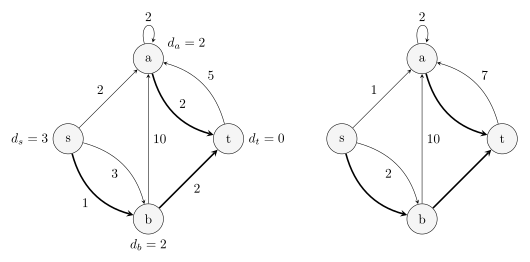
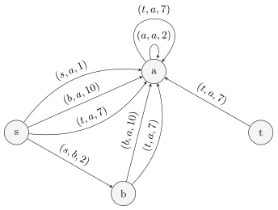

# k 短路 - OI Wiki

- Source: https://oi-wiki.org/graph/kth-path/

# k 短路

前置知识：[Dijstra 算法](../shortest-path/#dijkstra-算法)、[A* 算法](../../search/astar/)、[可持久化可并堆](../../ds/persistent-heap/)

## 问题描述

给定一个有 𝑛n 个结点，𝑚m 条边的有向图，求从 𝑠s 到 𝑡t 的所有不同路径中的第 𝑘k 短路径的长度．

「路径」

本文所指的「路径」允许经过同一条边或同一个结点多次，因此严格的名称应为「[途径](../concept/#路径)」而非「路径」．本文讨论的问题严格地说也是 **第 𝑘k 短途径**（𝑘k shortest walk）问题．但是，本文依据习惯仍然采用「路径」这一名称，而对于不自交的路径则称为「简单路径」．

## A* 算法

A* 算法是一个搜索算法．它为每个当前状态 𝑥x 都设置了一个估价函数 𝑓(𝑥) =𝑔(𝑥) +ℎ(𝑥)f(x)=g(x)+h(x)，其中 𝑔(𝑥)g(x) 为从初始状态到达当前状态的实际代价，ℎ(𝑥)h(x) 为从当前状态到达目标状态的最佳路径的估计代价．搜索时，每次取出 𝑓(𝑥)f(x) 最优的状态 𝑥x，扩展其所有后继状态．可以用 **优先队列** 来维护这个值．

在求解 𝑘k 短路问题时，令 ℎ(𝑥)h(x) 为从当前结点到达终点 𝑡t 的最短路径长度．可以通过在反向图上对结点 𝑡t 跑单源最短路预处理出每个结点的这个值．对于每个状态需要记录两个值，即当前到达的结点 𝑥x 和已经走过的距离 𝑔(𝑥)g(x)，将这种状态记为 (𝑥,𝑔(𝑥))(x,g(x))．开始时，将初始状态 (𝑠,0)(s,0) 加入优先队列．每次取出估价函数 𝑓(𝑥) =𝑔(𝑥) +ℎ(𝑥)f(x)=g(x)+h(x) 最小的一个状态，枚举该状态所在结点 𝑥x 的所有出边，将对应的后继状态加入优先队列．当访问到一个结点第 𝑘k 次时，对应状态的 𝑔(𝑥)g(x) 就是从起始结点 𝑠s 到该结点的第 𝑘k 短路的长度．

这一搜索过程可以优化．由于只需要求出从初始结点到目标结点的第 𝑘k 短路，所以已经取出的状态到达一个结点的次数大于 𝑘k 次时，可以不扩展其后继状态．这一状态不会影响到最后的答案．这是因为之前 𝑘k 次取出该结点时，已经形成了到达该结点的 𝑘k 条合法路径，足以构造到达目标结点的前 𝑘k 条最短路．

若使用优先队列优化 Dijkstra 算法，由于至多会将所有边加入优先队列 𝑘k 次，所以算法的时间复杂度是 𝑂(𝑘𝑚log⁡𝑘𝑚)O(kmlog⁡km) 的，空间复杂度是 𝑂(𝑘𝑚)O(km) 的．相较于直接搜索，A* 算法针对目标结点 𝑡t 进行了剪枝，但这仅仅改良了常数，而非渐近复杂度．本节所述算法虽然复杂度并不优秀，但是可以在相同的复杂度内求出从起始点 𝑠s 到（以 𝑡t 为根的最短路树中）每个结点的前 𝑘k 短路．

### 实现

模板题 [Library Checker - K-Shortest Walk](https://judge.yosupo.jp/problem/k_shortest_walk) 参考实现

```text 1 2 3 4 5 6 7 8 9 10 11 12 13 14 15 16 17 18 19 20 21 22 23 24 25 26 27 28 29 30 31 32 33 34 35 36 37 38 39 40 41 42 43 44 45 46 47 48 49 50 51 52 53 54 55 56 57 58 59 60 61 62 63 64 65 66 67 68 69 70 71 72 73 74 75 76 77 78 79 80 81 82 83 84 85 86 87 88 89 90 91 ``` |  ```text // Submission: https://judge.yosupo.jp/submission/311622 #include <iostream> #include <queue> #include <vector> constexpr long long inf = 0x3f3f3f3f3f3f3f3f ; struct Edge { int u , v , c ; Edge ( int u , int v , int c ) : u ( u ), v ( v ), c ( c ) {} }; int n , m , s , t , k ; std :: vector < std :: vector < int >> gr , ig ; // Graph and inverse graph. std :: vector < Edge > edges ; // Edges. std :: priority_queue < std :: pair < long long , int > , std :: vector < std :: pair < long long , int >> , std :: greater <>> pq ; std :: vector < long long > dist_t ; // Calculate distances to the destination node t. (Dijkstra) void calc_distances_to_t () { dist_t . assign ( n , inf ); dist_t [ t ] = 0 ; pq . emplace ( dist_t [ t ], t ); while ( ! pq . empty ()) { long long di = pq . top (). first ; int cur = pq . top (). second ; pq . pop (); if ( di > dist_t [ cur ]) continue ; for ( auto e : ig [ cur ]) { int nxt = edges [ e ]. u ; auto di_nxt = di \+ edges [ e ]. c ; if ( di_nxt < dist_t [ nxt ]) { dist_t [ nxt ] = di_nxt ; pq . emplace ( di_nxt , nxt ); } } } } std :: vector < long long > ans ; // Find the k shortest walk. (A* search) // Complexity: O(k * n * log(k * n)). void find_k_shortest_walks () { ans . assign ( k , -1 ); std :: vector < int > cnt ( n ); pq . emplace ( dist_t [ s ], s ); while ( ! pq . empty ()) { long long cost = pq . top (). first ; int cur = pq . top (). second ; pq . pop (); // Skip unreachable nodes. if ( cost >= inf ) continue ; if ( cur == t ) ans [ cnt [ t ]] = cost ; ++ cnt [ cur ]; // Terminate when the destination has been visited k times. if ( cnt [ t ] >= k ) break ; // Expand the same node at most k times. if ( cnt [ cur ] > k ) continue ; for ( auto e : gr [ cur ]) { int nxt = edges [ e ]. v ; auto cost_nxt = cost \- dist_t [ cur ] \+ edges [ e ]. c \+ dist_t [ nxt ]; pq . emplace ( cost_nxt , nxt ); } } } int main () { // Input. std :: cin >> n >> m >> s >> t >> k ; gr . resize ( n ); ig . resize ( n ); edges . reserve ( m ); for ( int i = 0 ; i < m ; ++ i ) { int u , v , c ; std :: cin >> u >> v >> c ; edges . emplace_back ( u , v , c ); gr [ u ]. push_back ( i ); ig [ v ]. push_back ( i ); } // Calculate. calc_distances_to_t (); find_k_shortest_walks (); // Output. for ( auto x : ans ) std :: cout << x << '\n' ; return 0 ; } ```   
---|---  
  
## 可持久化可并堆做法

前述算法实际上求出了到达所有结点的 𝑘k 短路．如果仅仅是想要求得到达给定目标结点 𝑡t 的 𝑘k 短路，实际上可以做得更快．本节提供了一种基于可持久化可并堆的 𝑂(𝑚log⁡𝑚 +𝑘log⁡𝑘)O(mlog⁡m+klog⁡k) 的做法．

### 最短路树与偏离边

前述算法的瓶颈在于只有到达目标结点 𝑡t 时才会更新答案．但是，不同路径之间可能相差并不大．例如，次短路区别于最短路，可能仅仅是在一条边处多绕了一个结点，而路径的其他部分都是相同的；前述算法却可能需要重复搜索一遍这些相同的边才能找到次短路．由于只有绕路部分才是关键的，所以，要得到前 𝑘k 条最短的路径，只需要考虑代价最小的 𝑘k 种绕路方式即可．这就引出了最短路树的概念．

在反向图上从目标结点 𝑡t 开始跑单源最短路，记录每个结点 𝑥x 到 𝑡t 的最短路长度 ℎ(𝑥)h(x)，并记录从结点 𝑥x 开始的最短路经过的第一条边 𝑓𝑥fx；如果有多个最优的选择，选择任意一条即可．所有这些边 𝑓𝑥fx 及其端点就构成一棵树，且从树上的每个结点 𝑥x 到根节点 𝑡t 的简单路径都是 𝑥x 到 𝑡t 的一条最短路径．这就是 **最短路树** 𝑇T．

求得最短路树 𝑇T 后，就可以计算每条不在 𝑇T 上的边会多绕多少路．对于边 𝑒 =(𝑢,𝑣) ∉𝑇e=(u,v)∉T，边权为 𝑤w，可以定义一条新的边，仍然从 𝑢u 指向 𝑣v，且代价为 Δ(𝑒) =𝑤 +ℎ(𝑣) −ℎ(𝑢)Δ(e)=w+h(v)−h(u)．本文形象地称这些权值为 Δ(𝑒)Δ(e) 的边为 **偏离边** （sidetrack），权值 Δ(𝑒)Δ(e) 则称为偏离成本．如果一条边的端点并非全部在最短路树 𝑇T 里，它就不会影响到达结点 𝑡t 的 𝑘k 短路的计算，可以直接将它们删掉．

下图左侧是有向图 𝐺G，右侧是它对应的最短路树 𝑇T（粗边）和相应的偏离边（细边）：



设一条从 𝑠s 到 𝑡t 的路径经过的边集为 𝑃P，去掉 𝑃P 中与 𝑇T 的交集得到 𝑃′P′．那么，将 𝑃′P′ 中的边顺次排列，它相邻的两条边 𝑒1 =(𝑢1,𝑣1)e1=(u1,v1) 和 𝑒2 =(𝑢2,𝑣2)e2=(u2,v2) 一定满足

  * 条件 ( ∗)(∗)：后者的起点 𝑢2u2 是前者的终点 𝑣1v1 在最短路树 𝑇T 的祖先（包括其自身）．

这是因为对应的原始路径 𝑃P 中，𝑣1v1 和 𝑢2u2 之间连接了若干条 𝑇T 中的树边．反过来，对于一个满足条件 ( ∗)(∗) 的边集 𝑃′P′，一定存在唯一一条图 𝐺G 中的路径 𝑃P 与之对应．这是因为 𝑣1v1 和 𝑢2u2 在最短路树 𝑇T 上的简单路径是唯一的．这样就说明，原图中的任意路径 𝑃P 与满足条件 ( ∗)(∗) 的偏离边序列 𝑃′P′ 一一对应．而且，路径 𝑃P 的长度就等于最短路长度 ℎ(𝑠)h(s) 与这些偏离成本的和：

ℎ(𝑠)+∑𝑒∈𝑃′Δ(𝑒).h(s)+∑e∈P′Δ(e).

这些讨论说明，寻找 𝑘k 短路的任务转化为寻找成本第 𝑘k 小且满足条件 ( ∗)(∗) 的偏离边序列 𝑃′P′ 的任务．

为处理条件 ( ∗)(∗)，与其每次查询时在最短路树上寻找祖先，不如直接将每个结点的偏离边集合下传到最短路树上的子孙结点．这相当于建了下面这样的图 𝐺′G′：



在这个图上，条件 ( ∗)(∗) 就转化为要求 𝑃′P′ 中的边首尾相接，也就是说，𝑃′P′ 是图 𝐺′G′ 中的一条路径．问题进一步转化为在这个图中寻找从 𝑠s 出发的长度第 𝑘k 小的 **到达任意结点的** 路径．相对于原始的 𝑘k 短路问题，此处不再要求路径一定要结束在目标结点 𝑡t．

转化后的问题很容易解决．直接从起始结点 𝑠s 处出发，求单源最短路．每次从优先队列中取出一个结点时，就相当于找到了一条图 𝐺′G′ 中的路径，也就对应着图 𝐺G 中一条到达目标结点 𝑡t 的路径．

### 可持久化可并堆优化

算法思路已经明晰．但是，朴素实现这一算法的复杂度过高．由于图 𝐺′G′ 中，单个结点处边的规模可能是 Θ(𝑚)Θ(m) 的，所以每次求单源最短路时，都可能需要将规模为 Θ(𝑚)Θ(m) 的边集压入优先队列．实际上，没有必要将所有边都压入优先队列：很多情况下，压入队列的这些边，只有最短的那些可能会在后续计算中弹出队列．也就是说，完全可以将单个结点处的整个边集作为一个存储单元压入优先队列，每次只要能够快速访问边集中的最短边即可．

这启发我们使用小根堆来存储单个结点处的边集．在求单源最短路的优先队列中，只需要存储这些堆，它们的成本就是堆顶元素对应的最短路成本．每次弹出队首时，都需要一并从队首的堆中弹出堆顶边．然后，既要将弹出堆顶后的堆压回优先队列，也需要将堆顶边终点处的偏离边集合对应的堆顶压入优先队列．

使用堆来存储边集也解决了沿最短路树下传边集的问题．因为下传边集相当于需要将当前结点的边集合并到它的子结点，所以，堆还需要支持合并操作；合并到子结点的同时，还不能破坏当前结点处的边集，所以，堆还需要支持可持久化．这正是可持久化可并堆．

由此，就得到算法的完整过程：

  1. 从目标结点 𝑡t 出发，跑单源最短路，求出最短路树．
  2. 为最短路树上的每个结点都构建对应的偏离边集合，存储到可持久化可并堆里．
  3. 沿着最短路树的边，从目标结点 𝑡t 开始，将每个结点处的堆都合并到子结点的堆里．
  4. 从起始结点 𝑠s 出发，将该处的堆压入优先队列．
  5. 弹出队首的堆，记录答案，再将弹出堆顶后的堆压回优先队列，并将堆顶边的终点处的堆压入优先队列．

一般采用左偏树或随机堆实现可持久化可并堆．此时，最后一步还可以继续优化．这些堆的内部结构都是二叉树．弹出堆顶后，原本是要合并左右两个子结点，再将合并后的堆顶压入优先队列的；但是，本算法中，可以不执行合并操作，直接将两个子结点对应的堆分别压入优先队列．这样就省去了单次合并的 𝑂(log⁡𝑚)O(log⁡m) 的复杂度．由于每次弹出队首堆后，至多会将三个新的堆压入优先队列，所以，优先队列的大小是 𝑂(𝑘)O(k) 的．这样，单次查询的时间复杂度就降低到 𝑂(log⁡𝑘)O(log⁡k)．总查询复杂度就是 𝑂(𝑘log⁡𝑘)O(klog⁡k) 的．

由于构建最短路树和构建可持久化可并堆的复杂度都是 𝑂(𝑚log⁡𝑚)O(mlog⁡m) 的，所以，算法的总时间复杂度为 𝑂(𝑚log⁡𝑚 +𝑘log⁡𝑘)O(mlog⁡m+klog⁡k) 的．

### 实现

模板题 [Library Checker - K-Shortest Walk](https://judge.yosupo.jp/problem/k_shortest_walk) 参考实现

```text 1 2 3 4 5 6 7 8 9 10 11 12 13 14 15 16 17 18 19 20 21 22 23 24 25 26 27 28 29 30 31 32 33 34 35 36 37 38 39 40 41 42 43 44 45 46 47 48 49 50 51 52 53 54 55 56 57 58 59 60 61 62 63 64 65 66 67 68 69 70 71 72 73 74 75 76 77 78 79 80 81 82 83 84 85 86 87 88 89 90 91 92 93 94 95 96 97 98 99 100 101 102 103 104 105 106 107 108 109 110 111 112 113 114 115 116 117 118 119 120 121 122 123 124 125 126 127 128 129 130 131 132 133 134 135 136 137 138 139 140 141 142 143 144 145 146 147 148 149 150 151 152 153 154 155 156 157 158 159 160 161 162 163 164 165 166 ``` |  ```text // Submission: https://judge.yosupo.jp/submission/311623 #include <algorithm> #include <iostream> #include <queue> #include <random> #include <vector> std :: mt19937_64 rng ( static_cast < std :: mt19937_64 :: result_type > ( time ( nullptr ))); constexpr long long inf = 0x3f3f3f3f3f3f3f3f ; // Persistent Randomized Heap. struct PersistentRandomizedHeap { static constexpr int N = 1e7 ; int id ; std :: vector < int > rt , lc , rc , to ; std :: vector < long long > va ; int new_node ( long long cost , int _to ) { ++ id ; va [ id ] = cost ; to [ id ] = _to ; return id ; } int copy_node ( int x ) { ++ id ; lc [ id ] = lc [ x ]; rc [ id ] = rc [ x ]; va [ id ] = va [ x ]; to [ id ] = to [ x ]; return id ; } int meld ( int x , int y , std :: mt19937_64 :: result_type rand ) { if ( ! x || ! y ) return x | y ; if ( va [ x ] > va [ y ]) std :: swap ( x , y ); x = copy_node ( x ); if ( rand & 1 ) std :: swap ( lc [ x ], rc [ x ]); rc [ x ] = meld ( rc [ x ], y , rand >> 1 ); return x ; } PersistentRandomizedHeap () : id ( 0 ), rt ( N ), lc ( N ), rc ( N ), to ( N ), va ( N ) {} void insert ( int i , long long cost , int _to ) { rt [ i ] = meld ( rt [ i ], new_node ( cost , _to ), rng ()); } void merge ( int i , int j ) { rt [ i ] = meld ( rt [ i ], rt [ j ], rng ()); } } heaps ; struct Edge { int u , v , c ; Edge ( int u , int v , int c ) : u ( u ), v ( v ), c ( c ) {} }; int n , m , s , t , k ; std :: vector < std :: vector < int >> gr , ig ; std :: vector < Edge > edges ; std :: priority_queue < std :: pair < long long , int > , std :: vector < std :: pair < long long , int >> , std :: greater <>> pq ; std :: vector < long long > dist_t ; std :: vector < int > out ; // Calculate distances to the destination node t. (Dijkstra) // Record the optimal outgoing edges which form the shortest path tree T. void calc_distances_to_t () { dist_t . assign ( n , inf ); dist_t [ t ] = 0 ; out . assign ( n , -1 ); pq . emplace ( dist_t [ t ], t ); while ( ! pq . empty ()) { long long di = pq . top (). first ; int cur = pq . top (). second ; pq . pop (); if ( di > dist_t [ cur ]) continue ; for ( auto e : ig [ cur ]) { int nxt = edges [ e ]. u ; auto di_nxt = di \+ edges [ e ]. c ; if ( di_nxt < dist_t [ nxt ]) { dist_t [ nxt ] = di_nxt ; out [ nxt ] = e ; pq . emplace ( di_nxt , nxt ); } } } } // Construct sidetracks and propagate them through tree T. void build_sidetracks () { // Insert all valid sidetracks into heaps. for ( int i = 0 ; i < m ; ++ i ) { auto edge = edges [ i ]; if ( out [ edge . u ] != i && dist_t [ edge . u ] < inf && dist_t [ edge . v ] < inf ) { heaps . insert ( edge . u , edge . c \+ dist_t [ edge . v ] \- dist_t [ edge . u ], edge . v ); } } // Propagate sidetracks down the shortest path tree. std :: queue < int > q ; q . push ( t ); while ( ! q . empty ()) { auto cur = q . front (); q . pop (); for ( auto e : ig [ cur ]) { auto nxt = edges [ e ]. u ; if ( out [ nxt ] == e ) { heaps . merge ( nxt , cur ); q . push ( nxt ); } } } } std :: vector < long long > ans ; // Insert a non-empty heap into the priority queue. // Total cost is the heap top value adjusted by accumulated cost. void insert ( int x , long long cost ) { if ( x ) pq . emplace ( cost \+ heaps . va [ x ], x ); } // Find the k shortest paths in the sidetrack graph. (Dijkstra) // These correspond to the k shortest walks in the original graph. void find_k_shortest_walks () { int cnt = 0 ; ans . assign ( k , -1 ); if ( dist_t [ s ] >= inf ) return ; ans [ cnt ++ ] = dist_t [ s ]; insert ( heaps . rt [ s ], dist_t [ s ]); while ( ! pq . empty () && cnt < k ) { auto cost = pq . top (). first ; int cur = pq . top (). second ; pq . pop (); ans [ cnt ++ ] = cost ; insert ( heaps . lc [ cur ], cost \- heaps . va [ cur ]); insert ( heaps . rc [ cur ], cost \- heaps . va [ cur ]); insert ( heaps . rt [ heaps . to [ cur ]], cost ); } } int main () { // Input. std :: cin >> n >> m >> s >> t >> k ; gr . resize ( n ); ig . resize ( n ); edges . reserve ( m ); for ( int i = 0 ; i < m ; ++ i ) { int u , v , c ; std :: cin >> u >> v >> c ; edges . emplace_back ( u , v , c ); gr [ u ]. push_back ( i ); ig [ v ]. push_back ( i ); } // Calculate. calc_distances_to_t (); build_sidetracks (); find_k_shortest_walks (); // Output. for ( auto x : ans ) std :: cout << x << '\n' ; return 0 ; } ```   
---|---  
  
## 习题

  * [「SDOI2010」魔法猪学院](https://www.luogu.com.cn/problem/P2483)

## 参考资料与注释

  * [[Tutorial] k shortest paths and Eppstein's algorithm by meooow - Codeforces](https://codeforces.com/blog/entry/102085)

* * *

>  __本页面最近更新： 2026/1/7 08:56:54，[更新历史](https://github.com/OI-wiki/OI-wiki/commits/master/docs/graph/kth-path.md)  
>  __发现错误？想一起完善？[在 GitHub 上编辑此页！](https://oi-wiki.org/edit-landing/?ref=/graph/kth-path.md "edit.link.title")  
>  __本页面贡献者：[hsfzLZH1](https://github.com/hsfzLZH1), [Ir1d](https://github.com/Ir1d), [c-forrest](https://github.com/c-forrest), [ouuan](https://github.com/ouuan), [Henry-ZHR](https://github.com/Henry-ZHR), [Tiphereth-A](https://github.com/Tiphereth-A), [Enter-tainer](https://github.com/Enter-tainer), [iamtwz](https://github.com/iamtwz), [ksyx](https://github.com/ksyx), [Marcythm](https://github.com/Marcythm), [warzone-oier](https://github.com/warzone-oier), [wpy-handsome](https://github.com/wpy-handsome)  
>  __本页面的全部内容在**[CC BY-SA 4.0](https://creativecommons.org/licenses/by-sa/4.0/deed.zh) 和 [SATA](https://github.com/zTrix/sata-license)** 协议之条款下提供，附加条款亦可能应用
