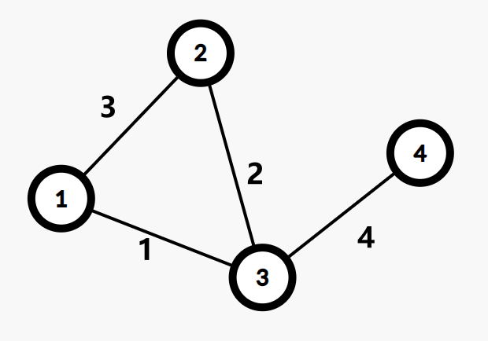
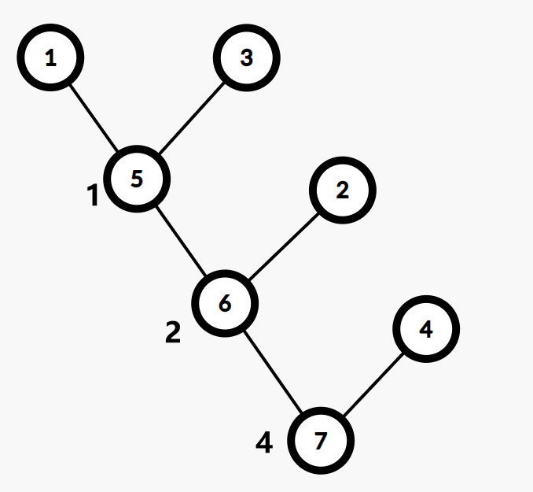

# 最小生成树 - OI Wiki

- Source: https://oi-wiki.org/graph/mst/

# 最小生成树

## 定义

在阅读下列内容之前，请务必阅读 [图论相关概念](../concept/) 与 [树基础](../tree-basic/) 部分，并了解以下定义：

  1. 生成子图
  2. 生成树

我们定义无向连通图的 **最小生成树** （Minimum Spanning Tree，MST）为边权和最小的生成树．

注意：只有连通图才有生成树，而对于非连通图，只存在生成森林．

## Kruskal 算法

Kruskal 算法是一种常见并且好写的最小生成树算法，由 Kruskal 发明．该算法的基本思想是从小到大加入边，是个贪心算法．

### 前置知识

[并查集](../../ds/dsu/)、[贪心](../../basic/greedy/)、[图的存储](../save/)．

### 实现

图示：


伪代码：

1𝐈𝐧𝐩𝐮𝐭. The edges of the graph 𝑒, where each element in 𝑒 is (𝑢,𝑣,𝑤) denoting that there is an edge between 𝑢 and 𝑣 weighted 𝑤.2𝐎𝐮𝐭𝐩𝐮𝐭. The edges of the MST of the input graph.3𝐌𝐞𝐭𝐡𝐨𝐝. 4𝑟𝑒𝑠𝑢𝑙𝑡←∅5sort 𝑒 into nondecreasing order by weight 𝑤6𝐟𝐨𝐫 each (𝑢,𝑣,𝑤) in the sorted 𝑒7𝐢𝐟 𝑢 and 𝑣 are not connected in the union-find set 8connect 𝑢 and 𝑣 in the union-find set9𝑟𝑒𝑠𝑢𝑙𝑡←𝑟𝑒𝑠𝑢𝑙𝑡⋃ {(𝑢,𝑣,𝑤)}10𝐫𝐞𝐭𝐮𝐫𝐧 𝑟𝑒𝑠𝑢𝑙𝑡1Input. The edges of the graph e, where each element in e is (u,v,w) denoting that there is an edge between u and v weighted w.2Output. The edges of the MST of the input graph.3Method. 4result←∅5sort e into nondecreasing order by weight w6for each (u,v,w) in the sorted e7if u and v are not connected in the union-find set 8connect u and v in the union-find set9result←result⋃ {(u,v,w)}10return result

算法虽简单，但需要相应的数据结构来支持……具体来说，维护一个森林，查询两个结点是否在同一棵树中，连接两棵树．

抽象一点地说，维护一堆 **集合** ，查询两个元素是否属于同一集合，合并两个集合．

其中，查询两点是否连通和连接两点可以使用并查集维护．

如果使用 𝑂(𝑚log⁡𝑚)O(mlog⁡m) 的排序算法，并且使用 𝑂(𝑚𝛼(𝑚,𝑛))O(mα(m,n)) 或 𝑂(𝑚log⁡𝑛)O(mlog⁡n) 的并查集，就可以得到时间复杂度为 𝑂(𝑚log⁡𝑚)O(mlog⁡m) 的 Kruskal 算法．

### 证明

思路很简单，为了造出一棵最小生成树，我们从最小边权的边开始，按边权从小到大依次加入，如果某次加边产生了环，就扔掉这条边，直到加入了 𝑛 −1n−1 条边，即形成了一棵树．

证明：使用归纳法，证明任何时候 K 算法选择的边集都被某棵 MST 所包含．

基础：对于算法刚开始时，显然成立（最小生成树存在）．

归纳：假设某时刻成立，当前边集为 𝐹F，令 𝑇T 为这棵 MST，考虑下一条加入的边 𝑒e．

如果 𝑒e 属于 𝑇T，那么成立．

否则，𝑇 +𝑒T+e 一定存在一个环，考虑这个环上不属于 𝐹F 的另一条边 𝑓f（至少存在一条）．

首先，𝑓f 的权值一定不会比 𝑒e 小，不然 𝑓f 会在 𝑒e 之前被选取．

然后，𝑓f 的权值一定不会比 𝑒e 大，不然 𝑇 +𝑒 −𝑓T+e−f 就是一棵比 𝑇T 还优的生成树了．

所以，𝑇 +𝑒 −𝑓T+e−f 包含了 𝐹F，并且也是一棵最小生成树，归纳成立．

### 例题

[洛谷 P1195 口袋的天空](https://www.luogu.com.cn/problem/P1195)

有 𝑛n 朵云，你要将它们连成 𝑘k 个棉花糖，将 𝑋𝑖Xi 云朵和 𝑌𝑖Yi 连接起来需要 𝐿𝑖Li 的代价，求最小代价．

例题代码

C++PythonJava

```text 1 2 3 4 5 6 7 8 9 10 11 12 13 14 15 16 17 18 19 20 21 22 23 24 25 26 27 28 29 30 31 32 33 34 35 36 37 38 39 40 41 42 43 44 45 46 47 48 49 50 51 52 53 54 55 56 57 58 59 60 61 62 63 64 65 66 67 68 69 ``` |  ```text #include <algorithm> #include <iostream> using namespace std ; int fa [ 1010 ]; // 定义父亲 int n , m , k ; struct edge { int u , v , w ; }; int l ; edge g [ 10010 ]; void add ( int u , int v , int w ) { l ++ ; g [ l ]. u = u ; g [ l ]. v = v ; g [ l ]. w = w ; } // 标准并查集 int findroot ( int x ) { return fa [ x ] == x ? x : fa [ x ] = findroot ( fa [ x ]); } void Merge ( int x , int y ) { x = findroot ( x ); y = findroot ( y ); fa [ x ] = y ; } bool cmp ( edge A , edge B ) { return A . w < B . w ; } // Kruskal 算法 void kruskal () { int tot = 0 ; // 存已选了的边数 int ans = 0 ; // 存总的代价 for ( int i = 1 ; i <= m ; i ++ ) { int xr = findroot ( g [ i ]. u ), yr = findroot ( g [ i ]. v ); if ( xr != yr ) { // 如果父亲不一样 Merge ( xr , yr ); // 合并 tot ++ ; // 边数增加 ans += g [ i ]. w ; // 代价增加 if ( tot == n \- k ) { // 检查选的边数是否满足 k 个棉花糖 cout << ans << '\n' ; return ; } } } cout << "No Answer \n " ; // 无法连成 } int main () { cin >> n >> m >> k ; if ( n == k ) { // 特判边界情况 cout << "0 \n " ; return 0 ; } for ( int i = 1 ; i <= n ; i ++ ) { // 初始化 fa [ i ] = i ; } for ( int i = 1 ; i <= m ; i ++ ) { int u , v , w ; cin >> u >> v >> w ; add ( u , v , w ); // 添加边 } sort ( g \+ 1 , g \+ m \+ 1 , cmp ); // 先按边权排序 kruskal (); return 0 ; } ```   
---|---  
  
```text 1 2 3 4 5 6 7 8 9 10 11 12 13 14 15 16 17 18 19 20 21 22 23 24 25 26 27 28 29 30 31 32 33 34 35 36 37 38 39 40 41 42 43 44 45 46 47 48 49 50 51 52 53 54 55 56 57 58 ``` |  ```text class Edge : def __init__ ( self , u , v , w ): self . u = u self . v = v self . w = w fa = [ 0 ] * 1010 # 定义父亲 g = [] def add ( u , v , w ): g . append ( Edge ( u , v , w )) # 标准并查集 def findroot ( x ): if fa [ x ] == x : return x fa [ x ] = findroot ( fa [ x ]) return fa [ x ] def Merge ( x , y ): x = findroot ( x ) y = findroot ( y ) fa [ x ] = y # Kruskal 算法 def kruskal (): tot = 0 # 存已选了的边数 ans = 0 # 存总的代价 for e in g : x = findroot ( e . u ) y = findroot ( e . v ) if x != y : # 如果父亲不一样 fa [ x ] = y # 合并 tot += 1 # 边数增加 ans += e . w # 代价增加 if tot == n \- k : # 检查选的边数是否满足 k 个棉花糖 print ( ans ) return print ( "No Answer" ) # 无法连成 if __name__ == "__main__" : n , m , k = map ( int , input () . split ()) if n == k : # 特判边界情况 print ( "0" ) exit () for i in range ( 1 , n \+ 1 ): # 初始化 fa [ i ] = i for i in range ( 1 , m \+ 1 ): u , v , w = map ( int , input () . split ()) add ( u , v , w ) # 添加边 g . sort ( key = lambda edge : edge . w ) # 先按边权排序 kruskal () ```   
---|---  
  
```text 1 2 3 4 5 6 7 8 9 10 11 12 13 14 15 16 17 18 19 20 21 22 23 24 25 26 27 28 29 30 31 32 33 34 35 36 37 38 39 40 41 42 43 44 45 46 47 48 49 50 51 52 53 54 55 56 57 58 59 60 61 62 63 64 65 66 67 68 69 70 71 72 73 74 75 76 77 78 79 80 81 82 83 84 85 86 87 88 89 90 91 ``` |  ```text import java.util.Arrays ; import java.util.Scanner ; class Edge { int u ; int v ; int w ; Edge ( int u , int v , int w ) { this . u = u ; this . v = v ; this . w = w ; } } public class Main { static int [] parent = new int [ 1010 ] ; // 定义父亲 static int m , n , k ; // n 表示点的数量， m 表示边的数量，k 表示需要的棉花糖个数 static Edge [] edges = new Edge [ 10010 ] ; static int l ; static void addEdge ( int u , int v , int w ) { edges [++ l ] = new Edge ( u , v , w ); } // 标准并查集 static int findroot ( int x ) { if ( parent [ x ] != x ) { parent [ x ] = findroot ( parent [ x ] ); } return parent [ x ] ; } static void Merge ( int x , int y ) { x = findroot ( x ); y = findroot ( y ); parent [ x ] = y ; } static boolean cmp ( Edge A , Edge B ) { return A . w < B . w ; } // Kruskal 算法 static void kruskal () { int tot = 0 ; // 存已选了的边数 int ans = 0 ; // 存总的代价 for ( int i = 1 ; i <= m ; i ++ ) { int xr = findroot ( edges [ i ] . u ); int yr = findroot ( edges [ i ] . v ); if ( xr != yr ) { // 如果父亲不一样 Merge ( xr , yr ); // 合并 tot ++ ; // 边数增加 ans += edges [ i ] . w ; // 代价增加 if ( tot == n \- k ) { // 检查选的边数是否满足 k 个棉花糖 System . out . println ( ans ); return ; } } } System . out . println ( "No Answer" ); // 无法连成 } public static void main ( String [] args ) { Scanner scanner = new Scanner ( System . in ); n = scanner . nextInt (); m = scanner . nextInt (); k = scanner . nextInt (); if ( n == k ) { // 特判边界情况 System . out . println ( "0" ); return ; } // 初始化 for ( int i = 1 ; i <= n ; i ++ ) { parent [ i ] = i ; } for ( int i = 1 ; i <= m ; i ++ ) { int u = scanner . nextInt (); int v = scanner . nextInt (); int w = scanner . nextInt (); addEdge ( u , v , w ); // 添加边 } Arrays . sort ( edges , 1 , m \+ 1 , ( a , b ) -> Integer . compare ( a . w , b . w )); // 先按边权排序 kruskal (); scanner . close (); } } ```   
---|---  
  
## Prim 算法

Prim 算法是另一种常见并且好写的最小生成树算法．该算法的基本思想是从一个结点开始，不断加点（而不是 Kruskal 算法的加边）．

### 实现

图示：


具体来说，每次要选择距离最小的一个结点，以及用新的边更新其他结点的距离．

其实跟 Dijkstra 算法一样，每次找到距离最小的一个点，可以暴力找也可以用堆维护．

堆优化的方式类似 Dijkstra 的堆优化，但如果使用二叉堆等不支持 𝑂(1)O(1) decrease-key 的堆，复杂度就不优于 Kruskal，常数也比 Kruskal 大．所以，一般情况下都使用 Kruskal 算法，在稠密图尤其是完全图上，暴力 Prim 的复杂度比 Kruskal 优，但 **不一定** 实际跑得更快．

暴力：𝑂(𝑛2 +𝑚)O(n2+m)．

二叉堆：𝑂((𝑛 +𝑚)log⁡𝑛)O((n+m)log⁡n)．

Fib 堆：𝑂(𝑛log⁡𝑛 +𝑚)O(nlog⁡n+m)．

伪代码：

1𝐈𝐧𝐩𝐮𝐭. The nodes of the graph 𝑉 ; the function 𝑔(𝑢,𝑣) whichmeans the weight of the edge (𝑢,𝑣); the function 𝑎𝑑𝑗(𝑣) whichmeans the nodes adjacent to 𝑣.2𝐎𝐮𝐭𝐩𝐮𝐭. The sum of weights of the MST of the input graph.3𝐌𝐞𝐭𝐡𝐨𝐝.4𝑟𝑒𝑠𝑢𝑙𝑡←05choose an arbitrary node in 𝑉 to be the 𝑟𝑜𝑜𝑡6𝑑𝑖𝑠(𝑟𝑜𝑜𝑡)←07𝐟𝐨𝐫 each node 𝑣∈(𝑉−{𝑟𝑜𝑜𝑡})8𝑑𝑖𝑠(𝑣)←∞9𝑟𝑒𝑠𝑡←𝑉10𝐰𝐡𝐢𝐥𝐞 𝑟𝑒𝑠𝑡≠∅11𝑐𝑢𝑟←the node with the minimum 𝑑𝑖𝑠 in 𝑟𝑒𝑠𝑡12𝑟𝑒𝑠𝑢𝑙𝑡←𝑟𝑒𝑠𝑢𝑙𝑡+𝑑𝑖𝑠(𝑐𝑢𝑟)13𝑟𝑒𝑠𝑡←𝑟𝑒𝑠𝑡−{𝑐𝑢𝑟}14𝐟𝐨𝐫 each node 𝑣∈𝑎𝑑𝑗(𝑐𝑢𝑟)15𝑑𝑖𝑠(𝑣)←min(𝑑𝑖𝑠(𝑣),𝑔(𝑐𝑢𝑟,𝑣))16𝐫𝐞𝐭𝐮𝐫𝐧 𝑟𝑒𝑠𝑢𝑙𝑡1Input. The nodes of the graph V ; the function g(u,v) whichmeans the weight of the edge (u,v); the function adj(v) whichmeans the nodes adjacent to v.2Output. The sum of weights of the MST of the input graph.3Method.4result←05choose an arbitrary node in V to be the root6dis(root)←07for each node v∈(V−{root})8dis(v)←∞9rest←V10while rest≠∅11cur←the node with the minimum dis in rest12result←result+dis(cur)13rest←rest−{cur}14for each node v∈adj(cur)15dis(v)←min(dis(v),g(cur,v))16return result

注意：上述代码只是求出了最小生成树的权值，如果要输出方案还需要记录每个点的 𝑑𝑖𝑠dis 代表的是哪条边．

代码实现

```text 1 2 3 4 5 6 7 8 9 10 11 12 13 14 15 16 17 18 19 20 21 22 23 24 25 26 27 28 29 30 31 32 33 34 35 36 37 38 39 40 41 42 43 44 45 46 47 48 49 50 51 52 53 54 55 56 57 58 59 60 ``` |  ```text // 使用二叉堆优化的 Prim 算法． #include <cstring> #include <iostream> #include <queue> using namespace std ; constexpr int N = 5050 , M = 2e5 \+ 10 ; struct E { int v , w , x ; } e [ M * 2 ]; int n , m , h [ N ], cnte ; void adde ( int u , int v , int w ) { e [ ++ cnte ] = E { v , w , h [ u ]}, h [ u ] = cnte ; } struct S { int u , d ; }; bool operator < ( const S & x , const S & y ) { return x . d > y . d ; } priority_queue < S > q ; int dis [ N ]; bool vis [ N ]; int res = 0 , cnt = 0 ; void Prim () { memset ( dis , 0x3f , sizeof ( dis )); dis [ 1 ] = 0 ; q . push ({ 1 , 0 }); while ( ! q . empty ()) { if ( cnt >= n ) break ; int u = q . top (). u , d = q . top (). d ; q . pop (); if ( vis [ u ]) continue ; vis [ u ] = true ; ++ cnt ; res += d ; for ( int i = h [ u ]; i ; i = e [ i ]. x ) { int v = e [ i ]. v , w = e [ i ]. w ; if ( w < dis [ v ]) { dis [ v ] = w , q . push ({ v , w }); } } } } int main () { cin >> n >> m ; for ( int i = 1 , u , v , w ; i <= m ; ++ i ) { cin >> u >> v >> w , adde ( u , v , w ), adde ( v , u , w ); } Prim (); if ( cnt == n ) cout << res ; else cout << "No MST." ; return 0 ; } ```   
---|---  
  
### 证明

从任意一个结点开始，将结点分成两类：已加入的，未加入的．

每次从未加入的结点中，找一个与已加入的结点之间边权最小值最小的结点．

然后将这个结点加入，并连上那条边权最小的边．

重复 𝑛 −1n−1 次即可．

证明：还是说明在每一步，都存在一棵最小生成树包含已选边集．

基础：只有一个结点的时候，显然成立．

归纳：如果某一步成立，当前边集为 𝐹F，属于 𝑇T 这棵 MST，接下来要加入边 𝑒e．

如果 𝑒e 属于 𝑇T，那么成立．

否则考虑 𝑇 +𝑒T+e 中环上另一条可以加入当前边集的边 𝑓f．

首先，𝑓f 的权值一定不小于 𝑒e 的权值，否则就会选择 𝑓f 而不是 𝑒e 了．

然后，𝑓f 的权值一定不大于 𝑒e 的权值，否则 𝑇 +𝑒 −𝑓T+e−f 就是一棵更小的生成树了．

因此，𝑒e 和 𝑓f 的权值相等，𝑇 +𝑒 −𝑓T+e−f 也是一棵最小生成树，且包含了 𝐹F．

## Boruvka 算法

接下来介绍另一种求解最小生成树的算法——Boruvka 算法．该算法的思想是前两种算法的结合．它可以用于求解无向图的最小生成森林．（无向连通图就是最小生成树．）

在边具有较多特殊性质的问题中，Boruvka 算法具有优势．例如 [CF888G](https://codeforces.com/problemset/problem/888/G) 的完全图问题．

为了描述该算法，我们需要引入一些定义：

  1. 定义 𝐸′E′ 为我们当前找到的最小生成森林的边．在算法执行过程中，我们逐步向 𝐸′E′ 加边，定义 **连通块** 表示一个点集 𝑉′ ⊆𝑉V′⊆V，且这个点集中的任意两个点 𝑢u，𝑣v 在 𝐸′E′ 中的边构成的子图上是连通的（互相可达）．
  2. 定义一个连通块的 **最小边** 为它连向其它连通块的边中权值最小的那一条．

初始时，𝐸′ =∅E′=∅，每个点各自是一个连通块：

  1. 计算每个点分别属于哪个连通块．将每个连通块都设为「没有最小边」．
  2. 遍历每条边 (𝑢,𝑣)(u,v)，如果 𝑢u 和 𝑣v 不在同一个连通块，就用这条边的边权分别更新 𝑢u 和 𝑣v 所在连通块的最小边．
  3. 如果所有连通块都没有最小边，退出程序，此时的 𝐸′E′ 就是原图最小生成森林的边集．否则，将每个有最小边的连通块的最小边加入 𝐸′E′，返回第一步．

下面通过一张动态图来举一个例子（图源自 [维基百科](https://en.wikipedia.org/wiki/Bor%C5%AFvka%27s_algorithm)）：


当原图连通时，每次迭代连通块数量至少减半，算法只会迭代不超过 𝑂(log⁡𝑉)O(log⁡V) 次，而原图不连通时相当于多个子问题，因此算法复杂度是 𝑂(𝐸log⁡𝑉)O(Elog⁡V) 的．给出算法的伪代码：（修改自 [维基百科](https://en.wikipedia.org/wiki/Bor%C5%AFvka%27s_algorithm)）

1𝐈𝐧𝐩𝐮𝐭. A graph 𝐺 whose edges have distinct weights. 2𝐎𝐮𝐭𝐩𝐮𝐭. The minimum spanning forest of 𝐺.3𝐌𝐞𝐭𝐡𝐨𝐝. 4Initialize a forest 𝐹 to be a set of one-vertex trees5𝐰𝐡𝐢𝐥𝐞 True6Find the components of 𝐹 and label each vertex of 𝐺 by its component 7Initialize the cheapest edge for each component to "None"8𝐟𝐨𝐫 each edge (𝑢,𝑣) of 𝐺9𝐢𝐟 𝑢 and 𝑣 have different component labels10𝐢𝐟 (𝑢,𝑣) is cheaper than the cheapest edge for the component of 𝑢11 Set (𝑢,𝑣) as the cheapest edge for the component of 𝑢12𝐢𝐟 (𝑢,𝑣) is cheaper than the cheapest edge for the component of 𝑣13 Set (𝑢,𝑣) as the cheapest edge for the component of 𝑣14𝐢𝐟 all components'cheapest edges are "None"15𝐫𝐞𝐭𝐮𝐫𝐧 𝐹16𝐟𝐨𝐫 each component whose cheapest edge is not "None"17 Add its cheapest edge to 𝐹1Input. A graph G whose edges have distinct weights. 2Output. The minimum spanning forest of G.3Method. 4Initialize a forest F to be a set of one-vertex trees5while True6Find the components of F and label each vertex of G by its component 7Initialize the cheapest edge for each component to "None"8for each edge (u,v) of G9if u and v have different component labels10if (u,v) is cheaper than the cheapest edge for the component of u11 Set (u,v) as the cheapest edge for the component of u12if (u,v) is cheaper than the cheapest edge for the component of v13 Set (u,v) as the cheapest edge for the component of v14if  all components'cheapest edges are "None"15return F16for  each component whose cheapest edge is not "None"17 Add its cheapest edge to F

需要注意边与边的比较通常需要第二关键字（例如按编号排序），以便当边权相同时分出边的大小．

## 习题

  * [「HAOI2006」聪明的猴子](https://www.luogu.com.cn/problem/P2504)
  * [「SCOI2005」繁忙的都市](https://loj.ac/problem/2149)

## 最小生成树的唯一性

考虑最小生成树的唯一性．如果一条边 **不在最小生成树的边集中** ，并且可以替换与其 **权值相同、并且在最小生成树边集** 的另一条边．那么，这个最小生成树就是不唯一的．

对于 Kruskal 算法，只要计算为当前权值的边可以放几条，实际放了几条，如果这两个值不一样，那么就说明这几条边与之前的边产生了一个环（这个环中至少有两条当前权值的边，否则根据并查集，这条边是不能放的），即最小生成树不唯一．

寻找权值与当前边相同的边，我们只需要记录头尾指针，用单调队列即可在 𝑂(𝛼(𝑚))O(α(m))（m 为边数）的时间复杂度里优秀解决这个问题（基本与原算法时间相同）．

例题：[POJ 1679](http://poj.org/problem?id=1679)

```text 1 2 3 4 5 6 7 8 9 10 11 12 13 14 15 16 17 18 19 20 21 22 23 24 25 26 27 28 29 30 31 32 33 34 35 36 37 38 39 40 41 42 43 44 45 46 47 48 49 50 51 52 53 54 55 56 57 58 59 60 61 62 ``` |  ```text #include <algorithm> #include <iostream> struct Edge { int x , y , z ; }; int f [ 100001 ]; Edge a [ 100001 ]; int cmp ( const Edge & a , const Edge & b ) { return a . z < b . z ; } int find ( int x ) { return f [ x ] == x ? x : f [ x ] = find ( f [ x ]); } using std :: cin ; using std :: cout ; int main () { cin . tie ( nullptr ) -> sync_with_stdio ( false ); int t ; cin >> t ; while ( t \-- ) { int n , m ; cin >> n >> m ; for ( int i = 1 ; i <= n ; i ++ ) f [ i ] = i ; for ( int i = 1 ; i <= m ; i ++ ) cin >> a [ i ]. x >> a [ i ]. y >> a [ i ]. z ; std :: sort ( a \+ 1 , a \+ m \+ 1 , cmp ); // 先排序 int num = 0 , ans = 0 , tail = 0 , sum1 = 0 , sum2 = 0 ; bool flag = true ; for ( int i = 1 ; i <= m \+ 1 ; i ++ ) { // 再并查集加边 if ( i > tail ) { if ( sum1 != sum2 ) { flag = false ; break ; } sum1 = 0 ; for ( int j = i ; j <= m \+ 1 ; j ++ ) { if ( j > m || a [ j ]. z != a [ i ]. z ) { tail = j \- 1 ; break ; } if ( find ( a [ j ]. x ) != find ( a [ j ]. y )) ++ sum1 ; } sum2 = 0 ; } if ( i > m ) break ; int x = find ( a [ i ]. x ); int y = find ( a [ i ]. y ); if ( x != y && num != n \- 1 ) { sum2 ++ ; num ++ ; f [ x ] = f [ y ]; ans += a [ i ]. z ; } } if ( flag ) cout << ans << '\n' ; else cout << "Not Unique! \n " ; } return 0 ; } ```   
---|---  
  
## 次小生成树

### 非严格次小生成树

#### 定义

在无向图中，边权和最小的满足边权和 **大于等于** 最小生成树边权和的生成树

#### 求解方法

  * 求出无向图的最小生成树 𝑇T，设其权值和为 𝑀M
  * 遍历每条未被选中的边 𝑒 =(𝑢,𝑣,𝑤)e=(u,v,w)，找到 𝑇T 中 𝑢u 到 𝑣v 路径上边权最大的一条边 𝑒′ =(𝑠,𝑡,𝑤′)e′=(s,t,w′)，则在 𝑇T 中以 𝑒e 替换 𝑒′e′，可得一棵权值和为 𝑀′ =𝑀 +𝑤 −𝑤′M′=M+w−w′ 的生成树 𝑇′T′.
  * 对所有替换得到的答案 𝑀′M′ 取最小值即可

如何求 𝑢,𝑣u,v 路径上的边权最大值呢？

我们可以使用倍增来维护，预处理出每个节点的 2𝑖2i 级祖先及到达其 2𝑖2i 级祖先路径上最大的边权，这样在倍增求 LCA 的过程中可以直接求得．

### 严格次小生成树

#### 定义

在无向图中，边权和最小的满足边权和 **严格大于** 最小生成树边权和的生成树

#### 求解方法

考虑刚才的非严格次小生成树求解过程，为什么求得的解是非严格的？

因为最小生成树保证生成树中 𝑢u 到 𝑣v 路径上的边权最大值一定 **不大于** 其他从 𝑢u 到 𝑣v 路径的边权最大值．换言之，当我们用于替换的边的权值与原生成树中被替换边的权值相等时，得到的次小生成树是非严格的．

解决的办法很自然：我们维护到 2𝑖2i 级祖先路径上的最大边权的同时维护 **严格次大边权** ，当用于替换的边的权值与原生成树中路径最大边权相等时，我们用严格次大值来替换即可．

这个过程可以用倍增求解，复杂度 𝑂(𝑚log⁡𝑚)O(mlog⁡m)．

代码实现

```text 1 2 3 4 5 6 7 8 9 10 11 12 13 14 15 16 17 18 19 20 21 22 23 24 25 26 27 28 29 30 31 32 33 34 35 36 37 38 39 40 41 42 43 44 45 46 47 48 49 50 51 52 53 54 55 56 57 58 59 60 61 62 63 64 65 66 67 68 69 70 71 72 73 74 75 76 77 78 79 80 81 82 83 84 85 86 87 88 89 90 91 92 93 94 95 96 97 98 99 100 101 102 103 104 105 106 107 108 109 110 111 112 113 114 115 116 117 118 119 120 121 122 123 124 125 126 127 128 129 130 131 132 133 134 135 136 137 138 139 140 141 142 143 144 145 146 147 148 149 150 151 152 153 154 ``` |  ```text #include <algorithm> #include <iostream> constexpr int INF = 0x3fffffff ; constexpr long long INF64 = 0x3fffffffffffffffLL ; struct Edge { int u , v , val ; bool operator < ( const Edge & other ) const { return val < other . val ; } }; Edge e [ 300010 ]; bool used [ 300010 ]; int n , m ; long long sum ; class Tr { private : struct Edge { int to , nxt , val ; } e [ 600010 ]; int cnt , head [ 100010 ]; int pnt [ 100010 ][ 22 ]; int dpth [ 100010 ]; // 到祖先的路径上边权最大的边 int maxx [ 100010 ][ 22 ]; // 到祖先的路径上边权次大的边，若不存在则为 -INF int minn [ 100010 ][ 22 ]; public : void addedge ( int u , int v , int val ) { e [ ++ cnt ] = Edge { v , head [ u ], val }; head [ u ] = cnt ; } void insedge ( int u , int v , int val ) { addedge ( u , v , val ); addedge ( v , u , val ); } void dfs ( int now , int fa ) { dpth [ now ] = dpth [ fa ] \+ 1 ; pnt [ now ][ 0 ] = fa ; minn [ now ][ 0 ] = \- INF ; for ( int i = 1 ; ( 1 << i ) <= dpth [ now ]; i ++ ) { pnt [ now ][ i ] = pnt [ pnt [ now ][ i \- 1 ]][ i \- 1 ]; int kk [ 4 ] = { maxx [ now ][ i \- 1 ], maxx [ pnt [ now ][ i \- 1 ]][ i \- 1 ], minn [ now ][ i \- 1 ], minn [ pnt [ now ][ i \- 1 ]][ i \- 1 ]}; // 从四个值中取得最大值 std :: sort ( kk , kk \+ 4 ); maxx [ now ][ i ] = kk [ 3 ]; // 取得严格次大值 int ptr = 2 ; while ( ptr >= 0 && kk [ ptr ] == kk [ 3 ]) ptr \-- ; minn [ now ][ i ] = ( ptr == -1 ? \- INF : kk [ ptr ]); } for ( int i = head [ now ]; i ; i = e [ i ]. nxt ) { if ( e [ i ]. to != fa ) { maxx [ e [ i ]. to ][ 0 ] = e [ i ]. val ; dfs ( e [ i ]. to , now ); } } } int lca ( int a , int b ) { if ( dpth [ a ] < dpth [ b ]) std :: swap ( a , b ); for ( int i = 21 ; i >= 0 ; i \-- ) if ( dpth [ pnt [ a ][ i ]] >= dpth [ b ]) a = pnt [ a ][ i ]; if ( a == b ) return a ; for ( int i = 21 ; i >= 0 ; i \-- ) { if ( pnt [ a ][ i ] != pnt [ b ][ i ]) { a = pnt [ a ][ i ]; b = pnt [ b ][ i ]; } } return pnt [ a ][ 0 ]; } int query ( int a , int b , int val ) { int res = \- INF ; for ( int i = 21 ; i >= 0 ; i \-- ) { if ( dpth [ pnt [ a ][ i ]] >= dpth [ b ]) { if ( val != maxx [ a ][ i ]) res = std :: max ( res , maxx [ a ][ i ]); else res = std :: max ( res , minn [ a ][ i ]); a = pnt [ a ][ i ]; } } return res ; } } tr ; int fa [ 100010 ]; int find ( int x ) { return fa [ x ] == x ? x : fa [ x ] = find ( fa [ x ]); } void Kruskal () { int tot = 0 ; std :: sort ( e \+ 1 , e \+ m \+ 1 ); for ( int i = 1 ; i <= n ; i ++ ) fa [ i ] = i ; for ( int i = 1 ; i <= m ; i ++ ) { int a = find ( e [ i ]. u ); int b = find ( e [ i ]. v ); if ( a != b ) { fa [ a ] = b ; tot ++ ; tr . insedge ( e [ i ]. u , e [ i ]. v , e [ i ]. val ); sum += e [ i ]. val ; used [ i ] = true ; } if ( tot == n \- 1 ) break ; } } int main () { std :: ios :: sync_with_stdio ( false ); std :: cin . tie ( nullptr ); std :: cin >> n >> m ; for ( int i = 1 ; i <= m ; i ++ ) { int u , v , val ; std :: cin >> u >> v >> val ; e [ i ] = Edge { u , v , val }; } Kruskal (); long long ans = INF64 ; tr . dfs ( 1 , 0 ); for ( int i = 1 ; i <= m ; i ++ ) { if ( ! used [ i ]) { int _lca = tr . lca ( e [ i ]. u , e [ i ]. v ); // 找到路径上不等于 e[i].val 的最大边权 long long tmpa = tr . query ( e [ i ]. u , _lca , e [ i ]. val ); long long tmpb = tr . query ( e [ i ]. v , _lca , e [ i ]. val ); // 这样的边可能不存在，只在这样的边存在时更新答案 if ( std :: max ( tmpa , tmpb ) > \- INF ) ans = std :: min ( ans , sum \- std :: max ( tmpa , tmpb ) \+ e [ i ]. val ); } } // 次小生成树不存在时输出 -1 std :: cout << ( ans == INF64 ? -1 : ans ) << '\n' ; return 0 ; } ```   
---|---  
  
## 瓶颈生成树

### 定义

无向图 𝐺G 的瓶颈生成树是这样的一个生成树，它的最大的边权值在 𝐺G 的所有生成树中最小．

### 性质

**最小生成树是瓶颈生成树的充分不必要条件．** 即最小生成树一定是瓶颈生成树，而瓶颈生成树不一定是最小生成树．

关于最小生成树一定是瓶颈生成树这一命题，可以运用反证法证明：我们设最小生成树中的最大边权为 𝑤w，如果最小生成树不是瓶颈生成树的话，则瓶颈生成树的所有边权都小于 𝑤w，我们只需删去原最小生成树中的最长边，用瓶颈生成树中的一条边来连接删去边后形成的两棵树，得到的新生成树一定比原最小生成树的权值和还要小，这样就产生了矛盾．

### 例题

POJ 2395 Out of Hay

给出 n 个农场和 m 条边，农场按 1 到 n 编号，现在有一人要从编号为 1 的农场出发到其他的农场去，求在这途中他最多需要携带的水的重量，注意他每到达一个农场，可以对水进行补给，且要使总共的路径长度最小． 题目要求的就是瓶颈树的最大边，可以通过求最小生成树来解决．

## 最小瓶颈路

### 定义

无向图 𝐺G 中 x 到 y 的最小瓶颈路是这样的一类简单路径，满足这条路径上的最大的边权在所有 x 到 y 的简单路径中是最小的．

### 性质

根据最小生成树定义，x 到 y 的最小瓶颈路上的最大边权等于最小生成树上 x 到 y 路径上的最大边权．虽然最小生成树不唯一，但是每种最小生成树 x 到 y 路径的最大边权相同且为最小值．也就是说，每种最小生成树上的 x 到 y 的路径均为最小瓶颈路．

但是，并不是所有最小瓶颈路都存在一棵最小生成树满足其为树上 x 到 y 的简单路径．

例如下图：



1 到 4 的最小瓶颈路显然有以下两条：1-2-3-4．1-3-4．

但是，1-2 不会出现在任意一种最小生成树上．

### 应用

由于最小瓶颈路不唯一，一般情况下会询问最小瓶颈路上的最大边权．

也就是说，我们需要求最小生成树链上的 max．

倍增、树剖都可以解决，这里不再展开．

## Kruskal 重构树

### 定义

在跑 Kruskal 的过程中我们会从小到大加入若干条边．现在我们仍然按照这个顺序．

首先新建 𝑛n 个集合，每个集合恰有一个节点，点权为 00．

每一次加边会合并两个集合，我们可以新建一个点，点权为加入边的边权，同时将两个集合的根节点分别设为新建点的左儿子和右儿子．然后我们将两个集合和新建点合并成一个集合．将新建点设为根．

不难发现，在进行 𝑛 −1n−1 轮之后我们得到了一棵恰有 𝑛n 个叶子的二叉树，同时每个非叶子节点恰好有两个儿子．这棵树就叫 Kruskal 重构树．

举个例子：


这张图的 Kruskal 重构树如下：



### 性质

不难发现，原图中两个点之间的所有简单路径上最大边权的最小值 = 最小生成树上两个点之间的简单路径上的最大值 = Kruskal 重构树上两点之间的 LCA 的权值．

也就是说，到点 𝑥x 的简单路径上最大边权的最小值 ≤𝑣𝑎𝑙≤val 的所有点 𝑦y 均在 Kruskal 重构树上的某一棵子树内，且恰好为该子树的所有叶子节点．

我们在 Kruskal 重构树上找到 𝑥x 到根的路径上权值 ≤𝑣𝑎𝑙≤val 的最浅的节点．显然这就是所有满足条件的节点所在的子树的根节点．

如果需要求原图中两个点之间的所有简单路径上最小边权的最大值，则在跑 Kruskal 的过程中按边权大到小的顺序加边．

[「LOJ 137」最小瓶颈路 加强版](https://loj.ac/problem/137)

```text 1 2 3 4 5 6 7 8 9 10 11 12 13 14 15 16 17 18 19 20 21 22 23 24 25 26 27 28 29 30 31 32 33 34 35 36 37 38 39 40 41 42 43 44 45 46 47 48 49 50 51 52 53 54 55 56 57 58 59 60 61 62 63 64 65 66 67 68 69 70 71 72 73 74 75 76 77 78 79 80 81 82 83 84 85 86 87 88 89 90 91 92 93 94 95 96 97 98 99 100 101 102 103 104 105 106 107 108 109 110 111 112 113 114 115 116 117 118 119 120 121 122 123 124 125 126 127 128 129 130 131 132 133 134 135 136 137 138 ``` |  ```text #include <algorithm> #include <iostream> using namespace std ; constexpr int MAX_VAL_RANGE = 280010 ; int n , m , log2Values [ MAX_VAL_RANGE \+ 1 ]; namespace TR { struct Edge { int to , nxt , val ; } e [ 400010 ]; int cnt , head [ 140010 ]; void addedge ( int u , int v , int val = 0 ) { e [ ++ cnt ] = Edge { v , head [ u ], val }; head [ u ] = cnt ; } int val [ 140010 ]; namespace LCA { int sec [ 280010 ], cnt ; int pos [ 140010 ]; int dpth [ 140010 ]; void dfs ( int now , int fa ) { dpth [ now ] = dpth [ fa ] \+ 1 ; sec [ ++ cnt ] = now ; pos [ now ] = cnt ; for ( int i = head [ now ]; i ; i = e [ i ]. nxt ) { if ( fa != e [ i ]. to ) { dfs ( e [ i ]. to , now ); sec [ ++ cnt ] = now ; } } } int dp [ 280010 ][ 20 ]; void init () { dfs ( 2 * n \- 1 , 0 ); for ( int i = 1 ; i <= 4 * n ; i ++ ) { dp [ i ][ 0 ] = sec [ i ]; } for ( int j = 1 ; j <= 19 ; j ++ ) { for ( int i = 1 ; i \+ ( 1 << j ) \- 1 <= 4 * n ; i ++ ) { dp [ i ][ j ] = dpth [ dp [ i ][ j \- 1 ]] < dpth [ dp [ i \+ ( 1 << ( j \- 1 ))][ j \- 1 ]] ? dp [ i ][ j \- 1 ] : dp [ i \+ ( 1 << ( j \- 1 ))][ j \- 1 ]; } } } int lca ( int x , int y ) { int l = pos [ x ], r = pos [ y ]; if ( l > r ) { swap ( l , r ); } int k = log2Values [ r \- l \+ 1 ]; return dpth [ dp [ l ][ k ]] < dpth [ dp [ r \- ( 1 << k ) \+ 1 ][ k ]] ? dp [ l ][ k ] : dp [ r \- ( 1 << k ) \+ 1 ][ k ]; } } // namespace LCA } // namespace TR using TR :: addedge ; namespace GR { struct Edge { int u , v , val ; bool operator < ( const Edge & other ) const { return val < other . val ; } } e [ 100010 ]; int fa [ 140010 ]; int find ( int x ) { return fa [ x ] == 0 ? x : fa [ x ] = find ( fa [ x ]); } void kruskal () { // 最小生成树 int tot = 0 , cnt = n ; sort ( e \+ 1 , e \+ m \+ 1 ); for ( int i = 1 ; i <= m ; i ++ ) { int fau = find ( e [ i ]. u ), fav = find ( e [ i ]. v ); if ( fau != fav ) { cnt ++ ; fa [ fau ] = fa [ fav ] = cnt ; addedge ( fau , cnt ); addedge ( cnt , fau ); addedge ( fav , cnt ); addedge ( cnt , fav ); TR :: val [ cnt ] = e [ i ]. val ; tot ++ ; } if ( tot == n \- 1 ) { break ; } } } } // namespace GR int ans ; int A , B , C , P ; int rnd () { return A = ( A * B \+ C ) % P ; } void initLog2 () { for ( int i = 2 ; i <= MAX_VAL_RANGE ; i ++ ) { log2Values [ i ] = log2Values [ i >> 1 ] \+ 1 ; } } int main () { initLog2 (); // 预处理 cin >> n >> m ; for ( int i = 1 ; i <= m ; i ++ ) { int u , v , val ; cin >> u >> v >> val ; GR :: e [ i ] = GR :: Edge { u , v , val }; } GR :: kruskal (); TR :: LCA :: init (); int Q ; cin >> Q ; cin >> A >> B >> C >> P ; while ( Q \-- ) { int u = rnd () % n \+ 1 , v = rnd () % n \+ 1 ; ans += TR :: val [ TR :: LCA :: lca ( u , v )]; ans %= 1000000007 ; } cout << ans ; return 0 ; } ```   
---|---  
  
[NOI 2018 归程](https://uoj.ac/problem/393)

首先预处理出来每一个点到根节点的最短路．

我们构造出来根据海拔的最大生成树．显然每次询问可以到达的节点是在最大生成树中和询问点的路径上最小边权 >𝑝>p 的节点．

根据 Kruskal 重构树的性质，这些节点满足均在一棵子树内同时为其所有叶子节点．

也就是说，我们只需要求出 Kruskal 重构树上每一棵子树叶子的权值 min 就可以支持子树询问．

询问的根节点可以使用 Kruskal 重构树上倍增的方式求出．

时间复杂度 𝑂((𝑛 +𝑚 +𝑄)log⁡𝑛)O((n+m+Q)log⁡n)．

* * *

>  __本页面最近更新： 2026/1/7 08:56:54，[更新历史](https://github.com/OI-wiki/OI-wiki/commits/master/docs/graph/mst.md)  
>  __发现错误？想一起完善？[在 GitHub 上编辑此页！](https://oi-wiki.org/edit-landing/?ref=/graph/mst.md "edit.link.title")  
>  __本页面贡献者：[Ir1d](https://github.com/Ir1d), [ouuan](https://github.com/ouuan), [sshwy](https://github.com/sshwy), [zhouyuyang2002](https://github.com/zhouyuyang2002), [Enter-tainer](https://github.com/Enter-tainer), [Marcythm](https://github.com/Marcythm), [partychicken](https://github.com/partychicken), [bear-good](https://github.com/bear-good), [HeRaNO](https://github.com/HeRaNO), [billchenchina](https://github.com/billchenchina), [diauweb](https://github.com/diauweb), [StudyingFather](https://github.com/StudyingFather), [Tiphereth-A](https://github.com/Tiphereth-A), [abc1763613206](https://github.com/abc1763613206), [Chrogeek](https://github.com/Chrogeek), [greyqz](https://github.com/greyqz), [Hszzzx](https://github.com/Hszzzx), [renbaoshuo](https://github.com/renbaoshuo), [ShadowsEpic](https://github.com/ShadowsEpic), [stevebraveman](https://github.com/stevebraveman), [toprise](https://github.com/toprise), [Xeonacid](https://github.com/Xeonacid), [y-kx-b](https://github.com/y-kx-b), [ayuusweetfish](https://github.com/ayuusweetfish), [Backl1ght](https://github.com/Backl1ght), [c-forrest](https://github.com/c-forrest), [CCXXXI](https://github.com/CCXXXI), [ChungZH](https://github.com/ChungZH), [Fomalhauthmj](https://github.com/Fomalhauthmj), [Haohu Shen](mailto:haohu.shen@ucalgary.ca), [Henry-ZHR](https://github.com/Henry-ZHR), [kawa-yoiko](https://github.com/kawa-yoiko), [kenlig](https://github.com/kenlig), [ksyx](https://github.com/ksyx), [Menci](https://github.com/Menci), [mgt](mailto:i@margatroid.xyz), [nalemy](https://github.com/nalemy), [VLTHellolin](https://github.com/VLTHellolin), [xzdeyg](https://github.com/xzdeyg), [ylxmf2005](https://github.com/ylxmf2005), [YOYO-UIAT](https://github.com/YOYO-UIAT), [yzxoi](https://github.com/yzxoi)  
>  __本页面的全部内容在**[CC BY-SA 4.0](https://creativecommons.org/licenses/by-sa/4.0/deed.zh) 和 [SATA](https://github.com/zTrix/sata-license)** 协议之条款下提供，附加条款亦可能应用
