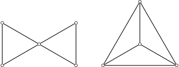
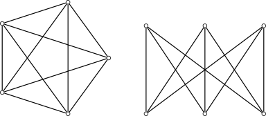
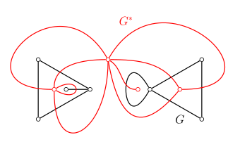
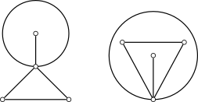
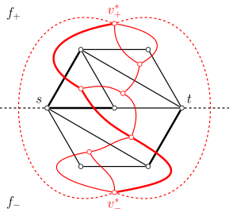
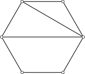

# 平面图 - OI Wiki

- Source: https://oi-wiki.org/graph/planar/

# 平面图

本文介绍（可）平面图及其相关概念．

## 平面图

如果图 𝐺G 能画在平面 𝑆S 上，即除顶点处外无边相交，则称 𝐺G 可嵌入平面 𝑆S，𝐺G 为 **可平面图** （planar graph）．画出的没有边相交的图称为 𝐺G 的平面表示或 **平面嵌入** （planar embedding）．可平面图的这个平面嵌入也称为 **平面图** （plane graph）．

「平面图」

不同中文文本中，「平面图」的含义可能不同．在本文的定义中，可平面图是一个图论对象，它可能以不同的方式嵌入平面中；平面图则是一个几何对象，除了图论结构外，它还需要指定图的绘制方式．同一个可平面图往往对应着多个平面图．因此，本文叙述的结论如果只依赖于图论结构，将使用「可平面图」一词；如果还依赖于图的平面嵌入方式，将使用「平面图」一词．

以下是平面图的简单例子：

（左：蝴蝶图；右：44 阶完全图 𝐾4K4）

以下是不可平面图的简单例子：

（左：55 阶完全图 𝐾5K5；右：两部分各 33 个顶点的完全二分图 𝐾3,3K3,3）

## 性质

本节介绍平面图的性质．

### 面及其次数

设 𝐺G 是平面图，由 𝐺G 的边将 𝐺G 所在的平面划分成若干个区域，每个区域称为 𝐺G 的一个 **面** （face）．其中，无界的面称为 **无限面** （unbounded face）或 **外部面** （external face），有界的称为有限面或内部面．每一个平面图有且仅有一个外部面．

包围每个面的所有边组成的回路称为该面的 **边界** （boundary），并称边界中的边与该面 **关联** （incident）．边界的长度称为该面的 **次数** （degree）．计算面的次数时，每条割边都算作两次．平面图中所有面的次数之和等于边数 |𝐸||E| 的 22 倍．

平面图中，11 次面的边界对应于图的自环，22 次面的边界通常对应于图的一对重边1．顶点数 |𝑉| ≥3|V|≥3 的简单连通平面图中，所有面次数都至少为 33．

### 欧拉公式

平面图的一个重要性质是 **欧拉公式** （Euler's formula）．它给出了图的顶点数 |𝑉||V|、边数 |𝐸||E| 和面数 |𝐹||F| 之间的关系．

欧拉公式

对于连通的平面图 𝐺G，有

|𝑉|−|𝐸|+|𝐹|=2.|V|−|E|+|F|=2.证明

对于面数 |𝐹||F| 应用数学归纳法．归纳起点是 |𝐹| =1|F|=1．此时，平面图有且只有一个外部面，全部边都是割边．所以，图 𝐺G 是一棵树，必然有 |𝐸| =|𝑉| −1|E|=|V|−1，代入欧拉公式就可以发现它成立．假设欧拉公式对于面数 |𝐹| =𝑘|F|=k 的平面图成立．对于面数 |𝐹| =𝑘 +1|F|=k+1 的平面图 𝐺G，必然存在非割边 𝑒e，它是两个不同的面的公共边．将边 𝑒e 从图中删除，得到图 𝐺 −𝑒G−e，它有 |𝑉||V| 个顶点、|𝐸| −1|E|−1 条边和 |𝐹| −1|F|−1 个面．由归纳假设，对图 𝐺 −𝑒G−e 成立欧拉公式，即 |𝑉| −(|𝐸| −1) +(|𝐹| −1) =2|V|−(|E|−1)+(|F|−1)=2，整理就得到关于图 𝐺G 的欧拉公式．所以，根据数学归纳法，欧拉公式对于所有平面图都成立．

推论

对于有 𝑘k 个连通分支的平面图 𝐺G，有

|𝑉|−|𝐸|+|𝐹|=𝑘+1.|V|−|E|+|F|=k+1.证明

图 𝐺G 的每个连通分支都是平面图，但是这些连通分支共用同一个外部面．所以，直接对这些连通分支应用欧拉公式，并累加到一起，总顶点数和总边数都是正确的，但是总面数多了 (𝑘 −1)(k−1)，因为唯一的外部面总共计数了 𝑘k 次．将这一修正考虑在内，就得到 |𝑉| −|𝐸| +|𝐹| =2𝑘 −(𝑘 −1) =𝑘 +1|V|−|E|+|F|=2k−(k−1)=k+1．

由此，可以推出平面图的边与顶点的数量关系．

定理

对于有 𝑘k 个连通分支的平面图 𝐺G，如果图 𝐺G 的每个面次数都至少为 𝑙 ≥3l≥3，那么有

|𝐸|≤𝑙𝑙−2(|𝑉|−𝑘−1).|E|≤ll−2(|V|−k−1).证明

因为 𝐺G 的各面的次数至少为 𝑙l，所以所有面的次数和至少为 𝑙|𝐹|l|F|，亦即 2|𝐸| ≥𝑙|𝐹|2|E|≥l|F|．代入欧拉公式的推论 |𝑉| −|𝐸| +|𝐹| =𝑘 +1|V|−|E|+|F|=k+1，就得到

2|𝐸|≥𝑙(𝑘+1−|𝑉|+|𝐸|).2|E|≥l(k+1−|V|+|E|).

利用 𝑙 ≥2l≥2 解出 |𝐸||E|，就得到

|𝐸|≤𝑙𝑙−2(|𝑉|−𝑘−1).|E|≤ll−2(|V|−k−1).推论

设 𝐺G 是简单可平面图，且 |𝑉| ≥3|V|≥3，那么，有

|𝐸|≤3|𝑉|−6.|E|≤3|V|−6.证明

当 𝐺G 连通时，所有面次数都至少是 33．在上述定理中，取 𝑘 =1k=1 且 𝑙 =3l=3，就得到 |𝐸| ≤3|𝑉| −6|E|≤3|V|−6．

当 𝐺G 不连通时，分为两种情形：

  * 如果存在连通分支顶点数至少是 33，那么对这些顶点数至少为 33 的连通分支可以分别建立不等式 |𝐸𝑖| ≤3|𝑉𝑖| −6|Ei|≤3|Vi|−6．因为那些顶点数小于 33 的连通分支一定有 |𝐸𝑖| ≤|𝑉𝑖| ≤3|𝑉𝑖||Ei|≤|Vi|≤3|Vi|．将所有连通分支对应的不等式相加，就得到 |𝐸| ≤3|𝑉| −6|E|≤3|V|−6．
  * 如果所有连通分支顶点数都小于 33，那么整体一定有 |𝐸| ≤|𝑉||E|≤|V|．又因为 |𝑉| ≥3|V|≥3 时，|𝑉| ≤3|𝑉| −6|V|≤3|V|−6，所以 |𝐸| ≤3|𝑉| −6|E|≤3|V|−6 仍然成立．

综上，命题得证．

这一推论说明，简单可平面图是稀疏图．

### 对偶图

平面图都有相应的（几何）对偶图．

设 𝐺G 是平面图，可以绘制图 𝐺∗G∗ 如下：

  1. 在 𝐺G 的每个面 𝑓𝑖fi 内部都绘制一个点 𝑣∗𝑖vi∗．
  2. 对 𝐺G 的每条边 𝑒e，如果 𝑒e 在面 𝑓𝑖fi 和 𝑓𝑗fj 的公共边界上，就绘制一条连接 𝑣∗𝑖vi∗ 和 𝑣∗𝑗vj∗ 的边 𝑒∗e∗，使之与 𝑒e 恰相交一次，且不与其他图 𝐺G 或图 𝐺∗G∗ 的边相交．特别地，当 𝑒e 只出现在一个面 𝑓𝑖fi 的边界上时，需要绘制一条与 𝑣∗𝑖vi∗ 关联的自环，使之与 𝑒e 相交．

这样得到的图 𝐺∗G∗ 就称作图 𝐺G 的 **对偶图** （dual graph）．

定理

设图 𝐺∗G∗ 是平面图 𝐺G 的对偶图．那么，图 𝐺∗G∗ 是连通的平面图．而且，图 𝐺∗∗G∗∗ 与 𝐺G 同构，当且仅当 𝐺G 是连通图．

证明

图 𝐺∗G∗ 是平面图这一点可以由它的构造过程保证．还需要证明图 𝐺∗G∗ 是连通的．对于图 𝐺∗G∗ 中任意两个顶点 𝑣∗𝑖,𝑣∗𝑗vi∗,vj∗，设平面中连接 𝑣∗𝑖vi∗ 和 𝑣∗𝑗vj∗ 的直线段经过图 𝐺G 中的面和边依次为 𝑓𝑖,𝑒𝑠1,𝑓𝑠1,⋯,𝑓𝑠𝑟−1,𝑒𝑠𝑟,𝑓𝑗fi,es1,fs1,⋯,fsr−1,esr,fj，它们分别对应对偶图中的顶点和边 𝑣∗𝑖,𝑒∗𝑠1,𝑣∗𝑠1,⋯,𝑣∗𝑠𝑟−1,𝑒∗𝑠𝑟,𝑣∗𝑗vi∗,es1∗,vs1∗,⋯,vsr−1∗,esr∗,vj∗．由图 𝐺∗G∗ 的构造可知，序列中相邻的顶点和边是相关联的，所以，这描述了图 𝐺∗G∗ 中的一条途径．所以，图 𝐺∗G∗ 是连通的．

图 𝐺∗∗G∗∗ 是图 𝐺∗G∗ 的对偶图，必然是连通的．所以，𝐺G 与 𝐺∗∗G∗∗ 同构，必要条件是图 𝐺G 连通．接下来，需要证明这一条件也是充分的．为此，只需要证明当图 𝐺G 连通时，图 𝐺G 满足图 𝐺∗G∗ 的对偶图的构造要求．因为图 𝐺∗G∗ 的边和图 𝐺G 的边天然是对应的，所以，只需要证明图 𝐺∗G∗ 的每一个面都恰好包含图 𝐺G 的一个顶点．对于图 𝐺∗G∗ 的任一个面 𝑓∗f∗，设 𝑒∗e∗ 是它边界上的一条边，那么图 𝐺G 中相对应的边 𝑒e 的端点之一必然在面 𝑓∗f∗ 之内；因此，面 𝑓∗f∗ 中至少存在图 𝐺G 的一个顶点．由于图 𝐺∗G∗ 和图 𝐺G 都是连通的，欧拉公式成立；而图 𝐺G 和图 𝐺∗G∗ 边数相同，图 𝐺G 的面数等于图 𝐺∗G∗ 的顶点数，所以图 𝐺G 的顶点数就等于图 𝐺∗G∗ 的面数．所以，图 𝐺∗G∗ 的每个面都恰好只有图 𝐺G 的一个顶点．命题得证．

平面图与其对偶图的结构之间有很多对应关系：

  * 𝐺G 中的面对应 𝐺∗G∗ 中的点，𝐺G 中的边对应 𝐺∗G∗ 中的边，𝐺G 中的点对应 𝐺∗G∗ 中的面．
  * 𝐺G 中的自环对应 𝐺∗G∗ 中的割边，𝐺∗G∗ 中的自环对应 𝐺G 中的割边．
  * 𝐺G 中的边割集对应 𝐺∗G∗ 中的回路，𝐺∗G∗ 中的回路对应 𝐺G 中的边割集．

需要注意的是，对偶图的概念仅对具体的平面图成立，而无法定义在任意可平面图上．事实上，两个同构的平面图的对偶图未必是同构的．也就是说，同一个图的不同平面嵌入的对偶图可能并不相同．

例子

下图画了两个同构的平面图，它们的对偶图并不同构．

对偶图不同构的原因是，右图有一次面，它的对偶图有一度顶点，而左图没有．

将平面图的问题转化到对偶图上，有时更容易解决．一个典型的例子是，平面图 [最小割](../flow/min-cut/) 问题可以转化为对偶图 [最短路](../shortest-path/) 问题．设 𝐺G 是带边权的平面图，𝑠,𝑡s,t 是它的两个顶点，需要求最小的 𝑠s-𝑡t 割．

如图所示，通过选取合适的平面嵌入，总是可以使得 𝑠,𝑡s,t 出现在图 𝐺G 外部面边界上．另外，添加自 𝑠s 和 𝑡t 延伸出去的射线，将外部面分为两部分 𝑓+f+ 和 𝑓−f−．基于该图，建立对偶图，并将边权赋给对偶图中的对应边．那么，对偶图 𝐺∗G∗ 中面 𝑓+f+ 和 𝑓−f− 对应顶点之间的路径（红色粗线）就和图 𝐺G 的 𝑠s-𝑡t 割（黑色粗线）之间一一对应，且二者权值相同．这样，求解对偶图中的最短路，就得到了对偶图中的最小 𝑠s-𝑡t 割．

### 更多结果

当然，平面图还有很多著名的结果．本节简单列举它们，但并不做出讨论．

四色定理

（没有自环的）平面图都是可 44‑着色的．

Fáry 定理

简单可平面图总是存在一种平面嵌入，使得图的所有边都是直线段．

定理（Wood）

可平面图至多只有 8|𝑉| −168|V|−16 个极大团．

定理（Tutte）

44‑点连通的可平面图都是哈密顿图．

## 判定

本节讨论给定一个图，判定它是不是可平面图的方法．

### 禁用图

可平面图最经典的刻画方式是利用 **禁用图** （forbidden graph）给出的．

首先，𝐾5K5 和 𝐾3,3K3,3 不是可平面图．

定理

𝐾5K5 和 𝐾3,3K3,3 不是可平面图．

证明

前文说明，|𝑉| ≥3|V|≥3 的简单连通平面图都需要满足

|𝐸|≤𝑙𝑙−2(|𝑉|−2).|E|≤ll−2(|V|−2).

其中，𝑙l 是面次数的最小值．对于 𝐾5K5，有 𝑙 =3, |𝑉| =5, |𝐸| =10l=3, |V|=5, |E|=10，所以 𝐾5K5 不可能画成平面图．对于 𝐾3,3K3,3，有 𝑙 =4, |𝑉| =6, |𝐸| =9l=4, |V|=6, |E|=9，所以 𝐾3,3K3,3 不可能画成平面图．

事实上，它们就是使得一个图不可平面的最小结构．也就是说，只要图不（以某种方式）包含这两个图为子结构，该图就一定是可平面的．

第一个可平面性判定定理是 Kuratowski 定理．它用到了图同胚的概念：若两个图 𝐺1G1 与 𝐺2G2 同构，或通过反复插入或消去 22 度顶点后是同构的，则称二者是 **同胚的** （homeomorphic）．由此，可以叙述如下结果：

Kuratowski 定理

图 𝐺G 是可平面图，当且仅当 𝐺G 不含与 𝐾5K5 或 𝐾3,3K3,3 同胚的子图．

另外一个与此相关的定理是 Wagner 定理．它利用收缩操作来刻画可平面图．收缩操作是指，重复多次将图的一条边收缩为一个点．由此，可以叙述如下结果：

Wagner 定理

图 𝐺G 是可平面图，当且仅当 𝐺G 中没有可以收缩到 𝐾5K5 或 𝐾3,3K3,3 的子图．

可平面图不包含这些类型的子图相对显然，所以这两个定理的关键部分都在于相应的禁用图条件的充分性．由于与 𝐾5K5 或 𝐾3,3K3,3 同胚的子图一定可以收缩到它们，反过来却未必成立，所以 Kuratowski 定理提供了一个更弱的也更容易检验的判定可平面图的条件．

### 平面性判定算法

尽管看起来并不容易，平面性判定问题实际上有很多线性算法．但是，由于这些算法的实现通常都比较复杂，它们几乎从未出现在算法竞赛中．

最早的线性算法是 Hopcroft–Tarjan 算法2，但它的实现相当复杂．de Fraysseix–Ossona de Mendez–Rosenstiehl 算法（也称为 LR 平面性算法）345进一步改进了 Hopcroft–Tarjan 算法的流程，是目前最优秀的平面性判定算法之一．Python 的 NetworkX 库中就 [实现](https://github.com/networkx/networkx/blob/main/networkx/algorithms/planarity.py) 了这一算法．

另外一个同样优秀的算法是 Boyer–Myrvold 算法67．它可以在线性时间内判定给定图是否可平面．而且，如果图是可平面的，算法将输出一个平面嵌入；否则，算法将输出一个 Kuratowski 子图（即与 𝐾5K5 或 𝐾3,3K3,3 同胚的子图）．C++ 的 Boost 库就 [实现](https://www.boost.org/doc/libs/1_67_0/boost/graph/planar_detail/boyer_myrvold_impl.hpp) 了这一算法．

更多相关算法可以参考文末提供的文献．

## 特殊的平面图

本节介绍几类特殊的可平面图．

### 极大平面图

对于简单可平面图 𝐺G，如果在它的任意不相邻顶点间添加边，所得图都不再是可平面图，就称 𝐺G 为 **极大可平面图** （maximal planar graph）．极大可平面图的平面嵌入称为 **极大平面图** ．

定理

极大可平面图 𝐺G 必然连通．而且，当顶点数 |𝑉| ≥3|V|≥3 时，图 𝐺G 没有割边．

证明

如果可平面图 𝐺G 不连通，那么任选它的一个平面嵌入，都可以选择属于不同连通分支的两个顶点，在外部面内连接起来，得到的图显然仍然是平面图，这说明图 𝐺G 不是极大可平面图．所以，图 𝐺G 是极大可平面图，就一定连通．

如果可平面图 𝐺G 顶点数 |𝑉| ≥3|V|≥3，且 𝐺G 有割边 𝑒 =(𝑢,𝑣)e=(u,v)，那么，删去边 𝑒e 后的图 𝐺 −𝑒G−e 中恰有两个连通分支，且 𝑢,𝑣u,v 属于不同的连通分支．假设 𝑣v 所在连通分支至少有两个顶点．那么，可以先将 𝑢u 所在连通分支 𝐺1G1 画在平面上，并选取图 𝐺1G1 中边界含有 𝑢u 的任意面 𝑓f，并将另一个连通分支 𝐺2G2 画在面 𝑓f 中．由于 𝐺2G2 是简单图，它的外部面的边界一定不是一个自环，故而至少还存在另一个顶点 𝑤 ≠𝑢,𝑣w≠u,v．将 𝑣,𝑤v,w 分别连接到 𝑢u 上，就得到包含 𝐺G 为子图的平面图．所以，图 𝐺G 不是极大可平面图．因此，顶点数 |𝑉| ≥3|V|≥3 的极大可平面图一定没有割边．

极大平面图的结构可以更准确地描述．

定理

对于顶点数 |𝑉| ≥3|V|≥3 的平面图 𝐺G，它是极大平面图当且仅当它是简单图，且它的每个面次数均为 33．

证明

条件的充分性显然．只需要说明必要性，即要证明：顶点数 |𝑉| ≥3|V|≥3 的极大平面图 𝐺G 中，每个面次数都是 33．由于图 𝐺G 是连通简单平面图且 |𝑉| ≥3|V|≥3，所以全部面的次数都至少是 33．所以，假设命题不成立，就一定存在一个面 𝑓f 的边界长度至少是 44．又因为图 𝐺G 不存在割边，该边界只能是一个环．设这个环是 𝑣1𝑣2𝑣3𝑣4⋯𝑣1v1v2v3v4⋯v1．那么，如果 𝑣1v1 与 𝑣3v3 不相邻，那么在面 𝑓f 内连接 𝑣1v1 和 𝑣3v3 不会破坏平面性，与 𝐺G 的极大性矛盾，所以 𝑣1v1 与 𝑣3v3 相邻；同理，𝑣2v2 与 𝑣4v4 相邻．但是，边 (𝑣1,𝑣3)(v1,v3) 和 (𝑣2,𝑣4)(v2,v4) 都不会出现在面 𝑓f 中．这意味着，两条边必然在面 𝑓f 的外部．但这是不可能的：无论如何绘制，这两条边都必然相交．所以，图 𝐺G 中不存在高于 33 次的面．原命题得证．

推论

对于顶点数 |𝑉| ≥3|V|≥3 的图 𝐺G，总是有边数 |𝐸| =3|𝑉| −6|E|=3|V|−6 且面数 |𝐹| =2|𝑉| −4|F|=2|V|−4．

由于极大平面图中，每个面都是由三条边围成，所以极大平面图也称为 **平面三角剖分** （plane triangulation）．

### 外平面图

设 𝐺G 为可平面图，若 𝐺G 存在平面嵌入 ˜𝐺G~，使得 𝐺G 中所有顶点都在 ˜𝐺G~ 的一个面的边界上，则称 𝐺G 为 **外可平面图** （outerplanar graph）．这一嵌入也称为外平面嵌入或 **外平面图** ．通常将边界经过所有顶点的那个面绘制为外部面．

外可平面图都是可平面图，反之未必成立．外可平面图同样可以使用禁用图刻画．

定理

一个图 𝐺G 是外平面图有当且仅当 𝐺G 中不含与 𝐾4K4 或 𝐾2,3K2,3 同胚的子图．

对于外可平面图，同样可以讨论极大外可平面图的概念．对于简单外可平面图 𝐺G，如果在它的任意不相邻顶点间添加边，所得图都不再是外可平面图，就称 𝐺G 为 **极大外可平面图** （maximal outerplanar graph）．极大外可平面图的外平面嵌入称为 **极大外平面图** ．极大外平面图其实就是平面上多边形的三角剖分．

定理

对于顶点数 |𝑉| ≥3|V|≥3 的极大外平面图 𝐺G，且所有顶点都在外部面的边界上，那么图 𝐺G 恰有 |𝑉| −2|V|−2 个内部面．

证明

对 |𝑉||V| 应用数学归纳法．归纳起点是 |𝑉| =3|V|=3．此时，图 𝐺G 是三元环，只有 11 个内部面，命题成立．假设命题对于 |𝑉| =𝑘|V|=k 成立．现在要证明，当 |𝑉| =𝑘 +1|V|=k+1 时，命题仍然成立．

首先，图 𝐺G 一定存在 22 度顶点．否则，除了外部面边界上相邻的顶点外，所有顶点都需要和第三个顶点相连接．不妨将外部面边界上的顶点顺次编号，并对每一个 𝑖 =1,2,⋯,𝑘 +1i=1,2,⋯,k+1，都定义 𝑓(𝑖)f(i) 为与顶点 𝑖i 连接且编号不与之相邻的顶点的最小编号．考虑 𝑓(𝑖)f(i) 的可能取值．首先，1 <𝑓(1)1<f(1)．由于点 11 已经和 𝑓(1)f(1) 连接，点 22 与 𝑓(2)f(2) 的连线不能越过边 (1,𝑓(1))(1,f(1))，就必然有 1 <2 <𝑓(2) <𝑓(1)1<2<f(2)<f(1)．同理，2 <3 <𝑓(3) <𝑓(2)2<3<f(3)<f(2)．由于顶点只有有限多个，这个逐渐缩小的过程必然在有限步后终止．令 𝑖∗i∗ 为满足 1 <⋯ <𝑖 −1 <𝑖 <𝑓(𝑖) <𝑓(𝑖 −1) <⋯ <𝑓(1)1<⋯<i−1<i<f(i)<f(i−1)<⋯<f(1) 的编号 𝑖i 最大值．那么，由于点 𝑖∗i∗ 和点 𝑓(𝑖∗)f(i∗) 不相邻，必然有 𝑖∗ <𝑖∗ +1 <𝑓(𝑖∗)i∗<i∗+1<f(i∗)．而重复之前的论述，仍应该有 𝑖∗ <𝑖∗ +1 <𝑓(𝑖∗ +1) <𝑓(𝑖∗)i∗<i∗+1<f(i∗+1)<f(i∗)，这与 𝑖∗i∗ 的最大性矛盾．这一矛盾说明，图 𝐺G 必然存在 22 度顶点．

设 𝑣v 就是一个 22 度顶点．将这一顶点从图 𝐺G 中删除，就得到顶点数为 𝑘k 的外平面图 𝐺 −𝑣G−v．它必然是极大外平面图，否则在它上面合法添加边的方法，必然对图 𝐺G 也适用．由归纳假设，图 𝐺 −𝑣G−v 恰有 𝑘 −2k−2 个内部面，而删去顶点 𝑣v 时，恰好减少了一个图 𝐺G 的内部面．所以，图 𝐺G 内部面数目为 𝑘 −1k−1．命题得证．

定理

对于顶点数 |𝑉| ≥3|V|≥3 的外平面图 𝐺G，且所有顶点都在外部面的边界上，那么图 𝐺G 是极大外平面图，当且仅当图 𝐺G 的外部面边界是长为 |𝑉||V| 的环，且所有内部面边界均是长为 33 的环．

证明

充分性显然．事实上，考虑连接外部面边界上的两个不相邻顶点．如果连接发生在外部面中，那么，所有顶点无法都出现在一个面的边界上；否则，它们的连线必然与内部面的边界相交．

接下来，证明必要性．假设图 𝐺G 的外部面边界 𝑣1𝑣2𝑣3⋯𝑣𝑛𝑣1 (𝑛 =|𝑉|)v1v2v3⋯vnv1 (n=|V|) 不是一个环．那么，它会重复经过一个顶点多次，亦即存在 𝑖 ≠𝑗i≠j 且 𝑖 −𝑗 ≠ ±1(mod𝑛)i−j≠±1(modn) 使得 𝑣𝑖 =𝑣𝑗vi=vj．不妨设 1 <𝑖 <𝑗 <𝑛1<i<j<n．此时，与 𝑣𝑖−1vi−1 相关联的边只能出现在回路 𝑣𝑗𝑣𝑗+1⋯𝑣𝑛𝑣1⋯𝑣𝑖−1𝑣𝑖vjvj+1⋯vnv1⋯vi−1vi 围成的有界区域内部，与 𝑣𝑖+1vi+1 相关联的边只能出现在回路 𝑣𝑖𝑣𝑖+1⋯𝑣𝑗−1𝑣𝑗vivi+1⋯vj−1vj 围成的有界区域内部，所以 𝑣𝑖−1vi−1 和 𝑣𝑖+1vi+1 无法相邻．可以在外部面内添加一条连接 𝑣𝑖−1vi−1 和 𝑣𝑖+1vi+1 的边 𝑒e，得到图 𝐺 +𝑒G+e．这显然也是平面图，且外部面边界上包含所有顶点．这就与图 𝐺G 的极大外平面性矛盾．所以，图 𝐺G 的外部面必然是长度为 |𝑉||V| 的环．而图 𝐺G 内部面边界均为长为 33 的环的原因，和极大平面图一致，不再赘述．

推论

对于顶点数 |𝑉| ≥3|V|≥3 的极大外平面图 𝐺G，有：

  1. |𝐸| =2|𝑉| −3|E|=2|V|−3．
  2. 𝐺G 中至少有 33 个顶点度数小于等于 33，且至少有 22 个顶点度数为 22．
  3. 𝐺G 的点连通度为 22．

## 习题

  * [Luogu P3209 [HNOI2010] 平面图判定](https://www.luogu.com.cn/problem/P3209)
  * [Luogu P3249 [HNOI2016] 矿区](https://www.luogu.com.cn/problem/P3249)
  * [Luogu P4001 [ICPC-Beijing 2006] 狼抓兔子](https://www.luogu.com.cn/problem/P4001)
  * [Luogu P4073 [WC2013] 平面图](https://www.luogu.com.cn/problem/P4073)
  * [Luogu P7295 [USACO21JAN] Paint by Letters P](https://www.luogu.com.cn/problem/P7295)

## 参考资料与注释

  * [Planar graph - Wikipedia](https://en.wikipedia.org/wiki/Planar_graph)
  * [Planarity testing - Wikipedia](https://en.wikipedia.org/wiki/Planarity_testing)
  * Bondy, John Adrian, and Uppaluri Siva Ramachandra Murty. Graph theory with applications. Vol. 290. London: Macmillan, 1976.
  * Diestel, Reinhard. Graph theory. Vol. 173. Springer Nature, 2025.
  * Patrignani, Maurizio. "Planarity Testing and Embedding." (2013): 1-42.

* * *

  1. 但这并非唯一的可能．两个嵌套的自环也会形成二次面．另外，有二次面未必意味着图不是简单的，例如，一个只有一条边的图中，唯一的面（即外部面）也是二次的． ↩

  2. Hopcroft, John, and Robert Tarjan. "Efficient planarity testing." Journal of the ACM (JACM) 21, no. 4 (1974): 549-568. ↩

  3. De Fraysseix, Hubert, Patrice Ossona De Mendez, and Pierre Rosenstiehl. "Trémaux trees and planarity." International Journal of Foundations of Computer Science 17, no. 05 (2006): 1017-1029. ↩

  4. De Fraysseix, Hubert. "Trémaux trees and planarity." Electronic Notes in Discrete Mathematics 31 (2008): 169-180. ↩

  5. Brandes, Ulrik. "The left-right planarity test." Manuscript submitted for publication 3 (2009). ↩

  6. Boyer, John M., and Wendy J. Myrvold. "Stop Minding Your p's and q's: A Simplified O (n) Planar Embedding Algorithm." In SODA, vol. 99, pp. 140-146. 1999. ↩

  7. Boyer, John M., and Wendy J. Myrvold. "Simplified o (n) planarity by edge addition." Graph Algorithms and Applications 5 (2006): 241. ↩

* * *

>  __本页面最近更新： 2026/1/7 08:56:54，[更新历史](https://github.com/OI-wiki/OI-wiki/commits/master/docs/graph/planar.md)  
>  __发现错误？想一起完善？[在 GitHub 上编辑此页！](https://oi-wiki.org/edit-landing/?ref=/graph/planar.md "edit.link.title")  
>  __本页面贡献者：[c-forrest](https://github.com/c-forrest), [AlphaDrawer](https://github.com/AlphaDrawer), [Enter-tainer](https://github.com/Enter-tainer), [HeRaNO](https://github.com/HeRaNO), [Ir1d](https://github.com/Ir1d), [Jerrycyx](https://github.com/Jerrycyx), [Tiphereth-A](https://github.com/Tiphereth-A)  
>  __本页面的全部内容在**[CC BY-SA 4.0](https://creativecommons.org/licenses/by-sa/4.0/deed.zh) 和 [SATA](https://github.com/zTrix/sata-license)** 协议之条款下提供，附加条款亦可能应用
