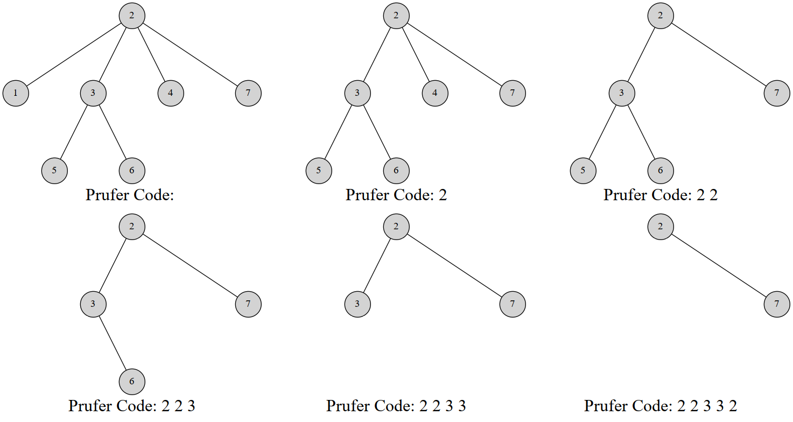

# Prüfer 序列 - OI Wiki

- Source: https://oi-wiki.org/graph/prufer/

# Prüfer 序列

Note

本文翻译自 [e-maxx Prüfer Code](https://github.com/e-maxx-eng/e-maxx-eng/blob/master/src/graph/pruefer_code.md)．另外解释一下，原文的结点是从 00 开始标号的，本文按照大多数人的习惯改成了从 11 标号．

这篇文章介绍 Prüfer 序列 (Prüfer code)，这是一种将带标号的树用一个唯一的整数序列表示的方法．

使用 Prüfer 序列可以证明 凯莱公式(Cayley's formula)．并且我们也会讲解如何计算在一个图中加边使图连通的方案数．

**注意** ：我们不考虑含有 11 个结点的树．

## Prüfer 序列

### 引入

Prüfer 序列可以将一个带标号 𝑛n 个结点的树用 [1,𝑛][1,n] 中的 𝑛 −2n−2 个整数表示．你也可以把它理解为完全图的生成树与数列之间的双射．常用组合计数问题中．

Heinz Prüfer 于 1918 年发明这个序列来证明 凯莱公式．

### 对树建立 Prüfer 序列

Prüfer 是这样建立的：每次选择一个编号最小的叶结点并删掉它，然后在序列中记录下它连接到的那个结点．重复 𝑛 −2n−2 次后就只剩下两个结点，算法结束．

显然使用堆可以做到 𝑂(𝑛log⁡𝑛)O(nlog⁡n) 的复杂度

实现

C++Python

```text 1 2 3 4 5 6 7 8 9 10 11 12 13 14 15 16 17 18 19 20 21 22 23 24 25 26 ``` |  ```text // 代码摘自原文，结点是从 0 标号的 vector < vector < int >> adj ; vector < int > pruefer_code () { int n = adj . size (); set < int > leafs ; vector < int > degree ( n ); vector < bool > killed ( n ); for ( int i = 0 ; i < n ; i ++ ) { degree [ i ] = adj [ i ]. size (); if ( degree [ i ] == 1 ) leafs . insert ( i ); } vector < int > code ( n \- 2 ); for ( int i = 0 ; i < n \- 2 ; i ++ ) { int leaf = * leafs . begin (); leafs . erase ( leafs . begin ()); killed [ leaf ] = true ; int v ; for ( int u : adj [ leaf ]) if ( ! killed [ u ]) v = u ; code [ i ] = v ; if ( \-- degree [ v ] == 1 ) leafs . insert ( v ); } return code ; } ```   
---|---  
  
```text 1 2 3 4 5 6 7 8 9 10 11 12 13 14 15 16 17 18 19 20 21 22 23 24 25 26 ``` |  ```text # 结点是从 0 标号的 adj = [[]] def pruefer_code (): n = len ( adj ) leafs = set () degree = [ 0 ] * n killed = [ False ] * n for i in range ( 1 , n ): degree [ i ] = len ( adj [ i ]) if degree [ i ] == 1 : leafs . intersection ( i ) code = [ 0 ] * ( n \- 2 ) for i in range ( 1 , n \- 2 ): leaf = leafs [ 0 ] leafs . pop () killed [ leaf ] = True for u in adj [ leaf ]: if killed [ u ] == False : v = u code [ i ] = v if degree [ v ] == 1 : degree [ v ] = degree [ v ] \- 1 leafs . intersection ( v ) return code ```   
---|---  
  
例如，这是一棵 7 个结点的树的 Prüfer 序列构建过程：



最终的序列就是 2,2,3,3,22,2,3,3,2．

当然，也有一个线性的构造算法．

### Prüfer 序列的线性构造算法

线性构造的本质就是维护一个指针指向我们将要删除的结点．首先发现，叶结点数是非严格单调递减的，删去一个叶结点，叶结点总数要么不变要么减 1．

于是我们考虑这样一个过程：维护一个指针 𝑝p．初始时 𝑝p 指向编号最小的叶结点．同时我们维护每个结点的度数，方便我们知道在删除结点的时侯是否产生新的叶结点．操作如下：

  1. 删除 𝑝p 指向的结点，并检查是否产生新的叶结点．
  2. 如果产生新的叶结点，假设编号为 𝑥x，我们比较 𝑝,𝑥p,x 的大小关系．如果 𝑥 >𝑝x>p，那么不做其他操作；否则就立刻删除 𝑥x，然后检查删除 𝑥x 后是否产生新的叶结点，重复 22 步骤，直到未产生新节点或者新节点的编号 >𝑝>p．
  3. 让指针 𝑝p 自增直到遇到一个未被删除叶结点为止；

#### 正确性

循环上述操作 𝑛 −2n−2 次，就完成了序列的构造．接下来考虑算法的正确性．

𝑝p 是当前编号最小的叶结点，若删除 𝑝p 后未产生叶结点，我们就只能去寻找下一个叶结点；若产生了叶结点 𝑥x：

  * 如果 𝑥 >𝑝x>p，则反正 𝑝p 往后扫描都会扫到它，于是不做操作；
  * 如果 𝑥 <𝑝x<p，因为 𝑝p 原本就是编号最小的，而 𝑥x 比 𝑝p 还小，所以 𝑥x 就是当前编号最小的叶结点，优先删除．删除 𝑥x 继续这样的考虑直到没有更小的叶结点．

算法复杂度分析，发现每条边最多被访问一次（在删度数的时侯），而指针最多遍历每个结点一次，因此复杂度是 𝑂(𝑛)O(n) 的．

#### 实现

C++Python

```text 1 2 3 4 5 6 7 8 9 10 11 12 13 14 15 16 17 18 19 20 21 22 23 24 25 26 27 28 29 30 31 32 33 34 35 36 37 ``` |  ```text // 从原文摘的代码，同样以 0 为起点 vector < vector < int >> adj ; vector < int > parent ; void dfs ( int v ) { for ( int u : adj [ v ]) { if ( u != parent [ v ]) parent [ u ] = v , dfs ( u ); } } vector < int > pruefer_code () { int n = adj . size (); parent . resize ( n ), parent [ n \- 1 ] = -1 ; dfs ( n \- 1 ); int ptr = -1 ; vector < int > degree ( n ); for ( int i = 0 ; i < n ; i ++ ) { degree [ i ] = adj [ i ]. size (); if ( degree [ i ] == 1 && ptr == -1 ) ptr = i ; } vector < int > code ( n \- 2 ); int leaf = ptr ; for ( int i = 0 ; i < n \- 2 ; i ++ ) { int next = parent [ leaf ]; code [ i ] = next ; if ( \-- degree [ next ] == 1 && next < ptr ) { leaf = next ; } else { ptr ++ ; while ( degree [ ptr ] != 1 ) ptr ++ ; leaf = ptr ; } } return code ; } ```   
---|---  
  
```text 1 2 3 4 5 6 7 8 9 10 11 12 13 14 15 16 17 18 19 20 21 22 23 24 25 26 27 28 29 30 31 32 33 34 35 36 37 38 ``` |  ```text # 同样以 0 为起点 adj = [[]] parent = [ 0 ] * n def dfs ( v ): for u in adj [ v ]: if u != parent [ v ]: parent [ u ] = v dfs ( u ) def pruefer_code (): n = len ( adj ) parent [ n \- 1 ] = \- 1 dfs ( n \- 1 ) ptr = \- 1 degree = [ 0 ] * n for i in range ( 0 , n ): degree [ i ] = len ( adj [ i ]) if degree [ i ] == 1 and ptr == \- 1 : ptr = i code = [ 0 ] * ( n \- 2 ) leaf = ptr for i in range ( 0 , n \- 2 ): next = parent [ leaf ] code [ i ] = next if degree [ next ] == 1 and next < ptr : degree [ next ] = degree [ next ] \- 1 leaf = next else : ptr = ptr \+ 1 while degree [ ptr ] != 1 : ptr = ptr \+ 1 leaf = ptr return code ```   
---|---  
  
### Prüfer 序列的性质

  1. 在构造完 Prüfer 序列后原树中会剩下两个结点，其中一个一定是编号最大的点 𝑛n．
  2. 每个结点在序列中出现的次数是其度数减 11．（没有出现的就是叶结点）

### 用 Prüfer 序列重建树

重建树的方法是类似的．根据 Prüfer 序列的性质，我们可以得到原树上每个点的度数．然后也可以得到编号最小的叶结点，而这个结点一定与 Prüfer 序列的第一个数所对应的点连接．然后我们同时将这两个结点的度数减一．

讲到这里也许你已经知道该怎么做了．每次我们选择一个度数为 11 的编号最小的结点，与当前枚举到的 Prüfer 序列的点连接，然后同时减掉两个点的度．到最后我们剩下两个度数为 11 的点，其中一个是结点 𝑛n．把它们连上．使用堆维护这个过程，在节点度数下降的过程中如果发现度数减到 11 就把这个结点添加到堆中，这样做的复杂度是 𝑂(𝑛log⁡𝑛)O(nlog⁡n) 的．

实现

```text 1 2 3 4 5 6 7 8 9 10 11 12 13 14 15 16 17 18 19 20 21 ``` |  ```text // 原文摘代码 vector < pair < int , int >> pruefer_decode ( vector < int > const & code ) { int n = code . size () \+ 2 ; vector < int > degree ( n , 1 ); for ( int i : code ) degree [ i ] ++ ; set < int > leaves ; for ( int i = 0 ; i < n ; i ++ ) if ( degree [ i ] == 1 ) leaves . insert ( i ); vector < pair < int , int >> edges ; for ( int v : code ) { int leaf = * leaves . begin (); leaves . erase ( leaves . begin ()); edges . emplace_back ( leaf , v ); if ( \-- degree [ v ] == 1 ) leaves . insert ( v ); } edges . emplace_back ( * leaves . begin (), n \- 1 ); return edges ; } ```   
---|---  
  
### 线性时间重建树

同线性构造 Prüfer 序列的方法．在删度数的时侯会产生新的叶结点，于是判断这个叶结点与指针 𝑝p 的大小关系，如果更小就优先考虑它．

#### 实现

```text 1 2 3 4 5 6 7 8 9 10 11 12 13 14 15 16 17 18 19 20 21 22 23 24 ``` |  ```text // 原文摘代码 vector < pair < int , int >> pruefer_decode ( vector < int > const & code ) { int n = code . size () \+ 2 ; vector < int > degree ( n , 1 ); for ( int i : code ) degree [ i ] ++ ; int ptr = 0 ; while ( degree [ ptr ] != 1 ) ptr ++ ; int leaf = ptr ; vector < pair < int , int >> edges ; for ( int v : code ) { edges . emplace_back ( leaf , v ); if ( \-- degree [ v ] == 1 && v < ptr ) { leaf = v ; } else { ptr ++ ; while ( degree [ ptr ] != 1 ) ptr ++ ; leaf = ptr ; } } edges . emplace_back ( leaf , n \- 1 ); return edges ; } ```   
---|---  
  
通过这些过程其实可以理解，Prüfer 序列与带标号无根树建立了双射关系．

## Cayley 公式 (Cayley's formula)

完全图 𝐾𝑛Kn 有 𝑛𝑛−2nn−2 棵生成树．

怎么证明？方法很多，但是用 Prüfer 序列证是很简单的．任意一个长度为 𝑛 −2n−2 的值域 [1,𝑛][1,n] 的整数序列都可以通过 Prüfer 序列双射对应一个生成树，于是方案数就是 𝑛𝑛−2nn−2．

## 图连通方案数

Prüfer 序列可能比你想得还强大．它能创造比 凯莱公式 更通用的公式．比如以下问题：

> 一个 𝑛n 个点 𝑚m 条边的带标号无向图有 𝑘k 个连通块．我们希望添加 𝑘 −1k−1 条边使得整个图连通．求方案数．

### 证明

设 𝑠𝑖si 表示第 𝑖i 个连通块内点的数量．我们考虑对 𝑘k 个连通块构造 Prüfer 序列．由于两个连通块之间的连接方法很多，这并不是普通的 Prüfer 序列．于是不妨假设 𝑑𝑖di 为第 𝑖i 个连通块的度数．由于度数之和是边数的两倍，于是 ∑𝑘𝑖=1𝑑𝑖 =2𝑘 −2∑i=1kdi=2k−2．则对于给定的 𝑑d 序列构造 Prüfer 序列的方案数是

(𝑘−2𝑑1−1,𝑑2−1,⋯,𝑑𝑘−1)=(𝑘−2)!(𝑑1−1)!(𝑑2−1)!⋯(𝑑𝑘−1)!(k−2d1−1,d2−1,⋯,dk−1)=(k−2)!(d1−1)!(d2−1)!⋯(dk−1)!

对于第 𝑖i 个连通块，它的连接方式有 𝑠𝑖𝑑𝑖sidi 种，因此对于给定 𝑑d 序列使图连通的方案数是

(𝑘−2𝑑1−1,𝑑2−1,⋯,𝑑𝑘−1)⋅𝑘∏𝑖=1𝑠𝑖𝑑𝑖(k−2d1−1,d2−1,⋯,dk−1)⋅∏i=1ksidi

现在我们要枚举 𝑑d 序列，式子变成

∑𝑑𝑖≥1，∑𝑘𝑖=1𝑑𝑖=2𝑘−2(𝑘−2𝑑1−1,𝑑2−1,⋯,𝑑𝑘−1)⋅𝑘∏𝑖=1𝑠𝑖𝑑𝑖∑di≥1，∑i=1kdi=2k−2(k−2d1−1,d2−1,⋯,dk−1)⋅∏i=1ksidi

好的这是一个非常不喜闻乐见的式子．但是别慌！我们有多元二项式定理：

(𝑥1+⋯+𝑥𝑚)𝑝=∑𝑐𝑖≥0, ∑𝑚𝑖=1𝑐𝑖=𝑝(𝑝𝑐1,𝑐2,⋯,𝑐𝑚)⋅𝑚∏𝑖=1𝑥𝑖𝑐𝑖(x1+⋯+xm)p=∑ci≥0, ∑i=1mci=p(pc1,c2,⋯,cm)⋅∏i=1mxici

那么我们对原式做一下换元，设 𝑒𝑖 =𝑑𝑖 −1ei=di−1，显然 ∑𝑘𝑖=1𝑒𝑖 =𝑘 −2∑i=1kei=k−2，于是原式变成

∑𝑒𝑖≥0，∑𝑘𝑖=1𝑒𝑖=𝑘−2(𝑘−2𝑒1,𝑒2,⋯,𝑒𝑘)⋅𝑘∏𝑖=1𝑠𝑖𝑒𝑖+1∑ei≥0，∑i=1kei=k−2(k−2e1,e2,⋯,ek)⋅∏i=1ksiei+1

化简得到

(𝑠1+𝑠2+⋯+𝑠𝑘)𝑘−2⋅𝑘∏𝑖=1𝑠𝑖(s1+s2+⋯+sk)k−2⋅∏i=1ksi

即

𝑛𝑘−2⋅𝑘∏𝑖=1𝑠𝑖nk−2⋅∏i=1ksi

为答案．

## 习题

  * [Luogu P6086【模板】Prüfer 序列](https://www.luogu.com.cn/problem/P6086)（模板题）
  * [Luogu P11039【MX-X3-T6】「RiOI-4」TECHNOPOLIS 2085](https://www.luogu.com.cn/problem/P11039)
  * [UVa #10843 - Anne's game](https://uva.onlinejudge.org/index.php?option=com_onlinejudge&Itemid=8&category=20&page=show_problem&problem=1784)
  * [Timus #1069 - Prufer Code](http://acm.timus.ru/problem.aspx?space=1&num=1069)
  * [Codeforces - Clues](http://codeforces.com/contest/156/problem/D)
  * [Topcoder - TheCitiesAndRoadsDivTwo](https://archive.topcoder.com/ProblemStatement/pm/10774)

* * *

>  __本页面最近更新： 2026/1/7 08:56:54，[更新历史](https://github.com/OI-wiki/OI-wiki/commits/master/docs/graph/prufer.md)  
>  __发现错误？想一起完善？[在 GitHub 上编辑此页！](https://oi-wiki.org/edit-landing/?ref=/graph/prufer.md "edit.link.title")  
>  __本页面贡献者：[sshwy](https://github.com/sshwy), [Tiphereth-A](https://github.com/Tiphereth-A), [StudyingFather](https://github.com/StudyingFather), [countercurrent-time](https://github.com/countercurrent-time), [Enter-tainer](https://github.com/Enter-tainer), [H-J-Granger](https://github.com/H-J-Granger), [NachtgeistW](https://github.com/NachtgeistW), [Early0v0](https://github.com/Early0v0), [SamZhangQingChuan](https://github.com/SamZhangQingChuan), [alphagocc](https://github.com/alphagocc), [AngelKitty](https://github.com/AngelKitty), [CCXXXI](https://github.com/CCXXXI), [cjsoft](https://github.com/cjsoft), [diauweb](https://github.com/diauweb), [ezoixx130](https://github.com/ezoixx130), [GekkaSaori](https://github.com/GekkaSaori), [HeRaNO](https://github.com/HeRaNO), [iamtwz](https://github.com/iamtwz), [Ir1d](https://github.com/Ir1d), [Konano](https://github.com/Konano), [LovelyBuggies](https://github.com/LovelyBuggies), [Makkiy](https://github.com/Makkiy), [mgt](mailto:i@margatroid.xyz), [minghu6](https://github.com/minghu6), [P-Y-Y](https://github.com/P-Y-Y), [PotassiumWings](https://github.com/PotassiumWings), [Suyun514](mailto:suyun514@qq.com), [weiyong1024](https://github.com/weiyong1024), [aofall](https://github.com/aofall), [c-forrest](https://github.com/c-forrest), [CoelacanthusHex](https://github.com/CoelacanthusHex), [GavinZhengOI](https://github.com/GavinZhengOI), [Gesrua](https://github.com/Gesrua), [gi-b716](https://github.com/gi-b716), [ImpleLee](https://github.com/ImpleLee), [jifbt](https://github.com/jifbt), [ksyx](https://github.com/ksyx), [kxccc](https://github.com/kxccc), [Laksurk](https://github.com/Laksurk), [Leasier](https://github.com/Leasier), [lychees](https://github.com/lychees), [Marcythm](https://github.com/Marcythm), [Menci](https://github.com/Menci), [ouuan](https://github.com/ouuan), [partychicken](https://github.com/partychicken), [Peanut-Tang](https://github.com/Peanut-Tang), [Persdre](https://github.com/Persdre), [r-value](https://github.com/r-value), [shawlleyw](https://github.com/shawlleyw), [shuzhouliu](https://github.com/shuzhouliu), [SukkaW](https://github.com/SukkaW), [Xeonacid](https://github.com/Xeonacid), [zhb2000](https://github.com/zhb2000), [zhuyifan314](https://github.com/zhuyifan314), [ZnPdCo](https://github.com/ZnPdCo)  
>  __本页面的全部内容在**[CC BY-SA 4.0](https://creativecommons.org/licenses/by-sa/4.0/deed.zh) 和 [SATA](https://github.com/zTrix/sata-license)** 协议之条款下提供，附加条款亦可能应用
