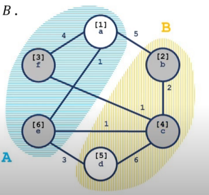

# Stoer–Wagner 算法 - OI Wiki

- Source: https://oi-wiki.org/graph/stoer-wagner/

# Stoer–Wagner 算法

## 定义

由于取消了 **源汇点** 的定义，我们需要对 **割** 的概念进行重定义．

（其实是网络流部分有关割的定义与维基百科不符，只是由于一般接触到的割都是「有源汇的最小割问题」，因此这个概念也就约定俗成了．）

### 割

去掉其中所有边能使一张网络流图不再连通（即分成两个子图）的边集称为图的割．

即：在无向图 𝐺 =(𝑉,𝐸)G=(V,E) 中，设 𝐶C 为图 𝐺G 中一些弧的集合，若从 𝐺G 中删去 𝐶C 中的所有弧能使图 𝐺G 不是连通图，称 𝐶C 图 𝐺G 的一个割．

### 有源汇点的最小割问题

同 [最小割](../flow/min-cut/) 中的定义．

### 无源汇点的最小割问题

包含的弧的权和最小的割．也称为全局最小割．

显然，直接跑网络流的复杂度是行不通的．

* * *

## Stoer–Wagner 算法

### 引入

Stoer–Wagner 算法在 1995 年由 _Mechthild Stoer_ 与 _Frank Wagner_ 提出，是一种通过 **递归** 的方式来解决 **无向正权图** 上的全局最小割问题的算法．

### 性质

算法复杂度 𝑂(|𝑉||𝐸| +|𝑉|2log⁡|𝑉|)O(|V||E|+|V|2log⁡|V|) 一般可近似看作 𝑂(|𝑉|3)O(|V|3)．

它的实现基于以下基本事实：设图 𝐺G 中有任意两点 𝑆,𝑇S,T．那么任意一个图 𝐺G 的割 𝐶C，或者有 𝑆,𝑇S,T 在同一连通块中，或者有 𝐶C 是一个 𝑆−𝑇S−T 割．

### 过程

  1. 在图 𝐺G 中任意指定两点 𝑠,𝑡s,t，并且以这两点作为源汇点求出图 𝐺G 的 𝑆 −𝑇S−T 最小割（定义为 _cut of phase_ ），更新当前答案．
  2. 「合并」点 𝑠,𝑡s,t，如果图 𝐺G 中 |𝑉||V| 大于 11，则回到第一步．
  3. 输出所有 _cut of phase_ 的最小值．

合并两点 𝑠,𝑡s,t：删除 𝑠,𝑡s,t 之间的连边 (𝑠,𝑡)(s,t)，对于 𝐺 ∖{𝑠,𝑡}G∖{s,t} 中任意一点 𝑘k，删除 (𝑡,𝑘)(t,k)，并将其边权 𝑑(𝑡,𝑘)d(t,k) 加到 𝑑(𝑠,𝑘)d(s,k) 上

解释：如果 𝑠,𝑡s,t 在同一连通块，对于 𝐺 ∖{𝑠,𝑡}G∖{s,t} 中的一点 𝑘k，假如 (𝑘,𝑠) ∈𝐶min(k,s)∈Cmin，那么 (𝑘,𝑡) ∈𝐶min(k,t)∈Cmin 也一定成立，否则因为 𝑠,𝑡s,t 连通，𝑘,𝑡k,t 连通，导致 𝑠,𝑘s,k 在同一连通块，此时 𝐶 =𝐶min ∖{(𝑡,𝑘)}C=Cmin∖{(t,k)} 将比 𝐶minCmin 更优．反之亦然．所以 𝑠,𝑡s,t 可以看作同一点．

步骤 1 考虑了 𝑠,𝑡s,t 不在同一连通块的情形，步骤 2 考虑了剩余的情况．由于每次执行步骤 2 都会使 |𝑉||V| 减小 11，因此算法将在进行 |𝑉| −1|V|−1 后结束．

### S-T 最小割的求法

（显然不是网络流．）

假设进行若干次合并以后，当前图 𝐺′ =(𝑉′,𝐸′)G′=(V′,E′)，执行步骤 1．

我们构造一个集合 𝐴A，初始时令 𝐴 =∅A=∅．

我们每次将 𝑉′V′ 中所有点中，满足 𝑖 ∉𝐴i∉A，且权值函数 𝑤(𝐴,𝑖)w(A,i) 最大的节点加入集合 𝐴A，直到 |𝐴| =|𝑉′||A|=|V′|．

其中权值函数的定义：

𝑤(𝐴,𝑖) =∑𝑗∈𝐴𝑑(𝑖,𝑗)w(A,i)=∑j∈Ad(i,j)

（若 (𝑖,𝑗) ∉𝐸′(i,j)∉E′，则 𝑑(𝑖,𝑗) =0d(i,j)=0）．

容易知道所有点加入 𝐴A 的顺序是固定的，令 ord⁡(𝑖)ord⁡(i) 表示第 𝑖i 个加入 𝐴A 的点，𝑡 =ord⁡(|𝑉′|)t=ord⁡(|V′|)；pos⁡(𝑣)pos⁡(v) 表示 𝑣v 被加入 𝐴A 后 |𝐴||A| 的大小，即 𝑣v 被加入的顺序．

则对任意点 𝑠s，一个 𝑠s 到 𝑡t 的割即为 𝑤(𝑡)w(t)．

### 证明

定义一个点 𝑣v 被激活，当且仅当 𝑣v 在加入 𝐴A 中时，发现在 𝐴A 此时最后一个点 𝑢u 早于 𝑣v 加入集合，并且在图 𝐺″ =(𝑉′,𝐸′/𝐶)G″=(V′,E′/C) 中，𝑢u 与 𝑣v 不在同一连通块．



如图，蓝色区域和黄色区域为两个不同的连通块，方括号中的数字为加入 𝐴A 的顺序．灰色节点为活跃节点，白色节点则不是活跃节点．

定义 𝐴𝑣 ={𝑢 ∣pos⁡(𝑢) <pos⁡(𝑣)}Av={u∣pos⁡(u)<pos⁡(v)}，也就是严格早于 𝑣v 加入 𝐴A 的点，令 𝐸𝑣Ev 为 𝐸′E′ 的诱导子图（点集为 𝐴𝑣 ∪{𝑣}Av∪{v}）的边集．（注意包含点 𝑣v．）

定义诱导割 𝐶𝑣Cv 为 𝐶 ∩𝐸𝑣C∩Ev．𝑤(𝐶𝑣) =∑(𝑖,𝑗)∈𝐶𝑣𝑑(𝑖,𝑗)w(Cv)=∑(i,j)∈Cvd(i,j)．

Lemma 1

对于任何被激活的点 𝑣v，𝑤(𝐴𝑣,𝑣) ≤𝑤(𝐶𝑣)w(Av,v)≤w(Cv)．

证明：使用数学归纳法．

对于第一个被激活的点 𝑣0v0，由定义可知 𝑤(𝐴𝑣0,𝑣0) =𝑤(𝐶𝑣0)w(Av0,v0)=w(Cv0)．

对于之后两个被激活的点 𝑢,𝑣u,v，假设 pos⁡(𝑣) <pos⁡(𝑢)pos⁡(v)<pos⁡(u)，则有：

𝑤(𝐴𝑢,𝑢) =𝑤(𝐴𝑣,𝑢) +𝑤(𝐴𝑢 −𝐴𝑣,𝑢)w(Au,u)=w(Av,u)+w(Au−Av,u)

又，已知：

𝑤(𝐴𝑣,𝑢) ≤𝑤(𝐴𝑣,𝑣)w(Av,u)≤w(Av,v) 并且 𝑤(𝐴𝑣,𝑣) ≤𝑤(𝐶𝑣)w(Av,v)≤w(Cv) 联立可得：

𝑤(𝐴𝑢,𝑢) ≤𝑤(𝐶𝑣) +𝑤(𝐴𝑢 −𝐴𝑣,𝑢)w(Au,u)≤w(Cv)+w(Au−Av,u)

由于 𝑤(𝐴𝑢 −𝐴𝑣,𝑢)w(Au−Av,u) 对 𝑤(𝐶𝑢)w(Cu) 有贡献而对 𝑤(𝐶𝑣)w(Cv) 没有贡献，在所有边均为正权的情况下，可导出：

𝑤(𝐴𝑢,𝑢) ≤𝑤(𝐶𝑢)w(Au,u)≤w(Cu)

由归纳法得证．

由于 pos⁡(𝑠) <pos⁡(𝑡)pos⁡(s)<pos⁡(t)，并且 𝑠,𝑡s,t 不在同一连通块，因此 𝑡t 会被激活，由此可以得出 𝑤(𝐴𝑡,𝑡) ≤𝑤(𝐶𝑡) =𝑤(𝐶)w(At,t)≤w(Ct)=w(C)．

[P5632【模板】Stoer–Wagner 算法](https://www.luogu.com.cn/problem/P5632)

```text 1 2 3 4 5 6 7 8 9 10 11 12 13 14 15 16 17 18 19 20 21 22 23 24 25 26 27 28 29 30 31 32 33 34 35 36 37 38 39 40 41 42 43 44 45 46 47 48 49 50 51 52 53 54 55 56 57 58 59 60 61 62 63 64 65 66 67 68 69 70 71 72 73 74 ``` |  ```text #include <cstring> #include <iostream> using namespace std ; constexpr int N = 601 ; int fa [ N ], siz [ N ], edge [ N ][ N ]; int find ( int x ) { return fa [ x ] == x ? x : fa [ x ] = find ( fa [ x ]); } int dist [ N ], vis [ N ], bin [ N ]; int n , m ; int contract ( int & s , int & t ) { // Find s,t memset ( dist , 0 , sizeof ( dist )); memset ( vis , false , sizeof ( vis )); int i , j , k , mincut , maxc ; for ( i = 1 ; i <= n ; i ++ ) { k = -1 ; maxc = -1 ; for ( j = 1 ; j <= n ; j ++ ) if ( ! bin [ j ] && ! vis [ j ] && dist [ j ] > maxc ) { k = j ; maxc = dist [ j ]; } if ( k == -1 ) return mincut ; s = t ; t = k ; mincut = maxc ; vis [ k ] = true ; for ( j = 1 ; j <= n ; j ++ ) if ( ! bin [ j ] && ! vis [ j ]) dist [ j ] += edge [ k ][ j ]; } return mincut ; } constexpr int inf = 0x3f3f3f3f ; int Stoer_Wagner () { int mincut , i , j , s , t , ans ; for ( mincut = inf , i = 1 ; i < n ; i ++ ) { ans = contract ( s , t ); bin [ t ] = true ; if ( mincut > ans ) mincut = ans ; if ( mincut == 0 ) return 0 ; for ( j = 1 ; j <= n ; j ++ ) if ( ! bin [ j ]) edge [ s ][ j ] = ( edge [ j ][ s ] += edge [ j ][ t ]); } return mincut ; } int main () { ios :: sync_with_stdio ( false ), cin . tie ( nullptr ); cin >> n >> m ; if ( m < n \- 1 ) { cout << 0 ; return 0 ; } for ( int i = 1 ; i <= n ; ++ i ) fa [ i ] = i , siz [ i ] = 1 ; for ( int i = 1 , u , v , w ; i <= m ; ++ i ) { cin >> u >> v >> w ; int fu = find ( u ), fv = find ( v ); if ( fu != fv ) { if ( siz [ fu ] > siz [ fv ]) swap ( fu , fv ); fa [ fu ] = fv , siz [ fv ] += siz [ fu ]; } edge [ u ][ v ] += w , edge [ v ][ u ] += w ; } int fr = find ( 1 ); if ( siz [ fr ] != n ) { cout << 0 ; return 0 ; } cout << Stoer_Wagner (); return 0 ; } ```   
---|---  
  
* * *

### 复杂度分析与优化

 _contract_ 操作的复杂度为 𝑂(|𝐸| +|𝑉|log⁡|𝑉|)O(|E|+|V|log⁡|V|)．

一共进行 𝑂(|𝑉|)O(|V|) 次 _contract_ ，总复杂度为 𝑂(|𝐸||𝑉| +|𝑉|2log⁡|𝑉|)O(|E||V|+|V|2log⁡|V|)．

根据 [最短路](../shortest-path/) 的经验，算法瓶颈在于找到权值最大的点．

在一次 _contract_ 中需要找 |𝑉||V| 次堆顶，并递增地修改 |𝐸||E| 次权值．

斐波那契堆 可以胜任 𝑂(log⁡|𝑉|)O(log⁡|V|) 查找堆顶和 𝑂(1)O(1) 递增修改权值的工作，理论复杂度可以达到 𝑂(|𝐸| +|𝑉|log⁡|𝑉|)O(|E|+|V|log⁡|V|)，但是由于斐波那契堆常数过大，码量高，实际应用价值偏低．

（实际测试中开 O2 还要卡评测波动才能过．）

* * *

>  __本页面最近更新： 2026/1/7 08:56:54，[更新历史](https://github.com/OI-wiki/OI-wiki/commits/master/docs/graph/stoer-wagner.md)  
>  __发现错误？想一起完善？[在 GitHub 上编辑此页！](https://oi-wiki.org/edit-landing/?ref=/graph/stoer-wagner.md "edit.link.title")  
>  __本页面贡献者：[Enter-tainer](https://github.com/Enter-tainer), [Tiphereth-A](https://github.com/Tiphereth-A), [DanJoshua](https://github.com/DanJoshua), [opsiff](https://github.com/opsiff), [yingqi-z20](https://github.com/yingqi-z20), [aberter0x3f](https://github.com/aberter0x3f), [CroMarmot](https://github.com/CroMarmot), [EntropyIncreaser](https://github.com/EntropyIncreaser), [Great-designer](https://github.com/Great-designer), [iamtwz](https://github.com/iamtwz), [ImpleLee](https://github.com/ImpleLee), [kenlig](https://github.com/kenlig), [Konano](https://github.com/Konano), [Marcythm](https://github.com/Marcythm), [Menci](https://github.com/Menci), [ouuan](https://github.com/ouuan), [sldpzshdwz](https://github.com/sldpzshdwz), [yzy-1](https://github.com/yzy-1)  
>  __本页面的全部内容在**[CC BY-SA 4.0](https://creativecommons.org/licenses/by-sa/4.0/deed.zh) 和 [SATA](https://github.com/zTrix/sata-license)** 协议之条款下提供，附加条款亦可能应用
