# 虚树 - OI Wiki

- Source: https://oi-wiki.org/graph/virtual-tree/

# 虚树

## 引入

[「SDOI2011」消耗战](https://www.luogu.com.cn/problem/P2495)

在一场战争中，战场由 𝑛n 个岛屿和 𝑛 −1n−1 个桥梁组成，保证每两个岛屿间有且仅有一条路径可达．现在，我军已经侦查到敌军的总部在编号为 11 的岛屿，而且他们已经没有足够多的能源维系战斗，我军胜利在望．已知在其他 𝑘k 个岛屿上有丰富能源，为了防止敌军获取能源，我军的任务是炸毁一些桥梁，使得敌军不能到达任何能源丰富的岛屿．由于不同桥梁的材质和结构不同，所以炸毁不同的桥梁有不同的代价，我军希望在满足目标的同时使得总代价最小．

侦查部门还发现，敌军有一台神秘机器．即使我军切断所有能源之后，他们也可以用那台机器．机器产生的效果不仅仅会修复所有我军炸毁的桥梁，而且会重新随机资源分布（但可以保证的是，资源不会分布到 11 号岛屿上）．不过侦查部门还发现了这台机器只能够使用 𝑚m 次，所以我们只需要把每次任务完成即可．

对于所有数据，2 ≤𝑛 ≤2.5 ×105,1 ≤𝑚 ≤5 ×105,∑𝑘𝑖 ≤5 ×105,1 ≤𝑘𝑖 ≤𝑛 −12≤n≤2.5×105,1≤m≤5×105,∑ki≤5×105,1≤ki≤n−1．

### 朴素做法

对于上面那题，我们不难发现——如果树的点数很少，那么我们可以直接跑 DP．

首先我们称某次询问中被选中的点为——**「关键点」** ．

设 𝐷𝑝(𝑖)Dp(i) 表示——使 𝑖i 不与其子树中任意一个关键点连通的 **最小代价** ．

设 𝑤(𝑎,𝑏)w(a,b) 表示 𝑎a 与 𝑏b 之间的边的权值．

则枚举 𝑖i 的儿子 𝑣v：

  * 若 𝑣v 不是关键点：𝐷𝑝(𝑖) =𝐷𝑝(𝑖) +min{𝐷𝑝(𝑣),𝑤(𝑖,𝑣)}Dp(i)=Dp(i)+min{Dp(v),w(i,v)}；
  * 若 𝑣v 是关键点：𝐷𝑝(𝑖) =𝐷𝑝(𝑖) +𝑤(𝑖,𝑣)Dp(i)=Dp(i)+w(i,v)．

很好，这样我们得到了一份 𝑂(𝑛𝑞)O(nq) 的代码．

听起来很有意思．

### 优化做法

我们不难发现——其实很多点是没有用的．以下图为例：

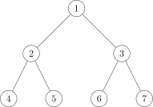

如果我们选取的关键点是：

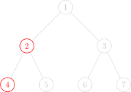

图中只有两个红色的点是 **关键点** ，而别的点全都是「非关键点」．

对于这题来说，我们只需要保证红色的点无法到达 11 号节点就行了．

通过肉眼观察可以得出结论——11 号节点的右子树（虽然实际上可能有多个子树，但这里只有两个子树，所以暂时这么称呼了）一个红色节点都没有，**所以没必要去 DP 它** ．

观察题目给出的条件，红色点（关键点）的总数是与 𝑛n 同阶的，也就是说实际上一次询问中红色的点对于整棵树来说是很稀疏的，所以如果我们能让复杂度由红色点的总数来决定就好了．

因此我们需要 **浓缩信息，把一整颗大树浓缩成一颗小树** ．

## 虚树 Virtual Tree

由此我们引出了 **「虚树」** 这个概念．

我们先直观地来看看虚树的样子．

下图中，红色结点是我们选择的关键点．红色和黑色结点都是虚树中的点．黑色的边是虚树中的边．

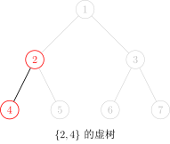

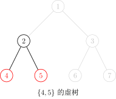

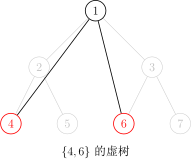

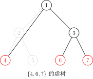

因为任意两个关键点的 LCA 也是需要保存重要信息的，所以我们需要保存它们的 LCA，因此虚树中不一定只有关键点．

不难发现虚树中祖先后代的关系并不会改变．（就是不会出现原本 𝑎a 是 𝑏b 的祖先结果后面 𝑎a 变成 𝑏b 的后代了之类的鬼事）

但我们不可能 𝑂(𝑘2)O(k2) 暴力枚举 LCA，所以我们不难想到——首先将关键点按 DFS 序排序，然后排完序以后相邻的两个关键点（相邻指的是在排序后的序列中下标差值的绝对值等于 1）求一下 LCA，并把它加入虚树．

我们的当务之急就是如何构造虚树．

在提出方案之前，我们先确认一个事实——在虚树里，只要保证祖先后代的关系没有改变，就可以随意添加节点．

也就是，如果我们乐意，我们可以把原树中所有的点都加入虚树中，也不会导致 WA（虽然会导致 TLE）．

因此，我们为了方便，可以首先将 11 号节点加入虚树中，并且并不会影响答案．

### 第一种构造过程：二次排序 + LCA 连边

因为多个节点的 LCA 可能是同一个，所以我们不能多次将它加入虚树．

非常直观的一个方法是：

  * 将关键点按 DFS 序排序；
  * 遍历一遍，任意两个相邻的关键点求一下 LCA，并且判重；
  * 然后根据原树中的祖先后代关系建树．

具体实现上，在 **关键点序列** 上，枚举 **相邻的两个数** ，两两求得 LCA 并且加入序列 𝐴A 中．

因为 DFS 序的性质，此时的序列 𝐴A 已经包含了 **虚树中的所有点** ，但是可能有重复．

所以我们把序列 𝐴A 按照 DFS 序 **从小到大排序并去重** ．

最后，在序列 𝐴A 上，枚举 **相邻** 的两个 **点编号** 𝑥,𝑦x,y，求得它们的 LCA 并且连接 LCA⁡(𝑥,𝑦),𝑦LCA⁡(x,y),y，虚树就构造完成了．

为什么连接 LCA⁡(𝑥,𝑦)LCA⁡(x,y) 和 𝑦y 可以做到不重不漏呢？

证明

如果 𝑥x 是 𝑦y 的祖先，那么 𝑥x 直接到 𝑦y 连边．因为 DFS 序保证了 𝑥x 和 𝑦y 的 DFS 序是相邻的，所以 𝑥x 到 𝑦y 的路径上面没有关键点．

如果 𝑥x 不是 𝑦y 的祖先，那么就把 LCA⁡(𝑥,𝑦)LCA⁡(x,y) 当作 𝑦y 的的祖先，根据上一种情况也可以证明 LCA⁡(𝑥,𝑦)LCA⁡(x,y) 到 𝑦y 点的路径上不会有关键点．

所以连接 LCA⁡(𝑥,𝑦)LCA⁡(x,y) 和 𝑦y，不会遗漏，也不会重复．

另外第一个点没有被一个节点连接会不会有影响呢？因为第一个点一定是这棵树的根，所以不会有影响，所以总边数就是 𝑚 −1m−1 条．

因为至少要两个实点才能够召唤出来一个虚点，再加上一个根节点，所以虚树的点数就是实点数量的两倍．

时间复杂度 𝑂(𝑚log⁡𝑛)O(mlog⁡n)，其中 𝑚m 为关键点数，𝑛n 为总点数．

#### 实现

```text 1 2 3 4 5 6 7 8 9 10 11 12 13 14 15 16 17 18 19 20 21 ``` |  ```text int dfn [ MAXN ]; int h [ MAXN ], m , a [ MAXN ], len ; // 存储关键点 bool cmp ( int x , int y ) { return dfn [ x ] < dfn [ y ]; // 按照 dfs 序排序 } void build_virtual_tree () { sort ( h \+ 1 , h \+ m \+ 1 , cmp ); // 把关键点按照 dfs 序排序 for ( int i = 1 ; i < m ; ++ i ) { a [ ++ len ] = h [ i ]; a [ ++ len ] = lca ( h [ i ], h [ i \+ 1 ]); // 插入 lca } a [ ++ len ] = h [ m ]; sort ( a \+ 1 , a \+ len \+ 1 , cmp ); // 把所有虚树上的点按照 dfs 序排序 len = unique ( a \+ 1 , a \+ len \+ 1 ) \- a \- 1 ; // 去重 for ( int i = 1 , lc ; i < len ; ++ i ) { lc = lca ( a [ i ], a [ i \+ 1 ]); conn ( lc , a [ i \+ 1 ]); // 连边，如有边权 就是 distance(lc,a[i+1]) } } ```   
---|---  
  
其实这样就足以构造一棵虚树了．

### 第二种构造过程：使用单调栈

如何使用单调栈构造虚树？

首先我们要明确一个目的——我们要用单调栈来维护一条虚树上的链．

也就是一个栈里相邻的两个节点在虚树上也是相邻的，而且栈是从底部到栈首单调递增的（指的是栈中节点 DFS 序单调递增），说白了就是某个节点的父亲就是栈中它下面的那个节点．

首先我们在栈中添加节点 11．

然后接下来按照 DFS 序从小到大添加关键节点．

假如当前的节点与栈顶节点的 LCA 就是栈顶节点的话，则说明它们是在一条链上的．所以直接把当前节点入栈就行了．

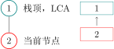

假如当前节点与栈顶节点的 LCA 不是栈顶节点的话：

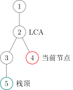

这时，当前单调栈维护的链是：

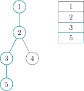

而我们需要把链变成：

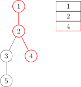

那么我们就把用虚线标出的结点弹栈即可，在弹栈前别忘了向它在虚树中的父亲连边．

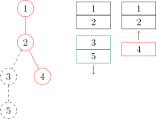

假如弹出以后发现栈首不是 LCA 的话要让 LCA 入栈．

再把当前节点入栈就行了．

下面给出一个具体的例子．假设我们要对下面这棵树的 4，6 和 7 号结点建立虚树：

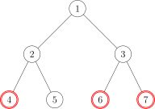

那么步骤是这样的：

  * 将 3 个关键点 6,4,76,4,7 按照 DFS 序排序，得到序列 [4,6,7][4,6,7]．
  * 将 11 入栈．

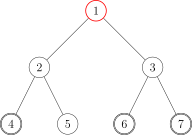

我们用红色的点代表在栈内的点，青色的点代表从栈中弹出的点．

  * 取序列中第一个作为当前节点，也就是 44．再取栈顶元素，为 11．求 11 和 44 的 LCA：𝐿𝐶𝐴(1,4) =1LCA(1,4)=1．
  * 发现 𝐿𝐶𝐴(1,4) =LCA(1,4)= 栈顶元素，说明它们在虚树的一条链上，所以直接把当前节点 44 入栈，当前栈为 4,14,1．

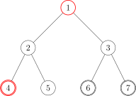

  * 取序列第二个作为当前节点，为 66．再取栈顶元素，为 44．求 66 和 44 的 LCA：𝐿𝐶𝐴(6,4) =1LCA(6,4)=1．
  * 发现 𝐿𝐶𝐴(6,4) ≠LCA(6,4)≠ 栈顶元素，进入判断阶段．
  * 判断阶段：发现栈顶节点 44 的 DFS 序是大于 𝐿𝐶𝐴(6,4)LCA(6,4) 的，但是次大节点（栈顶节点下面的那个节点）11 的 DFS 序是等于 LCA 的（其实 DFS 序相等说明节点也相等），说明 LCA 已经入栈了，所以直接连接 1 →41→4 的边，也就是 LCA 到栈顶元素的边．并把 44 从栈中弹出．

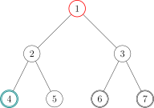

  * 结束了判断阶段，将 66 入栈，当前栈为 6,16,1．

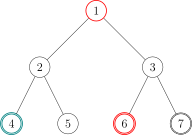

  * 取序列第三个作为当前节点，为 77．再取栈顶元素，为 66．求 77 和 66 的 LCA：𝐿𝐶𝐴(7,6) =3LCA(7,6)=3．
  * 发现 𝐿𝐶𝐴(7,6) ≠LCA(7,6)≠ 栈顶元素，进入判断阶段．
  * 判断阶段：发现栈顶节点 66 的 DFS 序是大于 𝐿𝐶𝐴(7,6)LCA(7,6) 的，但是次大节点（栈顶节点下面的那个节点）11 的 DFS 序是小于 LCA 的，说明 LCA 还没有入过栈，所以直接连接 3 →63→6 的边，也就是 LCA 到栈顶元素的边．把 66 从栈中弹出，并且把 𝐿𝐶𝐴(6,7)LCA(6,7) 入栈．
  * 结束了判断阶段，将 77 入栈，当前栈为 1,3,71,3,7．

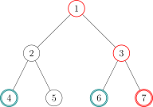

  * 发现序列里的 3 个节点已经全部加入过栈了，退出循环．
  * 此时栈中还有 3 个节点：1,3,71,3,7，很明显它们是一条链上的，所以直接链接：1 →31→3 和 3 →73→7 的边．
  * 虚树就建完啦！

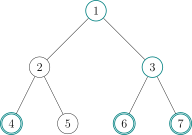

我们接下来将那些没入过栈的点（非青色的点）删掉，对应的虚树长这个样子：

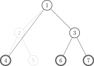

其中有很多细节，比如用邻接表存图的方式存虚树的话，需要清空邻接表．但是直接清空整个邻接表是很慢的，所以我们在 **有一个从未入栈的元素入栈的时候清空该元素对应的邻接表** 即可．

时间复杂度同样为 𝑂(𝑚log⁡𝑛)O(mlog⁡n)（因为有排序），其中 𝑚m 为关键点数，𝑛n 为总点数．

#### 实现

建立虚树的 C++ 代码大概长这样：

代码实现

```text 1 2 3 4 5 6 7 8 9 10 11 12 13 14 15 16 17 18 19 20 21 22 23 24 25 26 27 28 29 30 31 32 33 ``` |  ```text bool cmp ( const int x , const int y ) { return id [ x ] < id [ y ]; } void build () { sort ( h \+ 1 , h \+ k \+ 1 , cmp ); sta [ top = 1 ] = 1 , g . sz = 0 , g . head [ 1 ] = -1 ; // 1 号节点入栈，清空 1 号节点对应的邻接表，设置邻接表边数为 0 for ( int i = 1 , l ; i <= k ; ++ i ) if ( h [ i ] != 1 ) { // 如果 1 号节点是关键节点就不要重复添加 l = lca ( h [ i ], sta [ top ]); // 计算当前节点与栈顶节点的 LCA if ( l != sta [ top ]) { // 如果 LCA 和栈顶元素不同，则说明当前节点不在当前栈所存的链上 while ( id [ l ] < id [ sta [ top \- 1 ]]) // 当次大节点的 Dfs 序大于 LCA 的 Dfs 序 g . push ( sta [ top \- 1 ], sta [ top ]), top \-- ; // 把与当前节点所在的链不重合的链连接掉并且弹出 if ( id [ l ] > id [ sta [ top \- 1 ]]) // 如果 LCA 不等于次大节点（这里的大于其实和不等于没有区别） g . head [ l ] = -1 , g . push ( l , sta [ top ]), sta [ top ] = l ; // 说明 LCA 是第一次入栈，清空其邻接表，连边后弹出栈顶元素，并将 LCA // 入栈 else g . push ( l , sta [ top \-- ]); // 说明 LCA 就是次大节点，直接弹出栈顶元素 } g . head [ h [ i ]] = -1 , sta [ ++ top ] = h [ i ]; // 当前节点必然是第一次入栈，清空邻接表并入栈 } for ( int i = 1 ; i < top ; ++ i ) g . push ( sta [ i ], sta [ i \+ 1 ]); // 剩余的最后一条链连接一下 return ; } ```   
---|---  
  
于是我们就学会了虚树的建立了！

对于消耗战这题，直接在虚树上跑最开始讲的那个 DP 就行了，我们等于利用了虚树排除了那些没用的非关键节点！仍然考虑 𝑖i 的所有儿子 𝑣v：

  * 若 𝑣v 不是关键点：𝐷𝑝(𝑖) =𝐷𝑝(𝑖) +min{𝐷𝑝(𝑣),𝑤(𝑖,𝑣)}Dp(i)=Dp(i)+min{Dp(v),w(i,v)}
  * 若 𝑣v 是关键点：𝐷𝑝(𝑖) =𝐷𝑝(𝑖) +𝑤(𝑖,𝑣)Dp(i)=Dp(i)+w(i,v)

于是这题很简单就过了．

## 推荐习题

  * [「SDOI2011」消耗战](https://www.luogu.com.cn/problem/P2495)
  * [「HEOI2014」大工程](https://www.luogu.com.cn/problem/P4103)
  * [CF613D Kingdom and its Cities](http://codeforces.com/contest/613/problem/D/)
  * [「HNOI2014」世界树](https://www.luogu.com.cn/problem/P3233)

* * *

>  __本页面最近更新： 2026/1/21 11:33:31，[更新历史](https://github.com/OI-wiki/OI-wiki/commits/master/docs/graph/virtual-tree.md)  
>  __发现错误？想一起完善？[在 GitHub 上编辑此页！](https://oi-wiki.org/edit-landing/?ref=/graph/virtual-tree.md "edit.link.title")  
>  __本页面贡献者：[Ir1d](https://github.com/Ir1d), [sshwy](https://github.com/sshwy), [Tiphereth-A](https://github.com/Tiphereth-A), [Early0v0](https://github.com/Early0v0), [H-J-Granger](https://github.com/H-J-Granger), [StudyingFather](https://github.com/StudyingFather), [konnyakuxzy](https://github.com/konnyakuxzy), [countercurrent-time](https://github.com/countercurrent-time), [Enter-tainer](https://github.com/Enter-tainer), [greyqz](https://github.com/greyqz), [NachtgeistW](https://github.com/NachtgeistW), [HeRaNO](https://github.com/HeRaNO), [ksyx](https://github.com/ksyx), [mgt](mailto:i@margatroid.xyz), [AngelKitty](https://github.com/AngelKitty), [CCXXXI](https://github.com/CCXXXI), [cjsoft](https://github.com/cjsoft), [diauweb](https://github.com/diauweb), [ezoixx130](https://github.com/ezoixx130), [GekkaSaori](https://github.com/GekkaSaori), [Konano](https://github.com/Konano), [LovelyBuggies](https://github.com/LovelyBuggies), [Makkiy](https://github.com/Makkiy), [minghu6](https://github.com/minghu6), [P-Y-Y](https://github.com/P-Y-Y), [PotassiumWings](https://github.com/PotassiumWings), [SamZhangQingChuan](https://github.com/SamZhangQingChuan), [SmallTualatin](https://github.com/SmallTualatin), [Suyun514](mailto:suyun514@qq.com), [weiyong1024](https://github.com/weiyong1024), [Xeonacid](https://github.com/Xeonacid), [y-kx-b](https://github.com/y-kx-b), [alphagocc](https://github.com/alphagocc), [aofall](https://github.com/aofall), [Chiechun](https://github.com/Chiechun), [CoelacanthusHex](https://github.com/CoelacanthusHex), [GavinZhengOI](https://github.com/GavinZhengOI), [Gesrua](https://github.com/Gesrua), [GoodCoder666](https://github.com/GoodCoder666), [Henry-ZHR](https://github.com/Henry-ZHR), [HTensor](https://github.com/HTensor), [hyx1124](https://github.com/hyx1124), [iamtwz](https://github.com/iamtwz), [kfy666](https://github.com/kfy666), [kxccc](https://github.com/kxccc), [lychees](https://github.com/lychees), [Marcythm](https://github.com/Marcythm), [mcendu](https://github.com/mcendu), [megakite](https://github.com/megakite), [ouuan](https://github.com/ouuan), [Peanut-Tang](https://github.com/Peanut-Tang), [Persdre](https://github.com/Persdre), [r-value](https://github.com/r-value), [shiftooo](https://github.com/shiftooo), [shuzhouliu](https://github.com/shuzhouliu), [SukkaW](https://github.com/SukkaW), [szdytom](https://github.com/szdytom), [tder6](https://github.com/tder6), [tth37](https://github.com/tth37), [william-song-shy](https://github.com/william-song-shy), [yjl9903](https://github.com/yjl9903)  
>  __本页面的全部内容在**[CC BY-SA 4.0](https://creativecommons.org/licenses/by-sa/4.0/deed.zh) 和 [SATA](https://github.com/zTrix/sata-license)** 协议之条款下提供，附加条款亦可能应用
