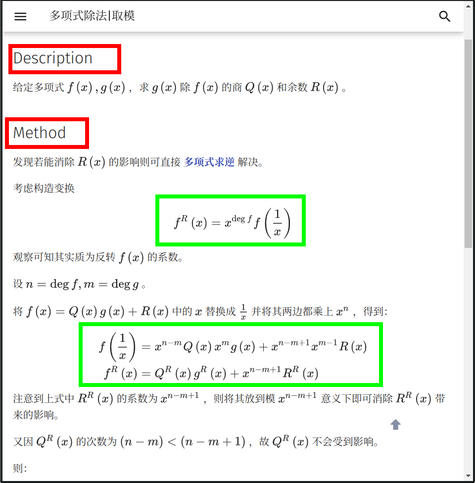
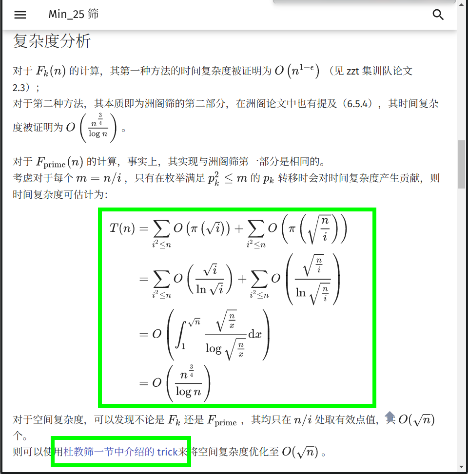
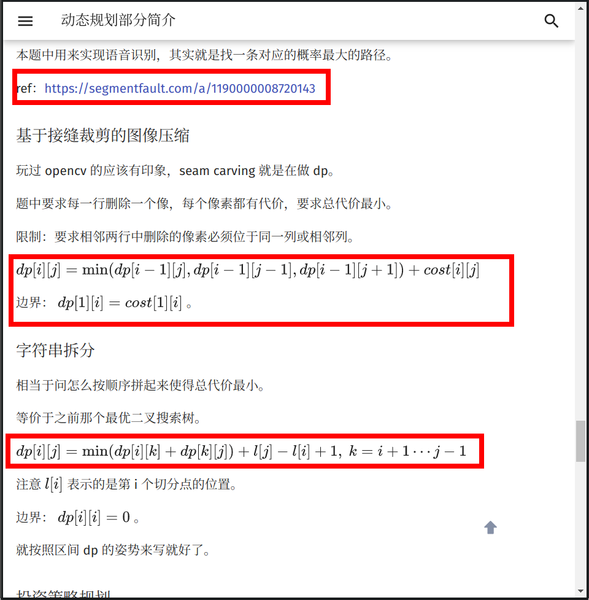
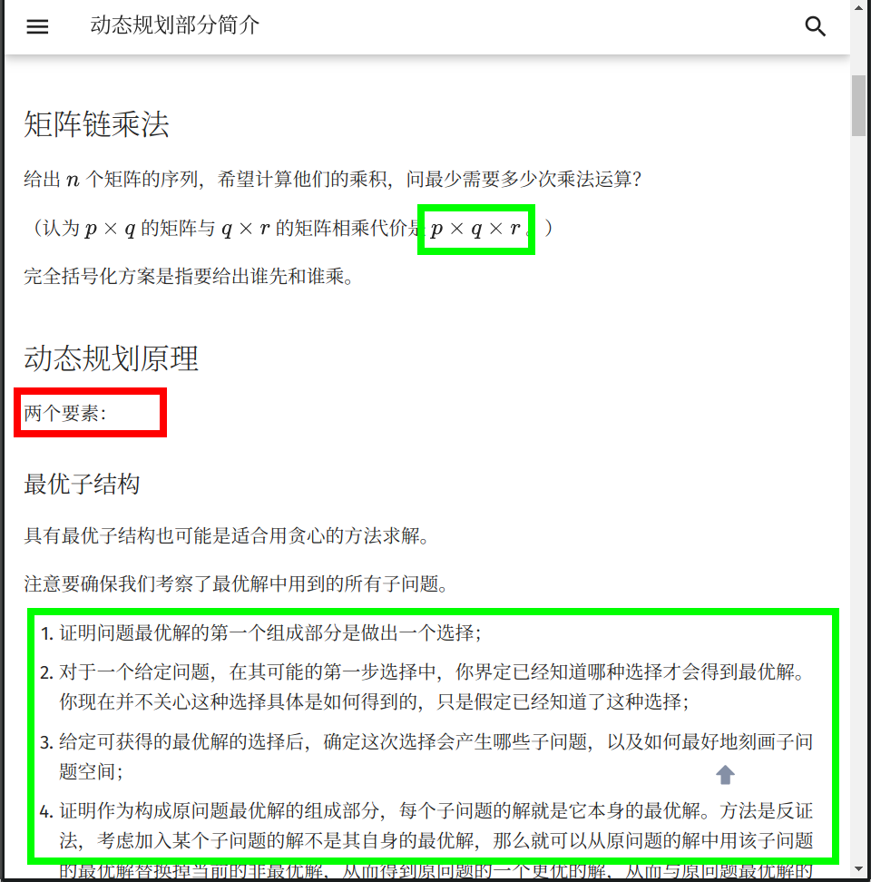
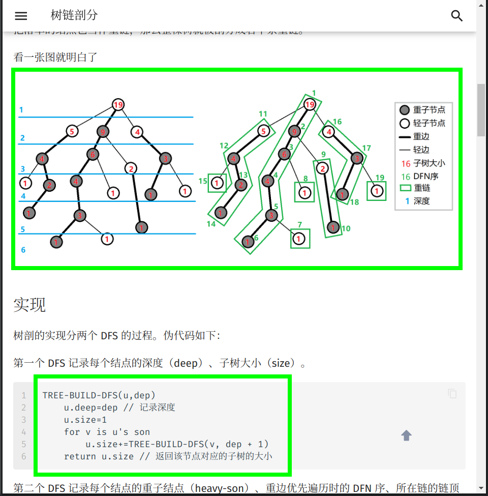
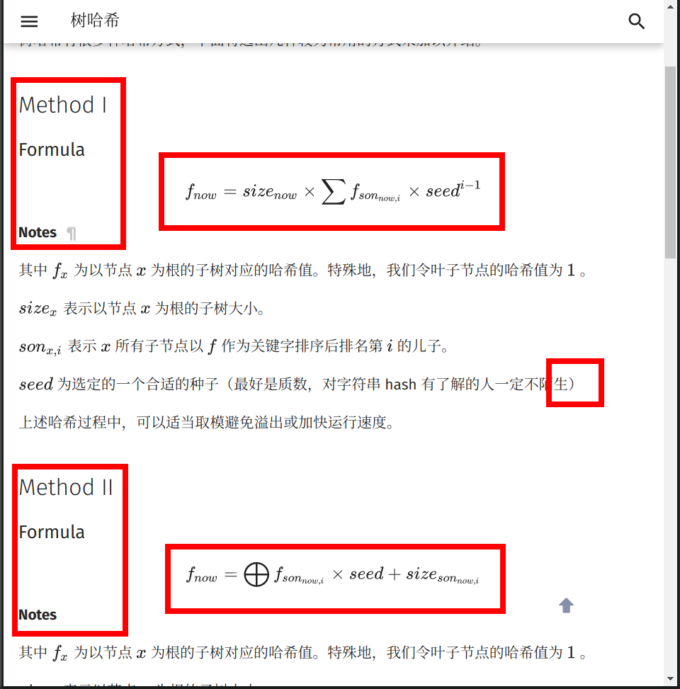
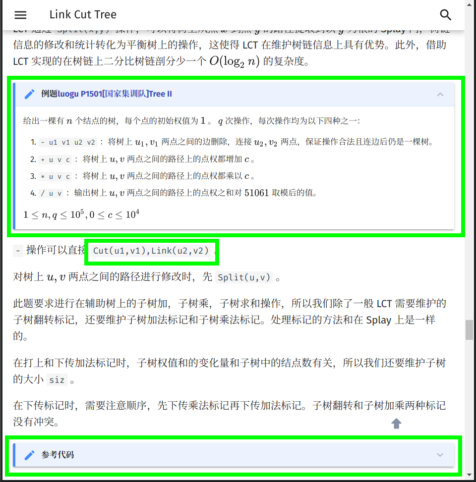
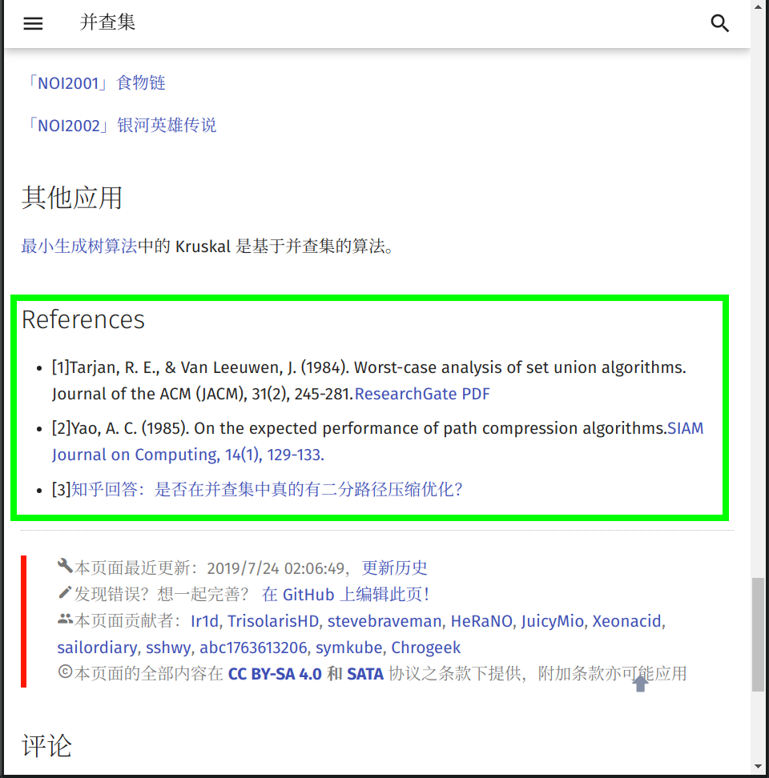

# 格式手册 - OI Wiki

- Source: https://oi-wiki.org/intro/format/

# 格式手册

在文章开始之前，**OI Wiki** 项目组全体成员十分欢迎您为本项目贡献页面．正因为有了上百位像您一样的人，才有了 **OI Wiki** 的今天！

本页面将列出在 **OI Wiki** 编写过程时推荐使用的格式规范与编辑方针．请您在撰稿或者修正 Wiki 页面以前，仔细阅读以下内容，以帮助您完成更高质量的内容．

如果您已迫不及待，想要快速上手，建议先阅读 太长不看版 与 图片举例 的章节．

Changelog

**注意** ：只记录和写作、审阅等相关的改动，不记录格式修正等改动．

时间| 主要内容| 相关 Issue/Pull Request 链接  
---|---|---  
2026-02-22| 完善引号使用的相关规定| [#6793](https://github.com/OI-wiki/OI-wiki/pull/6793)  
2026-01-07| 要求使用全角句点替代中文句号| [#6746](https://github.com/OI-wiki/OI-wiki/pull/6746)  
2025-08-10| 添加格式手册的格式要求；  
代码：补充片段代码相关要求| [#6412](https://github.com/OI-wiki/OI-wiki/pull/6412)  
2025-08-10| 添加 Changelog 与 TL;DR| [#6409](https://github.com/OI-wiki/OI-wiki/pull/6409)  
2024-10-08| 代码：为适应全平台测试完善了格式要求| [#5912](https://github.com/OI-wiki/OI-wiki/pull/5912)，[#5924](https://github.com/OI-wiki/OI-wiki/pull/5924)  
2024-03-26| 引用 OJ 题目链接时使用原链接，而不是镜像链接| [#5482](https://github.com/OI-wiki/OI-wiki/pull/5482)  
2023-10-09| 主题插件：新增选项卡8的格式要求| [#5152](https://github.com/OI-wiki/OI-wiki/pull/5152)  
2023-07-23| 对于工具类内容的下载安装等内容，要求引用官方文档| [#5023](https://github.com/OI-wiki/OI-wiki/pull/5023)  
2023-04-15| 补充引号的使用规范| [#4792](https://github.com/OI-wiki/OI-wiki/pull/4792)  
2023-03-28| LaTeX：数学符号表| [#4587](https://github.com/OI-wiki/OI-wiki/pull/4587)  
2023-03-02| 补充全半角标点与连接号的使用规范| [#4726](https://github.com/OI-wiki/OI-wiki/pull/4726)  
2022-12-13| 主题插件：移除嵌套折叠框的阴影样式要求| [#4500](https://github.com/OI-wiki/OI-wiki/pull/4500)  
2022-08-09| 引用内链的某一节内容时，使用中文标题| [#4057](https://github.com/OI-wiki/OI-wiki/pull/4057)  
2022-06-12| 完善目录更改的相关要求9| [#4043](https://github.com/OI-wiki/OI-wiki/pull/4043)  
2021-09-09| 主题插件：补充折叠框相关要求| [#3517](https://github.com/OI-wiki/OI-wiki/pull/3517)  
2021-09-03| LaTeX：`\Leftrightarrow` →→ `\iff`| [#3499](https://github.com/OI-wiki/OI-wiki/pull/3499)  
2021-08-18| 代码：新增例题代码的格式要求| [#3447](https://github.com/OI-wiki/OI-wiki/pull/3447)  
2021-08-12| 图片：动图优先使用 APNG 格式| [#3422](https://github.com/OI-wiki/OI-wiki/pull/3422)  
2021-06-29| 图片：建议同时提交源文件| [#3255](https://github.com/OI-wiki/OI-wiki/pull/3255)  
2021-05-29| 代码：删除大括号不换行的要求，补充可读性要求| [#3197](https://github.com/OI-wiki/OI-wiki/pull/3197)  
2021-03-15| 站点维护：规范 Pull Request 的合并方式10| [#3061](https://github.com/OI-wiki/OI-wiki/pull/3061)  
2021-02-01| LaTeX：`\lt` →→ `<`，`\gt` →→ `>`| [#2950](https://github.com/OI-wiki/OI-wiki/pull/2950)  
2021-01-27| 建议在 [互联网档案馆](https://web.archive.org/) 保存外链备份| [#2918](https://github.com/OI-wiki/OI-wiki/pull/2918)  
2020-09-19| 站点维护：Commit Message 与 Pull Request 标题的书写要求9| [#2744](https://github.com/OI-wiki/OI-wiki/pull/2744)  
2020-10-18| 图片：优先使用 SVG 格式| [#2215](https://github.com/OI-wiki/OI-wiki/pull/2215)  
2020-08-05| LaTeX：新增多字母变量的格式要求| [#2502](https://github.com/OI-wiki/OI-wiki/pull/2502)  
2020-07-28| LaTeX：`cases` 环境禁止超过两列| [#2466](https://github.com/OI-wiki/OI-wiki/pull/2466)  
2020-07-24| LaTeX：`{n \choose m}`→→ `\dbinom{n}{m}`| [#2442](https://github.com/OI-wiki/OI-wiki/pull/2442)  
2020-07-20| Markdown：禁用删除线语法| [#2422](https://github.com/OI-wiki/OI-wiki/pull/2422)  
2020-07-19| 主题插件：要求保留折叠框11中空行的缩进空格；  
LaTeX：追加对数学公式的格式要求| [#2412](https://github.com/OI-wiki/OI-wiki/pull/2412)  
2020-07-11| 最初版本| [#2350](https://github.com/OI-wiki/OI-wiki/pull/2350)  
  
## 太长不看版

为方便初次阅读本文档的用户，本节列举该手册中的若干重点事项：

  * 文件存储：

    * 使用小写文件名，以 `-` 代替空格．详见 SAVE-1．

    * 不要插入外链图片．详见 SAVE-2．

    * 图片尽可能使用 SVG 格式，只应使用 SVG 1.1 标准．详见 SAVE-3．

    * 动图应使用 SVG 或 APNG 格式．详见 SAVE-4．

    * 有源文件的图片建议同时提交源文件．详见 SAVE-5．

    * 插入外链时建议同时插入快照链接．详见 SAVE-6．

    * 不要以插入外链的方式插入内链．详见 SAVE-7．

  * 标点符号：

    * 规范使用标点符号．在每句话的末尾添加 **句号** ．详见 PUNC-1 至 PUNC-7．

    * 注意区分连接号（hyphen、en dash、em dash）．详见 PUNC-8．

  * Markdown 语法与主题扩展语法：

    * 只应使用二级、三级、四级标题．不要使用标题替代加粗．不要在标题写 LaTeX 公式．详见 LINT-1、MDFM-1、CONT-4、CONT-9．

    * 使用折叠框11语法和选项卡8语法时，须保持内部缩进一致，**对空行也是如此** ．**不要漏掉** 空行的空格缩进．详见 LINT-6、MDFM-6．

    * 不要使用删除线 `~~foo~~` 语法．详见 LINT-3．

    * 行间公式应写作

```text 1 2 3 ``` |  ```text $$ a^{2}=b^{2}+c^{2} $$ ```   
---|---  
  
而不是 `$$a^{2}=b^{2}+c^{2}$$`．详见 LINT-5．

    * 使用折叠框而不是块引用（Blockquotes）．详见 MDFM-5．

    * 代码块只应使用 ````` 语法，且须标注语言．详见 LINT-7、MDFM-3．

  * LaTeX 公式：

    * 不应与 [数学符号表](../symbol/) 相冲突．详见 MATH-1.1．

    * 注意字体的使用，详见 MATH-1.2、MATH-1.15、MATH-2.6、MATH-2.7．

    * 不要滥用 LaTeX 公式．详见 MATH-1.14．

    * 不要 LaTeX 公式里使用程序设计语言的表示方式．（如：不要使用 𝑎 ==𝑏a==b、𝑎 <<1a<<1、𝑎%𝑏a%b．）不要使用中括号连缀（𝑎[𝑖][𝑗]a[i][j]）．详见 MATH-1.9、MATH-1.10．

  * 代码：

    * 尽可能简洁易懂，避免压行等不良习惯．尽可能保证可读性，突出算法思想．详见 CONT-10．

    * 不推荐直接把代码插入 Markdown 文档中．详见 CODE-1.1、CODE-1.2．

## 对本文档的格式要求

  * FREQ-1：修订格式手册的条目时需同时补充 Changelog．若只是修正格式，则无需补充 Changelog．
  * FREQ-2：除 太长不看版 一节外，格式手册的条目都需要有不重复的编号，编号需要匹配正则表达式 `(?<category>[A-Z]{4})-(?<id>[1-9][0-9]*(?:\.[1-9][0-9]*)*)`，其中 `category` 应具有直观的含义．说明文字不需要有编号．
  * FREQ-3：太长不看版 的条目必须来自格式手册其他章节的内容，且需在末尾引用对应的条目编号．
  * FREQ-4：条目的编号一旦确定就不应更改．如果确需更改（如删除、合并条目），则应用类似「已废止」、「迁移至 XXXX-id」的文字注明．

## 贡献文档要求

当你打算贡献某部分的内容时，你应该尽量熟悉以下三部分：

  * 文档存储的格式
  * 文档的合理性
  * remark-lint 和 LATEXLATEX 公式的格式要求

### 文档引用与存储的格式

  * SAVE-1：**文件名请务必都小写，以`-` 分割．** 例如：`file-name.md`．

  * SAVE-2：请务必确保文档中引用的 **外链** 图片已经全部转存到了 **本库内** 对应的 `images` 文件夹中（防止触发某些网站的防盗链），建议处理成 `MD 文档名称 + 编号` 的形式（可参考已有文档中图片的处理方式）．例如：本篇文档的文件名称为 format，则文档中引用的第一张图片的名字为 `format1.png`．

  * SAVE-3：推荐使用 SVG 格式的图片1，以获取较好的清晰度和缩放效果．由于 **OI Wiki** 各组件对 SVG 标准的兼容性不同，所以您的图片应基于 [SVG 1.1](http://www.w3.org/TR/SVG11/) 标准．

  * SAVE-4：动图如果无法或者不会制作 SVG 格式的，则推荐使用 APNG 格式2的文件．Windows 用户可使用 [ScreenToGif](https://www.screentogif.com) 录制，Linux 用户可使用 [Peek](https://github.com/phw/peek) 录制，注意需要在设置里调整为录制 APNG．其他情况则推荐先制作为 MP4 等视频文件再转换为 APNG，如果使用 ffmpeg 则可以使用 `ffmpeg -i filename.mp4 -f apng filename.apng -plays 0` 转换．3

  * SAVE-5：同时具有源文件和导出图像的图片（例如 JPG 文件与 PSD 文件或者 SVG 图像与 TikZ TeX 源代码），建议将源文件以与图片相同的文件名保存于同一目录下．

  * SAVE-6：请确保您的文档中的引用链接的稳定性．**不推荐** 引用 **自建** 服务中的资源（如自建 OJ 里的题目）．建议在添加时同时将该外链存于互联网档案馆4，以防无法替代的链接失效．

  * SAVE-7：站内链接请去掉网站域名，并且使用相对路径链接对应 `.md` 文件．例如，在本页面（`intro/format`）中链接杂项简介（`misc`），应使用 `[杂项简介](../misc/index.md)`．可以在链接中添加 hash 来链接到某一节，例如 [`[Pull Request 信息格式规范](./htc.md#pull-request-信息格式规范)`](../htc/#pull-request-信息格式规范)，hash 的值可以通过位于每个标题右侧的按钮或者位于网页右侧的目录中的链接得到．

### 文档的合理性

**合理性** ，指所编写的 **内容** 必须具有如下的特性：

  * STRC-1：由浅入深，内容的难度应该具有渐进性．
  * STRC-2：逻辑性．

    * STRC-2.1：对于算法或数学概念类内容的撰写应该尽量包含以下的内容：

      1. 原理：说明该内容对应的原理；
      2. 例子：给出 1 ~ 2 个典型的例子；
      3. 题目：在该标题下，**只需要给出题目名字和题目链接** ．对于算法类题目，题目链接 OJ 的优先级为：原 OJ（国外 OJ 要求国内可流畅访问）> UOJ > LOJ > 洛谷．

示例页面：[IDA*](../../search/idastar/)

    * STRC-2.2：对于工具类内容的撰写应该尽量包含以下的内容：

      1. 简介：阐明该工具的背景与用途．
      2. 配置方式：详细给出配置环境与使用的过程，下载与安装方法建议尽量引用官方文档．

示例页面：[WSL (Windows 10)](../../tools/wsl/)

除现有内容质量较低的情况外，建议尽量从 **补充** 的角度来做贡献，而非采取直接覆盖的方式．如果拿不准主意，可以参考 [关于本项目的交流方式](../about/#交流方式) 一节，与 **OI Wiki** 项目组联系．

### 文档的基本格式要求

#### Remark-lint 的格式要求

[remark-lint](https://github.com/remarkjs/remark-lint) 可以自动给项目内文件统一风格．**OI Wiki** 现在启用的配置文件托管在 [.remarkrc](https://github.com/OI-wiki/OI-wiki/blob/master/.remarkrc)．

在配置过程中 **OI Wiki** 项目组也遇到了一些 remark-lint 不能很好处理的问题，所以请严格按照下列要求编辑文档：

  * LINT-1：不要使用如 `<h1>` 或者 `# 标题` 的一级标题．

  * LINT-2：标题要空一个英文半角空格，例如：`## 简介`．

  * LINT-3：由于 remark-lint 不能很好地处理删除线，因此请不要使用删除线语法（不使用删除线语法的另外一个原因是，删除线划去的内容大多为「抖机灵」性质，对读者理解帮助不大，不符合下面的「文本内容的格式要求」中 对内容表述的要求）．

  * LINT-4：列表：

    * LINT-4.1：列表前要有空行，新开一段．
    * LINT-4.2：使用有序列表（如 `1. 例子`）时，点号后要有空格．
  * LINT-5：行间公式前后各要有一行空行，否则会被当做是行内公式．

  * LINT-6：使用 `???` 或 `!!!` 开头的 Details 语法时，每一行要包括在 Details 语法的文本框的文本，开头必须至少有 4 个空格．

**即使是空行，也必须保持与其他行一致的缩进．请不要使用编辑器的自动裁剪行末空格功能．**

示例

下面的代码中用 `␣` 表示空格 ``．

```text 1 2 3 4 5 6 ``` |  ```text ???+ warning ␣␣␣␣请记得在文本前面添加 4 个空格．其他的语法还是与 Markdown 语法一致． ␣␣␣␣ ␣␣␣␣不添加 4 个空格的话，文本就不会出现在 Details 文本框里了． ␣␣␣␣ ␣␣␣␣这个`???`是什么的问题会在 [下文](#MDFM-5) 解答． ```   
---|---  
  
Warning

请记得在文本前面添加 4 个空格．其他的语法还是与 Markdown 语法一致．

不添加 4 个空格的话，文本就不会出现在 Details 文本框里了．

这个 `???` 是什么的问题会在 下文 解答．

  * LINT-7：代码样式的纯文本块请使用 ````text`．直接使用 ````` 而不指定纯文本块里的语言，可能会导致内容被错误地缩进．

#### 标点符号的使用

  * PUNC-1：请在每句话的末尾添加 **句号** ．

  * PUNC-2：请正确使用 **全角** 标点符号与 **半角** 标点符号．汉语请使用全角符号，英语请使用半角符号．中文中夹用英文时，请参考 [中文出版物夹用英文的编辑规范](https://www.nppa.gov.cn/xxgk/fdzdgknr/hybz/202210/t20221004_445147.html)．特别地，请用全角句点「．」替代中文句号「。」．

  * PUNC-3：由于 `“……”` 和 `‘……’` 未区分全半角，请使用 `「……」` 作为全角双引号，`"..."` 作为半角双引号，`『……』` 作为全角单引号，`'...'` 作为半角单引号．

  * PUNC-4：注意区分 **顿号** 与 **逗号** 的使用．
  * PUNC-5：注意 **括号** 的位置．句内括号与句外括号的位置不同．
  * PUNC-6：通常使用 **分号** 来表示列表环境中各复句之间的关系．
  * PUNC-7：对于有序列表，推荐在每一项的后面添加 **分号** ，在列表最后一项的后面添加 **句号** ；对于无序列表，推荐在每一项的后面添加 **句号** ．
  * PUNC-8：注意区分各种不同的连接号，如 hyphen（一般使用 U+002D hyphen-minus（-），即键盘上的「减号」代替），U+2013 en dash（–）和 U+2014 em dash（—）．（英文中连接多个人名时，须用 en dash，但是极常误用为 hyphen．其他误用较为罕见，基本上只需记住这一点即可．）详见 [连接号 - 维基百科](https://zh.wikipedia.org/wiki/%E8%BF%9E%E6%8E%A5%E5%8F%B7)．

示例
    * 中学生学科竞赛主要包括信息学奥林匹克竞赛、信息学奥林匹克竞赛、信息学奥林匹克竞赛、信息学奥林匹克竞赛和信息学奥林匹克竞赛（谁写的这个示例，建议抬走）．
    * 「你吃了吗？」李四问张三．
    * 我想对你说：「我真是太喜欢你了．」
    * 「苟利国家生死以，岂因祸福避趋之！」
    * 张华考上了大学；李萍进了技校；我当了工人：我们都有美好的前途．12
    * 以下是这个算法的基本流程：
      1. 初始化到各点的距离为无穷大，将所有点设置为未被访问过，初始化一个队列；
      2. 将起点放入队列，将起点设置为已被访问过，更新到起点的距离为 00；
      3. 取出队首元素，将该元素设置为未被访问过；
      4. 遍历所有与此元素相连的边，若到这个点存在更短的距离，则进行松弛操作；
      5. 若这个点未被访问过，则将这个点放入队列，且设置这个点为已经访问过；
      6. 回到第三步，直到队列为空．
    * KMP 算法（Knuth–Morris–Pratt algorithm, KMP algorithm）由 Knuth、Pratt 和 Morris 在 1977 年共同发布．13

#### Markdown 格式与主题扩展格式要求

  * MDFM-1：表示强调时请使用 `**SOMETHING**` 和 `「」`，而非某级标题，因为使用标题会导致文章结构层次混乱和（或）目录出现问题．

  * MDFM-2：当需要引用题目链接时，应尽可能使用原 OJ 题库中的链接而不是镜像链接．

  * MDFM-3：请正确使用 Markdown 的区块功能．插入行内代码请使用一对反引号包围代码区块；行间代码请使用一对 ````` 包围代码区块，其中反引号就是键盘左上角波浪线下面那个符号，行间代码请在第一个 ````` 的后面加上语言名称（如：````cpp`）．

示例

```text 1 2 3 4 ``` |  ```text ```cpp // #include<stdio.h> //不好的写法 #include <cstdio> //好的写法 ``` ```   
---|---  
  
```text 1 2 ``` |  ```text // #include<stdio.h> //不好的写法 #include <cstdio> //好的写法 ```   
---|---  
  
  * MDFM-4：「参考资料与注释」使用 Markdown 的脚注功能进行编写．格式为：

```text 1 2 ``` |  ```text 文本内容．[^脚注名] [ ^脚注名 ]: 参考资料内容．注意：冒号是英文冒号，冒号后面跟着一个空格． ```   
---|---  
  
脚注名既可以使用数字也可以使用文本．脚注名摆放的位置与括号的用法一致．为美观起见，建议同一个页面内的脚注名遵循统一的命名规律，如：ref1、ref2、note1……

脚注的内容统一放在 `## 参考资料与注释` 二级标题下．

示例

```text 1 2 3 4 5 6 7 8 9 ``` |  ```text 当 `#include <cxxxx>` 可以替代 `#include <xxxx.h>` 时，应使用前者．[^ref1] 2020年1月21日，CCF宣布恢复NOIP．[^ref2] ## 参考资料与注释 [ ^ref1 ]: [cstdio stdio.h namespace](https://stackoverflow.com/questions/10460250/cstdio-stdio-h-namespace) [ ^ref2 ]: [CCF关于恢复NOIP竞赛的公告-中国计算机学会](https://www.ccf.org.cn/c/2020-01-21/694716.shtml) ```   
---|---  
  
当 `#include <cxxxx>` 可以替代 `#include <xxxx.h>` 时，应使用前者．6

2020 年 1 月 21 日，CCF 宣布恢复 NOIP．7

  * MDFM-5：建议使用主题扩展的 `???+note` 格式（即 [Collapsible Blocks](https://squidfunk.github.io/mkdocs-material/reference/admonitions/#collapsible-blocks)）来描述题面和参考代码．也可以用这种格式来展示其他需要补充介绍的内容．

示例代码（下面的代码中用 `␣` 表示空格 ``）：

```text 1 2 3 4 5 6 7 8 9 10 11 ``` |  ```text ??? note "标题" ␣␣␣␣这个文本框会被默认折叠． ␣␣␣␣ ␣␣␣␣推荐将 **解题代码** 放在折叠文本框内． ???+note "[HDOJ 的「A + B Problem」](https://acm.hdu.edu.cn/showproblem.php?pid=1000)" ␣␣␣␣标题也可以使用 Markdown 的超链接．这里的超链接是 HDOJ 的「A + B Problem」． ␣␣␣␣ ␣␣␣␣而且推荐以这种方式**标注原题链接**． ␣␣␣␣ ␣␣␣␣注意双引号的位置． ```   
---|---  
  
效果：

标题

这个文本框会被默认折叠．

推荐将 **解题代码** 放在折叠文本框内．

[HDOJ 的「A + B Problem」](https://acm.hdu.edu.cn/showproblem.php?pid=1000)

标题也可以使用 Markdown 的超链接．这里的超链接是 HDOJ 的「A + B Problem」．

而且推荐以这种方式 **标注原题链接** ．

注意双引号的位置．

两种格式的区别是，带 `+` 的会默认保持展开，而不带 `+` 的会默认保持折叠．

折叠框的标题，即 `???+note` 中 `note` 后的内容应以 `"` 包裹起来．其中的内容支持 Markdown 语法．详见 [Admonition - Changing the title](https://squidfunk.github.io/mkdocs-material/reference/admonitions/#changing-the-title)．（不具备折叠功能的为一般的 Admonitions，参考 [Admonitions - Material for MkDocs](https://squidfunk.github.io/mkdocs-material/reference/admonitions)）

  * MDFM-6：当需要添加不同语言的代码时，推荐使用 Content tabs，可以实现不同语言代码的切换．Content tabs 还有其他的用法，详见 [Content tabs](https://squidfunk.github.io/mkdocs-material/reference/content-tabs/#usage)．其使用方法和效果如下．

示例

注意需要在文本前面添加 4 个空格（下面用 `␣` 表示）．其他的语法还是与 Markdown 语法一致．

```text 1 2 3 4 5 6 7 8 9 10 11 12 13 14 15 16 17 18 19 ``` |  ```text === "C" ␣␣␣␣```c ␣␣␣␣#include <stdio.h> ␣␣␣␣ ␣␣␣␣int main(void) { ␣␣␣␣ printf("Hello world!\n"); ␣␣␣␣ return 0; ␣␣␣␣} ␣␣␣␣``` === "C++" ␣␣␣␣```cpp ␣␣␣␣#include <iostream> ␣␣␣␣ ␣␣␣␣int main(void) { ␣␣␣␣ std::cout << "Hello world!" << std::endl; ␣␣␣␣ return 0; ␣␣␣␣} ␣␣␣␣``` ```   
---|---  
  
CC++

```text 1 2 3 4 5 6 ``` |  ```text #include <stdio.h> int main ( void ) { printf ( "Hello world! \n " ); return 0 ; } ```   
---|---  
  
```text 1 2 3 4 5 6 ``` |  ```text #include <iostream> int main ( void ) { std :: cout << "Hello world!" << std :: endl ; return 0 ; } ```   
---|---  
  

如果对 mkdocs-material（我们使用的这个主题）还有什么问题，还可以查阅 [MkDocs 使用说明](https://github.com/ctf-wiki/ctf-wiki/wiki/Mkdocs-%E4%BD%BF%E7%94%A8%E8%AF%B4%E6%98%8E)，其介绍了 mkdocs-material 主题的插件使用方式．

#### 文本内容的格式要求

  * CONT-1：所有的 **OI Wiki** 文本都应使用粗体标记．

  * CONT-2：在页面的开头应有一段简短的文字（如「本页面将介绍……」），用于概述页面内容．

示例

本页面将列出在 **OI Wiki** 编写过程时推荐使用的格式规范与编辑方针．

  * CONT-3：涉及到「前置知识」的页面，请在开头添加一行 **前置知识：……** ，放在页面概述前．格式如下：

`前置知识：[站内页面1](url1)、[站内页面2](url2)和[站内页面3](url3)`

示例

前置知识：[时间复杂度](../../basic/complexity/)

本页面将介绍基础的计算理论的知识．

  * CONT-4：请注意文档结构．文档结构应当十分条理，层次清晰．请不要让诸如「五级标题」这种事情再次发生了，一篇正常的文章是用不到如此复杂的结构层次的．

  * CONT-5：请注意内容的表述．作为一个百科网站，**OI Wiki** 使用的语言应该是书面的，客观的．诸如「抖机灵」性质的，对读者理解帮助不大的内容，不应该出现在 **OI Wiki** 当中．

  * CONT-6：请尽量为链接提供完整的标题、或者可被识别的提示，避免使用裸地址和「这」、「此」之类的模糊不清的描述．每一个超链接都应尽量对其加以清楚明确的描述，方便读者明白该超链接将指向何处．

建议使用源文章或者标签页的标题．

不推荐的写法

```text 1 2 3 ``` |  ```text 请参考[这个页面](https://docs.github.com/en/github/collaborating-with-issues-and-pull-requests/syncing-a-fork) 请参考 <https://docs.github.com/en/github/collaborating-with-issues-and-pull-requests/syncing-a-fork> ```   
---|---  
  
请参考 [这个页面](https://docs.github.com/en/github/collaborating-with-issues-and-pull-requests/syncing-a-fork)

请参考 <https://docs.github.com/en/github/collaborating-with-issues-and-pull-requests/syncing-a-fork>

推荐的写法

```text 1 ``` |  ```text 请参考 GitHub 官方的帮助页面 [ Syncing a fork - GitHub Docs ]( https://docs.github.com/en/github/collaborating-with-issues-and-pull-requests/syncing-a-fork ) ```   
---|---  
  
请参考 GitHub 官方的帮助页面 [Syncing a fork - GitHub Docs](https://docs.github.com/en/github/collaborating-with-issues-and-pull-requests/syncing-a-fork)

  * CONT-7：受 Markdown 格式限制，`## 参考资料与注释` 二级标题必须放在文末．

  * CONT-8：所有用作序号的数字建议使用中文．示例：

    * 数列的第一项．
    * 输入文件的第一行．
  * CONT-9：请尽量避免在标题中使用 MathJax 公式，无论是几级标题．在标题中使用公式有可能会导致目录显示错误．5

  * CONT-10：请注意代码的可读性．

    * CONT-10.1.1：代码应拥有清晰的逻辑，尽可能简洁易懂．不要过度压行，不要引入过多无关代码．尽量避免与算法思想无关的内容．
    * CONT-10.1.2：建议在参考代码中添加适当注释以方便读者理解．

对 C/C++ 类语言：

    * CONT-10.2.1：尽量避免出现影响阅读的预编译指令和宏定义．

    * CONT-10.2.2：不要用 `0` 代替 `false`/`NULL`/`nullptr` 等，不要用 `1` 代替 `true` 等．

    * CONT-10.2.3：在声明 [类型别名](https://en.cppreference.com/w/cpp/language/type_alias) 时，不推荐使用 `typedef`，推荐使用 `using`．

    * CONT-10.2.4：不推荐用宏定义定义常量，推荐直接使用 `constexpr`/`const` 等关键字定义常量．

    * CONT-10.2.5：不推荐对函数使用 `inline` 关键字，详见 [编译优化](../../lang/optimizations/#inline---内联)．

    * CONT-10.2.6：尽量避免类型萃取、偏特化等复杂的模板元编程技巧．如确需使用，则需添加注释解释含义．

不推荐的写法

```text 1 2 3 4 5 6 7 8 9 10 11 12 13 14 15 16 17 18 19 20 21 22 23 24 25 26 27 28 29 30 31 32 ``` |  ```text template < typename U , typename V , enable_if_t < is_integral < U >:: value && is_integral < V >:: value && ( is_unsigned < U >:: value && is_unsigned < V >:: value ) >* = nullptr > typename common_type < U , V >:: type gcd ( U x , V y ) { return y == 0 ? x : gcd ( y , x % y ); } template < typename U , typename V , enable_if_t < is_integral < U >:: value && is_integral < V >:: value && ( is_signed < U >:: value || is_signed < V >:: value ) >* = nullptr > auto gcd ( U x , V y ) { return gcd (( typename make_unsigned < U >:: type )( abs ( x )), ( typename make_unsigned < V >:: type )( abs ( y ))); } template < typename U , typename V , typename ... Args , enable_if_t < is_integral < U >:: value && is_integral < V >:: value && 0 < sizeof ...( Args ) >* = nullptr > auto gcd ( U x , V y , Args ... args ) { return gcd ( gcd ( x , y ), args ...); } template < class T , decltype ( declval < T > (). begin (), declval < T > (). end (), 0 ) * = nullptr > auto gcd ( const T & container ) { auto ans = ( typename make_unsigned < typename T :: value_type >:: type )( * container . begin ()); for ( auto it = container . begin (); it != container . end (); ++ it ) ans = gcd ( ans , * it ); return ans ; } ```   
---|---  
  
该代码给出了一个求 [最大公约数](../../math/number-theory/gcd/) 的复杂实现，其中：

      * 第一个 `gcd` 接受两个无符号整数 `x`，`y`，返回 `x`，`y` 的最大公约数，返回值类型的范围保证能同时包含 `x` 和 `y`．
      * 第二个 `gcd` 接受两个整数 `x`，`y`，其中 `x`，`y` 至少有一个是有符号整数，返回 `x`，`y` 的最大公约数．
      * 第三个 `gcd` 接受超过两个整数，返回这些整数的最大公约数．
      * 第四个 `gcd` 接受一个容器，返回容器中所有数的最大公约数．

对 **OI Wiki** 来说，我们只关注最大公约数这个算法的思想，这份代码涵盖了过多无关且复杂的技术细节，是需要避免的．

推荐的写法

```text 1 ``` |  ```text int gcd ( int x , int y ) { return y == 0 ? x : gcd ( y , x % y ); } ```   
---|---  
  
诸如「添加类型检查」、「处理负数输入」、「让函数支持多参数」等更多是工程上关注的话题，我们的重点始终应该是算法的思想．

#### LaTeX 公式的格式要求

LaTeX 作为公式排版的首选，我们应当正确地使用它．因此对于 LaTeX 的使用我们有严格的要求．如果您想要快速上手，可以阅读本章节末给出的表格．

  * MATH-1.1：您使用的符号不应与 [数学符号表](../symbol/) 规定的符号冲突．

  * MATH-1.2：使用 Roman 体表示数字、常量、算子和函数．使用 Italic 体表示变量、下标．LaTeX 已经预先定义好了一些常见的常量、函数、运算符等，我们可以直接调用，包括但不限于：

```text 1 ``` |  ```text \log , \ln , \lg , \sin , \cos , \tan , \sec , \csc , \cot , \gcd , \min , \max , \exp , \inf , \mod , \bmod , \pmod ```   
---|---  
  
所以在输入常量、函数名、运算符等时，请先检查一下是否应该使用 Roman 体或其它字体．LaTeX 符号的书写可参考 [KaTeX 的 Supported Functions 页面](https://katex.org/docs/supported.html)（不是全部），也可以搜索求解．

由于 LaTeX 书写 Roman 体小写希腊字母较为困难，故小写希腊字母常量、算子和函数可以使用 Italic 体，如 𝜋π 以及 𝛿𝑥δx 中的 𝛿δ.

如果遇到没有预先定义好的需要使用 Roman 体的 **函数名** ，我们可以使用 `$\operatorname{something}$` 来产生，如我们可以使用 `$\operatorname{lcm}$` 产生正体的最小公倍数（函数）符号．同理，产生 Roman 体的 **常量** 应用 `$\mathrm{}$`；产生 Roman 体粗体符号应用 `$\mathbf{}$`；产生 Italic 体粗体符号应用 `$\boldsymbol{}$`（如向量 𝒂a）．对于多字母的变量，应当使用 `$\textit{}$`．其他非数学内容，包括英文、特殊符号等，一律使用 `$\text{}$`．中文我们则建议不放在 LaTeX 公式中．

  * MATH-1.3：如果表达式须折行（常见于较长的行间公式中），则应遵循如下换行规则：

    * MATH-1.3.1：将换行符放在 ==，++，−−，±±，∓∓ 之前，如果有必要，也可放在 ××，⋅⋅，// 之前，如：

e𝑥=∞∑𝑛=0𝑥𝑛𝑛!=+1+𝑥+𝑥22=+𝑥36+𝑥424+…ex=∑n=0∞xnn!=+1+x+x22=+x36+x424+…
    * MATH-1.3.2：同一运算符不应在换行符前后同时出现，

    * MATH-1.3.3：换行符尽量不要出现在括号内的表达式中．

  * MATH-1.4：在行内使用分数的时候，请使用 `$\dfrac{}{}$`．比如 `$\dfrac{1}{2}$`，效果 1212，而不是 `$\frac{1}{2}$`，效果 1212．

  * MATH-1.5：组合数请使用 `\dbinom{n}{m}`，效果 (𝑛𝑚)(nm)，而不是 `{n \choose m}`（在 LaTeX 中这种写法已不推荐）；与上一条关于分数的约定相似，请不要使用 `\binom{n}{m}`，效果 (𝑛𝑚)(nm)．

  * MATH-1.6：尽可能避免在行内使用巨运算符（如 ∑∑，∏∏，∫∫ 等）．

  * MATH-1.7：在不会引起歧义的情况下，请用 `$\times$` 代替星号，叉乘请使用 `$\times$`，点乘请使用 `$\cdot$`．如 𝑎 ×𝑏a×b，𝑎 ⋅𝑏a⋅b，而不是 𝑎 ∗𝑏a∗b．

  * MATH-1.8：请用 `$\cdots$`（居于排版基线与顶线中间），`$\ldots$`（居于排版基线的位置），`$\vdots$`（竖着的省略号）代替 `$...$`．如 𝑎1,𝑎2,⋯𝑎𝑛a1,a2,⋯an，而不是 𝑎1,𝑎2,...𝑎𝑛a1,a2,...an．

  * MATH-1.9：请注意，不要在非代码区域使用任何程序设计语言的表示方式，而是使用 LaTeX 公式．例如，使用 `$=$` 而不是 `$==$`（如 𝑎 =𝑏a=b，而不是 𝑎 ==𝑏a==b）、使用 ``a<<1`` 或者 `$a\times 2$` 而不是 `$a<<1$`、使用 `$a\bmod b$` 代替 `$a\%b$`（如 𝑎mod𝑏amodb，而不是 𝑎%𝑏a%b）等．

  * MATH-1.10：公式中不要使用中括号连缀（即 C++ 高维数组的表示方式）而多使用下标．即 𝑎𝑖,𝑗,𝑘ai,j,k 而不是 𝑎[𝑖][𝑗][𝑘]a[i][j][k]．在公式中下标较复杂的情况下建议改用多元函数（𝑓(𝑖,𝑗,𝑘)f(i,j,k)）或内联代码格式．对于一元简单函数使用 `$f_i$`、`$f(i)$` 或 `$f[i]$` 均可．

  * MATH-1.11：为了统一且书写方便，复杂度分析时大 𝑂O 记号请直接使用 `$O()$` 而不是 `$\mathcal O()$`．

  * MATH-1.12：在表示等价关系时，请使用 `$\iff$`，效果  ⟺ ⟺，而不是 `$\Leftrightarrow$`，效果 ⇔⇔．

  * MATH-1.13：分段函数环境 `cases` **只能有两列** （即一个 `&` 分隔符）．

  * MATH-1.14：请不要滥用 LaTeX 公式．这不仅会造成页面加载缓慢（因为 MathJax 的效率低是出了名的），同时也会导致页面的排版混乱．我们通常使用 LaTeX 公式字体表示变量名称．我们的建议是，如非必要，尽量减少公式与普通正文字体的 **大量** 混合使用，如非必要，尽量不要使用公式，如：

```text 1 ``` |  ```text 我们将要学习 $ Network \- flow $ 中的 $ SPFA $ 最小费用流，需要使用 $ Edmonds–Karp $ 算法进行增广． ```   
---|---  
  
就是一个典型的 **滥用公式字体** 的例子．（在页面中使用斜体请用 `*文本*` 表示．）

  * MATH-1.15：请正确使用对应的 LaTeX 符号，尤其是公式中的希腊字母等特殊符号．如欧拉函数请使用 `$\varphi$`，圆的直径请使用 `$\Phi$`，黄金分割请使用 `$\phi$`．这些符号虽然同样表示希腊字母 Phi，但是在不同的环境下有不同的含义．切记 **不要使用输入法的插入特殊符号** 来插入这种符号．

另外，由于 LaTeX 历史原因，空集的符号应为 `$\varnothing$` 而不是 `$\emptyset$`；其他的符号应参照 [数学符号表](../symbol/) 书写．

我们可以使用一个表格来总结一下上述内容．注意本表格没有举出所有符号的用法，只给出常见的错误．类似的情况类比即可．

不符合规定的用法| 渲染效果| 符合规定的用法| 渲染效果  
---|---|---|---  
`$log, ln, lg$`| 𝑙𝑜𝑔,𝑙𝑛,𝑙𝑔log,ln,lg| `$\log$, $\ln$, $\lg$`| loglog，lnln，lglg  
`$sin, cos, tan$`| 𝑠𝑖𝑛,𝑐𝑜𝑠,𝑡𝑎𝑛sin,cos,tan| `$\sin$, $\cos$, $\tan$`| sinsin，coscos，tantan  
`$gcd, lcm$`| 𝑔𝑐𝑑,𝑙𝑐𝑚gcd,lcm| `$\gcd$, $\operatorname{lcm}$`| gcdgcd，lcmlcm  
`$e$, $\text{e}$, e`（自然对数的底）| 𝑒e，ee, e| `$\mathrm{e}$`| ee  
`$i$, $\text{i}$, i`（虚数单位）| 𝑖i，ii, i| `$\mathrm{i}$`| ii  
`$ 小于 a 的质数 $`| 小于𝑎的质数小于a的质数| `小于 $a$ 的质数`| 小于 𝑎a 的质数  
`$...$`| ......| `$\cdots$, $\ldots$, $\vdots$, $\ddots$`| ⋯⋯，……，⋮⋮，⋱⋱  
`$a*b$`（两个数相乘）| 𝑎 ∗𝑏a∗b| `$a\times b$, $a\cdot b$`| 𝑎 ×𝑏a×b，𝑎 ⋅𝑏a⋅b  
`$SPFA$`（英文名称）| 𝑆𝑃𝐹𝐴SPFA| `SPFA`| SPFA  
`$a==b$`| 𝑎 ==𝑏a==b| `$a=b$`| 𝑎 =𝑏a=b  
`$f[i][j][k]$`| 𝑓[𝑖][𝑗][𝑘]f[i][j][k]| `$f_{i,j,k}$, $f(i,j,k)$`| 𝑓𝑖,𝑗,𝑘fi,j,k，𝑓(𝑖,𝑗,𝑘)f(i,j,k)  
`$R,N^*$`（集合）| 𝑅,𝑁∗R,N∗| `$\mathbf{R}$, $\mathbf{N}^*$`| 𝐑R，𝐍∗N∗  
`$\emptyset$`| ∅∅| `$\varnothing$`| ∅∅  
`$size$`| 𝑠𝑖𝑧𝑒size| `$\textit{size}$`| 𝑠𝑖𝑧𝑒size  
  
#### 对数学公式的附加格式要求

请注意，尽管上述输入公式的语法和真正的 LaTeX 排版系统非常相似，但 **MathJax 和 LaTeX 是两个完全没有关系的东西** ，MathJax 仅仅使用了一部分与 LaTeX 非常相似的语法而已．实际上，二者之间有不少细节差别，而这些差别经常导致写出来的公式在二者之间不通用．

由于 **OI Wiki** 使用 LaTeX 排版引擎开发了 PDF 导出工具，因此有必要强调公式在 MathJax 和 LaTeX 之间的兼容性．**请各位在 Wiki 中书写数学公式时注意以下几点．**

这些规则已经向 MathJax 做了尽可能多的妥协．导出工具兼容了一部分原本仅能在 MathJax 中正常输出的写法．

  * MATH-2.1：请使用 `\begin{aligned} ... \end{aligned}` 表示多行对齐的公式；

  * MATH-2.2：如果这些多行对齐的公式需要 **编号** ，请用 `align` 或 `equation` 环境；

  * MATH-2.3：不要使用 `split`、`eqnarray` 环境；

  * MATH-2.4：不要使用 `\lt`,`\gt` 来表示大于号和小于号，请直接使用 `<`，`>`；

  * MATH-2.5：不要直接用 `\\` 换行（需要换行的公式，请套在 `aligned` 或其他多行环境下）；

  * MATH-2.6：若要输出 LaTeX 符号 LATEXLATEX，请用 `$\rm{\LaTeX}$`，而不是 `mathrm`；（`\LaTeX` 在 TeX 排版系统中是一个不能用于数学模式下的命令，而 `\mathrm` 又不能在普通模式下使用；另外，`\text` 命令虽然在 TeX 上正常输出，但是在 MathJax 中 `\text` 命令的参数会被原样输出，而不是按命令转义）；

  * MATH-2.7：数学公式中的中文文字 **必须置于`\text{}` 命令之中**，而变量、数字、运算符、函数名称则必须置于 `\text{}` 命令之外．**请不要在`\text{}` 命令中嵌套数学公式**；

  * MATH-2.8：使用 `array` 环境时请注意 **实际列数与对齐符号的数量保持一致** ．例如下面的公式中，数据实际有 3 列（`&` 是列分隔符），因此需要 3 个对齐符号（`l`/`r`/`c` 分别表示左、右、居中对齐）．

```text 1 2 3 4 5 6 ``` |  ```text $$ \begin {array}{lll} F_ 1 = \\{\frac { 0 }{ 1 },&& \frac { 1 }{ 1 } \\}\\\ F_ 2 = \\{\frac { 0 }{ 1 },& \frac { 1 }{ 2 },& \frac { 1 }{ 1 } \\}\\\ \end {array} $$ ```   
---|---  
  

#### 伪代码格式

伪代码具体格式没有严格要求，请参考算法导论或学术论文．注意不要写成 Python．

PCOD-1：Wiki 内使用 LaTeX 书写伪代码，整体处于 array 环境中，缩进使用 `$\qquad$`，文字描述使用 `$\text$`，关键字使用 `$\textbf$`，多字母变量使用 `$\textit$`，赋值使用 `$\gets$`．

参考示例：

𝐈𝐧𝐩𝐮𝐭. The edges of the graph 𝑒, where each element in 𝑒 is (𝑢,𝑣,𝑤) denoting that there is an edge between 𝑢 and 𝑣 weighted 𝑤.𝐎𝐮𝐭𝐩𝐮𝐭. The edges of the MST of the input graph.𝐌𝐞𝐭𝐡𝐨𝐝. 1𝑟𝑒𝑠𝑢𝑙𝑡←∅2sort 𝑒 into nondecreasing order by weight 𝑤3𝐟𝐨𝐫 each (𝑢,𝑣,𝑤) in the sorted 𝑒4𝐢𝐟 𝑢 and 𝑣 are not connected in the union-find set 5connect 𝑢 and 𝑣 in the union-find set6𝑟𝑒𝑠𝑢𝑙𝑡←𝑟𝑒𝑠𝑢𝑙𝑡⋃ {(𝑢,𝑣,𝑤)}7𝐫𝐞𝐭𝐮𝐫𝐧 𝑟𝑒𝑠𝑢𝑙𝑡Input. The edges of the graph e, where each element in e is (u,v,w) denoting that there is an edge between u and v weighted w.Output. The edges of the MST of the input graph.Method. 1result←∅2sort e into nondecreasing order by weight w3for each (u,v,w) in the sorted e4if u and v are not connected in the union-find set 5connect u and v in the union-find set6result←result⋃ {(u,v,w)}7return result

```text 1 2 3 4 5 6 7 8 9 10 11 12 13 14 15 16 17 ``` |  ```text $$ \begin {array}{l} \textbf {Input. } \text {The edges of the graph } e , \text { where each element in } e \text { is } ( u, v, w ) \\\ \text { denoting that there is an edge between } u \text { and } v \text { weighted } w . \\\ \textbf {Output. } \text {The edges of the MST of the input graph}. \\\ \textbf {Method. } \\\ \begin {array}{ll} 1 & \textit {result} \gets \varnothing \\\ 2 & \text {sort } e \text { into nondecreasing order by weight } w \\\ 3 & \textbf {for} \text { each } ( u, v, w ) \text { in the sorted } e \\\ 4 & \qquad \textbf {if } u \text { and } v \text { are not connected in the union \- find set } \\\ 5 & \qquad\qquad \text {connect } u \text { and } v \text { in the union \- find set} \\\ 6 & \qquad\qquad \textit {result} \gets \textit {result} \;\bigcup\ \\{ ( u, v, w ) \\} \\\ 7 & \textbf {return } \textit {result} \end {array} \end {array} $$ ```   
---|---  
  
#### 代码块的格式要求

代码块目前分为两种：片段和例题．

关于片段代码：

  * CODE-1.1：若代码片段足够短且没有必要测试，可以直接在 Markdown 文档中修改．
  * CODE-1.2：由于 Markdown 文档中内嵌的代码难以实现自动化测试，所以推荐使用例题代码的格式插入片段代码．可以选择 [多文件编译方案](https://github.com/OI-wiki/OI-wiki/pull/5729) 或 [Snippet Sections](https://facelessuser.github.io/pymdown-extensions/extensions/snippets/#snippet-sections) 语法：

多文件编译方案示例：[冒泡排序](https://github.com/OI-wiki/OI-wiki/blob/c35defebff6cea072d6cfeb359642f6fd84e66c7/docs/basic/bubble-sort.md?plain=1#L48)．正文引用 [bubble-sort_1.cpp](https://github.com/OI-wiki/OI-wiki/blob/c35defebff6cea072d6cfeb359642f6fd84e66c7/docs/basic/code/bubble-sort/bubble-sort_1.cpp)，测试代码放在 [bubble-sort_1.aux1.cpp](https://github.com/OI-wiki/OI-wiki/blob/c35defebff6cea072d6cfeb359642f6fd84e66c7/docs/basic/code/bubble-sort/bubble-sort_1.aux1.cpp) 中．

Snippet Sections 示例：[前缀和](https://github.com/OI-wiki/OI-wiki/blob/c7cf6d6de13b44757f1d0528e952349beb921f8a/docs/basic/prefix-sum.md?plain=1#L37)．正文中不需要引用 [prefix-sum_1.cpp](https://github.com/OI-wiki/OI-wiki/blob/c7cf6d6de13b44757f1d0528e952349beb921f8a/docs/basic/code/prefix-sum/prefix-sum_1.cpp) 中的测试部分，所以选择插入主要的代码片段．

**注意** ：不要使用 [Snippet Lines](https://facelessuser.github.io/pymdown-extensions/extensions/snippets/#snippet-lines) 语法．

为了提高代码复用率，您也可以将代码拆分成头文件，测试时在不同的测试代码里引用．如果正文中需要出现完整的测试代码作为例题的参考实现，那么正文中应该另外用 Snippet Sections 语法拼接成单文件代码，以便读者阅读．示例：[红黑树](https://github.com/OI-wiki/OI-wiki/blob/3b721e22ea60d59a2687a9b10555263de7bdc2f0/docs/ds/rbtree.md?plain=1#L218-L231)．

关于例题代码：

  * CODE-2.1：例题代码的表示形式为 `--8<-- "path"`，代码均存储在 `path` 中．路径通常为 `docs/主题/code/内容/内容_编号.cpp`．

  * CODE-2.2：修改例题代码时，请保证你的代码是正确的．例题代码均拥有一组测试数据，存储在 `/docs/主题/examples/内容/内容_编号.in/ans` 中．

如果你需要添加例题：

  * 请在 `docs/主题/code/内容` 中添加你的例题代码，并编号．通常，该 `内容` 文件夹中已经有了一个或者多个代码．例子：如果需要修改 `dag.md` 的代码，那么路径为 `docs/dp/code/dag`，其中 `dp` 为主题，而 `dag` 为内容．

  * 如果需要在所有例题的最后添加一个例题代码，请顺延目前的编号．比如已经存在了 `code/prefix-sum/prefix-sum_3.cpp`，如果需要在最后一个例题后继续添加一个例题，请将你的代码命名为 `prefix-sum_4.cpp` 并添加到 `docs/basic/code/prefix-sum` 中．

  * 如果需要在文章中间添加一个例题代码，请插入并改变原先的编号．比如已经存在了 `prefix-sum_2.cpp` 和 `prefix-sum_3.cpp`，如果你需要在第二个例题和第三个例题中间再添加一个例题，请将你的代码命名为 `prefix-sum_3.cpp` 并将原先的 `prefix-sum_3.cpp` 改名为 `prefix-sum_4.cpp` 同时 **在 Markdown 文档和测试数据存放的文件夹中同步修改编号** ．

  * **别忘记，你还要对你的代码添加一组测试数据，以保证这个代码是可以成功运行的．** 你需要在 `docs/主题/examples/内容` 文件夹中添加一组测试数据，将输入数据存储为 `内容_编号.in`，将标准答案存储为 `内容_编号.ans`．

  * 最后，可以将代码添加到文档中了．请直接在文档中用添加代码块的格式，并将代码块内部直接写成 `--8<-- "你的代码路径"` 的格式就可以了．

**OI Wiki** 会对例题代码进行全平台测试，为保证您的代码能够顺利通过测试，请遵守如下规则：

  * CODE-3.1：您的代码需要同时支持在 C++14、C++17、C++20 标准下编译和运行．
  * CODE-3.2：不要使用 `<bits/stdc++.h>`、`<bits/extc++.h>` 等非标准头文件．
  * CODE-3.3：标准答案文件不要有多余空格．
  * CODE-3.4：不要使用 [代用记号](https://en.cppreference.com/w/cpp/language/operator_alternative#Alternative_tokens)．
  * CODE-3.5：使用 [聚合初始化](https://en.cppreference.com/w/cpp/language/aggregate_initialization) 时，`object{args}` 不可写成 `(object){args}`．
  * CODE-3.6：使用 [运算符重载](https://en.cppreference.com/w/cpp/language/operators) 时注意格式，如重载比较运算符时，若使用成员函数写法，则不可省略 `const` 限定符．
  * CODE-3.7：不要使用类似 `#define int long long` 的宏定义．
  * CODE-3.8：若您需要使用 C 风格的 [有格式输入/输出](https://en.cppreference.com/w/cpp/io/c#Formatted_input.2Foutput)，请特别留意格式指示符的写法：如 `size_t` 对应 `%zu`，`ptrdiff_t` 对应 `%td`．例如输出某 STL 容器的大小时，代码应类似 `printf("%zu", container.size());`．
  * CODE-3.9：由于当前测试环境 libstdc++ 的 `<chrono>` 库有 [BUG](https://github.com/actions/runner-images/issues/8659)，所以请避免使用 `<chrono>` 库．
  * CODE-3.10：由于 `long` 与 `unsigned long` 在某些测试环境下为 32 位，而在另一些测试环境下为 64 位，为确保各平台代码行为一致，故不推荐使用这两种类型．推荐使用 [定宽整数类型](../../lang/var/#定宽整数类型)．
  * CODE-3.11：不建议使用 `__gcd`、`__int128`、`__builtin_` 系列函数等非标准内容．如果您需要使用，则需确保您的代码能通过全平台测试，如 [此代码](https://github.com/OI-wiki/OI-wiki/blob/4af83d6db6017f4c36db6d4a7583bbc3f6257484/docs/ds/code/tree-decompose/tree-decompose_1.cpp#L24-L47) 提供了 libstdc++ 中 [std::bitset](../../lang/csl/bitset/) 特有成员函数 `_Find_first()` 的全平台实现．

此外，为了提高代码的可读性，建议遵守 CONT-10．

## 图解

可能上述要求把握起来有些困难，接下来我们给出一些图片来具体分析哪种格式应该使用，哪种不该使用：

### 例 1



将复杂的 LaTeX 公式使用行间格式，可以使得页面错落有致．但 **OI Wiki** 作为一个以中文为主体的站点，我们希望大部分纲领性的信息（如标题）尽量使用中文（除英文专有名词）．

### 例 2



较复杂度的 LaTeX 公式请注意等号的对齐，同时可以适当引用 Wiki 的页面 **链接** 来完善内容．

### 例 3



一般情况下，我们建议将引用的资料列在文末的 `##参考资料与注释` 一节，并在原句后面加上脚注，而不是直接给出链接．同时一定要避免使用 LaTeX 公式表达代码，上图中两个中括号就是不规范的写法．我们建议使用 `dp(i,j)` 或者 `dp_{i,j}`．

### 例 4



注意我们描述 **乘法** 的时侯一般使用 `\times` 或者 `\cdot`，特殊情况（如卷积）下会使用 `*`（也可以写成 `\ast`）．标题是简洁的词组，但我们不希望正文部分由词组拼凑而成．上图中「两个要素」，建议更改为「动态规划的原理具有以下两个要素」，上下文保持连贯．可取的地方是，适当使用 **有序** 列表可以更有条理地表述内容．再次提醒，在使用列表的时侯，每一项如果是一句话，需要在末位添加 **标点符号** ．有序列表通常添加分号，在最后一项末位添加句号；无序列表统一添加句号．

### 例 5



适当引用 **图片** 可以增强文章易读性．使用 **伪代码** 的方式表达算法过程可以方便又简洁地描述算法过程，相比于直接贴模板代码更加好懂．

### 例 6



同样的问题，标题使用英文．并且在使用完括号后没有句号．另外，上图中的行间公式虽然没有使用括号，但是由于下标嵌套过多，使得最底层的下标字体很小，整个公式也并不美观．建议将 `son_{now,i}` 更换为 `son(now,i)`，或者把 `f_{now}` 替换为 `f(now)`．我们希望尽量控制上下标嵌套在两层以内（需要多次嵌套上标时建议使用 Knuth 箭头，如用 2 ↑(2 ↑(2 ↑(2 ↑⋯)))2↑(2↑(2↑(2↑⋯))) 代替 2222⋯2222⋯，《上帝造题的七分钟》）．

### 例 7



使用 MkDocs 扩展语法，让例题题面与算法描述区分开．将代码折叠，可以让文章更紧凑．（毕竟看 Wiki 的大多数是了解思路，除了模板代码需要阅读外，习题的代码大多可以折叠．）在描述函数操作时，使用行内代码和 LaTeX 公式都是不错的选择．

### 例 8



在文末罗列出参考文献，可以使页面的内容更严谨，真实可信．

## 外部链接

  * [标点符号用法（GB/T 15834—2011）](http://www.moe.gov.cn/jyb_sjzl/ziliao/A19/201001/W020190128580990138234.pdf)
  * [维基百科：格式手册/标点符号](https://zh.wikipedia.org/wiki/Wikipedia:%E6%A0%BC%E5%BC%8F%E6%89%8B%E5%86%8C/%E6%A0%87%E7%82%B9%E7%AC%A6%E5%8F%B7)
  * [中文文案排版指北（简体中文版）](https://mazhuang.org/wiki/chinese-copywriting-guidelines/)
  * [中文文案风格指南 - PDFE GUIDELINE](https://pdfe.github.io/GUIDELINE/#/others/copywriter)
  * [一份（不太）简短的 LATEX2ε 介绍或 106 分钟了解 LATEX2ε](https://github.com/CTeX-org/lshort-zh-cn/releases)
  * [中文出版物夹用英文的编辑规范](https://www.nppa.gov.cn/xxgk/fdzdgknr/hybz/202210/t20221004_445147.html)

## 参考资料与注释

* * *

  1. [SVG|MDN](https://developer.mozilla.org/zh-CN/docs/Web/SVG) ↩

  2. [APNG](https://en.wikipedia.org/wiki/APNG) ↩

  3. [OI-wiki/OI-wiki#3422](https://github.com/OI-wiki/OI-wiki/issues/3422) ↩

  4. [Save Page in Internet Archive](https://web.archive.org/save/) ↩

  5. [我的公式为什么在目录里没有正常显示？好像双倍了](../faq/) ↩

  6. [cstdio stdio.h namespace](https://stackoverflow.com/questions/10460250/cstdio-stdio-h-namespace) ↩

  7. [CCF 关于恢复 NOIP 竞赛的公告 - 中国计算机学会](https://www.ccf.org.cn/c/2020-01-21/694716.shtml) ↩

  8. 选项卡：参见 [Content tabs](https://squidfunk.github.io/mkdocs-material/reference/content-tabs)． ↩↩

  9. 移至 [如何贡献](../htc/)． ↩↩

  10. 该规范写入了 [编辑前须知](../../edit-landing/) 并发布了公告，并未写入本文档． ↩

  11. 折叠框：参见 [Collapsible Blocks](https://squidfunk.github.io/mkdocs-material/reference/admonitions/#collapsible-blocks)，有时我们也用「Details 语法」指代该语法，因其从功能上与 HTML 中的 [`<details>` 元素](https://developer.mozilla.org/en-US/docs/Web/HTML/Reference/Elements/details) 功能一致． ↩↩

  12. （冒号）表示总结上文． ↩

  13. 科学技术名称的英文全称与其缩略形式间，应使用英文逗号．中文句子内夹用了用以注释、补充或说明的英文句子或语段，该英文句子或语段用中文圆括号标示． ↩

* * *

>  __本页面最近更新： 2026/2/26 03:56:39，[更新历史](https://github.com/OI-wiki/OI-wiki/commits/master/docs/intro/format.md)  
>  __发现错误？想一起完善？[在 GitHub 上编辑此页！](https://oi-wiki.org/edit-landing/?ref=/intro/format.md "edit.link.title")  
>  __本页面贡献者：[NachtgeistW](https://github.com/NachtgeistW), [Tiphereth-A](https://github.com/Tiphereth-A), [sshwy](https://github.com/sshwy), [StudyingFather](https://github.com/StudyingFather), [Enter-tainer](https://github.com/Enter-tainer), [Ir1d](https://github.com/Ir1d), [ouuan](https://github.com/ouuan), [Xeonacid](https://github.com/Xeonacid), [H-J-Granger](https://github.com/H-J-Granger), [Chrogeek](https://github.com/Chrogeek), [c-forrest](https://github.com/c-forrest), [CCXXXI](https://github.com/CCXXXI), [CoelacanthusHex](https://github.com/CoelacanthusHex), [countercurrent-time](https://github.com/countercurrent-time), [billchenchina](https://github.com/billchenchina), [diauweb](https://github.com/diauweb), [mgt](mailto:i@margatroid.xyz), [SukkaW](https://github.com/SukkaW), [Suyun514](mailto:suyun514@qq.com), [AngelKitty](https://github.com/AngelKitty), [cjsoft](https://github.com/cjsoft), [Early0v0](https://github.com/Early0v0), [ezoixx130](https://github.com/ezoixx130), [GekkaSaori](https://github.com/GekkaSaori), [Great-designer](https://github.com/Great-designer), [jifbt](https://github.com/jifbt), [Konano](https://github.com/Konano), [LovelyBuggies](https://github.com/LovelyBuggies), [Makkiy](https://github.com/Makkiy), [minghu6](https://github.com/minghu6), [ouuan](mailto:1609483441@qq.com), [P-Y-Y](https://github.com/P-Y-Y), [PotassiumWings](https://github.com/PotassiumWings), [SamZhangQingChuan](https://github.com/SamZhangQingChuan), [shuzhouliu](https://github.com/shuzhouliu), [weiyong1024](https://github.com/weiyong1024), [abc1763613206](https://github.com/abc1763613206), [Alisahhh](https://github.com/Alisahhh), [Backl1ght](https://github.com/Backl1ght), [BCFeather](https://github.com/BCFeather), [GavinZhengOI](https://github.com/GavinZhengOI), [Gesrua](https://github.com/Gesrua), [gi-b716](https://github.com/gi-b716), [greyqz](https://github.com/greyqz), [gtn1024](https://github.com/gtn1024), [hensier](https://github.com/hensier), [hsfzLZH1](https://github.com/hsfzLZH1), [ImpleLee](https://github.com/ImpleLee), [kenlig](https://github.com/kenlig), [kLiHz](https://github.com/kLiHz), [ksyx](https://github.com/ksyx), [kxccc](https://github.com/kxccc), [lychees](https://github.com/lychees), [megakite](https://github.com/megakite), [Peanut-Tang](https://github.com/Peanut-Tang), [yuhuoji](https://github.com/yuhuoji), [yusancky](https://github.com/yusancky), [ZnPdCo](https://github.com/ZnPdCo), [zwuis](https://github.com/zwuis)  
>  __本页面的全部内容在**[CC BY-SA 4.0](https://creativecommons.org/licenses/by-sa/4.0/deed.zh) 和 [SATA](https://github.com/zTrix/sata-license)** 协议之条款下提供，附加条款亦可能应用
