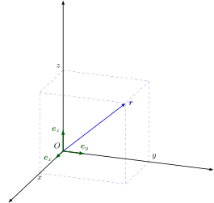
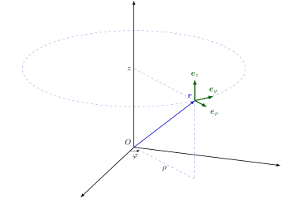
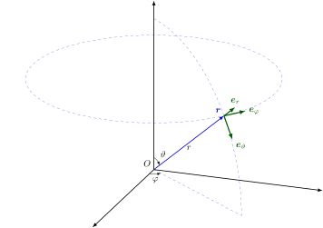

# 数学符号表 - OI Wiki

- Source: https://oi-wiki.org/intro/symbol/

# 数学符号表

本文规定了 **OI Wiki** 中数学符号的推荐写法，并给出了一些应用范例．

本文参考了 [GB/T 3102.11-1993](https://openstd.samr.gov.cn/bzgk/gb/newGbInfo?hcno=3DE79450D562E62D41CB6E79FF411054)、[ISO 80000-2:2019](https://www.iso.org/standard/64973.html) 和《具体数学》的符号表修订，故基本与国内通行教材的符号体系和 OI 场景的惯用符号体系兼容．

符号的 LaTeX 写法请参考 [本文章的源代码](https://github.com/OI-wiki/OI-wiki/blob/master/docs/intro/symbol.md?plain=1)

## 数理逻辑

编号| 符号，表达式| 意义，等同表述| 备注与示例  
---|---|---|---  
n1.1| 𝑝 ∧𝑞p∧q| 𝑝p 和 𝑞q 的合取| 𝑝p 与 𝑞q.  
n1.2| 𝑝 ∨𝑞p∨q| 𝑝p 和 𝑞q 的析取| 𝑝p 或 𝑞q;  
此处的 "或" 是包含的，即若 𝑝p，𝑞q 中有一个为真陈述，则 𝑝 ∨𝑞p∨q 为真．  
n1.3| ¬𝑝¬p| 𝑝p 的否定| 非 𝑝p.  
n1.4| 𝑝 ⟹ 𝑞p⟹q| 𝑝p 蕴含 𝑞q;  
若 𝑝p 为真，则 𝑞q 为真| 𝑞 ⟸ 𝑝q⟸p 和 𝑝 ⟹ 𝑞p⟹q 同义．  
n1.5| 𝑝 ⟺ 𝑞p⟺q| 𝑝p 等价于 𝑞q| (𝑝 ⟹ 𝑞) ∧(𝑞 ⟹ 𝑝)(p⟹q)∧(q⟹p) 和 𝑝 ⟺ 𝑞p⟺q 同义．  
n1.6| (∀ 𝑥 ∈𝐴) 𝑝(𝑥)(∀ x∈A) p(x)| 对 𝐴A 中所有的 𝑥x, 命题 𝑝(𝑥)p(x) 均为真| 如果从上下文中可以得知考虑的是哪个集合 𝐴A, 可以使用记号 (∀ 𝑥) 𝑝(𝑥)(∀ x) p(x).  
∀∀ 称为全称量词．  
𝑥 ∈𝐴x∈A 的含义见 n2.1.  
n1.7| (∃ 𝑥 ∈𝐴) 𝑝(𝑥)(∃ x∈A) p(x)| 存在一个属于 𝐴A 的 𝑥x 使得 𝑝(𝑥)p(x) 为真| 如果从上下文中可以得知考虑的是哪个集合 𝐴A, 可以使用记号 (∃ 𝑥) 𝑝(𝑥)(∃ x) p(x).  
∃∃ 称为存在量词．  
𝑥 ∈𝐴x∈A 的含义见 n2.1.  
(∃! 𝑥) 𝑝(𝑥)(∃! x) p(x)（唯一量词）用来表示恰有一个 𝑥x 使得 𝑝(𝑥)p(x) 为真．  
∃!∃! 也可以写作 ∃1∃1.  
  
## 集合论

编号| 符号，表达式| 意义，等同表述| 备注与示例  
---|---|---|---  
n2.1| 𝑥 ∈𝐴x∈A| 𝑥x 属于 𝐴A，𝑥x 是集合 𝐴A 中的元素| 𝐴 ∋𝑥A∋x 和 𝑥 ∈𝐴x∈A 同义．  
n2.2| 𝑦 ∉𝐴y∉A| 𝑦y 不属于 𝐴A，𝑦y 不是集合 𝐴A 中的元素|   
n2.3| {𝑥1,𝑥2,…,𝑥𝑛}{x1,x2,…,xn}| 含元素 𝑥1,𝑥2,…,𝑥𝑛x1,x2,…,xn 的集合| 也可写作 {𝑥𝑖 | 𝑖 ∈𝐼}{xi | i∈I}, 其中 𝐼I 表示指标集．  
n2.4| {𝑥 ∈𝐴 | 𝑝(𝑥)}{x∈A | p(x)}| 𝐴A 中使命题 𝑝(𝑥)p(x) 为真的所有元素组成的集合| 例如 {𝑥 ∈𝐑 | 𝑥 ≥5}{x∈R | x≥5};  
如果从上下文中可以得知考虑的是哪个集合 𝐴A，可以使用符号 {𝑥 | 𝑝(𝑥)}{x | p(x)}（如在只考虑实数集时可使用 {𝑥 | 𝑥 ≥5}{x | x≥5}）  
|| 也可以使用冒号替代，如 {𝑥 ∈𝐴 :𝑝(𝑥)}{x∈A:p(x)}.  
n2.5| card⁡𝐴card⁡A;  
|𝐴||A|;  
#𝐴#A| 𝐴A 中的元素个数，𝐴A 的基数|   
n2.6| ∅∅| 空集| 不应使用 ∅∅.  
n2.7| 𝐵 ⊆𝐴B⊆A| 𝐵B 包含于 𝐴A 中，𝐵B 是 𝐴A 的子集| 𝐵B 的每个元素都属于 𝐴A.  
⊂⊂ 也可用于该含义，但请参阅 n2.8 的说明．  
𝐴 ⊇𝐵A⊇B 和 𝐵 ⊆𝐴B⊆A 同义．  
n2.8| 𝐵 ⊂𝐴B⊂A| 𝐵B 真包含于 𝐴A 中，𝐵B 是 𝐴A 的真子集| 𝐵B 的每个元素都属于 𝐴A, 且 𝐴A 中至少有一个元素不属于 𝐵B.  
若 ⊂⊂ 的含义取 n2.7, 则 n2.8 对应的符号应使用 ⊊⊊.  
𝐴 ⊃𝐵A⊃B 与 𝐵 ⊂𝐴B⊂A 同义．  
n2.9| 𝐴 ∪𝐵A∪B| 𝐴A 和 𝐵B 的并集| 𝐴 ∪𝐵 :={𝑥 | 𝑥 ∈𝐴 ∨𝑥 ∈𝐵}A∪B:={x | x∈A∨x∈B};  
:=:= 的定义参见 n4.3  
n2.10| 𝐴 ∩𝐵A∩B| 𝐴A 和 𝐵B 的交集| 𝐴 ∩𝐵 :={𝑥 | 𝑥 ∈𝐴 ∧𝑥 ∈𝐵}A∩B:={x | x∈A∧x∈B};  
:=:= 的定义参见 n4.3  
n2.11| 𝑛⋃𝑖=1𝐴𝑖⋃i=1nAi| 集合 𝐴1,𝐴2,…,𝐴𝑛A1,A2,…,An 的并集| 𝑛⋃𝑖=1𝐴𝑖 =𝐴1 ∪𝐴2 ∪⋯ ∪𝐴𝑛⋃i=1nAi=A1∪A2∪⋯∪An;  
也可使用 ⋃𝑛𝑖=1⋃i=1n，⋃𝑖∈𝐼⋃i∈I，⋃𝑖∈𝐼⋃i∈I, 其中 𝐼I 表示指标集；  
进一步，令 𝑃(𝑖)P(i) 为某个与 𝑖i 相关的命题，可使用 ⋃𝑃(𝑖)𝐴𝑖⋃P(i)Ai 表示所有使 𝑃(𝑖)P(i) 为真的 𝑖i 对应的 𝐴𝑖Ai 之并集  
n2.12| 𝑛⋂𝑖=1𝐴𝑖⋂i=1nAi| 集合 𝐴1,𝐴2,…,𝐴𝑛A1,A2,…,An 的交集| 𝑛⋂𝑖=1𝐴𝑖 =𝐴1 ∩𝐴2 ∩⋯ ∩𝐴𝑛⋂i=1nAi=A1∩A2∩⋯∩An;  
也可使用 ⋂𝑛𝑖=1⋂i=1n，⋂𝑖∈𝐼⋂i∈I，⋂𝑖∈𝐼⋂i∈I, 其中 𝐼I 表示指标集；  
进一步，令 𝑃(𝑖)P(i) 为某个与 𝑖i 相关的命题，可使用 ⋂𝑃(𝑖)𝐴𝑖⋂P(i)Ai 表示所有使 𝑃(𝑖)P(i) 为真的 𝑖i 对应的 𝐴𝑖Ai 之交集  
n2.13| 𝐴 ∖𝐵A∖B| 𝐴A 和 𝐵B 的差集| 𝐴 ∖𝐵 ={𝑥 | 𝑥 ∈𝐴 ∧𝑥 ∉𝐵}A∖B={x | x∈A∧x∉B};  
不应使用 𝐴 −𝐵A−B;  
当 𝐵B 是 𝐴A 的子集时也可使用 ∁𝐴𝐵∁AB, 如果从上下文中可以得知考虑的是哪个集合 𝐴A，则 𝐴A 可以省略．  
不引起歧义的情况下也可使用 ――𝐵B― 表示集合 𝐵B 的补集．  
n2.14| (𝑎,𝑏)(a,b)| 有序数对 𝑎a，𝑏b;  
有序偶 𝑎a，𝑏b| (𝑎,𝑏) =(𝑐,𝑑)(a,b)=(c,d) 当且仅当 𝑎 =𝑐a=c 且 𝑏 =𝑑b=d.  
n2.15| (𝑎1,𝑎2,…,𝑎𝑛)(a1,a2,…,an)| 有序 𝑛n 元组| 参见 n2.14.  
n2.16| 𝐴 ×𝐵A×B| 集合 𝐴A 和 𝐵B 的笛卡尔积| 𝐴 ×𝐵 ={(𝑥,𝑦) | 𝑥 ∈𝐴 ∧𝑦 ∈𝐵}A×B={(x,y) | x∈A∧y∈B}.  
n2.17| 𝑛∏𝑖=1𝐴𝑖∏i=1nAi| 集合 𝐴1,𝐴2,…,𝐴𝑛A1,A2,…,An 的笛卡尔积| 𝑛∏𝑖=1𝐴𝑖 ={(𝑥1,𝑥2,…,𝑥𝑛) | 𝑥1 ∈𝐴1,𝑥2 ∈𝐴2,…,𝑥𝑛 ∈𝐴𝑛}∏i=1nAi={(x1,x2,…,xn) | x1∈A1,x2∈A2,…,xn∈An};  
𝐴 ×𝐴 ×⋯ ×𝐴A×A×⋯×A 记为 𝐴𝑛An, 其中 𝑛n 是乘积中的因子数；  
该符号的另一种用法参见 n6.8  
n2.18| id𝐴idA| 𝐴 ×𝐴A×A 的对角集| id𝐴 ={(𝑥,𝑥) | 𝑥 ∈𝐴}idA={(x,x) | x∈A};  
如果从上下文中可以得知考虑的是哪个集合 𝐴A, 则 𝐴A 可以省略．  
n2.19| 𝟏𝐴1A| 指示函数| 𝟏𝐴(𝑎) =[𝑎 ∈𝐴]1A(a)=[a∈A]，[ ⋅][⋅] 的定义参见 n6.24．  
n2.20| P(𝐴)P(A);  
2𝐴2A| 幂集| P(𝐴) ={𝑆 :𝑆 ⊆𝐴}P(A)={S:S⊆A}  
  
## 标准数集和区间

编号| 符号，表达式| 意义，等同表述| 备注与示例  
---|---|---|---  
n3.1| 𝐍N| 自然数集| 𝐍 ={0,1,2,3,…}N={0,1,2,3,…};  
𝐍∗ =𝐍+ ={1,2,3,…}N∗=N+={1,2,3,…};  
可用如下方式添加其他限制：𝐍>5 ={𝑛 ∈𝐍 | 𝑛 >5}N>5={n∈N | n>5};  
也可使用 ℕN.  
n3.2| 𝐙Z| 整数集| 𝐙∗ =𝐙+ ={𝑛 ∈𝐙 | 𝑛 ≠0}Z∗=Z+={n∈Z | n≠0};  
可用如下方式添加其他限制：𝐙>−3 ={𝑛 ∈𝐙 | 𝑛 > −3}Z>−3={n∈Z | n>−3};  
也可使用 ℤZ.  
n3.3| 𝐐Q| 有理数集| 𝐐∗ =𝐐+ ={𝑟 ∈𝐐 | 𝑟 ≠0}Q∗=Q+={r∈Q | r≠0};  
可用如下方式添加其他限制：𝐐<0 ={𝑟 ∈𝐐 | 𝑟 <0}Q<0={r∈Q | r<0};  
也可使用 ℚQ.  
n3.4| 𝐑R| 实数集| 𝐑∗ =𝐑+ ={𝑥 ∈𝐑 | 𝑥 ≠0}R∗=R+={x∈R | x≠0};  
可用如下方式添加其他限制：𝐑>0 ={𝑥 ∈𝐑 | 𝑥 >0}R>0={x∈R | x>0};  
也可使用 ℝR.  
n3.5| 𝐂C| 复数集| 𝐂∗ =𝐂+ ={𝑧 ∈𝐂 | 𝑧 ≠0}C∗=C+={z∈C | z≠0};  
也可使用 ℂC.  
n3.6| 𝐏P| （正）素数集| 𝐏 ={2,3,5,7,11,13,17,…}P={2,3,5,7,11,13,17,…};  
也可使用 ℙP.  
n3.7| [𝑎,𝑏][a,b]| 𝑎a 到 𝑏b 的闭区间| [𝑎,𝑏] ={𝑥 ∈𝐑 | 𝑎 ≤𝑥 ≤𝑏}[a,b]={x∈R | a≤x≤b}.  
n3.8| (𝑎,𝑏](a,b]| 𝑎a 到 𝑏b 的左开右闭区间| (𝑎,𝑏] ={𝑥 ∈𝐑 | 𝑎 <𝑥 ≤𝑏}(a,b]={x∈R | a<x≤b};  
( −∞,𝑏] ={𝑥 ∈𝐑 | 𝑥 ≤𝑏}(−∞,b]={x∈R | x≤b}.  
n3.9| [𝑎,𝑏)[a,b)| 𝑎a 到 𝑏b 的左闭右开区间| [𝑎,𝑏) ={𝑥 ∈𝐑 | 𝑎 ≤𝑥 <𝑏}[a,b)={x∈R | a≤x<b};  
[𝑎, +∞) ={𝑥 ∈𝐑 | 𝑎 ≤𝑥}[a,+∞)={x∈R | a≤x}.  
n3.10| (𝑎,𝑏)(a,b)| 𝑎a 到 𝑏b 的开区间| (𝑎,𝑏) ={𝑥 ∈𝐑 | 𝑎 <𝑥 <𝑏}(a,b)={x∈R | a<x<b};  
( −∞,𝑏) ={𝑥 ∈𝐑 | 𝑥 <𝑏}(−∞,b)={x∈R | x<b};  
(𝑎, +∞) ={𝑥 ∈𝐑 | 𝑎 <𝑥}(a,+∞)={x∈R | a<x}.  
  
## 关系

编号| 符号，表达式| 意义，等同表述| 备注与示例  
---|---|---|---  
n4.1| 𝑎 =𝑏a=b| 𝑎a 等于 𝑏b| ≡≡ 用于强调某等式是恒等式  
该符号的另一个含义参见 n4.18.  
n4.2| 𝑎 ≠𝑏a≠b| 𝑎a 不等于 𝑏b|   
n4.3| 𝑎 :=𝑏a:=b| 𝑎a 定义为 𝑏b| 参见 n2.9,n2.10  
n4.4| 𝑎 ≈𝑏a≈b| 𝑎a 约等于 𝑏b| 不排除相等．  
n4.5| 𝑎 ≃𝑏a≃b| 𝑎a 渐近等于 𝑏b| 例如：  
当 𝑥 →𝑎x→a 时，1sin⁡(𝑥−𝑎) ≃1𝑥−𝑎1sin⁡(x−a)≃1x−a;  
𝑥 →𝑎x→a 的含义参见 n4.15.  
n4.6| 𝑎 ∝𝑏a∝b| 𝑎a 与 𝑏b 成正比| 也可使用 𝑎 ∼𝑏a∼b.  
∼∼ 也用于表示等价关系．  
n4.7| 𝑀 ≅𝑁M≅N| 𝑀M 与 𝑁N 全等| 当 𝑀M 和 𝑁N 是点集（几何图形）时．  
该符号也用于表示代数结构的同构．  
n4.8| 𝑎 <𝑏a<b| 𝑎a 小于 𝑏b|   
n4.9| 𝑏 >𝑎b>a| 𝑏b 大于 𝑎a|   
n4.10| 𝑎 ≤𝑏a≤b| 𝑎a 小于等于 𝑏b|   
n4.11| 𝑏 ≥𝑎b≥a| 𝑏b 大于等于 𝑎a|   
n4.12| 𝑎 ≪𝑏a≪b| 𝑎a 远小于 𝑏b|   
n4.13| 𝑏 ≫𝑎b≫a| 𝑏b 远大于 𝑎a|   
n4.14| ∞∞| 无穷大| 该符号 **不** 是数字．  
也可以使用 +∞+∞，−∞−∞.  
n4.15| 𝑥 →𝑎x→a| 𝑥x 趋近于 𝑎a| 一般出现在极限表达式中．  
𝑎a 也可以为 ∞∞，+∞+∞，−∞−∞.  
n4.16| 𝑚 ∣𝑛m∣n| 𝑚m 整除 𝑛n| 对整数 𝑚m，𝑛n:  
(∃ 𝑘 ∈𝐙) 𝑚 ⋅𝑘 =𝑛(∃ k∈Z) m⋅k=n.  
n4.17| 𝑚 ⟂𝑛m⟂n| 𝑚m 与 𝑛n 互质| 对整数 𝑚m，𝑛n:  
(∄ 𝑘 ∈𝐙>1) (𝑘 ∣𝑚) ∧(𝑘 ∣𝑛)(∄ k∈Z>1) (k∣m)∧(k∣n);  
该符号的另一种用法参见 n5.2  
n4.18| 𝑛 ≡𝑘(mod𝑚)n≡k(modm)| 𝑛n 模 𝑚m 与 𝑘k 同余| 对整数 𝑛n，𝑘k，𝑚m:  
𝑚 ∣(𝑛 −𝑘)m∣(n−k);  
不要与 n4.1 中提到的相混淆．  
  
## 初等几何学

编号| 符号，表达式| 意义，等同表述| 备注与示例  
---|---|---|---  
n5.1| ∥∥| 平行|   
n5.2| ⟂⟂| 垂直| 该符号的另一种用法参见 n4.17  
n5.3| ∠∠| （平面）角|   
n5.4| ―――ABAB―| 线段 ABAB|   
n5.5| ⟶ABAB→| 有向线段 ABAB|   
n5.6| 𝑑(A,B)d(A,B)| 点 AA 和 BB 之间的距离| 即 ―――ABAB― 的长度．  
  
## 运算符

编号| 符号，表达式| 意义，等同表述| 备注与示例  
---|---|---|---  
n6.1| 𝑎 +𝑏a+b| 𝑎a 加 𝑏b|   
n6.2| 𝑎 −𝑏a−b| 𝑎a 减 𝑏b|   
n6.3| 𝑎 ±𝑏a±b| 𝑎a 加或减 𝑏b|   
n6.4| 𝑎 ∓𝑏a∓b| 𝑎a 减或加 𝑏b| −(𝑎 ±𝑏) = −𝑎 ∓𝑏−(a±b)=−a∓b.  
n6.5| 𝑎 ⋅𝑏a⋅b;  
𝑎 ×𝑏a×b;  
𝑎𝑏ab| 𝑎a 乘 𝑏b| 若出现小数点，则应只使用 ××;  
部分用例参见 n2.16,n2.17,n14.11,n14.12  
n6.6| 𝑎𝑏ab;  
𝑎/𝑏a/b;  
𝑎 :𝑏a:b| 𝑎a 除以 𝑏b| 𝑎𝑏 =𝑎 ⋅𝑏−1ab=a⋅b−1;  
可用 :: 表示同一量纲的数值的比率．  
不应使用 ÷÷.  
n6.7| 𝑛∑𝑖=1𝑎𝑖∑i=1nai| 𝑎1 +𝑎2 +⋯ +𝑎𝑛a1+a2+⋯+an| 也可使用 ∑𝑛𝑖=1𝑎𝑖∑i=1nai，∑𝑖𝑎𝑖∑iai，∑𝑖𝑎𝑖∑iai，∑𝑎𝑖∑ai；  
令 𝑃(𝑖)P(i) 为某个与 𝑖i 相关的命题，可使用 ∑𝑃(𝑖)𝑎𝑖∑P(i)ai 表示所有使 𝑃(𝑖)P(i) 为真的 𝑖i 对应的 𝑎𝑖ai 之和．  
n6.8| 𝑛∏𝑖=1𝑎𝑖∏i=1nai| 𝑎1 ⋅𝑎2 ⋅⋯ ⋅𝑎𝑛a1⋅a2⋅⋯⋅an| 也可使用 ∏𝑛𝑖=1𝑎𝑖∏i=1nai，∏𝑖𝑎𝑖∏iai，∏𝑖𝑎𝑖∏iai，∏𝑎𝑖∏ai；  
令 𝑃(𝑖)P(i) 为某个与 𝑖i 相关的命题，可使用 ∏𝑃(𝑖)𝑎𝑖∏P(i)ai 表示所有使 𝑃(𝑖)P(i) 为真的 𝑖i 对应的 𝑎𝑖ai 之积；  
该符号的另一种用法参见 n2.17  
n6.9| 𝑎𝑝ap| 𝑎a 的 𝑝p 次幂|   
n6.10| 𝑎1/2a1/2;  
√𝑎a| 𝑎a 的 1/21/2 次方，𝑎a 的平方根| 应避免使用 √𝑎a.  
n6.11| 𝑎1/𝑛a1/n;  
𝑛√𝑎an| 𝑎a 的 1/𝑛1/n 次幂，𝑎a 的 𝑛n 次根| 应避免使用 𝑛√𝑎na.  
n6.12| ¯𝑥x¯;  
¯𝑥𝑎x¯a| 𝑥x 的算数均值| 其他均值有：  
调和均值 ¯𝑥ℎx¯h;  
几何均值 ¯𝑥𝑔x¯g;  
二次均值/均方根 ¯𝑥𝑞x¯q 或 ¯𝑥𝑟𝑚𝑠x¯rms.  
¯𝑥x¯ 也用于表示复数 𝑥x 的共轭，参见 n11.6.  
n6.13| sgn⁡𝑎sgn⁡a| 𝑎a 的符号函数| 对实数 𝑎a:  
sgn⁡𝑎 =1 (𝑎 >0)sgn⁡a=1(a>0);  
sgn⁡𝑎 = −1 (𝑎 <0)sgn⁡a=−1(a<0);  
sgn⁡0 =0sgn⁡0=0;  
参见 n11.7.  
n6.14| inf𝑀infM| 𝑀M 的下确界| 小于等于非空集合 𝑀M 中元素的最大上界．  
n6.15| sup𝑀supM| 𝑀M 的上确界| 大于等于非空集合 𝑀M 中元素的最小下界．  
n6.16| |𝑎||a|| 𝑎a 的绝对值| 也可使用 abs⁡𝑎abs⁡a.  
n6.17| ⌊𝑎⌋⌊a⌋| 向下取整  
小于等于实数 𝑎a 的最大整数| 例如：  
⌊2.4⌋ =2⌊2.4⌋=2;  
⌊ −2.4⌋ = −3⌊−2.4⌋=−3.  
n6.18| ⌈𝑎⌉⌈a⌉| 向上取整  
大于等于实数 𝑎a 的最小整数| 例如：  
⌈2.4⌉ =3⌈2.4⌉=3;  
⌈ −2.4⌉ = −2⌈−2.4⌉=−2.  
n6.19| min(𝑎,𝑏)min(a,b);  
min{𝑎,𝑏}min{a,b}| 𝑎a 和 𝑏b 的最小值| 可推广到有限集中．  
要表示无限集中的最小值建议使用 infinf, 参见 n6.14  
n6.20| max(𝑎,𝑏)max(a,b);  
max{𝑎,𝑏}max{a,b}| 𝑎a 和 𝑏b 的最大值| 可推广到有限集中．  
要表示无限集中的最大值建议使用 supsup, 参见 n6.15  
n6.21| 𝑛mod𝑚nmodm| 𝑛n 模 𝑚m 的余数| 对正整数 𝑛n，𝑚m:  
(∃ 𝑞 ∈𝐍,𝑟 ∈[0,𝑚)) 𝑛 =𝑞𝑚 +𝑟(∃ q∈N,r∈[0,m)) n=qm+r;  
其中 𝑟 =𝑛mod𝑚r=nmodm.  
n6.22| gcd(𝑎,𝑏)gcd(a,b);  
gcd{𝑎,𝑏}gcd{a,b}| 整数 𝑎a 和 𝑏b 的最大公因数| 可推广到有限集中．不引起歧义的情况下可写为 (𝑎,𝑏)(a,b).  
n6.23| lcm⁡(𝑎,𝑏)lcm⁡(a,b);  
lcm⁡{𝑎,𝑏}lcm⁡{a,b}| 整数 𝑎a 和 𝑏b 的最小公倍数| 可推广到有限集中．不引起歧义的情况下可写为 [𝑎,𝑏][a,b];  
(𝑎,𝑏)[𝑎,𝑏] =|𝑎𝑏|(a,b)[a,b]=|ab|.  
n6.24| [𝑃][P]| Iverson 括号| 若命题 𝑃P 为真，则 [𝑃] =1[P]=1，否则 [𝑃] =0[P]=0．  
n6.25| 𝑎 ↑𝑏a↑b；  
𝑎 ↑𝑛𝑏a↑nb| Knuth 箭头| 对非负整数 𝑎,𝑏,𝑛a,b,n：  
𝑎 ↑𝑛𝑏 =𝑎 ↑⋯↑⏟𝑛 times 𝑏a↑nb=a ↑⋯↑⏟n times b；  
𝑎 ↑0𝑏 =𝑎𝑏a↑0b=ab；  
𝑎 ↑1𝑏 =𝑎 ↑𝑏 =𝑎𝑏a↑1b=a↑b=ab；  
𝑎 ↑𝑛0 =1 (𝑛 >0)a↑n0=1(n>0)；  
𝑎 ↑𝑛𝑏 =𝑎 ↑𝑛−1(𝑎 ↑𝑛(𝑏 −1))a↑nb=a↑n−1(a↑n(b−1)).  
n6.26| [𝑥𝑛]𝑓(𝑥)[xn]f(x)| 多项式/形式幂级数/形式 Laurent 级数 𝑓(𝑥)f(x) 中 𝑥𝑛xn 项的系数| 若 𝑓(𝑥) =∑𝑖𝑎𝑖𝑥𝑖f(x)=∑iaixi，则 [𝑥𝑛]𝑓(𝑥) =𝑎𝑛[xn]f(x)=an；  
可推广到多元情况，如若 𝑓(𝑥,𝑦) =∑𝑖,𝑗𝑎𝑖,𝑗𝑥𝑖𝑦𝑗f(x,y)=∑i,jai,jxiyj，则 [𝑥𝑛𝑦𝑚]𝑓(𝑥,𝑦) =𝑎𝑛,𝑚[xnym]f(x,y)=an,m.  
  
## 组合数学

本节中的 𝑛n 和 𝑘k 是自然数，𝑎a 是复数，且 𝑘 ≤𝑛k≤n.

编号| 符号，表达式| 意义，等同表述| 备注与示例  
---|---|---|---  
n7.1| 𝑛!n!| 阶乘| 𝑛! =∏𝑛𝑘=1𝑘 =1 ⋅2 ⋅3 ⋅⋯ ⋅𝑛 (𝑛 >0)n!=∏k=1nk=1⋅2⋅3⋅⋯⋅n(n>0);  
0! =10!=1.  
n7.2| 𝑎𝑘――ak―;  
(𝑎)−𝑘(a)−k| 下降阶乘幂| 𝑎𝑘―― =𝑎 ⋅(𝑎 −1) ⋅⋯ ⋅(𝑎 −𝑘 +1) (𝑘 >0)ak―=a⋅(a−1)⋅⋯⋅(a−k+1)(k>0);  
𝑎0―― =1a0―=1;  
𝑛𝑘―― =𝑛!(𝑛−𝑘)!nk―=n!(n−k)!.  
n7.3| 𝑎――𝑘ak―;  
(𝑎)+𝑘(a)+k| 上升阶乘幂| 𝑎――𝑘 =𝑎 ⋅(𝑎 +1) ⋅⋯ ⋅(𝑎 +𝑘 −1) (𝑘 >0)ak―=a⋅(a+1)⋅⋯⋅(a+k−1)(k>0);  
𝑎――0 =1a0―=1;  
𝑛――𝑘 =(𝑛+𝑘−1)!(𝑛−1)!nk―=(n+k−1)!(n−1)!.  
n7.4| (𝑛𝑘)(nk)| 组合数| (𝑛𝑘) =𝑛!𝑘!(𝑛−𝑘)!(nk)=n!k!(n−k)!.  
n7.5| [𝑛𝑘][nk]| 第一类 Stirling 数| [𝑛+1𝑘] =𝑛[𝑛𝑘] +[𝑛𝑘−1][n+1k]=n[nk]+[nk−1];  
𝑥――𝑛 =𝑛∑𝑘=0[𝑛𝑘]𝑥𝑘xn―=∑k=0n[nk]xk.  
n7.6| {𝑛𝑘}{nk}| 第二类 Stirling 数| {𝑛𝑘} =1𝑘!𝑘∑𝑖=0( −1)𝑖(𝑘𝑖)(𝑘 −𝑖)𝑛{nk}=1k!∑i=0k(−1)i(ki)(k−i)n;  
𝑛∑𝑘=0{𝑛𝑘}𝑥𝑘―― =𝑥𝑛∑k=0n{nk}xk―=xn.  
  
## 函数

编号| 符号，表达式| 意义，等同表述| 备注与示例  
---|---|---|---  
n8.1| 𝑓f| 函数|   
n8.2| 𝑓(𝑥)f(x)，𝑓(𝑥1,…,𝑥𝑛)f(x1,…,xn)| 函数 𝑓f 在 𝑥x 处的值  
函数 𝑓f 在 (𝑥1,…,𝑥𝑛)(x1,…,xn) 处的值|   
n8.3| dom⁡𝑓dom⁡f| 𝑓f 的定义域| 也可使用 D(𝑓)D(f).  
n8.4| ran⁡𝑓ran⁡f| 𝑓f 的值域| 也可使用 R(𝑓)R(f).  
n8.5| 𝑓 :𝐴 →𝐵f:A→B| 𝑓f 是 𝐴A 到 𝐵B 的映射| dom⁡𝑓 =𝐴dom⁡f=A 且 (∀ 𝑥 ∈dom⁡𝑓) 𝑓(𝑥) ∈𝐵(∀ x∈dom⁡f) f(x)∈B.  
n8.6| 𝑥 ↦𝑇(𝑥),𝑥 ∈𝐴x↦T(x),x∈A| 将所有 𝑥 ∈𝐴x∈A 映射到 𝑇(𝑥)T(x) 的函数| 𝑇(𝑥)T(x) 仅用于定义，用来表示某个参数为 𝑥 ∈𝐴x∈A 的某个函数值．若这个函数为 𝑓f, 则对所有 𝑥 ∈𝐴x∈A 均有 𝑓(𝑥) =𝑇(𝑥)f(x)=T(x). 因此 𝑇(𝑥)T(x) 通常用来定义函数 𝑓f.  
例如：  
𝑥 ↦3𝑥2𝑦,𝑥 ∈[0,2]x↦3x2y,x∈[0,2];  
这是由 3𝑥2𝑦3x2y 定义的一个关于 𝑥x 的二次函数．若未引入函数符号，则用 3𝑥2𝑦3x2y 表示该函数  
n8.7| 𝑓−1f−1| 𝑓f 的反函数| 函数 𝑓f 的反函数 𝑓−1f−1 有定义当且仅当 𝑓f 是单射．  
若 𝑓f 是单射，则 dom⁡(𝑓−1) =ran⁡𝑓dom⁡(f−1)=ran⁡f，ran⁡(𝑓−1) =dom⁡𝑓ran⁡(f−1)=dom⁡f, 且 (∀ 𝑥 ∈dom⁡𝑓) 𝑓−1(𝑓(𝑥)) =𝑥(∀ x∈dom⁡f) f−1(f(x))=x.  
不要与函数的倒数 𝑓(𝑥)−1f(x)−1 混淆．  
n8.8| 𝑔 ∘𝑓g∘f| 𝑓f 和 𝑔g 的复合函数| (𝑔 ∘𝑓)(𝑥) =𝑔(𝑓(𝑥))(g∘f)(x)=g(f(x)).  
n8.9| 𝑓 :𝑥 ↦𝑦f:x↦y| 𝑓(𝑥) =𝑦f(x)=y，𝑓f 将 𝑥x 映射到 𝑦y|   
n8.10| 𝑓|𝑏𝑎f|ab;  
𝑓(…,𝑢,…)|𝑢=𝑏𝑢=𝑎f(…,u,…)|u=au=b| 𝑓(𝑏) −𝑓(𝑎)f(b)−f(a);  
𝑓(…,𝑏,…) −𝑓(…,𝑎,…)f(…,b,…)−f(…,a,…)| 主要用于定积分的计算中．  
n8.11| lim𝑥→𝑎𝑓(𝑥)limx→af(x);  
lim𝑥→𝑎𝑓(𝑥)limx→af(x)| 当 𝑥x 趋近于 𝑎a 时 𝑓(𝑥)f(x) 的极限| lim𝑥→𝑎𝑓(𝑥) =𝑏limx→af(x)=b 可以写成 𝑓(𝑥) →𝑏 (𝑥 →𝑎)f(x)→b(x→a).  
右极限和左极限的符号分别为 lim𝑥→𝑎+𝑓(𝑥)limx→a+f(x) 和  
lim𝑥→𝑎−𝑓(𝑥)limx→a−f(x).  
n8.12| 𝑓(𝑥) =𝑂(𝑔(𝑥))f(x)=O(g(x))| |𝑓(𝑥)/𝑔(𝑥)||f(x)/g(x)| 在上下文隐含的限制中有上界，𝑓(𝑥)f(x) 的阶不高于 𝑔(𝑥)g(x)| 当 𝑓/𝑔f/g 与 𝑔/𝑓g/f 均有界时称 𝑓f 与 𝑔g 是同阶的．  
使用符号 "==" 是出于历史原因，其在此处不表示等价，因为不满足传递性．  
例如：  
sin⁡𝑥 =𝑂(𝑥) (𝑥 →0)sin⁡x=O(x)(x→0).  
n8.13| 𝑓(𝑥) =𝑜(𝑔(𝑥))f(x)=o(g(x))| 在上下文隐含的限制中有 𝑓(𝑥)/𝑔(𝑥) →0f(x)/g(x)→0，𝑓(𝑥)f(x) 的阶高于 𝑔(𝑥)g(x)| 使用符号 "==" 是出于历史原因，其在此处不表示等价，因为不满足传递性．  
例如：  
cos⁡𝑥 =1 +𝑜(𝑥) (𝑥 →0)cos⁡x=1+o(x)(x→0).  
n8.14| Δ𝑓Δf| 𝑓f 的有限增量| 上下文隐含的两函数值的差分．例如：  
Δ𝑥 =𝑥2 −𝑥1Δx=x2−x1;  
Δ𝑓(𝑥) =𝑓(𝑥2) −𝑓(𝑥1)Δf(x)=f(x2)−f(x1).  
n8.15| d𝑓d𝑥dfdx;  
𝑓′f′| 𝑓f 对 𝑥x 的导（函）数| 仅用于一元函数．  
可以显式指明自变量，如 d𝑓(𝑥)d𝑥df(x)dx，𝑓′(𝑥)f′(x).  
n8.16| (d𝑓d𝑥)𝑥=𝑎(dfdx)x=a;  
𝑓′(𝑎)f′(a)| 𝑓f 在 𝑎a 处的导（函）数值| 参见 n8.15  
n8.17| d𝑛𝑓d𝑥𝑛dnfdxn;  
𝑓(𝑛)f(n)| 𝑓f 对 𝑥x 的 𝑛n 阶导（函）数| 仅用于一元函数．  
可以显式指明自变量，如 d𝑛𝑓(𝑥)d𝑥𝑛dnf(x)dxn，𝑓(𝑛)(𝑥)f(n)(x).  
可用 𝑓″f″ 和 𝑓‴f‴ 分别表示 𝑓(2)f(2) 和 𝑓(3)f(3).  
n8.18| 𝜕𝑓𝜕𝑥∂f∂x;  
𝑓𝑥fx| 𝑓f 对 𝑥x 的偏导数| 仅用于多元函数．  
可以显式指明自变量，如 𝜕𝑓(𝑥,𝑦,…)𝜕𝑥∂f(x,y,…)∂x，𝑓𝑥(𝑥,𝑦,…)fx(x,y,…).  
可以扩展到高阶，如 𝑓𝑥𝑥 =𝜕2𝑓𝜕𝑥2 =𝜕𝜕𝑥(𝜕𝑓𝜕𝑥)fxx=∂2f∂x2=∂∂x(∂f∂x);  
𝑓𝑥𝑦 =𝜕2𝑓𝜕𝑦𝜕𝑥 =𝜕𝜕𝑦(𝜕𝑓𝜕𝑥)fxy=∂2f∂y∂x=∂∂y(∂f∂x).  
n8.19| 𝜕(𝑓1,…,𝑓𝑚)𝜕(𝑥1,…,𝑥𝑛)∂(f1,…,fm)∂(x1,…,xn)| Jacobi 矩阵|  _参见_1  
n8.20| d𝑓df| 𝑓f 的全微分| d𝑓(𝑥,𝑦,…) =𝜕𝑓𝜕𝑥d𝑥 +𝜕𝑓𝜕𝑦d𝑦 +…df(x,y,…)=∂f∂xdx+∂f∂ydy+….  
n8.21| 𝛿𝑓δf| 𝑓f 的（无穷小）变分|   
n8.22| ∫𝑓(𝑥)d𝑥∫f(x)dx| 𝑓f 的不定积分|   
n8.23| 𝑏∫𝑎𝑓(𝑥)d𝑥∫abf(x)dx| 𝑓f 从 𝑎a 到 𝑏b 的定积分| 也可使用 ∫𝑏𝑎𝑓(𝑥)d𝑥∫abf(x)dx;  
定积分还可以定义在更一般的域上．如 ∫𝐶∫C，∫𝑆∫S，∫𝑉∫V，∮∮, 分别表示在曲线 𝐶C, 曲面 𝑆S, 三维区域 𝑉V, 和闭曲线或曲面上的定积分．  
多重积分可写成 ∬∬，∭∭ 等．  
n8.24| 𝑓 ∗𝑔f∗g| 函数 𝑓f 和 𝑔g 的卷积| (𝑓 ∗𝑔)(𝑥) =∞∫−∞𝑓(𝑦)𝑔(𝑥 −𝑦)d𝑦(f∗g)(x)=∫−∞∞f(y)g(x−y)dy.  
  
## 指数和对数函数

𝑥x 可以是复数．

编号| 符号，表达式| 意义，等同表述| 备注与示例  
---|---|---|---  
n9.1| ee| 自然对数的底| e =lim𝑛→∞(1+1𝑛)𝑛 =2.718 281 8…e=limn→∞(1+1n)n=2.718 281 8…;  
不要写成 𝑒e.  
n9.2| 𝑎𝑥ax| 𝑥x 的指数函数（以 𝑎a 为底）| 参见 n6.9.  
n9.3| e𝑥ex;  
exp⁡𝑥exp⁡x| 𝑥x 的指数函数（以 ee 为底）|   
n9.4| log𝑎⁡𝑥loga⁡x| 𝑥x 的以 𝑎a 为底的对数| 当底数不需要指定的时候可以使用 log⁡𝑥log⁡x.  
不应用 log⁡𝑥log⁡x 替换 ln⁡𝑥ln⁡x，lg⁡𝑥lg⁡x，lb⁡𝑥lb⁡x 中的任意一个．  
n9.5| ln⁡𝑥ln⁡x| 𝑥x 的自然对数| ln⁡𝑥 =loge⁡𝑥ln⁡x=loge⁡x;  
参见 n9.4.  
n9.6| lg⁡𝑥lg⁡x| 𝑥x 的常用对数| lg⁡𝑥 =log10⁡𝑥lg⁡x=log10⁡x;  
参见 n9.4.  
n9.7| lb⁡𝑥lb⁡x| 𝑥x 的以 22 为底的对数| lb⁡𝑥 =log2⁡𝑥lb⁡x=log2⁡x;  
参见 n9.4.  
  
## 三角函数和双曲函数

编号| 符号，表达式| 意义，等同表述| 备注与示例  
---|---|---|---  
n10.1| 𝜋π| 圆周率| 𝜋 =3.141 592 6…π=3.141 592 6….  
n10.2| sin⁡𝑥sin⁡x| 𝑥x 的正弦| sin⁡𝑥 =ei𝑥−e−i𝑥2isin⁡x=eix−e−ix2i;  
(sin⁡𝑥)𝑛(sin⁡x)n，(cos⁡𝑥)𝑛(cos⁡x)n(𝑛 ≥2n≥2) 等通常写为 sin𝑛⁡𝑥sinn⁡x，cos𝑛⁡𝑥cosn⁡x 等．  
n10.3| cos⁡𝑥cos⁡x| 𝑥x 的余弦| cos⁡𝑥 =sin⁡(𝑥+𝜋/2)cos⁡x=sin⁡(x+π/2).  
n10.4| tan⁡𝑥tan⁡x| 𝑥x 的正切| tan⁡𝑥 =sin⁡𝑥/cos⁡𝑥tan⁡x=sin⁡x/cos⁡x;  
不可使用 tg⁡𝑥tg⁡x.  
n10.5| cot⁡𝑥cot⁡x| 𝑥x 的余切| cot⁡𝑥 =1/tan⁡𝑥cot⁡x=1/tan⁡x;  
不可使用 ctg⁡𝑥ctg⁡x.  
n10.6| sec⁡𝑥sec⁡x| 𝑥x 的正割| sec⁡𝑥 =1/cos⁡𝑥sec⁡x=1/cos⁡x.  
n10.7| csc⁡𝑥csc⁡x| 𝑥x 的余割| csc⁡𝑥 =1/sin⁡𝑥csc⁡x=1/sin⁡x;  
不可使用 cosec⁡𝑥cosec⁡x.  
n10.8| arcsin⁡𝑥arcsin⁡x| 𝑥x 的反正弦| 𝑦 =arcsin⁡𝑥 ⟺ 𝑥 =sin⁡𝑦 ( −𝜋/2 ≤𝑦 ≤𝜋/2)y=arcsin⁡x⟺x=sin⁡y(−π/2≤y≤π/2).  
n10.9| arccos⁡𝑥arccos⁡x| 𝑥x 的反余弦| 𝑦 =arccos⁡𝑥 ⟺ 𝑥 =cos⁡𝑦 (0 ≤𝑦 ≤𝜋)y=arccos⁡x⟺x=cos⁡y(0≤y≤π).  
n10.10| arctan⁡𝑥arctan⁡x| 𝑥x 反正切| 𝑦 =arctan⁡𝑥 ⟺ 𝑥 =tan⁡𝑦 ( −𝜋/2 ≤𝑦 ≤𝜋/2)y=arctan⁡x⟺x=tan⁡y(−π/2≤y≤π/2);  
不可使用 arctg⁡𝑥arctg⁡x.  
n10.11| arccot⁡𝑥arccot⁡x| 𝑥x 反余切| 𝑦 =arccot⁡𝑥 ⟺ 𝑥 =cot⁡𝑦 (0 ≤𝑦 ≤𝜋)y=arccot⁡x⟺x=cot⁡y(0≤y≤π);  
不可使用 arcctg⁡𝑥arcctg⁡x.  
n10.12| arcsec⁡𝑥arcsec⁡x| 𝑥x 反正割| 𝑦 =arcsec⁡𝑥 ⟺ 𝑥 =sec⁡𝑦 (0 ≤𝑦 ≤𝜋,𝑦 ≠𝜋/2)y=arcsec⁡x⟺x=sec⁡y(0≤y≤π,y≠π/2).  
n10.13| arccsc⁡𝑥arccsc⁡x| 𝑥x 的反余割| 𝑦 =arccsc⁡𝑥 ⟺ 𝑥 =csc⁡𝑦 ( −𝜋/2 ≤𝑦 ≤𝜋/2,𝑦 ≠0)y=arccsc⁡x⟺x=csc⁡y(−π/2≤y≤π/2,y≠0);  
不可使用 arccosec⁡𝑥arccosec⁡x.  
n10.14| sinh⁡𝑥sinh⁡x| 𝑥x 的双曲正弦| sinh⁡𝑥 =e𝑥−e−𝑥2sinh⁡x=ex−e−x2;  
不可使用 sh⁡𝑥sh⁡x.  
n10.15| cosh⁡𝑥cosh⁡x| 𝑥x 的双曲余弦| cosh2⁡𝑥 =sinh2⁡𝑥 +1cosh2⁡x=sinh2⁡x+1;  
不可使用 ch⁡𝑥ch⁡x.  
n10.16| tanh⁡𝑥tanh⁡x| 𝑥x 的双曲正切| tanh⁡𝑥 =sinh⁡𝑥/cosh⁡𝑥tanh⁡x=sinh⁡x/cosh⁡x;  
不可使用 th⁡𝑥th⁡x.  
n10.17| coth⁡𝑥coth⁡x| 𝑥x 的双曲余切| coth⁡𝑥 =1/tanh⁡𝑥coth⁡x=1/tanh⁡x.  
n10.18| sech⁡𝑥sech⁡x| 𝑥x 的双曲正割| sech⁡𝑥 =1/cosh⁡𝑥sech⁡x=1/cosh⁡x.  
n10.19| csch⁡𝑥csch⁡x| 𝑥x 的双曲余割| csch⁡𝑥 =1/sinh⁡𝑥csch⁡x=1/sinh⁡x;  
不可使用 cosech⁡𝑥cosech⁡x.  
n10.20| arsinh⁡𝑥arsinh⁡x| 𝑥x 的反双曲正弦| 𝑦 =arsinh⁡𝑥 ⟺ 𝑥 =sinh⁡𝑦y=arsinh⁡x⟺x=sinh⁡y;  
不可使用 arsh⁡𝑥arsh⁡x.  
n10.21| arcosh⁡𝑥arcosh⁡x| 𝑥x 的反双曲余弦| 𝑦 =arcosh⁡𝑥 ⟺ 𝑥 =cosh⁡𝑦 (𝑦 ≥0)y=arcosh⁡x⟺x=cosh⁡y(y≥0);  
不可使用 arch⁡𝑥arch⁡x.  
n10.22| artanh⁡𝑥artanh⁡x| 𝑥x 的反双曲正切| 𝑦 =artanh⁡𝑥 ⟺ 𝑥 =tanh⁡𝑦y=artanh⁡x⟺x=tanh⁡y;  
不可使用 arth⁡𝑥arth⁡x.  
n10.23| arcoth⁡𝑥arcoth⁡x| 𝑥x 的反双曲余切| 𝑦 =arcoth⁡𝑥 ⟺ 𝑥 =coth⁡𝑦 (𝑦 ≠0)y=arcoth⁡x⟺x=coth⁡y(y≠0).  
n10.24| arsech⁡𝑥arsech⁡x| 𝑥x 的反双曲正割| 𝑦 =arsech⁡𝑥 ⟺ 𝑥 =sech⁡𝑦 (𝑦 ≥0)y=arsech⁡x⟺x=sech⁡y(y≥0).  
n10.25| arcsch⁡𝑥arcsch⁡x| 𝑥x 的反双曲余割| 𝑦 =arcsch⁡𝑥 ⟺ 𝑥 =csch⁡𝑦 (𝑦 ≥0)y=arcsch⁡x⟺x=csch⁡y(y≥0);  
不可使用 arcosech⁡𝑥arcosech⁡x.  
  
## 复数

编号| 符号，表达式| 意义，等同表述| 备注与示例  
---|---|---|---  
n11.1| ii| 虚数单位| i2 = −1i2=−1;  
不可使用 𝑖i 或 `i`  
n11.2| Re⁡𝑧Re⁡z| 𝑧z 的实部| 参见 n11.3.  
n11.3| Im⁡𝑧Im⁡z| 𝑧z 的虚部| 若 𝑧 =𝑥 +i𝑦 (𝑥,𝑦 ∈𝐑)z=x+iy(x,y∈R), 则 𝑥 =Re⁡𝑧x=Re⁡z，𝑦 =Im⁡𝑧y=Im⁡z.  
n11.4| |𝑧||z|| 𝑧z 的模| |𝑧| =√(Re⁡𝑧)2+(Im⁡𝑧)2|z|=(Re⁡z)2+(Im⁡z)2.  
n11.5| arg⁡𝑧arg⁡z| 𝑧z 的辐角| 若 𝑧 =𝑟ei𝜑z=reiφ, 其中 𝑟 =|𝑧|r=|z| 且 −𝜋 <𝜑 ≤𝜋−π<φ≤π, 则 𝜑 =arg⁡𝑧φ=arg⁡z.  
Re⁡𝑧 =𝑟cos⁡𝜑Re⁡z=rcos⁡φ，Im⁡𝑧 =𝑟sin⁡𝜑Im⁡z=rsin⁡φ.  
n11.6| ¯𝑧z¯;  
𝑧∗z∗| 𝑧z 的复共轭| ¯𝑧 =Re⁡𝑧 −iIm⁡𝑧z¯=Re⁡z−iIm⁡z.  
n11.7| sgn⁡𝑧sgn⁡z| 𝑧z 的单位模函数| sgn⁡𝑧 =𝑧/|𝑧| =exp⁡(iarg⁡𝑧) (𝑧 ≠0)sgn⁡z=z/|z|=exp⁡(iarg⁡z)(z≠0);  
sgn⁡0 =0sgn⁡0=0;  
参见 n6.13.  
  
## 矩阵

编号| 符号，表达式| 意义，等同表述| 备注与示例  
---|---|---|---  
n12.1| 𝐴A;  
_参见_2| 𝑚 ×𝑛m×n 型矩阵 𝐴A| 𝑎𝑖𝑗 =(𝐴)𝑖𝑗aij=(A)ij;  
也可使用 𝐴 =(𝑎𝑖𝑗)A=(aij). 其中 𝑚m 为行数，𝑛n 为列数  
𝑚 =𝑛m=n 时称为方阵  
可用方括号替代圆括号．  
n12.2| 𝐴 +𝐵A+B| 矩阵 𝐴A 和 𝐵B 的和| (𝐴 +𝐵)𝑖𝑗 =(𝐴)𝑖𝑗 +(𝐵)𝑖𝑗(A+B)ij=(A)ij+(B)ij;  
矩阵 𝐴A 和 𝐵B 的行数和列数必须分别相同．  
n12.3| 𝑥𝐴xA| 标量 𝑥x 和矩阵 𝐴A 的乘积| (𝑥𝐴)𝑖𝑗 =𝑥(𝐴)𝑖𝑗(xA)ij=x(A)ij.  
n12.4| 𝐴𝐵AB| 矩阵 𝐴A 和 𝐵B 的乘积| (𝐴𝐵)𝑖𝑘 =∑𝑗(𝐴)𝑖𝑗(𝐵)𝑗𝑘(AB)ik=∑j(A)ij(B)jk;  
矩阵 𝐴A 的列数必须等于矩阵 𝐵B 的行数．  
n12.5| 𝐼I;  
𝐸E| 单位矩阵| (𝐼)𝑖𝑘 =𝛿𝑖𝑘(I)ik=δik;  
𝛿𝑖𝑘δik 的定义参见 n14.9.  
n12.6| 𝐴−1A−1| 方阵 𝐴A 的逆| 𝐴𝐴−1 =𝐴−1𝐴 =𝐼 (det⁡𝐴 ≠0)AA−1=A−1A=I(det⁡A≠0).  
det⁡𝐴det⁡A 的定义参见 n12.10.  
n12.7| 𝐴TAT;  
𝐴′A′| 𝐴A 的转置矩阵| (𝐴T)𝑖𝑘 =(𝐴)𝑘𝑖(AT)ik=(A)ki.  
n12.8| ――𝐴A―;  
𝐴∗A∗| 𝐴A 的复共轭矩阵| (――𝐴)𝑖𝑘 =――――(𝐴)𝑖𝑘(A―)ik=(A)ik―.  
n12.9| 𝐴HAH;  
𝐴†A†| 𝐴A 的 Hermite 共轭矩阵| 𝐴H =(――𝐴)TAH=(A―)T.  
n12.10| det⁡𝐴det⁡A;  
_参见_3| 方阵 𝐴A 的行列式| 也可使用 |𝐴||A|.  
n12.11| rank⁡𝐴rank⁡A| 矩阵 𝐴A 的秩|   
n12.12| tr⁡𝐴tr⁡A| 方阵 𝐴A 的迹| tr⁡𝐴 =∑𝑖(𝐴)𝑖𝑖tr⁡A=∑i(A)ii.  
n12.13| ‖𝐴‖‖A‖| 矩阵 𝐴A 的范数| 满足三角不等式：若 𝐴 +𝐵 =𝐶A+B=C, 则 ‖𝐴‖ +‖𝐵‖ ≥‖𝐶‖‖A‖+‖B‖≥‖C‖.  
  
## 坐标系

本节考虑三维空间中的一些坐标系．点 OO 为坐标系的 **原点** ．任意点 PP 均由从原点 OO 到点 PP 的 **位置向量** 确定．

编号| 坐标| 位置向量和微分| 坐标名| 备注  
---|---|---|---|---  
n13.1| 𝑥x，𝑦y，𝑧z| 𝒓 =𝑥𝒆𝑥 +𝑦𝒆𝑦 +𝑧𝒆𝑧r=xex+yey+zez;  
d𝒓 =d𝑥 𝒆𝑥 +d𝑦 𝒆𝑦 +d𝑧 𝒆𝑧dr=dx ex+dy ey+dz ez| 笛卡尔坐标| 基向量 𝒆𝑥ex，𝒆𝑦ey，𝒆𝑧ez 构成右手正交系，见 图 1 和 图 4．  
基向量也可用 𝒆1e1，𝒆2e2，𝒆3e3 或 𝒊i，𝒋j，𝒌k 表示，坐标也可用 𝑥1x1，𝑥2x2，𝑥3x3 或 𝑖i，𝑗j，𝑘k 表示．  
n13.2| 𝜌ρ，𝜑φ，𝑧z| 𝒓 =𝜌 𝒆𝜌 +𝑧 𝒆𝑧r=ρ eρ+z ez;  
d𝒓 =d𝜌 𝒆𝜌 +𝜌 d𝜑 𝒆𝜑 +d𝑧 𝒆𝑧dr=dρ eρ+ρ dφ eφ+dz ez| 柱坐标| 𝒆𝜌(𝜑)eρ(φ)，𝒆𝜑(𝜑)eφ(φ)，𝒆𝑧ez 组成右手正交系，见 图 2．  
若 𝑧 =0z=0, 则 𝜌ρ 和 𝜑φ 是平面上的极坐标．  
n13.3| 𝑟r，𝜗ϑ，𝜑φ| 𝒓 =𝑟𝒆𝑟r=rer;  
d𝒓 =d𝑟 𝒆𝑟 +𝑟 d𝜗 𝒆𝜗 +𝑟 sin⁡𝜗 d𝜑 𝒆𝜑dr=dr er+r dϑ eϑ+r sin⁡ϑ dφ eφ| 球坐标| 𝒆𝑟(𝜗,𝜑)er(ϑ,φ)，𝒆𝜗(𝜗,𝜑)eϑ(ϑ,φ)，𝒆𝜑(𝜑)eφ(φ) 组成右手正交系，见 图 3．  
  
如果不使用 右手坐标系，而使用 左手坐标系，则应在之前明确强调，以免符号误用．

**图 1** 右手笛卡尔坐标系

**图 2** 右手柱坐标系

**图 3** 右手球坐标系

**图 4** 右手坐标系

**图 5** 左手坐标系

## 标量和向量

本节中，基向量用 𝒆1e1，𝒆2e2，𝒆3e3 表示．本节中的许多概念都可以推广到 𝑛n 维空间．

标量和向量本身与坐标系的选择无关，而向量的每个标量分量与坐标系的选择有关．

对于基向量 𝒆1e1，𝒆2e2，𝒆3e3, 每个向量 𝒂a 都可以表示为 𝒂 =𝑎1𝒆1 +𝑎2𝒆2 +𝑎3𝒆3a=a1e1+a2e2+a3e3, 其中 𝑎1a1，𝑎2a2 和 𝑎3a3 是唯一确定的标量值，将其称为向量相对于该组基向量的 "坐标"，𝑎1𝒆1a1e1，𝑎2𝒆2a2e2 和 𝑎3𝒆3a3e3 称为向量相对于该组基向量的分向量．

在本节中，只考虑普通空间的笛卡尔（正交）坐标．笛卡尔坐标用 𝑥x，𝑦y，𝑧z 或 𝑎1a1，𝑎2a2，𝑎3a3 或 𝑥1x1，𝑥2x2，𝑥3x3 表示．

本节所有下标 𝑖i，𝑗j，𝑘k 的范围均为 11 到 33.

编号| 符号，表达式| 意义，等同表述| 备注与示例  
---|---|---|---  
n14.1| 𝒂a;  
⃗𝑎a→| 向量 𝒂a|   
n14.2| 𝒂 +𝒃a+b| 向量 𝒂a 和 𝒃b 的和| (𝒂 +𝒃)𝑖 =𝑎𝑖 +𝑏𝑖(a+b)i=ai+bi.  
n14.3| 𝑥𝒂xa| 标量 𝑥x 与向量 𝒂a 的乘积| (𝑥𝒂)𝑖 =𝑥𝑎𝑖(xa)i=xai.  
n14.4| |𝒂||a|| 向量 𝒂a 的大小，向量 𝒂a 的范数| |𝒂| =√𝑎2𝑥+𝑎2𝑦+𝑎2𝑧|a|=ax2+ay2+az2;  
也可使用 ‖𝑎‖‖a‖.  
n14.5| 𝟎0;  
⃗00→| 零向量| 零向量的大小为 00.  
n14.6| 𝒆𝒂ea| 𝒂a 方向的单位向量| 𝒆𝒂 =𝒂/|𝒂| (𝒂 ≠𝟎)ea=a/|a|(a≠0).  
n14.7| 𝒆𝑥ex，𝒆𝑦ey，𝒆𝑧ez;  
𝒆1e1，𝒆2e2，𝒆3e3| 笛卡尔坐标轴方向的单位向量| 也可使用 𝒊i，𝒋j，𝒌k.  
n14.8| 𝑎𝑥ax，𝑎𝑦ay，𝑎𝑧az;  
𝑎𝑖ai| 向量 𝒂a 的笛卡尔分量| 𝒂 =𝑎𝑥𝒆𝑥 +𝑎𝑦𝒆𝑦 +𝑎𝑧𝒆𝑧a=axex+ayey+azez;  
如果上下文确定了基向量，则向量可以写为 𝒂 =(𝑎𝑥,𝑎𝑦,𝑎𝑧)a=(ax,ay,az).  
𝑎𝑥 =𝒂 ⋅𝒆𝑥ax=a⋅ex，𝑎𝑦 =𝒂 ⋅𝒆𝑦ay=a⋅ey，𝑎𝑧 =𝒂 ⋅𝒆𝑧az=a⋅ez;  
𝒓 =𝑥𝒆𝑥 +𝑦𝒆𝑦 +𝑧𝒆𝑧r=xex+yey+zez 是坐标为 𝑥x，𝑦y，𝑧z 的位置向量．  
n14.9| 𝛿𝑖𝑘δik| Kronecker delta 符号| 𝛿𝑖𝑘 =[𝑖 =𝑘]δik=[i=k]，其中 [ ⋅][⋅] 的定义参见 n6.24，即：  
𝛿𝑖𝑘 =1 (𝑖 =𝑘)δik=1(i=k);  
𝛿𝑖𝑘 =0 (𝑖 ≠𝑘)δik=0(i≠k).  
n14.10| 𝜀𝑖𝑗𝑘εijk| Levi-Civita 符号| 𝜀123 =𝜀231 =𝜀312 =1ε123=ε231=ε312=1;  
𝜀132 =𝜀321 =𝜀213 = −1ε132=ε321=ε213=−1;  
其余的 𝜀𝑖𝑗𝑘εijk 均为 00.  
n14.11| 𝒂 ⋅𝒃a⋅b| 向量 𝒂a 和 𝒃b 的标量积/内积| 𝒂 ⋅𝒃 =∑𝑖𝑎𝑖𝑏𝑖a⋅b=∑iaibi.  
n14.12| 𝒂 ×𝒃a×b| 向量 𝒂a 和 𝒃b 的向量积/外积| 右手笛卡尔坐标系中，(𝒂 ×𝒃)𝑖 =∑𝑗∑𝑘𝜀𝑖𝑗𝑘𝑎𝑗𝑏𝑘(a×b)i=∑j∑kεijkajbk;  
𝜀𝑖𝑗𝑘εijk 的定义参见 n14.10.  
n14.13| ∇∇| nabla 算子| ∇ =𝒆𝑥𝜕𝜕𝑥 +𝒆𝑦𝜕𝜕𝑦 +𝒆𝑧𝜕𝜕𝑧 =∑𝑖𝒆𝑖𝜕𝜕𝑥𝑖∇=ex∂∂x+ey∂∂y+ez∂∂z=∑iei∂∂xi.  
n14.14| ∇𝜑∇φ;  
𝐠𝐫𝐚𝐝⁡𝜑grad⁡φ| 𝜑φ 的梯度| ∇𝜑 =∑𝑖𝒆𝑖𝜕𝜑𝜕𝑥𝑖∇φ=∑iei∂φ∂xi;  
𝐠𝐫𝐚𝐝grad 应使用 `\operatorname{\mathbf{grad}}`.  
n14.15| ∇ ⋅𝒂∇⋅a;  
𝐝𝐢𝐯⁡𝒂div⁡a| 𝒂a 的散度| ∇ ⋅𝒂 =∑𝑖𝜕𝑎𝑖𝜕𝑥𝑖∇⋅a=∑i∂ai∂xi;  
𝐝𝐢𝐯div 应使用 `\operatorname{\mathbf{div}}`.  
n14.16| ∇ ×𝒂∇×a;  
𝐫𝐨𝐭⁡𝒂rot⁡a| 𝒂a 的旋度| (∇ ×𝒂)𝑖 =∑𝑗∑𝑘𝜀𝑖𝑗𝑘𝜕𝑎𝑘𝜕𝑥𝑗(∇×a)i=∑j∑kεijk∂ak∂xj;  
𝐫𝐨𝐭rot 应使用 `\operatorname{\mathbf{rot}}`.  
不应使用 𝐜𝐮𝐫𝐥curl.  
𝜀𝑖𝑗𝑘εijk 的定义参见 n14.10.  
n14.17| ∇2∇2;  
ΔΔ| Laplace 算子| ∇2 =𝜕2𝜕𝑥2 +𝜕2𝜕𝑦2 +𝜕2𝜕𝑧2∇2=∂2∂x2+∂2∂y2+∂2∂z2.  
  
## 特殊函数

本节中的 𝑧z，𝑤w 是复数，𝑘k，𝑛n 是自然数，且 𝑘 ≤𝑛k≤n．

编号| 符号，表达式| 意义，等同表述| 备注与示例  
---|---|---|---  
n15.1| 𝛾γ| Euler–Mascheroni 常数| 𝛾 =lim𝑛→∞(𝑛∑𝑘=11𝑘−ln⁡𝑛) =0.577 215 6…γ=limn→∞(∑k=1n1k−ln⁡n)=0.577 215 6….  
n15.2| Γ(𝑧)Γ(z)| gamma 函数| Γ(𝑧) =∞∫0𝑡𝑧−1e−𝑡d𝑡 (Re⁡𝑧 >0)Γ(z)=∫0∞tz−1e−tdt(Re⁡z>0);  
Γ(𝑛 +1) =𝑛!Γ(n+1)=n!.  
n15.3| 𝜁(𝑧)ζ(z)| Riemann zeta 函数| 𝜁(𝑧) =∞∑𝑛=11𝑛𝑧 (Re⁡𝑧 >1)ζ(z)=∑n=1∞1nz(Re⁡z>1).  
n15.4| B⁡(𝑧,𝑤)B⁡(z,w)| beta 函数| B⁡(𝑧,𝑤) =1∫0𝑡𝑧−1(1 −𝑡)𝑤−1d𝑡 (Re⁡𝑧 >0B⁡(z,w)=∫01tz−1(1−t)w−1dt(Re⁡z>0，Re⁡𝑤 >0)Re⁡w>0);  
B⁡(𝑧,𝑤) =Γ(𝑧)Γ(𝑤)Γ(𝑧+𝑤)B⁡(z,w)=Γ(z)Γ(w)Γ(z+w);  
1(𝑛+1)B⁡(𝑘+1,𝑛−𝑘+1) =(𝑛𝑘)1(n+1)B⁡(k+1,n−k+1)=(nk).  
  
* * *

  1. 𝜕(𝑓1,…,𝑓𝑚)𝜕(𝑥1,…,𝑥𝑛) =⎛⎜ ⎜ ⎜ ⎜ ⎜ ⎜ ⎜ ⎜ ⎜⎝𝜕𝑓1𝜕𝑥1⋯𝜕𝑓1𝜕𝑥𝑛⋮⋱⋮𝜕𝑓𝑚𝜕𝑥1⋯𝜕𝑓𝑚𝜕𝑥𝑛⎞⎟ ⎟ ⎟ ⎟ ⎟ ⎟ ⎟ ⎟ ⎟⎠∂(f1,…,fm)∂(x1,…,xn)=(∂f1∂x1⋯∂f1∂xn⋮⋱⋮∂fm∂x1⋯∂fm∂xn); 矩阵的定义参见 n12.1 ↩

  2. ⎛⎜ ⎜ ⎜⎝𝑎11⋯𝑎1𝑛⋮⋱⋮𝑎𝑚1⋯𝑎𝑚𝑛⎞⎟ ⎟ ⎟⎠(a11⋯a1n⋮⋱⋮am1⋯amn) ↩

  3. ∣𝑎11⋯𝑎1𝑛⋮⋮𝑎𝑛1⋯𝑎𝑛𝑛∣|a11⋯a1n⋮⋮an1⋯ann| ↩

* * *

>  __本页面最近更新： 2026/1/7 08:56:54，[更新历史](https://github.com/OI-wiki/OI-wiki/commits/master/docs/intro/symbol.md)  
>  __发现错误？想一起完善？[在 GitHub 上编辑此页！](https://oi-wiki.org/edit-landing/?ref=/intro/symbol.md "edit.link.title")  
>  __本页面贡献者：[Tiphereth-A](https://github.com/Tiphereth-A), [untitledunrevised](https://github.com/untitledunrevised), [c-forrest](https://github.com/c-forrest), [Great-designer](https://github.com/Great-designer)  
>  __本页面的全部内容在**[CC BY-SA 4.0](https://creativecommons.org/licenses/by-sa/4.0/deed.zh) 和 [SATA](https://github.com/zTrix/sata-license)** 协议之条款下提供，附加条款亦可能应用
