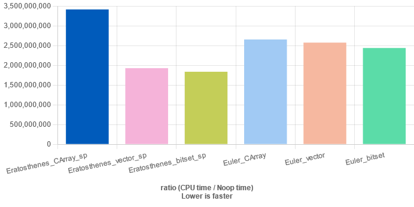
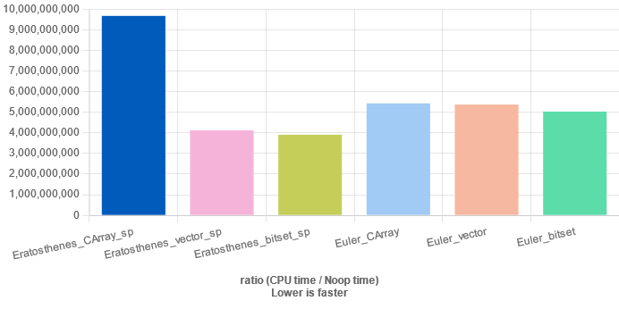
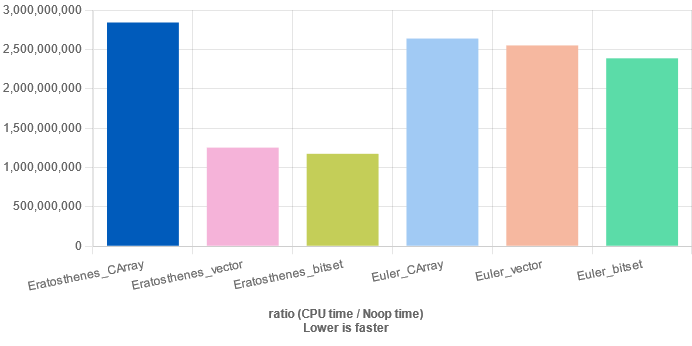
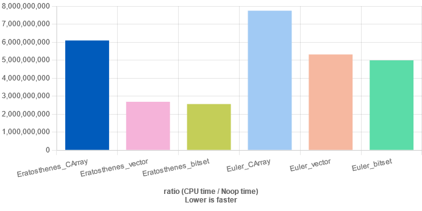

# bitset - OI Wiki

- Source: https://oi-wiki.org/lang/csl/bitset/

# bitset

## 介绍

`std::bitset` 是标准库中的一个存储 `0/1` 的大小不可变容器．严格来讲，它并不属于 STL．

bitset 与 STL

> The C++ standard library provides some special container classes, the so-called container adapters (stack, queue, priority queue). In addition, a few classes provide a container-like interface (for example, strings, bitsets, and valarrays). All these classes are covered separately.1 Container adapters and bitsets are covered in Chapter 12.
> 
> The C++ standard library provides not only the containers for the STL framework but also some containers that fit some special needs and provide simple, almost self-explanatory, interfaces. You can group these containers into either the so-called container adapters, which adapt standard STL containers to fit special needs, or a bitset, which is a containers for bits or Boolean values. There are three standard container adapters: stacks, queues, and priority queues. In priority queues, the elements are sorted automatically according to a sorting criterion. Thus, the "next" element of a priority queue is the element with the "highest" value. A bitset is a bitfield with an arbitrary but fixed number of bits. Note that the C++ standard library also provides a special container with a variable size for Boolean values: vector.

——摘自《The C++ Standard Library 2nd Edition》

由此看来，`bitset` 并不属于 STL，而是一种标准库中的 "Special Container"．事实上，它作为一种容器，也并不满足 STL 容器的要求．说它是适配器，它也并不依赖于其它 STL 容器作为底层实现．

由于内存地址是按字节即 `byte` 寻址，而非比特 `bit`，一个 `bool` 类型的变量，虽然只能表示 `0/1`, 但是也占了 1 byte 的内存．

`bitset` 就是通过固定的优化，使得一个字节的八个比特能分别储存 8 位的 `0/1`．

对于一个 4 字节的 `int` 变量，在只存 `0/1` 的意义下，`bitset` 占用空间只是其 132132，计算一些信息时，所需时间也是其 132132．

在某些情况下通过 `bitset` 可以优化程序的运行效率．至于其优化的是复杂度还是常数，要看计算复杂度的角度．一般 `bitset` 的复杂度有以下几种记法：（设原复杂度为 𝑂(𝑛)O(n)）

  1. 𝑂(𝑛)O(n)，这种记法认为 `bitset` 完全没有优化复杂度．
  2. 𝑂(𝑛32)O(n32)，这种记法不太严谨（复杂度中不应出现常数），但体现了 `bitset` 能将所需时间优化至 132132．
  3. 𝑂(𝑛𝑤)O(nw)，其中 𝑤 =32w=32（计算机的位数），这种记法较为普遍接受．
  4. 𝑂(𝑛log⁡𝑤)O(nlog⁡w)，其中 𝑤w 为计算机一个整型变量的大小．

另外，`vector` 的一个特化 `vector<bool>` 的储存方式同 `bitset` 一样，区别在于其支持动态开空间，`bitset` 则和我们一般的静态数组一样，是在编译时就开好了的．然而，`bitset` 有一些好用的库函数，不仅方便，而且有时可以实现 SIMD 进而减小常数．另外，`vector<bool>` 的部分表现和 `vector` 不一致（如对 `std::vector<bool> vec` 来说，`&vec[0] + i` 不等于 `&vec[i]`）．因此，一般不使用 `vector<bool>`．

## 使用

参见 [std::bitset - cppreference.com](https://en.cppreference.com/w/cpp/utility/bitset)．

### 头文件

```text 1 ``` |  ```text #include <bitset> ```   
---|---  
  
### 指定大小

```text 1 ``` |  ```text std :: bitset < 1000 > bs ; // a bitset with 1000 bits ```   
---|---  
  
### 构造函数

  * `bitset()`: 每一位都是 `false`．
  * `bitset(unsigned long val)`: 设为 `val` 的二进制形式．
  * `bitset(const string& str)`: 设为 0101 串 `str`．

### 运算符

  * `operator []`: 访问其特定的一位．

  * `operator ==`/`operator !=`: 比较两个 `bitset` 内容是否完全一样．

  * `operator &`/`operator &=`/`operator |`/`operator |=`/`operator ^`/`operator ^=`/`operator ~`: 进行按位与/或/异或/取反操作．

注意：**`bitset` 只能与 `bitset` 进行位运算**，若要和整型进行位运算，要先将整型转换为 `bitset`．

  * `operator <<`/`operator >>`/`operator <<=`/`operator >>=`: 进行二进制左移/右移．

此外，`bitset` 还提供了 C++ 流式 IO 的支持，这意味着你可以通过 `cin/cout` 进行输入输出．

### 成员函数

  * `count()`: 返回 `true` 的数量．
  * `size()`: 返回 `bitset` 的大小．
  * `test(pos)`: 它和 `vector` 中的 `at()` 的作用是一样的，和 `[]` 运算符的区别就是越界检查．
  * `any()`: 若存在某一位是 `true` 则返回 `true`，否则返回 `false`．
  * `none()`: 若所有位都是 `false` 则返回 `true`，否则返回 `false`．
  * `all()`: 若所有位都是 `true` 则返回 `true`，否则返回 `false`．
  *     1. `set()`: 将整个 `bitset` 设置成 `true`．
    2. `set(pos, val = true)`: 将某一位设置成 `true`/`false`．
  *     1. `reset()`: 将整个 `bitset` 设置成 `false`．
    2. `reset(pos)`: 将某一位设置成 `false`．相当于 `set(pos, false)`．
  *     1. `flip()`: 翻转每一位．（0 ↔10↔1，相当于异或一个全是 11 的 `bitset`）
    2. `flip(pos)`: 翻转某一位．
  * `to_string()`: 返回转换成的字符串表达．
  * `to_ulong()`: 返回转换成的 `unsigned long` 表达（`long` 在 NT 及 32 位 POSIX 系统下与 `int` 一样，在 64 位 POSIX 下与 `long long` 一样）．
  * `to_ullong()`:（**C++11** 起）返回转换成的 `unsigned long long` 表达．

另外，libstdc++ 中有一些较为实用的内部成员函数1：

  * `_Find_first()`: 返回 `bitset` 第一个 `true` 的下标，若没有 `true` 则返回 `bitset` 的大小．
  * `_Find_next(pos)`: 返回 `pos` 后面（下标严格大于 `pos` 的位置）第一个 `true` 的下标，若 `pos` 后面没有 `true` 则返回 `bitset` 的大小．

## 应用

### [「LibreOJ β Round #2」贪心只能过样例](https://loj.ac/problem/515)

这题可以用 dp 做，转移方程很简单：

𝑓(𝑖,𝑗)f(i,j) 表示前 𝑖i 个数的平方和能否为 𝑗j，那么 𝑓(𝑖,𝑗) =𝑏⋁𝑘=𝑎𝑓(𝑖 −1,𝑗 −𝑘2)f(i,j)=⋁k=abf(i−1,j−k2)（或起来）．

但如果直接做的话是 𝑂(𝑛5)O(n5) 的，（看起来）过不了．

发现可以用 `bitset` 优化，左移再或起来就好了：

提交记录：[std::bitset](https://loj.ac/submission/395274)

```text 1 2 3 4 5 6 7 8 9 10 11 12 13 14 15 16 17 18 19 20 21 22 23 24 25 26 27 28 29 30 ``` |  ```text #include <bitset> #include <cstdio> #include <iostream> using namespace std ; constexpr int N = 101 ; int n , a [ N ], b [ N ]; bitset < N * N * N > f [ N ]; int main () { int i , j ; cin >> n ; for ( i = 1 ; i <= n ; ++ i ) cin >> a [ i ] >> b [ i ]; f [ 0 ][ 0 ] = 1 ; for ( i = 1 ; i <= n ; ++ i ) { for ( j = a [ i ]; j <= b [ i ]; ++ j ) { f [ i ] |= ( f [ i \- 1 ] << ( j * j )); } } cout << f [ n ]. count (); return 0 ; } ```   
---|---  
  
由于 libstdc++ 的实现为压 `__CHAR_BIT__ * sizeof(unsigned long)` 位的2，在一些平台中其为 3232．所以，可以手写 `bitset`（只需要支持左移后或起来这一种操作）压 6464 位（`__CHAR_BIT__ * sizeof(unsigned long long)`）来进一步优化：

提交记录：[手写 bitset](https://loj.ac/submission/395619)

```text 1 2 3 4 5 6 7 8 9 10 11 12 13 14 15 16 17 18 19 20 21 22 23 24 25 26 27 28 29 30 31 32 33 34 35 36 37 38 39 40 41 42 43 44 45 46 47 48 49 ``` |  ```text #include <cstdio> #include <iostream> using namespace std ; constexpr int N = 101 ; constexpr int W = 64 ; struct Bitset { unsigned long long a [ N * N * N >> 6 ]; void shiftor ( const Bitset & y , int p , int l , int r ) { int t = p \- p / W * W ; int tt = ( t == 0 ? 0 : W \- t ); int to = ( r \+ p ) / W ; int qaq = ( p \+ W \- 1 ) / W ; for ( int i = ( l \+ p ) / W ; i <= to ; ++ i ) { if ( i \- qaq >= 0 ) a [ i ] |= y . a [ i \- qaq ] >> tt ; a [ i ] |= (( y . a [ i \- qaq \+ 1 ] & (( 1ull << tt ) \- 1 )) << t ); } } } f [ N ]; int main () { int n , a , b , l = 0 , r = 0 , ans = 0 ; scanf ( "%d" , & n ); f [ 0 ]. a [ 0 ] = 1 ; for ( int i = 1 ; i <= n ; ++ i ) { scanf ( "%d%d" , & a , & b ); for ( int j = a ; j <= b ; ++ j ) f [ i ]. shiftor ( f [ i \- 1 ], j * j , l , r ); l += a * a ; r += b * b ; } for ( int i = l / W ; i <= r / W ; ++ i ) ans += __builtin_popcount ( f [ n ]. a [ i ] & 0xffffffffu ) \+ __builtin_popcount ( f [ n ]. a [ i ] >> 32 ); printf ( "%d" , ans ); return 0 ; } ```   
---|---  
  
另外，加了几个剪枝的暴力也能过：

提交记录：[加了几个剪枝的暴力](https://loj.ac/submission/395673)

```text 1 2 3 4 5 6 7 8 9 10 11 12 13 14 15 16 17 18 19 20 21 22 23 24 25 26 27 28 29 30 31 32 33 34 35 36 37 38 39 40 41 42 ``` |  ```text #include <cstdio> #include <iostream> using namespace std ; constexpr int N = 101 ; constexpr int W = 64 ; bool f [ N * N * N ]; int main () { int n , i , j , k , a , b , l = 0 , r = 0 , ans = 0 ; scanf ( "%d" , & n ); f [ 0 ] = true ; for ( i = 1 ; i <= n ; ++ i ) { scanf ( "%d%d" , & a , & b ); l += a * a ; r += b * b ; for ( j = r ; j >= l ; \-- j ) { f [ j ] = false ; for ( k = a ; k <= b ; ++ k ) { if ( j \- k * k < l \- a * a ) break ; if ( f [ j \- k * k ]) { f [ j ] = true ; break ; } } } } for ( i = l ; i <= r ; ++ i ) ans += f [ i ]; printf ( "%d" , ans ); return 0 ; } ```   
---|---  
  
### [CF1097F Alex and a TV Show](https://codeforces.com/contest/1097/problem/F)

#### 题意

给你 𝑛n 个可重集，四种操作：

  1. 把某个可重集设为一个数．
  2. 把某个可重集设为另外两个可重集加起来．
  3. 把某个可重集设为从另外两个可重集中各选一个数的 gcdgcd．即：𝐴 ={gcd(𝑥,𝑦)|𝑥 ∈𝐵,𝑦 ∈𝐶}A={gcd(x,y)|x∈B,y∈C}．
  4. 询问某个可重集中某个数的个数，**在模 2 意义下** ．

可重集个数 105105，操作个数 106106，值域 70007000．

#### 做法

看到「在模 22 意义下」，可以想到用 `bitset` 维护每个可重集．

这样的话，操作 11 直接设，操作 22 就是异或（因为模 22），操作 44 就是直接查，但 .. 操作 33 怎么办？

我们可以尝试维护每个可重集的所有约数构成的可重集，这样的话，操作 33 就是直接按位与．

我们可以把值域内每个数的约数构成的 `bitset` 预处理出来，这样操作 11 就解决了．操作 22 仍然是异或．

现在的问题是，如何通过一个可重集的约数构成的可重集得到该可重集中某个数的个数．

令原可重集为 𝐴A，其约数构成的可重集为 𝐴′A′，我们要求 𝐴A 中 𝑥x 的个数，用 [莫比乌斯反演](../../../math/number-theory/mobius/) 推一推：

∑𝑖∈𝐴[𝑖𝑥=1]=∑𝑖∈𝐴∑𝑑|𝑖𝑥𝜇(𝑑)=∑𝑑∈𝐴′,𝑥|𝑑𝜇(𝑑𝑥)∑i∈A[ix=1]=∑i∈A∑d|ixμ(d)=∑d∈A′,x|dμ(dx)

由于是模 22 意义下，−1−1 和 11 是一样的，只用看 𝑑𝑥dx 有没有平方因子即可．所以，可以对值域内每个数预处理出其倍数中除以它不含平方因子的位置构成的 `bitset`，求答案的时候先按位与再 `count()` 就好了．

这样的话，单次询问复杂度就是 𝑂(𝑣𝑤)O(vw)（𝑣 =7000, 𝑤 =32v=7000,w=32）．

至于预处理的部分，𝑂(𝑣√𝑣)O(vv) 或者 𝑂(𝑣2)O(v2) 预处理比较简单，loglog 预处理就如下面代码所示，复杂度为调和级数，所以是 𝑂(𝑣log⁡𝑣)O(vlog⁡v)．

参考代码

```text 1 2 3 4 5 6 7 8 9 10 11 12 13 14 15 16 17 18 19 20 21 22 23 24 25 26 27 28 29 30 31 32 33 34 35 36 37 38 39 40 41 42 43 44 45 46 47 48 49 50 51 52 53 54 55 56 57 58 59 60 61 62 63 64 65 66 67 68 69 70 71 72 73 74 ``` |  ```text #include <bitset> #include <cctype> #include <cmath> #include <cstdio> #include <iostream> using namespace std ; int read () { int out = 0 ; char c ; while ( ! isdigit ( c = getchar ())); for (; isdigit ( c ); c = getchar ()) out = out * 10 \+ c \- '0' ; return out ; } constexpr int N = 100005 ; constexpr int M = 1000005 ; constexpr int V = 7005 ; bitset < V > pre [ V ], pre2 [ V ], a [ N ], mu ; int n , m , tot ; char ans [ M ]; int main () { int i , j , x , y , z ; n = read (); m = read (); mu . set (); for ( i = 2 ; i * i < V ; ++ i ) { for ( j = 1 ; i * i * j < V ; ++ j ) { mu [ i * i * j ] = 0 ; } } for ( i = 1 ; i < V ; ++ i ) { for ( j = 1 ; i * j < V ; ++ j ) { pre [ i * j ][ i ] = 1 ; pre2 [ i ][ i * j ] = mu [ j ]; } } while ( m \-- ) { switch ( read ()) { case 1 : x = read (); y = read (); a [ x ] = pre [ y ]; break ; case 2 : x = read (); y = read (); z = read (); a [ x ] = a [ y ] ^ a [ z ]; break ; case 3 : x = read (); y = read (); z = read (); a [ x ] = a [ y ] & a [ z ]; break ; case 4 : x = read (); y = read (); ans [ tot ++ ] = (( a [ x ] & pre2 [ y ]). count () & 1 ) \+ '0' ; break ; } } printf ( "%s" , ans ); return 0 ; } ```   
---|---  
  
### 与埃氏筛结合

由于 `bitset` 快速的连续读写效率，使得它非常适合用于与 [埃氏筛](../../../math/number-theory/sieve/#埃拉托斯特尼筛法) 结合打质数表．

使用的方式也很简单，只需要将埃氏筛中的布尔数组替换成 `bitset` 即可．

速度测试

使用 [Quick C++ Benchmarks](https://quick-bench.com) 进行测试，编译器采用 `GCC 13.2`，编译参数为 `-std=c++20 -O2`．

算法| 函数名  
---|---  
埃氏筛 + C 风格布尔数组，不存储筛出来的素数| `Eratosthenes_CArray`  
埃氏筛 +`vector<bool>`，不存储筛出来的素数| `Eratosthenes_vector`  
埃氏筛 +`bitset`，不存储筛出来的素数| `Eratosthenes_bitset`  
埃氏筛 + C 风格布尔数组，存储筛出来的素数| `Eratosthenes_CArray_sp`  
埃氏筛 +`vector<bool>`，存储筛出来的素数| `Eratosthenes_vector_sp`  
埃氏筛 +`bitset`，存储筛出来的素数| `Eratosthenes_bitset_sp`  
欧拉筛 + C 风格布尔数组| `Euler_CArray`  
欧拉筛 +`vector<bool>`| `Euler_vector`  
欧拉筛 +`bitset`| `Euler_bitset`  
  
  * 当埃氏筛 **存储** 筛出来的素数时：

    * 𝑁 =5 ×107 +1N=5×107+1 时的 [测试结果](https://quick-bench.com/q/iQL9FhsZ6PVV81HKABsidRw8hB8)：



    * 𝑁 =108 +1N=108+1 时的 [测试结果](https://quick-bench.com/q/pwEamEFUW-6nXeXEALRsYPd8FWI)：



  * 当埃氏筛 **不存储** 筛出来的素数时：

    * 𝑁 =5 ×107 +1N=5×107+1 时的 [测试结果](https://quick-bench.com/q/rg2mCUxT02a44w9fWvHtZoNTJyU)：



    * 𝑁 =108 +1N=108+1 时的 [测试结果](https://quick-bench.com/q/lusNWxWsR0VXoRBof7uBtqfvJuY)：



从测试结果中可知：

  1. 时间复杂度 𝑂(𝑛log⁡log⁡𝑛)O(nlog⁡log⁡n) 的埃氏筛在使用 `bitset` 或 `vector<bool>` 优化后，性能甚至超过时间复杂度 𝑂(𝑛)O(n) 的欧拉筛；
  2. 欧拉筛使用 `bitset` 或 `vector<bool>` 后的优化效果在大多数情况下均不明显；
  3. `bitset` 的优化效果略强于 `vector<bool>`．

参考代码

需安装 [google/benchmark](https://github.com/google/benchmark)．

```text 1 2 3 4 5 6 7 8 9 10 11 12 13 14 15 16 17 18 19 20 21 22 23 24 25 26 27 28 29 30 31 32 33 34 35 36 37 38 39 40 41 42 43 44 45 46 47 48 49 50 51 52 53 54 55 56 57 58 59 60 61 62 63 64 65 66 67 68 69 70 71 72 73 74 75 76 77 78 79 80 81 82 83 84 85 86 87 88 89 90 91 92 93 94 95 96 97 98 99 100 101 102 103 104 105 106 107 108 109 110 111 112 113 114 115 116 117 118 119 120 121 122 123 124 125 126 127 128 129 130 131 132 133 134 135 136 137 138 139 140 141 142 143 144 145 146 147 148 149 150 151 152 153 154 155 156 157 158 159 160 161 162 163 164 165 166 167 168 169 170 171 172 173 174 175 176 177 178 179 180 181 182 ``` |  ```text #include <benchmark/benchmark.h> #include <bits/stdc++.h> using namespace std ; using u32 = uint32_t ; using u64 = uint64_t ; #define ERATOSTHENES_STORAGE_PRIME #define ENABLE_EULER constexpr u32 N = 5e7 \+ 1 ; #ifndef ERATOSTHENES_STORAGE_PRIME void Eratosthenes_CArray ( benchmark :: State & state ) { static bool is_prime [ N ]; for ( auto _ : state ) { fill ( is_prime , is_prime \+ N , true ); is_prime [ 0 ] = is_prime [ 1 ] = false ; for ( u32 i = 2 ; ( u64 ) i * i < N ; ++ i ) if ( is_prime [ i ]) for ( u32 j = i * i ; j < N ; j += i ) is_prime [ j ] = false ; benchmark :: DoNotOptimize ( 0 ); } } BENCHMARK ( Eratosthenes_CArray ); void Eratosthenes_vector ( benchmark :: State & state ) { static vector < bool > is_prime ( N ); for ( auto _ : state ) { fill ( is_prime . begin (), is_prime . end (), true ); is_prime [ 0 ] = is_prime [ 1 ] = false ; for ( u32 i = 2 ; ( u64 ) i * i < N ; ++ i ) if ( is_prime [ i ]) for ( u32 j = i * i ; j < N ; j += i ) is_prime [ j ] = false ; benchmark :: DoNotOptimize ( 0 ); } } BENCHMARK ( Eratosthenes_vector ); void Eratosthenes_bitset ( benchmark :: State & state ) { static bitset < N > is_prime ; for ( auto _ : state ) { is_prime . set (); is_prime . reset ( 0 ); is_prime . reset ( 1 ); for ( u32 i = 2 ; ( u64 ) i * i < N ; ++ i ) if ( is_prime [ i ]) for ( u32 j = i * i ; j < N ; j += i ) is_prime . reset ( j ); benchmark :: DoNotOptimize ( 0 ); } } BENCHMARK ( Eratosthenes_bitset ); #else void Eratosthenes_CArray_sp ( benchmark :: State & state ) { static bool is_prime [ N ]; for ( auto _ : state ) { vector < u32 > prime ; fill ( is_prime , is_prime \+ N , true ); is_prime [ 0 ] = is_prime [ 1 ] = false ; for ( u32 i = 2 ; ( u64 ) i * i < N ; ++ i ) if ( is_prime [ i ]) for ( u32 j = i * i ; j < N ; j += i ) is_prime [ j ] = false ; for ( u32 i = 2 ; i < N ; ++ i ) if ( is_prime [ i ]) prime . push_back ( i ); benchmark :: DoNotOptimize ( prime ); } } BENCHMARK ( Eratosthenes_CArray_sp ); void Eratosthenes_vector_sp ( benchmark :: State & state ) { static vector < bool > is_prime ( N ); for ( auto _ : state ) { vector < u32 > prime ; fill ( is_prime . begin (), is_prime . end (), true ); is_prime [ 0 ] = is_prime [ 1 ] = false ; for ( u32 i = 2 ; ( u64 ) i * i < N ; ++ i ) if ( is_prime [ i ]) for ( u32 j = i * i ; j < N ; j += i ) is_prime [ j ] = false ; for ( u32 i = 2 ; i < N ; ++ i ) if ( is_prime [ i ]) prime . push_back ( i ); benchmark :: DoNotOptimize ( prime ); } } BENCHMARK ( Eratosthenes_vector_sp ); void Eratosthenes_bitset_sp ( benchmark :: State & state ) { static bitset < N > is_prime ; for ( auto _ : state ) { vector < u32 > prime ; is_prime . set (); is_prime . reset ( 0 ); is_prime . reset ( 1 ); for ( u32 i = 2 ; ( u64 ) i * i < N ; ++ i ) if ( is_prime [ i ]) for ( u32 j = i * i ; j < N ; j += i ) is_prime . reset ( j ); for ( u32 i = 2 ; i < N ; ++ i ) if ( is_prime [ i ]) prime . push_back ( i ); benchmark :: DoNotOptimize ( prime ); } } BENCHMARK ( Eratosthenes_bitset_sp ); #endif #ifdef ENABLE_EULER void Euler_CArray ( benchmark :: State & state ) { static bool not_prime [ N ]; for ( auto _ : state ) { vector < u32 > prime ; fill ( not_prime , not_prime \+ N , false ); not_prime [ 0 ] = not_prime [ 1 ] = true ; for ( u32 i = 2 ; i < N ; ++ i ) { if ( ! not_prime [ i ]) prime . push_back ( i ); for ( u32 pri_j : prime ) { if ( i * pri_j >= N ) break ; not_prime [ i * pri_j ] = true ; if ( i % pri_j == 0 ) break ; } } benchmark :: DoNotOptimize ( prime ); } } BENCHMARK ( Euler_CArray ); void Euler_vector ( benchmark :: State & state ) { static vector < bool > not_prime ( N ); for ( auto _ : state ) { vector < u32 > prime ; fill ( not_prime . begin (), not_prime . end (), false ); not_prime [ 0 ] = not_prime [ 1 ] = true ; for ( u32 i = 2 ; i < N ; ++ i ) { if ( ! not_prime [ i ]) prime . push_back ( i ); for ( u32 pri_j : prime ) { if ( i * pri_j >= N ) break ; not_prime [ i * pri_j ] = true ; if ( i % pri_j == 0 ) break ; } } benchmark :: DoNotOptimize ( prime ); } } BENCHMARK ( Euler_vector ); void Euler_bitset ( benchmark :: State & state ) { static bitset < N > not_prime ; for ( auto _ : state ) { vector < u32 > prime ; not_prime . reset (); not_prime . set ( 0 ); not_prime . set ( 1 ); for ( u32 i = 2 ; i < N ; ++ i ) { if ( ! not_prime [ i ]) prime . push_back ( i ); for ( u32 pri_j : prime ) { if ( i * pri_j >= N ) break ; not_prime . set ( i * pri_j ); if ( i % pri_j == 0 ) break ; } } benchmark :: DoNotOptimize ( prime ); } } BENCHMARK ( Euler_bitset ); #endif static void Noop ( benchmark :: State & state ) { for ( auto _ : state ) benchmark :: DoNotOptimize ( 0 ); } BENCHMARK ( Noop ); BENCHMARK_MAIN (); ```   
---|---  
  
### 与树分块结合

`bitset` 与树分块结合可以解决一类求树上多条路径信息并的问题，详见 [数据结构/树分块](../../../ds/tree-decompose/)．

### 与莫队结合

详见 [杂项/莫队配合 bitset](../../../misc/mo-algo-with-bitset/)．

### 计算高维偏序

详见 [FHR 课件](https://github.com/OI-wiki/libs/blob/master/lang/csl/FHR-分块bitset求高维偏序.pdf)．

## 参考资料与注释

* * *

  1. [libstdc++: SGI STL extensions](https://gcc.gnu.org/onlinedocs/libstdc++/libstdc++-html-USERS-4.4/a00994.html#g32541eb0d6581b915af48b5a51006dff) ↩

  2. [libstdc++: std::bitset<_Nb> Class Template Reference](https://gcc.gnu.org/onlinedocs/libstdc++/libstdc++-html-USERS-4.4/a00219.html) ↩

* * *

>  __本页面最近更新： 2026/1/7 08:56:54，[更新历史](https://github.com/OI-wiki/OI-wiki/commits/master/docs/lang/csl/bitset.md)  
>  __发现错误？想一起完善？[在 GitHub 上编辑此页！](https://oi-wiki.org/edit-landing/?ref=/lang/csl/bitset.md "edit.link.title")  
>  __本页面贡献者：[Ir1d](https://github.com/Ir1d), [Tiphereth-A](https://github.com/Tiphereth-A), [countercurrent-time](https://github.com/countercurrent-time), [CCXXXI](https://github.com/CCXXXI), [cmpute](https://github.com/cmpute), [Enter-tainer](https://github.com/Enter-tainer), [ouuan](https://github.com/ouuan), [sshwy](https://github.com/sshwy), [Xeonacid](https://github.com/Xeonacid), [abc1763613206](https://github.com/abc1763613206), [aberter0x3f](https://github.com/aberter0x3f), [c-forrest](https://github.com/c-forrest), [Chrogeek](https://github.com/Chrogeek), [Henry-ZHR](https://github.com/Henry-ZHR), [i-Yirannn](https://github.com/i-Yirannn), [ksyx](https://github.com/ksyx), [NachtgeistW](https://github.com/NachtgeistW), [StudyingFather](https://github.com/StudyingFather)  
>  __本页面的全部内容在**[CC BY-SA 4.0](https://creativecommons.org/licenses/by-sa/4.0/deed.zh) 和 [SATA](https://github.com/zTrix/sata-license)** 协议之条款下提供，附加条款亦可能应用
