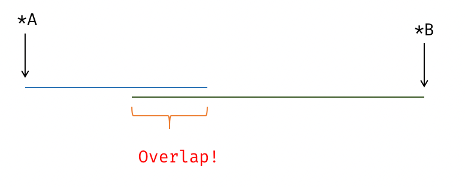

# 编译优化 - OI Wiki

- Source: https://oi-wiki.org/lang/optimizations/

# 编译优化

OI 界的常用编程语言是 C++ï¼Žæ—¢ç„¶ä½¿ç”¨äº†è¿™é—¨è¯­è¨€ï¼Œå°±æ³¨å®šè¦å’Œç¼–è¯‘å™¨ã€è¯­è¨€æ ‡å‡†æ‰“äº¤é“äº†ï¼Žä¼—æ‰€å‘¨çŸ¥ï¼ŒC++ éžå¸¸æ··ä¹±é‚ªæ¶ï¼Œæœ¬æ–‡æ—¨åœ¨ç»™å‡ºå®žç”¨çš„ç¼–è¯‘å™¨ç›¸å ³çŸ¥è¯†ï¼Œè¶³å¤Ÿç«žèµ›ä½¿ç”¨ï¼Ž

## 编译器优化简介

### 什么是优化 (Optimization)

æ ¹æ® [如同规则](https://en.cppreference.com/w/cpp/language/as_if)（The as-if Ruleï¼‰ï¼Œåœ¨ä¿æŒè¯­ä¹‰ä¸å˜çš„æƒ å†µä¸‹ï¼Œå¯¹ç¨‹åºè¿è¡Œé€Ÿåº¦ã€ç¨‹åºå¯æ‰§è¡Œæ–‡ä»¶å¤§å°ä½œå‡ºæ”¹è¿›ï¼Ž

## 常见的编译器优化

### å¸¸é‡æŠ˜å (Constant Folding)

å¸¸é‡æŠ˜å ï¼Œåˆç§°å¸¸é‡ä¼ æ’­ (Constant Propagation)，如果一个表达式可以确定为常量，在他的下一个定义 (Definition) å‰ï¼Œå¯ä»¥è¿›è¡Œå¸¸é‡ä¼ æ’­ï¼Ž

```text 1 2 3 4 5 ``` |  ```text int x = 1 ; int y = x ; // x = 1, => y = 1 x = 3 ; int z = 2 * y ; // z => 2 * y = 2 * 1 = 2 int y2 = x * 2 ; // x = 3, => y2 = 6 ```   
---|---  
  
è¿™æ®µä»£ç åœ¨ç¼–è¯‘æœŸé—´å³å¯è¢«è½¬æ¢ä¸ºï¼š

```text 1 2 3 4 5 ``` |  ```text int x = 1 ; int y = 1 ; x = 3 ; int z = 2 ; int y2 = 6 ; ```   
---|---  
  
实例：<https://godbolt.org/z/oEfY35TTd>

### æ­»ä»£ç æ¶ˆé™¤ (Deadcode Elimination)

æ• åæ€ä¹‰ï¼Œå°±æ˜¯ä¸€æ®µä»£ç æ²¡ç”¨ä¸Šå°±ä¼šè¢«åˆ åŽ»ï¼Ž

```text 1 2 3 4 5 6 ``` |  ```text int test () { int a = 233 ; int b = a * 2 ; int c = 234 ; return c ; } ```   
---|---  
  
将被转换为

```text 1 ``` |  ```text int test () { return 234 ; } ```   
---|---  
  
æ³¨æ„ï¼Œè¿™ä¸ªä»£ç é¦–å ˆè¿›è¡Œäº†å¸¸é‡æŠ˜å ï¼Œä½¿å¾—è¿”å›žå€¼å¯ä»¥ç¡®å®šä¸º 234，a, b ä¸ºä¸æ´»è·ƒå˜é‡ï¼Œå› æ­¤åˆ é™¤ï¼Ž

### 循环旋转 (Loop Rotate)

将循环从 "for" 形式，转换为 "do-while" å½¢å¼ï¼Œå‰é¢å†å¤šåŠ ä¸€ä¸ªæ¡ä»¶åˆ¤æ–­ï¼Žè¿™ä¸ªå˜æ¢ä¸»è¦ä¸ºå ¶ä»–å˜æ¢åšå‡†å¤‡ï¼Ž

```text 1 2 3 4 ``` |  ```text for ( int i = 0 ; i < n ; ++ i ) { auto v = * p ; use ( v ); } ```   
---|---  
  
变换为

```text 1 2 3 4 5 6 7 ``` |  ```text if ( 0 < n ) { do { auto v = * p ; use ( v ); ++ i ; } while ( i < n ); } ```   
---|---  
  
### 循环不变量外提 (Loop Invariant Code Motion)

基于别名分析 (Alias Analysis)ï¼Œå°†å¾ªçŽ¯ä¸­è¢«è¯æ˜Žæ˜¯ä¸å˜é‡ï¼ˆå¯èƒ½åŒ å«å† å­˜è®¿é—®ï¼Œload/storeï¼Œå› æ­¤ä¾èµ–åˆ«ååˆ†æžï¼‰çš„ä»£ç å¤–æå‡ºå¾ªçŽ¯ä½“ï¼Œè¿™æ ·å¯ä»¥è®©å¾ªçŽ¯ä½“å† éƒ¨å°‘ä¸€äº›ä»£ç ï¼Ž

```text 1 2 3 4 ``` |  ```text for ( int i = 0 ; i < n ; ++ i ) { auto v = * p ; use ( v ); } ```   
---|---  
  
è¿™ä¸ªä»£ç ç›´è§‚æ¥çœ‹å¯ä»¥å¤–æä¸ºï¼š

```text 1 2 3 4 ``` |  ```text auto v = * p ; for ( int i = 0 ; i < n ; ++ i ) { use ( v ); } ```   
---|---  
  
ä½†å®žé™ ä¸Šï¼Œå¦‚æžœ `n <= 0`ï¼Œè¿™ä¸ªå¾ªçŽ¯æ°¸è¿œä¸ä¼šè¢«è¿›å ¥ï¼Œä½†æˆ‘ä»¬åˆæ‰§è¡Œäº†ä¸€æ¡å¤šçš„æŒ‡ä»¤ï¼ˆå¯èƒ½æœ‰å‰¯ä½œç”¨ï¼ï¼‰ï¼Žå› æ­¤ï¼Œå¾ªçŽ¯é€šå¸¸è¢« Rotate 为 do-while å½¢å¼ï¼Œè¿™æ ·å¯ä»¥æ–¹ä¾¿æ’å ¥ä¸€ä¸ª "loop guard"．之后再进行循环不变量外提．

```text 1 2 3 4 5 6 7 ``` |  ```text if ( 0 < n ) { // loop guard auto v = * p ; do { use ( v ); ++ i ; } while ( i < n ); } ```   
---|---  
  
### 循环展开 (Loop Unroll)

å¾ªçŽ¯åŒ å«å¾ªçŽ¯ä½“å’Œå„ç±»åˆ†æ”¯è¯­å¥ï¼Œéœ€è¦çŽ°ä»£ CPU è¿›è¡Œä¸€å®šçš„åˆ†æ”¯é¢„æµ‹ï¼Žç›´æŽ¥æŠŠå¾ªçŽ¯å±•å¼€ï¼Œç”¨ä¸€å®šçš„ä»£ç å¤§å°æ¥æ¢å–è¿è¡Œæ—¶é—´ï¼Ž

```text 1 2 3 ``` |  ```text for ( int i = 0 ; i < 3 ; i ++ ) { a [ i ] = i ; } ```   
---|---  
  
变换为：

```text 1 2 3 ``` |  ```text a [ 0 ] = 0 ; a [ 1 ] = 1 ; a [ 2 ] = 2 ; ```   
---|---  
  
### 循环判断外提 (Loop Unswitching)

å¾ªçŽ¯åˆ¤æ–­å¤–æå°†å¾ªçŽ¯ä¸­çš„æ¡ä»¶å¼ç§»åˆ°å¾ªçŽ¯ä¹‹å¤–ï¼Œç„¶åŽåœ¨å¤–éƒ¨çš„ä¸¤ä¸ªæ¡ä»¶å„æ”¾ç½®ä¸¤ä¸ªå¾ªçŽ¯ï¼Œè¿™æ ·å¯ä»¥å¢žåŠ å¾ªçŽ¯å‘é‡åŒ–ã€å¹¶è¡ŒåŒ–çš„å¯èƒ½æ€§ï¼ˆé€šå¸¸ç®€å•å¾ªçŽ¯æ›´å®¹æ˜“è¢«å‘é‡åŒ–ï¼‰ï¼Ž

```text 1 2 3 4 5 6 7 8 9 10 11 12 13 14 15 16 17 18 19 20 21 22 23 24 25 26 ``` |  ```text // clang-format off void before ( int x ) { for (; /* i in some range */ ;) { /* A */ ; if ( /* condition */ x % 2 ) { /* B */ ; } /* C */ ; } } void after ( int x ) { if ( /* condition */ x % 2 ) { for (; /* i in some range */ ;) { /* A */ ; /* B */ ; // 直接执行 B ，不进行循环判断 /* C */ ; } } else { for (; /* i in some range */ ;) { /* A */ ; // 不执行 B /* C */ ; } } } ```   
---|---  
  
### ä»£ç å¸ƒå±€ä¼˜åŒ– (Code Layout Optimizations)

程序在执行时，可以将执行的路径分为冷热路径 (cold/hot path)．CPU è·³è½¬æ‰§è¡Œï¼Œç»å¤§å¤šæ•°æƒ å†µä¸‹æ²¡æœ‰ç›´æŽ¥é¡ºåºæ‰§è¡Œå¿«ï¼ŒåŽè€ é€šå¸¸è¢«ç¼–è¯‘å™¨ä½œè€ ç§°ä¸º "fallthrough"ï¼Žä¸Žä¹‹å¯¹åº”çš„ï¼Œç»å¸¸è¢«æ‰§è¡Œåˆ°çš„ä»£ç æˆä¸ºçƒ­ä»£ç ï¼Œä¸Žä¹‹ç›¸å¯¹çš„æˆä¸ºå†·ä»£ç ï¼ŽOI ä»£ç ä¸­ï¼Œå¦‚æžœæœ‰ä¸€æ®µæ˜¯å¾ªçŽ¯ä¸­çš„ç‰¹åˆ¤è¾¹ç•Œæ¡ä»¶ï¼Œæˆ–è€ å¼‚å¸¸å¤„ç†ï¼Œç±»ä¼¼çš„é€»è¾‘ï¼Œåˆ™æ­¤éƒ¨åˆ†ä»£ç ä¸ºå†·ä»£ç ï¼Ž

基本块 (Basic Block)，是控制流的基本结构，一个过程 (Procedure) 由若干个基本块组成，形成一个有向图．生成可执行文件的过程中，编译器需要安排一个放置基本块的布局 (Layout)，而如何编排布局，是此优化的重点．

åŽŸåˆ™ä¸Šï¼Œåº”è¯¥æ›´åå¥½ä¸Žå°†çƒ­ä»£ç æ”¾åœ¨ä¸€èµ·ï¼Œè€Œå°†å†·ä»£ç éš”å¼€ï¼ŽåŽŸå› æ˜¯è¿™æ ·èƒ½å¤Ÿæ›´å¥½åœ°åˆ©ç”¨æŒ‡ä»¤ç¼“å­˜ï¼Œçƒ­ä»£ç çš„å±€éƒ¨æ€§ä¼šæ›´å¥½ï¼Ž

```text 1 2 3 4 5 6 ``` |  ```text // clang-format off int hotpath ; // <\-- 热！ if ( /* 边界条件 */ false ) { // <\-- 冷！ } int hotpath_again ; // <\-- 热！ ```   
---|---  
  
#### 基本块放置 (Basic Block Placement)

我们用 label æ¥è¡¨è¾¾ä¸€ç§ã€Œä¼ªæœºå™¨ç ã€ï¼Œè¿™ä¸ª C++ 程序有两种翻译方法：

布局 1

```text 1 2 3 4 5 6 7 8 9 10 11 12 13 14 15 ``` |  ```text // clang-format off hotblock1 : Stmts ; // <\-- 热！ if ( /* 边界条件不成立 */ true ) goto hotblock2 ; // 经常发生！ ------+ coldblock : /* | */ Stmt ; // <\- 冷 | Stmt ; // <\- 冷 | Stmt ; // <\- 冷 | 跨越了大量指令，代价高昂！ Stmt ; // <\- 冷 | Stmt ; // <\- 冷 | Stmt ; // <\- 冷 | Stmt ; // <\- 冷 | hotblock2 : /* | */ Stmts ; // <\- 热！ <\----------+ ```   
---|---  
  
另一种布局为：

布局 2

```text 1 2 3 4 5 6 7 8 9 10 11 12 13 ``` |  ```text // clang-format off hotblock1 : Stmts ; // <\-- 热！ if ( /* 边界条件 */ false ) goto coldblock ; // 很少发生 hotblock2 : /* | 低代价！ */ Stmts ; // <\- 热！ <\-----------------+ coldblock : Stmt ; // <\- 冷 Stmt ; // <\- 冷 Stmt ; // <\- 冷 Stmt ; // <\- 冷 Stmt ; // <\- 冷 ```   
---|---  
  
æˆ‘ä»¬çœ‹åˆ°åŽä¸€ç§å¸ƒå±€ä¸­ï¼Œä¸¤ä¸ªçƒ­ä»£ç å—è¢«æ”¾åˆ°äº†ä¸€èµ·ï¼Œæ‰§è¡Œæ•ˆçŽ‡æ›´ä¼˜ç§€ï¼Ž

为了告诉编译器分支是否容易被执行，可以使用 C++20 `[[likely]]` 和 `[[unlikely]]`:<https://en.cppreference.com/w/cpp/language/attributes/likely>

如果比赛没有采用 C++20 ä»¥ä¸Šæ ‡å‡†ï¼Œåˆ™å¯ä»¥åˆ©ç”¨ `__builtin_expect`(GNU Extension)．

```text 1 2 3 4 5 6 ``` |  ```text #define likely(x) __builtin_expect(!!(x), 1) #define unlikely(x) __builtin_expect(!!(x), 0) if ( unlikely ( /* 一些边界条件检查 */ false )) { // å†·ä»£ç  } ```   
---|---  
  
#### å†·çƒ­ä»£ç åˆ†ç¦» (Hot Cold Splitting)

一个过程 (Procedure) åŒ å«åŒæ—¶åŒ å«å†·çƒ­è·¯å¾„ï¼Œè€Œå†·ä»£ç è¾ƒé•¿ï¼Œæ›´å¥½çš„åšæ³•æ˜¯è®©å†·ä»£ç ä½œä¸ºå‡½æ•°è°ƒç”¨ï¼Œè€Œä¸æ˜¯é˜»æ–­çƒ­è·¯å¾„ï¼Žè¿™åŒæ—¶ä¹Ÿæç¤ºæˆ‘ä»¬ä¸è¦è‡ªä½œèªæ˜Žçš„è®©æ‰€æœ‰å‡½æ•° `inline`ï¼Žå†·ä»£ç å¯¹æ‰§è¡Œé€Ÿåº¦çš„é˜»ç¢æ¯”å‡½æ•°è°ƒç”¨è¦å¤šå¾—å¤šï¼Ž

ä¸å¥½çš„ä»£ç å¸ƒå±€

```text 1 2 3 4 5 6 7 8 9 10 11 12 13 14 15 16 17 18 ``` |  ```text // clang-format off void foo () { // clang-format off hotblock1 : Stmts ; // <\-- 热！ if ( /* 边界条件不成立 */ true ) goto hotblock2 ; // 经常发生！ ------+ coldblock : /* | */ Stmt ; // <\- 冷 | Stmt ; // <\- 冷 | Stmt ; // <\- 冷 | 跨越了大量指令，代价高昂！ Stmt ; // <\- 冷 | Stmt ; // <\- 冷 | Stmt ; // <\- 冷 | Stmt ; // <\- 冷 | hotblock2 : /* | */ Stmts ; // <\- 热！ <\----------+ } ```   
---|---  
  
å¥½çš„ä»£ç å¸ƒå±€

```text 1 2 3 4 5 6 7 8 9 10 11 12 13 14 15 16 17 18 19 ``` |  ```text // clang-format off void foo () { hotblock1 : Stmts ; // <\-- 热！ if ( /* 边界条件 */ false ) coldBlock (); // å°†å†·ä»£ç åˆ†ç¦»å‡ºï¼Œä½¿å¾—çƒ­è·¯å¾„å¯¹ cache 更友好 hotblock2 : Stmts ; // <\- 热！ } void coldBlock () { Stmt ; // <\- 冷 Stmt ; // <\- 冷 Stmt ; // <\- 冷 Stmt ; // <\- 冷 Stmt ; // <\- 冷 Stmt ; // <\- 冷 Stmt ; // <\- 冷 } ```   
---|---  
  
å†·çƒ­ä»£ç åˆ†ç¦»ï¼Œå ¶å®žå°±æ˜¯å‡½æ•°å† è” (Function Inlining) çš„åå‘æ“ä½œï¼Œè¿™ä¸€ä¼˜åŒ–çš„å­˜åœ¨å¯ç¤ºæˆ‘ä»¬ï¼Œå‡½æ•°å† è”ä¸ä¸€å®šä¼šè®©ç¨‹åºè·‘çš„æ›´å¿«ï¼Žç”šè‡³å¦‚æžœå† è”ä»£ç æ˜¯å†·ä»£ç ï¼Œåè€Œä¼šè®©ç¨‹åºè·‘çš„æ›´æ ¢ï¼ä¸€äº›ç¼–è¯‘å™¨å­˜åœ¨å¼ºåˆ¶å† è”çš„ç¼–è¯‘é€‰é¡¹ï¼Œä½†ä¸æŽ¨èä½¿ç”¨ï¼Žç¼–è¯‘å™¨å† éƒ¨æœ‰ä¸€ä¸ªé™æ€åˆ†æžè¿‡ç¨‹ï¼Œè®¡ç®—æ¯ä¸ªåŸºæœ¬å—ã€åˆ†æ”¯çš„æ¦‚çŽ‡ï¼Œä»¥åŠä¸€ä¸ªå‡½æ•°è°ƒç”¨ç›¸å ³çš„ä»£ä»·æ¨¡åž‹ï¼Œä»¥æ­¤å†³å®šæ˜¯å¦å† è”ï¼Œè‡ªå·±å†³å®šæ˜¯å¦å† è”ä¸ä¸€å®šæ¯”ç¼–è¯‘å™¨çš„å†³ç­–å¥½ï¼Ž

äº‹å®žä¸Šï¼Œåœ¨æ²¡æœ‰é¢å¤–ä¿¡æ¯çš„æƒ å†µä¸‹ï¼Œç¼–è¯‘å™¨é€šå¸¸ä¼šå‡è®¾åˆ†æ”¯è·³è½¬ä¸Žä¸è·³è½¬çš„æ¦‚çŽ‡ä¸€è‡´ï¼Œä»¥æ­¤ä¸ºä¾æ®ä¼ æ’­å„ä¸ªæŽ§åˆ¶æµè·¯å¾„çš„å†·çƒ­ç¨‹åº¦ï¼ŽPGO (Profile Guided Optimization) çš„ä¸€éƒ¨åˆ†ä¾¿æ˜¯é€šè¿‡è‹¥å¹²æ¬¡æ€§èƒ½æµ‹è¯•ä¸Žå®žéªŒå¾—å‡ºçœŸæ­£çŽ¯å¢ƒä¸‹çš„ç¨‹åºåˆ†æ”¯æ¦‚çŽ‡ï¼Œè¿™äº›ä¿¡æ¯å¯ä»¥è®©ä»£ç å¸ƒå±€æ›´åŠ ä¼˜ç§€ï¼Ž

### å‡½æ•°å† è” (Function Inlining)

å‡½æ•°è°ƒç”¨é€šå¸¸éœ€è¦å¯„å­˜å™¨å’Œæ ˆä¼ é€’å‚æ•°ï¼Œè°ƒç”¨è€ (caller) å’Œè¢«è°ƒç”¨è€ (callee) 都需要保存一定的寄存器状态，这个过程通常被叫做调用约定 (calling convention)ï¼Žä¸€ä¸ªå‡½æ•°è°ƒç”¨å› æ­¤ä¼šå¼•èµ·ä¸€äº›æ—¶é—´æŸè€—ï¼Œè€Œå† è”å‡½æ•°å°±æ˜¯æŒ‡å°†å‡½æ•°ç›´æŽ¥å†™åœ¨è°ƒç”¨æ–¹è¿‡ç¨‹ä¸­ï¼Œä¸è¿›è¡ŒçœŸæ­£çš„å‡½æ•°è°ƒç”¨ï¼Ž

```text 1 2 3 4 5 6 ``` |  ```text int add ( int x ) { return x \+ 1 ; } int foo () { int a = 1 ; a = add ( a ); } ```   
---|---  
  
`add()` å¯ä»¥è¢«å† è”åˆ° `foo()` 当中：

```text 1 2 3 4 ``` |  ```text int foo () { int a = 1 ; a = a \+ 1 ; // <\-- add() çš„å‡½æ•°ä½“ï¼Œæœªç»è¿‡ä¼ å‚ } ```   
---|---  
  
#### `always_inline`,`__force_inline`

<https://clang.llvm.org/docs/AttributeReference.html#always-inline-force-inline>

ä¸€äº›ç¼–è¯‘å™¨æä¾›äº†æ‰‹åŠ¨å† è”å‡½æ•°è°ƒç”¨çš„æ–¹æ³•ï¼Œåœ¨å‡½æ•°å‰åŠ `__attribute__((always_inline))`ï¼Žè¿™æ ·ä½¿ç”¨ä¸ä¸€å®šä¼šæ¯”å‡½æ•°è°ƒç”¨å¿«ï¼Œç¼–è¯‘å™¨åœ¨è¿™ä¸ªæ—¶å€™ç›¸ä¿¡ç¨‹åºå‘˜æœ‰è¶³å¤Ÿå¥½çš„åˆ¤æ–­èƒ½åŠ›ï¼Ž

### 尾调用优化 (Tail Call Optimization)

当一个函数调用位于函数体尾部的位置时，这种函数调用被成为尾调用 (Tail Call)．对于这种特殊形式的调用，可以进行一些特别的优化．绝大多数体系结构拥有 Frame Pointer (a.k.a FP) 和 Stack Pointer (a.k.a SP)ï¼Œç»´æŠ¤è€ å‡½æ•°çš„è°ƒç”¨å¸§ (Frame)ï¼Œè€Œå¦‚æžœè°ƒç”¨ä½äºŽå‡½æ•°å°¾éƒ¨ï¼Œåˆ™æˆ‘ä»¬å¯ä»¥ä¸ä¿ç•™å¤–å±‚å‡½æ•°çš„è°ƒç”¨è®°å½•ï¼Œç›´æŽ¥ç”¨å† å±‚å‡½æ•°å–ä»£ï¼Ž

#### 用跳转指令代替函数调用

函数调用在绝大多数体系结构下，需要保存当前程序计数器 `$pc` 的位置，保存若干 caller saved registerï¼Œä»¥ä¾¿å›žåˆ°çŽ°åœºï¼Žè€Œå°¾è°ƒç”¨ä¸éœ€è¦æ­¤è¿‡ç¨‹ï¼Œå°†è¢«ç›´æŽ¥ç¿»è¯‘ä¸ºè·³è½¬æŒ‡ä»¤ï¼Œå› ä¸ºå°¾é€’å½’æ°¸è¿œä¸ä¼šè¿”å›žåˆ°å‡½æ•°è¿è¡Œçš„ä½ç½®ï¼Ž

一个简单的例子：<https://godbolt.org/z/e7b1safaW>

```text 1 2 3 ``` |  ```text int test ( int a ); int tailCall ( int x ) { return test ( x ); } ```   
---|---  
  
```text 1 2 ``` |  ```text tailCall ( int ): ; @tailCall(int) jmp test ( int ) @ PLT ; TAILCALL ```   
---|---  
  
#### 自动尾递归改写

如果一个函数的尾调用是自身，则此函数是尾递归的．广义来讲，间接递归（由两个函数 ä»¥ä¸Šå ±åŒå½¢æˆé€’å½’ï¼‰å½¢æˆé€’å½’ï¼Œä¸”éƒ½æ˜¯å°¾è°ƒç”¨çš„ï¼Œä¹Ÿå±žäºŽå°¾é€’å½’çš„èŒƒç•´ï¼Žå°¾é€’å½’å¯ä»¥è¢«ç¼–è¯‘å™¨ä¼˜åŒ–ä¸ºéžé€’å½’çš„å½¢å¼ï¼Œå‡å°é¢å¤–çš„æ ˆå¼€é”€å’Œå‡½æ•°è°ƒç”¨ä»£ä»·ï¼Žè®¸å¤šç®—æ³•ç«žèµ›é€‰æ‰‹çƒ­è¡·äºŽå†™éžé€’å½’çš„ä»£ç ï¼Œåœ¨ä¸å¼€ä¼˜åŒ–ä¸‹è¿™æ ·å¯ä»¥æžå¤§ä¼˜åŒ–ä»£ç çš„å¸¸æ•°ï¼Œç„¶è€Œå¦‚æžœå¼€ä¼˜åŒ–ï¼Œé€’å½’ä»£ç ç”Ÿæˆçš„äºŒè¿›åˆ¶è´¨é‡å’Œæ‰‹å†™çš„ä»£ç æ²¡æœ‰ä»€ä¹ˆåŒºåˆ«ï¼Ž

```text 1 2 3 4 ``` |  ```text int fac ( int n ) { if ( n < 2 ) return 1 ; return /* 使用 */ n * fac ( n \- 1 ); /* 使用了变量 n ï¼Œæ— æ³•ç›´æŽ¥åšå°¾é€’å½’ä¼˜åŒ–ï¼*/ } ```   
---|---  
  
注意到这个函数并不是尾递归的，但可以改写为：

```text 1 2 3 4 ``` |  ```text int fac ( int acc , int n ) { if ( n < 2 ) return acc ; return fac ( acc * n , n \- 1 ); } ```   
---|---  
  
æ–°çš„ä»£ç å³æ˜¯å°¾é€’å½’çš„ï¼Ž

çŽ°ä»£ç¼–è¯‘å™¨å¯ä»¥è‡ªåŠ¨å¸®ä½ å®Œæˆè¿™ä¸ªè¿‡ç¨‹ï¼Œå¦‚æžœä½ çš„ä»£ç æœ‰æœºä¼šè¢«æ”¹å†™ä¸ºå°¾é€’å½’ï¼Œåˆ™ç¼–è¯‘å™¨å¯ä»¥è¯†åˆ«å‡ºè¿™ç§å½¢å¼ï¼Œç„¶åŽå®Œæˆæ”¹å†™ï¼Ž

#### 尾递归消除 -Rpass=tailcallelim

æ—¢ç„¶å‡½æ•°å·²ç»å°¾é€’å½’ï¼Œé‚£å°±å¯ä»¥ç›´æŽ¥åˆ é™¤é€’å½’è¯­å¥ï¼Œé€šè¿‡ä¸€å®šçš„é™æ€åˆ†æžï¼Œå°†å‡½æ•°ç›´æŽ¥è½¬æ¢ä¸ºéžé€’å½’çš„å½¢å¼ï¼Žæˆ‘ä»¬æ­¤å¤„å¹¶ä¸åŽ»æ·±ç©¶ç¼–è¯‘å™¨ä½œè€ å¦‚ä½•åšåˆ°è¿™ä¸€ç‚¹ï¼Œä»Žå®žé™ ä½“éªŒæ¥çœ‹ï¼Œç»å¤§å¤šæ•° OI ä»£ç ï¼Œå¦‚æžœå­˜åœ¨é€’å½’ç‰ˆæœ¬å’Œéžé€’å½’ç‰ˆæœ¬ï¼Œåˆ™æ­¤ä»£ç ä¸€èˆ¬å¯è‡ªåŠ¨ä¼˜åŒ–ä¸ºéžé€’å½’ç‰ˆæœ¬ï¼Žè¿™é‡Œç»™è¯»è€ ä¸€äº›å ·ä½“çš„ä¾‹å­ï¼š

[GCD](https://godbolt.org/z/8Wb6WEnzv)

```text 1 ``` |  ```text int gcd ( int a , int b ) { return b ? gcd ( b , a % b ) : a ; } ```   
---|---  
  
[斐波那契数列](https://godbolt.org/z/4enof6Wcb)

```text 1 2 3 4 5 6 ``` |  ```text // 展开 fib(n - 2) 这一项 // fib(n - 1) ä¸èƒ½å˜æ¢ä¸ºéžé€’å½’ï¼Œä¼˜åŒ–åŽçš„ä»£ç ä¾ç„¶æ˜¯æŒ‡æ•°çº§åˆ«çš„ int fib ( int n ) { if ( n < 2 ) return 1 ; return fib ( n \- 1 ) \+ fib ( n \- 2 ); } ```   
---|---  
  
[阶乘](https://godbolt.org/z/n64e75xrf)

```text 1 2 3 4 5 ``` |  ```text // å±•å¼€æˆæ ‡é‡å¾ªçŽ¯ï¼Œç„¶åŽæ‰§è¡Œè‡ªåŠ¨å‘é‡åŒ–ï¼Œç”Ÿæˆçš„ä»£ç æ˜¯ SIMD 的 unsigned fac ( unsigned n ) { if ( n < 2 ) return 1 ; return n * fac ( n \- 1 ); } ```   
---|---  
  
è¿™äº›å‡½æ•°è¢«ä¼˜åŒ–åŽçš„æ±‡ç¼–å’Œéžé€’å½’ç‰ˆå®Œå ¨ç›¸åŒï¼Œé€’å½’å°†è¢«ç›´æŽ¥æ¶ˆé™¤ï¼Žå¯¹äºŽ OI 选手而言，可以在开 O2 çš„æƒ å†µä¸‹æ”¾å¿ƒå†™é€’å½’ç‰ˆæœ¬çš„å„ç§ç®—æ³•ï¼Œå’Œéžé€’å½’ç‰ˆä¸ä¼šæœ‰ä»€ä¹ˆåŒºåˆ«ï¼Žå¦‚æžœä½ å†™çš„å‡½æ•°æœ¬èº«æ— æ³•è¢«æ”¹å†™æˆéžé€’å½’çš„å½¢å¼ï¼Œé‚£ä¹ˆç¼–è¯‘å™¨ä¹Ÿæ— èƒ½ä¸ºåŠ›ï¼Ž

### 强度削减 (Strength Reduction)

常见的编译优化．最简单的例子是 `x * 2` 变为 `x << 1`，第二种写法在 OI ä¸­ç›¸å½“å¸¸è§ï¼Žç¼–è¯‘å™¨ä¼šè‡ªåŠ¨åšç±»ä¼¼çš„ä¼˜åŒ–ï¼Œåœ¨æ‰“å¼€ä¼˜åŒ–å¼€å ³çš„æƒ å†µä¸‹ï¼Œ`x * 2` 和 `x << 1` æ˜¯å®Œå ¨ç­‰ä»·çš„ï¼Žå¼ºåº¦å‰Šå‡ (Strength Reduction) 将高开销的指令转换为低开销的指令．

#### æ ‡é‡è¿ç®—ç¬¦å˜æ¢

##### 移位代替乘法

```text 1 2 3 ``` |  ```text int a ; a = x * 2 ; // bad! a = x << 1 ; // good! ```   
---|---  
  
éœ€è¦æ³¨æ„çš„æ˜¯æœ‰ç¬¦å·æ•°å’Œæ— ç¬¦å·æ•°åœ¨ç§»ä½ (shifting) 和类型提升 (promotion) å±‚é¢æœ‰æ˜Žæ˜¾çš„å·®å¼‚ï¼Žç¬¦å·ä½åœ¨ç§»ä½æ—¶æœ‰ç€ç‰¹åˆ«çš„å¤„ç†ï¼ŒåŒ æ‹¬ç®—æœ¯ç§»ä½å’Œé€»è¾‘ç§»ä½ä¸¤ç§ç±»åž‹ï¼Žè¿™åœ¨ç¼–å†™äºŒåˆ†æŸ¥æ‰¾/çº¿æ®µæ ‘ç­‰å«æœ‰å¤§é‡é™¤äºŒæ“ä½œçš„æ—¶å€™è¡¨çŽ°çªå‡ºï¼Œæœ‰ç¬¦å·æ•´æ•°é™¤æ³•ä¸èƒ½ç›´æŽ¥ä¼˜åŒ–ä¸ºä¸€æ­¥å³ç§»ä½è¿ç®—ï¼Ž

```text 1 2 3 4 5 6 7 8 9 ``` |  ```text int l , r ; /* codes */ int mid = ( l \+ r ) / 2 ; /* 如果编译器不能假定 l, r éžè´Ÿï¼Œåˆ™ä¼šç”Ÿæˆè¾ƒå·®çš„ä»£ç  */ // 不能优化为 // mid = (l + r) >> 1 // 反例： // mid = -127 // mid / 2 = -63 // mid >> 1 = -64 ```   
---|---  
  
```text 1 2 3 4 ``` |  ```text int mid = ( l \+ r ); int sign = mid >> 31 ; /* 逻辑右移, 得到符号位 */ mid += sign ; mid >>= 1 ; /* 算术右移 */ ```   
---|---  
  
可行的解决方案：

  * 用 `unsigned l, r;`ï¼Œä¸‹æ ‡æœ¬æ¥å°±åº”è¯¥æ˜¯æ— ç¬¦å·çš„
  * åœ¨æºä»£ç ä¸­ä½¿ç”¨ç§»ä½

##### 乘法代替除法

```text 1 ``` |  ```text int x = a / 3 ; ```   
---|---  
  
此过程可以被变换为 `x = a * 0x55555556 >> 32`ï¼Œå ·ä½“å¯ä»¥çœ‹ [这篇知乎回答](https://zhuanlan.zhihu.com/p/151038723) æˆ–è€ [原始论文](https://dl.acm.org/doi/10.1145/773473.178249)．

#### 索引变量强度削减 (IndVars)

ç¼–è¯‘å™¨è‡ªåŠ¨è¯†åˆ«å‡ºå¾ªçŽ¯ä¸­çš„ç´¢å¼•å˜é‡ï¼Œå¹¶å°†ç›¸å ³çš„é«˜å¼€é”€è¿‡ç¨‹è½¬æ¢ä¸ºä½Žå¼€é”€

```text 1 2 3 4 5 ``` |  ```text int a = 0 ; for ( int i = 1 ; i < 10 ; i ++ ) { a = 3 * i ; // bad! a = a \+ 3 ; // good! } ```   
---|---  
  
此处如果直接使用 `a = 3 * i` 在 OI 中很常见，而编译器可以自动分析出，等价的变换为 `a = a + 3`ï¼Œç”¨ä»£ä»·æ›´ä½Žçš„åŠ æ³•ä»£æ›¿ä¹˜æ³•ï¼Žåˆ†æžå¾ªçŽ¯å˜é‡çš„è¿­ä»£è¿‡ç¨‹ï¼Œè¢«ç§°ä¸º SCEV (Scalar Evolution)．

SCEV 还可以做到优化一些循环：

```text 1 2 3 4 5 6 7 ``` |  ```text int test ( int n ) { int ans = 1 ; for ( int i = 0 ; i < n ; i ++ ) { ans += i * ( i \+ 1 ); } return ans ; } ```   
---|---  
  
此函数会被优化为 𝑂(1)O(1) å ¬å¼æ±‚å’Œï¼Œå‚è€ƒ <https://godbolt.org/z/ET8d89vvK>ï¼Žè¿™ä¸ªè¡Œä¸ºç›®å‰ä» æœ‰åŸºäºŽ LLVM 的编译器会出现，GCC ç¼–è¯‘å™¨æ›´åŠ ä¿å®ˆï¼Ž

```text 1 2 3 4 5 6 7 8 9 10 11 12 13 14 15 16 17 18 ``` |  ```text test ( int ): # @test(int) test edi , edi jle .LBB0_1 lea eax , [ rdi \- 1 ] lea ecx , [ rdi \- 2 ] imul rcx , rax lea eax , [ rdi \- 3 ] imul rax , rcx shr rax imul eax , eax , 1431655766 and ecx , \- 2 lea eax , [ rax \+ 2 * rcx ] lea eax , [ rax \+ 2 * rdi ] dec eax ret .LBB0_1: mov eax , 1 ret ```   
---|---  
  
### 自动向量化 (Auto-Vectorization)

å•æŒ‡ä»¤æµå¤šæ•°æ®æµæ˜¯å¾ˆå¥½çš„æä¾›å•æ ¸å¹¶è¡Œçš„æ–¹æ³•ï¼Žä½¿ç”¨è¿™ç§æŒ‡ä»¤ï¼Œå¯ä»¥åˆ©ç”¨ CPU 的 SIMD 寄存器，比通用寄存器更宽，例如一次放 4 个整数然后计算．OI 选手不需要了解自动向量化的细节，通常而言，Clang 编译器会做比 GCC 更激进的自动向量化：

```text 1 2 3 4 5 6 ``` |  ```text // https://godbolt.org/z/h1hx5sWoE void test ( int * a , int * b , int n ) { for ( int i = 0 ; i < n ; i ++ ) { a [ i ] += b [ i ]; } } ```   
---|---  
  
#### `__restrict` type specifier (GNU, MSVC)

ä¸¤ä¸ªä»»æ„æŒ‡é’ˆå¯¹åº”çš„åŒºåŸŸå¯èƒ½å‡ºçŽ°é‡å (overlap)ï¼Œæ­¤æ—¶éœ€è¦ç‰¹åˆ¤æ˜¯å¦å¯ä»¥ä½¿ç”¨å‘é‡ä»£ç ï¼Žä¸‹å›¾å±•ç¤ºäº†ä¸€ä¸ªæŒ‡é’ˆé‡å çš„ä¾‹å­ï¼š



`__restrict` ä½œä¸ºä¸€ç§çº¦å®šä½¿ç¼–è¯‘å™¨å‡å®šä¸¤ä¸ªæŒ‡é’ˆæ‰€æŒ‡å‘çš„å† å­˜åŒºåŸŸæ°¸è¿œä¸ä¼šé‡å ï¼Ž

```text 1 2 3 4 5 ``` |  ```text void test ( int * __restrict a , int * __restrict b , int n ) { for ( int i = 0 ; i < n ; i ++ ) { a [ i ] += b [ i ]; } } ```   
---|---  
  
`__restrict` 并非 C++ æ ‡å‡†çš„ä¸€éƒ¨åˆ†ï¼Œä½†å„å¤§ç¼–è¯‘å™¨éƒ½å¯ä»¥ä½¿ç”¨ï¼Žæ­¤å ³é”®å­—å½±å“è‡ªåŠ¨å‘é‡åŒ–çš„ä»£ç ç”Ÿæˆè´¨é‡ï¼Œæžç«¯å¡å¸¸çš„æƒ å†µä¸‹å¯ä»¥ä½¿ç”¨ï¼Ž

## å’Œç¼–è¯‘ä¼˜åŒ–ç›¸å ³çš„å¸¸è§è¯­è¨€è¯¯ç”¨

### inline - å† è”

å‡½æ•°å† è”åœ¨å¼€ O2 çš„æƒ å†µä¸‹é€šå¸¸ç”±ç¼–è¯‘å™¨è‡ªåŠ¨å®Œæˆï¼Žç»“æž„ä½“å®šä¹‰ä¸­çš„ `inline` å®Œå ¨æ˜¯å¤šä½™çš„ï¼Œå¦‚æžœå‡†å¤‡çš„æ¯”èµ›å¼€ O2 ä¼˜åŒ–ï¼Œåˆ™å®Œå ¨ä¸å¿ å£°æ˜Žä¸ºå† è”ï¼Žå¦‚æžœä¸å¼€ O2 则使用 `inline` ä¹Ÿä¸ä¼šè®©ç¼–è¯‘å™¨çœŸæ­£å† è”ï¼Ž

`inline` å ³é”®å­—åœ¨çŽ°ä»£ C++ è¢«å½“ä½œæ˜¯ä¸€ç§é“¾æŽ¥ã€ä¸Žå¯¼å‡ºç¬¦å·çš„è¯­ä¹‰è¡Œä¸ºï¼Œè€Œä¸æ˜¯åšå‡½æ•°å† è”ï¼Ž

### register - 虚假的寄存器建议

çŽ°ä»£ç¼–è¯‘å™¨ä¼šç›´æŽ¥å¿½ç•¥ä½ çš„ `register` å ³é”®å­—ï¼Œä½ è‡ªå·±è®¤ä¸ºçš„å¯„å­˜å™¨åˆ†é ä¸€èˆ¬æ²¡æœ‰ç¼–è¯‘å™¨ç›´æŽ¥è·‘å¯„å­˜å™¨åˆ†é ç®—æ³•æ¥çš„èªæ˜Žï¼Žæ­¤å ³é”®å­—äºŽ C++11 被弃用，于 C++17 è¢«åˆ é™¤1．

<https://en.cppreference.com/w/cpp/keyword/register>

## 未定义行为（Undefined Behavior）与编译优化

编译器可以认为 C++ 程序不存在 [未定义行为](https://en.cppreference.com/w/cpp/language/ub)（undefined behavior，UBï¼‰ï¼Œå› æ­¤åœ¨ç¼–è¯‘å­˜åœ¨ UB 的程序时，编译器可能会产生意想不到的结果．同时，编译器也可以在假定不存在 UB çš„æƒ å†µä¸‹è¿›è¡Œæ›´åŠ æ¿€è¿›è€Œè‡ªç”±çš„ä¼˜åŒ–ï¼Ž

常见的 UB 有：

  1. [有符号溢出](https://users.cs.utah.edu/~regehr/papers/overflow12.pdf)；
  2. 使用未初始化的变量；
  3. 访问越界；
  4. 空指针解引用；
  5. æ— å‰¯ä½œç”¨çš„æ— é™å¾ªçŽ¯ï¼Ž

å ¶ä»– UB å’Œç¤ºä¾‹ç­‰å¯é€šè¿‡æ‰©å±•é˜ è¯»è¯¦ç»†äº†è§£ï¼Ž

### 有符号溢出

```text 1 ``` |  ```text int f ( int x ) { return x * 2 / 2 ; } ```   
---|---  
  
编译器可以假定程序不存在有符号溢出的行为，进而此函数可能被优化为

```text 1 ``` |  ```text int f ( int x ) { return x ; } ```   
---|---  
  
示例：<https://godbolt.org/z/WKv3W5hvM>、<https://godbolt.org/z/qqE9nxP1j>．

可通过 [`-fwrapv`](https://gcc.gnu.org/onlinedocs/gcc-13.2.0/gcc/Code-Gen-Options.html#index-fwrapv) 选项禁用该假设．示例：<https://godbolt.org/z/5x3K5KGnr>、<https://godbolt.org/z/4r4a4EzMW>．

### 使用未初始化的变量

```text 1 2 3 4 5 6 ``` |  ```text int f ( int x ) { int a ; if ( x ) // either x nonzero or UB a = 42 ; return a ; } ```   
---|---  
  
编译器可以假定程序不存在使用未初始化变量的行为，所以 `a` 一定会被初始化，进而此函数可能被优化为

```text 1 ``` |  ```text int f ( int ) { return 42 ; } ```   
---|---  
  
示例：<https://godbolt.org/z/8WYMYYjdG>、<https://godbolt.org/z/qvGd1nvv9>．

### 访问越界

```text 1 2 3 4 5 6 7 8 9 ``` |  ```text int table [ 4 ] = {}; bool exists_in_table ( int v ) { // return true in one of the first 4 iterations or UB due to out-of-bounds // access for ( int i = 0 ; i <= 4 ; i ++ ) if ( table [ i ] == v ) return true ; return false ; } ```   
---|---  
  
编译器可以假定程序不存在访问越界的行为，所以该函数一定会在发生访问越界之前返回，进而此函数可能被优化为

```text 1 ``` |  ```text bool exists_in_table ( int ) { return true ; } ```   
---|---  
  
示例：<https://godbolt.org/z/xfePeYsE3>．

### 空指针解引用

```text 1 2 3 4 5 6 7 ``` |  ```text int f ( int * p ) { int x = * p ; if ( ! p ) return x ; // Either UB above or this branch is never taken else return 0 ; } ```   
---|---  
  
编译器可以假定程序不存在空指针解引用的行为，从而 `!p` 恒为 `false`，进而此函数可能被优化为

```text 1 ``` |  ```text int f ( int * ) { return 0 ; } ```   
---|---  
  
示例：<https://godbolt.org/z/GY1jvsrb5>、<https://godbolt.org/z/4ronPsnxf>．

### æ— å‰¯ä½œç”¨çš„æ— é™å¾ªçŽ¯

验证 Fermat 大定理

由 [Fermat 大定理](https://en.wikipedia.org/wiki/Fermat%27s_Last_Theorem) 可知，不定方程 𝑎3 =𝑏3 +𝑐3a3=b3+c3 没有正整数解．下面的程序试图枚举 [1,1000][1,1000] å† çš„æ•´æ•°éªŒè¯è¯¥æ–¹ç¨‹æ˜¯å¦æˆç«‹ï¼Œè‹¥è¿”å›ž `true` 则说明在 [1,1000][1,1000] èŒƒå›´å† æ‰¾åˆ°äº†ä¸€ç»„æ•´æ•°è§£ï¼Œä»Žè€Œ Fermat 大定理不成立．

```text 1 2 3 4 5 6 7 8 9 10 11 12 13 14 15 16 17 18 19 20 21 22 23 24 25 26 27 28 29 ``` |  ```text #include <iostream> bool fermat () { const int max_value = 1000 ; // Endless loop with no side effects is UB for ( int a = 1 , b = 1 , c = 1 ; true ;) { if ((( a * a * a ) == (( b * b * b ) \+ ( c * c * c )))) return true ; // disproved :() a ++ ; if ( a > max_value ) { a = 1 ; b ++ ; } if ( b > max_value ) { b = 1 ; c ++ ; } if ( c > max_value ) c = 1 ; } return false ; // not disproved } int main () { std :: cout << "Fermat's Last Theorem " ; fermat () ? std :: cout << "has been disproved! \n " : std :: cout << "has not been disproved. \n " ; } ```   
---|---  
  
ç¼–è¯‘å™¨å¯ä»¥å‡å®šç¨‹åºä¸å­˜åœ¨æ— å‰¯ä½œç”¨çš„æ— é™å¾ªçŽ¯ï¼Œä»Žè€Œè®¤ä¸º `fermat()` 函数中的 for 循环一定会在某一时刻终止并返回 `true`，最终程序可能输出：

```text 1 ``` |  ```text Fermat's Last Theorem has been disproved! ```   
---|---  
  
示例：<https://godbolt.org/z/d834MK7bz>、<https://godbolt.org/z/Eov9nsKqf>．

## Sanitizer

ç†æ™ºä¿è¯å™¨ï¼Žåœ¨è¿è¡Œæ—¶æ£€æŸ¥ä½ çš„ç¨‹åºæ˜¯å¦æœ‰æœªå®šä¹‰è¡Œä¸ºã€æ•°ç»„è¶Šç•Œã€ç©ºæŒ‡é’ˆï¼Œç­‰ç­‰åŠŸèƒ½ï¼Ž 在本地调试模式下，建议开启一些 sanitizerï¼Œå¯ä»¥æžå¤§ç¼©çŸ­ä½ çš„ Debug 时间．这些 sanitizer 由 Google 开发，绝大多数可以在 GCC 和 Clang 中使用．sanitizer 在 LLVM ä¸­æ›´åŠ æˆç†Ÿï¼Œå› æ­¤æŽ¨èé€‰æ‰‹æœ¬åœ°ä½¿ç”¨ Clang ç¼–è¯‘å™¨è¿›è¡Œç›¸å ³é™¤é”™ï¼Ž

### Address Sanitizer -fsanitize=address

<https://clang.llvm.org/docs/AddressSanitizer.html>

GCC 和 Clang 都支持这个 Sanitizerï¼ŽåŒ æ‹¬å¦‚ä¸‹æ£€æŸ¥é¡¹ï¼š

  * 越界
  * 释放后使用 (use-after-free)
  * 返回后使用 (use-after-return)
  * 重复释放 (double-free)
  * å† å­˜æ³„æ¼ (memory-leaks)
  * 离开作用域后使用 (use-after-scope)

åº”ç”¨è¿™é¡¹æ£€æŸ¥ä¼šè®©ä½ çš„ç¨‹åºæ ¢ 2x 左右．

### Undefined Behavior Sanitizer -fsanitize=undefined

<https://clang.llvm.org/docs/UndefinedBehaviorSanitizer.html>

Undefined Behavior Sanitizer (a.k.a UBSan) ç”¨äºŽæ£€æŸ¥ä»£ç ä¸­çš„æœªå®šä¹‰è¡Œä¸ºï¼ŽGCC 和 Clang 都支持这个 Sanitizerï¼Žè‡ªåŠ¨æ£€æŸ¥ä½ çš„ç¨‹åºæœ‰æ— æœªå®šä¹‰è¡Œä¸ºï¼ŽUBSan çš„æ£€æŸ¥é¡¹ç›®åŒ æ‹¬ï¼š

  * 移位溢出，例如 32 位整数左移 72 位
  * 有符号整数溢出
  * 浮点数转换到整数数据溢出

UBSan 的检查项可选，对程序的影响参考提供的网页地址．

## 杂项

### Compiler Explorer

åœ¨è¿™é‡Œè§‚å¯Ÿå„ä¸ªç¼–è¯‘å™¨çš„è¡Œä¸ºå’Œæ±‡ç¼–ä»£ç ï¼š<https://godbolt.org>

## æ‰©å±•é˜ è¯»

  1. [The LLVM Project Blog: What Every C Programmer Should Know About Undefined Behavior #⠓](https://blog.llvm.org/2011/05/what-every-c-programmer-should-know.html)
  2. [The LLVM Project Blog: What Every C Programmer Should Know About Undefined Behavior #⠔](https://blog.llvm.org/2011/05/what-every-c-programmer-should-know_14.html)
  3. [The LLVM Project Blog: What Every C Programmer Should Know About Undefined Behavior #3/3](https://blog.llvm.org/2011/05/what-every-c-programmer-should-know_21.html)

## 参考资料与注释

* * *

  1. [Remove Deprecated Use of the register Keyword (open-std.org)](https://www.open-std.org/jtc1/sc22/wg21/docs/papers/2015/p0001r1.html) ↩

* * *

>  __本页面最近更新： 2026/1/27 12:26:08，[更新历史](https://github.com/OI-wiki/OI-wiki/commits/master/docs/lang/optimizations.md)  
>  __发现错误？想一起完善？[在 GitHub 上编辑此页！](https://oi-wiki.org/edit-landing/?ref=/lang/optimizations.md "edit.link.title")  
>  __æœ¬é¡µé¢è´¡çŒ®è€ ï¼š[inclyc](https://github.com/inclyc), [Tiphereth-A](https://github.com/Tiphereth-A), [Backl1ght](https://github.com/Backl1ght), [Enter-tainer](https://github.com/Enter-tainer), [c-forrest](https://github.com/c-forrest), [CCXXXI](https://github.com/CCXXXI), [argvchs](https://github.com/argvchs), [frostylight](https://github.com/frostylight), [HeRaNO](https://github.com/HeRaNO), [hhc0001](https://github.com/hhc0001), [jifbt](https://github.com/jifbt), [TOMWT-qwq](https://github.com/TOMWT-qwq), [YMnRb](https://github.com/YMnRb)  
>  __æœ¬é¡µé¢çš„å ¨éƒ¨å† å®¹åœ¨**[CC BY-SA 4.0](https://creativecommons.org/licenses/by-sa/4.0/deed.zh) 和 [SATA](https://github.com/zTrix/sata-license)** åè®®ä¹‹æ¡æ¬¾ä¸‹æä¾›ï¼Œé™„åŠ æ¡æ¬¾äº¦å¯èƒ½åº”ç”¨
