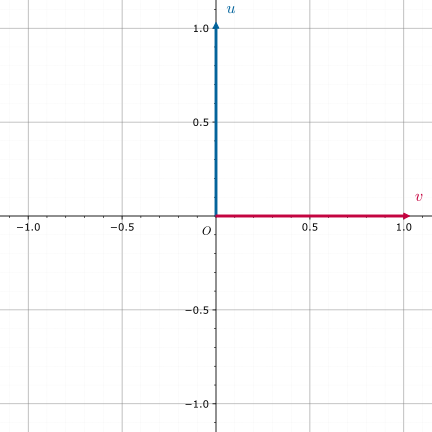
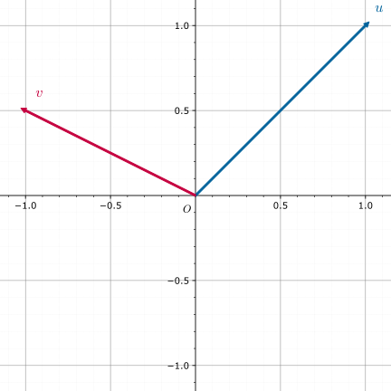
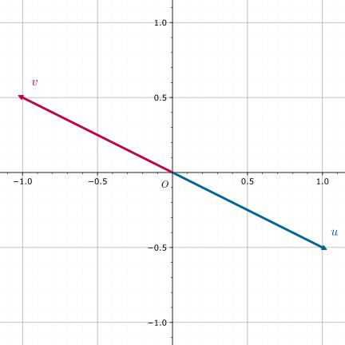
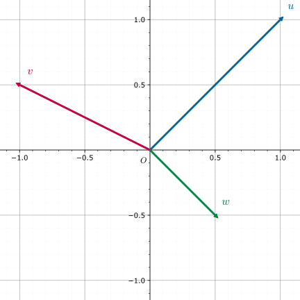

# 线性基 - OI Wiki

- Source: https://oi-wiki.org/math/linear-algebra/basis/

# 线性基

å›žæƒ³é«˜ä¸­æ•°å­¦ç«‹ä½“å‡ ä½•ä¸­åŸºå‘é‡çš„æ¦‚å¿µï¼Œæˆ‘ä»¬å¯ä»¥åœ¨ä¸‰ç»´æ¬§æ°ç©ºé—´ä¸­æ‰¾åˆ°ä¸€ç»„åŸºå‘é‡ 𝒊i，𝒋j，𝒌k，之后空间中任意一个向量都可以由这组基向量表示．换句话说，我们可以 **é€šè¿‡æœ‰é™çš„åŸºå‘é‡æ¥æè¿°æ— é™çš„ä¸‰ç»´ç©ºé—´** ，这足以体现基向量的重要性．

三维欧氏空间是特殊的 [线性空间](../vector-space/)，三维欧氏空间的基向量在线性空间中就被推广为了线性基．

OI ä¸­æœ‰å ³çº¿æ€§åŸºçš„åº”ç”¨ä¸€èˆ¬åªæ¶‰åŠä¸¤ç±»çº¿æ€§ç©ºé—´ï¼šð‘›n 维实线性空间 𝐑𝑛Rn 和 𝑛n ç»´ [布尔域](https://en.wikipedia.org/wiki/Boolean_domain) 线性空间 𝐙𝑛2Z2n，我们会在 应用 ä¸€èŠ‚ä¸­è¯¦ç»†ä»‹ç»ï¼Žè‹¥æ‚¨ä¸ç†Ÿæ‚‰çº¿æ€§ä»£æ•°ï¼Œåˆ™æŽ¨èä»Žåº”ç”¨éƒ¨åˆ†å¼€å§‹é˜ è¯»ï¼Ž

以下会从一般的线性空间出发来介绍线性基，并给出线性基的常见性质．

前置知识：[线性空间](../vector-space/)．

çº¿æ€§åŸºæ˜¯çº¿æ€§ç©ºé—´çš„ä¸€ç»„åŸºï¼Œæ˜¯ç ”ç©¶çº¿æ€§ç©ºé—´çš„é‡è¦å·¥å ·ï¼Ž

## 定义

称线性空间 𝑉V çš„ä¸€ä¸ªæžå¤§çº¿æ€§æ— å ³ç»„ä¸º 𝑉V 的一组 **Hamel 基** 或 **线性基** ，简称 **基** ．

规定线性空间 {𝜃}{θ} 的基为空集．

可以证明任意线性空间均存在线性基1，我们定义线性空间 𝑉V 的 **维数** ä¸ºçº¿æ€§åŸºçš„å ƒç´ ä¸ªæ•°ï¼ˆæˆ–åŠ¿ï¼‰ï¼Œè®°ä½œ dim⁡𝑉dim⁡V．

## 性质

  1. 对于有限维线性空间 𝑉V, è®¾å ¶ç»´æ•°ä¸º 𝑛n, 则：

     1. 𝑉V 中的任意 𝑛 +1n+1 ä¸ªå‘é‡çº¿æ€§ç›¸å ³ï¼Ž

     2. 𝑉V 中的任意 𝑛n ä¸ªçº¿æ€§æ— å ³çš„å‘é‡å‡ä¸º 𝑉V 的基．

     3. 若 𝑉V 中的任意向量均可被向量组 𝑎1,𝑎2,…,𝑎𝑛a1,a2,…,an çº¿æ€§è¡¨å‡ºï¼Œåˆ™å ¶æ˜¯ 𝑉V 的一个基．

证明

任取 𝑉V 中的一组基 𝑏1,𝑏2,…,𝑏𝑛b1,b2,…,bn, 由已知条件，向量组 𝑏1,𝑏2,…,𝑏𝑛b1,b2,…,bn 可被 𝑎1,𝑎2,…,𝑎𝑛a1,a2,…,an çº¿æ€§è¡¨å‡ºï¼Œæ• 

𝑛=rank⁡{𝑏1,𝑏2,…,𝑏𝑛}≤rank⁡{𝑎1,𝑎2,…,𝑎𝑛}≤𝑛n=rank⁡{b1,b2,…,bn}≤rank⁡{a1,a2,…,an}≤n

å› æ­¤ rank⁡{𝑎1,𝑎2,…,𝑎𝑛} =𝑛rank⁡{a1,a2,…,an}=n

     4. 𝑉V ä¸­ä»»æ„çº¿æ€§æ— å ³å‘é‡ç»„ 𝑎1,𝑎2,…,𝑎𝑚a1,a2,…,am å‡å¯é€šè¿‡æ’å ¥ä¸€äº›å‘é‡ä½¿å¾—å ¶å˜ä¸º 𝑉V 的一个基．

  2. ï¼ˆå­ç©ºé—´ç»´æ•°å ¬å¼ï¼‰ä»¤ 𝑉1,𝑉2V1,V2 æ˜¯å ³äºŽ ℙP 的有限维线性空间，且 𝑉1 +𝑉2V1+V2 和 𝑉1 ∩𝑉2V1∩V2 也是有限维的，则 dim⁡𝑉1 +dim⁡𝑉2 =dim⁡(𝑉1 +𝑉2) +dim⁡(𝑉1 ∩𝑉2)dim⁡V1+dim⁡V2=dim⁡(V1+V2)+dim⁡(V1∩V2)

证明

设 dim⁡𝑉1 =𝑛1dim⁡V1=n1,dim⁡𝑉2 =𝑛2dim⁡V2=n2,dim⁡(𝑉1 ∩𝑉2) =𝑚dim⁡(V1∩V2)=m.

取 𝑉1 ∩𝑉2V1∩V2 的一组基 𝑎1,𝑎2,…,𝑎𝑚a1,a2,…,am, å°†å ¶åˆ†åˆ«æ‰©å 为 𝑉1V1 和 𝑉2V2 中的基：𝑎1,𝑎2,…,𝑎𝑚,𝑏1,𝑏2,…,𝑏𝑛1−𝑚a1,a2,…,am,b1,b2,…,bn1−m 和 𝑎1,𝑎2,…,𝑎𝑚,𝑐1,𝑐2,…,𝑐𝑛2−𝑚a1,a2,…,am,c1,c2,…,cn2−m.

接下来只需证明向量组 𝑎1,𝑎2,…,𝑎𝑚,𝑏1,𝑏2,…,𝑏𝑛1−𝑚,𝑐1,𝑐2,…,𝑐𝑛2−𝑚a1,a2,…,am,b1,b2,…,bn1−m,c1,c2,…,cn2−m çº¿æ€§æ— å ³å³å¯ï¼Ž

设 ∑𝑚𝑖=1𝑟𝑖𝑎𝑖 +∑𝑛1−𝑚𝑖=1𝑠𝑖𝑏𝑖 +∑𝑛2−𝑚𝑖=1𝑡𝑖𝑐𝑖 =𝜃∑i=1mriai+∑i=1n1−msibi+∑i=1n2−mtici=θ.

则 ∑𝑛2−𝑚𝑖=1𝑡𝑖𝑐𝑖 = −∑𝑚𝑖=1𝑟𝑖𝑎𝑖 −∑𝑛1−𝑚𝑖=1𝑠𝑖𝑏𝑖∑i=1n2−mtici=−∑i=1mriai−∑i=1n1−msibi.

注意到上式左边在 𝑉2V2 中，右边在 𝑉1V1 ä¸­ï¼Œæ• ä¸¤è¾¹å‡åœ¨ 𝑉1 ∩𝑉2V1∩V2 ä¸­ï¼Œå› æ­¤ ∑𝑛2−𝑚𝑖=1𝑡𝑖𝑐𝑖 =∑𝑚𝑖=1𝑘𝑖𝑎𝑖∑i=1n2−mtici=∑i=1mkiai

æ• ð‘¡1 =𝑡2 =⋯ =𝑡𝑛2−𝑚 =𝑘1 =𝑘2 =⋯ =𝑘𝑚 =0t1=t2=⋯=tn2−m=k1=k2=⋯=km=0, 进而 𝑟1 =𝑟2 =⋯ =𝑟𝑚 =𝑠1 =𝑠2 =⋯ =𝑠𝑛1−𝑚 =𝑡1 =𝑡2 =⋯ =𝑡𝑛2−𝑚 =0r1=r2=⋯=rm=s1=s2=⋯=sn1−m=t1=t2=⋯=tn2−m=0

  3. 令 𝑉1,𝑉2V1,V2 æ˜¯å ³äºŽ ℙP 的有限维线性空间，且 𝑉1 +𝑉2V1+V2 和 𝑉1 ∩𝑉2V1∩V2 也是有限维的，则下列诸款等价：

     1. 𝑉1 +𝑉2 =𝑉1 ⊕𝑉2V1+V2=V1⊕V2.

     2. dim⁡𝑉1 +dim⁡𝑉2 =dim⁡(𝑉1 +𝑉2)dim⁡V1+dim⁡V2=dim⁡(V1+V2).

     3. 若 𝑎1,𝑎2,…,𝑎𝑛a1,a2,…,an 是 𝑉1V1 的一组基，𝑏1,𝑏2,…,𝑏𝑚b1,b2,…,bm 是 𝑉2V2 的一组基，则 𝑎1,𝑎2,…,𝑎𝑛,𝑏1,𝑏2,…,𝑏𝑚a1,a2,…,an,b1,b2,…,bm 是 𝑉1 +𝑉2V1+V2 的一组基．

Note

1,3 ä¸¤æ¡å¯æŽ¨å¹¿åˆ°æ— é™ç»´çº¿æ€§ç©ºé—´ä¸­

## 例子

考虑 ℝ2R2 的基．

  1. 如图



𝑢,𝑣u,v 是一组基．

  2. 如图



𝑢,𝑣u,v 是一组基．

  3. 如图



𝑢,𝑣u,v ä¸æ˜¯ä¸€ç»„åŸºï¼Œå› ä¸º 𝑢 = −𝑣u=−v.

  4. 如图



𝑢,𝑣,𝑤u,v,w ä¸æ˜¯ä¸€ç»„åŸºï¼Œå› ä¸º 𝑢 +4𝑣 +6𝑤 =𝜃u+4v+6w=θ.

## 正交基与单位正交基

若线性空间 𝑉V 的一组基 𝐵B 满足 ∀𝑏,𝑏′ ∈𝐵, (𝑏,𝑏′) ≠0 ⟺ 𝑏 =𝑏′∀b,b′∈B, (b,b′)≠0⟺b=b′（即两两正交），则称这组基是 **正交基** ．

若线性空间 𝑉V 的一组正交基 𝐵B 还满足 ∀𝑏 ∈𝐵, |𝑏| =√(𝑏,𝑏) =1∀b∈B, |b|=(b,b)=1，则称这组基是 **单位正交基** ．

任意有限维线性空间 𝑉V 的基都可以通过 [Schmidt 正交化](https://en.wikipedia.org/wiki/Gram%E2%80%93Schmidt_process) 变换为正交基．

## 应用

æ ¹æ®å‰æ–‡å† å®¹ï¼Œæˆ‘ä»¬å¯ä»¥åˆ©ç”¨çº¿æ€§åŸºå®žçŽ°ï¼š

  1. 求给定向量组的秩；
  2. å¯¹ç»™å®šçš„å‘é‡ç»„ï¼Œæ‰¾åˆ°ä¸€ç»„æžå¤§çº¿æ€§æ— å ³ç»„ï¼ˆæˆ–å ¶å¼ æˆçš„çº¿æ€§ç©ºé—´çš„ä¸€ç»„åŸºï¼‰ï¼›
  3. å‘ç»™å®šçš„å‘é‡ç»„æ’å ¥æŸäº›å‘é‡ï¼Œåœ¨æ’å ¥æ“ä½œåŽçš„å‘é‡ç»„ä¸­æ‰¾åˆ°ä¸€ç»„æžå¤§çº¿æ€§æ— å ³ç»„ï¼ˆæˆ–å ¶å¼ æˆçš„çº¿æ€§ç©ºé—´çš„ä¸€ç»„åŸºï¼‰ï¼›
  4. å¯¹æ‰¾åˆ°çš„ä¸€ç»„æžå¤§çº¿æ€§æ— å ³ç»„ï¼ˆæˆ–åŸºï¼‰ï¼Œåˆ¤æ–­æŸå‘é‡èƒ½å¦è¢«å ¶çº¿æ€§è¡¨å‡ºï¼›
  5. å¯¹æ‰¾åˆ°çš„ä¸€ç»„æžå¤§çº¿æ€§æ— å ³ç»„ï¼ˆæˆ–åŸºï¼‰ï¼Œæ±‚å ¶å¼ æˆçš„çº¿æ€§ç©ºé—´ä¸­çš„ç‰¹æ®Šå ƒç´ ï¼ˆå¦‚æœ€å¤§å ƒã€æœ€å°å ƒç­‰ï¼‰ï¼Ž

在 OI 中，我们一般将 𝑛n 维实线性空间 𝐑𝑛Rn 下的线性基称为 **实数线性基** ，𝑛n 维布尔域线性空间 𝐙𝑛2Z2n 下的线性基称为 **异或线性基** ．

Tip

𝐙2Z2 ä¸­çš„åŠ æ³•ä¸ºå¼‚æˆ–ï¼Œä¹˜æ³•ä¸ºä¸Žï¼Œå¯ä»¥è¯æ˜Ž 𝐙2Z2 是域．

可以证明代数系统 (𝐙𝑛2, +, ⋠,𝐙2)(Z2n,+,⋠,Z2) æ˜¯çº¿æ€§ç©ºé—´ï¼Œå ¶ä¸­ï¼š

(𝑎1,…,𝑎𝑛)+(𝑏1,…,𝑏𝑛):=(𝑎1+𝑏1,…,𝑎𝑛+𝑏𝑛),(a1,…,an)+(b1,…,bn):=(a1+b1,…,an+bn), 𝑘⋠(𝑎1,…,𝑎𝑛):=(𝑘𝑎1,…,𝑘𝑎𝑛).k⋠(a1,…,an):=(ka1,…,kan).

å³åŠ æ³•æ˜¯å¼‚æˆ–ï¼Œæ•°ä¹˜æ˜¯ä¸Žï¼Ž

ä»¥å¼‚æˆ–çº¿æ€§åŸºä¸ºä¾‹ï¼Œæˆ‘ä»¬å¯ä»¥æ ¹æ®ç»™å®šçš„ä¸€ç»„å¸ƒå°”åºåˆ— 𝑋 ={𝑥1,…,𝑥𝑚}X={x1,…,xm} æž„é€ å‡ºä¸€ç»„å¼‚æˆ–çº¿æ€§åŸº 𝐵 ={𝑏1,…,𝑏𝑛}B={b1,…,bn}，这组基有如下性质：

  1. 𝐵B 中任意非空子集的异或和不为 00；
  2. 对 𝑋X ä¸­çš„ä»»æ„å ƒç´ ð‘¥x，都可在 𝐵B ä¸­å–å‡ºè‹¥å¹²å ƒç´ ä½¿å ¶å¼‚æˆ–å’Œä¸º 𝑥x；
  3. 对任意满足上两条的集合 𝐵′Bâ€²ï¼Œå ¶å ƒç´ ä¸ªæ•°ä¸ä¼šå°äºŽ 𝐵B çš„å ƒç´ ä¸ªæ•°ï¼Ž

我们可以利用异或线性基实现：

  1. 判断一个数能否表示成某数集子集的异或和；
  2. 求一个数表示成某数集子集异或和的方案数；
  3. 求某数集子集的最大/最小/第 𝑘k 大/第 𝑘k 小异或和；
  4. 求一个数在某数集子集异或和中的排名．

### æž„é€ æ–¹æ³•

å› ä¸ºå¼‚æˆ–çº¿æ€§åŸºä¸Žå®žæ•°çº¿æ€§åŸºæ²¡æœ‰æœ¬è´¨å·®åˆ«ï¼Œæ‰€ä»¥æŽ¥ä¸‹æ¥ä»¥å¼‚æˆ–çº¿æ€§åŸºä¸ºä¾‹ï¼Œå®žæ•°çº¿æ€§åŸºç‰ˆæœ¬çš„ä»£ç åªéœ€åšä¸€ç‚¹ç®€å•ä¿®æ”¹å³å¯ï¼Ž

#### 贪心法

对原集合的每个数 𝑝p 转为二进制，从高位向低位扫，对于第 𝑥x 位是 11 的，如果 𝑎𝑥ax 不存在，那么令 𝑎𝑥 ←𝑝ax←p 并结束扫描，如果存在，令 𝑝 ←𝑝 xor 𝑎𝑥p←p xor ax．

æŸ¥è¯¢åŽŸé›†åˆå† ä»»æ„å‡ ä¸ªå ƒç´ xorxor 的最大值，只需将线性基从高位向低位扫，若 xorxor 上当前扫到的 𝑎𝑥ax 答案变大，就把答案异或上 𝑎𝑥ax．

ä¸ºä»€ä¹ˆèƒ½è¡Œå‘¢ï¼Ÿå› ä¸ºä»Žé«˜å¾€ä½Žä½æ‰«ï¼Œè‹¥å½“å‰æ‰«åˆ°ç¬¬ 𝑖i 位，意味着可以保证答案的第 𝑖i 位为 11，且后面没有机会改变第 𝑖i 位．

æŸ¥è¯¢åŽŸé›†åˆå† ä»»æ„å‡ ä¸ªå ƒç´ xorxor çš„æœ€å°å€¼ï¼Œå°±æ˜¯çº¿æ€§åŸºé›†åˆæ‰€æœ‰å ƒç´ ä¸­æœ€å°çš„é‚£ä¸ªï¼Ž

æŸ¥è¯¢æŸä¸ªæ•°æ˜¯å¦èƒ½è¢«å¼‚æˆ–å‡ºæ¥ï¼Œç±»ä¼¼äºŽæ’å ¥ï¼Œå¦‚æžœæœ€åŽæ’å ¥çš„æ•° 𝑝p 被异或成了 00，则能被异或出来．

ä»£ç ï¼ˆæ´›è°· P3812 [【模板】线性基](https://www.luogu.com.cn/problem/P3812)）

```text 1 2 3 4 5 6 7 8 9 10 11 12 13 14 15 16 17 18 19 20 21 22 23 24 25 26 27 28 29 30 31 32 33 34 35 36 ``` |  ```text #include <algorithm> #include <iostream> using ull = unsigned long long ; ull p [ 64 ]; void insert ( ull x ) { for ( int i = 63 ; ~ i ; \-- i ) { if ( ! ( x >> i )) // x 的第 i 位是 0 continue ; if ( ! p [ i ]) { p [ i ] = x ; break ; } x ^= p [ i ]; } } using std :: cin ; using std :: cout ; int main () { int n ; cin >> n ; ull a ; for ( int i = 1 ; i <= n ; ++ i ) { cin >> a ; insert ( a ); } ull ans = 0 ; for ( int i = 63 ; ~ i ; \-- i ) { ans = std :: max ( ans , ans ^ p [ i ]); } cout << ans << '\n' ; return 0 ; } ```   
---|---  
  
#### é«˜æ–¯æ¶ˆå ƒæ³•

é«˜æ–¯æ¶ˆå ƒæ³•ç›¸å½“äºŽä»Žçº¿æ€§æ–¹ç¨‹ç»„çš„è§’åº¦åŽ»æž„é€ çº¿æ€§åŸºï¼Œæ­£ç¡®æ€§æ˜¾ç„¶ï¼Ž

ä»£ç ï¼ˆæ´›è°· P3812 [【模板】线性基](https://www.luogu.com.cn/problem/P3812)）

```text 1 2 3 4 5 6 7 8 9 10 11 12 13 14 15 16 17 18 19 20 21 22 23 24 25 26 27 28 29 30 31 32 33 34 35 36 37 38 39 ``` |  ```text #include <iostream> using ull = unsigned long long ; constexpr int MAXN = 1e5 \+ 5 ; ull deg ( ull num , int deg ) { return num & ( 1ull << deg ); } ull a [ MAXN ]; using std :: cin ; using std :: cout ; int main () { cin . tie ( nullptr ) -> sync_with_stdio ( false ); int n ; cin >> n ; for ( int i = 1 ; i <= n ; ++ i ) cin >> a [ i ]; int row = 1 ; for ( int col = 63 ; ~ col && row <= n ; \-- col ) { for ( int i = row ; i <= n ; ++ i ) { if ( deg ( a [ i ], col )) { std :: swap ( a [ row ], a [ i ]); break ; } } if ( ! deg ( a [ row ], col )) continue ; for ( int i = 1 ; i <= n ; ++ i ) { if ( i == row ) continue ; if ( deg ( a [ i ], col )) { a [ i ] ^= a [ row ]; } } ++ row ; } ull ans = 0 ; for ( int i = 1 ; i < row ; ++ i ) { ans ^= a [ i ]; } cout << ans << '\n' ; return 0 ; } ```   
---|---  
  
### 性质

è´ªå¿ƒæ³•æž„é€ çš„çº¿æ€§åŸºå ·æœ‰å¦‚ä¸‹æ€§è´¨ï¼š

  * 线性基没有异或和为 00 的子集．
  * 线性基中各数二进制最高位不同．

é«˜æ–¯æ¶ˆå ƒæ³•æž„é€ å‡ºçš„çº¿æ€§åŸºæ»¡è¶³å¦‚ä¸‹æ€§è´¨ï¼š

  * é«˜æ–¯æ¶ˆå ƒåŽçš„çŸ©é˜µæ˜¯ä¸€ä¸ªè¡Œç®€åŒ–é˜¶æ¢¯å½¢çŸ©é˜µï¼Ž

> è¯¥æ€§è´¨åŒ å«äº†è´ªå¿ƒæ³•æž„é€ çš„çº¿æ€§åŸºæ»¡è¶³çš„ä¸¤æ¡æ€§è´¨

如果不理解这条性质的正确性，可以跳转 [é«˜æ–¯æ¶ˆå ƒ](../../numerical/gauss/)．

æä¾›ä¸€ç»„æ ·ä¾‹ï¼š

```text 1 2 ``` |  ```text 5 633 211 169 841 1008 ```   
---|---  
  
二进制表示：

```text 1 2 3 4 5 ``` |  ```text 1001111001 0011010011 0010101001 1101001001 1111110000 ```   
---|---  
  
贪心法生成的线性基：

```text 1 2 3 4 5 6 7 8 9 10 ``` |  ```text 1001111001 0100110000 0011010011 0001111010 0000000000 0000010000 0000000000 0000000000 0000000000 0000000000 ```   
---|---  
  
é«˜æ–¯æ¶ˆå ƒæ³•ç”Ÿæˆçš„çº¿æ€§åŸºï¼š

```text 1 2 3 4 5 6 7 8 9 10 ``` |  ```text 1000000011 0100100000 0010101001 0001101010 0000010000 0000000000 0000000000 0000000000 0000000000 0000000000 ```   
---|---  
  
è¿™æ˜¯ä¸€æ¡éžå¸¸å¥½çš„æ€§è´¨ï¼Œèƒ½å¸®æˆ‘ä»¬æ›´æ–¹ä¾¿çš„è§£å†³å¾ˆå¤šé—®é¢˜ï¼Žæ¯”å¦‚ï¼šç»™å®šä¸€äº›æ•°ï¼Œé€‰å ¶ä¸­ä¸€äº›å¼‚æˆ–èµ·æ¥ï¼Œæ±‚å¼‚æˆ–æœ€å¤§å€¼ï¼Œå¦‚æžœç”¨è´ªå¿ƒæ³•æž„é€ çº¿æ€§åŸºï¼Œéœ€è¦å†åšä¸€éè´ªå¿ƒï¼Œå¦‚æžœ `ans` 的当前位是 `0`，那么异或一定会更优，否则当前位如果为 `1`ï¼Œåˆ™ä¸€å®šä¸ä¼šæ›´ä¼˜ï¼›è€Œä½¿ç”¨é«˜æ–¯æ¶ˆå ƒæ³•æž„é€ çº¿æ€§åŸºåŽç›´æŽ¥å°†çº¿æ€§åŸºä¸­æ‰€æœ‰å ƒç´ éƒ½å¼‚æˆ–èµ·æ¥è¾“å‡ºå³å¯ï¼Ž

å¯¹äºŽå ¶ä»–æ¯”è¾ƒç»å ¸çš„é—®é¢˜ï¼ˆæŸ¥è¯¢ä¸€ä¸ªæ•°èƒ½å¦è¢«å¼‚æˆ–å¾—åˆ°ï¼ŒæŸ¥è¯¢èƒ½è¢«å¼‚æˆ–å¾—åˆ°çš„ç¬¬ 𝑘k å¤§æ•°ç­‰ï¼‰ï¼Œé«˜æ–¯æ¶ˆå ƒæ³•å¾—åˆ°çš„çº¿æ€§åŸºä¹Ÿèƒ½æ›´åŠ æ–¹ä¾¿åœ°è§£å†³ï¼Ž

### 时间复杂度

设向量长度为 𝑛n, 总数为 𝑚m, 则时间复杂度为 𝑂(𝑛𝑚)O(nm). å ¶ä¸­é«˜æ–¯æ¶ˆå ƒæ³•çš„å¸¸æ•°ç•¥å¤§ï¼Ž

若是实数线性基，则时间复杂度为 𝑂(𝑛2𝑚)O(n2m).

### 线性基合并

çº¿æ€§åŸºçš„åˆå¹¶åªéœ€è¦æš´åŠ›å¤„ç†ï¼Œå³å°†è¦åˆå¹¶çš„ä¸€ç»„çº¿æ€§åŸºæš´åŠ›åœ°æ’å ¥åˆ°å¦ä¸€ç»„çº¿æ€§åŸºå³å¯ï¼Žå•æ¬¡åˆå¹¶çš„æ—¶é—´å¤æ‚åº¦æ˜¯ 𝑂(𝑛2)O(n2)（异或线性基）或 𝑂(𝑛3)O(n3)（实数线性基）．

### 线性基求交

çº¿æ€§åŸºæ±‚äº¤ï¼Œä¸¥æ ¼åœ°è¯´å°±æ˜¯æ±‚å®ƒä»¬å¼ æˆçš„ä¸¤ä¸ªçº¿æ€§ç©ºé—´çš„äº¤ç©ºé—´çš„ä¸€ç»„çº¿æ€§åŸºï¼Žæœ¬èŠ‚ä»‹ç»ä¸¤ç§ç®—æ³•ï¼Žè¿™ä¸¤ç§ç®—æ³•ï¼Œå•æ¬¡æ±‚äº¤çš„æ—¶é—´å¤æ‚åº¦éƒ½æ˜¯ 𝑂(𝑛2)O(n2)（异或线性基）或 𝑂(𝑛3)O(n3)（实数线性基）．

#### æœ´ç´ ç®—æ³•

设要求交的线性基分别是 𝛼α 和 𝛽β．线性基求交的算法只需要对线性基暴力合并的算法做如下调整：（以异或线性基为例）

  * 将线性基 𝛽β 中的向量 𝛽𝑗βj 利用 贪心法 å°è¯•æ’å ¥åˆ° 𝛼α 中，并初始化线性基的交 𝛾γ 为空集；
  * åœ¨æ’å ¥æ—¶ï¼Œéœ€è¦è®°å½•è¦æ’å ¥çš„å‘é‡ä¸­ï¼Œçº¿æ€§åŸº 𝛽β ä¸­å ƒç´ çš„è´¡çŒ®ï¼Žå ·ä½“åœ°ï¼Œç»´æŒä¸€ä¸ªæ–°å‘é‡ 𝑏b，初始化为 𝛽𝑗βjï¼Œè€Œä¸”ï¼Œå¦‚æžœæ­£åœ¨æ’å ¥çš„å‘é‡ä¸Žçº¿æ€§åŸºä¸­ç¬¬ 𝑥x 位的向量取了异或，那么贡献 𝑏b 也要与第 𝑥x 位记录的贡献 𝑏𝑥bx 取一次异或；
  * å¦‚æžœæ’å ¥æˆåŠŸï¼Œåœ¨çº¿æ€§åŸºçš„ç¬¬ 𝑥x ä½æ’å ¥äº†å‘é‡ 𝛽′𝑗βj′，就将第 𝑥x 位记录的 𝑏𝑥bx 改为得到 𝛽′𝑗βj′ 的过程中线性基 𝛽β ä¸­å ƒç´ çš„è´¡çŒ® 𝑏b；
  * å¦‚æžœæ’å ¥ä¸æˆåŠŸï¼Œå°±å°†è¿‡ç¨‹ä¸­è®°å½•åˆ°çš„çº¿æ€§åŸº 𝛽β ä¸­å ƒç´ çš„è´¡çŒ® 𝑏b æ’å ¥åˆ° 𝛾γ 中．

è¿™æ ·å¾—åˆ°çš„çº¿æ€§åŸº 𝛾γ 就是所求的交，当然，该算法同时也求出了线性基的并．

对算法的解释

设合并后的线性基为 {𝛼1,⋯,𝛼𝑚,𝛽′𝑗1,⋯,𝛽′𝑗ℓ}{α1,⋯,αm,βj1′,⋯,βjℓ′}ï¼Œå ¶ä¸­ï¼Œð›½â€²ð‘—ð‘˜Î²jk′ æ˜¯æ’å ¥ 𝛽𝑗𝑘βjk 时最后得到的向量．那么，{𝛼1,⋯,𝛼𝑚,𝛽𝑗1,⋯,𝛽𝑗ℓ}{α1,⋯,αm,βj1,⋯,βjℓ} åŒæ ·æ˜¯ä¸€ç»„åˆå¹¶åŽçš„çº¿æ€§åŸºï¼Žè®° 𝛽+β+ 为集合 {𝛽𝑗1,⋯,𝛽𝑗ℓ}{βj1,⋯,βjℓ}，则合并后的基可以写作 𝛼 ∪𝛽+α∪β+．而且，和空间中的每个向量 𝑐c 都可以唯一地表示成

𝑐=𝑎⊕𝑏c=a⊕b

çš„å½¢å¼ï¼Œå ¶ä¸­ï¼Œð‘Ž ∈span⁡𝛼a∈span⁡α 且 𝑏 ∈span⁡𝛽+b∈span⁡β+．这个分解中的 𝑏b 就是前文算法所 **试图** 记录的「线性基 𝛽β ä¸­å ƒç´ çš„è´¡çŒ®ã€ï¼Žä¸¥æ ¼åœ°è¯´ï¼Œåªæ˜¯ 𝛽β ä¸­æœ€åŽæˆåŠŸæ’å ¥çš„é‚£äº›å‘é‡çš„è´¡çŒ®ï¼Ž

å¯¹äºŽæˆåŠŸçš„æ’å ¥ï¼Œæœ€åŽè®°å½•çš„ 𝑏b 就是该分解中的 𝑏b 项．设 𝛽𝑗 ∈𝛽+βj∈β+．初始时，𝛽𝑗 =0 ⊕𝛽𝑗βj=0⊕βj，已经是 𝛽𝑗βj 在基 𝛼 ∪𝛽+α∪β+ 上的正确的分解．在更新 𝛽′𝑗 =𝑎 ⊕𝑏βj′=a⊕b 为 𝛽′𝑗 ⊕𝑐𝑥βj′⊕cx æ—¶ï¼Œå› ä¸º 𝛽′𝑗 ⊕𝑐𝑥 =(𝑎 ⊕𝑎𝑥) ⊕(𝑏 ⊕𝑏𝑥)βj′⊕cx=(a⊕ax)⊕(b⊕bx)，所以，只需要更新 𝑏b 为 𝑏 ⊕𝑏𝑥b⊕bxï¼Œå°±å¯ä»¥ä¿è¯åˆ†è§£ä¾ç„¶æ­£ç¡®ï¼Žå› æ­¤ï¼Œå½’çº³å¯çŸ¥ï¼Œæœ€åŽæ’å ¥ 𝛽′𝑗βj′ 到合并后的线性基中时，记录的贡献 𝑏b 就是上述分解中的 𝑏b 项．

å¯¹äºŽä¸æˆåŠŸçš„æ’å ¥ï¼Œæœ€åŽè¦æ’å ¥çš„å˜é‡ä¸€å®šä¼šå˜æˆ 00，而此时的贡献 𝑏b è¦æ’å ¥åˆ° 𝛾γ ä¸­ï¼Žæ­¤æ—¶ï¼Œå¦‚æžœé‡å¤ä¸Šé¢çš„è®ºè¯ï¼Œä¼šå‘çŽ°ä»ç„¶èƒ½å¤Ÿä¿è¯åœ¨æ’å ¥è¿‡ç¨‹ä¸­æ€»æ˜¯æœ‰ 𝛽′𝑗 =𝑎 ⊕𝑏βj′=a⊕b，且 𝑎 ∈span⁡𝛼a∈span⁡α，只是 𝑏b 不再属于 span⁡𝛽+span⁡β+ï¼Žè¿™æ˜¯å› ä¸ºåˆå§‹åŒ–æ—¶ï¼Œð›½ð‘— =0 ⊕𝛽𝑗βj=0⊕βj 中的 𝛽𝑗 ∉𝛽+βj∉β+．除此之外，贡献更新时异或的项都属于 span⁡𝛽+span⁡β+ï¼Žæ‰€ä»¥ï¼Œå®žé™ ä¸Šï¼Œæœ‰ 𝑏 ⊕𝛽𝑗 ∈span⁡𝛽+b⊕βj∈span⁡β+．

é‚£ä¹ˆï¼Œä¸ºä»€ä¹ˆå°†è¿™äº›æ’å ¥ä¸æˆåŠŸæ—¶çš„ 𝑏b éƒ½æ’å ¥åˆ° 𝛾γ ä¸­ï¼Œå°±èƒ½å¾—åˆ°äº¤ç©ºé—´çš„çº¿æ€§åŸºå‘¢ï¼Ÿé¦–å ˆï¼Œæ’å ¥ 𝛽𝑗βj 不成功，最后一定会得到 0 =𝑎 ⊕𝑏0=a⊕bï¼Œå ¶ä¸­ï¼Œð‘Ž ∈span⁡𝛼a∈span⁡α 且 𝑏 ∈span⁡(𝛽+ ∪{𝛽𝑗}) ⊆span⁡𝛽b∈span⁡(β+∪{βj})⊆spanâ¡Î²ï¼Žå› æ­¤ï¼Œð‘ =𝑎b=a å¿ ç„¶ä½äºŽäº¤ç©ºé—´ span⁡𝛼 ∩span⁡𝛽span⁡α∩span⁡β 中．反过来，设 𝑐c æ˜¯äº¤ç©ºé—´ä¸­çš„ä»»æ„å ƒç´ ï¼Œå› ä¸º 𝑐 ∈span⁡𝛽c∈span⁡β，所以 𝑐c 可以表示为 𝛽β ä¸­å ƒç´ çš„çº¿æ€§ç»„åˆï¼ˆå¼‚æˆ–å’Œï¼‰ï¼š

𝑐=⨁𝛽𝑗∈𝛽𝜆𝑗𝛽𝑗,c=⨁βj∈βλjβj,

å ¶ä¸­ï¼Œðœ†ð‘— ∈{0,1}λj∈{0,1}．对于每一个 𝛽𝑗 ∉𝛽+βj∉β+ï¼Œè®°ç›¸åº”çš„æ’å ¥åˆ° 𝛾γ 中的贡献为 𝑏𝑗bj，就有

𝑐⊕⨁𝛽𝑗∉𝛽+𝜆𝑗𝑏𝑗=⨁𝛽𝑗∈𝛽+𝜆𝑗𝛽𝑗+⨁𝛽𝑗∉𝛽+𝜆𝑗(𝛽𝑗⊕𝑏𝑗),c⊕⨁βj∉β+λjbj=⨁βj∈β+λjβj+⨁βj∉β+λj(βj⊕bj),

注意到，𝑏𝑗bj 和 𝑐c éƒ½ä½äºŽäº¤ç©ºé—´ä¸­ï¼Œå› è€Œå·¦ä¾§å¿ ç„¶ä¹Ÿä½äºŽäº¤ç©ºé—´ä¸­ï¼Œæ• è€Œå·¦ä¾§å¯ä»¥å†™æˆ 𝛼α ä¸­å ƒç´ çš„çº¿æ€§ç»„åˆï¼›åŒæ—¶ï¼Œå³ä¾§æ‰€æœ‰é¡¹ï¼Œè¦ä¹ˆ 𝛽𝑗 ∈𝛽+βj∈β+，要么 𝛽𝑗 ∉𝛽+βj∉β+ 且 𝛽𝑗 ⊕𝑏𝑗 ∈𝛽+βj⊕bj∈β+ï¼Œæ• è€Œï¼Œå³ä¾§å®žé™ ä¸Šæ˜¯ 𝛽+β+ ä¸­å ƒç´ çš„çº¿æ€§ç»„åˆï¼Žä½†æ˜¯ï¼Œð›¼ ∪𝛽+α∪β+ çº¿æ€§æ— å ³ï¼Œæ• è€Œæ‰€æœ‰çš„ç³»æ•°éƒ½æ˜¯ 00，也就是说 𝑐 =⨁𝛽𝑗∉𝛽+𝜆𝑗𝑏𝑗 ∈span⁡{𝑏1,⋯,𝑏𝑗}c=⨁βj∉β+λjbj∈span⁡{b1,⋯,bj}ï¼Žè¿™å°±è¯´æ˜Žäº†ï¼Œè¿™äº›æ— æ³•æ’å ¥çš„å‘é‡çš„è´¡çŒ® 𝑏b å ±åŒå¼ æˆäº†äº¤ç©ºé—´ï¼Ž

æ ¹æ®è¿™ä¸€è§£é‡Šï¼Œè¿‡ç¨‹ä¸­ç»´æŠ¤è´¡çŒ® 𝑏b çš„ç›®çš„ï¼Œå®žé™ ä¸Šæ˜¯ä¸ºäº†ç»´æŠ¤åˆ†è§£ 𝑎 ⊕𝑏a⊕b；而且，最后向 𝛾γ æ’å ¥è´¡çŒ®æ—¶ä¹Ÿæ€»æœ‰ 𝑎 =𝑏a=bï¼Žæ‰€ä»¥ï¼Œæ— è®ºç»´æŠ¤ 𝛼α 还是 𝛽β ä¸­å ƒç´ çš„è´¡çŒ®ï¼ˆå³æ— è®ºç»´æŠ¤ 𝑎a 还是 𝑏b），得到的结果都是正确的．如果要维护线性基 𝛼α ä¸­å ƒç´ çš„è´¡çŒ®ï¼Œåªéœ€è¦ä¿®æ”¹åˆå§‹åŒ–æ—¶ç›¸åº”è´¡çŒ®çš„å–å€¼ï¼šæ¯ä¸ª 𝛼α 中的向量 𝛼𝑖αi 初始就有贡献 𝛼𝑖αiï¼Œè€Œæ’å ¥çš„ 𝛽𝑗βj 初始贡献为 00．

æ¨¡æ¿é¢˜ä»£ç å¦‚ä¸‹ï¼š

ä»£ç ï¼ˆLibrary Checker [Intersection of 𝐠2F2 vector spaces](https://judge.yosupo.jp/problem/intersection_of_f2_vector_spaces)）

```text 1 2 3 4 5 6 7 8 9 10 11 12 13 14 15 16 17 18 19 20 21 22 23 24 25 26 27 28 29 30 31 32 33 34 35 36 37 38 39 40 41 42 43 44 45 46 47 48 49 50 51 52 53 54 55 56 57 58 59 60 61 62 63 64 65 66 67 68 69 70 71 72 73 74 75 76 77 78 79 80 81 82 83 84 85 86 87 88 89 ``` |  ```text #include <array> #include <iostream> class LinearBasis { static constexpr int K = 30 ; std :: array < int , K > a ; // Size of basis. int size () const { int res = 0 ; for ( auto x : a ) { if ( x ) { ++ res ; } } return res ; } public : LinearBasis () : a {} {} // Insert vector x. void insert ( int x ) { for ( int k = K \- 1 ; ~ k && x ; \-- k ) { if (( x >> k ) & 1 ) { if ( ! a [ k ]) { a [ k ] = x ; } x ^= a [ k ]; } } } // Return a basis for *THIS intersecting RHS. LinearBasis intersect ( const LinearBasis & rhs ) const { LinearBasis res ; std :: array < int , K > c = a , b_parts = {}; for ( int i = K \- 1 ; ~ i ; \-- i ) { int x = rhs . a [ i ], b_part = x ; for ( int k = i ; ~ k && x ; \-- k ) { if (( x >> k ) & 1 ) { if ( ! c [ k ]) { c [ k ] = x ; b_parts [ k ] = b_part ; } x ^= c [ k ]; b_part ^= b_parts [ k ]; } } res . insert ( b_part ); } return res ; } // Output. void print () const { std :: cout << size (); for ( auto x : a ) { if ( x ) { std :: cout << ' ' << x ; } } std :: cout << '\n' ; } }; int main () { int t ; std :: cin >> t ; for (; t ; \-- t ) { LinearBasis a , b ; int n ; std :: cin >> n ; for (; n ; \-- n ) { int x ; std :: cin >> x ; a . insert ( x ); } int m ; std :: cin >> m ; for (; m ; \-- m ) { int x ; std :: cin >> x ; b . insert ( x ); } a . intersect ( b ). print (); } return 0 ; } ```   
---|---  
  
#### Zassenhaus 算法

另一种等价的做法是 Zassenhaus ç®—æ³•ï¼Œå®ƒåŒæ ·å¯ä»¥åŒæ—¶è®¡ç®—å‡ºä¸¤ä¸ªçº¿æ€§åŸºçš„å¹¶å’Œäº¤ï¼Žå¤æ‚åº¦å’Œä¸Šæ–‡å®Œå ¨ä¸€è‡´ï¼Ž

å ·ä½“æ­¥éª¤å¦‚ä¸‹ï¼š

  * 初始化一个向量长度为 2𝑛2n 的线性基 𝛾γ ä¸ºç©ºï¼Œå ¶ä¸­çš„å‘é‡å†™æˆ (𝑎,𝑏)(a,b) 的形式，且 𝑎a 和 𝑏b 长度均为 𝑛n；
  * 将 𝛼α ä¸­çš„å ƒç´ ð›¼ð‘–Î±i 以 (𝛼𝑖,𝛼𝑖)(αi,αi) çš„å½¢å¼æ’å ¥ 𝛾γ 中；
  * 将 𝛽β ä¸­çš„å ƒç´ ð›½ð‘—Î²j 以 (𝛽𝑗,0)(βj,0) çš„å½¢å¼æ’å ¥ 𝛾γ 中；
  * 最后得到的线性基 𝛾γ ä¸­çš„æ‰€æœ‰éžé›¶å ƒç´ (𝑐𝑘,𝑑𝑘)(ck,dk) 中，𝑐𝑘ck 非零的那些向量中项 𝑐𝑘ck çš„å ¨ä½“ç»„æˆäº† 𝛼α 和 𝛽β 的并的线性基，𝑐𝑘ck 为零的那些向量中项 𝑑𝑘dk çš„å ¨ä½“ç»„æˆäº† 𝛼α 和 𝛽β 的交的线性基．

ç®—æ³•ä¸­çš„æž„é€ çº¿æ€§åŸºçš„æ–¹æ³•å¯ä»¥æ˜¯ 贪心法 或 é«˜æ–¯æ¶ˆå ƒæ³•ï¼Œåªè¦ä¿è¯ 𝛾γ 中的线性基组成行阶梯型矩阵即可．

将 Zassenhaus ç®—æ³•ä¸­çš„æ¶ˆå ƒçš„æ­¥éª¤ä¸Žä¸Šé¢çš„æœ´ç´ ç®—æ³•ç›¸æ¯”è¾ƒï¼Œå¾ˆå®¹æ˜“å‘çŽ°ï¼ŒåŸºäºŽè´ªå¿ƒæ³•çš„ Zassenhaus 算法相当于维护 𝛼α ä¸­å ƒç´ çš„è´¡çŒ®çš„æœ´ç´ ç®—æ³•ï¼Žå¦‚æžœè½¬è€Œå ˆæ’å ¥æ‰€æœ‰ (𝛼𝑖,0)(αi,0)ï¼Œå†æ’å ¥æ‰€æœ‰ (𝛽𝑗,𝛽𝑗)(βj,βj)，那么基于贪心法的 Zassenhaus 算法就相当于维护 𝛽β ä¸­å ƒç´ è´¡çŒ®çš„æœ´ç´ ç®—æ³•ï¼Žæ ¹æ®æ¶ˆå ƒæ­¥éª¤çš„ç­‰ä»·æ€§ï¼ŒZassenhaus 算法的正确性也是成立的．

除此之外，还可以再提供一个独立且更为一般的代数证明：

正确性证明

设 𝑉V 为一线性空间，且有子空间 𝑈 =span⁡𝛼U=span⁡α 和 𝑊 =span⁡𝛽W=span⁡β．算法本身相当于通过化简为行阶梯型来求子空间

𝐻=span⁡({(𝛼𝑖,𝛼𝑖):𝛼𝑖∈𝛼}∪{(𝛽𝑗,0):𝛽𝑗∈𝛽})H=span⁡({(αi,αi):αi∈α}∪{(βj,0):βj∈β})

的一组基 𝛾γ．算法最后，𝛾γ ä¸­çš„å ƒç´ (𝑐𝑘,𝑑𝑘)(ck,dk) æ ¹æ® 𝑐𝑘 ≠0ck≠0 ä¸Žå¦éœ€è¦åˆ†ä¸ºä¸¤ç±»ï¼Œæ‰€ä»¥ä¸å¦¨è€ƒå¯ŸæŠ•å½±æ˜ å°„ 𝜋 :𝐻 →𝑉π:H→V 且 𝜋(𝑎,𝑏) =𝑎π(a,b)=a．于是，𝜋(𝐻) =𝑈 +𝑊π(H)=U+W 且容易验证

ker⁡𝜋=𝐻∩({0}×𝑉)={0}×(𝑈×𝑊).ker⁡π=H∩({0}×V)={0}×(U×W).

æ ¹æ® [çº¿æ€§æ˜ å°„çš„ç›¸å ³å®šç†](../linear-mapping/#线性æ˜)，有 dim⁡𝐻 =dim⁡𝜋(𝐻) +dim⁡ker⁡𝜋 =dim⁡(𝑈 +𝑊) +dim⁡(𝑈 ∩𝑊)dim⁡H=dim⁡π(H)+dim⁡ker⁡π=dim⁡(U+W)+dim⁡(U∩W)．

è¡Œé˜¶æ¢¯åž‹çŸ©é˜µçš„å‰å‡ åˆ—ä»ç„¶æ˜¯è¡Œé˜¶æ¢¯åž‹çŸ©é˜µï¼Œå› è€Œ 𝑐𝑘 ≠0ck≠0 的行的数目，恰好等于 𝛼 ∪𝛽α∪β 的行秩，亦即 dim⁡(𝑈 +𝑊)dim⁡(U+W)；而且，这些行中 𝑐𝑘ck 的集合就形成了 𝑈 +𝑊U+W 的一组基．剩下的非零行恰好有 dim⁡(𝑈 ∩𝑊)dim⁡(U∩W) 个，且都满足 𝑐𝑘 =0ck=0．对于这些行中的 𝑑𝑘dkï¼Œå› ä¸ºæœ‰ (0,𝑑𝑘) ∈ker⁡𝜋(0,dk)∈ker⁡π，所以 𝑑𝑘 ∈𝑈 ∩𝑊dk∈U∩W；而且，(0,𝑑𝑘)(0,dk) ä½œä¸ºè¡Œé˜¶æ¢¯åž‹çŸ©é˜µçš„è¡Œï¼Œå¿ ç„¶çº¿æ€§æ— å ³ï¼Œè¿™å°±è¯´æ˜Žè¿™äº› 𝑑𝑘dk éƒ½çº¿æ€§æ— å ³ï¼Žç»¼åˆèµ·æ¥ï¼Œè¿™äº› 𝑑𝑘dk 是交空间 𝑈 ∩𝑊U∩W 中大小为 dim⁡(𝑈 ∩𝑊)dim⁡(U∩W) çš„çº¿æ€§æ— å ³ç»„ï¼Œæ‰€ä»¥ä¹Ÿå¿ ç„¶æ˜¯è¯¥ç©ºé—´çš„ä¸€ç»„åŸºï¼Ž

æ¨¡æ¿é¢˜ä»£ç å¦‚ä¸‹ï¼š

ä»£ç ï¼ˆLibrary Checker [Intersection of 𝐠2F2 vector spaces](https://judge.yosupo.jp/problem/intersection_of_f2_vector_spaces)）

```text 1 2 3 4 5 6 7 8 9 10 11 12 13 14 15 16 17 18 19 20 21 22 23 24 25 26 27 28 29 30 31 32 33 34 35 36 37 38 39 40 41 42 43 44 45 46 47 48 49 50 51 52 53 54 55 56 57 58 59 60 61 62 63 64 ``` |  ```text #include <iostream> #include <vector> class LinearBasis { int K ; std :: vector < long long > a ; public : LinearBasis ( int K ) : K ( K ), a ( K ) {} // Insert vector x. void insert ( long long x ) { for ( int k = K \- 1 ; ~ k && x ; \-- k ) { if (( x >> k ) & 1 ) { if ( ! a [ k ]) { a [ k ] = x ; } x ^= a [ k ]; } } } // Output those not exceeding 2^k. void print ( int k ) const { int sz = 0 ; for ( int i = 0 ; i < k ; ++ i ) { if ( a [ i ]) { ++ sz ; } } std :: cout << sz ; for ( int i = 0 ; i < k ; ++ i ) { if ( a [ i ]) { std :: cout << ' ' << a [ i ]; } } std :: cout << '\n' ; } }; int main () { constexpr int K = 30 ; int t ; std :: cin >> t ; for (; t ; \-- t ) { LinearBasis c ( K << 1 ); int n ; std :: cin >> n ; for (; n ; \-- n ) { int x ; std :: cin >> x ; c . insert ((( long long ) x << K ) | x ); } int m ; std :: cin >> m ; for (; m ; \-- m ) { int x ; std :: cin >> x ; c . insert (( long long ) x << K ); } c . print ( K ); } return 0 ; } ```   
---|---  
  
注意，输出时只需要考虑前 𝑛n 位均为零的向量即可．

### 拓展：前缀线性基

æœ¬èŠ‚åªè®¨è®ºå¼‚æˆ–çº¿æ€§åŸºçš„æƒ å½¢ï¼Œå¹¶å‡è®¾å•ä¸ªå‘é‡å¯ä»¥å­˜å‚¨åœ¨ 𝑂(1)O(1) çš„ç©ºé—´å† ï¼Œä¸”å•æ¬¡æ“ä½œå¤æ‚åº¦æ€»æ˜¯ 𝑂(1)O(1) 的．

å¯¹äºŽéœ€è¦å¤šæ¬¡æŸ¥è¯¢åŒºé—´å¼‚æˆ–æœ€å¤§å€¼çš„æƒ å½¢ï¼Œä¸€ç§å¸¸è§çš„åšæ³•æ˜¯ [çŒ«æ ‘](../../../ds/cat-tree/) é åˆçº¿æ€§åŸºï¼Œæ—¶é—´å¤æ‚åº¦ä¸º 𝑂(𝑛𝑚log⁡𝑚 +𝑛2𝑞)O(nmlog⁡m+n2q)ï¼Œå ¶ä¸­ï¼Œð‘›n 是向量长度，𝑚m 是序列长度，𝑞q 是询问次数．另一种可行的做法是利用前缀线性基（或称时间戳线性基），可以将复杂度降低到 𝑂(𝑛(𝑚 +𝑞))O(n(m+q))．

å‰ç¼€çº¿æ€§åŸºå è®¸å¯¹äºŽåºåˆ—çš„æ¯ä¸ªå‰ç¼€ï¼Œéƒ½ç»´æŠ¤è¯¥å‰ç¼€çš„æ‰€æœ‰åŽç¼€çš„çº¿æ€§åŸºï¼Œè¿™æ ·å°±å¯ä»¥æ”¯æŒæŸ¥è¯¢æ¯ä¸ªåŒºé—´çš„çº¿æ€§åŸºï¼Žæ³¨æ„åˆ°åºåˆ—çš„æŸä¸ªå‰ç¼€ [1,𝑖][1,i] 的所有后缀 [𝑗,𝑖][j,i] çš„çº¿æ€§åŸºæ˜¯ç›¸äº’åŒ å«çš„ï¼Œå³ [𝑗,𝑖][j,i] çš„çº¿æ€§åŸºæ€»æ˜¯åŒ å«ç€ [𝑗 +1,𝑖][j+1,i] 的线性基，所以，这些后缀的线性基中互不相同的至多只有 𝑛n ç§ï¼Œè€Œä¸”æ€»æ˜¯å¯ä»¥é€šè¿‡å‘ç©ºé›†ä¸­é€æ­¥æ·»åŠ æ–°çš„å‘é‡æ¥å¾—åˆ°è‡ª [𝑖,𝑖][i,i] 到 [1,𝑖][1,i] æ‰€æœ‰è¿™äº›åŽç¼€çš„çº¿æ€§åŸºï¼Žå› æ­¤ï¼Œåˆ©ç”¨è¿™ä¸ªå•è°ƒæ€§ï¼Œåªéœ€è¦ä¸ºæ·»åŠ çš„æ¯ä¸ªå‘é‡ 𝑣vï¼Œéƒ½æ ‡è®°å®ƒå‡ºçŽ°çš„æœ€å¤§ä¸‹æ ‡ 𝑡t，就可以在 𝑂(𝑛)O(n) çš„ç©ºé—´å† å­˜å‚¨æ‰€æœ‰åŽç¼€çš„çº¿æ€§åŸºï¼Žè€Œä¸”ï¼ŒæŸ¥è¯¢åŒºé—´ [𝑗,𝑖][j,i] 对应的线性基时，只需要在 𝑖i å¤„çš„å‰ç¼€çº¿æ€§åŸºä¸­ä» ä¿ç•™æ ‡è®° 𝑡 ≥𝑗t≥j 的那些向量即可．

不妨将每个向量 𝑣v çš„æ ‡è®° 𝑡t 称为它的时间戳．线性基中的向量 𝑣v æ€»æ˜¯å¯ä»¥è¡¨ç¤ºä¸ºåŽŸåºåˆ—ä¸­æŸäº›å ƒç´ çš„å¼‚æˆ–å’Œï¼Œæ¯”å¦‚ 𝑣𝑖1 ⊕𝑣𝑖2 ⊕⋯ ⊕𝑣𝑖𝑘vi1⊕vi2⊕⋯⊕vikï¼Žè€Œåœ¨æ‰€æœ‰è¿™æ ·çš„å¯èƒ½çš„è¡¨ç¤ºä¸­ï¼Œæœ€å°ä¸‹æ ‡çš„æœ€å¤§å€¼å°±æ˜¯ 𝑡t，即

𝑡(𝑣)=max{𝑗:∃𝑖1,⋯,𝑖𝑘∈[𝑗,𝑖] s.t. 𝑣=𝑣𝑖1⊕𝑣𝑖2⊕⋯⊕𝑣𝑖𝑘}.t(v)=max{j:∃i1,⋯,ik∈[j,i] s.t. v=vi1⊕vi2⊕⋯⊕vik}.

这个表达式不过是将上一段的叙述用形式的语言写出来而已．它给我们带来的启发是，要维护线性基中每个向量 𝑣v 的时间戳，只需要贪心地选取尽可能新的向量替换掉旧的向量即可．

基于上文提到的 贪心法 æž„é€ çº¿æ€§åŸºï¼Œå‰ç¼€çº¿æ€§åŸºåœ¨æž„é€ è¿‡ç¨‹ä¸­åšäº†å¦‚ä¸‹è°ƒæ•´ï¼š

  * 为线性基中保留的每个向量 𝑎𝑥ax 都保存一个时间戳 𝑡𝑥tx，初始时均设为 00；
  * è¦æ·»åŠ åºåˆ—ä¸­ç¬¬ 𝑖i 个向量 𝑣v，仍然从高位向低位扫，但同时需要记录当前时间 𝑖i；
  * 如果 𝑣v 的第 𝑥x 位是一，就比较线性基中已有的向量 𝑎𝑥ax 的时间戳 𝑡𝑥tx 和当前时间 𝑖i：
    * 如果 𝑖 >𝑡𝑥i>txï¼Œå³è¦æ·»åŠ çš„å‘é‡æ—¶é—´æ›´æ™šï¼Œå°±å°† 𝑎𝑥ax 设为 𝑣v，并更新时间戳为 𝑖i，并将旧的 𝑎𝑥ax 异或 𝑣v 的结果 𝑎𝑥 ⊕𝑣ax⊕v æŒ‰ç §ä¹‹å‰è®°å½•çš„æ—¶é—´ 𝑡𝑥tx ç»§ç»­æ·»åŠ è¿‡ç¨‹ï¼›
    * 如果 𝑖 <𝑡𝑥i<txï¼Œå³è¦æ·»åŠ çš„å‘é‡æ—¶é—´æ›´æ—©ï¼Œä¸æ›´æ–° 𝑎𝑥ax 和 𝑡𝑥tx，将 𝑣v 异或 𝑎𝑥ax åŽç»§ç»­æ·»åŠ å³å¯ï¼Ž

也就是说，如果当前位可以通过较新的向量表示，就直接用较新的向量；否则，保留原来的向量．在更新位置 𝑥x 的向量时，不能将异或的结果 𝑎𝑥 ⊕𝑣ax⊕v å­˜å ¥ä½ç½® 𝑥xï¼Œå› ä¸ºå¼‚æˆ–çš„ç»“æžœ 𝑎𝑥 ⊕𝑣ax⊕v 的时间戳为 min{𝑡(𝑎𝑥) =𝑡(𝑣)} =𝑡(𝑎𝑥)min{t(ax)=t(v)}=t(ax)ï¼Œå°äºŽè¦æ·»åŠ çš„å˜é‡ 𝑣v 的时间戳 𝑡(𝑣)t(v)ï¼ŽåŒæ ·çš„åŽŸå› ï¼Œé«˜æ–¯æ¶ˆå ƒæ³• æž„é€ çº¿æ€§åŸºçš„è¿‡ç¨‹ä¸­å‘ä¸Šæ›´æ–°æ—¶å¯èƒ½ä¼šç ´åæ—¶é—´æˆ³çš„æ€§è´¨ï¼Œæ‰€ä»¥ä¸å†é€‚ç”¨äºŽæž„é€ å‰ç¼€çº¿æ€§åŸºï¼Ž

æ¨¡æ¿é¢˜ä»£ç å¦‚ä¸‹ï¼š

ä»£ç ï¼ˆCodeforces [1100F Ivan and Burgers](https://codeforces.com/problemset/problem/1100/F)）

```text 1 2 3 4 5 6 7 8 9 10 11 12 13 14 15 16 17 18 19 20 21 22 23 24 25 26 27 28 29 30 31 32 33 34 35 36 37 38 39 40 41 42 43 44 45 46 47 48 49 50 51 52 53 54 55 56 57 58 59 60 61 62 ``` |  ```text #include <algorithm> #include <array> #include <iostream> #include <numeric> #include <vector> class LinearBasis { static constexpr int K = 20 ; std :: array < int , K > a , t ; public : LinearBasis () : a {}, t {} {} // Insert vector x at time i. void insert ( int x , int i ) { for ( int k = K \- 1 ; ~ k && x ; \-- k ) { if ((( x >> k ) & 1 )) { if ( i > t [ k ]) { std :: swap ( a [ k ], x ); std :: swap ( t [ k ], i ); } x ^= a [ k ]; } } } // Find max xor of subsets of elements from time i till now. int query ( int i ) const { int res = 0 ; for ( int k = K \- 1 ; ~ k ; \-- k ) { if ( t [ k ] >= i && ( res ^ a [ k ]) > res ) { res ^= a [ k ]; } } return res ; } }; int main () { int n ; std :: cin >> n ; std :: vector < int > c ( n \+ 1 ); for ( int i = 1 ; i <= n ; ++ i ) std :: cin >> c [ i ]; int q ; std :: cin >> q ; std :: vector < std :: array < int , 2 >> qu ( q ); for ( auto & v : qu ) std :: cin >> v [ 0 ] >> v [ 1 ]; std :: vector < int > ids ( q ); std :: iota ( ids . begin (), ids . end (), 0 ); std :: sort ( ids . begin (), ids . end (), [ & ]( int l , int r ) -> bool { return qu [ l ][ 1 ] < qu [ r ][ 1 ]; }); LinearBasis lb ; std :: vector < int > res ( q ); for ( int i = 1 , j = 0 ; i <= n ; ++ i ) { lb . insert ( c [ i ], i ); for (; j < q && qu [ ids [ j ]][ 1 ] == i ; ++ j ) { res [ ids [ j ]] = lb . query ( qu [ ids [ j ]][ 0 ]); } } for ( int x : res ) std :: cout << x << '\n' ; return 0 ; } ```   
---|---  
  
如果需要在线询问，也可以用 𝑂(𝑚𝑛)O(mn) çš„ç©ºé—´å°†æ¯ä¸ªå‰ç¼€å¤„çš„å‰ç¼€çº¿æ€§åŸºéƒ½å­˜ä¸‹æ¥å†æŸ¥è¯¢ï¼Œè¿™å¯ä»¥çœ‹ä½œæ˜¯ä¸€ç§ã€Œå¯æŒä¹ åŒ–ã€çº¿æ€§åŸºï¼Žå¦‚æžœéœ€è¦ç”¨åˆ°é«˜æ–¯æ¶ˆå ƒæ³•å¾—åˆ°çš„çº¿æ€§åŸºçš„æ€§è´¨ï¼Œå¯ä»¥åœ¨æŸ¥è¯¢æ—¶å¦è¡Œå¤„ç†ï¼Ž

### ç»ƒä¹ é¢˜

  * [Luogu P3812【模板】线性基](https://www.luogu.com.cn/problem/P3812)
  * [Acwing 3164. 线性基](https://www.acwing.com/problem/content/description/3167)
  * [SGU 275 to xor or not xor](https://codeforces.com/problemsets/acmsguru/problem/99999/275)
  * [HDU 3949 XOR](https://acm.hdu.edu.cn/showproblem.php?pid=3949)
  * [HDU 6579 Operation](https://acm.hdu.edu.cn/showproblem.php?pid=6579)
  * [Luogu P4151 [WC2011] 最大 XOR 和路径](https://www.luogu.com.cn/problem/P4151)
  * [Library Checker - Intersection of 𝐠2F2 vector spaces](https://judge.yosupo.jp/problem/intersection_of_f2_vector_spaces)
  * [AtCoder Grand Contest 045 A - Xor Battle](https://atcoder.jp/contests/agc045/tasks/agc045_a)
  * [Codeforces 1100F Ivan and Burgers](https://codeforces.com/problemset/problem/1100/F)
  * [Luogu P3292 [SCOI2016] 幸运数字](https://www.luogu.com.cn/problem/P3292)

## 参考资料与注释

  1. ä¸˜ç»´å£°ï¼Œé«˜ç­‰ä»£æ•°ï¼ˆä¸‹ï¼‰ï¼Žæ¸ åŽå¤§å­¦å‡ºç‰ˆç¤¾ï¼Ž
  2. [Basis (linear algebra) - Wikipedia](https://en.wikipedia.org/wiki/Basis_%28linear_algebra%29)
  3. [Vector Basis -- from Wolfram MathWorld](https://mathworld.wolfram.com/VectorBasis.html)
  4. [Zassenhaus algorithm - Wikipedia](https://en.wikipedia.org/wiki/Zassenhaus_algorithm)

* * *

  1. [Proof that every vector space has a basis](https://en.wikipedia.org/wiki/Basis_%28linear_algebra%29#Proof_that_every_vector_space_has_a_basis) ↩

* * *

>  __本页面最近更新： 2026/2/25 17:11:23，[更新历史](https://github.com/OI-wiki/OI-wiki/commits/master/docs/math/linear-algebra/basis.md)  
>  __发现错误？想一起完善？[在 GitHub 上编辑此页！](https://oi-wiki.org/edit-landing/?ref=/math/linear-algebra/basis.md "edit.link.title")  
>  __æœ¬é¡µé¢è´¡çŒ®è€ ï¼š[Tiphereth-A](https://github.com/Tiphereth-A), [Ir1d](https://github.com/Ir1d), [c-forrest](https://github.com/c-forrest), [MegaOwIer](https://github.com/MegaOwIer), [Enter-tainer](https://github.com/Enter-tainer), [Great-designer](https://github.com/Great-designer), [cesonic](https://github.com/cesonic), [ksyx](https://github.com/ksyx), [lychees](https://github.com/lychees), [RUIN-RISE](https://github.com/RUIN-RISE), [wjy-yy](https://github.com/wjy-yy), [aofall](https://github.com/aofall), [CoelacanthusHex](https://github.com/CoelacanthusHex), [hensier](https://github.com/hensier), [iamtwz](https://github.com/iamtwz), [Marcythm](https://github.com/Marcythm), [Menci](https://github.com/Menci), [ouuan](https://github.com/ouuan), [Persdre](https://github.com/Persdre), [rsdbkhusky](https://github.com/rsdbkhusky), [shuzhouliu](https://github.com/shuzhouliu), [Xeonacid](https://github.com/Xeonacid), [yusancky](https://github.com/yusancky)  
>  __æœ¬é¡µé¢çš„å ¨éƒ¨å† å®¹åœ¨**[CC BY-SA 4.0](https://creativecommons.org/licenses/by-sa/4.0/deed.zh) 和 [SATA](https://github.com/zTrix/sata-license)** åè®®ä¹‹æ¡æ¬¾ä¸‹æä¾›ï¼Œé™„åŠ æ¡æ¬¾äº¦å¯èƒ½åº”ç”¨
