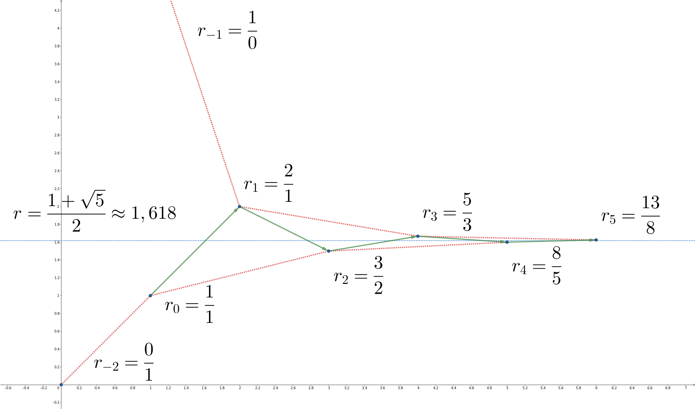
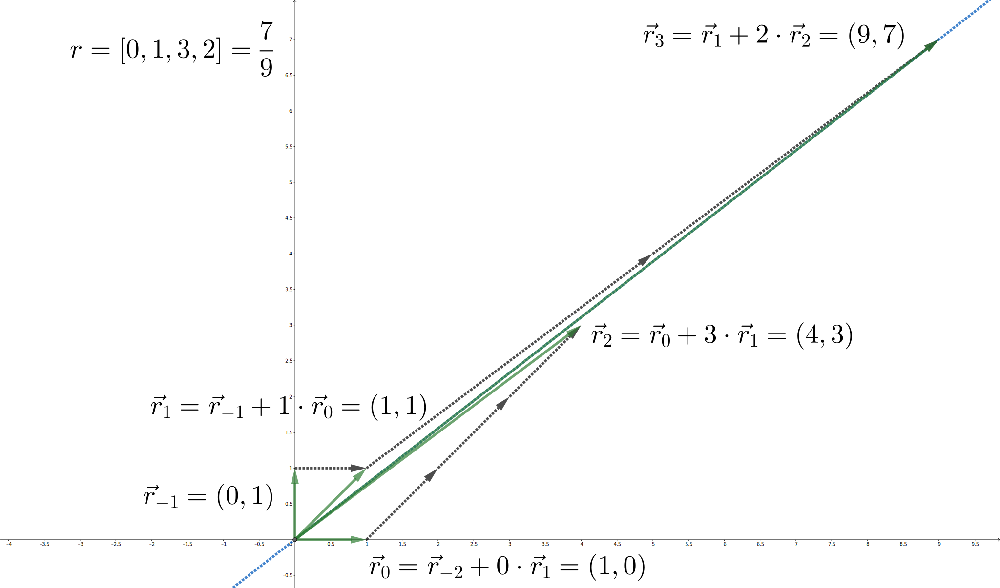
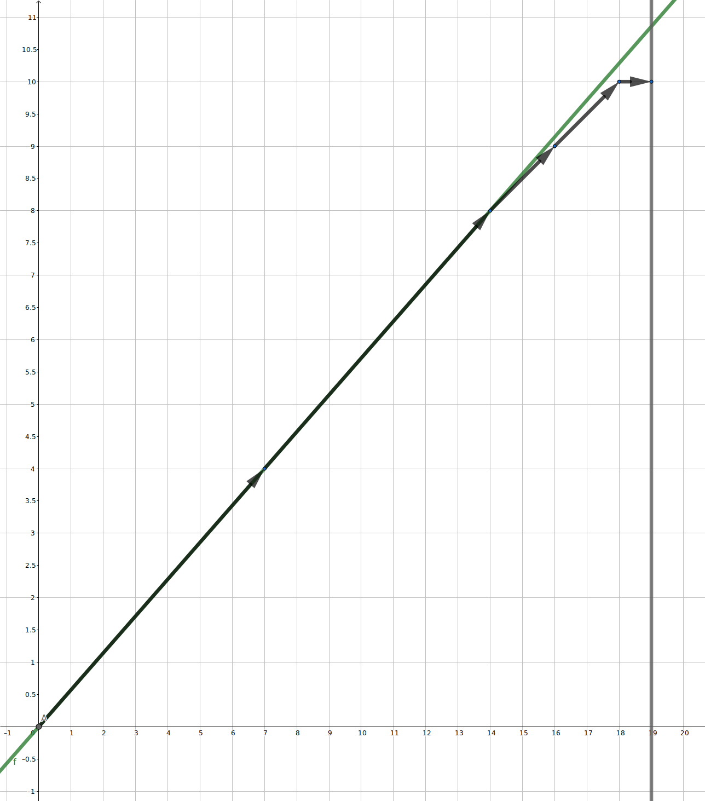

# 连分数 - OI Wiki

- Source: https://oi-wiki.org/math/number-theory/continued-fraction/

# 连分数

## 引入

连分数可以将实数表示为一个收敛的有理数数列的极限．这个数列中的有理数易于计算，而且提供了这个实数的最佳逼近，因而在算法竞赛中常常会用到连分数．除此之外，连分数还和欧几里得算法密切相关，因而可以应用到一系列数论问题中．

关于连分数相关的算法实现

本文会提供一系列的连分数的算法实现，其中部分算法可能无法保证计算中间过程所涉及的整数都在 32 位或 64 位整型变量的取值范围内．对于这种情形，请参考相应的 Python 的实现，或将 C++ 实现中的整型变量替换为 [高精度整数类](../../bignum/)．为突出重点，本文行文过程中的部分代码可能会调用前文实现过的函数而不再重复给出实现．

## 连分数

**连分数** （continued fraction）本身只是一种形式记号．

有限连分数

对于数列 {𝑎𝑘}𝑛𝑖=0{ak}i=0n，连分数 [𝑎0,𝑎1,⋯,𝑎𝑛][a0,a1,⋯,an] 表示展开式

𝑥=𝑎0+1𝑎1+1𝑎2+1⋯+1𝑎𝑛.x=a0+1a1+1a2+1⋯+1an.

连分数有意义，当且仅当对应的展开式有意义．这些 𝑎𝑘ak 称为连分数的 **项** （term）或 **系数** （coefficient）．

记号

更一般的连分数允许展开式中的分子不恒为 11，相应的连分数记号也需要修改，这超出了本文的范畴．另外，有些文献中会将第一个逗号「,,」写作分号「;;」，这与本文的记号在含义上没有差异．

当然，连分数还可以推广到无穷数列的情形．

无限连分数

对于无穷数列 {𝑎𝑘}∞𝑖=0{ak}i=0∞，连分数 [𝑎0,𝑎1,⋯][a0,a1,⋯] 表示极限

𝑥=lim𝑘→∞𝑥𝑘=lim𝑘→∞[𝑎0,𝑎1,⋯,𝑎𝑘].x=limk→∞xk=limk→∞[a0,a1,⋯,ak].

连分数有意义，当且仅当对应的极限有意义．其中，𝑥𝑘 =[𝑎0,𝑎1,⋯,𝑎𝑘]xk=[a0,a1,⋯,ak] 称为 𝑥x 的第 𝑘k 个 **渐近分数** （convergent）或 **收敛子** ，而 𝑟𝑘 =[𝑎𝑘,𝑎𝑘+1,⋯]rk=[ak,ak+1,⋯] 称为 𝑥x 的第 𝑘k 个 **余项** 或 **完全商** （complete quotient）．相应地，项 𝑎𝑘ak 有时也称为第 𝑘k 个 **部分商** （partial quotient）．

### 简单连分数

数论中，主要考虑连分数的项都是整数的情形．

简单连分数

对于连分数 [𝑎0,𝑎1,⋯][a0,a1,⋯]，如果 𝑎0a0 是整数，𝑎1,𝑎2,⋯a1,a2,⋯ 都是正整数，则称它为 **简单连分数** （simple continued fraction），也简称 **连分数** ．如果数列 {𝑎𝑖}{ai} 有限，则称为 **有限（简单）连分数** ；否则称为 **无限（简单）连分数** ．而且，𝑎0a0 称为它的 **整数部分** （integer part）．

除非特别说明，本文提到的连分数都指的是简单连分数．可以证明，无限的简单连分数必然是收敛的，而且简单连分数的余项也一定是正的．

连分数有如下基本性质：

性质

设实数 𝑥 =[𝑎0,𝑎1,𝑎2,⋯]x=[a0,a1,a2,⋯]．那么，成立如下性质：

  1. 对于任意 𝑘 ∈𝐙k∈Z，有 𝑥 +𝑘 =[𝑎0 +𝑘,𝑎1,𝑎2,⋯]x+k=[a0+k,a1,a2,⋯]；
  2. 对实数 𝑥 >1x>1，有 𝑎0 >0a0>0，且它的倒数 𝑥−1 =[0,𝑎0,𝑎1,𝑎2,⋯]x−1=[0,a0,a1,a2,⋯]．

有限连分数对应的是有理数．每个有理数都有且仅有两种方式可以表示成连分数，长度必然一奇一偶．这两种方式唯一的区别在于最后一项是否为 11，即

𝑥=[𝑎0,𝑎1,⋯,𝑎𝑛]=[𝑎0,𝑎1,⋯,𝑎𝑛−1,1].x=[a0,a1,⋯,an]=[a0,a1,⋯,an−1,1].

这两个连分数称为有理数 𝑥x 的 **连分数表示** （continued fraction representation）．其中，末项不为一的称为标准表示，末项为一的称为非标准表示．1

例子

有理数 𝑥 =53x=53 的连分数表示为

𝑥=[1,1,1,1]=1+11+11+11,𝑥=[1,1,2]=1+11+12.x=[1,1,1,1]=1+11+11+11,x=[1,1,2]=1+11+12.

无限连分数对应的是无理数．而且，每个无理数仅有唯一的方式表示为连分数，称为无理数的连分数表示．

### 连分数表示的求法

要求某个实数 𝑥x 的连分数表示，只需要注意到它的余项 𝑟𝑘rk 如果不是整数，就一定满足

𝑟𝑘=[𝑎𝑘,𝑎𝑘+1,⋯]=[𝑎𝑘,𝑟𝑘+1]=𝑎𝑘+1𝑟𝑘+1.rk=[ak,ak+1,⋯]=[ak,rk+1]=ak+1rk+1.

而且，𝑟𝑘+1 >1rk+1>1．因此，可以从 𝑟0 =𝑥r0=x 开始递归地计算

𝑎𝑘=⌊𝑟𝑘⌋, 𝑟𝑘+1=1𝑟𝑘−𝑎𝑘.ak=⌊rk⌋, rk+1=1rk−ak.

这个过程产生的数列 {𝑎𝑘}{ak} 总是唯一确定的，除非某个余项 𝑟𝑘rk 成为整数．如果出现了 𝑟𝑘rk 是整数，则说明过程应当终止，可以选择输出相应的标准表示或者非标准表示．

在算法竞赛中，往往处理的都是有理数 𝑥 =𝑝𝑞x=pq 的情形．此时，每个余项 𝑟𝑘rk 都是有理数 𝑝𝑘𝑞𝑘pkqk，而且对于 𝑘 >0k>0，因为 𝑟𝑘 >1rk>1，就总有 𝑝𝑘 >𝑞𝑘pk>qk．具体计算上述递推关系，可以发现

𝑎𝑘=⌊𝑝𝑘𝑞𝑘⌋, 𝑟𝑘+1=1𝑟𝑘−𝑎𝑘=𝑞𝑘𝑝𝑘−𝑎𝑘𝑞𝑘=𝑞𝑘𝑝𝑘mod𝑞𝑘.ak=⌊pkqk⌋, rk+1=1rk−ak=qkpk−akqk=qkpkmodqk.

此时的计算过程实际上是对 𝑝p 和 𝑞q 做 [辗转相除法](../gcd/#欧几里得算法)．这也说明，对于有理数 𝑟 =𝑝𝑞r=pq，连分数表示的长度是 𝑂(log⁡min{𝑝,𝑞})O(log⁡min{p,q}) 的．计算有理数 𝑝𝑞pq 的复杂度也是 𝑂(log⁡min{𝑝,𝑞})O(log⁡min{p,q}) 的．

参考实现

给定分数的分子 𝑝p 和分母 𝑞q，输出连分数的系数序列 [𝑎0,𝑎1,⋯,𝑎𝑛][a0,a1,⋯,an]．

C++Python

```text 1 2 3 4 5 6 7 8 9 ``` |  ```text // Find the continued fraction representation of P/Q. auto fraction ( int p , int q ) { std :: vector < int > a ; while ( q ) { a . push_back ( p / q ); std :: tie ( p , q ) = std :: make_pair ( q , p % q ); } return a ; } ```   
---|---  
  
```text 1 2 3 4 5 6 7 ``` |  ```text # Find the continued fraction representation of P/Q. def fraction ( p , q ): a = [] while q : a . append ( p // q ) p , q = q , p % q return a ```   
---|---  
  
## 渐近分数

在连分数的定义中介绍了渐近分数的概念．实数的渐近分数就是它的连分数表示的渐近分数：在实数 𝑥x 的连分数表示中，只保留前 𝑘k 个项，得到的连分数 𝑥𝑘xk 就称为实数 𝑥x 的第 𝑘k 个渐近分数．实数 𝑥x 的渐近分数 𝑥𝑘xk 都是有理数，而且序列 {𝑥𝑘}{xk} 收敛于实数 𝑥x．

例子：黄金分割比的渐近分数

连分数 𝑥 =[1,1,1,1,⋯]x=[1,1,1,1,⋯] 的前几个渐近分数分别是

𝑥0=[1]=1,𝑥1=[1,1]=2,𝑥2=[1,1,1]=32,𝑥3=[1,1,1,1]=53,𝑥4=[1,1,1,1,1]=85.x0=[1]=1,x1=[1,1]=2,x2=[1,1,1]=32,x3=[1,1,1,1]=53,x4=[1,1,1,1,1]=85.

可以归纳地证明

𝑥𝑘=𝐹𝑘+2𝐹𝑘+1,xk=Fk+2Fk+1,

其中，{𝐹𝑘}{Fk} 是 [斐波那契数列](../../combinatorics/fibonacci/)．根据它的通项公式可知，

𝑥𝑘=𝜙𝑘+2−(−𝜙)−(𝑘+2)𝜙𝑘+1−(−𝜙)−(𝑘+1),xk=ϕk+2−(−ϕ)−(k+2)ϕk+1−(−ϕ)−(k+1),

其中的 𝜙 =1+√52ϕ=1+52 是黄金分割比．当 𝑘k 趋于无穷时，有

𝑥=lim𝑘→∞𝑥𝑘=𝜙.x=limk→∞xk=ϕ.

因而，连分数 𝑥 =[1,1,1,1,⋯]x=[1,1,1,1,⋯] 表示的是黄金分割比 𝜙ϕ．

这些渐近分数趋近于相应的实数，所以可以用于逼近该实数．为此，有必要了解渐近分数的性质．

### 递推关系

首先，要解决这些渐近分数的计算问题．虽然渐近分数总是在连分数的后面添加一项，但是并不需要每次都重新计算它的值．其实，渐近分数有如下递推关系：

递推公式

对于连分数 𝑥 =[𝑎0,𝑎1,𝑎2,⋯]x=[a0,a1,a2,⋯]，设它的第 𝑘k 个渐近分数 𝑥𝑘xk 可以写成分数 𝑝𝑘𝑞𝑘pkqk．那么，有

𝑝𝑘=𝑎𝑘𝑝𝑘−1+𝑝𝑘−2,𝑞𝑘=𝑎𝑘𝑞𝑘−1+𝑞𝑘−2.pk=akpk−1+pk−2,qk=akqk−1+qk−2.

递推的起点是（形式）分数

𝑥−1=𝑝−1𝑞−1=10, 𝑥−2=𝑝−2𝑞−2=01.x−1=p−1q−1=10, x−2=p−2q−2=01.证明

渐近分数 𝑥𝑘xk 的分子和分母可以看作 𝑎0,𝑎1,⋯,𝑎𝑘a0,a1,⋯,ak 的多元多项式：

𝑟𝑘=𝑃𝑘(𝑎0,𝑎1,⋯,𝑎𝑘)𝑄𝑘(𝑎0,𝑎1,⋯,𝑎𝑘).rk=Pk(a0,a1,⋯,ak)Qk(a0,a1,⋯,ak).

根据渐近分数的定义，有

𝑟𝑘=𝑎0+1[𝑎1,𝑎2,⋯,𝑎𝑘]=𝑎0+𝑄𝑘−1(𝑎1,⋯,𝑎𝑘)𝑃𝑘−1(𝑎1,⋯,𝑎𝑘)=𝑎0𝑃𝑘−1(𝑎1,…,𝑎𝑘)+𝑄𝑘−1(𝑎1,⋯,𝑎𝑘)𝑃𝑘−1(𝑎1,⋯,𝑎𝑘).rk=a0+1[a1,a2,⋯,ak]=a0+Qk−1(a1,⋯,ak)Pk−1(a1,⋯,ak)=a0Pk−1(a1,…,ak)+Qk−1(a1,⋯,ak)Pk−1(a1,⋯,ak).

和上式比较，不妨设 𝑄𝑘(𝑎0,⋯,𝑎𝑘) =𝑃𝑘−1(𝑎1,⋯,𝑎𝑘)Qk(a0,⋯,ak)=Pk−1(a1,⋯,ak)，就可以将渐近分数写作

𝑟𝑘=𝑃𝑘(𝑎0,𝑎1,⋯,𝑎𝑘)𝑃𝑘−1(𝑎1,⋯,𝑎𝑘)rk=Pk(a0,a1,⋯,ak)Pk−1(a1,⋯,ak)

且多项式 𝑃𝑘Pk 有递推关系

𝑃𝑘(𝑎0,⋯,𝑎𝑘)=𝑎0𝑃𝑘−1(𝑎1,⋯,𝑎𝑘)+𝑃𝑘−2(𝑎2,⋯,𝑎𝑘).Pk(a0,⋯,ak)=a0Pk−1(a1,⋯,ak)+Pk−2(a2,⋯,ak).

因为

𝑟0=𝑎0, 𝑟1=𝑎0+1𝑎1=𝑎0𝑎1+1𝑎1,r0=a0, r1=a0+1a1=a0a1+1a1,

所以，递推的起点是

𝑃0(𝑎0)=𝑎0, 𝑃1(𝑎0,𝑎1)=𝑎0𝑎1+1.P0(a0)=a0, P1(a0,a1)=a0a1+1.

如果设

𝑃−1=1, 𝑃−2=0,P−1=1, P−2=0,

可以验证对于 𝑘 =0,1k=0,1 也成立上述递推关系．这相当于规定了形式分数 𝑟−1 =10r−1=10 和 𝑟−2 =01r−2=01．

满足上述递推关系的多项式列 𝑃𝑘Pk 称为 **连项式**3（continuant）．它可以写作行列式的形式：

𝑃𝑘(𝑎0,⋯,𝑎𝑘)=det⁡⎛⎜ ⎜ ⎜ ⎜ ⎜ ⎜ ⎜ ⎜ ⎜ ⎜⎝𝑎010⋯0−1𝑎11⋱⋮0−1𝑎2⋱0⋮⋱⋱⋱10⋯0−1𝑎𝑘⎞⎟ ⎟ ⎟ ⎟ ⎟ ⎟ ⎟ ⎟ ⎟ ⎟⎠.Pk(a0,⋯,ak)=det⁡(a010⋯0−1a11⋱⋮0−1a2⋱0⋮⋱⋱⋱10⋯0−1ak).

这是一个 [三对角矩阵](https://en.wikipedia.org/wiki/Tridiagonal_matrix) 的行列式，从左上角开始展开，可以验证它具有上面的递推关系和初值条件．反过来，从右下角开始展开，则又能得到递推关系

𝑃𝑘(𝑎0,⋯,𝑎𝑘)=𝑎𝑘𝑃𝑘−1(𝑎0,⋯,𝑎𝑘−1)+𝑃𝑘−2(𝑎0,⋯,𝑎𝑘−2),Pk(a0,⋯,ak)=akPk−1(a0,⋯,ak−1)+Pk−2(a0,⋯,ak−2),

这就是所要求证的．

记号

本文将渐近分数 𝑥𝑘xk 记作 𝑝𝑘𝑞𝑘pkqk 时，总是默认分子 𝑝𝑘pk 和 𝑞𝑘qk 由上面的递推关系给出．下文还要说明，这样总能得到渐近分数的既约表示．

这个递推式说明

𝑥𝑘=𝑎𝑘𝑝𝑘−1+𝑝𝑘−2𝑎𝑘𝑞𝑘−1+𝑞𝑘−2xk=akpk−1+pk−2akqk−1+qk−2

介于 𝑥𝑘−1xk−1 和 𝑥𝑘−2xk−2 之间．

作为渐近分数的递推关系的推论，成立如下的反序定理和倒数定理：

反序定理

设实数 𝑥 =[𝑎0,𝑎1,𝑎2,⋯]x=[a0,a1,a2,⋯] 的第 𝑘k 个渐近分数是 𝑝𝑘𝑞𝑘pkqk，则相邻两个渐近分数的分子和分母的比值分别为

𝑝𝑘𝑝𝑘−1=[𝑎𝑘,𝑎𝑘−1,⋯,𝑎1,𝑎0],𝑞𝑘𝑞𝑘−1=[𝑎𝑘,𝑎𝑘−1,⋯,𝑎1].pkpk−1=[ak,ak−1,⋯,a1,a0],qkqk−1=[ak,ak−1,⋯,a1].

如果 𝑎0 =0a0=0，则第一个连分数应当理解为在倒数第二项处截断，即 [𝑎𝑘,𝑎𝑘−1,⋯,𝑎2][ak,ak−1,⋯,a2]．

证明

在 𝑝𝑘pk 和 𝑞𝑘qk 的递推关系中，左右两侧分别同除以 𝑝𝑘−1pk−1 和 𝑞𝑘−1qk−1，就得到

𝑝𝑘𝑝𝑘−1=𝑎𝑘+𝑝𝑘−2𝑝𝑘−1,𝑞𝑘𝑞𝑘−1=𝑎𝑘+𝑞𝑘−2𝑞𝑘−1.pkpk−1=ak+pk−2pk−1,qkqk−1=ak+qk−2qk−1.

迭代这两个式子，就可以得到两个连分数．再代入初始值 𝑝0𝑝−1 =𝑎0p0p−1=a0 和 𝑞1𝑞0 =𝑎1q1q0=a1 即可．至于 𝑎0 =0a0=0 的情形，将得到的连分数理解为形式表达式，则它的余项

[𝑎2,𝑎1,0]=𝑎2+1𝑎1+10=𝑎2+00𝑎1+1=𝑎2.[a2,a1,0]=a2+1a1+10=a2+00a1+1=a2.

因而可以直接略去最后两项．如果需要严格的证明，只要注意到这个式子可以看作 𝑎0 →0a0→0 的极限即可．

倒数定理

实数 𝑥 >0x>0 的渐近分数的倒数是 𝑥−1x−1 的渐近分数．

证明

不妨设 𝑥 >1x>1 且有连分数表示 [𝑎0,𝑎1,𝑎2,⋯][a0,a1,a2,⋯]，则 𝑥−1x−1 的连分数表示是 [0,𝑎0,𝑎1,𝑎2,⋯][0,a0,a1,a2,⋯]．它们的渐近分数可以从递推关系中求得．而且，对于 𝑥x，有初值条件 𝑥−2 =01x−2=01 和 𝑥−1 =10x−1=10；对于 𝑦 =𝑥−1y=x−1，有初值条件 𝑦−1 =10y−1=10 和 𝑦0 =01y0=01．因此，有 𝑥−2 =(𝑦−1)−1x−2=(y−1)−1 和 𝑥−1 =(𝑦0)−1x−1=(y0)−1．根据递推关系，可以得到 𝑥𝑘 =𝑦−1𝑘+1xk=yk+1−1．这就说明，𝑥x 的渐近分数的倒数是 𝑦 =𝑥−1y=x−1 的渐近分数．对于 0 <𝑥 ≤10<x≤1 的情形，也可以做类似讨论．

利用本节得到的递推关系，可以得到计算渐近分数的算法如下：

参考实现

给定连分数的系数 𝑎0,𝑎1,⋯,𝑎𝑛a0,a1,⋯,an，求渐近分数的分子和分母序列 (𝑝0,𝑞0),(𝑝1,𝑞1),⋯,(𝑝𝑛,𝑞𝑛)(p0,q0),(p1,q1),⋯,(pn,qn)．

C++Python

```text 1 2 3 4 5 6 7 8 9 10 11 ``` |  ```text // Find the convergents of a continued fraction A. // Numerators and denominators stored separately in P and Q. auto convergents ( std :: vector < int > a ) { std :: vector < int > p = { 0 , 1 }; std :: vector < int > q = { 1 , 0 }; for ( auto it : a ) { p . push_back ( p . back () * it \+ p . end ()[ -2 ]); q . push_back ( q . back () * it \+ q . end ()[ -2 ]); } return std :: make_pair ( p , q ); } ```   
---|---  
  
```text 1 2 3 4 5 6 7 8 9 ``` |  ```text # Find the convergents of a continued fraction A. # Numerators and denominators stored separately in P and Q. def convergents ( a ): p = [ 0 , 1 ] q = [ 1 , 0 ] for it in a : p . append ( p [ \- 1 ] * it \+ p [ \- 2 ]) q . append ( q [ \- 1 ] * it \+ q [ \- 2 ]) return p , q ```   
---|---  
  
### 误差估计

利用渐近分数的递推公式，可以估计用渐近分数逼近实数产生的误差．

首先，可以计算相邻的渐近分数的差值：

渐近分数的差分

设 𝑥𝑘 =𝑝𝑘𝑞𝑘xk=pkqk 是实数 𝑥x 的第 𝑘k 个渐近分数．那么，有

𝑝𝑘+1𝑞𝑘−𝑝𝑘𝑞𝑘+1=(−1)𝑘.pk+1qk−pkqk+1=(−1)k.

因此，相邻两项的渐近分数的差分是

𝑥𝑘+1−𝑥𝑘=(−1)𝑘𝑞𝑘+1𝑞𝑘.xk+1−xk=(−1)kqk+1qk.证明

根据递推关系，有

det⁡(𝑝𝑘+1𝑝𝑘𝑞𝑘+1𝑞𝑘)=det⁡(𝑎𝑘+1𝑝𝑘+𝑝𝑘−1𝑝𝑘𝑎𝑘+1𝑞𝑘+𝑞𝑘−1𝑞𝑘)=det⁡(𝑝𝑘−1𝑝𝑘𝑞𝑘−1𝑞𝑘)=−det⁡(𝑝𝑘𝑝𝑘−1𝑞𝑘𝑞𝑘−1)=(−1)𝑘+2det⁡(1001)=(−1)𝑘.det⁡(pk+1pkqk+1qk)=det⁡(ak+1pk+pk−1pkak+1qk+qk−1qk)=det⁡(pk−1pkqk−1qk)=−det⁡(pkpk−1qkqk−1)=(−1)k+2det⁡(1001)=(−1)k.

这就是 𝑝𝑘+1𝑞𝑘 −𝑝𝑘𝑞𝑘+1 =( −1)𝑘pk+1qk−pkqk+1=(−1)k．对两边同除以 𝑞𝑘+1𝑞𝑘qk+1qk，就得到关于 𝑥𝑘+1 −𝑥𝑘xk+1−xk 的结论．

因而，奇数项渐近分数总是大于相邻两项，偶数项渐近分数总是小于相邻两项：渐近分数是交错变化的．

如果只看偶数项（奇数项）渐近分数，序列也是单调递增（递减）的．这是因为

𝑥𝑘+2−𝑥𝑘=(−1)𝑘+1𝑞𝑘+2𝑞𝑘+1+(−1)𝑘𝑞𝑘+1𝑞𝑘=(−1)𝑘(𝑞𝑘+2−𝑞𝑘)𝑞𝑘+2𝑞𝑘+1𝑞𝑘=(−1)𝑘𝑎𝑘+2𝑞𝑘+2𝑞𝑘xk+2−xk=(−1)k+1qk+2qk+1+(−1)kqk+1qk=(−1)k(qk+2−qk)qk+2qk+1qk=(−1)kak+2qk+2qk

当 𝑘k 为偶数（奇数）时为正（负）．同时，因为成立递推关系 𝑞𝑘 =𝑎𝑘𝑞𝑘−1 +𝑞𝑘−2qk=akqk−1+qk−2，分母 𝑞𝑘qk 的增长速度不会慢于斐波那契数列的速度．所以，相邻两项的差一定趋近于零．这就说明，偶数项和奇数项渐近分数分别自下而上和自上而下地逼近同一极限．这就证明了无限简单连分数一定收敛．渐近分数趋近于相应实数的动态可以见下图：



上（下）渐近分数

对于实数 𝑥x 和它的渐近分数 𝑥𝑘xk，如果 𝑥𝑘 >𝑥xk>x（𝑥𝑘 <𝑥xk<x），就称 𝑥𝑘xk 为 𝑥x 的 **上（下）渐近分数** （upper (lower) convergent）．

前面已经说明，上渐近分数就是奇数项渐近分数，下渐近分数就是偶数项渐近分数．

利用差分公式，可以将实数 𝑥x 写成交错级数的形式：

𝑥=𝑎0+∞∑𝑘=0(−1)𝑘𝑞𝑘+1𝑞𝑘.x=a0+∑k=0∞(−1)kqk+1qk.

连分数定义中的渐近分数和余项就是该级数的部分和和余项．

利用差分公式，还可以直接对渐近分数逼近实数产生的误差做出估计：

误差

设 𝑥𝑘 =𝑝𝑘𝑞𝑘 ≠𝑥xk=pkqk≠x 是实数 𝑥x 的第 𝑘k 个渐近分数．那么，有

𝑥𝑘−𝑥=(−1)𝑘𝑞𝑘(𝑟𝑘+1𝑞𝑘+𝑞𝑘−1),xk−x=(−1)kqk(rk+1qk+qk−1),

其中，𝑟𝑘+1rk+1 是实数 𝑥x 的第 𝑘 +1k+1 个余项．进而，有

12𝑞2𝑘+1≤1𝑞𝑘(𝑞𝑘+𝑞𝑘+1)≤∣𝑥−𝑝𝑘𝑞𝑘∣≤1𝑞𝑘𝑞𝑘+1≤1𝑞2𝑘.12qk+12≤1qk(qk+qk+1)≤|x−pkqk|≤1qkqk+1≤1qk2.证明

因为 𝑥 =[𝑎0,𝑎1,⋯,𝑎𝑘,𝑟𝑘+1]x=[a0,a1,⋯,ak,rk+1]，而且对形式连分数也成立渐近分数的差分公式，所以有

𝑥−𝑥𝑘=(−1)𝑘𝑞𝑘(𝑟𝑘+1𝑞𝑘+𝑞𝑘−1),x−xk=(−1)kqk(rk+1qk+qk−1),

其中，𝑟𝑘+1𝑞𝑘 +𝑞𝑘−1rk+1qk+qk−1 就是按照递推公式得到的这个形式连分数的第 𝑘 +1k+1 个渐近分数的分母．

要完成随后的不等式估计，只需要注意到当 𝑥𝑘 ≠𝑥xk≠x 时，总成立

1≤𝑎𝑘+1≤𝑟𝑘+1≤𝑎𝑘+1+1,1≤ak+1≤rk+1≤ak+1+1,

所以有

𝑞𝑘+1=𝑎𝑘+1𝑞𝑘+𝑞𝑘−1≤𝑟𝑘+1𝑞𝑘+𝑞𝑘−1≤𝑞𝑘+(𝑎𝑘+1𝑞𝑘+𝑞𝑘−1)=𝑞𝑘+𝑞𝑘+1.qk+1=ak+1qk+qk−1≤rk+1qk+qk−1≤qk+(ak+1qk+qk−1)=qk+qk+1.

因此，有不等式

1𝑞𝑘(𝑞𝑘+𝑞𝑘+1)≤∣𝑥−𝑝𝑘𝑞𝑘∣=1𝑞𝑘(𝑟𝑘+1𝑞𝑘+𝑞𝑘−1)≤1𝑞𝑘𝑞𝑘+1.1qk(qk+qk+1)≤|x−pkqk|=1qk(rk+1qk+qk−1)≤1qkqk+1.

要得到外侧的放缩，再注意到 𝑞𝑘 ≤𝑞𝑘+1qk≤qk+1 就可以了．

本节的差分公式还有一个简单推论：渐近分数 𝑝𝑘𝑞𝑘pkqk 都是既约的．

推论

对于任何实数 𝑥x，且渐近分数 𝑥𝑘 =𝑝𝑘𝑞𝑘xk=pkqk 的分子和分母由递推公式给出，则 𝑝𝑘𝑞𝑘pkqk 是既约分数，即 gcd(𝑝𝑘,𝑞𝑘) =1gcd(pk,qk)=1．

证明

对差分公式应用 [裴蜀定理](../bezouts/) 即可．

其实，二元一次不定方程的解可以通过连分数的方法求解．

二元一次不定方程的求解

给定 𝐴,𝐵,𝐶 ∈𝐙A,B,C∈Z．查找 𝑥,𝑦 ∈𝐙x,y∈Z，使得 𝐴𝑥 +𝐵𝑦 =𝐶Ax+By=C 成立．

解答

虽然这个问题通常是用 [扩展欧几里得算法](../bezouts/#两个变量的情形) 解决的，但是同样可以通过连分数求解．

设 𝐴𝐵 =[𝑎0,𝑎1,⋯,𝑎𝑘]AB=[a0,a1,⋯,ak]．上面证明了 𝑝𝑘𝑞𝑘−1 −𝑝𝑘−1𝑞𝑘 =( −1)𝑘−1pkqk−1−pk−1qk=(−1)k−1．将 𝑝𝑘pk 和 𝑞𝑘qk 替换为 𝐴A 和 𝐵B，得到

𝐴𝑞𝑘−1−𝐵𝑝𝑘−1=(−1)𝑘−1𝑔,Aqk−1−Bpk−1=(−1)k−1g,

其中，𝑔 =gcd(𝐴,𝐵)g=gcd(A,B)．如果 𝑔g 整除 𝐶C，则一组解为 𝑥 =( −1)𝑘−1𝐶𝑔𝑞𝑘−1x=(−1)k−1Cgqk−1 和 𝑦 =( −1)𝑘𝐶𝑔𝑝𝑘−1y=(−1)kCgpk−1；否则无解．

C++Python

```text 1 2 3 4 5 6 7 8 9 ``` |  ```text // Return (x,y) such that Ax+By=C. // Assume that such (x,y) exists. auto dio ( int A , int B , int C ) { std :: vector < int > p , q ; std :: tie ( p , q ) = convergents ( fraction ( A , B )); C /= A / p . back (); int t = p . size () % 2 ? -1 : 1 ; return std :: make_pair ( t * C * q . end ()[ -2 ], \- t * C * p . end ()[ -2 ]); } ```   
---|---  
  
```text 1 2 3 4 5 6 7 ``` |  ```text # Return (x, y) such that Ax+By=C. # Assume that such (x, y) exists. def dio ( A , B , C ): p , q = convergents ( fraction ( A , B )) C //= A // p [ \- 1 ] # divide by gcd(A, B) t = ( \- 1 ) if len ( p ) % 2 else 1 return t * C * q [ \- 2 ], \- t * C * p [ \- 2 ] ```   
---|---  
  
## 丢番图逼近

连分数理论的一个重要应用就是丢番图逼近理论．丢番图逼近（Diophantine approximation）是指用有理数逼近实数．当然，由于有理数的稠密性，如果不加以限制，可以得到误差任意小的逼近．因此，需要对可以使用的有理数做出限制，比如只能选择分母小于某个值的有理数．本节就讨论了这种限制下的最佳逼近和连分数的关系．

### 用渐近分数逼近实数

首先，利用渐近分数的误差估计，立刻得到如下结果：

定理（Dirichlet）

对于无理数 𝑥x，存在无穷多个既约分数 𝑝𝑞pq 使得

∣𝑥−𝑝𝑞∣<1𝑞2|x−pq|<1q2

成立．

证明

根据渐近分数的误差估计，对于无理数 𝑥x 的第 𝑘k 个渐近分数 𝑥𝑘 =𝑝𝑘𝑞𝑘xk=pkqk，有

∣𝑥−𝑝𝑘𝑞𝑘∣≤1𝑞2𝑘.|x−pkqk|≤1qk2.

检查误差公式的证明即可知，对于任一无理数 𝑥x，取等条件并不成立．因此，它的所有渐近分数的分子和分母都满足要求．

这个定理也可以看作是 [Dirichlet 逼近定理](https://en.wikipedia.org/wiki/Dirichlet%27s_approximation_theorem) 的推论．这几乎已经是最好的结果了．不等式右侧分母中的指数 22 已经不能再改进，但是常数上可以做得更好．Hurwitz 定理说明，不等式右侧可以缩小到 1√5𝑞215q2，且这是最好的界．

Hurwitz 定理

对于无理数 𝑥x，存在无穷多个既约分数 𝑝𝑞pq 使得

∣𝑥−𝑝𝑞∣<1√5𝑞2|x−pq|<15q2

成立，而且不等式右侧的 √55 不能换成更大的实数．

证明（Borel）

Borel 实际上证明了，无理数 𝑥x 的连续三个渐近分数中，必然有至少一个满足上述条件．因为渐近分数无穷多，且都是既约分数，那么 Hurwitz 定理的第一部分就必然成立．

反证法．不妨设存在无理数 𝑥x 和它的渐近分数 𝑥𝑘−1,𝑥𝑘,𝑥𝑘+1xk−1,xk,xk+1，使得

∣𝑥−𝑝𝑘−1𝑞𝑘−1∣≥1√5𝑞2𝑘−1, ∣𝑥−𝑝𝑘𝑞𝑘∣≥1√5𝑞2𝑘, ∣𝑥−𝑝𝑘+1𝑞𝑘+1∣≥1√5𝑞2𝑘+1|x−pk−1qk−1|≥15qk−12, |x−pkqk|≥15qk2, |x−pk+1qk+1|≥15qk+12

成立．因为相邻的渐近分数必然位于 𝑥x 两侧，所以由差分公式知

1𝑞𝑘−1𝑞𝑘=∣𝑝𝑘−1𝑞𝑘−1−𝑝𝑘𝑞𝑘∣=∣𝑥−𝑝𝑘−1𝑞𝑘−1∣+∣𝑥−𝑝𝑘𝑞𝑘∣≥1√5𝑞2𝑘−1+1√5𝑞2𝑘.1qk−1qk=|pk−1qk−1−pkqk|=|x−pk−1qk−1|+|x−pkqk|≥15qk−12+15qk2.

它可以写成关于商 𝑞𝑘𝑞𝑘−1qkqk−1 的不等式

𝑞𝑘𝑞𝑘−1+𝑞𝑘−1𝑞𝑘≤√5.qkqk−1+qk−1qk≤5.

因为左侧是有理数，右侧是无理数，等号必然无法取得．又因为 𝑞𝑘 ≥𝑞𝑘−1qk≥qk−1，所以可以解得

1≤𝑞𝑘𝑞𝑘−1<√5+12.1≤qkqk−1<5+12.

同理，可以证明

1≤𝑞𝑘+1𝑞𝑘<√5+12.1≤qk+1qk<5+12.

但是根据递推公式，并结合两式可知，

𝑎𝑘+1=𝑞𝑘+1𝑞𝑘−𝑞𝑘−1𝑞𝑘<√5+12−√5−12=1ak+1=qk+1qk−qk−1qk<5+12−5−12=1

这与简单连分数的定义矛盾．所以，Borel 的结论成立．

要说明这样得到的界是最好的，只需要找到 𝑥x 使得对于任何 𝐶 >√5C>5，都只存在有限多个既约分数 𝑝𝑞pq 使得不等式

∣𝑥−𝑝𝑞∣<1𝐶𝑞2|x−pq|<1Cq2

成立．下面证明 𝜙 =√5+12ϕ=5+12 就是这样的 𝑥x．4

设 𝜙′ =−√5+12ϕ′=−5+12 是 𝜙ϕ 的共轭根．它们都是方程 𝑥2 −𝑥 −1 =0x2−x−1=0 的根．因而，对任意实数 𝑥x，都有

𝑥2−𝑥−1=(𝑥−𝜙)(𝑥−𝜙′).x2−x−1=(x−ϕ)(x−ϕ′).

代入既约分数 𝑝𝑞pq，就得到

1𝑞2≤|𝑝2−𝑝𝑞−𝑞2|𝑞2=∣𝑝𝑞−𝜙∣∣𝑝𝑞−𝜙′∣≤∣𝑝𝑞−𝜙∣(∣𝑝𝑞−𝜙∣+|𝜙−𝜙′|)<1𝐶𝑞2(1𝐶𝑞2+√5).1q2≤|p2−pq−q2|q2=|pq−ϕ||pq−ϕ′|≤|pq−ϕ|(|pq−ϕ|+|ϕ−ϕ′|)<1Cq2(1Cq2+5).

对于 𝐶 >√5C>5，可以直接解出 𝑞 <√𝐶(𝐶−√5)q<C(C−5)，因而不可能存在无穷多组解满足上述不等式．

这些定理的证明说明，渐近分数提供了相当好的丢番图逼近．但是，这未必是最佳逼近．要讨论最佳逼近，需要说明逼近程度的度量．这常常有两种选择．

可能存在最佳逼近相关结论不成立的情形

接下来的两节，会叙述一些关于最佳逼近的结果．这些结果可能对个别无趣的情形并不成立．比如，最佳逼近的两类定义都要求严格不等号，但是对于半奇数 𝑥 =𝑛 +12x=n+12 且 𝑛 ∈𝐙n∈Z，它的连分数的形式可以是 [𝑛,1,1][n,1,1]．此时，它的前两个渐近分数 𝑥0 =𝑛x0=n 和 𝑥1 =𝑛 +1x1=n+1 的分母都是 11，而且到 𝑥x 的距离是一样的．这说明，它们都不是最佳逼近．对于本节的结论的叙述，读者应当默认这样的情形已经排除在外．如果读者不关心最末尾的几个渐近分数，抑或是只关心无理数的逼近，那么不必理会这些额外的复杂情形．

### 第一类最佳逼近：中间分数

第一类最佳逼近使用

∣𝑥−𝑝𝑞∣|x−pq|

衡量逼近的程度．

第一类最佳逼近

对于实数 𝑥x 和有理数 𝑝𝑞pq，如果对于任意的 𝑝′𝑞′ ≠𝑝𝑞p′q′≠pq 且 0 <𝑞′ ≤𝑞0<q′≤q 都有

∣𝑥−𝑝𝑞∣<∣𝑥−𝑝′𝑞′∣,|x−pq|<|x−p′q′|,

就称有理数 𝑝𝑞pq 是实数 𝑥x 的 **第一类最佳逼近** （best approximation of the first kind）．

第一类最佳逼近未必是渐近分数，而是一类更宽泛的分数．

中间分数

设实数 𝑥x 有渐近分数 𝑥𝑘+1 =[𝑎0,𝑎1,⋯,𝑎𝑘,𝑎𝑘+1]xk+1=[a0,a1,⋯,ak,ak+1]，且整数 𝑡t 满足 0 ≤𝑡 ≤𝑎𝑘+10≤t≤ak+15，则分数 𝑥𝑘,𝑡 =[𝑎0,𝑎1,⋯,𝑎𝑘,𝑡]xk,t=[a0,a1,⋯,ak,t] 称为 𝑥x 的 **中间分数** （intermediate fraction）、**半收敛子** （semiconvergent）或 **次渐近分数** （secondary convergent）．6

类似于渐近分数的情形，大于（小于）𝑥x 的中间分数称为 **上（下）中间分数** （upper (lower) semiconvergent）．

根据递推公式，中间分数可以写成

𝑥𝑘,𝑡=𝑡𝑝𝑘+𝑝𝑘−1𝑡𝑞𝑘+𝑞𝑘−1.xk,t=tpk+pk−1tqk+qk−1.

它必然是既约分数，而且位于渐近分数 𝑥𝑘−1xk−1 和 𝑥𝑘+1xk+1 之间．随着 𝑡t 增大，它也逐渐向 𝑥𝑘+1xk+1 靠拢：（以 𝑘k 为偶数的情形为例）

𝑥𝑘−1=𝑥𝑘,0<𝑥𝑘,1<𝑥𝑘,2<⋯<𝑥𝑘,𝑎𝑘+1=𝑥𝑘+1.xk−1=xk,0<xk,1<xk,2<⋯<xk,ak+1=xk+1.

因为渐近分数的分子和分母都是递增的，中间分数 𝑥𝑘,𝑡xk,t（𝑡 ≠0t≠0）的分子和分母落在了 𝑥𝑘xk 和 𝑥𝑘+1xk+1 之间．如果将这些分数按照分母大小排列，中间分数就是位于相邻的渐近分数中间的一些分数．

所有的第一类最佳逼近都是中间分数，但是并不是所有的中间分数都是第一类最佳逼近．

定理

所有的第一类最佳逼近都是中间分数．

证明

因为 𝑎0 ≤𝑥 ≤𝑎0 +1a0≤x≤a0+1，所以第一类最佳逼近必然位于 𝑥1,0 =𝑎0x1,0=a0 与 𝑥0,1 =𝑎0 +1x0,1=a0+1 之间．所有中间分数从小到大可以排列成

𝑥1,0<𝑥1,1<⋯<𝑥1,𝑎2=𝑥3,0<…<𝑥<…<𝑥2,0=𝑥0,𝑎1<⋯<𝑥0,1.x1,0<x1,1<⋯<x1,a2=x3,0<…<x<…<x2,0=x0,a1<⋯<x0,1.

同阶的中间分数是连续出现的，而不同阶的中间分数之间又没有间隔．这意味着，任何位于 𝑥1,0 =𝑎0x1,0=a0 与 𝑥0,1 =𝑎0 +1x0,1=a0+1 之间的有理数 𝑝𝑞pq 必然落在两个同阶的中间分数 𝑥𝑘,𝑡xk,t 和 𝑥𝑘,𝑡+1xk,t+1 之间．不妨设它不是中间分数且小于 𝑥x，因而有

𝑥𝑘,𝑡<𝑝𝑞<𝑥𝑘,𝑡+1<𝑥.xk,t<pq<xk,t+1<x.

此时，一方面有

∣𝑥𝑘,𝑡−𝑝𝑞∣≤|𝑥𝑘,𝑡−𝑥𝑘,𝑡+1|=1((𝑡+1)𝑞𝑘+𝑞𝑘−1)(𝑡𝑞𝑘+𝑞𝑘−1).|xk,t−pq|≤|xk,t−xk,t+1|=1((t+1)qk+qk−1)(tqk+qk−1).

另一方面有

∣𝑥𝑘,𝑡−𝑝𝑞∣=|𝑞(𝑡𝑝𝑘+𝑝𝑘−1)−𝑝((𝑡+1)𝑞𝑘+𝑞𝑘−1)|𝑞(𝑡𝑞𝑘+𝑞𝑘−1)≥1𝑞(𝑡𝑞𝑘+𝑞𝑘−1).|xk,t−pq|=|q(tpk+pk−1)−p((t+1)qk+qk−1)|q(tqk+qk−1)≥1q(tqk+qk−1).

因此，必然有

𝑞>(𝑡+1)𝑞𝑘+𝑞𝑘−1.q>(t+1)qk+qk−1.

也就是说，有理数 𝑝𝑞pq 的分母一定大于 𝑥𝑘,𝑡+1xk,t+1 的分母，但是它并不是更好的逼近：

∣𝑥−𝑝𝑞∣>|𝑥−𝑥𝑘,𝑡+1||x−pq|>|x−xk,t+1|

因此，它不可能是第一类最佳逼近．这就说明，不是中间分数，就不是第一类最佳逼近；亦即所有第一类最佳逼近都是中间分数．

反过来，并不能断言所有的中间分数都是第一类最佳逼近．但是，的确可以给出中间分数成为第一类最佳逼近的条件．

定理

所有渐近分数都是第一类最佳逼近．除此之外，设 0 <𝑡 <𝑎𝑘+10<t<ak+1，则中间分数 𝑥𝑘,𝑡xk,t 是第一类最佳逼近，当且仅当 𝑡 >𝑎𝑘+12t>ak+12 或者 𝑡 =𝑎𝑘+12t=ak+12 且 𝑟𝑘+2 >𝑞𝑘𝑞𝑘−1rk+2>qkqk−1．

证明

下面会证明，渐近分数都是第二类最佳逼近，因而必然是第一类最佳逼近．关键在于那些不是渐近分数的中间分数．

前文已经说过，中间分数 𝑥𝑘,𝑡xk,t 的分母位于 𝑥𝑘xk 和 𝑥𝑘+1xk+1 之间，且随着 𝑡t 的增加逐渐增大，但是 𝑥𝑘,𝑡xk,t 却逐渐接近 𝑥𝑘+1xk+1，因而更接近 𝑥x．以 𝑥𝑘,𝑡 <𝑥xk,t<x 为例，它与相邻的中间分数的相对位置关系满足：

𝑥𝑘−1<𝑥𝑘,𝑡<𝑥𝑘+1<𝑥<𝑥𝑘.xk−1<xk,t<xk+1<x<xk.

因为 𝑥𝑘xk 的分母小于 𝑥𝑘,𝑡xk,t，所以 𝑥𝑘,𝑡xk,t 成为第一类最佳逼近的必要条件就是，它比 𝑥𝑘xk 更接近 𝑥x．这也是充分条件，因为作为渐近分数，没有比 𝑥𝑘xk 分母更小但是距离更近的了，而那些比 𝑥𝑘xk 分母还要大的中间分数，必然与 𝑥𝑘,𝑡xk,t 同阶，但是分母更小，就必然距离 𝑥x 更远．对于渐近分数和中间分数的误差，经计算可知

|𝑥𝑘−𝑥|=1𝑞𝑘(𝑟𝑘+1𝑞𝑘+𝑞𝑘−1),|𝑥𝑘,𝑡−𝑥|=∣𝑡𝑝𝑘+𝑝𝑘−1𝑡𝑞𝑘+𝑞𝑘−1−𝑟𝑘+1𝑝𝑘+𝑝𝑘−1𝑟𝑘+1𝑞𝑘+𝑞𝑘−1∣=𝑟𝑘+1−𝑡(𝑡𝑞𝑘+𝑞𝑘−1)(𝑟𝑘+1𝑞𝑘+𝑞𝑘−1).|xk−x|=1qk(rk+1qk+qk−1),|xk,t−x|=|tpk+pk−1tqk+qk−1−rk+1pk+pk−1rk+1qk+qk−1|=rk+1−t(tqk+qk−1)(rk+1qk+qk−1).

其中用到了 𝑟𝑘+1 ≥𝑎𝑘+1 >𝑡rk+1≥ak+1>t．因此，𝑥𝑘,𝑡xk,t 比 𝑥𝑘xk 更接近 𝑥x，成为第一类最佳逼近，当且仅当

𝑟𝑘+1−𝑡𝑡𝑞𝑘+𝑞𝑘−1<1𝑞𝑘⟺𝑟𝑘+1<2𝑡+𝑞𝑘−1𝑞𝑘.rk+1−ttqk+qk−1<1qk⟺rk+1<2t+qk−1qk.

此时，有三种可能的情况：

  1. 如果 𝑡 <𝑎𝑡+12t<at+12，那么 2𝑡 <𝑎𝑡+12t<at+1．因为两侧都是整数，所以 2𝑡 ≤𝑎𝑘+1 −12t≤ak+1−1，故而 2𝑡 +𝑞𝑘−1𝑞𝑘 ≤2𝑡 +1 ≤𝑎𝑘+1 ≤𝑟𝑡+12t+qk−1qk≤2t+1≤ak+1≤rt+1．此时，𝑥𝑘,𝑡xk,t 不是第一类最佳逼近；
  2. 如果 𝑡 >𝑎𝑡+12t>at+12，那么 2𝑡 >𝑎𝑡+12t>at+1．因为两侧都是整数，所以 2𝑡 ≥𝑎𝑡+1 +1 >𝑟𝑡+12t≥at+1+1>rt+1．此时，𝑥𝑘,𝑡xk,t 是第一类最佳逼近；
  3. 如果 𝑎𝑡+1at+1 是偶数，还有第三种情况，即 𝑡 =𝑎𝑡+12t=at+12．上述条件等价于 1𝑟𝑘+1 =𝑟𝑘+1 −𝑎𝑘+1 <𝑞𝑘−1𝑞𝑘1rk+1=rk+1−ak+1<qk−1qk，亦即 𝑟𝑘+2 >𝑞𝑘𝑞𝑘−1rk+2>qkqk−1．

所以，如果将实数 𝑥x 的所有第一类最佳逼近按照分母自小到大的顺序排列，那么它会根据与 𝑥x 的大小关系分成若干段．每一段总是由若干个（可以是零个）连续的同阶的中间分数组成，且总以渐近分数结尾．段内总能保持在实数 𝑥x 的一侧，段与段之间则交错排列在 𝑥x 两侧．

例子：圆周率 𝜋π 的第一类最佳逼近

圆周率 𝜋 =[3,7,15,1,292,⋯]π=[3,7,15,1,292,⋯]，因而它分母最小的前 15 个第一类最佳逼近是：

𝑥0=31, 𝑥0,4=134, 𝑥0,5=165, 𝑥0,6=196, 𝑥1=227,𝑥1,8=17957, 𝑥1,9=20164, 𝑥1,10=22371, 𝑥1,11=24578, 𝑥1,12=26785,𝑥1,13=28992,𝑥1,14=31199, 𝑥2=333106, 𝑥3=355113, 𝑥3,146=5216316604.x0=31, x0,4=134, x0,5=165, x0,6=196, x1=227,x1,8=17957, x1,9=20164, x1,10=22371, x1,11=24578, x1,12=26785,x1,13=28992,x1,14=31199, x2=333106, x3=355113, x3,146=5216316604.

### 第二类最佳逼近

第二类最佳逼近使用 |𝑞𝑥 −𝑝||qx−p| 来衡量逼近的程度．

第二类最佳逼近

对于实数 𝑥x 和有理数 𝑝𝑞pq，如果对于任意的 𝑝′𝑞′ ≠𝑝𝑞p′q′≠pq 且 0 <𝑞′ ≤𝑞0<q′≤q 都有

|𝑞𝑥−𝑝|<|𝑞′𝑥−𝑝′|,|qx−p|<|q′x−p′|,

就称有理数 𝑝𝑞pq 是实数 𝑥x 的 **第二类最佳逼近** （best approximation of the second kind）．

第二类最佳逼近的条件等价于

∣𝑥−𝑝𝑞∣<𝑞′𝑞∣𝑥−𝑝′𝑞′∣.|x−pq|<q′q|x−p′q′|.

因为 𝑞′ ≤𝑞q′≤q，所以第二类最佳逼近的条件比第一类最佳逼近更为严苛．

第二类最佳逼近能且仅能是渐近分数．

定理

所有的第二类最佳逼近一定是渐近分数，所有的渐近分数也一定是第二类最佳逼近．

证明

要证明第一部分，因为第二类最佳逼近也一定是第一类最佳逼近，所以只需要证明不是渐近分数的中间分数不能成为第二类最佳逼近就可以了．为此，设 𝑥𝑘,𝑡 =𝑝𝑞xk,t=pq 是中间分数但是不是渐近分数，那么，设 𝑥𝑘,𝑡 <𝑥xk,t<x，有

𝑥𝑘−1<𝑥𝑘,𝑡<𝑥𝑘+1<𝑥<𝑥𝑘.xk−1<xk,t<xk+1<x<xk.

因为 𝑥𝑘,𝑡xk,t 与 𝑥x 之间的误差

|𝑥𝑘,𝑡−𝑥|≥|𝑥𝑘,𝑡−𝑥𝑘+1|=∣𝑝𝑞−𝑝𝑘+1𝑞𝑘+1∣=|𝑝𝑞𝑘+1−𝑝𝑘+1𝑞|𝑞𝑞𝑘+1≥1𝑞𝑞𝑘+1,|xk,t−x|≥|xk,t−xk+1|=|pq−pk+1qk+1|=|pqk+1−pk+1q|qqk+1≥1qqk+1,

并利用渐近分数的误差估计，所以总是有

|𝑞𝑥𝑘,𝑡−𝑝|≥1𝑞𝑘+1≥|𝑞𝑘𝑥𝑘−𝑝𝑘|,|qxk,t−p|≥1qk+1≥|qkxk−pk|,

即 𝑥𝑘,𝑡xk,t 的逼近程度不优于分母更小的 𝑥𝑘xk 逼近程度，所以不可能是第二类最佳逼近．

反过来，要证明第二部分，即每个渐近分数 𝑥𝑘 =𝑝𝑘𝑞𝑘xk=pkqk 都是第二类最佳逼近．这就是要说明，对于所有分数 𝑝𝑞pq 且 𝑞 ≤𝑞𝑘q≤qk，都有 |𝑞𝑘𝑥 −𝑝𝑘| <|𝑞𝑥 −𝑝||qkx−pk|<|qx−p|．不考虑半奇数的情形，则可以假定 𝑘 >0k>0．首先，根据渐近分数逼近实数的误差估计，有

|𝑞𝑘−1𝑥−𝑝𝑘−1|≥1𝑞𝑘−1+𝑞𝑘≥1𝑞𝑘+1≥|𝑞𝑘𝑥−𝑝𝑘|.|qk−1x−pk−1|≥1qk−1+qk≥1qk+1≥|qkx−pk|.

不等式全部成立等号，当且仅当 𝑎𝑘+1 =1ak+1=1 且是连分数的末项．不考虑这样的情形，那么 𝑥𝑘−1 =𝑝𝑘−1𝑞𝑘−1xk−1=pk−1qk−1 严格劣于 𝑥𝑘 =𝑝𝑘𝑞𝑘xk=pkqk．

任取一分数 𝑝𝑞 ≠𝑥𝑘pq≠xk 且 0 <𝑞 ≤𝑞𝑘0<q≤qk，因为有差分公式 𝑝𝑘𝑞𝑘−1 −𝑝𝑘−1𝑞𝑘 =( −1)𝑘−1pkqk−1−pk−1qk=(−1)k−1，所以由 Cramer 法则可知，线性方程组

{𝜆𝑝𝑘+𝜇𝑝𝑘−1=𝑝,𝜆𝑞𝑘+𝜇𝑞𝑘−1=𝑞{λpk+μpk−1=p,λqk+μqk−1=q

必然存在唯一的整数解 (𝜆,𝜇)(λ,μ)．如果 𝜆𝜇 >0λμ>0，那么 𝑞 >|𝜆|𝑞𝑘 ≥𝑞𝑘q>|λ|qk≥qk，矛盾．否则，𝜆𝜇 ≤0λμ≤0，即 𝜆λ 和 𝜇μ 异号，那么因为 𝑞𝑘−1𝑥 −𝑝𝑘−1qk−1x−pk−1 和 𝑞𝑘𝑥 −𝑝𝑘qkx−pk 也异号，就有 𝜆(𝑞𝑘−1𝑥 −𝑝𝑘−1)λ(qk−1x−pk−1) 和 𝜇(𝑞𝑘𝑥 −𝑝𝑘)μ(qkx−pk) 同号，故而

|𝑞𝑥−𝑝|=|𝜆||𝑞𝑘𝑥−𝑝𝑘|+|𝜇||𝑞𝑘−1𝑥−𝑝𝑘−1|>|𝑞𝑘𝑥−𝑝𝑘|.|qx−p|=|λ||qkx−pk|+|μ||qk−1x−pk−1|>|qkx−pk|.

最后的不等号是严格的，因为 𝑥𝑘−1xk−1 严格劣于 𝑥𝑘xk，且 𝑝𝑞 ≠𝑥𝑘pq≠xk．这就说明，𝑥𝑘xk 是第二类最佳逼近．

这个性质表明，渐近分数确实是相当好的丢番图逼近．

### 渐近分数的判定

第二类最佳逼近提供了判断某个分数是否是渐近分数的充分必要条件．这说明，可以通过检查某个分数逼近的相对程度来判断它是否是渐近分数．Legendre 判别法则提供了根据逼近的绝对程度来判断渐近分数的方法．Legendre 判别法的原始表述提供了充分必要条件，但是它的形式并不实用．本节提供了 Legendre 判别法的简化版本，并说明它并没有漏掉太多的渐近分数．

定理（Legendre）

对于实数 𝑥x 与分数 𝑝𝑞pq，如果有

∣𝑥−𝑝𝑞∣<12𝑞2|x−pq|<12q2

那么 𝑝𝑞pq 一定是 𝑥x 的渐近分数．

证明

设 𝜖 ∈{ −1,1}ϵ∈{−1,1} 和 𝜃 ∈(0,1/2)θ∈(0,1/2) 是使得

𝑥−𝑝𝑞=𝜖𝜃𝑞2x−pq=ϵθq2

成立的常数．将有理数 𝑝𝑞pq 展开成连分数 [𝑎0,𝑎1,⋯,𝑎𝑛][a0,a1,⋯,an]．此处，有理数有两种连分数表示，其中的 𝑛n 恰好相差一，所以可以取连分数表示使得 ( −1)𝑛 =𝜖(−1)n=ϵ，并记这个连分数表示的渐近分数为 𝑝𝑘𝑞𝑘pkqk．设实数 𝜔ω 满足

𝑥=𝜔𝑝𝑛+𝑝𝑛−1𝜔𝑞𝑛+𝑞𝑛−1.x=ωpn+pn−1ωqn+qn−1.

那么，必然有

𝜖𝜃𝑞2=𝑥−𝑝𝑞=𝑥−𝑝𝑛𝑞𝑛=𝑝𝑛−1𝑞𝑛−𝑝𝑛𝑞𝑛−1(𝜔𝑞𝑛+𝑞𝑛−1)𝑞𝑛=(−1)𝑛(𝜔𝑞𝑛+𝑞𝑛−1)𝑞𝑛.ϵθq2=x−pq=x−pnqn=pn−1qn−pnqn−1(ωqn+qn−1)qn=(−1)n(ωqn+qn−1)qn.

故而，有

𝜃=𝑞𝑛𝜔𝑞𝑛+𝑞𝑛−1.θ=qnωqn+qn−1.

这说明

𝜔=1𝜃−𝑞𝑛−1𝑞𝑛>1.ω=1θ−qn−1qn>1.

将 𝜔ω 也展成连分数 [𝑏0,𝑏1,⋯][b0,b1,⋯]，则

𝑥=𝜔𝑝𝑛+𝑝𝑛−1𝜔𝑞𝑛+𝑞𝑛−1=[𝑎0,𝑎1,⋯,𝑎𝑛,𝜔]=[𝑎0,𝑎1,⋯,𝑎𝑛,𝑏0,𝑏1,⋯].x=ωpn+pn−1ωqn+qn−1=[a0,a1,⋯,an,ω]=[a0,a1,⋯,an,b0,b1,⋯].

这是合法的简单连分数，所以 𝑝𝑞pq 就是 𝑥x 的渐近分数．

这个证明实际说明 𝑝𝑞pq 成为渐近分数的充分必要条件是上述证明中的 𝜔 >1ω>1，这正是 Legendre 判别法的原始形式．

这个判别法说明，只要逼近的程度足够好，就一定是渐近分数．下一个定理说明，这样好的渐近分数足够多：至少有一半的渐近分数都符合这个条件．

定理（Valhen）

实数 𝑥x 的相邻两个渐近分数中至少有一个满足

∣𝑥−𝑝𝑞∣<12𝑞2.|x−pq|<12q2.证明

假设不然．存在实数 𝑥x 有两个相邻的渐近分数 𝑥𝑘−1xk−1 和 𝑥𝑘xk 满足

∣𝑥−𝑝𝑘𝑞𝑘∣≥12𝑞2𝑘, ∣𝑥−𝑝𝑘+1𝑞𝑘+1∣≥12𝑞2𝑘+1.|x−pkqk|≥12qk2, |x−pk+1qk+1|≥12qk+12.

因为 𝑥x 位于 𝑥𝑘−1xk−1 和 𝑥𝑘xk 之间，所以

12𝑞2𝑘+12𝑞2𝑘+1≤∣𝑥−𝑝𝑘𝑞𝑘∣+∣𝑥−𝑝𝑘+1𝑞𝑘+1∣=∣𝑝𝑘𝑞𝑘−𝑝𝑘+1𝑞𝑘+1∣=1𝑞𝑘𝑞𝑘+1.12qk2+12qk+12≤|x−pkqk|+|x−pk+1qk+1|=|pkqk−pk+1qk+1|=1qkqk+1.

这说明 𝑞𝑘 =𝑞𝑘+1qk=qk+1．故而必然有 𝑘 =0k=0 且 𝑎1 =1a1=1．此时前两个渐近分数是 𝑥0 =𝑎0x0=a0 和 𝑥1 =𝑎0 +1x1=a0+1．故而命题的唯一反例是半奇数，按照前文的说明，本文不考虑这种情形．

## 几何解释

连分数理论有着优美的几何解释．



如图所示，对于实数 𝜉 >0ξ>0，直线 𝑦 =𝜉𝑥y=ξx 将第一象限（包括 𝑥x 和 𝑦y 坐标轴上的点但不包括原点，下同）上的整点（lattice point）分成上下两部分．对于有理数 𝜉ξ 的情形，直线 𝑦 =𝜉𝑥y=ξx 上的点既算作直线上方的点，又算作直线下方的点．考虑这两部分的点的凸包．那么，奇数项渐近分数是上半部分的凸包的顶点，偶数项渐近分数是下半部分的凸包的顶点．凸包上两个相邻顶点之间的连线上的整点就是中间分数．图中展示了 𝜉 =97ξ=97 的渐近分数和中间分数（灰点）．

前文关于连分数的大部分结论都有相应的几何解释：

几何解释

  * 每个分数 𝜈 =𝑝𝑞ν=pq 都对应着第一象限内的一个整点 ⃗𝜈 =(𝑞,𝑝)ν→=(q,p)，分数的大小对应着与原点连线的斜率．
  * 直线 𝑦 =𝜉𝑥y=ξx 的方向向量是 ⃗𝜉 =(1,𝜉)ξ→=(1,ξ)．利用 [叉积](../../linear-algebra/product/#二维向量的情形) (𝑥1,𝑦1) ×(𝑥2,𝑦2) =𝑥1𝑦2 −𝑥2𝑦1(x1,y1)×(x2,y2)=x1y2−x2y1 的概念，可以通过 ⃗𝜉 ×⃗𝜈 =𝑝 −𝑞𝜉ξ→×ν→=p−qξ 的正负判断点在直线上方还是下方．因而，在直线上方的点就对应着大于等于 𝜉ξ 的分数，在直线下方的点就对应着小于等于 𝜉ξ 的分数．叉积的绝对值 |⃗𝜉 ×⃗𝜈||ξ→×ν→| 正比于点 ⃗𝜈ν→ 与直线 𝑦 =𝜉𝑥y=ξx 的距离

|𝑝−𝑞𝑥|√1+𝜉2,|p−qx|1+ξ2,

对应着分数 𝜈ν 对实数 𝜉ξ 的逼近程度．

  * 将渐近分数 𝜉𝑘 =𝑝𝑘𝑞𝑘ξk=pkqk 对应的点记作 ⃗𝜉𝑘 =(𝑝𝑘,𝑞𝑘)ξ→k=(pk,qk)，则递推公式就可以写作

⃗𝜉𝑘=𝑎𝑘⃗𝜉𝑘−1+⃗𝜉𝑘−2.ξ→k=akξ→k−1+ξ→k−2.

递归的起点是 𝜉−2 =(1,0)ξ−2=(1,0) 和 𝜉−1 =(0,1)ξ−1=(0,1)．

  * 对于整数 𝑡t，如果 0 ≤𝑡 ≤𝑎𝑘0≤t≤ak，那么点

⃗𝜉𝑘−1,𝑡=𝑡⃗𝜉𝑘−1+⃗𝜉𝑘−2ξ→k−1,t=tξ→k−1+ξ→k−2

就落在连结点 ⃗𝜉𝑘−2ξ→k−2 和点 ⃗𝜉𝑘ξ→k 的线段上．它们对应着中间分数 𝜉𝑘−1,𝑡ξk−1,t．

  * 利用几何的方法可以构造出所有的渐近分数和中间分数．从点 ⃗𝜉−2 =(1,0)ξ→−2=(1,0) 和点 ⃗𝜉−1 =(0,1)ξ→−1=(0,1) 开始，两个点位于直线 𝑦 =𝜉𝑥y=ξx 两侧，这意味着 ⃗𝜉 ×⃗𝜉−2ξ→×ξ→−2 和 ⃗𝜉 ×⃗𝜉−1ξ→×ξ→−1 符号相反．将 ⃗𝜉−1ξ→−1 按照向量的加法添加到 ⃗𝜉−2ξ→−2 上，直到无法继续添加而不穿过直线 𝑦 =𝜉𝑥y=ξx 为止，将结果记作 ⃗𝜉0ξ→0，此时仍与 ⃗𝜉−1ξ→−1 不同侧．再将 ⃗𝜉0ξ→0 添加到 ⃗𝜉−1ξ→−1 上，直到无法继续添加而不穿过直线 𝑦 =𝜉𝑥y=ξx 为止，将结果记作 ⃗𝜉1ξ→1，此时仍与 ⃗𝜉0ξ→0 不同侧．这个过程可以一直持续到无穷，除非在有限步内某个 ⃗𝜉𝑛ξ→n 就恰好落在直线 𝑦 =𝜉𝑥y=ξx 上．后者意味着向量 ⃗𝜉ξ→ 与 ⃗𝜉𝑛ξ→n 共线，即 𝜉 =𝑝𝑛𝑞𝑛ξ=pnqn 为有理点．这个过程就可以得到前面示意图中的图形．Boris Delaunay 将这个过程形象地称为鼻子拉伸算法（nose-streching algorithm）9．

  * 如果需要快速计算每一步将 ⃗𝜉𝑘−1ξ→k−1 添加到 ⃗𝜉𝑘−2ξ→k−2 需要的次数，可以借助叉积．因为 ⃗𝜉 ×⃗𝜉𝑘−1ξ→×ξ→k−1 与 ⃗𝜉 ×⃗𝜉𝑘−2ξ→×ξ→k−2 符号相反，所以如果记 ⃗𝜉𝑘−1,𝑡 =𝑡⃗𝜉𝑘−1 +⃗𝜉𝑘−2ξ→k−1,t=tξ→k−1+ξ→k−2 为向 ⃗𝜉𝑘−2ξ→k−2 添加 𝑡t 次 ⃗𝜉𝑘−1ξ→k−1 得到的结果，则 ⃗𝜉 ×⃗𝜉𝑘−1,𝑡 =𝑡(⃗𝜉 ×⃗𝜉𝑘−1) +(⃗𝜉 ×⃗𝜉𝑘−2)ξ→×ξ→k−1,t=t(ξ→×ξ→k−1)+(ξ→×ξ→k−2) 不改变符号，就意味着没有穿过直线．在不变号之前，⃗𝜉 ×⃗𝜉𝑘−1,𝑡ξ→×ξ→k−1,t 的绝对值会逐渐下降．记

𝑟𝑘=∣⃗𝜉×⃗𝜉𝑘−2⃗𝜉×⃗𝜉𝑘−1∣=−⃗𝜉×⃗𝜉𝑘−2⃗𝜉×⃗𝜉𝑘−1.rk=|ξ→×ξ→k−2ξ→×ξ→k−1|=−ξ→×ξ→k−2ξ→×ξ→k−1.

那么，最大可以下降的次数就是

𝑎𝑘=⌊𝑟𝑘⌋=⌊∣𝑞𝑘−1𝜉−𝑝𝑘−1𝑞𝑘−2𝜉−𝑝𝑘−2∣⌋.ak=⌊rk⌋=⌊|qk−1ξ−pk−1qk−2ξ−pk−2|⌋.

这就是连分数展开的第 𝑘k 项．而且，𝑟𝑘rk 就是连分数展开的余项，它满足关系式：

𝑟𝑘=−𝑞𝑘−1𝜉−𝑝𝑘−1𝑞𝑘−2𝜉−𝑝𝑘−2⟺𝜉=𝑝𝑘−1𝑟𝑘+𝑝𝑘−2𝑞𝑘−1𝑟𝑘+𝑞𝑘−2.rk=−qk−1ξ−pk−1qk−2ξ−pk−2⟺ξ=pk−1rk+pk−2qk−1rk+qk−2.

这就是连分数关系式 𝜉 =[𝑎0,𝑎1,⋯,𝑎𝑘−1,𝑟𝑘]ξ=[a0,a1,⋯,ak−1,rk]．

  * 因为每次添加向量造成的 ⃗𝜉 ×⃗𝜉𝑘−1,𝑡ξ→×ξ→k−1,t 的变化的步长都是 |⃗𝜉 ×⃗𝜉𝑘−1||ξ→×ξ→k−1|，所以最后剩余的距离 |⃗𝜉 ×⃗𝜉𝑘||ξ→×ξ→k| 必然严格小于 |⃗𝜉 ×⃗𝜉𝑘−1||ξ→×ξ→k−1|．这说明，渐近分数的逼近程度（由 |𝑞𝑥 −𝑝||qx−p| 衡量）是随着 𝑘k 的增加严格更优的．

  * 利用叉积的运算法则，有

⃗𝜉𝑘×⃗𝜉𝑘+1=⃗𝜉𝑘×(𝑎𝑘+1⃗𝜉𝑘+⃗𝜉𝑘−1)=⃗𝜉𝑘×⃗𝜉𝑘−1=−⃗𝜉𝑘−1×⃗𝜉𝑘.ξ→k×ξ→k+1=ξ→k×(ak+1ξ→k+ξ→k−1)=ξ→k×ξ→k−1=−ξ→k−1×ξ→k.

归纳可知

⃗𝜉𝑘×⃗𝜉𝑘+1=(−1)𝑘+2⃗𝜉𝑘−2×⃗𝜉𝑘−1=(−1)𝑘.ξ→k×ξ→k+1=(−1)k+2ξ→k−2×ξ→k−1=(−1)k.

这就是渐近分数的差分公式 𝑝𝑘+1𝑞𝑘 −𝑝𝑘𝑞𝑘+1 =( −1)𝑘pk+1qk−pkqk+1=(−1)k．

  * 上下两个凸包之间的面积可以剖分成若干个（可能是无穷多个）三角形，其中每个三角形的顶点分别是 ⃗𝜉𝑘−2ξ→k−2、⃗𝜉𝑘ξ→k 和 ⃗00→．这样的三角形的面积是

12|⃗𝜉𝑘−2×⃗𝜉𝑘|=12|⃗𝜉𝑘−2×(𝑎𝑘⃗𝜉𝑘−1+⃗𝜉𝑘−2)|=𝑎𝑘2|⃗𝜉𝑘−2×⃗𝜉𝑘−1|=𝑎𝑘2.12|ξ→k−2×ξ→k|=12|ξ→k−2×(akξ→k−1+ξ→k−2)|=ak2|ξ→k−2×ξ→k−1|=ak2.

根据 [Pick 定理](../../../geometry/pick/)，这意味着如果设 𝐼I 和 𝐵B 分别为三角形内部和边界上的整点个数，则

𝐼+𝐵2−1=𝑎𝑘2.I+B2−1=ak2.

又已知三角形边界上已经有了 {⃗0} ∪{⃗𝜉𝑘−1,𝑡 :0 ≤𝑡 ≤𝑎𝑘}{0→}∪{ξ→k−1,t:0≤t≤ak} 这共计 𝑎𝑘 +2ak+2 个整点．这说明，就一定有 𝐼 =0I=0 和 𝐵 =𝑎𝑘 +2B=ak+2．因而，三角形的边上没有更多的整点，三角形内部也没有整点．也就是说，𝑞𝑘qk 和 𝑝𝑘pk 是既约的，中间分数是连结 ⃗𝜉𝑘−2ξ→k−2 和 ⃗𝜉𝑘ξ→k 的边上的全部整点，且第一象限的所有整点都在上下两个凸包内．

这样得到的上下两个凸包称为 Klein 多边形．在高维空间内也可以做类似定义，得到 [Klein 多面体](https://en.wikipedia.org/wiki/Klein_polyhedron)（Klein polyhedron），它可以将连分数的概念推广到高维空间内．

## 连分数的树

主条目：[Stern–Brocot 树与 Farey 序列](../stern-brocot/)

Stern–Brocot 树是存储了所有位于 [0,∞][0,∞] 之间的分数的 [二叉搜索树](../../../ds/bst/)．有限连分数实际上编码了 Stern–Brocot 树上从根到某个分数所在位置的路径．也就是说，有理数 𝑥x 的连分数表示 [𝑎0,𝑎1,⋯,𝑎𝑛−1,1][a0,a1,⋯,an−1,1] 意味着从树根 1111 开始，需要先向右子节点移动 𝑎0a0 次，再向左子节点移动 𝑎1a1 次，交替方向移动，直到向某个方向移动了 𝑎𝑛−1an−1 次为止．应当注意，此处只能使用末尾为 11 的连分数表示．

将连分数表示理解为 Stern–Brocot 树上的路径，可以得到比较连分数大小的算法．

连分数大小比较

给定连分数 𝛼 =[𝛼0,𝛼1,⋯,𝛼𝑛]α=[α0,α1,⋯,αn] 和 𝛽 =[𝛽0,𝛽1,⋯,𝛽𝑚]β=[β0,β1,⋯,βm]，比较两者大小．

解答

首先将两个连分数表示都转化成末尾是 11 的形式．不妨设题目所给的已经是这样形式的连分数，即 𝛼𝑛 =𝛽𝑚 =1αn=βm=1．因为偶数位置（下标从 00 开始）是向右移动的步数，奇数位置是向左移动的步数，所以，𝛼 <𝛽α<β 当且仅当按照 [字典序](../../../string/basic/#字典序) 比较时，有

(𝛼0,−𝛼1,𝛼2,⋯,(−1)𝑛−1𝛼𝑛−1,0,⋯)<(𝛽0,−𝛽1,𝛽2,⋯,(−1)𝑚−1𝛽𝑚−1,0,⋯).(α0,−α1,α2,⋯,(−1)n−1αn−1,0,⋯)<(β0,−β1,β2,⋯,(−1)m−1βm−1,0,⋯).

相较于连分数表示，交替地添加正负号，删去末尾的 11，并且长度不足的位置用 00 补齐．

C++Python

```text 1 2 3 4 5 6 7 8 9 10 11 12 13 14 15 16 17 18 19 20 21 22 23 ``` |  ```text // Expand [..., n] to [..., n-1, 1] if needed. void expand ( std :: vector < int >& a ) { if ( a . size () == 1 || a . back () > 1 ) { \-- a . back (); a . push_back ( 1 ); } } // Check if a is smaller than b. bool less_than ( std :: vector < int > a , std :: vector < int > b ) { expand ( a ); expand ( b ); for ( int i = 0 ; i < a . size () \- 1 || i < b . size () \- 1 ; ++ i ) { int d = ( i < a . size () \- 1 ? a [ i ] : 0 ) \- ( i < b . size () \- 1 ? b [ i ] : 0 ); if ( i & 1 ) d = \- d ; if ( d < 0 ) { return true ; } else if ( d > 0 ) { return false ; } } return false ; } ```   
---|---  
  
```text 1 2 3 4 5 6 7 8 9 10 11 12 13 14 15 ``` |  ```text # Expand [..., n] to [..., n-1, 1] if needed. def expand ( a ): if a [ \- 1 ] != 1 or len ( a ) == 1 : a [ \- 1 ] -= 1 a . append ( 1 ) return a # Check if a is smaller than b. def less_than ( a , b ): a = expand ( a ) b = expand ( b ) a = [( \- 1 ) ** i * a [ i ] for i in range ( len ( a ))] b = [( \- 1 ) ** i * b [ i ] for i in range ( len ( b ))] return a < b ```   
---|---  
  
最佳内点

对于 01 ≤𝑝0𝑞0 <𝑝1𝑞1 ≤1001≤p0q0<p1q1≤10，求使得 𝑝0𝑞0 <𝑝𝑞 <𝑝1𝑞1p0q0<pq<p1q1 成立且 (𝑞,𝑝)(q,p) 最小的有理数 𝑝𝑞pq．

解答

因为 Stern–Brocot 树既是 [0,∞][0,∞] 中的分数的二叉搜索树，又是二元组 (𝑞,𝑝)(q,p) 的 [笛卡尔树](../../../ds/cartesian-tree/)，所以题意几乎可以转化为求 Stern–Brocot 树上两个点的 LCA（最近公共祖先）．但是，LCA 只能处理闭区间内的情形，LCA 可能是端点本身．为了避免额外的讨论，可以首先构造出 𝑝0𝑞0 +𝜀p0q0+ε 和 𝑝1𝑞1 −𝜀p1q1−ε，再计算 LCA．在已经通过连分数计算出根到节点的路径的情况下，LCA 只要取最长的公共路径即可．

要构造出 𝑥 ±𝜀x±ε，只需要在节点 𝑥x 处首先向右（左）移动一次，再向左（右）移动 ∞∞ 次即可．转化成连分数的语言，对于分数 𝑥 =[𝑎0,𝑎1,⋯,𝑎𝑛−1,1]x=[a0,a1,⋯,an−1,1]，可以知道 𝑥 ±𝜀x±ε 必然是 [𝑎0,𝑎1,⋯,𝑎𝑛−1 +1,∞][a0,a1,⋯,an−1+1,∞] 和 [𝑎0,𝑎1,⋯,𝑎𝑛−1,1,∞][a0,a1,⋯,an−1,1,∞]，因而只需要比较这两个连分数，将较大（小）的定义为 𝑥 ±𝜀x±ε．

C++Python

```text 1 2 3 4 5 6 7 8 9 10 11 12 13 14 15 16 17 18 19 20 21 22 23 24 25 26 27 28 29 30 31 ``` |  ```text // Get X +- EPSILON. auto pm_eps ( std :: vector < int > a ) { constexpr int inf = 0x3f3f3f3f ; // Deal with empty continued fraction for 1/0. if ( a . empty ()) { a . emplace_back ( inf ); } auto b = a ; expand ( b ); a . emplace_back ( inf ); b . emplace_back ( inf ); return less_than ( a , b ) ? std :: make_pair ( a , b ) : std :: make_pair ( b , a ); } // Find the lexicographically smallest (q, p) // such that p0/q0 < p/q < p1/q1. auto middle ( int p0 , int q0 , int p1 , int q1 ) { auto a0 = pm_eps ( fraction ( p0 , q0 )). second ; auto a1 = pm_eps ( fraction ( p1 , q1 )). first ; std :: vector < int > a ; for ( int i = 0 ; i < a0 . size () || i < a1 . size (); ++ i ) { if ( a0 [ i ] == a1 [ i ]) { a . emplace_back ( a0 [ i ]); } else { a . emplace_back ( std :: min ( a0 [ i ], a1 [ i ]) \+ 1 ); break ; } } auto pq = convergents ( a ); return std :: make_pair ( pq . first . back (), pq . second . back ()); } ```   
---|---  
  
```text 1 2 3 4 5 6 7 8 9 10 11 12 13 14 15 16 17 18 19 20 21 22 23 24 25 ``` |  ```text # Get X +- EPSILON. def pm_eps ( a ): # Deal with empty continued fraction for 1/0. if not a : a . append ( float ( "inf" )) b = expand ( a . copy ()) a . append ( float ( "inf" )) b . append ( float ( "inf" )) return ( a , b ) if less_than ( a , b ) else ( b , a ) # Find the lexicographically smallest (q, p) # such that p0/q0 < p/q < p1/q1. def middle ( p0 , q0 , p1 , q1 ): a0 = pm_eps ( fraction ( p0 , q0 ))[ 1 ] a1 = pm_eps ( fraction ( p1 , q1 ))[ 0 ] a = [] for i in range ( min ( len ( a0 ), len ( a1 ))): if a0 [ i ] == a1 [ i ]: a . append ( a0 [ i ]) else : a . append ( int ( min ( a0 [ i ], a1 [ i ])) \+ 1 ) break p , q = convergents ( a ) return p [ \- 1 ], q [ \- 1 ] ```   
---|---  
  
[GCJ 2019, Round 2 - New Elements: Part 2](https://github.com/google/coding-competitions-archive/blob/main/codejam/2019/round_2/new_elements_part_2/statement.pdf)

给定 𝑁N 个正整数对 (𝐶𝑖,𝐽𝑖)(Ci,Ji)，求正整数对 (𝑥,𝑦)(x,y) 使得 {𝐶𝑖𝑥 +𝐽𝑖𝑦}{Cix+Jiy} 严格递增．在所有符合要求的数对中，输出字典序最小的一对．

解答

不妨设 𝐴𝑖 =𝐶𝑖 −𝐶𝑖−1Ai=Ci−Ci−1 和 𝐵𝑖 =𝐽𝑖 −𝐽𝑖−1Bi=Ji−Ji−1．问题转化为求 (𝑥,𝑦)(x,y) 使得所有 𝐴𝑖𝑥 +𝐵𝑖𝑦Aix+Biy 都是整数．这些数对可以分为四种情形：

  1. 𝐴𝑖,𝐵𝑖 >0Ai,Bi>0 的情形可以忽略，因为已经假设 (𝑥,𝑦) >0(x,y)>0；
  2. 𝐴𝑖,𝐵𝑖 ≤0Ai,Bi≤0 的情形直接输出「IMPOSSIBLE」；
  3. 𝐴𝑖 >0,𝐵𝑖 ≤0Ai>0,Bi≤0 的情形相当于约束 𝑦𝑥 <𝐴𝑖−𝐵𝑖yx<Ai−Bi；
  4. 𝐴𝑖 ≤0,𝐵𝑖 >0Ai≤0,Bi>0 的情形相当于约束 𝑦𝑥 >−𝐴𝑖𝐵𝑖yx>−AiBi．

因此，取 𝑝0𝑞0p0q0 是第四种情形中最大的 −𝐴𝑖𝐵𝑖−AiBi，再取 𝑝1𝑞1p1q1 是第三种情形中最小的 𝐴𝑖−𝐵𝑖Ai−Bi．原问题就变成了找到字典序最小的 (𝑞,𝑝)(q,p) 使得 𝑝0𝑞0 <𝑝𝑞 <𝑝1𝑞1p0q0<pq<p1q1 成立．

C++Python

```text 1 2 3 4 5 6 7 8 9 10 11 12 13 14 15 16 17 18 19 20 21 22 23 24 25 26 27 28 29 30 31 32 33 34 35 ``` |  ```text void solve () { int n ; std :: cin >> n ; std :: vector < int > C ( n ), J ( n ); // p0/q0 < y/x < p1/q1 int p0 = 0 , q0 = 1 , p1 = 1 , q1 = 0 ; bool fail = false ; for ( int i = 0 ; i < n ; ++ i ) { std :: cin >> C [ i ] >> J [ i ]; if ( i ) { int A = C [ i ] \- C [ i \- 1 ]; int B = J [ i ] \- J [ i \- 1 ]; if ( A <= 0 && B <= 0 ) { fail = true ; break ; } else if ( B > 0 && A < 0 ) { // y/x > (-A)/B if B > 0 if (( \- A ) * q0 > p0 * B ) { p0 = \- A ; q0 = B ; } } else if ( B < 0 && A > 0 ) { // y/x < A/(-B) if B < 0 if ( A * q1 < p1 * ( \- B )) { p1 = A ; q1 = \- B ; } } } } if ( fail || p0 * q1 >= p1 * q0 ) { printf ( "IMPOSSIBLE \n " ); } else { auto pq = middle ( p0 , q0 , p1 , q1 ); printf ( "%d %d \n " , pq . first , pq . second ); } } ```   
---|---  
  
```text 1 2 3 4 5 6 7 8 9 10 11 12 13 14 15 16 17 18 19 20 21 22 23 24 25 26 ``` |  ```text def solve (): n = int ( input ()) C = [ 0 ] * n J = [ 0 ] * n # p0/q0 < y/x < p1/q1 p0 , q0 = 0 , 1 p1 , q1 = 1 , 0 fail = False for i in range ( n ): C [ i ], J [ i ] = map ( int , input () . split ()) if i > 0 : A = C [ i ] \- C [ i \- 1 ] B = J [ i ] \- J [ i \- 1 ] if A <= 0 and B <= 0 : fail = True break elif B > 0 and A < 0 : # y/x > (-A)/B if B > 0 if ( \- A ) * q0 > p0 * B : p0 , q0 = \- A , B elif B < 0 and A > 0 : # y/x < A/(-B) if B < 0 if A * q1 < p1 * ( \- B ): p1 , q1 = A , \- B if fail or p0 * q1 >= p1 * q0 : return "IMPOSSIBLE" p , q = middle ( p0 , q0 , p1 , q1 ) return str ( p ) \+ " " \+ str ( q ) ```   
---|---  
  
想要了解更多 Stern–Brocot 树的性质和应用，可以参考其主条目页面．

## 分式线性变换

和连分数相关的另一个重要概念是所谓的分式线性变换．

分式线性变换

**分式线性变换** （fractional linear transformation）是指函数 𝐿 :𝐑 →𝐑L:R→R，使得

𝐿(𝑥)=𝑎𝑥+𝑏𝑐𝑥+𝑑,L(x)=ax+bcx+d,

其中，𝑎,𝑏,𝑐,𝑑 ∈𝐑a,b,c,d∈R 且 𝑎𝑑 −𝑏𝑐 ≠0ad−bc≠0．

关于条件 𝑎𝑑 −𝑏𝑐 ≠0ad−bc≠0

容易验证，当 𝑎𝑑 −𝑏𝑐 =0ad−bc=0 时，函数可能没有定义或者是常函数．

分式线性变换有如下性质：

分式线性变换的性质

设 𝐿1,𝐿2,𝐿3L1,L2,L3 是分式线性变换，并记 𝐿𝑖Li 的系数形成的矩阵为

𝑀𝑖=(𝑎𝑖𝑏𝑖𝑐𝑖𝑑𝑖)Mi=(aibicidi)

则它们有如下性质：7

  1. 分式线性变换的复合 𝐿1 ∘𝐿2L1∘L2 和逆变换 𝐿−11L1−1 仍然是分式线性变换，即全体分式线性变换构成 [群](../../algebra/basic/#群)；
  2. 分式线性变换在系数同乘以非零常数后保持不变，即对于任意 𝜆 ≠0λ≠0，如果 𝑀2 =𝜆𝑀1M2=λM1，则 𝐿2 =𝐿1L2=L1；
  3. 分式线性变换的复合的系数矩阵，对应着系数矩阵的乘积，即如果 𝑀1𝑀2 =𝑀3M1M2=M3，则 𝐿1 ∘𝐿2 =𝐿3L1∘L2=L3；
  4. 分式线性变换的逆变换的系数矩阵，对应着系数矩阵的逆矩阵，即如果 𝑀−11 =𝑀2M1−1=M2，则 𝐿−11 =𝐿2L1−1=L2．

证明

此处仅提供分式线性变换的复合和逆变换的形式．得到这个形式后，所有性质都是容易验证的．

分式线性变换 𝐿1L1 和 𝐿2L2 的复合：

𝐿1∘𝐿2=𝑎1𝑎2𝑥+𝑏2𝑐2𝑥+𝑑2+𝑏1𝑐1𝑎2𝑥+𝑏2𝑐2𝑥+𝑑2+𝑑1=(𝑎1𝑎2+𝑏1𝑐2)𝑥+(𝑎1𝑏2+𝑏1𝑑2)(𝑐1𝑎2+𝑑1𝑐2)𝑥+(𝑐1𝑏2+𝑑1𝑑2).L1∘L2=a1a2x+b2c2x+d2+b1c1a2x+b2c2x+d2+d1=(a1a2+b1c2)x+(a1b2+b1d2)(c1a2+d1c2)x+(c1b2+d1d2).

分式线性变换 𝐿1(𝑥)L1(x) 的逆变换：

𝑦=𝐿1(𝑥)=𝑎1𝑥+𝑏1𝑐1𝑥+𝑑1⟺𝑥=𝐿−11(𝑦)=𝑑1𝑦−𝑏1−𝑐1𝑦+𝑎1.y=L1(x)=a1x+b1c1x+d1⟺x=L1−1(y)=d1y−b1−c1y+a1.

有限连分数 [𝑎0,𝑎1,⋯,𝑎𝑛][a0,a1,⋯,an] 可以看做是一系列分式线性变换复合的结果．设

𝐿𝑖(𝑥)=𝑎𝑖𝑥+1𝑥=[𝑎𝑖,𝑥].Li(x)=aix+1x=[ai,x].

那么，有限连分数

[𝑎0,𝑎1,⋯,𝑎𝑛]=𝐿0∘𝐿1∘⋯𝐿𝑛(∞).[a0,a1,⋯,an]=L0∘L1∘⋯Ln(∞).

其中，分式线性变换 𝐿(𝑥) =𝑎𝑥+𝑏𝑐𝑥+𝑑L(x)=ax+bcx+d 变换在 𝑥 =∞x=∞ 处的取值是 𝑎𝑐ac，这是函数在 𝑥 → ±∞x→±∞ 时的极限值．

对于一般的连分数，设实数 𝑥x 的余项为 𝑟𝑘+1rk+1，即 𝑥 =[𝑎0,⋯,𝑎𝑘,𝑟𝑘+1]x=[a0,⋯,ak,rk+1]，则有

𝑥=𝐿0∘𝐿1∘⋯𝐿𝑘(𝑟𝑘+1)=𝑝𝑘𝑟𝑘+1+𝑝𝑘−1𝑞𝑘𝑟𝑘+1+𝑞𝑘−1.x=L0∘L1∘⋯Lk(rk+1)=pkrk+1+pk−1qkrk+1+qk−1.

这同时也给出了分式线性变换 𝐿0 ∘𝐿1 ∘⋯ ∘𝐿𝑘L0∘L1∘⋯∘Lk 的形式．

当然也可以直接验证这个表达式．最开始的时候是

𝑥=𝑥+00𝑥+1=𝑝−1𝑥+𝑝−2𝑞−1𝑥+𝑞−2.x=x+00x+1=p−1x+p−2q−1x+q−2.

随后，如果 𝐿0 ∘𝐿1 ∘⋯ ∘𝐿𝑘−1L0∘L1∘⋯∘Lk−1 具有

𝑝𝑘−1𝑥+𝑝𝑘−2𝑞𝑘−1𝑥+𝑞𝑘−2pk−1x+pk−2qk−1x+qk−2

的形式，那么根据分式线性变换的复合公式，有

𝐿0∘𝐿1∘⋯∘𝐿𝑘−1∘𝐿𝑘=(𝑝𝑘−1𝑎𝑘+𝑝𝑘−2)𝑥+𝑝𝑘−1(𝑞𝑘−1𝑎𝑘+𝑞𝑘−2)𝑥+𝑞𝑘−1=𝑝𝑘𝑥+𝑝𝑘−1𝑞𝑘𝑥+𝑞𝑘−1.L0∘L1∘⋯∘Lk−1∘Lk=(pk−1ak+pk−2)x+pk−1(qk−1ak+qk−2)x+qk−1=pkx+pk−1qkx+qk−1.

这就可以归纳地得到了上述形式．分式线性变换也提供了递推公式和初值条件的另一个角度的理解．

[DMOPC '19 Contest 7 P4 - Bob and Continued Fractions](https://dmoj.ca/problem/dmopc19c7p4)

给定正整数数组 𝑎1,⋯,𝑎𝑛a1,⋯,an 和 𝑚m 组查询，每次查询给定 𝑙 ≤𝑟l≤r，并要求计算 [𝑎𝑙,⋯,𝑎𝑟][al,⋯,ar] 的值．

解答

将连分数理解为一列分式线性变换的复合在 𝑥 =∞x=∞ 处取值的结果，只需要能够多次查询一段分式线性变换的复合即可．因为每个分式线性变换都可以取逆，所以可以预处理前缀和再用差分的方法查询，复杂度为 𝑂(𝑛 +𝑚)O(n+m) 的；如果需要修改，也可以用线段树等结构存储．

C++Python

```text 1 2 3 4 5 6 7 8 9 10 11 12 13 14 15 16 17 18 19 20 21 22 23 24 25 26 27 28 29 30 31 32 33 34 35 36 37 38 39 40 41 42 43 44 45 46 47 48 49 50 51 52 53 54 55 56 57 ``` |  ```text #include <algorithm> #include <iostream> #include <tuple> #include <vector> constexpr int M = 1e9 \+ 7 ; // FLTs. Essentially 2x2 matrix. struct FracLinearTrans { int mat [ 4 ]; FracLinearTrans () : mat {} {} FracLinearTrans ( int x ) : mat { x , 1 , 1 , 0 } {} FracLinearTrans ( int a , int b , int c , int d ) : mat { a , b , c , d } {} FracLinearTrans operator * ( const FracLinearTrans & rhs ) const { return FracLinearTrans ( (( long long ) mat [ 0 ] * rhs . mat [ 0 ] \+ ( long long ) mat [ 1 ] * rhs . mat [ 2 ]) % M , (( long long ) mat [ 0 ] * rhs . mat [ 1 ] \+ ( long long ) mat [ 1 ] * rhs . mat [ 3 ]) % M , (( long long ) mat [ 2 ] * rhs . mat [ 0 ] \+ ( long long ) mat [ 3 ] * rhs . mat [ 2 ]) % M , (( long long ) mat [ 2 ] * rhs . mat [ 1 ] \+ ( long long ) mat [ 3 ] * rhs . mat [ 3 ]) % M ); } FracLinearTrans inv () const { return FracLinearTrans ( mat [ 3 ], M \- mat [ 1 ], M \- mat [ 2 ], mat [ 0 ]); } }; int main () { int n , q ; std :: cin >> n >> q ; // Get prefix sum of FLTs. std :: vector < FracLinearTrans > ps ( 1 , { 1 , 0 , 0 , 1 }); ps . reserve ( n \+ 1 ); for ( int i = 1 ; i <= n ; ++ i ) { int a ; std :: cin >> a ; ps [ i ] = ps [ i \- 1 ] * FracLinearTrans ( a ); } // Query. for (; q ; \-- q ) { int l , r ; std :: cin >> l >> r ; // Difference. auto res = ps [ l \- 1 ]. inv () * ps [ r ]; int u = res . mat [ 0 ], d = res . mat [ 2 ]; // Correct signs. if ( ! ( l & 1 )) { if ( u ) u = M \- u ; if ( d ) d = M \- d ; } printf ( "%d %d \n " , u , d ); } return 0 ; } ```   
---|---  
  
```text 1 2 3 4 5 6 7 8 9 10 11 12 13 14 15 16 17 18 19 20 21 22 23 24 25 26 27 28 29 30 31 32 33 ``` |  ```text # PYTHON IS TOO SLOW TO PASS THIS PROBLEM. # JUST FOR REFERENCE. M = 10 ** 9 \+ 7 def mul ( a , b ): return ( ( a [ 0 ] * b [ 0 ] \+ a [ 1 ] * b [ 2 ]) % M , ( a [ 0 ] * b [ 1 ] \+ a [ 1 ] * b [ 3 ]) % M , ( a [ 2 ] * b [ 0 ] \+ a [ 3 ] * b [ 2 ]) % M , ( a [ 2 ] * b [ 1 ] \+ a [ 3 ] * b [ 3 ]) % M , ) def inv ( a ): return ( a [ 3 ], M \- a [ 1 ], M \- a [ 2 ], a [ 0 ]) n , q = map ( int , input () . split ()) ps = [( 1 , 0 , 0 , 1 )] # Get presum. for a in map ( int , input () . split ()): ps . append ( mul ( ps [ \- 1 ], ( a , 1 , 1 , 0 ))) for _ in range ( q ): l , r = map ( int , input () . split ()) res = mul ( inv ( ps [ l \- 1 ]), ps [ r ]) u , d = res [ 0 ], res [ 2 ] if l % 2 == 0 : if u : u = M \- u if d : d = M \- d print ( u , d ) ```   
---|---  
  
### 连分数的四则运算

利用分式线性变换，可以完成连分数的四则运算．这个算法最早由 Gosper 提出．

算法的基石是计算连分数的分式线性变换．本节以有限连分数为例，但是因为算法每输出一位，只需要读入有限多个连分数的项，所以对于无限连分数也是适用的，而且可以算到任意精度．结合前文的连分数比较算法，可以精确地比较任意精度的实数差异．

连分数的分式线性变换

给定分式线性变换 𝐿(𝑥) =𝑎𝑥+𝑏𝑐𝑥+𝑑L(x)=ax+bcx+d 和连分数 𝛼 =[𝛼0,𝛼1,⋯,𝛼𝑛]α=[α0,α1,⋯,αn]，求 𝛽 =𝐿(𝛼)β=L(α) 的连分数表示 [𝛽0,𝛽1,⋯,𝛽𝑚][β0,β1,⋯,βm]．

解答

算法的基本思路就是逐个确定 𝛽𝑖βi 的值．记

𝐿𝛾(𝑥)=𝛾+1𝑥=𝛾𝑥+1𝑥.Lγ(x)=γ+1x=γx+1x.

因为连分数

𝐿(𝛼)=𝐿∘𝐿𝛼0∘𝐿𝛼1∘⋯∘𝐿𝛼𝑛(∞),L(α)=L∘Lα0∘Lα1∘⋯∘Lαn(∞),

所以，可以向 𝐿L 通过逐步复合 𝐿𝛼𝑘Lαk 的方式计算 𝐿(𝛼)L(α) 的大小．但是，如果是希望得到 𝐿(𝛼)L(α) 的连分数表示，那么并不需要完全计算 𝐿(𝛼)L(α) 的值再求出连分数表示．可以在复合 𝐿𝛼𝑖Lαi 的过程中就能判断 𝛽0,𝛽1,⋯β0,β1,⋯ 的值．

比如，假设当前计算到

𝐿∘𝐿𝛼0∘𝐿𝛼1∘⋯∘𝐿𝛼𝑘(𝑥)=𝑎𝑘𝑥+𝑏𝑘𝑐𝑘𝑥+𝑑𝑘L∘Lα0∘Lα1∘⋯∘Lαk(x)=akx+bkckx+dk

且 𝑐𝑘,𝑑𝑘ck,dk 同号．那么，𝐿 ∘𝐿𝛼0 ∘𝐿𝛼1 ∘⋯ ∘𝐿𝛼𝑘(𝑥)L∘Lα0∘Lα1∘⋯∘Lαk(x) 在 [0,∞][0,∞] 上单调，且必然取值在 𝑎𝑘𝑐𝑘akck 和 𝑏𝑘𝑑𝑘bkdk 之间．所以，如果

⌊𝑎𝑘𝑐𝑘⌋=⌊𝑏𝑘𝑑𝑘⌋,⌊akck⌋=⌊bkdk⌋,

就可以确定它就是 𝐿 ∘𝐿𝛼0 ∘𝐿𝛼1 ∘⋯ ∘𝐿𝛼𝑘(𝑥)L∘Lα0∘Lα1∘⋯∘Lαk(x) 的整数部分 𝛽0β0．此时，在左侧复合 𝐿−1𝛽0Lβ0−1 就可以得到

𝐿−1𝛽0∘𝐿∘𝐿𝛼0∘𝐿𝛼1∘⋯∘𝐿𝛼𝑘.Lβ0−1∘L∘Lα0∘Lα1∘⋯∘Lαk.

此时，继续添加 𝐿𝛼𝑘+1,𝐿𝛼𝑘+2,⋯Lαk+1,Lαk+2,⋯ 就可以确定新的整数部分，即 𝛽1β1．这样计算下去，直到确定出所有的 𝛽𝑗βj 的值．

算法要求 𝑐c 和 𝑑d 同号，是因为要保证函数的不连续点不在 [0,∞][0,∞] 范围内．这总是可能的，因为简单连分数的定义要求（除了 𝛼0α0 外的）系数都是正整数．由此可以证明，必然在有限步内成立 𝑐c 和 𝑑d 同号，且将在之后一直保持同号．

具体实现时，只需要维护当前的分式线性变换的系数矩阵 (𝑎𝑏𝑐𝑑)(abcd) 并检查 𝑐c 和 𝑑d 是否同号以及 𝑎𝑐ac 和 𝑏𝑑bd 是否有相同的整数部分．右复合 𝐿𝛼𝑖Lαi 时，就可以得到 (𝑎𝛼𝑖+𝑏𝑎𝑐𝛼𝑖+𝑑𝑐)(aαi+bacαi+dc)．如果两者整数部分相同为 𝛽𝑗βj，则在结果的连分数内添加 𝛽𝑗βj，并且左复合 𝐿−1𝛽𝑗Lβj−1，这相当于计算 (𝑐𝑑𝑎mod𝑐𝑏mod𝑑)(cdamodcbmodd)．

连分数的分式线性变换已经可以用于计算分数和连分数的四则运算问题：

𝑝𝑞±𝑥=±𝑞𝑥+𝑝0𝑥+𝑞, 𝑝𝑞𝑥=𝑝𝑥+00𝑥+𝑞, 𝑝𝑞/𝑥=0𝑥+𝑝𝑞𝑥+0.pq±x=±qx+p0x+q, pqx=px+00x+q, pq/x=0x+pqx+0.

对于一般的连分数之间的四则运算，需要用到双分式线性变换：

𝑥+𝑦=0𝑥𝑦+𝑥+𝑦+00𝑥𝑦+0𝑥+0𝑦+1, 𝑥𝑦=1𝑥𝑦+0𝑥+0𝑦+00𝑥𝑦+0𝑥+0𝑦+1, 𝑥𝑦=0𝑥𝑦+𝑥+0𝑦+00𝑥𝑦+0𝑥+𝑦+0.x+y=0xy+x+y+00xy+0x+0y+1, xy=1xy+0x+0y+00xy+0x+0y+1, xy=0xy+x+0y+00xy+0x+y+0.连分数的双分式线性变换

给定双分式线性变换 𝐿(𝑥,𝑦) =𝑎𝑥𝑦+𝑏𝑥+𝑐𝑦+𝑑𝑒𝑥𝑦+𝑓𝑥+𝑔𝑦+ℎL(x,y)=axy+bx+cy+dexy+fx+gy+h 和连分数 𝛼 =[𝛼0,𝛼1,⋯,𝛼𝑛]α=[α0,α1,⋯,αn] 和 𝛽 =[𝛽0,𝛽1,⋯,𝛽𝑚]β=[β0,β1,⋯,βm]，求 𝛾 =𝐿(𝛼,𝛽)γ=L(α,β) 的连分数表示 [𝛾0,𝛾1,⋯,𝛾ℓ][γ0,γ1,⋯,γℓ]．

解答

与单变量的分式线性变换的情形类似，要确定整数部分只需要保证当前的分式线性变换在 (𝑥,𝑦) ∈[0,∞] ×[0,∞](x,y)∈[0,∞]×[0,∞] 内的整数部分保持不变，即 𝑒,𝑓,𝑔,ℎe,f,g,h 皆同号，且

⌊𝑎𝑒⌋=⌊𝑏𝑓⌋=⌊𝑐𝑔⌋=⌊𝑑ℎ⌋.⌊ae⌋=⌊bf⌋=⌊cg⌋=⌊dh⌋.

右复合要替换成计算 𝐿(𝑥,𝑦) ↦𝐿(𝐿𝛼𝑖(𝑥),𝑦)L(x,y)↦L(Lαi(x),y) 和 𝐿(𝑥,𝑦) ↦𝐿(𝑥,𝐿𝛽𝑗(𝑦))L(x,y)↦L(x,Lβj(y))，这同样表示成系数的线性变换．左复合则和单变量的情形完全一致，只需要计算取模就可以了．

相较于单变量的情形，双变量的情形需要决定要先复合 𝐿𝛼𝑖Lαi 还是 𝐿𝛽𝑗Lβj．因为复合的顺序与最后的结果无关，所以可以自由选择复合顺序，比如交替地复合 𝐿𝛼𝑖Lαi 和 𝐿𝛽𝑗Lβj．或者采用经验法则，优先复合比值差距更大的维度：如果 ∣𝑏𝑓−𝑑ℎ∣ >∣𝑐𝑔−𝑑ℎ∣|bf−dh|>|cg−dh|，那么就先复合 𝐿𝛼𝑖Lαi；否则，就先复合 𝐿𝛽𝑗Lβj．

## 循环连分数

类似于循环小数的概念，如果连分数的系数形成了循环，就称为循环连分数．

循环连分数

设连分数 𝑥 =[𝑎0,𝑎1,𝑎2,⋯]x=[a0,a1,a2,⋯]，且存在自然数 𝐾K 和正整数 𝐿L 使得对于任何 𝑘 ≥𝐾k≥K，都有 𝑎𝑘 =𝑎𝑘+𝐿ak=ak+L，就称连分数 𝑥x 为 **循环连分数** （periodic continued fraction）．满足这个条件的最小的 𝐿L 称为它的最小正周期，而在连分数中重复出现的 𝑎𝑘,⋯,𝑎𝑘+𝐿−1ak,⋯,ak+L−1 序列就称为它的循环节．利用循环节，循环连分数可以写作 𝑥 =[𝑎0,⋯,𝑎𝑘−1,―――――――𝑎𝑘,⋯,𝑎𝑘+𝐿−1]x=[a0,⋯,ak−1,ak,⋯,ak+L−1―]．如果 𝐾K 可以取作 00，即 𝑥 =[――――――𝑎0,⋯,𝑎𝐿−1]x=[a0,⋯,aL−1―]，就称它为 **纯循环连分数** （purely periodic continued fraction），否则称它为 **混循环连分数** （eventually periodic continued fraction）．

### 二次无理数

与循环连分数密切相关的概念是 [（实）二次无理数](../quadratic/)（quadratic irrational），即整系数二次方程的无理数解．所有的二次无理数都可以表示成

𝑎+𝑏√𝐷a+bD

的形式，其中，𝑎,𝑏a,b 是有理数且 𝐷D 是无平方因子的正整数．本文提到的二次无理数都默认是实数．而且，𝑎 +𝑏√𝐷a+bD 的共轭是指 𝑎 −𝑏√𝐷a−bD．

Euler 的结果说明，所有循环连分数都是二次无理数．

定理（Euler）

循环连分数表示的都是二次无理数．

证明

对于一般的循环连分数 𝑥 =[𝑎0,⋯,𝑎𝑘−1,―――――――𝑎𝑘,⋯,𝑎𝑘+𝐿−1]x=[a0,⋯,ak−1,ak,⋯,ak+L−1―]，可以设 𝑦 =[―――――――𝑎𝑘,⋯,𝑎𝑘+𝐿−1]y=[ak,⋯,ak+L−1―]，则

𝑥=[𝑎0,⋯,𝑎𝑘−1,𝑦]=𝐿0(𝑦),𝑦=[𝑎𝑘,⋯,𝑎𝑘+𝐿−1,𝑦]=𝐿1(𝑦),x=[a0,⋯,ak−1,y]=L0(y),y=[ak,⋯,ak+L−1,y]=L1(y),

其中，𝐿0( ⋅)L0(⋅) 和 𝐿1( ⋅)L1(⋅) 都是分式线性变换．于是，得到 𝑥x 满足的方程

𝑥=𝐿0∘𝐿1∘𝐿−10(𝑥).x=L0∘L1∘L0−1(x).

不妨设分式线性变换 𝐿0 ∘𝐿1 ∘𝐿−10(𝑥) =𝑎𝑥+𝑏𝑐𝑥+𝑑L0∘L1∘L0−1(x)=ax+bcx+d，则得到 𝑥x 满足的方程

𝑐𝑥2+(𝑑−𝑎)𝑥−𝑏=0.cx2+(d−a)x−b=0.

因而，循环连分数都是整系数二次方程的解．又因为无限连分数都是无理数，所以循环连分数都表示了二次无理数．

Lagrange 的结果说明反过来也成立，因而二次无理数和循环连分数是等价的．

定理（Lagrange）

二次无理数可以表示成循环连分数．

证明

思路是证明余项会重复出现．设二次无理数 𝑥x 可以写作

𝑥=𝑃0+√𝐷𝑄0x=P0+DQ0

的形式，其中，𝑃0,𝑄0,𝐷P0,Q0,D 都是整数且 𝑄0 ∣𝐷 −𝑃20Q0∣D−P02．这总是可能的，比如二次无理数 𝑥x 总可以写成

𝑎+𝑏√𝐷′=𝑝𝑎𝑞𝑎+𝑝𝑏𝑞𝑏√𝐷′=𝑝𝑎𝑞𝑏+𝑝𝑏𝑞𝑎√𝐷′𝑞𝑎𝑞𝑏=𝑝𝑎𝑝𝑏𝑞𝑎𝑞𝑏+√(𝑞𝑎𝑞𝑏)2𝐷′(𝑞𝑎𝑞𝑏)2a+bD′=paqa+pbqbD′=paqb+pbqaD′qaqb=papbqaqb+(qaqb)2D′(qaqb)2

再令 𝑃 =𝑝𝑎𝑝𝑏𝑞𝑎𝑞𝑏P=papbqaqb，𝑄 =(𝑞𝑎𝑞𝑏)2Q=(qaqb)2 和 𝐷 =𝑄𝐷′D=QD′ 即可．

将它写成这种形式的好处是，可以证明它的所有余项都具有类似的形式：

𝑟𝑘=𝑃𝑘+√𝐷𝑄𝑘,rk=Pk+DQk,

其中，𝑃𝑘,𝑄𝑘Pk,Qk 是整数且 𝑄𝑘 ∣𝐷 −𝑃2𝑘Qk∣D−Pk2．其中，条件 𝑄𝑘 ∣𝐷 −𝑃2𝑘Qk∣D−Pk2 保证了所有余项的分子中，√𝐷D 前面的系数都是 11．

为得到余项的形式，可以使用数学归纳法．当 𝑘 =0k=0 时，显然．假设已经得到了 𝑟𝑘rk 的形式，并设 𝑎𝑘 =⌊𝑟𝑘⌋ak=⌊rk⌋，就有

𝑟𝑘=𝑎𝑘+1𝑟𝑘+1.rk=ak+1rk+1.

设 𝑟𝑘+1rk+1 也有类似形式，并和 𝑟𝑘rk 一起代入上式，有

𝑃𝑘+√𝐷𝑄𝑘=𝑎𝑘+𝑄𝑘+1𝑃𝑘+1+√𝐷=𝑎𝑘+𝑄𝑘+1𝑃𝑘+1−𝑄𝑘+1√𝐷𝑃2𝑘+1−𝐷.Pk+DQk=ak+Qk+1Pk+1+D=ak+Qk+1Pk+1−Qk+1DPk+12−D.

因为二次无理数表示成 𝑎 +𝑏√𝐷a+bD 的方式是唯一的，所以比较两侧系数可知

𝑃𝑘𝑄𝑘=𝑎𝑘+𝑄𝑘+1𝑃𝑘+1𝑃2𝑘+1−𝐷, 1𝑄𝑘=−𝑄𝑘+1𝑃2𝑘+1−𝐷.PkQk=ak+Qk+1Pk+1Pk+12−D, 1Qk=−Qk+1Pk+12−D.

将第二个等式代入第一个等式可以解出 𝑃𝑘+1Pk+1：

𝑃𝑘𝑄𝑘=𝑎𝑘−𝑃𝑘+1𝑄𝑘⟺𝑃𝑘+1=𝑎𝑘𝑄𝑘−𝑃𝑘.PkQk=ak−Pk+1Qk⟺Pk+1=akQk−Pk.

再代入第二个等式，就可以解出 𝑄𝑘+1Qk+1：

𝑄𝑘+1=𝐷−𝑃2𝑘+1𝑄𝑘=𝐷−(𝑎𝑘𝑄𝑘−𝑃𝑘)2𝑄𝑘=−𝑎2𝑘𝑄𝑘+2𝑎𝑘𝑃𝑘+𝐷−𝑃2𝑘𝑄𝑘.Qk+1=D−Pk+12Qk=D−(akQk−Pk)2Qk=−ak2Qk+2akPk+D−Pk2Qk.

根据归纳假设，𝑄𝑘 ∣𝐷 −𝑃2𝑘Qk∣D−Pk2，所以确实 𝑃𝑘+1Pk+1 和 𝑄𝑘+1Qk+1 都是整数，即 𝑟𝑘+1rk+1 也具有所要求的形式．

最后，证明余项只能取得有限多个值，故而必然重复．前文已经求得余项

𝑃𝑘+√𝐷𝑄𝑘=𝑟𝑘=−𝑞𝑘−2𝑥−𝑝𝑘−2𝑞𝑘−1𝑥−𝑝𝑘−1Pk+DQk=rk=−qk−2x−pk−2qk−1x−pk−1

而且对于无理数，总有 𝑟𝑘 >1rk>1．同时，它的共轭

𝑃𝑘−√𝐷𝑄𝑘=𝑟∗𝑘=−𝑞𝑘−2𝑥∗−𝑝𝑘−2𝑞𝑘−1𝑥∗−𝑝𝑘−1=−𝑞𝑘−2𝑞𝑘−1𝑥∗−𝑝𝑘−2𝑞𝑘−2𝑥∗−𝑝𝑘−1𝑞𝑘−1Pk−DQk=rk∗=−qk−2x∗−pk−2qk−1x∗−pk−1=−qk−2qk−1x∗−pk−2qk−2x∗−pk−1qk−1

对于充分大的 𝑘k 必然小于 00，因为

𝑞𝑘−2𝑞𝑘−1>0, lim𝑘→∞𝑥∗−𝑝𝑘−2𝑞𝑘−2𝑥∗−𝑝𝑘−1𝑞𝑘−1=𝑥∗−𝑥𝑥∗−𝑥=1.qk−2qk−1>0, limk→∞x∗−pk−2qk−2x∗−pk−1qk−1=x∗−xx∗−x=1.

这就说明

2√𝐷𝑄𝑘=𝑟𝑘−𝑟∗𝑘>1⟺0<𝑄𝑘≤2√𝐷.2DQk=rk−rk∗>1⟺0<Qk≤2D.

因此，𝑄𝑘Qk 只能取有限多个值．进而，

𝐷−𝑃2𝑘=𝑄𝑘𝑄𝑘−1>0⟺|𝑃𝑘|<√𝐷,D−Pk2=QkQk−1>0⟺|Pk|<D,

所以，𝑃𝑘Pk 也只能取有限多个值．故而，余项 𝑟𝑘rk 只有有限多个可能的取值，必然在无限项内重复．

定理的证明也提供了一个计算二次无理数的余项的递推公式：

二次无理数的余项递推公式

二次无理数总可以表示成

𝑥=𝑃0+√𝐷𝑄0x=P0+DQ0

的形式，且 𝑄0 ∣𝐷 −𝑃20Q0∣D−P02．它的余项

𝑟𝑘=𝑃𝑘+√𝐷𝑄𝑘rk=Pk+DQk

中，𝑃𝑘,𝑄𝑘Pk,Qk 都是整数，且满足递推关系

𝑃𝑘+1=𝑎𝑘𝑄𝑘−𝑃𝑘,𝑄𝑘+1=𝐷−𝑃2𝑘+1𝑄𝑘.Pk+1=akQk−Pk,Qk+1=D−Pk+12Qk.

这个递推公式可以直接用于二次无理数的连分数的计算，而且根据定理的证明，|𝑃𝑘| <√𝐷|Pk|<D 且 𝑄𝑘 ≤2√𝐷Qk≤2D．该算法的复杂度取决于循环节的长度，而后者可以证明是 𝑂(√𝐷log⁡𝐷)O(Dlog⁡D) 的2．

二次无理数

给定二次无理数 𝛼 =𝑥+𝑦√𝑛𝑧α=x+ynz，求出其连分数的表示．其中，𝑥,𝑦,𝑧,𝑛 ∈𝐙x,y,z,n∈Z 且 𝑛 >0n>0 不是完全平方．

解答

首先将二次无理数表示成上述形式，再利用递推公式计算即可．连分数的项由 𝑎𝑘 =⌊𝑟𝑘⌋ak=⌊rk⌋ 给出．为了求出循环节，需要存储 (𝑃𝑘,𝑄𝑘)(Pk,Qk) 首次出现的下标．

C++Python

```text 1 2 3 4 5 6 7 8 9 10 11 12 13 14 15 16 17 18 ``` |  ```text // Return the continued fraction and minimal positive period // of a quadratic irrational (x + y * sqrt(n)) / z. auto quadratic_irrational ( int x , int y , int z , int n ) { int p = x * z ; int d = n * y * y * z * z ; int q = z * z ; int dd = ( int ) sqrt ( n ) * y * z ; int i = 0 ; std :: vector < int > a ; std :: unordered_map < size_t , int > used ; while ( ! used . count ((( 1L L << 32 ) * p ) | q )) { a . emplace_back (( p \+ dd ) / q ); used [(( 1L L << 32 ) * p ) | q ] = i ++ ; p = a . back () * q \- p ; q = ( d \- p * p ) / q ; } return std :: make_pair ( a , i \- used [(( 1L L << 32 ) * p ) | q ]); } ```   
---|---  
  
```text 1 2 3 4 5 6 7 8 9 10 11 12 13 14 15 16 17 ``` |  ```text # Return the continued fraction and minimal positive period # of a quadratic irrational (x + y * sqrt(n)) / z. def quadratic_irrational ( x , y , z , n ): p = x * z d = n * y * y * z * z q = z * z dd = floor ( sqrt ( n )) * y * z i = 0 a = [] used = dict () while ( p , q ) not in used : a . append (( p \+ dd ) // q ) used [ p , q ] = i p = a [ \- 1 ] * q \- p q = ( d \- p * p ) // q i += 1 return a , i \- used [ p , q ] ```   
---|---  
  
[Tavrida NU Akai Contest - Continued Fraction](https://timus.online/problem.aspx?space=1&num=1814)

给定 𝑥x 和 𝑘k，且 𝑥x 不是完全平方数，0 ≤𝑘 ≤1090≤k≤109．求出 √𝑥x 的第 𝑘k 个渐近分数 𝑥𝑘xk．

解答

首先利用上述算法解出 √𝑥x 的周期，将循环节表示成分式线性变换，就可以用 [快速幂](../../binary-exponentiation/) 获得 𝑥𝑘xk 的值．当然，对于没有进入循环节和不足一个循环节的部分，需要单独处理．

C++Python

```text 1 2 3 4 5 6 7 8 9 10 11 12 13 14 15 16 17 18 19 20 21 22 23 24 25 26 27 28 29 30 31 32 33 34 35 36 37 38 39 40 41 42 43 44 45 46 47 48 49 50 51 52 53 54 55 56 57 58 59 60 61 62 63 64 65 66 67 68 ``` |  ```text #include <algorithm> #include <cmath> #include <iostream> #include <tuple> #include <unordered_map> #include <vector> // Return the continued fraction and minimal positive period // of a quadratic irrational (x + y * sqrt(n)) / z. auto quadratic_irrational ( int x , int y , int z , int n ) { int p = x * z ; int d = n * y * y * z * z ; int q = z * z ; int dd = ( int ) sqrt ( n ) * y * z ; int i = 0 ; std :: vector < int > a ; std :: unordered_map < size_t , int > used ; while ( ! used . count ((( 1L L << 32 ) * p ) | q )) { a . emplace_back (( p \+ dd ) / q ); used [(( 1L L << 32 ) * p ) | q ] = i ++ ; p = a . back () * q \- p ; q = ( d \- p * p ) / q ; } return std :: make_pair ( a , i \- used [(( 1L L << 32 ) * p ) | q ]); } // Fractional Linear Transformation. struct FracLinearTrans { static constexpr int M = 1e9 \+ 7 ; int mat [ 4 ]; FracLinearTrans ( int a , int b , int c , int d ) : mat { a , b , c , d } {} FracLinearTrans operator * ( const FracLinearTrans & rhs ) const { return FracLinearTrans ( (( long long ) mat [ 0 ] * rhs . mat [ 0 ] \+ ( long long ) mat [ 1 ] * rhs . mat [ 2 ]) % M , (( long long ) mat [ 0 ] * rhs . mat [ 1 ] \+ ( long long ) mat [ 1 ] * rhs . mat [ 3 ]) % M , (( long long ) mat [ 2 ] * rhs . mat [ 0 ] \+ ( long long ) mat [ 3 ] * rhs . mat [ 2 ]) % M , (( long long ) mat [ 2 ] * rhs . mat [ 1 ] \+ ( long long ) mat [ 3 ] * rhs . mat [ 3 ]) % M ); } }; int main () { int x , k , L ; std :: cin >> x >> k ; std :: vector < int > a ; std :: tie ( a , L ) = quadratic_irrational ( 0 , 1 , 1 , x ); // L==a.size()-1 for sqrt(x) FracLinearTrans cyc ( 1 , 0 , 0 , 1 ); for ( int i = a . size () \- 1 ; i ; \-- i ) { cyc = FracLinearTrans ( a [ i ], 1 , 1 , 0 ) * cyc ; } // 1/0=Inf. FracLinearTrans res ( 0 , 1 , 0 , 0 ); // Tail terms. for ( int i = k % L ; i ; \-- i ) { res = FracLinearTrans ( a [ i ], 1 , 1 , 0 ) * res ; } // Binary exponentiation. for ( int b = k / L ; b ; b >>= 1 ) { if ( b & 1 ) res = cyc * res ; cyc = cyc * cyc ; } // First term. res = FracLinearTrans ( a [ 0 ], 1 , 1 , 0 ) * res ; printf ( "%d/%d" , res . mat [ 1 ], res . mat [ 3 ]); return 0 ; } ```   
---|---  
  
```text 1 2 3 4 5 6 7 8 9 10 11 12 13 14 15 16 17 18 19 20 21 22 23 24 25 26 27 28 29 30 31 32 33 34 35 36 37 38 39 40 41 42 43 44 45 46 47 48 49 50 51 52 53 54 55 56 57 58 59 60 61 62 63 64 65 ``` |  ```text from math import sqrt , floor # Return the continued fraction and minimal positive period # of a quadratic irrational (x + y * sqrt(n)) / z. def quadratic_irrational ( x , y , z , n ): p = x * z d = n * y * y * z * z q = z * z dd = floor ( sqrt ( n )) * y * z i = 0 a = [] used = dict () while ( p , q ) not in used : a . append (( p \+ dd ) // q ) used [ p , q ] = i p = a [ \- 1 ] * q \- p q = ( d \- p * p ) // q i += 1 return a , i \- used [ p , q ] # Compose (A[0]*x + A[1]) / (A[2]*x + A[3]) and (B[0]*x + B[1]) / (B[2]*x + B[3]) def combine ( A , B ): return [ t % mod for t in [ A [ 0 ] * B [ 0 ] \+ A [ 1 ] * B [ 2 ], A [ 0 ] * B [ 1 ] \+ A [ 1 ] * B [ 3 ], A [ 2 ] * B [ 0 ] \+ A [ 3 ] * B [ 2 ], A [ 2 ] * B [ 1 ] \+ A [ 3 ] * B [ 3 ], ] ] # Binary exponentiation. def bpow ( A , n ): return ( [ 1 , 0 , 0 , 1 ] if not n else combine ( A , bpow ( A , n \- 1 )) if n % 2 else bpow ( combine ( A , A ), n // 2 ) ) mod = 10 ** 9 \+ 7 x , k = map ( int , input () . split ()) a , T = quadratic_irrational ( 0 , 1 , 1 , x ) A = ( 1 , 0 , 0 , 1 ) # (x + 0) / (0*x + 1) = x # apply ak + 1/x = (ak*x+1)/(1x+0) to (Ax + B) / (Cx + D) for i in reversed ( range ( 1 , len ( a ))): A = combine ([ a [ i ], 1 , 1 , 0 ], A ) C = ( 0 , 1 , 0 , 0 ) # = 1 / 0 while k % T : i = k % T C = combine ([ a [ i ], 1 , 1 , 0 ], C ) k -= 1 C = combine ( bpow ( A , k // T ), C ) C = combine (( a [ 0 ], 1 , 1 , 0 ), C ) print ( str ( C [ 1 ]) \+ "/" \+ str ( C [ 3 ])) ```   
---|---  
  
### 纯循环连分数

二次无理数是有循环连分数表示的充分必要条件，本节的讨论则给出了实数具有纯循环连分数表示的充分必要条件．

首先，因为纯循环连分数具有类似有限连分数的形式，所以可以做「反序」操作．类似于反序定理，这样得到的连分数表示和原来的连分数表示之间有确定的关系．

定理（Galois）

对于纯循环连分数

𝑥=[――――――𝑎0,𝑎1,⋯,𝑎ℓ],x=[a0,a1,⋯,aℓ―],

记

𝑥′=[――――――𝑎ℓ,⋯,𝑎1,𝑎0].x′=[aℓ,⋯,a1,a0―].

则 𝑥x 和 𝑥′x′ 互为「倒数负共轭」，即 𝑥x 的共轭的倒数的相反数是 𝑥′x′．

证明

因为不要求 ℓ +1ℓ+1 是最小正周期，所以不妨设 ℓ >0ℓ>0．利用反序定理可知，

𝑝ℓ𝑝ℓ−1=[𝑎ℓ,⋯,𝑎1,𝑎0]=𝑝′ℓ𝑞′ℓ,𝑞ℓ𝑞ℓ−1=[𝑎ℓ,⋯,𝑎1]=𝑝′ℓ−1𝑞′ℓ−1.pℓpℓ−1=[aℓ,⋯,a1,a0]=pℓ′qℓ′,qℓqℓ−1=[aℓ,⋯,a1]=pℓ−1′qℓ−1′.

因为等式两侧都是既约分数，所以

𝑝′ℓ=𝑝ℓ, 𝑞′ℓ=𝑝ℓ−1, 𝑝′ℓ−1=𝑞ℓ, 𝑞′ℓ−1=𝑞ℓ−1.pℓ′=pℓ, qℓ′=pℓ−1, pℓ−1′=qℓ, qℓ−1′=qℓ−1.

对于纯循环连分数 𝑥x，它的第 ℓ +1ℓ+1 个余项就是 𝑥x，因此，有

𝑥=𝑥𝑝ℓ+𝑝ℓ−1𝑥𝑞ℓ+𝑞ℓ−1.x=xpℓ+pℓ−1xqℓ+qℓ−1.

所以，它满足二次方程

𝑞ℓ𝑥2+(𝑞ℓ−1−𝑝ℓ)𝑥−𝑝ℓ−1=0.qℓx2+(qℓ−1−pℓ)x−pℓ−1=0.

同理，𝑥′x′ 满足二次方程

𝑞′ℓ(𝑥′)2+(𝑞′ℓ−1−𝑝′ℓ)𝑥′−𝑝′ℓ−1=0.qℓ′(x′)2+(qℓ−1′−pℓ′)x′−pℓ−1′=0.

利用系数的关系可知，这个方程可以写作

𝑝ℓ−1(𝑥′)2+(𝑞ℓ−1−𝑝ℓ)𝑥′−𝑞ℓ=0.pℓ−1(x′)2+(qℓ−1−pℓ)x′−qℓ=0.

令 𝑦 = −1𝑥′y=−1x′，则 𝑥x 和 𝑦y 满足同一个方程．但是，𝑥 >0 >𝑦x>0>y，因此它们并非同一个根，而是互为共轭的关系，这就证明了原命题．

Galois 利用这个观察，进一步地给出了二次无理数有纯循环连分数表示的充分必要条件．

定理（Galois）

二次无理数 𝑥x 可以表示为纯循环连分数，当且仅当 𝑥 >1x>1 且它的共轭 −1 <𝑥∗ <0−1<x∗<0．

证明

如果 𝑥x 是纯循环连分数，那么利用前文的记号，有 𝑎0 =𝑎ℓ+1 ≥1a0=aℓ+1≥1，故而 𝑥 >1x>1．又因为它的倒数负共轭也是循环连分数，所以它的共轭 𝑥∗x∗ 满足 −1𝑥∗ >1−1x∗>1，亦即 −1 <𝑥∗ <0−1<x∗<0．这就证明了纯循环连分数都满足该条件．

反过来，设二次无理数 𝑥 >1x>1 且 −1 <𝑥∗ <0−1<x∗<0．对于 𝑥x 的余项 𝑟𝑘rk，有递推关系

𝑟𝑘=𝑎𝑘+1𝑟𝑘+1.rk=ak+1rk+1.

等式两边都是二次无理数，取共轭可知

𝑟∗𝑘=𝑎𝑘+1𝑟∗𝑘+1.rk∗=ak+1rk+1∗.

利用这个递推关系，可以证明 −1 <𝑟∗𝑘 <0−1<rk∗<0 对所有 𝑘 ≥0k≥0 都成立．

首先，对于 𝑘 =0k=0，有 −1 <𝑟∗0 =𝑥∗0 <0−1<r0∗=x0∗<0，显然．对于 𝑘 ≥0k≥0，由简单连分数定义和 𝑥 >1x>1 可知，𝑎𝑘 ≥1ak≥1．故而，假设 −1 <𝑟∗𝑘 <0−1<rk∗<0，就有

−1<−1𝑎𝑘<𝑟∗𝑘+1=1𝑟∗𝑘−𝑎𝑘<−11+𝑎𝑘<0.−1<−1ak<rk+1∗=1rk∗−ak<−11+ak<0.

这就归纳地证明了 −1 <𝑟∗𝑘 <0−1<rk∗<0 对所有 𝑘 ≥0k≥0 都成立．因此，有

𝑎𝑘=−1𝑟∗𝑘+1+𝑟∗𝑘=⌊−1𝑟∗𝑘+1⌋.ak=−1rk+1∗+rk∗=⌊−1rk+1∗⌋.

因为二次无理数一定是循环连分数，所以存在正整数 𝐿L 和至少某个充分大的 𝑘k，有 𝑟𝑘 =𝑟𝑘+𝐿rk=rk+L．但是，此时必然也有

𝑎𝑘−1=⌊−1𝑟∗𝑘⌋=⌊−1𝑟∗𝑘+𝐿⌋=𝑎𝑘+𝐿−1.ak−1=⌊−1rk∗⌋=⌊−1rk+L∗⌋=ak+L−1.

故而，

𝑟𝑘−1=𝑎𝑘−1+1𝑟𝑘=𝑎𝑘+𝐿−1+1𝑟𝑘+𝐿=𝑟𝑘+𝐿−1.rk−1=ak−1+1rk=ak+L−1+1rk+L=rk+L−1.

这意味着最小的能够使得 𝑟𝑘 =𝑟𝑘+𝐿rk=rk+L 成立的 𝑘k 必然是 00．也就是说，𝑥x 可以表示成纯循环连分数．

Galois 定理揭示了纯二次不尽根（pure quadratic surd）——即形如 √𝑟r 的二次无理数——的连分数表示的规律．

推论

对于有理数 𝑟 >1r>1，如果 √𝑟r 是无理数，那么

√𝑟=[⌊√𝑟⌋,――――――――𝑎1,⋯,𝑎ℓ,2⌊√𝑟⌋]r=[⌊r⌋,a1,⋯,aℓ,2⌊r⌋―]

且对于任意 1 ≤𝑘 ≤ℓ1≤k≤ℓ，都有 𝑎𝑘 =𝑎ℓ+1−𝑘ak=aℓ+1−k．

证明

对于二次无理数 √𝑟r，因为 ⌊√𝑟⌋ +√𝑟 >1⌊r⌋+r>1 且 −1 <⌊√𝑟⌋ −√𝑟 <0−1<⌊r⌋−r<0，所以 ⌊√𝑟⌋ +√𝑟⌊r⌋+r 是纯循环连分数：

⌊√𝑟⌋+√𝑟=[――――――――2⌊√𝑟⌋,𝑎1,⋯,𝑎ℓ].⌊r⌋+r=[2⌊r⌋,a1,⋯,aℓ―].

根据上述定理，它的倒数负共轭具有形式

1√𝑟−⌊√𝑟⌋=[――――――――𝑎ℓ,⋯,𝑎1,2⌊√𝑟⌋].1r−⌊r⌋=[aℓ,⋯,a1,2⌊r⌋―].

利用连分数的基本性质可知

√𝑟=⌊√𝑟⌋+11√𝑟−⌊√𝑟⌋=[⌊√𝑟⌋,――――――――𝑎ℓ,⋯,𝑎1,2⌊√𝑟⌋].r=⌊r⌋+11r−⌊r⌋=[⌊r⌋,aℓ,⋯,a1,2⌊r⌋―].

但是，又由 ⌊√𝑟⌋ +√𝑟⌊r⌋+r 的连分数表示可知，

√𝑟=−⌊√𝑟⌋+(⌊√𝑟⌋+√𝑟)=[⌊√𝑟⌋,――――――――𝑎1,⋯,𝑎ℓ,2⌊√𝑟⌋].r=−⌊r⌋+(⌊r⌋+r)=[⌊r⌋,a1,⋯,aℓ,2⌊r⌋―].

因为无理数的连分数表示是唯一的，所以比较中间的系数就知道，𝑎𝑘 =𝑎ℓ+1−𝑘ak=aℓ+1−k 对所有 1 ≤𝑘 ≤ℓ1≤k≤ℓ 都成立．

例子：√7474 的连分数展开

√7474 的连分数可以计算如下：（此处仅是为了说明，编程计算应使用前文提到的递归算法）

√74=8+(−8)+√74=[8,8+√7410]=[8,1+−2+√7410]=[8,1,2+√747]=[8,1,1+−5+√747]=[8,1,1,5+√747]=[8,1,1,1+−2+√747]=[8,1,1,1,2+√7410]=[8,1,1,1,1+−8+√7410]=[8,1,1,1,1,8+√74]=[8,1,1,1,1,16+(−8)+√74]=[8,――――――1,1,1,1,16]74=8+(−8)+74=[8,8+7410]=[8,1+−2+7410]=[8,1,2+747]=[8,1,1+−5+747]=[8,1,1,5+747]=[8,1,1,1+−2+747]=[8,1,1,1,2+7410]=[8,1,1,1,1+−8+7410]=[8,1,1,1,1,8+74]=[8,1,1,1,1,16+(−8)+74]=[8,1,1,1,1,16―]

各个余项分别是：

𝑟1=8+√7410=[――――――1,1,1,1,16]𝑟2=2+√747=[――――――1,1,1,16,1]𝑟3=5+√747=[――――――1,1,16,1,1]𝑟4=2+√7410=[――――――1,16,1,1,1]𝑟5=8+√74=[――――――16,1,1,1,1]r1=8+7410=[1,1,1,1,16―]r2=2+747=[1,1,1,16,1―]r3=5+747=[1,1,16,1,1―]r4=2+7410=[1,16,1,1,1―]r5=8+74=[16,1,1,1,1―]

根据 Galois 的结论，余项 𝑟𝑘rk 和 𝑟𝐿+1−𝑘rL+1−k 循环部分恰好相反，因此互为倒数负共轭．如果 √𝐷D 的循环节长度 𝐿L 为奇数，那么中间的一项就与自身互为倒数负共轭；如果循环节长度 𝐿L 为偶数，就不存在这样的项．Pell 方程一节的讨论会说明，循环节长度的奇偶性将决定了方程 𝑥2 −𝐷𝑦2 = −1x2−Dy2=−1 是否有解．

二次无理数 √𝐷D 的连分数展开主要应用在 [Pell 方程](../pell-equation/) 的求解中．

## 例题

在掌握了基础概念后，需要研究一些具体的例题来理解如何在算法竞赛中应用连分数的方法．

线下凸包

给定 𝑟 =[𝑎0,𝑎1,⋯,𝑎𝑛]r=[a0,a1,⋯,an]，求出满足 0 ≤𝑥 ≤𝑁0≤x≤N 和 0 ≤𝑦 ≤𝑟𝑥0≤y≤rx 的整点 (𝑥,𝑦)(x,y) 的集合的凸包．

解答

对于无界集合 𝑥 ≥0x≥0，上凸壳就是直线 𝑦 =𝑟𝑥y=rx 本身．然而，如下图所示，如果还要求 𝑥 ≤𝑁x≤N，那么上凸壳最终会偏离直线．



从 (0,0)(0,0) 开始，可以自左向右地求出上凸壳的所有整点．假设当前已经求出的上凸壳的最后一个整点是 (𝑥,𝑦)(x,y)．现在要求出下一个整点 (𝑥′,𝑦′)(x′,y′)．顶点 (𝑥′,𝑦′)(x′,y′) 在 (𝑥,𝑦)(x,y) 右上方，记 (Δ𝑥,Δ𝑦) =(𝑥′ −𝑥,𝑦′ −𝑦)(Δx,Δy)=(x′−x,y′−y) 为两者的差值．那么，必然有

0<Δ𝑥≤𝑁−𝑥, 0≤Δ𝑦≤𝑟Δ𝑥.0<Δx≤N−x, 0≤Δy≤rΔx.

第二个不等式成立，因为条件 Δ𝑦 >𝑟Δ𝑥Δy>rΔx 与 (𝑥,𝑦)(x,y) 已经在上凸壳上这件事矛盾．观察 (Δ𝑥,Δ𝑦)(Δx,Δy) 需要满足的条件，对于不同的点 (𝑥,𝑦)(x,y)，只有 Δ𝑥Δx 的上界在变化．所以，只要能解决这个子问题，就可以递归地求出原问题的所有整点．

进而，考虑子问题的解法．对比于原问题，子问题相当于将 𝑥x 的上界修改为 𝑁′N′，并求出上凸壳中与原点相邻的第一个整点．记子问题的解为 (𝑞,𝑝)(q,p)．那么，𝑝p 与 𝑞q 必然是互素的（否则不是第一个整点），且与原点连线的斜率 𝑝𝑞pq 是所有位于直线 𝑦 =𝑟𝑥y=rx 下方且横坐标不超过 𝑁′N′ 的整点中最大的（否则不在凸包上）．结合前文的 几何解释 可知，这样的点 (𝑥,𝑦)(x,y) 必然对应于 𝑟r 的一个下中间分数．因为分母越大的下中间分数离 𝑟r 越近，所以子问题的解 (𝑞,𝑝)(q,p) 对应着所有分母不超过 𝑁′N′ 的下中间分数中分母最大的那个．

当然，实际求解时，没必要对每个子问题都重新求出这样的下中间分数．应该首先求出所有的渐近分数，这相当于提供了遍历所有的下中间分数的方法．然后分母从大到小地遍历下中间分数，每次都尝试将它加到前一个整点 (𝑥,𝑦)(x,y) 上，直到不能添加为止才继续尝试下一个下中间分数．

此处有一些显然的优化．首先，对于下中间分数 (𝑞,𝑝)(q,p)，必然存在奇数 𝑘k 和 0 ≤𝑡 <𝑎𝑘0≤t<ak 使得 (𝑞,𝑝) =(𝑞𝑘−1,𝑝𝑘−1) +𝑡(𝑞𝑘,𝑝𝑘)(q,p)=(qk−1,pk−1)+t(qk,pk)．只要找到最大的 𝑡t 使得 𝑞𝑘−1 +𝑡𝑞𝑘 +𝑥 ≤𝑁qk−1+tqk+x≤N 满足就好了，亦即 𝑡 =⌊𝑁−𝑞𝑘−1−𝑥𝑞𝑘⌋t=⌊N−qk−1−xqk⌋．不用担心 𝑡t 越界，因为更大的下渐近分数 (𝑞𝑘+2,𝑝𝑘+2)(qk+2,pk+2) 已经添加完了．而每次确定添加的次数的时候，直接计算 ⌊𝑁−𝑥𝑞⌋⌊N−xq⌋ 即可，不必逐个尝试．

优化后的算法的复杂度是 𝑂(𝑛)O(n) 的．虽然下中间分数对应的整点可能有很多，但是真正成为增量的并不多．下面要说明，所有 0 ≤𝑡 <𝑎𝑘0≤t<ak 的下中间分数 (𝑞,𝑝) =(𝑞𝑘−1,𝑝𝑘−1) +𝑡(𝑞𝑘,𝑝𝑘)(q,p)=(qk−1,pk−1)+t(qk,pk) 中，至多会出现两个增量．假设这些下中间分数中确实出现了增量，则此时必然有 𝑞𝑘−1 ≤𝑁 −𝑥 <𝑞𝑘+1qk−1≤N−x<qk+1．不妨设 𝑡 =⌊𝑁−𝑞𝑘−1−𝑥𝑞𝑘⌋t=⌊N−qk−1−xqk⌋．如果 𝑡 =0t=0，则增量就有 Δ𝑥 =𝑞𝑘−1Δx=qk−1，故而添加完增量后，就有 𝑁 −𝑥′ <𝑞𝑘−1N−x′<qk−1，不会再在这些下中间分数中出现新的增量；如果 𝑡 >0t>0，那么添加完增量后，必然有 𝑁 −𝑥′ =(𝑁 −𝑞𝑘−1 −𝑥)mod𝑞𝑘 <𝑞𝑘N−x′=(N−qk−1−x)modqk<qk，即使还会在同一段下中间分数中出现新的增量，下次也只能有 𝑡′ =0t′=0．因此，在这样的一段下中间分数中，至多只能出现两个增量．这就说明，总的时间复杂度是 𝑂(𝑛)O(n) 的．

C++Python

```text 1 2 3 4 5 6 7 8 9 10 11 12 13 14 15 16 17 18 19 20 21 22 23 24 25 26 27 ``` |  ```text // Find [ah, ph, qh] such that points r[i]=(ph[i], qh[i]) constitute // upper convex hull of lattice points on 0 <= x <= N and 0 <= y <= r * x, // where r = [a0, a1, a2, ...] and there are ah[i]-1 integer points on the // segment between r[i] and r[i+1]. auto hull ( std :: vector < int > a , int N ) { std :: vector < int > p , q ; std :: tie ( p , q ) = convergents ( a ); int t = N / q . back (); std :: vector < int > ah = { t }; std :: vector < int > ph = { 0 , t * p . back ()}; std :: vector < int > qh = { 0 , t * q . back ()}; for ( int i = q . size () \- 1 ; i ; \-- i ) { if ( i % 2 ) { while ( qh . back () \+ q [ i \- 1 ] <= N ) { t = ( N \- qh . back () \- q [ i \- 1 ]) / q [ i ]; int dp = p [ i \- 1 ] \+ t * p [ i ]; int dq = q [ i \- 1 ] \+ t * q [ i ]; int k = ( N \- qh . back ()) / dq ; ah . push_back ( k ); ph . push_back ( ph . back () \+ k * dp ); qh . push_back ( qh . back () \+ k * dq ); } } } return make_tuple ( ah , ph , qh ); } ```   
---|---  
  
```text 1 2 3 4 5 6 7 8 9 10 11 12 13 14 15 16 17 18 19 20 21 ``` |  ```text # Find [ah, ph, qh] such that points r[i]=(ph[i], qh[i]) constitute # upper convex hull of lattice points on 0 <= x <= N and 0 <= y <= r * x, # where r = [a0, a1, a2, ...] and there are ah[i]-1 integer points on the # segment between r[i] and r[i+1]. def hull ( a , N ): p , q = convergents ( a ) t = N // q [ \- 1 ] ah = [ t ] ph = [ 0 , t * p [ \- 1 ]] qh = [ 0 , t * q [ \- 1 ]] for i in reversed ( range ( len ( q ))): if i % 2 == 1 : while qh [ \- 1 ] \+ q [ i \- 1 ] <= N : t = ( N \- qh [ \- 1 ] \- q [ i \- 1 ]) // q [ i ] dp = p [ i \- 1 ] \+ t * p [ i ] dq = q [ i \- 1 ] \+ t * q [ i ] k = ( N \- qh [ \- 1 ]) // dq ah . append ( k ) ph . append ( ph [ \- 1 ] \+ k * dp ) qh . append ( qh [ \- 1 ] \+ k * dq ) return ah , ph , qh ```   
---|---  
  
[Timus - Crime and Punishment](https://timus.online/problem.aspx?space=1&num=1430)

给定正整数 𝐴,𝐵,𝑁 ≤2 ×109A,B,N≤2×109，求 𝑥,𝑦 ≥0x,y≥0 使得 𝐴𝑥 +𝐵𝑦 ≤𝑁Ax+By≤N 且 𝐴𝑥 +𝐵𝑦Ax+By 尽可能大．

解答

这个问题有一个复杂度为 𝑂(√𝑁)O(N) 的解法：不妨设 𝐴 ≥𝐵A≥B，因为 𝐴(𝐵 +𝑥) +𝐵𝑦 =𝐴𝑥 +𝐵(𝐴 +𝑦)A(B+x)+By=Ax+B(A+y)，所以只需要在 𝑥 ≤min{𝑁/𝐴,𝐵}x≤min{N/A,B} 中搜索答案即可．这足够通过本题．但是，如果应用连分数方法，那么时间复杂度就可以降低到 𝑂(log⁡𝑁)O(log⁡N)．

为了讨论方便，首先通过代换 𝑥 ↦⌊𝑁/𝐴⌋ −𝑥x↦⌊N/A⌋−x 来改变 𝑥x 的符号．令 𝐶 =𝑁mod𝐴C=NmodA 和 𝑀 =⌊𝑁/𝐴⌋M=⌊N/A⌋，则原问题转化为在 0 ≤𝑥 ≤𝑀0≤x≤M 且 𝐵𝑦 −𝐴𝑥 ≤𝐶By−Ax≤C 的条件下，求最优的 (𝑥,𝑦)(x,y) 使得 𝐵𝑦 −𝐴𝑥By−Ax 最大．对于每个固定的 𝑥x，最优的 𝑦y 的取值为 ⌊𝐴𝑥+𝐶𝐵⌋⌊Ax+CB⌋．

接下来要说明的是，这个问题和上一个例题具有类似的解法．但是，与上一个例题中使用下中间分数偏离直线不同，本题需要使用上中间分数来接近直线．具体来说，𝐶 −(𝐵𝑦 −𝐴𝑥)C−(By−Ax) 的值正比于点 (𝑥,𝑦)(x,y) 与直线 𝐵𝑦 −𝐴𝑥 =𝐶By−Ax=C 的距离．要最大化 𝐵𝑦 −𝐴𝑥By−Ax，就等价于最小化这个距离．算法的目标是要找到直线 𝐵𝑦 −𝐴𝑥 =𝐶By−Ax=C 下方距离它最近的可行的整点．算法的思路就是从最左侧的点开始，沿着这些整点的上凸壳搜索，逐步缩小与直线的距离，直到得到最优解．

在 (𝑥,𝑦)(x,y) 的坐标系内，算法从 (0,⌊𝐶/𝐵⌋)(0,⌊C/B⌋) 出发，递归地寻找并添加最优的增量 (Δ𝑥,Δ𝑦)(Δx,Δy)，且保证添加后的点比起之前更靠近直线 𝐵𝑦 −𝐴𝑥 =𝐶By−Ax=C，但是不能到达直线的另一侧，也不能让横坐标大于 𝑀M．设已经得到的点是 (𝑥,𝑦)(x,y)，那么增量 (Δ𝑥,Δ𝑦)(Δx,Δy) 满足的条件就是

0<𝐵Δ𝑦−𝐴Δ𝑥≤𝐶−(𝐵𝑦−𝐴𝑥), 0<Δ𝑥≤𝑀−𝑥.0<BΔy−AΔx≤C−(By−Ax), 0<Δx≤M−x.

按照沿下凸壳搜索的思路，只需要找到满足这些条件的点中 Δ𝑥Δx 最小的即可．将第一个不等式改写成

Δ𝑦≤𝐴𝐵Δ𝑥+𝐶−(𝐵𝑦−𝐴𝑥)𝐵.Δy≤ABΔx+C−(By−Ax)B.

结合前文的 几何解释 可知，只要后面的常数项小于 11，那么满足这个不等式的整点 (Δ𝑥,Δ𝑦)(Δx,Δy) 中横坐标最小的，一定对应着某个上中间分数．这是因为它是所有分母不超过它的分母的分数中，从上方逼近某个实数效果最好的，这只能是上中间分数．而每次添加增量后，都会导致 Δ𝑦Δy 的上界变得更紧，这意味着必须考察分母更大的上中间分数．

仿照上一个例题的思路．分母从小到大考察所有上中间分数，如果能够找到横坐标和纵坐标都不越界的上中间分数，就添加进去，并更新相应的上界．当所有可行的上中间分数都添加结束后，得到的就是最优解．相较于之前，这个题目需要同时保证横纵坐标都不越界，需要格外注意．基于和上一个例题类似的论述，不过这次是使用 𝐵Δ𝑦 −𝐴Δ𝑥BΔy−AΔx 代替之前的 Δ𝑥Δx，可以说明这个算法的复杂度是 𝑂(log⁡min{𝐴,𝐵})O(log⁡min{A,B}) 的．

C++Python

```text 1 2 3 4 5 6 7 8 9 10 11 12 13 14 15 16 17 18 19 20 21 22 23 24 25 26 27 28 29 30 31 32 33 34 35 ``` |  ```text // Find ( x , y ) such that y = ( A * x \+ B ) / C , // such that Cy \- Ax is max and 0 <= x <= N . auto closest ( int A , int B , int C , int N ) { // y <= ( A * x \+ B ) / C <=> diff ( x , y ) <= B auto diff = [ & ]( int x , int y ) -> int { return C * y \- A * x ; }; std :: vector < int > p , q ; std :: tie ( p , q ) = convergents ( fraction ( A , C )); int qh = 0 , ph = B / C ; for ( int i = 2 ; i < q . size () \- 1 ; ++ i ) { if ( i % 2 == 0 ) { while ( diff ( qh \+ q [ i \+ 1 ], ph \+ p [ i \+ 1 ]) <= B ) { int t = 1 \+ ( diff ( qh \+ q [ i \- 1 ], ph \+ p [ i \- 1 ]) \- B \- 1 ) / ( \- diff ( q [ i ], p [ i ])); int dp = p [ i \- 1 ] \+ t * p [ i ]; int dq = q [ i \- 1 ] \+ t * q [ i ]; int k = ( N \- qh ) / dq ; if ( k == 0 ) { return std :: make_pair ( qh , ph ); } if ( diff ( dq , dp ) != 0 ) { k = std :: min ( k , ( B \- diff ( qh , ph )) / diff ( dq , dp )); } qh += k * dq ; ph += k * dp ; } } } return std :: make_pair ( qh , ph ); } auto solve ( int A , int B , int N ) { int x , y ; std :: tie ( x , y ) = closest ( A , N % A , B , N / A ); return std :: make_pair ( N / A \- x , y ); } ```   
---|---  
  
```text 1 2 3 4 5 6 7 8 9 10 11 12 13 14 15 16 17 18 19 20 21 22 23 24 25 26 27 28 29 ``` |  ```text # Find (x, y) such that y = (A*x+B) // C, # such that Cy - Ax is max and 0 <= x <= N. def closest ( A , B , C , N ): # y <= (A*x + B)/C <=> diff(x, y) <= B def diff ( x , y ): return C * y \- A * x p , q = convergents ( fraction ( A , C )) qh , ph = 0 , B // C for i in range ( 2 , len ( q ) \- 1 ): if i % 2 == 0 : while diff ( qh \+ q [ i \+ 1 ], ph \+ p [ i \+ 1 ]) <= B : t = 1 \+ ( diff ( qh \+ q [ i \- 1 ], ph \+ p [ i \- 1 ]) \- B \- 1 ) // ( \- diff ( q [ i ], p [ i ]) ) dp = p [ i \- 1 ] \+ t * p [ i ] dq = q [ i \- 1 ] \+ t * q [ i ] k = ( N \- qh ) // dq if k == 0 : return qh , ph if diff ( dq , dp ) != 0 : k = min ( k , ( B \- diff ( qh , ph )) // diff ( dq , dp )) qh , ph = qh \+ k * dq , ph \+ k * dp return qh , ph def solve ( A , B , N ): x , y = closest ( A , N % A , B , N // A ) return N // A \- x , y ```   
---|---  
  
[June Challenge 2017 - Euler Sum](https://www.codechef.com/problems/ES)

求 𝑁∑𝑥=1⌊e𝑥⌋∑x=1N⌊ex⌋ 的值，其中，ee 是自然对数的底．

提示：𝑒 =[2,1,2,1,1,4,1,1,6,1,⋯,1,2𝑛,1,⋯]e=[2,1,2,1,1,4,1,1,6,1,⋯,1,2n,1,⋯]．8

解答

这个和等于集合 {(𝑥,𝑦) :1 ≤𝑥 ≤𝑁,1 ≤𝑦 ≤e𝑥}{(x,y):1≤x≤N,1≤y≤ex} 中的整点个数．在构建完直线 𝑦 =e𝑥y=ex 下的整点的凸包后，可以使用 [Pick 定理](../../../geometry/pick/) 计算整点个数．时间复杂度为 𝑂(log⁡𝑁)O(log⁡N)．

原问题要求 𝑁 ≤104000N≤104000．此处 C++ 代码仅作示意，并没有实现高精度计算类．

C++Python

```text 1 2 3 4 5 6 7 8 9 10 11 12 13 14 15 16 17 18 19 20 21 ``` |  ```text // Find sum of floor(k * x) for k in [1, N] and x = [a0; a1, a2, ...] int sum_floor ( std :: vector < int > a , int N ) { N ++ ; std :: vector < int > ah , ph , qh ; std :: tie ( ah , ph , qh ) = hull ( a , N ); // The number of lattice points within a vertical right trapezoid // on points (0; 0) - (0; y1) - (dx; y2) - (dx; 0) that has // a+1 integer points on the segment (0; y1) - (dx; y2). auto picks = []( int y1 , int y2 , int dx , int a ) -> int { int b = y1 \+ y2 \+ a \+ dx ; int A = ( y1 \+ y2 ) * dx ; return ( A \+ b ) / 2 \- y2 ; // = (A - b + 2) // 2 + b - (y2 + 1) }; int ans = 0 ; for ( size_t i = 1 ; i < qh . size (); i ++ ) { ans += picks ( ph [ i \- 1 ], ph [ i ], qh [ i ] \- qh [ i \- 1 ], ah [ i \- 1 ]); } return ans \- N ; } ```   
---|---  
  
```text 1 2 3 4 5 6 7 8 9 10 11 12 13 14 15 16 17 18 ``` |  ```text # Find sum of floor(k * x) for k in [1, N] and x = [a0; a1, a2, ...]. def sum_floor ( a , N ): N += 1 ah , ph , qh = hull ( a , N ) # The number of lattice points within a vertical right trapezoid # on points (0; 0) - (0; y1) - (dx; y2) - (dx; 0) that has # a+1 integer points on the segment (0; y1) - (dx; y2) but with # the number of points on the vertical right line excluded. def picks ( y1 , y2 , dx , a ): b = y1 \+ y2 \+ a \+ dx A = ( y1 \+ y2 ) * dx return ( A \+ b ) // 2 \- y2 # = (A - b + 2) // 2 + b - (y2 + 1) ans = 0 for i in range ( 1 , len ( qh )): ans += picks ( ph [ i \- 1 ], ph [ i ], qh [ i ] \- qh [ i \- 1 ], ah [ i \- 1 ]) return ans \- N ```   
---|---  
  
[NAIPC 2019 - It's a Mod, Mod, Mod, Mod World](https://open.kattis.com/problems/itsamodmodmodmodworld)

给定正整数 𝑝,𝑞,𝑛p,q,n，求 𝑛∑𝑖=1[𝑝𝑖mod𝑞]∑i=1n[pimodq] 的值．

解答

因为和式可以变形为

𝑛∑𝑖=1[𝑝𝑖mod𝑞]=𝑛∑𝑖=1(𝑝𝑖−𝑞⌊𝑝𝑖𝑞⌋)=𝑝𝑛(𝑛+1)2−𝑞𝑛∑𝑖=1⌊𝑝𝑞𝑖⌋,∑i=1n[pimodq]=∑i=1n(pi−q⌊piq⌋)=pn(n+1)2−q∑i=1n⌊pqi⌋,

这个问题可以转化为上一个问题，只要用 𝑝𝑞pq 替代 ee 即可．单次查询的时间复杂度为 𝑂(log⁡min{𝑝,𝑞})O(log⁡min{p,q})．

C++Python

```text 1 2 3 ``` |  ```text int solve ( int p , int q , int n ) { return p * n * ( n \+ 1 ) / 2 \- q * sum_floor ( fraction ( p , q ), n ); } ```   
---|---  
  
```text 1 2 ``` |  ```text def solve ( p , q , N ): return p * N * ( N \+ 1 ) // 2 \- q * sum_floor ( fraction ( p , q ), N ) ```   
---|---  
  
[Library Checker - Sum of Floor of Linear](https://judge.yosupo.jp/problem/sum_of_floor_of_linear)

给定正整数 𝑁,𝑀,𝐴,𝐵N,M,A,B，求 𝑁−1∑𝑖=0⌊𝐴⋅𝑖+𝐵𝑀⌋∑i=0N−1⌊A⋅i+BM⌋ 的值．

解答

这是到目前为止最为复杂的题目．它可以通过 [类欧几里得算法](../euclidean/) 计算．此处给出基于连分数的算法，时间复杂度是 𝑂(log⁡min{𝐴,𝐵})O(log⁡min{A,B})．

可以通过构造直线 𝑦 =𝐴𝑥+𝐵𝑀y=Ax+BM 以下且 0 ≤𝑥 <𝑁0≤x<N 的全部整点的凸包，并用 Pick 定理计算整点的个数．之前已经解决 𝐵 =0B=0 的情形．对于一般的情形，可以分为两步进行．首先通过添加上中间分数来逐步接近直线（即第二个例题），直到找到最接近直线的点，再通过添加下中间分数来逐步远离直线（即第一个例题）．

C++Python

```text 1 2 3 4 5 6 7 8 9 10 11 12 13 14 15 16 17 18 19 20 21 22 23 24 25 26 27 28 29 30 31 32 33 34 35 36 37 38 39 40 41 42 43 44 45 46 47 48 49 50 51 52 53 54 55 56 57 58 59 60 61 ``` |  ```text // Find convex hull of lattice ( x , y ) such that C * y <= A * x \+ B . auto hull ( int A , int B , int C , int N ) { auto diff = [ & ]( int x , int y ) -> int { return C * y \- A * x ; }; auto a = fraction ( A , C ); std :: vector < int > p , q ; std :: tie ( p , q ) = convergents ( a ); std :: vector < int > ah ( 0 ), ph ( 1 , B / C ), qh ( 1 , 0 ); auto insert = [ & ]( int dq , int dp ) -> void { int k = ( N \- qh . back ()) / dq ; if ( diff ( dq , dp ) > 0 ) { k = std :: min (( int ) k , ( B \- diff ( qh . back (), ph . back ())) / diff ( dq , dp )); } ah . emplace_back ( k ); qh . emplace_back ( qh . back () \+ k * dq ); ph . emplace_back ( ph . back () \+ k * dp ); }; for ( int i = 1 ; i < q . size () \- 1 ; ++ i ) { if ( i % 2 == 0 ) { while ( diff ( qh . back () \+ q [ i \+ 1 ], ph . back () \+ p [ i \+ 1 ]) <= B ) { int t = ( B \- diff ( qh . back () \+ q [ i \+ 1 ], ph . back () \+ p [ i \+ 1 ])) / ( \- diff ( q [ i ], p [ i ])); int dp = p [ i \+ 1 ] \- t * p [ i ]; int dq = q [ i \+ 1 ] \- t * q [ i ]; if ( dq < 0 || qh . back () \+ dq > N ) break ; insert ( dq , dp ); } } } insert ( q . back (), p . back ()); for ( int i = q . size () \- 1 ; i ; \-- i ) { if ( i % 2 == 1 ) { while ( qh . back () \+ q [ i \- 1 ] <= N ) { int t = ( N \- qh . back () \- q [ i \- 1 ]) / q [ i ]; int dp = p [ i \- 1 ] \+ t * p [ i ]; int dq = q [ i \- 1 ] \+ t * q [ i ]; insert ( dq , dp ); } } } return std :: make_tuple ( ah , ph , qh ); } // Sum of floor ( Ax \+ B ) / M from 0 to N \- 1\. auto solve ( int N , int M , int A , int B ) { std :: vector < int > ah , ph , qh ; std :: tie ( ah , ph , qh ) = hull ( A , B , M , N ); // The number of lattice points within a vertical right trapezoid // on points ( 0 ; 0 ) \- ( 0 ; y1 ) \- ( dx ; y2 ) \- ( dx ; 0 ) that has // a \+ 1 integer points on the segment ( 0 ; y1 ) \- ( dx ; y2 ) but with // the number of points on the vertical right line excluded . auto picks = [ & ]( int y1 , int y2 , int dx , int a ) -> int { int b = y1 \+ y2 \+ a \+ dx ; int A = ( y1 \+ y2 ) * dx ; return ( A \+ b ) / 2 \- y2 ; // = ( A \- b \+ 2 ) // 2 \+ b \- ( y2 \+ 1 ) }; int ans = 0 ; for ( int i = 1 ; i < qh . size (); ++ i ) { ans += picks ( ph [ i \- 1 ], ph [ i ], qh [ i ] \- qh [ i \- 1 ], ah [ i \- 1 ]); } return ans \- N ; } ```   
---|---  
  
```text 1 2 3 4 5 6 7 8 9 10 11 12 13 14 15 16 17 18 19 20 21 22 23 24 25 26 27 28 29 30 31 32 33 34 35 36 37 38 39 40 41 42 43 44 45 46 47 48 49 50 51 52 53 54 55 56 57 58 59 ``` |  ```text # Find convex hull of lattice (x, y) such that C*y <= A*x+B. def hull ( A , B , C , N ): def diff ( x , y ): return C * y \- A * x a = fraction ( A , C ) p , q = convergents ( a ) ah = [] ph = [ B // C ] qh = [ 0 ] def insert ( dq , dp ): k = ( N \- qh [ \- 1 ]) // dq if diff ( dq , dp ) > 0 : k = min ( k , ( B \- diff ( qh [ \- 1 ], ph [ \- 1 ])) // diff ( dq , dp )) ah . append ( k ) qh . append ( qh [ \- 1 ] \+ k * dq ) ph . append ( ph [ \- 1 ] \+ k * dp ) for i in range ( 1 , len ( q ) \- 1 ): if i % 2 == 0 : while diff ( qh [ \- 1 ] \+ q [ i \+ 1 ], ph [ \- 1 ] \+ p [ i \+ 1 ]) <= B : t = ( B \- diff ( qh [ \- 1 ] \+ q [ i \+ 1 ], ph [ \- 1 ] \+ p [ i \+ 1 ])) // ( \- diff ( q [ i ], p [ i ]) ) dp = p [ i \+ 1 ] \- t * p [ i ] dq = q [ i \+ 1 ] \- t * q [ i ] if dq < 0 or qh [ \- 1 ] \+ dq > N : break insert ( dq , dp ) insert ( q [ \- 1 ], p [ \- 1 ]) for i in reversed ( range ( len ( q ))): if i % 2 == 1 : while qh [ \- 1 ] \+ q [ i \- 1 ] <= N : t = ( N \- qh [ \- 1 ] \- q [ i \- 1 ]) // q [ i ] dp = p [ i \- 1 ] \+ t * p [ i ] dq = q [ i \- 1 ] \+ t * q [ i ] insert ( dq , dp ) return ah , ph , qh def solve ( N , M , A , B ): ah , ph , qh = hull ( A , B , M , N ) # The number of lattice points within a vertical right trapezoid # on points (0; 0) - (0; y1) - (dx; y2) - (dx; 0) that has # a+1 integer points on the segment (0; y1) - (dx; y2) but with # the number of points on the vertical right line excluded. def picks ( y1 , y2 , dx , a ): b = y1 \+ y2 \+ a \+ dx A = ( y1 \+ y2 ) * dx return ( A \+ b ) // 2 \- y2 # = (A - b + 2) // 2 + b - (y2 + 1) ans = 0 for i in range ( 1 , len ( qh )): ans += picks ( ph [ i \- 1 ], ph [ i ], qh [ i ] \- qh [ i \- 1 ], ah [ i \- 1 ]) return ans \- N ```   
---|---  
  
[OKC 2 - From Modular to Rational](https://codeforces.com/gym/102354/problem/I)

有个未知的有理数 𝑝𝑞pq 且 1 ≤𝑝,𝑞 ≤1091≤p,q≤109，可以询问对某个素数 𝑚 ∈[109,1012]m∈[109,1012] 取模后的 𝑝𝑞−1pq−1 的值．请在不超过十次询问内确定 𝑝p 和 𝑞q 的值．

这个问题等价于找到 [1,𝑁][1,N] 中使得 𝐴𝑥mod𝑀AxmodM 最小的 𝑥x．

解答

根据 [中国剩余定理](../crt/)，询问对多个素数取模后的结果，相当于询问对这些素数的乘积取模的结果．因此，本题可以看作是询问分数对足够大的模数 𝑚m 取模后的结果，要求确定分数的分子和分母．

对于某个模数 𝑚m，使得 𝑞𝑟 ≡𝑝(mod𝑚)qr≡p(modm) 成立的数对 (𝑝,𝑞)(p,q) 可能并不唯一．假设 (𝑝1,𝑞1)(p1,q1) 和 (𝑝2,𝑞2)(p2,q2) 都可以使得这个等式成立，那么必然有 (𝑝1𝑞2 −𝑝2𝑞1)𝑟 ≡0(mod𝑚)(p1q2−p2q1)r≡0(modm)．根据 𝑟r 的构造可知，𝑟r 与 𝑚m 互素，所以 𝑝1𝑞2 −𝑝2𝑞1 ≡0(mod𝑚)p1q2−p2q1≡0(modm)，亦即 𝑚 ∣(𝑝1𝑞2 −𝑝2𝑞1)m∣(p1q2−p2q1)．如果 𝑝1𝑞2 −𝑝2𝑞1p1q2−p2q1 不为零，那么它的绝对值至少是 𝑚m．问题中限制了 𝑝,𝑞 ∈[1,109]p,q∈[1,109]，这意味着这个差值不应该超过 10181018，因此只要取 𝑚 >1018m>1018 就可以保证求出的 (𝑝,𝑞)(p,q) 是唯一的．

现在的问题归结为，给定模数 𝑚m 和余数 𝑟r，求不超过 𝑛n 的正整数对 (𝑝,𝑞)(p,q) 使得 𝑞𝑟 ≡𝑝(mod𝑚)qr≡p(modm)．在已知这样的解是唯一的情况下，其实只要找到 𝑞 ∈[1,𝑛]q∈[1,n] 时使得 𝑞𝑟mod𝑚qrmodm 最小的 𝑞q 即可，因为此时有且仅有一个 𝑞q 使得余数不超过 𝑛n．这正是前面提到的等价表述．

在 (𝑞,𝑘)(q,k) 所在的平面坐标系内，这相当于要找到 𝑞 ∈[1,𝑛]q∈[1,n] 时在直线 𝑞𝑟 −𝑘𝑚 =0qr−km=0 下方最接近它的整点，因为余数 𝑞𝑟mod𝑚qrmodm 就正比于整点与直线的距离．结合前文的 几何解释 可知，这样的整点必然对应着有理分数 𝑟𝑚rm 的某个下中间分数．算法复杂度是 𝑂(log⁡min{𝑟,𝑚})O(log⁡min{r,m})．

C++Python

```text 1 2 3 4 5 6 7 8 9 10 11 12 13 ``` |  ```text // Find Q that minimizes Q*r mod m for 1 <= k <= n < m. int mod_min ( int r , int n , int m ) { auto a = fraction ( r , m ); std :: vector < int > p , q ; std :: tie ( p , q ) = convergents ( a ); for ( int i = 2 ; i < q . size (); ++ i ) { if ( i % 2 == 1 && ( i \+ 1 == q . size () || q [ i \+ 1 ] > n )) { int t = ( n \- q [ i \- 1 ]) / q [ i ]; return q [ i \- 1 ] \+ t * q [ i ]; } } return 0 ; } ```   
---|---  
  
```text 1 2 3 4 5 6 7 8 9 ``` |  ```text # Find Q that minimizes Q*r mod m for 1 <= k <= n < m. def mod_min ( r , n , m ): a = fraction ( r , m ) p , q = convergents ( a ) for i in range ( 2 , len ( q )): if i % 2 == 1 and ( i \+ 1 == len ( q ) or q [ i \+ 1 ] > n ): t = ( n \- q [ i \- 1 ]) // q [ i ] return q [ i \- 1 ] \+ t * q [ i ] return 0 ```   
---|---  
  
## 习题

  * [UVa OJ - Continued Fractions](https://onlinejudge.org/index.php?option=com_onlinejudge&Itemid=8&page=show_problem&problem=775)
  * [ProjectEuler+ #64: Odd period square roots](https://www.hackerrank.com/contests/projecteuler/challenges/euler064/problem)
  * [「LibreOJ NOI Round #2」单枪匹马](https://loj.ac/p/573)
  * [Codeforces Round #184 (Div. 2) - Continued Fractions](https://codeforces.com/contest/305/problem/B)
  * [Codeforces Round #201 (Div. 1) - Doodle Jump](https://codeforces.com/contest/346/problem/E)
  * [Codeforces Round #325 (Div. 1) - Alice, Bob, Oranges and Apples](https://codeforces.com/contest/585/problem/C)
  * [POJ Founder Monthly Contest 2008.03.16 - A Modular Arithmetic Challenge](http://poj.org/problem?id=3530)
  * [2019 Multi-University Training Contest 5 - fraction](http://acm.hdu.edu.cn/showproblem.php?pid=6624)
  * [SnackDown 2019 Elimination Round - Election Bait](https://www.codechef.com/SNCKEL19/problems/EBAIT)
  * [Luogu P5179. Fraction](https://www.luogu.com.cn/problem/P5179)
  * [Luogu P7739. [NOI2021] 密码箱](https://www.luogu.com.cn/problem/P7739)

## 参考文献与拓展阅读

  * Hardy, G. H., Wright, E. M., Heath-Brown, R., & Silverman, J. (2008). An Introduction to the Theory of Numbers. Oxford Mathematics.
  * 朱尧辰，王连祥《丢番图逼近引论》
  * [FatFish 的博客 - 连分数入门](https://chaoli.club/index.php/2756)
  * [Simple continued fraction - Wikipedia](https://en.wikipedia.org/wiki/Simple_continued_fraction)
  * [Periodic continued fraction - Wikipedia](https://en.wikipedia.org/wiki/Periodic_continued_fraction)
  * [Gosper's original notes on continued fraction arithmetic algorithms](https://perl.plover.com/yak/cftalk/INFO/gosper.txt)
  * [Understanding Bill Gosper's continued fraction arithmetic (implemented in Python)](https://hsinhaoyu.github.io/cont_frac/)

**本页面主要内容译自博文[Continued fractions](https://cp-algorithms.com/algebra/continued-fractions.html)，版权协议为 CC-BY-SA 4.0，内容有改动．**

* * *

  1. 自然数 11 只有非标准表示：1 =[1] =[0,1]1=[1]=[0,1]． ↩

  2. 证明见 [维基百科页面](https://en.wikipedia.org/wiki/Periodic_continued_fraction#Length_of_the_repeating_block) 的参考文献． ↩

  3. 译名来自张明尧、张凡翻译的《具体数学》第 6.7 节． ↩

  4. 此时不能默认既约分数 𝑝𝑞pq 一定是渐近分数，虽然 Legendre 定理表明 𝑝𝑞pq 确实只能是某个渐近分数．对于渐近分数的情形，可以通过渐近分数逼近实数的误差入手加以证明． ↩

  5. 不同文献可能对此处的 𝑡t 的取值范围是否包括端点有不同的处理． ↩

  6. 𝑡 =0t=0 时，应理解为形式连分数，相当于截断到连分数的倒数第二项． ↩

  7. 这些性质表明，全体分式线性变换的群同构于 [射影线性群](https://en.wikipedia.org/wiki/Projective_linear_group) 𝑃𝐺𝐿2(𝐑)PGL2(R)． ↩

  8. 关于自然对数的底 ee 的连分数展开的证明可以参考 [此处](https://proofwiki.org/wiki/Continued_Fraction_Expansion_of_Euler%27s_Number)． ↩

  9. 此说法并非专业术语．可能转译自俄文文献 [ЦЕПНЫЕ ДРОБИ](https://old.mccme.ru/free-books/mmmf-lectures/book.14-full.pdf)，在 Алгоритм «вытягивания носов» 一节． ↩

* * *

>  __本页面最近更新： 2026/1/7 08:56:54，[更新历史](https://github.com/OI-wiki/OI-wiki/commits/master/docs/math/number-theory/continued-fraction.md)  
>  __发现错误？想一起完善？[在 GitHub 上编辑此页！](https://oi-wiki.org/edit-landing/?ref=/math/number-theory/continued-fraction.md "edit.link.title")  
>  __本页面贡献者：[c-forrest](https://github.com/c-forrest), [Great-designer](https://github.com/Great-designer), [Enter-tainer](https://github.com/Enter-tainer), [Tiphereth-A](https://github.com/Tiphereth-A), [StudyingFather](https://github.com/StudyingFather), [383494](https://github.com/383494), [CCXXXI](https://github.com/CCXXXI), [chunibyo-wly](https://github.com/chunibyo-wly), [megakite](https://github.com/megakite), [Menci](https://github.com/Menci), [shawlleyw](https://github.com/shawlleyw), [shuzhouliu](https://github.com/shuzhouliu), [untitledunrevised](https://github.com/untitledunrevised), [Xeonacid](https://github.com/Xeonacid)  
>  __本页面的全部内容在**[CC BY-SA 4.0](https://creativecommons.org/licenses/by-sa/4.0/deed.zh) 和 [SATA](https://github.com/zTrix/sata-license)** 协议之条款下提供，附加条款亦可能应用
