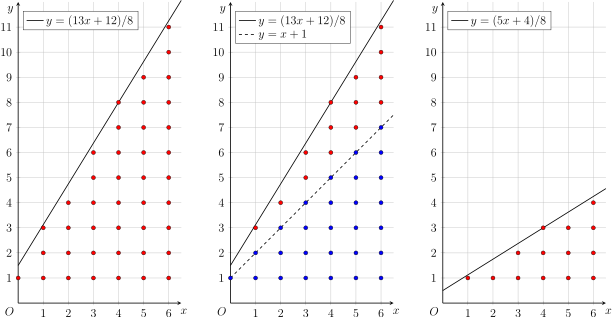
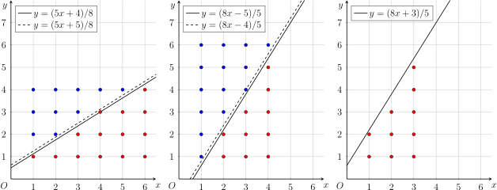
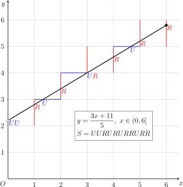

# 类欧几里德算法 - OI Wiki

- Source: https://oi-wiki.org/math/number-theory/euclidean/

# ç±»æ¬§å‡ é‡Œå¾·ç®—æ³•

## å¼•å ¥

ç±»æ¬§å‡ é‡Œå¾·ç®—æ³•æ˜¯æ´ªåŽæ•¦åœ¨ 2016 å¹´å†¬ä»¤è¥è¥å‘˜äº¤æµä¸­æå‡ºçš„å† å®¹ï¼Žå®ƒå¸¸ç”¨äºŽè§£å†³å½¢å¦‚

⌊𝑎𝑖+𝑏𝑐⌋⌊ai+bc⌋

ç»“æž„çš„æ•°åˆ—ï¼ˆä¸‹æ ‡ä¸º 𝑖iï¼‰çš„æ±‚å’Œé—®é¢˜ï¼Žå®ƒçš„ä¸»è¦æƒ³æ³•æ˜¯ï¼Œåˆ©ç”¨åˆ†æ•°è‡ªèº«çš„é€’å½’ç»“æž„ï¼Œå°†é—®é¢˜è½¬åŒ–ä¸ºæ›´å°è§„æ¨¡çš„é—®é¢˜ï¼Œé€’å½’æ±‚è§£ï¼Žå› ä¸ºåˆ†æ•°çš„é€’å½’ç»“æž„å’Œ [æ¬§å‡ é‡Œå¾—ç®—æ³•](../gcd/#欧å‡) 存在直接的 [联系](../continued-fraction/#连分数表示的求法)ï¼Œå› æ­¤ï¼Œè¿™ä¸€æ±‚å’Œæ–¹æ³•ä¹Ÿç§°ä¸ºç±»æ¬§å‡ é‡Œå¾—ç®—æ³•ï¼Ž

å› ä¸º [连分数](../continued-fraction/) 和 [Stern–Brocot æ ‘](../stern-brocot/) ç­‰æ–¹æ³•åŒæ ·åˆ»ç”»äº†åˆ†æ•°çš„é€’å½’ç»“æž„ï¼Œæ‰€ä»¥åˆ©ç”¨ç±»æ¬§å‡ é‡Œå¾—ç®—æ³•å¯ä»¥è§£å†³çš„é—®é¢˜ï¼Œé€šå¸¸ä¹Ÿå¯ä»¥ç”¨è¿™äº›æ–¹æ³•è§£å†³ï¼Žä¸Žè¿™äº›æ–¹æ³•ç›¸æ¯”ï¼Œç±»æ¬§å‡ é‡Œå¾—ç®—æ³•é€šå¸¸æ›´å®¹æ˜“ç†è§£ï¼Œå®ƒçš„å®žçŽ°ä¹Ÿæ›´ä¸ºç®€æ˜Žï¼Ž

## ç±»æ¬§å‡ é‡Œå¾—ç®—æ³•

最简单的例子，就是求和问题：

𝑓(𝑎,𝑏,𝑐,𝑛)=𝑛∑𝑖=0⌊𝑎𝑖+𝑏𝑐⌋,f(a,b,c,n)=∑i=0n⌊ai+bc⌋,

å ¶ä¸­ï¼Œð‘Ž,𝑏,𝑐,𝑛a,b,c,n 都是正整数．

### 代数解法

é¦–å ˆï¼Œå°† 𝑎,𝑏a,b 对 𝑐c 取模，可以简化问题，将问题转化为 0 ≤𝑎,𝑏 <𝑐0≤a,b<c çš„æƒ å½¢ï¼š

𝑓(𝑎,𝑏,𝑐,𝑛)=𝑛∑𝑖=0⌊𝑎𝑖+𝑏𝑐⌋=𝑛∑𝑖=0⌊(⌊𝑎𝑐⌋𝑐+(𝑎mod𝑐))𝑖+(⌊𝑏𝑐⌋𝑐+(𝑏mod𝑐))𝑐⌋=𝑛∑𝑖=0(⌊𝑎𝑐⌋𝑖+⌊𝑏𝑐⌋+⌊(𝑎mod𝑐)𝑖+(𝑏mod𝑐)𝑐⌋)=𝑛(𝑛+1)2⌊𝑎𝑐⌋+(𝑛+1)⌊𝑏𝑐⌋+𝑓(𝑎mod𝑐,𝑏mod𝑐,𝑐,𝑛).f(a,b,c,n)=∑i=0n⌊ai+bc⌋=∑i=0n⌊(⌊ac⌋c+(amodc))i+(⌊bc⌋c+(bmodc))c⌋=∑i=0n(⌊ac⌋i+⌊bc⌋+⌊(amodc)i+(bmodc)c⌋)=n(n+1)2⌊ac⌋+(n+1)⌊bc⌋+f(amodc,bmodc,c,n).

现在，考虑转化后的问题．令

𝑚=⌊𝑎𝑛+𝑏𝑐⌋.m=⌊an+bc⌋.

那么，原问题可以写作二次求和式：

𝑛∑𝑖=0⌊𝑎𝑖+𝑏𝑐⌋=𝑛∑𝑖=0𝑚−1∑𝑗=0[𝑗<⌊𝑎𝑖+𝑏𝑐⌋].∑i=0n⌊ai+bc⌋=∑i=0n∑j=0m−1[j<⌊ai+bc⌋].

交换求和次序，这需要对于每个 𝑗j 计算满足条件的 𝑖i 的范围．为此，将条件变形：

𝑗<⌊𝑎𝑖+𝑏𝑐⌋=⌈𝑎𝑖+𝑏+1𝑐⌉−1⟺𝑗+1<⌈𝑎𝑖+𝑏+1𝑐⌉⟺𝑗+1<𝑎𝑖+𝑏+1𝑐⟺𝑐𝑗+𝑐−𝑏−1𝑎<𝑖⟺⌊𝑐𝑗+𝑐−𝑏−1𝑎⌋<𝑖.j<⌊ai+bc⌋=⌈ai+b+1c⌉−1⟺j+1<⌈ai+b+1c⌉⟺j+1<ai+b+1c⟺cj+c−b−1a<i⟺⌊cj+c−b−1a⌋<i.

变形过程中多次利用了 [取整函数](../basic/#取整函数) çš„æ€§è´¨ï¼Žä»£å ¥å˜å½¢åŽçš„æ¡ä»¶ï¼ŒåŽŸå¼å¯ä»¥å†™ä½œï¼š

𝑓(𝑎,𝑏,𝑐,𝑛)=𝑚−1∑𝑗=0𝑛∑𝑖=0[𝑖>⌊𝑐𝑗+𝑐−𝑏−1𝑎⌋]=𝑚−1∑𝑗=0(𝑛−⌊𝑐𝑗+𝑐−𝑏−1𝑎⌋)=𝑛𝑚−𝑓(𝑐,𝑐−𝑏−1,𝑎,𝑚−1).f(a,b,c,n)=∑j=0m−1∑i=0n[i>⌊cj+c−b−1a⌋]=∑j=0m−1(n−⌊cj+c−b−1a⌋)=nm−f(c,c−b−1,a,m−1).

令 (𝑎′,𝑏′,𝑐′,𝑛′) =(𝑐,𝑐 −𝑏 −1,𝑎,𝑚 −1)(a′,b′,c′,n′)=(c,c−b−1,a,m−1)，这就又回到了前面讨论过的 𝑎′ >𝑐′a′>c′ çš„æƒ å½¢ï¼Ž

将这两步转化结合在一起，可以发现在过程中，(𝑎,𝑐)(a,c) 不断地取模后交换位置，直到 𝑎 =0a=0．这就类似于对 (𝑎,𝑐)(a,c) è¿›è¡Œè¾—è½¬ç›¸é™¤ï¼Œè¿™ä¹Ÿæ˜¯ç±»æ¬§å‡ é‡Œå¾·ç®—æ³•çš„å¾—åï¼Žå®ƒçš„æ—¶é—´å¤æ‚åº¦æ˜¯ 𝑂(log⁡min{𝑎,𝑐})O(log⁡min{a,c}) 的．

在计算过程中，可能会出现 𝑚 =0m=0 çš„æƒ å½¢ï¼Œæ­¤æ—¶å† å±‚é€’å½’ä¼šå‡ºçŽ° 𝑛 = −1n=−1．这并不影响最终的结果．但是，如果要求出现 𝑚 =0m=0 时，直接终止算法，那么算法的时间复杂度可以改良为 𝑂(log⁡min{𝑎,𝑐,𝑛})O(log⁡min{a,c,n}) 的．

对复杂度的解释

åˆ©ç”¨è¯¥ç®—æ³•å’Œæ¬§å‡ é‡Œå¾—ç®—æ³•çš„ç›¸ä¼¼æ€§ï¼Œå¾ˆå®¹æ˜“è¯´æ˜Žå®ƒçš„æ—¶é—´å¤æ‚åº¦æ˜¯ 𝑂(log⁡min{𝑎,𝑐})O(log⁡min{a,c}) çš„ï¼Žå› æ­¤ï¼Œåªéœ€è¦è¯´æ˜Žï¼Œå¦‚æžœåœ¨ 𝑚 =0m=0 时终止算法，那么它的时间复杂度也是 𝑂(log⁡𝑛)O(log⁡n) 的．

令 𝑚 =⌊(𝑎𝑛 +𝑏)/𝑐⌋m=⌊(an+b)/c⌋，并记 𝑆 =𝑚𝑛S=mn，𝑘 =𝑚/𝑛k=m/nï¼Œå®ƒä»¬åˆ†åˆ«ç›¸å½“äºŽå‡ ä½•ç›´è§‚ï¼ˆè§ä¸‹ä¸€èŠ‚ï¼‰ä¸­ç‚¹é˜µå›¾çš„é¢ç§¯å’Œç›´çº¿çš„æ–œçŽ‡ï¼Žå¯¹äºŽå 分大的 𝑛n，近似有 𝑘 ≐𝑎/𝑐k≐a/c．

考察 𝑆S 和 𝑘k 在算法过程中的变化．第一步取模时，𝑛n 保持不变，𝑘k 近似由 𝑎/𝑐a/c 变为 (𝑎mod𝑐)/𝑐(amodc)/c，相当于斜率由 𝑘k 变为 𝑘 −⌊𝑘⌋k−⌊k⌋，而 𝑆S 也近似变为原来的 (𝑘 −⌊𝑘⌋)(k−⌊k⌋) å€ï¼Žç¬¬äºŒæ­¥äº¤æ¢æ¨ªçºµåæ ‡æ—¶ï¼Œð‘†S 近似保持不变，𝑘k åˆ™å˜ä¸ºå®ƒçš„å€’æ•°ï¼Žå› æ­¤ï¼Œè‹¥è®¾ä¸¤æ­¥æ“ä½œåŽï¼ŒäºŒå ƒç»„ (𝑘,𝑆)(k,S) 变为 (𝑘′,𝑆′)(k′,S′)，则有 𝑘′ =(𝑘 −⌊𝑘⌋)−1k′=(k−⌊k⌋)−1 且 𝑆′ =(𝑘 −⌊𝑘⌋)𝑆S′=(k−⌊k⌋)S．

å› ä¸º 1 ≤⌊𝑘′⌋ ≤𝑘′ <⌊𝑘′⌋ +11≤⌊k′⌋≤k′<⌊k′⌋+1，所以，递归计算两轮后，乘积缩小的倍数最少为

(𝑘′−⌊𝑘′⌋)(𝑘−⌊𝑘⌋)=1−⌊𝑘′⌋𝑘′<1−⌊𝑘′⌋⌊𝑘′⌋+1=1⌊𝑘′⌋+1≤12.(k′−⌊k′⌋)(k−⌊k⌋)=1−⌊k′⌋k′<1−⌊k′⌋⌊k′⌋+1=1⌊k′⌋+1≤12.

å› æ­¤ï¼Œè‡³å¤š 𝑂(log⁡𝑆)O(log⁡S) è½®ï¼Œç®—æ³•å¿ ç„¶ç»ˆæ­¢ï¼Žå› ä¸ºä»Žç¬¬äºŒè½®å¼€å§‹ï¼Œæ¯è½®å¼€å§‹æ—¶çš„ 𝑆S æ€»æ˜¯ä¸è¶ è¿‡ä¸Šä¸€è½®å–æ¨¡ç»“æŸåŽçš„ 𝑆Sï¼Œè€ŒåŽè€ å¤§è‡´ä¸º 𝑘𝑛2kn2 且 𝑘 <1k<1ï¼Œå› è€Œ 𝑂(log⁡𝑆) ⊆𝑂(log⁡𝑛)O(log⁡S)⊆O(log⁡n)．这就得到了上述结论．

模板题的参考实现如下：

模板题实现（[Library Checker - Sum of Floor of Linear](https://judge.yosupo.jp/problem/sum_of_floor_of_linear)）

```text 1 2 3 4 5 6 7 8 9 10 11 12 13 14 15 16 17 18 19 20 21 ``` |  ```text #include <iostream> long long solve ( long long a , long long b , long long c , long long n ) { long long n2 = n * ( n \+ 1 ) / 2 ; if ( a >= c || b >= c ) return solve ( a % c , b % c , c , n ) \+ ( a / c ) * n2 \+ ( b / c ) * ( n \+ 1 ); long long m = ( a * n \+ b ) / c ; if ( ! m ) return 0 ; return m * n \- solve ( c , c \- b \- 1 , a , m \- 1 ); } int main () { int t ; std :: cin >> t ; for (; t ; \-- t ) { int a , b , c , n ; std :: cin >> n >> c >> a >> b ; std :: cout << solve ( a , b , c , n \- 1 ) << '\n' ; } return 0 ; } ```   
---|---  
  
### å‡ ä½•ç›´è§‚

è¿™ä¸ªç®—æ³•è¿˜å¯ä»¥ä»Žå‡ ä½•çš„è§’åº¦ç†è§£ï¼Žç±»æ¬§å‡ é‡Œå¾—ç®—æ³•å¯ä»¥è§£å†³çš„é—®é¢˜ä¸»è¦æ˜¯ç›´çº¿ä¸‹æ•´ç‚¹è®¡æ•°é—®é¢˜ï¼Ž

如下图最左部分所示，该求和式相当于求直线

𝑦=𝑎𝑥+𝑏𝑐y=ax+bc

下方，𝑥x è½´ä¸Šæ–¹ï¼ˆä¸åŒ æ‹¬ 𝑥x è½´ï¼‰ï¼Œä¸”æ¨ªåæ ‡ä½äºŽ [0,𝑛][0,n] ä¹‹é—´çš„æ ¼ç‚¹æ•°ç›®ï¼Ž



é¦–å ˆï¼Œç§»é™¤æ–œçŽ‡å’Œæˆªè·ä¸­çš„æ•´æ•°éƒ¨åˆ†ï¼Žè¿™ä¸€æ­¥ç›¸å½“äºŽå°†ä¸Šå›¾ä¸­é—´éƒ¨åˆ†çš„è“ç‚¹æ•°é‡å•ç‹¬è®¡ç®—å‡ºæ¥ï¼Žå½“æ–œçŽ‡å’Œæˆªè·éƒ½æ˜¯æ•´æ•°æ—¶ï¼Œè“ç‚¹ä¸€å®šæž„æˆä¸€ä¸ªæ¢¯å½¢é˜µåˆ—ï¼Œä¹Ÿå°±æ˜¯è¯´ï¼Œä¸åŒçºµåˆ—çš„æ ¼ç‚¹å½¢æˆç­‰å·®æ•°åˆ—ï¼Œå› è€Œè¿™äº›ç‚¹çš„æ•°é‡æ˜¯å®¹æ˜“è®¡ç®—çš„ï¼Žå°†è¿™äº›ç‚¹ç§»é™¤åŽï¼Œå‰©ä½™çš„æ ¼ç‚¹å’Œä¸Šå›¾æœ€å³éƒ¨åˆ†çš„çº¢ç‚¹æ•°é‡ä¸€è‡´ï¼Žé—®é¢˜å°±è½¬åŒ–æˆäº†æ–œçŽ‡å’Œæˆªè·éƒ½å°äºŽä¸€çš„æƒ å½¢ï¼Žå› ä¸ºæ¢¯å½¢çš„é«˜ä¸º 𝑛 +1n+1 且两个底边长度分别为 ⌊𝑏/𝑐⌋⌊b/c⌋ 和 (⌊𝑎/𝑐⌋𝑛 +⌊𝑏/𝑐⌋)(⌊a/c⌋n+⌊b/c⌋)ï¼Œæ‰€ä»¥ï¼Œåˆ©ç”¨æ¢¯å½¢é¢ç§¯å ¬å¼ï¼Œè¿™ä¸€æ­¥éª¤å¯ä»¥å½’çº³ä¸ºç®—å¼

𝑓(𝑎,𝑏,𝑐,𝑛)=𝑓(𝑎mod𝑐,𝑏mod𝑐,𝑐,𝑛)+12(𝑛+1)(⌊𝑏𝑐⌋+(⌊𝑎𝑐⌋𝑛+⌊𝑏𝑐⌋)).f(a,b,c,n)=f(amodc,bmodc,c,n)+12(n+1)(⌊bc⌋+(⌊ac⌋n+⌊bc⌋)).

ç„¶åŽï¼Œç¿»è½¬æ¨ªçºµåæ ‡è½´ï¼Žå¦‚ä¸‹å›¾æœ€å·¦éƒ¨åˆ†æ‰€ç¤ºï¼Œå›¾ä¸­çš„çº¢ç‚¹å’Œè“ç‚¹æž„æˆäº†ä¸€ä¸ªæ¨ªå‘é•¿åº¦ä¸º 𝑛n、纵向长度为 𝑚 =⌊(𝑎𝑛 +𝑏)/𝑐⌋m=⌊(an+b)/c⌋ çš„çŸ©å½¢ç‚¹é˜µï¼Žè¦è®¡ç®—çº¢ç‚¹çš„æ•°é‡ï¼Œåªéœ€è¦è®¡ç®—è“ç‚¹çš„æ•°é‡ï¼Œå†ç”¨çŸ©å½¢ç‚¹é˜µçš„æ•°é‡å‡åŽ»è“ç‚¹çš„æ•°é‡å³å¯ï¼Žç¿»è½¬åŽï¼Œä¸Šå›¾å·¦åŠéƒ¨åˆ†ä¸­çš„è“ç‚¹ç‚¹é˜µå°±å˜æˆäº†æŸæ¡ç›´çº¿ä¸‹çš„çº¢è‰²ç‚¹é˜µï¼Žè€Œä¸”ï¼Œç¿»è½¬åŽï¼Œæ–œçŽ‡å¤§äºŽä¸€ï¼Œå°±åˆå›žåˆ°äº†ä¸Šæ–‡å·²ç»å¤„ç†è¿‡çš„æƒ å½¢ï¼Ž



å ³é”®åœ¨äºŽå¦‚ä½•è®¡ç®—æ–°çš„çº¢è‰²ç‚¹é˜µä¸Šæ–¹çš„ç›´çº¿çš„æ–¹ç¨‹ï¼Žå°†ä¸Šå›¾æœ€å·¦éƒ¨åˆ†çš„æ¨ªçºµåæ ‡è½´ç¿»è½¬ï¼Œå°±å¾—åˆ°ä¸Šå›¾ä¸­é—´éƒ¨åˆ†ï¼Žç¿»è½¬åŽçš„çº¢è‰²ç‚¹é˜µä¸Šæ–¹çš„ç›´çº¿ï¼ˆä¸­é—´éƒ¨åˆ†çš„å®žçº¿ï¼‰ï¼Œå¹¶éžå¯¹åº”ç¿»è½¬å‰çš„ç›´çº¿ï¼ˆæœ€å·¦éƒ¨åˆ†çš„å®žçº¿ï¼‰ï¼Œè€Œæ˜¯ç¿»è½¬å‰çš„ç›´çº¿å‘å·¦ä¸Šå¹³ç§»ä¸€ç‚¹ç‚¹çš„ç»“æžœï¼ˆæœ€å·¦éƒ¨åˆ†çš„è™šçº¿ï¼‰ï¼Žè¿™æ˜¯å› ä¸ºï¼Œå¦‚æžœç›´æŽ¥å°†ç›´çº¿ï¼ˆæœ€å·¦éƒ¨åˆ†çš„å®žçº¿ï¼‰ç¿»è½¬ï¼Œå°†å¾—åˆ°ä¸­é—´éƒ¨åˆ†çš„è™šçº¿ï¼Œä½†æ˜¯æŒ‰ç §å®šä¹‰ï¼Œå®ƒä¸‹æ–¹çš„æ ¼ç‚¹åŒ æ‹¬æ°å¥½è½åœ¨ç›´çº¿ä¸Šçš„æ ¼ç‚¹ï¼Œè¿™å°±ä¼šå¯¼è‡´ç›´çº¿ä¸Šçš„æ ¼ç‚¹é‡å¤è®¡æ•°ï¼Žä¸ºäº†é¿å è¿™ä¸€ç‚¹ï¼Œéœ€è¦å°†ç¿»è½¬ç›´çº¿ 𝑦 =(𝑎𝑥 +𝑏)/𝑐y=(ax+b)/c 后得到的直线 𝑦 =(𝑐𝑥 −𝑏)/𝑎y=(cx−b)/a 向下平移一点点，得到直线 𝑦 =(𝑐𝑥 −𝑏 −1)/𝑎y=(cx−b−1)/aï¼Œè¿™æ ·å®ƒä¸‹æ–¹çš„ç‚¹é˜µæ‰æ°ä¸ºç¿»è½¬å‰çš„è“è‰²ç‚¹é˜µï¼Ž

è¿˜æœ‰å¦ä¸€å¤„ç»†èŠ‚éœ€è¦å¤„ç†ï¼Žä¸Šå›¾ä¸­é—´éƒ¨åˆ†çš„ç›´çº¿çš„æˆªè·æ˜¯è´Ÿæ•°ï¼Œè¿™æ„å‘³ç€è¿˜æ²¡æœ‰å›žåˆ°ä¹‹å‰çš„åˆå§‹æƒ å½¢ï¼Žè¦è®©æˆªè·æ¢å¤ä¸ºéžè´Ÿæ•°ï¼Œåªéœ€è¦å°†ç›´çº¿ï¼ˆä¸­é—´éƒ¨åˆ†çš„å®žçº¿ï¼‰å‘å·¦å¹³ç§»ä¸€ä¸ªå•ä½ï¼Žè¿™æ ·åšä¸ä¼šæ¼æŽ‰ä»»ä½•æ ¼ç‚¹ï¼Œå› ä¸ºç¿»è½¬å‰çš„è“è‰²ç‚¹é˜µä¸­æ²¡æœ‰çºµåæ ‡ä¸ºé›¶çš„ç‚¹ï¼Œç¿»è½¬åŽä¹Ÿå°±ä¸å­˜åœ¨æ¨ªåæ ‡ä¸ºé›¶çš„ç‚¹ï¼Žæœ€åŽï¼Œç›´çº¿æ–¹ç¨‹å°±å˜ä¸º 𝑦 =(𝑐𝑥 +𝑐 −𝑏 −1)/𝑎y=(cx+c−b−1)/aï¼›åŒæ—¶ï¼Œç‚¹é˜µçš„æ¨ªåæ ‡çš„ä¸Šç•Œä¹Ÿä»Ž 𝑚m 变成了 𝑚 −1m−1．这一步骤可以归纳为算式

𝑓(𝑎,𝑏,𝑐,𝑛)=𝑚𝑛−𝑓(𝑐,𝑐−𝑏−1,𝑎,𝑚−1).f(a,b,c,n)=mn−f(c,c−b−1,a,m−1).

è¿™ç§é€’å½’çš„ç®—æ³•è¡Œå¾—é€šï¼Œä¸»è¦æœ‰ä¸¤ä¸ªåŽŸå› ï¼š

  * ç¬¬ä¸€ï¼Œç›´çº¿çš„æ–œçŽ‡ä¸æ–­åœ°å ˆå–å°æ•°éƒ¨åˆ†å†å–å€’æ•°ï¼Œè¿™ç­‰ä»·äºŽè®¡ç®—ç›´çº¿æ–œçŽ‡ 𝑘 =𝑎/𝑐k=a/c 的 [连分数展开](../continued-fraction/#连分数表示的求法)ï¼Žå› ä¸ºæœ‰ç†åˆ†æ•°çš„è¿žåˆ†æ•°å±•å¼€çš„é•¿åº¦æ˜¯ 𝑂(log⁡min{𝑎,𝑐})O(log⁡min{a,c}) 的，所以这一过程一定在 𝑂(log⁡min{𝑎,𝑐})O(log⁡min{a,c}) 步后终止；
  * ç¬¬äºŒï¼Œå› ä¸ºæ¯æ¬¡ç¿»è½¬åæ ‡è½´çš„æ—¶å€™ï¼Œç›´çº¿æ–œçŽ‡éƒ½æ˜¯å°äºŽä¸€çš„ï¼Œå› æ­¤ï¼Œç›´è§‰ä¸Šåº”è¯¥æœ‰ 𝑚 <𝑛m<nï¼Œä¹Ÿå°±æ˜¯è¯´ï¼Œç»è¿‡è¿™æ ·ä¸€è½®è¿­ä»£åŽï¼Œæ¨ªåæ ‡çš„èŒƒå›´ä¸€ç›´æ˜¯åœ¨ç¼©å°çš„ï¼Žå‰æ–‡çš„å¤æ‚åº¦è®¡ç®—ä¸­é€šè¿‡ä¸¥æ ¼çš„åˆ†æžè¯´æ˜Žï¼Œæ¯ä¸¤è½®è¿­ä»£åŽï¼Œð‘›n è‡³å¤šä¸ºåŽŸæ¥çš„ä¸€åŠï¼Œæ• è€Œè¿™ä¸€è¿‡ç¨‹ä¸€å®šåœ¨ 𝑂(log⁡𝑛)O(log⁡n) 步后终止．

è¿™ä¹Ÿæ˜¯æ–œçŽ‡ä¸ºæœ‰ç†æ•°æ—¶çš„ç±»æ¬§å‡ é‡Œå¾—ç®—æ³•çš„å¤æ‚åº¦æ˜¯ 𝑂(log⁡min{𝑎,𝑐,𝑛})O(log⁡min{a,c,n}) çš„åŽŸå› ï¼Ž

åˆ©ç”¨ç±»ä¼¼çš„å‡ ä½•ç›´è§‚ï¼Œå¯ä»¥å°†ç±»æ¬§å‡ é‡Œå¾—ç®—æ³•æŽ¨å¹¿åˆ°æ–œçŽ‡ä¸ºæ— ç†æ•°çš„æƒ å½¢ï¼Œå ·ä½“åˆ†æžè¯·å‚è€ƒåŽæ–‡çš„ä¾‹é¢˜ï¼Ž

### 例题

[ã€æ¨¡æ¿ã€‘ç±»æ¬§å‡ é‡Œå¾—ç®—æ³•](https://www.luogu.com.cn/problem/P5170)

多组询问．给定正整数 𝑎,𝑏,𝑐,𝑛a,b,c,n，求

𝑓(𝑎,𝑏,𝑐,𝑛)=𝑛∑𝑖=0⌊𝑎𝑖+𝑏𝑐⌋,𝑔(𝑎,𝑏,𝑐,𝑛)=𝑛∑𝑖=0𝑖⌊𝑎𝑖+𝑏𝑐⌋,ℎ(𝑎,𝑏,𝑐,𝑛)=𝑛∑𝑖=0⌊𝑎𝑖+𝑏𝑐⌋2.f(a,b,c,n)=∑i=0n⌊ai+bc⌋,g(a,b,c,n)=∑i=0ni⌊ai+bc⌋,h(a,b,c,n)=∑i=0n⌊ai+bc⌋2.解答一

类似于 𝑓f 的推导，可以得到 𝑔,ℎg,h 的递归表达式．

é¦–å ˆï¼Œåˆ©ç”¨å–æ¨¡ï¼Œå°†é—®é¢˜è½¬åŒ–ä¸º 0 ≤𝑎,𝑏 <𝑐0≤a,b<c çš„æƒ å½¢ï¼š

𝑔(𝑎,𝑏,𝑐,𝑛)=𝑔(𝑎mod𝑐,𝑏mod𝑐,𝑐,𝑛)+⌊𝑎𝑐⌋𝑛(𝑛+1)(2𝑛+1)6+⌊𝑏𝑐⌋𝑛(𝑛+1)2,ℎ(𝑎,𝑏,𝑐,𝑛)=ℎ(𝑎mod𝑐,𝑏mod𝑐,𝑐,𝑛)+2⌊𝑏𝑐⌋𝑓(𝑎mod𝑐,𝑏mod𝑐,𝑐,𝑛)+2⌊𝑎𝑐⌋𝑔(𝑎mod𝑐,𝑏mod𝑐,𝑐,𝑛)+⌊𝑎𝑐⌋2𝑛(𝑛+1)(2𝑛+1)6+⌊𝑏𝑐⌋2(𝑛+1)+⌊𝑎𝑐⌋⌊𝑏𝑐⌋𝑛(𝑛+1).g(a,b,c,n)=g(amodc,bmodc,c,n)+⌊ac⌋n(n+1)(2n+1)6+⌊bc⌋n(n+1)2,h(a,b,c,n)=h(amodc,bmodc,c,n)+2⌊bc⌋f(amodc,bmodc,c,n)+2⌊ac⌋g(amodc,bmodc,c,n)+⌊ac⌋2n(n+1)(2n+1)6+⌊bc⌋2(n+1)+⌊ac⌋⌊bc⌋n(n+1).

ç„¶åŽï¼Œåˆ©ç”¨äº¤æ¢æ±‚å’Œæ¬¡åºï¼Œå¯ä»¥è¿›ä¸€æ­¥è½¬åŒ–ï¼ŽåŒæ ·åœ°ï¼Œä»¤

𝑚=⌊𝑎𝑛+𝑏𝑐⌋.m=⌊an+bc⌋.

那么，对于和式 𝑔g，有

𝑔(𝑎,𝑏,𝑐,𝑛)=𝑛∑𝑖=0𝑖⌊𝑎𝑖+𝑏𝑐⌋=𝑛∑𝑖=0𝑚−1∑𝑗=0𝑖[𝑗<⌊𝑎𝑖+𝑏𝑐⌋]=𝑚−1∑𝑗=0𝑛∑𝑖=0𝑖[𝑖>⌊𝑐𝑗+𝑐−𝑏−1𝑎⌋]=𝑚−1∑𝑗=012(⌊𝑐𝑗+𝑐−𝑏−1𝑎⌋+𝑛+1)(𝑛−⌊𝑐𝑗+𝑐−𝑏−1𝑎⌋)=12𝑚𝑛(𝑛+1)−12𝑚−1∑𝑗=0⌊𝑐𝑗+𝑐−𝑏−1𝑎⌋−12𝑚−1∑𝑗=0⌊𝑐𝑗+𝑐−𝑏−1𝑎⌋2=12𝑚𝑛(𝑛+1)−12𝑓(𝑐,𝑐−𝑏−1,𝑎,𝑚−1)−12ℎ(𝑐,𝑐−𝑏−1,𝑎,𝑚−1).g(a,b,c,n)=∑i=0ni⌊ai+bc⌋=∑i=0n∑j=0m−1i[j<⌊ai+bc⌋]=∑j=0m−1∑i=0ni[i>⌊cj+c−b−1a⌋]=∑j=0m−112(⌊cj+c−b−1a⌋+n+1)(n−⌊cj+c−b−1a⌋)=12mn(n+1)−12∑j=0m−1⌊cj+c−b−1a⌋−12∑j=0m−1⌊cj+c−b−1a⌋2=12mn(n+1)−12f(c,c−b−1,a,m−1)−12h(c,c−b−1,a,m−1).

对于和式 ℎh，有

ℎ(𝑎,𝑏,𝑐,𝑛)=𝑛∑𝑖=0⌊𝑎𝑖+𝑏𝑐⌋2=𝑛∑𝑖=0𝑚−1∑𝑗=0(2𝑗+1)[𝑗<⌊𝑎𝑖+𝑏𝑐⌋]=𝑚−1∑𝑗=0𝑛∑𝑖=0(2𝑗+1)[𝑖>⌊𝑐𝑗+𝑐−𝑏−1𝑎⌋]=𝑚−1∑𝑗=0(2𝑗+1)(𝑛−⌊𝑐𝑗+𝑐−𝑏−1𝑎⌋)=𝑛𝑚2−𝑚−1∑𝑗=0⌊𝑐𝑗+𝑐−𝑏−1𝑎⌋−2𝑚−1∑𝑗=0𝑗⌊𝑐𝑗+𝑐−𝑏−1𝑎⌋=𝑛𝑚2−𝑓(𝑐,𝑐−𝑏−1,𝑎,𝑚−1)−2𝑔(𝑐,𝑐−𝑏−1,𝑎,𝑚−1).h(a,b,c,n)=∑i=0n⌊ai+bc⌋2=∑i=0n∑j=0m−1(2j+1)[j<⌊ai+bc⌋]=∑j=0m−1∑i=0n(2j+1)[i>⌊cj+c−b−1a⌋]=∑j=0m−1(2j+1)(n−⌊cj+c−b−1a⌋)=nm2−∑j=0m−1⌊cj+c−b−1a⌋−2∑j=0m−1j⌊cj+c−b−1a⌋=nm2−f(c,c−b−1,a,m−1)−2g(c,c−b−1,a,m−1).

ä»Žå‡ ä½•ç›´è§‚çš„è§’åº¦çœ‹ï¼Œè¿™äº›éžçº¿æ€§çš„æ±‚å’Œå¼ç›¸å½“äºŽç»™åŒºåŸŸä¸­çš„æ¯ä¸ªç‚¹ (𝑖,𝑗)(i,j) 都赋予了相应的权重 𝑤(𝑖,𝑗)w(i,j)ï¼Žé™¤äº†è¿™äº›æƒé‡ä¹‹å¤–ï¼Œå ¶ä½™éƒ¨åˆ†çš„è®¡ç®—è¿‡ç¨‹æ˜¯å®Œå ¨ä¸€è‡´çš„ï¼Žå¯¹äºŽæƒé‡çš„é€‰æ‹©ï¼Œä¸€èˆ¬åœ°ï¼Œæœ‰

𝑛∑𝑖=0𝑖𝑟⌊𝑎𝑖+𝑏𝑐⌋𝑠=𝑛∑𝑖=0𝑚−1∑𝑗=0𝑖𝑟((𝑗+1)𝑠−𝑗𝑠)[𝑗<⌊𝑎𝑖+𝑏𝑐⌋].∑i=0nir⌊ai+bc⌋s=∑i=0n∑j=0m−1ir((j+1)s−js)[j<⌊ai+bc⌋].

本题的另一个特点是，𝑔g 和 ℎh åœ¨é€’å½’è®¡ç®—æ—¶ï¼Œä¼šç›¸äº’äº¤é”™ï¼Žå› æ­¤ï¼Œéœ€è¦å°† (𝑓,𝑔,ℎ)(f,g,h) ä½œä¸ºä¸‰å ƒç»„åŒæ—¶é€’å½’ï¼Ž

```text 1 2 3 4 5 6 7 8 9 10 11 12 13 14 15 16 17 18 19 20 21 22 23 24 25 26 27 28 29 30 31 32 33 34 35 36 37 38 39 40 41 42 43 44 ``` |  ```text #include <iostream> struct Data { int f , g , h ; }; Data solve ( long long a , long long b , long long c , long long n ) { constexpr long long M = 998244353 ; constexpr long long i2 = ( M \+ 1 ) / 2 ; constexpr long long i6 = ( M \+ 1 ) / 6 ; long long n2 = ( n \+ 1 ) * n % M * i2 % M ; long long n3 = ( 2 * n \+ 1 ) * ( n \+ 1 ) % M * n % M * i6 % M ; Data res = { 0 , 0 , 0 }; if ( a >= c || b >= c ) { auto tmp = solve ( a % c , b % c , c , n ); long long aa = a / c , bb = b / c ; res . f = ( tmp . f \+ aa * n2 \+ bb * ( n \+ 1 )) % M ; res . g = ( tmp . g \+ aa * n3 \+ bb * n2 ) % M ; res . h = ( tmp . h \+ 2 * bb * tmp . f % M \+ 2 * aa * tmp . g % M \+ aa * aa % M * n3 % M \+ bb * bb % M * ( n \+ 1 ) % M \+ 2 * aa * bb % M * n2 % M ) % M ; return res ; } long long m = ( a * n \+ b ) / c ; if ( ! m ) return res ; auto tmp = solve ( c , c \- b \- 1 , a , m \- 1 ); res . f = ( m * n \- tmp . f \+ M ) % M ; res . g = ( m * n2 \+ ( M \- tmp . f ) * i2 \+ ( M \- tmp . h ) * i2 ) % M ; res . h = ( n * m % M * m \- tmp . f \- tmp . g * 2 \+ 3 * M ) % M ; return res ; } int main () { int t ; std :: cin >> t ; for (; t ; \-- t ) { int n , a , b , c ; std :: cin >> n >> a >> b >> c ; auto res = solve ( a , b , c , n ); std :: cout << res . f << ' ' << res . h << ' ' << res . g << '\n' ; } return 0 ; } ```   
---|---  
  
[[æ¸ åŽé›†è®­ 2014] Sum](https://www.luogu.com.cn/problem/P5172)

多组询问．给定正整数 𝑛n 和 𝑟r，求

𝑛∑𝑑=1(−1)⌊𝑑√𝑟⌋.∑d=1n(−1)⌊dr⌋.解答一

如果 𝑟r æ˜¯å®Œå ¨å¹³æ–¹æ•°ï¼Œé‚£ä¹ˆå½“ √𝑟r 为偶数时，和式为 𝑛n；否则，和式依据 𝑛n 奇偶性不同，在 00 和 −1−1 之间交替变化．下面考虑 𝑟r ä¸æ˜¯å®Œå ¨å¹³æ–¹æ•°çš„æƒ å½¢ï¼Ž

ä¸ºäº†åº”ç”¨ç±»æ¬§å‡ é‡Œå¾—ç®—æ³•ï¼Œé¦–å ˆå°†æ±‚å’Œå¼è½¬åŒ–ä¸ºç†Ÿæ‚‰çš„å½¢å¼ï¼š

𝑛∑𝑑=1(−1)⌊𝑑√𝑟⌋=𝑛∑𝑑=1(1−2(⌊𝑑√𝑟⌋mod2))=𝑛−2𝑛∑𝑑=1(⌊𝑑√𝑟⌋−2⌊⌊𝑑√𝑟⌋2⌋)=𝑛−2𝑛∑𝑑=1⌊𝑑√𝑟⌋+4𝑛∑𝑑=1⌊𝑑√𝑟2⌋=𝑛−2𝑓(𝑛,1,0,1)+4𝑓(𝑛,1,0,2)∑d=1n(−1)⌊dr⌋=∑d=1n(1−2(⌊dr⌋mod2))=n−2∑d=1n(⌊dr⌋−2⌊⌊dr⌋2⌋)=n−2∑d=1n⌊dr⌋+4∑d=1n⌊dr2⌋=n−2f(n,1,0,1)+4f(n,1,0,2)

å ¶ä¸­çš„å‡½æ•° 𝑓f å ·æœ‰å½¢å¼

𝑓(𝑎,𝑏,𝑐,𝑛)=𝑛∑𝑖=1⌊𝑎√𝑟+𝑏𝑐𝑖⌋.f(a,b,c,n)=∑i=1n⌊ar+bci⌋.

与正文中的算法不同的是，此处的斜率不再是有理数．设斜率

𝑘=𝑎√𝑟+𝑏𝑐.k=ar+bc.

åŒæ ·åˆ†ä¸ºä¸¤ç§æƒ å½¢è®¨è®ºï¼Žå¦‚æžœ 𝑘 ≥1k≥1，那么

𝑓(𝑎,𝑏,𝑐,𝑛)=𝑛∑𝑖=1⌊𝑘𝑖⌋=𝑛∑𝑖=1⌊(𝑘−⌊𝑘⌋)𝑖⌋+⌊𝑘⌋𝑛∑𝑖=1𝑖=⌊𝑘⌋𝑛(𝑛+1)2+𝑓(𝑎,𝑏−𝑐⌊𝑘⌋,𝑐,𝑛).f(a,b,c,n)=∑i=1n⌊ki⌋=∑i=1n⌊(k−⌊k⌋)i⌋+⌊k⌋∑i=1ni=⌊k⌋n(n+1)2+f(a,b−c⌊k⌋,c,n).

é—®é¢˜è½¬åŒ–ä¸ºæ–œçŽ‡å°äºŽä¸€çš„æƒ å½¢ï¼Žå¦‚æžœ 𝑘 <1k<1，那么设 𝑚 =⌊𝑛𝑘⌋m=⌊nk⌋，有

𝑓(𝑎,𝑏,𝑐,𝑛)=𝑛∑𝑖=1⌊𝑘𝑖⌋=𝑛∑𝑖=1𝑚∑𝑗=1[𝑗≤⌊𝑘𝑖⌋]=𝑚∑𝑗=1𝑛∑𝑖=1[𝑖>⌊𝑘−1𝑗⌋]=𝑛𝑚−𝑚∑𝑗=1𝑛∑𝑖=1[𝑖≤⌊𝑘−1𝑗⌋].f(a,b,c,n)=∑i=1n⌊ki⌋=∑i=1n∑j=1m[j≤⌊ki⌋]=∑j=1m∑i=1n[i>⌊k−1j⌋]=nm−∑j=1m∑i=1n[i≤⌊k−1j⌋].

此处的推导中，交换 𝑖i 和 𝑗j çš„æ¡ä»¶æ¯”æ­£æ–‡ä¸­çš„æƒ å½¢æ›´ä¸ºç®€å•ï¼Œæ˜¯å› ä¸ºç›´çº¿ 𝑦 =𝑘𝑥y=kx ä¸Šæ²¡æœ‰é™¤äº†åŽŸç‚¹ä¹‹å¤–çš„æ ¼ç‚¹ï¼Žå ³é”®åœ¨äºŽäº¤æ¢åŽçš„æ±‚å’Œå¼å†™æˆ 𝑓(𝑎,𝑏,𝑐,𝑛)f(a,b,c,n) 的形式，这相当于要求 𝑎′,𝑏′,𝑐′a′,b′,c′ 满足

𝑘−1=𝑎′√𝑟+𝑏′𝑐′.k−1=a′r+b′c′.

这并不困难，只需要将分母有理化，就能得到

𝑘−1=𝑐𝑎√𝑟+𝑏=𝑐𝑎√𝑟−𝑐𝑏𝑎2𝑟−𝑏2.k−1=car+b=car−cba2r−b2.

å› æ­¤ï¼Œæœ‰

𝑎′=𝑐𝑎, 𝑏′=−𝑐𝑏, 𝑐′=𝑎2𝑟−𝑏2.a′=ca, b′=−cb, c′=a2r−b2.

这说明

𝑓(𝑎,𝑏,𝑐,𝑛)=𝑛𝑚−𝑓(𝑐𝑎,−𝑐𝑏,𝑎2𝑟−𝑏2,𝑚).f(a,b,c,n)=nm−f(ca,−cb,a2r−b2,m).

ä¸ºäº†é¿å æ•´æ•°æº¢å‡ºï¼Œéœ€è¦æ¯æ¬¡éƒ½å°† 𝑎,𝑏,𝑐a,b,c åŒé™¤ä»¥å®ƒä»¬çš„æœ€å¤§å ¬çº¦æ•°ï¼Žå› ä¸ºè¿™ä¸ªè®¡ç®—è¿‡ç¨‹å’Œè®¡ç®— 𝑘k çš„è¿žåˆ†æ•°çš„è¿‡ç¨‹å®Œå ¨ä¸€è‡´ï¼Œæ‰€ä»¥æ ¹æ® [连分数理论](../continued-fraction/#二次æ—)，只要保证 gcd(𝑎,𝑏,𝑐) =1gcd(a,b,c)=1ï¼Œå®ƒä»¬åœ¨è®¡ç®—è¿‡ç¨‹ä¸­å¿ ç„¶åœ¨æ•´åž‹èŒƒå›´å† ï¼Žå¦å¤–ï¼Œå°½ç®¡ (𝑎,𝑏,𝑐,𝑛)(a,b,c,n) 不会溢出，但是在该题数据范围下，𝑓(𝑎,𝑏,𝑐,𝑛)f(a,b,c,n) å¯èƒ½ä¼šè¶ è¿‡ 6464 ä½æ•´æ•°çš„èŒƒå›´ï¼Œè‡ªç„¶æº¢å‡ºå³å¯ï¼Œæ— éœ€é¢å¤–å¤„ç†ï¼Œæœ€åŽç»“æžœä¸€å®šåœ¨ [ −𝑛,𝑛][−n,n] 之间．

尽管斜率不会变为零，算法的复杂度仍然是 𝑂(log⁡𝑛)O(log⁡n) çš„ï¼Œè¿™ä¸€ç‚¹ä»Žå‰æ–‡å ³äºŽç®—æ³•å¤æ‚åº¦çš„è®ºè¯å®¹æ˜“çœ‹å‡ºï¼Ž

```text 1 2 3 4 5 6 7 8 9 10 11 12 13 14 15 16 17 18 19 20 21 22 23 24 25 26 27 28 29 30 31 32 33 34 35 36 37 38 39 40 ``` |  ```text #include <cmath> #include <iostream> long long r ; long double sqrt_r ; long long gcd ( long long a , long long b ) { return b ? gcd ( b , a % b ) : a ; } unsigned long long f ( long long a , long long b , long long c , long long n ) { if ( ! n ) return 0 ; auto d = gcd ( a , gcd ( b , c )); a /= d ; b /= d ; c /= d ; unsigned long long k = ( a * sqrt_r \+ b ) / c ; if ( k ) { return n * ( n \+ 1 ) / 2 * k \+ f ( a , b \- c * k , c , n ); } else { unsigned long long m = n * ( a * sqrt_r \+ b ) / c ; return n * m \- f ( c * a , \- c * b , a * a * r \- b * b , m ); } } unsigned long long solve ( long long n , long long r ) { long long sqr = sqrt_r = sqrtl ( r ); if ( r == sqr * sqr ) return r % 2 ? ( n % 2 ? -1 : 0 ) : n ; return n \- 2 * f ( 1 , 0 , 1 , n ) \+ 4 * f ( 1 , 0 , 2 , n ); } int main () { int t ; std :: cin >> t ; for (; t ; \-- t ) { int n ; std :: cin >> n >> r ; long long res = solve ( n , r ); std :: cout << res << '\n' ; } return 0 ; } ```   
---|---  
  
[Fraction](https://www.luogu.com.cn/problem/P5179)

给定正整数 𝑎,𝑏,𝑐,𝑑a,b,c,d，求所有满足 𝑎/𝑏 <𝑝/𝑞 <𝑐/𝑑a/b<p/q<c/d 的最简分数 𝑝/𝑞p/q 中 (𝑞,𝑝)(q,p) çš„å­—å ¸åºæœ€å°çš„é‚£ä¸ªï¼Ž

解答

这道题目也是 [Stern–Brocot æ ‘](../stern-brocot/) çš„ç»å ¸åº”ç”¨ï¼Œç›¸å ³é¢˜è§£å¯ä»¥åœ¨ [此处](../continued-fraction/#连分数的æ) æ‰¾åˆ°ï¼Žå› ä¸ºå®ƒåªä¾èµ–äºŽåˆ†æ•°çš„é€’å½’ç»“æž„ï¼Œæ‰€ä»¥å®ƒåŒæ ·å¯ä»¥åˆ©ç”¨ç±»ä¼¼æ¬§å‡ é‡Œå¾—ç®—æ³•çš„æ–¹æ³•æ±‚è§£ï¼Œæ• è€Œä¹Ÿå¯ä»¥è§†ä½œç±»æ¬§å‡ é‡Œå¾—ç®—æ³•çš„ä¸€ä¸ªåº”ç”¨ï¼Ž

如果 𝑎/𝑏a/b 和 𝑐/𝑑c/d 之间（不含端点）存在至少一个自然数，可以直接取 (𝑞,𝑝) =(1,⌊𝑎/𝑏⌋ +1)(q,p)=(1,⌊a/b⌋+1)ï¼Žå¦åˆ™ï¼Œå¿ ç„¶æœ‰

⌊𝑎𝑏⌋≤𝑎𝑏<𝑝𝑞<𝑐𝑑≤⌊𝑎𝑏⌋+1.⌊ab⌋≤ab<pq<cd≤⌊ab⌋+1.

从这个不等式中可以看出，𝑝/𝑞p/q 的整数部分可以确定为 ⌊𝑎/𝑏⌋⌊a/b⌋，直接消去该整数部分，然后整体取倒数，用于确定它的小数部分．这正是确定 𝑝/𝑞p/q 的连分数的 [基本方法](../continued-fraction/#连分数表示的求法)．若最终的答案是 𝑝/𝑞p/q，那么算法的时间复杂度为 𝑂(log⁡min{𝑝,𝑞})O(log⁡min{p,q})．

æ­¤å¤„ï¼Œæœ‰ä¸€ä¸ªç»†èŠ‚é—®é¢˜ï¼Œå³å–å€’æ•°ä¹‹åŽå¾—åˆ°çš„å­—å ¸åºæœ€å°çš„åˆ†æ•°ï¼Œæ˜¯å¦æ˜¯å–å€’æ•°ä¹‹å‰çš„å­—å ¸åºæœ€å°çš„åˆ†æ•°ï¼Žæ¢å¥è¯è¯´ï¼Œæ»¡è¶³ 𝑎/𝑏 <𝑝/𝑞 <𝑐/𝑑a/b<p/q<c/d 的分数 𝑝/𝑞p/q ä¸­ï¼Œå­—å ¸åº (𝑞,𝑝)(q,p) æœ€å°çš„ï¼Œæ˜¯å¦ä¹Ÿæ˜¯å­—å ¸åº (𝑝,𝑞)(p,q) 最小的．假设不然，设 𝑝/𝑞p/q æ˜¯å­—å ¸åº (𝑞,𝑝)(q,p) 最小的，但是 𝑟/𝑠 ≠𝑝/𝑞r/s≠p/q æ˜¯å­—å ¸åº (𝑟,𝑠)(r,s) æœ€å°çš„ï¼Žè¿™å¿ ç„¶æœ‰ 𝑟 <𝑝r<p 且 𝑞 <𝑠q<s．但是，这说明

𝑎𝑏<𝑟𝑠<𝑟𝑞<𝑝𝑞<𝑐𝑑.ab<rs<rq<pq<cd.

å› æ­¤ï¼Œð‘Ÿ/𝑞r/q æ— è®ºæŒ‰ç §å“ªä¸ªå­—å ¸åºæ€Žæ ·éƒ½æ˜¯ä¸¥æ ¼æ›´å°äºŽå½“å‰è§£çš„ï¼Žè¿™ä¸Žæ‰€è®¾æ¡ä»¶çŸ›ç›¾ï¼Žå› æ­¤ï¼Œä¸Šè¿°ç®—æ³•æ˜¯æ­£ç¡®çš„ï¼Ž

```text 1 2 3 4 5 6 7 8 9 10 11 12 13 14 15 16 17 18 19 20 ``` |  ```text #include <iostream> void solve ( int a , int b , int & p , int & q , int c , int d ) { if (( a / b \+ 1 ) * d < c ) { p = a / b \+ 1 ; q = 1 ; } else { solve ( d , c \- d * ( a / b ), q , p , b , a % b ); p += q * ( a / b ); } } int main () { int a , b , c , d , p , q ; while ( std :: cin >> a >> b >> c >> d ) { solve ( a , b , p , q , c , d ); std :: cout << p << '/' << q << '\n' ; } return 0 ; } ```   
---|---  
  
## ä¸‡èƒ½æ¬§å‡ é‡Œå¾—ç®—æ³•

ä¸Šä¸€èŠ‚è®¨è®ºçš„ç±»æ¬§å‡ é‡Œå¾—ç®—æ³•æŽ¨å¯¼é€šå¸¸è¾ƒä¸ºç¹çï¼Œè€Œä¸”èƒ½å¤Ÿè§£å†³çš„å’Œå¼ä¸»è¦æ˜¯å¯ä»¥è½¬åŒ–ä¸ºç›´çº¿ä¸‹ï¼ˆå¸¦æƒï¼‰æ•´ç‚¹è®¡æ•°é—®é¢˜çš„å’Œå¼ï¼Žæœ¬èŠ‚è®¨è®ºä¸€ç§æ›´ä¸ºä¸€èˆ¬çš„æ–¹æ³•ï¼Œå®ƒè¿›ä¸€æ­¥æŠ½è±¡äº†ä¸Šè¿°è¿‡ç¨‹ï¼Œä»Žè€Œå¯ä»¥è§£å†³æ›´å¤šçš„é—®é¢˜ï¼Žå› æ­¤ï¼Œè¿™ä¸€æ–¹æ³•ä¹Ÿç§°ä¸ºä¸‡èƒ½æ¬§å‡ é‡Œå¾—ç®—æ³•ï¼Žå®ƒåŒæ ·åˆ©ç”¨äº†åˆ†æ•°çš„é€’å½’ç»“æž„æ±‚è§£é—®é¢˜ï¼Œä½†æ˜¯ä¸Žç±»æ¬§å‡ é‡Œå¾—ç®—æ³•çº¦åŒ–é—®é¢˜çš„æ€è·¯ç¨æœ‰ä¸åŒï¼Ž

ä»ç„¶è€ƒè™‘æœ€ç»å ¸çš„æ±‚å’Œé—®é¢˜ï¼š

𝑓(𝑎,𝑏,𝑐,𝑛)=𝑛∑𝑖=1⌊𝑎𝑖+𝑏𝑐⌋,f(a,b,c,n)=∑i=1n⌊ai+bc⌋,

å ¶ä¸­ï¼Œð‘Ž,𝑏,𝑐,𝑛a,b,c,n 都是正整数．

### 问题转化

设参数为 (𝑎,𝑏,𝑐,𝑛)(a,b,c,n) 的线段为

𝑦=𝑎𝑥+𝑏𝑐, 0<𝑥≤𝑛.y=ax+bc, 0<x≤n.

å¯¹äºŽè¿™æ¡çº¿æ®µï¼Œå¯ä»¥æŒ‰ç §å¦‚ä¸‹æ–¹æ³•å®šä¹‰ä¸€ä¸ªç”± 𝑈U 和 𝑠R 组成的字符串 𝑆S，也称为 **操作序列** ：

  * 字符串恰有 𝑛n 个 𝑠R 和 𝑚 =⌊(𝑎𝑛 +𝑏)/𝑐⌋m=⌊(an+b)/c⌋ 个 𝑈U 组成；
  * 第 𝑖i 个 𝑠R 前方的 𝑈U 的数量恰等于 ⌊(𝑎𝑖 +𝑏)/𝑐⌋⌊(ai+b)/câŒ‹ï¼Œå ¶ä¸­ï¼Œð‘– =1,⋯,𝑛i=1,⋯,n．

ä»Žå‡ ä½•ç›´è§‚ä¸Šçœ‹ï¼Œè¿™å¤§è‡´ç›¸å½“äºŽä»ŽåŽŸç‚¹å¼€å§‹ï¼Œæ¯å‘å³ç©¿è¿‡ä¸€æ¬¡ç«–å‘çš„ç½‘æ ¼çº¿ï¼Œå°±å†™ä¸‹ä¸€ä¸ª 𝑠Rï¼Œæ¯å‘ä¸Šç©¿è¿‡ä¸€æ¬¡æ¨ªå‘çš„ç½‘æ ¼çº¿ï¼Œå°±å†™ä¸‹ä¸€ä¸ª 𝑈U．如下图所示：



å½“ç„¶ï¼Œè¿™æ ·çš„å®šä¹‰è¿˜éœ€è¦è€ƒé‡ä¸€ç³»åˆ—ç‰¹æ®Šæƒ å½¢ï¼š

  * ç»è¿‡æ•´ç‚¹ï¼ˆå³åŒæ—¶ä¸Šç©¿å’Œå³ç©¿ï¼‰æ—¶ï¼Œéœ€è¦å ˆå†™ 𝑈U 再写 𝑠R；
  * 字符串开始时，除了在 (0,1](0,1] åŒºé—´å† ä¸Šç©¿ç½‘æ ¼çº¿çš„æ¬¡æ•°å¤–ï¼Œè¿˜éœ€è¦æ ¼å¤–è¡¥å ⌊𝑏/𝑐⌋⌊b/c⌋ 个 𝑈U；
  * å­—ç¬¦ä¸²ç»“æŸæ—¶ï¼Œä¸èƒ½æœ‰æ ¼å¤–çš„ 𝑈U．

å¦‚æžœå¯¹äºŽå‡ ä½•ç›´è§‚çš„æè¿°æœ‰ä»»ä½•ä¸æ˜Žæ™°çš„åœ°æ–¹ï¼Œå¯ä»¥å‚è€ƒä¸Šè¿°ä»£æ•°æ–¹æ³•çš„å®šä¹‰è¾ åŠ©ç†è§£ï¼Žå‡ ä½•ç›´è§‚çš„æè¿°ï¼Œæœ‰åŠ©äºŽç†è§£ä¸‹æ–‡çš„ç®—æ³•è¿‡ç¨‹ï¼Ž

ä¸‡èƒ½æ¬§å‡ é‡Œå¾—ç®—æ³•çš„åŸºæœ¬æ€è·¯ï¼Œå°±æ˜¯å°†æ“ä½œåºåˆ—ä¸­çš„ 𝑈U 和 𝑠R 都视作某个 [幺半群](../../algebra/basic/#群) å† çš„å ƒç´ ï¼Œå°†æ•´ä¸ªæ“ä½œåºåˆ—è§†ä¸ºå¹ºåŠç¾¤å† å ƒç´ çš„ä¹˜ç§¯ï¼Œè€Œé—®é¢˜æœ€ç»ˆçš„ç­”æ¡ˆä¸Žè¿™ä¸ªä¹˜ç§¯æœ‰å ³ï¼Ž

比如，本题中，可以定义状态向量 𝑣 =(1,𝑦,∑𝑦)v=(1,y,∑y)ï¼Œè¡¨ç¤ºè‡ªåŽŸç‚¹å¼€å§‹ï¼Œç»åŽ†äº†è‹¥å¹²æ¬¡ä¸Šç©¿å’Œå³ç©¿ç½‘æ ¼çº¿åŽï¼Œå½“å‰çš„çŠ¶æ€ï¼Žå ¶ä¸­ï¼Œç¬¬ä¸€ä¸ªåˆ†é‡æ˜¯å¸¸æ•°ï¼Œç¬¬äºŒä¸ªåˆ†é‡æ˜¯çºµåæ ‡ 𝑦y，第三个分量是要求的和式．起始时，有 𝑣 =(1,0,0)v=(1,0,0)ï¼Žæ¯å‘ä¸Šç©¿è¿‡ä¸€æ¬¡ç½‘æ ¼çº¿ï¼Œçºµåæ ‡å°±ç´¯åŠ ä¸€ï¼Œå³ç›¸å½“äºŽå°†çŠ¶æ€å‘é‡å³ä¹˜ä»¥çŸ©é˜µ

𝑈=⎛⎜ ⎜ ⎜⎝110010001⎞⎟ ⎟ ⎟⎠.U=(110010001).

æ¯å‘å³ç©¿è¿‡ä¸€æ¬¡ç½‘æ ¼çº¿ï¼Œå’Œå¼å°±ç´¯åŠ ä¸€æ¬¡çºµåæ ‡ï¼Œå³ç›¸å½“äºŽå°†çŠ¶æ€å‘é‡å³ä¹˜ä»¥çŸ©é˜µ

𝑠=⎛⎜ ⎜ ⎜⎝100011001⎞⎟ ⎟ ⎟⎠.R=(100011001).

å› æ­¤ï¼Œæœ€ç»ˆçš„çŠ¶æ€å°±æ˜¯ä¹˜ç§¯ (1,0,0)𝑆(1,0,0)Sï¼Œå ¶ä¸­ï¼Œð‘†S 理解为上述矩阵的乘积．所求的答案，就是最终状态的第三个分量．

é™¤äº†å°†å¹ºåŠç¾¤ä¸­çš„å ƒç´ å®šä¹‰ä¸ºçŸ©é˜µä»¥å¤–ï¼Œè¿˜å¯ä»¥å°†å®ƒä»¬å®šä¹‰ä¸ºä¸€æ®µæ“ä½œåºåˆ—å¯¹äºŽæœ€ç»ˆç»“æžœçš„è´¡çŒ®ï¼Œç„¶åŽå°†æ“ä½œçš„ä¹˜ç§¯å®šä¹‰ä¸ºä¸¤æ®µæ“ä½œåºåˆ—çš„è´¡çŒ®çš„åˆå¹¶ï¼Ž

本题中，可以定义每段操作序列的贡献为 (𝑥,𝑦,∑𝑦)(x,y,∑y)．为了严谨地解释这些记号，可以将这些分量都看作是操作序列的函数，也就是说，对于操作序列 𝑆S，它的贡献可以写作 (𝑥(𝑆),𝑦(𝑆),(∑𝑦)(𝑆))(x(S),y(S),(∑y)(S))ï¼Žå ¶ä¸­ï¼Œð‘¥(𝑆)x(S) 和 𝑦(𝑆)y(S) 分别对应着操作序列 𝑆S 中 𝑠R 和 𝑈U çš„æ•°é‡ï¼Œä¹Ÿå°±æ˜¯è¯¥çº¿æ®µå³ç©¿å’Œä¸Šç©¿ç½‘æ ¼çº¿çš„æ¬¡æ•°ï¼Žæœ€åŽä¸€é¡¹ä¸­çš„æ±‚å’Œç¬¦å·ï¼Œä¸€èˆ¬åœ°ï¼Œæœ‰å¦‚ä¸‹å®šä¹‰ï¼šå¯¹äºŽæ“ä½œåºåˆ—ä¸Šçš„å‡½æ•° 𝑓(𝑆)f(S)，可以定义 (∑𝑓)(𝑆)(∑f)(S)，或记作 ∑𝑆𝑓∑Sf，为下面的表达式：

∑𝑆𝑓:=∑{𝑓(𝑆[1,𝑟]):𝑆𝑟=𝑠}.∑Sf:=∑{f(S[1,r]):Sr=R}.

å ¶ä¸­ï¼Œð‘†ð‘ŸSr 是 𝑆S 中的第 𝑟r 个字符，𝑆[1,𝑟]S[1,r] 是 𝑆S 中前 𝑟r 个字符组成的前缀．也就是说，这个求和记号，可以看作是对于操作序列 𝑆S 中所有以 𝑠R 结尾的前缀进行的求和．比如说，有

∑𝑆1=𝑥, ∑𝑆𝑥=12𝑥(𝑥+1).∑S1=x, ∑Sx=12x(x+1).

再比如说，∑𝑦∑y å°±æ˜¯æ“ä½œåºåˆ—ä¸­ï¼Œæ¯æ¬¡å³ç©¿ç½‘æ ¼çº¿æ—¶ï¼Œä¹‹å‰ä¸Šç©¿ç½‘æ ¼çº¿çš„æ¬¡æ•°çš„ç´¯åŠ ï¼Žå¯¹äºŽæ•´æ®µæ“ä½œåºåˆ—æ¥è¯´ï¼Œð‘¦y 在所有以 𝑠R 结尾的前缀处的值，就是在 𝑖 =1,⋯,𝑛i=1,⋯,n 处的所有 ⌊(𝑎𝑖 +𝑏)/𝑐⌋⌊(ai+b)/c⌋ çš„å€¼ï¼Žå› æ­¤ï¼Œå¯¹äºŽæ•´æ®µæ“ä½œåºåˆ—è®¡ç®—çš„ ∑𝑦∑y，就是本题最终要求的量．

初始时，有 𝑈 =(0,1,0)U=(0,1,0)，𝑠 =(1,0,0)R=(1,0,0)ï¼Žè¿›ä¸€æ­¥ï¼Œå¯ä»¥å°†ä¸¤ä¸ªå ƒç´ (𝑥1,𝑦1,𝑠1)(x1,y1,s1) 和 (𝑥2,𝑦2,𝑠2)(x2,y2,s2) 的乘积定义为

(𝑥1,𝑦1,𝑠1)⋠(𝑥2,𝑦2,𝑠2)=(𝑥1+𝑥2,𝑦1+𝑦2,𝑠1+𝑠2+𝑥2𝑦1).(x1,y1,s1)⋠(x2,y2,s2)=(x1+x2,y1+y2,s1+s2+x2y1).

å ¶ä¸­ï¼Œæœ€åŽä¸€é¡¹è´¡çŒ®åˆå¹¶çš„ç»“æžœå¯ä»¥é€šè¿‡å¦‚ä¸‹è®¡ç®—å¾—åˆ°ï¼š

∑𝑆1+𝑆2𝑦=∑𝑆1𝑦+∑𝑆2(𝑦+𝑦1)=∑𝑆1𝑦+∑𝑆2𝑦+𝑦1∑𝑆21=𝑠1+𝑠2+𝑥2𝑦1.∑S1+S2y=∑S1y+∑S2(y+y1)=∑S1y+∑S2y+y1∑S21=s1+s2+x2y1.

å®¹æ˜“éªŒè¯ï¼Œè¿™ä¸ªä¹˜æ³•è¿ç®—æ»¡è¶³ç»“åˆå¾‹ï¼Œä¸”å¹ºå ƒä¸º (0,0,0)(0,0,0)ï¼Œæ‰€ä»¥è¿™äº›å ƒç´ åœ¨è¯¥ä¹˜æ³•è¿ç®—ä¸‹æž„æˆå¹ºåŠç¾¤ï¼Žæ‰€æ±‚çš„ç­”æ¡ˆï¼Œå°±æ˜¯ä¹˜ç§¯çš„ç¬¬ä¸‰ä¸ªåˆ†é‡ï¼Ž

è¿™ä¸¤ç§æ–¹æ³•éƒ½å¯ä»¥å¾—åˆ°æ­£ç¡®çš„ç»“æžœï¼Žä½†æ˜¯ï¼Œå› ä¸ºä¿ç•™äº†è¾ƒå¤šçš„å†—ä½™ä¿¡æ¯ï¼ŒçŸ©é˜µè¿ç®—çš„å¸¸æ•°è¾ƒå¤§ï¼Œæ‰€ä»¥ç¬¬äºŒç§æ–¹æ³•åœ¨å¤„ç†å®žé™ é—®é¢˜æ—¶æ›´ä¸ºå®žç”¨ï¼Ž

### 算法过程

ä¸Žç±»æ¬§å‡ é‡Œå¾—ç®—æ³•æ•´ä½“çº¦åŒ–ä¸åŒï¼Œä¸‡èƒ½æ¬§å‡ é‡Œå¾—ç®—æ³•çº¦åŒ–é—®é¢˜çš„æ‰‹æ®µæ˜¯å°†è¿™äº›æ“ä½œåˆ†æ‰¹æ¬¡åœ°åˆå¹¶ï¼Žè®°å­—ç¬¦ä¸²å¯¹åº”çš„æ“ä½œçš„ä¹˜ç§¯ä¸º

𝐹(𝑎,𝑏,𝑐,𝑛,𝑈,𝑠).F(a,b,c,n,U,R).

çº¦åŒ–è¿‡ç¨‹å ·ä½“å¦‚ä¸‹ï¼š

  * 当 𝑏 ≥𝑐b≥c 时，操作序列的开始有 ⌊𝑏/𝑐⌋⌊b/c⌋ 个 𝑈U，直接计算它们的乘积，并将这些 𝑈U 从操作序列中移除．此时，第 𝑖i 个 𝑠R 前方的 𝑈U 的数量等于

⌊𝑎𝑖+𝑏𝑐⌋−⌊𝑏𝑐⌋=⌊𝑎𝑖+(𝑏mod𝑐)𝑐⌋.⌊ai+bc⌋−⌊bc⌋=⌊ai+(bmodc)c⌋.

å› æ­¤ï¼Œè¿™ç›¸å½“äºŽå°†çº¿æ®µå‚æ•°ç”± (𝑎,𝑏,𝑐,𝑛)(a,b,c,n) 变为 (𝑎,𝑏mod𝑐,𝑐,𝑛)(a,bmodc,c,n)ï¼Žæ‰€ä»¥ï¼Œå¯¹äºŽè¿™ç§æƒ å½¢ï¼Œæœ‰

𝐹(𝑎,𝑏,𝑐,𝑛,𝑈,𝑠)=𝑈⌊𝑏/𝑐⌋𝐹(𝑎,𝑏mod𝑐,𝑐,𝑛,𝑈,𝑠).F(a,b,c,n,U,R)=U⌊b/c⌋F(a,bmodc,c,n,U,R).
  * 当 𝑎 ≥𝑐a≥c 时，操作序列中每个 𝑠R 的前方都至少有 ⌊𝑎/𝑐⌋⌊a/c⌋ 个 𝑈U，可以将它们合并到 𝑠R 上．也就是说，可以用 𝑈⌊𝑎/𝑐⌋𝑠U⌊a/c⌋R 替代 𝑠R．合并后的字符串中，第 𝑖i 个 𝑠R 前方的 𝑈U 的数量等于

⌊𝑎𝑖+𝑏𝑐⌋−⌊𝑎𝑐⌋𝑖=⌊(𝑎mod𝑐)𝑖+𝑏𝑐⌋.⌊ai+bc⌋−⌊ac⌋i=⌊(amodc)i+bc⌋.

å› æ­¤ï¼Œè¿™ç›¸å½“äºŽå°†çº¿æ®µå‚æ•°ç”± (𝑎,𝑏,𝑐,𝑛)(a,b,c,n) 变为 (𝑎mod𝑐,𝑏,𝑐,𝑛)(amodc,b,c,n)ï¼Žæ‰€ä»¥ï¼Œå¯¹äºŽè¿™ç§æƒ å½¢ï¼Œæœ‰

𝐹(𝑎,𝑏,𝑐,𝑛,𝑈,𝑠)=𝐹(𝑎mod𝑐,𝑏,𝑐,𝑛,𝑈,𝑈⌊𝑎/𝑐⌋𝑠).F(a,b,c,n,U,R)=F(amodc,b,c,n,U,U⌊a/c⌋R).
  * å¯¹äºŽå‰©ä¸‹çš„æƒ å½¢ï¼Œéœ€è¦ç¿»è½¬æ¨ªçºµåæ ‡ï¼Œè¿™åŸºæœ¬æ˜¯åœ¨äº¤æ¢ 𝑈U 和 𝑠R，只是翻转后线段的参数需要仔细计算．结合操作序列的定义可知，需要确定系数 (𝑎′,𝑏′,𝑐′,𝑛′)(a′,b′,c′,n′) 使得变换前的操作序列中，第 𝑗j 个 𝑈U 前方的 𝑠R 的数量恰为 ⌊(𝑎′𝑗 +𝑏′)/𝑐′⌋⌊(a′j+b′)/c′⌋ ä¸”æ€»å ±æœ‰ 𝑛′n′ 个 𝑈Uï¼Žæ ¹æ®å®šä¹‰å¯çŸ¥ï¼Œ

𝑛′=⌊𝑎𝑛+𝑏𝑐⌋=𝑚,n′=⌊an+bc⌋=m,

而第 𝑗j 个 𝑈U 前方的 𝑠R 的数量，就等于最大的 𝑖i 使得

⌊𝑎𝑖+𝑏𝑐⌋<𝑗⟺𝑎𝑖+𝑏𝑐<𝑗⟺𝑖<𝑐𝑗−𝑏𝑎⟺𝑖<⌈𝑐𝑗−𝑏𝑎⌉=⌊𝑐𝑗−𝑏−1𝑎⌋+1.⌊ai+bc⌋<j⟺ai+bc<j⟺i<cj−ba⟺i<⌈cj−ba⌉=⌊cj−b−1a⌋+1.

å› æ­¤ï¼Œð‘– =⌊(𝑐𝑗 −𝑏 −1)/𝑎⌋i=⌊(cj−b−1)/aâŒ‹ï¼Žè¿™ä¸€æŽ¨å¯¼è¿‡ç¨‹ä¸Žå‰æ–‡ç±»æ¬§å‡ é‡Œå¾—ç®—æ³•çš„æŽ¨å¯¼ç±»ä¼¼ï¼ŒåŒæ ·åˆ©ç”¨äº†ä¸Šä¸‹å–æ•´å‡½æ•°çš„æ€§è´¨ï¼Ž

有两处细节需要处理：

    * 截距项 −(𝑏 +1)/𝑎−(b+1)/a ä¸ºè´Ÿæ•°ï¼Žæ³¨æ„åˆ°ï¼Œå¦‚æžœå°†çº¿æ®µå‘å·¦å¹³ç§»ä¸€ä¸ªå•ä½ï¼Œå°±å¯ä»¥è®©æˆªè·é¡¹æ¢å¤ä¸ºéžè´Ÿæ•°ï¼Œå› ä¸ºæ€»æœ‰ (𝑐 −𝑏 −1)/𝑎 ≥0(c−b−1)/a≥0ï¼Žå› æ­¤ï¼Œå¯ä»¥å°†äº¤æ¢å‰çš„ç¬¬ä¸€æ®µ 𝑠⌊(𝑐−𝑏−1)/𝑎⌋𝑈R⌊(c−b−1)/a⌋U 提取出来，只交换剩余操作序列中的 𝑈U 和 𝑠R；
    * 交换 𝑈U 和 𝑠R 后，结尾存在多余的 𝑈Uï¼Žå› æ­¤ï¼Œäº¤æ¢ 𝑈U 和 𝑠R ä¹‹å‰ï¼Œéœ€è¦é¦–å ˆå°†æœ€åŽä¸€æ®µ 𝑠R 提取出来，只交换剩余操作序列中的 𝑈U 和 𝑠R．这一段 𝑠R 的数量为 𝑛 −⌊(𝑐𝑚 −𝑏 −1)/𝑎⌋n−⌊(cm−b−1)/a⌋．

去掉头尾若干个字符后，第 𝑗j 个 𝑈U 前方的 𝑠R 的数量变为：

⌊𝑐(𝑗+1)−𝑏−1𝑎⌋−⌊𝑐−𝑏−1𝑎⌋=⌊𝑐𝑗+(𝑐−𝑏−1)mod𝑎𝑎⌋.⌊c(j+1)−b−1a⌋−⌊c−b−1a⌋=⌊cj+(c−b−1)modaa⌋.

回忆起，交换前的序列中 𝑈U 的数量为 𝑚 =⌊(𝑎𝑛 +𝑏)/𝑐⌋m=⌊(an+b)/c⌋．而上述左移一个单位的操作，要求保证交换前至少存在一个 𝑈U，也就是 𝑚 >0m>0ï¼Žåˆ©ç”¨è¿™ä¸€æ¡ä»¶ï¼Œå¯ä»¥åˆ†ä¸ºä¸¤ç§æƒ å½¢ï¼š

    * 对于 𝑚 >0m>0 çš„æƒ å½¢ï¼Œå¤„ç†äº†ä¸Šé¢çš„ä¸¤ç‚¹åŽï¼Œäº¤æ¢å®Œ 𝑈U 和 𝑠R 的操作序列就是对应着参数为 (𝑐,(𝑐 −𝑏 −1)mod𝑎,𝑎,𝑚 −1)(c,(c−b−1)moda,a,m−1) 的线段的合法序列．所以，有

𝐹(𝑎,𝑏,𝑐,𝑛,𝑈,𝑠)=𝑠⌊(𝑐−𝑏−1)/𝑎⌋𝑈𝐹(𝑐,(𝑐−𝑏−1)mod𝑎,𝑎,𝑚−1,𝑠,𝑈)𝑠𝑛−⌊(𝑐𝑚−𝑏−1)/𝑎⌋.F(a,b,c,n,U,R)=R⌊(c−b−1)/a⌋UF(c,(c−b−1)moda,a,m−1,R,U)Rn−⌊(cm−b−1)/a⌋.
    * 特别地，对于 𝑚 =0m=0 çš„æƒ å½¢ï¼Œäº¤æ¢å‰çš„æ“ä½œåºåˆ—ä¸­åªåŒ å« 𝑛n 个 𝑠Rï¼Œæ— éœ€äº¤æ¢ï¼Œå¯ä»¥ç›´æŽ¥è¿”å›žï¼š

𝐹(𝑎,𝑏,𝑐,𝑛,𝑈,𝑠)=𝑠𝑛.F(a,b,c,n,U,R)=Rn.

ä¸Žç±»æ¬§å‡ é‡Œå¾—ç®—æ³•ä¸åŒï¼Œä¸‡èƒ½æ¬§å‡ é‡Œå¾—ç®—æ³•çš„è¿™ä¸€ç‰¹æ®Šæƒ å½¢éœ€è¦å•ç‹¬å¤„ç†ï¼Œå¦åˆ™ä¼šå› æ¶‰åŠè´Ÿå¹‚æ¬¡è€Œæ— æ³•æ­£ç¡®è®¡ç®—ï¼Ž

利用这些讨论，就可以将问题递归地解决．

å‡è®¾å¹ºåŠç¾¤å† å ƒç´ å•æ¬¡ç›¸ä¹˜çš„æ—¶é—´å¤æ‚åº¦æ˜¯ 𝑂(1)O(1) çš„ï¼Žé‚£ä¹ˆï¼Œå¦‚æžœè®¡ç®—è¿‡ç¨‹ä¸­è¿™äº›å ƒç´ çš„å¹‚æ¬¡è®¡ç®—éƒ½ä½¿ç”¨ [快速幂](../../binary-exponentiation/) 进行，最终的算法复杂度就是 𝑂(log⁡max{𝑎,𝑐} +log⁡(𝑏/𝑐))O(log⁡max{a,c}+log⁡(b/c)) 的1．

对复杂度的解释

å¯¹æ¯”ï¼ˆç±»ï¼‰æ¬§å‡ é‡Œå¾—ç®—æ³•ï¼Œä¸‡èƒ½æ¬§å‡ é‡Œå¾—ç®—æ³•åªæ˜¯å¤šäº†æ±‚å¿«é€Ÿå¹‚çš„æ­¥éª¤ï¼Žå ¶ä½™çš„è®¡ç®—è¿‡ç¨‹çš„å¤æ‚åº¦å’Œç±»æ¬§å‡ é‡Œå¾—ç®—æ³•ç›¸ä»¿ï¼Œå·²ç»è¯´æ˜Žæ˜¯ 𝑂(log⁡min{𝑎,𝑐,𝑛})O(log⁡min{a,c,n}) 的．现在，需要计算这些快速幂的总复杂度．

除了第一轮迭代，都有 𝑏 <𝑐b<cï¼Œå› æ­¤è¿™äº›è¿­ä»£æ¯è½®éƒ½æ¶‰åŠä¸‰æ¬¡å¿«é€Ÿå¹‚çš„è®¡ç®—ï¼Œæ€»çš„å¤æ‚åº¦æ˜¯ï¼š

𝑂(log⁡⌊𝑎𝑐⌋+log⁡⌊𝑐−𝑏1−1𝑎1⌋+log⁡(𝑛−⌊𝑐𝑚−𝑏1−1𝑎1⌋)),O(log⁡⌊ac⌋+log⁡⌊c−b1−1a1⌋+log⁡(n−⌊cm−b1−1a1⌋)),

å ¶ä¸­ï¼Œð‘Ž1 =𝑎mod𝑐a1=amodc，𝑏1 =𝑏mod𝑐b1=bmodc 且 𝑚 =⌊(𝑎1𝑛 +𝑏1)/𝑐⌋m=⌊(a1n+b1)/c⌋．后面两项，分别有估计：

𝑐−𝑏1−1𝑎1≤𝑐𝑎1,𝑛−⌊𝑐𝑚−𝑏1−1𝑎1⌋≤𝑛−𝑐𝑚−𝑏1−1𝑎1+1≤𝑛−𝑐((𝑎1𝑛+𝑏1)/𝑐−1)−𝑏1−1𝑎1+1=𝑐+1𝑎1+1.c−b1−1a1≤ca1,n−⌊cm−b1−1a1⌋≤n−cm−b1−1a1+1≤n−c((a1n+b1)/c−1)−b1−1a1+1=c+1a1+1.

å› æ­¤ï¼Œè¿™ä¸¤é¡¹çš„å¤æ‚åº¦éƒ½æ˜¯ 𝑂(log⁡(𝑐/𝑎1))O(log⁡(c/a1)) 的．

每一轮迭代中，线段的参数都由 (𝑎, ⋠,𝑐, ⋠)(a,⋠,c,⋠) 变换为 (𝑐, ⋠,𝑎mod𝑐, ⋠)(c,⋠,amodc,⋠)，且该轮总的时间复杂度为

𝑂(log⁡𝑎𝑐+log⁡𝑐𝑎mod𝑐).O(log⁡ac+log⁡camodc).

å¯¹äºŽå ¨éƒ¨é€’å½’çš„è½®æ¬¡ï¼Œè¿™äº›é¡¹å¯ä»¥è£‚é¡¹ç›¸æ¶ˆï¼Œå› æ­¤ï¼Œæœ€åŽæ€»å’Œå¤æ‚åº¦å°±æ˜¯ 𝑂(log⁡𝑎 +log⁡𝑐) =𝑂(log⁡max{𝑎,𝑐})O(log⁡a+log⁡c)=O(log⁡max{a,c}) 的．

æœ€åŽï¼Œå†åŠ ä¸Šç¬¬ä¸€è½®è¿­ä»£ä¸­å¿«é€Ÿå¹‚ 𝑈⌊𝑏/𝑐⌋U⌊b/c⌋ 的复杂度 𝑂(log⁡(𝑏/𝑐))O(log⁡(b/c))，就得到总的复杂度为 𝑂(log⁡max{𝑎,𝑐} +log⁡(𝑏/𝑐))O(log⁡max{a,c}+log⁡(b/c))．

ä¸‡èƒ½æ¬§å‡ é‡Œå¾—ç®—æ³•çš„æµç¨‹å¯ä»¥å†™æˆç»Ÿä¸€çš„æ¨¡æ¿ï¼Œå¤„ç†å ·ä½“é—®é¢˜æ—¶åªéœ€è¦æ›´æ”¹æ¨¡æ¿ç±»åž‹ `T` 的实现即可．

参考实现

```text 1 2 3 4 5 6 7 8 9 10 11 12 13 14 15 16 17 18 19 20 21 22 23 24 25 26 ``` |  ```text // Class T implements the monoid. // Assume that it provides a multiplication operator // and a default constructor returning the unity in the monoid. // Binary exponentiation. template < typename T > T pow ( T a , int b ) { T res ; for (; b ; b >>= 1 ) { if ( b & 1 ) res = res * a ; a = a * a ; } return res ; } // Universal Euclidean algorithm. template < typename T > T euclid ( int a , int b , int c , int n , T U , T R ) { if ( b >= c ) return pow ( U , b / c ) * euclid ( a , b % c , c , n , U , R ); if ( a >= c ) return euclid ( a % c , b , c , n , U , pow ( U , a / c ) * R ); auto m = (( long long ) a * n \+ b ) / c ; if ( ! m ) return pow ( R , n ); return pow ( R , ( c \- b \- 1 ) / a ) * U * euclid ( c , ( c \- b \- 1 ) % a , a , m \- 1 , R , U ) * pow ( R , n \- ( c * m \- b \- 1 ) / a ); } ```   
---|---  
  
åˆ©ç”¨ä¸‡èƒ½æ¬§å‡ é‡Œå¾—ç®—æ³•å¯ä»¥å¾—åˆ°æ¨¡æ¿é¢˜çš„å®žçŽ°å¦‚ä¸‹ï¼š

模板题实现（[Library Checker - Sum of Floor of Linear](https://judge.yosupo.jp/problem/sum_of_floor_of_linear)）

```text 1 2 3 4 5 6 7 8 9 10 11 12 13 14 15 16 17 18 19 20 21 22 23 24 25 26 27 28 29 30 31 32 33 34 35 36 37 38 39 40 41 42 43 44 45 46 47 48 49 50 51 52 53 54 55 56 57 58 59 60 61 62 63 64 65 66 67 68 69 70 71 72 73 74 75 76 77 78 79 80 81 82 83 84 85 86 87 88 89 90 91 92 93 94 95 96 97 98 99 100 101 102 103 104 105 106 107 108 ``` |  ```text #include <array> #include <iostream> // Switch between matrix and info merging approaches. #define MATRIX 1 // Class T implements the monoid. // Assume that it provides a multiplication operator // and a default constructor returning the unity in the monoid. // Binary exponentiation. template < typename T > T pow ( T a , int b ) { T res ; for (; b ; b >>= 1 ) { if ( b & 1 ) res = res * a ; a = a * a ; } return res ; } // Universal Euclidean algorithm. template < typename T > T euclid ( int a , int b , int c , int n , T U , T R ) { if ( b >= c ) return pow ( U , b / c ) * euclid ( a , b % c , c , n , U , R ); if ( a >= c ) return euclid ( a % c , b , c , n , U , pow ( U , a / c ) * R ); auto m = (( long long ) a * n \+ b ) / c ; if ( ! m ) return pow ( R , n ); return pow ( R , ( c \- b \- 1 ) / a ) * U * euclid ( c , ( c \- b \- 1 ) % a , a , m \- 1 , R , U ) * pow ( R , n \- ( c * m \- b \- 1 ) / a ); } #if MATRIX template < size_t N > struct Matrix { std :: array < long long , N * N > mat ; auto loc ( size_t i , size_t j ) const { return mat [ i * N \+ j ]; } auto & loc ( size_t i , size_t j ) { return mat [ i * N \+ j ]; } Matrix () : mat {} { for ( size_t i = 0 ; i != N ; ++ i ) { loc ( i , i ) = 1 ; } } Matrix operator * ( const Matrix & rhs ) const { Matrix res ; res . mat . fill ( 0 ); for ( size_t i = 0 ; i != N ; ++ i ) { for ( size_t k = 0 ; k != N ; ++ k ) { for ( size_t j = 0 ; j != N ; ++ j ) { res . loc ( i , j ) += loc ( i , k ) * rhs . loc ( k , j ); } } } return res ; } }; long long solve ( int a , int b , int c , int n ) { if ( ! n ) return 0 ; Matrix < 3 > U , R ; U . loc ( 0 , 1 ) = R . loc ( 1 , 2 ) = 1 ; auto res = euclid ( a , b , c , n , U , R ); return res . loc ( 0 , 2 ); } #else struct Info { long long x , y , s ; Info () : x ( 0 ), y ( 0 ), s ( 0 ) {} Info operator * ( const Info & rhs ) const { Info res ; res . x = x \+ rhs . x ; res . y = y \+ rhs . y ; res . s = s \+ rhs . s \+ rhs . x * y ; return res ; } }; long long solve ( int a , int b , int c , int n ) { if ( ! n ) return 0 ; Info U , R ; U . y = 1 ; R . x = 1 ; auto res = euclid ( a , b , c , n , U , R ); return res . s ; } #endif int main () { int t ; std :: cin >> t ; for (; t ; \-- t ) { int a , b , c , n ; std :: cin >> n >> c >> a >> b ; std :: cout << solve ( a , b , c , n \- 1 ) << '\n' ; } return 0 ; } ```   
---|---  
  
### 例题

[ã€æ¨¡æ¿ã€‘ç±»æ¬§å‡ é‡Œå¾—ç®—æ³•](https://www.luogu.com.cn/problem/P5170)

多组询问．给定正整数 𝑎,𝑏,𝑐,𝑛a,b,c,n，求

𝑓(𝑎,𝑏,𝑐,𝑛)=𝑛∑𝑖=0⌊𝑎𝑖+𝑏𝑐⌋,𝑔(𝑎,𝑏,𝑐,𝑛)=𝑛∑𝑖=0𝑖⌊𝑎𝑖+𝑏𝑐⌋,ℎ(𝑎,𝑏,𝑐,𝑛)=𝑛∑𝑖=0⌊𝑎𝑖+𝑏𝑐⌋2.f(a,b,c,n)=∑i=0n⌊ai+bc⌋,g(a,b,c,n)=∑i=0ni⌊ai+bc⌋,h(a,b,c,n)=∑i=0n⌊ai+bc⌋2.解答二

ä¸ºäº†åº”ç”¨ä¸‡èƒ½æ¬§å‡ é‡Œå¾—ç®—æ³•çš„æ¨¡æ¿ï¼Œé¦–å ˆå°† 𝑖 =0i=0 的项提出来，单独考虑．对于剩下的部分，可以看作是对参数为 (𝑎,𝑏,𝑐,𝑛)(a,b,c,n) 的线段分别计算 ∑𝑦,∑𝑥𝑦,∑𝑦2∑y,∑xy,∑y2ï¼Žå¦‚æ­£æ–‡æ‰€è¨€ï¼Œæœ‰ä¸¤ç§å°†æ“ä½œåºåˆ—è½¬æ¢ä¸ºå¹ºåŠç¾¤å ƒç´ çš„æ–¹å¼ï¼Ž

**矩阵运算** ：状态向量定义为 (1,𝑥,𝑦,𝑥𝑦,𝑦2,∑𝑦,∑𝑥𝑦,∑𝑦2)(1,x,y,xy,y2,∑y,∑xy,∑y2)．初始状态为 (1,0,0,0,0,0,0,0)(1,0,0,0,0,0,0,0)，两个操作分别为

𝑈=⎛⎜ ⎜ ⎜ ⎜ ⎜ ⎜ ⎜ ⎜ ⎜ ⎜ ⎜ ⎜ ⎜ ⎜ ⎜ ⎜ ⎜ ⎜ ⎜⎝1010100001010000001020000001000000001000000001000000001000000001⎞⎟ ⎟ ⎟ ⎟ ⎟ ⎟ ⎟ ⎟ ⎟ ⎟ ⎟ ⎟ ⎟ ⎟ ⎟ ⎟ ⎟ ⎟ ⎟⎠, 𝑠=⎛⎜ ⎜ ⎜ ⎜ ⎜ ⎜ ⎜ ⎜ ⎜ ⎜ ⎜ ⎜ ⎜ ⎜ ⎜ ⎜ ⎜ ⎜ ⎜⎝1100000001000000001101100001001000001001000001000000001000000001⎞⎟ ⎟ ⎟ ⎟ ⎟ ⎟ ⎟ ⎟ ⎟ ⎟ ⎟ ⎟ ⎟ ⎟ ⎟ ⎟ ⎟ ⎟ ⎟⎠.U=(1010100001010000001020000001000000001000000001000000001000000001), R=(1100000001000000001101100001001000001001000001000000001000000001).

最终答案为初始状态右乘这些操作矩阵的乘积得到的向量末尾三个分量．

è¿™ä¸ªåšæ³•çš„å¸¸æ•°å·¨å¤§ï¼Œå¹¶ä¸èƒ½é€šè¿‡æœ¬é¢˜ï¼Œè¿™é‡Œç»™å‡ºç»†èŠ‚ä» ä» æ˜¯ä¸ºäº†è¾ åŠ©ç†è§£ï¼Ž

**贡献合并** ：一段操作序列的贡献定义为 (𝑥,𝑦,∑𝑦,∑𝑥𝑦,∑𝑦2)(x,y,∑y,∑xy,∑y2)．两个操作分别为

𝑈=(0,1,0,0,0), 𝑠=(1,0,0,0,0).U=(0,1,0,0,0), R=(1,0,0,0,0).

贡献合并时，有

∑𝑆1+𝑆2𝑦=∑𝑆1𝑦+∑𝑆2(𝑦+𝑦1)=∑𝑆1𝑦+∑𝑆2𝑦+𝑥2𝑦1,∑𝑆1+𝑆2𝑥𝑦=∑𝑆1𝑥𝑦+∑𝑆2(𝑥+𝑥1)(𝑦+𝑦1)=∑𝑆1𝑥𝑦+∑𝑆2𝑥𝑦+𝑥1∑𝑆2𝑦+𝑦1∑𝑆2𝑥+𝑥1𝑦1∑𝑆21=∑𝑆1𝑥𝑦+∑𝑆2𝑥𝑦+𝑥1∑𝑆2𝑦+12𝑥2(𝑥2+1)𝑦1+𝑥1𝑥2𝑦1,∑𝑆1+𝑆2𝑦2=∑𝑆1𝑦2+∑𝑆2(𝑦+𝑦1)2=∑𝑆1𝑦2+∑𝑆2𝑦2+2𝑦1∑𝑆2𝑦+𝑦21∑𝑆21=∑𝑆1𝑦2+∑𝑆2𝑦2+2𝑦1∑𝑆2𝑦+𝑥2𝑦21.∑S1+S2y=∑S1y+∑S2(y+y1)=∑S1y+∑S2y+x2y1,∑S1+S2xy=∑S1xy+∑S2(x+x1)(y+y1)=∑S1xy+∑S2xy+x1∑S2y+y1∑S2x+x1y1∑S21=∑S1xy+∑S2xy+x1∑S2y+12x2(x2+1)y1+x1x2y1,∑S1+S2y2=∑S1y2+∑S2(y+y1)2=∑S1y2+∑S2y2+2y1∑S2y+y12∑S21=∑S1y2+∑S2y2+2y1∑S2y+x2y12.

这说明，应该将操作的乘法定义为

(𝑥1,𝑦1,𝑠1,𝑡1,𝑢1)⋠(𝑥2,𝑦2,𝑠2,𝑡2,𝑢2)=(𝑥1+𝑥2,𝑦1+𝑦2,𝑠1+𝑠2+𝑥2𝑦1,𝑡1+𝑡2+𝑥1𝑠2+(1/2)𝑥2(𝑥2+1)𝑦1+𝑥1𝑥2𝑦1,𝑢1+𝑢2+2𝑦1𝑠2+𝑥2𝑦21).(x1,y1,s1,t1,u1)⋠(x2,y2,s2,t2,u2)=(x1+x2,y1+y2,s1+s2+x2y1,t1+t2+x1s2+(1/2)x2(x2+1)y1+x1x2y1,u1+u2+2y1s2+x2y12).

è™½ç„¶ç›´æŽ¥éªŒè¯è¾ƒä¸ºç¹çï¼Œä½†æ˜¯ä¸Šè¿°å®šä¹‰çš„è´¡çŒ®å‘é‡åœ¨è¯¥ä¹˜æ³•ä¸‹çš„ç¡®æž„æˆå¹ºåŠç¾¤ï¼Œå•ä½å ƒä¸º (0,0,0,0,0)(0,0,0,0,0)．

å¯¹äºŽä¸€èˆ¬çš„æƒ å½¢ï¼Œæœ‰

∑𝑆1+𝑆2𝑥𝑟𝑦𝑠=∑𝑆1𝑥𝑟𝑦𝑠+∑𝑆2(𝑥+𝑥1)𝑟(𝑦+𝑦1)𝑠=∑𝑆1𝑥𝑟𝑦𝑠+𝑟∑𝑖=0𝑠∑𝑗=0(𝑟𝑖)(𝑠𝑗)𝑥𝑟−𝑖1𝑦𝑠−𝑗1∑𝑆2𝑥𝑖𝑦𝑗.∑S1+S2xrys=∑S1xrys+∑S2(x+x1)r(y+y1)s=∑S1xrys+∑i=0r∑j=0s(ri)(sj)x1r−iy1s−j∑S2xiyj.

åªè¦ç»´æŠ¤å¥½æ‰€æœ‰æ›´ä½Žå¹‚æ¬¡çš„è´¡çŒ®ï¼Œå°±å¯ä»¥è®¡ç®—ä¸€èˆ¬æƒ å½¢çš„å’Œå¼ï¼Ž

```text 1 2 3 4 5 6 7 8 9 10 11 12 13 14 15 16 17 18 19 20 21 22 23 24 25 26 27 28 29 30 31 32 33 34 35 36 37 38 39 40 41 42 43 44 45 46 47 48 49 50 51 52 53 54 55 56 57 58 59 60 61 62 63 ``` |  ```text #include <iostream> template < typename T > T pow ( T a , int b ) { T res ; for (; b ; b >>= 1 ) { if ( b & 1 ) res = res * a ; a = a * a ; } return res ; } template < typename T > T euclid ( int a , int b , int c , int n , T U , T R ) { if ( b >= c ) return pow ( U , b / c ) * euclid ( a , b % c , c , n , U , R ); if ( a >= c ) return euclid ( a % c , b , c , n , U , pow ( U , a / c ) * R ); auto m = (( long long ) a * n \+ b ) / c ; if ( ! m ) return pow ( R , n ); return pow ( R , ( c \- b \- 1 ) / a ) * U * euclid ( c , ( c \- b \- 1 ) % a , a , m \- 1 , R , U ) * pow ( R , n \- ( c * m \- b \- 1 ) / a ); } constexpr int M = 998244353 ; struct Info { long long x , y , s , t , u ; Info () : x ( 0 ), y ( 0 ), s ( 0 ), t ( 0 ), u ( 0 ) {} Info operator * ( const Info & rhs ) const { Info res ; res . x = ( x \+ rhs . x ) % M ; res . y = ( y \+ rhs . y ) % M ; res . s = ( s \+ rhs . s \+ rhs . x * y ) % M ; auto tmp = ( rhs . x * ( rhs . x \+ 1 ) / 2 \+ x * rhs . x ) % M ; res . t = ( t \+ rhs . t \+ x * rhs . s \+ tmp * y ) % M ; res . u = ( u \+ rhs . u \+ 2 * y * rhs . s \+ rhs . x * y % M * y ) % M ; return res ; } }; void solve ( int a , int b , int c , int n ) { Info U , R ; U . y = 1 ; R . x = 1 ; auto res = euclid ( a , b , c , n , U , R ); auto f = ( res . s \+ b / c ) % M ; auto g = res . t ; auto h = ( res . u \+ ( long long )( b / c ) * ( b / c )) % M ; std :: cout << f << ' ' << h << ' ' << g << '\n' ; } int main () { int t ; std :: cin >> t ; for (; t ; \-- t ) { int a , b , c , n ; std :: cin >> n >> a >> b >> c ; solve ( a , b , c , n ); } return 0 ; } ```   
---|---  
  
[[æ¸ åŽé›†è®­ 2014] Sum](https://www.luogu.com.cn/problem/P5172)

多组询问．给定正整数 𝑛n 和 𝑟r，求

𝑛∑𝑑=1(−1)⌊𝑑√𝑟⌋.∑d=1n(−1)⌊dr⌋.解答二

é¦–å ˆï¼Œå•ç‹¬å¤„ç† 𝑟r ä¸ºå®Œå ¨å¹³æ–¹æ•°çš„æƒ å½¢ï¼Œä¸Žå‰æ–‡å®Œå ¨ä¸€è‡´ï¼Œä»Žç•¥ï¼Žæ­¤å¤„ï¼Œä» è€ƒè™‘ 𝑟r ä¸æ˜¯å®Œå ¨å¹³æ–¹æ•°çš„æƒ å½¢ï¼Ž

æœ¬é¢˜åº”ç”¨ä¸‡èƒ½æ¬§å‡ é‡Œå¾—ç®—æ³•çš„æ–¹å¼æœ‰å¾ˆå¤šï¼Žæ¯”å¦‚è¯´ï¼Œå¯ä»¥ä¸ºæ¯ä¸ªæ“ä½œå®šä¹‰ä¸€ä¸ªçº¿æ€§å˜æ¢ï¼š

𝑈(𝑥)=−𝑥, 𝑠(𝑥)=𝑥+1.U(x)=−x, R(x)=x+1.

操作的乘法定义为线性变换的复合．那么，最终的答案就是操作序列对应的变换的复合得到的函数在 𝑥 =0x=0 处的值．

还可以为每段操作序列定义它的贡献．贡献可以定义为 (( −1)𝑦,∑( −1)𝑦)((−1)y,∑(−1)y)．那么，两个操作分别取

𝑈=(0,−1), 𝑠=(1,1).U=(0,−1), R=(1,1).

贡献的合并定义为

(𝑢1,𝑣1)⋠(𝑢2,𝑣2)=(𝑢1𝑢2,𝑣1+𝑢1𝑣2).(u1,v1)⋠(u2,v2)=(u1u2,v1+u1v2).

å®¹æ˜“éªŒè¯ï¼Œåœ¨è¯¥ä¹˜æ³•ä¸‹ï¼Œæ‰€æœ‰æ“ä½œæž„æˆäº†å¹ºåŠç¾¤ï¼Œä¸”å•ä½å ƒä¸º (0,1)(0,1)ï¼Žæœ€ç»ˆçš„ç­”æ¡ˆå°±æ˜¯æ‰€æœ‰å ƒç´ ä¹˜ç§¯çš„ç¬¬äºŒä¸ªåˆ†é‡ï¼Ž

è¿™ä¸¤ç§æ–¹æ³•æ˜¯ä¸€è‡´çš„ï¼Œå› ä¸ºå¦‚æžœå°†çº¿æ€§å˜æ¢å†™ä½œ 𝑓(𝑥) =𝑢 +𝑣𝑥f(x)=u+vx，那么线性变换的复合对应的系数的变化，恰恰就是上述操作的乘法．也就是说，这两个幺半群是同构的．

本题中，线段的参数为 (𝑘,𝑛)(k,n)ï¼Œå ¶ä¸­ï¼Œð‘˜ ∈𝐑k∈R 为直线的斜率．设操作序列对应的乘积为 𝐹(𝑘,𝑛,𝑈,𝑠)F(k,n,U,R)．那么，有如下递归算法：

  * 如果 𝑘 ≥1k≥1，那么操作序列中每个 𝑠R 前方都有至少 ⌊𝑘⌋⌊k⌋ 个 𝑈U，所以，有

𝐹(𝑘,𝑛,𝑈,𝑠)=𝐹(𝑘−⌊𝑘⌋,𝑛,𝑈,𝑈⌊𝑘⌋𝑠).F(k,n,U,R)=F(k−⌊k⌋,n,U,U⌊k⌋R).
  * 如果 𝑘 <1k<1，那么交换操作序列中的 𝑈U 和 𝑠R，并舍去末尾的 𝑈U（即交换前的 𝑠R），所以，有

𝐹(𝑘,𝑛,𝑈,𝑠)=𝐹(𝑘−1,𝑚,𝑠,𝑈)𝑠𝑛−⌊𝑘−1𝑚⌋.F(k,n,U,R)=F(k−1,m,R,U)Rn−⌊k−1m⌋.

算法中，𝑘k çš„è¿­ä»£è¿‡ç¨‹å ¶å®žå°±æ˜¯åœ¨æ±‚ √𝑟r 的连分数展开．为此，可以应用 [PQa 算法](../pell-equation/#pqa-算法)ï¼Žæ±‚è¿žåˆ†æ•°çš„è¿‡ç¨‹å’Œä¸‡èƒ½æ¬§å‡ é‡Œå¾—ç®—æ³•è¿­ä»£çš„è¿‡ç¨‹å¯ä»¥åŒæ—¶è¿›è¡Œï¼Ž

å’Œç±»æ¬§å‡ é‡Œå¾—ç®—æ³•çš„æƒ å½¢ä¸€è‡´ï¼Œç®—æ³•çš„å¤æ‚åº¦ä»ç„¶æ˜¯ 𝑂(log⁡𝑛)O(log⁡n) 的．

```text 1 2 3 4 5 6 7 8 9 10 11 12 13 14 15 16 17 18 19 20 21 22 23 24 25 26 27 28 29 30 31 32 33 34 35 36 37 38 39 40 41 42 43 44 45 46 47 48 49 50 51 52 53 54 55 56 57 58 59 60 61 ``` |  ```text #include <algorithm> #include <cmath> #include <iostream> template < typename T > T pow ( T a , int b ) { T res ; for (; b ; b >>= 1 ) { if ( b & 1 ) res = res * a ; a = a * a ; } return res ; } struct LinearTransform { int u , v ; LinearTransform () : u ( 0 ), v ( 1 ) {} LinearTransform operator * ( const LinearTransform & rhs ) const { LinearTransform res ; res . u = u \+ v * rhs . u ; res . v = v * rhs . v ; return res ; } int eval ( int x ) const { return u \+ v * x ; } }; int solve ( int n , int r ) { long double sqrt_r = sqrtl ( r ); int sqr = sqrt_r ; if ( r == sqr * sqr ) return sqr % 2 ? ( n % 2 ? -1 : 0 ) : n ; int P = 0 , Q = 1 , D = r , val = 0 ; LinearTransform U , R ; U . v = -1 ; R . u = 1 ; while ( n ) { int a = ( P \+ sqr ) / Q ; R = pow ( U , a ) * R ; int m = (( P \+ sqrt_r ) / Q \- a ) * n ; P = a * Q \- P ; Q = ( D \- P * P ) / Q ; int rem = n \- ( int )( m * ( P \+ sqrt_r ) / Q ); val = pow ( R , rem ). eval ( val ); std :: swap ( U , R ); n = m ; } return val ; } int main () { int t ; std :: cin >> t ; for (; t ; \-- t ) { int n , r ; std :: cin >> n >> r ; std :: cout << solve ( n , r ) << '\n' ; } return 0 ; } ```   
---|---  
  
## ä¹ é¢˜

模板题：

  * [Library Checker - Sum of Floor of Linear](https://judge.yosupo.jp/problem/sum_of_floor_of_linear)
  * [Luogu P5170ã€æ¨¡æ¿ã€‘ç±»æ¬§å‡ é‡Œå¾—ç®—æ³•](https://www.luogu.com.cn/problem/P5170)
  * [Luogu P5171 Earthquake](https://www.luogu.com.cn/problem/P5171)
  * [Luogu P5172 [æ¸ åŽé›†è®­ 2014] Sum](https://www.luogu.com.cn/problem/P5172)
  * [Luogu P4132 [BJOI2012] 算不出的等式](https://www.luogu.com.cn/problem/P4132)
  * [LOJ 138. ç±»æ¬§å‡ é‡Œå¾—ç®—æ³•](https://loj.ac/p/138)
  * [LOJ 6440. ä¸‡èƒ½æ¬§å‡ é‡Œå¾—](https://loj.ac/p/6440)
  * [Luogu P5179 Fraction](https://www.luogu.com.cn/problem/P5179)
  * [Codeforces 1182 F. Maximum Sine](https://codeforces.com/problemset/problem/1182/F)

应用题：

  * [Luogu P4433 [COCI 2009/2010 #1] ALADIN](https://www.luogu.com.cn/problem/P4433)
  * [AtCoder Beginner Contest 372 G - Ax + By < C](https://atcoder.jp/contests/abc372/tasks/abc372_g)
  * [AtCoder Beginner Contest 313 G - Redistribution of Piles](https://atcoder.jp/contests/abc313/tasks/abc313_g)
  * [AtCoder Beginner Contest 283 Ex - Popcount Sum](https://atcoder.jp/contests/abc283/tasks/abc283_h)
  * [Codeforces 1098 E. Fedya the Potter](https://codeforces.com/problemset/problem/1098/E)
  * [Codeforces 868 G. El Toll Caves](https://codeforces.com/problemset/problem/868/G)

## 参考资料与注释

* * *

  1. 通常考虑的问题中，𝑏b 都与 𝑎a 同阶，𝑂(log⁡(𝑏/𝑐))O(log⁡(b/c)) è¿™ä¸€é¡¹å¯ä»¥å¿½ç•¥ï¼Žè€Œä¸”ï¼Œå¦‚æžœåœ¨è°ƒç”¨ä¸‡èƒ½æ¬§å‡ é‡Œå¾—ç®—æ³•å‰ï¼Œé¦–å ˆè¿›è¡Œäº†ä¸€è½®ç±»æ¬§å‡ é‡Œå¾—ç®—æ³•çš„å–æ¨¡ï¼Œæ¶ˆé™¤ 𝑏b çš„å½±å“ï¼Œè¿™ä¸€é¡¹çš„å¿«é€Ÿå¹‚çš„å¤æ‚åº¦æ˜¯å¯ä»¥è§„é¿çš„ï¼Žè¿™å ¶å®žæ˜¯å› ä¸ºé€šå¸¸çš„é—®é¢˜ä¸­ï¼Œð‘ˆU 的初始形式较为特殊，它的幂次有着更简单的形式，不需要通过快速幂计算．比如正文的例子中，𝑈⌊𝑏/𝑎⌋U⌊b/a⌋ 的结果，就是将 𝑈U 中不在对角线上的那个 11 替换成 ⌊𝑏/𝑎⌋⌊b/aâŒ‹ï¼Œè€Œæ— éœ€ç”¨å¿«é€Ÿå¹‚è®¡ç®—ï¼ŽÂ â†©

* * *

>  __本页面最近更新： 2026/1/7 08:56:54，[更新历史](https://github.com/OI-wiki/OI-wiki/commits/master/docs/math/number-theory/euclidean.md)  
>  __发现错误？想一起完善？[在 GitHub 上编辑此页！](https://oi-wiki.org/edit-landing/?ref=/math/number-theory/euclidean.md "edit.link.title")  
>  __æœ¬é¡µé¢è´¡çŒ®è€ ï¼š[sshwy](https://github.com/sshwy), [StudyingFather](https://github.com/StudyingFather), [Enter-tainer](https://github.com/Enter-tainer), [Tiphereth-A](https://github.com/Tiphereth-A), [H-J-Granger](https://github.com/H-J-Granger), [countercurrent-time](https://github.com/countercurrent-time), [NachtgeistW](https://github.com/NachtgeistW), [c-forrest](https://github.com/c-forrest), [Early0v0](https://github.com/Early0v0), [Ir1d](https://github.com/Ir1d), [MegaOwIer](https://github.com/MegaOwIer), [Xeonacid](https://github.com/Xeonacid), [AngelKitty](https://github.com/AngelKitty), [CCXXXI](https://github.com/CCXXXI), [cjsoft](https://github.com/cjsoft), [diauweb](https://github.com/diauweb), [ezoixx130](https://github.com/ezoixx130), [FFjet](https://github.com/FFjet), [GekkaSaori](https://github.com/GekkaSaori), [Henry-ZHR](https://github.com/Henry-ZHR), [Konano](https://github.com/Konano), [LovelyBuggies](https://github.com/LovelyBuggies), [Makkiy](https://github.com/Makkiy), [mgt](mailto:i@margatroid.xyz), [minghu6](https://github.com/minghu6), [P-Y-Y](https://github.com/P-Y-Y), [PotassiumWings](https://github.com/PotassiumWings), [qz-cqy](https://github.com/qz-cqy), [SamZhangQingChuan](https://github.com/SamZhangQingChuan), [Suyun514](mailto:suyun514@qq.com), [weiyong1024](https://github.com/weiyong1024), [alphagocc](https://github.com/alphagocc), [cxm1024](https://github.com/cxm1024), [GavinZhengOI](https://github.com/GavinZhengOI), [Gesrua](https://github.com/Gesrua), [Great-designer](https://github.com/Great-designer), [iamtwz](https://github.com/iamtwz), [ksyx](https://github.com/ksyx), [kxccc](https://github.com/kxccc), [lychees](https://github.com/lychees), [megakite](https://github.com/megakite), [Peanut-Tang](https://github.com/Peanut-Tang), [r-value](https://github.com/r-value), [SukkaW](https://github.com/SukkaW), [TonyYin0418](https://github.com/TonyYin0418)  
>  __æœ¬é¡µé¢çš„å ¨éƒ¨å† å®¹åœ¨**[CC BY-SA 4.0](https://creativecommons.org/licenses/by-sa/4.0/deed.zh) 和 [SATA](https://github.com/zTrix/sata-license)** åè®®ä¹‹æ¡æ¬¾ä¸‹æä¾›ï¼Œé™„åŠ æ¡æ¬¾äº¦å¯èƒ½åº”ç”¨
