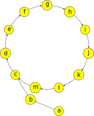

# 费马小定理 & 欧拉定理 - OI Wiki

- Source: https://oi-wiki.org/math/number-theory/fermat/

# 费马小定理 & 欧拉定理

本文讨论费马小定理、欧拉定理及其扩展．这些定理解决了任意模数下任意大指数的幂的计算问题．

## 费马小定理

**费马小定理** （Fermat's little theorem）是数论中最基础的定理之一．它也是 [Fermat 素性测试](../prime/#fermat-素性测试) 的理论基础．

费马小定理

设 𝑝p 是素数．对于任意整数 𝑎a 且 𝑝 ∤𝑎p∤a，都成立 𝑎𝑝−1 ≡1(mod𝑝)ap−1≡1(modp).

定理

设 𝑝p 是素数．对于任意整数 𝑎a，都成立 𝑎𝑝 ≡𝑎(mod𝑝)ap≡a(modp).

这两个同余关系在 𝑝 ∤𝑎p∤a 时是等价的；而在 𝑝 ∣𝑎p∣a 时，𝑎𝑝 ≡0 ≡𝑎(mod𝑝)ap≡0≡a(modp) 平凡地成立．因此，这两个命题是等价的．这两个命题常常都称作费马小定理．

证明一

设 𝑝p 是素数，且 𝑝 ∤𝑎p∤a．首先证明：对于 𝑖 =1,2,⋯,𝑝 −1i=1,2,⋯,p−1，余数 𝑖𝑎mod𝑝iamodp 各不相同．反证法．如果有 1 ≤𝑖 <𝑗 <𝑝1≤i<j<p 使得

𝑖𝑎mod𝑝=𝑗𝑎mod𝑝.⟺(𝑗−𝑖)𝑎≡0.(mod𝑝)iamodp=jamodp.⟺(j−i)a≡0.(modp)

但是，(𝑗 −𝑖)(j−i) 和 𝑎a 都不是 𝑝p 的倍数，这显然矛盾．

换句话说，这些余数是 {1,2,⋯,𝑝 −1}{1,2,⋯,p−1} 的一个排列．因此，有

𝑝−1∏𝑖=1𝑖=𝑝−1∏𝑖=1(𝑖𝑎mod𝑝)≡𝑝−1∏𝑖=1𝑖𝑎=𝑎𝑝−1𝑝−1∏𝑖=1𝑖.(mod𝑝)∏i=1p−1i=∏i=1p−1(iamodp)≡∏i=1p−1ia=ap−1∏i=1p−1i.(modp)

这说明

(𝑎𝑝−1−1)𝑝−1∏𝑖=1𝑖≡0.(mod𝑝)(ap−1−1)∏i=1p−1i≡0.(modp)

也就是说，等式左侧是 𝑝p 的倍数，但是 𝑖 =1,2,⋯,𝑝 −1i=1,2,⋯,p−1 都不是 𝑝p 的倍数，所以，只能有 𝑝 ∣(𝑎𝑝−1 −1)p∣(ap−1−1)，亦即费马小定理成立．

证明二

注意到费马小定理的第二种表述对于所有 𝑎 ∈𝐍a∈N 都成立，因此，可以考虑使用数学归纳法．负整数的情形容易转化为非负整数的情形．

归纳起点为 0𝑝 ≡0(mod𝑝)0p≡0(modp)，显然成立．假设它对于 𝑎 ∈𝐍a∈N 成立，需要证明的是，它对于 𝑎 +1a+1 也成立．由二项式定理可知

(𝑎+1)𝑝=𝑎𝑝+(𝑝1)𝑎𝑝−1+(𝑝2)𝑎𝑝−2+⋯+(𝑝𝑝−1)𝑎+1.(a+1)p=ap+(p1)ap−1+(p2)ap−2+⋯+(pp−1)a+1.

除了首尾两项，组合数的表达式 (𝑝𝑘) =𝑝!𝑘!(𝑝−𝑘)!(pk)=p!k!(p−k)! 中，𝑝p 都能整除分子，而不能整除分母，因此，这些系数对于 𝑘 ≠0,𝑝k≠0,p 都是 𝑝p 的倍数．因此，有

(𝑎+1)𝑝≡𝑎𝑝+1≡𝑎+1.(mod𝑝)(a+1)p≡ap+1≡a+1.(modp)

其中，第二步应用了归纳假设．因此，利用数学归纳法可知，费马小定理成立．

费马小定理的逆命题并不成立．即使对于所有与 𝑛n 互素的 𝑎a，都有 𝑎𝑛−1 ≡1(mod𝑛)an−1≡1(modn)，那么，𝑛n 也未必是素数．相关讨论详见 [Fermat 素性测试](../prime/#fermat-素性测试) 一节．

## 欧拉定理

**欧拉定理** （Euler's theorem）将费马小定理推广到了一般模数的情形，但仍然要求底数与指数互素．

欧拉定理

对于整数 𝑚 >0m>0 和整数 𝑎a，且 gcd(𝑎,𝑚) =1gcd(a,m)=1，有 𝑎𝜑(𝑚) ≡1(mod𝑚)aφ(m)≡1(modm)，其中，𝜑( ⋅)φ(⋅) 为 [欧拉函数](../euler-totient/)．

证明

与费马小定理的证明一类似，仍然是取一个与 𝑚m 互质的数列，再进行操作．考虑集合

𝑅={𝑟∈𝐍:0<𝑟<𝑚, gcd(𝑟,𝑚)=1}.R={r∈N:0<r<m, gcd(r,m)=1}.

这是模 𝑚m 的 [既约剩余系](../basic/#同余类与剩余系)．根据欧拉函数的定义可知，|𝑅| =𝜑(𝑚)|R|=φ(m)．类似上文，将它们乘以 𝑎a 相当于对该集合重新排列：

𝑅={𝑎𝑟mod𝑚:𝑟∈𝑅}.R={armodm:r∈R}.

这是因为，容易验证 gcd(𝑎𝑟,𝑚) =1gcd(ar,m)=1 且不同的 𝑟1,𝑟2 ∈𝑅r1,r2∈R 对应的 𝑎𝑟1mod𝑚ar1modm 和 𝑎𝑟2mod𝑚ar2modm 也一定不同．因此，有

∏𝑟∈𝑅𝑟≡∏𝑟∈𝑅𝑎𝑟=𝑎𝜑(𝑚)∏𝑟∈𝑅𝑟.(mod𝑚)∏r∈Rr≡∏r∈Rar=aφ(m)∏r∈Rr.(modm)

再次重复之前的论证，消去 ∏𝑟∈𝑅𝑟∏r∈Rr，就得到 𝑎𝜑(𝑚) ≡1(mod𝑚)aφ(m)≡1(modm)．

对于素数 𝑝p，有 𝜑(𝑝) =𝑝 −1φ(p)=p−1，因此，费马小定理是欧拉定理的一个特例．另外，欧拉定理中的指数 𝜑(𝑚)φ(m) 在一般情形下并非使得该式成立的最小指数．它可以改进到 𝜆(𝑚)λ(m)，其中，𝜆( ⋅)λ(⋅) 是 [Carmichael 函数](../primitive-root/#carmichael-函数)．关于相关结论的代数背景，可以参考 [整数同余类的乘法群](../../algebra/ring-theory/#应用整数同余类的乘法群) 一节．

## 扩展欧拉定理

扩展欧拉定理1进一步将结论推广到了底数与指数不互素的情形．由此，它彻底解决了任意模数下任意底数的幂次计算问题，将它们转化为指数小于 2𝜑(𝑚)2φ(m) 的情形，从而可以通过 [快速幂](../../binary-exponentiation/) 在 𝑂(log⁡𝜑(𝑚))O(log⁡φ(m)) 时间内计算．

扩展欧拉定理

对于任意正整数 𝑚m、整数 𝑎a 和非负整数 𝑘k，有

𝑎𝑘≡⎧{ {⎨{ {⎩𝑎𝑘mod𝜑(𝑚),gcd(𝑎,𝑚)=1,𝑎𝑘,gcd(𝑎,𝑚)≠1,𝑘<𝜑(𝑚),𝑎(𝑘mod𝜑(𝑚))+𝜑(𝑚),gcd(𝑎,𝑚)≠1,𝑘≥𝜑(𝑚).(mod𝑚)ak≡{akmodφ(m),gcd(a,m)=1,ak,gcd(a,m)≠1,k<φ(m),a(kmodφ(m))+φ(m),gcd(a,m)≠1,k≥φ(m).(modm)

第二种情形是在说，如果 𝑘 <𝜑(𝑚)k<φ(m)，那么，就无需继续降幂，直接应用快速幂即可；而第三种和第一种情形的最大区别是，通过取余降幂之后，是否需要加上一项 𝜑(𝑚)φ(m)．当然，将第一种情形合并进入第二、三种情形也是正确的．

### 直观理解

在严格证明定理之前，可以首先直观理解定理的含义．



考虑余数 𝑎𝑘mod𝑚akmodm 随着 𝑏b 增大而变化的情况．由于余数的取值一定在区间 [0,𝑚)[0,m) 内，而 𝑘k 有无限多个．将 𝑎𝑘mod𝑚 ↦𝑎𝑘+1mod𝑚akmodm↦ak+1modm 看作这些余数结点之间的有向边．那么，一定可以构成如图所示的循环．

扩展欧拉定理说明，这些循环可能是纯循环（第一种情形）或者混循环（第二、三种情形）．纯循环中，没有结点存在两个前驱，而混循环中就会出现这样的情形．因此，对于一般的情况，只需要能够求出循环节的长度和进入循环节之前的长度，就可以利用这个性质进行降幂．

### 严格证明

本节给出扩展欧拉定理的严格证明．

证明

首先说明，存在 𝑘0 ∈𝐍k0∈N，使得整数 𝑎a 和 𝑚′ :=𝑚gcd(𝑎𝑘0,𝑚)m′:=mgcd(ak0,m) 互素．为此，设 𝜈𝑝(𝑛)νp(n) 是整数 𝑛n 的质因数分解中素数 𝑝p 的幂次，那么，不妨取

𝑘0=max{⌈𝜈𝑝(𝑚)𝜈𝑝(𝑎)⌉:𝜈𝑝(𝑎)>0}.k0=max{⌈νp(m)νp(a)⌉:νp(a)>0}.

因为 𝑚m 中所有和 𝑎a 的公共素因子的幂次都已经包含在 𝑎𝑘0ak0 中，所以，𝑎a 就与 𝑚m 中剩下的因子 𝑚′ =𝑚gcd(𝑎𝑘0,𝑚)m′=mgcd(ak0,m) 互素．

进而，对 𝑘 ≥𝑘0k≥k0 考察同余关系

𝑏≡𝑎𝑘.(mod𝑚)b≡ak.(modm)

由于 gcd(𝑎𝑘0,𝑚) =gcd(𝑎𝑘,𝑚) ∣𝑏gcd(ak0,m)=gcd(ak,m)∣b，所以，将等式两侧（包括模数）同时除以 gcd(𝑎𝑘0,𝑚)gcd(ak0,m)，就有

𝑏gcd(𝑎𝑘0,𝑚)=𝑎𝑘0gcd(𝑎𝑘0,𝑚)⋅𝑎𝑘−𝑘0.(mod𝑚′)bgcd(ak0,m)=ak0gcd(ak0,m)⋅ak−k0.(modm′)

此时，因为 𝑎a 与模数 𝑚′m′ 互素，可以直接应用欧拉定理，得到

𝑏gcd(𝑎𝑘0,𝑚)≡𝑎𝑘0gcd(𝑎𝑘0,𝑚)⋅𝑎(𝑘−𝑘0)mod𝜑(𝑚′).(mod𝑚′)bgcd(ak0,m)≡ak0gcd(ak0,m)⋅a(k−k0)modφ(m′).(modm′)

因此，再将因子 gcd(𝑎𝑘0,𝑚)gcd(ak0,m) 乘回去，就得到

𝑏≡𝑎𝑘0⋅𝑎(𝑘−𝑘0)mod𝜑(𝑚′)=𝑎𝑘0+(𝑘−𝑘0)mod𝜑(𝑚′).(mod𝑚)b≡ak0⋅a(k−k0)modφ(m′)=ak0+(k−k0)modφ(m′).(modm)

这就得到了扩展欧拉定理的形式．式子说明，循环节的长度是 𝜑(𝑚′)φ(m′)，而进入循环节之前的长度为 𝑘0k0．

此处得到的参数比扩展欧拉定理中的更紧，但是相对来说，这些参数的计算并不容易．可以说明，这些参数可以放宽到扩展欧拉定理中的情形．首先，利用 [欧拉函数的表达式](../euler-totient/) 可知，因为 𝑚′ ∣𝑚m′∣m，所以 𝜑(𝑚′) ∣𝜑(𝑚)φ(m′)∣φ(m)．也就是说，𝜑(𝑚)φ(m) 也是它的循环节．其次，𝑘0k0 也可以放宽到 𝜑(𝑚)φ(m)．这是因为对于所有 𝑚 ∈𝐍+m∈N+ 和任意 𝑝 ∣𝑚p∣m，都有

𝜑(𝑚)≥𝜑(𝑝𝜈𝑝(𝑚))=(𝑝−1)𝑝𝜈𝑝(𝑚)−1≥𝑝𝜈𝑝(𝑚)−1=(1+(𝑝−1))𝜈𝑝(𝑚)−1≥1+(𝑝−1)(𝜈𝑝(𝑚)−1)≥1+(𝜈𝑝(𝑚)−1)=𝜈𝑝(𝑚).φ(m)≥φ(pνp(m))=(p−1)pνp(m)−1≥pνp(m)−1=(1+(p−1))νp(m)−1≥1+(p−1)(νp(m)−1)≥1+(νp(m)−1)=νp(m).

其中，第二行的不等式利用了二项式展开，并只保留常数项和一次项．因此，有

𝑘0≤max{𝜈𝑝(𝑚):𝑝∈𝐏}≤𝜑(𝑚).k0≤max{νp(m):p∈P}≤φ(m).

这就完全证明了所述结论．

## 例题

本节通过一道例题展示扩展欧拉定理的一个经典应用——计算任意模数下的幂塔．**幂塔** （power tower）指形如 𝐴 ↑(𝐵 ↑(𝐶 ↑(𝐷 ↑⋯)))A↑(B↑(C↑(D↑⋯))) 的式子，其中，↑↑ 是 Knuth 箭头记号，而 𝐴,𝐵,𝐶,𝐷,⋯A,B,C,D,⋯ 是一系列非负整数．

[Library Checker - Tetration Mod](https://judge.yosupo.jp/problem/tetration_mod)

𝑇T 组测试．每组测试中，给定 𝐴,𝐵,𝑀A,B,M，求 (𝐴 ↑↑𝐵)mod𝑀(A↑↑B)modM．其中，𝐴 ↑↑𝐵A↑↑B 表示由 𝐵B 个 𝐴A 组成的幂塔．或者，形式化地，定义

𝐴↑↑𝐵={1,𝐵=0,𝐴↑(𝐴↑↑(𝐵−1)),𝐵>0.A↑↑B={1,B=0,A↑(A↑↑(B−1)),B>0.

规定 00 =100=1．

解答

利用 𝐴 ↑↑𝐵A↑↑B 的定义，递归计算即可．要计算 (𝐴 ↑↑𝐵)mod𝑀(A↑↑B)modM，只需要应用扩展欧拉定理，计算 (𝐴 ↑↑(𝐵 −1))mod𝜑(𝑀)(A↑↑(B−1))modφ(M)．由于 𝜑(𝜑(𝑛)) ≤𝑛/2φ(φ(n))≤n/2 对所有 𝑛 ≥2n≥2 都成立，所以，递归过程一定在 𝑂(log⁡𝑀)O(log⁡M) 步内完成．由于需要应用扩展欧拉定理，所以需要区分当前的计算结果是否严格小于当前模数．为此，只需要在取余的时候多判断一步即可．另外，需要注意边界情况的处理．

参考代码

```text 1 2 3 4 5 6 7 8 9 10 11 12 13 14 15 16 17 18 19 20 21 22 23 24 25 26 27 28 29 30 31 32 33 34 35 36 37 38 39 40 41 42 43 44 45 ``` |  ```text #include <iostream> // Calculate Euler's totient for n. int phi ( int n ) { int res = n ; for ( int i = 2 ; i * i <= n ; ++ i ) { if ( n % i == 0 ) { res = res / i * ( i \- 1 ); while ( n % i == 0 ) n /= i ; } } if ( n > 1 ) res = res / n * ( n \- 1 ); return res ; } // Find remainder as in the exponent of extended Euler theorem. int mod ( long long v , int m ) { return v >= m ? v % m \+ m : v ; } // Modular power. int pow ( int a , int b , int m ) { long long res = 1 , po = a ; for (; b ; b >>= 1 ) { if ( b & 1 ) res = mod ( res * po , m ); po = mod ( po * po , m ); } return res ; } // Modular tetration. int tetra ( int a , int b , int m ) { if ( a == 0 ) return ! ( b & 1 ); if ( b == 0 || m == 1 ) return 1 ; if ( b == 1 ) return mod ( a , m ); return pow ( a , tetra ( a , b \- 1 , phi ( m )), m ); } int main () { int t ; std :: cin >> t ; for (; t ; \-- t ) { int a , b , m ; std :: cin >> a >> b >> m ; std :: cout << ( tetra ( a , b , m ) % m ) << std :: endl ; } } ```   
---|---  
  
## 习题

  * [Luogu P5091【模板】扩展欧拉定理](https://www.luogu.com.cn/problem/P5091)
  * [Codeforces 906 D. Power Tower](https://codeforces.com/problemset/problem/906/D)
  * [Luogu P3747 [六省联考 2017] 相逢是问候](https://www.luogu.com.cn/problem/P3747)
  * [Luogu P4139 上帝与集合的正确用法](https://www.luogu.com.cn/problem/P4139)
  * [Luogu P3934 [Ynoi Easy Round 2016] 炸脖龙 I](https://www.luogu.com.cn/problem/P3934)
  * [Luogu P6736「Wdsr-2」白泽教育](https://www.luogu.com.cn/problem/P6736)

## 参考资料与注释

  * [Fermat's little theorem - Wikipedia](https://en.wikipedia.org/wiki/Fermat%27s_little_theorem)
  * [Euler's theorem - Wikipedia](https://en.wikipedia.org/wiki/Euler%27s_theorem)
  * Hardy, Godfrey Harold, and Edward Maitland Wright. An introduction to the theory of numbers. Oxford university press, 1979.

* * *

  1. 这一名字主要出现在算法竞赛圈中，而并非该结论的通用名称． ↩

* * *

>  __本页面最近更新： 2026/1/7 08:56:54，[更新历史](https://github.com/OI-wiki/OI-wiki/commits/master/docs/math/number-theory/fermat.md)  
>  __发现错误？想一起完善？[在 GitHub 上编辑此页！](https://oi-wiki.org/edit-landing/?ref=/math/number-theory/fermat.md "edit.link.title")  
>  __本页面贡献者：[guodong2005](https://github.com/guodong2005), [Ir1d](https://github.com/Ir1d), [mgt](mailto:i@margatroid.xyz), [Tiphereth-A](https://github.com/Tiphereth-A), [sshwy](https://github.com/sshwy), [Enter-tainer](https://github.com/Enter-tainer), [MegaOwIer](https://github.com/MegaOwIer), [c-forrest](https://github.com/c-forrest), [Dev-XYS](https://github.com/Dev-XYS), [Great-designer](https://github.com/Great-designer), [PeterlitsZo](https://github.com/PeterlitsZo), [stevebraveman](https://github.com/stevebraveman), [tth37](https://github.com/tth37), [Xeonacid](https://github.com/Xeonacid), [Acfboy](https://github.com/Acfboy), [gi-b716](https://github.com/gi-b716), [H-J-Granger](https://github.com/H-J-Granger), [hjsjhn](https://github.com/hjsjhn), [hly1204](https://github.com/hly1204), [iamtwz](https://github.com/iamtwz), [ImpleLee](https://github.com/ImpleLee), [Menci](https://github.com/Menci), [qz-cqy](https://github.com/qz-cqy), [StudyingFather](https://github.com/StudyingFather), [WineChord](https://github.com/WineChord), [yuhuoji](https://github.com/yuhuoji)  
>  __本页面的全部内容在**[CC BY-SA 4.0](https://creativecommons.org/licenses/by-sa/4.0/deed.zh) 和 [SATA](https://github.com/zTrix/sata-license)** 协议之条款下提供，附加条款亦可能应用
