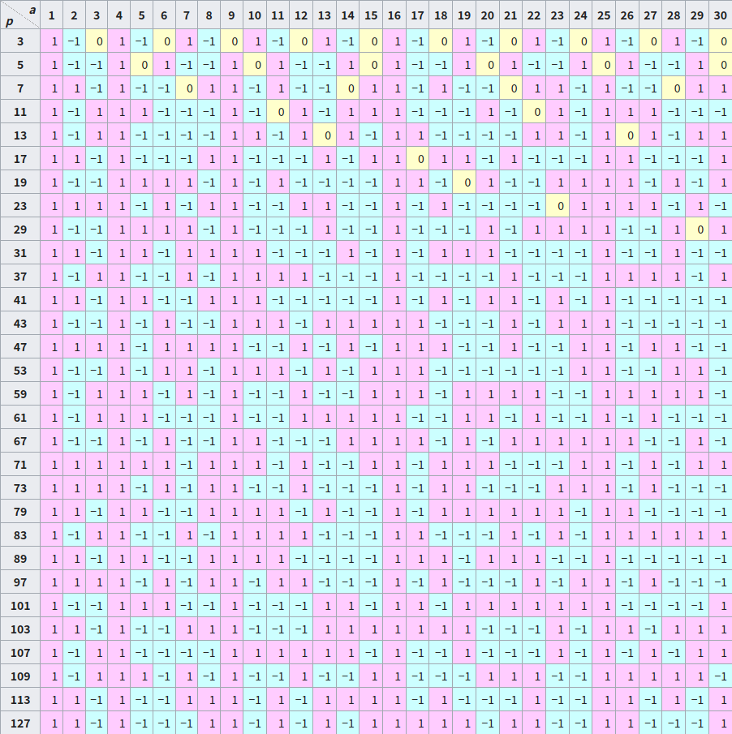

# 二次剩余 - OI Wiki

- Source: https://oi-wiki.org/math/number-theory/quad-residue/

# 二次剩余

## 引入

二次剩余可以认为是在讨论求模意义下 **开平方** 运算的可行性．对于更高次方的开方可参见 [k 次剩余](../residue/)．

## 定义

二次剩余

令整数 𝑎a，𝑝p 满足 (𝑎,𝑝) =1(a,p)=1，若存在整数 𝑥x 使得

𝑥2≡𝑎(mod𝑝),x2≡a(modp),

则称 𝑎a 为模 𝑝p 的二次剩余，否则称 𝑎a 为模 𝑝p 的二次非剩余．后文可能在模 𝑝p 显然的情况下简写成二次（非）剩余．

## Euler 判别法

当模数为奇素数时，我们有如下定理：

Euler 判别法

对奇素数 𝑝p 和满足 (𝑎,𝑝) =1(a,p)=1 的整数 𝑎a，有

𝑎𝑝−12≡{1(mod𝑝),(∃𝑥∈𝐙), 𝑎≡𝑥2(mod𝑝),−1(mod𝑝),otherwise.ap−12≡{1(modp),(∃x∈Z), a≡x2(modp),−1(modp),otherwise.

即对上述的 𝑝p 和 𝑎a，

  1. 𝑎a 是 𝑝p 的二次剩余当且仅当 𝑎𝑝−12 ≡1(mod𝑝)ap−12≡1(modp).
  2. 𝑎a 是 𝑝p 的二次非剩余当且仅当 𝑎𝑝−12 ≡ −1(mod𝑝)ap−12≡−1(modp).

证明

首先由 [Fermat 小定理](../fermat/#费马小定理) 有 𝑎𝑝−1 ≡1(mod𝑝)ap−1≡1(modp)，故

(𝑎𝑝−12+1)(𝑎𝑝−12−1)≡0(mod𝑝),(ap−12+1)(ap−12−1)≡0(modp),

从而对任意满足 (𝑎,𝑝) =1(a,p)=1 的 𝑎a 均有 𝑎(𝑝−1)/2 ≡ ±1(mod𝑝).a(p−1)/2≡±1(modp).

另外由 𝑝p 是奇素数，我们有：

𝑥𝑝−1−𝑎𝑝−12=(𝑥2)𝑝−12−𝑎𝑝−12=(𝑥2−𝑎)𝑃(𝑥),xp−1−ap−12=(x2)p−12−ap−12=(x2−a)P(x),

其中 𝑃(𝑥)P(x) 是某个整系数多项式，进而：

𝑥𝑝−𝑥=𝑥(𝑥𝑝−1−𝑎𝑝−12)+𝑥(𝑎𝑝−12−1)=(𝑥2−𝑎)𝑥𝑃(𝑥)+(𝑎𝑝−12−1)𝑥.xp−x=x(xp−1−ap−12)+x(ap−12−1)=(x2−a)xP(x)+(ap−12−1)x.

由 [同余方程的定理 5](../congruence-equation/#定理-5) 可知，𝑎a 是模 𝑝p 的二次剩余当且仅当 𝑎(𝑝−1)/2 ≡1(mod𝑝)a(p−1)/2≡1(modp). 进而 𝑎a 是模 𝑝p 的非二次剩余当且仅当 𝑎(𝑝−1)/2 ≡ −1(mod𝑝)a(p−1)/2≡−1(modp).

基于 Euler 判别法，我们可以得到如下推论：

二次剩余的数量

对于奇素数 𝑝p，模 𝑝p 意义下二次剩余和二次非剩余均有 𝑝−12p−12 个．

证明

根据 Euler 判别法，考虑 𝑎𝑝−12 ≡1(mod𝑝).ap−12≡1(modp).

注意到 𝑝−12 ∣(𝑝 −1)p−12∣(p−1)，由 [同余方程的定理 6](../congruence-equation/#定理-6) 可知 𝑎𝑝−12 ≡1(mod𝑝)ap−12≡1(modp) 有 𝑝−12p−12 个解．所以模 𝑝p 意义下二次剩余和二次非剩余均有 𝑝−12p−12 个．

## Legendre 符号

为了方便接下来的讨论，我们引入如下记号：

Legendre 符号

对 **奇素数** 𝑝p 和整数 𝑎a，定义 Legendre 符号如下：

(𝑎𝑝)=⎧{ {⎨{ {⎩0,𝑝∣𝑎,1,(𝑝∤𝑎)∧((∃𝑥∈𝐙), 𝑎≡𝑥2(mod𝑝)),−1,otherwise.(ap)={0,p∣a,1,(p∤a)∧((∃x∈Z), a≡x2(modp)),−1,otherwise.

即对于 (𝑎,𝑝) =1(a,p)=1 的 𝑎a，

  * 𝑎a 是模 𝑝p 的二次剩余当且仅当 (𝑎𝑝) =1.(ap)=1.
  * 𝑎a 是模 𝑝p 的二次非剩余当且仅当 (𝑎𝑝) = −1.(ap)=−1.

下表为部分 Legendre 符号的值（From [Wikipedia](https://en.wikipedia.org/wiki/Legendre_symbol#Table_of_values)）



### 性质

  1. 对任意整数 𝑎a，

𝑎𝑝−12≡(𝑎𝑝)(mod𝑝).ap−12≡(ap)(modp).

进一步，我们有推论：

     * (1𝑝)=1.(1p)=1.
     * (−1𝑝)=(−1)𝑝−12={1,𝑝≡1(mod4),−1,𝑝≡3(mod4).(−1p)=(−1)p−12={1,p≡1(mod4),−1,p≡3(mod4).
  2. 𝑎1 ≡𝑎2(mod𝑝) ⟹ (𝑎1𝑝) =(𝑎2𝑝).a1≡a2(modp)⟹(a1p)=(a2p).

  3. （[完全积性](../basic/#积性函数)）对任意整数 𝑎1,𝑎2a1,a2，

(𝑎1𝑎2𝑝)=(𝑎1𝑝)(𝑎2𝑝).(a1a2p)=(a1p)(a2p).

我们有推论：对整数 𝑎,𝑏a,b，𝑝 ∤𝑏p∤b 有

(𝑎𝑏2𝑝)=(𝑎𝑝).(ab2p)=(ap).
  4. (2𝑝)=(−1)𝑝2−18={1,𝑝≡±1(mod8),−1,𝑝≡±3(mod8).(2p)=(−1)p2−18={1,p≡±1(mod8),−1,p≡±3(mod8).

证明

  1. 由 Legendre 符号的定义 和 Euler 判别法 易得．
  2. 注意到

𝑎1≡𝑎2(mod𝑝)⟹(𝑎1𝑝)≡(𝑎2𝑝)(mod𝑝),a1≡a2(modp)⟹(a1p)≡(a2p)(modp),

而 ∣(𝑎1𝑝)−(𝑎2𝑝)∣ ≤2|(a1p)−(a2p)|≤2 且 𝑝 >2p>2，故：

𝑎1≡𝑎2(mod𝑝)⟹(𝑎1𝑝)=(𝑎2𝑝).a1≡a2(modp)⟹(a1p)=(a2p).
  3. 由 1 得

(𝑎1𝑎2𝑝)≡𝑎𝑝−121𝑎𝑝−122≡(𝑎1𝑝)(𝑎2𝑝)(mod𝑝).(a1a2p)≡a1p−12a2p−12≡(a1p)(a2p)(modp).

而 ∣(𝑎1𝑎2𝑝)−(𝑎1𝑝)(𝑎2𝑝)∣ ≤2|(a1a2p)−(a1p)(a2p)|≤2 且 𝑝 >2p>2，故

(𝑎1𝑎2𝑝)=(𝑎1𝑝)(𝑎2𝑝).(a1a2p)=(a1p)(a2p).
  4. 参见 二次互反律

基于如上性质，若对任意奇素数 𝑝p 和 𝑞q，(𝑝𝑞)(pq) 的值均可计算，则我们就可以对任意合法情况计算 Legendre 符号的值．接下来我们有一个优美的定理，这个定理巧妙地在 (𝑝𝑞)(pq) 和 (𝑞𝑝)(qp) 之间建立起了联系，使得我们能用类似 [辗转相除法](../gcd/#欧几里得算法) 的思路完成计算．

### 二次互反律

二次互反律

设 𝑝p，𝑞q 是两个不同的奇素数，则

(𝑝𝑞)(𝑞𝑝)=(−1)𝑝−12𝑞−12.(pq)(qp)=(−1)p−12q−12.

证明方式很多1．一种证明方式是基于如下引理2：

Gauss 引理

设 𝑝p 是奇素数，(𝑛,𝑝) =1(n,p)=1，对整数 𝑘 (1≤𝑘≤(𝑝−1)/2)k (1≤k≤(p−1)/2)，令 𝑟𝑘 =𝑛𝑘mod𝑝rk=nkmodp，设 𝐴 ={𝑟𝑘 :𝑟𝑘 <𝑝/2}A={rk:rk<p/2}，𝐵 ={𝑟𝑘 :𝑟𝑘 >𝑝/2}B={rk:rk>p/2}，则

(𝑛𝑝)=(−1)|𝐵|.(np)=(−1)|B|.证明

设 𝜆 =|𝐴|λ=|A|，𝜇 =|𝐵|μ=|B|，显然 𝜆 +𝜇 =(𝑝 −1)/2λ+μ=(p−1)/2，则

𝑛𝑝−12(𝑝−12)!=𝑝−12∏𝑘=1𝑛𝑘≡∏𝑎∈𝐴𝑎∏𝑏∈𝐵𝑏(mod𝑝).np−12(p−12)!=∏k=1p−12nk≡∏a∈Aa∏b∈Bb(modp).

我们知道对 𝐵B 中任意元素 𝑏b，有 𝑝2 <𝑏 <𝑝p2<b<p，所以 0 <𝑝 −𝑏 <𝑝20<p−b<p2，进一步，对 𝐵B 中任意元素 𝑏b，我们有 𝑝 −𝑏 ∉𝐴p−b∉A，否则若 𝐴,𝐵A,B 中分别存在元素 𝑎,𝑏a,b 使得 𝑎 =𝑝 −𝑏a=p−b，则存在整数 0 <𝑘1,𝑘2 <(𝑝 −1)/20<k1,k2<(p−1)/2 使得 𝑎 =𝑛𝑘1a=nk1，𝑏 =𝑛𝑘2b=nk2 且 𝑝 ∣𝑛(𝑘1 +𝑘2)p∣n(k1+k2)，由于 (𝑛,𝑝) =1(n,p)=1，则 𝑝 ∣(𝑘1 +𝑘2)p∣(k1+k2)，注意到 0 <𝑘1 +𝑘2 <𝑝0<k1+k2<p，所以产生矛盾．因此

𝑛𝑝−12(𝑝−12)!≡(−1)𝜇∏𝑎∈𝐴𝑎∏𝑏∈𝐵(𝑝−𝑏)=(−1)𝜇(𝑝−12)!(mod𝑝),np−12(p−12)!≡(−1)μ∏a∈Aa∏b∈B(p−b)=(−1)μ(p−12)!(modp),

即

𝑛𝑝−12≡(−1)𝜇(mod𝑝).np−12≡(−1)μ(modp).

从而由 Legendre 符号的 性质 1 即得证．

推广

Gauss 引理可做如下推广7：

设 𝑝p 是奇素数，令 𝐼 ⊂𝐙∗𝑝I⊂Zp∗ 满足 𝐼 ∪ −𝐼 =𝐙∗𝑝I∪−I=Zp∗ 且 𝐼 ∩ −𝐼 =∅I∩−I=∅，其中 −𝐼 :={ −𝑖 :𝑖 ∈𝐼}−I:={−i:i∈I}，则对任意与 𝑝p 互质的整数 𝑛n，

(𝑛𝑝)=(−1)|𝐽|,(np)=(−1)|J|,

其中 𝐽 ={𝑗 ∈𝐼 :𝑛𝑗 ∈ −𝐼}J={j∈I:nj∈−I}.

不难发现取 𝐼 ={1,2,…,(𝑝 −1)/2}I={1,2,…,(p−1)/2} 即可得到 Gauss 引理．证明方法和 Gauss 引理的证明基本相同，故省略．

容易得到如下推论：

推论

对奇素数 𝑝p，有

(2𝑝)=(−1)𝑝2−18={1,𝑝≡±1(mod8),−1,𝑝≡±3(mod8).(2p)=(−1)p2−18={1,p≡±1(mod8),−1,p≡±3(mod8).

对奇素数 𝑝p，奇数 𝑛n 满足 (𝑛,𝑝) =1(n,p)=1，有

(𝑛𝑝)=(−1)∑(𝑝−1)/2𝑖=1⌊𝑛𝑖/𝑝⌋.(np)=(−1)∑i=1(p−1)/2⌊ni/p⌋.证明

对 Gauss 引理中的 𝑛,𝑘,𝑟𝑘,𝐴,𝐵,𝜆,𝜇n,k,rk,A,B,λ,μ，有 𝑛𝑘 =𝑝⌊𝑛𝑘𝑝⌋ +𝑟𝑘nk=p⌊nkp⌋+rk，进而

𝑛⋅𝑝2−18=𝑝−12∑𝑘=1𝑛𝑘=𝑝𝑝−12∑𝑘=1⌊𝑛𝑘𝑝⌋+∑𝑎∈𝐴𝑎+∑𝑏∈𝐵𝑏=𝑝𝑝−12∑𝑘=1⌊𝑛𝑘𝑝⌋+∑𝑎∈𝐴𝑎+∑𝑏∈𝐵(𝑝−𝑏)+2∑𝑏∈𝐵𝑏−𝑝𝜇=𝑝𝑝−12∑𝑘=1⌊𝑛𝑘𝑝⌋+𝑝−12∑𝑘=1𝑘+2∑𝑏∈𝐵𝑏−𝑝𝜇=𝑝𝑝−12∑𝑘=1⌊𝑛𝑘𝑝⌋+𝑝2−18+2∑𝑏∈𝐵𝑏−𝑝𝜇,n⋅p2−18=∑k=1p−12nk=p∑k=1p−12⌊nkp⌋+∑a∈Aa+∑b∈Bb=p∑k=1p−12⌊nkp⌋+∑a∈Aa+∑b∈B(p−b)+2∑b∈Bb−pμ=p∑k=1p−12⌊nkp⌋+∑k=1p−12k+2∑b∈Bb−pμ=p∑k=1p−12⌊nkp⌋+p2−18+2∑b∈Bb−pμ,

因此

(𝑛−1)𝑝2−18=𝑝𝑝−12∑𝑘=1⌊𝑛𝑘𝑝⌋+2∑𝑏∈𝐵𝑏−𝑝𝜇.(n−1)p2−18=p∑k=1p−12⌊nkp⌋+2∑b∈Bb−pμ.

若 𝑛 =2n=2，则 0 <𝑛𝑘𝑝 ≤𝑝−1𝑝 <10<nkp≤p−1p<1，从而有

𝑝2−18≡𝜇(mod2).p2−18≡μ(mod2).

若 2 ∤𝑛2∤n，则有

𝑝−12∑𝑘=1⌊𝑛𝑘𝑝⌋≡𝜇(mod2).∑k=1p−12⌊nkp⌋≡μ(mod2).

根据如上推论，证明二次互反律只需验证

𝑝−12𝑞−12=𝑝−12∑𝑘=1⌊𝑞𝑘𝑝⌋+𝑞−12∑𝑘=1⌊𝑝𝑘𝑞⌋.p−12q−12=∑k=1p−12⌊qkp⌋+∑k=1q−12⌊pkq⌋.

考虑由点 (𝑝𝑥,𝑞𝑦)(px,qy)，1 ≤𝑥 ≤𝑞−12,1 ≤𝑦 ≤𝑝−121≤x≤q−12,1≤y≤p−12 构成的集合 𝑆S，将其根据 𝑝𝑥px 与 𝑞𝑦qy 的大小关系分成两部分（显然 𝑝𝑥 ≠𝑞𝑦px≠qy），分别验证三个集合的大小即可．

二次互反律不仅能用于判断数 𝑛n 是否是模 𝑝p 的二次剩余，还能用于确定使数 𝑛n 为二次剩余的模数的结构．

Example

  * 使得 55 为二次剩余的奇素数 𝑝p 满足 𝑝 ≡ ±1(mod5).p≡±1(mod5).
  * 使得 −3−3 为二次剩余的奇素数 𝑝p 满足 𝑝 ≡1(mod3).p≡1(mod3).
  * 使得 −2−2，33 同时为二次剩余的奇素数 𝑝p 满足 𝑝 ≡11(mod24).p≡11(mod24).

另外，我们还可以证明诸如「形如 4𝑘 +14k+1 的素数有无限多个」之类的结论，这一类结论实际上是 [Dirichlet 定理](https://en.wikipedia.org/wiki/Dirichlet%27s_theorem_on_arithmetic_progressions) 的简单推论．

## Jacobi 符号

根据二次互反律，我们可以很自然地想到一种推广 Legendre 符号的方法：

Jacobi 符号

对 **正奇数** 𝑚 =𝑝𝛼11…𝑝𝛼𝑘𝑘m=p1α1…pkαk 和整数 𝑎a，其中 𝑝1,…,𝑝𝑘p1,…,pk 是素数，𝛼1,…,𝛼𝑘α1,…,αk 是正整数，定义 Jacobi 符号如下：

(𝑎𝑚):=𝑘∏𝑖=1(𝑎𝑝𝑖)𝛼𝑖.(am):=∏i=1k(api)αi.

其中等式右端的 (𝑎𝑝𝑖)(api) 为 Legendre 符号．另外对整数 𝑎a 有 (𝑎1) =1.(a1)=1.

Warning

我们一般不区分 Legendre 符号和 Jacobi 符号，因为由完全积性可知 Jacobi 符号具有和 Legendre 符号一样的性质，所以这两种符号的计算方法是一致的．但是有一点需要注意：当 𝑚m **不是奇素数** 时，(𝑎𝑚)(am) 的值与 𝑎a 是否是模 𝑚m 的二次剩余 **无关** ，但是若 (𝑎𝑚) = −1(am)=−1，则说明 𝑚m 至少存在一个（实际上是奇数个）素因子 𝑝p 使得 𝑎a 是模 𝑝p 的二次非剩余，从而此时 𝑎a 是模 𝑚m 的二次非剩余．

我们还可以把模数进一步推广为 **整数** （只需补充 (𝑎−1)(a−1)、(𝑎0)(a0) 和 (𝑎2)(a2) 的定义），这样就得到了 [Kronecker 符号](https://en.wikipedia.org/wiki/Kronecker_symbol)．

## 模意义下开平方

本节讨论模意义下开平方的算法．特别地，本节主要介绍素数模的情形．对于一般模数的情形，可以参考 [模意义下开高次方](../residue/#模意义下开方) 的讨论．

### 特殊情况时的算法

对于同余方程 𝑥2 ≡𝑎(mod𝑝)x2≡a(modp)，其中 𝑝p 为奇素数且 𝑎a 为二次剩余在 𝑝mod4 =3pmod4=3 时有更简单的解法，考虑

(𝑎(𝑝+1)/4)2≡𝑎(𝑝+1)/2(mod𝑝)≡𝑥𝑝+1(mod𝑝)≡(𝑥2)(𝑥𝑝−1)(mod𝑝)≡𝑥2(mod𝑝)(∵Fermat's little theorem)(a(p+1)/4)2≡a(p+1)/2(modp)≡xp+1(modp)≡(x2)(xp−1)(modp)≡x2(modp)(∵Fermat's little theorem)

那么 𝑎(𝑝+1)/4mod𝑝a(p+1)/4modp 为一个解．

#### Atkin 算法

仍然考虑上述同余方程，此时 𝑝mod8 =5pmod8=5，那么令 𝑏 ≡(2𝑎)(𝑝−5)/8(mod𝑝)b≡(2a)(p−5)/8(modp) 和 i ≡2𝑎𝑏2(mod𝑝)i≡2ab2(modp) 那么此时 i2 ≡ −1(mod𝑝)i2≡−1(modp) 且 𝑎𝑏(i −1)mod𝑝ab(i−1)modp 为一个解．

证明 i2≡(2𝑎𝑏2)2(mod𝑝)≡(2𝑎⋅(2𝑎)(𝑝−5)/4)2(mod𝑝)≡((2𝑎)(𝑝−1)/4)2(mod𝑝)≡(2𝑎)𝑝−12(mod𝑝)≡−1(mod𝑝)i2≡(2ab2)2(modp)≡(2a⋅(2a)(p−5)/4)2(modp)≡((2a)(p−1)/4)2(modp)≡(2a)p−12(modp)≡−1(modp)

那么

(𝑎𝑏(i−1))2≡𝑎2⋅(2𝑎)(𝑝−5)/4⋅(−2i)(mod𝑝)≡𝑎⋅(−i)⋅(2𝑎)(𝑝−1)/4(mod𝑝)≡𝑎(mod𝑝)(ab(i−1))2≡a2⋅(2a)(p−5)/4⋅(−2i)(modp)≡a⋅(−i)⋅(2a)(p−1)/4(modp)≡a(modp)

### Cipolla 算法

Cipolla 算法用于求解同余方程 𝑦2 ≡𝑎(mod𝑝)y2≡a(modp)，其中 𝑝p 为奇素数且 𝑎a 为二次剩余．

本节考虑 𝐅𝑝[𝑥]/(𝑥2 −𝑔)Fp[x]/(x2−g) 中的运算，其中 𝑔 ∈𝐅𝑝g∈Fp．

计算方法

不熟悉 [多项式环](../../algebra/ring-theory/#多项式环) 的读者，可以简单理解为该集合的元素都具有形式 𝑎0 +𝑎1𝑥a0+a1x 且 𝑎0,𝑎1 ∈𝐅𝑝a0,a1∈Fp，且遵循如下运算法则：

(𝑎0+𝑎1𝑥)+(𝑏0+𝑏1𝑥)≡(𝑎0+𝑏0)+(𝑎1+𝑏1)𝑥(mod(𝑥2−𝑔))(𝑎0+𝑎1𝑥)(𝑏0+𝑏1𝑥)≡(𝑎0𝑏0+𝑎1𝑏1𝑔)+(𝑎1𝑏0+𝑎0𝑏1)𝑥(mod(𝑥2−𝑔))(a0+a1x)+(b0+b1x)≡(a0+b0)+(a1+b1)x(mod(x2−g))(a0+a1x)(b0+b1x)≡(a0b0+a1b1g)+(a1b0+a0b1)x(mod(x2−g))

需要注意的是，此处的 𝑥x 并不是一个具体的数，而是表示多项式中的形式记号．运算中一个关键的点在于利用 𝑥2 ≡𝑔(mod(𝑥2 −𝑔))x2≡g(mod(x2−g)) 将二次项转化为一次项和常数项．另外，所有整数运算都需要对 𝑝p 取模．

关于该结构的更多内容，请参见 [多项式](../../poly/intro/) 和 [域论](../../algebra/field-theory/) 等页面．

该算法的第一步为找到一个 𝑟r 使得 𝑟2 −𝑎r2−a 为二次非剩余．当然对于 𝑎 ≡0(mod𝑝)a≡0(modp) 不可能找到这样的 𝑟r，需要进行特判．下文只讨论 𝑎 ≢0(mod𝑝)a≢0(modp) 的情况．此时可随机一个 𝑟r 然后判断，期望可以 22 步找到．于是，(𝑟 −𝑥)𝑝+12mod(𝑥2 −(𝑟2 −𝑎))(r−x)p+12mod(x2−(r2−a)) 为一个解，可以通过快速幂求值．

为什么期望只需要两步

考虑 𝑟2 −𝑎r2−a 为二次剩余的情况，则存在一个 𝑥x 使得 𝑟2 −𝑎 ≡𝑥2(mod𝑝)r2−a≡x2(modp)，移项可得 (𝑟 +𝑥)(𝑟 −𝑥) ≡𝑎(mod𝑝)(r+x)(r−x)≡a(modp)，不难发现每一个 (𝑟 +𝑥) ∈[1,𝑝 −1](r+x)∈[1,p−1]，都一一对应于一组 (𝑟,𝑥)(r,x) 的解，所以使原方程成立的解一共有 𝑝 −1p−1 组．我们分类讨论 𝑥 ≡0x≡0 和 𝑥 ≢0x≢0 两种情况．对于 𝑥 ≡0x≡0，由于 𝑎a 是二次剩余，对应了 22 种 𝑟r 的取值；对于 𝑥 ≢0x≢0，有 𝑝 −1 −2p−1−2 种情况，每一个 𝑟r 对应其中两种，一共有 𝑝−32p−32 种 𝑟r 的取值．综上，一共有 2 +𝑝−32 =𝑝+122+p−32=p+12 种情况使得 𝑟2 −𝑎r2−a 为二次剩余，所以每随机一次得到二次非剩余的概率就是 𝑝−12𝑝p−12p，期望步数为 2𝑝𝑝−1 ≈22pp−1≈2．

证明

为了方便，首先令 𝑓(𝑥) =𝑥2 −(𝑟2 −𝑎) ∈𝐅𝑝[𝑥]f(x)=x2−(r2−a)∈Fp[x]．

需要证明的是，(𝑟 −𝑥)𝑝+12mod𝑓(𝑥)(r−x)p+12modf(x) 是原式的解，并且它属于 𝐅𝑝Fp．首先考虑证明前者，即证明 (𝑟 −𝑥)𝑝+1 ≡𝑎(mod𝑓(𝑥))(r−x)p+1≡a(modf(x))．为此，我们需要先证明两个引理：

**引理 1：** 𝑥𝑝 ≡ −𝑥(mod𝑓(𝑥))xp≡−x(modf(x))

证明：

𝑥𝑝=𝑥(𝑥2)𝑝−12≡𝑥(𝑟2−𝑎)𝑝−12(mod𝑓(𝑥))(∵𝑥2≡𝑟2−𝑎(mod𝑓(𝑥)))≡−𝑥(mod𝑓(𝑥))(∵𝑟2−𝑎 is quadratic non-residue)xp=x(x2)p−12≡x(r2−a)p−12(modf(x))(∵x2≡r2−a(modf(x)))≡−x(modf(x))(∵r2−a is quadratic non-residue)

**引理 2：**(𝑎 +𝑏)𝑝 ≡𝑎𝑝 +𝑏𝑝(mod𝑝)(a+b)p≡ap+bp(modp)

使用二项式定理容易发现，除了第一项和最后一项，分子上的 𝑝p 无法消掉，于是只剩下 𝑎𝑝 +𝑏𝑝ap+bp．

(𝑎+𝑏)𝑝=𝑝∑𝑖=0(𝑝𝑖)𝑎𝑖𝑏𝑝−𝑖=𝑝∑𝑖=0𝑝!𝑖!(𝑝−𝑖)!𝑎𝑖𝑏𝑝−𝑖≡𝑎𝑝+𝑏𝑝(mod𝑝)(a+b)p=∑i=0p(pi)aibp−i=∑i=0pp!i!(p−i)!aibp−i≡ap+bp(modp)

有了这两个引理，我们再来考虑证明原式：

(𝑟−𝑥)𝑝+1=(𝑟−𝑥)𝑝(𝑟−𝑥)≡(𝑟𝑝−𝑥𝑝)(𝑟−𝑥)(mod𝑓(𝑥))≡(𝑟+𝑥)(𝑟−𝑥)(mod𝑓(𝑥))=𝑟2−𝑥2≡𝑟2−(𝑟2−𝑎)(mod𝑓(𝑥))=𝑎(r−x)p+1=(r−x)p(r−x)≡(rp−xp)(r−x)(modf(x))≡(r+x)(r−x)(modf(x))=r2−x2≡r2−(r2−a)(modf(x))=a

下面通过反证法证明我们求出的解属于 𝐅𝑝Fp，即其 𝑥x 的系数为 00．

假设存在一个 (𝑎0 +𝑎1𝑥)2 ≡𝑎(mod𝑓(𝑥))(a0+a1x)2≡a(modf(x)) 满足 𝑎1 ≢0(mod𝑝)a1≢0(modp)，即 𝑎20 +2𝑎0𝑎1𝑥 +𝑎21𝑥2 ≡𝑎(mod𝑓(𝑥))a02+2a0a1x+a12x2≡a(modf(x))，移项并化简可得：

𝑎20+𝑎21(𝑟2−𝑎)−𝑎≡−2𝑎0𝑎1𝑥(mod𝑓(𝑥))a02+a12(r2−a)−a≡−2a0a1x(modf(x))

式子左边的 𝑥x 的系数为 00，所以右边 𝑥x 的系数也为 00，即 𝑎0𝑎1 ≡0(mod𝑝)a0a1≡0(modp)，由于我们令 𝑎1 ≢0(mod𝑝)a1≢0(modp)，所以一定有 𝑎0 ≡0(mod𝑝)a0≡0(modp)，于是 (𝑎1𝑥)2 ≡𝑎(mod𝑓(𝑥))(a1x)2≡a(modf(x)) 即 𝑟2 −𝑎 ≡𝑎𝑎−21(mod𝑝)r2−a≡aa1−2(modp)．

由于 𝑎a 和 𝑎−21a1−2 都是二次剩余，由 Legendre 符号的积性可知 𝑎𝑎−21aa1−2 也是二次剩余，这与 𝑟2 −𝑎r2−a 是二次非剩余矛盾．于是原式不存在一个解使得 𝑥x 的系数非 00，我们求出的解的 𝑥x 的系数也必定为 00．

模板题 [洛谷 P5491【模板】二次剩余](https://www.luogu.com.cn/problem/P5491)

```text 1 2 3 4 5 6 7 8 9 10 11 12 13 14 15 16 17 18 19 20 21 22 23 24 25 26 27 28 29 30 31 32 33 34 35 36 37 38 39 40 41 42 43 44 45 46 47 48 49 50 51 52 53 54 55 56 57 58 59 60 61 62 63 64 65 66 67 68 69 70 71 72 73 74 75 76 77 78 ``` |  ```text #include <iostream> #include <random> long long p , v ; // 分别是模数和 r^2 - a 的值 struct Poly { long long a , b ; Poly ( long long _a = 0 , long long _b = 0 ) : a ( _a ), b ( _b ) {} }; Poly operator * ( const Poly & x , const Poly & y ) { // 重载乘法，可以参考上面有关运算性质的说明 return Poly (( x . a * y . a \+ v * ( x . b * y . b % p )) % p , ( x . a * y . b \+ x . b * y . a ) % p ); } // 多项式的快速幂，用于计算答案 Poly modpow ( Poly a , long long b ) { Poly res ( 1 , 0 ); while ( b ) { if ( b & 1 ) res = res * a ; a = a * a ; b >>= 1 ; } return res ; } // 普通的快速幂，用于判断二次非剩余 long long modpow ( long long a , long long b ) { long long res = 1 ; while ( b ) { if ( b & 1 ) res = res * a % p ; a = a * a % p ; b >>= 1 ; } return res ; } // 用于生成随机数 std :: mt19937 rng ( std :: random_device {}()); long long cipolla ( long long a , long long _p ) { p = _p ; if ( a == 0 ) return 0 ; // 特判一下 0 的情况 else if ( modpow ( a , ( p \- 1 ) / 2 ) == p \- 1 ) return -1 ; // 判断二次非剩余，此时无解 else { // 随机 r，使得 r^2 - a 是一个二次非剩余 long long r ; for ( r = rng () % p ;; r = rng () % p ) { if ( modpow (( r * r \- a \+ p ) % p , ( p \- 1 ) / 2 ) == p \- 1 ) break ; } v = ( r * r \- a \+ p ) % p ; return modpow ( Poly ( r , 1 ), ( p \+ 1 ) / 2 ). a ; // 根据结论式计算结果 } } int main () { int t , a , p ; std :: cin >> t ; while ( t \-- ) { std :: cin >> a >> p ; int ans = cipolla ( a , p ); if ( ans == -1 ) std :: cout << "Hola!" << std :: endl ; else if ( ans == 0 ) std :: cout << 0 << std :: endl ; else { // 相反数是另一个解 int ans2 = ( p \- ans ) % p ; if ( ans2 < ans ) std :: swap ( ans , ans2 ); std :: cout << ans << " " << ans2 << std :: endl ; } } return 0 ; } ```   
---|---  
  
### Bostan–Mori 算法

该算法基于 Cipolla 算法，我们将问题转换为 [常系数齐次线性递推](../../poly/linear-recurrence/) 再应用 Bostan–Mori 算法．考虑另一种常见的 Cipolla 算法的描述：𝑏 =𝑥(𝑝+1)/2mod(𝑥2−𝑡𝑥+𝑎)b=x(p+1)/2mod(x2−tx+a) 为满足 𝑏2 ≡𝑎(mod𝑝)b2≡a(modp) 的一个解3，其中 𝑥2 −𝑡𝑥 +𝑎 ∈𝐅𝑝[𝑥]x2−tx+a∈Fp[x] 为不可约多项式．系数 𝑡t 的选取同样使用随机方法．证明过程略．参考 Bostan 和 Mori 论文4中的算法我们可以发现问题可转化为求解形式幂级数的乘法逆元的某一项系数：

𝑏=[𝑥(𝑝+1)/2]11−𝑡𝑥+𝑎𝑥2b=[x(p+1)/2]11−tx+ax2

且

[𝑥𝑛]𝑘0+𝑘1𝑥1+𝑘2𝑥+𝑘3𝑥2=⎧{ { {⎨{ { {⎩[𝑥(𝑛−1)/2]𝑘1−𝑘0𝑘2+𝑘1𝑘3𝑥1+(2𝑘3−𝑘22)𝑥+𝑘23𝑥2,if 𝑛mod2=1[𝑥𝑛/2]𝑘0+(𝑘0𝑘3−𝑘1𝑘2)𝑥1+(2𝑘3−𝑘22)𝑥+𝑘23𝑥2,else if 𝑛≠0[xn]k0+k1x1+k2x+k3x2={[x(n−1)/2]k1−k0k2+k1k3x1+(2k3−k22)x+k32x2,if nmod2=1[xn/2]k0+(k0k3−k1k2)x1+(2k3−k22)x+k32x2,else if n≠0

而 𝑛 =0n=0 时显然有 [𝑥0]𝑘0+𝑘1𝑥1+𝑘2𝑥+𝑘3𝑥2 =𝑘0[x0]k0+k1x1+k2x+k3x2=k0，该算法乘法次数相较于 Cipolla 算法更少．其他相关乘法次数较少的算法可见 Müller 的文章5．

### Legendre 算法

对于同余方程 𝑥2 ≡𝑎(mod𝑝)x2≡a(modp)，其中 𝑝p 为奇素数且 𝑎a 为二次剩余．Legendre 算法可描述为找到 𝑟r 满足 𝑟2 −𝑎r2−a 为二次非剩余，令 𝑎0 +𝑎1𝑥 =(𝑟 −𝑥)𝑝−12mod(𝑥2 −𝑎)a0+a1x=(r−x)p−12mod(x2−a)，那么 𝑎0 ≡0(mod𝑝)a0≡0(modp) 且 𝑎−21 ≡𝑎(mod𝑝)a1−2≡a(modp).

证明

考虑选择一个 𝑏b 满足 𝑏2 ≡𝑎(mod𝑝)b2≡a(modp)，那么 (𝑟 −𝑏)(𝑟 +𝑏) =𝑟2 −𝑎(r−b)(r+b)=r2−a 为二次非剩余，所以

(𝑟−𝑏)𝑝−12(𝑟+𝑏)𝑝−12≡−1(mod𝑝)(r−b)p−12(r+b)p−12≡−1(modp)

存在环态射

𝜙:𝐅𝑝[𝑥]/(𝑥2−𝑎)→𝐅𝑝×𝐅𝑝𝑥↦(𝑏,−𝑏)ϕ:Fp[x]/(x2−a)→Fp×Fpx↦(b,−b)

那么

(𝑎0+𝑎1𝑏,𝑎0−𝑎1𝑏)=𝜙(𝑎0+𝑎1𝑥)=𝜙(𝑟−𝑥)𝑝−12=((𝑟−𝑏)𝑝−12,(𝑟+𝑏)𝑝−12)=(±1,∓1)(a0+a1b,a0−a1b)=ϕ(a0+a1x)=ϕ(r−x)p−12=((r−b)p−12,(r+b)p−12)=(±1,∓1)

所以 2𝑎0 =( ±1) +( ∓1) =02a0=(±1)+(∓1)=0 而 2𝑎1𝑏 =( ±1) −( ∓1) = ±22a1b=(±1)−(∓1)=±2.

### Tonelli–Shanks 算法

Tonelli–Shanks 算法是基于离散对数求解同余方程 𝑥2 ≡𝑎(mod𝑝)x2≡a(modp) 的算法6，其中 𝑝p 为奇素数且 𝑎a 为模 𝑝p 的二次剩余．

令 𝑝 −1 =𝑚2𝑛p−1=m2n，其中 𝑚m 为奇数．仍然使用随机方法寻找 𝑟 ∈𝐅𝑝r∈Fp 满足 𝑟r 为二次非剩余．令 𝑔 ≡𝑟𝑚(mod𝑝)g≡rm(modp) 且 𝑏 ≡𝑎(𝑚−1)/2(mod𝑝)b≡a(m−1)/2(modp)，那么存在整数 𝑒 ∈{0,1,2,…,2𝑛 −1}e∈{0,1,2,…,2n−1} 满足 𝑎𝑏2 ≡𝑔𝑒(mod𝑝)ab2≡ge(modp)．若 𝑎a 为二次剩余，那么 𝑒e 为偶数且 (𝑎𝑏𝑔−𝑒/2)2 ≡𝑎(mod𝑝)(abg−e/2)2≡a(modp).

证明

根据费马小定理可知

𝑔2𝑛≡𝑟𝑚2𝑛=𝑟𝑝−1≡1(mod𝑝).g2n≡rm2n=rp−1≡1(modp).

又由于 𝑟r 是二次非剩余，有

𝑔2𝑛−1≡𝑟𝑚2𝑛−1=𝑟𝑝−12≡−1(mod𝑝).g2n−1≡rm2n−1=rp−12≡−1(modp).

所以，𝑔g 模 𝑝p 的阶是 2𝑛2n．又因为 𝑎𝑏2 ≡𝑎𝑚(mod𝑝)ab2≡am(modp) 是 𝑥2𝑛 ≡1(mod𝑝)x2n≡1(modp) 的解，所以 𝑎𝑚am 是 𝑔g 的幂次．记 𝑎𝑚 ≡𝑔𝑒(mod𝑝)am≡ge(modp)．

因为 𝑎a 是二次剩余，所以

𝑔𝑒2𝑛−1≡𝑎𝑚2𝑛−1=𝑎𝑝−12≡1(mod𝑝).ge2n−1≡am2n−1=ap−12≡1(modp).

由阶的性质可知，2𝑛 ∣𝑒2𝑛−12n∣e2n−1，所以，𝑒e 是偶数．因此，𝑎𝑏𝑔−𝑒/2mod𝑝abg−e/2modp 是良定义的，且

(𝑎𝑏𝑔−𝑒/2)2=𝑎2𝑏2𝑔−𝑒≡𝑎𝑚+1𝑔−𝑒≡𝑎(mod𝑝).(abg−e/2)2=a2b2g−e≡am+1g−e≡a(modp).

剩下的问题是如何计算 𝑒e．Tonelli 和 Shanks 提出一次确定 𝑒e 的一个二进制位．令 𝑒e 在二进制下表示为 𝑒 =𝑒0 +2𝑒1 +4𝑒2 +⋯e=e0+2e1+4e2+⋯，其中 𝑒𝑘 ∈{0,1}ek∈{0,1}．因为 𝑎a 是二次剩余，所以开始时 𝑒0 =0e0=0，然后利用如下性质逐位确定 𝑒𝑘ek 的取值：

(𝑔𝑒𝑔−(𝑒mod2𝑘))2𝑛−1−𝑘≡𝑔2𝑛−1⋅𝑒𝑘≡{1(mod𝑝),if 𝑒𝑘=0−1(mod𝑝),if 𝑒𝑘=1(geg−(emod2k))2n−1−k≡g2n−1⋅ek≡{1(modp),if ek=0−1(modp),if ek=1

其中，𝑔𝑒 ≡𝑎𝑏2(mod𝑝)ge≡ab2(modp) 已知，而 𝑒mod2𝑘emod2k 的取值可以由之前的数位 𝑒0,𝑒1,⋯,𝑒𝑘−1e0,e1,⋯,ek−1 计算得到．当然，实现算法时，只需要直接维护乘积 𝑔𝑒𝑔−(𝑒mod2𝑘)mod𝑝geg−(emod2k)modp 即可．

## 习题

  * [洛谷 P5491【模板】二次剩余](https://www.luogu.com.cn/problem/P5491)
  * [「Timus 1132」Square Root](https://acm.timus.ru/problem.aspx?space=1&num=1132)

## 参考资料与注释

  1. [Quadratic residue - Wikipedia](https://en.wikipedia.org/wiki/Quadratic_residue)
  2. [Euler's criterion - Wikipedia](https://en.wikipedia.org/wiki/Euler%27s_criterion)

* * *

  1. [Proofs of quadratic reciprocity - Wikipedia](https://en.wikipedia.org/wiki/Proofs_of_quadratic_reciprocity) ↩

  2. Carl Friedrich Gauss. Untersuchungen über höhere Arithmetik, 1965. Page 458-462. ↩

  3. A. Menezes, P. van Oorschot and S. Vanstone. Handbook of Applied Cryptography, 1996. ↩

  4. Alin Bostan, Ryuhei Mori. A Simple and Fast Algorithm for Computing the N-th Term of a Linearly Recurrent Sequence. Available at <https://arxiv.org/abs/2008.08822>. ↩

  5. S. Müller, On the computation of square roots in finite fields, Design, Codes and Cryptography, Vol.31, pp. 301-312, 2004. ↩

  6. Daniel. J. Bernstein. Faster Square Roots in Annoying Finite Fields. ↩

  7. Kobi Kremnizer.[Lectures in number theory 2022](https://courses.maths.ox.ac.uk/pluginfile.php/29788/mod_resource/content/1/numbertheory-2022.pdf). Proposition 4.3. ↩

* * *

>  __本页面最近更新： 2026/1/7 08:56:54，[更新历史](https://github.com/OI-wiki/OI-wiki/commits/master/docs/math/number-theory/quad-residue.md)  
>  __发现错误？想一起完善？[在 GitHub 上编辑此页！](https://oi-wiki.org/edit-landing/?ref=/math/number-theory/quad-residue.md "edit.link.title")  
>  __本页面贡献者：[Tiphereth-A](https://github.com/Tiphereth-A), [c-forrest](https://github.com/c-forrest), [ShaoChenHeng](https://github.com/ShaoChenHeng), [hly1204](https://github.com/hly1204), [StudyingFather](https://github.com/StudyingFather), [Great-designer](https://github.com/Great-designer), [TachikakaMin](https://github.com/TachikakaMin), [Xeonacid](https://github.com/Xeonacid), [Enter-tainer](https://github.com/Enter-tainer), [sshwy](https://github.com/sshwy), [Chrogeek](https://github.com/Chrogeek), [iamtwz](https://github.com/iamtwz), [marscheng1](https://github.com/marscheng1), [monkeysui](https://github.com/monkeysui), [nanmenyangde](https://github.com/nanmenyangde), [xyf007](https://github.com/xyf007), [rgw2010](https://github.com/rgw2010)  
>  __本页面的全部内容在**[CC BY-SA 4.0](https://creativecommons.org/licenses/by-sa/4.0/deed.zh) 和 [SATA](https://github.com/zTrix/sata-license)** 协议之条款下提供，附加条款亦可能应用
