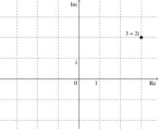
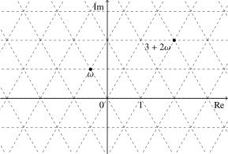

# 二次域 - OI Wiki

- Source: https://oi-wiki.org/math/number-theory/quadratic/

# 二次域

本文简要介绍二次域的相关概念．与之相关的两个重要例子是 Gauss 整数和 Eisenstein 整数，它们可以用于解决一些数论问题．

## 基本概念

本节首先介绍一系列基本概念．二次域和二次整数环都是更一般的代数扩域和代数整数环的概念的特例，因此本节的几乎所有定义和结论都可以恰当地推广到一般的情形．本节的讨论将限于二次域这一特殊情形，而不引入过多的代数数论内容．

### 二次域

二次域的元素都是二次代数数．

**二次代数数** （quadratic algebraic number）是可以表示为整系数一元二次方程的解的复数．由一元二次方程的求根公式可知，所有二次代数数均可以表示成

𝑎+𝑏√𝑑a+bd

的形式，其中，𝑎a 与 𝑏b 为有理数，𝑑d 为整数且无平方因子．任意这种形式的数也都是二次代数数．二次代数数可以分为有理数和 **二次无理数** （quadratic irrational number）．显然，二次无理数表示成上述形式的方法是唯一的．

对于任意无平方因子的整数 𝑑 ≠0,1d≠0,1，都可以验证集合 𝑄(√𝑑) ={𝑎 +𝑏√𝑑 :𝑎,𝑏 ∈𝐐}Q(d)={a+bd:a,b∈Q} 对于加、减、乘、除是封闭的．由于对于四则运算封闭的集合称为 [域](../../algebra/basic/#域)，集合 𝑄(√𝑑)Q(d) 就称为 **二次域** （quadratic field）．每一个二次域都包含全体有理数，因此它们都是有理数域 𝐐Q 的 [二次扩域](../../algebra/field-theory/#域的扩张)．当 𝑑 >0d>0 时，二次域 𝐐(√𝑑)Q(d) 中所有数都是实数，此时的 𝐐(√𝑑)Q(d) 称为实二次域；当 𝑑 <0d<0 时，二次域中除了有理数都是复数，此时的 𝐐(√𝑑)Q(d) 称为虚二次域．

### 共轭与范数

二次无理数 𝑎 +𝑏√𝑑a+bd 的 **共轭** （conjugate）定义为 𝑎 −𝑏√𝑑a−bd．共轭的二次无理数是同一个整系数二次方程的两个相异的根．在实二次域中，二次无理数的共轭与它作为复数的共轭并不一致；在虚二次域中，二次无理数的共轭就是它作为复数的共轭．最后，有理数的共轭规定为它自身．这样就对于全体二次代数数定义了共轭的概念．

任意二次域中，由加减乘除四则运算产生的等式，无法区分共轭关系．也就是说，在等式中将每一个数换成它的共轭，即将每一个二次根号的符号改变，等式仍然成立．

利用共轭，可以构造若干个从二次代数数到有理数的映射，它们可以将对二次代数数进行的讨论转化为对有理数的讨论．较为简单的是二次代数数 𝛼α 的 **迹** （trace），即一个数与它的共轭的和，记作 tr⁡(𝛼)tr⁡(α)．因为这其实就是它的有理数部分的 22 倍，所以并没有提供太多信息．

更为有用的是二次代数数的范数．二次代数数与它的共轭的积称为它的 **范数** （norm）：

𝑁(𝑎+𝑏√𝑑)=𝑎2−𝑑𝑏2N(a+bd)=a2−db2

显然，在虚二次域中，范数的概念，与复数的模的平方的概念一致；但是，在实二次域中这两个概念并不一致．

范数具有良好的性质．首先，因为 𝑑d 不含平方因子，不可能是平方数，所以只有 00 的范数是 00．其次，范数保持乘法和除法：

𝑁(𝑎1+𝑏1√𝑑)𝑁(𝑎2+𝑏2√𝑑)=𝑁((𝑎1+𝑏1√𝑑)(𝑎2+𝑏2√𝑑)),N(a1+b1d)N(a2+b2d)=N((a1+b1d)(a2+b2d)),𝑁(𝑎1+𝑏1√𝑑)𝑁(𝑎2+𝑏2√𝑑)=𝑁(𝑎1+𝑏1√𝑑𝑎2+𝑏2√𝑑).N(a1+b1d)N(a2+b2d)=N(a1+b1da2+b2d).

另外，二次代数数的倒数就是它的共轭与它的范数之比：

1𝑎+𝑏√𝑑=𝑎−𝑏√𝑑𝑁(𝑎+𝑏√𝑑).1a+bd=a−bdN(a+bd).

利用 Vieta 定理可知，二次代数数 𝛼α 实际上是方程

𝑥2−tr⁡(𝛼)𝑥+𝑁(𝛼)=0x2−tr⁡(α)x+N(α)=0

的根．该方程的判别式也称为该二次代数数的 **判别式** （discriminant），记作 disc⁡(𝛼)disc⁡(α)，取值为 4𝑑𝑏24db2．

矩阵表示

类似于复数，二次代数数也可以用矩阵表示．令 𝑑 ≠0,1d≠0,1 为无平方因子的整数且 𝑎,𝑏a,b 为有理数，则 𝑎 +𝑏√𝑑a+bd 可以表示为矩阵

(𝑎𝑏𝑑𝑏𝑎).(abdba).

可以验证，该矩阵的加、减、乘、除四则运算的结果就对应于二次代数数的运算结果．该矩阵的迹和行列式分别对应了二次代数数的迹和范数，该矩阵的特征多项式的判别式就是二次代数数的判别式．矩阵的伴随矩阵对应着二次代数数的共轭．

### 二次整数环

二次代数数中较为特殊的是二次整数．**二次整数** （quadratic integer）指可以表示为二次项系数为一的整系数一元二次方程的解的复数．与二次代数数的唯一不同就是对于二次项系数的限制．根据求根公式，二次方程 𝑥2 +𝑝𝑥 +𝑞 =0x2+px+q=0 的两个根是

−𝑝±√𝑝2−4𝑞2.−p±p2−4q2.

如果 𝑝p 是偶数，即 𝑝 =2𝑘p=2k，那么两个根可以写作 −𝑘 ±√𝑘2−𝑞−k±k2−q；如果 𝑝p 是奇数，即 𝑝 =2𝑘 +1p=2k+1，那么两个根可以写作 −𝑘 −1±√4(𝑘2+𝑘−𝑞)+12−k−1±4(k2+k−q)+12．从这两种情形中可以归纳出 𝐐(√𝑑)Q(d) 中的二次整数必然可以写作

𝑎+𝑏𝜔a+bω

的形式，其中，𝑎a 和 𝑏b 是整数，而

𝜔=⎧{ {⎨{ {⎩1+√𝑑2,𝑑≡1(mod4),√𝑑,𝑑≡2,3(mod4).ω={1+d2,d≡1(mod4),d,d≡2,3(mod4).

反过来，任何这种形式的复数都是二次整数．每个非有理数的二次整数写成该形式的方法都是唯一的．

二次域 𝐐(√𝑑)Q(d) 中的全体二次整数构成的集合记作 𝐙[𝜔]Z[ω]．因为这个集合对于加、减、乘都是封闭的，所以它也称为 **二次整数环** （quadratic integer ring)．二次整数环中的有理数恰为全体整数．如果考察 𝐙[𝜔]Z[ω] 中的二次整数的全体比值构成的集合，就得到相应的二次域 𝐐(√𝑑)Q(d)．

二次整数的迹、范数和判别式都是整数．二次整数环 𝐙[𝜔]Z[ω] 中全体二次无理数的判别式的最小值也称为相应的二次域 𝐐(√𝑑)Q(d) 的判别式．当 𝑑 ≡1(mod4)d≡1(mod4) 时，判别式是 𝑑d；当 𝑑 ≡2,3(mod4)d≡2,3(mod4) 时，判别式是 4𝑑4d．

### 整除、相伴与单位数

类似于整数，对于二次整数同样可以建立整除理论．当然，讨论必须在同一个二次整数环内进行．

对于二次整数环 𝐙[𝜔]Z[ω] 中的二次整数 𝛼α 和 𝛽β，如果存在同一个环中的二次整数 𝛾γ 使得 𝛽 =𝛼𝛾β=αγ 成立，就称 𝛼α 整除 𝛽β，记作 𝛼 ∣𝛽α∣β．整除关系是二次整数环上的 [偏序](../../order-theory/#二元关系) 关系．如果同时有 𝛼 ∣𝛽α∣β 和 𝛽 ∣𝛼β∣α，那么 𝛼α 和 𝛽β 在研究整除理论时就可以视作同一个数，它们称为 **相伴** （associate）．相伴关系是二次整数环上的等价关系．

类比到整数的整除理论上，相伴关系就是互为相反数．整除理论通常只需要考虑自然数就好了，而不必考察负数的情形．对于二次整数而言，相伴关系可能更为复杂一些．如果二次整数 𝛼α 和 𝛽β 相伴，则存在二次整数 𝛾γ 和 𝛿δ 使得 𝛽 =𝛼𝛾β=αγ 和 𝛼 =𝛽𝛿α=βδ 成立．因此，𝛽β 和 𝛼α 的比值 𝛾γ 必然是特殊的二次整数，即存在二次整数 𝛿δ 使得 𝛾𝛿 =1γδ=1．这样的二次整数 𝛾γ 称为 **单位数** （unit），也称为可逆元．两个二次整数相伴，当且仅当它们的比值是单位数．因此，要理解二次整数环上的相伴关系，就要理解它的单位数的结构．

因为范数可以保持乘法运算，且二次整数的范数总是整数，所以利用范数可以将二次整数的整除关系转化为整数的整除关系．也就是说，如果 𝛼 ∣𝛽α∣β，那么必然有 𝑁(𝛼) ∣𝑁(𝛽)N(α)∣N(β)．同样地，二次整数 𝛼α 是单位数，当且仅当它的范数 𝑁(𝛼) = ±1N(α)=±1．因此，要获得二次整数环 𝐙[𝜔]Z[ω] 中的全体单位数，只需要求解不定方程：

𝑁(𝑎+𝑏√𝑑)=1,N(a+bd)=1,

其中，范数的表达式为

𝑁(𝑎+𝑏√𝑑)=⎧{ {⎨{ {⎩𝑎2+𝑎𝑏+1−𝑑4𝑏2,𝑑≡1(mod4),𝑎2−𝑑𝑏2,𝑑≡2,3(mod4).N(a+bd)={a2+ab+1−d4b2,d≡1(mod4),a2−db2,d≡2,3(mod4).

对于虚二次整数环，即 𝑑 <0d<0 时，因为范数必然是非负整数，容易验证对于所有的无平方因子的负数 𝑑 ≠ −1, −3d≠−1,−3，解都只有 (𝑎,𝑏) =( ±1,0)(a,b)=(±1,0)，即除了 𝐙[√−1]Z[−1] 和 𝐙[1+√−32]Z[1+−32]，虚二次整数环的单位数都只有 ±1±1．记 i =√−1i=−1，则二次整数环 𝐙[i]Z[i] 又称作 Gauss 整数环，它的单位数的集合为 { ±1, ±i}{±1,±i}．记 𝜔 =1+√−32ω=1+−32，则二次整数环 𝐙[𝜔]Z[ω] 又称为 Eisenstein 整数环，它的单位数的集合为 { ±1, ±𝜔, ±𝜔2}{±1,±ω,±ω2}．

对于实二次整数环，即 𝑑 >0d>0 时，情形较为复杂，可以转化为对相应的 [Pell 方程](../pell-equation/) 的讨论．由 Pell 方程的相关结论可知，此时的全体单位数的集合可以写作 { ±𝑢𝑘 :𝑘 ∈𝐙}{±uk:k∈Z}，其中的 𝑢u 称为 **基本单位数** （fundamental unit）．基本单位数可以通过相应的 Pell 方程进行求解．基本单位数并不是唯一的：如果 𝑢u 是基本单位数，那么它的共轭 ¯𝑢u¯ 以及 −𝑢−u 和 −¯𝑢−u¯ 都是基本单位数．

二次整数环的单位数的结构可以推广到一般的 [代数整数环](../../algebra/field-theory/#代数扩张)．代数数论中的 [Dirichlet 单位定理](https://en.wikipedia.org/wiki/Dirichlet%27s_unit_theorem) 指出，所有代数整数环的全体单位数都构成 [有限生成 Abel 群](../../algebra/group-theory/#有限生成-abel-群)，同时这一定理也给出了这个群的阶．

整数的整除理论中的最大公因数、带余除法、Bezout 定理、唯一分解定理等内容都可以推广到部分或全部的二次整数环上．在某个二次整数环上能否进行这样的推广，其实反映了该二次整数环性质是否足够接近于整数环．并非所有二次整数环上都成立唯一分解定理；在成立唯一分解定理的二次整数环中，也只有一部分二次整数环上可以进行带余除法．对于这部分内容的讨论，可以参考环论部分的 [二次整数环](../../algebra/ring-theory/#例子二次整数环) 一节或相关书籍．

### 唯一分解

整数的唯一分解定理如果可以推广到二次整数环上，应当具有这样的形式：环 𝐙[𝜔]Z[ω] 中的每个二次整数都可以写成若干个不可约元的乘积，且这个分解在不计相伴和次序的意义下唯一．其中的 [不可约元](../../algebra/ring-theory/#整除关系) 是指不能够继续分解为非单位数的乘积的二次整数，类似于整数唯一分解定理中的素数．前文已经提及，并非所有的二次整数环都成立唯一分解定理．

例如，在 𝐙[√−5]Z[−5] 中有分解 9 =3 ×3 =(2 +√−5) ×(2 −√−5)9=3×3=(2+−5)×(2−−5)，但是，33 和 2 ±√−52±−5 都已经是不可约元，因而分解并不唯一．要说明这三个数都是不可约元，可以通过考察它们的范数：它们的范数都是 99，如果它们可以分解成非单位数的乘积，那么分解得到的因子的范数只能是 33，但是 𝐙[√−5]Z[−5] 中并没有范数为 33 的二次整数．

一般的二次整数环中唯一分解定理不成立的主要原因是仅仅使用二次整数进行的分解是不够彻底的．例如要分解乘积 𝑎𝑏𝑐𝑑abcd，但是可选的基本元素只有 {𝑎𝑏,𝑐𝑑,𝑎𝑐,𝑏𝑑}{ab,cd,ac,bd} 时，得到的分解自然不唯一；要得到唯一分解定理，必须进一步考虑 {𝑎,𝑏,𝑐,𝑑}{a,b,c,d}．在二次整数环中，比二次整数更为细致的结构就是二次整数环的 [理想](../../algebra/ring-theory/#理想)，将二次整数映射至它对应的主理想可以将它所在的相伴等价类嵌入到理想的集合中，因而整数的分解只是理想的分解的特殊情形．如果考虑二次整数环中理想的分解，那么可以证明所有二次整数环的理想都可以唯一地分解为若干个素理想的乘积．这说明，二次整数环都是 [Dedekind 整环](https://en.wikipedia.org/wiki/Dedekind_domain)．更一般地，所有的代数整数环都是 Dedekind 整环．

如果一个二次整数环上成立唯一分解定理，那么它的素理想和不可约元（在相伴意义下的等价类）一一对应，因此，对于这一类二次整数环，将理想分解为素理想就等价于将二次整数分解为不可约元．而且，此时的不可约元也称为 [素元](../../algebra/ring-theory/#整除关系)，它就相当于整数中的素数的概念．下面的讨论将使用素理想及其相关概念，不熟悉这一概念的读者，可以将它们逐字逐句替换成素元，那么这些论述在唯一分解定理成立的情形下也是对的．

要完全地搞清楚一般的二次整数环 𝐙[𝜔]Z[ω] 上的唯一分解，需要知道 𝐙[𝜔]Z[ω] 中的素理想都有哪些．首先，𝐙[𝜔]Z[ω] 中的每个素理想都整除它的范数（的主理想）．将它的范数在整数内分解为若干素数的乘积，则根据唯一分解定理，该素理想必然整除这些素数因子中的某个（的主理想）．因此，𝐙[𝜔]Z[ω] 中的素理想一定是将整数中的素数进一步分解得到的．要列举出 𝐙[𝜔]Z[ω] 中的全部素理想，只要给出 𝐙Z 中的素数 𝑝p（的主理想）在 𝐙[𝜔]Z[ω] 中的唯一分解就可以了．因为素数 𝑝p（的主理想）在 𝐙[𝜔]Z[ω] 中的范数是 𝑝2p2，而它分解成素理想意味着素理想的范数必然是 𝑝2p2 的因子，故而只能是 𝑝p 或 𝑝2p2．这说明只有如下三种可能性：

  1. 𝑝p 在 𝐙[𝜔]Z[ω] 中是 **惯性** （inert）的，即 (𝑝)(p) 在 𝐙[𝜔]Z[ω] 中仍然是素理想；
  2. 𝑝p 在 𝐙[𝜔]Z[ω] 中 **分裂** （split），即 (𝑝)(p) 在 𝐙[𝜔]Z[ω] 中可以写成两个不同的共轭素理想的乘积；
  3. 𝑝p 在 𝐙[𝜔]Z[ω] 中 **分歧** （ramify），即 (𝑝)(p) 在 𝐙[𝜔]Z[ω] 中可以写成某个素理想的平方．

进一步可以证明，要判定某个素数 𝑝p 落入这三种情形中的哪一种，只需要对 𝐙[𝜔]Z[ω] 所在的二次域的判别式 𝐷D 和该素数 𝑝p 计算 [Kronecker 符号](https://en.wikipedia.org/wiki/Kronecker_symbol) (𝐷𝑝)(Dp) 就可以了．这三种情形分别对应着 Kronecker 符号的三种取值：−1−1，+1+1 和 00．当 𝑝p 是奇素数时，Kronecker 符号就是 [Legendre 符号](../quad-residue/#legendre-符号)，这三种情形分别对应于 𝐷D 是 𝑝p 的 [二次非剩余](../quad-residue/)，𝐷D 是 𝑝p 的 [二次剩余](../quad-residue/) 以及 𝑝p 整除 𝐷D．当 𝑝 =2p=2 时，这三种情形分别对应于 𝐷 ≡ ±3(mod8)D≡±3(mod8)，𝐷 ≡ ±1(mod8)D≡±1(mod8) 和 22 整除 𝐷D．

## Gauss 整数

本节中，令 i =√−1i=−1 表示虚数单位．二次域 𝐐(i)Q(i) 也称为 Gauss 域，它也是四次 [分圆域](../../algebra/field-theory/#分圆域)．相应的二次整数环 𝐙[i]Z[i] 也称为 Gauss 整数环，其中的元素称为 **Gauss 整数** （Gaussian integer）．Gauss 整数的单位数共四个，即 ±1±1 和 ±i±i，因而每个非零的 Gauss 整数有四个相伴元（含自身）．在复平面上，Gauss 整数表示的是全体整点，而 Gauss 整数的范数 𝑁(𝑎 +𝑏i) =𝑎2 +𝑏2N(a+bi)=a2+b2 就是复平面上的范数．

Gauss 整数上可以做带余除法：对于 Gauss 整数 𝑎a 和 𝑏 ≠0b≠0，总存在 Gauss 整数 𝑞q 和 𝑟r 使得 𝑎 =𝑏𝑞 +𝑟a=bq+r 成立，且 𝑁(𝑟) <𝑁(𝑏)N(r)<N(b)．要计算这样的带余除法，可以首先在 𝐐(i)Q(i) 内计算 𝑎𝑏ab，再在复平面内寻找最近的整点作为 𝑞q，然后计算 𝑟 =𝑎 −𝑏𝑞r=a−bq；这样得到的余数总是满足 𝑁(𝑟) ≤12𝑁(𝑏)N(r)≤12N(b)．利用带余除法，可以将辗转相除法（Euclid 算法）和 Bezout 定理等迁移到 Gauss 整数上，进而建立唯一分解定理．

### Gauss 素数

利用上节的结论可以求出 Gauss 整数内的素元（也称为 Gauss 素数）．因为 Gauss 整数环的判别式是 −4−4，而 Kronecker 符号 (−4𝑛)(−4n) 在偶数 𝑛n 上取值为 00，在奇数 𝑛n 上取值等于 (−1𝑛) =( −1)(𝑛−1)/2(−1n)=(−1)(n−1)/2，故而有

(−4𝑛)=⎧{ {⎨{ {⎩+1,𝑛≡1(mod4),−1,𝑛≡3(mod4),0,2∣𝑛.(−4n)={+1,n≡1(mod4),−1,n≡3(mod4),0,2∣n.

所以 Gauss 素数总共有如下三类：

  1. 整数中 4𝑘 +34k+3 型素数；
  2. 整数中 4𝑘 +14k+1 型素数的两个共轭的 Gauss 素数因子；
  3. 素数 22 的因子 1 +i1+i，它的共轭与它相伴．

比如在 𝐙[i]Z[i] 中，有分解 60 =22 ×3 ×5 = −(1 +i)4 ×3 ×(2 +i) ×(2 −i)60=22×3×5=−(1+i)4×3×(2+i)×(2−i)．

此处讨论素数 𝑝p 能够在 𝐙[i]Z[i] 中进一步分解，其实等价于讨论素数 𝑝p 能够写成整数平方和 𝑎2 +𝑏2a2+b2 的形式．因此，由此处的结论可以推得，素数 𝑝p 可以写成平方和的形式，当且仅当 𝑝 =2p=2 或 𝑝 ≡1(mod4)p≡1(mod4)．这就是 [Fermat 平方和定理](https://en.wikipedia.org/wiki/Fermat%27s_theorem_on_sums_of_two_squares)．

### 圆上整点问题

在复平面上，Gauss 整数表示了所有整点．Gauss 整数的范数就是格点到原点 Euclid 距离的平方．因此，具有相同范数的二次整数对应着复平面以原点为圆心的圆上的整点．也就是说，圆 𝑥2 +𝑦2 =𝑛x2+y2=n 上的整点个数就是范数等于 𝑛n 的 Gauss 整数 𝑥 +𝑦ix+yi 的个数．

要求解方程 𝑁(𝑥 +𝑦i) =𝑛N(x+yi)=n，可以考虑 Gauss 整数 𝑥 +𝑦ix+yi 分解成素因子，则这些素因子的范数的乘积就等于 𝑛n．因此，只要首先得到 𝑛n 的因式分解，就能够根据 𝑛n 的素因子判断出 𝑥 +𝑦ix+yi 可能具有的素因子．设整数 𝑛n 的素因数分解为

𝑛=2𝑘𝑝𝑟11⋯𝑝𝑟ℓℓ𝑞𝑠11⋯𝑞𝑠𝑚𝑚,n=2kp1r1⋯pℓrℓq1s1⋯qmsm,

其中，𝑝1,⋯,𝑝ℓp1,⋯,pℓ 为 4𝑘 +14k+1 型素因子，𝑞1,⋯,𝑞𝑚q1,⋯,qm 为 4𝑘 +34k+3 型素因子．

首先，方程 𝑁(𝑥 +𝑦i) =𝑛N(x+yi)=n 有解，当且仅当 𝑛n 的 4𝑘 +34k+3 型素因子的指数 𝑠1,⋯,𝑠ℓs1,⋯,sℓ 都是偶数；这是因为 𝑞1,⋯,𝑞𝑚q1,⋯,qm 也是 Gauss 素数，它们的范数等于自身的平方，因此范数的素因数分解中它们必然成对出现．

现在假设方程有解．那么，方程的解必然具有形式

𝑢(1+i)𝑘(𝑎1+𝑏1i)𝑟+1(𝑎1−𝑏1i)𝑟−1⋯(𝑎ℓ+𝑏ℓi)𝑟+ℓ(𝑎ℓ−𝑏ℓi)𝑟−ℓ𝑞𝑠1/21⋯𝑞𝑠𝑚/2𝑚,u(1+i)k(a1+b1i)r1+(a1−b1i)r1−⋯(aℓ+bℓi)rℓ+(aℓ−bℓi)rℓ−q1s1/2⋯qmsm/2,

其中，𝑢u 是单位数，𝑎𝑗 ±𝑏𝑗iaj±bji 是 𝑝𝑗pj 在 Gauss 整数环中的共轭素因子，且 𝑟+𝑗 +𝑟−𝑗 =𝑟𝑗rj++rj−=rj．因此，方程的解的个数就等于

4(1+𝑟1)⋯(1+𝑟ℓ).4(1+r1)⋯(1+rℓ).

令 𝑓(𝑛)f(n) 表示方程 𝑥2 +𝑦2 =𝑛x2+y2=n 的整数解的个数．当它有解时，𝑓(𝑛)f(n) 由上述表达式给出；否则，𝑓(𝑛) =0f(n)=0．容易验证，14𝑓(𝑛)14f(n) 是 [积性函数](../basic/#积性函数)．积性函数的值由它在素数幂上的取值确定．根据 𝑓(𝑛)f(n) 的表达式可以确定，14𝑓(𝑛)14f(n) 在素数幂 𝑝𝑘pk 上的取值如下：

  1. 若 𝑝p 为 4𝑘 +34k+3 型素数，那么 14𝑓(1) =1,14𝑓(𝑝) =0,14𝑓(𝑝2) =1,14𝑓(𝑝3) =0,⋯14f(1)=1,14f(p)=0,14f(p2)=1,14f(p3)=0,⋯；
  2. 若 𝑝p 为 4𝑘 +14k+1 型素数，那么 14𝑓(𝑝𝑘) =𝑘 +114f(pk)=k+1；
  3. 若 𝑝 =2p=2，那么 14𝑓(2𝑘) =114f(2k)=1．

容易验证，这三种情形都可以写成

14𝑓(𝑝𝑘)=𝑘∑𝑗=0(−4𝑝)𝑘=𝑘∑𝑗=0(−4𝑝𝑘)=∑𝑑∣𝑝𝑘(−4𝑑).14f(pk)=∑j=0k(−4p)k=∑j=0k(−4pk)=∑d∣pk(−4d).

由于 Kronecker 符号 (−4𝑛)(−4n) 是完全积性函数，可以得到

𝑓(𝑛)=4∑𝑑∣𝑛(−4𝑑)=4∑𝑑∣𝑛𝜒4,3(𝑑).f(n)=4∑d∣n(−4d)=4∑d∣nχ4,3(d).

最右侧的求和式的记号利用了 Kronecker 符号 (−4𝑛)(−4n) 是模 44 的实 [Dirichlet 特征](https://en.wikipedia.org/wiki/Dirichlet_character) 这一事实．

### 勾股方程

利用 Gauss 整数可以求出勾股方程的通解．勾股方程指如下二次不定方程：

𝑥2+𝑦2=𝑧2.x2+y2=z2.

对比上一节的内容可知，这相当于求解方程 𝑁(𝑥 +𝑦i) =𝑧2N(x+yi)=z2．设 𝑧z 在 𝐙Z 中有素因子分解

𝑧=2𝑘𝑝𝑟11⋯𝑝𝑟ℓℓ𝑞𝑠11⋯𝑞𝑠𝑚𝑚,z=2kp1r1⋯pℓrℓq1s1⋯qmsm,

因而它的解 𝑥 +𝑦ix+yi 在 𝐙[i]Z[i] 中有素因子分解

𝑥+𝑦i=𝑢(1+i)2𝑘(𝑎1+𝑏1i)𝑟+1(𝑎1−𝑏1i)𝑟−1⋯(𝑎ℓ+𝑏ℓi)𝑟+ℓ(𝑎ℓ−𝑏ℓi)𝑟−ℓ𝑞𝑠11⋯𝑞𝑠𝑚𝑚x+yi=u(1+i)2k(a1+b1i)r1+(a1−b1i)r1−⋯(aℓ+bℓi)rℓ+(aℓ−bℓi)rℓ−q1s1⋯qmsm

且 𝑟+𝑗 +𝑟−𝑗 =2𝑟𝑗rj++rj−=2rj．可以计算 𝑥 +𝑦ix+yi 和 𝑧z 的最大公因子，得到如下整数：

𝜅=2𝑘𝑝min{𝑟+1,𝑟−1}1⋯𝑝min{𝑟+ℓ,𝑟−ℓ}ℓ𝑞𝑠11⋯𝑞𝑠𝑚𝑚.κ=2kp1min{r1+,r1−}⋯pℓmin{rℓ+,rℓ−}q1s1⋯qmsm.

消去这一公因子，那么 𝜅−1(𝑥 +𝑦i)κ−1(x+yi) 中只含有 𝑎𝑗 ±𝑏𝑗iaj±bji 形式的素因子，共轭的因子不会成对出现，且这些因子的指数 |𝑟+𝑗 −𝑟−𝑗||rj+−rj−| 必然是偶数（因为它们的和 2𝑟𝑗2rj 是偶数）．因此，𝜅−1(𝑥 +𝑦i)κ−1(x+yi) 是某个二次整数 𝑢 +𝑣iu+vi 的平方．由此，得到如下方程：

𝑥+𝑦i=𝜅(𝑢+𝑣i)2, 𝑧=𝜅𝑁(𝑢+𝑣i).x+yi=κ(u+vi)2, z=κN(u+vi).

在整数 𝐙Z 内，这相当于如下方程组：

𝑥=𝜅(𝑢2−𝑣2), 𝑦=2𝜅𝑢𝑣, 𝑧=𝜅(𝑢2+𝑣2).x=κ(u2−v2), y=2κuv, z=κ(u2+v2).

反过来，对于任何整数 𝑢u 和 𝑣v，上述表达式得到的 (𝑥,𝑦,𝑧)(x,y,z) 都满足勾股方程．因此，这就是勾股方程的通解．

根据上面的过程可以知道，本原勾股数 (𝑥,𝑦,𝑧)(x,y,z)（即 𝑥,𝑦,𝑧x,y,z 公因子为一）中的 𝑥,𝑦x,y 必然一奇一偶，𝑧z 是奇数且只含有 4𝑘 +14k+1 型素因子．

利用类似的方法还可以得到方程 𝑥2 +𝑦2 =𝑧3x2+y2=z3 的通解，或者证明方程 𝑥4 +𝑦4 =𝑧4x4+y4=z4 无解．当然，利用勾股方程的通解和无穷递降法，可以证明更强的结论，即方程 𝑥4 +𝑦4 =𝑧2x4+y4=z2 无解．

## Eisenstein 整数

本节中，令 𝜔 =−1+√3i2 =𝑒2𝜋i/3ω=−1+3i2=e2πi/3．1二次域 𝐐(√3i)Q(3i) 是三次和六次 [分圆域](../../algebra/field-theory/#分圆域)，其中的代数整数称为 Eisenstein 整数．全体 Eisenstein 整数构成的环 𝐙[𝜔]Z[ω] 称为 Eisenstein 整数环．Eisenstein 整数环的单位数共六个，分别是 ±1±1，±𝜔±ω 和 ±𝜔2±ω2．在复平面上，所有 Eisenstein 整数构成三角形的格点．与 Gauss 整数不同，此处的格点一般不是整点．

Eisenstein 整数的范数为

𝑁(𝑎+𝑏𝜔)=𝑎2−𝑎𝑏+𝑏2,N(a+bω)=a2−ab+b2,

它也是复平面上上述格点到原点的距离的平方．

Eisenstein 整数与 Gauss 整数也十分相似．在 Eisenstein 整数上同样可以利用范数 𝑁( ⋅)N(⋅) 定义带余除法，并建立辗转相除法、Bezout 定理、唯一分解定理等结论．类似于上文，可以推导出素数在 Eisenstein 整数环中的因子．为此，注意到 𝐙[𝜔]Z[ω] 判别式是 −3−3，而 Kronecker 符号

(−3𝑛)=⎧{ {⎨{ {⎩+1,𝑛≡1(mod3),−1,𝑛≡2(mod3),0,3∣𝑛,(−3n)={+1,n≡1(mod3),−1,n≡2(mod3),0,3∣n,

因此，Eisenstein 整数环内的素元，亦即 Eisenstein 素数，有如下三类：

  1. 整数中 3𝑘 +23k+2 型素数，即 22 和 6𝑘 +56k+5 型素数；
  2. 整数中 3𝑘 +13k+1 型素数（也就是 6𝑘 +16k+1 型素数）的两个共轭的 Gauss 素数因子；
  3. 素数 33 的因子 (3 +√3i)/2(3+3i)/2，它的共轭与它相伴．

利用上一节的方法，可以求出范数为 𝑛n 的 Eisenstein 整数的数目．设这个数目为 𝑓(𝑛)f(n)，则它就等于

𝑓(𝑛)=6∑𝑑∣𝑛(−3𝑑)=6∑𝑑∣𝑛𝜒3,2(𝑑).f(n)=6∑d∣n(−3d)=6∑d∣nχ3,2(d).

其中，𝜒3,2(𝑛) =(−3𝑛)χ3,2(n)=(−3n) 是模 33 的实 Dirichlet 特征．该表达式说明，这样的 Eisenstein 整数存在，当且仅当 𝑛n 的全部 3𝑘 +23k+2 型素因子的指数都是偶数．

利用前文的范数公式，𝑓(𝑛)f(n) 也是不定方程 𝑥2 −𝑥𝑦 +𝑦2 =𝑛x2−xy+y2=n 或不定方程 𝑥2 +𝑥𝑦 +𝑦2 =𝑛x2+xy+y2=n 的数目．它对应的几何意义是斜椭圆 𝑥2 ±𝑥𝑦 +𝑦2 =𝑛x2±xy+y2=n 上的整点数目．

与这些方程密切相关的是另一个不定方程 𝑥2 +3𝑦2 =𝑛x2+3y2=n，它的整数解对应着标准椭圆上的整点．做变量代换 𝑥 =(𝑢 +𝑣)/2x=(u+v)/2 和 𝑦 =(𝑢 −𝑣)/2y=(u−v)/2 可以将它转化为已经解决的方程 𝑢2 −𝑢𝑣 +𝑣2 =𝑛u2−uv+v2=n．但是，虽然 𝑥2 +3𝑦2 =𝑛x2+3y2=n 的整数解总对应着 𝑢2 −𝑢𝑣 +𝑣2 =𝑛u2−uv+v2=n 的整数解，反过来却不一定正确．如果 𝑛n 是偶数，那么 𝑢u 和 𝑣v 必然都是偶数，这意味着 𝑥x 和 𝑦y 必然是整数，此时 𝑥2 +3𝑦2 =𝑛x2+3y2=n 的整数解的数目仍然是 𝑓(𝑛)f(n)．但是，如果 𝑛n 是奇数，那么 𝑢u 和 𝑣v 可能一奇一偶，也可能都是奇数，因而相对应的 𝑥x 和 𝑦y 可能都是半整数或者都是整数．这种情形需要更细致的讨论．

当已知方程 𝑢2 −𝑢𝑣 +𝑣2 =𝑛u2−uv+v2=n 一个整数解 (𝑢,𝑣)(u,v) 时，与 𝑢 +𝑣𝜔u+vω 相伴的 Eisenstein 整数（含自身）对应的整数解分别是

(𝑢,𝑣),(𝑢−𝑣,𝑢),(−𝑣,𝑢−𝑣),(−𝑢,−𝑣),(𝑣−𝑢,−𝑢),(𝑣,𝑣−𝑢).(u,v),(u−v,u),(−v,u−v),(−u,−v),(v−u,−u),(v,v−u).

因为 𝑢,𝑣,𝑢 −𝑣u,v,u−v 三个整数只要不全是偶数，必然是两个奇数一个偶数，所以这六组整数解中必然有两组全是奇数，四组一奇一偶．这说明，当 𝑛n 为奇数时，方程 𝑢2 −𝑢𝑣 +𝑣2 =𝑛u2−uv+v2=n 的整数解中只有 1313 全是奇数，此时它才能够对应 𝑥2 +3𝑦2 =𝑛x2+3y2=n 的整数解．因而，当 𝑛n 为奇数时，𝑥2 +3𝑦2 =𝑛x2+3y2=n 的整数解的数目为 13𝑓(𝑛)13f(n)．

最后，类似于解决勾股方程的方法，可以利用 Eisenstein 整数解决如下不定方程：

𝑥2−𝑥𝑦+𝑦2=𝑧2x2−xy+y2=z2𝑥2+𝑥𝑦+𝑦2=𝑧2x2+xy+y2=z2𝑥2+3𝑦2=𝑧2x2+3y2=z2𝑥2+3𝑦2=𝑧3x2+3y2=z3

它们的通解在此不再赘述．类似的方法还可以用于证明 𝑥3 +𝑦3 =𝑧3x3+y3=z3 无解．

## 参考文献与注释

  * [Quadratic field - Wikipedia](https://en.wikipedia.org/wiki/Quadratic_field)
  * [Quadratic integer - Wikipedia](https://en.wikipedia.org/wiki/Quadratic_integer)
  * [Gaussian integer - Wikipedia](https://en.wikipedia.org/wiki/Gaussian_integer)
  * [Eisenstein integer - Wikipedia](https://en.wikipedia.org/wiki/Eisenstein_integer)
  * [Kronecker symbol - Wolfram MathWorld](https://mathworld.wolfram.com/KroneckerSymbol.html)
  * [Dirichlet character - Wikipedia](https://en.wikipedia.org/wiki/Dirichlet_character)
  * [Theodorus J. Dekker's Notes on Primes in Quadratic Fields](https://staff.science.uva.nl/t.j.dekker/PrimesPaper/Primes.pdf)
  * [Franz Lemmermeyer's Notes on Ideals in Quadratic Number Fields](http://www.fen.bilkent.edu.tr/~franz/ant/ant02.pdf)
  * [J.S. Milne - Algebraic Number Theory](https://www.jmilne.org/math/CourseNotes/ANT301.pdf)

* * *

  1. 注意，此处 𝜔ω 的选择与上文的选择并不相同．按照惯例，在讨论一般的二次整数环时常规定 𝜔 =(1 +√𝑑)/2ω=(1+d)/2（当 𝑑 ≡1(mod4)d≡1(mod4) 时），而对于 Eisenstein 整数环又往往规定 𝜔 =( −1 +√−3)/2ω=(−1+−3)/2．这个区别没有任何实质影响，但是可能会引起部分表达式的形式改变．注意，不应将 Eisenstein 整数环写成 𝐙[√−3]Z[−3]． ↩

* * *

>  __本页面最近更新： 2026/1/7 08:56:54，[更新历史](https://github.com/OI-wiki/OI-wiki/commits/master/docs/math/number-theory/quadratic.md)  
>  __发现错误？想一起完善？[在 GitHub 上编辑此页！](https://oi-wiki.org/edit-landing/?ref=/math/number-theory/quadratic.md "edit.link.title")  
>  __本页面贡献者：[c-forrest](https://github.com/c-forrest), [Great-designer](https://github.com/Great-designer), [Tiphereth-A](https://github.com/Tiphereth-A), [321625](https://github.com/321625), [CCXXXI](https://github.com/CCXXXI), [iamtwz](https://github.com/iamtwz), [inclyc](https://github.com/inclyc), [Shen-Linwood](https://github.com/Shen-Linwood), [shuzhouliu](https://github.com/shuzhouliu), [Xeonacid](https://github.com/Xeonacid)  
>  __本页面的全部内容在**[CC BY-SA 4.0](https://creativecommons.org/licenses/by-sa/4.0/deed.zh) 和 [SATA](https://github.com/zTrix/sata-license)** 协议之条款下提供，附加条款亦可能应用
