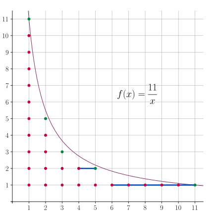
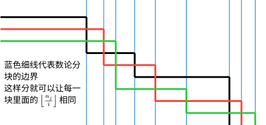

# 数论分块 - OI Wiki

- Source: https://oi-wiki.org/math/number-theory/sqrt-decomposition/

# 数论分块

数论分块可以快速计算一些形如

𝑛∑𝑖=1𝑓(𝑖)𝑔(⌊𝑛𝑖⌋)∑i=1nf(i)g(⌊ni⌋)

的和式．如果可以在 𝑂(1)O(1) 时间内计算出 ∑𝑟𝑖=𝑙𝑓(𝑖)∑i=lrf(i) 或已经预处理出 𝑓f 的前缀和时，数论分块就可以在 𝑂(√𝑛)O(n) 时间内计算出上述和式的值．

数论分块常与 [莫比乌斯反演](../mobius/) 等技巧结合使用．

## 思路

首先，本文通过一个简单的例子来说明数论分块的思路．假设要计算如图所示的双曲线下的整点个数：



这相当于在计算和式：

11∑𝑖=1⌊11𝑖⌋.∑i=111⌊11i⌋.

这是前文所示和式在 𝑓(𝑘) =1, 𝑔(𝑘) =𝑘f(k)=1, g(k)=k 时的特殊情况．

最简单的做法当然是逐列计算然后求和，但是这样需要计算第 𝑖 =1,2,⋯,11i=1,2,⋯,11 列中每列整点的个数．观察图示可以发现，这些整点列的可以分成 55 块，每块内点列的高度是一致的，形成一个矩形点阵．所以，只要能够知道这些块的宽度，就能够通过计算这些矩形块的大小快速完成统计．

这就是整除分块的基本思路．

## 性质

本节讨论关于双曲线 𝑦 =𝑛𝑥y=nx 下整点分块的若干结论．具体地，需要将 1 ∼𝑛1∼n 之间的整数按照 ⌊𝑛𝑖⌋⌊ni⌋ 的取值分为若干块．设

𝐷(𝑛)={⌊𝑛𝑖⌋:1≤𝑖≤𝑛, 𝑖∈𝐍+}.D(n)={⌊ni⌋:1≤i≤n, i∈N+}.

这就是 ⌊𝑛𝑖⌋⌊ni⌋ 所有可能的取值集合．

首先，这样的不同取值只有 𝑂(√𝑛)O(n) 个．所以，数论分块得到的块的数目只有 𝑂(√𝑛)O(n) 个．

性质 1

|𝐷(𝑛)| ≤2√𝑛|D(n)|≤2n．

证明

分两种情况讨论：

  * 当 𝑖 ≤√𝑛i≤n 时，𝑖i 的取值至多 √𝑛n 个，所以 ⌊𝑛𝑖⌋⌊ni⌋ 的取值也至多只有 √𝑛n 个．
  * 当 𝑖 >√𝑛i>n 时，⌊𝑛𝑖⌋ ≤𝑛𝑖 <√𝑛⌊ni⌋≤ni<n 也至多只有 √𝑛n 个取值．

因此，所有可能取值的总数 |𝐷(𝑛)| ≤2√𝑛|D(n)|≤2n．

通过更细致的分析，实际上可以精确地描述集合 𝐷(𝑛)D(n) 及其大小．

性质 2

设 𝑠 =⌊√𝑛⌋s=⌊n⌋．集合 𝐷(𝑛)D(n) 中的元素从小到大依次是

1<2<⋯<𝑠−1<𝑠≤⌊𝑛𝑠⌋<⌊𝑛𝑠−1⌋<⋯<⌊𝑛2⌋<⌊𝑛1⌋=𝑛.1<2<⋯<s−1<s≤⌊ns⌋<⌊ns−1⌋<⋯<⌊n2⌋<⌊n1⌋=n.

进而，|𝐷(𝑛)| =⌊√4𝑛+1⌋ −1|D(n)|=⌊4n+1⌋−1．

证明

首先，对于 1 ≤𝑖 ≤𝑠1≤i≤s，可以证明 ⌊𝑛⌊𝑛/𝑖⌋⌋ =𝑖⌊n⌊n/i⌋⌋=i．令 𝑑 =⌊𝑛𝑖⌋d=⌊ni⌋，需要证明 ⌊𝑛𝑑⌋ =𝑖⌊nd⌋=i．写成不等式，这相当于已知 𝑑 ≤𝑛𝑖 <𝑑 +1d≤ni<d+1，需要证明 𝑖 ≤𝑛𝑑 <𝑖 +1i≤nd<i+1．已知条件可以写作 𝑖 ≤𝑛𝑑 <𝑖 +𝑖𝑑i≤nd<i+id，因此，只需要证明 𝑖𝑑 ≤1id≤1，亦即 𝑖 ≤𝑑 =⌊𝑛𝑖⌋i≤d=⌊ni⌋．这等价于 𝑖 ≤𝑛𝑖i≤ni，这对于所有 1 ≤𝑖 ≤𝑠 ≤√𝑛1≤i≤s≤n 都成立．

这一结果实际上说明，映射 𝑖 ↦⌊𝑛𝑖⌋i↦⌊ni⌋ 构成集合 {𝑖 :1 ≤𝑖 ≤𝑠}{i:1≤i≤s} 和集合 {⌊𝑛𝑖⌋:1≤𝑖≤𝑠}{⌊ni⌋:1≤i≤s} 之间的双射．由于 𝑖i 各不相同，⌊𝑛𝑖⌋⌊ni⌋ 也各不相同．两个集合唯一有可能相同的元素就是 𝑠s 与 ⌊𝑛𝑠⌋⌊ns⌋．所以，|𝐷(𝑛)| =2𝑠 −[𝑠=⌊𝑛/𝑠⌋]|D(n)|=2s−[s=⌊n/s⌋]．

要得到 |𝐷(𝑛)||D(n)| 最终的表达式，需要考察何时 𝑠 =⌊𝑛𝑠⌋s=⌊ns⌋ 成立．

  * 当 𝑠 =⌊𝑛𝑠⌋s=⌊ns⌋ 时，总有 𝑠 ≤𝑛𝑠 <𝑠 +1s≤ns<s+1，亦即 𝑠2 ≤𝑛 <𝑠2 +𝑠s2≤n<s2+s．此时，有 4𝑠2 +1 ≤4𝑛 +1 <4𝑠2 +4𝑠 +1 =(2𝑠 +1)24s2+1≤4n+1<4s2+4s+1=(2s+1)2．又因为 4𝑛 +14n+1 一定是奇数，左侧可以等价地松弛到 4𝑠24s2，所以该条件就等价于 2𝑠 ≤√4𝑛+1 <2𝑠 +12s≤4n+1<2s+1，亦即 ⌊√4𝑛+1⌋ =2𝑠⌊4n+1⌋=2s．
  * 当 𝑠 <⌊𝑛𝑠⌋s<⌊ns⌋ 时，总有 𝑠 +1 ≤𝑛𝑠s+1≤ns，亦即 𝑠2 +𝑠 ≤𝑛s2+s≤n．又因为 𝑛 <(𝑠 +1)2n<(s+1)2，就有 𝑠2 +𝑠 ≤𝑛 <(𝑠 +1)2s2+s≤n<(s+1)2．这就等价于 (2𝑠 +1)2 ≤4𝑛 +1 <4(𝑠 +1)2 +1(2s+1)2≤4n+1<4(s+1)2+1．再次利用 4𝑛 +14n+1 是奇数这一点，右侧可以等价地收紧到 4(𝑠 +1)24(s+1)2，所以该条件就等价于 2𝑠 +1 ≤√4𝑛+1 <2𝑠 +22s+1≤4n+1<2s+2，亦即 ⌊√4𝑛+1⌋ =2𝑠 +1⌊4n+1⌋=2s+1．

总结这两种情形，就得到 |𝐷(𝑛)| =⌊√4𝑛+1⌋ −1|D(n)|=⌊4n+1⌋−1 成立．

然后，单个块的左右端点都很容易确定．

性质 3

对于 𝑑 ∈𝐷(𝑛)d∈D(n)，所有满足 ⌊𝑛𝑖⌋ =𝑑⌊ni⌋=d 的整数 𝑖i 的取值范围为

⌊𝑛𝑑+1⌋+1≤𝑖≤⌊𝑛𝑑⌋.⌊nd+1⌋+1≤i≤⌊nd⌋.证明

因为 ⌊𝑛𝑖⌋ =𝑑⌊ni⌋=d 相当于不等式

𝑑≤𝑛𝑖<𝑑+1.d≤ni<d+1.

这进一步等价于

𝑛𝑑+1<𝑖≤𝑛𝑑.nd+1<i≤nd.

利用 𝑖 ∈𝐍+i∈N+ 这一点，可以对该不等式取整，它就等价于

⌊𝑛𝑑+1⌋+1≤𝑖≤⌊𝑛𝑑⌋.⌊nd+1⌋+1≤i≤⌊nd⌋.

这一性质还体现了图像的对称性：每个块的右端点（前文图中的绿点）的集合恰为 𝐷(𝑛)D(n)．这很容易理解，因为整个图像关于直线 𝑦 =𝑥y=x 是对称的．

除了这些性质外，集合 𝐷(𝑛)D(n) 还具有良好的递归性质：

性质 4

对于 𝑚 ∈𝐷(𝑛)m∈D(n)，有 𝐷(𝑚) ⊆𝐷(𝑛)D(m)⊆D(n)．

证明

设 𝑚 =⌊𝑛𝑘⌋m=⌊nk⌋，那么，因为对于所有 𝑖 ∈𝐍+i∈N+，都有

⌊𝑚𝑖⌋=⌊⌊𝑛/𝑘⌋𝑖⌋=⌊𝑛𝑘𝑖⌋∈𝐷(𝑛),⌊mi⌋=⌊⌊n/k⌋i⌋=⌊nki⌋∈D(n),

所以，𝐷(𝑚) ⊆𝐷(𝑛)D(m)⊆D(n)．其中，第二个等号用到了 [取整函数](../basic/#取整函数) 关于嵌套分式的性质．

前文已经提到，𝐷(𝑛)D(n) 既是每块中 ⌊𝑛𝑖⌋⌊ni⌋ 的取值集合，也是每块的右端点集合．这意味着，如果要递归地应用数论分块（即函数在 𝑛n 处的值依赖于它在 𝑚 ∈𝐷(𝑛) ∖{𝑛}m∈D(n)∖{n} 处的值），那么在整个计算过程中所涉及的取值集合和右端点集合，其实都是 𝐷(𝑛)D(n)．一个典型的例子是 [杜教筛](../du/)．

## 过程

利用上一节叙述的结论，就得到数论分块的具体过程．

为计算和式

𝑛∑𝑖=1𝑓(𝑖)𝑔(⌊𝑛𝑖⌋)∑i=1nf(i)g(⌊ni⌋)

的取值，可以依据 ⌊𝑛𝑖⌋⌊ni⌋ 的取值将标号 𝑖 =1,2,⋯,𝑛i=1,2,⋯,n 分块．因为 ⌊𝑛𝑖⌋⌊ni⌋ 取值相同的标号是一段连续整数 [𝑙,𝑟][l,r]，所以该块中和式的取值为

(𝑟∑𝑖=𝑙𝑓(𝑖))⋅𝑔(⌊𝑛𝑙⌋).(∑i=lrf(i))⋅g(⌊nl⌋).

为了快速计算该和式，通常需要能够快速计算左侧关于 𝑓f 的和式．有些时候，该和式的表达式是已知的，可以在 𝑂(1)O(1) 时间内完成单次计算；有些时候，可以预处理出它的前缀和，仍然可以在 𝑂(1)O(1) 时间内完成单次查询．

在顺次计算每块左右端点时，当前块的左端点 𝑙l 就等于前一块的右端点再加 11，而当前块的右端点就等于 ⌊𝑛⌊𝑛/𝑙⌋⌋⌊n⌊n/l⌋⌋．由此，可以得到如下伪代码：

𝐀𝐥𝐠𝐨𝐫𝐢𝐭𝐡𝐦 Sum(𝑓,𝑔,𝑛):𝐈𝐧𝐩𝐮𝐭. 𝑛, 𝑠(𝑘)=∑𝑘𝑖=1𝑓(𝑘), 𝑔(𝑘).𝐎𝐮𝐭𝐩𝐮𝐭. 𝑆(𝑛)=∑𝑛𝑖=1𝑓(𝑖)𝑔(⌊𝑛/𝑖⌋).𝐌𝐞𝐭𝐡𝐨𝐝.1𝑙←12𝑟𝑒𝑠𝑢𝑙𝑡←03𝐰𝐡𝐢𝐥𝐞 𝑙≤𝑛 𝐝𝐨4𝑟←⌊𝑛⌊𝑛/𝑙⌋⌋5𝑟𝑒𝑠𝑢𝑙𝑡←𝑟𝑒𝑠𝑢𝑙𝑡+(𝑠(𝑟)−𝑠(𝑙−1))⋅𝑔(⌊𝑛𝑙⌋)6𝑙←𝑟+17𝐞𝐧𝐝 𝐰𝐡𝐢𝐥𝐞8𝐫𝐞𝐭𝐮𝐫𝐧 𝑟𝑒𝑠𝑢𝑙𝑡Algorithm Sum(f,g,n):Input. n, s(k)=∑i=1kf(k), g(k).Output. S(n)=∑i=1nf(i)g(⌊n/i⌋).Method.1l←12result←03while l≤n do4r←⌊n⌊n/l⌋⌋5result←result+(s(r)−s(l−1))⋅g(⌊nl⌋)6l←r+17end while8return result

假设单次计算 𝑠( ⋅)s(⋅) 的时间复杂度为 𝑂(1)O(1)，则整个过程的时间复杂度为 𝑂(√𝑛)O(n)．

## 扩展

前文讨论的是数论分块的最常见也最基本的形式．本节进一步讨论数论分块的扩展形式．

### 向上取整的数论分块

数论分块可以用于计算含有向上取整的和式：

𝑛∑𝑖=1𝑓(𝑖)𝑔(⌈𝑛𝑖⌉).∑i=1nf(i)g(⌈ni⌉).

因为 ⌈𝑛𝑖⌉ =⌊𝑛−1𝑖⌋ +1⌈ni⌉=⌊n−1i⌋+1，该和式可以转化为向下取整的情形：

𝑓(𝑛)𝑔(1)+𝑛−1∑𝑖=1𝑓(𝑖)𝑔(⌊𝑛−1𝑖⌋+1).f(n)g(1)+∑i=1n−1f(i)g(⌊n−1i⌋+1).

注意到求和的上限发生了变化，以及 𝑖 =𝑛i=n 时单独的一项．

### 多维数论分块

数论分块还可以用于处理包含不只有一个取整式的和式：

𝑛∑𝑖=1𝑓(𝑖)𝑔(⌊𝑛1𝑖⌋,⌊𝑛2𝑖⌋,⋯,⌊𝑛𝑚𝑖⌋).∑i=1nf(i)g(⌊n1i⌋,⌊n2i⌋,⋯,⌊nmi⌋).

为了应用数论分块的思想，需要保证每块中所有取整式 ⌊𝑛1𝑖⌋,⌊𝑛2𝑖⌋,⋯,⌊𝑛𝑚𝑖⌋⌊n1i⌋,⌊n2i⌋,⋯,⌊nmi⌋ 的取值都不发生变化，也就是说，多维的块应当是所有一维的块的交集．为此，对于已知的左端点 𝑙l，相应的右端点为

min{⌊𝑛1⌊𝑛1/𝑙⌋⌋,⌊𝑛2⌊𝑛2/𝑙⌋⌋,⋯,⌊𝑛𝑚⌊𝑛𝑚/𝑙⌋⌋}.min{⌊n1⌊n1/l⌋⌋,⌊n2⌊n2/l⌋⌋,⋯,⌊nm⌊nm/l⌋⌋}.

也就是说，对于所有一维分块的右端点取最小值，作为多维分块的右端点．可以借助下图理解：



较为常见的是二维形式，此时可将前述伪代码中 𝑟 ←⌊𝑛⌊𝑛/𝑙⌋⌋r←⌊n⌊n/l⌋⌋ 替换成

𝑟←min{⌊𝑛1⌊𝑛1/𝑙⌋⌋,⌊𝑛2⌊𝑛2/𝑙⌋⌋}.r←min{⌊n1⌊n1/l⌋⌋,⌊n2⌊n2/l⌋⌋}.

### 任意指数数论分块

数论分块可以用于含有任意指数的取整式的和式计算：

⌊𝑛𝛼/𝛽⌋∑𝑖=1𝑓(𝑖)𝑔(⌊𝑛𝛼𝑖𝛽⌋).∑i=1⌊nα/β⌋f(i)g(⌊nαiβ⌋).

其中，𝛼,𝛽α,β 为正实数．本文讨论的基本形式中，𝛼 =𝛽 =1α=β=1．

性质

对于正整数 𝑛n 和正实数 𝛼,𝛽α,β，设

𝐷(𝑛,𝛼,𝛽)={⌊𝑛𝛼𝑖𝛽⌋:𝑖=1,2,⋯,⌊𝑛𝛼/𝛽⌋}.D(n,α,β)={⌊nαiβ⌋:i=1,2,⋯,⌊nα/β⌋}.

那么，有

  1. |𝐷(𝑛,𝛼,𝛽)| ≤2𝑛𝛼/(1+𝛽)|D(n,α,β)|≤2nα/(1+β)．
  2. 对于 𝑑 ∈𝐷(𝑛,𝛼,𝛽)d∈D(n,α,β)，使得 ⌊𝑛𝛼𝑖𝛽⌋ =𝑑⌊nαiβ⌋=d 成立的 𝑖i 的取值范围为

⌊𝑛𝛼/𝛽(𝑑+1)1/𝛽⌋+1≤𝑖≤⌊𝑛𝛼/𝛽𝑑1/𝛽⌋.⌊nα/β(d+1)1/β⌋+1≤i≤⌊nα/βd1/β⌋.

证明

对于第一点，分两种情况：

  * 当 𝑖 ≤𝑛𝛼𝑖𝛽i≤nαiβ 时，有 𝑖 ≤𝑛𝛼/(1+𝛽)i≤nα/(1+β)，所以 ⌊𝑛𝛼𝑖𝛽⌋⌊nαiβ⌋ 至多有 𝑛𝛼/(1+𝛽)nα/(1+β) 种取值．
  * 当 𝑖 >𝑛𝛼𝑖𝛽i>nαiβ 时，有 𝑖 >𝑛𝛼/(1+𝛽)i>nα/(1+β)，进而有 𝑛𝛼𝑖𝛽 <𝑛𝛼/(1+𝛽)nαiβ<nα/(1+β)，所以 ⌊𝑛𝛼𝑖𝛽⌋⌊nαiβ⌋ 也至多只有 𝑛𝛼/(1+𝛽)nα/(1+β) 种取值．

综合两种情形，就有 |𝐷(𝑛,𝛼,𝛽)| ≤2𝑛𝛼/(1+𝛽)|D(n,α,β)|≤2nα/(1+β)．

对于第二点，⌊𝑛𝛼𝑖𝛽⌋ =𝑑⌊nαiβ⌋=d 就等价于

𝑑≤𝑛𝛼𝑖𝛽<𝑑+1⟺𝑛𝛼/𝛽(𝑑+1)1/𝛽<𝑖≤𝑛𝛼/𝛽𝑑1/𝛽.d≤nαiβ<d+1⟺nα/β(d+1)1/β<i≤nα/βd1/β.

对该不等式取整，就得到第二个命题．

利用这些性质，就可以在 𝑂(𝑛𝛼/(1+𝛽))O(nα/(1+β)) 的时间复杂度下实现对任意指数的数论分块．

例子

例如，对于 𝛼 =𝛽 =1/2α=β=1/2 时的如下和式

𝑛∑𝑖=1𝑓(𝑖)𝑔(⌊√𝑛𝑖⌋),∑i=1nf(i)g(⌊ni⌋),

可以通过数论分块在 𝑂(𝑛1/3)O(n1/3) 时间内解决．已知块的左端点为 𝑙l 时，可以计算右端点为 𝑟 =⌊𝑛⌊√𝑛/𝑙⌋2⌋r=⌊n⌊n/l⌋2⌋．

## 例题

[UVa11526 H(n)](https://onlinejudge.org/index.php?option=com_onlinejudge&Itemid=8&category=27&page=show_problem&problem=2521)

𝑇T 组数据，每组一个整数 𝑛n．对于每组数据，输出 ∑𝑛𝑖=1⌊𝑛𝑖⌋∑i=1n⌊ni⌋．

解答

根据前文分析，可以对于每一块相同的 ⌊𝑛𝑖⌋⌊ni⌋ 一起计算．时间复杂度为 𝑂(𝑇√𝑛)O(Tn)．

实现

```text 1 2 3 4 5 6 7 8 9 10 11 12 13 14 15 16 17 18 19 20 21 22 23 24 25 ``` |  ```text #include <iostream> long long H ( int n ) { long long res = 0 ; // 储存结果 int l = 1 , r ; // 块左端点与右端点 while ( l <= n ) { r = n / ( n / l ); // 计算当前块的右端点 // 累加这一块的贡献到结果中。乘上 1LL 防止溢出 res += 1L L * ( r \- l \+ 1 ) * ( n / l ); l = r \+ 1 ; // 左端点移到下一块 } return res ; } int main () { std :: ios :: sync_with_stdio ( false ); std :: cin . tie ( nullptr ); int t , n ; std :: cin >> t ; while ( t \-- ) { std :: cin >> n ; std :: cout << H ( n ) << '\n' ; } return 0 ; } ```   
---|---  
  
[Codeforces 1954E Chain Reaction](https://codeforces.com/contest/1954/problem/E)

有一排 𝑛n 只怪兽，每只怪兽初始血量为 𝑎𝑖ai．一次攻击会使一段连续的存活的怪兽血量减 𝑘k，血量不大于 00 视作死亡．对于所有 𝑘k 求出击杀所有怪兽所需攻击次数．其中，𝑛,𝑎𝑖 ≤105n,ai≤105．

解答

令 𝑎0 =0a0=0．假设击杀所有前 (𝑖 −1)(i−1) 只怪兽需要 𝑇(𝑘,𝑖 −1)T(k,i−1) 次攻击，第 𝑖i 只怪兽的血量为 𝑎𝑖ai．由于击杀第 (𝑖 −1)(i−1) 只怪兽时，需要攻击它 ⌈𝑎𝑖−1/𝑘⌉⌈ai−1/k⌉ 次，这些攻击都可以延伸到第 𝑖i 只怪兽．因此，要击杀第 𝑖i 只怪兽，只需要再攻击 max{0,⌈𝑎𝑖/𝑘⌉ −⌈𝑎𝑖−1/𝑘⌉}max{0,⌈ai/k⌉−⌈ai−1/k⌉} 次．由此，总的攻击次数为

𝑇(𝑘,𝑛)=𝑛∑𝑖=1max(0,⌈𝑎𝑖𝑘⌉−⌈𝑎𝑖−1𝑘⌉).T(k,n)=∑i=1nmax(0,⌈aik⌉−⌈ai−1k⌉).

由于题目涉及的 𝑛,𝑘n,k 都比较大，对每个 𝑘k 分别计算该和式并不可行．可以考虑对每个 𝑖 =1,2,⋯,𝑛i=1,2,⋯,n，都维护数列 {𝑇(𝑘,𝑖)}𝑘{T(k,i)}k．初始时，设 𝑇(𝑘,0) ≡0T(k,0)≡0．假设数列 {𝑇(𝑘,𝑖 −1)}𝑘{T(k,i−1)}k 已知，考虑如何对它进行修改才能得到数列 {𝑇(𝑘,𝑖)}𝑘{T(k,i)}k．根据前文分析，只需要对数列的第 𝑘k 项增加 max(0,⌈𝑎𝑖𝑘⌉−⌈𝑎𝑖−1𝑘⌉)max(0,⌈aik⌉−⌈ai−1k⌉) 即可．利用二维数论分块，可以将这一修改操作拆分成 𝑂(√𝑎𝑖−1 +√𝑎𝑖)O(ai−1+ai) 段区间修改操作，且每段区间上增加的值是固定的．最后得到的数列 {𝑇(𝑘,𝑛)}𝑘{T(k,n)}k 就是答案．

由于题目涉及一系列区间加操作，且查询只发生所有修改完成后．所以，可以通过维护差分序列进行区间加修改，最后通过求前缀和得到所求数列．总的时间复杂度为 𝑂(∑√𝑎𝑖)O(∑ai)．本题也存在其他解法．

实现

```text 1 2 3 4 5 6 7 8 9 10 11 12 13 14 15 16 17 18 19 20 21 22 23 24 25 26 27 28 29 ``` |  ```text #include <algorithm> #include <iostream> constexpr int N = 100009 ; int n , a [ N ], maxn ; long long ans [ N ]; int main () { std :: ios :: sync_with_stdio ( false ); std :: cin . tie ( nullptr ); std :: cin >> n ; for ( int i = 1 ; i <= n ; ++ i ) { std :: cin >> a [ i ]; maxn = std :: max ( maxn , a [ i ]); } for ( int i = 0 ; i < n ; ++ i ) for ( int l = 1 , r ;; l = r \+ 1 ) { r = std :: min ( l < a [ i ] ? ( a [ i ] \- 1 ) / (( a [ i ] \- 1 ) / l ) : N , l < a [ i \+ 1 ] ? ( a [ i \+ 1 ] \- 1 ) / (( a [ i \+ 1 ] \- 1 ) / l ) : N ); // 二维数论分块 if ( r == N ) break ; int x = ( a [ i \+ 1 ] \- 1 ) / l \- std :: max ( a [ i ] \- 1 , 0 ) / l ; if ( x > 0 ) ans [ l ] += x , ans [ r \+ 1 ] -= x ; // 累加贡献 } ++ ans [ 0 ]; // ⌈a/l⌉=(a-1)/l+1的式子当a=0时不成立，需要修正 for ( int i = 1 ; i <= maxn ; ++ i ) std :: cout << ( ans [ i ] += ans [ i \- 1 ]) << " \n " [ i == maxn ]; return 0 ; } ```   
---|---  
  
## 习题

  * [UVa11526 H(n)](https://onlinejudge.org/index.php?option=com_onlinejudge&Itemid=8&category=27&page=show_problem&problem=2521)
  * [Luogu P2261 CQOI2007 余数求和](https://www.luogu.com.cn/problem/P2261)
  * [Luogu P3455 POI2007 ZAP-Queries](https://www.luogu.com.cn/problem/P3455)

## 参考资料与注释

  * [杜教筛的时空复杂度分析 by riteme](https://riteme.site/blog/2018-9-11/time-space-complexity-dyh-algo.html)

* * *

>  __本页面最近更新： 2025/11/1 21:29:33，[更新历史](https://github.com/OI-wiki/OI-wiki/commits/master/docs/math/number-theory/sqrt-decomposition.md)  
>  __发现错误？想一起完善？[在 GitHub 上编辑此页！](https://oi-wiki.org/edit-landing/?ref=/math/number-theory/sqrt-decomposition.md "edit.link.title")  
>  __本页面贡献者：[c-forrest](https://github.com/c-forrest), [Tiphereth-A](https://github.com/Tiphereth-A), [Xeonacid](https://github.com/Xeonacid), [yusancky](https://github.com/yusancky), [2044-space-elevator](https://github.com/2044-space-elevator), [383494](https://github.com/383494), [99-woods](https://github.com/99-woods), [Backl1ght](https://github.com/Backl1ght), [caijianhong](https://github.com/caijianhong), [CCXXXI](https://github.com/CCXXXI), [ghszt0](https://github.com/ghszt0), [Great-designer](https://github.com/Great-designer), [iamtwz](https://github.com/iamtwz), [ksyx](https://github.com/ksyx), [Marcythm](https://github.com/Marcythm), [qwqAutomaton](https://github.com/qwqAutomaton), [sshwy](https://github.com/sshwy), [StudyingFather](https://github.com/StudyingFather), [tder6](https://github.com/tder6), [TOMWT-qwq](https://github.com/TOMWT-qwq)  
>  __本页面的全部内容在**[CC BY-SA 4.0](https://creativecommons.org/licenses/by-sa/4.0/deed.zh) 和 [SATA](https://github.com/zTrix/sata-license)** 协议之条款下提供，附加条款亦可能应用
