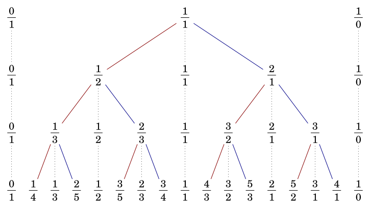
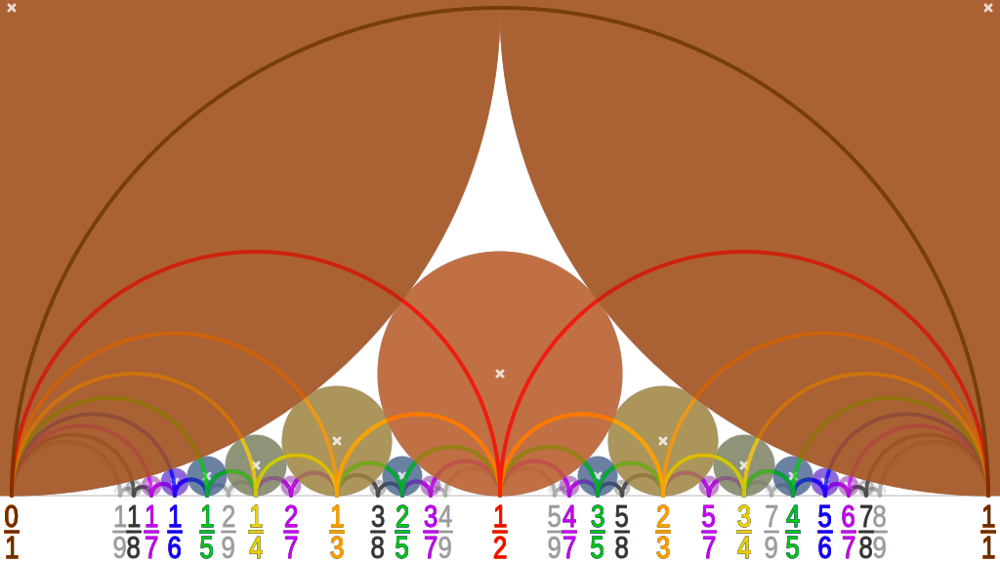

# Stern–Brocot 树与 Farey 序列 - OI Wiki

- Source: https://oi-wiki.org/math/number-theory/stern-brocot/

# Stern–Brocot 树与 Farey 序列

## 引入

本文介绍存储最简分数的数据结构以及其它相关概念．它们与 [连分数](../continued-fraction/) 紧密相关，在算法竞赛中可以用于解决一系列数论问题，并可能作为某些题目的隐含背景出现．

## Stern–Brocot 树

Stern–Brocot 树是一种维护分数的优雅的结构，包含所有不同的正有理数．这个结构分别由 Moritz Stern 在 1858 年和 Achille Brocot 在 1861 年独立发现．

### 构造

#### 逐层构造

Stern–Borcot 树可以在迭代构造第 𝑘k 阶 Stern–Brocot 序列（Stern–Brocot sequence of order 𝑘k）的过程中得到．第 00 阶 Stern–Brocot 序列由两个简单的分数组成：

01, 10.01, 10.

此处的 1010 严格意义上并不算是有理分数，可以理解为表示 ∞∞ 的最简分数．

在第 𝑘k 阶 Stern–Brocot 序列相邻的两个分数 𝑎𝑏ab 和 𝑐𝑑cd 中间插入它们的中位分数（mediant）1𝑎+𝑐𝑏+𝑑a+cb+d，就得到第 𝑘 +1k+1 阶 Stern–Brocot 序列．尽管中位分数的定义本身允许分数的约分，但是在 Stern–Brocot 树的构造中，只需要直接将分子和分母分别相加即可，而不必担心约分的问题．由此，可以迭代地构造出所有阶的 Stern–Brocot 序列．前几次迭代的结果如下：

01,11,1001,12,11,21,1001,13,12,23,11,32,21,31,1001,11,1001,12,11,21,1001,13,12,23,11,32,21,31,10

将每次迭代中新添加的分数连结成树状结构，就得到了 Stern–Brocot 树．如下图所示：



第 𝑘k 阶 Stern–Brocot 序列，不计左右端点，就是深度为 𝑘 −1k−1 的 Stern–Brocot 树的中序遍历．

#### 三元组构造

另一种等价的构造方式是以三元组

(01,11,10)(01,11,10)

作为根节点，且在每个节点

(𝑎𝑏,𝑝𝑞,𝑐𝑑)(ab,pq,cd)

后都分别添加

(𝑎𝑏,𝑎+𝑝𝑏+𝑞,𝑝𝑞), (𝑝𝑞,𝑝+𝑐𝑞+𝑑,𝑐𝑑)(ab,a+pb+q,pq), (pq,p+cq+d,cd)

为左右子节点，就可以构造出整个 Stern–Brocot 树．Stern–Brocot 树的每个节点记录的三元组中，实际存储的分数是位于三元组中间的分数 𝑝𝑞pq，而左右两个分数 𝑎𝑏ab 和 𝑐𝑑cd 是更早就出现过的分数．而且，考虑前一种构造就会发现，分数 𝑝𝑞pq 正是通过插入 𝑎𝑏ab 和 𝑐𝑑cd 的中位分数得到的．

#### 矩阵表示与 Stern–Brocot 数系

三元组构造意味着每个 Stern–Brocot 树上的节点都对应着一个矩阵

𝑆=(𝑏𝑑𝑎𝑐).S=(bdac).

Stern–Brocot 树的根节点是单位矩阵 𝐼I，而向左子节点移动和向右子节点移动则分别对应将当前节点矩阵右乘以矩阵

𝐿=(1101), 𝑅=(1011).L=(1101), R=(1011).

每个节点实际对应的分数就是 𝑓(𝑆) =𝑎+𝑐𝑏+𝑑f(S)=a+cb+d．每个节点的矩阵 𝑆S 都可以写成一系列矩阵 𝐿L 和 𝑅R 的乘积，这也可以理解为是由 𝐿L 和 𝑅R 构成的字符串，表示了从根节点到达它的路径．将所有正的有理数唯一地表示为这样的字符串，这可以看作得到了正有理数的一种表示，故而也称作 **Stern–Brocot 数系** （Stern–Brocot number system）．

#### 建树实现

建树算法只需要模拟上述过程即可．下面是对前 𝑛n 层的 Stern–Brocot 树做中序遍历的代码．

建树

C++Python

```text 1 2 3 4 5 6 7 8 ``` |  ```text // In-Order Transversal of Stern-Brocot Tree till Layer N. void build ( int n , int a = 0 , int b = 1 , int c = 1 , int d = 0 , int level = 1 ) { if ( level > n ) return ; // Only first n layers. int x = a \+ c , y = b \+ d ; build ( n , a , b , x , y , level \+ 1 ); std :: cout << x << '/' << y << ' ' ; // Output the current fraction. build ( n , x , y , c , d , level \+ 1 ); } ```   
---|---  
  
```text 1 2 3 4 5 6 7 8 ``` |  ```text # In-Order Transversal of Stern-Brocot Tree till Layer N. def build ( n , a = 0 , b = 1 , c = 1 , d = 0 , level = 1 ): if level > n : return x , y = a \+ c , b \+ d build ( n , a , b , x , y , level \+ 1 ) print ( f " { x } / { y } " , end = " " ) build ( n , x , y , c , d , level \+ 1 ) ```   
---|---  
  
建树算法的复杂度是 𝑂(𝑛2)O(n2) 的．

### 性质

接下来讨论 Stern–Brocot 树的性质．简而言之，Stern–Brocot 树是包含所有正的最简有理分数的 [二叉搜索树](../../../ds/bst/)，它也是分子和分母的 [堆](../../../ds/binary-heap/)，也是分母和分子构成的二元组的 [笛卡尔树](../../../ds/cartesian-tree/)．如果考虑前文的三元组构造中的左右端点形成的区间，则 Stern–Brocot 树也可以看作是 [0,∞][0,∞] 上的 [线段树](../../../ds/seg/)．这些陈述可以通过如下的三条基本性质导出：

#### 单调性

在上面的构造中，每一层的分数都是单调递增的．为此只需要归纳证明．因为如果 𝑎𝑏 <𝑐𝑑ab<cd，那么必然有

𝑎𝑏<𝑎+𝑐𝑏+𝑑<𝑐𝑑.ab<a+cb+d<cd.

这一点可以通过消去不等式的分母得出．归纳起点是 01 <1001<10，单调性也显然成立．

#### 最简性

在上面的构造中，每个分数都是最简分数．为此同样需要归纳证明上面的构造中，每一层相邻的分数 𝑎𝑏ab 和 𝑐𝑑cd 都满足等式

𝑏𝑐−𝑎𝑑=det⁡(𝑏𝑑𝑎𝑐)=1.bc−ad=det⁡(bdac)=1.

根节点处是单位矩阵，这显然成立．向下移动时，乘以的矩阵 𝐿L 和 𝑅R 的行列式都是 11，根据 [行列式](../../linear-algebra/determinant/) 的性质可知，在下一层同样成立

det⁡(𝑏𝑏+𝑑𝑎𝑎+𝑐)=det⁡(𝑏+𝑑𝑑𝑎+𝑐𝑐)=1.det⁡(bb+daa+c)=det⁡(b+dda+cc)=1.

对于归纳起点 0101 和 1010 这也是显然的．由此，根据 [裴蜀定理](../bezouts/)，必然可知每个分数的分子和分母都是互素的，即所有分数都是最简分数．

#### 完全性

最后，需要说明 Stern–Brocot 树包括了所有正的最简分数．因为前两条性质已经说明 Stern–Brocot 树是二叉搜索树，而任何正的最简分数 𝑝𝑞pq 必然位于 0101 和 1010 之间，根据二叉搜索树上做搜索的方法，二叉搜索树上没有 𝑝𝑞pq 的唯一可能性就是搜索过程无限长．这是不可能的．

假设现在已经知道

𝑎𝑏<𝑝𝑞<𝑐𝑑,ab<pq<cd,

那么必然有

𝑏𝑝−𝑎𝑞≥1, 𝑐𝑞−𝑑𝑝≥1.bp−aq≥1, cq−dp≥1.

将两个不等式分别乘以 (𝑐 +𝑑)(c+d) 和 (𝑎 +𝑏)(a+b)，就能够得到

(𝑐+𝑑)(𝑏𝑝−𝑎𝑞)+(𝑎+𝑏)(𝑐𝑞−𝑑𝑝)≥𝑎+𝑏+𝑐+𝑑.(c+d)(bp−aq)+(a+b)(cq−dp)≥a+b+c+d.

利用前面已经说明的等式 𝑏𝑐 −𝑎𝑑 =1bc−ad=1 可知

𝑝+𝑞≥𝑎+𝑏+𝑐+𝑑.p+q≥a+b+c+d.

每次搜索更深入一层的时候，等式右侧都严格地增加，而左侧保持不变，因此搜索必然在有限步内停止．

### 查找分数

在实际应用 Stern–Brocot 树的过程中，经常需要查询给定分数在 Stern–Brocot 树上的位置．

#### 朴素算法

因为 Stern–Brocot 是二叉搜索树，只需要通过比较当前分数和要寻找的分数的大小关系，就可以确定从根节点到给定分数的路径．将路径上向左子节点移动和向右子节点移动分别记作 𝐿L 和 𝑅R，则每个路径就对应一个由 𝐿L 和 𝑅R 构成的字符串，这就是上文提到的有理数在 Stern–Brocot 数系中的表示．求得到达某个有理数的路径的过程就相当于求得该有理数在 Stern–Brocot 数系中的表示．

朴素的分数查找算法的实现如下：

朴素分数查找

C++Python

```text 1 2 3 4 5 6 7 8 9 10 ``` |  ```text // Locate a given fraction in the Stern-Brocot tree. std :: string find ( int x , int y , int a = 0 , int b = 1 , int c = 1 , int d = 0 ) { int m = a \+ c , n = b \+ d ; if ( x == m && y == n ) return "" ; if ( x * n < y * m ) { return 'L' \+ find ( x , y , a , b , m , n ); } else { return 'R' \+ find ( x , y , m , n , c , d ); } } ```   
---|---  
  
```text 1 2 3 4 5 6 7 8 9 10 ``` |  ```text # Locate a given fraction in the Stern-Brocot tree. def find ( x , y , a = 0 , b = 1 , c = 1 , d = 0 ): m = a \+ c n = b \+ d if x == m and y == n : return "" if x * n < y * m : return "L" \+ find ( x , y , a , b , m , n ) else : return "R" \+ find ( x , y , m , n , c , d ) ```   
---|---  
  
算法的复杂度是 𝑂(𝑝 +𝑞)O(p+q) 的，因此在算法竞赛中并不实用．

在 Stern–Brocot 数系中，每个正的无理数都对应着唯一的无限长的字符串．可以使用同样的算法构造出这个字符串．这个无限长的字符串的每个前缀都对应着一个有理的最简分数．将这些最简分数排成一列，数列中的分数的分母是严格递增的，而数列的极限就是该无理数．因此，Stern-Brocot 树可以用于找到某个无理数的任意精度的有理逼近．但是，应当注意的是，这个有理数数列和无理数之间的差距并非严格递减的．对于有理逼近的严格理论，应当参考连分数页面的 [丢番图逼近](../continued-fraction/#丢番图逼近) 一节．在实际应用 Stern-Brocot 树寻找某个实数在分母不超过某范围的最佳逼近时，最后应当注意比较左右区间端点到该实数的距离．

#### 快速算法

查找分数的朴素算法效率并不高，但是经过简单的优化就可以得到 𝑂(log⁡(𝑝+𝑞))O(log⁡(p+q)) 的快速查找算法．优化的关键是将连续的 𝐿L 和 𝑅R 合并处理．

如果要查找的分数 𝑝𝑞pq 落入 𝑎𝑏ab 和 𝑐𝑑cd 之间，那么连续 𝑡t 次向右移动时，右侧边界保持不动，而左侧节点移动到 𝑎+𝑡𝑐𝑏+𝑡𝑑a+tcb+td 处；反过来，连续 𝑡t 次向左移动时，左侧边界保持不动，而右侧节点移动到 𝑡𝑎+𝑐𝑡𝑏+𝑑ta+ctb+d 处．因此，可以直接通过 𝑎+𝑡𝑐𝑏+𝑡𝑑 <𝑝𝑞a+tcb+td<pq 或 𝑝𝑞 <𝑡𝑎+𝑐𝑡𝑏+𝑑pq<ta+ctb+d 来确定向右和向左移动的次数．此处取严格不等号，是因为算法移动的是左右端点，而要寻找的分数是作为最后得到的端点的中位分数出现的．

快速分数查找

C++Python

```text 1 2 3 4 5 6 7 8 9 10 11 12 13 14 15 16 17 18 19 20 21 ``` |  ```text // Locate a given fraction in the Stern-Brocot tree. auto find ( int x , int y ) { std :: vector < std :: pair < int , char >> res ; int a = 0 , b = 1 , c = 1 , d = 0 ; bool right = true ; while ( x != a \+ c || y != b \+ d ) { if ( right ) { auto t = ( b * x \- a * y \- 1 ) / ( y * c \- x * d ); res . emplace_back ( t , 'R' ); a += t * c ; b += t * d ; } else { auto t = ( y * c \- x * d \- 1 ) / ( b * x \- a * y ); res . emplace_back ( t , 'L' ); c += t * a ; d += t * b ; } right ^= 1 ; } return res ; } ```   
---|---  
  
```text 1 2 3 4 5 6 7 8 9 10 11 12 13 14 15 16 17 18 ``` |  ```text # Locate a given fraction in the Stern-Brocot tree. def find ( x , y ): res = [] a , b , c , d = 0 , 1 , 1 , 0 right = True while x != a \+ c or y != b \+ d : if right : t = ( b * x \- a * y \- 1 ) // ( y * c \- x * d ) res . append (( t , "R" )) a += t * c b += t * d else : t = ( y * c \- x * d \- 1 ) // ( b * x \- a * y ) res . append (( t , "L" )) c += t * a d += t * b right ^= 1 return res ```   
---|---  
  
当前查找算法需要在分数 𝑝𝑞pq 已知．如果目标分数未知，往往需要在每次向右或向左移动时，对移动次数进行倍增查找或者二分查找．此时，分数查找算法的复杂度是 𝑂(log2⁡(𝑝 +𝑞))O(log2⁡(p+q))．

#### 基于连分数的算法

对于分数已知的情形，可以利用连分数给出更为简单的算法．不妨假设首组移动是向右的；如果不然，则设首组向右移动的次数为零．向右、向左交替移动端点，将每组移动后的端点位置排列如下：

𝑝0𝑞0, 𝑝1𝑞1, 𝑝2𝑞2, ⋯, 𝑝𝑛−2𝑞𝑛−2, 𝑝𝑛−1𝑞𝑛−1, 𝑝𝑛𝑞𝑛.p0q0, p1q1, p2q2, ⋯, pn−2qn−2, pn−1qn−1, pnqn.

其中，偶数组移动是向右的，故而记录的是左端点的位置；奇数组移动是向左的，故而记录的是右端点的位置．在这一列端点前面再添加两个端点

𝑝−2𝑞−2=01, 𝑝−1𝑞−1=10.p−2q−2=01, p−1q−1=10.

设第 𝑘k 组移动的次数为 𝑡𝑘tk，那么根据上面得到的移动次数与端点位置之间的关系可知

𝑝𝑘𝑞𝑘=𝑡𝑘𝑝𝑘−1+𝑝𝑘−2𝑡𝑘𝑞𝑘−1+𝑞𝑘−2.pkqk=tkpk−1+pk−2tkqk−1+qk−2.

根据连分数的 [递推关系](../continued-fraction/#递推关系) 就可以知道，端点

𝑝𝑘𝑞𝑘=[𝑡0,𝑡1,⋯,𝑡𝑘].pkqk=[t0,t1,⋯,tk].

最后得到的连分数是

𝑝𝑞=𝑝𝑘+𝑝𝑘−1𝑞𝑘+𝑞𝑘−1=[𝑡0,𝑡1,⋯,𝑡𝑛−1,𝑡𝑛,1].pq=pk+pk−1qk+qk−1=[t0,t1,⋯,tn−1,tn,1].

因此，在目标分数的末尾为一的 [连分数表示](../continued-fraction/#简单连分数) 中，不计最后的一，前面的项就编码了 Stern–Brocot 树上自根节点到当前节点的路径．其中，偶数项（下标自 00 开始）是向右子节点的边，奇数项是向左子节点的边．

有理数的连分数表示可以通过辗转相除法求得，因此基于连分数表示的分数查找算法的复杂度是 𝑂(log⁡min{𝑝,𝑞})O(log⁡min{p,q}) 的．

基于连分数的分数查找

C++Python

```text 1 2 3 4 5 6 7 8 9 10 11 12 13 ``` |  ```text // Locate a given fraction in the Stern-Brocot tree. auto find ( int x , int y ) { std :: vector < std :: pair < int , char >> res ; bool right = true ; while ( y ) { res . emplace_back ( x / y , right ? 'R' : 'L' ); x %= y ; std :: swap ( x , y ); right ^= 1 ; } \-- res . back (). first ; return res ; } ```   
---|---  
  
```text 1 2 3 4 5 6 7 8 9 10 ``` |  ```text # Locate a given fraction in the Stern-Brocot tree. def find ( x , y ): res = [] right = True while y : res . append ([ x // y , ( "R" if right else "L" )]) x , y = y , x % y right ^= 1 res [ \- 1 ][ 0 ] -= 1 return res ```   
---|---  
  
利用连分数表示，可以简单地表达出某个节点的父节点和子节点．对于节点 [𝑡0,𝑡1,⋯,𝑡𝑛,1][t0,t1,⋯,tn,1]，它的父节点就是沿最后的移动方向少移动一步的节点：在 𝑡𝑘 >1tk>1 时，父节点是 [𝑡0,𝑡1,⋯,𝑡𝑛 −1,1][t0,t1,⋯,tn−1,1]；否则，父节点是 [𝑡0,𝑡1,⋯,𝑡𝑛−1,1][t0,t1,⋯,tn−1,1]．它的两个子节点则分别是 [𝑡0,𝑡1,⋯,𝑡𝑛 +1,1][t0,t1,⋯,tn+1,1] 和 [𝑡0,𝑡1,⋯,𝑡𝑛,1,1][t0,t1,⋯,tn,1,1]；两个节点哪个是左子节点，哪个是右子节点，需要根据 𝑛n 的奇偶性判断．

## Calkin–Wilf 树

另外一种更为简单的存储正有理分数的结构是 Calkin–Wilf 树．它通常如下所示：


树的根节点为 1111．然后，对于分数 𝑝𝑞pq 所在的节点，其左右子节点分别为 𝑝𝑝+𝑞pp+q 和 𝑝+𝑞𝑞p+qq．与 Stern–Brocot 树类似，它的每个分数都是最简分数，且包括全体正的最简分数各恰好一次．

### 与连分数的关系

与 Stern–Brocot 树不同，Calkin–Wilf 树不是二叉搜索树，因此不能用于二分查找有理数．

在 Calkin–Wilf 树中，当 𝑝 >𝑞p>q 时，分数 𝑝𝑞pq 的父节点为 𝑝−𝑞𝑞p−qq；当 𝑝 <𝑞p<q 时，为 𝑝𝑞−𝑝pq−p．对于第一种情形，自 𝑝𝑞pq 出发，它是父节点的右子节点，可以一直通过父节点的右边向上移动，直到分子不再大于分母为止，此时节点存储的分数是 𝑝mod𝑞𝑞pmodqq，本组移动的次数是 ⌊𝑝𝑞⌋⌊pq⌋；对于第二种情形，它是父节点的左子节点，可以一直通过父节点的左边向上移动，直到分母不再大于分子为止，此时节点存储的分数是 𝑝𝑞mod𝑝pqmodp，本组移动的次数是 ⌊𝑞𝑝⌋⌊qp⌋．

利用连分数的语言，设当前的节点存储的是某个连分数的余项 𝑠𝑘sk，则沿父节点的右边向上移动 ⌊𝑠𝑘⌋⌊sk⌋ 次，到达分数 1𝑠𝑘+11sk+1，随后沿父节点的左边移动 ⌊𝑠𝑘+1⌋⌊sk+1⌋ 次，到达分数 𝑠𝑘+2sk+2．因此，从节点 𝑠0 =𝑝𝑞s0=pq 开始向上到达根节点 1111 的路径由连分数 [𝑡0,𝑡1,⋯,𝑡𝑛,1][t0,t1,⋯,tn,1] 编码：除去最后的 11，偶数项（下标自 00 开始）表示沿父节点的右边移动的次数，奇数项表示沿父节点的左边移动的次数．

对于分数 𝑝𝑞 =[𝑡0,𝑡1,⋯,𝑡𝑛,1]pq=[t0,t1,⋯,tn,1] 所在的节点，它的父节点有如下表示：

  1. 当 𝑡0 >0t0>0 时，它的父节点为 𝑝−𝑞𝑞 =[𝑡0 −1,𝑡1,⋯,𝑡𝑛,1]p−qq=[t0−1,t1,⋯,tn,1]；
  2. 当 𝑡0 =0t0=0 且 𝑡1 >1t1>1 时，它的父节点为 𝑝𝑞−𝑝 =[0,𝑡1 −1,𝑡2,⋯,𝑡𝑛,1]pq−p=[0,t1−1,t2,⋯,tn,1]；
  3. 当 𝑡0 =0t0=0 且 𝑡1 =1t1=1 时，它的父节点为 𝑝𝑞−𝑝 =[𝑡2,𝑡3,⋯,𝑡𝑛,1]pq−p=[t2,t3,⋯,tn,1]．

反过来，它的子节点则分别是 𝑝+𝑞𝑞 =[𝑡0 +1,𝑡1,⋯,𝑡𝑛,1]p+qq=[t0+1,t1,⋯,tn,1] 和 𝑝𝑝+𝑞 =[0,1,𝑡0,𝑡1,⋯,𝑡𝑛,1]pp+q=[0,1,t0,t1,⋯,tn,1]．对于第二个子节点的连分数表示，在 𝑡0 =0t0=0 时，应当理解为 [0,1 +𝑡1,⋯,𝑡𝑛,1][0,1+t1,⋯,tn,1]．

### 与 Stern–Brocot 树的关系

同样和连分数建立起联系，Stern–Brocot 树中路径上节点呈现的是渐近分数的递归关系，而 Calkin–Wilf 树中路径上节点呈现的是余项的递归关系．同一个分数的连分数表示是一定的，因此它在 Calkin–Wilf 树上到达根节点的路径的编码和 Stern–Brocot 树的根节点到它的路径的编码是完全一样的．但是，由于路径的方向相反，所以虽然 Stern–Brocot 树和 Calkin–Wilf 树同一层存储的分数是一样的，但是位置并不相同．

如果对两个树分别做 [广度优先搜索](../../../graph/bfs/) 并依次对节点编号，根节点编号为 11，那么编号为 𝑣v 的节点的左右子节点分别是 2𝑣2v 和 2𝑣 +12v+1．从编号的二进制表示来看，除去起始的 11，从高位至低位每个 11 均表示向右子节点移动，每个 00 均表示向左子节点移动．Calkin–Wilf 树上，连分数 [𝑡0,𝑡1,⋯,𝑡𝑛,1][t0,t1,⋯,tn,1] 表示的有理数所在节点的编号是

1⋯0⋯0⏟𝑡31⋯1⏟𝑡20⋯0⏟𝑡11⋯1⏟𝑡0.1⋯0⋯0⏟t31⋯1⏟t20⋯0⏟t11⋯1⏟t0.

相应地，Stern–Brocot 树上，连分数 [𝑡0,𝑡1,⋯,𝑡𝑛,1][t0,t1,⋯,tn,1] 表示的有理数所在节点的编号是

11⋯1⏟𝑡00⋯0⏟𝑡11⋯1⏟𝑡20⋯0⏟𝑡3⋯.11⋯1⏟t00⋯0⏟t11⋯1⏟t20⋯0⏟t3⋯.

删去初始的 11，余下的二进制位组成的编号，恰为同一层的顶点自左向右的编号（自 00 开始）．此处的推导说明，Stern–Brocot 树和 Calkin–Wilf 树中同一层的分数的排列互为位逆序置换（bit-reversal permutation），即将下标的二进制位（补齐起始的 00）反转得到的 0 ∼(2𝑘 −1)0∼(2k−1) 上的置换．

正因如此，Stern–Brocot 树上的节点有时会按照对应的 Calkin–Wilf 树上的节点编号，由此得到的编号如下图所示：


这个编号可以递归地构造：根节点编号为 11，每次移动到左子节点时，就将编号首位的 11 替换成 1010，而移动到右子节点时，就将编号首位的 11 替换成 1111．对该编号自右向左解读就可以得到自根节点到该节点的路径．

### Stern 双原子序列

将 Calkin–Wilf 树中的所有分数按照广度优先搜索的编号排列，或将 Stern–Brocot 树中的所有分数按照上图所示的编号排列，就得到如下序列：

11, 12, 21, 13, 32, 23, 31, 14, 43, 35, 52,⋯.11, 12, 21, 13, 32, 23, 31, 14, 43, 35, 52,⋯.

利用 Calkin–Wilf 树的构造过程，可以证明，该序列中相邻的两个分数，前一个的分母必然等于后一个的分子．将分子单独列出，就得到 Stern 双原子序列（Stern diatomic sequence，[OEIS A002487](https://oeis.org/A002487)），也称为 Stern–Brocot 序列（Stern–Brocot sequence）．上述序列的编号从 11 开始，并补充规定第 00 个数是 00．

设 𝑎𝑛an 是 Stern 双原子序列中第 𝑛n 个数，那么，它满足如下递归关系：

𝑎2𝑛=𝑎𝑛,𝑎2𝑛+1=𝑎𝑛+𝑎𝑛+1.a2n=an,a2n+1=an+an+1.

递归起点是 𝑎0 =0a0=0 和 𝑎1 =1a1=1．要求得 Stern 双原子序列中 𝑎𝑛an 的值，直接利用递归关系复杂度为 𝑂(log2⁡𝑛)O(log2⁡n)，并不优秀．更好的做法是，将它视为 Calkin–Wilf 树上编号为 𝑛n 的分数的分子，利用上文描述的基于连分数的递归关系求解，复杂度为 𝑂(log⁡𝑛)O(log⁡n)．

## Farey 序列

Farey 序列与 Stern–Brocot 树有着极其相似的特征．记 **第 𝑛n 阶 Farey 序列**（Farey sequence of order 𝑛n）为 𝐹𝑛Fn．它表示把分母小于等于 𝑛n 的所有位于 [0,1][0,1] 之间的最简分数按大小顺序排列形成的序列：

𝐹1={01,11}𝐹2={01,12,11}𝐹3={01,13,12,23,11}𝐹4={01,14,13,12,23,34,11}𝐹5={01,15,14,13,25,12,35,23,34,45,11}F1={01,11}F2={01,12,11}F3={01,13,12,23,11}F4={01,14,13,12,23,34,11}F5={01,15,14,13,25,12,35,23,34,45,11}

根据 Farey 序列的定义，它自然满足单调性、最简性和完全性．如上图所示，𝐹𝑘Fk 相较于 𝐹𝑘−1Fk−1 新添加的分数总是 𝐹𝑘−1Fk−1 中相邻分数的中位分数．

上文中构建 Stern–Brocot 树的算法同样适用于构建 Farey 序列．因为 Stern–Brocot 树中包括所有最简分数，因此只要将边界条件修改为对分母的限制就可以得到构造 Farey 序列的代码．可以将第 𝑛n 阶 Farey 序列 𝐹𝑛Fn 看作是第 𝑛 −1n−1 阶 Stern–Brocot 序列的子序列．

构建 Farey 序列

C++Python

```text 1 2 3 4 5 6 7 8 9 10 11 ``` |  ```text // Farey Sequence of Order N. void build ( int n , int a = 0 , int b = 1 , int c = 1 , int d = 1 , bool init = true ) { int x = a \+ c , y = b \+ d ; if ( y > n ) return ; // Only first n layers. if ( init ) std :: cout << "0/1 " ; // Output 0/1; build ( n , a , b , x , y , false ); std :: cout << x << '/' << y << ' ' ; // Output the current fraction. build ( n , x , y , c , d , false ); if ( init ) std :: cout << "1/1 " ; // Output 1/1; } ```   
---|---  
  
```text 1 2 3 4 5 6 7 8 9 10 11 12 ``` |  ```text # Farey Sequence of Order N. def build ( n , a = 0 , b = 1 , c = 1 , d = 1 , init = True ): x , y = a \+ c , b \+ d if y > n : return if init : print ( "0/1" , end = " " ) build ( n , a , b , x , y , False ) print ( f " { x } / { y } " , end = " " ) build ( n , x , y , c , d , False ) if init : print ( "1/1" , end = " " ) ```   
---|---  
  
直接构建 Farey 序列的复杂度是 𝑂(|𝐹𝑛|) =𝑂(𝑛2)O(|Fn|)=O(n2) 的．

### 序列长度与分数查找

Farey 序列的长度可以递归求出．相较于 𝐹𝑛−1Fn−1，序列 𝐹𝑛Fn 多出来的分数的分母都是 𝑛n，而分子不超过 𝑛n 且与 𝑛n 互素，因此有：

|𝐹𝑛|=|𝐹𝑛−1|+𝜑(𝑛)=1+𝑛∑𝑘=1𝜑(𝑘).|Fn|=|Fn−1|+φ(n)=1+∑k=1nφ(k).

此处的 𝜑(𝑛)φ(n) 是 [欧拉函数](../euler-totient/)．该式利用 [线性筛](../sieve/#筛法求欧拉函数) 可以 𝑂(𝑛)O(n) 求出，而利用 [杜教筛](../du/#问题一) 可以将复杂度降到 𝑂(𝑛2/3)O(n2/3)．

相较于直接求出序列的长度，更为常见的情景是需要求出序列 𝐹𝑘Fk 中某一分数 𝑟 =𝑝𝑞r=pq 的编号．这相当于求值

1+𝑛∑𝑘=1⌊𝑟𝑘⌋∑𝑖=1[𝑖⟂𝑘]=1+𝑛∑𝑑=1𝜇(𝑑)⌊𝑛/𝑑⌋∑𝑗=1⌊𝑟𝑗⌋.1+∑k=1n∑i=1⌊rk⌋[i⟂k]=1+∑d=1nμ(d)∑j=1⌊n/d⌋⌊rj⌋.

要得到右式，应用了 [莫比乌斯反演](../mobius/)．线性筛和枚举因子结合，可以做到 𝑂(𝑛)O(n) 预处理和 𝑂(𝑛log⁡𝑛)O(nlog⁡n) 询问；杜教筛和 [类欧几里得算法](../euclidean/) 结合，可以做到 𝑂(𝑛2/3)O(n2/3) 预处理和 𝑂(√𝑛log⁡𝑛)O(nlog⁡n) 询问．

反过来，已知编号求解分数，需要对 [0,1][0,1] 之间的实数进行二分，或者在 Stern–Brocot 树上进行 二分．前者可能受到浮点数精度限制，对分数编号的询问次数为 𝑂(log⁡𝑉)O(log⁡V)，其中 𝑉V 是精度范围；后者不受浮点数精度限制，但是对分数编号的询问次数为 𝑂(log2⁡𝑛)O(log2⁡n)．

### Farey 邻项

如果分数 𝑎𝑏ab 和 𝑐𝑑cd 在某个 Farey 序列中相邻，就称它们为 **Farey 邻项** （Farey neighbors），也称为 Farey 对（Farey pair）．

设 𝑎𝑏 <𝑐𝑑ab<cd．从 Farey 序列的构造过程可知，两个相邻分数中后加入的分数必然是另一个分数与它先前的邻项的中位分数，因此 Farey 邻项在某一阶 Stern–Brocot 序列中也相邻，根据 最简性 中证明的结论可知，必然也有

𝑏𝑐−𝑎𝑑=1.bc−ad=1.

反过来，这也是两个最简真分数成为 Farey 邻项的充分条件．现在说明这一点．不妨设 𝑎𝑏ab 是两个分数中分母较大的，那么两个分数都会出现在 𝐹𝑏Fb 中．设 𝑒𝑓ef 是序列 𝐹𝑏Fb 中排在 𝑎𝑏ab 右侧的一项，按照已经说明的必要性可知，𝑏𝑒 −𝑎𝑓 =1be−af=1．但是，[线性同余方程](../linear-equation/) 𝑏𝑥 −𝑎𝑦 =1bx−ay=1 只有一组 𝑦 ≤𝑏y≤b 的正整数解，故而必然有 (𝑒,𝑓) =(𝑐,𝑑)(e,f)=(c,d)．

其实，因为下一个会出现在两者之间的最简分数必然是 𝑎+𝑐𝑏+𝑑a+cb+d，所以 𝑎𝑏ab 和 𝑐𝑑cd 在第 max{𝑏,𝑑}max{b,d} 到第 (𝑏 +𝑑 −1)(b+d−1) 阶 Farey 序列中都是相邻的．

分母不超过 99 的 Farey 邻项关系如下图所示：



图中的圆称为 [Ford 圆](https://en.wikipedia.org/wiki/Ford_circle)：对于每个 [0,1][0,1] 内的最简分数 𝑝𝑞pq，都以 (𝑝𝑞,12𝑞2)(pq,12q2) 为圆心、以 12𝑞212q2 为半径绘制一个圆．图示说明，两个分数对应的 Ford 圆只能相切或相离，且两圆相切，当且仅当两分数是 Farey 邻项．而且，对于图中相切的任何两个圆，总存在唯一的第三个圆和两圆都相切．这第三个圆对应的分数就是两个圆对应的分数的中位分数．

要验证相切的圆总是对应着 Farey 邻项，可以直接计算两圆心的距离：

(𝑎𝑏−𝑐𝑑)2+(12𝑏2−12𝑑2)2=(12𝑏2+12𝑑2)2+(𝑏𝑐−𝑎𝑑)2−1𝑏2𝑑2.(ab−cd)2+(12b2−12d2)2=(12b2+12d2)2+(bc−ad)2−1b2d2.

因为两个最简分数并不相同，所以 |𝑏𝑐 −𝑎𝑑| ≥1|bc−ad|≥1，故而两圆只能相切或相离．而且，两圆相切，当且仅当 |𝑏𝑐 −𝑎𝑑| =1|bc−ad|=1，这就等价于两分数是 Ford 邻项．

最后，要计算 Farey 邻项的数目．除了 (01,11)(01,11)，其余 Farey 邻项的分母都不相同．不妨设 𝑝𝑞pq 是其中分母较大的那个，则另一个分数必然可以从二元一次不定方程

𝑞𝑥−𝑝𝑦=±1qx−py=±1

中解得．两个方程各恰有一组满足 𝑦 <𝑞y<q 的正整数解，分别对应位于 𝑝𝑞pq 左右两侧的邻项．因而，每个位于 (0,1)(0,1) 内的真分数都有两个分母小于它的分母的 Farey 邻项，再加上 0101 和 1111，这说明序列 𝐹𝑛Fn 中共计 (2|𝐹𝑛| −3)(2|Fn|−3) 对 Farey 邻项．

当然，在这个过程中找到的分数 𝑎𝑏 <𝑐𝑑ab<cd 就是在序列中插入 𝑝𝑞pq 时它的左右邻项．因此，它们本就是 Farey 邻项且 𝑝𝑞pq 是它们的中位分数．设 𝑝𝑞 =[𝑡0,𝑡1,⋯,𝑡𝑛,1]pq=[t0,t1,⋯,tn,1]，则这两个分母更小的 Farey 邻项就分别是 [𝑡0,𝑡1,⋯,𝑡𝑛][t0,t1,⋯,tn] 和 [𝑡0,𝑡1,⋯,𝑡𝑛−1][t0,t1,⋯,tn−1]．

要计算当前分数 𝑝𝑞pq 的其它 Farey 邻项，只需要利用 [扩展欧几里得算法](../bezouts/#两个变量的情形) 求出所有符合条件的解即可．

### 递推关系

Farey 序列有一个简洁的递推关系，可以自左向右地顺序求出第 𝑛n 阶 Farey 序列的全部分数．

首先，前面的分析指出，在 𝐹𝑛Fn 中，新添加的项 𝑝𝑛pn 总是左右相邻两个分数的中位分数．其实，这个关系对于 𝐹𝑛Fn 中（除了两端点）所有分数都成立．设 𝑎𝑏 <𝑝𝑞 <𝑐𝑑ab<pq<cd，根据 Farey 邻项的充要条件，总是有

𝑏𝑝−𝑎𝑞=1=𝑐𝑞−𝑑𝑝⟺𝑝𝑞=𝑎+𝑐𝑏+𝑑.bp−aq=1=cq−dp⟺pq=a+cb+d.

不过，对于一般的情形，分数 𝑎+𝑐𝑏+𝑑a+cb+d 可能需要约分．

利用这个观察就可以构建如下的递推关系．设 𝑎𝑏ab 和 𝑝𝑞pq 是已知的，要求出第三个分数 𝑐𝑑cd 的值．此时，存在 𝑘k 使得

𝑎+𝑐=𝑘𝑝, 𝑏+𝑑=𝑘𝑞a+c=kp, b+d=kq

成立．因为差值

𝑘𝑝−𝑎𝑘𝑞−𝑏−𝑝𝑞=𝑏𝑝−𝑎𝑞𝑞(𝑘𝑞−𝑏)=1𝑞(𝑘𝑞−𝑏)kp−akq−b−pq=bp−aqq(kq−b)=1q(kq−b)

随着 𝑘k 增加而减小，且紧邻着 𝑝𝑞pq 的应该是所有满足 𝑘𝑞 −𝑑 ≤𝑛kq−d≤n 的分数中该差值最小的那个，因而，必然有

𝑘=⌊𝑛+𝑏𝑞⌋.k=⌊n+bq⌋.

可以验证这样得到的分数必然在 𝐹𝑛Fn 中．因此，𝐹𝑛Fn 中的分数的分子和分母满足递推关系：

𝑝𝑘=⌊𝑛+𝑞𝑘−2𝑞𝑘−1⌋𝑝𝑘−1−𝑝𝑘−2,𝑞𝑘=⌊𝑛+𝑞𝑘−2𝑞𝑘−1⌋𝑞𝑘−1−𝑞𝑘−2.pk=⌊n+qk−2qk−1⌋pk−1−pk−2,qk=⌊n+qk−2qk−1⌋qk−1−qk−2.

递推起点是 (𝑝0,𝑞0) =(0,1)(p0,q0)=(0,1) 和 (𝑝1,𝑞1) =(1,𝑛)(p1,q1)=(1,n)．

## 习题

以本文材料为背景的题目：

  * [LOJ 6685. 迷宫](https://loj.ac/p/6685)
  * [UVa 10077. The Stern-Brocot Number System](https://onlinejudge.org/index.php?option=com_onlinejudge&Itemid=8&category=33&page=show_problem&problem=1018)
  * [Luogu P8058. [BalkanOI2003] Farey 序列](https://www.luogu.com.cn/problem/P8058)
  * [UVa 12995. Farey Sequence](https://onlinejudge.org/index.php?option=com_onlinejudge&Itemid=8&category=862&page=show_problem&problem=4878)
  * [UVa 10408. Farey Sequences](https://onlinejudge.org/index.php?option=com_onlinejudge&Itemid=8&category=16&page=show_problem&problem=1349)
  * [UVa 12438. Farey Polygon](https://onlinejudge.org/index.php?option=com_onlinejudge&Itemid=8&category=279&page=show_problem&problem=3869)
  * [AtCoder ARC123F. Insert Addition](https://atcoder.jp/contests/arc123/tasks/arc123_f)

需要在 Stern–Brocot 树上作二分的题目：

  * [AtCoder ABC333G. Nearest Fraction](https://atcoder.jp/contests/abc333/tasks/abc333_g)
  * [SPOJ DIVCNT1 - Counting Divisors](https://www.spoj.com/problems/DIVCNT1/)
  * [SPOJ AFS3 - Amazing Factor Sequence (hard)](https://www.spoj.com/problems/AFS3/)

## 参考资料与注释

  * [Stern–Brocot tree - Wikipedia](https://en.wikipedia.org/wiki/Stern%E2%80%93Brocot_tree)
  * [Calkin–Wilf tree - Wikipedia](https://en.wikipedia.org/wiki/Calkin%E2%80%93Wilf_tree)
  * [Farey sequence - Wikipedia](https://en.wikipedia.org/wiki/Farey_sequence)

**本页面部分内容译自博文[Дерево Штерна-Броко. Ряд Фарея](http://e-maxx.ru/algo/stern_brocot_farey) 与其英文翻译版 [The Stern-Brocot Tree and Farey Sequences](https://cp-algorithms.com/others/stern_brocot_tree_farey_sequences.html)．其中俄文版版权协议为 Public Domain + Leave a Link；英文版版权协议为 CC-BY-SA 4.0．本页面另有部分内容译自博文 [Continued fractions](https://cp-algorithms.com/algebra/continued-fractions.html)，版权协议为 CC-BY-SA 4.0．内容均有改动．**

* * *

  1. 译名来自张明尧、张凡翻译的《具体数学》第 4.5 节． ↩

* * *

>  __本页面最近更新： 2026/1/7 08:56:54，[更新历史](https://github.com/OI-wiki/OI-wiki/commits/master/docs/math/number-theory/stern-brocot.md)  
>  __发现错误？想一起完善？[在 GitHub 上编辑此页！](https://oi-wiki.org/edit-landing/?ref=/math/number-theory/stern-brocot.md "edit.link.title")  
>  __本页面贡献者：[StudyingFather](https://github.com/StudyingFather), [Enter-tainer](https://github.com/Enter-tainer), [Tiphereth-A](https://github.com/Tiphereth-A), [sshwy](https://github.com/sshwy), [c-forrest](https://github.com/c-forrest), [Great-designer](https://github.com/Great-designer), [H-J-Granger](https://github.com/H-J-Granger), [countercurrent-time](https://github.com/countercurrent-time), [NachtgeistW](https://github.com/NachtgeistW), [CCXXXI](https://github.com/CCXXXI), [diauweb](https://github.com/diauweb), [iamtwz](https://github.com/iamtwz), [Ir1d](https://github.com/Ir1d), [Xeonacid](https://github.com/Xeonacid), [AngelKitty](https://github.com/AngelKitty), [cjsoft](https://github.com/cjsoft), [Early0v0](https://github.com/Early0v0), [ezoixx130](https://github.com/ezoixx130), [GekkaSaori](https://github.com/GekkaSaori), [Konano](https://github.com/Konano), [LovelyBuggies](https://github.com/LovelyBuggies), [Makkiy](https://github.com/Makkiy), [Menci](https://github.com/Menci), [mgt](mailto:i@margatroid.xyz), [minghu6](https://github.com/minghu6), [P-Y-Y](https://github.com/P-Y-Y), [PotassiumWings](https://github.com/PotassiumWings), [SamZhangQingChuan](https://github.com/SamZhangQingChuan), [Suyun514](mailto:suyun514@qq.com), [weiyong1024](https://github.com/weiyong1024), [1804040636](https://github.com/1804040636), [c8ef](https://github.com/c8ef), [caijianhong](https://github.com/caijianhong), [Chrogeek](https://github.com/Chrogeek), [CookiePieWw](https://github.com/CookiePieWw), [GavinZhengOI](https://github.com/GavinZhengOI), [Gesrua](https://github.com/Gesrua), [HeRaNO](https://github.com/HeRaNO), [jiang1997](https://github.com/jiang1997), [ksyx](https://github.com/ksyx), [kxccc](https://github.com/kxccc), [LLLMMKK](https://github.com/LLLMMKK), [lyccrius](https://github.com/lyccrius), [lychees](https://github.com/lychees), [Peanut-Tang](https://github.com/Peanut-Tang), [shawlleyw](https://github.com/shawlleyw), [shuzhouliu](https://github.com/shuzhouliu), [SukkaW](https://github.com/SukkaW), [TianKong-y](https://github.com/TianKong-y), [untitledunrevised](https://github.com/untitledunrevised), [yanboishere](https://github.com/yanboishere), [yusancky](https://github.com/yusancky)  
>  __本页面的全部内容在**[CC BY-SA 4.0](https://creativecommons.org/licenses/by-sa/4.0/deed.zh) 和 [SATA](https://github.com/zTrix/sata-license)** 协议之条款下提供，附加条款亦可能应用
