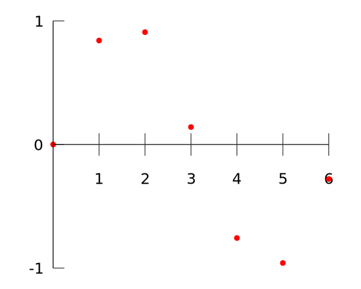
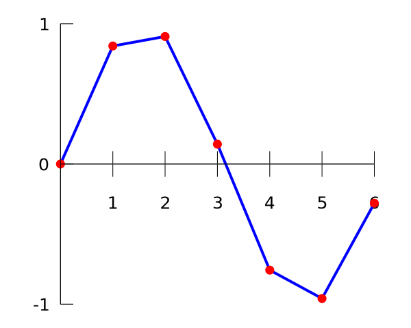
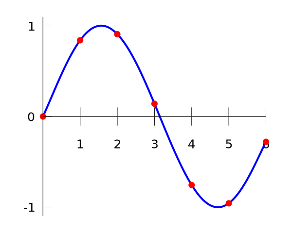

# 插值 - OI Wiki

- Source: https://oi-wiki.org/math/numerical/interp/

# 插值

## 引入

插值是一种通过已知的、离散的数据点推算一定范围内的新数据点的方法．插值法常用于函数拟合中．

例如对数据点：

𝑥x| 00| 11| 22| 33| 44| 55| 66  
---|---|---|---|---|---|---|---  
𝑓(𝑥)f(x)| 00| 0.84150.8415| 0.90930.9093| 0.14110.1411| −0.7568−0.7568| −0.9589−0.9589| −0.2794−0.2794  
  


其中 𝑓(𝑥)f(x) 未知，插值法可以通过按一定形式拟合 𝑓(𝑥)f(x) 的方式估算未知的数据点．

例如，我们可以用分段线性函数拟合 𝑓(𝑥)f(x)：



这种插值方式叫做 [线性插值](https://en.wikipedia.org/wiki/Linear_interpolation)．

我们也可以用多项式拟合 𝑓(𝑥)f(x)：



这种插值方式叫做 [多项式插值](https://en.wikipedia.org/wiki/Polynomial_interpolation)．

多项式插值的一般形式如下：

多项式插值

对已知的 𝑛 +1n+1 的点 (𝑥0,𝑦0),(𝑥1,𝑦1),…,(𝑥𝑛,𝑦𝑛)(x0,y0),(x1,y1),…,(xn,yn)，求形如 𝑓(𝑥) =∑𝑛𝑖=0𝑎𝑖𝑥𝑖f(x)=∑i=0naixi 且满足

𝑓(𝑥𝑖)=𝑦𝑖,∀𝑖=0,1,…,𝑛f(xi)=yi,∀i=0,1,…,n

的多项式 𝑓(𝑥)f(x)．

下面介绍多项式插值中的两种方式：Lagrange 插值法与 Newton 插值法．不难证明这两种方法得到的结果是相等的．

## Lagrange 插值法

由于要求构造一个函数 𝑓(𝑥)f(x) 过点 𝑃1(𝑥1,𝑦1),𝑃2(𝑥2,𝑦2),⋯,𝑃𝑛(𝑥𝑛,𝑦𝑛)P1(x1,y1),P2(x2,y2),⋯,Pn(xn,yn). 首先设第 𝑖i 个点在 𝑥x 轴上的投影为 𝑃′𝑖(𝑥𝑖,0)Pi′(xi,0).

考虑构造 𝑛n 个函数 𝑓1(𝑥),𝑓2(𝑥),⋯,𝑓𝑛(𝑥)f1(x),f2(x),⋯,fn(x)，使得对于第 𝑖i 个函数 𝑓𝑖(𝑥)fi(x)，其图像过 {𝑃′𝑗(𝑥𝑗,0),(𝑗≠𝑖)𝑃𝑖(𝑥𝑖,𝑦𝑖){Pj′(xj,0),(j≠i)Pi(xi,yi)，则可知题目所求的函数 𝑓(𝑥) =𝑛∑𝑖=1𝑓𝑖(𝑥)f(x)=∑i=1nfi(x).

那么可以设 𝑓𝑖(𝑥) =𝑎 ⋅∏𝑗≠𝑖(𝑥 −𝑥𝑗)fi(x)=a⋅∏j≠i(x−xj)，将点 𝑃𝑖(𝑥𝑖,𝑦𝑖)Pi(xi,yi) 代入可以知道 𝑎 =𝑦𝑖∏𝑗≠𝑖(𝑥𝑖−𝑥𝑗)a=yi∏j≠i(xi−xj)，所以

𝑓𝑖(𝑥)=𝑦𝑖⋅∏𝑗≠𝑖(𝑥−𝑥𝑗)∏𝑗≠𝑖(𝑥𝑖−𝑥𝑗)=𝑦𝑖⋅∏𝑗≠𝑖𝑥−𝑥𝑗𝑥𝑖−𝑥𝑗fi(x)=yi⋅∏j≠i(x−xj)∏j≠i(xi−xj)=yi⋅∏j≠ix−xjxi−xj

那么我们就可以得出 Lagrange 插值的形式为：

𝑓(𝑥)=𝑛∑𝑖=1𝑦𝑖⋅∏𝑗≠𝑖𝑥−𝑥𝑗𝑥𝑖−𝑥𝑗f(x)=∑i=1nyi⋅∏j≠ix−xjxi−xj

朴素实现的时间复杂度为 𝑂(𝑛2)O(n2)，可以优化到 𝑂(𝑛log2⁡𝑛)O(nlog2⁡n)，参见 [多项式快速插值](../../poly/multipoint-eval-interpolation/#多项式的快速插值)．

[Luogu P4781【模板】拉格朗日插值](https://www.luogu.com.cn/problem/P4781)

给出 𝑛n 个点对 (𝑥𝑖,𝑦𝑖)(xi,yi) 和 𝑘k，且 ∀𝑖,𝑗∀i,j 有 𝑖 ≠𝑗 ⟺ 𝑥𝑖 ≠𝑥𝑗i≠j⟺xi≠xj 且 𝑓(𝑥𝑖) ≡𝑦𝑖(mod998244353)f(xi)≡yi(mod998244353) 和 deg⁡(𝑓(𝑥)) <𝑛deg⁡(f(x))<n（定义 deg⁡(0) = −∞deg⁡(0)=−∞），求 𝑓(𝑘)mod998244353f(k)mod998244353.

题解

本题中只用求出 𝑓(𝑘)f(k) 的值，所以在计算上式的过程中直接将 𝑘k 代入即可；有时候则需要进行多次求值等等更为复杂的操作，这时候需要求出 𝑓f 的各项系数．代码给出了一种求出系数的实现．

𝑓(𝑘)=𝑛∑𝑖=1𝑦𝑖∏𝑗≠𝑖𝑘−𝑥𝑗𝑥𝑖−𝑥𝑗f(k)=∑i=1nyi∏j≠ik−xjxi−xj

本题中，还需要求解逆元．如果先分别计算出分子和分母，再将分子乘进分母的逆元，累加进最后的答案，时间复杂度的瓶颈就不会在求逆元上，时间复杂度为 𝑂(𝑛2)O(n2)．

因为在固定模 998244353998244353 意义下运算，计算乘法逆元的时间复杂度我们在这里暂且认为是常数时间．

代码实现

```text 1 2 3 4 5 6 7 8 9 10 11 12 13 14 15 16 17 18 19 20 21 22 23 24 25 26 27 28 29 30 31 32 33 34 35 36 37 38 39 40 41 42 43 44 45 46 47 48 49 50 51 52 53 54 55 56 57 58 59 60 ``` |  ```text #include <iostream> #include <vector> constexpr int MOD = 998244353 ; using LL = long long ; int inv ( int k ) { int res = 1 ; for ( int e = MOD \- 2 ; e ; e /= 2 ) { if ( e & 1 ) res = ( LL ) res * k % MOD ; k = ( LL ) k * k % MOD ; } return res ; } // 返回 f 满足 f(x_i) = y_i // 不考虑乘法逆元的时间，显然为 O(n^2) std :: vector < int > lagrange_interpolation ( const std :: vector < int > & x , const std :: vector < int > & y ) { const int n = x . size (); std :: vector < int > M ( n \+ 1 ), px ( n , 1 ), f ( n ); M [ 0 ] = 1 ; // 求出 M(x) = prod_(i=0..n-1)(x - x_i) for ( int i = 0 ; i < n ; ++ i ) { for ( int j = i ; j >= 0 ; \-- j ) { M [ j \+ 1 ] = ( M [ j ] \+ M [ j \+ 1 ]) % MOD ; M [ j ] = ( LL ) M [ j ] * ( MOD \- x [ i ]) % MOD ; } } // 求出 px_i = prod_(j=0..n-1, j!=i) (x_i - x_j) for ( int i = 0 ; i < n ; ++ i ) { for ( int j = 0 ; j < n ; ++ j ) if ( i != j ) { px [ i ] = ( LL ) px [ i ] * ( x [ i ] \- x [ j ] \+ MOD ) % MOD ; } } // 组合出 f(x) = sum_(i=0..n-1)(y_i / px_i)(M(x) / (x - x_i)) for ( int i = 0 ; i < n ; ++ i ) { LL t = ( LL ) y [ i ] * inv ( px [ i ]) % MOD , k = M [ n ]; for ( int j = n \- 1 ; j >= 0 ; \-- j ) { f [ j ] = ( f [ j ] \+ k * t ) % MOD ; k = ( M [ j ] \+ k * x [ i ]) % MOD ; } } return f ; } int main () { std :: ios :: sync_with_stdio ( false ); std :: cin . tie ( nullptr ); int n , k ; std :: cin >> n >> k ; std :: vector < int > x ( n ), y ( n ); for ( int i = 0 ; i < n ; ++ i ) std :: cin >> x [ i ] >> y [ i ]; const auto f = lagrange_interpolation ( x , y ); int v = 0 ; for ( int i = n \- 1 ; i >= 0 ; \-- i ) v = (( LL ) v * k \+ f [ i ]) % MOD ; std :: cout << v << '\n' ; return 0 ; } ```   
---|---  
  
### 横坐标是连续整数的 Lagrange 插值

如果已知点的横坐标是连续整数，我们可以做到 𝑂(𝑛)O(n) 插值．

设要求的多项式为 𝑓(𝑥)f(x)，我们已知 𝑓(1),⋯,𝑓(𝑛 +1)f(1),⋯,f(n+1)（1 ≤𝑖 ≤𝑛 +11≤i≤n+1），考虑代入上面的插值公式：

𝑓(𝑥)=𝑛+1∑𝑖=1𝑦𝑖∏𝑗≠𝑖𝑥−𝑥𝑗𝑥𝑖−𝑥𝑗=𝑛+1∑𝑖=1𝑦𝑖∏𝑗≠𝑖𝑥−𝑗𝑖−𝑗f(x)=∑i=1n+1yi∏j≠ix−xjxi−xj=∑i=1n+1yi∏j≠ix−ji−j

后面的累乘可以分子分母分别考虑，不难得到分子为：

𝑛+1∏𝑗=1(𝑥−𝑗)𝑥−𝑖∏j=1n+1(x−j)x−i

分母的 𝑖 −𝑗i−j 累乘可以拆成两段阶乘来算：

(−1)𝑛+1−𝑖⋅(𝑖−1)!⋅(𝑛+1−𝑖)!(−1)n+1−i⋅(i−1)!⋅(n+1−i)!

于是横坐标为 1,⋯,𝑛 +11,⋯,n+1 的插值公式：

𝑓(𝑥)=𝑛+1∑𝑖=1(−1)𝑛+1−𝑖𝑦𝑖⋅𝑛+1∏𝑗=1(𝑥−𝑗)(𝑖−1)!(𝑛+1−𝑖)!(𝑥−𝑖)f(x)=∑i=1n+1(−1)n+1−iyi⋅∏j=1n+1(x−j)(i−1)!(n+1−i)!(x−i)

预处理 (𝑥 −𝑖)(x−i) 前后缀积、阶乘阶乘逆，然后代入这个式子，复杂度为 𝑂(𝑛)O(n).

例题 [CF622F The Sum of the k-th Powers](https://codeforces.com/contest/622/problem/F)

给出 𝑛,𝑘n,k，求 𝑛∑𝑖=1𝑖𝑘∑i=1nik 对 109 +7109+7 取模的值．

题解

本题中，答案是一个 𝑘 +1k+1 次多项式，因此我们可以线性筛出 1𝑖,⋯,(𝑘 +2)𝑖1i,⋯,(k+2)i 的值然后进行 𝑂(𝑛)O(n) 插值．

也可以通过组合数学相关知识由差分法的公式推得下式：

𝑓(𝑥)=𝑛+1∑𝑖=1(𝑥−1𝑖−1)𝑖∑𝑗=1(−1)𝑖+𝑗(𝑖−1𝑗−1)𝑦𝑗=𝑛+1∑𝑖=1𝑦𝑖⋅𝑛+1∏𝑗=1(𝑥−𝑗)(𝑥−𝑖)⋅(−1)𝑛+1−𝑖⋅(𝑖−1)!⋅(𝑛+1−𝑖)!f(x)=∑i=1n+1(x−1i−1)∑j=1i(−1)i+j(i−1j−1)yj=∑i=1n+1yi⋅∏j=1n+1(x−j)(x−i)⋅(−1)n+1−i⋅(i−1)!⋅(n+1−i)! 代码实现

```text 1 2 3 4 5 6 7 8 9 10 11 12 13 14 15 16 17 18 19 20 21 22 23 24 25 26 27 28 29 30 31 32 33 34 35 36 37 38 39 40 41 42 43 44 45 46 47 48 49 50 51 52 53 ``` |  ```text // By: Luogu@rui_er(122461) #include <iostream> using namespace std ; constexpr int N = 1e6 \+ 5 , mod = 1e9 \+ 7 ; int n , k , tab [ N ], p [ N ], pcnt , f [ N ], pre [ N ], suf [ N ], fac [ N ], inv [ N ], ans ; int qpow ( int x , int y ) { int ans = 1 ; for (; y ; y >>= 1 , x = 1L L * x * x % mod ) if ( y & 1 ) ans = 1L L * ans * x % mod ; return ans ; } void sieve ( int lim ) { f [ 1 ] = 1 ; for ( int i = 2 ; i <= lim ; i ++ ) { if ( ! tab [ i ]) { p [ ++ pcnt ] = i ; f [ i ] = qpow ( i , k ); } for ( int j = 1 ; j <= pcnt && 1L L * i * p [ j ] <= lim ; j ++ ) { tab [ i * p [ j ]] = 1 ; f [ i * p [ j ]] = 1L L * f [ i ] * f [ p [ j ]] % mod ; if ( ! ( i % p [ j ])) break ; } } for ( int i = 2 ; i <= lim ; i ++ ) f [ i ] = ( f [ i \- 1 ] \+ f [ i ]) % mod ; } int main () { cin . tie ( nullptr ) -> sync_with_stdio ( false ); cin >> n >> k ; sieve ( k \+ 2 ); if ( n <= k \+ 2 ) return cout << f [ n ], 0 ; pre [ 0 ] = suf [ k \+ 3 ] = 1 ; for ( int i = 1 ; i <= k \+ 2 ; i ++ ) pre [ i ] = 1L L * pre [ i \- 1 ] * ( n \- i ) % mod ; for ( int i = k \+ 2 ; i >= 1 ; i \-- ) suf [ i ] = 1L L * suf [ i \+ 1 ] * ( n \- i ) % mod ; fac [ 0 ] = inv [ 0 ] = fac [ 1 ] = inv [ 1 ] = 1 ; for ( int i = 2 ; i <= k \+ 2 ; i ++ ) { fac [ i ] = 1L L * fac [ i \- 1 ] * i % mod ; inv [ i ] = 1L L * ( mod \- mod / i ) * inv [ mod % i ] % mod ; } for ( int i = 2 ; i <= k \+ 2 ; i ++ ) inv [ i ] = 1L L * inv [ i \- 1 ] * inv [ i ] % mod ; for ( int i = 1 ; i <= k \+ 2 ; i ++ ) { int P = 1L L * pre [ i \- 1 ] * suf [ i \+ 1 ] % mod ; int Q = 1L L * inv [ i \- 1 ] * inv [ k \+ 2 \- i ] % mod ; int mul = (( k \+ 2 \- i ) & 1 ) ? -1 : 1 ; ans = ( ans \+ 1L L * ( Q * mul \+ mod ) % mod * P % mod * f [ i ] % mod ) % mod ; } cout << ans << '\n' ; return 0 ; } ```   
---|---  
  
## Newton 插值法

Newton 插值法是基于高阶差分来插值的方法，优点是支持 𝑂(𝑛)O(n) 插入新数据点．

为了实现 𝑂(𝑛)O(n) 插入新数据点，我们令：

𝑓(𝑥)=𝑛∑𝑗=0𝑎𝑗𝑛𝑗(𝑥)f(x)=∑j=0najnj(x)

其中 𝑛𝑗(𝑥) :=∏𝑗−1𝑖=0(𝑥 −𝑥𝑖)nj(x):=∏i=0j−1(x−xi) 称为 **Newton 基** （Newton basis）．

若解出 𝑎𝑗aj，则可得到 𝑓(𝑥)f(x) 的插值多项式．我们按如下方式定义 **前向差商** （forward divided differences）：

[𝑦𝑘]:=𝑦𝑘,𝑘=0,…,𝑛,[𝑦𝑘,…,𝑦𝑘+𝑗]:=[𝑦𝑘+1,…,𝑦𝑘+𝑗]−[𝑦𝑘,…,𝑦𝑘+𝑗−1]𝑥𝑘+𝑗−𝑥𝑘,𝑘=0,…,𝑛−𝑗, 𝑗=1,…,𝑛.[yk]:=yk,k=0,…,n,[yk,…,yk+j]:=[yk+1,…,yk+j]−[yk,…,yk+j−1]xk+j−xk,k=0,…,n−j, j=1,…,n.

则：

𝑓(𝑥)=[𝑦0]+[𝑦0,𝑦1](𝑥−𝑥0)+⋯+[𝑦0,…,𝑦𝑛](𝑥−𝑥0)…(𝑥−𝑥𝑛−1)=𝑛∑𝑗=0[𝑦0,…,𝑦𝑗]𝑛𝑗(𝑥)f(x)=[y0]+[y0,y1](x−x0)+⋯+[y0,…,yn](x−x0)…(x−xn−1)=∑j=0n[y0,…,yj]nj(x)

此即 Newton 插值的形式．朴素实现的时间复杂度为 𝑂(𝑛2)O(n2).

若样本点是等距的（即 𝑥𝑖 =𝑥0 +𝑖ℎxi=x0+ih，𝑖 =1,…,𝑛i=1,…,n），我们可以推出

[𝑦𝑘,…,𝑦𝑘+𝑗]=1𝑗!ℎ𝑗Δ(𝑗)𝑦𝑘,[yk,…,yk+j]=1j!hjΔ(j)yk,

其中 Δ(𝑗)𝑦𝑘Δ(j)yk 为 **前向差分** （forward differences），定义如下：

Δ(0)𝑦𝑘:=𝑦𝑘,𝑘=0,…,𝑛,Δ(𝑗)𝑦𝑘:=Δ(𝑗−1)𝑦𝑘+1−Δ(𝑗−1)𝑦𝑘,𝑘=0,…,𝑛−𝑗, 𝑗=1,…,𝑛.Δ(0)yk:=yk,k=0,…,n,Δ(j)yk:=Δ(j−1)yk+1−Δ(j−1)yk,k=0,…,n−j, j=1,…,n.

令 𝑥 =𝑥0 +𝑠ℎx=x0+sh，则 Newton 插值的公式可化为

𝑓(𝑥)=𝑛∑𝑗=0(𝑠𝑗)𝑗!ℎ𝑗[𝑦0,…,𝑦𝑗]=𝑛∑𝑗=0(𝑠𝑗)Δ(𝑗)𝑦0.f(x)=∑j=0n(sj)j!hj[y0,…,yj]=∑j=0n(sj)Δ(j)y0.代码实现（[Luogu P4781【模板】拉格朗日插值](https://www.luogu.com.cn/problem/P4781)）

```text 1 2 3 4 5 6 7 8 9 10 11 12 13 14 15 16 17 18 19 20 21 22 23 24 25 26 27 28 29 30 31 32 33 34 35 36 37 38 39 40 41 42 43 44 45 46 47 48 49 50 51 52 53 54 55 56 57 58 59 60 61 62 63 64 65 66 67 68 69 70 71 72 73 74 75 76 77 78 79 80 81 82 83 84 85 86 87 88 89 90 91 92 93 94 95 96 97 98 99 100 101 102 103 104 105 106 107 108 109 110 111 ``` |  ```text #include <cstdint> #include <iostream> #include <vector> using namespace std ; constexpr uint32_t MOD = 998244353 ; struct mint { uint32_t v_ ; mint () : v_ ( 0 ) {} mint ( int64_t v ) { int64_t x = v % ( int64_t ) MOD ; v_ = ( uint32_t )( x \+ ( x < 0 ? MOD : 0 )); } friend mint inv ( mint const & x ) { int64_t a = x . v_ , b = MOD ; if (( a %= b ) == 0 ) return 0 ; int64_t s = b , m0 = 0 ; for ( int64_t q = 0 , _ = 0 , m1 = 1 ; a ;) { _ = s \- a * ( q = s / a ); s = a ; a = _ ; _ = m0 \- m1 * q ; m0 = m1 ; m1 = _ ; } return m0 ; } mint & operator += ( mint const & r ) { if (( v_ += r . v_ ) >= MOD ) v_ -= MOD ; return * this ; } mint & operator -= ( mint const & r ) { if (( v_ -= r . v_ ) >= MOD ) v_ += MOD ; return * this ; } mint & operator *= ( mint const & r ) { v_ = ( uint32_t )(( uint64_t ) v_ * r . v_ % MOD ); return * this ; } mint & operator /= ( mint const & r ) { return * this = * this * inv ( r ); } friend mint operator \+ ( mint l , mint const & r ) { return l += r ; } friend mint operator \- ( mint l , mint const & r ) { return l -= r ; } friend mint operator * ( mint l , mint const & r ) { return l *= r ; } friend mint operator / ( mint l , mint const & r ) { return l /= r ; } }; template < class T > struct NewtonInterp { // {(x_0,y_0),...,(x_{n-1},y_{n-1})} vector < pair < T , T >> p ; // dy[r][l] = [y_l,...,y_r] vector < vector < T >> dy ; // (x-x_0)...(x-x_{n-1}) vector < T > base ; // [y_0]+...+[y_0,y_1,...,y_n](x-x_0)...(x-x_{n-1}) vector < T > poly ; void insert ( T const & x , T const & y ) { p . emplace_back ( x , y ); size_t n = p . size (); if ( n == 1 ) { base . push_back ( 1 ); } else { size_t m = base . size (); base . push_back ( 0 ); for ( size_t i = m ; i ; \-- i ) base [ i ] = base [ i \- 1 ]; base [ 0 ] = 0 ; for ( size_t i = 0 ; i < m ; ++ i ) base [ i ] = base [ i ] \- p [ n \- 2 ]. first * base [ i \+ 1 ]; } dy . emplace_back ( p . size ()); dy [ n \- 1 ][ n \- 1 ] = y ; if ( n > 1 ) { for ( size_t i = n \- 2 ; ~ i ; \-- i ) dy [ n \- 1 ][ i ] = ( dy [ n \- 2 ][ i ] \- dy [ n \- 1 ][ i \+ 1 ]) / ( p [ i ]. first \- p [ n \- 1 ]. first ); } poly . push_back ( 0 ); for ( size_t i = 0 ; i < n ; ++ i ) poly [ i ] = poly [ i ] \+ dy [ n \- 1 ][ 0 ] * base [ i ]; } T eval ( T const & x ) { T ans {}; for ( auto it = poly . rbegin (); it != poly . rend (); ++ it ) ans = ans * x \+ * it ; return ans ; } }; int main () { NewtonInterp < mint > ip ; int n , k ; cin >> n >> k ; for ( int i = 1 , x , y ; i <= n ; ++ i ) { cin >> x >> y ; ip . insert ( x , y ); } cout << ip . eval ( k ). v_ ; return 0 ; } ```   
---|---  
  
### 横坐标是连续整数的 Newton 插值

例如：求多项式 𝑓(𝑥) =∑3𝑖=0𝑎𝑖𝑥𝑖f(x)=∑i=03aixi 的系数，已知 𝑓(1)f(1) 至 𝑓(6)f(6) 的值分别为 1,5,14,30,55,911,5,14,30,55,91．

1514305591491625365791122215143055914916253657911222

第一行为 𝑓(𝑥)f(x) 的连续的前 𝑛n 项；之后的每一行为之前一行中对应的相邻两项之差．观察到，如果这样操作的次数足够多（前提是 𝑓(𝑥)f(x) 为多项式），最终总会返回一个定值．

计算出第 𝑖 −1i−1 阶差分的首项为 ∑𝑖𝑗=1( −1)𝑖+𝑗(𝑖−1𝑗−1)𝑓(𝑗)∑j=1i(−1)i+j(i−1j−1)f(j)，第 𝑖 −1i−1 阶差分的首项对 𝑓(𝑘)f(k) 的贡献为 (𝑘−1𝑖−1)(k−1i−1) 次．

𝑓(𝑘)=𝑛∑𝑖=1(𝑘−1𝑖−1)𝑖∑𝑗=1(−1)𝑖+𝑗(𝑖−1𝑗−1)𝑓(𝑗)f(k)=∑i=1n(k−1i−1)∑j=1i(−1)i+j(i−1j−1)f(j)

时间复杂度为 𝑂(𝑛2)O(n2).

## C++ 中的实现

自 C++ 20 起，标准库添加了 [`std::midpoint`](https://en.cppreference.com/w/cpp/numeric/midpoint) 和 [`std::lerp`](https://en.cppreference.com/w/cpp/numeric/lerp) 函数，分别用于求中点和线性插值．

## 习题

  * [「NOIP2020」微信步数](https://loj.ac/p/3389)
  * [「联合省选 2022」填树](https://loj.ac/p/3701)
  * [「NOI2019」机器人](https://loj.ac/p/3157)

## 参考资料

  1. [Interpolation - Wikipedia](https://en.wikipedia.org/wiki/Interpolation)
  2. [Newton polynomial - Wikipedia](https://en.wikipedia.org/wiki/Newton_polynomial)

* * *

>  __本页面最近更新： 2026/1/7 08:56:54，[更新历史](https://github.com/OI-wiki/OI-wiki/commits/master/docs/math/numerical/interp.md)  
>  __发现错误？想一起完善？[在 GitHub 上编辑此页！](https://oi-wiki.org/edit-landing/?ref=/math/numerical/interp.md "edit.link.title")  
>  __本页面贡献者：[Tiphereth-A](https://github.com/Tiphereth-A), [c-forrest](https://github.com/c-forrest), [caibyte](https://github.com/caibyte), [Watersail2005](https://github.com/Watersail2005), [AtomAlpaca](https://github.com/AtomAlpaca), [billchenchina](https://github.com/billchenchina), [Chrogeek](https://github.com/Chrogeek), [Early0v0](https://github.com/Early0v0), [EndlessCheng](https://github.com/EndlessCheng), [Enter-tainer](https://github.com/Enter-tainer), [Ghastlcon](https://github.com/Ghastlcon), [Henry-ZHR](https://github.com/Henry-ZHR), [hly1204](https://github.com/hly1204), [hsfzLZH1](https://github.com/hsfzLZH1), [Ir1d](https://github.com/Ir1d), [kenlig](https://github.com/kenlig), [Marcythm](https://github.com/Marcythm), [megakite](https://github.com/megakite), [Peanut-Tang](https://github.com/Peanut-Tang), [qwqAutomaton](https://github.com/qwqAutomaton), [qz-cqy](https://github.com/qz-cqy), [StudyingFather](https://github.com/StudyingFather), [swift-zym](https://github.com/swift-zym), [swiftqwq](https://github.com/swiftqwq), [TrisolarisHD](https://github.com/TrisolarisHD), [x4Cx58x54](https://github.com/x4Cx58x54), [Xeonacid](https://github.com/Xeonacid), [xiaopangfeiyu](https://github.com/xiaopangfeiyu), [YanWQ-monad](https://github.com/YanWQ-monad)  
>  __本页面的全部内容在**[CC BY-SA 4.0](https://creativecommons.org/licenses/by-sa/4.0/deed.zh) 和 [SATA](https://github.com/zTrix/sata-license)** 协议之条款下提供，附加条款亦可能应用
