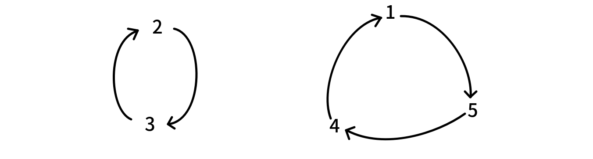
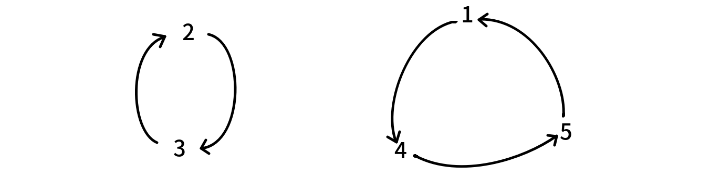

# 指数生成函数 - OI Wiki

- Source: https://oi-wiki.org/math/poly/egf/

# 指数生成函数

序列 𝑎a 的指数生成函数（exponential generating function，EGF）定义为形式幂级数：

ˆ𝐹(𝑥)=∑𝑛𝑎𝑛𝑥𝑛𝑛!F^(x)=∑nanxnn!

## 基本运算

指数生成函数的加减法与普通生成函数是相同的，也就是对应项系数相加．

考虑指数生成函数的乘法运算．对于两个序列 𝑎,𝑏a,b，设它们的指数生成函数分别为 ˆ𝐹(𝑥),ˆ𝐺(𝑥)F^(x),G^(x)，那么

ˆ𝐹(𝑥)ˆ𝐺(𝑥)=∑𝑖≥0𝑎𝑖𝑥𝑖𝑖!∑𝑗≥0𝑏𝑗𝑥𝑗𝑗!=∑𝑛≥0𝑥𝑛𝑛∑𝑖=0𝑎𝑖𝑏𝑛−𝑖1𝑖!(𝑛−𝑖)!=∑𝑛≥0𝑥𝑛𝑛!𝑛∑𝑖=0(𝑛𝑖)𝑎𝑖𝑏𝑛−𝑖F^(x)G^(x)=∑i≥0aixii!∑j≥0bjxjj!=∑n≥0xn∑i=0naibn−i1i!(n−i)!=∑n≥0xnn!∑i=0n(ni)aibn−i

因此 ˆ𝐹(𝑥)ˆ𝐺(𝑥)F^(x)G^(x) 是序列

⟨𝑛∑𝑖=0(𝑛𝑖)𝑎𝑖𝑏𝑛−𝑖⟩⟨∑i=0n(ni)aibn−i⟩

的指数生成函数．

## 封闭形式

我们同样考虑指数生成函数的封闭形式．

序列 ⟨1,1,1,⋯⟩⟨1,1,1,⋯⟩ 的指数生成函数是：

ˆ𝐹(𝑥)=∑𝑛≥0𝑥𝑛𝑛!=e𝑥F^(x)=∑n≥0xnn!=ex

因为你将 e𝑥ex 在 𝑥 =0x=0 处泰勒展开就得到了它的无穷级数形式．

类似地，等比数列 ⟨1,𝑝,𝑝2,⋯⟩⟨1,p,p2,⋯⟩ 的指数生成函数是：

ˆ𝐹(𝑥)=∑𝑛≥0𝑝𝑛𝑥𝑛𝑛!=e𝑝𝑥F^(x)=∑n≥0pnxnn!=epx

## 指数生成函数与普通生成函数

如何理解指数生成函数？我们定义序列 𝑎a 的指数生成函数是：

𝐹(𝑥)=∑𝑛≥0𝑎𝑛𝑥𝑛𝑛!F(x)=∑n≥0anxnn!

但 𝐹(𝑥)F(x) 实际上也是序列 ⟨𝑎𝑛𝑛!⟩⟨ann!⟩ 的普通生成函数．

这两种理解没有任何问题．也就是说，不同的生成函数只是对问题理解方式的转变．

## EGF 中多项式 exp 的组合意义

如果您还没有学习多项式 exp 请先跳过这里，这是由 exp 理解引出的意义，从某种意义上来说可以加深对 EGF 的理解．

EGF 中 𝑓𝑛(𝑥)fn(x) 的 𝑓f 默认是一个 EGF，那么我们首先考虑任意两个 EGF 的乘积

ˆ𝐻(𝑥)=ˆ𝐹(𝑥)ˆ𝐺(𝑥)=∑𝑛≥0[𝑛∑𝑖=0(𝑛𝑖)𝑓𝑖𝑔𝑛−𝑖]𝑥𝑛𝑛!H^(x)=F^(x)G^(x)=∑n≥0[∑i=0n(ni)fign−i]xnn!

对于两个 EGF 相乘得到的 [𝑥𝑘]ˆ𝐻(𝑥)[xk]H^(x)，实际上是一个卷积．而如果考虑多个 EGF 相乘得到的 [𝑥𝑘]ˆ𝐻(𝑥)[xk]H^(x)，实际上就是对每个 EGF 选择一项 𝑥𝑎𝑖xai 使得 ∑𝑖𝑎𝑖 =𝑘∑iai=k 时每种情况系数的和． 从集合的角度来理解就是把 𝑛n 个有标号元素划分为 𝑘 >0k>0 个有标号集合的方案数．

> 如果 𝑘 =0k=0 则系数显然为原 EGF 各项常数的积，但是多项式 expexp 中某些要求导致 expexp 的 𝑓(𝑥)f(x) 常数项必须为 00，具体的原因在下文中会做出一些说明．

多项式系数定义（具体请参考排列组合一栏中的多项式系数组合意义）里是默认集合有序的，但是 exp⁡(𝑓(𝑥))exp⁡(f(x)) 中 𝑓𝑘(𝑥)fk(x)，𝑘k 个 𝑓(𝑥)f(x) 相乘得到的 EGF 相同，而集合划分显然是无序的，因此其系数应该乘上 1𝑘!1k!．

设 𝐹𝑘(𝑛)Fk(n) 为 𝑛n 个有标号元素划分成 𝑘k 个非空无序集合（因为是 expexp 所以有非空要求）的情况，𝑓𝑖fi 为 𝑖i 个元素组成一个集合时，𝑖i 个元素的有限集上特定组合结构的数量（是原有的 EGF，对这一个集合元素计数的方案，仅仅与该集合大小有关），那么 𝐹𝑘(𝑛)Fk(n)

𝐹𝑘(𝑛)=𝑛!𝑘!∑∑𝑘𝑖𝑎𝑖=𝑛𝑘∏𝑗=1𝑓𝑎𝑗𝑎𝑗!Fk(n)=n!k!∑∑ikai=n∏j=1kfajaj!

设 𝑓𝑛fn 的 EGF 为 ˆ𝐹(𝑥)F^(x)，即：

ˆ𝐹(𝑥)=∑𝑛≥0𝑓𝑛𝑥𝑛𝑛!F^(x)=∑n≥0fnxnn!

设 𝐹𝑘(𝑛)Fk(n) 的 EGF 为 𝐺𝑘(𝑥)Gk(x)，则：

𝐺𝑘(𝑥)=∑𝑛≥0𝐹𝑘(𝑛)𝑥𝑛𝑛!=∑𝑛≥0𝑥𝑛1𝑘!∑∑𝑘𝑖𝑎𝑖=𝑛𝑘∏𝑗=1𝑓𝑎𝑗𝑎𝑗!=1𝑘!∑𝑛≥0∑∑𝑘𝑖𝑎𝑖=𝑛𝑘∏𝑗=1𝑓𝑎𝑗𝑥𝑎𝑗𝑎𝑗!=1𝑘!ˆ𝐹𝑘(𝑥)Gk(x)=∑n≥0Fk(n)xnn!=∑n≥0xn1k!∑∑ikai=n∏j=1kfajaj!=1k!∑n≥0∑∑ikai=n∏j=1kfajxajaj!=1k!F^k(x)

对于所有的 𝑘 ≥0k≥0：

∑𝑘≥0𝐺𝑘(𝑥)=∑𝑘≥0ˆ𝐹𝑘(𝑥)𝑘!=exp⁡ˆ𝐹(𝑥)∑k≥0Gk(x)=∑k≥0F^k(x)k!=exp⁡F^(x)

上面是从组合角度直接列式理解，我们也可以从递推方面来证明 exp⁡(𝑓(𝑥))exp⁡(f(x)) 和 𝑓(𝑥)f(x) 两者间的关系．

同样设 𝐹𝑘(𝑛)Fk(n) 为 𝑛n 个有标号元素划分成 𝑘k 个非空集合（无标号）的情况，𝑔𝑖gi 为 𝑖i 个元素组成一个集合内部的方案数（意义同上文中的 𝑓𝑖fi），并令 𝐺(𝑥)G(x) 为 {𝑔𝑖}{gi} 的 EGF，𝐻𝑘(𝑥)Hk(x) 为 {𝐹𝑘(𝑛)}{Fk(n)} 的 EGF．

𝑛n 个元素中取出 𝑖i 个元素作为一个单独划分出去的集合共有 𝑔𝑖gi 种方案，剩下的 𝑛 −𝑖n−i 个元素构成 𝑘 −1k−1 个集合共 𝐹𝑘−1(𝑛 −𝑖)Fk−1(n−i) 种方案，但最后的划分方案中，一个方案里的每个集合都会被枚举为单独划分出去的集合，所以重复计算了 𝑘k 次，故还需要除以 𝑘k．

𝐻𝑘(𝑥)=∑𝑛≥0𝑥𝑛𝑛!𝐹𝑘(𝑛)=∑𝑛≥0𝑥𝑛𝑛!𝑛−𝑘+1∑𝑖=1(𝑛𝑖)𝐹𝑘−1(𝑛−𝑖)×𝑔𝑖×1𝑘=1𝑘∑𝑛≥0𝑥𝑛𝑛!𝑛∑𝑖=0(𝑛𝑖)𝐹𝑘−1(𝑛−𝑖)×𝑔𝑖=1𝑘⋅𝐻𝑘−1(𝑥)𝐺(𝑥)Hk(x)=∑n≥0xnn!Fk(n)=∑n≥0xnn!∑i=1n−k+1(ni)Fk−1(n−i)×gi×1k=1k∑n≥0xnn!∑i=0n(ni)Fk−1(n−i)×gi=1k⋅Hk−1(x)G(x)

上界是由非空集合划分推出的 𝑛 −(𝑘 −1) ≥𝑖n−(k−1)≥i（前 𝑘 −1k−1 个集合每个集合最少有一个元素），但是如果超过枚举上界涉及的 𝐹𝑘−1(𝑛 −𝑖)Fk−1(n−i) 设为 00，那么就没有影响．

得到递推式之后可递归展开，边界为 𝑘 =1k=1 时 𝐻1(𝑥) =𝐺(𝑥)H1(x)=G(x)．

𝐻𝑘(𝑥)=1𝑘⋅𝐻𝑘−1(𝑥)𝐺(𝑥)=1𝑘⋅1𝑘−1⋅𝐻𝑘−2(𝑥)𝐺2(𝑥)=⋯=1𝑘⋅1𝑘−1⋯12⋅𝐻1(𝑥)𝐺𝑘−1(𝑥)=1𝑘!𝐺𝑘(𝑥)Hk(x)=1k⋅Hk−1(x)G(x)=1k⋅1k−1⋅Hk−2(x)G2(x)=⋯=1k⋅1k−1⋯12⋅H1(x)Gk−1(x)=1k!Gk(x)

同样的有：

∑𝑘≥0𝐻𝑘(𝑥)=∑𝑘≥0𝐺𝑘(𝑥)𝑘!=exp⁡𝐺(𝑥)∑k≥0Hk(x)=∑k≥0Gk(x)k!=exp⁡G(x)

显然 **定义成划分为非空集合** （𝑔0 =0g0=0）是符合本身的意义的，如果 **包含空集** （𝑔0 =1g0=1），那么对应 [𝑥𝑛]𝐺𝑘[xn]Gk 中就会有 [𝑥𝑛]𝐺𝑦,𝑦 >𝑘[xn]Gy,y>k 的贡献（在至少一个 𝐺G 中选择常数项），有计重，得不到所求量．

从递推式的角度讲，多个 EGF 的乘积也可以看作一个类似于背包的组合（合并两组计数对象的过程）．

总结多项式 expexp 的意义就是：**有标号元素构成的集合的生成集族有多少种情况** ，或划分为任意个非空子集的总方案数．

## 排列与圆排列

长度为 𝑛n 的排列数的指数生成函数是

ˆ𝑃(𝑥)=∑𝑛≥0𝑛!𝑥𝑛𝑛!=∑𝑛≥0𝑥𝑛=11−𝑥P^(x)=∑n≥0n!xnn!=∑n≥0xn=11−x

圆排列的定义是把 1,2,⋯,𝑛1,2,⋯,n 排成一个环的方案数．也就是说旋转后的方案的等价的（但翻转是不等价的）．

𝑛n 个数的圆排列数显然是 (𝑛 −1)!(n−1)!．因此 𝑛n 个数的圆排列数的指数生成函数是

ˆ𝑄(𝑥)=∑𝑛≥1(𝑛−1)!𝑥𝑛𝑛!=∑𝑛≥1𝑥𝑛𝑛=−ln⁡(1−𝑥)=ln⁡(11−𝑥)Q^(x)=∑n≥1(n−1)!xnn!=∑n≥1xnn=−ln⁡(1−x)=ln⁡(11−x)

也就是说 exp⁡ˆ𝑄(𝑥) =ˆ𝑃(𝑥)exp⁡Q^(x)=P^(x)．但这只是数学层面的推导．我们该怎样直观理解：圆排列数的 EGF 的 expexp 是排列数的 EGF？

一个排列，是由若干个置换环构成的．例如 𝑝 =[4,3,2,5,1]p=[4,3,2,5,1] 有两个置换环：

（也就是说我们从 𝑝𝑖pi 向 𝑖i 连有向边）

而不同的置换环，会导出不同的排列．例如将第二个置换环改成

那么它对应的排列就是 [5,3,2,1,4][5,3,2,1,4]．

也就是说，长度为 𝑛n 的排列的方案数是

  1. 把 1,2,⋯,𝑛1,2,⋯,n 分成若干个集合
  2. 每个集合形成一个置换环

的方案数．而一个集合的数形成置换环的方案数显然就是这个集合大小的圆排列方案数．因此长度为 𝑛n 的排列的方案数就是：把 1,2,⋯,𝑛1,2,⋯,n 分成若干个集合，每个集合的圆排列方案数之积．

这就是多项式 expexp 的直观理解．

推广之

  * 如果 𝑛n 个点 **带标号** 生成树的 EGF 是 ˆ𝐹(𝑥)F^(x)，那么 𝑛n 个点 **带标号** 生成森林的 EGF 就是 exp⁡ˆ𝐹(𝑥)exp⁡F^(x)——直观理解为，将 𝑛n 个点分成若干个集合，每个集合构成一个生成树的方案数之积．
  * 如果 𝑛n 个点带标号无向连通图的 EGF 是 ˆ𝐹(𝑥)F^(x)，那么 𝑛n 个点带标号无向图的 EGF 就是 exp⁡ˆ𝐹(𝑥)exp⁡F^(x)，后者可以很容易计算得到

exp⁡ˆ𝐹(𝑥)=∑𝑛≥02(𝑛2)𝑥𝑛𝑛!exp⁡F^(x)=∑n≥02(n2)xnn!

因此要计算前者，只需要一次多项式 lnln 即可．

接下来我们来看一些指数生成函数的应用．

## 应用

### 错排数

错排数

定义长度为 𝑛n 的一个错排是满足 𝑝𝑖 ≠𝑖pi≠i 的排列．

求错排数的指数生成函数．

从置换环的角度考虑，错排就是指置换环中不存在自环的排列．也就是说不存在长度为 11 的置换环．后者的指数生成函数是

∑𝑛≥2𝑥𝑛𝑛=−ln⁡(1−𝑥)−𝑥∑n≥2xnn=−ln⁡(1−x)−x

因此错排数的指数生成函数就是 exp⁡(−ln⁡(1−𝑥)−𝑥)exp⁡(−ln⁡(1−x)−x)．

### 不动点

[不动点](https://www.51nod.com/Html/Challenge/Problem.html#problemId=1728)

题意：求有多少个映射 𝑓 :{1,2,⋯,𝑛} →{1,2,⋯,𝑛}f:{1,2,⋯,n}→{1,2,⋯,n}，使得

𝑓∘𝑓∘⋯∘𝑓⏟𝑘=𝑓∘𝑓∘⋯∘𝑓⏟𝑘−1f∘f∘⋯∘f⏟k=f∘f∘⋯∘f⏟k−1

𝑛𝑘 ≤2 ×106,1 ≤𝑘 ≤3nk≤2×106,1≤k≤3．

考虑 𝑖i 向 𝑓(𝑖)f(i) 连边．相当于我们从任意一个 𝑖i 走 𝑘k 步和走 𝑘 −1k−1 步到达的是同一个点．也就是说基环树的环是自环且深度不超过 𝑘k（根结点深度为 11）．把这个基环树当成有根树是一样的．因此我们的问题转化为：𝑛n 个点带标号，深度不超过 𝑘k 的有根树森林的计数．

考虑 𝑛n 个点带标号深度不超过 𝑘k 的有根树，假设它的生成函数是：

ˆ𝐹𝑘(𝑥)=∑𝑛≥0𝑓𝑛,𝑘𝑥𝑛𝑛!Fk^(x)=∑n≥0fn,kxnn!

考虑递推求 ˆ𝐹𝑘(𝑥)Fk^(x)．深度不超过 𝑘k 的有根树，实际上就是深度不超过 𝑘 −1k−1 的若干棵有根树，把它们的根结点全部连到一个结点上去．因此

ˆ𝐹𝑘(𝑥)=𝑥exp⁡ˆ𝐹𝑘−1(𝑥)Fk^(x)=xexp⁡F^k−1(x)

那么答案的指数生成函数就是 exp⁡ˆ𝐹𝑘(𝑥)exp⁡F^k(x)．求它的第 𝑛n 项即可．

### Lust

[Lust](https://codeforces.com/contest/891/problem/E)

给你一个 𝑛n 个数的序列 𝑎1,𝑎2,⋯,𝑎𝑛a1,a2,⋯,an，和一个初值为 00 的变量 𝑠s，要求你重复以下操作 𝑘k 次：

  * 在 1,2,⋯,𝑛1,2,⋯,n 中等概率随机选择一个 𝑥x．
  * 令 𝑠s 加上 ∏𝑖≠𝑥𝑎𝑖∏i≠xai．
  * 令 𝑎𝑥ax 减一．

求 𝑘k 次操作后 𝑠s 的期望．

1 ≤𝑛 ≤5000,1 ≤𝑘 ≤109,0 ≤𝑎𝑖 ≤1091≤n≤5000,1≤k≤109,0≤ai≤109．

假设 𝑘k 次操作后 𝑎𝑖ai 减少了 𝑏𝑖bi，那么实际上

𝑠=𝑛∏𝑖=1𝑎𝑖−𝑛∏𝑖=1(𝑎𝑖−𝑏𝑖)s=∏i=1nai−∏i=1n(ai−bi)

因此实际上我们的问题转化为，求 𝑘k 次操作后 ∏𝑛𝑖=1(𝑎𝑖 −𝑏𝑖)∏i=1n(ai−bi) 的期望．

不妨考虑计算每种方案的 ∏𝑛𝑖=1(𝑎𝑖 −𝑏𝑖)∏i=1n(ai−bi) 的和，最后除以 𝑛𝑘nk．

而 𝑘k 次操作序列中，要使得 𝑖i 出现了 𝑏𝑖bi 次的方案数是

𝑘!𝑏1!𝑏2!⋯𝑏𝑛!k!b1!b2!⋯bn!

这与指数生成函数乘法的系数类似．

设 𝑎𝑗aj 的指数生成函数是

𝐹𝑗(𝑥)=∑𝑖≥0(𝑎𝑗−𝑖)𝑥𝑖𝑖!Fj(x)=∑i≥0(aj−i)xii!

那么答案就是

[𝑥𝑘]𝑛∏𝑗=1𝐹𝑗(𝑥)[xk]∏j=1nFj(x)

为了快速计算答案，我们需要将 𝐹𝑗(𝑥)Fj(x) 转化为封闭形式：

𝐹𝑗(𝑥)=∑𝑖≥0𝑎𝑗𝑥𝑖𝑖!−∑𝑖≥1𝑥𝑖(𝑖−1)!=𝑎𝑗e𝑥−𝑥e𝑥=(𝑎𝑗−𝑥)e𝑥Fj(x)=∑i≥0ajxii!−∑i≥1xi(i−1)!=ajex−xex=(aj−x)ex

因此我们得到

𝑛∏𝑗=1𝐹𝑗(𝑥)=e𝑛𝑥𝑛∏𝑗=1(𝑎𝑗−𝑥)∏j=1nFj(x)=enx∏j=1n(aj−x)

其中 ∏𝑛𝑗=1(𝑎𝑗 −𝑥)∏j=1n(aj−x) 是一个 𝑛n 次多项式，可以暴力计算出来．假设它的展开式是 ∑𝑛𝑖=0𝑐𝑖𝑥𝑖∑i=0ncixi，那么

𝑛∏𝑗=1𝐹𝑗(𝑥)=(∑𝑖≥0𝑛𝑖𝑥𝑖𝑖!)(𝑛∑𝑖=0𝑐𝑖𝑥𝑖)=∑𝑖≥0𝑖∑𝑗=0𝑐𝑗𝑥𝑗𝑛𝑖−𝑗𝑥𝑖−𝑗(𝑖−𝑗)!=∑𝑖≥0𝑥𝑖𝑖!𝑖∑𝑗=0𝑛𝑖−𝑗𝑖𝑗――𝑐𝑗∏j=1nFj(x)=(∑i≥0nixii!)(∑i=0ncixi)=∑i≥0∑j=0icjxjni−jxi−j(i−j)!=∑i≥0xii!∑j=0ini−jij―cj

计算这个多项式的 𝑥𝑘xk 项系数即可．

* * *

>  __本页面最近更新： 2026/4/23 03:45:48，[更新历史](https://github.com/OI-wiki/OI-wiki/commits/master/docs/math/poly/egf.md)  
>  __发现错误？想一起完善？[在 GitHub 上编辑此页！](https://oi-wiki.org/edit-landing/?ref=/math/poly/egf.md "edit.link.title")  
>  __本页面贡献者：[StudyingFather](https://github.com/StudyingFather), [countercurrent-time](https://github.com/countercurrent-time), [H-J-Granger](https://github.com/H-J-Granger), [NachtgeistW](https://github.com/NachtgeistW), [sshwy](https://github.com/sshwy), [Tiphereth-A](https://github.com/Tiphereth-A), [Early0v0](https://github.com/Early0v0), [Enter-tainer](https://github.com/Enter-tainer), [Great-designer](https://github.com/Great-designer), [AngelKitty](https://github.com/AngelKitty), [CCXXXI](https://github.com/CCXXXI), [cjsoft](https://github.com/cjsoft), [diauweb](https://github.com/diauweb), [ezoixx130](https://github.com/ezoixx130), [GekkaSaori](https://github.com/GekkaSaori), [Ir1d](https://github.com/Ir1d), [Konano](https://github.com/Konano), [LovelyBuggies](https://github.com/LovelyBuggies), [Makkiy](https://github.com/Makkiy), [mgt](mailto:i@margatroid.xyz), [minghu6](https://github.com/minghu6), [P-Y-Y](https://github.com/P-Y-Y), [PotassiumWings](https://github.com/PotassiumWings), [SamZhangQingChuan](https://github.com/SamZhangQingChuan), [Suyun514](mailto:suyun514@qq.com), [weiyong1024](https://github.com/weiyong1024), [alphagocc](https://github.com/alphagocc), [ComeIntoCalm](https://github.com/ComeIntoCalm), [GavinZhengOI](https://github.com/GavinZhengOI), [Gesrua](https://github.com/Gesrua), [GhostLX-AI](https://github.com/GhostLX-AI), [HeRaNO](https://github.com/HeRaNO), [kxccc](https://github.com/kxccc), [lailai0916](https://github.com/lailai0916), [lychees](https://github.com/lychees), [Peanut-Tang](https://github.com/Peanut-Tang), [r-value](https://github.com/r-value), [shuzhouliu](https://github.com/shuzhouliu), [SukkaW](https://github.com/SukkaW), [untitledunrevised](https://github.com/untitledunrevised)  
>  __本页面的全部内容在**[CC BY-SA 4.0](https://creativecommons.org/licenses/by-sa/4.0/deed.zh) 和 [SATA](https://github.com/zTrix/sata-license)** 协议之条款下提供，附加条款亦可能应用
