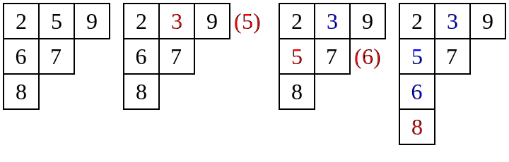

# 杨氏矩阵 - OI Wiki

- Source: https://oi-wiki.org/math/young-tableau/

# 杨氏矩阵

## 引入

**杨氏矩阵**(Young tableau)，又名杨表，是一种常用于表示论和舒伯特演算中的组合对象．

杨表是一种特殊的矩阵．它便于对称群和一般线性群的群表示和性质研究．杨表由剑桥大学数学家阿尔弗雷德·杨（Alfred Young）于 1900 年首次提出，于 1903 年被德国数学家弗罗贝尼乌斯（Ferdinand Georg Frobenius）应用于对称群的研究．

注释

**表示论** （Representation theory）是数学的一个分支．它通过将元素表示为向量空间的线性变换来研究抽象代数结构．**舒伯特演算** （Schubert calculus）是代数几何的一个分支，于 19 世纪由赫尔曼·舒伯特为了解决射影几何的计数问题而引入．

## 定义

### 杨图

**杨图** （Young diagram，使用点表示时又称 [Ferrers 图](https://en.wikipedia.org/wiki/Partition_%28number_theory%29#Ferrers_diagram)，在 [分拆数](../combinatorics/partition/#ferrers-%E5%9B%BE) 一节中有相关介绍）是一个有限的框或单元格集合，左对齐排列，行长按非递增顺序排列．如果把杨图每行的方格数列出，我们得到了一个非负整数 𝑛n（总方格数）的 **整数分拆**(integer partition)𝜆λ．因此，我们可以将杨图的形状看作 𝜆λ，因为它携带与其整数拆分相同的信息．

杨图之间的包含关系定义了整数分拆上的一个 [偏序](../order-theory/#偏序集) 关系，此关系拥有 [格](../order-theory/#有向集与格) 的结构，被称为 **杨格**(Young's lattice)．如果把杨图各列的方格数列出，则会得到整数分拆 𝜆λ 的「共轭分拆」，或「转置分拆」，它所对应到的杨图可由原本的杨图沿主对角线作镜射对称而得．

杨图每个方格的位置由分别代表 **行数** 与 **列数** 的两个座标点决定．列的顺序由左向右，行的顺序则按方格数的由多向少的方向．此处需要注意，根据习惯不同存在着两种不同的杨图画法：第一个将方格数较少的行排在方格数较多的行的下方，第二种画法将各行由大到小一层一层往上叠．由于前一种画法主要由英语国家使用，而后者通常被法语国家使用，习惯上我们分别称它们为英式画法和法式画法．

以下表格中分别为整数分拆 (5,4,1)(5,4,1) 对应的杨图不同画法：

  * 英式画法：
  * 法式画法：

### 杨表

#### 定义

**杨表** （Young tableau）是通过用取自某个字母表的符号填充杨氏图的框来获得的，这通常需要是一个全序集和．填入的元素写作 𝑥1x1,𝑥2x2,𝑥3x3,……．但为了方便起见，都直接填入正整数．

杨表最初应用于对称群的表示理论时，允许在杨图的 𝑛n 的方格中任意填入 11 到 𝑛n 中相异的正整数．但现在的研究大多使用「标准」的杨表，即上述条件中各行与各列中方格的数字皆为严格递增的．由 𝑛n 个方格的相异杨表数个数形成 [对和数](https://en.wikipedia.org/wiki/Telephone_number_%28mathematics%29)：

注释

**对和数** （involution number/telephone number）是在数学中是一个整数序列，用来计算 𝑛n 条电话线中每条线路最多可以连接到另一条线路时可以相互连接的方法个数．它还可以用来描述完全图 𝑛n 个顶点上的匹配数，𝑛n 个对合元素的排列数，Hermite 多项式系数的绝对值之和，含有 𝑛n 个格子的标准杨表的个数，以及不可约对称群的度数之和．

1,1,2,4,10,26,76,232,764,2620,9496,…1,1,2,4,10,26,76,232,764,2620,9496,…（[OEIS](https://en.wikipedia.org/wiki/On-Line_Encyclopedia_of_Integer_Sequences) 中的数列 [A000085](https://oeis.org/A000085)）

在其他应用中，杨图也可以被填入相同的数字．若填法的同列数字严格递增，且同行数字单调递增，则该杨表被称为是 **半标准的** （Semistandard Young Tableaux, 有时称为列严格）．杨表中个数字出现的次数记录下来得到的序列被视为杨表的 **权重** ．因此，标准杨表的权重必然是 (1,1,…,1)(1,1,…,1)．因为在标准杨表中，11 到 𝑛n 的每个正整数恰好各出现一次．

#### 标准杨表的插入算法

排列的性质可以由杨表直观地表现出来．**RSK 插入算法** 就提供了一个将杨表和排列联系起来的途径．它由 Robinson, Schensted 和 Knuth 提出．

令 𝑆S 是一个杨表，定义 𝑆 ←𝑥S←x 表示将 𝑥x 从第一行插入杨表中，具体如下：

  1. 在当前行中找到最小的比 𝑥x 大的数 𝑦y．
  2. 如果找到了，用 𝑥x 去替换 𝑦y，移到下一行，令 𝑥 ←𝑦x←y 重复操作 1．
  3. 如果找不到，就把 𝑥x 放在该行末尾并退出．记 𝑥x 在第 𝑠s 行第 𝑡t 列，(𝑠,𝑡)(s,t) 必定是一个边角．一个格子 (𝑠,𝑡)(s,t) 是边角当且仅当 (𝑠 +1,𝑡)(s+1,t) 和 (𝑠,𝑡 +1)(s,t+1) 都不存在格子．

例如，将 33 插入杨表 (2,5,9)(6,7)(8)(2,5,9)(6,7)(8) 的步骤为：

### 变体

非完全严格标准的杨表有许多变体（Variations）．例如行严格杨表要求同行数字严格递增，且同列数字单调递增，即列严格杨表的共轭．此外，在平面分拆（plane partitions）理论中，习惯上会将上述的定义中的递增改为递减．其他变体例如带状杨表，会先将一些方块打包成群，然后要求各群的方块必须填入相同数字．

### 斜杨表

给定两个杨图 𝜆 =(𝜆1,𝜆2…)λ=(λ1,λ2…)、𝜇 =(𝜇1,𝜇2,…)μ=(μ1,μ2,…)，满足 𝜆λ 包含 𝜇μ，即 𝜇𝑖 ≤𝜇𝑖μi≤μi 对所有 𝑖i．定义「斜杨图」𝜆/𝜇λ/μ 为 𝜆λ 中所有方格减去 𝜇μ 中的所有方格 即 𝜆λ 差集 𝜇μ．在斜杨图的各方格中填入元素就形成了 **斜杨表**(Skew tableaux)．

例如，下图为整数分拆 (5,4,1)(5,4,1) 对应的一个标准斜杨表：

同理，若满足同一列中的数字严格递增，且同一行中的数字单调递增，则该斜杨表被称作 **半标准斜杨表** ；若半标准斜杨表满足各方格不重复的填入数字 11 到 𝑛n（方格总数），则该斜杨表被称作 **标准斜杨表** ．注意，由不同的 𝜆λ 和 𝜇μ 可得到相同的 𝜆/𝜇λ/μ．虽然大部分斜杨表的性质都只依赖于取完差集的方格，但是仍然部分运算依赖于 𝜆λ 和 𝜇μ 的选取．因此，𝜆/𝜇λ/μ 必须被视为包含两个元素信息：𝜆λ 和 𝜇μ．当 𝜇μ 是空分拆（00 的唯一一种分拆）时，斜杨表 𝜆/𝜇λ/μ 就变成杨表 𝜆λ．

## 应用

杨表常用于在组合学、表示理论和代数几何中，用各种不同计算杨表个数的方法得到舒尔函数的定义及相关的恒等式．在信息学竞赛中，常有考察杨表勾长公式的题目．

### 勾长

给定一个共有 𝑛n 个方格的杨表 𝜋𝜆πλ，把 11 到 𝑛n 的 𝑛n 个数字填入杨表中，使得每行从左到右，每列从下到上都是递增的．用 𝑑𝑖𝑚𝜋𝜆dimπλ 表示可以这样填的方法个数．

对于杨表中的一个方格 𝑣v，定义其 **勾长** hook(𝑣)hook(v) 等于同行右边的方格数加上同列上面的方格数，再加 1（即方格本身）．

### 勾长公式

如果用 𝑑𝑖𝑚𝜆dimλ 表示这样的方法个数，**勾长公式** 就是方法个数等于 𝑛!n! 除以所有方格的勾长的乘积．

dim⁡𝜋𝜆=𝑛!∏𝑥∈𝑌(𝜆)hook(𝑥).dim⁡πλ=n!∏x∈Y(λ)hook(x).

所以对于整数分拆 10 =5 +4 +110=5+4+1 的杨表，如上图所示．有

dim⁡𝜋𝜆=10!7⋅5⋅4⋅3⋅1⋅5⋅3⋅2⋅1⋅1=288.dim⁡πλ=10!7⋅5⋅4⋅3⋅1⋅5⋅3⋅2⋅1⋅1=288.

种方法．

## 例题

### 子序列问题

对于杨表 𝑃P, 定义对于一个从 11 到 𝑛n 的排列 𝑋 =𝑥1,…,𝑥𝑛X=x1,…,xn．

  1. 𝑃𝑋PX 中第一行的长度即为排列 𝑋X 的 **最长上升子序列（LIS）** 长度．注意，𝑃P 的第一行并不一定是 LIS 本身，所以不能直接利用杨表性质解决「LIS 划分」之类的问题．

  2. 对于一个排列 𝑋X 和它产生的杨表 𝑃𝑋PX，若 𝑋𝑅XR 是 𝑋X 的翻转，那么 𝑋𝑅XR 产生的杨表 𝑃𝑋𝑅PXR 即为 𝑃𝑋PX 交换行列得到．

例如，对于排列 𝑋 =1,5,7,2,8,6,3,4X=1,5,7,2,8,6,3,4 和 𝑋𝑅 =4,3,6,8,2,7,5,1XR=4,3,6,8,2,7,5,1, 我们可得到如下杨表 𝑃𝑋PX:

  3. 杨表 𝑃𝑋PX 中的第一列长度即为排列 𝑋X 的 **最长下降子序列（LDS）** 长度．

定义长度不超过 𝑘k 的 𝐿𝐼𝑆/𝐿𝐷𝑆LIS/LDS 长度为 𝑘 −𝐿𝐼𝑆k−LIS 和 𝑘 −𝐿𝐷𝑆k−LDS, 此类问题我们同样可以用杨表来解决．对于 1 −𝐿𝐼𝑆1−LIS，显而易见最长的 1 −𝐿𝐼𝑆1−LIS 子序列就是该序列的 𝐿𝐷𝑆LDS，这也正是杨表的第一列；同样可得，杨表前 𝑘k 列的长度就是最长的 𝑘 −𝐿𝐼𝑆k−LIS 子序列的长度．证明如下：

对于一个排列 𝑋X 和它的 𝑚m 行杨表 𝑃P，令排列 𝑋∗X∗ 为 (𝑃𝑚,1…,𝑃𝑚,𝜆𝑚,𝑃𝑚−1,1…,𝑃1,1…𝑃1,𝜆1)(Pm,1…,Pm,λm,Pm−1,1…,P1,1…P1,λ1)（即将杨表从下往上每行依次写在后面）．那么 𝑋X 一定可以通过交换操作转化成 𝑋∗X∗．

所以，最长 𝑘 −𝐿𝐼𝑆k−LIS 子序列长度可以表示成 𝐹(𝑘) =∑𝑚𝑖=1min(𝑘,𝜆𝑖)F(k)=∑i=1mmin(k,λi)，即前 𝑘k 列的长度和．

[CTSC2017 最长上升子序列](https://uoj.ac/problem/301)

有一个长为 𝑛n 的数列 𝑏b．对于序列 𝐵𝑚 =(𝑏1,𝑏2,…,𝑏𝑚)Bm=(b1,b2,…,bm)，设 𝐶C 是 𝐵𝑚Bm 的子序列，且 𝐶C 的最长上升子序列的长度不超过 𝑘k，询问 𝐶C 的长度最大值．

解题思路

多个询问考虑使用扫描线的方法．这样我们就需要维护每个前缀的杨表．如果使用以上结论，可以发现问题变成了如何快速维护杨表前 𝑘k 列的长度之和．如果直接维护，复杂度是 𝑂(𝑛2log⁡𝑛)O(n2log⁡n) 的不能接受．考虑维护前 √𝑛n 列和前 √𝑛n 行．

可以发现，杨表一定不会完全覆盖这个 𝑊 ×𝐻W×H 的矩形．如果 𝐾 ≤𝑊K≤W，那么可以直接得答案；如果 𝐾 >𝑊K>W，那么大于 𝑊W 的部分一定在 𝐻H 行内．所以可以考虑如何同时维护前 √𝑛n 列和前 √𝑛n 行．将这个排列翻转一下就可以得到杨表的翻转，所以只需要再同时维护 −𝐴𝑖−Ai 即可，复杂度为 𝑂(𝑛√𝑛log⁡𝑛)O(nnlog⁡n)．

[BJWC2018 最长上升子序列](https://www.luogu.com.cn/problem/P4484)

现在有一个长度为 𝑛n 的随机排列，求它的最长上升子序列长度的期望．

[CF1268B 杨氏多米诺骨牌](https://codeforces.com/problemset/problem/1268/B)

给定一个具有 𝑛n 列长度 𝑎1,𝑎2,…,𝑎𝑛 (𝑎1 ≥𝑎2 ≥… ≥𝑎𝑛 ≥1)a1,a2,…,an(a1≥a2≥…≥an≥1) 的直方图．𝑎 =[3,2,2,2,1]a=[3,2,2,2,1] 的杨图．找到可以在此直方图中绘制的最大数量的非重叠多米诺骨牌（1 ×21×2 或 2 ×12×1 矩形）．

## 参考资料与拓展阅读

  1. [Young Tableau - from Wolfram MathWorld](https://mathworld.wolfram.com/YoungTableau.html)
  2. [Young tableau - Wikipedia](https://en.wikipedia.org/wiki/Young_tableau)
  3. [Hook length formula - Wikipedia](https://en.wikipedia.org/wiki/Hook_length_formula)
  4. 袁方舟，[《浅谈杨氏矩阵在信息学竞赛中的应用》IOI2019](https://github.com/OI-wiki/libs/blob/master/%E9%9B%86%E8%AE%AD%E9%98%9F%E5%8E%86%E5%B9%B4%E8%AE%BA%E6%96%87/%E5%9B%BD%E5%AE%B6%E9%9B%86%E8%AE%AD%E9%98%9F2019%E8%AE%BA%E6%96%87%E9%9B%86.pdf), 中国国家候选队论文集，202-229

* * *

>  __本页面最近更新： 2026/1/7 08:56:54，[更新历史](https://github.com/OI-wiki/OI-wiki/commits/master/docs/math/young-tableau.md)  
>  __发现错误？想一起完善？[在 GitHub 上编辑此页！](https://oi-wiki.org/edit-landing/?ref=/math/young-tableau.md "edit.link.title")  
>  __本页面贡献者：[Tiphereth-A](https://github.com/Tiphereth-A), [Xeonacid](https://github.com/Xeonacid), [aofall](https://github.com/aofall), [chenyichen0420](https://github.com/chenyichen0420), [Enter-tainer](https://github.com/Enter-tainer), [Garyyang](mailto:106256371+garyxxxx2021@users.noreply.github.com), [iamtwz](https://github.com/iamtwz), [ImpleLee](https://github.com/ImpleLee), [inco-yjl](https://github.com/inco-yjl), [Ir1d](https://github.com/Ir1d), [isdanni](https://github.com/isdanni), [Junyan721113](https://github.com/Junyan721113), [jyeric](https://github.com/jyeric), [lhhxxxxx](https://github.com/lhhxxxxx), [megakite](https://github.com/megakite)  
>  __本页面的全部内容在**[CC BY-SA 4.0](https://creativecommons.org/licenses/by-sa/4.0/deed.zh) 和 [SATA](https://github.com/zTrix/sata-license)** 协议之条款下提供，附加条款亦可能应用
