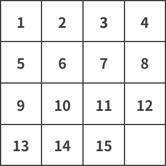

# 15-puzzle - OI Wiki

- Source: https://oi-wiki.org/misc/15-puzzle/

# 15-puzzle

## 简介

**15 - 拼图** （英文：15-puzzle, 又名 Gem Puzzle，Boss Puzzle，Game of 15，Mystic Square，N-puzzle, etc）是一个滑块类游戏（英文：sliding puzzle）．滑块方盘的长宽均为 4 ×44×4 个方块，其中 15 个位置放序号打乱的方块，剩下一个为空位．与空位同行或同列的方块可以通过水平或垂直滑动来移动．拼图的目标是按编号顺序排列方块．

15 - 拼图常见别称为 **n - 拼图** ，其中数字 𝑛n 指的是方盘中的方块总数．15 - 拼图的不同尺寸变体亦使用了类似的名称，例如 88 拼图指的是置于 3 ×33×3 方盘中的 88 个方块．但 1515 拼图也可以称为 1616 拼图，此处的 16 指的是方块容量．它的扩展问题有时也包括了 𝑛 ×𝑚n×m 的滑动方盘．

15 - 拼图是涉及 [启发式算法](../../search/heuristic/) 建模的经典问题．此问题的常见形式是 [曼哈顿距离](../../geometry/distance/#曼哈顿距离) 和错位方块的数量计算，二者都是可接受启发（英文：admissible heuristic），即它们永远不会高估剩余的移动次数，这确保了某些搜索算法（例如 [A * 算法](../../search/astar/)）的最优性．

注释

**滑块游戏** 是一类在平面上滑动方块以组成特定排列的智力游戏．常见的滑块游戏包括数字拼图、华容道和塞车时间．其中 15 - 拼图是最古老的滑块类游戏，发明者是 Noyes Chapman，该游戏风靡于 1880 年代．不像其它 tour 类的解谜游戏，滑块游戏禁止任何一个方块离开盘面，这个特性区别于重新排列类的解谜游戏．

## 定义

给定一个 4 ×44×4 的方盘，其中 1515 个方块随意排列．我们需要将它按照序号排列成下图所示的样子．移动规则为每次只能交换空方块和和其相邻一个方块的位置．常见问题为找到可解决此问题的最少步骤，计算错位方位的个数，或找出是和否能得到最终的有序排列．

## 可解性证明

Johnson & Story (1879) 证明，如果 𝑚m 和 𝑛n 都至少为 22，则逆向适用于大小为 𝑚 ×𝑛m×n 的棋盘：通过从 𝑚 =𝑛 =2m=n=2 开始对 𝑚m 和 𝑛n 进行归纳证明，所有偶数排列都是可解的．Archer (1999) 给出了另一个证明，基于通过汉密尔顿路径定义等价类．

## 算法

寻找数字滑盘游戏的一个解相对容易，但寻找 **最优解** 是一个 **NP 困难** 问题．15-Puzzle 的最优解至多有 80 步；而 8-Puzzle 的最优解至多有 31 步．

N-Puzzle 支持常见的基于图的搜索算法，如广度优先搜索和深度优先搜索，同样我们也可以用 [A * 搜索](../../search/astar/) 算法寻找最优解．启发式函数 ℎ(𝑛)h(n) 可以是

  * 放错的方块的数量．
  * 所有放错的方块到各自目标位置的欧几里得距离之和．
  * 所有放错的方块到各自目标位置的曼哈顿距离之和．

### 群理论

因为 15 块的数字推盘游戏组合可以由「3 循环」（英文：3-cycles）产生，所以可以证明 15 块的数字推盘游戏可以用交错群 𝐴15A15 表示．事实上，任何使用 2 ×𝑘 −12×k−1 块相同面积正方形方块的数字滑盘游戏皆可以以交错群 𝐴2𝑘−1A2k−1 表示．

## 习题

  * [N Puzzle](https://www.hackerrank.com/challenges/n-puzzle)
  * [A. Amity Assessment](https://codeforces.com/problemset/problem/645/A)
  * [Sliding Puzzle](https://leetcode.com/problems/sliding-puzzle/)
  * [POJ 1077 - Eight](http://poj.org/problem?id=1077)

## 参考资料与拓展阅读

  1. [15 puzzle - Wikipedia](https://en.wikipedia.org/wiki/15_puzzle)
  2. jrdnjacobson,[How to Solve the 15 Puzzle - instructables](https://www.instructables.com/How-To-Solve-The-15-Puzzle/)
  3. Korf, R. E. (2000),["Recent Progress in the Design and Analysis of Admissible Heuristic Functions"](https://www.researchgate.net/publication/2604757_Recent_Progress_in_the_Design_and_Analysis_of_Admissible_Heuristic_Functions), in Choueiry, B. Y.; Walsh, T. (eds.), Abstraction, Reformulation, and Approximation (PDF), SARA 2000. Lecture Notes in Computer Science, vol. 1864, Springer, Berlin, Heidelberg, pp. 45–55, doi:10.1007/3-540-44914-0_3, ISBN 978-3-540-67839-7, retrieved 2010-04-26
  4. [Welcome to N-Puzzle - web demo](https://tristanpenman.com/demos/n-puzzle/)

* * *

>  __本页面最近更新： 2026/1/7 08:56:54，[更新历史](https://github.com/OI-wiki/OI-wiki/commits/master/docs/misc/15-puzzle.md)  
>  __发现错误？想一起完善？[在 GitHub 上编辑此页！](https://oi-wiki.org/edit-landing/?ref=/misc/15-puzzle.md "edit.link.title")  
>  __本页面贡献者：[CCXXXI](https://github.com/CCXXXI), [Enter-tainer](https://github.com/Enter-tainer), [isdanni](https://github.com/isdanni), [myeeye](https://github.com/myeeye), [NachtgeistW](https://github.com/NachtgeistW), [Qiu-Quanzhi](https://github.com/Qiu-Quanzhi), [shuzhouliu](https://github.com/shuzhouliu), [Tiphereth-A](https://github.com/Tiphereth-A)  
>  __本页面的全部内容在**[CC BY-SA 4.0](https://creativecommons.org/licenses/by-sa/4.0/deed.zh) 和 [SATA](https://github.com/zTrix/sata-license)** 协议之条款下提供，附加条款亦可能应用
