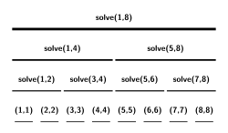

# CDQ 分治 - OI Wiki

- Source: https://oi-wiki.org/misc/cdq-divide/

# CDQ 分治

本页面将介绍 CDQ 分治．

## 简介

CDQ 分治是一种思想而不是具体的算法，与 [动态规划](../../dp/) 类似．目前这个思想的拓展十分广泛，依原理与写法的不同，大致分为三类：

  * 解决和点对有关的问题．
  * 1D 动态规划的优化与转移．
  * 通过 CDQ 分治，将一些动态问题转化为静态问题．

CDQ 分治的思想最早由 IOI2008 金牌得主陈丹琦在高中时整理并总结，它也因此得名．1

## 解决和点对有关的问题

这类问题多数类似于「给定一个长度为 𝑛n 的序列，统计有一些特性的点对 (𝑖,𝑗)(i,j) 的数量」或「给定一个长度为 𝑛n 的序列，找到一对点 (𝑖,𝑗)(i,j) 使得一些函数的值最大」．

CDQ 分治解决这类问题的算法流程如下：

  1. 找到这个序列的中点 𝑚𝑖𝑑mid；

  2. 将所有点对 (𝑖,𝑗)(i,j) 划分为 3 类：

     1. 1 ≤𝑖 ≤𝑚𝑖𝑑,1 ≤𝑗 ≤𝑚𝑖𝑑1≤i≤mid,1≤j≤mid 的点对；
     2. 1 ≤𝑖 ≤𝑚𝑖𝑑,𝑚𝑖𝑑 +1 ≤𝑗 ≤𝑛1≤i≤mid,mid+1≤j≤n 的点对；
     3. 𝑚𝑖𝑑 +1 ≤𝑖 ≤𝑛,𝑚𝑖𝑑 +1 ≤𝑗 ≤𝑛mid+1≤i≤n,mid+1≤j≤n 的点对．
  3. 将 (1,𝑛)(1,n) 这个序列拆成两个序列 (1,𝑚𝑖𝑑)(1,mid) 和 (𝑚𝑖𝑑 +1,𝑛)(mid+1,n)．此时第一类点对和第三类点对都在这两个序列之中；

  4. 递归地处理这两类点对；

  5. 设法处理第二类点对．

可以看到 CDQ 分治的思想就是不断地把点对通过递归的方式分给左右两个区间．

在实际应用时，我们通常使用一个函数 `solve(l,r)` 处理 𝑙 ≤𝑖 ≤𝑟,𝑙 ≤𝑗 ≤𝑟l≤i≤r,l≤j≤r 的点对．上述算法流程中的递归部分便是通过 `solve(l,mid)` 与 `solve(mid,r)` 来实现的．剩下的第二类点对则需要额外设计算法解决．

### 例题

[三维偏序](https://www.luogu.com.cn/problem/P3810)

给定一个序列，每个点有 𝑎𝑖,𝑏𝑖,𝑐𝑖ai,bi,ci 三个属性，试求：这个序列里有多少对点对 (𝑖,𝑗)(i,j) 满足 𝑎𝑗 ≤𝑎𝑖aj≤ai 且 𝑏𝑗 ≤𝑏𝑖bj≤bi 且 𝑐𝑗 ≤𝑐𝑖cj≤ci 且 𝑗 ≠𝑖j≠i．

解题思路

三维偏序是 CDQ 分治的经典问题．

题目要求统计序列里点对的个数，那试一下用 CDQ 分治．

首先将序列按 𝑎a 排序．

假设我们现在写好了 `solve(l,r)`，并且通过递归搞定了 `solve(l,mid)` 和 `solve(mid+1,r)`．现在我们要做的，就是统计满足 𝑙 ≤𝑖 ≤𝑚𝑖𝑑l≤i≤mid，𝑚𝑖𝑑 +1 ≤𝑗 ≤𝑟mid+1≤j≤r 的点对 (𝑖,𝑗)(i,j) 中，有多个点对还满足 𝑎𝑖 ≤𝑎𝑗ai≤aj，𝑏𝑖 ≤𝑏𝑗bi≤bj，𝑐𝑖 ≤𝑐𝑗ci≤cj 的限制条件．

稍微思考一下就会发现，那个 𝑎𝑖 ≤𝑎𝑗ai≤aj 的限制条件没啥用了：既然 𝑖i 比 𝑚𝑖𝑑mid 小，𝑗j 比 𝑚𝑖𝑑mid 大，那 𝑖i 肯定比 𝑗j 要小；已经将序列按 𝑎a 排序，就一定有 𝑎𝑖 ≤𝑎𝑗ai≤aj．现在还剩下两个限制条件：𝑏𝑖 ≤𝑏𝑗bi≤bj 与 𝑐𝑖 ≤𝑐𝑗ci≤cj．根据这个限制条件我们就可以枚举 𝑗j, 求出有多少个满足条件的 𝑖i．

为了方便枚举，我们把 (𝑙,𝑚𝑖𝑑)(l,mid) 和 (𝑚𝑖𝑑 +1,𝑟)(mid+1,r) 中的点全部按照 𝑏b 的值从小到大排个序．之后我们依次枚举每一个 𝑗j, 把所有 𝑏𝑖 ≤𝑏𝑗bi≤bj 的点 𝑖i 全部插入到某种数据结构里（这里我们选择 [树状数组](../../ds/fenwick/)）．此时只要查询树状数组里有多少个点的 𝑐c 值是小于等于 𝑐𝑗cj 的，我们就求出了对于这个点 𝑗j，有多少个 𝑖i 可以合法匹配它了．

当我们插入一个 𝑐c 值等于 𝑥x 的点时，我们就令树状数组的 𝑥x 这个位置单点加一，而查询树状数组里有多少个点小于 𝑥x 的操作实际上就是在求 [前缀和](../../basic/prefix-sum/)，只要我们事先对于所有的 𝑐c 值做了 [离散化](../discrete/)，我们的复杂度就是对的．

对于每一个 𝑗j，我们都需要将所有 𝑏𝑖 ≤𝑏𝑗bi≤bj 的点 𝑖i 插入树状数组中．由于所有的 𝑖i 和 𝑗j 都已事先按照 𝑏b 值排好序，这样的话只要以双指针的方式在树状数组里插入点，则对树状数组的插入操作就能从 𝑂(𝑛2)O(n2) 次降到 𝑂(𝑛)O(n) 次．

通过这样一个算法流程，我们就用 𝑂(𝑛log⁡𝑛)O(nlog⁡n) 的时间处理完了关于第二类点对的信息了．此时算法的时间复杂度是 𝑇(𝑛) =𝑇(⌊𝑛2⌋) +𝑇(⌈𝑛2⌉) +𝑂(𝑛log⁡𝑛) =𝑂(𝑛log2⁡𝑛)T(n)=T(⌊n2⌋)+T(⌈n2⌉)+O(nlog⁡n)=O(nlog2⁡n)．

示例代码

```text 1 2 3 4 5 6 7 8 9 10 11 12 13 14 15 16 17 18 19 20 21 22 23 24 25 26 27 28 29 30 31 32 33 34 35 36 37 38 39 40 41 42 43 44 45 46 47 48 49 50 51 52 53 54 55 56 57 58 59 60 61 62 63 64 65 66 67 68 69 70 71 72 73 74 75 76 77 78 79 80 81 82 83 84 85 86 87 88 89 90 91 92 93 94 95 96 97 98 99 100 101 102 103 104 105 ``` |  ```text #include <algorithm> #include <iostream> constexpr int MAXN = 1e5 \+ 10 ; constexpr int MAXK = 2e5 \+ 10 ; int n , k ; struct Element { int a , b , c ; int cnt ; int res ; bool operator != ( Element other ) const { if ( a != other . a ) return true ; if ( b != other . b ) return true ; if ( c != other . c ) return true ; return false ; } }; Element e [ MAXN ]; Element ue [ MAXN ]; int m , t ; int res [ MAXN ]; struct BinaryIndexedTree { int node [ MAXK ]; int lowbit ( int x ) { return x & \- x ; } void Add ( int pos , int val ) { while ( pos <= k ) { node [ pos ] += val ; pos += lowbit ( pos ); } return ; } int Ask ( int pos ) { int res = 0 ; while ( pos ) { res += node [ pos ]; pos -= lowbit ( pos ); } return res ; } } BIT ; bool cmpA ( Element x , Element y ) { if ( x . a != y . a ) return x . a < y . a ; if ( x . b != y . b ) return x . b < y . b ; return x . c < y . c ; } bool cmpB ( Element x , Element y ) { if ( x . b != y . b ) return x . b < y . b ; return x . c < y . c ; } void CDQ ( int l , int r ) { if ( l == r ) return ; int mid = ( l \+ r ) / 2 ; CDQ ( l , mid ); CDQ ( mid \+ 1 , r ); std :: sort ( ue \+ l , ue \+ mid \+ 1 , cmpB ); std :: sort ( ue \+ mid \+ 1 , ue \+ r \+ 1 , cmpB ); int i = l ; int j = mid \+ 1 ; while ( j <= r ) { while ( i <= mid && ue [ i ]. b <= ue [ j ]. b ) { BIT . Add ( ue [ i ]. c , ue [ i ]. cnt ); i ++ ; } ue [ j ]. res += BIT . Ask ( ue [ j ]. c ); j ++ ; } for ( int k = l ; k < i ; k ++ ) BIT . Add ( ue [ k ]. c , \- ue [ k ]. cnt ); return ; } using std :: cin ; using std :: cout ; int main () { cin . tie ( nullptr ) -> sync_with_stdio ( false ); cin >> n >> k ; for ( int i = 1 ; i <= n ; i ++ ) cin >> e [ i ]. a >> e [ i ]. b >> e [ i ]. c ; std :: sort ( e \+ 1 , e \+ n \+ 1 , cmpA ); for ( int i = 1 ; i <= n ; i ++ ) { t ++ ; if ( e [ i ] != e [ i \+ 1 ]) { m ++ ; ue [ m ]. a = e [ i ]. a ; ue [ m ]. b = e [ i ]. b ; ue [ m ]. c = e [ i ]. c ; ue [ m ]. cnt = t ; t = 0 ; } } CDQ ( 1 , m ); for ( int i = 1 ; i <= m ; i ++ ) res [ ue [ i ]. res \+ ue [ i ]. cnt \- 1 ] += ue [ i ]. cnt ; for ( int i = 0 ; i < n ; i ++ ) cout << res [ i ] << '\n' ; return 0 ; } ```   
---|---  
  
[CQOI2011 动态逆序对](https://www.luogu.com.cn/problem/P3157)

对于序列 𝑎a，它的逆序对数定义为集合 {(𝑖,𝑗)|𝑖 <𝑗 ∧𝑎𝑖 >𝑎𝑗}{(i,j)|i<j∧ai>aj} 中的元素个数．

现在给出 1 ∼𝑛1∼n 的一个排列，按照某种顺序依次删除 𝑚m 个元素，你的任务是在每次删除一个元素之前统计整个序列的逆序对数．

示例代码

```text 1 2 3 4 5 6 7 8 9 10 11 12 13 14 15 16 17 18 19 20 21 22 23 24 25 26 27 28 29 30 31 32 33 34 35 36 37 38 39 40 41 42 43 44 45 46 47 48 49 50 51 52 53 54 55 56 57 58 59 60 61 62 63 64 65 66 67 68 69 70 71 72 73 74 75 76 77 78 79 80 81 82 83 84 85 86 87 88 89 90 91 92 93 94 95 96 97 98 99 100 101 102 103 104 105 106 107 108 109 110 111 112 113 114 115 116 117 118 119 ``` |  ```text // 仔细推一下就是和三维偏序差不多的式子了，基本就是一个三维偏序的板子 #include <algorithm> #include <iostream> using namespace std ; using ll = long long ; int n ; int m ; struct treearray { int ta [ 200010 ]; void ub ( int & x ) { x += x & ( \- x ); } void db ( int & x ) { x -= x & ( \- x ); } void c ( int x , int t ) { for (; x <= n \+ 1 ; ub ( x )) ta [ x ] += t ; } int sum ( int x ) { int r = 0 ; for (; x > 0 ; db ( x )) r += ta [ x ]; return r ; } } ta ; struct data_ { int val ; int del ; int ans ; } a [ 100010 ]; int rv [ 100010 ]; ll res ; // 重写两个比较 bool cmp1 ( const data_ & a , const data_ & b ) { return a . val < b . val ; } bool cmp2 ( const data_ & a , const data_ & b ) { return a . del < b . del ; } void solve ( int l , int r ) { // 底下是具体的式子，套用 if ( r \- l == 1 ) { return ; } int mid = ( l \+ r ) / 2 ; solve ( l , mid ); solve ( mid , r ); int i = l \+ 1 ; int j = mid \+ 1 ; while ( i <= mid ) { while ( a [ i ]. val > a [ j ]. val && j <= r ) { ta . c ( a [ j ]. del , 1 ); j ++ ; } a [ i ]. ans += ta . sum ( m \+ 1 ) \- ta . sum ( a [ i ]. del ); i ++ ; } i = l \+ 1 ; j = mid \+ 1 ; while ( i <= mid ) { while ( a [ i ]. val > a [ j ]. val && j <= r ) { ta . c ( a [ j ]. del , -1 ); j ++ ; } i ++ ; } i = mid ; j = r ; while ( j > mid ) { while ( a [ j ]. val < a [ i ]. val && i > l ) { ta . c ( a [ i ]. del , 1 ); i \-- ; } a [ j ]. ans += ta . sum ( m \+ 1 ) \- ta . sum ( a [ j ]. del ); j \-- ; } i = mid ; j = r ; while ( j > mid ) { while ( a [ j ]. val < a [ i ]. val && i > l ) { ta . c ( a [ i ]. del , -1 ); i \-- ; } j \-- ; } sort ( a \+ l \+ 1 , a \+ r \+ 1 , cmp1 ); return ; } int main () { cin . tie ( nullptr ) -> sync_with_stdio ( false ); cin >> n >> m ; for ( int i = 1 ; i <= n ; i ++ ) { cin >> a [ i ]. val ; rv [ a [ i ]. val ] = i ; } for ( int i = 1 ; i <= m ; i ++ ) { int p ; cin >> p ; a [ rv [ p ]]. del = i ; } for ( int i = 1 ; i <= n ; i ++ ) { if ( a [ i ]. del == 0 ) a [ i ]. del = m \+ 1 ; } for ( int i = 1 ; i <= n ; i ++ ) { res += ta . sum ( n \+ 1 ) \- ta . sum ( a [ i ]. val ); ta . c ( a [ i ]. val , 1 ); } for ( int i = 1 ; i <= n ; i ++ ) { ta . c ( a [ i ]. val , -1 ); } solve ( 0 , n ); sort ( a \+ 1 , a \+ n \+ 1 , cmp2 ); for ( int i = 1 ; i <= m ; i ++ ) { cout << res << '\n' ; res -= a [ i ]. ans ; } return 0 ; } ```   
---|---  
  
## CDQ 分治优化 1D/1D 动态规划的转移

相关内容：[CDQ 分治优化 DP](../../dp/opt/dp-opt/#cdq-分治优化-dp)

1D/1D 动态规划指的是一类特定的 DP 问题，该类题目的特征是 DP 数组是一维的，转移是 𝑂(𝑛)O(n) 的．如果条件良好的话，有时可以通过 CDQ 分治来把它们的时间复杂度由 𝑂(𝑛2)O(n2) 降至 𝑂(𝑛log2⁡𝑛)O(nlog2⁡n)．

例如，给定一个序列，每个元素有两个属性 𝑎a，𝑏b．我们希望计算一个 DP 式子的值，它的转移方程如下：

𝑑𝑝𝑖 =1 +max𝑖−1𝑗=1𝑑𝑝𝑗[𝑎𝑗 <𝑎𝑖][𝑏𝑗 <𝑏𝑖]dpi=1+maxj=1i−1dpj[aj<ai][bj<bi]

这是一个二维最长上升子序列的 DP 方程，即只有 𝑗 <𝑖,𝑎𝑗 <𝑎𝑖,𝑏𝑗 <𝑏𝑖j<i,aj<ai,bj<bi 的点 𝑗j 可以更新点 𝑖i 的 DP 值．

直接转移显然是 𝑂(𝑛2)O(n2) 的．以下是使用 CDQ 分治优化转移过程的讲解．

我们发现 𝑑𝑝𝑗dpj 转移到 𝑑𝑝𝑖dpi 这种转移关系也是一种点对间的关系，所以我们用类似 CDQ 分治处理点对关系的方式来处理它．

这个转移过程相对来讲比较套路．假设现在正在处理的区间是 (𝑙,𝑟)(l,r)，算法流程大致如下：

  1. 如果 𝑙 =𝑟l=r，说明 𝑑𝑝𝑟dpr 值的 maxmax 部分已经被计算好了，直接令 𝑑𝑝𝑟 ←𝑑𝑝𝑟 +1dpr←dpr+1 然后返回即可；
  2. 递归使用 `solve(l,mid)`；
  3. 处理所有 𝑙 ≤𝑗 ≤𝑚𝑖𝑑l≤j≤mid，𝑚𝑖𝑑 +1 ≤𝑖 ≤𝑟mid+1≤i≤r 的转移关系；
  4. 递归使用 `solve(mid+1,r)`．

第三步的做法与 CDQ 分治求三维偏序差不多．处理 𝑙 ≤𝑗 ≤𝑚𝑖𝑑l≤j≤mid，𝑚𝑖𝑑 +1 ≤𝑖 ≤𝑟mid+1≤i≤r 的转移关系的时候，我们会发现已经不用管 𝑗 <𝑖j<i 这个限制条件了．因此，我们依然先将所有的点 𝑖i 和点 𝑗j 按 𝑎a 值进行排序处理，然后用双指针的方式将 𝑗j 点插入到树状数组里，最后查一下前缀最大值更新一下 𝑑𝑝𝑖dpi 就可以了．

### 转移过程的正确性证明

该 CDQ 写法和处理点对间关系的 CDQ 写法最大的不同就是处理 𝑙 ≤𝑗 ≤𝑚𝑖𝑑l≤j≤mid，𝑚𝑖𝑑 +1 ≤𝑖 ≤𝑟mid+1≤i≤r 的点对这一部分．处理点对间关系的 CDQ 写法中，这一部分放到哪里都是可以的．但是，在用 CDQ 分治优化 DP 的时候，这个流程却必须夹在 𝑠𝑜𝑙𝑣𝑒(𝑙,𝑚𝑖𝑑)solve(l,mid),𝑠𝑜𝑙𝑣𝑒(𝑚𝑖𝑑 +1,𝑟)solve(mid+1,r) 的中间．原因是 DP 的转移是 **有序的** ，它必须满足两个条件，否则就是不对的：

  1. 用来计算 𝑑𝑝𝑖dpi 的所有 𝑑𝑝𝑗dpj 值都必须是已经计算完毕的，不能存在「半成品」；

  2. 用来计算 𝑑𝑝𝑖dpi 的所有 𝑑𝑝𝑗dpj 值都必须能更新到 𝑑𝑝𝑖dpi，不能存在没有更新到的 𝑑𝑝𝑗dpj 值．

上述两个条件可能在 𝑂(𝑛2)O(n2) 暴力的时候是相当容易满足的，但是使用 CDQ 分治后，转移顺序很显然已经乱掉了，所以有必要考察转移的正确性．

CDQ 分治的递归树如下所示．



执行刚才的算法流程的话，以 88 这个点为例，它的 DP 值是在 `solve(1,8)`、`solve(5,8)`、`solve(7,8)` 这 3 个函数中更新完成的，而三次用来更新它的点分别是 (1,4)(1,4)、(5,6)(5,6)、(7,7)(7,7) 这三个不相交的区间；又以 55 这个点为例，它的 DP 值是在 `solve(1,4)` 函数中解决的，更新它的区间是 (1,4)(1,4)．仔细观察就会发现，一个 𝑖i 点的 DP 值被更新了 loglog 次，而且，更新它的区间刚好是 (1,𝑖)(1,i) 在线段树上被拆分出来的 loglog 个区间．因此，我们的确保证了所有合法的 𝑗j 都更新过点 𝑖i，满足第 2 个条件．

接着分析我们算法的执行流程：

  1. 第一个结束的函数是 `solve(1,1)`．此时我们发现 𝑑𝑝1dp1 的值已经计算完毕了；
  2. 第一个执行转移过程的函数是 `solve(1,2)`．此时我们发现 𝑑𝑝2dp2 的值已经被转移好了；
  3. 第二个结束的函数是 `solve(2,2)`．此时我们发现 𝑑𝑝2dp2 的值已经计算完毕了；
  4. 接下来 `solve(1,2)` 结束，(1,2)(1,2) 这段区间的 𝑑𝑝dp 值均被计算好；
  5. 下一个执行转移流程的函数是 `solve(1,4)`．这次转移结束之后我们发现 𝑑𝑝3dp3 的值已经被转移好了；
  6. 接下来结束的函数是 `solve(3,3)`．我们会发现 𝑑𝑝3dp3 的 dp 值被计算好了；
  7. 接下来执行的转移是 `solve(3,4)`．此时 𝑑𝑝4dp4 在 `solve(1,4)` 中被 (1,2)(1,2) 转移了一次，这次又被 (3,3)(3,3) 转移了，因此 𝑑𝑝4dp4 的值也被转移好了；
  8. `solve(4,4)` 结束，𝑑𝑝4dp4 的值计算完毕；
  9. `solve(3,4)` 结束，(3,4)(3,4) 的值计算完毕；
  10. `solve(1,4)` 结束，(1,4)(1,4) 的值计算完毕．
  11. ……

通过模拟函数流程，我们发现一件事：每次 `solve(l,r)` 结束的时候，(𝑙,𝑟)(l,r) 区间的 DP 值会被全部计算好．由于我们每一次执行转移函数的时候，`solve(l,mid)` 已经结束，因此我们每一次执行的转移过程都是合法的，满足第 1 个条件．

在刚才的过程我们发现，如果将 CDQ 分治的递归树看成一颗线段树，那么 CDQ 分治就是这个线段树的 **中序遍历函数** ，因此我们相当于按顺序处理了所有的 DP 值，只是转移顺序被拆开了而已，所以算法是正确的．

### 例题

[SDOI2011 拦截导弹](https://www.luogu.com.cn/problem/P2487)

某国为了防御敌国的导弹袭击，发展出一种导弹拦截系统．但是这种导弹拦截系统有一个缺陷：虽然它的第一发炮弹能够到达任意的高度、并且能够拦截任意速度的导弹，但是以后每一发炮弹都不能高于前一发的高度，其拦截的导弹的飞行速度也不能大于前一发．某天，雷达捕捉到敌国的导弹来袭．由于该系统还在试用阶段，所以只有一套系统，因此有可能不能拦截所有的导弹．

在不能拦截所有的导弹的情况下，我们当然要选择使国家损失最小、也就是拦截导弹的数量最多的方案．但是拦截导弹数量的最多的方案有可能有多个，如果有多个最优方案，那么我们会随机选取一个作为最终的拦截导弹行动蓝图．

我方间谍已经获取了所有敌军导弹的高度和速度，你的任务是计算出在执行上述决策时，每枚导弹被拦截掉的概率．

示例代码

```text 1 2 3 4 5 6 7 8 9 10 11 12 13 14 15 16 17 18 19 20 21 22 23 24 25 26 27 28 29 30 31 32 33 34 35 36 37 38 39 40 41 42 43 44 45 46 47 48 49 50 51 52 53 54 55 56 57 58 59 60 61 62 63 64 65 66 67 68 69 70 71 72 73 74 75 76 77 78 79 80 81 82 83 84 85 86 87 88 89 90 91 92 93 94 95 96 97 98 99 100 101 102 103 104 105 106 107 108 109 110 111 112 113 114 115 116 117 118 119 120 121 122 123 124 125 126 127 128 129 130 131 132 133 134 135 136 137 138 139 140 141 142 143 144 145 146 147 148 149 150 151 152 153 154 155 156 157 158 159 160 161 162 163 164 165 166 167 ``` |  ```text // 一道二维最长上升子序列的题 // 为了确定某一个元素是否在最长上升子序列中可以正反跑两遍 CDQ #include <algorithm> #include <iomanip> #include <iostream> using namespace std ; using db = double ; constexpr int N = 1e6 \+ 10 ; struct data_ { int h ; int v ; int p ; int ma ; db ca ; } a [ 2 ][ N ]; int n ; bool tr ; // 底下是重写比较 bool cmp1 ( const data_ & a , const data_ & b ) { if ( tr ) return a . h > b . h ; else return a . h < b . h ; } bool cmp2 ( const data_ & a , const data_ & b ) { if ( tr ) return a . v > b . v ; else return a . v < b . v ; } bool cmp3 ( const data_ & a , const data_ & b ) { if ( tr ) return a . p < b . p ; else return a . p > b . p ; } bool cmp4 ( const data_ & a , const data_ & b ) { return a . v == b . v ; } struct treearray { int ma [ 2 * N ]; db ca [ 2 * N ]; void c ( int x , int t , db c ) { for (; x <= n ; x += x & ( \- x )) { if ( ma [ x ] == t ) { ca [ x ] += c ; } else if ( ma [ x ] < t ) { ca [ x ] = c ; ma [ x ] = t ; } } } void d ( int x ) { for (; x <= n ; x += x & ( \- x )) { ma [ x ] = 0 ; ca [ x ] = 0 ; } } void q ( int x , int & m , db & c ) { for (; x > 0 ; x -= x & ( \- x )) { if ( ma [ x ] == m ) { c += ca [ x ]; } else if ( m < ma [ x ]) { c = ca [ x ]; m = ma [ x ]; } } } } ta ; int rk [ 2 ][ N ]; void solve ( int l , int r , int t ) { // 递归跑 if ( r \- l == 1 ) { return ; } int mid = ( l \+ r ) / 2 ; solve ( l , mid , t ); sort ( a [ t ] \+ mid \+ 1 , a [ t ] \+ r \+ 1 , cmp1 ); int p = l \+ 1 ; for ( int i = mid \+ 1 ; i <= r ; i ++ ) { for (; ( cmp1 ( a [ t ][ p ], a [ t ][ i ]) || a [ t ][ p ]. h == a [ t ][ i ]. h ) && p <= mid ; p ++ ) { ta . c ( a [ t ][ p ]. v , a [ t ][ p ]. ma , a [ t ][ p ]. ca ); } db c = 0 ; int m = 0 ; ta . q ( a [ t ][ i ]. v , m , c ); if ( a [ t ][ i ]. ma < m \+ 1 ) { a [ t ][ i ]. ma = m \+ 1 ; a [ t ][ i ]. ca = c ; } else if ( a [ t ][ i ]. ma == m \+ 1 ) { a [ t ][ i ]. ca += c ; } } for ( int i = l \+ 1 ; i <= mid ; i ++ ) { ta . d ( a [ t ][ i ]. v ); } sort ( a [ t ] \+ mid , a [ t ] \+ r \+ 1 , cmp3 ); solve ( mid , r , t ); sort ( a [ t ] \+ l \+ 1 , a [ t ] \+ r \+ 1 , cmp1 ); } void ih ( int t ) { sort ( a [ t ] \+ 1 , a [ t ] \+ n \+ 1 , cmp2 ); rk [ t ][ 1 ] = 1 ; for ( int i = 2 ; i <= n ; i ++ ) { rk [ t ][ i ] = ( cmp4 ( a [ t ][ i ], a [ t ][ i \- 1 ])) ? rk [ t ][ i \- 1 ] : i ; } for ( int i = 1 ; i <= n ; i ++ ) { a [ t ][ i ]. v = rk [ t ][ i ]; } sort ( a [ t ] \+ 1 , a [ t ] \+ n \+ 1 , cmp3 ); for ( int i = 1 ; i <= n ; i ++ ) { a [ t ][ i ]. ma = 1 ; a [ t ][ i ]. ca = 1 ; } } int len ; db ans ; int main () { cin . tie ( nullptr ) -> sync_with_stdio ( false ); cin >> n ; for ( int i = 1 ; i <= n ; i ++ ) { cin >> a [ 0 ][ i ]. h >> a [ 0 ][ i ]. v ; a [ 0 ][ i ]. p = i ; a [ 1 ][ i ]. h = a [ 0 ][ i ]. h ; a [ 1 ][ i ]. v = a [ 0 ][ i ]. v ; a [ 1 ][ i ]. p = i ; } ih ( 0 ); solve ( 0 , n , 0 ); tr = true ; ih ( 1 ); solve ( 0 , n , 1 ); tr = true ; sort ( a [ 0 ] \+ 1 , a [ 0 ] \+ n \+ 1 , cmp3 ); sort ( a [ 1 ] \+ 1 , a [ 1 ] \+ n \+ 1 , cmp3 ); for ( int i = 1 ; i <= n ; i ++ ) { len = max ( len , a [ 0 ][ i ]. ma ); } cout << len << '\n' ; for ( int i = 1 ; i <= n ; i ++ ) { if ( a [ 0 ][ i ]. ma == len ) { ans += a [ 0 ][ i ]. ca ; } } cout << fixed << setprecision ( 5 ); for ( int i = 1 ; i <= n ; i ++ ) { if ( a [ 0 ][ i ]. ma \+ a [ 1 ][ i ]. ma \- 1 == len ) { cout << ( a [ 0 ][ i ]. ca * a [ 1 ][ i ]. ca ) / ans << ' ' ; } else { cout << "0.00000 " ; } } return 0 ; } ```   
---|---  
  
## 将动态问题转化为静态问题

前两种情况使用 CDQ 分治的目的是将序列折半之后递归处理点对间的关系，来获得良好的复杂度．不过在本节中，折半的不是一般的序列，而是时间序列．

它适用于一些「需要支持做 xxx 修改然后做 xxx 询问」的数据结构题．该类题目有两个特点：

  * 如果把询问 [离线](../offline/)，所有操作会按照时间自然地排成一个序列．
  * 每一个修改均与之后的询问操作息息相关．而这样的「修改 - 询问」关系一共会有 𝑂(𝑛2)O(n2) 对．

我们可以使用 CDQ 分治对于这个操作序列进行分治，处理修改和询问之间的关系．

与处理点对关系的 CDQ 分治类似，假设正在分治的序列是 (𝑙,𝑟)(l,r), 我们先递归地处理 (𝑙,𝑚𝑖𝑑)(l,mid) 和 (𝑚𝑖𝑑,𝑟)(mid,r) 之间的修改 - 询问关系，再处理所有 𝑙 ≤𝑖 ≤𝑚𝑖𝑑l≤i≤mid，𝑚𝑖𝑑 +1 ≤𝑗 ≤𝑟mid+1≤j≤r 的修改 - 询问关系，其中 𝑖i 是一个修改，𝑗j 是一个询问．

注意，如果各个修改之间是 **独立** 的话，我们无需处理 𝑙 ≤𝑖 ≤𝑚𝑖𝑑l≤i≤mid 和 𝑚𝑖𝑑 +1 ≤𝑗 ≤𝑟mid+1≤j≤r，以及 `solve(l,mid)` 和 `solve(mid+1,r)` 之间的时序关系（比如普通的加减法问题）．但是如果各个修改之间并不独立（比如说赋值操作），做完这个修改后，序列长什么样可能依赖于之前的序列．此时处理所有跨越 mid 的修改 - 询问关系的步骤就必须放在 `solve(l,mid)` 和 `solve(mid+1,r)` 之间．理由和 CDQ 分治优化 1D/1D 动态规划的原因是一样的：按照中序遍历序进行分治才能保证每一个修改都是严格按照时间顺序执行的．

### 例题

矩形加矩形求和

维护一个二维数组，支持在一个矩形区域内加一个数字，每次询问一个矩形区域的和．

解题思路

对于这个问题的无修版本，即「给定一个二维数组，多次询问一个矩形区域的和」，有一个扫描线配合线段树的经典做法．具体的做法是先将每个矩形拆成插入和删除两个操作，接着将每个询问拆成二维前缀和相减的形式，最后离线．然而，原题目是带修改的，不能直接使用这种做法．

尝试对其使用 CDQ 分治．我们将所有的询问和修改操作全部离线．这些操作形成了一个序列，并且有 𝑂(𝑁2)O(N2) 对修改 - 询问的关系．依然使用 CDQ 分治的一般流程，将所有的关系分成三类，在这一层分治过程当中只处理跨越 𝑚𝑖𝑑mid 的修改 - 询问关系，剩下的修改 - 询问关系通过递归的方式来解决．

我们发现，所有的修改在询问之前就已完成．这时，原问题等价于「平面上有静态的一些矩形，不停地询问一个矩形区域的和」．

使用一个扫描线在 𝑂(𝑛log⁡𝑛)O(nlog⁡n) 的时间内处理好所有跨越 𝑚𝑖𝑑mid 的修改 - 询问关系，剩下的事情就是递归地分治左右两侧的修改 - 询问关系了．

在这样实现的 CDQ 分治中，同一个询问被处理了 𝑂(log⁡𝑛)O(log⁡n) 次．不过没有关系，因为每次贡献这个询问的修改是互不相交的．全套流程的时间复杂度为 𝑇(𝑛) =𝑇(⌊𝑛2⌋) +𝑇(⌈𝑛2⌉) +𝑂(𝑛log⁡𝑛) =𝑂(𝑛log2⁡𝑛)T(n)=T(⌊n2⌋)+T(⌈n2⌉)+O(nlog⁡n)=O(nlog2⁡n)．

观察上述的算法流程，我们发现一开始我们只能解决静态的矩形加矩形求和问题，但只是简单地使用 CDQ 分治后，我们就可以离线地解决一个动态的矩形加矩形求和问题了．将动态问题转化为静态问题的精髓就在于 CDQ 分治每次仅仅处理跨越某一个点的修改和询问关系，这样的话我们就只需要考虑「所有询问都在修改之后」这个简单的问题了．也正是因为这一点，CDQ 分治被称为「动态问题转化为静态问题的工具」．

[[Ynoi2016] 镜中的昆虫](https://www.luogu.com.cn/problem/P4690)

维护一个长为 𝑛n 的序列 𝑎𝑖ai，有 𝑚m 次操作．

  1. 将区间 [𝑙,𝑟][l,r] 的值修改为 𝑥x；
  2. 询问区间 [𝑙,𝑟][l,r] 出现了多少种不同的数，也就是说同一个数出现多次只算一个．

一句话题意：区间赋值区间数颜色．

解题思路

维护一下每个位置左侧第一个同色点的位置，记为 𝑝𝑟𝑒𝑖prei，此时区间数颜色就被转化为了一个经典的二维数点问题．

通过将连续的一段颜色看成一个点的方式，可以证明 𝑝𝑟𝑒pre 的变化量是 𝑂(𝑛 +𝑚)O(n+m) 的，即单次操作仅仅引起 𝑂(1)O(1) 的 𝑝𝑟𝑒pre 值变化，那么我们可以用 CDQ 分治来解决动态的单点加矩形求和问题．

𝑝𝑟𝑒pre 数组的具体变化可以使用 `std::set` 来进行处理．这个用 set 维护连续的区间的技巧也被称为 [old driver tree](../odt/)．

示例代码

```text 1 2 3 4 5 6 7 8 9 10 11 12 13 14 15 16 17 18 19 20 21 22 23 24 25 26 27 28 29 30 31 32 33 34 35 36 37 38 39 40 41 42 43 44 45 46 47 48 49 50 51 52 53 54 55 56 57 58 59 60 61 62 63 64 65 66 67 68 69 70 71 72 73 74 75 76 77 78 79 80 81 82 83 84 85 86 87 88 89 90 91 92 93 94 95 96 97 98 99 100 101 102 103 104 105 106 107 108 109 110 111 112 113 114 115 116 117 118 119 120 121 122 123 124 125 126 127 128 129 130 131 132 133 134 135 136 137 138 139 140 141 142 143 144 145 146 147 148 149 150 151 152 153 154 155 156 157 158 159 160 161 162 163 164 165 166 167 168 169 170 171 172 173 174 175 176 177 178 179 180 181 182 183 184 185 186 187 188 189 190 191 192 193 194 195 196 197 198 199 200 201 202 203 204 205 206 207 208 209 210 211 212 213 214 215 216 217 218 219 220 221 222 223 224 225 226 227 228 229 230 231 232 233 234 235 236 237 238 239 240 ``` |  ```text #include <algorithm> #include <iostream> #include <map> #include <set> #define SNI set<nod>::iterator #define SDI set<data>::iterator using namespace std ; constexpr int N = 1e5 \+ 10 ; int n ; int m ; int pre [ N ]; int npre [ N ]; int a [ N ]; int tp [ N ]; int lf [ N ]; int rt [ N ]; int co [ N ]; struct modi { int t ; int pos ; int pre ; int va ; friend bool operator < ( modi a , modi b ) { return a . pre < b . pre ; } } md [ 10 * N ]; int tp1 ; struct qry { int t ; int l ; int r ; int ans ; friend bool operator < ( qry a , qry b ) { return a . l < b . l ; } } qr [ N ]; int tp2 ; int cnt ; bool cmp ( const qry & a , const qry & b ) { return a . t < b . t ; } void modify ( int pos , int co ) // 修改函数 { if ( npre [ pos ] == co ) return ; md [ ++ tp1 ] = modi { ++ cnt , pos , npre [ pos ], -1 }; md [ ++ tp1 ] = modi { ++ cnt , pos , npre [ pos ] = co , 1 }; } namespace prew { int lst [ 2 * N ]; map < int , int > mp ; // 提前离散化 void prew () { cin . tie ( nullptr ) -> sync_with_stdio ( false ); cin >> n >> m ; for ( int i = 1 ; i <= n ; i ++ ) cin >> a [ i ], mp [ a [ i ]] = 1 ; for ( int i = 1 ; i <= m ; i ++ ) { cin >> tp [ i ] >> lf [ i ] >> rt [ i ]; if ( tp [ i ] == 1 ) cin >> co [ i ], mp [ co [ i ]] = 1 ; } map < int , int >:: iterator it , it1 ; for ( it = mp . begin (), it1 = it , ++ it1 ; it1 != mp . end (); ++ it , ++ it1 ) it1 -> second += it -> second ; for ( int i = 1 ; i <= n ; i ++ ) a [ i ] = mp [ a [ i ]]; for ( int i = 1 ; i <= n ; i ++ ) if ( tp [ i ] == 1 ) co [ i ] = mp [ co [ i ]]; for ( int i = 1 ; i <= n ; i ++ ) pre [ i ] = lst [ a [ i ]], lst [ a [ i ]] = i ; for ( int i = 1 ; i <= n ; i ++ ) npre [ i ] = pre [ i ]; } } // namespace prew namespace colist { struct data { int l ; int r ; int x ; friend bool operator < ( data a , data b ) { return a . r < b . r ; } }; set < data > s ; struct nod { int l ; int r ; friend bool operator < ( nod a , nod b ) { return a . r < b . r ; } }; set < nod > c [ 2 * N ]; set < int > bd ; void split ( int mid ) { // 将一个节点拆成两个节点 SDI it = s . lower_bound ( data { 0 , mid , 0 }); data p = * it ; if ( mid == p . r ) return ; s . erase ( p ); s . insert ( data { p . l , mid , p . x }); s . insert ( data { mid \+ 1 , p . r , p . x }); c [ p . x ]. erase ( nod { p . l , p . r }); c [ p . x ]. insert ( nod { p . l , mid }); c [ p . x ]. insert ( nod { mid \+ 1 , p . r }); } void del ( set < data >:: iterator it ) { // 删除一个迭代器 bd . insert ( it -> l ); SNI it1 , it2 ; it1 = it2 = c [ it -> x ]. find ( nod { it -> l , it -> r }); ++ it2 ; if ( it2 != c [ it -> x ]. end ()) bd . insert ( it2 -> l ); c [ it -> x ]. erase ( it1 ); s . erase ( it ); } void ins ( data p ) { // 插入一个节点 s . insert ( p ); SNI it = c [ p . x ]. insert ( nod { p . l , p . r }). first ; ++ it ; if ( it != c [ p . x ]. end ()) { bd . insert ( it -> l ); } } void stv ( int l , int r , int x ) { // 区间赋值 if ( l != 1 ) split ( l \- 1 ); split ( r ); int p = l ; // split两下之后删掉所有区间 while ( p != r \+ 1 ) { SDI it = s . lower_bound ( data { 0 , p , 0 }); p = it -> r \+ 1 ; del ( it ); } ins ( data { l , r , x }); // 扫一遍set处理所有变化的pre值 for ( set < int >:: iterator it = bd . begin (); it != bd . end (); ++ it ) { SDI it1 = s . lower_bound ( data { 0 , * it , 0 }); if ( * it != it1 -> l ) modify ( * it , * it \- 1 ); else { SNI it2 = c [ it1 -> x ]. lower_bound ( nod { 0 , * it }); if ( it2 != c [ it1 -> x ]. begin ()) \-- it2 , modify ( * it , it2 -> r ); else modify ( * it , 0 ); } } bd . clear (); } void ih () { int nc = a [ 1 ]; int ccnt = 1 ; // 将连续的一段插入到set中 for ( int i = 2 ; i <= n ; i ++ ) if ( nc != a [ i ]) { s . insert ( data { i \- ccnt , i \- 1 , nc }), c [ nc ]. insert ( nod { i \- ccnt , i \- 1 }); nc = a [ i ]; ccnt = 1 ; } else { ccnt ++ ; } s . insert ( data { n \- ccnt \+ 1 , n , a [ n ]}), c [ a [ n ]]. insert ( nod { n \- ccnt \+ 1 , n }); } } // namespace colist namespace CDQ { struct treearray // 树状数组 { int ta [ N ]; void c ( int x , int t ) { for (; x <= n ; x += x & ( \- x )) ta [ x ] += t ; } void d ( int x ) { for (; x <= n ; x += x & ( \- x )) ta [ x ] = 0 ; } int q ( int x ) { int r = 0 ; for (; x ; x -= x & ( \- x )) r += ta [ x ]; return r ; } void clear () { for ( int i = 1 ; i <= n ; i ++ ) ta [ i ] = 0 ; } } ta ; int srt [ N ]; bool cmp1 ( const int & a , const int & b ) { return pre [ a ] < pre [ b ]; } void solve ( int l1 , int r1 , int l2 , int r2 , int L , int R ) { // CDQ if ( l1 == r1 || l2 == r2 ) return ; int mid = ( L \+ R ) / 2 ; int mid1 = l1 ; while ( mid1 != r1 && md [ mid1 \+ 1 ]. t <= mid ) mid1 ++ ; int mid2 = l2 ; while ( mid2 != r2 && qr [ mid2 \+ 1 ]. t <= mid ) mid2 ++ ; solve ( l1 , mid1 , l2 , mid2 , L , mid ); solve ( mid1 , r1 , mid2 , r2 , mid , R ); if ( l1 != mid1 && mid2 != r2 ) { sort ( md \+ l1 \+ 1 , md \+ mid1 \+ 1 ); sort ( qr \+ mid2 \+ 1 , qr \+ r2 \+ 1 ); for ( int i = mid2 \+ 1 , j = l1 \+ 1 ; i <= r2 ; i ++ ) { // 考虑左侧对右侧贡献 while ( j <= mid1 && md [ j ]. pre < qr [ i ]. l ) ta . c ( md [ j ]. pos , md [ j ]. va ), j ++ ; qr [ i ]. ans += ta . q ( qr [ i ]. r ) \- ta . q ( qr [ i ]. l \- 1 ); } for ( int i = l1 \+ 1 ; i <= mid1 ; i ++ ) ta . d ( md [ i ]. pos ); } } void mainsolve () { colist :: ih (); for ( int i = 1 ; i <= m ; i ++ ) if ( tp [ i ] == 1 ) colist :: stv ( lf [ i ], rt [ i ], co [ i ]); else qr [ ++ tp2 ] = qry { ++ cnt , lf [ i ], rt [ i ], 0 }; sort ( qr \+ 1 , qr \+ tp2 \+ 1 ); for ( int i = 1 ; i <= n ; i ++ ) srt [ i ] = i ; sort ( srt \+ 1 , srt \+ n \+ 1 , cmp1 ); for ( int i = 1 , j = 1 ; i <= tp2 ; i ++ ) { // 初始化一下每个询问的值 while ( j <= n && pre [ srt [ j ]] < qr [ i ]. l ) ta . c ( srt [ j ], 1 ), j ++ ; qr [ i ]. ans += ta . q ( qr [ i ]. r ) \- ta . q ( qr [ i ]. l \- 1 ); } ta . clear (); sort ( qr \+ 1 , qr \+ tp2 \+ 1 , cmp ); solve ( 0 , tp1 , 0 , tp2 , 0 , cnt ); sort ( qr \+ 1 , qr \+ tp2 \+ 1 , cmp ); for ( int i = 1 ; i <= tp2 ; i ++ ) cout << qr [ i ]. ans << '\n' ; } } // namespace CDQ int main () { prew :: prew (); CDQ :: mainsolve (); return 0 ; } ```   
---|---  
  
[[HNOI2010] 城市建设](https://www.luogu.com.cn/problem/P3206)

PS 国是一个拥有诸多城市的大国．国王 Louis 为城市的交通建设可谓绞尽脑汁．Louis 可以在某些城市之间修建道路，在不同的城市之间修建道路需要不同的花费．

Louis 希望建造最少的道路使得国内所有的城市连通．但是由于某些因素，城市之间修建道路需要的花费会随着时间而改变．Louis 会不断得到某道路的修建代价改变的消息．他希望每得到一条消息后能立即知道使城市连通的最小花费总和．Louis 决定求助于你来完成这个任务．

一句话题意：给定一张图支持动态的修改边权，要求在每次修改边权之后输出这张图的最小生成树的最小代价和．

解题思路

事实上，有一个线段树分治套 lct 的做法可以解决这个问题，但是这个实现方式的常数过大，可能需要精妙的卡常技巧才可以通过本题，因此不妨考虑 CDQ 分治来解决这个问题．

和一般的 CDQ 分治解决的问题不同，此时使用 CDQ 分治的时候并没有修改和询问的关系来让我们进行分治，因为无法单独考虑「修改一个边对整张图的最小生成树有什么贡献」．传统的 CDQ 分治思路似乎不是很好使．

通过刚才的例题可以发现，一般的 CDQ 分治和线段树有着特殊的联系：我们在 CDQ 分治的过程中其实隐式地建了一棵线段树出来（因为 CDQ 分治的递归树就是一颗线段树）．通常的 CDQ 是考虑线段树左右儿子之间的联系．而对于这道题，我们需要考虑的是父亲和孩子之间的关系；换句话来讲，我们在 `$solve(l,r)$` 这段区间的时候，如果可以想办法使图的规模变成和区间长度相关的一个变量的话，就可以解决这个问题了．

那么具体来讲如何设计算法呢？

假设我们正在构造 (𝑙,𝑟)(l,r) 这段区间的最小生成树边集，并且我们已知它父亲最小生成树的边集．我们将在 (𝑙,𝑟)(l,r) 这段区间中发生变化的边分别赋与 +∞+∞ 和 −∞−∞ 的边权，并各跑一边 kruskal，求出在最小生成树里的那些边．

对于一条边来讲：

  * 如果最小生成树里所有被修改的边权都被赋成了 +∞+∞，而它未出现在树中，则证明它不可能出现在 (𝑙,𝑟)(l,r) 这些询问的最小生成树当中．所以我们仅仅在 (𝑙,𝑟)(l,r) 的边集中加入最小生成树的树边．
  * 如果最小生成树里所有被修改的边权都被赋成了 −∞−∞，而它出现在树中，则证明它一定会出现 (𝑙,𝑟)(l,r) 这段的区间的最小生成树当中．这样的话我们就可以使用并查集将这些边对应的点缩起来，并且将答案加上这些边的边权．

这样我们就将 (𝑙,𝑟)(l,r) 这段区间的边集构造出来了．用这些边求出来的最小生成树和直接求原图的最小生成树等价．

那么为什么我们的复杂度是对的呢？

首先，修改过的边一定会加进我们的边集，这些边的数目是 𝑂(𝑙𝑒𝑛)O(len) 级别的．

接下来我们需要证明边集当中不会有过多的未被修改的边．我们只会加入所有边权取 +∞+∞ 最小生成树的树边，因此我们加入的边数目不会超过当前图的点数．

现在我们只需证明每递归一层图的点数是 𝑂(𝑙𝑒𝑛)O(len) 级别的，就可以说明图的边数是 𝑂(𝑙𝑒𝑛)O(len) 级别的了．

证明点数是 𝑂(𝑙𝑒𝑛)O(len) 几倍就变得十分简单了．我们每次向下递归的时侯缩掉的边是在 −∞−∞ 生成树中出现的未被修改边，反过来想就是，我们割掉了出现在 −∞−∞ 生成树当中的所有的被修改边．显然我们最多割掉 𝑙𝑒𝑛len 条边，整张图最多分裂成 𝑂(𝑙𝑒𝑛)O(len) 个连通块，这样的话新图点数就是 𝑂(𝑙𝑒𝑛)O(len) 级别的了．所以我们就证明了每次我们用来跑 kruskal 的图都是 𝑂(𝑙𝑒𝑛)O(len) 级别的了，从而每一层的时间复杂度都是 𝑂(𝑛log⁡𝑛)O(nlog⁡n) 了．

时间复杂度是 𝑇(𝑛) =𝑇(⌊𝑛2⌋) +𝑇(⌈𝑛2⌉) +𝑂(𝑛log⁡𝑛) =𝑂(𝑛log2⁡𝑛)T(n)=T(⌊n2⌋)+T(⌈n2⌉)+O(nlog⁡n)=O(nlog2⁡n)．

代码实现上可能会有一些难度．需要注意的是并查集不能使用路径压缩，否则就不支持回退操作了．执行缩点操作的时候也没有必要真的执行，而是每一层的 kruskal 都在上一层的并查集里直接做就可以了．

示例代码

```text 1 2 3 4 5 6 7 8 9 10 11 12 13 14 15 16 17 18 19 20 21 22 23 24 25 26 27 28 29 30 31 32 33 34 35 36 37 38 39 40 41 42 43 44 45 46 47 48 49 50 51 52 53 54 55 56 57 58 59 60 61 62 63 64 65 66 67 68 69 70 71 72 73 74 75 76 77 78 79 80 81 82 83 84 85 86 87 88 89 90 91 92 93 94 95 96 97 98 99 100 101 102 103 104 105 106 107 108 109 110 111 112 113 114 115 116 117 118 119 120 121 122 123 124 125 126 127 128 129 130 131 132 133 134 135 136 137 138 139 140 141 142 143 144 145 146 147 148 149 150 151 152 153 154 155 156 157 158 159 160 161 162 163 164 165 166 167 168 169 170 171 172 173 174 175 176 177 178 179 180 181 182 183 184 185 186 187 188 189 190 191 192 193 194 195 196 197 198 199 200 201 202 203 204 205 206 207 208 209 210 211 212 213 214 215 216 217 218 219 220 221 222 223 224 225 226 ``` |  ```text #include <algorithm> #include <iostream> #include <stack> #include <vector> using namespace std ; using ll = long long ; int n ; int m ; int ask ; struct bcj { int fa [ 20010 ]; int size [ 20010 ]; struct opt { int u ; int v ; }; stack < opt > st ; void ih () { for ( int i = 1 ; i <= n ; i ++ ) fa [ i ] = i , size [ i ] = 1 ; } int f ( int x ) { return ( fa [ x ] == x ) ? x : f ( fa [ x ]); } void u ( int x , int y ) { // 带撤回 int u = f ( x ); int v = f ( y ); if ( u == v ) return ; if ( size [ u ] < size [ v ]) swap ( u , v ); size [ u ] += size [ v ]; fa [ v ] = u ; opt o ; o . u = u ; o . v = v ; st . push ( o ); } void undo () { opt o = st . top (); st . pop (); fa [ o . v ] = o . v ; size [ o . u ] -= size [ o . v ]; } void clear ( int tim ) { while ( st . size () > tim ) { undo (); } } } s , s1 ; struct edge // 静态边 { int u ; int v ; ll val ; int mrk ; friend bool operator < ( edge a , edge b ) { return a . val < b . val ; } } e [ 50010 ]; struct moved { int u ; int v ; }; // 动态边 struct query { int num ; ll val ; ll ans ; } q [ 50010 ]; bool book [ 50010 ]; // 询问 vector < edge > ve [ 30 ]; vector < moved > vq ; vector < edge > tr ; ll res [ 30 ]; int tim [ 30 ]; void pushdown ( int dep ) // 缩边 { tr . clear (); // 这里要复制一份，以免无法回撤操作 for ( int i = 0 ; i < ve [ dep ]. size (); i ++ ) { tr . push_back ( ve [ dep ][ i ]); } sort ( tr . begin (), tr . end ()); for ( int i = 0 ; i < tr . size (); i ++ ) { // 无用边 if ( s1 . f ( tr [ i ]. u ) == s1 . f ( tr [ i ]. v )) { tr [ i ]. mrk = -1 ; continue ; } s1 . u ( tr [ i ]. u , tr [ i ]. v ); } s1 . clear ( 0 ); res [ dep \+ 1 ] = res [ dep ]; for ( int i = 0 ; i < vq . size (); i ++ ) { s1 . u ( vq [ i ]. u , vq [ i ]. v ); } vq . clear (); for ( int i = 0 ; i < tr . size (); i ++ ) { // 必须边 if ( tr [ i ]. mrk == -1 || s1 . f ( tr [ i ]. u ) == s1 . f ( tr [ i ]. v )) continue ; tr [ i ]. mrk = 1 ; s1 . u ( tr [ i ]. u , tr [ i ]. v ); s . u ( tr [ i ]. u , tr [ i ]. v ); res [ dep \+ 1 ] += tr [ i ]. val ; } s1 . clear ( 0 ); ve [ dep \+ 1 ]. clear (); for ( int i = 0 ; i < tr . size (); i ++ ) { // 缩边 if ( tr [ i ]. mrk != 0 ) continue ; edge p ; p . u = s . f ( tr [ i ]. u ); p . v = s . f ( tr [ i ]. v ); if ( p . u == p . v ) continue ; p . val = tr [ i ]. val ; p . mrk = 0 ; ve [ dep \+ 1 ]. push_back ( p ); } return ; } void solve ( int l , int r , int dep ) { tim [ dep ] = s . st . size (); int mid = ( l \+ r ) / 2 ; if ( r \- l == 1 ) { // 终止条件 edge p ; p . u = s . f ( e [ q [ r ]. num ]. u ); p . v = s . f ( e [ q [ r ]. num ]. v ); p . val = q [ r ]. val ; e [ q [ r ]. num ]. val = q [ r ]. val ; p . mrk = 0 ; ve [ dep ]. push_back ( p ); pushdown ( dep ); q [ r ]. ans = res [ dep \+ 1 ]; s . clear ( tim [ dep \- 1 ]); return ; } for ( int i = l \+ 1 ; i <= mid ; i ++ ) { book [ q [ i ]. num ] = true ; } for ( int i = mid \+ 1 ; i <= r ; i ++ ) { // 动转静 if ( book [ q [ i ]. num ]) continue ; edge p ; p . u = s . f ( e [ q [ i ]. num ]. u ); p . v = s . f ( e [ q [ i ]. num ]. v ); p . val = e [ q [ i ]. num ]. val ; p . mrk = 0 ; ve [ dep ]. push_back ( p ); } for ( int i = l \+ 1 ; i <= mid ; i ++ ) { // 询问转动态 moved p ; p . u = s . f ( e [ q [ i ]. num ]. u ); p . v = s . f ( e [ q [ i ]. num ]. v ); vq . push_back ( p ); } pushdown ( dep ); // 下面的是回撤 for ( int i = mid \+ 1 ; i <= r ; i ++ ) { if ( book [ q [ i ]. num ]) continue ; ve [ dep ]. pop_back (); } for ( int i = l \+ 1 ; i <= mid ; i ++ ) { book [ q [ i ]. num ] = false ; } solve ( l , mid , dep \+ 1 ); for ( int i = 0 ; i < ve [ dep ]. size (); i ++ ) { ve [ dep ][ i ]. mrk = 0 ; } for ( int i = mid \+ 1 ; i <= r ; i ++ ) { book [ q [ i ]. num ] = true ; } for ( int i = l \+ 1 ; i <= mid ; i ++ ) { // 动转静 if ( book [ q [ i ]. num ]) continue ; edge p ; p . u = s . f ( e [ q [ i ]. num ]. u ); p . v = s . f ( e [ q [ i ]. num ]. v ); p . val = e [ q [ i ]. num ]. val ; p . mrk = 0 ; ve [ dep ]. push_back ( p ); } for ( int i = mid \+ 1 ; i <= r ; i ++ ) { // 询问转动 book [ q [ i ]. num ] = false ; moved p ; p . u = s . f ( e [ q [ i ]. num ]. u ); p . v = s . f ( e [ q [ i ]. num ]. v ); vq . push_back ( p ); } pushdown ( dep ); solve ( mid , r , dep \+ 1 ); s . clear ( tim [ dep \- 1 ]); return ; // 时间倒流至上一层 } int main () { cin . tie ( nullptr ) -> sync_with_stdio ( false ); cin >> n >> m >> ask ; s . ih (); s1 . ih (); for ( int i = 1 ; i <= m ; i ++ ) { cin >> e [ i ]. u >> e [ i ]. v >> e [ i ]. val ; } for ( int i = 1 ; i <= ask ; i ++ ) { cin >> q [ i ]. num >> q [ i ]. val ; } for ( int i = 1 ; i <= ask ; i ++ ) { // 初始动态边 book [ q [ i ]. num ] = true ; moved p ; p . u = e [ q [ i ]. num ]. u ; p . v = e [ q [ i ]. num ]. v ; vq . push_back ( p ); } for ( int i = 1 ; i <= m ; i ++ ) { // 初始静态 if ( book [ i ]) continue ; ve [ 1 ]. push_back ( e [ i ]); } for ( int i = 1 ; i <= ask ; i ++ ) { book [ q [ i ]. num ] = false ; } solve ( 0 , ask , 1 ); for ( int i = 1 ; i <= ask ; i ++ ) { cout << q [ i ]. ans << '\n' ; } return 0 ; } ```   
---|---  
  
## 参考资料与注释

* * *

  1. [从《Cash》谈一类分治算法的应用](https://www.cs.princeton.edu/~danqic/papers/divide-and-conquer.pdf) ↩

* * *

>  __本页面最近更新： 2026/4/23 03:45:48，[更新历史](https://github.com/OI-wiki/OI-wiki/commits/master/docs/misc/cdq-divide.md)  
>  __发现错误？想一起完善？[在 GitHub 上编辑此页！](https://oi-wiki.org/edit-landing/?ref=/misc/cdq-divide.md "edit.link.title")  
>  __本页面贡献者：[Ir1d](https://github.com/Ir1d), [H-J-Granger](https://github.com/H-J-Granger), [NachtgeistW](https://github.com/NachtgeistW), [StudyingFather](https://github.com/StudyingFather), [Tiphereth-A](https://github.com/Tiphereth-A), [countercurrent-time](https://github.com/countercurrent-time), [hsfzLZH1](https://github.com/hsfzLZH1), [c-forrest](https://github.com/c-forrest), [CCXXXI](https://github.com/CCXXXI), [Early0v0](https://github.com/Early0v0), [Enter-tainer](https://github.com/Enter-tainer), [AngelKitty](https://github.com/AngelKitty), [Chrogeek](https://github.com/Chrogeek), [cjsoft](https://github.com/cjsoft), [diauweb](https://github.com/diauweb), [ezoixx130](https://github.com/ezoixx130), [GekkaSaori](https://github.com/GekkaSaori), [HeRaNO](https://github.com/HeRaNO), [Konano](https://github.com/Konano), [LovelyBuggies](https://github.com/LovelyBuggies), [lyccrius](https://github.com/lyccrius), [Makkiy](https://github.com/Makkiy), [mgt](mailto:i@margatroid.xyz), [minghu6](https://github.com/minghu6), [P-Y-Y](https://github.com/P-Y-Y), [PotassiumWings](https://github.com/PotassiumWings), [rtxu](https://github.com/rtxu), [SamZhangQingChuan](https://github.com/SamZhangQingChuan), [sshwy](https://github.com/sshwy), [Suyun514](mailto:suyun514@qq.com), [weiyong1024](https://github.com/weiyong1024), [1804040636](https://github.com/1804040636), [abc1763613206](https://github.com/abc1763613206), [Backl1ght](https://github.com/Backl1ght), [flylai](https://github.com/flylai), [GavinZhengOI](https://github.com/GavinZhengOI), [Gesrua](https://github.com/Gesrua), [Great-designer](https://github.com/Great-designer), [i207M](https://github.com/i207M), [kenlig](https://github.com/kenlig), [kxccc](https://github.com/kxccc), [lailai0916](https://github.com/lailai0916), [Luckyblock233](https://github.com/Luckyblock233), [lychees](https://github.com/lychees), [ouuan](https://github.com/ouuan), [Peanut-Tang](https://github.com/Peanut-Tang), [Planet6174](https://github.com/Planet6174), [Revltalize](https://github.com/Revltalize), [shadowice1984](https://github.com/shadowice1984), [Siyuan](mailto:294873684@qq.com), [SukkaW](https://github.com/SukkaW), [Xarfa](https://github.com/Xarfa), [Xeonacid](https://github.com/Xeonacid), [y-kx-b](https://github.com/y-kx-b), [ylxmf2005](https://github.com/ylxmf2005)  
>  __本页面的全部内容在**[CC BY-SA 4.0](https://creativecommons.org/licenses/by-sa/4.0/deed.zh) 和 [SATA](https://github.com/zTrix/sata-license)** 协议之条款下提供，附加条款亦可能应用
