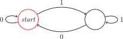
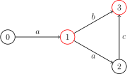

# 有限状态自动机 - OI Wiki

- Source: https://oi-wiki.org/misc/fsm/

# 有限状态自动机

前置知识：[语言和判定问题](../cc-basic/#问题)

**有限状态自动机** （Finite State Machine，FSM，以下也简称自动机）是最简单的一类计算模型，体现在它的描述能力与资源都极其有限．自动机广泛应用在 OI、计算机科学中，其思想在许多字符串算法中都有涉及，因此推荐在学习一些字符串算法（[KMP](../../string/kmp/)、[AC 自动机](../../string/ac-automaton/)、[SAM](../../string/sam/)）前先完成自动机的学习．

## 自动机入门

首先，我们来理解自动机是用来做什么的：自动机是一种判断一个信号序列是否满足某种特定模式或规则的数学模型．

这句话中的一些术语可以具体解释一下．「信号序列」指的是一个按顺序排列的信号，例如字符串从前到后的每一个字符、数组从 11 到 𝑛n 的每一个数、数从高到低的每一位等．「判断是否满足某种规则」，可以理解为：我们关心这个序列是否属于某个特定的集合．这个集合由我们事先设定好的规则来定义，例如「所有长度为偶数的二进制串」或「所有回文串」．

有时我们需要回答这类问题：一个给定的序列，是否满足某种特性？例如，一个二进制数是否是奇数，一个字符串是否是回文，或是否是另一个字符串的子序列等等．自动机就是用来解决这类问题的数学工具．

自动机的工作原理和流程图很类似．假设你想要在外卖平台点购一杯奶茶，你的所有选择就构成了一个序列．以下这个流程图是一个例子：


例如，你的选择序列是「打开点单界面 -> 选择奶茶 -> 有奶茶的钱」，那你按顺序经过的状态可能是「外卖平台 -> 点单界面 -> 支付奶茶的钱 -> 买到奶茶」．就这样，我们的这个「奶茶自动机」根据我们的选择，帮我们判定了我们是否买到了奶茶．我们还可以发现，到达一个状态的方法可能不止一条．同样没有买到奶茶，你可能是在点单界面直接退出，或者没有奶茶的钱以至于没有买到奶茶．

我们通过这个自动机，将信号序列分成了两类：一类是买到了奶茶的信号序列，一类是没有买到奶茶的信号序列．根据最后位于的状态的不同，我们就完成了一个判定问题．

虽然我们刚才用流程图来类比自动机的工作过程，但流程图本身只是一个直观的可视化工具，并不构成对自动机的数学定义．为了更准确地刻画自动机的结构，我们需要对流程图中的元素进行抽象．抽象之后，我们发现流程图的结构其实可以简化为一个有向图，其中每个结点表示一种状态，每条有向边表示状态之间的转换．

因此，自动机的核心结构可以形式化地看作是一张有向图，我们称之为 **状态图** ．

自动机的工作方式和流程图类似，不同的是：自动机的每一个结点都是一个判定结点；自动机的结点只是一个单纯的状态而非任务；自动机的边可以接受多种字符（不局限于 `T` 或 `F`）．

举个例子，完成「判断一个二进制数是不是偶数」的自动机如下：



从起始结点开始，从高到低接受这个数的二进制序列，然后看最终停在哪里．如果最终停在红圈结点，就是偶数；否则不是．

在这里，我们需要强调，下文中我们会多次提到「字符」、「字符集」之类的名词，这不代表自动机只能应用于字符串领域，字符不一定是 𝚊𝚋𝚌⋯𝚣abc⋯z 之类的字母，也可以是一种选择．

如果需要判定一个有限的信号序列和另外一个信号序列的关系（例如另一个信号序列是不是某个信号序列的子序列），那么常用的方法是针对那个有限的信号序列构建一个自动机．这个在学习 KMP 的时候会讲到．

需要注意的是，自动机只是一个 **数学模型** ，而 **不是算法** ，也 **不是数据结构** ．实现同一个自动机的方法有很多种，可能会有不一样的时空复杂度．

接下来你可以选择在本页面继续进一步研究自动机，也可以去学习 [KMP](../../string/kmp/)、[AC 自动机](../../string/ac-automaton/) 或 [SAM](../../string/sam/) 等具体的例子．

FSM 分为两类：确定性有限状态自动机、非确定性有限状态自动机．

## 确定性有限状态自动机

**确定性有限状态自动机** （Deterministic Finite Automaton，DFA）体现在它的判定过程是确定性的．以「奶茶自动机」为例子，你只要打开点单界面，就会进入点单界面，不会出现网络崩溃打不开、手机没电黑屏了之类的意外情况．

DFA

DFA 是一个五元组 (𝑄,Σ,𝛿,𝑞0,𝐹)(Q,Σ,δ,q0,F)，包括：

  1. **有限状态集合** 𝑄Q．如果把一个 DFA 看成一张有向图，那么 DFA 中的状态就相当于图上的顶点．
  2. **字符集** ΣΣ．该自动机只能输入这些字符．
  3. **转移函数** 𝛿 :𝑄 ×Σ →𝑄δ:Q×Σ→Q 是一个接受两个参数返回一个值的函数，其中第一个参数和返回值都是一个状态，第二个参数是字符集中的一个字符．如果把一个 DFA 看成一张有向图，那么 DFA 中的转移函数就相当于顶点间的边，而每条边上都有一个字符．
  4. **起始状态** 𝑞0 ∈𝑄q0∈Q 是一个特殊的状态．在不同文章中，起始状态一般用 𝑠s、𝑠𝑡𝑎𝑟𝑡start、𝑞0q0 表示，本文中选择使用 𝑞0q0 表示．
  5. **接受状态集合** 𝐹 ⊆𝑄F⊆Q 是一组特殊的状态．

DFA 可以简单地用以下结构体表示：

参考实现

```text 1 2 3 4 5 6 7 8 9 10 11 12 13 14 15 ``` |  ```text // Deterministic Finite Automaton (DFA) struct DFA { int m ; // Alphabet size. int n ; // Number of states. int q0 ; // Initial state. std :: vector < std :: vector < int >> trans ; // Transitions: trans[c][q]. std :: vector < int > acc ; // Acceptance labels per state: // - 0 = non-accepting DFA ( int m , int n = 0 , int q0 = 0 ) : m ( m ), n ( n ), q0 ( q0 ), trans ( m , std :: vector < int > ( n )), acc ( n ) {} // Returns minimized DFA via Hopcroft's algorithm. DFA hopcroft_minimize () const ; }; ```   
---|---  
  
求出输入串 𝑤w 在 DFA 中的状态序列，并判断它是否被接受的过程称为 **计算** ．

DFA 的计算流程

设 𝑀 =(𝑄,Σ,𝛿,𝑞0,𝐹)M=(Q,Σ,δ,q0,F) 是一个 DFA，𝑤 =𝑤1𝑤2⋯𝑤𝑛 ∈Σ∗w=w1w2⋯wn∈Σ∗ 是一个串．若存在 𝑄Q 中的状态序列 𝑟0,𝑟1,⋯,𝑟𝑛r0,r1,⋯,rn 满足

  * 𝑟0 =𝑞0r0=q0，
  * 𝛿(𝑟𝑖,𝑤𝑖+1) =𝑟𝑖+1δ(ri,wi+1)=ri+1 对于任何 𝑖 =0,1,⋯,𝑛 −1i=0,1,⋯,n−1 都成立，
  * 𝑟𝑛 ∈𝐹rn∈F，

则称 𝑀M **接受** （accepts）𝑤w．反之，则称 𝑀M **不接受** 𝑤w．

当一个 DFA 读入一个字符串时，从初始状态起按照转移函数一个一个字符地转移．如果读入完一个字符串的所有字符后位于一个接受状态，那么我们称这个 DFA **接受** 这个字符串，反之我们称这个 DFA **不接受** 这个字符串．

形式语言

字符集合 ΣΣ 上的一个 **形式语言** （language），或简称 **语言** ，是 ΣΣ 上字符串的一个集合 𝐿L．

自动机识别的语言

对于一个自动机 𝑀M，它识别的语言 𝐿(𝑀)L(M) 就定义为它接受的全部子串的集合 {𝑤 ∣𝑀 accepts 𝑤}{w∣M accepts w}．

并非所有的语言都可以通过 DFA 识别．

正则语言

如果一个语言能由某个 DFA 识别，则称它为 **正则语言** （regular language），也称为正规语言．

上文提到过，一个自动机可以由状态图表示出来．如下是一个接受且仅接受字符串 𝚊a、𝚊𝚋ab、𝚊𝚊𝚌aac 的 DFA：



（图中省略了失配状态，所有未画出的转移均指向该失配状态）

## 非确定性有限状态自动机

**非确定性有限状态自动机**1（Nondeterministic Finite Automaton，NFA）是 DFA 的自然推广．在 NFA 中，对于任意状态和任意字符，都可能存在零个、一个或多个后继状态．同时，本节讨论的 NFA 允许接受空字符，也就是说，可以在不消耗任何字符的情况下，由一个状态转移到它的某个后继状态．

举个例子，还是「奶茶自动机」．下单后，尽管有奶茶的钱，却有可能因为网络不佳从而没有买到奶茶，这是存在多个后继；也有可能因为手速慢了，尽管输入的串（即操作序列）是一样的，却因为奶茶售完从而没有买到奶茶，这就是空字符的存在，空字符可走可不走．对前文的自动机稍加修改即可实现上述功能：


显然，所有的 DFA 都是一个 NFA，所以 NFA 至少可以识别所有正则语言．但是，作为 DFA 的一个扩展，NFA 是否能够识别更多的语言呢？其实不然，我们之后将探讨 DFA 与 NFA 的等价性．

NFA

令 P(𝑄)P(Q) 表示 𝑄Q 的幂集．令 𝜀 ∉Σε∉Σ 表示空串，并记 Σ𝜀 =Σ ∪{𝜀}Σε=Σ∪{ε}．NFA 是一个五元组 (𝑄,Σ,𝛿,𝑞0,𝐹)(Q,Σ,δ,q0,F)，包括：

  1. **有限状态集合** 𝑄Q，
  2. **字符集** ΣΣ，
  3. **转移函数** 𝛿 :𝑄 ×Σ𝜀 →P(𝑄)δ:Q×Σε→P(Q)，一个接受两个参数返回一个 **状态集合** 的函数，其中第一个参数是一个状态，第二个参数是字符集中的一个字符，而返回值则是所有可能的后继状态形成的集合（可能为空），
  4. **起始状态** 𝑞0 ∈𝑄q0∈Q，
  5. **接受状态集合** 𝐹 ⊆𝑄F⊆Q．

NFA 的计算过程，相当于同时运行多个 DFA．每一步操作都穷举所有的可能性，最后，只要有一条分支到达了接受状态，NFA 就接受整个串．

NFA 的计算流程

设 𝑁 =(𝑄,Σ,𝛿,𝑞0,𝐹)N=(Q,Σ,δ,q0,F) 是一个 NFA，串 𝑤w 可以表示为 𝑦1𝑦2⋯𝑦𝑚 ∈Σ∗𝜀y1y2⋯ym∈Σε∗．若存在 𝑄Q 中的状态序列 𝑟0,𝑟1,⋯,𝑟𝑚r0,r1,⋯,rm 满足

  * 𝑟0 =𝑞0r0=q0，
  * 𝑟𝑖+1 ∈𝛿(𝑟𝑖,𝑦𝑖+1)ri+1∈δ(ri,yi+1) 对于任何 𝑖 =0,1,⋯,𝑚 −1i=0,1,⋯,m−1 都成立，
  * 𝑟𝑚 ∈𝐹rm∈F，

则称 𝑁N **接受** 𝑤w．反之，则称 𝑁N **不接受** 𝑤w．

由于允许空字符，将串 𝑤w 表示为 𝑦1𝑦2⋯𝑦𝑚 ∈Σ∗𝜀y1y2⋯ym∈Σε∗ 时，可以插入任意多的空字符．例如，字符串 𝚊𝚋𝚌abc 可以表示为 𝚊𝜀𝚋𝚌𝜀𝜀 ∈Σ∗𝜀aεbcεε∈Σε∗．相较于 DFA 的每一次输入只对应一个结果，而 NFA 的每次输入可能对应多个结果，形成一个结果集．

## DFA 与 NFA 的等价性

我们称两个自动机等价，当且仅当它们能识别的语言相同．DFA 与 NFA 是等价的，即每一个 NFA 都等价于某一个 DFA；因此，NFA 识别的语言类也是全体正则语言．每个 DFA 都可以直接看作一个 NFA；反过来，可以通过 **幂集构造** （powerset construction）的方法将一个 NFA 转换为 DFA．

幂集构造

假设 NFA 为 𝑁 =(𝑄,Σ,𝛿,𝑞0,𝐹)N=(Q,Σ,δ,q0,F)．定义 𝐸(𝑞)E(q) 表示从状态 𝑞q 出发，只沿 𝜀ε 转移能到达的状态集合．

构造 DFA 为 𝑀 =(𝑄′,Σ,𝛿′,𝐸(𝑞0),𝐹′)M=(Q′,Σ,δ′,E(q0),F′)，其中：

  * **有限状态集合** 𝑄′ =P(𝑄)Q′=P(Q)，
  * **转移函数** 𝛿′ :𝑄′ ×Σ →𝑄′δ′:Q′×Σ→Q′ 满足 𝛿′(𝑆,𝑐) =⋃𝑞∈𝑆, 𝑞′∈𝛿(𝑞,𝑐)𝐸(𝑞′)δ′(S,c)=⋃q∈S, q′∈δ(q,c)E(q′)，
  * **接受状态集合** 𝐹′ ={𝑆 ⊆𝑄 ∣𝑆 ∩𝐹 ≠∅}F′={S⊆Q∣S∩F≠∅}．

显然，计算的每一步中，𝑀M 所在的状态都对应 𝑁N 可能处于的状态集合．

虽然 NFA 与 DFA 识别语言的能力相同，但 NFA 仍然是有用的．这是因为对于某些正则语言，用 NFA 表示所需的状态数远小于 DFA 所需的状态数．例如，可以构造出一个状态数为 𝑛n 的 NFA 使得它对应的最小 DFA 状态数是 Θ(2𝑛)Θ(2n) 的．此时直接计算 NFA 的时间复杂度是更优的．

## 计算 DFA 与 NFA 的时间复杂度

设给定的串长为 𝑛n，自动机状态数为 𝑠s，字符集大小为常数．那么显然地，DFA 计算的时间复杂度为 𝑂(𝑛)O(n)，只需要模拟上述的过程即可．

朴素计算 NFA 的时间复杂度为 𝑂(𝑛𝑠2)O(ns2)，这是因为需要考虑到每一种后继，以及状态的合并所需的复杂度．当然，可以使用 bitset 或者 Method of Four Russians 将计算的复杂度优化到 𝑂(𝑛𝑠2𝑤)O(ns2w) 或 𝑂(𝑛𝑠2𝑤⋅log⁡𝑛)O(ns2w⋅log⁡n)．

## 正则表达式与正则语言

本节将讨论正则表达式和正则语言的定义、性质，并研究正则表达式与 FSM 的关系．

### 正则表达式

**正则表达式** （regular expression）是另一种常用的正则语言的描述方法．尽管我们可以在许多现代语言（例如 Python）中看到这个名字，但实际上这些语言实现的是正则表达式的一个超集．

正则表达式

给定一个字符集 ΣΣ，正则表达式是由以下规则归纳定义的符号串：

  1. 任意字符 𝑐 ∈Σc∈Σ 是一个正则表达式；
  2. 空串符号 𝜀ε 是正则表达式；
  3. 空语言符号 ∅∅ 是正则表达式；
  4. 如果 𝑅1R1 和 𝑅2R2 是正则表达式，那么 (𝑅1 +𝑅2)(R1+R2)、(𝑅1𝑅2)(R1R2)（也记作 (𝑅1 ⋅𝑅2)(R1⋅R2)）、(𝑅∗1)(R1∗) 都是正则表达式．

正则表达式的目标是通过这些符号描述一个语言．每个正则表达式都有一个对应的形式语言．

正则表达式所表示的语言

设每个正则表达式 𝑅R 对应的形式语言为 𝐿(𝑅)L(R)，则有：

  1. 若 𝑅 =𝑐R=c，其中 𝑐 ∈Σc∈Σ，则 𝐿(𝑅) ={𝑐}L(R)={c}；
  2. 若 𝑅 =𝜀R=ε，则 𝐿(𝑅) ={𝜀}L(R)={ε}；
  3. 若 𝑅 =∅R=∅，则 𝐿(𝑅) =∅L(R)=∅；
  4. 若 𝑅 =(𝑅1 +𝑅2)R=(R1+R2)，则 𝐿(𝑅) =𝐿(𝑅1) ∪𝐿(𝑅2)L(R)=L(R1)∪L(R2)；
  5. 若 𝑅 =(𝑅1𝑅2) =(𝑅1 ⋅𝑅2)R=(R1R2)=(R1⋅R2)，则 𝐿(𝑅) ={𝑢𝑣 ∣𝑢 ∈𝐿(𝑅1), 𝑣 ∈𝐿(𝑅2)}L(R)={uv∣u∈L(R1), v∈L(R2)}，其中，𝑢𝑣uv 指将两个串前后拼接在一起；
  6. 若 𝑅 =(𝑅∗1)R=(R1∗)，则 𝐿(𝑅) ={𝑢1𝑢2⋯𝑢𝑛 ∣𝑢𝑖 ∈𝐿(𝑅1), 𝑛 ∈𝐍+} ∪{𝜀}L(R)={u1u2⋯un∣ui∈L(R1), n∈N+}∪{ε}，也称为 **Kleene 星号** （Kleene 星号）或 **Kleene closure** （Kleene 闭包），简称闭包．

当然，规定了运算的优先级后，这些小括号在不引起混淆时可以省略．

例子

设 𝐿(𝑅1) ={0, 01}L(R1)={0, 01}，𝐿(𝑅2) ={𝜀, 1, 11, 111, …}L(R2)={ε, 1, 11, 111, …}，则有：

  * 𝐿(𝑅1𝑅2) ={0, 01, 011, 0111, …}L(R1R2)={0, 01, 011, 0111, …}，
  * 𝑅∗2 =𝑅2R2∗=R2，
  * 𝐿(𝑅1 +𝑅2) ={0, 01, 𝜀, 1, 11, 111, …}L(R1+R2)={0, 01, ε, 1, 11, 111, …}．

每个正则表达式都可以通过 [Thompson 构造法](https://zh.wikipedia.org/wiki/%E6%B1%A4%E6%99%AE%E6%A3%AE%E6%9E%84%E9%80%A0%E6%B3%95)（Thompson's construction）转换为一个 NFA，每个 DFA 也都可以通过状态消除法2（State Elimination Method）转换为一个正则表达式．所以，正则表达式与 FSM 是等价的．

### 正则语言

在本小节中，我们不考虑具体的正则表达式，转而考虑以变量为参数的正则表达式（变量可以为任意正则语言）．运用正则表达式的代数定律有助于化简正则表达式．

正则语言的代数性质

  1. 并的交换律：𝐿 +𝑀 =𝑀 +𝐿L+M=M+L
  2. 并的结合律：(𝐿 +𝑀) +𝑁 =𝐿 +(𝑀 +𝑁)(L+M)+N=L+(M+N)
  3. 连接的结合律：(𝐿𝑀)𝑁 =𝐿(𝑀𝑁)(LM)N=L(MN)
  4. ∅∅ 是并运算的单位元：∅ +𝐿 =𝐿 +∅ =𝐿∅+L=L+∅=L
  5. 𝜀ε 是连接运算的单位元：𝜀𝐿 =𝐿𝜀 =𝐿εL=Lε=L
  6. ∅∅ 是连接运算的零因子：∅𝐿 =𝐿∅ =∅∅L=L∅=∅
  7. 分配律：𝐿(𝑀 +𝑁) =𝐿𝑀 +𝐿𝑁L(M+N)=LM+LN，(𝑀 +𝑁)𝐿 =𝑀𝐿 +𝑁𝐿(M+N)L=ML+NL
  8. 并的幂等律：𝐿 +𝐿 =𝐿L+L=L
  9. 闭包相关的定律：(𝐿∗)∗ =𝐿∗(L∗)∗=L∗，∅∗ =𝜀∅∗=ε，𝜀∗ =𝜀ε∗=ε

正则语言的 **封闭性** 也是重要的性质．这些性质允许我们从一些简单的自动机出发，通过一定的运算，构造能够识别另一些语言的有限状态机（FSM）．简而言之，封闭性可以作为构造复杂 FSM 的工具．

关于正则语言的封闭性，我们有：

正则语言的封闭性

设 𝐿,𝑀L,M 为字符集 ΣΣ 上的两个正则语言，且映射 ℎ :Σ →Σ∗h:Σ→Σ∗．定义字符串 𝑠 =𝑠1𝑠2⋯𝑠𝑛s=s1s2⋯sn 的同态为 ℎ(𝑠) =ℎ(𝑠1)ℎ(𝑠2)⋯ℎ(𝑠𝑛)h(s)=h(s1)h(s2)⋯h(sn)．那么，

  1. 两个正则语言的并 𝐿 +𝑀L+M 是正则的，
  2. 两个正则语言的连接 𝐿𝑀LM 是正则的，
  3. 正则语言的闭包 𝐿∗L∗ 是正则的，
  4. 正则语言的补 Σ∗ ∖𝐿Σ∗∖L 是正则的，
  5. 两个正则语言的交 𝐿 ∩𝑀L∩M 是正则的，
  6. 两个正则语言的差 𝐿 ∖𝑀L∖M 是正则的，
  7. 正则语言的反转 𝐿𝑅 ={𝑠𝑛⋯𝑠2𝑠1 ∣𝑠 =𝑠1𝑠2⋯𝑠𝑛 ∈𝐿}LR={sn⋯s2s1∣s=s1s2⋯sn∈L} 是正则的，
  8. 正则语言的同态 ℎ(𝐿) ={ℎ(𝑠) ∣𝑠 ∈𝐿}h(L)={h(s)∣s∈L} 是正则的，
  9. 正则语言的逆同态 ℎ−1(𝐿) ={𝑠 ∈Σ∗ ∣ℎ(𝑠) ∈𝐿}h−1(L)={s∈Σ∗∣h(s)∈L} 是正则的．

一个简单的推论是，所有的有限语言都是正则语言．实际上，[字典树 Trie](../../string/trie/) 就是一个识别它们的自动机．

## Myhill–Nerode 定理

Myhill–Nerode 定理给出了一个语言是否是正则语言的判定标准．该定理通过等价类的概念描述了正则语言的结构特征．

Nerode 等价关系

对于一个语言 𝐿L 和任意串 𝑥,𝑦 ∈Σ∗x,y∈Σ∗，如果对于任意 𝑧 ∈Σ∗z∈Σ∗，都有 𝑥𝑧 ∈𝐿 ⟺ 𝑦𝑧 ∈𝐿xz∈L⟺yz∈L，那么，称字符串 𝑥x 和 𝑦y 关于 𝐿L 是等价的，记作 𝑥 ≡𝐿𝑦x≡Ly．

也就是说，如果对于两个串 𝑥x 与 𝑦y，在 𝑥x 和 𝑦y 后面拼上相同的任意串 𝑧z（包括空串），它们总是要么同时属于 𝐿L 或者同时不属于 𝐿L 的，则我们说 𝑥x 与 𝑦y 关于 𝐿L 等价．

根据上述定义，我们把所有有限字符串的集合划分成一个或多个等价类．当且仅当这些等价类的数目只有有限多个时，可以利用这些等价类构造一个识别该语言的 DFA．这个 DFA 的状态数目就等于等价类的数目．而且，这个状态数目是所有能够识别该语言的 DFA 中最小的．这就是 Myhill–Nerode 定理．

Myhill–Nerode 定理

一个语言 𝐿L 是正则的，当且仅当 Σ∗Σ∗ 通过等价关系 ≡𝐿≡L 划分成的等价类数量是有限的．

对于任何能识别语言 𝐿L 的 DFA，任意两个能驱使它走到同一个状态的串 𝑥x 和 𝑦y 必在同一个等价类中．

进而，等价类的数量就是可以识别 𝐿L 的最小 DFA 的状态数量．每个等价类都恰好对应最小 DFA 里的一个状态．这个最小 DFA 在同构意义下是唯一的．

这个定理提供了一种方法，能够利用等价关系构造 DFA：

  * 状态集合，就是根据等价关系划分得到的所有等价类．每个等价类都随意选定一个代表字符串（例如某个串长最小的串）．
  * 要构造转移函数，只需要将选定的代表字符串后面添加转移中的字符，并找到得到的字符串所在等价类对应的状态，就是相应的转移的后继状态．因为同一等价类中，所有字符串都是等价的，所以任意选定的代表字符串并不会影响转移的结果．
  * 初始状态，就是空字符串 𝜀ε 对应的等价类．
  * 接受状态集合，就是代表字符串属于所给语言的等价类的集合．

作为一个经典的例子，[后缀自动机](../../string/sam/) 就是利用 Myhill–Nerode 定理构造出的最小 DFA．

Myhill–Nerode 定理通常应用于一些无限大的正则语言对应的 DFA 的构造．很多时候，问题的条件比较简单，只需要考察长度不太长的字符串的集合，就可以构造出识别整个语言的自动机．

### 例题

本节通过一道例题介绍如何实际应用 Myhill–Nerode 定理．

[P12294 [THUPC 2025 决赛] 一个 01 串，n 次三目运算符，最后值为 1（加强版）](https://www.luogu.com.cn/problem/P12294)

关于 𝑎,𝑏,𝑐a,b,c 的三目运算表 𝑠0𝑠1⋯𝑠7s0s1⋯s7（𝑠s 仅由 0,10,1 组成）的含义是，如果 𝑠s 的第 𝑎 +2𝑏 +4𝑐a+2b+4c 位为 11，那么返回 11，否则返回 00．

给定运算表 𝑠s 以及 𝑞q 个长为 2𝑛 +12n+1 的 0101 串，你需要对于对每个 0101 串分别回答：

能否操作 𝑛n 次，每次将三位连续的数字替换为所对应的运算值，使得运算的结果为 11，给出方案，或判断无解．

1 ≤2𝑛 +1 ≤105, ∑(2𝑛 +1) ≤3 ×1051≤2n+1≤105, ∑(2n+1)≤3×105．

题解

能够合成出 11 的 0101 串集合是一个正则语言（也就是存在一个 DFA 能够判定一个 0101 串能否合成出 11）6．故考虑使用 Myhill–Nerode 定理．因为条件比较简单，经过实验，我们只需要对于长度 ≤9≤9 的 0101 串进行等价类划分；判定两个串等价时，只需要往后枚举长度 ≤6≤6 的后缀进行判定．只要两个串，接上长度 ≤6≤6 的任意后缀，它们要么能够同时合成出我们想要的串，要么两个都不能合成我们想要的串，那么这两个串就是等价的．

每次转移都相当于在当前串后面添加一个新的 0101 字符，然后将这个新串变为这个新串所在等价类中串长最小的串．根据上述转移设计一个自动机．该自动机能够在 𝑂(𝑛)O(n) 复杂度内判定一个长度为 𝑛n 的串是否存在一种运算方式使得结果为 11．同时自动机的状态数非常少．

为了方便，我们会建 66 个自动机，这 66 个自动机分别表示能否通过一种运算方式使得结果为 0,1,00,01,10,110,1,00,01,10,11．对于所有可能的运算表，自动机的最大状态数目为 4747．

利用自动机，通过适当的预处理，可以考虑使用倍增或者猫树实现静态区间查询区间是否存在一种运算方式使得结果为 11，前者查询一次是 𝑂(log⁡𝑛)O(log⁡n)，后者查询一次是 𝑂(1)O(1) 的．

考虑使用分治解决构造问题．设 𝑓(𝑙,𝑟,𝑡)f(l,r,t) 表示区间 [𝑙,𝑟][l,r] 合并出 𝑡 ∈{0,1,00,01,10,11}t∈{0,1,00,01,10,11} 的方案．此时使用启发式分裂，维护两个指针 𝑖,𝑗i,j 一个从左到右扫，一个从右往左扫，以枚举断点 𝑚𝑖𝑑mid 为 𝑖i 或 𝑗j．对于 𝑡 ∈{0,1}t∈{0,1}，则枚举 𝑡t 是怎么分为左右两个部分的，其中一个部分的 𝑡t 长度为 22，另一个部分 𝑡t 长度为 11．（例如对于中位数的运算表 𝑠 =00010111s=00010111，11 可以分为 0101 和 11．）对于 𝑡 ∈{00,01,10,11}t∈{00,01,10,11}，则 𝑡𝑦𝑝𝑒type 直接分为左右两个部分．

如果此时分为的左右两个部分分别为 𝑡1t1 与 𝑡2t2，则进一步判断 [𝑙,𝑚𝑖𝑑][l,mid] 能否生成 𝑡1t1 和 [𝑚𝑖𝑑 +1,𝑟][mid+1,r] 能否生成 𝑡2t2，如果能则直接分治下去．如果使用 𝑂(1)O(1) 猫树判定，这么启发式分裂构造的复杂度是 𝑂(𝑛log⁡𝑛)O(nlog⁡n)；否则，利用倍增判定，构造的复杂度就是 𝑂(𝑛log2⁡𝑛)O(nlog2⁡n) 的．

如果使用了猫树，总复杂度是 𝑂(𝑛|𝑄|log⁡𝑛 +𝑛log⁡𝑛)O(n|Q|log⁡n+nlog⁡n)，其中，|𝑄| ≤47|Q|≤47．参考代码为了方便，使用了倍增，并且通过底层分块减小常数，对应的总复杂度为 𝑂(𝑛|𝑄|log⁡𝑛 +𝑛log2⁡𝑛)O(n|Q|log⁡n+nlog2⁡n)．

参考代码

```text 1 2 3 4 5 6 7 8 9 10 11 12 13 14 15 16 17 18 19 20 21 22 23 24 25 26 27 28 29 30 31 32 33 34 35 36 37 38 39 40 41 42 43 44 45 46 47 48 49 50 51 52 53 54 55 56 57 58 59 60 61 62 63 64 65 66 67 68 69 70 71 72 73 74 75 76 77 78 79 80 81 82 83 84 85 86 87 88 89 90 91 92 93 94 95 96 97 98 99 100 101 102 103 104 105 106 107 108 109 110 111 112 113 114 115 116 117 118 119 120 121 122 123 124 125 126 127 128 129 130 131 132 133 134 135 136 137 138 139 140 141 142 143 144 145 146 147 148 149 150 151 152 153 154 155 156 157 158 159 160 161 162 163 164 165 166 167 168 169 170 171 172 173 174 175 176 177 178 179 180 181 182 183 184 185 186 187 188 189 190 191 192 193 194 195 196 197 198 199 200 201 202 ``` |  ```text #include <array> #include <iostream> #include <unordered_map> #include <vector> constexpr int L = 3 ; std :: array < int , 1 << L > op ; constexpr int X = ( 1 << L ) \- 2 ; // Build a DFA that accepts binary strings which evaluate to a given string. // 0b000 → "00" // 0b001 → "01" // 0b010 → "10" // 0b011 → "11" // 0b100 → "0" // 0b101 → "1" DFA build ( int x ) { constexpr int L1 = 9 , L2 = 6 ; // The result for string `st` of length `len` is stored at (1 << len) | st. const auto idx = []( int len , int st ) -> int { return ( 1 << len ) | st ; }; // Compute which bit strings are accepted using dynamic programming. std :: vector < bool > acc ( 1 << ( L1 \+ L2 \+ 1 )); acc [( x >> 2 ) ? idx ( 1 , x & 1 ) : idx ( 2 , x )] = true ; for ( int len = ( x >> 2 ) ? 3 : 4 ; len <= L1 \+ L2 ; len += 2 ) { for ( int st = 0 ; st < ( 1 << len ); ++ st ) { for ( int i = 0 ; i \+ L <= len ; ++ i ) { // Replace st[i..i+2] using the op[] rule, and check if the result is // accepted. Result = st[0..i-1] + op[st[i..i+2]] + st[i+3..end] int pr = (((( st >> ( i \+ L )) << 1 ) | op [( st >> i ) & (( 1 << L ) \- 1 )]) << i ) | ( st & (( 1 << i ) \- 1 )); if ( acc [ idx ( len \- 2 , pr )]) { acc [ idx ( len , st )] = true ; break ; } } } } // Construct a DFA using the Myhill-Nerode theorem. DFA dfa ( 2 ); std :: unordered_map < std :: vector < bool > , int > mp ; // Maps characteristic vectors to state IDs. std :: vector < int > sts ; // Representative 01 strings for each state. std :: vector < int > ids ( 1 << ( L1 \+ 1 )); // Maps 01 strings to DFA state IDs. for ( int len = 0 ; len <= L1 ; ++ len ) { for ( int st = ( 1 << len ); st < ( 2 << len ); ++ st ) { // Construct characteristic vector for this prefix. std :: vector < bool > key ( 1 << ( L2 \+ 1 )); for ( int nxt = 0 ; nxt <= L2 ; ++ nxt ) std :: copy ( acc . begin () \+ ( st << nxt ), acc . begin () \+ (( st \+ 1 ) << nxt ), key . begin () \+ ( 1 << nxt )); if ( ! mp . count ( key )) { mp [ key ] = dfa . n ++ ; sts . push_back ( st ); dfa . acc . push_back ( key [ idx ( 0 , 0 )]); } ids [ st ] = mp [ key ]; } } // Build transitions. for ( int c = 0 ; c < 2 ; ++ c ) { dfa . trans [ c ]. resize ( dfa . n ); for ( int i = 0 ; i < dfa . n ; ++ i ) dfa . trans [ c ][ i ] = ids [( sts [ i ] << 1 ) | c ]; } return dfa ; } std :: vector < DFA > dfa ; // Initialize the DFA's. void init () { std :: string s ; std :: cin >> s ; for ( int i = 0 ; i < ( 1 << L ); ++ i ) op [ i ] = s [ i ] \- '0' ; std :: swap ( op [ 1 ], op [ 4 ]); std :: swap ( op [ 3 ], op [ 6 ]); for ( int x = 0 ; x < X ; ++ x ) dfa . push_back ( build ( x )); } std :: string s ; constexpr int B = 5 ; // Block size is 2^B. std :: vector < std :: vector < std :: array < std :: vector < int > , X >>> pre ; void precompute () { int n = s . size (); for ( int i = 0 ; i < n ; ++ i ) s [ i ] -= '0' ; int nn = (( n \- 1 ) >> B ) \+ 1 ; pre . clear (); // Compute transitions over single blocks (2^B characters) for each DFA. pre . emplace_back ( nn ); for ( int i = 0 ; i < nn ; ++ i ) { for ( int x = 0 ; x < X ; ++ x ) { pre [ 0 ][ i ][ x ]. resize ( dfa [ x ]. n ); for ( int j = 0 ; j < dfa [ x ]. n ; ++ j ) { int cr = j ; for ( int ii = ( i << B ); ii < (( i \+ 1 ) << B ) && ii < n ; ++ ii ) cr = dfa [ x ]. trans [ s [ ii ]][ cr ]; pre [ 0 ][ i ][ x ][ j ] = cr ; } } } // Build higher-level transitions using binary lifting. for ( int d = 1 ; ( 1 << d ) <= nn ; ++ d ) { pre . emplace_back ( nn \- ( 1 << d ) \+ 1 ); for ( int i = 0 ; i <= nn \- ( 1 << d ); ++ i ) { for ( int x = 0 ; x < X ; ++ x ) { pre [ d ][ i ][ x ]. resize ( dfa [ x ]. n ); for ( int j = 0 ; j < dfa [ x ]. n ; ++ j ) pre [ d ][ i ][ x ][ j ] = pre [ d \- 1 ][ i \+ ( 1 << ( d \- 1 ))][ x ][ pre [ d \- 1 ][ i ][ x ][ j ]]; } } } } // Check if the x-th DFA accepts s[l...r]. bool check ( int l , int r , int x ) { if ( l > r ) return false ; int cr = dfa [ x ]. q0 ; if (( l >> B ) == ( r >> B )) { for (; l <= r ; ++ l ) cr = dfa [ x ]. trans [ s [ l ]][ cr ]; } else { for (; ( l & (( 1 << B ) \- 1 )) && ( l <= r ); ++ l ) cr = dfa [ x ]. trans [ s [ l ]][ cr ]; int d = ( r >> B ) \- ( l >> B ); for ( int z = 0 ; z < ( int ) pre . size (); ++ z ) if (( d >> z ) & 1 ) { cr = pre [ z ][ l >> B ][ x ][ cr ]; l += 1 << ( z \+ B ); } for (; l <= r ; ++ l ) cr = dfa [ x ]. trans [ s [ l ]][ cr ]; } return dfa [ x ]. acc [ cr ]; } // Construct expression for s[l...r]. void calc ( int l , int r , int x ) { if ( l == r ) return ( void )( std :: cout << ( x & 1 )); if ( x >> 2 ) { for ( int i = l , j = r ; i <= j ; i += 2 , j -= 2 ) { for ( int k = 0 ; k < ( 1 << L ); ++ k ) { if ( op [ k ] != ( x & 1 )) continue ; if ( check ( l , i , ( k >> 2 ) | 4 ) && check ( i \+ 1 , r , k & 3 )) { std :: cout << '(' ; calc ( l , i , ( k >> 2 ) | 4 ); calc ( i \+ 1 , r , k & 3 ); std :: cout << ')' ; return ; } if ( check ( l , j \- 1 , k >> 1 ) && check ( j , r , ( k & 1 ) | 4 )) { std :: cout << '(' ; calc ( l , j \- 1 , k >> 1 ); calc ( j , r , ( k & 1 ) | 4 ); std :: cout << ')' ; return ; } } } } else { for ( int i = l , j = r ; i <= j ; i += 2 , j -= 2 ) { if ( check ( l , i , ( x >> 1 ) | 4 ) && ( check ( i \+ 1 , r , ( x & 1 ) | 4 ))) { calc ( l , i , ( x >> 1 ) | 4 ); calc ( i \+ 1 , r , ( x & 1 ) | 4 ); return ; } if ( check ( l , j \- 1 , ( x >> 1 ) | 4 ) && check ( j , r , ( x & 1 ) | 4 )) { calc ( l , j \- 1 , ( x >> 1 ) | 4 ); calc ( j , r , ( x & 1 ) | 4 ); return ; } } } } void solve () { std :: cin >> s ; int n = s . size (); precompute (); if ( ! check ( 0 , n \- 1 , 0b101 )) { std :: cout << -1 << '\n' ; return ; } calc ( 0 , n \- 1 , 0b101 ); std :: cout << '\n' ; } int main () { init (); int q ; std :: cin >> q ; for (; q ; \-- q ) { solve (); } return 0 ; } ```   
---|---  
  
### 习题

  * [Median Replace Hard](https://qoj.ac/problem/12010)
  * [JOISC 2024 卡牌收集](https://www.luogu.com.cn/problem/P10436)（通过 Myhill–Nerode 定理建立自动机，本题可以做到多次区间查询）

## DFA 最小化

前文提到，两个 DFA 等价当且仅当它们识别相同的正则语言．根据识别的语言不同，全体 DFA 划分为无穷多个等价类．在进行 DP 套 DP 之类的算法时，建立出来的 DFA 的 |𝑄||Q| 可能过大，使得外层 DP 转移复杂度过大．因此，往往需要找到 DFA 所属等价类中的最小 DFA，以减少外层 DP 转移复杂度．

上一节的 Myhill–Nerode 定理就提供了一种构造方法．但是，对于一些比较复杂的问题，直接通过 Myhill–Nerode 定理构造需要遍历相当长的字符串的集合，花费大量时间．因此，我们需要一种方法，可以从已经构造出来的 DFA（通常较为容易）出发，直接构造一个最小 DFA．这就称为 **DFA 最小化** （DFA minimization）问题．

DFA 最小化常用的算法是 **Hopcroft 算法** ．由于 Myhill–Nerode 定理指出，对于任意一个可以识别某语言的 DFA，能够驱使它到达同一状态的字符串都必然是 Nerode 等价的．所有 Nerode 等价的字符串对应着最小 DFA 中的同一个状态，所以，最小 DFA 的状态一定是当前 DFA 中若干个状态的集合．我们可以从已有的 DFA 的状态集合出发，将它们划分为若干个等价类，而无需考察具体的字符串．Hopcroft 算法从最粗糙的划分 {𝐹,𝑄 ∖𝐹}{F,Q∖F} 开始，利用一系列证据 𝐴A，改进这个划分，直到无法进一步改进为止．这就是 Hopcroft 算法的核心想法．

所谓 **证据** 𝐴A，就是一个状态集合，而且它和它的补集 𝑄 ∖𝐴Q∖A 一定对应着不同的 Nerode 等价类．也就是说，存在某个字符串 𝑠 ∈Σ∗s∈Σ∗，使得分别从 𝐴A 和 𝑄 ∖𝐴Q∖A 中的状态出发，读入字符串 𝑠s 后，𝐴A 中的状态全部处于接受状态，而 𝑄 ∖𝐴Q∖A 中的状态全部属于非接受状态，或者反过来．因此，如果有两个状态 𝑢,𝑣 ∈𝑄u,v∈Q，它们在某个字符 𝑐c 下恰好一个转移到证据 𝐴A 中，一个转移到证据 𝐴A 外，即 𝛿(𝑢,𝑐) ∈𝐴δ(u,c)∈A 和 𝛿(𝑣,𝑐) ∈𝐴δ(v,c)∈A 成立且仅成立一个，那么，𝑢,𝑣u,v 同样不属于一个 Nerode 等价类——状态 𝛿(𝑢,𝑐𝑠)δ(u,cs) 和 𝛿(𝑣,𝑐𝑠)δ(v,cs) 中有且只有一个位于接受状态．因此，利用是否成立 𝛿(𝑢,𝑐) ∈𝐴δ(u,c)∈A 这一点，就可以改进划分．具体地，设

𝑆𝑥={𝑢∣𝑢∈𝑃𝑥, 𝛿(𝑢,𝑐)∈𝐴}.Sx={u∣u∈Px, δ(u,c)∈A}.

如果 𝑆𝑥Sx 和 𝑃𝑥 ∖𝑆𝑥Px∖Sx 均不是空集，那么，当前的划分中状态集合 𝑃𝑥Px 就可以改进为 𝑆𝑥Sx 和 𝑃𝑥 ∖𝑆𝑥Px∖Sx．

最开始时，将接受状态集合 𝐹F 作为一个证据塞入证据集合 𝑊W，即 𝑊 ←{𝐹}W←{F}，并维护当前的划分为 𝑃 ←{𝐹, 𝑄 ∖𝐹}P←{F, Q∖F}．初始证据是显然成立的：𝐹F 和 𝑄 ∖𝐹Q∖F 中的状态绝不可能等价．每次都从证据集合 𝑊W 中随意取出一个集合 𝐴A 用于改进当前的划分．枚举所有的字符 𝑐 ∈Σc∈Σ．对当前划分 𝑃P 中的每个状态集合 𝑃𝑥Px 都求出前文描述的 𝑆𝑥Sx．如果 𝑆𝑥 ≠∅Sx≠∅ 且 |𝑆𝑥| ≠|𝑃𝑥||Sx|≠|Px|，就意味着 𝑃𝑥Px 可以进一步分为两个集合 𝑆𝑥Sx 和 𝑃𝑥 ∖𝑆𝑥Px∖Sx，直接用它们替换掉 𝑃P 中的 𝑃𝑥Px．

每当获得更细致的划分时，就意味着获得了新的证据．原则上，可以将新得到的 𝑆𝑥Sx 和 𝑃𝑥 ∖𝑆𝑥Px∖Sx 都塞进证据集合 𝑊W，等待后续进一步验证．但是，这样做并不是必要的．容易理解，对于三个证据 𝑃𝑥,𝑆𝑥,𝑃𝑥 ∖𝑆𝑥Px,Sx,Px∖Sx，只需要验证其中任意两个，就可以保证结果的正确性：因为结果只有 𝛿(𝑢,𝑐) ∈𝑆𝑥δ(u,c)∈Sx、𝛿(𝑢,𝑐) ∈𝑃𝑥 ∖𝑆𝑥δ(u,c)∈Px∖Sx 和 𝛿(𝑢,𝑐) ∉𝑃𝑥δ(u,c)∉Px 三种，而将集合划分成三部分只需要两次判断．因此，将 𝑃𝑥Px 划分为 𝑆𝑥Sx 和 𝑃𝑥 ∖𝑆𝑥Px∖Sx 时，如果 𝑃𝑥Px 仍处于证据集合 𝑊W 中，这说明还没有检验过证据 𝑃𝑥Px，就需要将证据集合 𝑊W 中的 𝑃𝑥Px 替换为 𝑆𝑥Sx 和 𝑃𝑥 ∖𝑆𝑥Px∖Sx 两个；否则，当前的划分一定相当于3已经检验过 𝑃𝑥Px 的结果，所以，只需要将 𝑆𝑥Sx 和 𝑃𝑥 ∖𝑆𝑥Px∖Sx 中较小的那个塞入证据集合 𝑊W 中．类似于启发式分裂，这样做可以得到优秀的复杂度．

将上述过程写成伪代码就是：

𝐀𝐥𝐠𝐨𝐫𝐢𝐭𝐡𝐦 Hopcroft's Algorithm(𝑄,Σ,𝛿,𝑞0,𝐹):𝐈𝐧𝐩𝐮𝐭. DFA 𝐴=(𝑄,Σ,𝛿,𝑞0,𝐹).𝐎𝐮𝐭𝐩𝐮𝐭. A partition of 𝑄 into equivalence classes of the minimal DFA.𝐌𝐞𝐭𝐡𝐨𝐝. 1𝑃←{𝐹,𝑄∖𝐹}2𝑊←{𝐹}3𝐰𝐡𝐢𝐥𝐞 𝑊≠∅4choose and remove any 𝐴∈𝑊5𝐟𝐨𝐫 𝐞𝐚𝐜𝐡 𝑐∈Σ6𝑆←{𝑞∈𝑄∣𝛿(𝑞,𝑐)∈𝐴}7𝐟𝐨𝐫 𝐞𝐚𝐜𝐡 𝑌∈𝑃 such that 𝑆∩𝑌≠∅ and 𝑌∖𝑆≠∅8𝑌1←𝑆∩𝑌, 𝑌2←𝑌∖𝑆9𝑃←(𝑃∖{𝑌})∪{𝑌1,𝑌2}10𝐢𝐟 𝑌∈𝑊11𝑊←(𝑊∖{𝑌})∪{𝑌1,𝑌2}12𝐞𝐥𝐬𝐞13add the smaller of 𝑌1 and 𝑌2 to 𝑊14𝐫𝐞𝐭𝐮𝐫𝐧 𝑃Algorithm Hopcroft's Algorithm(Q,Σ,δ,q0,F):Input. DFA A=(Q,Σ,δ,q0,F).Output. A partition of Q into equivalence classes of the minimal DFA.Method. 1P←{F,Q∖F}2W←{F}3while W≠∅4choose and remove any A∈W5for each c∈Σ6S←{q∈Q∣δ(q,c)∈A}7for each Y∈P such that S∩Y≠∅ and Y∖S≠∅8Y1←S∩Y, Y2←Y∖S9P←(P∖{Y})∪{Y1,Y2}10if Y∈W11W←(W∖{Y})∪{Y1,Y2}12else13add the smaller of Y1 and Y2 to W14return P

算法实现时，复杂度的瓶颈在于 𝑆S 的计算．直接遍历所有 𝑞 ∈𝑄q∈Q 进而判断 𝛿(𝑞,𝑐) ∈𝐴δ(q,c)∈A 是否成立是不可行的．因此，需要在算法运行前，预处理反向转移边 {𝑞 ∈𝑄 ∣𝛿(𝑞,𝑐) =𝑎}{q∈Q∣δ(q,c)=a}，从而，利用这些反向转移，遍历 𝑎 ∈𝐴a∈A，就可以得到集合 𝑆S．这样做可以保证每条转移 𝛿(𝑞,𝑐) =𝑎δ(q,c)=a 只会在 𝑎a 属于某个证据时才会遍历到；而前文的证据筛选方法保证了，算法中实际用到的包含 𝑎a 的证据序列 𝐴1 ⊃𝐴2 ⊃⋯ ⊃𝐴𝑘A1⊃A2⊃⋯⊃Ak 中，前一个至少是后一个的两倍大小，因此，𝑘 ∈𝑂(log⁡𝑛)k∈O(log⁡n)．也就是说，每条转移边至多只会遍历 𝑂(log⁡𝑛)O(log⁡n) 次，而总的转移数目是 𝑛|Σ|n|Σ| 的，因此，总的复杂度就是 𝑂(𝑛|Σ|log⁡𝑛)O(n|Σ|log⁡n) 的．

参考实现如下：4

参考实现

```text 1 2 3 4 5 6 7 8 9 10 11 12 13 14 15 16 17 18 19 20 21 22 23 24 25 26 27 28 29 30 31 32 33 34 35 36 37 38 39 40 41 42 43 44 45 46 47 48 49 50 51 52 53 54 55 56 57 58 59 60 61 62 63 64 65 66 67 68 69 70 71 72 73 74 75 76 77 78 79 80 81 82 83 84 85 86 87 88 89 90 91 92 93 94 95 96 97 98 ``` |  ```text // DFA minimization via Hopcroft's algorithm. // Complexity: O(n * m * log(n)). DFA DFA::hopcroft_minimize () const { // Construct inverse transition maps: // - pre[c] stores states sorted by the target of transition c. // - pos[c][s] is the start index in pre[c] of transitions going to state s. std :: vector < std :: vector < int >> pre ( m ), pos ( m ); for ( int c = 0 ; c < m ; ++ c ) { pre [ c ]. assign ( n , 0 ); pos [ c ]. assign ( n \+ 1 , 0 ); // Counting sort. for ( int i = 0 ; i < n ; ++ i ) ++ pos [ c ][ trans [ c ][ i ]]; for ( int i = 0 ; i < n ; ++ i ) pos [ c ][ i \+ 1 ] += pos [ c ][ i ]; for ( int i = 0 ; i < n ; ++ i ) pre [ c ][ \-- pos [ c ][ trans [ c ][ i ]]] = i ; } // Partition element structure: // - os: starting index in the state list. // - sz: number of states in this class. // - cnt: temporary count of marked states during refinement. struct EquivClasses { int os , sz , cnt ; EquivClasses ( int os , int sz , int cnt ) : os ( os ), sz ( sz ), cnt ( cnt ) {} }; // Partition and helper data structures. std :: vector < EquivClasses > ec ; // Current list of equivalence classes. std :: vector < int > ids ( n ); // Permutation of states, grouped by ECs. std :: vector < int > par ( n ); // Maps state to its EC index. std :: vector < bool > tag ( n ); // Temporary marking for splitting. std :: queue < int > evidences ; // Worklist of ECs to check. // Initial partition by acceptance label. std :: iota ( ids . begin (), ids . end (), 0 ); std :: sort ( ids . begin (), ids . end (), [ & ]( int l , int r ) { return acc [ l ] < acc [ r ]; }); for ( int l = 0 , r ; l < n ; l = r ) { for ( r = l ; r < n && acc [ ids [ r ]] == acc [ ids [ l ]]; ++ r ) par [ ids [ r ]] = ec . size (); if ( l ) evidences . push ( ec . size ()); // Add all but first class to worklist. ec . emplace_back ( l , r \- l , 0 ); } // Refinement loop. while ( ! evidences . empty ()) { int cr = evidences . front (); evidences . pop (); for ( int c = 0 ; c < m ; ++ c ) { std :: vector < int > todo ; for ( int i = ec [ cr ]. os ; i < ec [ cr ]. os \+ ec [ cr ]. sz ; ++ i ) { for ( int k = pos [ c ][ ids [ i ]]; k < pos [ c ][ ids [ i ] \+ 1 ]; ++ k ) { int j = pre [ c ][ k ]; if ( ! tag [ j ]) { if ( ! ec [ par [ j ]]. cnt ) todo . push_back ( par [ j ]); ++ ec [ par [ j ]]. cnt ; tag [ j ] = true ; } } } // Perform splits. for ( int i : todo ) { int ti = i ; if ( ec [ i ]. cnt != ec [ i ]. sz ) { // Split into two: larger vs smaller segment. bool majority_tagged = ec [ i ]. cnt * 2 >= ec [ i ]. sz ; int mid = std :: partition ( ids . begin () \+ ec [ i ]. os , ids . begin () \+ ec [ i ]. os \+ ec [ i ]. sz , [ & ]( int x ) { return tag [ x ] == majority_tagged ; }) \- ids . begin () \- ec [ i ]. os ; // Assign new EC index to the smaller segment. for ( int j = ec [ i ]. os \+ mid ; j < ec [ i ]. os \+ ec [ i ]. sz ; ++ j ) par [ ids [ j ]] = ec . size (); evidences . push ( ec . size ()); if ( ! majority_tagged ) ti = ec . size (); ec . emplace_back ( ec [ i ]. os \+ mid , ec [ i ]. sz \- mid , 0 ); ec [ i ]. sz = mid ; } // Clear temporary counters and tags. ec [ i ]. cnt = 0 ; for ( int j = ec [ ti ]. os ; j < ec [ ti ]. os \+ ec [ ti ]. sz ; ++ j ) tag [ ids [ j ]] = false ; } } } // Build minimized DFA. DFA res ( m , ec . size (), par [ q0 ]); for ( const auto & e : ec ) { int i = ids [ e . os ]; // Representative state. res . acc [ par [ i ]] = acc [ i ]; for ( int c = 0 ; c < m ; ++ c ) res . trans [ c ][ par [ i ]] = par [ trans [ c ][ i ]]; } return res ; } ```   
---|---  
  
这一参考实现允许自动机的状态带有任何整数取值的标签，而并非简单的「接受」与「不接受」的二元标签．从参考实现可以看出，与基础 Hopcroft 算法的唯一不同就在于初始划分和证据集合的构造．这种拓展的自动机也称为 [Moore 机](https://en.wikipedia.org/wiki/Moore_machine)．它的一个应用可以看本节的第二个例题．

### 例题

本节通过两道例题介绍如何实际应用 DFA 最小化的技巧．

例题

给定一个长度为 𝑛n 的 01?01? 串 𝑎a，初始变量 𝑥 =0x=0，我们按顺序遍历每一位 𝑎𝑖ai 并执行如下操作：

  1. 若 𝑎𝑖 =0ai=0，令 𝑥 ←𝑥 −lowbit(𝑥)x←x−lowbit(x)；
  2. 若 𝑎𝑖 =1ai=1，令 𝑥 ←𝑥 +lowbit(2𝑘 −1 −𝑥)x←x+lowbit(2k−1−x)；
  3. 若 𝑎𝑖 =?ai=?，可任选 00 或 11，对应上述两种操作之一．

最终若 𝑥 ∈[0,𝑟]x∈[0,r]，则称该操作序列是好的．

现在需要对每个 𝑗 =1…𝑛j=1…n，求在强制 𝑎𝑗 =0aj=0 的前提下，有多少「好的」完整序列．特别地，𝑎𝑗 =1aj=1 时，答案为 00．

1 ≤𝑛 ≤105, 1 ≤𝑘 ≤20, 0 ≤𝑟 <2𝑘1≤n≤105, 1≤k≤20, 0≤r<2k．输出对 998244353998244353 取模．

题解

考虑朴素 DP．设 𝑓𝑖,𝑗fi,j 表示从 𝑥 =0x=0 开始，经过 [1,𝑖][1,i] 的操作，当前数为 𝑗j 的方案数．设 𝑔𝑖,𝑗gi,j 表示从 𝑥 =𝑗x=j 开始，经过 [𝑖,𝑛][i,n] 的操作，最终 𝑥 ∈[0,𝑟]x∈[0,r] 的方案数．强制 𝑎𝑖 =0ai=0 的答案，就是 ∑𝑗𝑓𝑖−1,𝑗𝑔𝑖+1,𝑗−lowbit(𝑗)∑jfi−1,jgi+1,j−lowbit(j)．复杂度是 𝑂(𝑛2𝑘)O(n2k)．

考虑直接将 𝑗j 的转移建成 DFA，然后跑 DFA 最小化，再 DP 就可以了．

参考代码

```text 1 2 3 4 5 6 7 8 9 10 11 12 13 14 15 16 17 18 19 20 21 22 23 24 25 26 27 28 29 30 31 32 33 34 35 36 37 38 39 40 41 42 43 44 45 46 47 48 49 50 51 52 53 54 55 56 57 ``` |  ```text #include <iostream> #include <string> #include <vector> int main () { constexpr int M = 998244353 ; // Initialize the DFA. const auto lowbit = []( int x ) { return x & \- x ; }; int n , k , r ; std :: cin >> n >> k >> r ; DFA raw_dfa ( 2 , 1 << k ); for ( int x = 0 ; x < ( 1 << k ); ++ x ) { raw_dfa . trans [ 0 ][ x ] = x \- lowbit ( x ); raw_dfa . trans [ 1 ][ x ] = x \+ lowbit (( 1 << k ) \- 1 \- x ); if ( x <= r ) raw_dfa . acc [ x ] = 1 ; } // DFA minimization. auto dfa = raw_dfa . hopcroft_minimize (); // DP. std :: string s ; std :: cin >> s ; for ( int i = 0 ; i < n ; ++ i ) s [ i ] -= '0' ; std :: vector < std :: vector < int >> f ( n \+ 1 , std :: vector < int > ( dfa . n , 0 )); f [ 0 ][ dfa . q0 ] = 1 ; for ( int i = 0 ; i < n ; ++ i ) { for ( int c = 0 ; c < 2 ; ++ c ) { if ( s [ i ] != 1 \- c ) { for ( int j = 0 ; j < dfa . n ; ++ j ) { ( f [ i \+ 1 ][ dfa . trans [ c ][ j ]] += f [ i ][ j ]) %= M ; } } } } std :: vector < std :: vector < int >> g ( n \+ 1 , std :: vector < int > ( dfa . n , 0 )); for ( int j = 0 ; j < dfa . n ; ++ j ) { if ( dfa . acc [ j ]) g [ n ][ j ] = 1 ; } for ( int i = n \- 1 ; i >= 0 ; \-- i ) { for ( int c = 0 ; c < 2 ; ++ c ) { if ( s [ i ] != 1 \- c ) { for ( int j = 0 ; j < dfa . n ; ++ j ) { ( g [ i ][ j ] += g [ i \+ 1 ][ dfa . trans [ c ][ j ]]) %= M ; } } } } for ( int i = 0 ; i < n ; ++ i ) { long long res = 0 ; if ( s [ i ] != 1 ) { for ( int j = 0 ; j < dfa . n ; ++ j ) { ( res += ( long long ) f [ i ][ j ] * g [ i \+ 1 ][ dfa . trans [ 0 ][ j ]]) %= M ; } } std :: cout << res << '\n' ; } return 0 ; } ```   
---|---  
  
[Minimal Subset Difference](https://codeforces.com/contest/956/problem/F)

定义 𝑓(𝑛)f(n) 表示将十进制数 𝑛n 所有数码之间填入加号或者减号，最终得到的值的绝对值最小值．

𝑇T 组询问．每组询问给定 𝑙,𝑟,𝑘l,r,k，求满足 𝑙 ≤𝑚 ≤𝑟l≤m≤r 且 𝑓(𝑚) ≤𝑘f(m)≤k 的 𝑚m 的个数．

1 ≤𝑇 ≤5 ×1041≤T≤5×104，1 ≤𝑙 ≤𝑟 ≤10181≤l≤r≤1018，0 ≤𝑘 ≤90≤k≤9．

题解

先给出一种贪心地计算 𝑓(𝑛)f(n) 的方法．从高位向低位考虑一个数，最开始，设得到的数的和是 00．计算到某一数位，如果当前合成出的数如果是负数就加上当前数位，如果是正数就减去当前数位．这么处理，贪心计算出的 𝑓(𝑛)f(n) 的绝对值一定小于等于 99．所以真实的 𝑓(𝑛)f(n) 的绝对值一定小于等于 99．

我们进一步思考，要合成出最终的答案，中间过程中能够合成出来的数最大能是多少．因为答案一定是小于等于 99 的，而且数位只有 1818 位，每次最多只能加减 99．过程中能够合成出来的数肯定是小于等于 9090 的，否则最后减不回来．实际上，这个上限还能够更低7．

考虑朴素 DP 套 DP．首先，思考内层 DP 怎么判定一个数的答案：定义 𝑔𝑖,𝑐gi,c 表示这个数只根据前 𝑖i 位，能否合成出 𝑐c．根据前文，𝑐c 只用保留小于等于 9090 的数．如果当前这一位填的是 𝑣v，那么，有转移：

𝑔𝑖+1,𝑐+𝑣←𝑔𝑖,𝑐, 𝑔𝑖+1,|𝑐−𝑣|←𝑔𝑖,𝑐.gi+1,c+v←gi,c, gi+1,|c−v|←gi,c.

外层 DP 考虑数位 DP．将询问差分．设状态为 𝑓𝑙𝑒𝑛,𝑙𝑖𝑚,𝑠𝑡𝑎flen,lim,sta，它的下标分别表示已经考虑到第 𝑙𝑒𝑛len 位，是否有上界限制，当前自动机的状态位于 𝑠𝑡𝑎sta 等．

与普通的 DFA 不同，我们需要对自动机的每个状态记录对应的答案．跑一次暴力搜索，会发现内层 DP 的状态数只有 1956419564．然后接下来直接跑 DFA 最小化，可以将状态数优化到 715715．

此时我们将 𝑙𝑖𝑚 =0lim=0 的数位 DP 答案都预处理出来，在多测时就只需要跑 𝑙𝑖𝑚 =1lim=1 的情况，可以很快地求出答案．

时间复杂度 𝑂(|𝑆||Σ|log⁡|𝑆| +(|𝑄||Σ| +𝑇)|Σ|log10⁡𝑉)O(|S||Σ|log⁡|S|+(|Q||Σ|+T)|Σ|log10⁡V)（|𝑆| =19564|S|=19564，|𝑄| =715|Q|=715）．

参考代码

```text 1 2 3 4 5 6 7 8 9 10 11 12 13 14 15 16 17 18 19 20 21 22 23 24 25 26 27 28 29 30 31 32 33 34 35 36 37 38 39 40 41 42 43 44 45 46 47 48 49 50 51 52 53 54 55 56 57 58 59 60 61 62 63 64 65 66 67 68 69 70 71 72 73 74 75 76 77 78 ``` |  ```text #include <bitset> #include <cmath> #include <iostream> #include <unordered_map> #include <vector> constexpr int B = 10 , L = 91 ; using state = std :: bitset < L > ; DFA raw_dfa ( B ), dfa ( B ); std :: unordered_map < state , int > ids ; // Construct a DFA by DFS. int dfs ( const state & cr ) { if ( ids . count ( cr )) return ids [ cr ]; int id = ids [ cr ] = raw_dfa . n ++ ; // Check if accepted. for ( int i = 0 ; i < B ; ++ i ) { if ( cr [ i ]) { raw_dfa . acc . push_back ( i ); break ; } } // Construct transitions recursively. for ( int c = 0 ; c < B ; ++ c ) { raw_dfa . trans [ c ]. push_back ( 0 ); } for ( int c = 0 ; c < B ; ++ c ) { state nt ; for ( int i = 0 ; i < L ; ++ i ) { if ( cr [ i ]) { if ( i \+ c < L ) nt [ i \+ c ] = true ; nt [ std :: abs ( i \- c )] = true ; } } raw_dfa . trans [ c ][ id ] = dfs ( nt ); } return id ; }; // DP. std :: vector < long long > memo ; std :: vector < int > nums ; long long sol ( int x , int len , bool lim , int k ) { if ( ! len ) return dfa . acc [ x ] <= k ; auto key = ( x * 20 \+ len ) * B \+ k ; if ( ! lim && memo [ key ] != -1 ) return memo [ key ]; long long res = 0 ; for ( int c = 0 ; c <= ( lim ? nums [ len \- 1 ] : B \- 1 ); ++ c ) res += sol ( dfa . trans [ c ][ x ], len \- 1 , lim && c == nums [ len \- 1 ], k ); return lim ? res : memo [ key ] = res ; }; long long calc ( long long n , int k ) { nums . clear (); for (; n ; n /= B ) nums . push_back ( n % B ); return sol ( dfa . q0 , nums . size (), true , k ); }; int main () { // Construct a DFA. for ( int c = 0 ; c < B ; ++ c ) raw_dfa . trans [ c ]. reserve ( 20000 ); dfs ( 1 ); // DFA minimization. dfa = raw_dfa . hopcroft_minimize (); memo . assign ( dfa . n * 20 * B , -1 ); // Queries. int t ; std :: cin >> t ; for (; t ; \-- t ) { long long l , r ; int k ; std :: cin >> l >> r >> k ; std :: cout << ( calc ( r , k ) \- calc ( l \- 1 , k )) << '\n' ; } return 0 ; } ```   
---|---  
  
### 习题

  * [Language Recognition](http://poj.org/problem?id=3576)
  * [Equanimous](https://qoj.ac/problem/7083)

## 自动机常见应用

本节列举了一些算法竞赛中常见的自动机的应用5．

### 字典树

[字典树](../../string/trie/) 是大部分 OIer 接触到的第一个自动机，接受且仅接受指定的字符串集合中的元素．转移函数就是 Trie 上的边，接受状态是将每个字符串插入到 Trie 时到达的那个状态．

### KMP 自动机

[KMP 算法](../../string/kmp/) 可以视作自动机，基于字符串 𝑠s 的 KMP 自动机接受且仅接受以 𝑠s 为后缀的字符串，其接受状态为 |𝑠||s|．

转移函数：

𝛿(𝑖,𝑐)=⎧{ {⎨{ {⎩𝑖+1𝑠[𝑖+1]=𝑐0𝑠[1]≠𝑐∧𝑖=0𝛿(𝜋(𝑖),𝑐)𝑠[𝑖+1]≠𝑐∧𝑖>0δ(i,c)={i+1s[i+1]=c0s[1]≠c∧i=0δ(π(i),c)s[i+1]≠c∧i>0

### AC 自动机

[AC 自动机](../../string/ac-automaton/) 接受且仅接受以指定的字符串集合中的某个元素为后缀的字符串．也就是 Trie + KMP．

### 后缀自动机

[后缀自动机](../../string/sam/) 接受且仅接受指定字符串的后缀．

### 广义后缀自动机

[广义后缀自动机](../../string/general-sam/) 接受且仅接受指定的字符串集合中的某个元素的后缀．也就是 Trie + SAM．

广义 SAM 与 SAM 的关系就是 AC 自动机与 KMP 自动机的关系．

### 回文自动机

[回文自动机](../../string/pam/) 比较特殊，它不能非常方便地定义为自动机．

如果需要定义的话，它接受且仅接受某个字符串的所有回文子串的 **中心及右半部分** ．

「中心及右边部分」在奇回文串中就是字面意思，在偶回文串中定义为一个特殊字符加上右边部分．这个定义看起来很奇怪，但它能让 PAM 真正成为一个自动机，而不仅是两棵树．

### 序列自动机

[序列自动机](../../string/seq-automaton/) 接受且仅接受指定字符串的子序列．

### DP 套 DP

[DP 套 DP](../../dp/dp-of-dp/) 是自动机的一个应用，可以看作是先通过内层 DP 建出自动机，再在外层通过自动机上的 DP 实现计数、最优化任务的技巧．

## 后缀链接

由于自动机和匹配有着密不可分的关系，而匹配的一个基本思想是「这个串不行，就试试它的后缀可不可以」，所以在很多自动机（KMP、AC 自动机、SAM、PAM）中，都有后缀链接的概念．

一个状态会对应若干字符串．它的后缀链接，就指向自动机上该状态对应的字符串的公共真后缀中，最长的那个对应的状态．一般地，后缀链接会形成一棵树，并且不同自动机的后缀链接树有着一些相同的性质，学习时可以加以注意．

## 拓展阅读

  * [计算复杂性（1）Warming Up: 自动机模型](https://lingeros-tot.github.io/2019/03/05/Warming-Up-自动机模型/)
  * [国家集训队 2021 论文 徐哲安 浅谈有限状态自动机及其应用](https://github.com/OIerTFX/IOI/blob/master/%E5%9B%BD%E5%AE%B6%E9%9B%86%E8%AE%AD%E9%98%9F2021%E8%AE%BA%E6%96%87%E9%9B%86/pdf-files/%E5%BE%90%E5%93%B2%E5%AE%89%20%E6%B5%85%E8%B0%88%E6%9C%89%E9%99%90%E7%8A%B6%E6%80%81%E8%87%AA%E5%8A%A8%E6%9C%BA%E5%8F%8A%E5%85%B6%E5%BA%94%E7%94%A8.pdf)
  * [Myhill–Nerode theorem - Wikipedia](https://en.wikipedia.org/wiki/Myhill%E2%80%93Nerode_theorem)
  * Knuutila, Timo. "Re-describing an algorithm by Hopcroft." Theoretical Computer Science 250, no. 1-2 (2001): 333-363.
  * Hopcroft, John E., Rajeev Motwani, and Jeffrey D. Ullman. "Introduction to automata theory, languages, and computation." Acm Sigact News 32, no. 1 (2001): 60-65.

* * *

  1. 这个定义中我们允许状态之间通过空字符（𝜀ε）转移，因此更准确地说，这是一个带 𝜀ε 转移的非确定有限自动机（NFA-𝜀ε）．有些教材中将它直接称为 NFA，为简洁起见，本文采用这一用法．在理论上 NFA 与 NFA-𝜀ε 是有所区分的，但是实际上它们的计算能力是一致的． ↩

  2. 详见 [国家集训队 2021 论文 徐哲安 浅谈有限状态自动机及其应用](https://github.com/OIerTFX/IOI/blob/master/%E5%9B%BD%E5%AE%B6%E9%9B%86%E8%AE%AD%E9%98%9F2021%E8%AE%BA%E6%96%87%E9%9B%86/pdf-files/%E5%BE%90%E5%93%B2%E5%AE%89%20%E6%B5%85%E8%B0%88%E6%9C%89%E9%99%90%E7%8A%B6%E6%80%81%E8%87%AA%E5%8A%A8%E6%9C%BA%E5%8F%8A%E5%85%B6%E5%BA%94%E7%94%A8.pdf) 中 3.2 节． ↩

  3. 此处的「相当于」指的是，尽管实际上 𝑃𝑥Px 可能并没有实际检验过，但是，即使对当前划分进行 𝑃𝑥Px 的检验，也不会有任何改进．简单理解，就是在集合分裂得到的证据集合的树上，它的某个祖先和路径上的所有旁支都已经得到了检验，因此，可以归纳地说明，就相当于它也已经检验过了． ↩

  4. 算法实现中有一处细节：对于一个证据 𝐴A，有可能检验完一部分字符后，这个证据集合就已经分裂为 𝐵B 和 𝐶C 了．不妨设 |𝐵| ≥|𝐶||B|≥|C|．由于参考实现中，较小的集合 𝐶C 插入到了证据队列的末尾，而较大的证据集合 𝐵B 替换到了集合 𝐴A 原来的位置．算法继续运行时，实际只是利用证据 𝐵B 检验剩余的字符．这样做是正确的．这是因为对于已经检验完的字符，至少验证了 𝐴A 和 𝐶C 两个集合；而对于尚未检验的字符，至少验证了 𝐵B 和 𝐶C 两个集合． ↩

  5. 本文对自动机的定义要求它是完备的，即任一状态在任一字符下都必须有转移．对这些字符串相关的自动机的描述中，通常会忽略失配状态．Trie、SAM 等都是这样的例子．为了与本文提供的定义相适应，需要在这些自动机的描述中显式地添加失配状态． ↩

  6. 详见 [官方题解](https://qoj.ac/download.php?type=attachments&id=2079&r=1)． ↩

  7. 详见 [国家集训队 2021 论文 徐哲安 浅谈有限状态自动机及其应用](https://github.com/OIerTFX/IOI/blob/master/%E5%9B%BD%E5%AE%B6%E9%9B%86%E8%AE%AD%E9%98%9F2021%E8%AE%BA%E6%96%87%E9%9B%86/pdf-files/%E5%BE%90%E5%93%B2%E5%AE%89%20%E6%B5%85%E8%B0%88%E6%9C%89%E9%99%90%E7%8A%B6%E6%80%81%E8%87%AA%E5%8A%A8%E6%9C%BA%E5%8F%8A%E5%85%B6%E5%BA%94%E7%94%A8.pdf) 中的例题 5.2． ↩

* * *

>  __本页面最近更新： 2026/1/7 08:56:54，[更新历史](https://github.com/OI-wiki/OI-wiki/commits/master/docs/misc/fsm.md)  
>  __发现错误？想一起完善？[在 GitHub 上编辑此页！](https://oi-wiki.org/edit-landing/?ref=/misc/fsm.md "edit.link.title")  
>  __本页面贡献者：[c-forrest](https://github.com/c-forrest), [CCXXXI](https://github.com/CCXXXI), [countercurrent-time](https://github.com/countercurrent-time), [Enter-tainer](https://github.com/Enter-tainer), [FFjet](https://github.com/FFjet), [H-J-Granger](https://github.com/H-J-Granger), [Ir1d](https://github.com/Ir1d), [mgt](https://github.com/mgt), [NachtgeistW](https://github.com/NachtgeistW), [orzAtalod](https://github.com/orzAtalod), [ouuan](https://github.com/ouuan), [SukkaW](https://github.com/SukkaW), [Tiphereth-A](https://github.com/Tiphereth-A), [ZnPdCo](https://github.com/ZnPdCo)  
>  __本页面的全部内容在**[CC BY-SA 4.0](https://creativecommons.org/licenses/by-sa/4.0/deed.zh) 和 [SATA](https://github.com/zTrix/sata-license)** 协议之条款下提供，附加条款亦可能应用
