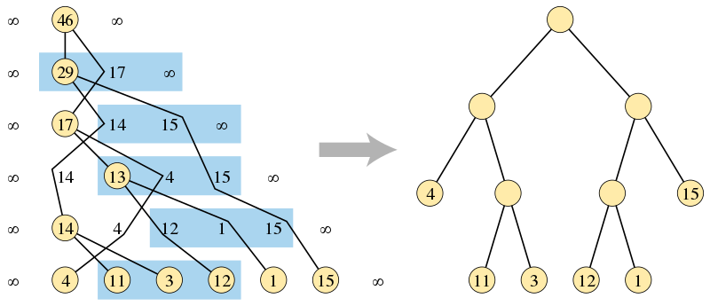

# Garsia–Wachs 算法 - OI Wiki

- Source: https://oi-wiki.org/misc/garsia-wachs/

# Garsia–Wachs 算法

## 简介

**Garsia–Wachs 算法** （Garsia–Wachs Algorithm）是计算机用来在 **线性时间** 内构建 **最优二叉查找树** 和 **字母霍夫曼码** 的有效算法．它以 Adriano Garsia 和 Michelle L. Wachs 的名字命名，他们于 1977 年发表了相关论文．

## 问题描述

一个整数 𝑛n，对于 𝑛 +1n+1 个非负权值 𝑤0,𝑤1,…,𝑤𝑛w0,w1,…,wn，构造一棵有根且 𝑛n 个内部节点都有两个子节点的二叉树，这意味着这棵二叉树有 𝑛 +1n+1 个叶节点．我们将 𝑛 +1n+1 的输入序列与二叉树结点顺序一一映射，目标是在所有具有 𝑛n 个内部节点的可能的树结构中找到一棵树，使外部从根到每个叶子的路径长度的权重和最小．

### 最优二叉查找树

这个问题可以理解为 𝑛n 个有序键构造二叉查找树的问题，假设树将仅用于搜索树中不存在的值．在这种情况下，𝑛n 个键将搜索值的空间划分为 𝑛 +1n+1 个区间，并且这些区间之一的权重可以作为搜索值落在那个区间的概率．外部路径长度的加权和控制了查找的预期时间．

### 字母霍夫曼码

这个问题也可以用作构建霍夫曼码．这是一种通过使用二进制值的可变长度序列明确编码 𝑛 +1n+1 给定值的方法．在这种解释中，值的代码由从树中的根到叶子的路径上从父到子的左步和右步序列给出（例如，左为 00，右为 11）．与标准霍夫曼码不同，以这种方式构造的霍夫曼码是按字母顺序排列的，也就是说这些二进制码的排序顺序与值的输入顺序相同．如果一个值的权重是它在编码消息中的频率，那么 Garsia–Wachs 算法的输出是将消息长度压缩到最短的，按字母顺序排列的霍夫曼代码．

## 过程

Garsia–Wachs 算法一般包括三个阶段：

  1. 构建一个值位于叶子的二叉树，注意顺序可能错误．
  2. 计算树中根到每个叶子的距离．
  3. 构建另一个二叉树，叶子的距离相同，但顺序正确．

如上图所示，在算法的第一阶段，通过查找合并输入序列的无序三元组构建的二叉树（左侧），和算法输出的正确排序的二叉树，其中叶子高度与另一棵树一样．

如果输入在序列的开始和结束处增加了两个标记值 ∞∞（或任何足够大的有限值），则算法的第一阶段更容易描述．所以在竞赛题解中使用 Garsia–Wachs 算法时，对于一个长度为 𝑛n 的数组 numnum，我们一般定义 num[0] =num[𝑛 +1] =∞num[0]=num[n+1]=∞．

第一阶段维护了一个由最初为每个非标志（non-sentinel）输入权重创建的单节点树组成的森林．每棵树都与一个值相关联，其叶子的权重之和为每个非标志输入权重构成一个树节点．为了维护这些值的序列，每端会有两个标记值．初始序列只是叶权重作为输入的顺序．然后重复执行以下步骤，每一步都减少输入序列的长度，直到只有一棵树包含了所有叶子：

  * 在序列中找到前三个连续的权重值 𝑥x，𝑦y，𝑧z 使得 𝑥 ≤𝑧x≤z．因为序列结尾的标志值大于之前的任意两个有限值，所以总是存在这样的三元组．
  * 从序列中移除 𝑥x 和 𝑦y，并创建一个新的树节点作为 𝑥x 和 𝑦y 节点的父节点，值为 𝑥 +𝑦x+y．
  * 在原来 𝑥x 的位置以前大于或等于 𝑥 +𝑦x+y 且距 𝑥x 最近的值的右边重新插入新节点．因为左标志值的存在，所以总是存在这样的位置．

为了有效地实现这一阶段，该算法可以在任何平衡二叉查找树结构中维护当前值序列．这样的结构允许我们在对数时间内移除 𝑥x 和 𝑦y，并重新插入它们的新父节点．在每一步中，数组中位于偶数索引上直到 𝑦y 值的权重形成了一个递减序列，位于奇数索引位的权重形成另一个递减序列．因此，重新插入 𝑥 +𝑦x+y 的位置可以通过在对数时间内对这两个递减序列使用平衡树执行两次二分查找找到．通过从前一个三元组 𝑧z 值开始的线性顺序搜索，我们可以在总线性时间复杂度内执行对满足 𝑥 ≤𝑧x≤z 的第一个位置的搜索．

Garsia–Wachs 算法的第三阶段的证明，即存在另一棵具有相同距离的树并且这棵树提供了问题的最优解，是很重要的．但是由于其证明方式有多种且过于复杂，此处略去．在第三阶段为正确的前提下，第二和第三阶段很容易在线性时间内实现．因此，在长度为 𝑛n 的输入序列上，Garsia–Wachs 算法的总时间复杂度为 𝑂(𝑛log⁡𝑛)O(nlog⁡n)．

## 应用

函数性编程语言 Haskell 的 [garsia-wachs package](https://hackage.haskell.org/package/garsia-wachs) 对 Garsia–Wachs 算法做了函数性实现．它主要用于构建最佳搜索表，或者以最优复杂度平衡 [rope](https://hackage.haskell.org/package/rope) 数据结构．

注释

**rope** 是 Haskell 语言中用于操作带有可选注释的字节串（bytestring）[手指树](../../ds/finger-tree/) 的工具．

## 例题

[POJ 1738 An old Stone Game](http://poj.org/problem?id=1738)

有一个古老的石头游戏．在游戏开始时，玩家将 𝑛n(1 ≤𝑛 ≤500001≤n≤50000) 堆石头排成一行．目标是将石头合并成一堆，规则如下：在游戏的每一步，玩家可以将相邻的两个堆合并成一个新的堆．分数是新堆的石头总数．请计算总分中的最小值．

解题思路

石子合并的题目很经典，一般我们可以用区间 DP 解答，但是当数据量很大，例如此题中的 𝑛n(1 ≤𝑛 ≤500001≤n≤50000) 时，用 Garsia–Wachs 算法求解更高效：第一步，初始化一个大小为 𝑛n 的数组 num[𝑛]num[n]，其中 num[0] =num[𝑛 +1] =∞num[0]=num[n+1]=∞．第二步，每次找到一个最小的 𝑖i 使 num[𝑖 −1] ≤num[𝑖 +1]num[i−1]≤num[i+1]，并将 num[𝑖 −1],num[𝑖]num[i−1],num[i] 合并为 temptemp; 找到前面一个最大的 𝑗j 使得 num[𝑗] >tempnum[j]>temp, 将 temptemp 移到 𝑗j 后面．重复这一步直到剩余堆数为 11． 关于每次只能合并相邻石子堆的要求，因为 num[𝑗] ≥num[𝑖 −1] +num[𝑖]num[j]≥num[i−1]+num[i]，我们可以将 num[𝑗 +1]num[j+1] 到 num[𝑖 −2]num[i−2] 看成一个 num[𝑚𝑖𝑑]num[mid] 的整体，所以一定是先合并 sumsum．因此没有违背题目要求．

[ATCODER N-Slimes](https://atcoder.jp/contests/dp/tasks/dp_n)

𝑁N 个史莱姆排成一排．最初左边第 𝑖i 个史莱姆的大小为 𝑎𝑖ai．Taro 试图将所有史莱姆组合成一个更大的史莱姆．他会反复执行以下操作，直到只有一个史莱姆： 选择两个相邻的史莱姆，并将它们组合成一个新的史莱姆．新的史莱姆的大小为 𝑥 +𝑦x+y，其中 𝑥x 和 𝑦y 是组合之前史莱姆的大小．这一步骤有产生 𝑥 +𝑦x+y 的成本．合成史莱姆时史莱姆的位置关系不会改变．找出可能发生的最小总成本．

## 参考资料与拓展阅读

  1. [Garsia–Wachs algorithm - Wikipedia](https://en.wikipedia.org/wiki/Garsia%E2%80%93Wachs_algorithm)
  2. [Data.Algorithm.GarsiaWachs - Hackage Haskell](https://hackage.haskell.org/package/garsia-wachs-1.2/docs/Data-Algorithm-GarsiaWachs.html)
  3. [garsia-wachs: A Functional Implementation of the Garsia-Wachs Algorithm](https://hackage.haskell.org/package/garsia-wachs)
  4. [Sentinel value - Wikipedia](https://en.wikipedia.org/wiki/Sentinel_value)
  5. [A new proof of the Garsia-Wachs algorithm](https://www.sciencedirect.com/science/article/abs/pii/0196677488900090)

* * *

>  __本页面最近更新： 2026/1/7 08:56:54，[更新历史](https://github.com/OI-wiki/OI-wiki/commits/master/docs/misc/garsia-wachs.md)  
>  __发现错误？想一起完善？[在 GitHub 上编辑此页！](https://oi-wiki.org/edit-landing/?ref=/misc/garsia-wachs.md "edit.link.title")  
>  __本页面贡献者：[Tiphereth-A](https://github.com/Tiphereth-A), [Enter-tainer](https://github.com/Enter-tainer), [F1shAndCat](https://github.com/F1shAndCat), [iamtwz](https://github.com/iamtwz), [isdanni](https://github.com/isdanni), [Marcythm](https://github.com/Marcythm), [shuzhouliu](https://github.com/shuzhouliu)  
>  __本页面的全部内容在**[CC BY-SA 4.0](https://creativecommons.org/licenses/by-sa/4.0/deed.zh) 和 [SATA](https://github.com/zTrix/sata-license)** 协议之条款下提供，附加条款亦可能应用
