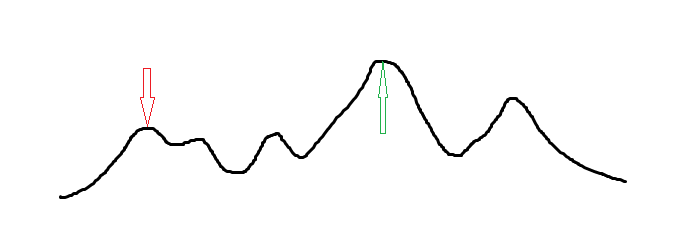

# 爬山算法 - OI Wiki

- Source: https://oi-wiki.org/misc/hill-climbing/

# 爬山算法

## 简介

爬山算法是一种局部择优的方法，采用启发式方法，是对深度优先搜索的一种改进，它利用反馈信息帮助生成解的决策．

直白地讲，就是当目前无法直接到达最优解，但是可以判断两个解哪个更优的时候，根据一些反馈信息生成一个新的可能解．

因此，爬山算法每次在当前找到的最优方案 𝑥x 附近寻找一个新方案．如果这个新的解 𝑥′x′ 更优，那么转移到 𝑥′x′，否则不变．

这种算法对于单峰函数显然可行．

Q：都知道是单峰函数了为什么不三分呢？

A：爬山算法的优势在于当正解的写法你并不了解（常见于毒瘤计算几何和毒瘤数学题），或者本身状态维度很多，无法容易地写分治（例 2 就可以用二分完成合法正解）时，可以通过非常暴力的计算得到最优解．

但是对于多数需要求解的函数，爬山算法很容易进入一个局部最优解，如下图（最优解为 ⇑⇑，而爬山算法可能找到的最优解为 ⇓⇓）．



## 具体实现

爬山算法一般会引入温度参数（类似模拟退火）．类比地说，爬山算法就像是一只兔子喝醉了在山上跳，它每次都会朝着它所认为的更高的地方（这往往只是个不准确的趋势）跳，显然它有可能一次跳到山顶，也可能跳过头翻到对面去．不过没关系，兔子翻过去之后还会跳回来．显然这个过程很没有用，兔子永远都找不到出路，所以在这个过程中兔子冷静下来并在每次跳的时候更加谨慎，少跳一点，以到达合适的最优点．

兔子逐渐变得清醒的过程就是降温过程，即温度参数在爬山的时候会不断减小．

关于降温：降温参数是略小于 11 的常数，一般在 [0.985,0.999][0.985,0.999] 中选取．

## 例题

[「JSOI2008」球形空间产生器](https://www.luogu.com.cn/problem/P4035)

给出 𝑛n 维空间中的 𝑛 +1n+1 个点，已知它们在同一个 𝑛n 维球面上，求出球心．𝑛 ≤10n≤10，坐标绝对值不超过 2000020000．

解答

很明显的单峰函数，可以使用爬山解决．本题算法流程：

  1. 初始化球心为各个给定点的重心（即其各维坐标均为所有给定点对应维度坐标的平均值），以减少枚举量．
  2. 对于当前的球心，求出每个已知点到这个球心欧氏距离的平均值．
  3. 遍历所有已知点．记录一个改变值 𝑐𝑎𝑛𝑠cans（分开每一维度记录）对于每一个点的欧氏距离，如果大于平均值，就把改变值加上差值，否则减去．实际上并不用判断这个大小问题，只要不考虑绝对值，直接用坐标计算即可．这个过程可以形象地转化成一个新的球心，在空间里推来推去，碰到太远的点就往点的方向拉一点，碰到太近的点就往点的反方向推一点．
  4. 将我们记录的 𝑐𝑎𝑛𝑠cans 乘上温度，更新球心，回到步骤 2
  5. 在温度小于某个给定阈值的时候结束．

因此，我们在更新球心的时候，不能直接加上改变值，而是要加上改变值与温度的乘积．

并不是每一道爬山题都可以具体地用温度解决，这只是一个例子．

参考代码

```text 1 2 3 4 5 6 7 8 9 10 11 12 13 14 15 16 17 18 19 20 21 22 23 24 25 26 27 28 29 30 31 32 33 34 35 36 37 38 39 ``` |  ```text #include <cmath> #include <iomanip> #include <iostream> using namespace std ; double ans [ 10001 ], cans [ 100001 ], dis [ 10001 ], tot , f [ 1001 ][ 1001 ]; int n ; void check () { tot = 0 ; for ( int i = 1 ; i <= n \+ 1 ; i ++ ) { dis [ i ] = 0 ; cans [ i ] = 0 ; for ( int j = 1 ; j <= n ; j ++ ) dis [ i ] += ( f [ i ][ j ] \- ans [ j ]) * ( f [ i ][ j ] \- ans [ j ]); dis [ i ] = sqrt ( dis [ i ]); // 欧氏距离 tot += dis [ i ]; } tot /= ( n \+ 1 ); // 平均 for ( int i = 1 ; i <= n \+ 1 ; i ++ ) for ( int j = 1 ; j <= n ; j ++ ) cans [ j ] += ( dis [ i ] \- tot ) * ( f [ i ][ j ] \- ans [ j ]) / tot ; // 对于每个维度把修改值更新掉，欧氏距离差*差值贡献 } int main () { cin >> n ; for ( int i = 1 ; i <= n \+ 1 ; i ++ ) for ( int j = 1 ; j <= n ; j ++ ) { cin >> f [ i ][ j ]; ans [ j ] += f [ i ][ j ]; } for ( int i = 1 ; i <= n ; i ++ ) ans [ i ] /= ( n \+ 1 ); // 初始化 for ( double t = 10001 ; t >= 0.0001 ; t *= 0.99995 ) { // 不断降温 check (); for ( int i = 1 ; i <= n ; i ++ ) ans [ i ] += cans [ i ] * t ; // 修改 } cout << fixed << setprecision ( 3 ); for ( int i = 1 ; i <= n ; i ++ ) cout << ans [ i ] << ' ' ; } ```   
---|---  
  
[「BZOJ 3680」吊打 XXX](https://hydro.ac/p/bzoj-P3680)

求 𝑛n 个点的带权类费马点．

解答

框架类似，用了点物理知识．

参考代码

```text 1 2 3 4 5 6 7 8 9 10 11 12 13 14 15 16 17 18 19 20 21 22 23 24 25 26 27 28 29 30 31 32 33 34 35 36 37 38 ``` |  ```text #include <cmath> #include <iomanip> #include <iostream> constexpr int N = 10005 ; int n , x [ N ], y [ N ], w [ N ]; double ansx , ansy ; void hillclimb () { double t = 1000 ; while ( t > 1e-8 ) { double nowx = 0 , nowy = 0 ; for ( int i = 1 ; i <= n ; ++ i ) { double dx = x [ i ] \- ansx , dy = y [ i ] \- ansy ; double dis = sqrt ( dx * dx \+ dy * dy ); nowx += ( x [ i ] \- ansx ) * w [ i ] / dis ; nowy += ( y [ i ] \- ansy ) * w [ i ] / dis ; } ansx += nowx * t , ansy += nowy * t ; if ( t > 0.5 ) t *= 0.5 ; else t *= 0.97 ; } } int main () { std :: cin . tie ( nullptr ) -> sync_with_stdio ( false ); std :: cin >> n ; for ( int i = 1 ; i <= n ; ++ i ) { std :: cin >> x [ i ] >> y [ i ] >> w [ i ]; ansx += x [ i ], ansy += y [ i ]; } ansx /= n , ansy /= n ; hillclimb (); std :: cout << std :: fixed << std :: setprecision ( 3 ) << ansx << ' ' << ansy << '\n' ; return 0 ; } ```   
---|---  
  
## 优化

很容易想到的是，为了尽可能获取优秀的答案，我们可以多次爬山．方法有修改初始状态/修改降温参数/修改初始温度等，然后开一个全局最优解记录答案．每次爬山结束之后，更新全局最优解．

这样处理可能会存在的问题是超时，在正式考试时请手造大数据测试调参．

## 劣势

其实爬山算法的劣势上文已经提及：它容易陷入一个局部最优解．当目标函数不是单峰函数时，这个劣势是致命的．因此我们要引进 [**模拟退火**](../simulated-annealing/)．

* * *

>  __本页面最近更新： 2026/1/7 08:56:54，[更新历史](https://github.com/OI-wiki/OI-wiki/commits/master/docs/misc/hill-climbing.md)  
>  __发现错误？想一起完善？[在 GitHub 上编辑此页！](https://oi-wiki.org/edit-landing/?ref=/misc/hill-climbing.md "edit.link.title")  
>  __本页面贡献者：[Ir1d](https://github.com/Ir1d), [H-J-Granger](https://github.com/H-J-Granger), [StudyingFather](https://github.com/StudyingFather), [countercurrent-time](https://github.com/countercurrent-time), [NachtgeistW](https://github.com/NachtgeistW), [sshwy](https://github.com/sshwy), [Early0v0](https://github.com/Early0v0), [Enter-tainer](https://github.com/Enter-tainer), [Marcythm](https://github.com/Marcythm), [Tiphereth-A](https://github.com/Tiphereth-A), [AngelKitty](https://github.com/AngelKitty), [CCXXXI](https://github.com/CCXXXI), [cjsoft](https://github.com/cjsoft), [diauweb](https://github.com/diauweb), [ezoixx130](https://github.com/ezoixx130), [GekkaSaori](https://github.com/GekkaSaori), [HeRaNO](https://github.com/HeRaNO), [Konano](https://github.com/Konano), [LovelyBuggies](https://github.com/LovelyBuggies), [Makkiy](https://github.com/Makkiy), [mgt](mailto:i@margatroid.xyz), [minghu6](https://github.com/minghu6), [P-Y-Y](https://github.com/P-Y-Y), [PotassiumWings](https://github.com/PotassiumWings), [SamZhangQingChuan](https://github.com/SamZhangQingChuan), [Siyuan](mailto:294873684@qq.com), [Suyun514](mailto:suyun514@qq.com), [weiyong1024](https://github.com/weiyong1024), [abc1763613206](https://github.com/abc1763613206), [alphagocc](https://github.com/alphagocc), [c-forrest](https://github.com/c-forrest), [EarthMessenger](https://github.com/EarthMessenger), [GavinZhengOI](https://github.com/GavinZhengOI), [Gesrua](https://github.com/Gesrua), [Henry-ZHR](https://github.com/Henry-ZHR), [kenlig](https://github.com/kenlig), [ksyx](https://github.com/ksyx), [kxccc](https://github.com/kxccc), [lychees](https://github.com/lychees), [ouuan](https://github.com/ouuan), [Peanut-Tang](https://github.com/Peanut-Tang), [r-value](https://github.com/r-value), [REM_001](mailto:47171629+haaaaaaaaaruka@users.noreply.github.com), [SukkaW](https://github.com/SukkaW), [zyouxam](https://github.com/zyouxam)  
>  __本页面的全部内容在**[CC BY-SA 4.0](https://creativecommons.org/licenses/by-sa/4.0/deed.zh) 和 [SATA](https://github.com/zTrix/sata-license)** 协议之条款下提供，附加条款亦可能应用
