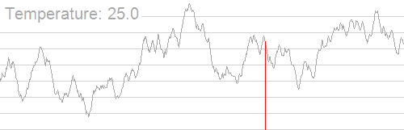

# 模拟退火 - OI Wiki

- Source: https://oi-wiki.org/misc/simulated-annealing/

# 模拟退火

## 引入

模拟退火是一种随机化算法．当一个问题的方案数量极大（甚至是无穷的）而且不是一个单峰函数时，我们常使用模拟退火求解．

## 解释

根据 [爬山算法](../hill-climbing/) 的过程，我们发现：对于一个当前最优解附近的非最优解，爬山算法直接舍去了这个解．而很多情况下，我们需要去接受这个非最优解从而跳出这个局部最优解，即为模拟退火算法．

什么是退火？（选自 [百度百科](https://baike.baidu.com/item/%E9%80%80%E7%81%AB/1039313)）

退火是一种金属热处理工艺，指的是将金属缓慢加热到一定温度，保持足够时间，然后以适宜速度冷却．目的是降低硬度，改善切削加工性；消除残余应力，稳定尺寸，减少变形与裂纹倾向；细化晶粒，调整组织，消除组织缺陷．准确的说，退火是一种对材料的热处理工艺，包括金属材料、非金属材料．而且新材料的退火目的也与传统金属退火存在异同．

由于退火的规律引入了更多随机因素，那么我们得到最优解的概率会大大增加．于是我们可以去模拟这个过程，将目标函数作为能量函数．

### 过程

先用一句话概括：如果新状态的解更优则修改答案，否则以一定概率接受新状态．

我们定义当前温度为 𝑇T，新状态 𝑆′S′ 与已知状态 𝑆S（新状态由已知状态通过随机的方式得到）之间的能量（值）差为 Δ𝐸ΔE（Δ𝐸 ⩾0ΔE⩾0），则发生状态转移（修改最优解）的概率为

𝑃(Δ𝐸)={1,𝑆′ is better than 𝑆,e−Δ𝐸𝑇,otherwise.P(ΔE)={1,S′ is better than S,e−ΔET,otherwise.

**注意** ：我们有时为了使得到的解更有质量，会在模拟退火结束后，以当前温度在得到的解附近多次随机状态，尝试得到更优的解（其过程与模拟退火相似）．

### 如何退火（降温）

模拟退火时我们有三个参数：初始温度 𝑇0T0，降温系数 𝑑d，终止温度 𝑇𝑘Tk．其中 𝑇0T0 是一个比较大的数，𝑑d 是一个非常接近 11 但是小于 11 的数，𝑇𝑘Tk 是一个接近 00 的正数．

首先让温度 𝑇 =𝑇0T=T0，然后按照上述步骤进行一次转移尝试，再让 𝑇 =𝑑 ⋅𝑇T=d⋅T．当 𝑇 <𝑇𝑘T<Tk 时模拟退火过程结束，当前最优解即为最终的最优解．

注意为了使得解更为精确，我们通常不直接取当前解作为答案，而是在退火过程中维护遇到的所有解的最优值．

引用一张 [Simulated annealing - Wikipedia](https://en.wikipedia.org/wiki/Simulated_annealing) 的图片（随着温度的降低，跳跃越来越不随机，最优解也越来越稳定）．



## 实现

此处代码以 [「BZOJ 3680」吊打 XXX](https://hydro.ac/p/bzoj-P3680)（求 𝑛n 个点的带权类费马点）为例．

```text 1 2 3 4 5 6 7 8 9 10 11 12 13 14 15 16 17 18 19 20 21 22 23 24 25 26 27 28 29 30 31 32 33 34 35 36 37 38 39 40 41 42 43 44 45 46 47 48 49 50 51 52 53 ``` |  ```text #include <cmath> #include <cstdlib> #include <ctime> #include <iomanip> #include <iostream> constexpr int N = 10005 ; int n , x [ N ], y [ N ], w [ N ]; double ansx , ansy , dis ; double Rand () { return ( double ) rand () / RAND_MAX ; } double calc ( double xx , double yy ) { double res = 0 ; for ( int i = 1 ; i <= n ; ++ i ) { double dx = x [ i ] \- xx , dy = y [ i ] \- yy ; res += sqrt ( dx * dx \+ dy * dy ) * w [ i ]; } if ( res < dis ) dis = res , ansx = xx , ansy = yy ; return res ; } void simulateAnneal () { double t = 100000 ; double nowx = ansx , nowy = ansy ; while ( t > 0.001 ) { double nxtx = nowx \+ t * ( Rand () * 2 \- 1 ); double nxty = nowy \+ t * ( Rand () * 2 \- 1 ); double delta = calc ( nxtx , nxty ) \- calc ( nowx , nowy ); if ( exp ( \- delta / t ) > Rand ()) nowx = nxtx , nowy = nxty ; t *= 0.97 ; } for ( int i = 1 ; i <= 1000 ; ++ i ) { double nxtx = ansx \+ t * ( Rand () * 2 \- 1 ); double nxty = ansy \+ t * ( Rand () * 2 \- 1 ); calc ( nxtx , nxty ); } } int main () { std :: cin . tie ( nullptr ) -> sync_with_stdio ( false ); srand ( 0 ); // 注意，在实际使用中，不应使用固定的随机种子。 std :: cin >> n ; for ( int i = 1 ; i <= n ; ++ i ) { std :: cin >> x [ i ] >> y [ i ] >> w [ i ]; ansx += x [ i ], ansy += y [ i ]; } ansx /= n , ansy /= n , dis = calc ( ansx , ansy ); simulateAnneal (); std :: cout << std :: fixed << std :: setprecision ( 3 ) << ansx << ' ' << ansy << '\n' ; return 0 ; } ```   
---|---  
  
## 一些技巧

### 分块模拟退火

有时函数的峰很多，模拟退火难以跑出最优解．

此时可以把整个值域分成几段，每段跑一遍模拟退火，然后再取最优解．

### 卡时

有一个 `clock()` 函数，返回程序运行时间．

可以把主程序中的 `simulateAnneal();` 换成 `while ((double)clock()/CLOCKS_PER_SEC < MAX_TIME) simulateAnneal();`．这样子就会一直跑模拟退火，直到用时即将超过时间限制．

这里的 `MAX_TIME` 是一个自定义的略小于时限的数（单位：秒）．

## 习题

  * [「BZOJ 3680」吊打 XXX](https://hydro.ac/p/bzoj-P3680)
  * [「JSOI 2016」炸弹攻击](https://loj.ac/problem/2076)
  * [「HAOI 2006」均分数据](https://www.luogu.com.cn/problem/P2503)

* * *

>  __本页面最近更新： 2026/1/7 08:56:54，[更新历史](https://github.com/OI-wiki/OI-wiki/commits/master/docs/misc/simulated-annealing.md)  
>  __发现错误？想一起完善？[在 GitHub 上编辑此页！](https://oi-wiki.org/edit-landing/?ref=/misc/simulated-annealing.md "edit.link.title")  
>  __本页面贡献者：[Ir1d](https://github.com/Ir1d), [Tiphereth-A](https://github.com/Tiphereth-A), [abc1763613206](https://github.com/abc1763613206), [c-forrest](https://github.com/c-forrest), [HeRaNO](https://github.com/HeRaNO), [Mout-sea](https://github.com/Mout-sea), [Siyuan](mailto:294873684@qq.com), [sshwy](https://github.com/sshwy), [7F88FF](mailto:7f88ff@protonmail.com), [ChungZH](https://github.com/ChungZH), [Enter-tainer](https://github.com/Enter-tainer), [Ghastlcon](mailto:ghastlcon@foxmail.com), [Henry-ZHR](https://github.com/Henry-ZHR), [hsfzLZH1](https://github.com/hsfzLZH1), [iamtwz](https://github.com/iamtwz), [kenlig](https://github.com/kenlig), [ouuan](https://github.com/ouuan)  
>  __本页面的全部内容在**[CC BY-SA 4.0](https://creativecommons.org/licenses/by-sa/4.0/deed.zh) 和 [SATA](https://github.com/zTrix/sata-license)** 协议之条款下提供，附加条款亦可能应用
