# Alpha–Beta 剪枝 - OI Wiki

- Source: https://oi-wiki.org/search/alpha-beta/

# Alpha–Beta 剪枝

本页面将简要介绍 Minimax 算法和 Alpha–Beta 剪枝．

## Minimax 算法

Minimax 算法又叫极小化极大算法，是一种最小化最差（即最大损失）情境下的潜在损失的算法．

### 过程

在局面确定的双人零和对弈中，常需要进行对抗搜索，构建一棵每个节点都为一个确定状态的搜索树．奇数层为己方先手，偶数层为对方先手．搜索树上每个叶子节点都会被赋予一个估值，估值越大代表我方赢面越大．我方追求更大的赢面，而对方会设法降低我方的赢面；体现在搜索树上就是，奇数层节点（我方节点）总是会选择赢面最大的子节点状态，而偶数层（对方节点）总是会选择（我方）赢面最小的子节点状态．

Minimax 算法中，会从上到下遍历搜索树，回溯时利用子树信息更新答案，最后得到根节点的值——这就是我方在双方都采取最优策略下能获得的最大分数．

### 示例

来看一个简单的例子．

称我方为 MAX，对方为 MIN，图示如下：


例如，对于如下的局势，假设从左往右搜索，根节点的数值为我方赢面：

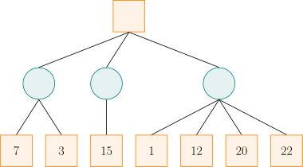

我方应选择中间的路线．因为，如果选择左边的路线，最差的赢面是 33；如果选择中间的路线，最差的赢面是 1515；如果选择右边的路线，最差的赢面是 11．虽然选择右边的路线可能有 2222 的赢面，但足够理性的对方将会使我方只有 11 的赢面．那么，经过权衡，显然选择中间的路线更优．

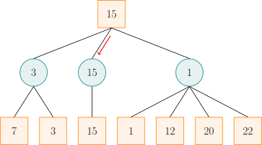

实际上，在看右边的路线时，当发现赢面可能为 11 后就不必再去看赢面为 1212、2020、2222 的分支了．因为相较于左侧两条路线的赢面，已经可以确定右边的路线不是最好的．

朴素的 Minimax 算法常常需要构建一棵庞大的搜索树，时间和空间复杂度都将不能承受．而 Alpha–Beta 剪枝就是利用搜索树每个节点双方分数的上下界来对 Minimax 进行剪枝优化的一种方法．

需要注意的是，对于不同的问题，搜索树每个节点上的值有着不同的含义，它可以是估值、分数、赢的概率等等．为方便起见，下文统一用分数来称呼．

## Alpha–Beta 剪枝

Alpha–Beta 剪枝是针对 Minimax 算法的搜索剪枝．

### 过程

Minimax 算法中，若已知某节点的所有子节点的分数，则可以算出该节点的分数：对于 MAX 节点，取最大分数；对于 MIN 节点，取最小分数．

在搜索进行到某节点但尚未完成时，虽然不能算出该节点的分数，但是可以算出 **目前已经搜索过的节点中** ，双方分数的取值范围．搜索时，维护两个变量 𝛼α 和 𝛽β，分别表示局面进行到该节点时，**考虑所有已经搜索过的节点** ，Alpha 玩家（即寻求最大分数的一方）和 Beta 玩家（即寻求最小分数的一方）能够保证取得的分数的下界和上界．

Alpha–Beta 剪枝的剪枝策略依赖于搜索当前节点时 𝛼α 和 𝛽β 的取值．如果当前节点是 MAX 节点，那么，Alpha 可以继续搜索它的子节点来提高分数下界 𝛼α．但是，如果某次搜索后已经有 𝛼 ≥𝛽α≥β 了，那么这个节点就不可能出现在一次对弈中：只要到达该节点处，Alpha 玩家就能够保证分数至少是 𝛼α；可是 Beta 玩家已经知道存在一种（偏离当前路径的）策略，能够保证分数不超过 𝛽 ≤𝛼β≤α，那么，Beta 玩家自然不会任由局面发展到 **当前节点** 处．同理，如果当前节点是 MIN 节点，且搜索它的某个子节点后已经发现该节点处有 𝛽 ≤𝛼β≤α 成立，那么，同样无需继续搜索其他子节点，因为 Alpha 玩家不会让局面进入 **当前节点** ．总结两种情形可以发现：当 𝛼 ≥𝛽α≥β 时，该节点剩余的分支就不必继续搜索了（也就是可以进行剪枝了）．注意，当 𝛼 =𝛽α=β 时，也需要剪枝，这是因为不会有更好的结果了，但可能有更差的结果．

搜索过程中，无需维护节点分数，只需要维护 𝛼α 和 𝛽β 即可．初始时，令 𝛼 = −∞, 𝛽 = +∞α=−∞, β=+∞．向下搜索时，需要一并下传 𝛼α 和 𝛽β 的信息，以记录两名玩家的备选方案．

搜索完子节点时，需要更新当前节点处的信息．不妨假设当前节点 𝑋X 是 MAX 节点，且刚刚搜索完它的子节点 𝑌Y．那么，节点 𝑋X 处的 𝛽β 值不会改变，只有 𝛼α 值需要与子节点 𝑌Y 的分数取最大值．如果子节点 𝑌Y 是叶子节点，直接用子节点 𝑌Y 的分数更新当前节点 𝑋X 处的 𝛼α 值；否则，只需要用子节点 𝑌Y 的 𝛽β 值更新当前节点 𝑋X 的 𝛼α 值．此时，有三种可能性：

  1. 子节点 𝑌Y 的 𝛽β 值严格位于节点 𝑋X 的 𝛼α 值和 𝛽β 值之间．因为子节点 𝑌Y 继承了节点 𝑋X 的 𝛼α 值且不会更新它，所以，搜索子节点 𝑌Y 完后仍然有 𝛽 >𝛼β>α，就说明搜索子节点 𝑌Y 时没有发生剪枝．子节点 𝑌Y 最终的 𝛽β 值，就等于它继承的节点 𝑋X 的 𝛽β 值和它（指子节点 𝑌Y）的所有子节点的分数中，最小的那个．既然这个最小值严格小于节点 𝑋X 的 𝛽β 值，就说明它一定是子节点 𝑌Y 的所有子节点的分数最小值．因此，作为 MIN 节点，子节点 𝑌Y 的分数就是这个 𝛽β 值．用它更新节点 𝑋X 的 𝛼α 值是合理的．
  2. 子节点 𝑌Y 的 𝛽β 值就等于节点 𝑋X 的 𝛽β 值．如上文所述，这说明子节点 𝑌Y 的所有子节点的分数均不小于节点 𝑋X 的 𝛽β 值．这进一步说明 Beta 玩家不会任由局面进入节点 𝑋X：因为 Alpha 玩家只要选择了子节点 𝑌Y，Beta 玩家就不能取得比 𝛽β 更低的分数．因此，此时使用子节点 𝑌Y 的 𝛽β 值更新节点 𝑋X 的 𝛼α 值，是为了使得节点 𝑋X 处 𝛼 =𝛽α=β，以触发剪枝条件．它的效果与使用 𝑌Y 处实际分数——一个大于等于节点 𝑋X 处 𝛽β 值的数字——更新节点 𝑋X 的 𝛼α 值的效果是一样的．
  3. 子节点 𝑌Y 的 𝛽β 值小于等于节点 𝑋X 的 𝛼α 值．此时，子节点 𝑌Y 触发了剪枝条件，它的实际分数不会超过子节点 𝑌Y 的 𝛽β 值，更不会超过节点 𝑋X 的 𝛼α 值．用子节点 𝑌Y 的实际分数更新节点 𝑋X 的 𝛼α 值不会改变 𝛼α 值．这与使用子节点 𝑌Y 的 𝛽β 值更新节点 𝑋X 的 𝛼α 值的效果是一样的．

这一分析说明，当某个子节点搜索完成后，只有它的分数处于第一种情形时，𝛼α（或 𝛽β）才准确记录了这个子节点作为一个 MAX 节点（或 MIN 节点）的实际分数．对于其他情形，虽然它未必是准确的分数，但是它提供的信息足以保证剪枝的正确进行，从而不影响根节点处的分数记录．

### 示例

本节通过分析一个例子，来展示如何在搜索过程中更新各个节点处的 𝛼α 和 𝛽β 值．过程中，也一并计算了所涉及的节点处的分数．由此，就可以观察每个节点处的实际分数与所记录的 𝛼α 和 𝛽β 值的关系．但应注意，实现这一算法时，并不会计算这些节点的实际分数．

对于如下的局势，假设从左往右搜索：

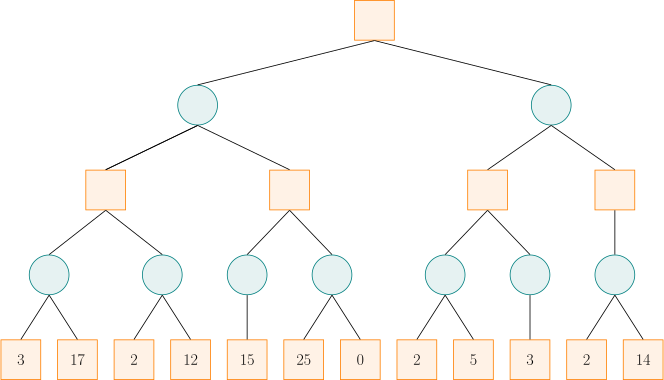

初始化时，令 𝛼 = −∞, 𝛽 = +∞α=−∞, β=+∞，并将这一信息沿着搜索路径下传．

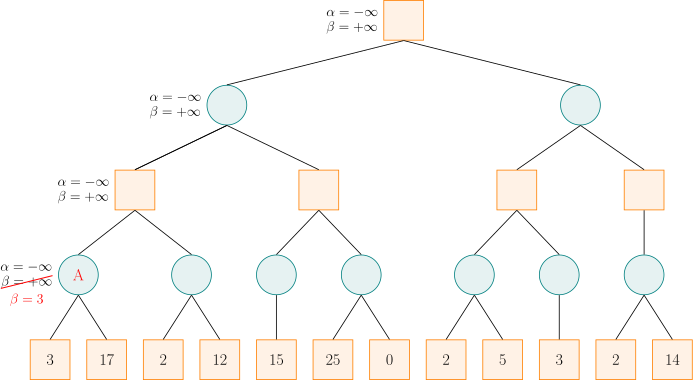

搜索到节点 A 时，由于左子节点的分数为 33，而节点 A 是 MIN 节点，试图找分数小的走法，于是将 𝛽β 值修改为 33，这是因为 33 小于当前的 𝛽β 值（𝛽 = +∞β=+∞）．然后节点 A 的右子节点的分数为 1717，此时不修改节点 A 的 𝛽β 值，这是因为 1717 大于当前的 𝛽β 值（𝛽 =3β=3）．此时，节点 A 的所有子节点已搜索完毕，即可计算出节点 A 的分数为 33，这与该节点处记录的 𝛽β 值一致（前文的情形 1）．

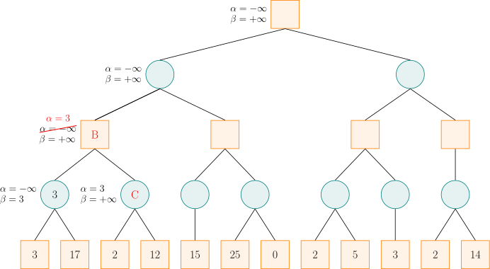

节点 A 是节点 B 的子节点，计算出节点 A 的分数后，可以更新节点 B 的 𝛼α 和 𝛽β 值．由于节点 B 是 MAX 节点，试图找分数大的走法，于是将 𝛼α 值修改为 33，这是因为子节点 A 处的 𝛽β 值（𝛽 =3β=3）大于当前的 𝛼α 值（𝛼 = −∞α=−∞）．之后，搜索节点 B 的右子节点 C，并将节点 B 的 𝛼α 和 𝛽β 值传递给节点 C．

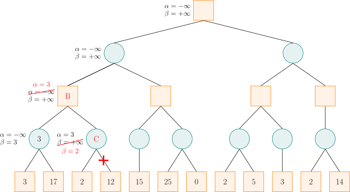

对于节点 C，由于左子节点的分数为 22，而节点 C 是 MIN 节点，于是将 𝛽β 值修改为 22．此时 𝛼 ≥𝛽α≥β，故节点 C 的剩余子节点就不必搜索了，因为可以确定，Alpha 玩家不会允许局面发展到节点 C．此时，节点 C 是 MIN 节点，它的分数就是 22，不超过记录的 𝛽β 值（前文的情形 3）．由于节点 B 的所有子节点搜索完毕，即可计算出节点 B 的分数为 33，与记录的 𝛼α 值相同（前文的情形 1）．

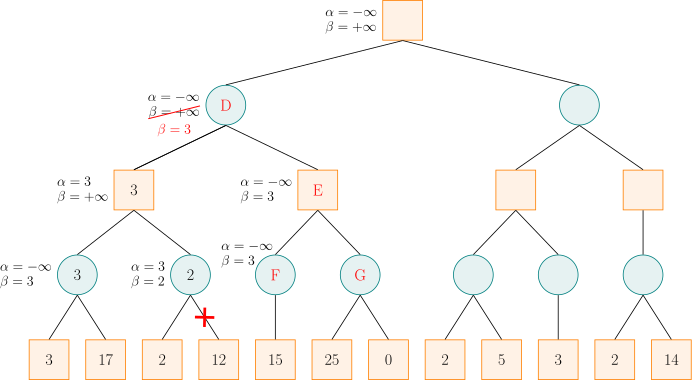

计算出节点 B 的分数后，节点 B 是节点 D 的一个子节点，故可以更新节点 D 的 𝛼α 和 𝛽β 值．由于节点 D 是 MIN 节点，于是将 𝛽β 值修改为 33．然后节点 D 将 𝛼α 和 𝛽β 值传递给节点 E，节点 E 又传递给节点 F．对于节点 F，它只有一个分数为 1515 的子节点，由于 1515 大于当前的 𝛽β 值，而节点 F 为 MIN 节点，所以不更新其 𝛽β 值，然后可以计算出节点 F 的分数为 1515，大于记录的 𝛽β 值（前文的情形 2）．

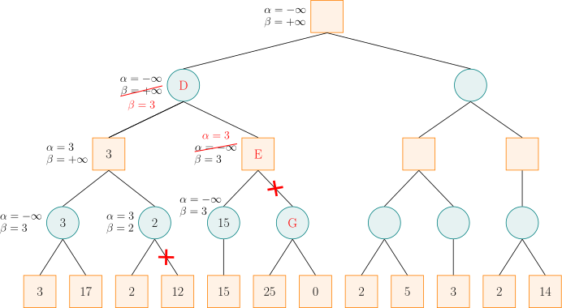

计算出节点 F 的分数后，节点 F 是节点 E 的一个子节点，故可以更新节点 E 的 𝛼α 和 𝛽β 值．节点 E 是 MAX 节点，更新 𝛼α 值，此时 𝛼 ≥𝛽α≥β，故可以剪去节点 E 的余下分支（即节点 G）．然后，节点 E 是 MAX 节点，将节点 E 的分数设为 1515，严格大于记录的 𝛼α 值（前文的情形 3）．利用节点 E 的 𝛼α 值更新节点 D 的 𝛽β 值，仍然是 33．此时，节点 D 的所有子节点搜索完毕，即可计算出节点 D 的分数为 33，等于记录的 𝛽β 值（前文的情形 1）．

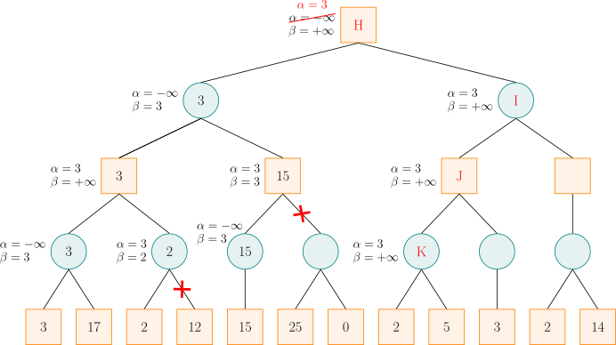

计算出节点 D 的分数后，节点 D 是节点 H 的一个子节点，故可以更新节点 H 的 𝛼α 和 𝛽β 值．节点 H 是 MAX 节点，更新 𝛼α．然后，按搜索顺序，将节点 H 的 𝛼α 和 𝛽β 值依次传递给节点 I、J、K．对于节点 K，其左子节点的分数为 22，而节点 K 是 MIN 节点，更新 𝛽β，此时 𝛼 ≥𝛽α≥β，故可以剪去节点 K 的余下分支．然后，将节点 K 的分数设为 22，小于等于记录的 𝛽β 值（前文的情形 3）．

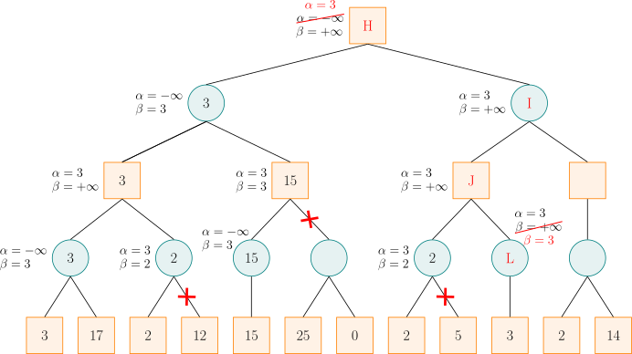

计算出节点 K 的分数后，节点 K 是节点 J 的一个子节点，故可以更新节点 J 的 𝛼α 和 𝛽β 值．节点 J 是 MAX 节点，更新 𝛼α，但是，由于节点 K 的分数小于 𝛼α，所以节点 J 的 𝛼α 值维持 33 不变．然后，将节点 J 的 𝛼α 和 𝛽β 值传递给节点 L．由于节点 L 是 MIN 节点，更新 𝛽 =3β=3，此时 𝛼 ≥𝛽α≥β，故可以剪去节点 L 的余下分支．由于节点 L 没有余下分支，所以此处并没有实际剪枝．然后，将节点 L 的分数设为 33，它小于等于记录的 𝛽β 值（前文的情形 3）．

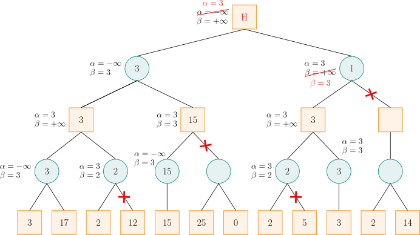

计算出节点 L 的分数后，节点 L 是节点 J 的一个子节点，故可以更新节点 J 的 𝛼α 和 𝛽β 值．节点 J 是 MAX 节点，更新 𝛼α，但是，由于节点 L 的分数小于等于 𝛼α，所以节点 J 的 𝛼α 值维持 33 不变．此时，节点 J 的所有子节点搜索完毕，即可计算出节点 J 的分数为 33，它等于记录的 𝛼α 值（前文的情形 2）．

计算出节点 J 的分数后，节点 J 是节点 I 的一个子节点，故可以更新节点 I 的 𝛼α 和 𝛽β 值．节点 I 是 MIN 节点，更新 𝛽β，此时 𝛼 ≥𝛽α≥β，故可以剪去节点 I 的余下分支．值得注意的是，由于右子节点的存在，节点 I 的实际分数是 22，小于记录的 𝛽β 值（前文的情形 3）．

计算出节点 I 的分数后，节点 I 是节点 H 的一个子节点，故可以更新节点 H 的 𝛼α 和 𝛽β 值．节点 H 是 MAX 节点，更新 𝛼α，但是，由于节点 I 的分数小于等于 𝛼α，所以节点 H 的 𝛼α 值维持 33 不变．此时，节点 H 的所有子节点搜索完毕，即可计算出节点 H 的分数为 33，它等于记录的 𝛼α 值（前文的情形 1）．

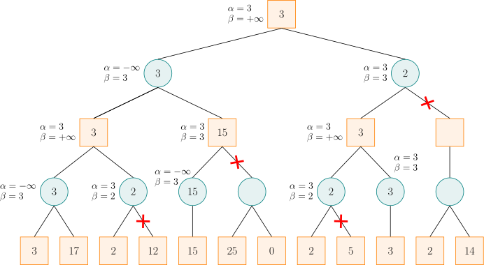

这就是最终结果．

### 实现

参考代码

```text 1 2 3 4 5 6 7 8 9 10 11 12 13 14 15 16 17 18 ``` |  ```text int alpha_beta ( int u , int alph , int beta , bool is_max ) { if ( ! son_num [ u ]) return val [ u ]; if ( is_max ) { for ( int i = 0 ; i < son_num [ u ]; ++ i ) { int d = son [ u ][ i ]; alph = max ( alph , alpha_beta ( d , alph , beta , ! is_max )); if ( alph >= beta ) break ; } return alph ; } else { for ( int i = 0 ; i < son_num [ u ]; ++ i ) { int d = son [ u ][ i ]; beta = min ( beta , alpha_beta ( d , alph , beta , ! is_max )); if ( alph >= beta ) break ; } return beta ; } } ```   
---|---  
  
## 参考资料与注释

  * [Minimax Algorithm - Wikipedia](https://en.wikipedia.org/wiki/Minimax#Minimax_algorithm_with_alternate_moves)
  * [Alpha–beta pruning - Wikipedia](https://en.wikipedia.org/wiki/Alpha%E2%80%93beta_pruning)

**本文部分引用自博文[详解 Minimax 算法与α-β剪枝_文剑木然](https://blog.csdn.net/wenjianmuran/article/details/90633418)，遵循 CC 4.0 BY-SA 版权协议．内容有改动．**

* * *

>  __本页面最近更新： 2026/1/7 08:56:54，[更新历史](https://github.com/OI-wiki/OI-wiki/commits/master/docs/search/alpha-beta.md)  
>  __发现错误？想一起完善？[在 GitHub 上编辑此页！](https://oi-wiki.org/edit-landing/?ref=/search/alpha-beta.md "edit.link.title")  
>  __本页面贡献者：[Tiphereth-A](https://github.com/Tiphereth-A), [Alphnia](https://github.com/Alphnia), [c-forrest](https://github.com/c-forrest), [iamtwz](https://github.com/iamtwz), [Marcythm](https://github.com/Marcythm), [Pierceby](https://github.com/Pierceby), [Xeonacid](https://github.com/Xeonacid)  
>  __本页面的全部内容在**[CC BY-SA 4.0](https://creativecommons.org/licenses/by-sa/4.0/deed.zh) 和 [SATA](https://github.com/zTrix/sata-license)** 协议之条款下提供，附加条款亦可能应用
