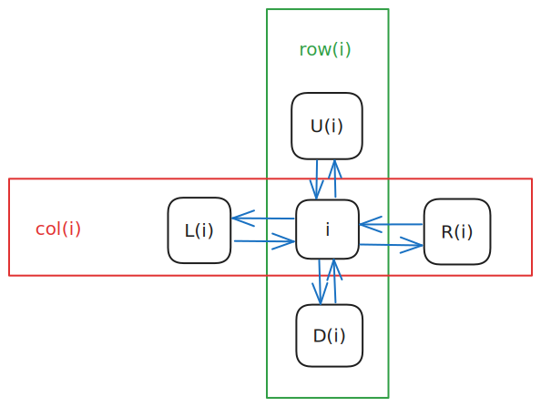
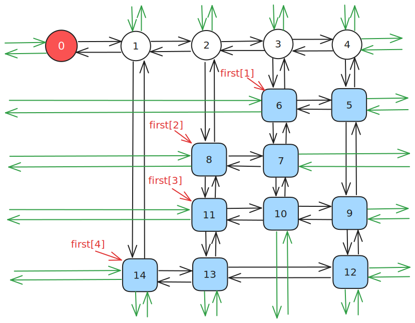
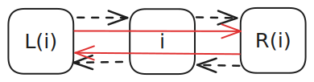
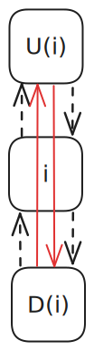
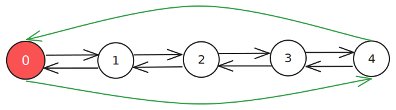
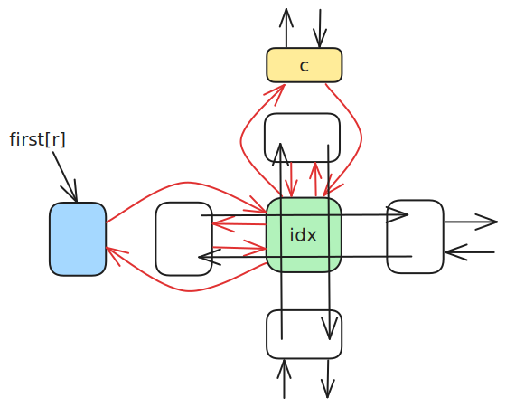

# Dancing Links - OI Wiki

- Source: https://oi-wiki.org/search/dlx/

# Dancing Links

本页面将介绍精确覆盖问题、重复覆盖问题，解决这两个问题的算法「X 算法」，以及用来优化 X 算法的双向十字链表 Dancing Link．本页也将介绍如何在建模的配合下使用 DLX 解决一些搜索题．

## 精确覆盖问题

### 定义

精确覆盖问题（英文：Exact Cover Problem）是指给定许多集合 𝑆𝑖(1 ≤𝑖 ≤𝑛)Si(1≤i≤n) 以及一个集合 𝑋X，求满足以下条件的无序多元组 (𝑇1,𝑇2,⋯,𝑇𝑚)(T1,T2,⋯,Tm)：

  1. ∀𝑖,𝑗 ∈[1,𝑚],𝑇𝑖⋂𝑇𝑗 =∅(𝑖 ≠𝑗)∀i,j∈[1,m],Ti⋂Tj=∅(i≠j)
  2. 𝑋 =𝑚⋃𝑖=1𝑇𝑖X=⋃i=1mTi
  3. ∀𝑖 ∈[1,𝑚],𝑇𝑖 ∈{𝑆1,𝑆2,⋯,𝑆𝑛}∀i∈[1,m],Ti∈{S1,S2,⋯,Sn}

### 解释

例如，若给出

𝑆1={5,9,17}𝑆2={1,8,119}𝑆3={3,5,17}𝑆4={1,8}𝑆5={3,119}𝑆6={8,9,119}𝑋={1,3,5,8,9,17,119}S1={5,9,17}S2={1,8,119}S3={3,5,17}S4={1,8}S5={3,119}S6={8,9,119}X={1,3,5,8,9,17,119}

则 (𝑆1,𝑆4,𝑆5)(S1,S4,S5) 为一组合法解．

### 问题转化

将 𝑛⋃𝑖=1𝑆𝑖⋃i=1nSi 中的所有数离散化，可以得到这么一个模型：

> 给定一个 01 矩阵，你可以选择一些行（row），使得最终每列（column）1都恰好有一个 1． 举个例子，我们对上文中的例子进行建模，可以得到这么一个矩阵：

⎛⎜ ⎜ ⎜ ⎜ ⎜ ⎜ ⎜ ⎜ ⎜ ⎜ ⎜ ⎜ ⎜⎝001011010010010110010100100001000010001101⎞⎟ ⎟ ⎟ ⎟ ⎟ ⎟ ⎟ ⎟ ⎟ ⎟ ⎟ ⎟ ⎟⎠(001011010010010110010100100001000010001101)

> 其中第 𝑖i 行表示着 𝑆𝑖Si，而这一行的每个数依次表示 [1 ∈𝑆𝑖],[3 ∈𝑆𝑖],[5 ∈𝑆𝑖],⋯,[119 ∈𝑆𝑖][1∈Si],[3∈Si],[5∈Si],⋯,[119∈Si]．

### 实现

#### 暴力 1

一种方法是枚举选择哪些行，最后检查这个方案是否合法．

因为每一行都有选或者不选两种状态，所以枚举行的时间复杂度是 𝑂(2𝑛)O(2n) 的；

而每次检查都需要 𝑂(𝑛𝑚)O(nm) 的时间复杂度．所以总的复杂度是 𝑂(𝑛𝑚 ⋅2𝑛)O(nm⋅2n)．

实现

```text 1 2 3 4 5 6 7 8 9 10 11 12 13 14 15 16 17 18 19 20 21 22 23 24 25 ``` |  ```text int ok = 0 ; for ( int state = 0 ; state < 1 << n ; ++ state ) { // 枚举每行是否被选 for ( int i = 1 ; i <= n ; ++ i ) if (( 1 << i \- 1 ) & state ) for ( int j = 1 ; j <= m ; ++ j ) a [ i ][ j ] = 1 ; int flag = 1 ; for ( int j = 1 ; j <= m ; ++ j ) for ( int i = 1 , bo = 0 ; i <= n ; ++ i ) if ( a [ i ][ j ]) { if ( bo ) flag = 0 ; else bo = 1 ; } if ( ! flag ) continue ; else { ok = 1 ; for ( int i = 1 ; i <= n ; ++ i ) if (( 1 << i \- 1 ) & state ) printf ( "%d " , i ); puts ( "" ); } memset ( a , 0 , sizeof ( a )); } if ( ! ok ) puts ( "No solution." ); ```   
---|---  
  
#### 暴力 2

考虑到 01 矩阵的特殊性质，每一行都可以看做一个 𝑚m 位二进制数．

因此原问题转化为

> 给定 𝑛n 个 𝑚m 位二进制数，要求选择一些数，使得任意两个数的与都为 0，且所有数的或为 2𝑚 −12m−1．`tmp` 表示的是截至目前被选中的二进制数的或．

因为每一行都有选或者不选两种状态，所以枚举行的时间复杂度为 𝑂(2𝑛)O(2n)；

而每次计算 `tmp` 都需要 𝑂(𝑛)O(n) 的时间复杂度．所以总的复杂度为 𝑂(𝑛 ⋅2𝑛)O(n⋅2n)．

实现

```text 1 2 3 4 5 6 7 8 9 10 11 12 13 14 15 16 17 18 19 20 21 22 ``` |  ```text int ok = 0 ; for ( int i = 1 ; i <= n ; ++ i ) for ( int j = m ; j >= 1 ; \-- j ) num [ i ] = num [ i ] << 1 | a [ i ][ j ]; for ( int state = 0 ; state < 1 << n ; ++ state ) { int tmp = 0 ; bool flag = true ; for ( int i = 1 ; i <= n ; ++ i ) if (( 1 << i \- 1 ) & state ) { if ( tmp & num [ i ]) { flag = false ; break ; } tmp |= num [ i ]; } if ( flag && tmp == ( 1 << m ) \- 1 ) { ok = 1 ; for ( int i = 1 ; i <= n ; ++ i ) if (( 1 << i \- 1 ) & state ) printf ( "%d " , i ); puts ( "" ); } } if ( ! ok ) puts ( "No solution." ); ```   
---|---  
  
## 重复覆盖问题

重复覆盖问题与精确覆盖问题类似，但没有对元素相似性的限制．下文介绍的 X 算法 原本针对精确覆盖问题，但经过一些修改和优化（已标注在其中）同样可以高效地解决重复覆盖问题．

## X 算法

Donald E. Knuth 提出了 X 算法 (Algorithm X)，其思想与刚才的暴力差不多，但是方便优化．

### 过程

继续以上文中中提到的例子为载体，得到一个这样的 01 矩阵：

⎛⎜ ⎜ ⎜ ⎜ ⎜ ⎜ ⎜ ⎜ ⎜ ⎜ ⎜ ⎜ ⎜⎝001011010010010110010100100001000010001101⎞⎟ ⎟ ⎟ ⎟ ⎟ ⎟ ⎟ ⎟ ⎟ ⎟ ⎟ ⎟ ⎟⎠(001011010010010110010100100001000010001101)

  1. 此时第一行有 33 个 11，第二行有 33 个 11，第三行有 33 个 11，第四行有 22 个 11，第五行有 22 个 11，第六行有 33 个 11．选择第一行，将它删除，并将所有 11 所在的列打上标记；

⎛⎜ ⎜ ⎜ ⎜ ⎜ ⎜ ⎜ ⎜ ⎜ ⎜ ⎜ ⎜ ⎜⎝001011010010010110010100100001000010001101⎞⎟ ⎟ ⎟ ⎟ ⎟ ⎟ ⎟ ⎟ ⎟ ⎟ ⎟ ⎟ ⎟⎠(001011010010010110010100100001000010001101)
  2. 选择所有被标记的列，将它们删除，并将这些列中含 11 的行打上标记（重复覆盖问题无需打标记）；

⎛⎜ ⎜ ⎜ ⎜ ⎜ ⎜ ⎜ ⎜ ⎜ ⎜ ⎜ ⎜ ⎜⎝001011010010010110010100100001000010001101⎞⎟ ⎟ ⎟ ⎟ ⎟ ⎟ ⎟ ⎟ ⎟ ⎟ ⎟ ⎟ ⎟⎠(001011010010010110010100100001000010001101)
  3. 选择所有被标记的行，将它们删除；

⎛⎜ ⎜ ⎜ ⎜ ⎜ ⎜ ⎜ ⎜ ⎜ ⎜ ⎜ ⎜ ⎜⎝001011010010010110010100100001000010001101⎞⎟ ⎟ ⎟ ⎟ ⎟ ⎟ ⎟ ⎟ ⎟ ⎟ ⎟ ⎟ ⎟⎠(001011010010010110010100100001000010001101)

**这表示这一行已被选择，且这一行的所有 11 所在的列不能有其他 11 了**．

于是得到一个新的小 01 矩阵：

⎛⎜ ⎜ ⎜⎝101110100101⎞⎟ ⎟ ⎟⎠(101110100101)
  4. 此时第一行（原来的第二行）有 33 个 11，第二行（原来的第四行）有 22 个 11，第三行（原来的第五行）有 22 个 11．选择第一行（原来的第二行），将它删除，并将所有 11 所在的列打上标记；

⎛⎜ ⎜ ⎜⎝101110100101⎞⎟ ⎟ ⎟⎠(101110100101)
  5. 选择所有被标记的列，将它们删除，并将这些列中含 11 的行打上标记；

⎛⎜ ⎜ ⎜⎝101110100101⎞⎟ ⎟ ⎟⎠(101110100101)
  6. 选择所有被标记的行，将它们删除；

⎛⎜ ⎜ ⎜⎝101110100101⎞⎟ ⎟ ⎟⎠(101110100101)

这样就得到了一个空矩阵．但是上次删除的行 `1 0 1 1` 不是全 11 的，说明选择有误；

()()
  7. 回溯到步骤 4，考虑选择第二行（原来的第四行），将它删除，并将所有 11 所在的列打上标记；

⎛⎜ ⎜ ⎜⎝101110100101⎞⎟ ⎟ ⎟⎠(101110100101)
  8. 选择所有被标记的列，将它们删除，并将这些列中含 11 的行打上标记；

⎛⎜ ⎜ ⎜⎝101110100101⎞⎟ ⎟ ⎟⎠(101110100101)
  9. 选择所有被标记的行，将它们删除；

⎛⎜ ⎜ ⎜⎝101110100101⎞⎟ ⎟ ⎟⎠(101110100101)

于是我们得到了这样的一个矩阵：

(11)(11)
  10. 此时第一行（原来的第五行）有 22 个 11，将它们全部删除，得到一个空矩阵：

()()
  11. 上一次删除的时候，删除的是全 11 的行，因此成功，算法结束．

答案即为被删除的三行：1,4,51,4,5．

强烈建议自己模拟一遍矩阵删除、还原与回溯的过程后，再接着阅读下文．

通过上述步骤，可将 X 算法的流程概括如下：

  1. 对于现在的矩阵 𝑀M，选择并标记一行 𝑟r，将 𝑟r 添加至 𝑆S 中；
  2. 如果尝试了所有的 𝑟r 却无解，则算法结束，输出无解；
  3. 标记与 𝑟r 相关的行 𝑟𝑖ri 和 𝑐𝑖ci（相关的行和列与 X 算法 中第 2 步定义相同，下同）；
  4. 删除所有标记的行和列，得到新矩阵 𝑀′M′；
  5. 如果 𝑀′M′ 为空，且 𝑟r 为全 11，则算法结束，输出被删除的行组成的集合 𝑆S；

如果 𝑀′M′ 为空，且 𝑟r 不全为 11，则恢复与 𝑟r 相关的行 𝑟𝑖ri 以及列 𝑐𝑖ci，跳转至步骤 1；

如果 𝑀′M′ 不为空，则跳转至步骤 1．

不难看出，X 算法需要大量的「删除行」、「删除列」和「恢复行」、「恢复列」的操作．

一个朴素的想法是，使用一个二维数组存放矩阵，再用四个数组分别存放每一行与之相邻的行编号，每次删除和恢复仅需更新四个数组中的元素．但由于一般问题的矩阵中 0 的数量远多于 1 的数量，这样做的空间复杂度难以接受．

Donald E. Knuth 想到了用双向十字链表来维护这些操作．

而在双向十字链表上不断跳跃的过程被形象地比喻成「跳跃」，因此被用来优化 X 算法的双向十字链表也被称为「Dancing Links」．

## Dancing Links 优化的 X 算法

### 预编译命令

```text 1 ``` |  ```text #define IT(i, A, x) for (i = A[x]; i != x; i = A[i]) ```   
---|---  
  
### 定义

双向十字链表中存在四个指针域，分别指向上、下、左、右的元素；且每个元素 𝑖i 在整个双向十字链表系中都对应着一个格子，因此还要表示 𝑖i 所在的列和所在的行，如图所示：



大型的双向链表则更为复杂：



每一行都有一个行首指示，每一列都有一个列指示．

行首指示为 `first[]`，列指示是我们新建的 𝑐 +1c+1 个哨兵结点．值得注意的是，**行首指示并非是链表中的哨兵结点** ．它是虚拟的，类似于邻接表中的 `first[]` 数组，**直接指向** 这一行中的首元素．

同时，每一列都有一个 `siz[]` 表示这一列的元素个数．

特殊地，00 号结点无右结点等价于这个 Dancing Links 为空．

```text 1 2 3 4 ``` |  ```text constexpr int MS = 1e5 \+ 5 ; int n , m , idx , first [ MS ], siz [ MS ]; int L [ MS ], R [ MS ], U [ MS ], D [ MS ]; int col [ MS ], row [ MS ]; ```   
---|---  
  
### 过程

#### remove 操作

`remove(c)` 表示在 Dancing Links 中删除第 𝑐c 列以及与其相关的行和列．

先将 𝑐c 删除，此时：

  * 𝑐c 左侧的结点的右结点应为 𝑐c 的右结点．
  * 𝑐c 右侧的结点的左结点应为 𝑐c 的左结点．

即 `L[R[c]] = L[c], R[L[c]] = R[c];`．



然后顺着这一列往下走，把走过的每一行都删掉．

如何删掉每一行呢？枚举当前行的指针 𝑗j，此时：

  * 𝑗j 上方的结点的下结点应为 𝑗j 的下结点．
  * 𝑗j 下方的结点的上结点应为 𝑗j 的上结点．

注意要修改每一列的元素个数．

即 `U[D[j]] = U[j], D[U[j]] = D[j], --siz[col[j]];`．



`remove` 函数的代码实现如下：

实现

```text 1 2 3 4 5 6 7 8 9 ``` |  ```text void remove ( const int & c ) { int i , j ; L [ R [ c ]] = L [ c ], R [ L [ c ]] = R [ c ]; // 顺着这一列从上往下遍历 IT ( i , D , c ) // 顺着这一行从左往右遍历 IT ( j , R , i ) U [ D [ j ]] = U [ j ], D [ U [ j ]] = D [ j ], \-- siz [ col [ j ]]; } ```   
---|---  
  
#### recover 操作

`recover(c)` 表示在 Dancing Links 中还原第 𝑐c 列以及与其相关的行和列．

`recover(c)` 即 `remove(c)` 的逆操作，这里不再赘述．

**值得注意的是，** `recover(c)` **的所有操作的顺序与** `remove(c)` **的操作恰好相反．**

`recover(c)` 的代码实现如下：

实现

```text 1 2 3 4 5 ``` |  ```text void recover ( const int & c ) { int i , j ; IT ( i , U , c ) IT ( j , L , i ) U [ D [ j ]] = D [ U [ j ]] = j , ++ siz [ col [ j ]]; L [ R [ c ]] = R [ L [ c ]] = c ; } ```   
---|---  
  
#### build 操作

`build(r, c)` 表示新建一个大小为 𝑟 ×𝑐r×c，即有 𝑟r 行，𝑐c 列的 Dancing Links．

新建 𝑐 +1c+1 个结点作为列指示．

第 𝑖i 个点的左结点为 𝑖 −1i−1，右结点为 𝑖 +1i+1，上结点为 𝑖i，下结点为 𝑖i．特殊地，00 结点的左结点为 𝑐c，𝑐c 结点的右结点为 00．

于是我们得到了一个环状双向链表：



这样就初始化了一个 Dancing Links．

`build(r, c)` 的代码实现如下：

实现

```text 1 2 3 4 5 6 7 8 9 10 ``` |  ```text void build ( const int & r , const int & c ) { n = r , m = c ; for ( int i = 0 ; i <= c ; ++ i ) { L [ i ] = i \- 1 , R [ i ] = i \+ 1 ; U [ i ] = D [ i ] = i ; } L [ 0 ] = c , R [ c ] = 0 , idx = c ; memset ( first , 0 , sizeof ( first )); memset ( siz , 0 , sizeof ( siz )); } ```   
---|---  
  
#### insert 操作

`insert(r, c)` 表示在第 𝑟r 行，第 𝑐c 列插入一个结点．

插入操作分为两种情况：

  * 如果第 𝑟r 行没有元素，那么直接插入一个元素，并使 `first[r]` 指向这个元素．

这可以通过 `first[r] = L[idx] = R[idx] = idx;` 来实现．

  * 如果第 𝑟r 行有元素，那么将这个新元素用一种特殊的方式与 𝑐c 和 𝑓𝑖𝑟𝑠𝑡(𝑟)first(r) 连接起来．

设这个新元素为 𝑖𝑑𝑥idx，然后：

    * 把 𝑖𝑑𝑥idx 插入到 𝑐c 的正下方，此时：

      * 𝑖𝑑𝑥idx 下方的结点为原来 𝑐c 的下结点；
      * 𝑖𝑑𝑥idx 下方的结点（即原来 𝑐c 的下结点）的上结点为 𝑖𝑑𝑥idx;
      * 𝑖𝑑𝑥idx 的上结点为 𝑐c；
      * 𝑐c 的下结点为 𝑖𝑑𝑥idx．

注意记录 𝑖𝑑𝑥idx 的所在列和所在行，以及更新这一列的元素个数．

```text 1 2 ``` |  ```text col [ ++ idx ] = c , row [ idx ] = r , ++ siz [ c ]; U [ idx ] = c , D [ idx ] = D [ c ], U [ D [ c ]] = idx , D [ c ] = idx ; ```   
---|---  
  
**强烈建议读者完全掌握这几步的顺序后再继续阅读本文．**

    * 把 𝑖𝑑𝑥idx 插入到 𝑓𝑖𝑟𝑠𝑡(𝑟)first(r) 的正右方，此时：

      * 𝑖𝑑𝑥idx 右侧的结点为原来 𝑓𝑖𝑟𝑠𝑡(𝑟)first(r) 的右结点；
      * 原来 𝑓𝑖𝑟𝑠𝑡(𝑟)first(r) 右侧的结点的左结点为 𝑖𝑑𝑥idx；
      * 𝑖𝑑𝑥idx 的左结点为 𝑓𝑖𝑟𝑠𝑡(𝑟)first(r)；
      * 𝑓𝑖𝑟𝑠𝑡(𝑟)first(r) 的右结点为 𝑖𝑑𝑥idx．

```text 1 2 ``` |  ```text L [ idx ] = first [ r ], R [ idx ] = R [ first [ r ]]; L [ R [ first [ r ]]] = idx , R [ first [ r ]] = idx ; ```   
---|---  
  
**强烈建议读者完全掌握这几步的顺序后再继续阅读本文．**

`insert(r, c)` 这个操作可以通过图片来辅助理解：



留心曲线箭头的方向．

`insert(r, c)` 的代码实现如下：

实现

```text 1 2 3 4 5 6 7 8 9 10 ``` |  ```text void insert ( const int & r , const int & c ) { row [ ++ idx ] = r , col [ idx ] = c , ++ siz [ c ]; U [ idx ] = c , D [ idx ] = D [ c ], U [ D [ c ]] = idx , D [ c ] = idx ; if ( ! first [ r ]) first [ r ] = L [ idx ] = R [ idx ] = idx ; else { L [ idx ] = first [ r ], R [ idx ] = R [ first [ r ]]; L [ R [ first [ r ]]] = idx , R [ first [ r ]] = idx ; } } ```   
---|---  
  
#### dance 操作

`dance()` 即为递归地删除以及还原各个行列的过程．

  1. 如果 00 号结点没有右结点，那么矩阵为空，记录答案并返回；
  2. 选择列元素个数最少的一列，并删掉这一列；
  3. 遍历这一列所有有 11 的行，枚举它是否被选择；
  4. 递归调用 `dance()`，如果可行，则返回；如果不可行，则恢复被选择的行；
  5. 如果无解，则返回．

`dance()` 的代码实现如下：

实现

```text 1 2 3 4 5 6 7 8 9 10 11 12 13 14 15 16 17 ``` |  ```text bool dance ( int dep ) { int i , j , c = R [ 0 ]; if ( ! R [ 0 ]) { ans = dep ; return true ; } IT ( i , R , 0 ) if ( siz [ i ] < siz [ c ]) c = i ; remove ( c ); IT ( i , D , c ) { stk [ dep ] = row [ i ]; IT ( j , R , i ) remove ( col [ j ]); if ( dance ( dep \+ 1 )) return true ; IT ( j , L , i ) recover ( col [ j ]); } recover ( c ); return false ; } ```   
---|---  
  
其中 `stk[]` 用来记录答案．

注意我们每次优先选择列元素个数最少的一列进行删除，这样能保证程序具有一定的启发性，使搜索树分支最少．

对于重复覆盖问题，在搜索时可以用估价函数（与 [A*](../astar/) 中类似）进行剪枝：若当前最好情况下所选行数超过目前最优解，则可以直接返回．

## 模板

[模板代码](https://www.luogu.com.cn/problem/P4929)

```text 1 2 3 4 5 6 7 8 9 10 11 12 13 14 15 16 17 18 19 20 21 22 23 24 25 26 27 28 29 30 31 32 33 34 35 36 37 38 39 40 41 42 43 44 45 46 47 48 49 50 51 52 53 54 55 56 57 58 59 60 61 62 63 64 65 66 67 68 69 70 71 72 73 74 75 76 77 78 79 80 81 82 83 84 85 86 87 88 89 90 ``` |  ```text #include <cctype> #include <cstring> #include <iostream> constexpr int N = 500 \+ 10 ; int n , m , ans ; int stk [ N ]; struct DLX { static constexpr int MAXSIZE = 1e5 \+ 10 ; int n , m , tot , first [ MAXSIZE \+ 10 ], siz [ MAXSIZE \+ 10 ]; int L [ MAXSIZE \+ 10 ], R [ MAXSIZE \+ 10 ], U [ MAXSIZE \+ 10 ], D [ MAXSIZE \+ 10 ]; int col [ MAXSIZE \+ 10 ], row [ MAXSIZE \+ 10 ]; void build ( const int & r , const int & c ) { // 进行build操作 n = r , m = c ; for ( int i = 0 ; i <= c ; ++ i ) { L [ i ] = i \- 1 , R [ i ] = i \+ 1 ; U [ i ] = D [ i ] = i ; } L [ 0 ] = c , R [ c ] = 0 , tot = c ; memset ( first , 0 , sizeof ( first )); memset ( siz , 0 , sizeof ( siz )); } void insert ( const int & r , const int & c ) { // 进行insert操作 col [ ++ tot ] = c , row [ tot ] = r , ++ siz [ c ]; D [ tot ] = D [ c ], U [ D [ c ]] = tot , U [ tot ] = c , D [ c ] = tot ; if ( ! first [ r ]) first [ r ] = L [ tot ] = R [ tot ] = tot ; else { R [ tot ] = R [ first [ r ]], L [ R [ first [ r ]]] = tot ; L [ tot ] = first [ r ], R [ first [ r ]] = tot ; } } void remove ( const int & c ) { // 进行remove操作 int i , j ; L [ R [ c ]] = L [ c ], R [ L [ c ]] = R [ c ]; for ( i = D [ c ]; i != c ; i = D [ i ]) for ( j = R [ i ]; j != i ; j = R [ j ]) U [ D [ j ]] = U [ j ], D [ U [ j ]] = D [ j ], \-- siz [ col [ j ]]; } void recover ( const int & c ) { // 进行recover操作 int i , j ; for ( i = U [ c ]; i != c ; i = U [ i ]) for ( j = L [ i ]; j != i ; j = L [ j ]) U [ D [ j ]] = D [ U [ j ]] = j , ++ siz [ col [ j ]]; L [ R [ c ]] = R [ L [ c ]] = c ; } bool dance ( int dep ) { // dance if ( ! R [ 0 ]) { ans = dep ; return true ; } int i , j , c = R [ 0 ]; for ( i = R [ 0 ]; i != 0 ; i = R [ i ]) if ( siz [ i ] < siz [ c ]) c = i ; remove ( c ); for ( i = D [ c ]; i != c ; i = D [ i ]) { stk [ dep ] = row [ i ]; for ( j = R [ i ]; j != i ; j = R [ j ]) remove ( col [ j ]); if ( dance ( dep \+ 1 )) return true ; for ( j = L [ i ]; j != i ; j = L [ j ]) recover ( col [ j ]); } recover ( c ); return false ; } } solver ; using std :: cin ; using std :: cout ; int main () { cin . tie ( nullptr ) -> sync_with_stdio ( false ); cin >> n >> m ; solver . build ( n , m ); for ( int i = 1 ; i <= n ; ++ i ) for ( int j = 1 ; j <= m ; ++ j ) { int x ; cin >> x ; if ( x ) solver . insert ( i , j ); } solver . dance ( 1 ); if ( ans ) for ( int i = 1 ; i < ans ; ++ i ) cout << stk [ i ] << ' ' ; else cout << "No Solution! \n " ; return 0 ; } ```   
---|---  
  
## 性质

DLX 递归及回溯的次数与矩阵中 11 的个数有关，与矩阵的 𝑟,𝑐r,c 等参数无关．因此，它的时间复杂度是 **指数级** 的，理论复杂度大概在 𝑂(𝑐𝑛)O(cn) 左右，其中 𝑐c 为某个非常接近于 11 的常数，𝑛n 为矩阵中 11 的个数．

但实际情况下 DLX 表现良好，一般能解决大部分的问题．

## 建模

DLX 的难点，不全在于链表的建立，而在于建模．

请确保已经完全掌握 DLX 模板后再继续阅读本文．

我们每拿到一个题，应该考虑行和列所表示的意义：

  * 行表示 _决策_ ，因为每行对应着一个集合，也就对应着选/不选；

  * 列表示 _状态_ ，因为第 𝑖i 列对应着某个条件 𝑃𝑖Pi．

对于某一行而言，由于不同的列的值不尽相同，我们 **由不同的状态，定义了一个决策** ．

### 例题 1 [P1784 数独](https://www.luogu.com.cn/problem/P1784)

解题思路

先考虑决策是什么．

在这一题中，每一个决策可以用形如 (𝑟,𝑐,𝑤)(r,c,w) 的有序三元组表示．

注意到「宫」并不是决策的参数，因为它 **可以被每个确定的(𝑟,𝑐)(r,c) 表示**．

因此有 9 ×9 ×9 =7299×9×9=729 行．

再考虑状态是什么．

我们思考一下 (𝑟,𝑐,𝑤)(r,c,w) 这个决策将会造成什么影响．记 (𝑟,𝑐)(r,c) 所在的宫为 𝑏b．

  1. 第 𝑟r 行用了一个 𝑤w（用 9 ×9 =819×9=81 列表示）；
  2. 第 𝑐c 列用了一个 𝑤w（用 9 ×9 =819×9=81 列表示）；
  3. 第 𝑏b 宫用了一个 𝑤w（用 9 ×9 =819×9=81 列表示）；
  4. (𝑟,𝑐)(r,c) 中填入了一个数（用 9 ×9 =819×9=81 列表示）．

因此有 81 ×4 =32481×4=324 列，共 729 ×4 =2916729×4=2916 个 11．

至此，我们成功地将 9 ×99×9 的数独问题转化成了一个 **有 729729 行，324324 列，共 29162916 个 11** 的精确覆盖问题．

参考代码

```text 1 2 3 4 5 6 7 8 9 10 11 12 13 14 15 16 17 18 19 20 21 22 23 24 25 26 27 28 29 30 31 32 33 34 35 36 37 38 39 40 41 42 43 44 45 46 47 48 49 50 51 52 53 54 55 56 57 58 59 60 61 62 63 64 65 66 67 68 69 70 71 72 73 74 75 76 77 78 79 80 81 82 83 84 85 86 87 88 89 90 91 92 93 94 95 96 97 98 99 100 101 102 103 104 105 106 107 108 109 110 111 112 ``` |  ```text #include <cctype> #include <cstring> #include <iostream> constexpr int N = 1e6 \+ 10 ; int ans [ 10 ][ 10 ], stk [ N ]; struct DLX { static constexpr int MAXSIZE = 1e5 \+ 10 ; int n , m , tot , first [ MAXSIZE \+ 10 ], siz [ MAXSIZE \+ 10 ]; int L [ MAXSIZE \+ 10 ], R [ MAXSIZE \+ 10 ], U [ MAXSIZE \+ 10 ], D [ MAXSIZE \+ 10 ]; int col [ MAXSIZE \+ 10 ], row [ MAXSIZE \+ 10 ]; void build ( const int & r , const int & c ) { // 进行build操作 n = r , m = c ; for ( int i = 0 ; i <= c ; ++ i ) { L [ i ] = i \- 1 , R [ i ] = i \+ 1 ; U [ i ] = D [ i ] = i ; } L [ 0 ] = c , R [ c ] = 0 , tot = c ; memset ( first , 0 , sizeof ( first )); memset ( siz , 0 , sizeof ( siz )); } void insert ( const int & r , const int & c ) { // 进行insert操作 col [ ++ tot ] = c , row [ tot ] = r , ++ siz [ c ]; D [ tot ] = D [ c ], U [ D [ c ]] = tot , U [ tot ] = c , D [ c ] = tot ; if ( ! first [ r ]) first [ r ] = L [ tot ] = R [ tot ] = tot ; else { R [ tot ] = R [ first [ r ]], L [ R [ first [ r ]]] = tot ; L [ tot ] = first [ r ], R [ first [ r ]] = tot ; } } void remove ( const int & c ) { // 进行remove操作 int i , j ; L [ R [ c ]] = L [ c ], R [ L [ c ]] = R [ c ]; for ( i = D [ c ]; i != c ; i = D [ i ]) for ( j = R [ i ]; j != i ; j = R [ j ]) U [ D [ j ]] = U [ j ], D [ U [ j ]] = D [ j ], \-- siz [ col [ j ]]; } void recover ( const int & c ) { // 进行recover操作 int i , j ; for ( i = U [ c ]; i != c ; i = U [ i ]) for ( j = L [ i ]; j != i ; j = L [ j ]) U [ D [ j ]] = D [ U [ j ]] = j , ++ siz [ col [ j ]]; L [ R [ c ]] = R [ L [ c ]] = c ; } bool dance ( int dep ) { // dance int i , j , c = R [ 0 ]; if ( ! R [ 0 ]) { for ( i = 1 ; i < dep ; ++ i ) { int x = ( stk [ i ] \- 1 ) / 9 / 9 \+ 1 ; int y = ( stk [ i ] \- 1 ) / 9 % 9 \+ 1 ; int v = ( stk [ i ] \- 1 ) % 9 \+ 1 ; ans [ x ][ y ] = v ; } return true ; } for ( i = R [ 0 ]; i != 0 ; i = R [ i ]) if ( siz [ i ] < siz [ c ]) c = i ; remove ( c ); for ( i = D [ c ]; i != c ; i = D [ i ]) { stk [ dep ] = row [ i ]; for ( j = R [ i ]; j != i ; j = R [ j ]) remove ( col [ j ]); if ( dance ( dep \+ 1 )) return true ; for ( j = L [ i ]; j != i ; j = L [ j ]) recover ( col [ j ]); } recover ( c ); return false ; } } solver ; int GetId ( int row , int col , int num ) { return ( row \- 1 ) * 9 * 9 \+ ( col \- 1 ) * 9 \+ num ; } void Insert ( int row , int col , int num ) { int dx = ( row \- 1 ) / 3 \+ 1 ; int dy = ( col \- 1 ) / 3 \+ 1 ; int room = ( dx \- 1 ) * 3 \+ dy ; int id = GetId ( row , col , num ); int f1 = ( row \- 1 ) * 9 \+ num ; // task 1 int f2 = 81 \+ ( col \- 1 ) * 9 \+ num ; // task 2 int f3 = 81 * 2 \+ ( room \- 1 ) * 9 \+ num ; // task 3 int f4 = 81 * 3 \+ ( row \- 1 ) * 9 \+ col ; // task 4 solver . insert ( id , f1 ); solver . insert ( id , f2 ); solver . insert ( id , f3 ); solver . insert ( id , f4 ); } using std :: cin ; using std :: cout ; int main () { cin . tie ( nullptr ) -> sync_with_stdio ( false ); solver . build ( 729 , 324 ); for ( int i = 1 ; i <= 9 ; ++ i ) for ( int j = 1 ; j <= 9 ; ++ j ) { cin >> ans [ i ][ j ]; for ( int v = 1 ; v <= 9 ; ++ v ) { if ( ans [ i ][ j ] && ans [ i ][ j ] != v ) continue ; Insert ( i , j , v ); } } solver . dance ( 1 ); for ( int i = 1 ; i <= 9 ; ++ i , cout << '\n' ) for ( int j = 1 ; j <= 9 ; ++ j , cout << ' ' ) cout << ans [ i ][ j ]; return 0 ; } ```   
---|---  
  
### 例题 2 [靶形数独](https://www.luogu.com.cn/problem/P1074)

解题思路

这一题与 [数独](https://www.luogu.com.cn/problem/P1784) 的模型构建 **一模一样** ，主要区别在于答案的更新．

这一题可以开一个权值数组，每次找到一组数独的解时，

每个位置上的数乘上对应的权值计入答案即可．

参考代码

```text 1 2 3 4 5 6 7 8 9 10 11 12 13 14 15 16 17 18 19 20 21 22 23 24 25 26 27 28 29 30 31 32 33 34 35 36 37 38 39 40 41 42 43 44 45 46 47 48 49 50 51 52 53 54 55 56 57 58 59 60 61 62 63 64 65 66 67 68 69 70 71 72 73 74 75 76 77 78 79 80 81 82 83 84 85 86 87 88 89 90 91 92 93 94 95 96 97 98 99 100 101 102 103 104 105 106 107 108 109 110 111 112 113 114 115 116 117 118 119 120 121 122 123 ``` |  ```text #include <algorithm> #include <cctype> #include <cstring> #include <iostream> constexpr int oo = 0x3f3f3f3f ; constexpr int N = 1e5 \+ 10 ; constexpr int e [] = { 6 , 6 , 6 , 6 , 6 , 6 , 6 , 6 , 6 , 6 , 7 , 7 , 7 , 7 , 7 , 7 , 7 , 6 , 6 , 7 , 8 , 8 , 8 , 8 , 8 , 7 , 6 , 6 , 7 , 8 , 9 , 9 , 9 , 8 , 7 , 6 , 6 , 7 , 8 , 9 , 10 , 9 , 8 , 7 , 6 , 6 , 7 , 8 , 9 , 9 , 9 , 8 , 7 , 6 , 6 , 7 , 8 , 8 , 8 , 8 , 8 , 7 , 6 , 6 , 7 , 7 , 7 , 7 , 7 , 7 , 7 , 6 , 6 , 6 , 6 , 6 , 6 , 6 , 6 , 6 , 6 }; int ans = \- oo , a [ 10 ][ 10 ], stk [ N ]; int GetWeight ( int row , int col , int num ) { // 求数乘上对应的权值 return num * e [( row \- 1 ) * 9 \+ ( col \- 1 )]; } struct DLX { static constexpr int MAXSIZE = 1e5 \+ 10 ; int n , m , tot , first [ MAXSIZE \+ 10 ], siz [ MAXSIZE \+ 10 ]; int L [ MAXSIZE \+ 10 ], R [ MAXSIZE \+ 10 ], U [ MAXSIZE \+ 10 ], D [ MAXSIZE \+ 10 ]; int col [ MAXSIZE \+ 10 ], row [ MAXSIZE \+ 10 ]; void build ( const int & r , const int & c ) { // 进行build操作 n = r , m = c ; for ( int i = 0 ; i <= c ; ++ i ) { L [ i ] = i \- 1 , R [ i ] = i \+ 1 ; U [ i ] = D [ i ] = i ; } L [ 0 ] = c , R [ c ] = 0 , tot = c ; memset ( first , 0 , sizeof ( first )); memset ( siz , 0 , sizeof ( siz )); } void insert ( const int & r , const int & c ) { // 进行insert操作 col [ ++ tot ] = c , row [ tot ] = r , ++ siz [ c ]; D [ tot ] = D [ c ], U [ D [ c ]] = tot , U [ tot ] = c , D [ c ] = tot ; if ( ! first [ r ]) first [ r ] = L [ tot ] = R [ tot ] = tot ; else { R [ tot ] = R [ first [ r ]], L [ R [ first [ r ]]] = tot ; L [ tot ] = first [ r ], R [ first [ r ]] = tot ; } } void remove ( const int & c ) { // 进行remove操作 int i , j ; L [ R [ c ]] = L [ c ], R [ L [ c ]] = R [ c ]; for ( i = D [ c ]; i != c ; i = D [ i ]) for ( j = R [ i ]; j != i ; j = R [ j ]) U [ D [ j ]] = U [ j ], D [ U [ j ]] = D [ j ], \-- siz [ col [ j ]]; } void recover ( const int & c ) { // 进行recover操作 int i , j ; for ( i = U [ c ]; i != c ; i = U [ i ]) for ( j = L [ i ]; j != i ; j = L [ j ]) U [ D [ j ]] = D [ U [ j ]] = j , ++ siz [ col [ j ]]; L [ R [ c ]] = R [ L [ c ]] = c ; } void dance ( int dep ) { // dance int i , j , c = R [ 0 ]; if ( ! R [ 0 ]) { int cur_ans = 0 ; for ( i = 1 ; i < dep ; ++ i ) { int cur_row = ( stk [ i ] \- 1 ) / 9 / 9 \+ 1 ; int cur_col = ( stk [ i ] \- 1 ) / 9 % 9 \+ 1 ; int cur_num = ( stk [ i ] \- 1 ) % 9 \+ 1 ; cur_ans += GetWeight ( cur_row , cur_col , cur_num ); } ans = std :: max ( ans , cur_ans ); return ; } for ( i = R [ 0 ]; i != 0 ; i = R [ i ]) if ( siz [ i ] < siz [ c ]) c = i ; remove ( c ); for ( i = D [ c ]; i != c ; i = D [ i ]) { stk [ dep ] = row [ i ]; for ( j = R [ i ]; j != i ; j = R [ j ]) remove ( col [ j ]); dance ( dep \+ 1 ); for ( j = L [ i ]; j != i ; j = L [ j ]) recover ( col [ j ]); } recover ( c ); } } solver ; int GetId ( int row , int col , int num ) { return ( row \- 1 ) * 9 * 9 \+ ( col \- 1 ) * 9 \+ num ; } void Insert ( int row , int col , int num ) { int dx = ( row \- 1 ) / 3 \+ 1 ; // r int dy = ( col \- 1 ) / 3 \+ 1 ; // c int room = ( dx \- 1 ) * 3 \+ dy ; // room int id = GetId ( row , col , num ); int f1 = ( row \- 1 ) * 9 \+ num ; // task 1 int f2 = 81 \+ ( col \- 1 ) * 9 \+ num ; // task 2 int f3 = 81 * 2 \+ ( room \- 1 ) * 9 \+ num ; // task 3 int f4 = 81 * 3 \+ ( row \- 1 ) * 9 \+ col ; // task 4 solver . insert ( id , f1 ); solver . insert ( id , f2 ); solver . insert ( id , f3 ); solver . insert ( id , f4 ); } using std :: cin ; using std :: cout ; int main () { cin . tie ( nullptr ) -> sync_with_stdio ( false ); solver . build ( 729 , 324 ); for ( int i = 1 ; i <= 9 ; ++ i ) for ( int j = 1 ; j <= 9 ; ++ j ) { cin >> a [ i ][ j ]; for ( int v = 1 ; v <= 9 ; ++ v ) { if ( a [ i ][ j ] && v != a [ i ][ j ]) continue ; Insert ( i , j , v ); } } solver . dance ( 1 ); cout << ( ans == \- oo ? -1 : ans ); return 0 ; } ```   
---|---  
  
### 例题 3 [「NOI2005」智慧珠游戏](https://www.luogu.com.cn/problem/P4205)

解题思路

定义：题中给我们的智慧珠的形态，称为这个智慧珠的 _标准形态_ ．

显然，我们可以通过改变两个参数 𝑑d（表示顺时针旋转 90∘90∘ 的次数）和 𝑓f（是否水平翻转）来改变这个智慧珠的形态．

仍然，我们先考虑决策是什么．

在这一题中，每一个决策可以用形如 (𝑣,𝑑,𝑓,𝑖)(v,d,f,i) 的有序五元组表示．

表示第 𝑖i 个智慧珠的 _标准形态_ 的左上角的位置，序号为 𝑣v，经过了 𝑑d 次顺时针转 90∘90∘．

巧合的是，我们可以令 𝑓 =1f=1 时不水平翻转，𝑓 = −1f=−1 时水平翻转，从而达到简化代码的目的．

因此有 55 ×4 ×2 ×12 =528055×4×2×12=5280 行．

需要注意的是，因为一些不合法的填充，如 (1,0,1,4)(1,0,1,4)，

所以 **在实际操作中，空的智慧珠棋盘也只需要建出 27302730 行．**

再考虑状态是什么．

这一题的状态比较简单．

我们思考一下，(𝑣,𝑑,𝑓,𝑖)(v,d,f,i) 这个决策会造成什么影响．

  1. 某些格子被占了（用 5555 列表示）；
  2. 第 𝑖i 个智慧珠被用了（用 1212 列表示）．

因此有 55 +12 =6755+12=67 列，共 5280 ×(5 +1) =316805280×(5+1)=31680 个 11．

至此，我们成功地将智慧珠游戏转化成了一个 **有 52805280 行，6767 列，共 3168031680 个 11** 的精确覆盖问题．

参考代码

```text 1 2 3 4 5 6 7 8 9 10 11 12 13 14 15 16 17 18 19 20 21 22 23 24 25 26 27 28 29 30 31 32 33 34 35 36 37 38 39 40 41 42 43 44 45 46 47 48 49 50 51 52 53 54 55 56 57 58 59 60 61 62 63 64 65 66 67 68 69 70 71 72 73 74 75 76 77 78 79 80 81 82 83 84 85 86 87 88 89 90 91 92 93 94 95 96 97 98 99 100 101 102 103 104 105 106 107 108 109 110 111 112 113 114 115 116 117 118 119 120 121 122 123 124 125 126 127 128 129 130 131 132 133 134 135 136 137 138 139 140 141 142 143 144 145 146 147 148 149 150 151 152 153 154 155 156 157 158 159 160 161 162 163 164 165 166 167 168 169 ``` |  ```text #include <cstring> #include <iostream> #include <string> int numcol , numrow ; int dfn [ 3000 ], tx [ 2 ], nxt [ 2 ], num [ 50 ][ 50 ], vis [ 50 ]; std :: string ans [ 50 ]; constexpr int f [ 2 ] = { -1 , 1 }; constexpr int table [ 12 ][ 5 ][ 2 ] = { // directions of shapes {{ 0 , 0 }, { 1 , 0 }, { 0 , 1 }}, // A {{ 0 , 0 }, { 0 , 1 }, { 0 , 2 }, { 0 , 3 }}, // B {{ 0 , 0 }, { 1 , 0 }, { 0 , 1 }, { 0 , 2 }}, // C {{ 0 , 0 }, { 1 , 0 }, { 0 , 1 }, { 1 , 1 }}, // D {{ 0 , 0 }, { 1 , 0 }, { 2 , 0 }, { 2 , 1 }, { 2 , 2 }}, // E {{ 0 , 0 }, { 0 , 1 }, { 1 , 1 }, { 0 , 2 }, { 0 , 3 }}, // F {{ 0 , 0 }, { 1 , 0 }, { 0 , 1 }, { 0 , 2 }, { 1 , 2 }}, // G {{ 0 , 0 }, { 1 , 0 }, { 0 , 1 }, { 1 , 1 }, { 0 , 2 }}, // H {{ 0 , 0 }, { 0 , 1 }, { 0 , 2 }, { 1 , 2 }, { 1 , 3 }}, // I {{ 0 , 0 }, { -1 , 1 }, { 0 , 1 }, { 1 , 1 }, { 0 , 2 }}, // J {{ 0 , 0 }, { 1 , 0 }, { 1 , 1 }, { 2 , 1 }, { 2 , 2 }}, // K {{ 0 , 0 }, { 1 , 0 }, { 0 , 1 }, { 0 , 2 }, { 0 , 3 }}, // L }; constexpr int len [ 12 ] = { 3 , 4 , 4 , 4 , 5 , 5 , 5 , 5 , 5 , 5 , 5 , 5 }; constexpr int getx [] = { 0 , 1 , 2 , 2 , 3 , 3 , 3 , 4 , 4 , 4 , 4 , 5 , 5 , 5 , 5 , 5 , 6 , 6 , 6 , 6 , 6 , 6 , 7 , 7 , 7 , 7 , 7 , 7 , 7 , 8 , 8 , 8 , 8 , 8 , 8 , 8 , 8 , 9 , 9 , 9 , 9 , 9 , 9 , 9 , 9 , 9 , 10 , 10 , 10 , 10 , 10 , 10 , 10 , 10 , 10 , 10 , 11 , 11 , 11 , 11 , 11 , 11 , 11 , 11 , 11 , 11 , 11 , 12 , 12 , 12 , 12 , 12 , 12 , 12 , 12 , 12 , 12 , 12 , 12 , 13 , 13 , 13 , 13 , 13 , 13 , 13 , 13 , 13 , 13 , 13 , 13 , 13 , 14 , 14 , 14 , 14 , 14 , 14 , 14 , 14 , 14 }; constexpr int gety [] = { 0 , 1 , 1 , 2 , 1 , 2 , 3 , 1 , 2 , 3 , 4 , 1 , 2 , 3 , 4 , 5 , 1 , 2 , 3 , 4 , 5 , 6 , 1 , 2 , 3 , 4 , 5 , 6 , 7 , 1 , 2 , 3 , 4 , 5 , 6 , 7 , 8 , 1 , 2 , 3 , 4 , 5 , 6 , 7 , 8 , 9 , 1 , 2 , 3 , 4 , 5 , 6 , 7 , 8 , 9 , 10 , 1 , 2 , 3 , 4 , 5 , 6 , 7 , 8 , 9 , 10 , 11 , 1 , 2 , 3 , 4 , 5 , 6 , 7 , 8 , 9 , 10 , 11 , 12 , 1 , 2 , 3 , 4 , 5 , 6 , 7 , 8 , 9 , 10 , 11 , 12 , 13 , 1 , 2 , 3 , 4 , 5 , 6 , 7 , 8 , 9 }; struct DLX { static constexpr int MS = 1e5 \+ 10 ; int n , m , tot , first [ MS ], siz [ MS ]; int L [ MS ], R [ MS ], U [ MS ], D [ MS ]; int col [ MS ], row [ MS ]; void build ( const int & r , const int & c ) { n = r , m = c ; for ( int i = 0 ; i <= c ; ++ i ) { L [ i ] = i \- 1 , R [ i ] = i \+ 1 ; U [ i ] = D [ i ] = i ; } L [ 0 ] = c , R [ c ] = 0 , tot = c ; memset ( first , 0 , sizeof ( first )); memset ( siz , 0 , sizeof ( siz )); } void insert ( const int & r , const int & c ) { // insert col [ ++ tot ] = c , row [ tot ] = r , ++ siz [ c ]; D [ tot ] = D [ c ], U [ D [ c ]] = tot , U [ tot ] = c , D [ c ] = tot ; if ( ! first [ r ]) first [ r ] = L [ tot ] = R [ tot ] = tot ; else R [ tot ] = R [ first [ r ]], L [ R [ first [ r ]]] = tot , L [ tot ] = first [ r ], R [ first [ r ]] = tot ; // ! } void remove ( const int & c ) { // remove int i , j ; L [ R [ c ]] = L [ c ], R [ L [ c ]] = R [ c ]; for ( i = D [ c ]; i != c ; i = D [ i ]) for ( j = R [ i ]; j != i ; j = R [ j ]) U [ D [ j ]] = U [ j ], D [ U [ j ]] = D [ j ], \-- siz [ col [ j ]]; } void recover ( const int & c ) { // recover int i , j ; for ( i = U [ c ]; i != c ; i = U [ i ]) for ( j = L [ i ]; j != i ; j = L [ j ]) U [ D [ j ]] = D [ U [ j ]] = j , ++ siz [ col [ j ]]; L [ R [ c ]] = R [ L [ c ]] = c ; } bool dance () { // dance if ( ! R [ 0 ]) return true ; int i , j , c = R [ 0 ]; for ( i = R [ 0 ]; i != 0 ; i = R [ i ]) if ( siz [ i ] < siz [ c ]) c = i ; remove ( c ); for ( i = D [ c ]; i != c ; i = D [ i ]) { if ( col [ i ] <= 55 ) ans [ getx [ col [ i ]]][ gety [ col [ i ]]] = dfn [ row [ i ]] \+ 'A' ; for ( j = R [ i ]; j != i ; j = R [ j ]) { remove ( col [ j ]); if ( col [ j ] <= 55 ) ans [ getx [ col [ j ]]][ gety [ col [ j ]]] = dfn [ row [ j ]] \+ 'A' ; } if ( dance ()) return true ; for ( j = L [ i ]; j != i ; j = L [ j ]) recover ( col [ j ]); } recover ( c ); return false ; } } solver ; using std :: cin ; using std :: cout ; int main () { cin . tie ( nullptr ) -> sync_with_stdio ( false ); for ( int i = 1 ; i <= 10 ; ++ i ) { cin >> ans [ i ]; ans [ i ] = " " \+ ans [ i ]; } for ( int i = 1 ; i <= 10 ; ++ i ) for ( int j = 1 ; j <= i ; ++ j ) { if ( ans [ i ][ j ] != '.' ) vis [ ans [ i ][ j ] \- 'A' ] = 1 ; num [ i ][ j ] = ++ numcol ; } solver . build ( 2730 , numcol \+ 12 ); /*******build*******/ for ( int id = 0 , op ; id < 12 ; ++ id ) { // every block for ( ++ numcol , op = 0 ; op <= 1 ; ++ op ) { for ( int dx = 0 ; dx <= 1 ; ++ dx ) { for ( int dy = 0 ; dy <= 1 ; ++ dy ) { for ( tx [ 0 ] = 1 ; tx [ 0 ] <= 10 ; ++ tx [ 0 ]) { for ( tx [ 1 ] = 1 ; tx [ 1 ] <= tx [ 0 ]; ++ tx [ 1 ]) { bool flag = true ; // Check if out of bound. for ( int k = 0 ; k < len [ id ]; ++ k ) { nxt [ op ] = tx [ op ] \+ f [ dx ] * table [ id ][ k ][ 0 ]; nxt [ op ^ 1 ] = tx [ op ^ 1 ] \+ f [ dy ] * table [ id ][ k ][ 1 ]; if ( nxt [ 1 ] < 1 || nxt [ 0 ] < nxt [ 1 ] || nxt [ 0 ] > 10 ) { flag = false ; break ; } } if ( ! flag ) continue ; // Check if illegal. for ( int k = 0 ; k < len [ id ]; ++ k ) { nxt [ op ] = tx [ op ] \+ f [ dx ] * table [ id ][ k ][ 0 ]; nxt [ op ^ 1 ] = tx [ op ^ 1 ] \+ f [ dy ] * table [ id ][ k ][ 1 ]; if ( vis [ id ]) { if ( ans [ nxt [ 0 ]][ nxt [ 1 ]] != id \+ 'A' ) { flag = false ; break ; } } else if ( ans [ nxt [ 0 ]][ nxt [ 1 ]] != '.' ) { flag = false ; break ; } } if ( ! flag ) continue ; // Try to insert. dfn [ ++ numrow ] = id ; solver . insert ( numrow , numcol ); for ( int k = 0 ; k < len [ id ]; ++ k ) { nxt [ op ] = tx [ op ] \+ f [ dx ] * table [ id ][ k ][ 0 ]; nxt [ op ^ 1 ] = tx [ op ^ 1 ] \+ f [ dy ] * table [ id ][ k ][ 1 ]; solver . insert ( numrow , num [ nxt [ 0 ]][ nxt [ 1 ]]); } } } } } } } /********end********/ if ( ! solver . dance ()) cout << "No solution \n " ; else for ( int i = 1 ; i <= 10 ; ++ i , cout << '\n' ) for ( int j = 1 ; j <= i ; ++ j ) cout << ans [ i ][ j ]; return 0 ; } ```   
---|---  
  
## 习题

  * [SUDOKU - Sudoku](https://www.spoj.com/problems/SUDOKU/)
  * [「kuangbin 带你飞」专题三 Dancing Links](https://vjudge.net/contest/65998#overview)

## 外部链接

  * [跳跃的舞者，舞蹈链（Dancing Links）算法——求解精确覆盖问题 - 万仓一黍](https://www.cnblogs.com/grenet/p/3145800.html)
  * [搜索：DLX 算法 - 静听风吟．](https://www.cnblogs.com/aininot260/p/9629926.html)
  * [《算法竞赛入门经典 - 训练指南》](https://book.douban.com/subject/35431537/)

## 注释

* * *

  1. （两岸用语差异）台灣：直行（column）、橫列（row） ↩

* * *

>  __本页面最近更新： 2026/3/22 10:57:13，[更新历史](https://github.com/OI-wiki/OI-wiki/commits/master/docs/search/dlx.md)  
>  __发现错误？想一起完善？[在 GitHub 上编辑此页！](https://oi-wiki.org/edit-landing/?ref=/search/dlx.md "edit.link.title")  
>  __本页面贡献者：[Ir1d](https://github.com/Ir1d), [ksyx](https://github.com/ksyx), [leverimmy](https://github.com/leverimmy), [ouuan](https://github.com/ouuan), [383494](https://github.com/383494), [HeRaNO](https://github.com/HeRaNO), [iamtwz](https://github.com/iamtwz), [Tiphereth-A](https://github.com/Tiphereth-A), [c-forrest](https://github.com/c-forrest), [CCXXXI](https://github.com/CCXXXI), [Chrogeek](https://github.com/Chrogeek), [EarthMessenger](https://github.com/EarthMessenger), [Enter-tainer](https://github.com/Enter-tainer), [Great-designer](https://github.com/Great-designer), [kenlig](https://github.com/kenlig), [Konano](https://github.com/Konano), [L1nkzz](https://github.com/L1nkzz), [LeverImmy](https://github.com/LeverImmy), [Marcythm](https://github.com/Marcythm), [NachtgeistW](https://github.com/NachtgeistW), [opsiff](https://github.com/opsiff), [SamZhangQingChuan](https://github.com/SamZhangQingChuan), [StudyingFather](https://github.com/StudyingFather), [W-RJ](https://github.com/W-RJ), [WhiteCatBlackHat](https://github.com/WhiteCatBlackHat)  
>  __本页面的全部内容在**[CC BY-SA 4.0](https://creativecommons.org/licenses/by-sa/4.0/deed.zh) 和 [SATA](https://github.com/zTrix/sata-license)** 协议之条款下提供，附加条款亦可能应用
