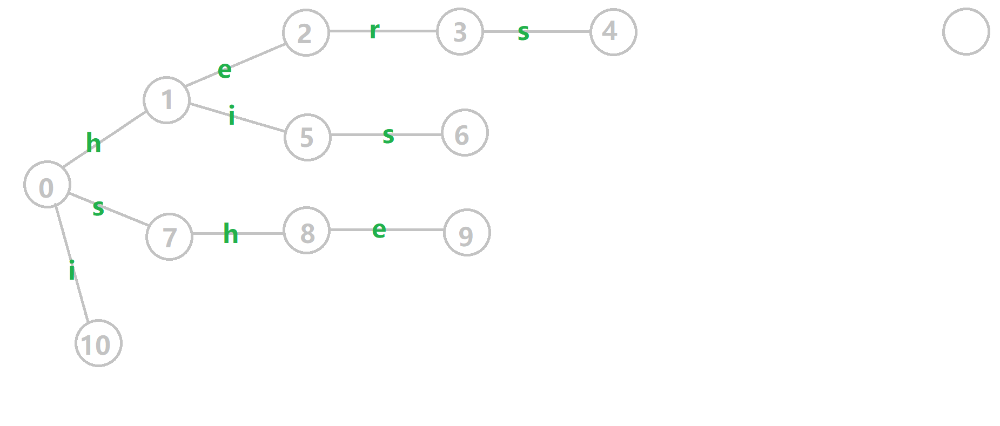
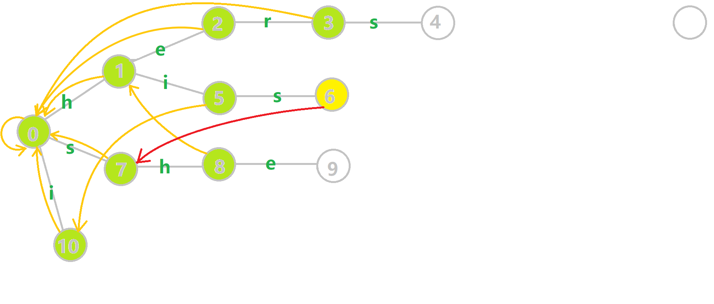
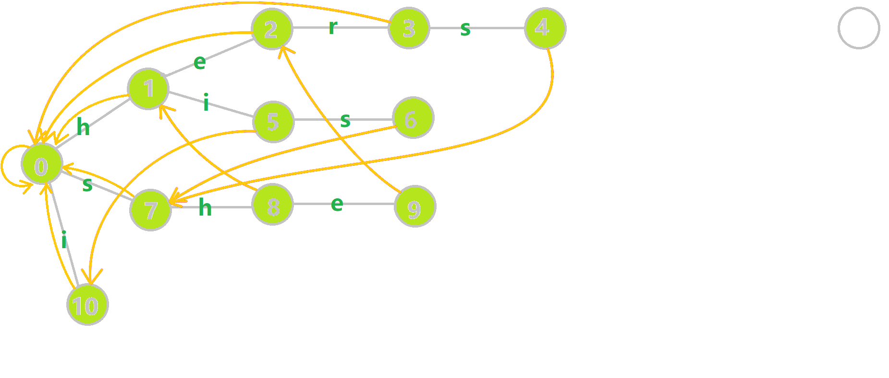
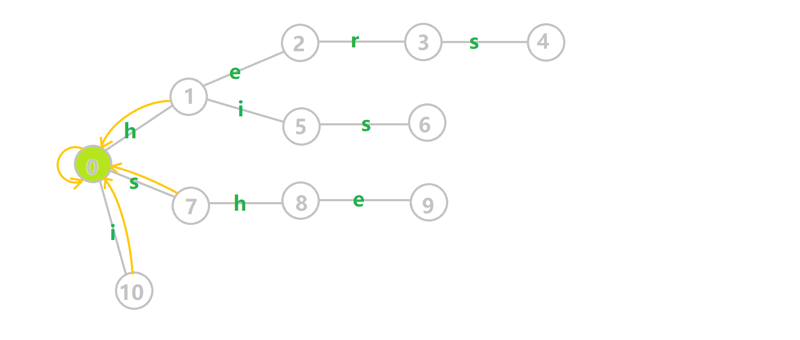
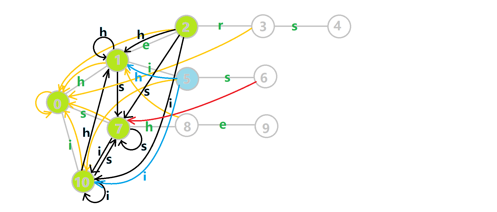
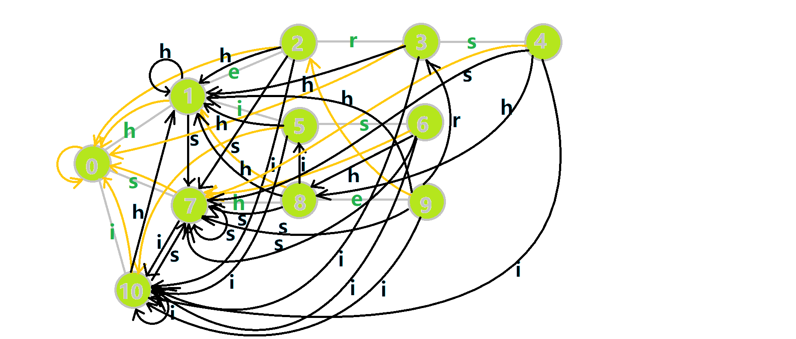
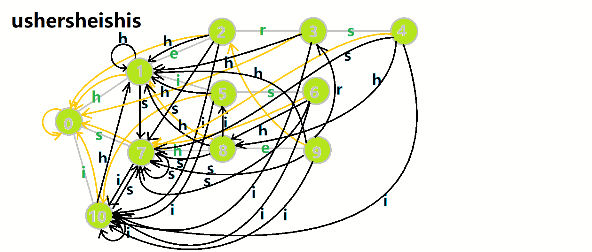

# AC 自动机 - OI Wiki

- Source: https://oi-wiki.org/string/ac-automaton/

# AC 自动机

## 概述

AC（Aho–Corasick）自动机是 **以 Trie 的结构为基础** ，结合 **KMP 的思想** 建立的自动机，用于解决多模式匹配等任务．

AC 自动机本质上是 Trie 上的自动机．

在阅读本文之前，请先阅读 [KMP](../kmp/) 和 [Trie](../trie/)．

## 解释

简单来说，建立一个 AC 自动机有两个步骤：

  1. 基础的 Trie 结构：将所有的模式串构成一棵 Trie；
  2. KMP 的思想：对 Trie 树上所有的结点构造失配指针．

建立完毕后，就可以利用它进行多模式匹配．

## 字典树构建

AC 自动机在初始时会将若干个模式串插入到一个 Trie 里，然后在 Trie 上建立 AC 自动机．这个 Trie 就是普通的 Trie，按照 Trie 原本的建树方法建树即可．

需要注意的是，Trie 中的结点表示的是某个模式串的前缀．我们在后文也将其称作状态．一个结点表示一个状态，Trie 的边就是状态的转移．

形式化地说，对于若干个模式串 𝑠1,𝑠2,⋯,𝑠𝑛s1,s2,⋯,sn，将它们构建一棵字典树后的所有状态的集合记作 𝑄Q．

## 失配指针

AC 自动机利用一个 fail 指针来辅助多模式串的匹配．

状态 𝑢u 的 fail 指针指向另一个状态 𝑣v，其中 𝑣 ∈𝑄v∈Q，且 𝑣v 是 𝑢u 的最长后缀（即在若干个后缀状态中取最长的一个作为 fail 指针）．

fail 指针与 [KMP](../kmp/) 中的 next 指针相比：

  1. 共同点：两者同样是在失配的时候用于跳转的指针．
  2. 不同点：next 指针求的是最长 Border（即最长的相同前后缀），而 fail 指针指向所有模式串的前缀中匹配当前状态的最长后缀．

因为 KMP 只对一个模式串做匹配，而 AC 自动机要对多个模式串做匹配．有可能 fail 指针指向的结点对应着另一个模式串，两者前缀不同．

总结下来，AC 自动机的失配指针指向当前状态的最长后缀状态．

注意：AC 自动机在做匹配时，同一位上可匹配多个模式串．

### 构建指针

下面介绍构建 fail 指针的 **基础思想** ：

构建 fail 指针，可以参考 KMP 中构造 next 指针的思想．

考虑字典树中当前的结点 𝑢u，𝑢u 的父结点是 𝑝p，𝑝p 通过字符 𝑐c 的边指向 𝑢u，即 trie⁡(𝑝,𝑐) =𝑢trie⁡(p,c)=u．假设深度小于 𝑢u 的所有结点的 fail 指针都已求得．

  1. 如果 trie⁡(fail⁡(𝑝),𝑐)trie⁡(fail⁡(p),c) 存在：则让 𝑢u 的 fail 指针指向 trie⁡(fail⁡(𝑝),𝑐)trie⁡(fail⁡(p),c)．相当于在 𝑝p 和 fail⁡(𝑝)fail⁡(p) 后面加一个字符 𝑐c，分别对应 𝑢u 和 fail⁡(𝑢)fail⁡(u)；
  2. 如果 trie⁡(fail⁡(𝑝),𝑐)trie⁡(fail⁡(p),c) 不存在：那么我们继续找到 trie⁡(fail⁡(fail⁡(𝑝)),𝑐)trie⁡(fail⁡(fail⁡(p)),c)．重复判断过程，一直跳 fail 指针直到根结点；
  3. 如果依然不存在，就让 fail 指针指向根结点．

如此即完成了 fail⁡(𝑢)fail⁡(u) 的构建．

### 例子

下面将使用若干张 GIF 动图来演示对字符串 𝚒i、𝚑𝚎he、𝚑𝚒𝚜his、𝚜𝚑𝚎she、𝚑𝚎𝚛𝚜hers 组成的字典树构建 fail 指针的过程：

  1. 黄色结点：当前的结点 𝑢u．
  2. 绿色结点：表示已经 BFS 遍历完毕的结点．
  3. 橙色的边：fail 指针．
  4. 红色的边：当前求出的 fail 指针．



我们重点分析结点 66 的 fail 指针构建：



找到 66 的父结点 55，fail⁡(5) =10fail⁡(5)=10．然而结点 1010 没有字母 𝚜s 连出的边；继续跳到 1010 的 fail 指针，fail⁡(10) =0fail⁡(10)=0．发现 00 结点有字母 𝚜s 连出的边，指向 77 结点；所以 fail⁡(6) =7fail⁡(6)=7．

下图展示了构建完毕的状态：



## 字典树与字典图

关注构建函数 `build`，该函数的目标有两个，一个是构建 fail 指针，一个是构建自动机．相关变量定义如下：

  1. `tr[u].son[c]`：有两种理解方式．我们可以简单理解为字典树上的一条边，即 trie⁡(𝑢,𝑐)trie⁡(u,c)；也可以理解为从状态（结点）𝑢u 后加一个字符 𝑐c 到达的状态（结点），即一个状态转移函数 trans⁡(𝑢,𝑐)trans⁡(u,c)．为了方便，下文中我们将用第二种理解方式．
  2. 队列 `q`：用于 BFS 遍历字典树．
  3. `tr[u].fail`：结点 𝑢u 的 fail 指针．

实现

C++Python

```text 1 2 3 4 5 6 7 8 9 10 11 12 13 14 15 16 ``` |  ```text void build () { queue < int > q ; for ( int i = 0 ; i < 26 ; i ++ ) if ( tr [ 0 ]. son [ i ]) q . push ( tr [ 0 ]. son [ i ]); while ( ! q . empty ()) { int u = q . front (); q . pop (); for ( int i = 0 ; i < 26 ; i ++ ) { if ( tr [ u ]. son [ i ]) { tr [ tr [ u ]. son [ i ]]. fail = tr [ tr [ u ]. fail ]. son [ i ]; q . push ( tr [ u ]. son [ i ]); } else tr [ u ]. son [ i ] = tr [ tr [ u ]. fail ]. son [ i ]; } } } ```   
---|---  
  
```text 1 2 3 4 5 6 7 8 9 10 11 12 ``` |  ```text def build (): for i in range ( 0 , 26 ): if tr [ 0 ][ i ] != 0 : q . append ( tr [ 0 ][ i ]) while q : u = q . pop ( 0 ) for i in range ( 0 , 26 ): if tr [ u ][ i ] != 0 : fail [ tr [ u ][ i ]] = tr [ fail [ u ]][ i ] q . append ( tr [ u ][ i ]) else : tr [ u ][ i ] = tr [ fail [ u ]][ i ] ```   
---|---  
  
### 解释

`build` 函数将结点按 BFS 顺序入队，依次求 fail 指针．这里的字典树根结点为 00，我们将根结点的子结点一一入队．若将根结点入队，则在第一次 BFS 的时候，会将根结点儿子的 fail 指针标记为本身．因此我们将根结点的儿子一一入队，而不是将根结点入队．

然后开始 BFS：每次取出队首的结点 𝑢u（fail⁡(𝑢)fail⁡(u) 在之前的 BFS 过程中已求得），然后遍历字符集（这里是 0 ∼250∼25，对应 𝚊 ∼𝚣a∼z，即 𝑢u 的各个子结点）：

  1. 如果 trans⁡(𝑢,𝑐)trans⁡(u,c) 存在，我们就将 trans⁡(𝑢,𝑐)trans⁡(u,c) 的 fail 指针赋值为 trans⁡(fail⁡(𝑢),𝑐)trans⁡(fail⁡(u),c)．根据之前的描述，我们应该用 `while` 循环，不停地跳 fail 指针，判断是否存在字符 𝑐c 对应的结点，然后赋值，但此处通过特殊处理简化了这些代码，将在下文说明；
  2. 否则，令 trans⁡(𝑢,𝑐)trans⁡(u,c) 指向 trans⁡(fail⁡(𝑢),𝑐)trans⁡(fail⁡(u),c) 的状态．

这里的处理是，通过 `else` 语句的代码修改字典树的结构，将不存在的字典树的状态链接到了失配指针的对应状态．在原字典树中，每一个结点代表一个字符串 𝑆S，是某个模式串的前缀．而在修改字典树结构后，尽管增加了许多转移关系，但结点（状态）所代表的字符串是不变的．

而 trans⁡(𝑆,𝑐)trans⁡(S,c) 相当于是在 𝑆S 后添加一个字符 𝑐c 变成另一个状态 𝑆′S′．如果 𝑆′S′ 存在，说明存在一个模式串的前缀是 𝑆′S′，否则我们让 trans⁡(𝑆,𝑐)trans⁡(S,c) 指向 trans⁡(fail⁡(𝑆),𝑐)trans⁡(fail⁡(S),c)．由于 fail⁡(𝑆)fail⁡(S) 对应的字符串是 𝑆S 的后缀，因此 trans⁡(fail⁡(𝑆),𝑐)trans⁡(fail⁡(S),c) 对应的字符串也是 𝑆′S′ 的后缀．

换言之在 Trie 上跳转的时侯，我们只会从 𝑆S 跳转到 𝑆′S′，相当于匹配了一个 𝑆′S′；但在 AC 自动机上跳转的时侯，我们会从 𝑆S 跳转到 𝑆′S′ 的后缀，也就是说我们匹配一个字符 𝑐c，然后舍弃 𝑆S 的部分前缀．舍弃前缀显然是能匹配的．同时如果文本串能匹配 𝑆S，显然它也能匹配 𝑆S 的后缀，所以 fail 指针同样在舍弃前缀．所谓的 fail 指针其实就是 𝑆S 的一个后缀集合．

Trie 的结点的孩子数组 `son` 还有另一种比较简单的理解方式：如果在位置 𝑢u 失配，我们会跳转到 fail⁡(𝑢)fail⁡(u) 的位置．注意这会导致我们可能沿着 fail 数组跳转多次才能来到下一个能匹配的位置．所以我们可以用 `son` 直接记录记录下一个能匹配的位置，这样保证了程序的时间复杂度．

此处对字典树结构的修改，可以使得匹配转移更加完善．同时它将 fail 指针跳转的路径做了压缩，使得本来需要跳很多次 fail 指针变成跳一次．

### 过程

这里依然用若干张 GIF 动图展示构建过程：



  1. 蓝色结点：BFS 遍历到的结点 𝑢u．
  2. 蓝色的边：当前结点下，AC 自动机修改字典树结构连出的边．
  3. 黑色的边：AC 自动机修改字典树结构连出的边．
  4. 红色的边：当前结点求出的 fail 指针．
  5. 黄色的边：fail 指针．
  6. 灰色的边：字典树的边．

可以发现，众多交错的黑色边将字典树变成了 **字典图** ．图中省略了连向根结点的黑边（否则会更乱）．我们重点分析一下结点 55 遍历时的情况．我们求 trans⁡(5,𝚜) =6trans⁡(5,s)=6 的 fail 指针：



本来的策略是找 fail 指针，于是我们跳到 fail⁡(5) =10fail⁡(5)=10 发现没有 𝚜s 连出的字典树的边，于是跳到 fail⁡(10) =0fail⁡(10)=0，发现有 trie⁡(0,𝚜) =7trie⁡(0,s)=7，于是 fail⁡(6) =7fail⁡(6)=7；但是有了黑边、蓝边，我们跳到 fail⁡(5) =10fail⁡(5)=10 之后直接走 trans⁡(10,𝚜) =7trans⁡(10,s)=7 就走到 77 号结点了．

这就是 `build` 完成的两件事：构建 fail 指针和建立字典图．这个字典图也会在查询的时候起到关键作用．

## 多模式匹配

接下来分析匹配函数 `query`：

实现

C++Python

```text 1 2 3 4 5 6 7 8 9 10 ``` |  ```text int query ( const char t []) { int u = 0 , res = 0 ; for ( int i = 1 ; t [ i ]; i ++ ) { u = tr [ u ]. son [ t [ i ] \- 'a' ]; for ( int j = u ; j && tr [ j ]. cnt != -1 ; j = tr [ j ]. fail ) { res += tr [ j ]. cnt , tr [ j ]. cnt = -1 ; } } return res ; } ```   
---|---  
  
```text 1 2 3 4 5 6 7 8 9 10 ``` |  ```text def query ( t : str ) -> int : u , res = 0 , 0 for c in t : u = tr [ u ][ c \- ord ( "a" )] j = u while j and e [ j ] != \- 1 : res += e [ j ] e [ j ] = \- 1 j = fail [ j ] return res ```   
---|---  
  
### 解释

这里 𝑢u 作为字典树上当前匹配到的结点，`res` 即返回的答案．循环遍历匹配串，𝑢u 在字典树上跟踪当前字符．利用 fail 指针找出所有匹配的模式串，并累加到答案中．然后将匹配到的串的出现次数清零，这样就不会重复统计同一个串．在上文中我们分析过，字典树的结构其实就是一个 trans 函数，而构建好这个函数后，在匹配字符串的过程中，我们会舍弃部分前缀达到最低限度的匹配．fail 指针则指向了更多的匹配状态．最后上一份图．对于刚才的自动机：



我们从根结点开始尝试匹配 𝚞𝚜𝚑𝚎𝚛𝚜𝚑𝚎𝚒𝚜𝚑𝚒𝚜ushersheishis，那么 𝑝p 的变化将是：



  1. 红色结点：𝑝p 结点．
  2. 粉色箭头：𝑝p 在自动机上的跳转．
  3. 蓝色的边：成功匹配的模式串．
  4. 蓝色结点：示跳 fail 指针时的结点（状态）．

## 效率优化

题目请参考洛谷 [P5357【模板】AC 自动机](https://www.luogu.com.cn/problem/P5357)．

因为我们的 AC 自动机中，每次匹配，会一直向 fail 边跳来找到所有的匹配，但是这样的效率较低，在某些题目中会超时．

那么需要如何优化呢？首先需要了解到 fail 指针的一个性质：一个 AC 自动机中，如果只保留 fail 边，那么剩余的图一定是一棵树．

这是显然的，因为 fail 不会成环，且深度一定比现在低，所以得证．

这样 AC 自动机的匹配就可以转化为在 fail 树上的链求和问题，只需要优化一下该部分就可以了．

这里提供两种思路．

### 拓扑排序优化

观察到时间主要浪费在在每次都要跳 fail．如果我们可以预先记录，最后一并求和，那么效率就会优化．

于是我们按照 fail 树，做一次内向树上的拓扑排序，就能一次性求出所有模式串的出现次数．

`build` 函数在原先的基础上，增加了入度统计一部分，为拓扑排序做准备．

构建

```text 1 2 3 4 5 6 7 8 9 10 11 12 13 14 15 16 17 ``` |  ```text void build () { queue < int > q ; for ( int i = 0 ; i < 26 ; i ++ ) if ( tr [ 0 ]. son [ i ]) q . push ( tr [ 0 ]. son [ i ]); while ( ! q . empty ()) { int u = q . front (); q . pop (); for ( int i = 0 ; i < 26 ; i ++ ) { if ( tr [ u ]. son [ i ]) { tr [ tr [ u ]. son [ i ]]. fail = tr [ tr [ u ]. fail ]. son [ i ]; tr [ tr [ tr [ u ]. fail ]. son [ i ]]. du ++ ; // 入度计数 q . push ( tr [ u ]. son [ i ]); } else tr [ u ]. son [ i ] = tr [ tr [ u ]. fail ]. son [ i ]; } } } ```   
---|---  
  
然后我们在查询的时候就可以只为找到结点的 `ans` 打上标记，在最后再用拓扑排序求出答案．

查询

```text 1 2 3 4 5 6 7 8 9 10 11 12 13 14 15 16 17 18 19 20 21 ``` |  ```text void query ( const char t []) { int u = 0 ; for ( int i = 1 ; t [ i ]; i ++ ) { u = tr [ u ]. son [ t [ i ] \- 'a' ]; tr [ u ]. ans ++ ; } } void topu () { queue < int > q ; for ( int i = 0 ; i <= tot ; i ++ ) if ( tr [ i ]. du == 0 ) q . push ( i ); while ( ! q . empty ()) { int u = q . front (); q . pop (); ans [ tr [ u ]. idx ] = tr [ u ]. ans ; int v = tr [ u ]. fail ; tr [ v ]. ans += tr [ u ]. ans ; if ( !-- tr [ v ]. du ) q . push ( v ); } } ```   
---|---  
  
最后是主函数：

主函数

```text 1 2 3 4 5 6 7 8 9 ``` |  ```text int main () { // do_something(); AC :: build (); scanf ( "%s" , s \+ 1 ); AC :: query ( s ); AC :: topu (); for ( int i = 1 ; i <= n ; i ++ ) printf ( "%d \n " , AC :: ans [ idx [ i ]]); // do_another_thing(); } ```   
---|---  
  
模板题 [Luogu P5357「模板」AC 自动机](https://www.luogu.com.cn/problem/P5357) 拓扑排序优化参考代码

```text 1 2 3 4 5 6 7 8 9 10 11 12 13 14 15 16 17 18 19 20 21 22 23 24 25 26 27 28 29 30 31 32 33 34 35 36 37 38 39 40 41 42 43 44 45 46 47 48 49 50 51 52 53 54 55 56 57 58 59 60 61 62 63 64 65 66 67 68 69 70 71 72 73 74 75 76 77 78 79 80 81 82 83 84 85 86 87 88 89 90 91 92 93 94 95 96 97 98 99 100 101 102 103 104 105 106 107 108 ``` |  ```text #include <cstdio> #include <cstring> #include <queue> using namespace std ; constexpr int N = 2e5 \+ 6 ; constexpr int LEN = 2e6 \+ 6 ; constexpr int SIZE = 2e5 \+ 6 ; int n ; namespace AC { struct Node { int son [ 26 ]; // 子结点 int ans ; // 匹配计数 int fail ; // fail 指针 int du ; // 入度 int idx ; void init () { // 结点初始化 memset ( son , 0 , sizeof ( son )); ans = fail = idx = 0 ; } } tr [ SIZE ]; int tot ; // 结点总数 int ans [ N ], pidx ; void init () { tot = pidx = 0 ; tr [ 0 ]. init (); } void insert ( char s [], int & idx ) { int u = 0 ; for ( int i = 1 ; s [ i ]; i ++ ) { int & son = tr [ u ]. son [ s [ i ] \- 'a' ]; // 下一个子结点的引用 if ( ! son ) son = ++ tot , tr [ son ]. init (); // 如果没有则插入新结点，并初始化 u = son ; // 从下一个结点继续 } // 由于有可能出现相同的模式串，需要将相同的映射到同一个编号 if ( ! tr [ u ]. idx ) tr [ u ]. idx = ++ pidx ; // 第一次出现，新增编号 idx = tr [ u ]. idx ; // 这个模式串的编号对应这个结点的编号 } void build () { queue < int > q ; for ( int i = 0 ; i < 26 ; i ++ ) if ( tr [ 0 ]. son [ i ]) q . push ( tr [ 0 ]. son [ i ]); while ( ! q . empty ()) { int u = q . front (); q . pop (); for ( int i = 0 ; i < 26 ; i ++ ) { if ( tr [ u ]. son [ i ]) { // 存在对应子结点 tr [ tr [ u ]. son [ i ]]. fail = tr [ tr [ u ]. fail ]. son [ i ]; // 只用跳一次 fail 指针 tr [ tr [ tr [ u ]. fail ]. son [ i ]]. du ++ ; // 入度计数 q . push ( tr [ u ]. son [ i ]); // 并加入队列 } else tr [ u ]. son [ i ] = tr [ tr [ u ]. fail ] . son [ i ]; // 将不存在的字典树的状态链接到了失配指针的对应状态 } } } void query ( char t []) { int u = 0 ; for ( int i = 1 ; t [ i ]; i ++ ) { u = tr [ u ]. son [ t [ i ] \- 'a' ]; // 转移 tr [ u ]. ans ++ ; } } void topu () { queue < int > q ; for ( int i = 0 ; i <= tot ; i ++ ) if ( tr [ i ]. du == 0 ) q . push ( i ); while ( ! q . empty ()) { int u = q . front (); q . pop (); ans [ tr [ u ]. idx ] = tr [ u ]. ans ; int v = tr [ u ]. fail ; tr [ v ]. ans += tr [ u ]. ans ; if ( !-- tr [ v ]. du ) q . push ( v ); } } } // namespace AC char s [ LEN ]; int idx [ N ]; int main () { AC :: init (); scanf ( "%d" , & n ); for ( int i = 1 ; i <= n ; i ++ ) { scanf ( "%s" , s \+ 1 ); AC :: insert ( s , idx [ i ]); AC :: ans [ i ] = 0 ; } AC :: build (); scanf ( "%s" , s \+ 1 ); AC :: query ( s ); AC :: topu (); for ( int i = 1 ; i <= n ; i ++ ) { printf ( "%d \n " , AC :: ans [ idx [ i ]]); } return 0 ; } ```   
---|---  
  
### DFS 优化

和拓扑排序的思路接近，不过我们使用 DFS 来代替拓扑排序．其实这两种方法本质上是相同的，都是将 fail 树的子树求和．

完整代码请见总结模板 3．

## AC 自动机上 DP

这部分将以 [P2292 [HNOI2004] L 语言](https://www.luogu.com.cn/problem/P2292) 为例题讲解．

不难想到一个朴素的思路：建立 AC 自动机，在 AC 自动机上对于所有 fail 指针的子串转移，最后取最大值得到答案．

主要代码如下．若不熟悉代码中的类型定义，可以先看末尾的完整代码：

查询部分主要代码

```text 1 2 3 4 5 6 7 8 9 10 11 12 13 14 15 ``` |  ```text int query ( const char t []) { int u = 0 , len = strlen ( t \+ 1 ); for ( int i = 1 ; i <= len ; i ++ ) dp [ i ] = 0 ; for ( int i = 1 ; i <= len ; i ++ ) { u = tr [ u ]. son [ t [ i ] \- 'a' ]; for ( int j = u ; j ; j = tr [ j ]. fail ) { if ( tr [ j ]. idx && ( dp [ i \- tr [ j ]. depth ] || i \- tr [ j ]. depth == 0 )) { dp [ i ] = dp [ i \- tr [ j ]. depth ] \+ tr [ j ]. depth ; } } } int ans = 0 ; for ( int i = 1 ; i <= len ; i ++ ) ans = std :: max ( ans , dp [ i ]); return ans ; } ```   
---|---  
  
但是这样的思路复杂度不是线性（因为要跳每个结点的 fail），会在第二个子任务中超时，所以我们需要进行优化．

我们再看看题目的特殊性质，我们发现所有单词的长度只有 2020，所以可以想到状态压缩优化．

我们发现，目前的时间瓶颈主要在跳 fail 这一步，如果我们可以将这一步优化到 𝑂(1)O(1)，就可以保证整个问题在严格线性的时间内被解出．

我们可以将前 2020 位字母中，可能的子串长度存下来，并压缩到状态中，存在每个子结点中．

那么我们在 `build` 的时候就可以这么写：

构建 fail 指针

```text 1 2 3 4 5 6 7 8 9 10 11 12 13 14 15 16 17 18 19 20 21 22 23 24 ``` |  ```text void build () { queue < int > q ; for ( int i = 0 ; i < 26 ; i ++ ) if ( tr [ 0 ]. son [ i ]) { q . push ( tr [ 0 ]. son [ i ]); tr [ tr [ 0 ]. son [ i ]]. depth = 1 ; } while ( ! q . empty ()) { int u = q . front (); q . pop (); int v = tr [ u ]. fail ; // 对状态的更新在这里 tr [ u ]. stat = tr [ v ]. stat ; if ( tr [ u ]. idx ) tr [ u ]. stat |= 1 << tr [ u ]. depth ; for ( int i = 0 ; i < 26 ; i ++ ) { if ( tr [ u ]. son [ i ]) { tr [ tr [ u ]. son [ i ]]. fail = tr [ tr [ u ]. fail ]. son [ i ]; tr [ tr [ u ]. son [ i ]]. depth = tr [ u ]. depth \+ 1 ; // 记录深度 q . push ( tr [ u ]. son [ i ]); } else tr [ u ]. son [ i ] = tr [ tr [ u ]. fail ]. son [ i ]; } } } ```   
---|---  
  
然后查询时就可以去掉跳 fail 的循环，将代码简化如下：

查询

```text 1 2 3 4 5 6 7 8 9 10 ``` |  ```text int query ( const char t []) { int u = 0 , mx = 0 ; unsigned st = 1 ; for ( int i = 1 ; t [ i ]; i ++ ) { u = tr [ u ]. son [ t [ i ] \- 'a' ]; st <<= 1 ; // 往下跳了一位每一位的长度都+1 if ( tr [ u ]. stat & st ) st |= 1 , mx = i ; } return mx ; } ```   
---|---  
  
我们的 `tr[u].stat` 维护的是从结点 𝑢u 开始，整条 fail 链上的长度集（因为长度集小于 3232 所以不影响），而 `st` 则维护的是查询字符串走到现在，前 3232 位（因为状态压缩自然溢出）的长度集．

`&` 运算后结果不为 00，则代表两个长度集的交集非空，我们此时就找到了一个匹配．

[P2292 [HNOI2004] L 语言](https://www.luogu.com.cn/problem/P2292) 完整代码

```text 1 2 3 4 5 6 7 8 9 10 11 12 13 14 15 16 17 18 19 20 21 22 23 24 25 26 27 28 29 30 31 32 33 34 35 36 37 38 39 40 41 42 43 44 45 46 47 48 49 50 51 52 53 54 55 56 57 58 59 60 61 62 63 64 65 66 67 68 69 70 71 72 73 74 75 76 77 78 79 80 81 82 83 84 85 86 87 88 89 90 91 92 93 94 95 ``` |  ```text #include <cstdio> #include <cstring> #include <queue> using namespace std ; constexpr int N = 20 \+ 6 , M = 50 \+ 6 ; constexpr int LEN = 2e6 \+ 6 ; constexpr int SIZE = 450 \+ 6 ; int n , m ; namespace AC { struct Node { int son [ 26 ]; int fail ; int idx ; int depth ; unsigned stat ; void init () { memset ( son , 0 , sizeof ( son )); fail = idx = depth = 0 ; } } tr [ SIZE ]; int tot ; void init () { tot = 0 ; tr [ 0 ]. init (); } void insert ( char s [], int idx ) { int u = 0 ; for ( int i = 1 ; s [ i ]; i ++ ) { int & son = tr [ u ]. son [ s [ i ] \- 'a' ]; if ( ! son ) son = ++ tot , tr [ son ]. init (); u = son ; } tr [ u ]. idx = idx ; } void build () { queue < int > q ; for ( int i = 0 ; i < 26 ; i ++ ) if ( tr [ 0 ]. son [ i ]) { q . push ( tr [ 0 ]. son [ i ]); tr [ tr [ 0 ]. son [ i ]]. depth = 1 ; } while ( ! q . empty ()) { int u = q . front (); q . pop (); int v = tr [ u ]. fail ; // 对状态的更新在这里 tr [ u ]. stat = tr [ v ]. stat ; if ( tr [ u ]. idx ) tr [ u ]. stat |= 1 << tr [ u ]. depth ; for ( int i = 0 ; i < 26 ; i ++ ) { if ( tr [ u ]. son [ i ]) { tr [ tr [ u ]. son [ i ]]. fail = tr [ tr [ u ]. fail ]. son [ i ]; tr [ tr [ u ]. son [ i ]]. depth = tr [ u ]. depth \+ 1 ; // 记录深度 q . push ( tr [ u ]. son [ i ]); } else tr [ u ]. son [ i ] = tr [ tr [ u ]. fail ]. son [ i ]; } } } int query ( char t []) { int u = 0 , mx = 0 ; unsigned st = 1 ; for ( int i = 1 ; t [ i ]; i ++ ) { u = tr [ u ]. son [ t [ i ] \- 'a' ]; st <<= 1 ; if ( tr [ u ]. stat & st ) st |= 1 , mx = i ; } return mx ; } } // namespace AC char s [ LEN ]; int main () { AC :: init (); scanf ( "%d%d" , & n , & m ); for ( int i = 1 ; i <= n ; i ++ ) { scanf ( "%s" , s \+ 1 ); AC :: insert ( s , i ); } AC :: build (); for ( int i = 1 ; i <= m ; i ++ ) { scanf ( "%s" , s \+ 1 ); printf ( "%d \n " , AC :: query ( s )); } return 0 ; } ```   
---|---  
  
## 总结

时间复杂度：定义 |𝑠𝑖||si| 是模板串的长度，|𝑆||S| 是文本串的长度，|Σ||Σ| 是字符集的大小（常数，一般为 2626）．如果连了 trie 图，时间复杂度就是 𝑂(∑|𝑠𝑖| +𝑛|Σ| +|𝑆|)O(∑|si|+n|Σ|+|S|)，其中 𝑛n 是 AC 自动机中结点的数目，并且最大可以达到 𝑂(∑|𝑠𝑖|)O(∑|si|)．如果不连 trie 图，并且在构建 fail 指针的时候避免遍历到空儿子，时间复杂度就是 𝑂(∑|𝑠𝑖| +|𝑆|)O(∑|si|+|S|)．

模板题 [Luogu P3808 AC 自动机（简单版）](https://www.luogu.com.cn/problem/P3808) 参考代码

```text 1 2 3 4 5 6 7 8 9 10 11 12 13 14 15 16 17 18 19 20 21 22 23 24 25 26 27 28 29 30 31 32 33 34 35 36 37 38 39 40 41 42 43 44 45 46 47 48 49 50 51 52 53 54 55 56 57 58 59 60 61 62 63 64 65 66 67 68 69 70 71 72 73 74 75 76 77 78 79 80 81 82 83 84 85 ``` |  ```text #include <cstdio> #include <cstring> #include <queue> using namespace std ; constexpr int N = 1e6 \+ 6 ; constexpr int LEN = 1e6 \+ 6 ; constexpr int SIZE = 1e6 \+ 6 ; int n ; namespace AC { struct Node { int son [ 26 ]; // 子结点 int cnt ; // 尾为该结点的串的个数 int fail ; // fail 指针 void init () { // 结点初始化 memset ( son , 0 , sizeof ( son )); cnt = fail = 0 ; } } tr [ SIZE ]; int tot ; // 结点总数 void init () { tot = 0 ; tr [ 0 ]. init (); } void insert ( char s []) { int u = 0 ; for ( int i = 1 ; s [ i ]; i ++ ) { int & son = tr [ u ]. son [ s [ i ] \- 'a' ]; // 下一个子结点的引用 if ( ! son ) son = ++ tot , tr [ son ]. init (); // 如果没有则插入新结点，并初始化 u = son ; // 从下一个结点继续 } tr [ u ]. cnt ++ ; } void build () { queue < int > q ; for ( int i = 0 ; i < 26 ; i ++ ) if ( tr [ 0 ]. son [ i ]) q . push ( tr [ 0 ]. son [ i ]); while ( ! q . empty ()) { int u = q . front (); q . pop (); for ( int i = 0 ; i < 26 ; i ++ ) { if ( tr [ u ]. son [ i ]) { // 存在对应子结点 tr [ tr [ u ]. son [ i ]]. fail = tr [ tr [ u ]. fail ]. son [ i ]; // 只用跳一次 fail 指针 q . push ( tr [ u ]. son [ i ]); // 并加入队列 } else tr [ u ]. son [ i ] = tr [ tr [ u ]. fail ] . son [ i ]; // 将不存在的字典树的状态链接到了失配指针的对应状态 } } } int query ( char t []) { int u = 0 , res = 0 ; for ( int i = 1 ; t [ i ]; i ++ ) { u = tr [ u ]. son [ t [ i ] \- 'a' ]; // 转移 for ( int j = u ; j && tr [ j ]. cnt != -1 ; j = tr [ j ]. fail ) { res += tr [ j ]. cnt , tr [ j ]. cnt = -1 ; } } return res ; } } // namespace AC char s [ LEN ]; int main () { AC :: init (); scanf ( "%d" , & n ); for ( int i = 1 ; i <= n ; i ++ ) { scanf ( "%s" , s \+ 1 ); AC :: insert ( s ); } AC :: build (); scanf ( "%s" , s \+ 1 ); printf ( "%d" , AC :: query ( s )); return 0 ; } ```   
---|---  
  
模板题 [Luogu P3796 AC 自动机（简单版 II）](https://www.luogu.com.cn/problem/P3796) 参考代码

```text 1 2 3 4 5 6 7 8 9 10 11 12 13 14 15 16 17 18 19 20 21 22 23 24 25 26 27 28 29 30 31 32 33 34 35 36 37 38 39 40 41 42 43 44 45 46 47 48 49 50 51 52 53 54 55 56 57 58 59 60 61 62 63 64 65 66 67 68 69 70 71 72 73 74 75 76 77 78 79 80 81 82 83 84 85 86 87 88 89 90 ``` |  ```text #include <cstdio> #include <cstring> #include <queue> using namespace std ; constexpr int N = 150 \+ 6 ; constexpr int LEN = 1e6 \+ 6 ; constexpr int SIZE = N * 70 \+ 6 ; int n ; namespace AC { struct Node { int son [ 26 ]; int fail ; int idx ; void init () { memset ( son , 0 , sizeof ( son )); idx = fail = 0 ; } } tr [ SIZE ]; int tot ; void init () { tot = 0 ; tr [ 0 ]. init (); } void insert ( char s [], int idx ) { // 将第 idx 个字符串 s 插入 int u = 0 ; for ( int i = 1 ; s [ i ]; i ++ ) { int & son = tr [ u ]. son [ s [ i ] \- 'a' ]; if ( ! son ) son = ++ tot , tr [ son ]. init (); u = son ; } tr [ u ]. idx = idx ; } void build () { queue < int > q ; for ( int i = 0 ; i < 26 ; i ++ ) if ( tr [ 0 ]. son [ i ]) q . push ( tr [ 0 ]. son [ i ]); while ( ! q . empty ()) { int u = q . front (); q . pop (); for ( int i = 0 ; i < 26 ; i ++ ) { if ( tr [ u ]. son [ i ]) { tr [ tr [ u ]. son [ i ]]. fail = tr [ tr [ u ]. fail ]. son [ i ]; q . push ( tr [ u ]. son [ i ]); } else tr [ u ]. son [ i ] = tr [ tr [ u ]. fail ]. son [ i ]; } } } int query ( char t [], int cnt []) { int u = 0 , res = 0 ; for ( int i = 1 ; t [ i ]; i ++ ) { u = tr [ u ]. son [ t [ i ] \- 'a' ]; for ( int j = u ; j ; j = tr [ j ]. fail ) ++ cnt [ tr [ j ]. idx ]; // 统计每个字符串出现的次数 } for ( int i = 0 ; i <= tot ; ++ i ) if ( tr [ i ]. idx ) res = max ( res , cnt [ tr [ i ]. idx ]); return res ; } } // namespace AC char s [ N ][ 75 ], t [ LEN ]; int cnt [ N ]; // 每一个字符串出现的次数 int main () { while ( scanf ( "%d" , & n ) != EOF && n != 0 ) { AC :: init (); for ( int i = 1 ; i <= n ; i ++ ) { scanf ( "%s" , s [ i ] \+ 1 ); AC :: insert ( s [ i ], i ); cnt [ i ] = 0 ; } AC :: build (); scanf ( "%s" , t \+ 1 ); int x = AC :: query ( t , cnt ); printf ( "%d \n " , x ); for ( int i = 1 ; i <= n ; i ++ ) if ( cnt [ i ] == x ) printf ( "%s \n " , s [ i ] \+ 1 ); } return 0 ; } ```   
---|---  
  
模板题 [Luogu P5357「模板」AC 自动机](https://www.luogu.com.cn/problem/P5357) DFS 优化参考代码

```text 1 2 3 4 5 6 7 8 9 10 11 12 13 14 15 16 17 18 19 20 21 22 23 24 25 26 27 28 29 30 31 32 33 34 35 36 37 38 39 40 41 42 43 44 45 46 47 48 49 50 51 52 53 54 55 56 57 58 59 60 61 62 63 64 65 66 67 68 69 70 71 72 73 74 75 76 77 78 79 80 81 82 83 84 85 86 87 88 89 90 91 92 93 94 95 96 97 98 99 100 101 102 103 104 105 ``` |  ```text #include <cstdio> #include <cstring> #include <queue> #include <vector> using namespace std ; constexpr int N = 2e5 \+ 6 ; constexpr int LEN = 2e6 \+ 6 ; constexpr int SIZE = 2e5 \+ 6 ; int n ; namespace AC { struct Node { int son [ 26 ]; int ans ; int fail ; int idx ; void init () { memset ( son , 0 , sizeof ( son )); ans = idx = 0 ; } } tr [ SIZE ]; int tot ; int ans [ N ], pidx ; vector < int > g [ SIZE ]; // fail 树 void init () { tot = pidx = 0 ; tr [ 0 ]. init (); } void insert ( char s [], int & idx ) { int u = 0 ; for ( int i = 1 ; s [ i ]; i ++ ) { int & son = tr [ u ]. son [ s [ i ] \- 'a' ]; if ( ! son ) son = ++ tot , tr [ son ]. init (); u = son ; } // 由于有可能出现相同的模式串，需要将相同的映射到同一个编号 if ( ! tr [ u ]. idx ) tr [ u ]. idx = ++ pidx ; // 第一次出现，新增编号 idx = tr [ u ]. idx ; // 这个模式串的编号对应这个结点的编号 } void build () { queue < int > q ; for ( int i = 0 ; i < 26 ; i ++ ) if ( tr [ 0 ]. son [ i ]) { q . push ( tr [ 0 ]. son [ i ]); g [ 0 ]. push_back ( tr [ 0 ]. son [ i ]); // 不要忘记这里的 fail } while ( ! q . empty ()) { int u = q . front (); q . pop (); for ( int i = 0 ; i < 26 ; i ++ ) { if ( tr [ u ]. son [ i ]) { tr [ tr [ u ]. son [ i ]]. fail = tr [ tr [ u ]. fail ]. son [ i ]; g [ tr [ tr [ u ]. fail ]. son [ i ]]. push_back ( tr [ u ]. son [ i ]); // 记录 fail 树 q . push ( tr [ u ]. son [ i ]); } else tr [ u ]. son [ i ] = tr [ tr [ u ]. fail ]. son [ i ]; } } } void query ( char t []) { int u = 0 ; for ( int i = 1 ; t [ i ]; i ++ ) { u = tr [ u ]. son [ t [ i ] \- 'a' ]; tr [ u ]. ans ++ ; } } void dfs ( int u ) { for ( int v : g [ u ]) { dfs ( v ); tr [ u ]. ans += tr [ v ]. ans ; } ans [ tr [ u ]. idx ] = tr [ u ]. ans ; } } // namespace AC char s [ LEN ]; int idx [ N ]; int main () { AC :: init (); scanf ( "%d" , & n ); for ( int i = 1 ; i <= n ; i ++ ) { scanf ( "%s" , s \+ 1 ); AC :: insert ( s , idx [ i ]); AC :: ans [ i ] = 0 ; } AC :: build (); scanf ( "%s" , s \+ 1 ); AC :: query ( s ); AC :: dfs ( 0 ); for ( int i = 1 ; i <= n ; i ++ ) { printf ( "%d \n " , AC :: ans [ idx [ i ]]); } return 0 ; } ```   
---|---  
  
* * *

> __本页面最近更新： 2026/1/7 08:56:54，[更新历史](https://github.com/OI-wiki/OI-wiki/commits/master/docs/string/ac-automaton.md)  
>  __发现错误？想一起完善？[在 GitHub 上编辑此页！](https://oi-wiki.org/edit-landing/?ref=/string/ac-automaton.md "edit.link.title")  
>  __本页面贡献者：[Ir1d](https://github.com/Ir1d), [Tiphereth-A](https://github.com/Tiphereth-A), [sshwy](https://github.com/sshwy), [ksyx](https://github.com/ksyx), [Marcythm](https://github.com/Marcythm), [orzAtalod](https://github.com/orzAtalod), [Xeonacid](https://github.com/Xeonacid), [c-forrest](https://github.com/c-forrest), [Enter-tainer](https://github.com/Enter-tainer), [GavinZhengOI](https://github.com/GavinZhengOI), [Henry-ZHR](https://github.com/Henry-ZHR), [iamtwz](https://github.com/iamtwz), [shuzhouliu](https://github.com/shuzhouliu), [383494](https://github.com/383494), [abc1763613206](https://github.com/abc1763613206), [alphagocc](https://github.com/alphagocc), [aofall](https://github.com/aofall), [Chrogeek](https://github.com/Chrogeek), [CoelacanthusHex](https://github.com/CoelacanthusHex), [Dafenghh](https://github.com/Dafenghh), [DanJoshua](https://github.com/DanJoshua), [Early0v0](https://github.com/Early0v0), [Gesrua](https://github.com/Gesrua), [GoodCoder666](https://github.com/GoodCoder666), [HeRaNO](https://github.com/HeRaNO), [kenlig](https://github.com/kenlig), [liangbob2023](https://github.com/liangbob2023), [lyccrius](https://github.com/lyccrius), [Menci](https://github.com/Menci), [opsiff](https://github.com/opsiff), [ouuan](https://github.com/ouuan), [partychicken](https://github.com/partychicken), [Persdre](https://github.com/Persdre), [r-value](https://github.com/r-value), [Rickyxrc](https://github.com/Rickyxrc), [Ruakker](https://github.com/Ruakker), [shawlleyw](https://github.com/shawlleyw), [StudyingFather](https://github.com/StudyingFather), [sun2snow](https://github.com/sun2snow), [szdytom](https://github.com/szdytom), [Unnamed2964](https://github.com/Unnamed2964), [XuYueming520](https://github.com/XuYueming520), [zica87](https://github.com/zica87), [ZnPdCo](https://github.com/ZnPdCo), [ZXyaang](https://github.com/ZXyaang), [qq2964](https://github.com/qq2964), [rickyxrc](https://github.com/rickyxrc)  
>  __本页面的全部内容在**[CC BY-SA 4.0](https://creativecommons.org/licenses/by-sa/4.0/deed.zh) 和 [SATA](https://github.com/zTrix/sata-license)** 协议之条款下提供，附加条款亦可能应用
