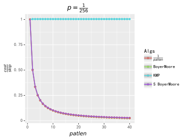
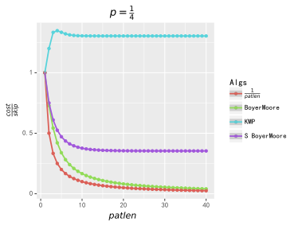

# Boyer–Moore 算法 - OI Wiki

- Source: https://oi-wiki.org/string/bm/

# Boyer–Moore 算法

前置知识：[前缀函数与 KMP 算法](../kmp/)．

KMP 算法将前缀匹配的信息用到了极致，

而 BM 算法背后的基本思想是通过后缀匹配获得比前缀匹配更多的信息来实现更快的字符跳转．

## 引入

想象一下，如果我们的模式字符串 𝑝𝑎𝑡pat，被放在文本字符串 𝑠𝑡𝑟𝑖𝑛𝑔string 的左手起头部，使它们的第一个字符对齐．

𝑝𝑎𝑡:𝙴𝚇𝙰𝙼𝙿𝙻𝙴𝑠𝑡𝑟𝑖𝑛𝑔:𝙷𝙴𝚁𝙴 𝙸𝚂 𝙰 𝚂𝙸𝙼𝙿𝙻𝙴 𝙴𝚇𝙰𝙼𝙿𝙻𝙴… ⇑pat:EXAMPLEstring:HERE IS A SIMPLE EXAMPLE… ⇑

在这里做定义，往后不赘述：

𝑝𝑎𝑡pat 的长度为 𝑝𝑎𝑡𝑙𝑒𝑛patlen，特别地对于从 0 开始的串来说，规定 𝑝𝑎𝑡𝑙𝑎𝑠𝑡𝑝𝑜𝑠 =𝑝𝑎𝑡𝑙𝑒𝑛 −1patlastpos=patlen−1 为 𝑝𝑎𝑡pat 串最后一个字符的位置；

𝑠𝑡𝑟𝑖𝑛𝑔string 的长度 𝑠𝑡𝑟𝑖𝑛𝑔𝑙𝑒𝑛stringlen，𝑠𝑡𝑟𝑖𝑛𝑔𝑙𝑎𝑠𝑡𝑝𝑜𝑠 =𝑠𝑡𝑟𝑖𝑛𝑔𝑙𝑒𝑛 −1stringlastpos=stringlen−1．

假如我们知道了 𝑠𝑡𝑟𝑖𝑛𝑔string 的第 𝑝𝑎𝑡𝑙𝑒𝑛patlen 个字符 𝑐ℎ𝑎𝑟char（与 𝑝𝑎𝑡pat 的最后一个字符对齐）考虑我们能得到什么信息：

### 观察 1

如果我们知道 𝑐ℎ𝑎𝑟char 这个字符不在 𝑝𝑎𝑡pat 中，我们就不用考虑 𝑝𝑎𝑡pat 从 𝑠𝑡𝑟𝑖𝑛𝑔string 的第 11 个、第 22 个……第 𝑝𝑎𝑡𝑙𝑒𝑛patlen 个字符起出现的情况，，而可以直接将 𝑝𝑎𝑡pat 向下滑动 𝑝𝑎𝑡𝑙𝑒𝑛patlen 个字符．

### 观察 2

更一般地，**如果出现在 𝑝𝑎𝑡pat 最末尾（也就是最右边）的那一个 𝑐ℎ𝑎𝑟char 字符的位置是离末尾端差了 𝑑𝑒𝑙𝑡𝑎1delta1 个字符**，

那么就可以不用匹配，直接将 𝑝𝑎𝑡pat 向后滑动 𝑑𝑒𝑙𝑡𝑎1delta1 个字符：如果滑动距离少于 𝑑𝑒𝑙𝑡𝑎1delta1，那么仅就 𝑐ℎ𝑎𝑟char 这个字符就无法被匹配，当然模式字符串 𝑝𝑎𝑡pat 也就不会被匹配．

因此除非 𝑐ℎ𝑎𝑟char 字符可以和 𝑝𝑎𝑡pat 末尾的那个字符匹配，否则 𝑠𝑡𝑟𝑖𝑛𝑔string 要跳过 𝑑𝑒𝑙𝑡𝑎1delta1 个字符（相当于 𝑝𝑎𝑡pat 向后滑动了 𝑑𝑒𝑙𝑡𝑎1delta1 个字符）．并且我们可以得到一个计算 𝑑𝑒𝑙𝑡𝑎1delta1 的函数 𝑑𝑒𝑙𝑡𝑎1(𝑐ℎ𝑎𝑟)delta1(char)：

𝐢𝐧𝐭 𝑑𝑒𝑙𝑡𝑎1(𝐜𝐡𝐚𝐫 𝑐ℎ𝑎𝑟)𝐢𝐟 char不在pat中 || char是pat上最后一个字符𝐫𝐞𝐭𝐮𝐫𝐧 𝑝𝑎𝑡𝑙𝑒𝑛𝐞𝐥𝐬𝐞𝐫𝐞𝐭𝐮𝐫𝐧 𝑝𝑎𝑡𝑙𝑎𝑠𝑡𝑝𝑜𝑠−𝑖// i为出现在pat最末尾的那一个char出现的位置，即pat[i]=charint delta1(char char)if char不在pat中 || char是pat上最后一个字符return patlenelsereturn patlastpos−i// i为出现在pat最末尾的那一个char出现的位置，即pat[i]=char

需要注意，显然这个表只需计算到 𝑝𝑎𝑡𝑙𝑎𝑠𝑡𝑝𝑜𝑠 −1patlastpos−1 的位置．

现在假设 𝑐ℎ𝑎𝑟char 和 𝑝𝑎𝑡pat 最后一个字符匹配到了，那我们就看看 𝑐ℎ𝑎𝑟char 前一个字符和 𝑝𝑎𝑡pat 的倒数第二个字符是否匹配：

如果是，就继续回退直到整个模式串 𝑝𝑎𝑡pat 完成匹配（这时我们就在 𝑠𝑡𝑟𝑖𝑛𝑔string 上成功得到了一个 𝑝𝑎𝑡pat 的匹配）；

或者，我们也可能会在匹配完 𝑝𝑎𝑡pat 的倒数第 𝑚m 个字符后，在倒数第 𝑚 +1m+1 个字符上失配，这时我们就希望把 𝑝𝑎𝑡pat 向后滑动到下一个可能会实现匹配的位置，当然我们希望滑动得越远越好．

### 观察 3(a)

在 **观察 2** 中提到，当匹配完 𝑝𝑎𝑡pat 的倒数 𝑚m 个字符后，如果在倒数第 𝑚 +1m+1 个字符失配，为了使得 𝑠𝑡𝑟𝑖𝑛𝑔string 中的失配字符与 𝑝𝑎𝑡pat 上对应字符对齐，

需要把 𝑝𝑎𝑡pat 向后滑动 𝑘k 个字符，也就是说我们应该把注意力看向之后的 𝑘 +𝑚k+m 个字符（也就是看向 𝑝𝑎𝑡pat 滑动 k 之后，末段与 𝑠𝑡𝑟𝑖𝑛𝑔string 对齐的那个字符）．

而 𝑘 =𝑑𝑒𝑙𝑡𝑎1 −𝑚k=delta1−m，

所以我们的注意力应该沿着 𝑠𝑡𝑟𝑖𝑛𝑔string 向后跳 𝑑𝑒𝑙𝑡𝑎1 −𝑚 +𝑚 =𝑑𝑒𝑙𝑡𝑎1delta1−m+m=delta1 个字符．

然而，我们有机会跳过更多的字符，请继续看下去．

### 观察 3(b)

如果我们知道 𝑠𝑡𝑟𝑖𝑛𝑔string 接下来的 𝑚m 个字符和 𝑝𝑎𝑡pat 的最后 𝑚m 个字符匹配，假设这个子串为 𝑠𝑢𝑏𝑝𝑎𝑡subpat，

我们还知道在 𝑠𝑡𝑟𝑖𝑛𝑔string 失配字符 𝑐ℎ𝑎𝑟char 后面是与 𝑠𝑢𝑏𝑝𝑎𝑡subpat 相匹配的子串，而假如 𝑝𝑎𝑡pat 对应失配字符前面存在 𝑠𝑢𝑏𝑝𝑎𝑡subpat，我们可以将 𝑝𝑎𝑡pat 向下滑动一段距离，

使得失配字符 𝑐ℎ𝑎𝑟char 在 𝑝𝑎𝑡pat 上对应的字符前面出现的 𝑠𝑢𝑏𝑝𝑎𝑡subpat（合理重现，plausible reoccurrence，以下也简称 pr）与 𝑠𝑡𝑟𝑖𝑛𝑔string 的 𝑠𝑢𝑏𝑝𝑎𝑡subpat 对齐．如果 𝑝𝑎𝑡pat 上有多个 𝑠𝑢𝑏𝑝𝑎𝑡subpat，按照从右到左的后缀匹配顺序，取第一个（rightmost plausible reoccurrence，以下也简称 rpr）．

假设此时 𝑝𝑎𝑡pat 向下滑动的 𝑘k 个字符（也即 𝑝𝑎𝑡pat 末尾端的 𝑠𝑢𝑏𝑝𝑎𝑡subpat 与其最右边的合理重现的距离），这样我们的注意力应该沿着 𝑠𝑡𝑟𝑖𝑛𝑔string 向后滑动 𝑘 +𝑚k+m 个字符，这段距离我们称之为 𝑑𝑒𝑙𝑡𝑎2(𝑗)delta2(j)：

假定 𝑟𝑝𝑟(𝑗)rpr(j) 为 𝑠𝑢𝑏𝑝𝑎𝑡 =𝑝𝑎𝑡[𝑗 +1…𝑝𝑎𝑡𝑙𝑎𝑠𝑡𝑝𝑜𝑠]subpat=pat[j+1…patlastpos] 在 𝑝𝑎𝑡[𝑗]pat[j] 上失配时的最右边合理重现的位置，𝑟𝑝𝑟(𝑗) <𝑗rpr(j)<j（这里只给出简单定义，在下文的算法设计章节里会有更精确的讨论），那么显然 𝑘 =𝑗 −𝑟𝑝𝑟(𝑗), 𝑚 =𝑝𝑎𝑡𝑙𝑎𝑠𝑡𝑝𝑜𝑠 −𝑗k=j−rpr(j), m=patlastpos−j．

所以有：

𝐢𝐧𝐭 𝑑𝑒𝑙𝑡𝑎2(𝐢𝐧𝐭 𝑗)// j为失配字符在pat上对应字符的位置𝐫𝐞𝐭𝐮𝐫𝐧 𝑝𝑎𝑡𝑙𝑎𝑠𝑡𝑝𝑜𝑠−𝑟𝑝𝑟(𝑗)int delta2(int j)// j为失配字符在pat上对应字符的位置return patlastpos−rpr(j)

于是我们在失配时，可以把把 𝑠𝑡𝑟𝑖𝑛𝑔string 上的注意力往后跳过 max(𝑑𝑒𝑙𝑡𝑎1,𝑑𝑒𝑙𝑡𝑎2)max(delta1,delta2) 个字符

## 过程

箭头指向失配字符 𝑐ℎ𝑎𝑟char：

𝑝𝑎𝑡:𝙰𝚃-𝚃𝙷𝙰𝚃𝑠𝑡𝑟𝑖𝑛𝑔: … 𝚆𝙷𝙸𝙲𝙷-𝙵𝙸𝙽𝙰𝙻𝙻𝚈-𝙷𝙰𝙻𝚃𝚂.--𝙰𝚃-𝚃𝙷𝙰𝚃-𝙿𝙾𝙸𝙽𝚃… ⇑pat:AT-THATstring: … WHICH-FINALLY-HALTS.--AT-THAT-POINT… ⇑

𝙵F 没有出现 𝑝𝑎𝑡pat 中，根据 **观察 1** ，𝑝𝑎𝑡pat 直接向下移动 𝑝𝑎𝑡𝑙𝑒𝑛patlen 个字符，也就是 7 个字符：

𝑝𝑎𝑡: 𝙰𝚃-𝚃𝙷𝙰𝚃𝑠𝑡𝑟𝑖𝑛𝑔: … 𝚆𝙷𝙸𝙲𝙷-𝙵𝙸𝙽𝙰𝙻𝙻𝚈-𝙷𝙰𝙻𝚃𝚂.--𝙰𝚃-𝚃𝙷𝙰𝚃-𝙿𝙾𝙸𝙽𝚃… ⇑pat: AT-THATstring: … WHICH-FINALLY-HALTS.--AT-THAT-POINT… ⇑

根据 **观察 2** ，我们需要将 𝑝𝑎𝑡pat 向下移动 4 个字符使得短横线字符对齐：

𝑝𝑎𝑡: 𝙰𝚃-𝚃𝙷𝙰𝚃𝑠𝑡𝑟𝑖𝑛𝑔: … 𝚆𝙷𝙸𝙲𝙷-𝙵𝙸𝙽𝙰𝙻𝙻𝚈-𝙷𝙰𝙻𝚃𝚂.--𝙰𝚃-𝚃𝙷𝙰𝚃-𝙿𝙾𝙸𝙽𝚃… ⇑pat: AT-THATstring: … WHICH-FINALLY-HALTS.--AT-THAT-POINT… ⇑

现在 _char_ :𝚃T 匹配了，把 𝑠𝑡𝑟𝑖𝑛𝑔string 上的指针左移一步继续匹配：

𝑝𝑎𝑡: 𝙰𝚃-𝚃𝙷𝙰𝚃𝑠𝑡𝑟𝑖𝑛𝑔: … 𝚆𝙷𝙸𝙲𝙷-𝙵𝙸𝙽𝙰𝙻𝙻𝚈-𝙷𝙰𝙻𝚃𝚂.--𝙰𝚃-𝚃𝙷𝙰𝚃-𝙿𝙾𝙸𝙽𝚃… ⇑pat: AT-THATstring: … WHICH-FINALLY-HALTS.--AT-THAT-POINT… ⇑

根据 **观察 3(a)** ，𝙻L 失配，因为 𝙻L 不在 𝑝𝑎𝑡pat 中，所以 𝑝𝑎𝑡pat 向下移动 𝑘 =𝑑𝑒𝑙𝑡𝑎1 −𝑚 =7 −1 =6k=delta1−m=7−1=6 个字符，而 𝑠𝑡𝑟𝑖𝑛𝑔string 上指针向下移动 𝑑𝑒𝑙𝑡𝑎1 =7delta1=7 个字符：

𝑝𝑎𝑡: 𝙰𝚃-𝚃𝙷𝙰𝚃𝑠𝑡𝑟𝑖𝑛𝑔: … 𝚆𝙷𝙸𝙲𝙷-𝙵𝙸𝙽𝙰𝙻𝙻𝚈-𝙷𝙰𝙻𝚃𝚂.--𝙰𝚃-𝚃𝙷𝙰𝚃-𝙿𝙾𝙸𝙽𝚃… ⇑pat: AT-THATstring: … WHICH-FINALLY-HALTS.--AT-THAT-POINT… ⇑

这时 𝑐ℎ𝑎𝑟char 又一次匹配到了 𝑝𝑎𝑡pat 的最后一个字符 𝚃T，𝑠𝑡𝑟𝑖𝑛𝑔string 上的指针向左匹配，匹配到了 𝙰A，继续向左匹配，发现在字符 -- 失配：

𝑝𝑎𝑡: 𝙰𝚃-𝚃𝙷𝙰𝚃𝑠𝑡𝑟𝑖𝑛𝑔: … 𝚆𝙷𝙸𝙲𝙷-𝙵𝙸𝙽𝙰𝙻𝙻𝚈-𝙷𝙰𝙻𝚃𝚂.--𝙰𝚃-𝚃𝙷𝙰𝚃-𝙿𝙾𝙸𝙽𝚃… ⇑pat: AT-THATstring: … WHICH-FINALLY-HALTS.--AT-THAT-POINT… ⇑

显然直观上看，此时根据 **观察 3(b)** ，将 𝑝𝑎𝑡pat 向下移动 𝑘 =5k=5 个字符，使得后缀 𝙰𝚃AT 对齐，这种滑动可以获得 𝑠𝑡𝑟𝑖𝑛𝑔string 指针最大的滑动距离，此时 𝑑𝑒𝑙𝑡𝑎2 =𝑘 +𝑝𝑎𝑡𝑙𝑎𝑠𝑡𝑝𝑜𝑠 −𝑗 =5 +6 −4 =7delta2=k+patlastpos−j=5+6−4=7，即 𝑠𝑡𝑟𝑖𝑛𝑔string 上指针向下滑动 7 个字符．

而从形式化逻辑看，此时，𝑑𝑒𝑙𝑡𝑎1 =7 −1 −2 =4, 𝑑𝑒𝑙𝑡𝑎2 =7,max(𝑑𝑒𝑙𝑡𝑎1,𝑑𝑒𝑙𝑡𝑎2) =7delta1=7−1−2=4, delta2=7,max(delta1,delta2)=7， 这样从形式逻辑上支持了进行 **观察 3(b)** 的跳转：

𝑝𝑎𝑡:𝙰𝚃-𝚃𝙷𝙰𝚃𝑠𝑡𝑟𝑖𝑛𝑔: … 𝚆𝙷𝙸𝙲𝙷-𝙵𝙸𝙽𝙰𝙻𝙻𝚈-𝙷𝙰𝙻𝚃𝚂.--𝙰𝚃-𝚃𝙷𝙰𝚃-𝙿𝙾𝙸𝙽𝚃… ⇑pat:AT-THATstring: … WHICH-FINALLY-HALTS.--AT-THAT-POINT… ⇑

现在我们发现了 𝑝𝑎𝑡pat 上每一个字符都和 𝑠𝑡𝑟𝑖𝑛𝑔string 上对应的字符相等，我们在 𝑠𝑡𝑟𝑖𝑛𝑔string 上找到了一个 𝑝𝑎𝑡pat 的匹配．而只花费了 14 次对 𝑠𝑡𝑟𝑖𝑛𝑔string 的引用，其中 7 次是完成一个成功的匹配所必需的比较次数（𝑝𝑎𝑡𝑙𝑒𝑛 =7patlen=7），另外 7 次让我们跳过了 22 个字符．

## 算法设计

### 最初的匹配算法

#### 解释

现在看这样一个利用 𝑑𝑒𝑙𝑡𝑎1delta1 和 𝑑𝑒𝑙𝑡𝑎2delta2 进行字符串匹配的算法：

𝑖←𝑝𝑎𝑡𝑙𝑎𝑠𝑡𝑝𝑜𝑠.𝑗←𝑝𝑎𝑡𝑙𝑎𝑠𝑡𝑝𝑜𝑠.𝐥𝐨𝐨𝐩𝐢𝐟 𝑗<0𝐫𝐞𝐭𝐮𝐫𝐧 𝑖+1𝐢𝐟 𝑠𝑡𝑟𝑖𝑛𝑔[𝑖]=𝑝𝑎𝑡[𝑗]𝑗←𝑗−1𝑖←𝑖−1𝐜𝐨𝐧𝐭𝐢𝐧𝐮𝐞𝑖←𝑖+𝑚𝑎𝑥(𝑑𝑒𝑙𝑡𝑎1(𝑠𝑡𝑟𝑖𝑛𝑔[𝑖]),𝑑𝑒𝑙𝑡𝑎2(𝑗))𝐢𝐟 𝑖>𝑠𝑡𝑟𝑖𝑛𝑔𝑙𝑎𝑠𝑡𝑝𝑜𝑠𝐫𝐞𝐭𝐮𝐫𝐧 𝑓𝑎𝑙𝑠𝑒𝑗←𝑝𝑎𝑡𝑙𝑎𝑠𝑡𝑝𝑜𝑠i←patlastpos.j←patlastpos.loopif j<0return i+1if string[i]=pat[j]j←j−1i←i−1continuei←i+max(delta1(string[i]),delta2(j))if i>stringlastposreturn falsej←patlastpos

如果上面的算法 𝐫𝐞𝐭𝐮𝐫𝐧 𝑓𝑎𝑙𝑠𝑒return false，表明 𝑝𝑎𝑡pat 不在 𝑠𝑡𝑟𝑖𝑛𝑔string 中；如果返回一个数字，表示 𝑝𝑎𝑡pat 在 𝑠𝑡𝑟𝑖𝑛𝑔string 左起第一次出现的位置．

然后让我们更精细地描述下计算 𝑑𝑒𝑙𝑡𝑎2delta2，所依靠的 𝑟𝑝𝑟(𝑗)rpr(j) 函数．

根据前文定义，𝑟𝑝𝑟(𝑗)rpr(j) 表示在 𝑝𝑎𝑡(𝑗)pat(j) 失配时，子串 𝑠𝑢𝑏𝑝𝑎𝑡 =𝑝𝑎𝑡[𝑗 +1…𝑝𝑎𝑡𝑙𝑎𝑠𝑡𝑝𝑜𝑠]subpat=pat[j+1…patlastpos] 在 𝑝𝑎𝑡[𝑗]pat[j] 最右边合理重现的位置．

也就是说需要找到一个最好的 𝑘k, 使得 𝑝𝑎𝑡[𝑘…𝑘 +𝑝𝑎𝑡𝑙𝑎𝑠𝑡𝑝𝑜𝑠 −𝑗 −1] =𝑝𝑎𝑡[𝑗 +1…𝑝𝑎𝑡𝑙𝑎𝑠𝑡𝑝𝑜𝑠]pat[k…k+patlastpos−j−1]=pat[j+1…patlastpos]，另外要考虑两种特殊情况：

  1. 当 𝑘 <0k<0 时，相当于在 𝑝𝑎𝑡pat 前面补充了一段虚拟的前缀，实际上也符合 𝑑𝑒𝑙𝑡𝑎2delta2 跳转的原理．
  2. 当 𝑘 >0k>0 时，如果 𝑝𝑎𝑡[𝑘 −1] =𝑝𝑎𝑡[𝑗]pat[k−1]=pat[j]，则这个 𝑝𝑎𝑡[𝑘…𝑘 +𝑝𝑎𝑡𝑙𝑎𝑠𝑡𝑝𝑜𝑠 −𝑗 −1]pat[k…k+patlastpos−j−1] 不能作为 𝑠𝑢𝑏𝑝𝑎𝑡subpat 的合理重现． 原因是 𝑝𝑎𝑡[𝑗]pat[j] 本身是失配字符，所以 𝑝𝑎𝑡pat 向下滑动 𝑘k 个字符后，在后缀匹配过程中仍然会在 𝑝𝑎𝑡[𝑘 −1]pat[k−1] 处失配．

还要注意两个限制条件：

  1. 𝑘 <𝑗k<j．因为当 𝑘 =𝑗k=j 时，有 𝑝𝑎𝑡[𝑘] =𝑝𝑎𝑡[𝑗]pat[k]=pat[j]，在 𝑝𝑎𝑡[𝑗]pat[j] 上失配的字符也会在 𝑝𝑎𝑡[𝑘]pat[k] 上失配．
  2. 考虑到 𝑑𝑒𝑙𝑡𝑎2(𝑝𝑎𝑡𝑙𝑎𝑠𝑡𝑝𝑜𝑠) =0delta2(patlastpos)=0，所以规定 𝑟𝑝𝑟(𝑝𝑎𝑡𝑙𝑎𝑠𝑡𝑝𝑜𝑠) =𝑝𝑎𝑡𝑙𝑎𝑠𝑡𝑝𝑜𝑠rpr(patlastpos)=patlastpos．

#### 过程

由于理解 𝑟𝑝𝑟(𝑗)rpr(j) 是实现 BoyerMoore 算法的核心，所以我们使用如下两个例子进行详细说明：

𝑗: 𝟶 𝟷 𝟸 𝟹 𝟺 𝟻 𝟼 𝟽 𝟾𝑝𝑎𝑡: 𝙰 𝙱 𝙲 𝚇 𝚇 𝚇 𝙰 𝙱 𝙲𝑟𝑝𝑟(𝑗): 𝟻 𝟺 𝟹 𝟸 𝟷 𝟶 𝟸 𝟷 𝟾𝑠𝑔𝑛: - - - - - - - - +j: 0 1 2 3 4 5 6 7 8pat: A B C X X X A B Crpr(j): 5 4 3 2 1 0 2 1 8sgn: \- - - - - - - - +

对于 𝑟𝑝𝑟(0)rpr(0)，𝑠𝑢𝑏𝑝𝑎𝑡subpat 为 𝙱𝙲𝚇𝚇𝚇𝙰𝙱𝙲BCXXXABC，在 𝑝𝑎𝑡[0]pat[0] 之前的最右边合理重现只能是 [(𝙱𝙲𝚇𝚇𝚇)𝙰𝙱𝙲]𝚇𝚇𝚇𝙰𝙱𝙲[(BCXXX)ABC]XXXABC，也就是最右边合理重现位置为 -5，即 𝑟𝑝𝑟(𝑗) = −5rpr(j)=−5；

对于 𝑟𝑝𝑟(1)rpr(1)，𝑠𝑢𝑏𝑝𝑎𝑡subpat 为 𝙲𝚇𝚇𝚇𝙰𝙱𝙲CXXXABC，在 𝑝𝑎𝑡[1]pat[1] 之前的最右边的合理重现是 [(𝙲𝚇𝚇𝚇)𝙰𝙱𝙲]𝚇𝚇𝚇𝙰𝙱𝙲[(CXXX)ABC]XXXABC，所以 𝑟𝑝𝑟(𝑗) = −4rpr(j)=−4；

对于 𝑟𝑝𝑟(2)rpr(2)，𝑠𝑢𝑏𝑝𝑎𝑡subpat 为 𝚇𝚇𝚇𝙰𝙱𝙲XXXABC，在 𝑝𝑎𝑡[2]pat[2] 之前的最右边的合理重现是 [(𝚇𝚇𝚇)𝙰𝙱𝙲]𝚇𝚇𝚇𝙰𝙱𝙲[(XXX)ABC]XXXABC，所以 𝑟𝑝𝑟(𝑗) = −3rpr(j)=−3；

对于 𝑟𝑝𝑟(3)rpr(3)，𝑠𝑢𝑏𝑝𝑎𝑡subpat 为 𝚇𝚇𝙰𝙱𝙲XXABC，在 𝑝𝑎𝑡[3]pat[3] 之前的最右边的合理重现是 [(𝚇𝚇)𝙰𝙱𝙲]𝚇𝚇𝚇𝙰𝙱𝙲[(XX)ABC]XXXABC，所以 𝑟𝑝𝑟(𝑗) = −2rpr(j)=−2；

对于 𝑟𝑝𝑟(4)rpr(4)，𝑠𝑢𝑏𝑝𝑎𝑡subpat 为 𝚇𝙰𝙱𝙲XABC，在 𝑝𝑎𝑡[4]pat[4] 之前的最右边的合理重现是 [(𝚇)𝙰𝙱𝙲]𝚇𝚇𝚇𝙰𝙱𝙲[(X)ABC]XXXABC，所以 𝑟𝑝𝑟(𝑗) = −1rpr(j)=−1；

对于 𝑟𝑝𝑟(5)rpr(5)，𝑠𝑢𝑏𝑝𝑎𝑡subpat 为 𝙰𝙱𝙲ABC，在 𝑝𝑎𝑡[5]pat[5] 之前的最右边的合理重现是 [𝙰𝙱𝙲]𝚇𝚇𝚇𝙰𝙱𝙲[ABC]XXXABC，所以 𝑟𝑝𝑟(𝑗) =0rpr(j)=0；

对于 𝑟𝑝𝑟(6)rpr(6)，𝑠𝑢𝑏𝑝𝑎𝑡subpat 为 𝙱𝙲BC，又因为 𝑠𝑡𝑟𝑖𝑛𝑔[0] =𝑠𝑡𝑟𝑖𝑛𝑔[6]string[0]=string[6]，即 𝑠𝑡𝑟𝑖𝑛𝑔[0]string[0] 等于失配字符 𝑠𝑡𝑟𝑖𝑛𝑔[6]string[6]，所以 𝑠𝑡𝑟𝑖𝑛𝑔[0…2]string[0…2] 并不是符合条件的 𝑠𝑢𝑏𝑝𝑎𝑡subpat 的合理重现，所以在最右边的合理重现是 [(𝙱𝙲)]𝙰𝙱𝙲𝚇𝚇𝚇𝙰𝙱𝙲[(BC)]ABCXXXABC，所以 𝑟𝑝𝑟(𝑗) = −2rpr(j)=−2；

对于 𝑟𝑝𝑟(7)rpr(7)，𝑠𝑢𝑏𝑝𝑎𝑡subpat 为 𝙲C，同理又因为 𝑠𝑡𝑟𝑖𝑛𝑔[7] =𝑠𝑡𝑟𝑖𝑛𝑔[1]string[7]=string[1]，所以 𝑠𝑡𝑟𝑖𝑛𝑔[1…2]string[1…2] 并不是符合条件的 𝑠𝑢𝑏𝑝𝑎𝑡subpat 的合理重现，在最右边的合理重现是 [(𝙲)]𝙰𝙱𝙲𝚇𝚇𝚇𝙰𝙱𝙲[(C)]ABCXXXABC，所以 𝑟𝑝𝑟(𝑗) = −1rpr(j)=−1；

对于 𝑟𝑝𝑟(8)rpr(8)，根据 𝑑𝑒𝑙𝑡𝑎2delta2 定义，𝑟𝑝𝑟(𝑝𝑎𝑡𝑙𝑎𝑠𝑡𝑝𝑜𝑠) =𝑝𝑎𝑡𝑙𝑎𝑠𝑡𝑝𝑜𝑠rpr(patlastpos)=patlastpos，得到 𝑟𝑝𝑟(8) =8rpr(8)=8．

现在再看一下另一个例子：

𝑗: 𝟶 𝟷 𝟸 𝟹 𝟺 𝟻 𝟼 𝟽 𝟾𝑝𝑎𝑡: 𝙰 𝙱 𝚈 𝚇 𝙲 𝙳 𝙴 𝚈 𝚇𝑟𝑝𝑟(𝑗): 𝟾 𝟽 𝟼 𝟻 𝟺 𝟹 𝟸 𝟷 𝟾𝑠𝑔𝑛: - - - - - - + - +j: 0 1 2 3 4 5 6 7 8pat: A B Y X C D E Y Xrpr(j): 8 7 6 5 4 3 2 1 8sgn: \- - - - - - + - +

对于 𝑟𝑝𝑟(0)rpr(0)，𝑠𝑢𝑏𝑝𝑎𝑡subpat 为 𝙱𝚈𝚇𝙲𝙳𝙴𝚈𝚇BYXCDEYX，在 𝑝𝑎𝑡[0]pat[0] 之前的最右边合理重现只能是 [(𝙱𝚈𝚇𝙲𝙳𝙴𝚈𝚇)]𝙰𝙱𝚈𝚇𝙲𝙳𝙴𝚈𝚇[(BYXCDEYX)]ABYXCDEYX，也就是最右边合理重现位置为 -8，即 𝑟𝑝𝑟(𝑗) = −8rpr(j)=−8；

对于 𝑟𝑝𝑟(1)rpr(1)，𝑠𝑢𝑏𝑝𝑎𝑡subpat 为 𝚈𝚇𝙲𝙳𝙴𝚈𝚇YXCDEYX，在 𝑝𝑎𝑡[1]pat[1] 之前的最右边合理重现只能是 [(𝚈𝚇𝙲𝙳𝙴𝚈𝚇)]𝙰𝙱𝚈𝚇𝙲𝙳𝙴𝚈𝚇[(YXCDEYX)]ABYXCDEYX，𝑟𝑝𝑟(𝑗) = −7rpr(j)=−7；

对于 𝑟𝑝𝑟(2)rpr(2)，𝑠𝑢𝑏𝑝𝑎𝑡subpat 为 𝚇𝙲𝙳𝙴𝚈𝚇XCDEYX，在 𝑝𝑎𝑡[2]pat[2] 之前的最右边合理重现只能是 [(𝚇𝙲𝙳𝙴𝚈𝚇)]𝙰𝙱𝚈𝚇𝙲𝙳𝙴𝚈𝚇[(XCDEYX)]ABYXCDEYX，𝑟𝑝𝑟(𝑗) = −6rpr(j)=−6；

对于 𝑟𝑝𝑟(3)rpr(3)，𝑠𝑢𝑏𝑝𝑎𝑡subpat 为 𝙲𝙳𝙴𝚈𝚇CDEYX，在 𝑝𝑎𝑡[3]pat[3] 之前的最右边合理重现只能是 [(𝙲𝙳𝙴𝚈𝚇)]𝙰𝙱𝚈𝚇𝙲𝙳𝙴𝚈𝚇[(CDEYX)]ABYXCDEYX，𝑟𝑝𝑟(𝑗) = −5rpr(j)=−5；

对于 𝑟𝑝𝑟(4)rpr(4)，𝑠𝑢𝑏𝑝𝑎𝑡subpat 为 𝙳𝙴𝚈𝚇DEYX，在 𝑝𝑎𝑡[4]pat[4] 之前的最右边合理重现只能是 [(𝙳𝙴𝚈𝚇)]𝙰𝙱𝚈𝚇𝙲𝙳𝙴𝚈𝚇[(DEYX)]ABYXCDEYX，𝑟𝑝𝑟(𝑗) = −4rpr(j)=−4；

对于 𝑟𝑝𝑟(5)rpr(5)，𝑠𝑢𝑏𝑝𝑎𝑡subpat 为 𝙴𝚈𝚇EYX，在 𝑝𝑎𝑡[5]pat[5] 之前的最右边合理重现只能是 [(𝙴𝚈𝚇)]𝙰𝙱𝚈𝚇𝙲𝙳𝙴𝚈𝚇[(EYX)]ABYXCDEYX，𝑟𝑝𝑟(𝑗) = −3rpr(j)=−3；

对于 𝑟𝑝𝑟(6)rpr(6)，𝑠𝑢𝑏𝑝𝑎𝑡subpat 为 𝚈𝚇YX，因为 𝑠𝑡𝑟𝑖𝑛𝑔[2…3] =𝑠𝑡𝑟𝑖𝑛𝑔[7…8]string[2…3]=string[7…8] 并且有 𝑠𝑡𝑟𝑖𝑛𝑔[6] ≠𝑠𝑡𝑟𝑖𝑛𝑔[1]string[6]≠string[1]，所以在 𝑝𝑎𝑡[6]pat[6] 之前的最右边的合理重现是 𝙰𝙱[𝚈𝚇]𝙲𝙳𝙴𝚈𝚇AB[YX]CDEYX，𝑟𝑝𝑟(𝑗) =2rpr(j)=2；

对于 𝑟𝑝𝑟(7)rpr(7)，𝑠𝑢𝑏𝑝𝑎𝑡subpat 为 𝚇X，虽然 𝑠𝑡𝑟𝑖𝑛𝑔[3] =𝑠𝑡𝑟𝑖𝑛𝑔[8]string[3]=string[8] 但是因为 𝑠𝑡𝑟𝑖𝑛𝑔[2] =𝑠𝑡𝑟𝑖𝑛𝑔[7]string[2]=string[7]，所以在 𝑝𝑎𝑡[7]pat[7] 之前的最右边的合理重现是 [𝚇]𝙰𝙱𝚈𝚇𝙲𝙳𝙴𝚈𝚇[X]ABYXCDEYX，𝑟𝑝𝑟(𝑗) = −1rpr(j)=−1;

对于 𝑟𝑝𝑟(8)rpr(8)，根据 𝑑𝑒𝑙𝑡𝑎2delta2 定义，𝑟𝑝𝑟(𝑝𝑎𝑡𝑙𝑎𝑠𝑡𝑝𝑜𝑠) =𝑝𝑎𝑡𝑙𝑎𝑠𝑡𝑝𝑜𝑠rpr(patlastpos)=patlastpos，得到 𝑟𝑝𝑟(8) =8rpr(8)=8．

### 对匹配算法的一个改进

最后，实践过程中考虑到搜索过程中估计有 80% 的时间用在了 **观察 1** 的跳转上，也就是 𝑠𝑡𝑟𝑖𝑛𝑔[𝑖]string[i] 和 𝑝𝑎𝑡[𝑝𝑎𝑡𝑙𝑎𝑠𝑡𝑝𝑜𝑠]pat[patlastpos] 不匹配，然后跳跃整个 𝑝𝑎𝑡𝑙𝑒𝑛patlen 进行下一次匹配的过程．

于是，可以为此进行特别的优化：

我们定义一个 𝑑𝑒𝑙𝑡𝑎0delta0：

𝐢𝐧𝐭 𝑑𝑒𝑙𝑡𝑎0(𝐜𝐡𝐚𝐫 𝑐ℎ𝑎𝑟)𝐢𝐟 𝑐ℎ𝑎𝑟=𝑝𝑎𝑡[𝑝𝑎𝑡𝑙𝑎𝑠𝑡𝑝𝑜𝑠]𝐫𝐞𝐭𝐮𝐫𝐧 𝑙𝑎𝑟𝑔𝑒 // large为一个整数，需要满足large>stringlastpos+patlen𝐫𝐞𝐭𝐮𝐫𝐧 𝑑𝑒𝑙𝑡𝑎1(𝑐ℎ𝑎𝑟)int delta0(char char)if char=pat[patlastpos]return large // large为一个整数，需要满足large>stringlastpos+patlenreturn delta1(char)

用 𝑑𝑒𝑙𝑡𝑎0delta0 代替 𝑑𝑒𝑙𝑡𝑎1delta1，得到改进后的匹配算法：

𝑖←𝑝𝑎𝑡𝑙𝑎𝑠𝑡𝑝𝑜𝑠𝐥𝐨𝐨𝐩𝐢𝐟 𝑖>𝑠𝑡𝑟𝑖𝑛𝑔𝑙𝑎𝑠𝑡𝑝𝑜𝑠𝐫𝐞𝐭𝐮𝐫𝐧 𝑓𝑎𝑙𝑠𝑒𝐰𝐡𝐢𝐥𝐞 𝑖<𝑠𝑡𝑟𝑖𝑛𝑔𝑙𝑒𝑛𝑖←𝑖+𝑑𝑒𝑙𝑡𝑎0(𝑠𝑡𝑟𝑖𝑛𝑔(𝑖)) // 除非string[i]和pat末尾字符匹配，否则至多向下滑动patlen 𝐢𝐟 𝑖⩽ 𝑙𝑎𝑟𝑔𝑒//此时表示string上没有一个字符和pat末尾字符匹配 𝐫𝐞𝐭𝐮𝐫𝐧 𝑓𝑎𝑙𝑠𝑒𝑖←𝑖−𝑙𝑎𝑟𝑔𝑒𝑗←𝑝𝑎𝑡𝑙𝑎𝑠𝑡𝑝𝑜𝑠.𝐰𝐡𝐢𝐥𝐞 𝑗⩾ 0 𝑎𝑛𝑑 𝑠𝑡𝑟𝑖𝑛𝑔[𝑖]=𝑝𝑎𝑡[𝑗]𝑗←𝑗−1𝑖←𝑖−1𝐢𝐟 𝑗<0𝐫𝐞𝐭𝐮𝐫𝐧 𝑖+1𝑖←𝑖+𝑚𝑎𝑥(𝑑𝑒𝑙𝑡𝑎1(𝑠𝑡𝑟𝑖𝑛𝑔[𝑖]),𝑑𝑒𝑙𝑡𝑎2(𝑗))i←patlastposloopif i>stringlastposreturn falsewhile i<stringleni←i+delta0(string(i)) // 除非string[i]和pat末尾字符匹配，否则至多向下滑动patlen  if i⩽ large//此时表示string上没有一个字符和pat末尾字符匹配 return falsei←i−largej←patlastpos.while j⩾ 0 and string[i]=pat[j]j←j−1i←i−1if j<0return i+1i←i+max(delta1(string[i]),delta2(j))

其中 𝑙𝑎𝑟𝑔𝑒large 起到多重作用，一是类似后面介绍的 Horspool 算法进行快速的坏字符跳转，二是辅助检测字符串搜索是否完成．

经过改进，比起原算法，在做 **观察 1** 跳转时不必每次进行 𝑑𝑒𝑙𝑡𝑎2delta2 的多余计算，使得在通常字符集下搜索字符串的性能有了明显的提升．

## delta2 构建细节

### 引入

在 1977 年 10 月的 _Communications of the ACM_ 上，Boyer、Moor 的论文1中只描述了 𝑑𝑒𝑙𝑡𝑎2delta2 静态表，

构造 𝑑𝑒𝑙𝑡𝑎2delta2 的具体实现的讨论出现在 1977 年 6 月 Knuth、Morris、Pratt 在 _SIAM Journal on Computing_ 上正式联合发表的 KMP 算法的论文2．

### 朴素算法

在介绍 Knuth 的 𝑑𝑒𝑙𝑡𝑎2delta2 构建算法之前，根据定义，我们会有一个适用于小规模问题的朴素算法：

  1. 对于 `[0, patlen)` 区间的每一个位置 `i`，根据 `subpat` 的长度确定其重现位置的区间，也就是 `[-subpatlen, i]`；
  2. 可能的重现位置按照从右到左进行逐字符比较，寻找符合 𝑑𝑒𝑙𝑡𝑎2delta2 要求的最右边 𝑠𝑢𝑏𝑝𝑎𝑡subpat 的重现位置；
  3. 最后别忘了令 𝑑𝑒𝑙𝑡𝑎2(𝑙𝑎𝑠𝑡𝑝𝑜𝑠) =0delta2(lastpos)=0．

实现

```text 1 2 3 4 5 6 7 8 9 10 11 12 13 14 15 16 17 18 19 20 21 22 23 24 25 26 27 28 29 30 31 32 33 34 35 36 37 38 39 40 ``` |  ```text use std :: cmp :: PartialEq ; pub fn build_delta_2_table_naive ( p : & [ impl PartialEq ]) -> Vec < usize > { let patlen = p . len (); let lastpos = patlen \- 1 ; let mut delta_2 = vec! []; for i in 0 .. patlen { let subpatlen = ( lastpos \- i ) as isize ; if subpatlen == 0 { delta_2 . push ( 0 ); break ; } for j in ( \- subpatlen .. ( i \+ 1 ) as isize ). rev () { // subpat 匹配 if ( j .. j \+ subpatlen ) . zip ( i \+ 1 .. patlen ) . all ( | ( rpr_index , subpat_index ) | { if rpr_index < 0 { return true ; } if p [ rpr_index as usize ] == p [ subpat_index ] { return true ; } false }) && ( j <= 0 || p [( j \- 1 ) as usize ] != p [ i ]) { delta_2 . push (( lastpos as isize \- j ) as usize ); break ; } } } delta_2 } ```   
---|---  
  
特别地，对 Rust 语言特性进行必要地解释，下不赘述：

  * `usize` 和 `isize` 是和内存指针同字节数的无符号整数和有符号整数，在 32 位机上相当于 `u32` 和 `i32`，64 位机上相当于 `u64` 和 `i64`．
  * 索引数组、向量、分片时使用 `usize` 类型的数字（因为在做内存上的随机访问并且下标不能为负值），所以如果需要处理负值要用 `isize`，而进行索引时又要用 `usize`，这就看到使用 `as` 关键字进行二者之间的显式转换．
  * `impl PartialEq` 只是用作泛型，可以同时支持 `Unicode` 编码的 `char` 和二进制的 `u8`．

显然，该暴力算法的时间复杂度为 𝑂(𝑛3)O(n3)．

### 高效算法

下面我们要介绍的是时间复杂度为 𝑂(𝑛)O(n)，但是需要额外 𝑂(𝑛)O(n) 空间复杂度的高效算法．

虽然 1977 年 Knuth 提出了这个构建方法，然而他的原始版本的构建算法存在一个缺陷，实际上对于某些 𝑝𝑎𝑡pat 产生不出符合定义的 𝑑𝑒𝑙𝑡𝑎2delta2．

Rytter 在 1980 年 _SIAM Journal on Computing_ 上发表的文章3对此提出了修正，以下是 𝑑𝑒𝑙𝑡𝑎2delta2 的构建算法：

首先考虑到 𝑑𝑒𝑙𝑡𝑎2delta2 的定义比较复杂，我们按照 𝑠𝑢𝑏𝑝𝑎𝑡subpat 的重现位置进行分类，每一类进行单独处理，这是高效实现的关键思路．

按照重现位置由远到近，也就是偏移量由大到小，分成如下几类：

  1. 整个 𝑠𝑢𝑏𝑝𝑎𝑡subpat 重现位置完全在 𝑝𝑎𝑡pat 左边的，比如 [(𝙴𝚈𝚇)]𝙰𝙱𝚈𝚇𝙲𝙳𝙴𝚈𝚇[(EYX)]ABYXCDEYX，此时 𝑑𝑒𝑙𝑡𝑎2(𝑗) =𝑝𝑎𝑡𝑙𝑎𝑠𝑡𝑝𝑜𝑠 ×2 −𝑗delta2(j)=patlastpos×2−j；

  2. 𝑠𝑢𝑏𝑝𝑎𝑡subpat 的重现有一部分在 𝑝𝑎𝑡pat 左边，有一部分是 𝑝𝑎𝑡pat 头部，比如 [(𝚇𝚇)𝙰𝙱𝙲]𝚇𝚇𝚇𝙰𝙱𝙲[(XX)ABC]XXXABC，此时 𝑝𝑎𝑡𝑙𝑎𝑠𝑡𝑝𝑜𝑠 <𝑑𝑒𝑙𝑡𝑎2(𝑗) <𝑝𝑎𝑡𝑙𝑎𝑠𝑡𝑝𝑜𝑠 ×2 −𝑗patlastpos<delta2(j)<patlastpos×2−j； 我们把 𝑠𝑢𝑏𝑝𝑎𝑡subpat 完全在 𝑝𝑎𝑡pat 头部的边际情况也归类在这里（当然根据实现也可以归类在下边），比如 [𝙰𝙱𝙲]𝚇𝚇𝚇𝙰𝙱𝙲[ABC]XXXABC，此时 𝑝𝑎𝑡𝑙𝑎𝑠𝑡𝑝𝑜𝑠 =𝑑𝑒𝑙𝑡𝑎2(𝑗)patlastpos=delta2(j)；

  3. 𝑠𝑢𝑏𝑝𝑎𝑡subpat 的重现完全在 𝑝𝑎𝑡pat 中，比如 𝙰𝙱[𝚈𝚇]𝙲𝙳𝙴𝚈𝚇AB[YX]CDEYX，此时 𝑑𝑒𝑙𝑡𝑎2(𝑗) <𝑝𝑎𝑡𝑙𝑎𝑠𝑡𝑝𝑜𝑠delta2(j)<patlastpos．

现在来讨论如何高效地计算这三种情况：

#### 第一种情况

这是最简单的情况，只需一次遍历并且可以顺便将 𝑑𝑒𝑙𝑡𝑎2delta2 初始化．

#### 第二种情况

我们观察什么时候会出现 𝑠𝑢𝑏𝑝𝑎𝑡subpat 的重现一部分在 𝑝𝑎𝑡pat 左边，一部分是 𝑝𝑎𝑡pat 的头部的情况呢？应该是 𝑠𝑢𝑏𝑝𝑎𝑡subpat 的某个后缀和 𝑝𝑎𝑡pat 的某个前缀相等，

比如之前的例子：

𝑗: 𝟶 𝟷 𝟸 𝟹 𝟺 𝟻 𝟼 𝟽 𝟾𝑝𝑎𝑡: 𝙰 𝙱 𝙲 𝚇 𝚇 𝚇 𝙰 𝙱 𝙲j: 0 1 2 3 4 5 6 7 8pat: A B C X X X A B C

𝑑𝑒𝑙𝑡𝑎2(3)delta2(3) 的重现 [(𝚇𝚇)𝙰𝙱𝙲]𝚇𝚇𝚇𝙰𝙱𝙲[(XX)ABC]XXXABC，𝑠𝑢𝑏𝑝𝑎𝑡subpat 𝚇𝚇𝙰𝙱𝙲XXABC 的后缀与 pat 前缀中，有相等的，是 𝙰𝙱𝙲ABC．

实际上，对第二种和第三种情况的计算的关键都需要前缀函数的计算和和应用．

那么只要 𝑗j 取值使得 𝑠𝑢𝑏𝑝𝑎𝑡subpat 包含这个相等的后缀，那么就可以得到第二种情况的 𝑠𝑢𝑏𝑝𝑎𝑡subpat 的重现，对于例子，我们只需要使得 𝑗 ⩽5j⩽5，

而当 𝑗 =5j=5 时，就是 𝑠𝑢𝑏𝑝𝑎𝑡subpat 完全在 𝑝𝑎𝑡pat 头部的边际情况．

可以计算此时的 𝑑𝑒𝑙𝑡𝑎2(𝑗)delta2(j)：

设此时这对相等的前后缀长度为 𝑝𝑟𝑒𝑓𝑖𝑥𝑙𝑒𝑛prefixlen，可知 𝑠𝑢𝑏𝑝𝑎𝑡𝑙𝑒𝑛 =𝑝𝑎𝑡𝑙𝑎𝑠𝑡𝑝𝑜𝑠 −𝑗subpatlen=patlastpos−j，那么在 𝑝𝑎𝑡pat 左边的部分长度是 𝑠𝑢𝑏𝑝𝑎𝑡𝑙𝑒𝑛 −𝑝𝑟𝑒𝑓𝑖𝑥𝑙𝑒𝑛subpatlen−prefixlen，

而 𝑟𝑝𝑟(𝑗) = −(𝑠𝑢𝑏𝑝𝑎𝑡𝑙𝑒𝑛 −𝑝𝑟𝑒𝑓𝑖𝑥𝑙𝑒𝑛)rpr(j)=−(subpatlen−prefixlen)，所以得到 𝑑𝑒𝑙𝑡𝑎2(𝑗) =𝑝𝑎𝑡𝑙𝑎𝑠𝑡𝑝𝑜𝑠 −𝑟𝑝𝑟(𝑗) =𝑝𝑎𝑡𝑙𝑎𝑠𝑡𝑝𝑜𝑠 ×2 −𝑗 −𝑝𝑟𝑒𝑓𝑖𝑥𝑙𝑒𝑛delta2(j)=patlastpos−rpr(j)=patlastpos×2−j−prefixlen．

其后面可能会有多对相等的前缀和后缀，比如：

𝑗: 𝟶 𝟷 𝟸 𝟹 𝟺 𝟻 𝟼 𝟽 𝟾 𝟿𝑝𝑎𝑡: 𝙰 𝙱 𝙰 𝙰 𝙱 𝙰 𝙰 𝙱 𝙰 𝙰j: 0 1 2 3 4 5 6 7 8 9pat: A B A A B A A B A A

在 𝑗 ≤2j≤2 处有 𝙰𝙱𝙰𝙰𝙱𝙰𝙰ABAABAA，2 <𝑗 ≤52<j≤5 处有 𝙰𝙱𝙰𝙰ABAA，在 5 <𝑗 ≤85<j≤8 处有 𝙰A

Knuth 算法的缺陷是只考虑了最长的那一对的情况，但实际上我们要考虑所有 𝑠𝑢𝑏𝑝𝑎𝑡subpat 后缀与 𝑝𝑎𝑡pat 前缀相等的情况，等同于计算 𝑝𝑎𝑡pat 所有真后缀和真前缀相等的情况，并按照长度从大到小，𝑗j 分区间计算不同的 𝑑𝑒𝑙𝑡𝑎2(𝑗)delta2(j)．

利用前缀函数和逆向运用计算前缀函数的状态转移方程：𝑗(𝑛) =𝜋[𝑗(𝑛−1) −1]j(n)=π[j(n−1)−1]，以得到 𝑝𝑎𝑡pat 所有相等的真前缀和真后缀长度．从 𝜋[𝑝𝑎𝑡𝑙𝑎𝑠𝑡𝑝𝑜𝑠]π[patlastpos] 开始作为最长一对的长度，然后通过逆向运行状态转移方程，得到下一个次长相等真前缀和真后缀的长度．

如此就完成了第二种情况的 𝑑𝑒𝑙𝑡𝑎2delta2 的计算．

#### 第三种情况

𝑠𝑢𝑏𝑝𝑎𝑡subpat 的重现恰好就在 𝑝𝑎𝑡pat 中（不包括 𝑝𝑎𝑡pat 的头部），也就是按照从右到左的顺序，在 𝑝𝑎𝑡[0…𝑝𝑎𝑡𝑙𝑎𝑠𝑡𝑝𝑜𝑠 −1]pat[0…patlastpos−1] 中寻找 𝑠𝑢𝑏𝑝𝑎𝑡subpat．

如果用 BM 算法解决，我们就得到了一个 BM 的递归实现的第三种情况，结束条件是 𝑝𝑎𝑡𝑙𝑒𝑛 ⩽2patlen⩽2．

而且根据 𝑑𝑒𝑙𝑡𝑎2delta2 的定义，找到的 𝑠𝑢𝑏𝑝𝑎𝑡subpat 的重现的下一个（也就是左边一个）字符和作为 𝑝𝑎𝑡pat 后缀的 𝑠𝑢𝑏𝑝𝑎𝑡subpat 的下一个字符不能一样．

这就很好地启发了我们，可以使用类似于计算前缀函数的过程计算第三种情况，只不过是左右反过来的前缀函数：

  * 两个指针分别指向子串的左端点和子串最长公共前后缀的「前缀」位置，从右向左移动，在发现指向的两个字符相等时继续移动，此时相当于「前缀」变大；
  * 当两个字符不相等时，之前相等的部分就满足了 𝑑𝑒𝑙𝑡𝑎2delta2 对重现的要求，并且回退指向「前缀」位置的指针直到构成新的字符相等或者出界．

同前缀函数一样，需要一个辅助数组，用于回退，可以使用之前计算第二种情况所生成的前缀数组的空间．

### 实现

上述实现

```text 1 2 3 4 5 6 7 8 9 10 11 12 13 14 15 16 17 18 19 20 21 22 23 24 25 26 27 28 29 30 31 32 33 34 35 36 37 38 39 40 41 42 43 44 45 46 47 48 49 50 51 52 53 54 55 56 57 58 59 60 61 62 63 64 ``` |  ```text use std :: cmp :: PartialEq ; use std :: cmp :: min ; pub fn build_delta_2_table_improved_minghu6 ( p : & [ impl PartialEq ]) -> Vec < usize > { let patlen = p . len (); let lastpos = patlen \- 1 ; let mut delta_2 = Vec :: with_capacity ( patlen ); // 第一种情况 // delta_2[j] = lastpos * 2 - j for i in 0 .. patlen { delta_2 . push ( lastpos * 2 \- i ); } // 第二种情况 // lastpos <= delata2[j] = lastpos * 2 - j let pi = compute_pi ( p ); // 计算前缀函数 let mut i = lastpos ; let mut last_i = lastpos ; // 只是为了初始化 while pi [ i ] > 0 { let start ; let end ; if i == lastpos { start = 0 ; } else { start = patlen \- pi [ last_i ]; } end = patlen \- pi [ i ]; for j in start .. end { delta_2 [ j ] = lastpos * 2 \- j \- pi [ i ]; } last_i = i ; i = pi [ i ] \- 1 ; } // 第三种情况 // delata2[j] < lastpos let mut j = lastpos ; let mut t = patlen ; let mut f = pi ; loop { f [ j ] = t ; while t < patlen && p [ j ] != p [ t ] { // 使用min函数保证后面可能的回退不会覆盖前面的数据 delta_2 [ t ] = min ( delta_2 [ t ], lastpos \- 1 \- j ); t = f [ t ]; } t -= 1 ; if j == 0 { break ; } j -= 1 ; } // 没有实际意义，只是为了完整定义 delta_2 [ lastpos ] = 0 ; delta_2 } ```   
---|---  
  
## Galil 规则对多次匹配时最坏情况的改善

### 关于后缀匹配算法的多次匹配问题

之前的搜索算法只涉及到在 𝑠𝑡𝑟𝑖𝑛𝑔string 中寻找第一次 𝑝𝑎𝑡pat 匹配的情况，而对与在 𝑠𝑡𝑟𝑖𝑛𝑔string 中寻找全部 𝑝𝑎𝑡pat 的匹配的情况有很多不同的算法思路，这个问题的核心关注点是：如何利用之前匹配成功的字符的信息，将最坏情况下的时间复杂度降为线性．

在原始的成功匹配后，简单的 𝑠𝑡𝑟𝑖𝑛𝑔string 的指针向后滑动 𝑝𝑎𝑡𝑙𝑒𝑛patlen 距离后重新开始后缀匹配，这会导致最坏情况下回到 𝑂(𝑚𝑛)O(mn) 的时间复杂度（按照惯例，𝑚m 为 𝑝𝑎𝑡𝑙𝑒𝑛patlen，𝑛n 为 𝑠𝑡𝑟𝑖𝑛𝑔𝑙𝑒𝑛stringlen，下同）．

比如一个极端的例子：𝑝𝑎𝑡pat：𝙰𝙰𝙰AAA，𝑠𝑡𝑟𝑖𝑛𝑔string：𝙰𝙰𝙰𝙰𝙰…AAAAA…．

对此 Knuth 提出来的一个方法是用一个「数量有限」的状态的集合来记录 𝑝𝑎𝑡𝑙𝑒𝑛patlen 长度的字符，这种算法保证 𝑠𝑡𝑟𝑖𝑛𝑔string 上每一个字符最多比较一次，但代价是这个「数量有限」的状态可能规模并不小，对于一个字符彼此不相等的 𝑝𝑎𝑡pat，需要 12𝑚2 +𝑚12m2+m 个状态．

下面介绍的思路简单且不需要额外预处理开销的 Galil 算法4．

### Galil 规则

假定一个 𝑝𝑎𝑡pat，它是某个子串 𝑈U 重复 n 次构成的字符串 𝑈𝑈𝑈𝑈…UUUU… 的前缀，那么我们称 𝑈U 为 𝑝𝑎𝑡pat 的一个周期．

比如，𝑝𝑎𝑡 :𝙰𝙱𝙲𝙰𝙱𝙲𝙰𝙱pat:ABCABCAB，是 𝙰𝙱𝙲ABC 的重复 𝙰𝙱𝙲𝙰𝙱𝙲𝙰𝙱𝙲ABCABCABC 的前缀，所以 𝙰𝙱𝙲ABC 的长度 33 就是这个 𝑝𝑎𝑡pat 的周期长度，也即 𝑝𝑎𝑡pat 满足 𝑝𝑎𝑡[𝑖] =𝑝𝑎𝑡[𝑖 +3]pat[i]=pat[i+3]．

𝑝𝑎𝑡pat 至少拥有一个长度为它自身的周期，我们规定最短的周期为 𝑘k，𝑘 ≤𝑝𝑎𝑡𝑙𝑒𝑛k≤patlen．

在搜索过程中，假如我们的 𝑝𝑎𝑡pat 成功地完成了一次匹配，那么依照周期的特点，实际上只需将 𝑠𝑡𝑟𝑖𝑛𝑔string 向后滑动 𝑘k 个字符，比较这 𝑘k 个字符是否对应相等就可以直接判断是否存在 𝑝𝑎𝑡pat 的又一个匹配．

为计算这个最短周期的长度，我们假设已知 𝑝𝑎𝑡pat 的相等的一对前缀 - 后缀，设它们的长度为 𝑝𝑟𝑒𝑓𝑖𝑥𝑙𝑒𝑛prefixlen，那么有 𝑝𝑎𝑡[𝑖] =𝑝𝑎𝑡[𝑖 +(𝑝𝑎𝑡𝑙𝑒𝑛 −𝑝𝑟𝑒𝑓𝑖𝑥𝑙𝑒𝑛)]pat[i]=pat[i+(patlen−prefixlen)]．从而得到长度为 𝑝𝑎𝑡𝑙𝑒𝑛 −𝑝𝑟𝑒𝑓𝑖𝑥𝑙𝑒𝑛patlen−prefixlen 的周期，

当我们知道 𝑝𝑎𝑡pat 最长的那一对相等的前缀 - 后缀，我们就得到了 𝑝𝑎𝑡pat 最短的周期．

而最长相等的前后缀长度，𝜋[𝑝𝑎𝑡𝑙𝑎𝑠𝑡𝑝𝑜𝑠]π[patlastpos]，已经在我们在计算 𝑑𝑒𝑙𝑡𝑎2delta2 的过程中，所以实际不需要额外的预处理时间和空间，就能将后缀匹配算法最坏情况的时间复杂度改善成线性．

结合上述优化的 BM 的搜索算法最终实现

```text 1 2 3 4 5 6 7 8 9 10 11 12 13 14 15 16 17 18 19 20 21 22 23 24 25 26 27 28 29 30 31 32 33 34 35 36 37 38 39 40 41 42 43 44 45 46 47 48 49 50 51 52 53 54 55 56 57 58 59 60 61 62 63 64 65 66 67 68 69 ``` |  ```text #[cfg(target_pointer_width = "64" )] const LARGE : usize = 10_000_000_000_000_000_000 ; #[cfg(not(target_pointer_width = "64" ))] const LARGE : usize = 2_000_000_000 ; pub struct BMPattern <' a > { pat_bytes : & ' a [ u8 ], delta_1 : [ usize ; 256 ], delta_2 : Vec < usize > , k : usize // pat的最短周期长度 } impl <' a > BMPattern <' a > { // ... pub fn find_all ( & self , string : & str ) -> Vec < usize > { let mut result = vec! []; let string_bytes = string . as_bytes (); let stringlen = string_bytes . len (); let patlen = self . pat_bytes . len (); let pat_last_pos = patlen \- 1 ; let mut string_index = pat_last_pos ; let mut pat_index ; let l0 = patlen \- self . k ; let mut l = 0 ; while string_index < stringlen { let old_string_index = string_index ; while string_index < stringlen { string_index += self . delta0 ( string_bytes [ string_index ]); } if string_index < LARGE { break ; } string_index -= LARGE ; // 如果string_index发生移动，意味着自从上次成功匹配后发生了至少一次的失败匹配． // 此时需要将Galil规则的二次匹配的偏移量归零． if old_string_index < string_index { l = 0 ; } pat_index = pat_last_pos ; while pat_index > l && string_bytes [ string_index ] == self . pat_bytes [ pat_index ] { string_index -= 1 ; pat_index -= 1 ; } if pat_index == l && string_bytes [ string_index ] == self . pat_bytes [ pat_index ] { result . push ( string_index \- l ); string_index += pat_last_pos \- l \+ self . k ; l = l0 ; } else { l = 0 ; string_index += max ( self . delta_1 [ string_bytes [ string_index ] as usize ], self . delta_2 [ pat_index ], ); } } result } } ```   
---|---  
  
### 最坏情况在实践中性能影响

从实践的角度上说，理论上的最坏情况并不容易影响性能表现，哪怕是很小的只有 4 的字符集的随机文本测试下这种最坏情况的影响也小到难以观察．

也因此如果没有很好地设计，使用 Galil 法则会拖累一点平均的性能表现，但对于一些极端特殊的 𝑝𝑎𝑡pat 和 𝑠𝑡𝑟𝑖𝑛𝑔string 比如例子中的：𝑝𝑎𝑡pat：𝙰𝙰𝙰AAA，𝑠𝑡𝑟𝑖𝑛𝑔string：𝙰𝙰𝙰𝙰𝙰…AAAAA…，Galil 规则的应用确实会使得性能表现提高数倍．

## 改进算法

### Simplified Boyer–Moore 算法

BM 算法最复杂的地方就在于 𝑑𝑒𝑙𝑡𝑎2delta2 表（也就是好后缀表）的构建，而实践中发现，在一般的字符集上的匹配性能主要依靠 𝑑𝑒𝑙𝑡𝑎1delta1 表（也就是坏字符表），于是出现了仅仅使用 𝑑𝑒𝑙𝑡𝑎1delta1 表的简化版 BM 算法，通常性能和原版差距很小．

### Boyer–Moore–Horspol 算法

Horspol 算法同样是基于坏字符的规则，在与 𝑝𝑎𝑡pat 尾部对齐的字符上应用 𝑑𝑒𝑙𝑡𝑎1delta1．效果类似于对原版匹配算法的改进，通常性能优于原版本．

实现

```text 1 2 3 4 5 6 7 8 9 10 11 12 13 14 15 16 17 18 19 20 21 22 23 24 25 ``` |  ```text pub struct HorspoolPattern <' a > { pat_bytes : & ' a [ u8 ], bm_bc : [ usize ; 256 ], } impl <' a > HorspoolPattern <' a > { // ... pub fn find_all ( & self , string : & str ) -> Vec < usize > { let mut result = vec! []; let string_bytes = string . as_bytes (); let stringlen = string_bytes . len (); let pat_last_pos = self . pat_bytes . len () \- 1 ; let mut string_index = pat_last_pos ; while string_index < stringlen { if & string_bytes [ string_index \- pat_last_pos .. string_index \+ 1 ] == self . pat_bytes { result . push ( string_index \- pat_last_pos ); } string_index += self . bm_bc [ string_bytes [ string_index ] as usize ]; } result } } ```   
---|---  
  
### Boyer–Moore–Sunday 算法

Sunday 算法同样是利用坏字符规则，只不过相比 Horspool 它更进一步，直接关注 𝑝𝑎𝑡pat 尾部对齐的那个字符的下一个字符．

实现它只需要稍微修改 𝑑𝑒𝑙𝑡𝑎1delta1 表，相当于在 𝑝𝑎𝑡𝑙𝑒𝑛 +1patlen+1 长度的 𝑝𝑎𝑡pat 上进行构建．

Sunday 算法通常用作一般情况下实现最简单而且平均表现最好之一的实用算法，通常性能比 Horspool 和 BM 要好一点．

实现

```text 1 2 3 4 5 6 7 8 9 10 11 12 13 14 15 16 17 18 19 20 21 22 23 24 25 26 27 28 29 30 31 32 33 34 35 36 37 38 39 ``` |  ```text pub struct SundayPattern <' a > { pat_bytes : & ' a [ u8 ], sunday_bc : [ usize ; 256 ], } impl <' a > SundayPattern <' a > { // ... fn build_sunday_bc ( p : & ' a [ u8 ]) -> [ usize ; 256 ] { let mut sunday_bc_table = [ p . len () \+ 1 ; 256 ]; for i in 0 .. p . len () { sunday_bc_table [ p [ i ] as usize ] = p . len () \- i ; } sunday_bc_table } pub fn find_all ( & self , string : & str ) -> Vec < usize > { let mut result = vec! []; let string_bytes = string . as_bytes (); let pat_last_pos = self . pat_bytes . len () \- 1 ; let stringlen = string_bytes . len (); let mut string_index = pat_last_pos ; while string_index < stringlen { if & string_bytes [ string_index \- pat_last_pos .. string_index \+ 1 ] == self . pat_bytes { result . push ( string_index \- pat_last_pos ); } if string_index \+ 1 == stringlen { break ; } string_index += self . sunday_bc [ string_bytes [ string_index \+ 1 ] as usize ]; } result } } ```   
---|---  
  
### BMHBNFS 算法

该算法结合了 Horspool 和 Sunday，是 CPython 实现 `stringlib` 模块时用到的 `find` 的算法5，以下简称 B5S．

B5S 基本思路是：

  1. 按照后缀匹配的思路，首先比较 𝑝𝑎𝑡𝑙𝑎𝑠𝑡𝑝𝑜𝑠patlastpos 位置对应的字符是否相等，如果相等就比较 0…𝑝𝑎𝑡𝑙𝑎𝑠𝑡𝑝𝑜𝑠 −10…patlastpos−1 对应位置的字符是否相等，如果仍然相等，那么就发现一个匹配；

  2. 如果任何一个阶段发生不匹配，就进入跳转阶段；

  3. 在跳转阶段，首先观察 𝑝𝑎𝑡𝑙𝑎𝑠𝑡𝑝𝑜𝑠patlastpos 位置的下一个字符是否在 𝑝𝑎𝑡pat 中，如果不在，直接向右滑动 𝑝𝑎𝑡𝑙𝑒𝑛 +1patlen+1，这是 Sunday 算法的最大利用；

如果这个字符在 𝑝𝑎𝑡pat 中，对 𝑝𝑎𝑡𝑙𝑎𝑠𝑡𝑝𝑜𝑠patlastpos 处的字符利用 𝑑𝑒𝑙𝑡𝑎1delta1 进行 Horspool 跳转．

而根据时间节省还是空间节省为第一目标，算法会有差别巨大的不同实现．

#### 时间节省版本

实现

```text 1 2 3 4 5 6 7 8 9 10 11 12 13 14 15 16 17 18 19 20 21 22 23 24 25 26 27 28 29 30 31 32 33 34 35 36 37 38 39 40 41 42 43 44 45 46 47 48 49 50 51 52 53 54 55 56 57 58 59 60 61 62 63 64 65 66 67 68 69 70 71 ``` |  ```text pub struct B5STimePattern <' a > { pat_bytes : & ' a [ u8 ], alphabet : [ bool ; 256 ], bm_bc : [ usize ; 256 ], k : usize } impl <' a > B5STimePattern <' a > { pub fn new ( pat : & ' a str ) -> Self { assert_ne! ( pat . len (), 0 ); let pat_bytes = pat . as_bytes (); let ( alphabet , bm_bc , k ) = B5STimePattern :: build ( pat_bytes ); B5STimePattern { pat_bytes , alphabet , bm_bc , k } } fn build ( p : & ' a [ u8 ]) -> ([ bool ; 256 ], [ usize ; 256 ], usize ) { let mut alphabet = [ false ; 256 ]; let mut bm_bc = [ p . len (); 256 ]; let lastpos = p . len () \- 1 ; for i in 0 .. lastpos { alphabet [ p [ i ] as usize ] = true ; bm_bc [ p [ i ] as usize ] = lastpos \- i ; } alphabet [ p [ lastpos ] as usize ] = true ; ( alphabet , bm_bc , compute_k ( p )) } pub fn find_all ( & self , string : & str ) -> Vec < usize > { let mut result = vec! []; let string_bytes = string . as_bytes (); let pat_last_pos = self . pat_bytes . len () \- 1 ; let patlen = self . pat_bytes . len (); let stringlen = string_bytes . len (); let mut string_index = pat_last_pos ; let mut offset = pat_last_pos ; let offset0 = self . k \- 1 ; while string_index < stringlen { if string_bytes [ string_index ] == self . pat_bytes [ pat_last_pos ] { if & string_bytes [ string_index \- offset .. string_index ] == & self . pat_bytes [ pat_last_pos \- offset .. pat_last_pos ] { result . push ( string_index \- pat_last_pos ); offset = offset0 ; // Galil rule string_index += self . k ; continue ; } } if string_index \+ 1 == stringlen { break ; } offset = pat_last_pos ; if ! self . alphabet [ string_bytes [ string_index \+ 1 ] as usize ] { string_index += patlen \+ 1 ; // sunday } else { string_index += self . bm_bc [ string_bytes [ string_index ] as usize ]; // horspool } } result } } ```   
---|---  
  
该版本的 B5S 性能表现非常理想，在目前介绍的后缀匹配系列算法中是通常情况下是最快的．

#### 空间节省版本

同样在 CPython `stringlib` 中实现，使用了两个整数近似取代了字符表和 𝑑𝑒𝑙𝑡𝑎1delta1 的作用，极大地节省了空间：

  1. 用一个简单的 Bloom 过滤器取代字符表（alphabet）

实现

```text 1 2 3 4 5 6 7 8 9 10 11 12 13 14 15 16 17 18 19 ``` |  ```text pub struct BytesBloomFilter { mask : u64 , } impl BytesBloomFilter { pub fn new () -> Self { SimpleBloomFilter { mask : 0 , } } fn insert ( & mut self , byte : & u8 ) { ( self . mask ) |= 1 u64 << ( byte & 63 ); } fn contains ( & self , char : & u8 ) -> bool { ( self . mask & ( 1 u64 << ( byte & 63 ))) != 0 } } ```   
---|---  
  
Bloom 过滤器设设计通过牺牲准确率（实际还有运行时间）来极大地节省存储空间的 `Set` 类型的数据结构，它的特点是会将集合中不存在的项误判为存在（False Positives，简称 FP），但不会把集合中存在的项判断为不存在（False Negatives，简称 FN），因此使用它可能会因为 FP 而没有得到最大的字符跳转，但不会因为 FN 而跳过本应匹配的字符．

理论上分析，上述「Bloom 过滤器」的实现在 𝑝𝑎𝑡pat 长度在 50 个 Bytes 时，FP 概率约为 0.5，而 𝑝𝑎𝑡pat 长度在 10 个 Bytes 时，FP 概率约为 0.15．

虽然这不是一个标准的 Bloom 过滤器，首先它实际上没有使用一个真正的哈希函数，实际上它只是一个字符映射，将 0-255 的字节映射为它的前六位构成的数．

但考虑到我们在内存上的进行字符搜索，这种简化就非常重要，即使用目前已知最快的非加密哈希算法 [xxHash](https://cyan4973.github.io/xxHash/)，计算所需要的时间仍比它高一个数量级．

另外当 pat 在 30 字节以下时，为了达到最佳的 FP 概率，需要不止一个哈希函数．但这么做意义不大，因为用装有两个 `u128` 数字的数组就已经可以构建字符表的全字符集．

  2. 使用 𝑑𝑒𝑙𝑡𝑎1(𝑝𝑎𝑡[𝑝𝑎𝑡𝑙𝑎𝑠𝑡𝑝𝑜𝑠])delta1(pat[patlastpos]) 代替整个 𝑑𝑒𝑙𝑡𝑎1delta1

观察 𝑑𝑒𝑙𝑡𝑎1delta1，最常使用处就是后缀匹配时第一个字符就不匹配是最常见的不匹配的情况，于是令 `skip = delta1(pat[patlastpos])`，

在第一阶段不匹配时，直接向下滑动 `skip` 个字符；但当第二阶段不配时，因为缺乏整个 𝑑𝑒𝑙𝑡𝑎1delta1 的信息，只能向下滑动一个字符．

实现

```text 1 2 3 4 5 6 7 8 9 10 11 12 13 14 15 16 17 18 19 20 21 22 23 24 25 26 27 28 29 30 31 32 33 34 35 36 37 38 39 40 41 42 43 44 45 46 47 48 49 50 51 52 53 54 55 56 57 58 59 60 61 62 63 64 65 66 67 68 69 70 71 72 73 74 ``` |  ```text pub struct B5SSpacePattern <' a > { pat_bytes : & ' a [ u8 ], alphabet : BytesBloomFilter , skip : usize , } impl <' a > B5SSpacePattern <' a > { pub fn new ( pat : & ' a str ) -> Self { assert_ne! ( pat . len (), 0 ); let pat_bytes = pat . as_bytes (); let ( alphabet , skip ) = B5SSpacePattern :: build ( pat_bytes ); B5SSpacePattern { pat_bytes , alphabet , skip } } fn build ( p : & ' a [ u8 ]) -> ( BytesBloomFilter , usize ) { let mut alphabet = BytesBloomFilter :: new (); let lastpos = p . len () \- 1 ; let mut skip = p . len (); for i in 0 .. p . len () \- 1 { alphabet . insert ( & p [ i ]); if p [ i ] == p [ lastpos ] { skip = lastpos \- i ; } } alphabet . insert ( & p [ lastpos ]); ( alphabet , skip ) } pub fn find_all ( & self , string : & ' a str ) -> Vec < usize > { let mut result = vec! []; let string_bytes = string . as_bytes (); let pat_last_pos = self . pat_bytes . len () \- 1 ; let patlen = self . pat_bytes . len (); let stringlen = string_bytes . len (); let mut string_index = pat_last_pos ; while string_index < stringlen { if string_bytes [ string_index ] == self . pat_bytes [ pat_last_pos ] { if & string_bytes [ string_index \- pat_last_pos .. string_index ] == & self . pat_bytes [ .. patlen \- 1 ] { result . push ( string_index \- pat_last_pos ); } if string_index \+ 1 == stringlen { break ; } if ! self . alphabet . contains ( & string_bytes [ string_index \+ 1 ]) { string_index += patlen \+ 1 ; // sunday } else { string_index += self . skip ; // horspool } } else { if string_index \+ 1 == stringlen { break ; } if ! self . alphabet . contains ( & string_bytes [ string_index \+ 1 ]) { string_index += patlen \+ 1 ; // sunday } else { string_index += 1 ; } } } result } } ```   
---|---  
  
这个版本的算法相较于前面的后缀匹配算法不够快，但差距不大，性能仍然优于 KMP，得益于它至多两个 `u64` 的整数的优秀空间复杂度．

## 理论分析

以下是一般字符集下各算法的表现，纵坐标类似于执行开销（cost 指匹配成功 m 个字符后失配时的代价，skip 指发生失配时向下滑动 k 个字符的概率），越小性能越好．横坐标为模式字符串 pat 的长度：



在较小字符集（DNA {A, C, T, G} 碱基对序列）中的表现：



综上，在较大的字符集，比如日常搜索的过程中，BoyerMoore 系列算法的优越表现，其中主要依赖 𝑑𝑒𝑙𝑡𝑎1delta1 表实现字符跳转；

另一方面，在较小的字符集里，𝑑𝑒𝑙𝑡𝑎1delta1 的作用下降，而 𝑑𝑒𝑙𝑡𝑎2delta2 的作用得到了体现．

如果有一定富裕空间的情况下，完整的空间复杂度为 𝑂(𝑚)O(m) 的 BoyerMoore 算法更加通用，综合表现最优．

## 参考资料与注释

* * *

  1. [1977 年 Boyer–Moore 算法论文](https://dl.acm.org/doi/10.1145/359842.359859) ↩

  2. [1977 年 KMP 算法论文](https://epubs.siam.org/doi/abs/10.1137/0206024) ↩

  3. [1980 年 Rytter 纠正 Knuth 的论文](https://epubs.siam.org/doi/10.1137/0209037) ↩

  4. [1979 年介绍 Galil 算法的论文](https://doi.org/10.1145%2F359146.359148) ↩

  5. [B5S 算法的介绍](http://effbot.org/zone/stringlib.htm#BMHBNFS) ↩

* * *

>  __本页面最近更新： 2026/4/23 03:45:48，[更新历史](https://github.com/OI-wiki/OI-wiki/commits/master/docs/string/bm.md)  
>  __发现错误？想一起完善？[在 GitHub 上编辑此页！](https://oi-wiki.org/edit-landing/?ref=/string/bm.md "edit.link.title")  
>  __本页面贡献者：[Enter-tainer](https://github.com/Enter-tainer), [Tiphereth-A](https://github.com/Tiphereth-A), [minghu6](https://github.com/minghu6), [HeRaNO](https://github.com/HeRaNO), [alphagocc](https://github.com/alphagocc), [c0nstexpr](https://github.com/c0nstexpr), [CCXXXI](https://github.com/CCXXXI), [Chrogeek](https://github.com/Chrogeek), [Early0v0](https://github.com/Early0v0), [githuu5y5u](https://github.com/githuu5y5u), [iamtwz](https://github.com/iamtwz), [ksyx](https://github.com/ksyx), [lailai0916](https://github.com/lailai0916), [megakite](https://github.com/megakite), [r-value](https://github.com/r-value), [wineee](https://github.com/wineee), [Xeonacid](https://github.com/Xeonacid), [ZnPdCo](https://github.com/ZnPdCo)  
>  __本页面的全部内容在**[CC BY-SA 4.0](https://creativecommons.org/licenses/by-sa/4.0/deed.zh) 和 [SATA](https://github.com/zTrix/sata-license)** 协议之条款下提供，附加条款亦可能应用
