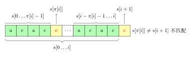
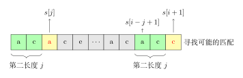
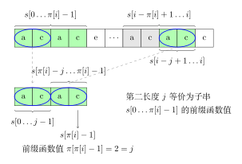
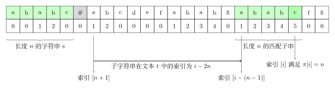

# 前缀函数与 KMP 算法 - OI Wiki

- Source: https://oi-wiki.org/string/kmp/

# 前缀函数与 KMP 算法

## 字符串前缀和后缀定义

关于字符串前缀、真前缀，后缀、真后缀的定义详见 [字符串基础](../basic/)

## 前缀函数

### 定义

给定一个长度为 𝑛n 的字符串 𝑠s，其 **前缀函数** 被定义为一个长度为 𝑛n 的数组 𝜋π． 其中 𝜋[𝑖]π[i] 的定义是：

  1. 如果子串 𝑠[0…𝑖]s[0…i] 有一对相等的真前缀与真后缀：𝑠[0…𝑘 −1]s[0…k−1] 和 𝑠[𝑖 −(𝑘 −1)…𝑖]s[i−(k−1)…i]，那么 𝜋[𝑖]π[i] 就是这个相等的真前缀（或者真后缀，因为它们相等）的长度，也就是 𝜋[𝑖] =𝑘π[i]=k；
  2. 如果不止有一对相等的，那么 𝜋[𝑖]π[i] 就是其中最长的那一对的长度；
  3. 如果没有相等的，那么 𝜋[𝑖] =0π[i]=0．

简单来说 𝜋[𝑖]π[i] 就是，子串 𝑠[0…𝑖]s[0…i] 最长的相等的真前缀与真后缀的长度．

用数学语言描述如下：

𝜋[𝑖]=max𝑘=0…𝑖{𝑘:𝑠[0…𝑘−1]=𝑠[𝑖−(𝑘−1)…𝑖]}π[i]=maxk=0…i{k:s[0…k−1]=s[i−(k−1)…i]}

特别地，规定 𝜋[0] =0π[0]=0．

### 过程

举例来说，对于字符串 `abcabcd`，

𝜋[0] =0π[0]=0，因为 `a` 没有真前缀和真后缀，根据规定为 0

𝜋[1] =0π[1]=0，因为 `ab` 无相等的真前缀和真后缀

𝜋[2] =0π[2]=0，因为 `abc` 无相等的真前缀和真后缀

𝜋[3] =1π[3]=1，因为 `abca` 只有一对相等的真前缀和真后缀：`a`，长度为 1

𝜋[4] =2π[4]=2，因为 `abcab` 相等的真前缀和真后缀只有 `ab`，长度为 2

𝜋[5] =3π[5]=3，因为 `abcabc` 相等的真前缀和真后缀只有 `abc`，长度为 3

𝜋[6] =0π[6]=0，因为 `abcabcd` 无相等的真前缀和真后缀

同理可以计算字符串 `aabaaab` 的前缀函数为 [0,1,0,1,2,2,3][0,1,0,1,2,2,3]．

## 计算前缀函数的朴素算法

### 过程

一个直接按照定义计算前缀函数的算法流程：

  * 在一个循环中以 𝑖 =1 →𝑛 −1i=1→n−1 的顺序计算前缀函数 𝜋[𝑖]π[i] 的值（𝜋[0]π[0] 被赋值为 00）．
  * 为了计算当前的前缀函数值 𝜋[𝑖]π[i]，我们令变量 𝑗j 从最大的真前缀长度 𝑖i 开始尝试．
  * 如果当前长度下真前缀和真后缀相等，则此时长度为 𝜋[𝑖]π[i]，否则令 j 自减 1，继续匹配，直到 𝑗 =0j=0．
  * 如果 𝑗 =0j=0 并且仍没有任何一次匹配，则置 𝜋[𝑖] =0π[i]=0 并移至下一个下标 𝑖 +1i+1．

实现

具体实现如下：

C++PythonJava

```text 1 2 3 4 5 6 7 8 9 10 11 12 13 ``` |  ```text // 注： // string substr (size_t pos = 0, size_t len = npos) const; vector < int > prefix_function ( string s ) { int n = ( int ) s . length (); vector < int > pi ( n ); for ( int i = 1 ; i < n ; i ++ ) for ( int j = i ; j >= 0 ; j \-- ) if ( s . substr ( 0 , j ) == s . substr ( i \- j \+ 1 , j )) { pi [ i ] = j ; break ; } return pi ; } ```   
---|---  
  
```text 1 2 3 4 5 6 7 8 9 ``` |  ```text def prefix_function ( s ): n = len ( s ) pi = [ 0 ] * n for i in range ( 1 , n ): for j in range ( i , \- 1 , \- 1 ): if s [ 0 : j ] == s [ i \- j \+ 1 : i \+ 1 ]: pi [ i ] = j break return pi ```   
---|---  
  
```text 1 2 3 4 5 6 7 8 9 10 11 12 13 ``` |  ```text static int [] prefix_function ( String s ) { int n = s . length (); int [] pi = new int [ n ] ; for ( int i = 1 ; i < n ; i ++ ) { for ( int j = i ; j >= 0 ; j \-- ) { if ( s . substring ( 0 , j ). equals ( s . substring ( i \- j \+ 1 , i \+ 1 ))) { pi [ i ] = j ; break ; } } } return pi ; } ```   
---|---  
  
显见该算法的时间复杂度为 𝑂(𝑛3)O(n3)，具有很大的改进空间．

## 计算前缀函数的高效算法

### 第一个优化

第一个重要的观察是 **相邻的前缀函数值至多增加 11**．

参照下图所示，只需如此考虑：当取一个尽可能大的 𝜋[𝑖 +1]π[i+1] 时，必然要求新增的 𝑠[𝑖 +1]s[i+1] 也与之对应的字符匹配，即 𝑠[𝑖 +1] =𝑠[𝜋[𝑖]]s[i+1]=s[π[i]], 此时 𝜋[𝑖 +1] =𝜋[𝑖] +1π[i+1]=π[i]+1．

𝜋[𝑖]=3⏞𝑠0 𝑠1 𝑠2 𝑠3⏟__⏟__⏟𝜋[𝑖+1]=4 … 𝜋[𝑖]=3⏞¯¯⏞¯¯⏞𝑠𝑖−2 𝑠𝑖−1 𝑠𝑖 𝑠𝑖+1⏟___⏟___⏟𝜋[𝑖+1]=4s0 s1 s2⏞π[i]=3 s3⏟π[i+1]=4 … si−2 si−1 si⏞π[i]=3 si+1⏟π[i+1]=4

所以当移动到下一个位置时，前缀函数的值要么增加一，要么维持不变，要么减少．

实现

此时的改进的算法为：

C++PythonJava

```text 1 2 3 4 5 6 7 8 9 10 11 ``` |  ```text vector < int > prefix_function ( string s ) { int n = ( int ) s . length (); vector < int > pi ( n ); for ( int i = 1 ; i < n ; i ++ ) for ( int j = pi [ i \- 1 ] \+ 1 ; j >= 0 ; j \-- ) // improved: j=i => j=pi[i-1]+1 if ( s . substr ( 0 , j ) == s . substr ( i \- j \+ 1 , j )) { pi [ i ] = j ; break ; } return pi ; } ```   
---|---  
  
```text 1 2 3 4 5 6 7 8 9 ``` |  ```text def prefix_function ( s ): n = len ( s ) pi = [ 0 ] * n for i in range ( 1 , n ): for j in range ( pi [ i \- 1 ] \+ 1 , \- 1 , \- 1 ): if s [ 0 : j ] == s [ i \- j \+ 1 : i \+ 1 ]: pi [ i ] = j break return pi ```   
---|---  
  
```text 1 2 3 4 5 6 7 8 9 10 11 12 13 ``` |  ```text static int [] prefix_function ( String s ) { int n = s . length (); int [] pi = new int [ n ] ; for ( int i = 1 ; i < n ; i ++ ) { for ( int j = pi [ i \- 1 ] \+ 1 ; j >= 0 ; j \-- ) { if ( s . substring ( 0 , j ). equals ( s . substring ( i \- j \+ 1 , i \+ 1 ))) { pi [ i ] = j ; break ; } } } return pi ; } ```   
---|---  
  
在这个初步改进的算法中，在计算每个 𝜋[𝑖]π[i] 时，最好的情况是第一次字符串比较就完成了匹配，也就是说基础的字符串比较次数是 `n-1` 次．

而由于存在 `j = pi[i-1]+1`（`pi[0]=0`）对于最大字符串比较次数的限制，可以看出每次只有在最好情况才会为字符串比较次数的上限积累 1，而每次超过一次的字符串比较消耗的是之后次数的增长空间．

由此我们可以得出字符串比较次数最多的一种情况：至少 `1` 次字符串比较次数的消耗和最多 `n-2` 次比较次数的积累，此时字符串比较次数为 `n-1 + n-2 = 2n-3`．

可见经过此次优化，计算前缀函数只需要进行 𝑂(𝑛)O(n) 次字符串比较，总复杂度降为了 𝑂(𝑛2)O(n2)．

### 第二个优化

在第一个优化中，我们讨论了计算 𝜋[𝑖 +1]π[i+1] 时的最好情况：𝑠[𝑖 +1] =𝑠[𝜋[𝑖]]s[i+1]=s[π[i]]，此时 𝜋[𝑖 +1] =𝜋[𝑖] +1π[i+1]=π[i]+1．现在让我们沿着这个思路走得更远一点：讨论当 𝑠[𝑖 +1] ≠𝑠[𝜋[𝑖]]s[i+1]≠s[π[i]] 时如何跳转．



如上图所示，失配时，我们希望找到对于子串 𝑠[0…𝑖]s[0…i]，仅次于 𝜋[𝑖]π[i] 的第二长度 𝑗j，使得在位置 𝑖i 的前缀性质仍得以保持，也即 𝑠[0…𝑗 −1] =𝑠[𝑖 −𝑗 +1…𝑖]s[0…j−1]=s[i−j+1…i]：

𝜋[𝑖]⏞¯¯⏞¯¯⏞𝑠0 𝑠1⏟𝑗 𝑠2 𝑠3 … 𝜋[𝑖]⏞¯¯¯⏞¯¯¯⏞𝑠𝑖−3 𝑠𝑖−2 𝑠𝑖−1 𝑠𝑖⏟𝑗 𝑠𝑖+1s0 s1⏟j s2 s3⏞π[i] … si−3 si−2 si−1 si⏟j⏞π[i] si+1

如果我们找到了这样的长度 𝑗j，那么仅需要再次比较 𝑠[𝑖 +1]s[i+1] 和 𝑠[𝑗]s[j]．如果它们相等，那么就有 𝜋[𝑖 +1] =𝑗 +1π[i+1]=j+1．否则，我们需要找到子串 𝑠[0…𝑖]s[0…i] 仅次于 𝑗j 的第二长度 𝑗(2)j(2)，使得前缀性质得以保持，如此反复，直到 𝑗 =0j=0．如果 𝑠[𝑖 +1] ≠𝑠[0]s[i+1]≠s[0]，则 𝜋[𝑖 +1] =0π[i+1]=0．第二次比较的示意图如下所示



观察上图可以发现，因为 𝑠[0…𝜋[𝑖] −1] =𝑠[𝑖 −𝜋[𝑖] +1…𝑖]s[0…π[i]−1]=s[i−π[i]+1…i]，所以对于 𝑠[0…𝑖]s[0…i] 的第二长度 𝑗j，有这样的性质：

𝑠[0…𝑗−1]=𝑠[𝑖−𝑗+1…𝑖]=𝑠[𝜋[𝑖]−𝑗…𝜋[𝑖]−1]s[0…j−1]=s[i−j+1…i]=s[π[i]−j…π[i]−1]

该公式的示意图如下所示：



也就是说 𝑗j 等价于子串 𝑠[𝜋[𝑖] −1]s[π[i]−1] 的前缀函数值，对应于上图下半部分，即 𝑗 =𝜋[𝜋[𝑖] −1]j=π[π[i]−1]．同理，次于 𝑗j 的第二长度等价于 𝑠[𝑗 −1]s[j−1] 的前缀函数值，𝑗(2) =𝜋[𝑗 −1]j(2)=π[j−1].

显然我们可以得到一个关于 𝑗j 的状态转移方程：𝑗(𝑛) =𝜋[𝑗(𝑛−1) −1], (𝑗(𝑛−1) >0)j(n)=π[j(n−1)−1], (j(n−1)>0)

### 最终算法

所以最终我们可以构建一个不需要进行任何字符串比较，并且只进行 𝑂(𝑛)O(n) 次操作的算法．

而且该算法的实现出人意料的短且直观：

实现

C++PythonJava

```text 1 2 3 4 5 6 7 8 9 10 11 ``` |  ```text vector < int > prefix_function ( string s ) { int n = ( int ) s . length (); vector < int > pi ( n ); for ( int i = 1 ; i < n ; i ++ ) { int j = pi [ i \- 1 ]; while ( j > 0 && s [ i ] != s [ j ]) j = pi [ j \- 1 ]; if ( s [ i ] == s [ j ]) j ++ ; pi [ i ] = j ; } return pi ; } ```   
---|---  
  
```text 1 2 3 4 5 6 7 8 9 10 11 ``` |  ```text def prefix_function ( s ): n = len ( s ) pi = [ 0 ] * n for i in range ( 1 , n ): j = pi [ i \- 1 ] while j > 0 and s [ i ] != s [ j ]: j = pi [ j \- 1 ] if s [ i ] == s [ j ]: j += 1 pi [ i ] = j return pi ```   
---|---  
  
```text 1 2 3 4 5 6 7 8 9 10 11 12 13 14 15 ``` |  ```text static int [] prefix_function ( String s ) { int n = s . length (); int [] pi = new int [ n ] ; for ( int i = 1 ; i < n ; i ++ ) { int j = pi [ i \- 1 ] ; while ( j > 0 && s . charAt ( i ) != s . charAt ( j )) { j = pi [ j \- 1 ] ; } if ( s . charAt ( i ) == s . charAt ( j )) { j ++ ; } pi [ i ] = j ; } return pi ; } ```   
---|---  
  
这是一个 **在线** 算法，即其当数据到达时处理它——举例来说，你可以一个字符一个字符的读取字符串，立即处理它们以计算出每个字符的前缀函数值．该算法仍然需要存储字符串本身以及先前计算过的前缀函数值，但如果我们已经预先知道该字符串前缀函数的最大可能取值 𝑀M，那么我们仅需要存储该字符串的前 𝑀 +1M+1 个字符以及对应的前缀函数值．

## 应用

### 在字符串中查找子串：Knuth–Morris–Pratt 算法

该算法由 Knuth、Pratt 和 Morris 在 1977 年共同发布1．该任务是前缀函数的一个典型应用．

#### 过程

给定一个文本 𝑡t 和一个字符串 𝑠s，我们尝试找到并展示 𝑠s 在 𝑡t 中的所有出现（occurrence）．

为了简便起见，我们用 𝑛n 表示字符串 𝑠s 的长度，用 𝑚m 表示文本 𝑡t 的长度．

我们构造一个字符串 𝑠 +# +𝑡s+#+t，其中 ## 为一个既不出现在 𝑠s 中也不出现在 𝑡t 中的分隔符．接下来计算该字符串的前缀函数．现在考虑该前缀函数除去最开始 𝑛 +1n+1 个值（即属于字符串 𝑠s 和分隔符的函数值）后其余函数值的意义．根据定义，𝜋[𝑖]π[i] 为右端点在 𝑖i 且同时为一个前缀的最长真子串的长度，具体到我们的这种情况下，其值为与 𝑠s 的前缀相同且右端点位于 𝑖i 的最长子串的长度．由于分隔符的存在，该长度不可能超过 𝑛n．而如果等式 𝜋[𝑖] =𝑛π[i]=n 成立，则意味着 𝑠s 完整出现在该位置（即其右端点位于位置 𝑖i）．注意该位置的下标是对字符串 𝑠 +# +𝑡s+#+t 而言的．

因此如果在某一位置 𝑖i 有 𝜋[𝑖] =𝑛π[i]=n 成立，则字符串 𝑠s 在字符串 𝑡t 的 𝑖 −(𝑛 −1) −(𝑛 +1) =𝑖 −2𝑛i−(n−1)−(n+1)=i−2n 处出现．下图所示为索引的示意图．



正如在前缀函数的计算中已经提到的那样，如果我们知道前缀函数的值永远不超过一特定值，那么我们不需要存储整个字符串以及整个前缀函数，而只需要二者开头的一部分．在我们这种情况下这意味着只需要存储字符串 𝑠 +#s+# 以及相应的前缀函数值即可．我们可以一次读入字符串 𝑡t 的一个字符并计算当前位置的前缀函数值．

因此 Knuth–Morris–Pratt 算法（简称 KMP 算法）用 𝑂(𝑛 +𝑚)O(n+m) 的时间以及 𝑂(𝑛)O(n) 的内存解决了该问题．

实现

C++PythonJava

```text 1 2 3 4 5 6 7 8 9 10 ``` |  ```text vector < int > find_occurrences ( string text , string pattern ) { string cur = pattern \+ '#' \+ text ; int sz1 = text . size (), sz2 = pattern . size (); vector < int > v ; vector < int > lps = prefix_function ( cur ); for ( int i = sz2 \+ 1 ; i <= sz1 \+ sz2 ; i ++ ) { if ( lps [ i ] == sz2 ) v . push_back ( i \- 2 * sz2 ); } return v ; } ```   
---|---  
  
```text 1 2 3 4 5 6 7 8 9 ``` |  ```text def find_occurrences ( t , s ): cur = s \+ "#" \+ t sz1 , sz2 = len ( t ), len ( s ) ret = [] lps = prefix_function ( cur ) for i in range ( sz2 \+ 1 , sz1 \+ sz2 \+ 1 ): if lps [ i ] == sz2 : ret . append ( i \- 2 * sz2 ) return ret ```   
---|---  
  
```text 1 2 3 4 5 6 7 8 9 10 11 12 ``` |  ```text static List < Integer > find_occurrences ( String text , String pattern ) { String cur = pattern \+ '#' \+ text ; int sz1 = text . length (), sz2 = pattern . length (); List < Integer > v = new ArrayList <> (); int [] lps = prefix_function ( cur ); for ( int i = sz2 \+ 1 ; i <= sz1 \+ sz2 ; i ++ ) { if ( lps [ i ] == sz2 ) { v . add ( i \- 2 * sz2 ); } } return v ; } ```   
---|---  
  
### 字符串的周期

对字符串 𝑠s 和 0 <𝑝 ≤|𝑠|0<p≤|s|，若 𝑠[𝑖] =𝑠[𝑖 +𝑝]s[i]=s[i+p] 对所有 𝑖 ∈[0,|𝑠| −𝑝 −1]i∈[0,|s|−p−1] 成立，则称 𝑝p 是 𝑠s 的周期．

对字符串 𝑠s 和 0 ≤𝑟 <|𝑠|0≤r<|s|，若 𝑠s 长度为 𝑟r 的前缀和长度为 𝑟r 的后缀相等，就称 𝑠s 长度为 𝑟r 的前缀是 𝑠s 的 border．

由 𝑠s 有长度为 𝑟r 的 border 可以推导出 |𝑠| −𝑟|s|−r 是 𝑠s 的周期．

根据前缀函数的定义，可以得到 𝑠s 所有的 border 长度，即 𝜋[𝑛 −1],𝜋[𝜋[𝑛 −1] −1],…π[n−1],π[π[n−1]−1],…．2

所以根据前缀函数可以在 𝑂(𝑛)O(n) 的时间内计算出 𝑠s 所有的周期．其中，由于 𝜋[𝑛 −1]π[n−1] 是 𝑠s 最长 border 的长度，所以 𝑛 −𝜋[𝑛 −1]n−π[n−1] 是 𝑠s 的最小周期．

### 统计每个前缀的出现次数

在该节我们将同时讨论两个问题．给定一个长度为 𝑛n 的字符串 𝑠s，在问题的第一个变种中我们希望统计每个前缀 𝑠[0…𝑖]s[0…i] 在同一个字符串的出现次数，在问题的第二个变种中我们希望统计每个前缀 𝑠[0…𝑖]s[0…i] 在另一个给定字符串 𝑡t 中的出现次数．

首先让我们来解决第一个问题．考虑位置 𝑖i 的前缀函数值 𝜋[𝑖]π[i]．根据定义，其意味着字符串 𝑠s 一个长度为 𝜋[𝑖]π[i] 的前缀在位置 𝑖i 出现并以 𝑖i 为右端点，同时不存在一个更长的前缀满足前述定义．与此同时，更短的前缀可能以该位置为右端点．容易看出，我们遇到了在计算前缀函数时已经回答过的问题：给定一个长度为 𝑗j 的前缀，同时其也是一个右端点位于 𝑖i 的后缀，下一个更小的前缀长度 𝑘 <𝑗k<j 是多少？该长度的前缀需同时也是一个右端点为 𝑖i 的后缀．因此以位置 𝑖i 为右端点，有长度为 𝜋[𝑖]π[i] 的前缀，有长度为 𝜋[𝜋[𝑖] −1]π[π[i]−1] 的前缀，有长度为 𝜋[𝜋[𝜋[𝑖] −1] −1]π[π[π[i]−1]−1] 的前缀，等等，直到长度变为 00．故而我们可以通过下述方式计算答案．

实现

C++Python

```text 1 2 3 4 ``` |  ```text vector < int > ans ( n \+ 1 ); for ( int i = 0 ; i < n ; i ++ ) ans [ pi [ i ]] ++ ; for ( int i = n \- 1 ; i > 0 ; i \-- ) ans [ pi [ i \- 1 ]] += ans [ i ]; for ( int i = 0 ; i <= n ; i ++ ) ans [ i ] ++ ; ```   
---|---  
  
```text 1 2 3 4 5 6 7 ``` |  ```text ans = [ 0 ] * ( n \+ 1 ) for i in range ( 0 , n ): ans [ pi [ i ]] += 1 for i in range ( n \- 1 , 0 , \- 1 ): ans [ pi [ i \- 1 ]] += ans [ i ] for i in range ( 0 , n \+ 1 ): ans [ i ] += 1 ```   
---|---  
  
#### 解释

在上述代码中我们首先统计每个前缀函数值在数组 𝜋π 中出现了多少次，然后再计算最后答案：如果我们知道长度为 𝑖i 的前缀出现了恰好 ans[𝑖]ans[i] 次，那么该值必须被叠加至其最长的既是后缀也是前缀的子串的出现次数中．在最后，为了统计原始的前缀，我们对每个结果加 11．

现在考虑第二个问题．我们应用来自 Knuth–Morris–Pratt 的技巧：构造一个字符串 𝑠 +# +𝑡s+#+t 并计算其前缀函数．与第一个问题唯一的不同之处在于，我们只关心与字符串 𝑡t 相关的前缀函数值，即 𝑖 ≥𝑛 +1i≥n+1 的 𝜋[𝑖]π[i]．有了这些值之后，我们可以同样应用在第一个问题中的算法来解决该问题．

### 一个字符串中本质不同子串的数目

给定一个长度为 𝑛n 的字符串 𝑠s，我们希望计算其本质不同子串的数目．

我们将迭代的解决该问题．换句话说，在知道了当前的本质不同子串的数目的情况下，我们要找出一种在 𝑠s 末尾添加一个字符后重新计算该数目的方法．

令 𝑘k 为当前 𝑠s 的本质不同子串数量．我们添加一个新的字符 𝑐c 至 𝑠s．显然，会有一些新的子串以字符 𝑐c 结尾．我们希望对这些以该字符结尾且我们之前未曾遇到的子串计数．

构造字符串 𝑡 =𝑠 +𝑐t=s+c 并将其反转得到字符串 𝑡∼t∼．现在我们的任务变为计算有多少 𝑡∼t∼ 的前缀未在 𝑡∼t∼ 的其余任何地方出现．如果我们计算了 𝑡∼t∼ 的前缀函数最大值 𝜋maxπmax，那么最长的出现在 𝑠s 中的前缀其长度为 𝜋maxπmax．自然的，所有更短的前缀也出现了．

因此，当添加了一个新字符后新出现的子串数目为 |𝑠| +1 −𝜋max|s|+1−πmax．

所以对于每个添加的字符，我们可以在 𝑂(𝑛)O(n) 的时间内计算新子串的数目，故最终复杂度为 𝑂(𝑛2)O(n2)．

值得注意的是，我们也可以重新计算在头部添加一个字符，或者从尾或者头移除一个字符时的本质不同子串数目．

### 字符串压缩

给定一个长度为 𝑛n 的字符串 𝑠s，我们希望找到其最短的「压缩」表示，也即我们希望寻找一个最短的字符串 𝑡t，使得 𝑠s 可以被 𝑡t 的一份或多份拷贝的拼接表示．

显然，我们只需要找到 𝑡t 的长度即可．知道了该长度，该问题的答案即为长度为该值的 𝑠s 的前缀．

让我们计算 𝑠s 的前缀函数．通过使用该函数的最后一个值 𝜋[𝑛 −1]π[n−1]，我们定义值 𝑘 =𝑛 −𝜋[𝑛 −1]k=n−π[n−1]．我们将证明，如果 𝑘k 整除 𝑛n，那么 𝑘k 就是答案，否则不存在一个有效的压缩，故答案为 𝑛n．

假定 𝑛n 可被 𝑘k 整除．那么字符串可被划分为长度为 𝑘k 的若干块．根据前缀函数的定义，该字符串长度为 𝑛 −𝑘n−k 的前缀等于其后缀．但是这意味着最后一个块同倒数第二个块相等，并且倒数第二个块同倒数第三个块相等，等等．作为其结果，所有块都是相等的，因此我们可以将字符串 𝑠s 压缩至长度 𝑘k．

证明

诚然，我们仍需证明该值为最优解．实际上，如果有一个比 𝑘k 更小的压缩表示，那么前缀函数的最后一个值 𝜋[𝑛 −1]π[n−1] 必定比 𝑛 −𝑘n−k 要大．因此 𝑘k 就是答案．

现在假设 𝑛n 不可以被 𝑘k 整除，我们将通过反证法证明这意味着答案为 𝑛n3．假设其最小压缩表示 𝑟r 的长度为 𝑝p（𝑝p 整除 𝑛n），字符串 𝑠s 被划分为 𝑛/𝑝 ≥2n/p≥2 块．那么前缀函数的最后一个值 𝜋[𝑛 −1]π[n−1] 必定大于 𝑛 −𝑝n−p（如果等于则 𝑛n 可被 𝑘k 整除），也即其所表示的后缀将部分的覆盖第一个块．现在考虑字符串的第二个块．该块有两种解释：第一种为 𝑟0𝑟1…𝑟𝑝−1r0r1…rp−1，另一种为 𝑟𝑝−𝑘𝑟𝑝−𝑘+1…𝑟𝑝−1𝑟0𝑟1…𝑟𝑝−𝑘−1rp−krp−k+1…rp−1r0r1…rp−k−1．由于两种解释对应同一个字符串，因此可得到 𝑝p 个方程组成的方程组，该方程组可简写为 𝑟(𝑖+𝑘)mod𝑝 =𝑟𝑖mod𝑝r(i+k)modp=rimodp，其中 ⋅mod𝑝⋅modp 表示模 𝑝p 意义下的最小非负剩余．

𝑝⏞¯¯¯⏞¯¯¯⏞𝑟0 𝑟1 𝑟2 𝑟3 𝑟4 𝑟5 𝑝⏞¯¯¯⏞¯¯¯⏞𝑟0 𝑟1 𝑟2 𝑟3 𝑟4𝑟5𝑟0 𝑟1 𝑟2 𝑟3 𝑝⏞¯¯¯⏞¯¯¯⏞𝑟0 𝑟1 𝑟2 𝑟3 𝑟4 𝑟5 𝑟0 𝑟1⏟____⏟____⏟𝜋[11]=8r0 r1 r2 r3 r4 r5⏞p r0 r1 r2 r3 r4r5⏞pr0 r1 r2 r3 r0 r1 r2 r3 r4 r5⏞p r0 r1⏟π[11]=8

根据扩展欧几里得算法我们可以得到一组 𝑥x 和 𝑦y 使得 𝑥𝑘 +𝑦𝑝 =gcd(𝑘,𝑝)xk+yp=gcd(k,p)．通过与等式 𝑝𝑘 −𝑘𝑝 =0pk−kp=0 适当叠加我们可以得到一组 𝑥′ >0x′>0 和 𝑦′ <0y′<0 使得 𝑥′𝑘 +𝑦′𝑝 =gcd(𝑘,𝑝)x′k+y′p=gcd(k,p)．这意味着通过不断应用前述方程组中的方程我们可以得到新的方程组 𝑟(𝑖+gcd(𝑘,𝑝))mod𝑝 =𝑟𝑖mod𝑝r(i+gcd(k,p))modp=rimodp．

由于 gcd(𝑘,𝑝)gcd(k,p) 整除 𝑝p，这意味着 gcd(𝑘,𝑝)gcd(k,p) 是 𝑟r 的一个周期．又因为 𝜋[𝑛 −1] >𝑛 −𝑝π[n−1]>n−p，故有 𝑛 −𝜋[𝑛 −1] =𝑘 <𝑝n−π[n−1]=k<p，所以 gcd(𝑘,𝑝)gcd(k,p) 是一个比 𝑝p 更小的 𝑟r 的周期．因此字符串 𝑠s 有一个长度为 gcd(𝑘,𝑝) <𝑝gcd(k,p)<p 的压缩表示，同 𝑝p 的最小性矛盾．

综上所述，不存在一个长度小于 𝑘k 的压缩表示，因此答案为 𝑘k．

### 根据前缀函数构建一个自动机

让我们重新回到通过一个分隔符将两个字符串拼接的新字符串．对于字符串 𝑠s 和 𝑡t 我们计算 𝑠 +# +𝑡s+#+t 的前缀函数．显然，因为 ## 是一个分隔符，前缀函数值永远不会超过 |𝑠||s|．因此我们只需要存储字符串 𝑠 +#s+# 和其对应的前缀函数值，之后就可以动态计算对于之后所有字符的前缀函数值：

𝑠0 𝑠1 … 𝑠𝑛−1 #⏟___⏟___⏟need to store 𝑡0 𝑡1 … 𝑡𝑚−1⏟__⏟__⏟do not need to stores0 s1 … sn−1 #⏟need to store t0 t1 … tm−1⏟do not need to store

实际上在这种情况下，知道 𝑡t 的下一个字符 𝑐c 以及之前位置的前缀函数值便足以计算下一个位置的前缀函数值，而不需要用到任何其它 𝑡t 的字符和对应的前缀函数值．

换句话说，我们可以构造一个 **自动机** （一个有限状态机）：其状态为当前的前缀函数值，而从一个状态到另一个状态的转移则由下一个字符确定．

因此，即使没有字符串 𝑡t，我们同样可以应用构造转移表的算法构造一个转移表 ( old 𝜋,𝑐) → new −𝜋( old π,c)→ new −π：

实现

```text 1 2 3 4 5 6 7 8 9 10 11 12 13 14 ``` |  ```text void compute_automaton ( string s , vector < vector < int >>& aut ) { s += '#' ; int n = s . size (); vector < int > pi = prefix_function ( s ); aut . assign ( n , vector < int > ( 26 )); for ( int i = 0 ; i < n ; i ++ ) { for ( int c = 0 ; c < 26 ; c ++ ) { int j = i ; while ( j > 0 && 'a' \+ c != s [ j ]) j = pi [ j \- 1 ]; if ( 'a' \+ c == s [ j ]) j ++ ; aut [ i ][ c ] = j ; } } } ```   
---|---  
  
然而在这种形式下，对于小写字母表，算法的时间复杂度为 𝑂(|Σ|𝑛2)O(|Σ|n2)．注意到我们可以应用动态规划来利用表中已计算过的部分．只要我们从值 𝑗j 变化到 𝜋[𝑗 −1]π[j−1]，那么我们实际上在说转移 (𝑗,𝑐)(j,c) 所到达的状态同转移 (𝜋[𝑗 −1],𝑐)(π[j−1],c) 一样，但该答案我们之前已经精确计算过了．

实现

```text 1 2 3 4 5 6 7 8 9 10 11 12 13 14 ``` |  ```text void compute_automaton ( string s , vector < vector < int >>& aut ) { s += '#' ; int n = s . size (); vector < int > pi = prefix_function ( s ); aut . assign ( n , vector < int > ( 26 )); for ( int i = 0 ; i < n ; i ++ ) { for ( int c = 0 ; c < 26 ; c ++ ) { if ( i > 0 && 'a' \+ c != s [ i ]) aut [ i ][ c ] = aut [ pi [ i \- 1 ]][ c ]; else aut [ i ][ c ] = i \+ ( 'a' \+ c == s [ i ]); } } } ```   
---|---  
  
最终我们可在 𝑂(|Σ|𝑛)O(|Σ|n) 的时间复杂度内构造该自动机．

该自动机在什么时候有用呢？首先，记得大部分时候我们为了一个目的使用字符串 𝑠 +# +𝑡s+#+t 的前缀函数：寻找字符串 𝑠s 在字符串 𝑡t 中的所有出现．

因此使用该自动机的最直接的好处是 **加速计算字符串 𝑠 +# +𝑡s+#+t 的前缀函数**．

通过构建 𝑠 +#s+# 的自动机，我们不再需要存储字符串 𝑠s 以及其对应的前缀函数值．所有转移已经在表中计算过了．

但除此以外，还有第二个不那么直接的应用．我们可以在字符串 𝑡t 是 **某些通过一些规则构造的巨型字符串** 时，使用该自动机加速计算．Gray 字符串，或者一个由一些短的输入串的递归组合所构造的字符串都是这种例子．

出于完整性考虑，我们来解决这样一个问题：给定一个数 𝑘 ≤105k≤105，以及一个长度 ≤105≤105 的字符串 𝑠s，我们需要计算 𝑠s 在第 𝑘k 个 Gray 字符串中的出现次数．回想起 Gray 字符串以下述方式定义：

𝑔1=𝚊𝑔2=𝚊𝚋𝚊𝑔3=𝚊𝚋𝚊𝚌𝚊𝚋𝚊𝑔4=𝚊𝚋𝚊𝚌𝚊𝚋𝚊𝚍𝚊𝚋𝚊𝚌𝚊𝚋𝚊g1=ag2=abag3=abacabag4=abacabadabacaba

由于其天文数字般的长度，在这种情况下即使构造字符串 𝑡t 都是不可能的：第 𝑘k 个 Gray 字符串有 2𝑘 −12k−1 个字符．然而我们可以在仅仅知道开头若干前缀函数值的情况下，有效计算该字符串末尾的前缀函数值．

除了自动机之外，我们同时需要计算值 𝐺[𝑖][𝑗]G[i][j]：在从状态 𝑗j 开始处理 𝑔𝑖gi 后的自动机的状态，以及值 𝐾[𝑖][𝑗]K[i][j]：当从状态 𝑗j 开始处理 𝑔𝑖gi 后，𝑠s 在 𝑔𝑖gi 中的出现次数．实际上 𝐾[𝑖][𝑗]K[i][j] 为在执行操作时前缀函数取值为 |𝑠||s| 的次数．易得问题的答案为 𝐾[𝑘][0]K[k][0]．

我们该如何计算这些值呢？首先根据定义，初始条件为 𝐺[0][𝑗] =𝑗G[0][j]=j 以及 𝐾[0][𝑗] =0K[0][j]=0．之后所有值可以通过先前的值以及使用自动机计算得到．为了对某个 𝑖i 计算相应值，回想起字符串 𝑔𝑖gi 由 𝑔𝑖−1gi−1，字母表中第 𝑖i 个字符，以及 𝑔𝑖−1gi−1 三者拼接而成．因此自动机会途径下列状态：

mid=aut[𝐺[𝑖−1][𝑗]][𝑖]𝐺[𝑖][𝑗]=𝐺[𝑖−1][mid]mid=aut[G[i−1][j]][i]G[i][j]=G[i−1][mid]

𝐾[𝑖][𝑗]K[i][j] 的值同样可被简单计算．

𝐾[𝑖][𝑗]=𝐾[𝑖−1][𝑗]+[mid==|𝑠|]+𝐾[𝑖−1][mid]K[i][j]=K[i−1][j]+[mid==|s|]+K[i−1][mid]

其中 [ ⋅][⋅] 当其中表达式取值为真时值为 11，否则为 00．综上，我们已经可以解决关于 Gray 字符串的问题，以及一大类与之类似的问题．举例来说，应用同样的方法可以解决下列问题：给定一个字符串 𝑠s 以及一些模式 𝑡𝑖ti，其中每个模式以下列方式给出：该模式由普通字符组成，当中可能以 𝑡cnt𝑘tkcnt 的形式递归插入先前的字符串，也即在该位置我们必须插入字符串 𝑡𝑘tk cntcnt 次．以下是这些模式的一个例子：

𝑡1=𝚊𝚋𝚍𝚎𝚌𝚊𝑡2=𝚊𝚋𝚌+𝑡301+𝚊𝚋𝚍𝑡3=𝑡502+𝑡1001𝑡4=𝑡102+𝑡1003t1=abdecat2=abc+t130+abdt3=t250+t1100t4=t210+t3100

递归代入会使字符串长度爆炸式增长，他们的长度甚至可以达到 100100100100 的数量级．而我们必须找到字符串 𝑠s 在每个字符串中的出现次数．

该问题同样可通过构造前缀函数的自动机解决．同之前一样，我们利用先前计算过的结果对每个模式计算其转移然后相应统计答案即可．

## 练习题目

  * [UVa 455 "Periodic Strings"](http://uva.onlinejudge.org/index.php?option=onlinejudge&page=show_problem&problem=396)
  * [UVa 11022 "String Factoring"](http://uva.onlinejudge.org/index.php?option=onlinejudge&page=show_problem&problem=1963)
  * [UVa 11452 "Dancing the Cheeky-Cheeky"](http://uva.onlinejudge.org/index.php?option=onlinejudge&page=show_problem&problem=2447)
  * [UVa 12604 - Caesar Cipher](https://uva.onlinejudge.org/index.php?option=com_onlinejudge&Itemid=8&page=show_problem&problem=4282)
  * [UVa 12467 - Secret Word](https://uva.onlinejudge.org/index.php?option=com_onlinejudge&Itemid=8&page=show_problem&problem=3911)
  * [UVa 11019 - Matrix Matcher](https://uva.onlinejudge.org/index.php?option=onlinejudge&page=show_problem&problem=1960)
  * [SPOJ - Pattern Find](http://www.spoj.com/problems/NAJPF/)
  * [Codeforces - Anthem of Berland](http://codeforces.com/contest/808/problem/G)
  * [Codeforces - MUH and Cube Walls](http://codeforces.com/problemset/problem/471/D)

## 参考资料与注释

**本页面主要译自博文[Префикс-функция. Алгоритм Кнута-Морриса-Пратта](http://e-maxx.ru/algo/prefix_function) 与其英文翻译版 [Prefix function. Knuth–Morris–Pratt algorithm](https://cp-algorithms.com/string/prefix-function.html)．其中俄文版版权协议为 Public Domain + Leave a Link；英文版版权协议为 CC-BY-SA 4.0．**

* * *

  1. Knuth, Donald E., James H. Morris, Jr, and Vaughan R. Pratt. "Fast pattern matching in strings." SIAM journal on computing 6.2 (1977): 323-350.[doi: 10.1137/0206024](https://epubs.siam.org/doi/abs/10.1137/0206024) ↩

  2. [金策 - 字符串算法选讲](https://github.com/hzwer/shareOI/blob/master/%E5%AD%97%E7%AC%A6%E4%B8%B2/%E5%AD%97%E7%AC%A6%E4%B8%B2%E7%AE%97%E6%B3%95%E9%80%89%E8%AE%B2_%E9%87%91%E7%AD%96.pdf) ↩

  3. 在俄文版及英文版中该部分证明均疑似有误．本文章中的该部分证明由作者自行添加． ↩

* * *

>  __本页面最近更新： 2026/1/7 08:56:54，[更新历史](https://github.com/OI-wiki/OI-wiki/commits/master/docs/string/kmp.md)  
>  __发现错误？想一起完善？[在 GitHub 上编辑此页！](https://oi-wiki.org/edit-landing/?ref=/string/kmp.md "edit.link.title")  
>  __本页面贡献者：[Ir1d](https://github.com/Ir1d), [StudyingFather](https://github.com/StudyingFather), [Tiphereth-A](https://github.com/Tiphereth-A), [Enter-tainer](https://github.com/Enter-tainer), [Xeonacid](https://github.com/Xeonacid), [Backl1ght](https://github.com/Backl1ght), [CCXXXI](https://github.com/CCXXXI), [countercurrent-time](https://github.com/countercurrent-time), [H-J-Granger](https://github.com/H-J-Granger), [LeoJacob](https://github.com/LeoJacob), [minghu6](https://github.com/minghu6), [NachtgeistW](https://github.com/NachtgeistW), [HeRaNO](https://github.com/HeRaNO), [iamtwz](https://github.com/iamtwz), [AngelKitty](https://github.com/AngelKitty), [cjsoft](https://github.com/cjsoft), [diauweb](https://github.com/diauweb), [Early0v0](https://github.com/Early0v0), [ezoixx130](https://github.com/ezoixx130), [GekkaSaori](https://github.com/GekkaSaori), [greyqz](https://github.com/greyqz), [Konano](https://github.com/Konano), [LovelyBuggies](https://github.com/LovelyBuggies), [Makkiy](https://github.com/Makkiy), [mgt](mailto:i@margatroid.xyz), [P-Y-Y](https://github.com/P-Y-Y), [PotassiumWings](https://github.com/PotassiumWings), [SamZhangQingChuan](https://github.com/SamZhangQingChuan), [sshwy](https://github.com/sshwy), [Suyun514](mailto:suyun514@qq.com), [weiyong1024](https://github.com/weiyong1024), [WException](https://github.com/WException), [xzcxzcyy](https://github.com/xzcxzcyy), [akakw1](https://github.com/akakw1), [GavinZhengOI](https://github.com/GavinZhengOI), [Gesrua](https://github.com/Gesrua), [gi-b716](https://github.com/gi-b716), [Great-designer](https://github.com/Great-designer), [hsiachi](https://github.com/hsiachi), [Jvaeyhcd](https://github.com/Jvaeyhcd), [ksyx](https://github.com/ksyx), [kxccc](https://github.com/kxccc), [lotato](https://github.com/lotato), [lychees](https://github.com/lychees), [Marcythm](https://github.com/Marcythm), [MarkJoson](https://github.com/MarkJoson), [Menci](https://github.com/Menci), [nexplorer-3e](https://github.com/nexplorer-3e), [Peanut-Tang](https://github.com/Peanut-Tang), [shawlleyw](https://github.com/shawlleyw), [silverling](https://github.com/silverling), [SukkaW](https://github.com/SukkaW), [synthale](https://github.com/synthale), [TrisolarisHD](mailto:orzcyand1317@gmail.com), [xiaocao666tzh](https://github.com/xiaocao666tzh), [ZnPdCo](https://github.com/ZnPdCo), [zychen20](https://github.com/zychen20)  
>  __本页面的全部内容在**[CC BY-SA 4.0](https://creativecommons.org/licenses/by-sa/4.0/deed.zh) 和 [SATA](https://github.com/zTrix/sata-license)** 协议之条款下提供，附加条款亦可能应用
