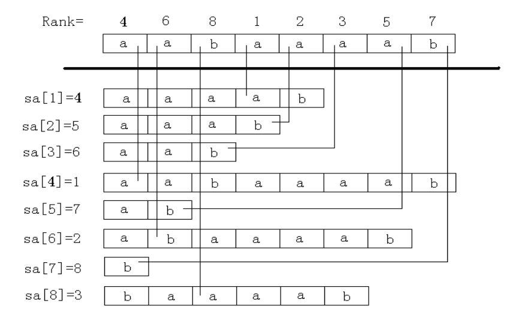
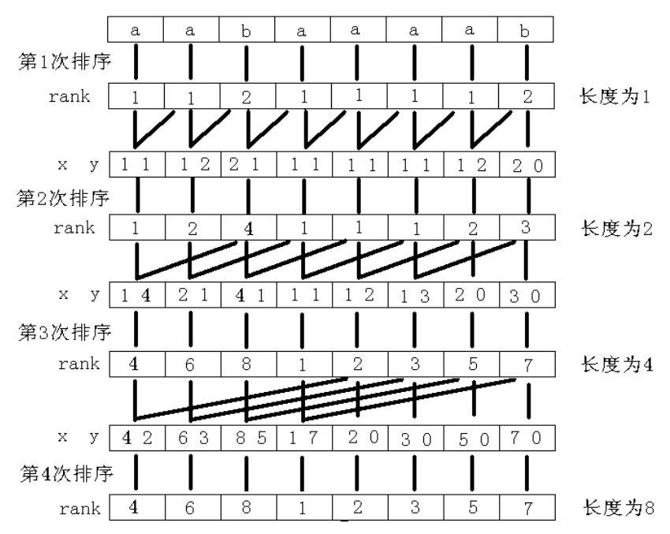
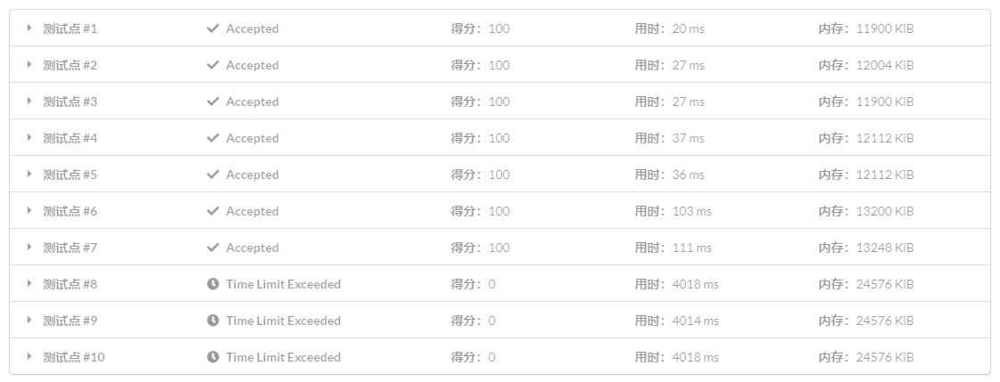

# 后缀数组简介 - OI Wiki

- Source: https://oi-wiki.org/string/sa/

# 后缀数组简介

## 一些约定

字符串相关的定义请参考 [字符串基础](../basic/)．

字符串下标从 11 开始．

字符串 𝑠s 的长度为 𝑛n．

" 后缀 𝑖i" 代指以第 𝑖i 个字符开头的后缀，存储时用 𝑖i 代表字符串 𝑠s 的后缀 𝑠[𝑖…𝑛]s[i…n]．

## 后缀数组是什么？

后缀数组（Suffix Array）主要关系到两个数组：𝑠𝑎sa 和 𝑟𝑘rk．

其中，𝑠𝑎[𝑖]sa[i] 表示将所有后缀排序后第 𝑖i 小的后缀的编号，也是所说的后缀数组，后文也称编号数组 𝑠𝑎sa；

𝑟𝑘[𝑖]rk[i] 表示后缀 𝑖i 的排名，是重要的辅助数组，后文也称排名数组 𝑟𝑘rk．

这两个数组满足性质：𝑠𝑎[𝑟𝑘[𝑖]] =𝑟𝑘[𝑠𝑎[𝑖]] =𝑖sa[rk[i]]=rk[sa[i]]=i．

### 解释

后缀数组示例：

[](https://github.com/OI-wiki/libs/blob/master/%E9%9B%86%E8%AE%AD%E9%98%9F%E5%8E%86%E5%B9%B4%E8%AE%BA%E6%96%87/%E5%9B%BD%E5%AE%B6%E9%9B%86%E8%AE%AD%E9%98%9F2009%E8%AE%BA%E6%96%87%E9%9B%86/11.%E7%BD%97%E7%A9%97%E9%AA%9E%E3%80%8A%E5%90%8E%E7%BC%80%E6%95%B0%E7%BB%84%E2%80%94%E2%80%94%E5%A4%84%E7%90%86%E5%AD%97%E7%AC%A6%E4%B8%B2%E7%9A%84%E6%9C%89%E5%8A%9B%E5%B7%A5%E5%85%B7%E3%80%8B/%E5%90%8E%E7%BC%80%E6%95%B0%E7%BB%84%E2%80%94%E2%80%94%E5%A4%84%E7%90%86%E5%AD%97%E7%AC%A6%E4%B8%B2%E7%9A%84%E6%9C%89%E5%8A%9B%E5%B7%A5%E5%85%B7.pdf "\[2009\] 后缀数组——处理字符串的有力工具 by. 罗穗骞")

## 后缀数组怎么求？

### O(n^2logn) 做法

相信这个做法大家还是能自己想到的：将盛有全部后缀字符串的数组进行 `sort` 排序，由于排序进行 𝑂(𝑛log⁡𝑛)O(nlog⁡n) 次字符串比较，每次字符串比较要 𝑂(𝑛)O(n) 次字符比较，所以这个排序是 𝑂(𝑛2log⁡𝑛)O(n2log⁡n) 的时间复杂度．

### O(nlog^2n) 做法

这个做法要用到倍增的思想．

首先对字符串 𝑠s 的所有长度为 11 的子串，即每个字符进行排序，得到排序后的编号数组 𝑠𝑎1sa1 和排名数组 𝑟𝑘1rk1．

倍增过程：

  1. 用两个长度为 11 的子串的排名，即 𝑟𝑘1[𝑖]rk1[i] 和 𝑟𝑘1[𝑖 +1]rk1[i+1]，作为排序的第一第二关键字，就可以对字符串 𝑠s 的每个长度为 22 的子串：{𝑠[𝑖…min(𝑖 +1,𝑛)] | 𝑖 ∈[1, 𝑛]}{s[i…min(i+1,n)] | i∈[1, n]} 进行排序，得到 𝑠𝑎2sa2 和 𝑟𝑘2rk2；

  2. 之后用两个长度为 22 的子串的排名，即 𝑟𝑘2[𝑖]rk2[i] 和 𝑟𝑘2[𝑖 +2]rk2[i+2]，作为排序的第一第二关键字，就可以对字符串 𝑠s 的每个长度为 44 的子串：{𝑠[𝑖…min(𝑖 +3,𝑛)] | 𝑖 ∈[1, 𝑛]}{s[i…min(i+3,n)] | i∈[1, n]} 进行排序，得到 𝑠𝑎4sa4 和 𝑟𝑘4rk4；

  3. 以此倍增，用长度为 𝑤/2w/2 的子串的排名，即 𝑟𝑘𝑤/2[𝑖]rkw/2[i] 和 𝑟𝑘𝑤/2[𝑖 +𝑤/2]rkw/2[i+w/2]，作为排序的第一第二关键字，就可以对字符串 𝑠s 的每个长度为 𝑤w 的子串 𝑠[𝑖…min(𝑖 +𝑤 −1, 𝑛)]s[i…min(i+w−1, n)] 进行排序，得到 𝑠𝑎𝑤saw 和 𝑟𝑘𝑤rkw．其中，类似字母序排序规则，当 𝑖 +𝑤 >𝑛i+w>n 时，𝑟𝑘𝑤[𝑖 +𝑤]rkw[i+w] 视为无穷小；

  4. 𝑟𝑘𝑤[𝑖]rkw[i] 即是子串 𝑠[𝑖…𝑖 +𝑤 −1]s[i…i+w−1] 的排名，这样当 𝑤 ⩾𝑛w⩾n 时，得到的编号数组 𝑠𝑎𝑤saw，也就是我们需要的后缀数组．

#### 过程

倍增排序示意图：

[](https://github.com/OI-wiki/libs/blob/master/%E9%9B%86%E8%AE%AD%E9%98%9F%E5%8E%86%E5%B9%B4%E8%AE%BA%E6%96%87/%E5%9B%BD%E5%AE%B6%E9%9B%86%E8%AE%AD%E9%98%9F2009%E8%AE%BA%E6%96%87%E9%9B%86/11.%E7%BD%97%E7%A9%97%E9%AA%9E%E3%80%8A%E5%90%8E%E7%BC%80%E6%95%B0%E7%BB%84%E2%80%94%E2%80%94%E5%A4%84%E7%90%86%E5%AD%97%E7%AC%A6%E4%B8%B2%E7%9A%84%E6%9C%89%E5%8A%9B%E5%B7%A5%E5%85%B7%E3%80%8B/%E5%90%8E%E7%BC%80%E6%95%B0%E7%BB%84%E2%80%94%E2%80%94%E5%A4%84%E7%90%86%E5%AD%97%E7%AC%A6%E4%B8%B2%E7%9A%84%E6%9C%89%E5%8A%9B%E5%B7%A5%E5%85%B7.pdf "\[2009\] 后缀数组——处理字符串的有力工具 by. 罗穗骞")

显然倍增的过程是 𝑂(log⁡𝑛)O(log⁡n)，而每次倍增用 `sort` 对子串进行排序是 𝑂(𝑛log⁡𝑛)O(nlog⁡n)，而每次子串的比较花费 22 次字符比较；

除此之外，每次倍增在 `sort` 排序完后，还有额外的 𝑂(𝑛)O(n) 时间复杂度的，更新 𝑟𝑘rk 的操作，但是相对于 𝑂(𝑛log⁡𝑛)O(nlog⁡n) 被忽略不计；

所以这个算法的时间复杂度就是 𝑂(𝑛log2⁡𝑛)O(nlog2⁡n)．

实现

```text 1 2 3 4 5 6 7 8 9 10 11 12 13 14 15 16 17 18 19 20 21 22 23 24 25 26 27 28 29 30 31 32 33 34 35 36 37 38 39 40 41 42 43 ``` |  ```text #include <algorithm> #include <cstdio> #include <cstring> #include <iostream> using namespace std ; constexpr int N = 1000010 ; char s [ N ]; int n , w , sa [ N ], rk [ N << 1 ], oldrk [ N << 1 ]; // 为了防止访问 rk[i+w] 导致数组越界，开两倍数组． // 当然也可以在访问前判断是否越界，但直接开两倍数组方便一些． int main () { int i , p ; scanf ( "%s" , s \+ 1 ); n = strlen ( s \+ 1 ); for ( i = 1 ; i <= n ; ++ i ) sa [ i ] = i , rk [ i ] = s [ i ]; for ( w = 1 ; w < n ; w <<= 1 ) { sort ( sa \+ 1 , sa \+ n \+ 1 , []( int x , int y ) { return rk [ x ] == rk [ y ] ? rk [ x \+ w ] < rk [ y \+ w ] : rk [ x ] < rk [ y ]; }); // 这里用到了 lambda memcpy ( oldrk , rk , sizeof ( rk )); // 由于计算 rk 的时候原来的 rk 会被覆盖，要先复制一份 // 若两个子串相同，它们对应的 rk 也需要相同，所以要去重 for ( p = 0 , i = 1 ; i <= n ; ++ i ) { if ( oldrk [ sa [ i ]] == oldrk [ sa [ i \- 1 ]] && oldrk [ sa [ i ] \+ w ] == oldrk [ sa [ i \- 1 ] \+ w ]) { rk [ sa [ i ]] = p ; } else { rk [ sa [ i ]] = ++ p ; } } } for ( i = 1 ; i <= n ; ++ i ) printf ( "%d " , sa [ i ]); return 0 ; } ```   
---|---  
  
### O(nlogn) 做法

在刚刚的 𝑂(𝑛log2⁡𝑛)O(nlog2⁡n) 做法中，单次排序是 𝑂(𝑛log⁡𝑛)O(nlog⁡n) 的，如果能 𝑂(𝑛)O(n) 排序，就能 𝑂(𝑛log⁡𝑛)O(nlog⁡n) 计算后缀数组了．

前置知识：[计数排序](../../basic/counting-sort/)，[基数排序](../../basic/radix-sort/)．

由于计算后缀数组的过程中排序的关键字是排名，值域为 𝑂(𝑛)O(n)，并且是一个双关键字的排序，可以使用基数排序优化至 𝑂(𝑛)O(n)．

实现

```text 1 2 3 4 5 6 7 8 9 10 11 12 13 14 15 16 17 18 19 20 21 22 23 24 25 26 27 28 29 30 31 32 33 34 35 36 37 38 39 40 41 42 43 44 45 46 47 48 49 50 51 52 53 54 55 56 57 58 59 60 61 ``` |  ```text #include <algorithm> #include <cstdio> #include <cstring> #include <iostream> using namespace std ; constexpr int N = 1000010 ; char s [ N ]; int n , sa [ N ], rk [ N << 1 ], oldrk [ N << 1 ], id [ N ], cnt [ N ]; int main () { int i , m , p , w ; scanf ( "%s" , s \+ 1 ); n = strlen ( s \+ 1 ); m = 127 ; for ( i = 1 ; i <= n ; ++ i ) ++ cnt [ rk [ i ] = s [ i ]]; for ( i = 1 ; i <= m ; ++ i ) cnt [ i ] += cnt [ i \- 1 ]; for ( i = n ; i >= 1 ; \-- i ) sa [ cnt [ rk [ i ]] \-- ] = i ; memcpy ( oldrk \+ 1 , rk \+ 1 , n * sizeof ( int )); for ( p = 0 , i = 1 ; i <= n ; ++ i ) { if ( oldrk [ sa [ i ]] == oldrk [ sa [ i \- 1 ]]) { rk [ sa [ i ]] = p ; } else { rk [ sa [ i ]] = ++ p ; } } for ( w = 1 ; w < n ; w <<= 1 , m = n ) { // 对第二关键字：id[i] + w进行计数排序 memset ( cnt , 0 , sizeof ( cnt )); memcpy ( id \+ 1 , sa \+ 1 , n * sizeof ( int )); // id保存一份儿sa的拷贝，实质上就相当于oldsa for ( i = 1 ; i <= n ; ++ i ) ++ cnt [ rk [ id [ i ] \+ w ]]; for ( i = 1 ; i <= m ; ++ i ) cnt [ i ] += cnt [ i \- 1 ]; for ( i = n ; i >= 1 ; \-- i ) sa [ cnt [ rk [ id [ i ] \+ w ]] \-- ] = id [ i ]; // 对第一关键字：id[i]进行计数排序 memset ( cnt , 0 , sizeof ( cnt )); memcpy ( id \+ 1 , sa \+ 1 , n * sizeof ( int )); for ( i = 1 ; i <= n ; ++ i ) ++ cnt [ rk [ id [ i ]]]; for ( i = 1 ; i <= m ; ++ i ) cnt [ i ] += cnt [ i \- 1 ]; for ( i = n ; i >= 1 ; \-- i ) sa [ cnt [ rk [ id [ i ]]] \-- ] = id [ i ]; memcpy ( oldrk \+ 1 , rk \+ 1 , n * sizeof ( int )); for ( p = 0 , i = 1 ; i <= n ; ++ i ) { if ( oldrk [ sa [ i ]] == oldrk [ sa [ i \- 1 ]] && oldrk [ sa [ i ] \+ w ] == oldrk [ sa [ i \- 1 ] \+ w ]) { rk [ sa [ i ]] = p ; } else { rk [ sa [ i ]] = ++ p ; } } } for ( i = 1 ; i <= n ; ++ i ) printf ( "%d " , sa [ i ]); return 0 ; } ```   
---|---  
  
### 一些常数优化

如果你把上面那份代码交到 [LOJ #111: 后缀排序](https://loj.ac/problem/111) 上：



这是因为，上面那份代码的常数的确很大．

#### 第二关键字无需计数排序

思考一下第二关键字排序的实质，其实就是把超出字符串范围（即 𝑠𝑎[𝑖] +𝑤 >𝑛sa[i]+w>n）的 𝑠𝑎[𝑖]sa[i] 放到 𝑠𝑎sa 数组头部，然后把剩下的依原顺序放入：

```text 1 2 3 4 ``` |  ```text int cur = 0 ; for ( int i = n \- w \+ 1 ; i <= n ; i ++ ) id [ ++ cur ] = i ; for ( int i = 1 ; i <= n ; i ++ ) if ( sa [ i ] > w ) id [ ++ cur ] = sa [ i ] \- w ; ```   
---|---  
  
#### 优化计数排序的值域

每次对 𝑟𝑘rk 进行更新之后，我们都计算了一个 𝑝p，这个 𝑝p 即是 𝑟𝑘rk 的值域，将值域改成它即可．

#### 若排名都不相同可直接生成后缀数组

考虑新的 𝑟𝑘rk 数组，若其值域为 [1,𝑛][1,n] 那么每个排名都不同，此时无需再排序．

实现

```text 1 2 3 4 5 6 7 8 9 10 11 12 13 14 15 16 17 18 19 20 21 22 23 24 25 26 27 28 29 30 31 32 33 34 35 36 37 38 39 40 41 42 43 44 45 46 47 48 49 50 ``` |  ```text #include <algorithm> #include <cstdio> #include <cstring> #include <iostream> using namespace std ; constexpr int N = 1000010 ; char s [ N ]; int n ; int m , p , rk [ N * 2 ], oldrk [ N ], sa [ N * 2 ], id [ N ], cnt [ N ]; int main () { scanf ( "%s" , s \+ 1 ); n = strlen ( s \+ 1 ); m = 128 ; for ( int i = 1 ; i <= n ; i ++ ) cnt [ rk [ i ] = s [ i ]] ++ ; for ( int i = 1 ; i <= m ; i ++ ) cnt [ i ] += cnt [ i \- 1 ]; for ( int i = n ; i >= 1 ; i \-- ) sa [ cnt [ rk [ i ]] \-- ] = i ; for ( int w = 1 ;; w <<= 1 , m = p ) { // m = p 即为值域优化 int cur = 0 ; for ( int i = n \- w \+ 1 ; i <= n ; i ++ ) id [ ++ cur ] = i ; for ( int i = 1 ; i <= n ; i ++ ) if ( sa [ i ] > w ) id [ ++ cur ] = sa [ i ] \- w ; memset ( cnt , 0 , sizeof ( cnt )); for ( int i = 1 ; i <= n ; i ++ ) cnt [ rk [ i ]] ++ ; for ( int i = 1 ; i <= m ; i ++ ) cnt [ i ] += cnt [ i \- 1 ]; for ( int i = n ; i >= 1 ; i \-- ) sa [ cnt [ rk [ id [ i ]]] \-- ] = id [ i ]; p = 0 ; memcpy ( oldrk , rk , sizeof ( oldrk )); for ( int i = 1 ; i <= n ; i ++ ) { if ( oldrk [ sa [ i ]] == oldrk [ sa [ i \- 1 ]] && oldrk [ sa [ i ] \+ w ] == oldrk [ sa [ i \- 1 ] \+ w ]) rk [ sa [ i ]] = p ; else rk [ sa [ i ]] = ++ p ; } if ( p == n ) break ; // p = n 时无需再排序 } for ( int i = 1 ; i <= n ; i ++ ) printf ( "%d " , sa [ i ]); return 0 ; } ```   
---|---  
  
### O(n) 做法

在一般的题目中，常数较小的倍增求后缀数组是完全够用的，求后缀数组以外的部分也经常有 𝑂(𝑛log⁡𝑛)O(nlog⁡n) 的复杂度，倍增求解后缀数组不会成为瓶颈．

但如果遇到特殊题目、时限较紧的题目，或者是你想追求更短的用时，就需要学习 𝑂(𝑛)O(n) 求后缀数组的方法．

#### SA-IS

可以参考 [诱导排序与 SA-IS 算法](https://riteme.site/blog/2016-6-19/sais.html)，另外它的 [评论页面](https://github.com/riteme/riteme.github.io/issues/28) 也有参考价值．

#### DC3

可以参考[[2009] 后缀数组——处理字符串的有力工具 by. 罗穗骞](https://github.com/OI-wiki/libs/blob/master/%E9%9B%86%E8%AE%AD%E9%98%9F%E5%8E%86%E5%B9%B4%E8%AE%BA%E6%96%87/%E5%9B%BD%E5%AE%B6%E9%9B%86%E8%AE%AD%E9%98%9F2009%E8%AE%BA%E6%96%87%E9%9B%86/11.%E7%BD%97%E7%A9%97%E9%AA%9E%E3%80%8A%E5%90%8E%E7%BC%80%E6%95%B0%E7%BB%84%E2%80%94%E2%80%94%E5%A4%84%E7%90%86%E5%AD%97%E7%AC%A6%E4%B8%B2%E7%9A%84%E6%9C%89%E5%8A%9B%E5%B7%A5%E5%85%B7%E3%80%8B/%E5%90%8E%E7%BC%80%E6%95%B0%E7%BB%84%E2%80%94%E2%80%94%E5%A4%84%E7%90%86%E5%AD%97%E7%AC%A6%E4%B8%B2%E7%9A%84%E6%9C%89%E5%8A%9B%E5%B7%A5%E5%85%B7.pdf "\[2009\] 后缀数组——处理字符串的有力工具 by. 罗穗骞")．

## 后缀数组的应用

### 寻找最小的循环移动位置

将字符串 𝑆S 复制一份变成 𝑆𝑆SS 就转化成了后缀排序问题．

例题：[「JSOI2007」字符加密](https://www.luogu.com.cn/problem/P4051)．

### 在字符串中找子串

任务是在线地在主串 𝑇T 中寻找模式串 𝑆S．在线的意思是，我们已经预先知道知道主串 𝑇T，但是当且仅当询问时才知道模式串 𝑆S．我们可以先构造出 𝑇T 的后缀数组，然后查找子串 𝑆S．若子串 𝑆S 在 𝑇T 中出现，它必定是 𝑇T 的一些后缀的前缀．因为我们已经将所有后缀排序了，我们可以通过在 𝑝p 数组中二分 𝑆S 来实现．比较子串 𝑆S 和当前后缀的时间复杂度为 𝑂(|𝑆|)O(|S|)，因此找子串的时间复杂度为 𝑂(|𝑆|log⁡|𝑇|)O(|S|log⁡|T|)．注意，如果该子串在 𝑇T 中出现了多次，每次出现都是在 𝑝p 数组中相邻的．因此出现次数可以通过再次二分找到，输出每次出现的位置也很轻松．

### 从字符串首尾取字符最小化字典序

例题：[「USACO07DEC」Best Cow Line](https://www.luogu.com.cn/problem/P2870)．

题意：给你一个字符串，每次从首或尾取一个字符组成字符串，问所有能够组成的字符串中字典序最小的一个．

题解

暴力做法就是每次最坏 𝑂(𝑛)O(n) 地判断当前应该取首还是尾（即比较取首得到的字符串与取尾得到的反串的大小），只需优化这一判断过程即可．

由于需要在原串后缀与反串后缀构成的集合内比较大小，可以将反串拼接在原串后，并在中间加上一个没出现过的字符（如 `#`，代码中可以直接使用空字符），求后缀数组，即可 𝑂(1)O(1) 完成这一判断．

参考代码

```text 1 2 3 4 5 6 7 8 9 10 11 12 13 14 15 16 17 18 19 20 21 22 23 24 25 26 27 28 29 30 31 32 33 34 35 36 37 38 39 40 41 42 43 44 45 46 47 48 49 50 51 ``` |  ```text #include <cctype> #include <cstring> #include <iostream> using namespace std ; constexpr int N = 1000010 ; char s [ N ]; int n , sa [ N ], id [ N ], oldrk [ N * 2 ], rk [ N * 2 ], px [ N ], cnt [ N ]; bool cmp ( int x , int y , int w ) { return oldrk [ x ] == oldrk [ y ] && oldrk [ x \+ w ] == oldrk [ y \+ w ]; } int main () { int i , w , m = 200 , p , l = 1 , r , tot = 0 ; cin >> n ; r = n ; for ( i = 1 ; i <= n ; ++ i ) while ( cin >> s [ i ], ! isalpha ( s [ i ])); for ( i = 1 ; i <= n ; ++ i ) rk [ i ] = rk [ 2 * n \+ 2 \- i ] = s [ i ]; // 拼接正反两个字符串，中间空出一个字符 n = 2 * n \+ 1 ; // 求后缀数组 for ( i = 1 ; i <= n ; ++ i ) ++ cnt [ rk [ i ]]; for ( i = 1 ; i <= m ; ++ i ) cnt [ i ] += cnt [ i \- 1 ]; for ( i = n ; i >= 1 ; \-- i ) sa [ cnt [ rk [ i ]] \-- ] = i ; for ( w = 1 ; w < n ; w *= 2 , m = p ) { // m=p 就是优化计数排序值域 for ( p = 0 , i = n ; i > n \- w ; \-- i ) id [ ++ p ] = i ; for ( i = 1 ; i <= n ; ++ i ) if ( sa [ i ] > w ) id [ ++ p ] = sa [ i ] \- w ; memset ( cnt , 0 , sizeof ( cnt )); for ( i = 1 ; i <= n ; ++ i ) ++ cnt [ px [ i ] = rk [ id [ i ]]]; for ( i = 1 ; i <= m ; ++ i ) cnt [ i ] += cnt [ i \- 1 ]; for ( i = n ; i >= 1 ; \-- i ) sa [ cnt [ px [ i ]] \-- ] = id [ i ]; memcpy ( oldrk , rk , sizeof ( rk )); for ( p = 0 , i = 1 ; i <= n ; ++ i ) rk [ sa [ i ]] = cmp ( sa [ i ], sa [ i \- 1 ], w ) ? p : ++ p ; } // 利用后缀数组O(1)进行判断 while ( l <= r ) { cout << ( rk [ l ] < rk [ n \+ 1 \- r ] ? s [ l ++ ] : s [ r \-- ]); if (( ++ tot ) % 80 == 0 ) cout << '\n' ; // 回车 } return 0 ; } ```   
---|---  
  
## height 数组

### LCP（最长公共前缀）

两个字符串 𝑆S 和 𝑇T 的 LCP 就是最大的 𝑥x(𝑥 ≤min(|𝑆|,|𝑇|)x≤min(|S|,|T|)) 使得 𝑆𝑖 =𝑇𝑖 (∀ 1 ≤𝑖 ≤𝑥)Si=Ti (∀ 1≤i≤x)．

下文中以 𝑙𝑐𝑝(𝑖,𝑗)lcp(i,j) 表示后缀 𝑖i 和后缀 𝑗j 的最长公共前缀（的长度）．

### height 数组的定义

ℎ𝑒𝑖𝑔ℎ𝑡[𝑖] =𝑙𝑐𝑝(𝑠𝑎[𝑖],𝑠𝑎[𝑖 −1])height[i]=lcp(sa[i],sa[i−1])，即第 𝑖i 名的后缀与它前一名的后缀的最长公共前缀．

ℎ𝑒𝑖𝑔ℎ𝑡[1]height[1] 可以视作 00．

### O(n) 求 height 数组需要的一个引理

ℎ𝑒𝑖𝑔ℎ𝑡[𝑟𝑘[𝑖]] ≥ℎ𝑒𝑖𝑔ℎ𝑡[𝑟𝑘[𝑖 −1]] −1height[rk[i]]≥height[rk[i−1]]−1

证明

当 ℎ𝑒𝑖𝑔ℎ𝑡[𝑟𝑘[𝑖 −1]] ≤1height[rk[i−1]]≤1 时，上式显然成立（右边小于等于 00）．

当 ℎ𝑒𝑖𝑔ℎ𝑡[𝑟𝑘[𝑖 −1]] >1height[rk[i−1]]>1 时：

根据 ℎ𝑒𝑖𝑔ℎ𝑡height 定义，有 𝑙𝑐𝑝(𝑠𝑎[𝑟𝑘[𝑖 −1]],𝑠𝑎[𝑟𝑘[𝑖 −1] −1]) =ℎ𝑒𝑖𝑔ℎ𝑡[𝑟𝑘[𝑖 −1]] >1lcp(sa[rk[i−1]],sa[rk[i−1]−1])=height[rk[i−1]]>1．

既然后缀 𝑖 −1i−1 和后缀 𝑠𝑎[𝑟𝑘[𝑖 −1] −1]sa[rk[i−1]−1] 有长度为 ℎ𝑒𝑖𝑔ℎ𝑡[𝑟𝑘[𝑖 −1]]height[rk[i−1]] 的最长公共前缀，

那么不妨用 𝑎𝐴aA 来表示这个最长公共前缀．（其中 𝑎a 是一个字符，𝐴A 是长度为 ℎ𝑒𝑖𝑔ℎ𝑡[𝑟𝑘[𝑖 −1]] −1height[rk[i−1]]−1 的字符串，非空）

那么后缀 𝑖 −1i−1 可以表示为 𝑎𝐴𝐷aAD，后缀 𝑠𝑎[𝑟𝑘[𝑖 −1] −1]sa[rk[i−1]−1] 可以表示为 𝑎𝐴𝐵aAB．（𝐵 <𝐷B<D，𝐵B 可能为空串，𝐷D 非空）

进一步地，后缀 𝑖i 可以表示为 𝐴𝐷AD，存在后缀（𝑠𝑎[𝑟𝑘[𝑖 −1] −1] +1sa[rk[i−1]−1]+1）𝐴𝐵AB．

因为后缀 𝑠𝑎[𝑟𝑘[𝑖] −1]sa[rk[i]−1] 在大小关系的排名上仅比后缀 𝑠𝑎[𝑟𝑘[𝑖]]sa[rk[i]] 也就是后缀 𝑖i，小一位，而 𝐴𝐵 <𝐴𝐷AB<AD．

所以 𝐴𝐵 ⩽AB⩽ 后缀 𝑠𝑎[𝑟𝑘[𝑖] −1] <𝐴𝐷sa[rk[i]−1]<AD，显然后缀 𝑖i 和后缀 𝑠𝑎[𝑟𝑘[𝑖] −1]sa[rk[i]−1] 有公共前缀 𝐴A．

于是就可以得出 𝑙𝑐𝑝(𝑖,𝑠𝑎[𝑟𝑘[𝑖] −1])lcp(i,sa[rk[i]−1]) 至少是 ℎ𝑒𝑖𝑔ℎ𝑡[𝑟𝑘[𝑖 −1]] −1height[rk[i−1]]−1，也即 ℎ𝑒𝑖𝑔ℎ𝑡[𝑟𝑘[𝑖]] ≥ℎ𝑒𝑖𝑔ℎ𝑡[𝑟𝑘[𝑖 −1]] −1height[rk[i]]≥height[rk[i−1]]−1．

### O(n) 求 height 数组的代码实现

利用上面这个引理暴力求即可：

```text 1 2 3 4 5 6 ``` |  ```text for ( i = 1 , k = 0 ; i <= n ; ++ i ) { if ( rk [ i ] == 0 ) continue ; if ( k ) \-- k ; while ( s [ i \+ k ] == s [ sa [ rk [ i ] \- 1 ] \+ k ]) ++ k ; height [ rk [ i ]] = k ; } ```   
---|---  
  
𝑘k 不会超过 𝑛n，最多减 𝑛n 次，所以最多加 2𝑛2n 次，总复杂度就是 𝑂(𝑛)O(n)．

## height 数组的应用

### 两子串最长公共前缀

𝑙𝑐𝑝(𝑠𝑎[𝑖],𝑠𝑎[𝑗]) =min{ℎ𝑒𝑖𝑔ℎ𝑡[𝑖 +1..𝑗]}lcp(sa[i],sa[j])=min{height[i+1..j]}

感性理解：如果 ℎ𝑒𝑖𝑔ℎ𝑡height 一直大于某个数，前这么多位就一直没变过；反之，由于后缀已经排好序了，不可能变了之后变回来．

严格证明可以参考[[2004] 后缀数组 by. 许智磊](https://github.com/OI-wiki/libs/blob/master/%E9%9B%86%E8%AE%AD%E9%98%9F%E5%8E%86%E5%B9%B4%E8%AE%BA%E6%96%87/%E5%9B%BD%E5%AE%B6%E9%9B%86%E8%AE%AD%E9%98%9F2004%E8%AE%BA%E6%96%87%E9%9B%86/%E8%AE%B8%E6%99%BA%E7%A3%8A--%E5%90%8E%E7%BC%80%E6%95%B0%E7%BB%84.pdf "\[2004\] 后缀数组 by. 许智磊")．

有了这个定理，求两子串最长公共前缀就转化为了 [RMQ 问题](../../topic/rmq/)．

### 比较一个字符串的两个子串的大小关系

假设需要比较的是 𝐴 =𝑆[𝑎..𝑏]A=S[a..b] 和 𝐵 =𝑆[𝑐..𝑑]B=S[c..d] 的大小关系．

若 𝑙𝑐𝑝(𝑎,𝑐) ≥min(|𝐴|,|𝐵|)lcp(a,c)≥min(|A|,|B|)，𝐴 <𝐵 ⟺ |𝐴| <|𝐵|A<B⟺|A|<|B|．

否则，𝐴 <𝐵 ⟺ 𝑟𝑘[𝑎] <𝑟𝑘[𝑐]A<B⟺rk[a]<rk[c]．

### 不同子串的数目

子串就是后缀的前缀，所以可以枚举每个后缀，计算前缀总数，再减掉重复．

「前缀总数」其实就是子串个数，为 𝑛(𝑛 +1)/2n(n+1)/2．

如果按后缀排序的顺序枚举后缀，每次新增的子串就是除了与上一个后缀的 LCP 剩下的前缀．这些前缀一定是新增的，否则会破坏 𝑙𝑐𝑝(𝑠𝑎[𝑖],𝑠𝑎[𝑗]) =min{ℎ𝑒𝑖𝑔ℎ𝑡[𝑖 +1..𝑗]}lcp(sa[i],sa[j])=min{height[i+1..j]} 的性质．只有这些前缀是新增的，因为 LCP 部分在枚举上一个前缀时计算过了．

所以答案为：

𝑛(𝑛+1)2 −𝑛∑𝑖=2ℎ𝑒𝑖𝑔ℎ𝑡[𝑖]n(n+1)2−∑i=2nheight[i]

### 出现至少 k 次的子串的最大长度

例题：[「USACO06DEC」Milk Patterns](https://www.luogu.com.cn/problem/P2852)．

题解

出现至少 𝑘k 次意味着后缀排序后有至少连续 𝑘k 个后缀以这个子串作为公共前缀．

所以，求出每相邻 𝑘 −1k−1 个 ℎ𝑒𝑖𝑔ℎ𝑡height 的最小值，再求这些最小值的最大值就是答案．

可以使用单调队列 𝑂(𝑛)O(n) 解决，但使用其它方式也足以 AC．

参考代码

```text 1 2 3 4 5 6 7 8 9 10 11 12 13 14 15 16 17 18 19 20 21 22 23 24 25 26 27 28 29 30 31 32 33 34 35 36 37 38 39 40 41 42 43 44 45 46 47 48 49 50 51 52 53 54 55 56 ``` |  ```text #include <cstring> #include <iostream> #include <set> using namespace std ; constexpr int N = 40010 ; int n , k , a [ N ], sa [ N ], rk [ N ], oldrk [ N ], id [ N ], px [ N ], cnt [ 1000010 ], ht [ N ], ans ; multiset < int > t ; // multiset 是最好写的实现方式 bool cmp ( int x , int y , int w ) { return oldrk [ x ] == oldrk [ y ] && oldrk [ x \+ w ] == oldrk [ y \+ w ]; } int main () { cin . tie ( nullptr ) -> sync_with_stdio ( false ); int i , j , w , p , m = 1000000 ; cin >> n >> k ; \-- k ; for ( i = 1 ; i <= n ; ++ i ) cin >> a [ i ]; // 求后缀数组 for ( i = 1 ; i <= n ; ++ i ) ++ cnt [ rk [ i ] = a [ i ]]; for ( i = 1 ; i <= m ; ++ i ) cnt [ i ] += cnt [ i \- 1 ]; for ( i = n ; i >= 1 ; \-- i ) sa [ cnt [ rk [ i ]] \-- ] = i ; for ( w = 1 ; w < n ; w <<= 1 , m = p ) { for ( p = 0 , i = n ; i > n \- w ; \-- i ) id [ ++ p ] = i ; for ( i = 1 ; i <= n ; ++ i ) if ( sa [ i ] > w ) id [ ++ p ] = sa [ i ] \- w ; memset ( cnt , 0 , sizeof ( cnt )); for ( i = 1 ; i <= n ; ++ i ) ++ cnt [ px [ i ] = rk [ id [ i ]]]; for ( i = 1 ; i <= m ; ++ i ) cnt [ i ] += cnt [ i \- 1 ]; for ( i = n ; i >= 1 ; \-- i ) sa [ cnt [ px [ i ]] \-- ] = id [ i ]; memcpy ( oldrk , rk , sizeof ( rk )); for ( p = 0 , i = 1 ; i <= n ; ++ i ) rk [ sa [ i ]] = cmp ( sa [ i ], sa [ i \- 1 ], w ) ? p : ++ p ; } for ( i = 1 , j = 0 ; i <= n ; ++ i ) { // 求 height if ( j ) \-- j ; while ( a [ i \+ j ] == a [ sa [ rk [ i ] \- 1 ] \+ j ]) ++ j ; ht [ rk [ i ]] = j ; } for ( i = 1 ; i <= n ; ++ i ) { // 求所有最小值的最大值 t . insert ( ht [ i ]); if ( i > k ) t . erase ( t . find ( ht [ i \- k ])); ans = max ( ans , * t . begin ()); } cout << ans ; return 0 ; } ```   
---|---  
  
### 是否有某字符串在文本串中至少不重叠地出现了两次

可以二分目标串的长度 |𝑠||s|，将 ℎh 数组划分成若干个连续 LCP 大于等于 |𝑠||s| 的段，利用 RMQ 对每个段求其中出现的数中最大和最小的下标，若这两个下标的距离满足条件，则一定有长度为 |𝑠||s| 的字符串不重叠地出现了两次．

### 连续的若干个相同子串

我们可以枚举连续串的长度 |𝑠||s|，按照 |𝑠||s| 对整个串进行分块，对相邻两块的块首进行 LCP 与 LCS 查询，具体可见[[2009] 后缀数组——处理字符串的有力工具](https://github.com/OI-wiki/libs/blob/master/%E9%9B%86%E8%AE%AD%E9%98%9F%E5%8E%86%E5%B9%B4%E8%AE%BA%E6%96%87/%E5%9B%BD%E5%AE%B6%E9%9B%86%E8%AE%AD%E9%98%9F2009%E8%AE%BA%E6%96%87%E9%9B%86/11.%E7%BD%97%E7%A9%97%E9%AA%9E%E3%80%8A%E5%90%8E%E7%BC%80%E6%95%B0%E7%BB%84%E2%80%94%E2%80%94%E5%A4%84%E7%90%86%E5%AD%97%E7%AC%A6%E4%B8%B2%E7%9A%84%E6%9C%89%E5%8A%9B%E5%B7%A5%E5%85%B7%E3%80%8B/%E5%90%8E%E7%BC%80%E6%95%B0%E7%BB%84%E2%80%94%E2%80%94%E5%A4%84%E7%90%86%E5%AD%97%E7%AC%A6%E4%B8%B2%E7%9A%84%E6%9C%89%E5%8A%9B%E5%B7%A5%E5%85%B7.pdf "\[2009\] 后缀数组——处理字符串的有力工具 by. 罗穗骞")．

例题：[「NOI2016」优秀的拆分](https://loj.ac/p/2083)．

### 结合并查集

某些题目求解时要求你将后缀数组划分成若干个连续 LCP 长度大于等于某一值的段，亦即将 ℎh 数组划分成若干个连续最小值大于等于某一值的段并统计每一段的答案．如果有多次询问，我们可以将询问离线．观察到当给定值单调递减的时候，满足条件的区间个数总是越来越少，而新区间都是两个或多个原区间相连所得，且新区间中不包含在原区间内的部分的 ℎh 值都为减少到的这个值．我们只需要维护一个并查集，每次合并相邻的两个区间，并维护统计信息即可．

经典题目：[「NOI2015」品酒大会](https://uoj.ac/problem/131)

### 结合线段树

某些题目让你求满足条件的前若干个数，而这些数又在后缀排序中的一个区间内．这时我们可以用归并排序的性质来合并两个结点的信息，利用线段树维护和查询区间答案．

### 结合单调栈

例题：[「AHOI2013」差异](https://loj.ac/problem/2377)

题解

被加数的前两项很好处理，为 𝑛(𝑛 −1)(𝑛 +1)/2n(n−1)(n+1)/2（每个后缀都出现了 𝑛 −1n−1 次，后缀总长是 𝑛(𝑛 +1)/2n(n+1)/2），关键是最后一项，即后缀的两两 LCP．

我们知道 𝑙𝑐𝑝(𝑖,𝑗) =𝑘lcp(i,j)=k 等价于 min{ℎ𝑒𝑖𝑔ℎ𝑡[𝑖 +1..𝑗]} =𝑘min{height[i+1..j]}=k．所以，可以把 𝑙𝑐𝑝(𝑖,𝑗)lcp(i,j) 记作 min{𝑥|𝑖 +1 ≤𝑥 ≤𝑗,ℎ𝑒𝑖𝑔ℎ𝑡[𝑥] =𝑙𝑐𝑝(𝑖,𝑗)}min{x|i+1≤x≤j,height[x]=lcp(i,j)} 对答案的贡献．

考虑每个位置对答案的贡献是哪些后缀的 LCP，其实就是从它开始向左若干个连续的 ℎ𝑒𝑖𝑔ℎ𝑡height 大于它的后缀中选一个，再从向右若干个连续的 ℎ𝑒𝑖𝑔ℎ𝑡height 不小于它的后缀中选一个．这个东西可以用 [单调栈](../../ds/monotonous-stack/) 计算．

单调栈部分类似于 [Luogu P2659 美丽的序列](https://www.luogu.com.cn/problem/P2659) 以及 [悬线法](../../misc/hoverline/)．

参考代码

```text 1 2 3 4 5 6 7 8 9 10 11 12 13 14 15 16 17 18 19 20 21 22 23 24 25 26 27 28 29 30 31 32 33 34 35 36 37 38 39 40 41 42 43 44 45 46 47 48 49 50 51 52 53 54 55 56 57 58 59 60 61 62 63 64 65 ``` |  ```text #include <cstring> #include <iostream> #include <string> using namespace std ; constexpr int N = 500010 ; string s ; int n , sa [ N ], rk [ N << 1 ], oldrk [ N << 1 ], id [ N ], px [ N ], cnt [ N ], ht [ N ], sta [ N ], top , l [ N ]; long long ans ; bool cmp ( int x , int y , int w ) { return oldrk [ x ] == oldrk [ y ] && oldrk [ x \+ w ] == oldrk [ y \+ w ]; } int main () { int i , k , w , p , m = 300 ; cin >> s ; n = s . size (); s = " " \+ s ; ans = 1l l * n * ( n \- 1 ) * ( n \+ 1 ) / 2 ; // 求后缀数组 for ( i = 1 ; i <= n ; ++ i ) ++ cnt [ rk [ i ] = s [ i ]]; for ( i = 1 ; i <= m ; ++ i ) cnt [ i ] += cnt [ i \- 1 ]; for ( i = n ; i >= 1 ; \-- i ) sa [ cnt [ rk [ i ]] \-- ] = i ; for ( w = 1 ; w < n ; w <<= 1 , m = p ) { for ( p = 0 , i = n ; i > n \- w ; \-- i ) id [ ++ p ] = i ; for ( i = 1 ; i <= n ; ++ i ) if ( sa [ i ] > w ) id [ ++ p ] = sa [ i ] \- w ; memset ( cnt , 0 , sizeof ( cnt )); for ( i = 1 ; i <= n ; ++ i ) ++ cnt [ px [ i ] = rk [ id [ i ]]]; for ( i = 1 ; i <= m ; ++ i ) cnt [ i ] += cnt [ i \- 1 ]; for ( i = n ; i >= 1 ; \-- i ) sa [ cnt [ px [ i ]] \-- ] = id [ i ]; memcpy ( oldrk , rk , sizeof ( rk )); for ( p = 0 , i = 1 ; i <= n ; ++ i ) rk [ sa [ i ]] = cmp ( sa [ i ], sa [ i \- 1 ], w ) ? p : ++ p ; } // 求 height for ( i = 1 , k = 0 ; i <= n ; ++ i ) { if ( k ) \-- k ; while ( s [ i \+ k ] == s [ sa [ rk [ i ] \- 1 ] \+ k ]) ++ k ; ht [ rk [ i ]] = k ; } // 维护单调栈 for ( i = 1 ; i <= n ; ++ i ) { while ( ht [ sta [ top ]] > ht [ i ]) \-- top ; // top类似于一个指针 l [ i ] = i \- sta [ top ]; sta [ ++ top ] = i ; } // 最后利用单调栈算 ans sta [ ++ top ] = n \+ 1 ; ht [ n \+ 1 ] = -1 ; for ( i = n ; i >= 1 ; \-- i ) { while ( ht [ sta [ top ]] >= ht [ i ]) \-- top ; ans -= 2l l * ht [ i ] * l [ i ] * ( sta [ top ] \- i ); sta [ ++ top ] = i ; } cout << ans ; return 0 ; } ```   
---|---  
  
类似的题目：[「HAOI2016」找相同字符](https://loj.ac/problem/2064)．

## 习题

  * [UVa 760 - DNA Sequencing](http://uva.onlinejudge.org/index.php?option=com_onlinejudge&Itemid=8&category=24&page=show_problem&problem=701)
  * [UVa 1223 - Editor](http://uva.onlinejudge.org/index.php?option=com_onlinejudge&Itemid=8&category=24&page=show_problem&problem=3664)
  * [Codechef - Tandem](https://www.codechef.com/problems/TANDEM)
  * [Codechef - Substrings and Repetitions](https://www.codechef.com/problems/ANUSAR)
  * [Codechef - Entangled Strings](https://www.codechef.com/problems/TANGLED)
  * [Codeforces - Martian Strings](http://codeforces.com/problemset/problem/149/E)
  * [Codeforces - Little Elephant and Strings](http://codeforces.com/problemset/problem/204/E)
  * [SPOJ - Ada and Terramorphing](http://www.spoj.com/problems/ADAPHOTO/)
  * [SPOJ - Ada and Substring](http://www.spoj.com/problems/ADASTRNG/)
  * [UVa - 1227 - The longest constant gene](https://uva.onlinejudge.org/index.php?option=onlinejudge&page=show_problem&problem=3668)
  * [SPOJ - Longest Common Substring](http://www.spoj.com/problems/LCS/en/)
  * [UVa 11512 - GATTACA](https://uva.onlinejudge.org/index.php?option=com_onlinejudge&Itemid=8&page=show_problem&problem=2507)
  * [QOJ 11240 - Suffixes and Palindromes](https://qoj.ac/problem/11240)
  * [GYM - Por Costel and the Censorship Committee](http://codeforces.com/gym/100923/problem/D)
  * [UVa 1254 - Top 10](https://uva.onlinejudge.org/index.php?option=com_onlinejudge&Itemid=8&page=show_problem&problem=3695)
  * [UVa 12191 - File Recover](https://uva.onlinejudge.org/index.php?option=com_onlinejudge&Itemid=8&page=show_problem&problem=3343)
  * [UVa 12206 - Stammering Aliens](https://uva.onlinejudge.org/index.php?option=onlinejudge&page=show_problem&problem=3358)
  * [Codechef - Jarvis and LCP](https://www.codechef.com/problems/INSQ16F)
  * [洛谷 P8617 - 重复模式](https://www.luogu.com.cn/problem/P8617)
  * [UVa 11107 - Life Forms](https://uva.onlinejudge.org/index.php?option=com_onlinejudge&Itemid=8&page=show_problem&problem=2048)
  * [UVa 12974 - Exquisite Strings](https://uva.onlinejudge.org/index.php?option=com_onlinejudge&Itemid=8&category=862&page=show_problem&problem=4853)
  * [UVa 10526 - Intellectual Property](https://uva.onlinejudge.org/index.php?option=com_onlinejudge&Itemid=8&page=show_problem&problem=1467)
  * [UVa 12338 - Anti-Rhyme Pairs](https://uva.onlinejudge.org/index.php?option=onlinejudge&page=show_problem&problem=3760)
  * [DevSkills Reconstructing Blue Print of Life](https://devskill.com/CodingProblems/ViewProblem/328)
  * [UVa 12191 - File Recover](https://uva.onlinejudge.org/index.php?option=com_onlinejudge&Itemid=8&page=show_problem&problem=3343)
  * [SPOJ - Suffix Array](http://www.spoj.com/problems/SARRAY/)
  * [Gym 102470J - Stammering Aliens](https://codeforces.com/gym/102470/problem/J)
  * [SPOJ - LCS2](http://www.spoj.com/problems/LCS2/)
  * [Codeforces - Fake News (hard)](http://codeforces.com/contest/802/problem/I)
  * [SPOJ - Longest Commong Substring](http://www.spoj.com/problems/LONGCS/)
  * [SPOJ - Lexicographical Substring Search](http://www.spoj.com/problems/SUBLEX/)
  * [Codeforces - Forbidden Indices](http://codeforces.com/contest/873/problem/F)
  * [Codeforces - Tricky and Clever Password](http://codeforces.com/contest/30/problem/E)
  * [Gym 101470B - Circle of digits](https://codeforces.com/gym/101470/problem/B)

## 参考资料

本页面中（[4070a9b](https://github.com/OI-wiki/OI-wiki/pull/950/commits/4070a9b3db8576db16c74d3ec33806ad10476eef) 引入的部分）主要译自博文 [Суффиксный массив](http://e-maxx.ru/algo/suffix_array) 与其英文翻译版 [Suffix Array](https://cp-algorithms.com/string/suffix-array.html)．其中俄文版版权协议为 Public Domain + Leave a Link；英文版版权协议为 CC-BY-SA 4.0．

论文：

  1. [[2004] 后缀数组 by. 许智磊](https://github.com/OI-wiki/libs/blob/master/%E9%9B%86%E8%AE%AD%E9%98%9F%E5%8E%86%E5%B9%B4%E8%AE%BA%E6%96%87/%E5%9B%BD%E5%AE%B6%E9%9B%86%E8%AE%AD%E9%98%9F2004%E8%AE%BA%E6%96%87%E9%9B%86/%E8%AE%B8%E6%99%BA%E7%A3%8A--%E5%90%8E%E7%BC%80%E6%95%B0%E7%BB%84.pdf "\[2004\] 后缀数组 by. 许智磊")

  2. [[2009] 后缀数组——处理字符串的有力工具 by. 罗穗骞](https://github.com/OI-wiki/libs/blob/master/%E9%9B%86%E8%AE%AD%E9%98%9F%E5%8E%86%E5%B9%B4%E8%AE%BA%E6%96%87/%E5%9B%BD%E5%AE%B6%E9%9B%86%E8%AE%AD%E9%98%9F2009%E8%AE%BA%E6%96%87%E9%9B%86/11.%E7%BD%97%E7%A9%97%E9%AA%9E%E3%80%8A%E5%90%8E%E7%BC%80%E6%95%B0%E7%BB%84%E2%80%94%E2%80%94%E5%A4%84%E7%90%86%E5%AD%97%E7%AC%A6%E4%B8%B2%E7%9A%84%E6%9C%89%E5%8A%9B%E5%B7%A5%E5%85%B7%E3%80%8B/%E5%90%8E%E7%BC%80%E6%95%B0%E7%BB%84%E2%80%94%E2%80%94%E5%A4%84%E7%90%86%E5%AD%97%E7%AC%A6%E4%B8%B2%E7%9A%84%E6%9C%89%E5%8A%9B%E5%B7%A5%E5%85%B7.pdf "\[2009\] 后缀数组——处理字符串的有力工具 by. 罗穗骞")

* * *

>  __本页面最近更新： 2026/1/7 08:56:54，[更新历史](https://github.com/OI-wiki/OI-wiki/commits/master/docs/string/sa.md)  
>  __发现错误？想一起完善？[在 GitHub 上编辑此页！](https://oi-wiki.org/edit-landing/?ref=/string/sa.md "edit.link.title")  
>  __本页面贡献者：[Ir1d](https://github.com/Ir1d), [ksyx](https://github.com/ksyx), [Early0v0](https://github.com/Early0v0), [ouuan](https://github.com/ouuan), [countercurrent-time](https://github.com/countercurrent-time), [StudyingFather](https://github.com/StudyingFather), [Tiphereth-A](https://github.com/Tiphereth-A), [H-J-Granger](https://github.com/H-J-Granger), [NachtgeistW](https://github.com/NachtgeistW), [CCXXXI](https://github.com/CCXXXI), [Enter-tainer](https://github.com/Enter-tainer), [hsfzLZH1](https://github.com/hsfzLZH1), [minghu6](https://github.com/minghu6), [AngelKitty](https://github.com/AngelKitty), [Chrogeek](https://github.com/Chrogeek), [cjsoft](https://github.com/cjsoft), [diauweb](https://github.com/diauweb), [ezoixx130](https://github.com/ezoixx130), [GekkaSaori](https://github.com/GekkaSaori), [Henry-ZHR](https://github.com/Henry-ZHR), [HeRaNO](https://github.com/HeRaNO), [iamtwz](https://github.com/iamtwz), [Konano](https://github.com/Konano), [LovelyBuggies](https://github.com/LovelyBuggies), [Makkiy](https://github.com/Makkiy), [Marcythm](https://github.com/Marcythm), [mgt](mailto:i@margatroid.xyz), [P-Y-Y](https://github.com/P-Y-Y), [PotassiumWings](https://github.com/PotassiumWings), [SamZhangQingChuan](https://github.com/SamZhangQingChuan), [sshwy](https://github.com/sshwy), [Suyun514](mailto:suyun514@qq.com), [weiyong1024](https://github.com/weiyong1024), [alphagocc](https://github.com/alphagocc), [billchenchina](https://github.com/billchenchina), [ChungZH](https://github.com/ChungZH), [Clouder0](https://github.com/Clouder0), [Eletary](https://github.com/Eletary), [gavinliu266](https://github.com/gavinliu266), [GavinZhengOI](https://github.com/GavinZhengOI), [Gesrua](https://github.com/Gesrua), [gi-b716](https://github.com/gi-b716), [Great-designer](https://github.com/Great-designer), [hly1204](https://github.com/hly1204), [Hukeqing](https://github.com/Hukeqing), [ImpleLee](https://github.com/ImpleLee), [interestingLSY](https://github.com/interestingLSY), [Joob1n](https://github.com/Joob1n), [kenlig](https://github.com/kenlig), [kxccc](https://github.com/kxccc), [LingeZ3z](https://github.com/LingeZ3z), [lychees](https://github.com/lychees), [Menci](https://github.com/Menci), [Nanarikom](https://github.com/Nanarikom), [Peanut-Tang](https://github.com/Peanut-Tang), [r-value](https://github.com/r-value), [renbaoshuo](https://github.com/renbaoshuo), [SukkaW](https://github.com/SukkaW), [TOMWT-qwq](https://github.com/TOMWT-qwq), [WAAutoMaton](https://github.com/WAAutoMaton), [werner-yin](https://github.com/werner-yin), [yafngzh](https://github.com/yafngzh), [yjl9903](https://github.com/yjl9903)  
>  __本页面的全部内容在**[CC BY-SA 4.0](https://creativecommons.org/licenses/by-sa/4.0/deed.zh) 和 [SATA](https://github.com/zTrix/sata-license)** 协议之条款下提供，附加条款亦可能应用
