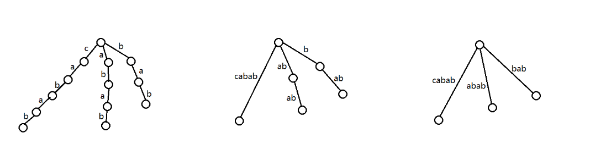
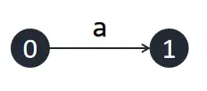
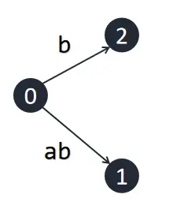
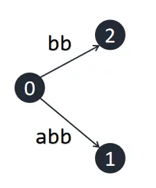
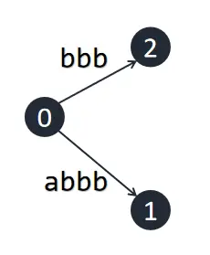
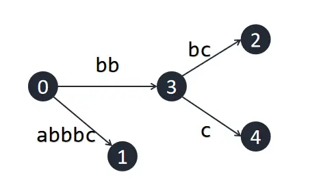
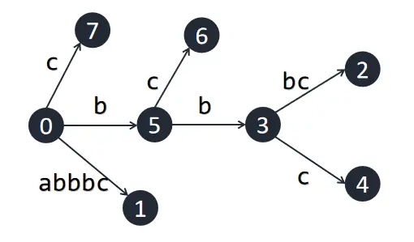

# 后缀树 - OI Wiki

- Source: https://oi-wiki.org/string/suffix-tree/

# 后缀树

后缀树是一种维护一个字符串所有后缀的数据结构．

## 一些记号

记构建后缀树的母串为 𝑆S，长度为 𝑛n，字符集为 ΣΣ．

令 𝑆[𝑖]S[i] 表示 𝑆S 中的第 𝑖i 个字符，其中 1 ≤𝑖 ≤𝑛1≤i≤n．

令 𝑆[𝑙,𝑟]S[l,r] 表示 𝑆S 中第 𝑙l 个字符至第 𝑟r 个字符组成的字符串，称为 𝑆S 的一个子串．

记 𝑆[𝑖,𝑛]S[i,n] 为 𝑆S 的以 𝑖i 开头的后缀，𝑆[1,𝑖]S[1,i] 为 𝑆S 的以 𝑖i 结尾的前缀．

## 定义

定义字符串 𝑆S 的 **后缀 trie** 为将 S 的所有后缀插入至 trie 树中得到的字典树．在后缀 trie 中，节点 x 对应的字符串为从根节点走到 x 的路径上经过的字符拼接而成的字符串．记后 缀 trie 中所有对应 𝑆S 的某个后缀的节点为后缀节点．

容易看出后缀 trie 的优越性质：它的非根节点恰好能接受 𝑆S 的所有本质不同非空子串．但构建后缀 trie 的时空复杂度均为 𝑂(𝑛2)O(n2)，在很多情况下不能接受，所以我们引入后缀树的概念．

如果令后缀 trie 中所有拥有多于一个儿子的节点和后缀节点为关键点，定义只保留关键点，将非关键点形成的链压缩成一条边形成的压缩 trie 树为 **后缀树 (Suffix Tree)** ．如果仅令后缀 trie 中所有拥有多于一个儿子的节点和叶结点为关键点，定义只保留关键点形成的压缩 trie 树为 **隐式后缀树 (Implicit Suffix Tree)** ．容易看出隐式后缀树为后缀树进一步压缩后得到的结果．

在后缀树和隐式后缀树中，每条边对应一个字符串；每个非根节点 𝑥x 对应了一个字符串集合，为从根节点走到 𝑥x 的父亲节点 𝑓𝑎𝑥fax 经过的字符串，拼接上 𝑓𝑎𝑥fax 至 𝑥x 的树边对应的字符串的任意一个非空前缀，称为 𝑠𝑡𝑟𝑥strx．同时，在隐式后缀树中，称一个没有对应任何节点的后缀为 **隐式后缀** ．

下图从左至右分别为以字符串 𝚌𝚊𝚋𝚊𝚋cabab 为母串构建的后缀 trie、后缀树和隐式后缀树．



考虑将 𝑆S 的后缀逐个插入至后缀 trie 中．从第二次插入开始，每次最多新增一个拥有多于一个儿子的节点和一个后缀节点，所以后缀树中节点个数最多为 2𝑛2n 个，十分优秀．

## 后缀树的建立

### 支持前端动态添加字符的算法

反串建 SAM 建出的 parent 树就是这个串的后缀树，所以我们将反串的字符逐个加入 SAM 即可．

参考实现

```text 1 2 3 4 5 6 7 8 9 10 11 12 13 14 15 16 17 18 19 20 21 22 23 24 25 26 27 28 29 30 31 32 33 ``` |  ```text struct SuffixAutomaton { int tot , lst ; int siz [ N << 1 ]; int buc [ N ], id [ N << 1 ]; struct Node { int len , link ; int ch [ 26 ]; } st [ N << 1 ]; SuffixAutomaton () : tot ( 1 ), lst ( 1 ) {} void extend ( int ch ) { int cur = ++ tot , p = lst ; lst = cur ; siz [ cur ] = 1 , st [ cur ]. len = st [ p ]. len \+ 1 ; for (; p && ! st [ p ]. ch [ ch ]; p = st [ p ]. link ) st [ p ]. ch [ ch ] = cur ; if ( ! p ) st [ cur ]. link = 1 ; else { int q = st [ p ]. ch [ ch ]; if ( st [ q ]. len == st [ p ]. len \+ 1 ) st [ cur ]. link = q ; else { int pp = ++ tot ; st [ pp ] = st [ q ]; st [ pp ]. len = st [ p ]. len \+ 1 ; st [ cur ]. link = st [ q ]. link = pp ; for (; p && st [ p ]. ch [ ch ] == q ; p = st [ p ]. link ) st [ p ]. ch [ ch ] = pp ; } } } } SAM ; ```   
---|---  
  
### 支持后端动态添加字符的算法

Ukkonen 算法是一种增量构造算法．我们依次向树中插入串 𝑆S 的每一个字符，并在每一次插入之后正确地维护当前的后缀树．

#### 朴素算法

首先介绍一下一种较为暴力的构建方式，我们用字符串 𝚊𝚋𝚋𝚋𝚌abbbc 来演示一下构建的过程．

初始建立一个根节点，称为 00 号节点．同时每条边我们维护一个区间 [𝑙,𝑟][l,r] 表示这条边上的字符串为 𝑆[𝑙,𝑟]S[l,r]．另外，维护已经插入的字符个数 𝑚m，初始为 00．

首先插入字符 𝚊a，直接从 00 号节点伸出一条边，标为 [1,∞][1,∞]，指向一个新建的节点．这里的 ∞∞ 是一个极大值，可理解为串的结尾，这样在插入新字符时，这条边会自动的包含新的字符．



接下来我们插入字符 𝚋b，同样从 00 伸出一条边，标为 [2,∞⁡][2,∞⁡]．注意到之前延伸出的边 [1,∞][1,∞] 的意义自动地发生了变化，随着串结尾的改变，其表示的串从 𝚊a 变为了 𝚊𝚋ab．这样是正确的，因为之前所有后缀都已经以一个叶节点的形式出现在树中，只需要向所有叶节点的末端插入一个当前字符即可．



接下来，我们要再次插入一个字符 𝚋b，但是 𝚋b 是之前已经插入的字符串的一个子串，因此原树已经包含 𝚋b，此时，我们什么都不做，记录一个 𝑘k 表示 𝑆[𝑘,𝑚]S[k,m] 是当前最长的隐式后缀．



接下来我们插入另一个 𝚋b．因为前一个 𝚋b 没有插入成功，此时 𝑘 =3k=3，代表要插入的后缀为 𝚋𝚋bb．我们从根开始向下寻找 𝚋𝚋bb，发现也在原树之中．同样，我们还是什么都不做．



注意到我们没有管 𝑘k 之后的后缀．因为如果 𝑆[𝑘,𝑚]S[k,m] 是一个隐式后缀，那么对于 𝑙 >𝑘l>k，𝑆[𝑙,𝑚]S[l,m] 都是隐式后缀．因为由 𝑆[𝑘,𝑚]S[k,m] 为隐式后缀可知，存在字符 𝑐c 使得 𝑆[𝑘,𝑚] +𝑐S[k,m]+c 为 𝑆S 的子串，所以 𝑆[𝑙,𝑚] +𝑐S[l,m]+c 也为 𝑆S 的子串，由隐式后缀树的定义可知 𝑆[𝑙,𝑚]S[l,m] 也不作为叶结点出现．

接下来我们插入 𝚌c，此时 𝑘 =3k=3，因此我们需要沿着根向下寻找 𝚋𝚋𝚌bbc，发现不在原树中．我们需要在 𝚋𝚋bb 处代表的节点延伸出一条为 [5,∞][5,∞] 的出边．但发现这个节点其实不存在，而是包含在一条边中，因此我们需要分裂这条边，创建一个新节点，再在创建的节点处伸展出我们要创建的出边．此时成功插入，令 𝑘 →𝑘 +1k→k+1，因为 𝑆[𝑘,𝑚]S[k,m] 不再是隐式后缀．



接下来，因为 𝑘k 变化了，我们重复这个过程，直到再次出现隐式后缀，或 𝑘 >𝑚k>m（在这个例子中，是后者）．



构建过程结束．

该算法每次暴力从根向下寻找并插入的复杂度最坏为 𝑂(𝑛)O(n)，所以总的复杂度为 𝑂(𝑛2)O(n2)．

#### 后缀链接

朴素算法慢主要是因为每次 extend 都要从根找到最长隐式后缀的插入位置．所以考虑把这个位置记下来．首先，我们采用一个二元组 (𝑛𝑜𝑤,𝑟𝑒𝑚)(now,rem) 来描述当前这个最长的被隐式包含的后缀 𝑆[𝑘,𝑚]S[k,m]．沿着节点 𝑛𝑜𝑤now 的开头为 𝑆[𝑚 −𝑟𝑒𝑚 +1]S[m−rem+1] 的出边走长度 𝑟𝑒𝑚rem 到达的位置应该唯一表示一个字符串，每次插入新的字符时，我们只需要从 𝑛𝑜𝑤now 和 𝑟𝑒𝑚rem 描述的位置查找即可．

现在，我们只需要在 𝑘 →𝑘 +1k→k+1 时更新 (𝑛𝑜𝑤,𝑟𝑒𝑚)(now,rem)．此时如果 𝑛𝑜𝑤 =0now=0，只需要让 𝑟𝑒𝑚 →𝑟𝑒𝑚 −1rem→rem−1，因为下一个要插入的后缀是刚才插入的长度 −1−1．否则，设 𝑠𝑡𝑟𝑛𝑜𝑤strnow 对应的子串为 𝑆[𝑙,𝑟]S[l,r]，我们需要找到一个节点 𝑛𝑜𝑤′now′ 对应 𝑆[𝑙 +1,𝑟]S[l+1,r]，令 𝑛𝑜𝑤 →𝑛𝑜𝑤′now→now′ 即可．

首先有引理：对隐式后缀树中任意非叶非根节点 𝑥x，在树中存在另一非叶节点 𝑦y，使得 𝑠𝑡𝑟𝑦stry 是 𝑠𝑡𝑟𝑥strx 对应的子串删去开头的字符．

证明．令 𝑠s 表示 𝑠𝑡𝑟𝑥strx 删去开头字符形成的字符串．由隐式后缀树的定义可知，存在两个不同的字符 𝑐1,𝑐2c1,c2，满足 𝑠𝑡𝑟𝑥 +𝑐1strx+c1 与 𝑠𝑡𝑟𝑥 +𝑐2strx+c2 均为 𝑆S 的子串．所以，𝑠 +𝑐1s+c1 与 𝑠 +𝑐2s+c2 也为 𝑆S 的子串，所以 𝑠s 在后缀 trie 中也对应了一个有分叉的关键点，即在隐式后缀 trie 中存在 𝑦y 使得 𝑠𝑡𝑟𝑦 =𝑠stry=s．证毕．

由该引理，我们定义 Link⁡(𝑥) =𝑦Link⁡(x)=y，称为 x 的 **后缀链接 (Suffix Link)** ．于是 𝑛𝑜𝑤′ =Link⁡(𝑛𝑜𝑤)now′=Link⁡(now) 一定存在．现在我们只要能求出隐式后缀树中所有非根非叶节点的 LinkLink 即可．

#### Ukkonen 算法

Ukkonen 算法的整体流程如下：

为了构建隐式后缀树，我们从前往后加入 𝑆S 中的字符．假设根节点为 00，且当前已经建出 𝑆[1,𝑚]S[1,m] 的隐式后缀树且维护好了后缀链接．𝑆[1,𝑚]S[1,m] 的最长隐式后缀为 𝑆[𝑘,𝑚]S[k,m]，在树中的位置为 (𝑛𝑜𝑤,𝑟𝑒𝑚)(now,rem)．设 𝑆[𝑚 +1] =𝑥S[m+1]=x, 现在我们需要加入字符 𝑥x．此时，𝑆[1,𝑚]S[1,m] 的每一个后缀都需要在末尾添加字符 𝑥x．由于所有显式后缀都对应树中某个叶结点，它们父边右端点为 ∞∞，无需维护．所以，现在我们只用考虑隐式后缀末尾添加 x 对树的形态产生的影响．首先考虑 𝑆[𝑘,𝑚]S[k,m]，有两种情况：

  1. (𝑛𝑜𝑤,𝑟𝑒𝑚)(now,rem) 位置已经存在 𝑥x 的转移．此时后缀树形态不会发生变化．由于 𝑆[𝑘,𝑚 +1]S[k,m+1] 已经在后缀树中出现，所以对于 𝑙 >𝑘l>k，𝑆[𝑙,𝑚 +1]S[l,m+1] 也会在后缀树中出现，此时只需将 𝑟𝑒𝑚 →𝑟𝑒𝑚 +1rem→rem+1，不需做任何修改．
  2. (𝑛𝑜𝑤,𝑟𝑒𝑚)(now,rem) 不存在 𝑥x 的转移．如果 (𝑛𝑜𝑤,𝑟𝑒𝑚)(now,rem) 恰好为树中的节点，则此节点新增一条出边 𝑥x；否则需要对节点进行分裂，在此位置新增一个节点，并在新增节处添加出边 𝑥x．此时对于 𝑙 >𝑘l>k，我们并不知道 𝑆[𝑙,𝑚]S[l,m] 会对后缀树形态造成什么影响，所以我们还需继续考虑 𝑆[𝑘 +1,𝑚]S[k+1,m]．考虑怎么求出 𝑆[𝑘 +1,𝑚]S[k+1,m] 在后缀树中的位置：如果 𝑛𝑜𝑤now 不为 00，可以利用后缀链接，令 𝑛𝑜𝑤 =Link⁡(𝑛𝑜𝑤)now=Link⁡(now)；否则，令 𝑟𝑒𝑚 →𝑟𝑒𝑚 −1rem→rem−1．最后令 𝑘 →𝑘 +1k→k+1，再次重复这个过程．

每一步都只消耗常数时间，而算法在插入全部的字符后停止，所以时间复杂度为 𝑂(𝑛)O(n)．

由于 Ukkonen 算法只能处理出 𝑆S 的隐式后缀树，而隐式后缀树在一些问题中的功能可能不如后缀树强大，所以在需要时，可以在 𝑆S 的末端添加一个从未出现过的字符，这时 S 的所有后缀可以和树的所有叶子一一对应．

参考实现

```text 1 2 3 4 5 6 7 8 9 10 11 12 13 14 15 16 17 18 19 20 21 22 23 24 25 26 27 28 29 30 31 32 33 34 35 36 37 38 39 40 41 42 ``` |  ```text struct SuffixTree { int ch [ M \+ 5 ][ RNG \+ 1 ], st [ M \+ 5 ], len [ M \+ 5 ], link [ M \+ 5 ]; int s [ N \+ 5 ]; int now { 1 }, rem { 0 }, n { 0 }, tot { 1 }; SuffixTree () { len [ 0 ] = inf ; } int new_node ( int s , int le ) { ++ tot ; st [ tot ] = s ; len [ tot ] = le ; return tot ; } void extend ( int x ) { s [ ++ n ] = x ; ++ rem ; for ( int lst { 1 }; rem ;) { while ( rem > len [ ch [ now ][ s [ n \- rem \+ 1 ]]]) rem -= len [ now = ch [ now ][ s [ n \- rem \+ 1 ]]]; int & v { ch [ now ][ s [ n \- rem \+ 1 ]]}, c { s [ st [ v ] \+ rem \- 1 ]}; if ( ! v || x == c ) { lst = link [ lst ] = now ; if ( ! v ) v = new_node ( n , inf ); else break ; } else { int u { new_node ( st [ v ], rem \- 1 )}; ch [ u ][ c ] = v ; ch [ u ][ x ] = new_node ( n , inf ); st [ v ] += rem \- 1 ; len [ v ] -= rem \- 1 ; lst = link [ lst ] = v = u ; } if ( now == 1 ) \-- rem ; else now = link [ now ]; } } } Tree ; ```   
---|---  
  
## 作用

后缀树上每一个节点到根的路径都是 𝑆S 的一个非空子串，这在处理很多字符串问题时都很有用．

后缀树的 DFS 序就是后缀数组．后缀树的一个子树也就对应到后缀数组上的一个区间．后缀树上两个后缀的最长公共前缀是它们对应的叶节点的 LCA，因此，后缀数组的 height 的结论可以理解为树上若干个节点的 LCA 等于 DFS 序最小的和最大的节点的 LCA．

## 例题

### [洛谷 P3804【模板】后缀自动机（SAM）](https://www.luogu.com.cn/problem/P3804)

题意：

给定一个只包含小写字母的字符串 𝑆S．

请你求出 𝑆S 的所有出现次数不为 11 的子串的出现次数乘上该子串长度的最大值．

解法

建出插入一个终止符的隐式后缀树．树上每条从根出发的路径都构成子串．一个显示后缀的出现次数即为对应节点子树内的叶子节点个数，隐式后缀不用考虑，因为一个隐式后缀的出现次数等于向下走到的第一个节点对应显示后缀的出现次数，而且一定没有该显示后缀长．所以遍历整棵树，求出每个节点子树内叶子个数和每个节点到根的路径长度．如果叶子个数 >1>1 则更新答案．复杂度 𝑂(|𝑆||Σ|)O(|S||Σ|)．

参考代码

```text 1 2 3 4 5 6 7 8 9 10 11 12 13 14 15 16 17 18 19 20 21 22 23 24 25 26 27 28 29 30 31 32 33 34 35 36 37 38 39 40 41 42 43 44 45 46 47 48 49 50 51 52 53 54 55 56 57 58 59 60 61 62 63 64 65 66 67 68 69 70 71 72 ``` |  ```text #include <iostream> #include <string> using namespace std ; constexpr int N ( 1e6 ), M ( 2 * N ), inf ( 1e7 ), RNG { 26 }; struct SuffixTree { int ch [ M \+ 5 ][ RNG \+ 1 ], st [ M \+ 5 ], len [ M \+ 5 ], link [ M \+ 5 ]; int s [ N \+ 5 ]; int now { 1 }, rem { 0 }, n { 0 }, tot { 1 }; SuffixTree () { len [ 0 ] = inf ; } int new_node ( int s , int le ) { ++ tot ; st [ tot ] = s ; len [ tot ] = le ; return tot ; } void extend ( int x ) { s [ ++ n ] = x ; ++ rem ; for ( int lst { 1 }; rem ;) { while ( rem > len [ ch [ now ][ s [ n \- rem \+ 1 ]]]) rem -= len [ now = ch [ now ][ s [ n \- rem \+ 1 ]]]; int & v { ch [ now ][ s [ n \- rem \+ 1 ]]}, c { s [ st [ v ] \+ rem \- 1 ]}; if ( ! v || x == c ) { lst = link [ lst ] = now ; if ( ! v ) v = new_node ( n , inf ); else break ; } else { int u { new_node ( st [ v ], rem \- 1 )}; ch [ u ][ c ] = v ; ch [ u ][ x ] = new_node ( n , inf ); st [ v ] += rem \- 1 ; len [ v ] -= rem \- 1 ; lst = link [ lst ] = v = u ; } if ( now == 1 ) \-- rem ; else now = link [ now ]; } } pair < long long , int > search ( int u , int dep = 0 ) { if ( st [ u ] \+ len [ u ] >= n ) return { 0 , 1 }; dep += len [ u ]; long long ans { 0 }; int ys { 0 }; for ( int i { 0 }; i <= RNG ; ++ i ) if ( ch [ u ][ i ]) { auto res = search ( ch [ u ][ i ], dep ); ans = max ( ans , res . first ); ys += res . second ; } if ( ys > 1 ) ans = max ( ans , 1L L * dep * ys ); return { ans , ys }; } } T ; string s ; int main () { cin >> s ; for ( int i = 0 ; i < s . size (); ++ i ) T . extend ( s [ i ] \- 'a' \+ 1 ); T . extend ( 0 ); cout << T . search ( 1 ). first << endl ; return 0 ; } ```   
---|---  
  
### [CF235C Cyclical Quest](https://codeforces.com/problemset/problem/235/C)

题意：给定一个小写字母主串 𝑆S 和 𝑛n 个询问串，求每个询问串 𝑥𝑖xi 的所有循环同构在主串中出现的次数总和．

解法

建立插入终止符的隐式后缀树．

枚举当前在那个循环节，记录在树上能查找到多长的前缀．

重复类似 Ukkonen 算法的过程，记录当前能匹配到的位置 (𝑛𝑜𝑤,𝑟𝑒𝑚)(now,rem)．每次尝试插入下一个字符，如果成功则继续插入，否则跳出循环．

如果某一个次成功匹配了当前的循环节，且该循环节之前没出现过，则更新答案．

然后切换到下个循环节的时候，我们要删去当前匹配的子串开头的字符：这正好就相当于令 𝑛𝑜𝑤 →Link⁡(𝑛𝑜𝑤)now→Link⁡(now)．当然，如果 𝑛𝑜𝑤 =1now=1 则直接让 𝑟𝑒𝑚 →𝑟𝑒𝑚 −1rem→rem−1 就行了．

复杂度 𝑂(|𝑆||Σ| +∑|𝑥𝑖|)O(|S||Σ|+∑|xi|)

参考代码

```text 1 2 3 4 5 6 7 8 9 10 11 12 13 14 15 16 17 18 19 20 21 22 23 24 25 26 27 28 29 30 31 32 33 34 35 36 37 38 39 40 41 42 43 44 45 46 47 48 49 50 51 52 53 54 55 56 57 58 59 60 61 62 63 64 65 66 67 68 69 70 71 72 73 74 75 76 77 78 79 80 81 82 83 84 85 86 87 88 89 90 91 92 93 94 95 96 97 98 99 100 101 102 103 104 105 106 107 108 109 ``` |  ```text #include <cstring> #include <iostream> #include <string> using namespace std ; constexpr int N ( 1e6 ); struct SuffixTree { static constexpr int N { 2 * :: N }, RNG { 26 }, inf = 1e7 ; int ch [ N \+ 5 ][ RNG \+ 1 ]; int st [ N \+ 5 ], len [ N \+ 5 ], link [ N \+ 5 ], s [ :: N \+ 5 ]; int now { 1 }, rem { 0 }, tot { 1 }, n { 0 }; int cnt [ N \+ 5 ], vis [ N \+ 5 ]; SuffixTree () { len [ 0 ] = inf ; } void clear () { memset ( ch , 0 , sizeof ch ); now = tot = 1 ; rem = n = 0 ; } int new_node ( int s , int le ) { ++ tot ; st [ tot ] = s ; len [ tot ] = le ; return tot ; } void extend ( int x ) { s [ ++ n ] = x ; ++ rem ; for ( int lst { 1 }; rem ;) { while ( rem > len [ ch [ now ][ s [ n \- rem \+ 1 ]]]) rem -= len [ now = ch [ now ][ s [ n \- rem \+ 1 ]]]; int & v { ch [ now ][ s [ n \- rem \+ 1 ]]}, c { s [ st [ v ] \+ rem \- 1 ]}; if ( ! v || x == c ) { lst = link [ lst ] = now ; if ( ! v ) v = new_node ( n , inf ); else break ; } else { int u { new_node ( st [ v ], rem \- 1 )}; ch [ u ][ c ] = v ; ch [ u ][ x ] = new_node ( n , inf ); st [ v ] += rem \- 1 ; len [ v ] -= rem \- 1 ; lst = link [ lst ] = v = u ; } if ( now == 1 ) \-- rem ; else now = link [ now ]; } } void init ( int u ) { if ( len [ u ] > 1e6 ) return cnt [ u ] = 1 , void (); for ( int i { 0 }; i <= RNG ; ++ i ) if ( ch [ u ][ i ]) init ( ch [ u ][ i ]), cnt [ u ] += cnt [ ch [ u ][ i ]]; } long long test ( const char * t , int m ) { static int time { 0 }; ++ time ; int now { 1 }, rem { 0 }, o { 0 }; long long ans { 0 }; for ( int i { 1 }; i <= m ; ++ i ) { while ( o < i \+ m \- 1 ) { while ( rem >= len [ ch [ now ][ t [ o \- rem \+ 1 ]]]) rem -= len [ now = ch [ now ][ t [ o \- rem \+ 1 ]]]; int v { ch [ now ][ t [ o \- rem \+ 1 ]]}, c { s [ st [ v ] \+ rem ]}; if ( v && c == t [ o \+ 1 ]) { ++ o ; ++ rem ; } else { break ; } } if ( o == i \+ m \- 1 && vis [ ch [ now ][ t [ o \- rem \+ 1 ]]] != time ) ans += cnt [ ch [ now ][ t [ o \- rem \+ 1 ]]], vis [ ch [ now ][ t [ o \- rem \+ 1 ]]] = time ; if ( now == 1 ) \-- rem ; else now = link [ now ]; } return ans ; } } T ; string s ; int main () { cin >> s ; for ( int i = 0 ; i < s . size (); ++ i ) T . extend ( s [ i ] \- 'a' \+ 1 ); T . extend ( 0 ); T . init ( 1 ); int pw ; cin >> pw ; while ( pw \-- ) { cin >> s ; int n = s . size (); for ( auto & ch : s ) ch += 1 \- 'a' ; s = " " \+ s \+ s ; cout << T . test ( s . data (), n ) << " \n " ; } return 0 ; } ```   
---|---  
  
## 参考文献

  1. 2021 国家集训队论文《后缀树的构建》代晨昕
  2. [炫酷后缀树魔术 - EternalAlexander 的博客](https://www.luogu.com.cn/blog/EternalAlexander/xuan-ku-hou-zhui-shu-mo-shu)

* * *

>  __本页面最近更新： 2026/1/7 08:56:54，[更新历史](https://github.com/OI-wiki/OI-wiki/commits/master/docs/string/suffix-tree.md)  
>  __发现错误？想一起完善？[在 GitHub 上编辑此页！](https://oi-wiki.org/edit-landing/?ref=/string/suffix-tree.md "edit.link.title")  
>  __本页面贡献者：[Ir1d](https://github.com/Ir1d), [Tiphereth-A](https://github.com/Tiphereth-A), [Eletary](https://github.com/Eletary), [megakite](https://github.com/megakite)  
>  __本页面的全部内容在**[CC BY-SA 4.0](https://creativecommons.org/licenses/by-sa/4.0/deed.zh) 和 [SATA](https://github.com/zTrix/sata-license)** 协议之条款下提供，附加条款亦可能应用
