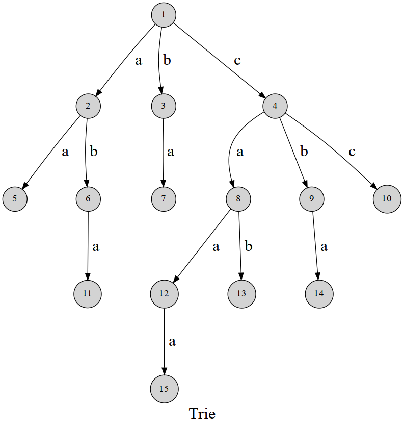

# 字典树 (Trie) - OI Wiki

- Source: https://oi-wiki.org/string/trie/

# 字典树 (Trie)

## 定义

字典树，英文名 trie．顾名思义，就是一个像字典一样的树．

## 引入

先放一张图：



可以发现，这棵字典树用边来代表字母，而从根结点到树上某一结点的路径就代表了一个字符串．举个例子，1 →4 →8 →121→4→8→12 表示的就是字符串 `caa`．

trie 的结构非常好懂，我们用 𝛿(𝑢,𝑐)δ(u,c) 表示结点 𝑢u 的 𝑐c 字符指向的下一个结点，或者说是结点 𝑢u 代表的字符串后面添加一个字符 𝑐c 形成的字符串的结点．（𝑐c 的取值范围和字符集大小有关，不一定是 0 ∼260∼26．）

有时需要标记插入进 trie 的是哪些字符串，每次插入完成时在这个字符串所代表的节点处打上标记即可．

## 实现

放一个结构体封装的模板：

C++PythonJava

```text 1 2 3 4 5 6 7 8 9 10 11 12 13 14 15 16 17 18 19 20 21 22 23 24 ``` |  ```text struct trie { int nex [ 100000 ][ 26 ], cnt ; bool exist [ 100000 ]; // 该结点结尾的字符串是否存在 void insert ( char * s , int l ) { // 插入字符串 int p = 0 ; for ( int i = 0 ; i < l ; i ++ ) { int c = s [ i ] \- 'a' ; if ( ! nex [ p ][ c ]) nex [ p ][ c ] = ++ cnt ; // 如果没有，就添加结点 p = nex [ p ][ c ]; } exist [ p ] = true ; } bool find ( char * s , int l ) { // 查找字符串 int p = 0 ; for ( int i = 0 ; i < l ; i ++ ) { int c = s [ i ] \- 'a' ; if ( ! nex [ p ][ c ]) return 0 ; p = nex [ p ][ c ]; } return exist [ p ]; } }; ```   
---|---  
  
```text 1 2 3 4 5 6 7 8 9 10 11 12 13 14 15 16 17 18 19 20 21 22 23 24 ``` |  ```text class trie : def __init__ ( self ): self . nex = [[ 0 for i in range ( 26 )] for j in range ( 100000 )] self . cnt = 0 self . exist = [ False ] * 100000 # 该结点结尾的字符串是否存在 def insert ( self , s ): # 插入字符串 p = 0 for i in s : c = ord ( i ) \- ord ( "a" ) if not self . nex [ p ][ c ]: self . cnt += 1 self . nex [ p ][ c ] = self . cnt # 如果没有，就添加结点 p = self . nex [ p ][ c ] self . exist [ p ] = True def find ( self , s ): # 查找字符串 p = 0 for i in s : c = ord ( i ) \- ord ( "a" ) if not self . nex [ p ][ c ]: return False p = self . nex [ p ][ c ] return self . exist [ p ] ```   
---|---  
  
```text 1 2 3 4 5 6 7 8 9 10 11 12 13 14 15 16 17 18 19 20 21 22 23 24 25 26 27 28 29 30 31 ``` |  ```text public class Trie { int [][] tree = new int [ 10000 ][ 26 ] ; int cnt = 0 ; boolean [] end = new boolean [ 10000 ] ; public void insert ( String word ) { int p = 0 ; char [] chars = word . toCharArray (); for ( int i = 0 ; i < chars . length ; i ++ ) { int c = chars [ i ] \- 'a' ; if ( tree [ p ][ c ] == 0 ) { tree [ p ][ c ] = ++ cnt ; } p = tree [ p ][ c ] ; } end [ p ] = true ; } public boolean find ( String word ) { int p = 0 ; char [] chars = word . toCharArray (); for ( int i = 0 ; i < chars . length ; i ++ ) { int c = chars [ i ] \- 'a' ; if ( tree [ p ][ c ] == 0 ) { return false ; } p = tree [ p ][ c ] ; } return end [ p ] ; } } ```   
---|---  
  
## 应用

### 检索字符串

字典树最基础的应用——查找一个字符串是否在「字典」中出现过．

[于是他错误的点名开始了](https://www.luogu.com.cn/problem/P2580)

给你 𝑛n 个名字串，然后进行 𝑚m 次点名，每次你需要回答「名字不存在」、「第一次点到这个名字」、「已经点过这个名字」之一．

1 ≤𝑛 ≤1041≤n≤104，1 ≤𝑚 ≤1051≤m≤105，所有字符串长度不超过 5050．

题解

对所有名字建 trie，再在 trie 中查询字符串是否存在、是否已经点过名，第一次点名时标记为点过名．

参考代码

```text 1 2 3 4 5 6 7 8 9 10 11 12 13 14 15 16 17 18 19 20 21 22 23 24 25 26 27 28 29 30 31 32 33 34 35 36 37 38 39 40 41 42 43 ``` |  ```text #include <cstdio> using namespace std ; constexpr int N = 500010 ; char s [ N ]; int n , m , ch [ N ][ 26 ], tag [ N ], tot = 1 ; int main () { scanf ( "%d" , & n ); for ( int i = 1 ; i <= n ; ++ i ) { scanf ( "%s" , s \+ 1 ); int u = 1 ; for ( int j = 1 ; s [ j ]; ++ j ) { int c = s [ j ] \- 'a' ; // 如果这个节点的子节点中没有这个字符，添加上并将该字符的节点号记录为++tot if ( ! ch [ u ][ c ]) ch [ u ][ c ] = ++ tot ; u = ch [ u ][ c ]; // 往更深一层搜索 } tag [ u ] = 1 ; // 最后一个字符为节点 u 的名字未被访问到记录为 1 } scanf ( "%d" , & m ); while ( m \-- ) { scanf ( "%s" , s \+ 1 ); int u = 1 ; for ( int j = 1 ; s [ j ]; ++ j ) { int c = s [ j ] \- 'a' ; u = ch [ u ][ c ]; if ( ! u ) break ; // 不存在对应字符的出边说明名字不存在 } if ( tag [ u ] == 1 ) { tag [ u ] = 2 ; // 最后一个字符为节点 u 的名字已经被访问 puts ( "OK" ); } else if ( tag [ u ] == 2 ) // 已经被访问，重复访问 puts ( "REPEAT" ); else puts ( "WRONG" ); } return 0 ; } ```   
---|---  
  
### AC 自动机

trie 是 [AC 自动机](../ac-automaton/) 的一部分．

### 维护异或极值

将数的二进制表示看做一个字符串，就可以建出字符集为 {0,1}{0,1} 的 trie 树．

[BZOJ1954 最长异或路径](https://hydro.ac/p/bzoj-P1954)

给你一棵带边权的树，求 (𝑢,𝑣)(u,v) 使得 𝑢u 到 𝑣v 的路径上的边权异或和最大，输出这个最大值．这里的异或和指的是所有边权的异或．

点数不超过 105105，边权在 [0,231)[0,231) 内．

题解

随便指定一个根 𝑟𝑜𝑜𝑡root，用 𝑇(𝑢,𝑣)T(u,v) 表示 𝑢u 和 𝑣v 之间的路径的边权异或和，那么 𝑇(𝑢,𝑣) =𝑇(𝑟𝑜𝑜𝑡,𝑢) ⊕𝑇(𝑟𝑜𝑜𝑡,𝑣)T(u,v)=T(root,u)⊕T(root,v)，因为 [LCA](../../graph/lca/) 以上的部分异或两次抵消了．

那么，如果将所有 𝑇(𝑟𝑜𝑜𝑡,𝑢)T(root,u) 插入到一棵 trie 中，就可以对每个 𝑇(𝑟𝑜𝑜𝑡,𝑢)T(root,u) 快速求出和它异或和最大的 𝑇(𝑟𝑜𝑜𝑡,𝑣)T(root,v)：

从 trie 的根开始，如果能向和 𝑇(𝑟𝑜𝑜𝑡,𝑢)T(root,u) 的当前位不同的子树走，就向那边走，否则没有选择．

贪心的正确性：如果这么走，这一位为 11；如果不这么走，这一位就会为 00．而高位是需要优先尽量大的．

参考代码

```text 1 2 3 4 5 6 7 8 9 10 11 12 13 14 15 16 17 18 19 20 21 22 23 24 25 26 27 28 29 30 31 32 33 34 35 36 37 38 39 40 41 42 43 44 45 46 47 48 49 50 51 52 53 54 55 56 57 58 59 60 61 62 63 64 ``` |  ```text #include <algorithm> #include <iostream> using namespace std ; constexpr int N = 100010 ; int head [ N ], nxt [ N << 1 ], to [ N << 1 ], weight [ N << 1 ], cnt ; int n , dis [ N ], ch [ N << 5 ][ 2 ], tot = 1 , ans ; void insert ( int x ) { for ( int i = 30 , u = 1 ; i >= 0 ; \-- i ) { int c = (( x >> i ) & 1 ); // 二进制一位一位向下取 if ( ! ch [ u ][ c ]) ch [ u ][ c ] = ++ tot ; u = ch [ u ][ c ]; } } void get ( int x ) { int res = 0 ; for ( int i = 30 , u = 1 ; i >= 0 ; \-- i ) { int c = (( x >> i ) & 1 ); if ( ch [ u ][ c ^ 1 ]) { // 如果能向和当前位不同的子树走，就向那边走 u = ch [ u ][ c ^ 1 ]; res |= ( 1 << i ); } else u = ch [ u ][ c ]; } ans = max ( ans , res ); // 更新答案 } void add ( int u , int v , int w ) { // 建边 nxt [ ++ cnt ] = head [ u ]; head [ u ] = cnt ; to [ cnt ] = v ; weight [ cnt ] = w ; } void dfs ( int u , int fa ) { insert ( dis [ u ]); get ( dis [ u ]); for ( int i = head [ u ]; i ; i = nxt [ i ]) { // 遍历子节点 int v = to [ i ]; if ( v == fa ) continue ; dis [ v ] = dis [ u ] ^ weight [ i ]; dfs ( v , u ); } } int main () { cin . tie ( nullptr ) -> sync_with_stdio ( false ); cin >> n ; for ( int i = 1 ; i < n ; ++ i ) { int u , v , w ; cin >> u >> v >> w ; add ( u , v , w ); // 双向边 add ( v , u , w ); } dfs ( 1 , 0 ); cout << ans ; return 0 ; } ```   
---|---  
  
### 维护异或和

01-trie 是指字符集为 {0,1}{0,1} 的 trie．01-trie 可以用来维护一些数字的异或和，支持修改（删除 + 重新插入），和全局加一（即：让其所维护所有数值递增 `1`，本质上是一种特殊的修改操作）．

如果要维护异或和，需要按值从低位到高位建立 trie．

**一个约定** ：文中说当前节点 **往上** 指当前节点到根这条路径，当前节点 **往下** 指当前结点的子树．

#### 插入 & 删除

如果要维护异或和，我们 **只需要** 知道某一位上 `0` 和 `1` 个数的 **奇偶性** 即可，也就是对于数字 `1` 来说，当且仅当这一位上数字 `1` 的个数为奇数时，这一位上的数字才是 `1`，请时刻记住这段文字：如果只是维护异或和，我们只需要知道某一位上 `1` 的数量即可，而不需要知道 trie 到底维护了哪些数字．

对于每一个节点，我们需要记录以下三个量：

  * `ch[o][0/1]` 指节点 `o` 的两个儿子，`ch[o][0]` 指下一位是 `0`，同理 `ch[o][1]` 指下一位是 `1`．
  * `w[o]` 指节点 `o` 到其父亲节点这条边上数值的数量（权值）．每插入一个数字 `x`，`x` 二进制拆分后在 trie 上 路径的权值都会 `+1`．
  * `xorv[o]` 指以 `o` 为根的子树维护的异或和．

具体维护结点的代码如下所示．

```text 1 2 3 4 5 6 7 8 9 10 11 12 13 ``` |  ```text void maintain ( int o ) { w [ o ] = xorv [ o ] = 0 ; if ( ch [ o ][ 0 ]) { w [ o ] += w [ ch [ o ][ 0 ]]; xorv [ o ] ^= xorv [ ch [ o ][ 0 ]] << 1 ; } if ( ch [ o ][ 1 ]) { w [ o ] += w [ ch [ o ][ 1 ]]; xorv [ o ] ^= ( xorv [ ch [ o ][ 1 ]] << 1 ) | ( w [ ch [ o ][ 1 ]] & 1 ); } // w[o] = w[o] & 1; // 只需知道奇偶性即可，不需要具体的值．当然这句话删掉也可以，因为上文就只利用了他的奇偶性． } ```   
---|---  
  
插入和删除的代码非常相似．

需要注意的地方就是：

  * 这里的 `MAXH` 指 trie 的深度，也就是强制让每一个叶子节点到根的距离为 `MAXH`．对于一些比较小的值，可能有时候不需要建立这么深（例如：如果插入数字 `4`，分解成二进制后为 `100`，从根开始插入 `001` 这三位即可），但是我们强制插入 `MAXH` 位．这样做的目的是为了便于全局 `+1` 时处理进位．例如：如果原数字是 `3`（`11`），递增之后变成 `4`（`100`），如果当初插入 `3` 时只插入了 `2` 位，那这里的进位就没了．

  * 插入和删除，只需要修改叶子节点的 `w[]` 即可，在回溯的过程中一路维护即可．

实现

```text 1 2 3 4 5 6 7 8 9 10 11 12 13 14 15 16 17 18 19 20 21 22 23 24 25 26 27 28 29 30 31 32 33 34 35 36 37 ``` |  ```text namespace trie { constexpr int MAXH = 21 ; int ch [ _ * ( MAXH \+ 1 )][ 2 ], w [ _ * ( MAXH \+ 1 )], xorv [ _ * ( MAXH \+ 1 )]; int tot = 0 ; int mknode () { ++ tot ; ch [ tot ][ 1 ] = ch [ tot ][ 0 ] = w [ tot ] = xorv [ tot ] = 0 ; return tot ; } void maintain ( int o ) { w [ o ] = xorv [ o ] = 0 ; if ( ch [ o ][ 0 ]) { w [ o ] += w [ ch [ o ][ 0 ]]; xorv [ o ] ^= xorv [ ch [ o ][ 0 ]] << 1 ; } if ( ch [ o ][ 1 ]) { w [ o ] += w [ ch [ o ][ 1 ]]; xorv [ o ] ^= ( xorv [ ch [ o ][ 1 ]] << 1 ) | ( w [ ch [ o ][ 1 ]] & 1 ); } w [ o ] = w [ o ] & 1 ; } void insert ( int & o , int x , int dp ) { if ( ! o ) o = mknode (); if ( dp > MAXH ) return ( void )( w [ o ] ++ ); insert ( ch [ o ][ x & 1 ], x >> 1 , dp \+ 1 ); maintain ( o ); } void erase ( int o , int x , int dp ) { if ( dp > 20 ) return ( void )( w [ o ] \-- ); erase ( ch [ o ][ x & 1 ], x >> 1 , dp \+ 1 ); maintain ( o ); } } // namespace trie ```   
---|---  
  
#### 全局加一

所谓全局加一就是指，让这棵 trie 中所有的数值 `+1`．

形式化的讲，设 trie 中维护的数值有 𝑉1,𝑉2,𝑉3…𝑉𝑛V1,V2,V3…Vn, 全局加一后 其中维护的值应该变成 𝑉1 +1,𝑉2 +1,𝑉3 +1…𝑉𝑛 +1V1+1,V2+1,V3+1…Vn+1

```text 1 2 3 4 5 ``` |  ```text void addall ( int o ) { swap ( ch [ o ][ 0 ], ch [ o ][ 1 ]); if ( ch [ o ][ 0 ]) addall ( ch [ o ][ 0 ]); maintain ( o ); } ```   
---|---  
  
##### 过程

我们思考一下二进制意义下 `+1` 是如何操作的．

我们只需要从低位到高位开始找第一个出现的 `0`，把它变成 `1`，然后这个位置后面的 `1` 都变成 `0` 即可．

下面给出几个例子感受一下：（括号内的数字表示其对应的十进制数字）

```text 1 2 3 4 5 ``` |  ```text 1000(8) + 1 = 1001(9) ; 10011(19) + 1 = 10100(20) ; 11111(31) + 1 = 100000(32); 10101(21) + 1 = 10110(22) ; 100000000111111(16447) + 1 = 100000001000000(16448); ```   
---|---  
  
对应 trie 的操作，其实就是交换其左右儿子，顺着 **交换后** 的 `0` 边往下递归操作即可．

回顾一下 `w[o]` 的定义：`w[o]` 指节点 `o` 到其父亲节点这条边上数值的数量（权值）．

有没有感觉这个定义有点怪呢？如果在父亲结点存储到两个儿子的这条边的边权也许会更接近于习惯．但是在这里，在交换左右儿子的时候，在儿子结点存储到父亲这条边的距离，显然更加方便．

### 01-trie 合并

指的是将上述的两个 01-trie 进行合并，同时合并维护的信息．

可能关于合并 trie 的文章比较少，其实合并 trie 和合并线段树的思路非常相似，可以搜索「合并线段树」来学习如何合并 trie．

其实合并 trie 非常简单，就是考虑一下我们有一个 `int merge(int a, int b)` 函数，这个函数传入两个 trie 树位于同一相对位置的结点编号，然后合并完成后返回合并完成的结点编号．

#### 过程

考虑怎么实现？

分三种情况：

  * 如果 `a` 没有这个位置上的结点，新合并的结点就是 `b`
  * 如果 `b` 没有这个位置上的结点，新合并的结点就是 `a`
  * 如果 `a`,`b` 都存在，那就把 `b` 的信息合并到 `a` 上，新合并的结点就是 `a`，然后递归操作处理 a 的左右儿子．

**提示** ：如果需要的合并是将 a，b 合并到一棵新树上，这里可以新建结点，然后合并到这个新结点上，这里的代码实现仅仅是将 b 的信息合并到 a 上．

#### 实现

```text 1 2 3 4 5 6 7 8 9 10 11 12 13 14 15 16 17 ``` |  ```text int merge ( int a , int b ) { if ( ! a ) return b ; // 如果 a 没有这个位置上的结点，返回 b if ( ! b ) return a ; // 如果 b 没有这个位置上的结点，返回 a /* 如果 `a`, `b` 都存在， 那就把 `b` 的信息合并到 `a` 上． */ w [ a ] = w [ a ] \+ w [ b ]; xorv [ a ] ^= xorv [ b ]; /* 不要使用 maintain()， maintain() 是合并a的两个儿子的信息 而这里需要 a b 两个节点进行信息合并 */ ch [ a ][ 0 ] = merge ( ch [ a ][ 0 ], ch [ b ][ 0 ]); ch [ a ][ 1 ] = merge ( ch [ a ][ 1 ], ch [ b ][ 1 ]); return a ; } ```   
---|---  
  
其实 trie 都可以合并，换句话说，trie 合并不仅仅限于 01-trie．

[【luogu-P6018】【Ynoi2010】Fusion tree](https://www.luogu.com.cn/problem/P6018)

给你一棵 𝑛n 个结点的树，每个结点有权值．𝑚m 次操作． 需要支持以下操作．

  * 将树上与一个节点 𝑥x 距离为 11 的节点上的权值 +1+1．这里树上两点间的距离定义为从一点出发到另外一点的最短路径上边的条数．

  * 在一个节点 𝑥x 上的权值 −𝑣−v．

  * 询问树上与一个节点 𝑥x 距离为 11 的所有节点上的权值的异或和． 对于 100%100% 的数据，满足 1 ≤𝑛 ≤5 ×1051≤n≤5×105，1 ≤𝑚 ≤5 ×1051≤m≤5×105，0 ≤𝑎𝑖 ≤1050≤ai≤105，1 ≤𝑥 ≤𝑛1≤x≤n，𝑜𝑝𝑡 ∈{1,2,3}opt∈{1,2,3}． 保证任意时刻每个节点的权值非负．

题解

每个结点建立一棵 trie 维护其儿子的权值，trie 应该支持全局加一． 可以使用在每一个结点上设置懒标记来标记儿子的权值的增加量．

参考代码

```text 1 2 3 4 5 6 7 8 9 10 11 12 13 14 15 16 17 18 19 20 21 22 23 24 25 26 27 28 29 30 31 32 33 34 35 36 37 38 39 40 41 42 43 44 45 46 47 48 49 50 51 52 53 54 55 56 57 58 59 60 61 62 63 64 65 66 67 68 69 70 71 72 73 74 75 76 77 78 79 80 81 82 83 84 85 86 87 88 89 90 91 92 93 94 95 96 97 98 99 100 101 102 103 104 105 106 107 108 109 110 111 112 113 114 115 116 117 118 119 120 121 122 123 124 125 ``` |  ```text #include <iostream> using namespace std ; constexpr int _ = 5e5 \+ 10 ; namespace trie { constexpr int _n = _ * 25 ; int rt [ _ ]; int ch [ _n ][ 2 ]; int w [ _n ]; //`w[o]` 指节点 `o` 到其父亲节点这条边上数值的数量（权值）。 int xorv [ _n ]; int tot = 0 ; void maintain ( int o ) { // 维护w数组和xorv（权值的异或）数组 w [ o ] = xorv [ o ] = 0 ; if ( ch [ o ][ 0 ]) { w [ o ] += w [ ch [ o ][ 0 ]]; xorv [ o ] ^= xorv [ ch [ o ][ 0 ]] << 1 ; } if ( ch [ o ][ 1 ]) { w [ o ] += w [ ch [ o ][ 1 ]]; xorv [ o ] ^= ( xorv [ ch [ o ][ 1 ]] << 1 ) | ( w [ ch [ o ][ 1 ]] & 1 ); } } int mknode () { // 创造一个新的节点 ++ tot ; ch [ tot ][ 0 ] = ch [ tot ][ 1 ] = 0 ; w [ tot ] = 0 ; return tot ; } void insert ( int & o , int x , int dp ) { // x是权重，dp是深度 if ( ! o ) o = mknode (); if ( dp > 20 ) return ( void )( w [ o ] ++ ); insert ( ch [ o ][ x & 1 ], x >> 1 , dp \+ 1 ); maintain ( o ); } void erase ( int o , int x , int dp ) { if ( dp > 20 ) return ( void )( w [ o ] \-- ); erase ( ch [ o ][ x & 1 ], x >> 1 , dp \+ 1 ); maintain ( o ); } void addall ( int o ) { // 对所有节点+1即将所有节点的ch[o][1]和ch[o][0]交换 swap ( ch [ o ][ 1 ], ch [ o ][ 0 ]); if ( ch [ o ][ 0 ]) addall ( ch [ o ][ 0 ]); maintain ( o ); } } // namespace trie int head [ _ ]; struct edges { int node ; int nxt ; } edge [ _ << 1 ]; int tot = 0 ; void add ( int u , int v ) { edge [ ++ tot ]. nxt = head [ u ]; head [ u ] = tot ; edge [ tot ]. node = v ; } int n , m ; int rt ; int lztar [ _ ]; int fa [ _ ]; void dfs0 ( int o , int f ) { // 得到fa数组 fa [ o ] = f ; for ( int i = head [ o ]; i ; i = edge [ i ]. nxt ) { // 遍历子节点 int node = edge [ i ]. node ; if ( node == f ) continue ; dfs0 ( node , o ); } } int V [ _ ]; // 权值函数 int get ( int x ) { return ( fa [ x ] == -1 ? 0 : lztar [ fa [ x ]]) \+ V [ x ]; } int main () { cin >> n >> m ; for ( int i = 1 ; i < n ; i ++ ) { int u , v ; cin >> u >> v ; add ( u , v ); // 双向建边 add ( rt = v , u ); } dfs0 ( rt , -1 ); // rt是随机的一个点 for ( int i = 1 ; i <= n ; i ++ ) { cin >> V [ i ]; if ( fa [ i ] != -1 ) trie :: insert ( trie :: rt [ fa [ i ]], V [ i ], 0 ); } while ( m \-- ) { int opt , x ; cin >> opt >> x ; if ( opt == 1 ) { lztar [ x ] ++ ; if ( x != rt ) { if ( fa [ fa [ x ]] != -1 ) trie :: erase ( trie :: rt [ fa [ fa [ x ]]], get ( fa [ x ]), 0 ); V [ fa [ x ]] ++ ; if ( fa [ fa [ x ]] != -1 ) trie :: insert ( trie :: rt [ fa [ fa [ x ]]], get ( fa [ x ]), 0 ); // 重新插入 } trie :: addall ( trie :: rt [ x ]); // 对所有节点+1 } else if ( opt == 2 ) { int v ; cin >> v ; if ( x != rt ) trie :: erase ( trie :: rt [ fa [ x ]], get ( x ), 0 ); V [ x ] -= v ; if ( x != rt ) trie :: insert ( trie :: rt [ fa [ x ]], get ( x ), 0 ); // 重新插入 } else { int res = 0 ; res = trie :: xorv [ trie :: rt [ x ]]; res ^= get ( fa [ x ]); cout << res << '\n' ; } } return 0 ; } ```   
---|---  
  
[【luogu-P6623】【省选联考 2020 A 卷】树](https://www.luogu.com.cn/problem/P6623)

给定一棵 𝑛n 个结点的有根树 𝑇T，结点从 11 开始编号，根结点为 11 号结点，每个结点有一个正整数权值 𝑣𝑖vi． 设 𝑥x 号结点的子树内（包含 𝑥x 自身）的所有结点编号为 𝑐1,𝑐2,…,𝑐𝑘c1,c2,…,ck，定义 𝑥x 的价值为：  
𝑣𝑎𝑙(𝑥) =(𝑣𝑐1 +𝑑(𝑐1,𝑥)) ⊕(𝑣𝑐2 +𝑑(𝑐2,𝑥)) ⊕⋯ ⊕(𝑣𝑐𝑘 +𝑑(𝑐𝑘,𝑥))val(x)=(vc1+d(c1,x))⊕(vc2+d(c2,x))⊕⋯⊕(vck+d(ck,x)) 其中 𝑑(𝑥,𝑦)d(x,y)．  
表示树上 𝑥x 号结点与 𝑦y 号结点间唯一简单路径所包含的边数，𝑑(𝑥,𝑥) =0d(x,x)=0．⊕⊕ 表示异或运算． 请你求出 𝑛∑𝑖=1𝑣𝑎𝑙(𝑖)∑i=1nval(i) 的结果．

题解

考虑每个结点对其所有祖先的贡献． 每个结点建立 trie，初始先只存这个结点的权值，然后从底向上合并每个儿子结点上的 trie，然后再全局加一，完成后统计答案．

参考代码

```text 1 2 3 4 5 6 7 8 9 10 11 12 13 14 15 16 17 18 19 20 21 22 23 24 25 26 27 28 29 30 31 32 33 34 35 36 37 38 39 40 41 42 43 44 45 46 47 48 49 50 51 52 53 54 55 56 57 58 59 60 61 62 63 64 65 66 67 68 69 70 71 72 73 74 75 76 ``` |  ```text constexpr int _ = 526010 ; int n ; int V [ _ ]; int debug = 0 ; namespace trie { constexpr int MAXH = 21 ; int ch [ _ * ( MAXH \+ 1 )][ 2 ], w [ _ * ( MAXH \+ 1 )], xorv [ _ * ( MAXH \+ 1 )]; int tot = 0 ; int mknode () { ++ tot ; ch [ tot ][ 1 ] = ch [ tot ][ 0 ] = w [ tot ] = xorv [ tot ] = 0 ; return tot ; } void maintain ( int o ) { w [ o ] = xorv [ o ] = 0 ; if ( ch [ o ][ 0 ]) { w [ o ] += w [ ch [ o ][ 0 ]]; xorv [ o ] ^= xorv [ ch [ o ][ 0 ]] << 1 ; } if ( ch [ o ][ 1 ]) { w [ o ] += w [ ch [ o ][ 1 ]]; xorv [ o ] ^= ( xorv [ ch [ o ][ 1 ]] << 1 ) | ( w [ ch [ o ][ 1 ]] & 1 ); } w [ o ] = w [ o ] & 1 ; } void insert ( int & o , int x , int dp ) { if ( ! o ) o = mknode (); if ( dp > MAXH ) return ( void )( w [ o ] ++ ); insert ( ch [ o ][ x & 1 ], x >> 1 , dp \+ 1 ); maintain ( o ); } int merge ( int a , int b ) { if ( ! a ) return b ; if ( ! b ) return a ; w [ a ] = w [ a ] \+ w [ b ]; xorv [ a ] ^= xorv [ b ]; ch [ a ][ 0 ] = merge ( ch [ a ][ 0 ], ch [ b ][ 0 ]); ch [ a ][ 1 ] = merge ( ch [ a ][ 1 ], ch [ b ][ 1 ]); return a ; } void addall ( int o ) { swap ( ch [ o ][ 0 ], ch [ o ][ 1 ]); if ( ch [ o ][ 0 ]) addall ( ch [ o ][ 0 ]); maintain ( o ); } } // namespace trie int rt [ _ ]; long long Ans = 0 ; vector < int > E [ _ ]; void dfs0 ( int o ) { for ( int i = 0 ; i < E [ o ]. size (); i ++ ) { int node = E [ o ][ i ]; dfs0 ( node ); rt [ o ] = trie :: merge ( rt [ o ], rt [ node ]); } trie :: addall ( rt [ o ]); trie :: insert ( rt [ o ], V [ o ], 0 ); Ans += trie :: xorv [ rt [ o ]]; } int main () { n = read (); for ( int i = 1 ; i <= n ; i ++ ) V [ i ] = read (); for ( int i = 2 ; i <= n ; i ++ ) E [ read ()]. push_back ( i ); dfs0 ( 1 ); printf ( "%lld" , Ans ); return 0 ; } ```   
---|---  
  
### 可持久化字典树

参见 [可持久化字典树](../../ds/persistent-trie/)．

* * *

>  __本页面最近更新： 2026/2/22 21:55:38，[更新历史](https://github.com/OI-wiki/OI-wiki/commits/master/docs/string/trie.md)  
>  __发现错误？想一起完善？[在 GitHub 上编辑此页！](https://oi-wiki.org/edit-landing/?ref=/string/trie.md "edit.link.title")  
>  __本页面贡献者：[ShuYuMo2003](https://github.com/ShuYuMo2003), [Ir1d](https://github.com/Ir1d), [Enter-tainer](https://github.com/Enter-tainer), [Tiphereth-A](https://github.com/Tiphereth-A), [iamtwz](https://github.com/iamtwz), [Konano](https://github.com/Konano), [ksyx](https://github.com/ksyx), [ouuan](https://github.com/ouuan), [Xeonacid](https://github.com/Xeonacid), [Henry-ZHR](https://github.com/Henry-ZHR), [aofall](https://github.com/aofall), [c-forrest](https://github.com/c-forrest), [CCXXXI](https://github.com/CCXXXI), [Chrogeek](https://github.com/Chrogeek), [Clouder0](https://github.com/Clouder0), [flylai](https://github.com/flylai), [HeRaNO](https://github.com/HeRaNO), [iamSmallY](https://github.com/iamSmallY), [ImpleLee](https://github.com/ImpleLee), [kaito387](https://github.com/kaito387), [kenlig](https://github.com/kenlig), [Menci](https://github.com/Menci), [shawlleyw](https://github.com/shawlleyw), [sshwy](https://github.com/sshwy), [Steven7559](https://github.com/Steven7559), [weroicp](https://github.com/weroicp), [Xiaoxiong-Liu](https://github.com/Xiaoxiong-Liu), [ZnPdCo](https://github.com/ZnPdCo)  
>  __本页面的全部内容在**[CC BY-SA 4.0](https://creativecommons.org/licenses/by-sa/4.0/deed.zh) 和 [SATA](https://github.com/zTrix/sata-license)** 协议之条款下提供，附加条款亦可能应用
