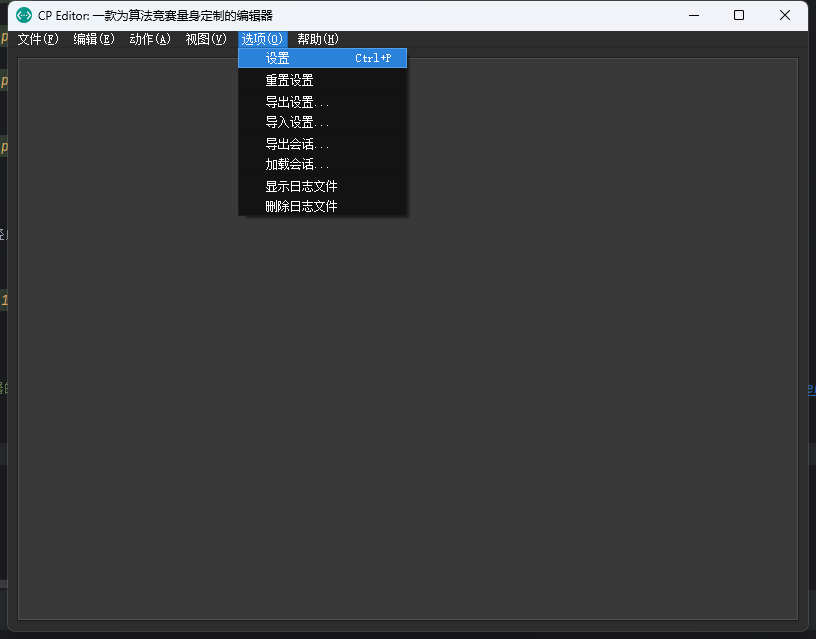
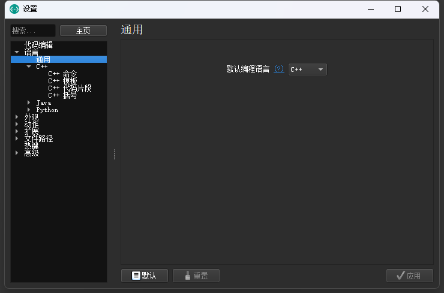
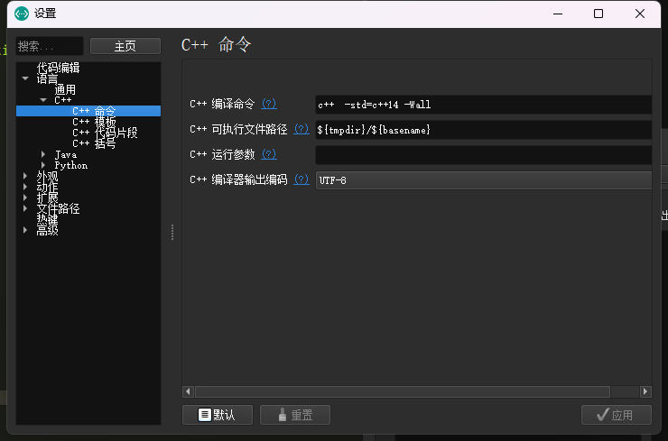
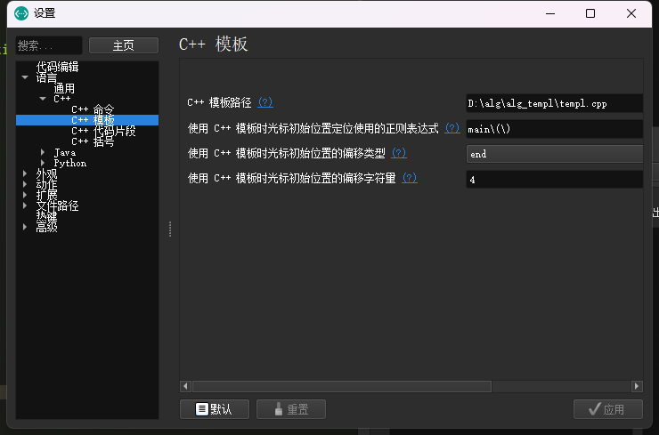
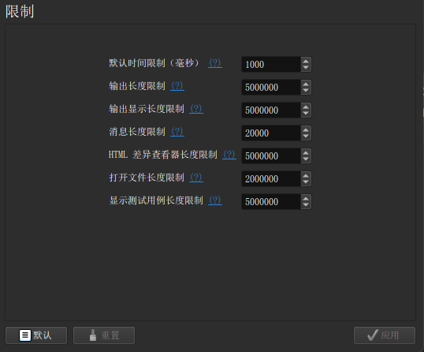
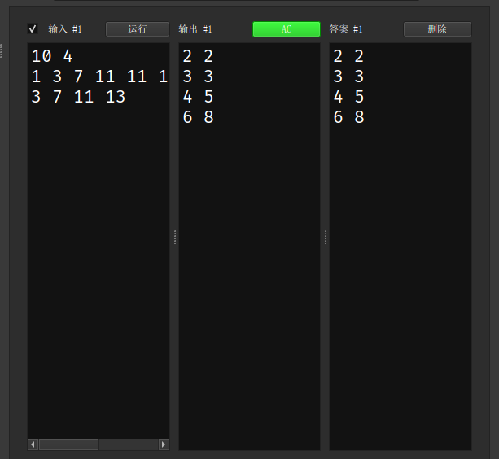
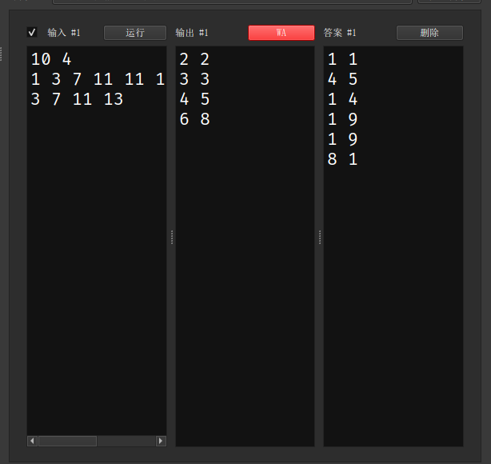
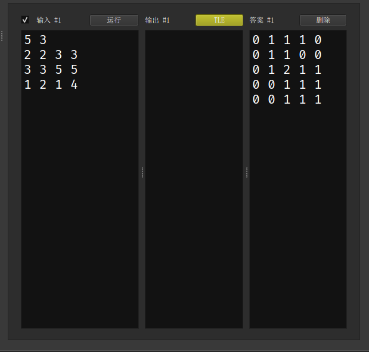
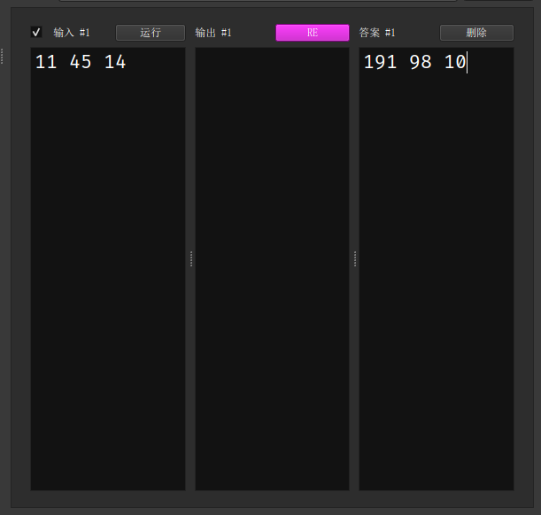

# CP Editor - OI Wiki

- Source: https://oi-wiki.org/tools/editor/cpeditor/

# CP Editor

## 简介

[CP Editor](https://github.com/cpeditor/cpeditor) 专为算法竞赛设计，不像其它 IDE 主要是为了开发设计的．它可以帮助你自动化编译、运行、测试，从而让你专注于算法设计．它甚至可以从各种算法竞赛网站上获取样例，将代码提交到 [Codeforces](https://codeforces.com/) 上！

## 下载与安装

参见 [安装 | CP Editor](https://cpeditor.org/zh/docs/installation/)．

## 基础配置

> CP Editor 内部没有集成编译器，需要自己安装配置编译器，如有需要请参考本站关于编译器安装相关的文章1，当然，如果你在下载时选择了带有 `with-gcc-<GCC 版本号>-llvm-<LLVM 版本号>` 后缀的安装包，你就可以使用 CP Editor 自带的编译器，路径在 `{安装目录}/mingw64/bin/`．

  * 设置默认语言

编辑器默认的语言为 `C++`．

  * 设置 `C++` 命令

需要设置一些必要的编译命令，这个要根据编译器来设定．

  * 设置模板

新建文件的时候会自动初始化的模板，需要注意的是 CP Editor 需要的是一个 `xxx.cpp` 的文件作为模板文件．

> 完成了以上的基本操作你就可以使用最基本的功能了．

## 基本功能

  * 快捷键

命令| 操作  
---|---  
`Ctrl`+`Shift`+`C`| 编译．  
`Ctrl`+`Shift`+`R`| 编译并运行．  
`Ctrl`+`R`| 运行．  
`Ctrl`+`Alt`+`D`| 在终端中运行．  
`Ctrl`+`K`| 终止所有进程．  
`Ctrl`+`Shift`+`I`| 格式化代码．  
  
具体可以查阅 [官方文档](https://cpeditor.org/zh/docs/preferences/key-bindings/)．

  * 样例测试

可以把题面的样例复制下来，由 CP Editor 自动评测，而且还可以设置时间限制！

## 参考资料

* * *

  1. [编译器 - OI Wiki](../../compiler/) ↩

* * *

>  __本页面最近更新： 2026/1/7 08:56:54，[更新历史](https://github.com/OI-wiki/OI-wiki/commits/master/docs/tools/editor/cpeditor.md)  
>  __发现错误？想一起完善？[在 GitHub 上编辑此页！](https://oi-wiki.org/edit-landing/?ref=/tools/editor/cpeditor.md "edit.link.title")  
>  __本页面贡献者：[Tiphereth-A](https://github.com/Tiphereth-A), [xk2013](https://github.com/xk2013), [zarttic](https://github.com/zarttic), [Enter-tainer](https://github.com/Enter-tainer), [shuzhouliu](https://github.com/shuzhouliu)  
>  __本页面的全部内容在**[CC BY-SA 4.0](https://creativecommons.org/licenses/by-sa/4.0/deed.zh) 和 [SATA](https://github.com/zTrix/sata-license)** 协议之条款下提供，附加条款亦可能应用
