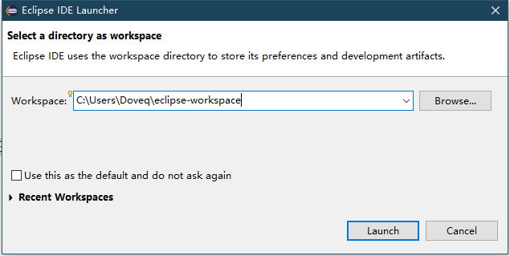
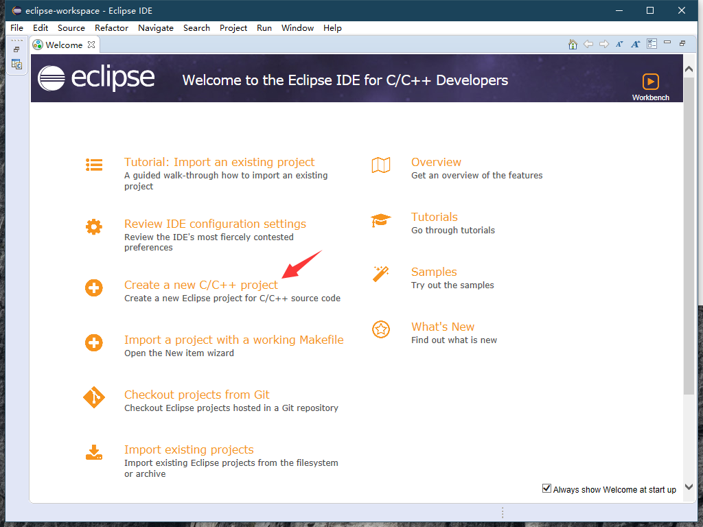
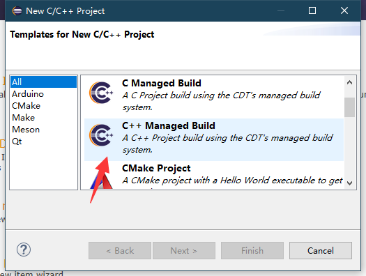
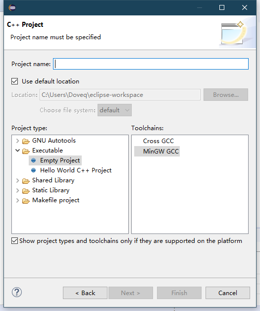

# Eclipse - OI Wiki

- Source: https://oi-wiki.org/tools/editor/eclipse/

# Eclipse

## 介绍

Eclipse 是著名的跨平台开源集成开发环境（IDE）．最初主要用来 Java 语言开发，当前亦有人通过插件使其作为 C++、Python、PHP 等其他语言的开发工具．

Eclipse 的本身只是一个框架平台，但是众多插件的支持，使得 Eclipse 拥有较佳的灵活性，所以许多软件开发商以 Eclipse 为框架开发自己的 IDE．

Eclipse 最初是由 IBM 公司开发的替代商业软件 Visual Age for Java 的下一代 IDE 开发环境，2001 年 11 月贡献给开源社区，现在它由非营利软件供应商联盟 Eclipse 基金会（Eclipse Foundation）管理．1

缺点：

  * 实测这个 IDE 打开速度比 Visual Studio 慢
  * 更新速度玄学，插件更新速度跟不上 IDE 的更新速度，对于经常更新的同学很不友好．

优点：

  * 使用体验较好
  * 能够快速上手，所以比较推荐 OIer 用这个 IDE．

## 安装 & 配置指南

安装可参照 [Eclipse/Installation - Eclipsepedia](https://wiki.eclipse.org/Eclipse/Installation)．

安装后如图填写目录信息以建造项目：

## 拓展

这个软件的帮助手册很详细，建议刚接触的同学多看帮助手册，多百度，并且这个 IDE 的使用手感与 Visual Studio 相近．

和 [VS Code](../vscode/) 类似，Eclipse 中也提供了很多插件，这些插件可以让 Eclipse 变得更加易用．2

## 参考资料与注释

* * *

  1. [Eclipse - 维基百科](https://zh.wikipedia.org/wiki/Eclipse) ↩

  2. [曾经的 Java IDE 王者 Eclipse 真的没落了？21 款插件让它强大起来！](https://blog.csdn.net/csdnnews/article/details/78495979) ↩

* * *

>  __本页面最近更新： 2026/1/7 08:56:54，[更新历史](https://github.com/OI-wiki/OI-wiki/commits/master/docs/tools/editor/eclipse.md)  
>  __发现错误？想一起完善？[在 GitHub 上编辑此页！](https://oi-wiki.org/edit-landing/?ref=/tools/editor/eclipse.md "edit.link.title")  
>  __本页面贡献者：[Doveqise](https://github.com/Doveqise), [ouuan](https://github.com/ouuan), [Enter-tainer](https://github.com/Enter-tainer), [NachtgeistW](https://github.com/NachtgeistW), [Tiphereth-A](https://github.com/Tiphereth-A), [Xeonacid](https://github.com/Xeonacid), [CamberLoid](https://github.com/CamberLoid), [partychicken](https://github.com/partychicken), [StudyingFather](https://github.com/StudyingFather)  
>  __本页面的全部内容在**[CC BY-SA 4.0](https://creativecommons.org/licenses/by-sa/4.0/deed.zh) 和 [SATA](https://github.com/zTrix/sata-license)** 协议之条款下提供，附加条款亦可能应用
