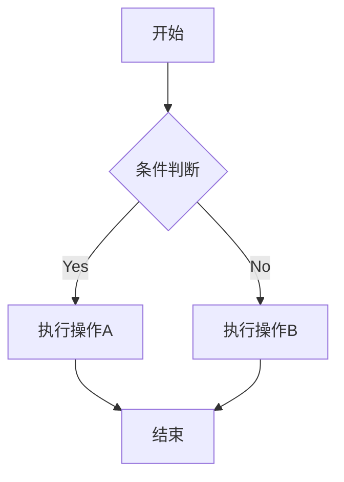
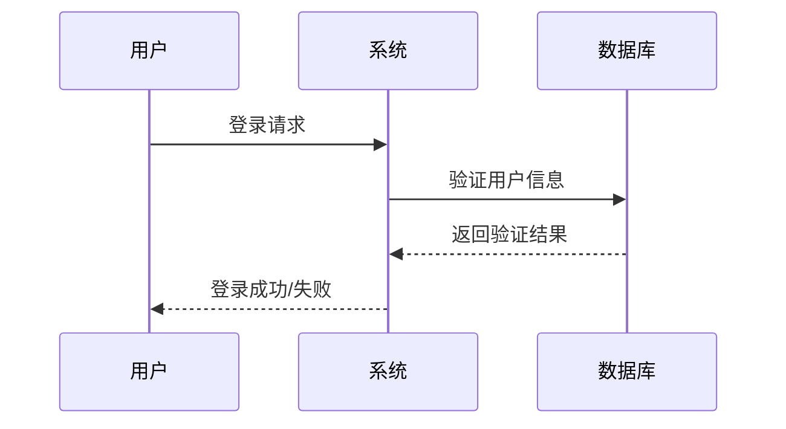
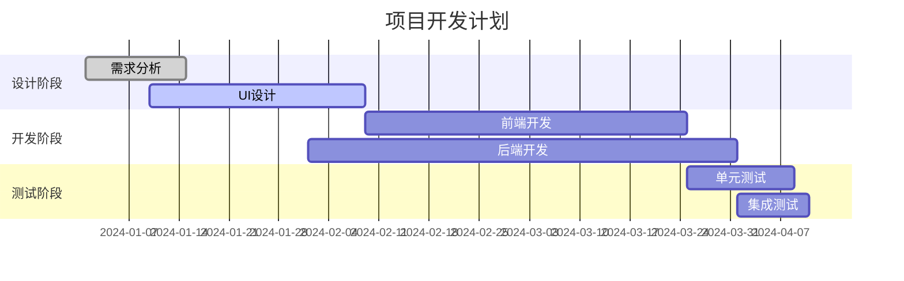
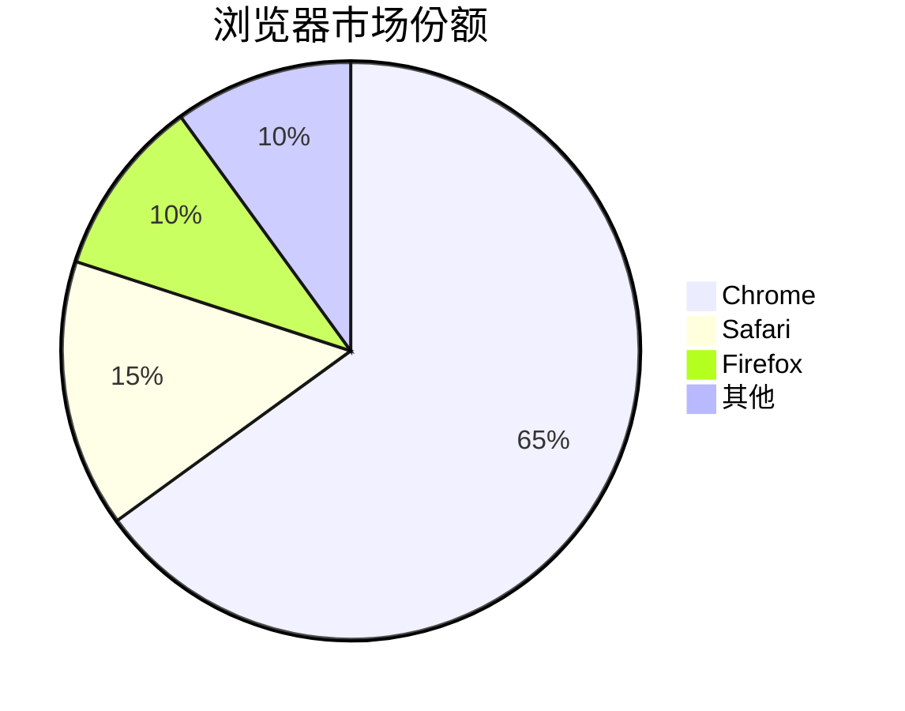
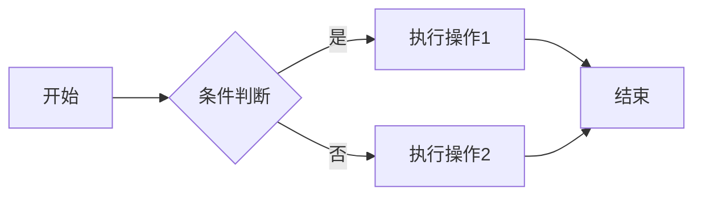
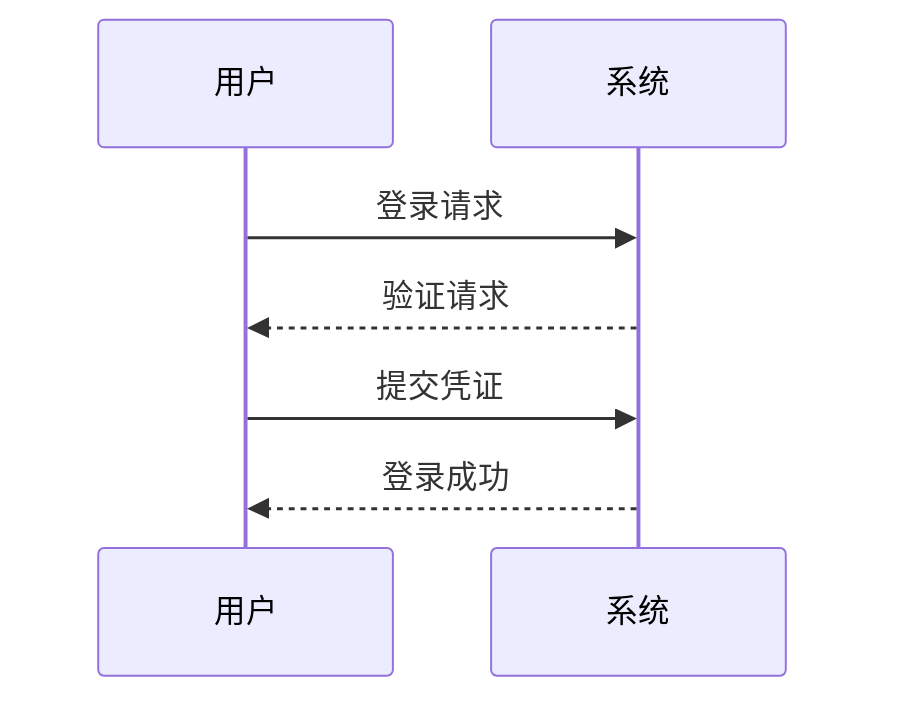
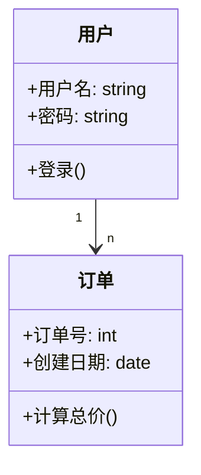
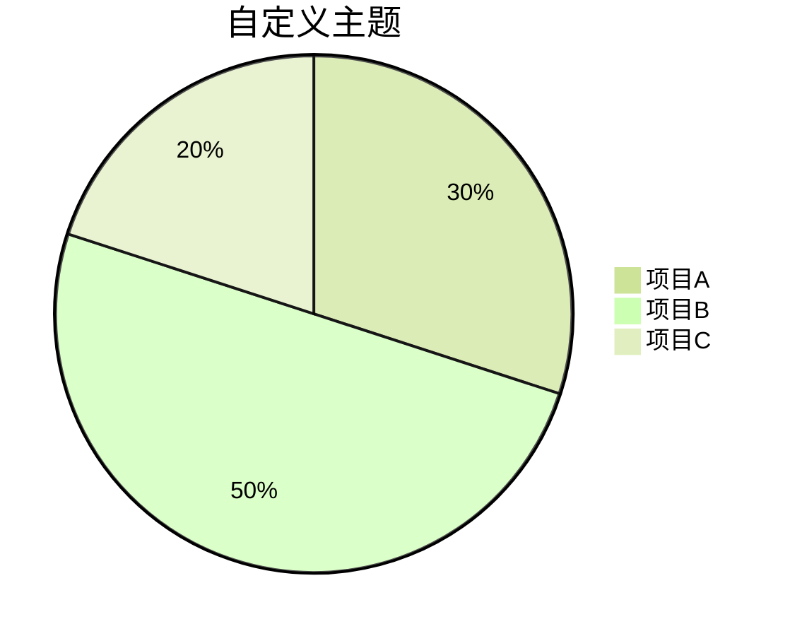
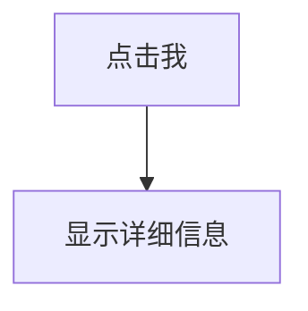

# Markdown 图表绘制

- Source: https://www.runoob.com/markdown/md-draw.html

图表在技术文档中非常重要，它可以帮助我们：


- 可视化复杂的数据关系
- 展示系统架构和工作流程
- 更清晰地表达思想和概念


---


## 常见的 Markdown 图表工具


### Mermaid


Mermaid 是最流行的 Markdown 图表工具之一，它允许你使用简单的文本语法生成各种图表。


#### 支持图表类型：


- 流程图 (Flowchart)
- 序列图 (Sequence Diagram)
- 类图 (Class Diagram)
- 状态图 (State Diagram)
- 甘特图 (Gantt Chart)
- 饼图 (Pie Chart)


### 流程图


```

```


#### 流程图方向


- `TD` 或 `TB`：从上到下
- `BT`：从下到上
- `RL`：从右到左
- `LR`：从左到右


#### 节点形状


- `A[方形]`：矩形
- `B(圆角矩形)`：圆角矩形
- `C{菱形}`：菱形（决策）
- `D((圆形))`：圆形
- `E>旗帜形]`：旗帜形


#### 连接线类型


- `-->` 实线箭头
- `-.->` 虚线箭头
- `==>` 粗实线箭头
- `--` 实线
- `-.` 虚线


---


### 时序图和甘特图


#### 时序图（Sequence Diagram）


```

```


时序图语法要点：


- `participant` 定义参与者
- `->>` 实线箭头
- `-->>` 虚线箭头
- `note` 添加注释


#### 甘特图（Gantt Chart）


```

```


甘特图语法要点：


- `title` 设置标题
- `dateFormat` 定义日期格式
- `section` 定义阶段
- 任务状态：`done`（已完成）、`active`（进行中）、`crit`（关键）


### 饼图


```

```


---


## 图表类型详解


### 流程图 (Flowchart)


流程图是最常用的图表类型，用于展示过程或算法流程。


#### Mermaid 示例：


```

```


#### 语法说明：


- `graph` 声明流程图
- `LR` 表示从左到右布局 (可选 TB/RL/BT)
- `-->` 表示箭头连接
- `[]` 表示矩形节点
- `{}` 表示菱形条件节点


---


### 序列图 (Sequence Diagram)


序列图展示对象之间的交互顺序。


#### Mermaid 示例：


```

```


#### 语法说明：


- `participant` 定义参与者
- `->>` 表示实线箭头
- `-->>` 表示虚线箭头


---


### 类图 (Class Diagram)


类图用于面向对象设计，展示类及其关系。


```

```


---


## 高级技巧


### 1. 主题定制


Mermaid 允许自定义图表样式：


```

```


### 2. 交互式图表


一些工具支持添加交互功能：


```

```


### 3. 导出图表


大多数工具支持将图表导出为：


- PNG 图片
- SVG 矢量图
- PDF 文档


---


## 工具支持情况


| 工具/平台 | Mermaid | PlantUML | Graphviz |
| --- | --- | --- | --- |
| GitHub | ✔ | ✖ | ✖ |
| GitLab | ✔ | ✔ | ✔ |
| VS Code | 插件 | 插件 | 插件 |
| Typora | ✔ | ✖ | ✖ |
| Obsidian | 插件 | 插件 | 插件 |


---


## 最佳实践


- **保持简洁**：图表应该简单明了，避免过多细节
- **统一风格**：同一文档中的图表应保持一致的风格
- **添加说明**：为复杂图表添加文字说明
- **版本控制**：文本格式的图表可以很好地与 Git 配合使用
- **测试渲染**：在不同平台上测试图表显示效果


---


## 常见问题解答


### Q1: 为什么我的图表无法显示？


- 检查是否使用了正确的语法
- 确认你的 Markdown 编辑器/平台支持该图表工具
- 查看是否有语法错误


### Q2: 如何学习这些图表语法？


- 参考官方文档： [Mermaid 官方文档](https://mermaid.js.org)
- [PlantUML 官方文档](https://plantuml.com)


使用在线编辑器实时练习


### Q3: 有没有可视化编辑器？


- Mermaid Live Editor: [https://mermaid.live](https://mermaid.live)
- PlantUML Server: [http://www.plantuml.com/plantuml](http://www.plantuml.com/plantuml)


	  AI 思考中...


			** [Markdown 数学公式](https://www.runoob.com/md-math.html)
			[Markdown 实战](https://www.runoob.com/markdown-practices.html) **


### 点我分享笔记


				**
取消


					*


					* 分享笔记


- 昵称昵称 (必填)
- 邮箱邮箱 (必填)
- 引用地址引用地址


**在线实例**

      : ·[HTML 实例](https://www.runoob.com/../html/html-examples.html)

      : ·[CSS 实例](https://www.runoob.com/../css/css-examples.html)

      : ·[JavaScript 实例](https://www.runoob.com/../js/js-examples.html)

      : ·[Ajax 实例](https://www.runoob.com/../ajx/ajax-examples.html)

       : ·[jQuery 实例](https://www.runoob.com/../jquery/jquery-examples.html)

      : ·[XML 实例](https://www.runoob.com/../xml/xml-examples.html)

      : ·[Java 实例](https://www.runoob.com/../java/java-examples.html)


**字符集&工具**

      : · [HTML 字符集设置](https://www.runoob.com/../charsets/html-charsets.html)

      : · [HTML ASCII 字符集](https://www.runoob.com/../tags/html-ascii.html)

     : · [JS 混淆/加密](https://www.jyshare.com/front-end/6939/)

      : · [PNG/JPEG 图片压缩](https://www.jyshare.com/front-end/6232/)

      : · [HTML 拾色器](https://www.runoob.com/../tags/html-colorpicker.html)

      : · [JSON 格式化工具](https://www.jyshare.com/front-end/53)

      : · [随机数生成器](https://www.jyshare.com/front-end/6680/)


**最新更新**

                  : · [VS Code 创建与...](https://www.runoob.com/../skills/vs-code-skill.html)

                      : · [Skills 脚本扩展](https://www.runoob.com/../skills/skills-scripts.html)

                      : · [Skills 描述](https://www.runoob.com/../skills/skills-description.html)

                      : · [SKILL.md 文件](https://www.runoob.com/../skills/skill-md-file.html)

                      : · [使用现有 Skills](https://www.runoob.com/../skills/use-existing-skills.html)

                      : · [Skills 工作原理](https://www.runoob.com/../skills/how-skills-work.html)

                      : · [第一个 Skill](https://www.runoob.com/../skills/skills-first.html)


**站点信息**

      : · [意见反馈](https://www.runoob.com/../cdn-cgi/l/email-protection/index.html)

      : · [免责声明](https://www.runoob.com/../disclaimer/index.html)

      : · [关于我们](https://www.runoob.com/../aboutus/index.html)

      : · [文章归档](https://www.runoob.com/../archives/index.html)


         关注微信**


      


     Copyright © 2013-2026    **[菜鸟教程](https://www.runoob.com/../index/index.html)**
    **[runoob.com](https://www.runoob.com/../index/index.html)** All Rights Reserved. 备案号：[闽ICP备15012807号-1](https://beian.miit.gov.cn/)


    **
    **
    **