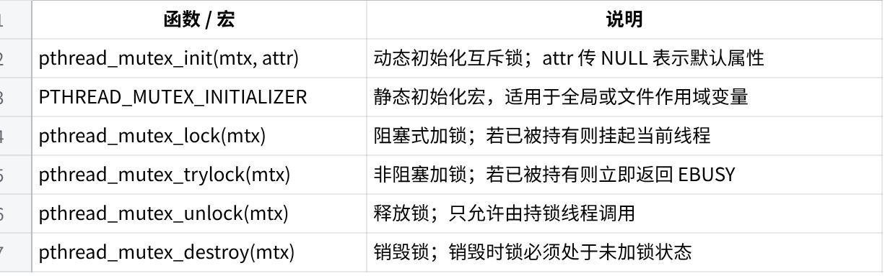
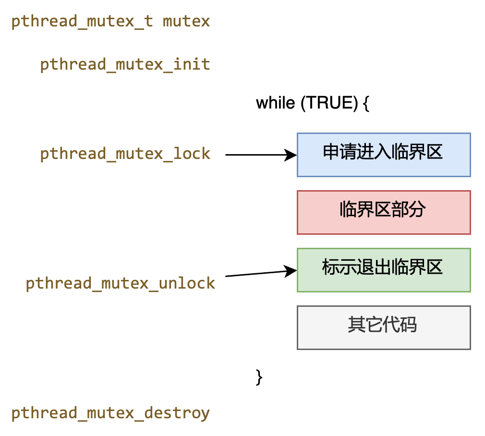
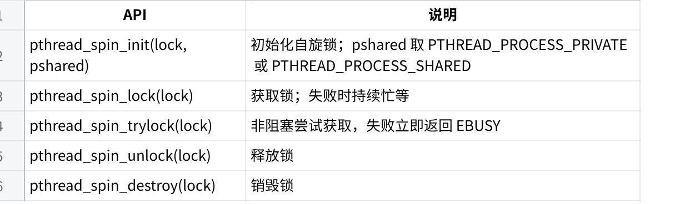
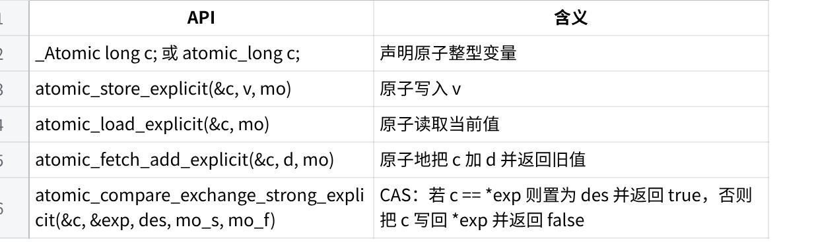
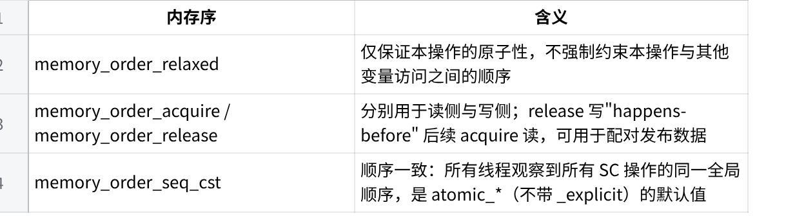

**第九周实验：原子操作与互斥锁**

1\. **实验目标**

在多线程程序中观察并解释数据竞争（race condition）现象；

熟练使用 pthread_mutex_t 完成临界区保护，理解临界区粒度对扩展性的影响；

掌握 C11 \<stdatomic.h\> 与 GCC
内建原子操作的使用方法，理解常用内存序的语义差异；

在同一负载下对比互斥锁与原子操作的性能与适用范围，归纳两者的取舍准则。

2\. **前置知识**

2.1 **pthread 互斥锁 API**

**点击图片可查看完整电子表格**

{width="5.75in" height="5.166666666666667in"}

2.2 **pthread 自旋锁 API**

**点击图片可查看完整电子表格**

2.3 **C11 原子操作 API**

包含头文件 \<stdatomic.h\> 后即可使用如下接口：

**点击图片可查看完整电子表格**

mo 为内存序，常用三档：

**点击图片可查看完整电子表格**

  --------------------------------------------------------------------------------------------------
  注意：此时仅作为扩展知识了解内存序的存在，具体细节会在后续理论课程"内存一致性模型"章节展开介绍。

  --------------------------------------------------------------------------------------------------

  -----------------------------------------------------------------------
  c++\
  \_atomic.c (简化使用版本)\
  #include \<stdio.h\>\
  #include \<pthread.h\>\
  #include \<stdatomic.h\>\
  \_Atomic int atomic_count = 0;\
  int count = 0;\
  void\* runner() {\
  for(int i = 0; i \< 1000000; i++) {\
  count++;\
  atomic_count++;\
  }\
  return 0;\
  }\
  int main() {\
  pthread_t threadIDs\[16\];\
  for(int i = 0; i \< 16; i++) {\
  pthread_create(&threadIDs\[i\], NULL, runner, NULL);\
  }\
  for(int i = 0; i \< 16; i++) {\
  pthread_join(threadIDs\[i\], NULL);\
  }\
  printf(\"The atomic counter is %u\\n\", atomic_count);\
  printf(\"The non-atomic counter is %u\\n\", count);\
  }

  -----------------------------------------------------------------------

2.4 **GCC内置的常用原子操作**

\_\_sync_fetch_and_add

\_\_sync_fetch_and_sub

\_\_sync_fetch_and_and

\_\_sync_bool_compare_and_swap

\_\_sync_val_compare_and_swap

  -----------------------------------------------------------------------
  注意：这些操作已不推荐使用，但有助于理解原子操作的概念

  -----------------------------------------------------------------------

  -----------------------------------------------------------------------
  C\
  \_atomic_sync.c\
  #include \<stdio.h\>\
  #include \<stdlib.h\>\
  #include \<pthread.h\>\
  \
  int count_unsafe = 0;\
  int count_safe = 0;\
  \
  void\* runner() {\
  for(int i = 0; i \< 1000000; i++) {\
  count_unsafe++;\
  }\
  return 0;\
  }\
  \
  void\* runner_sync() {\
  for(int i = 0; i \< 1000000; i++) {\
  \_\_sync_fetch_and_add(&count_safe, 1);\
  }\
  return 0;\
  }\
  \
  int main() {\
  pthread_t threadIDs\[32\];\
  for(int i = 0; i \< 32; i+=2) {\
  pthread_create(&threadIDs\[i\], NULL, runner_sync, NULL);\
  pthread_create(&threadIDs\[i+1\], NULL, runner, NULL);\
  }\
  for(int i = 0; i \< 32; i++) {\
  pthread_join(threadIDs\[i\], NULL);\
  }\
  \
  printf(\"The atomic counter is %u\\n\", count_safe);\
  printf(\"The non-atomic counter is %u\\n\", count_unsafe);\
  }

  -----------------------------------------------------------------------

2.5 **通用的 C++ 语言版本**

std::atomic\<T\>

T可以为任意类型

如果T为整形，有++/\--操作

exchange 原子地交换数值

  -----------------------------------------------------------------------
  C++\
  atomic.cpp\
  #include \<atomic\>\
  #include \<cstdio\>\
  \
  int main() {\
  printf(\"is lock free? %s\\n\", std::atomic\<int\>::is_always_lock_free
  ? \"true\" : \"false\");\
  std::atomic\<int\> a(3);\
  printf(\"is this lock free? %s\\n\", a.is_lock_free() ? \"true\" :
  \"false\");\
  return 0;\
  }

  -----------------------------------------------------------------------

由于是c++代码，编译器需从gcc改为g++:

  -----------------------------------------------------------------------
  Bash\
  编译的命令\
  g++ -lpthread atomic_exchange.cpp -o atomic

  -----------------------------------------------------------------------

  -----------------------------------------------------------------------
  C++\
  atomic_exchange.cpp\
  #include \<iostream\>\
  #include \<pthread.h\>\
  #include \<atomic\>\
  \
  \
  std::atomic\<bool\> ready (false);\
  std::atomic\<bool\> winner (false);\
  \
  void\* count1m (void \*arg) {\
  int id = \*(int\*)arg;\
  while (!ready) {} // wait for the ready signal\
  for (int i=0; i\<1000000; ++i) {} // go!, count to 1 million\
  if (!winner.exchange(true)) {\
  std::cout \<\< \"thread #\" \<\< id \<\< \" won!\\n\";\
  }\
  return NULL;\
  };\
  \
  int main ()\
  {\
  pthread_t threadIDs\[10\];\
  int ids\[10\];\
  std::cout \<\< \"spawning 10 threads that count to 1 million\...\" \<\<
  std::endl;\
  for(int i = 0; i \< 10; i++) {\
  ids\[i\] = i;\
  pthread_create(&threadIDs\[i\], NULL, count1m, (void\*)&ids\[i\]);\
  }\
  ready = true;\
  for(int i = 0; i \< 10; i++) {\
  pthread_join(threadIDs\[i\], NULL);\
  }\
  \
  return 0;\
  }

  -----------------------------------------------------------------------

3\. **题目一：并发计数器与丢失更新**

**背景**

考虑一个共享整型变量 counter，初始值为 0。若启动 N 个线程，每个线程对
counter 执行 M 次自增操作，理论上最终结果应为 N \\times
M。然而在多核环境下，counter++ 通常被编译为 load--modify--store
三条机器指令，来自不同线程的更新可能彼此覆盖，造成最终值小于期望值，这一现象称为**丢失更新**。

**任务 1.1：复现数据竞争**

阅读 counter_naive.c，编译运行多次（建议 $$N \geq 4$$，
$$M \geq 10^{6}$$） ，记录最终 counter 与理论值的差值。

  -----------------------------------------------------------------------
  C\
  counter_naive.c\
  #include \<stdio.h\>\
  #include \<stdlib.h\>\
  #include \<pthread.h\>\
  \
  static long counter = 0;\
  static long iters_per_thread;\
  \
  static void \*worker(void \*arg) {\
  (void)arg;\
  for (long i = 0; i \< iters_per_thread; i++) {\
  counter++;\
  }\
  return NULL;\
  }\
  \
  int main(int argc, char \*argv\[\]) {\
  if (argc != 3) {\
  fprintf(stderr, \"usage: %s \<n_threads\> \<iters_per_thread\>\\n\",
  argv\[0\]);\
  return 1;\
  }\
  int n_threads = atoi(argv\[1\]);\
  iters_per_thread = atol(argv\[2\]);\
  \
  pthread_t \*tids = malloc(sizeof(pthread_t) \* n_threads);\
  for (int i = 0; i \< n_threads; i++)\
  pthread_create(&tids\[i\], NULL, worker, NULL);\
  for (int i = 0; i \< n_threads; i++)\
  pthread_join(tids\[i\], NULL);\
  \
  long expected = (long)n_threads \* iters_per_thread;\
  printf(\"expected = %ld, counter = %ld, lost = %ld\\n\",\
  expected, counter, expected - counter);\
  free(tids);\
  return 0;\
  }

  -----------------------------------------------------------------------

+-----------------------------------------------------------------------+
| 请在雨课堂中回答：（仅文字回答，不需要拍照上传）                      |
|                                                                       |
| 在 -O0 与 -O2 两种优化级别下分别运行，丢失更新的数量是否一致？        |
|                                                                       |
| 请用 objdump -d 观察 worker 中 counter++                              |
| 对应的汇编序列，并解释观察到的差异。                                  |
+-----------------------------------------------------------------------+

**任务 1.2：使用互斥锁保护临界区**

请补全 counter_mutex.c，使最终结果严格等于 $$N \times M$$。

  -----------------------------------------------------------------------
  C\
  // counter_mutex.c（片段）\
  static long counter = 0;\
  static pthread_mutex_t mtx = PTHREAD_MUTEX_INITIALIZER;\
  \
  static void \*worker(void \*arg) {\
  (void)arg;\
  for (long i = 0; i \< iters_per_thread; i++) {\
  // TODO 1: 在此加锁\
  counter++;\
  // TODO 2: 在此解锁\
  }\
  return NULL;\
  }

  -----------------------------------------------------------------------

+-----------------------------------------------------------------------+
| 要求：                                                                |
|                                                                       |
| 完成 TODO 标注的位置，并在程序结束前调用 pthread_mutex_destroy；      |
|                                                                       |
| 在 main 中使用 clock_gettime(CLOCK_MONOTONIC, \...)                   |
| 测量\"从创建第一个线程到所有线程退出\"的总耗时；                      |
|                                                                       |
| 固定 $$M = 10^{7}$$，分别在 N = 1, 2, 4, 8 下各运行 5 次取平均，绘制  |
| N--耗时曲线，观察临界区争用对扩展性的影响。                           |
|                                                                       |
| 请拍照上传N--耗时曲线（横轴为 N，纵轴为运行时间）                     |
+-----------------------------------------------------------------------+

**任务 1.3：减小临界区粒度**

将每个线程的 M 次自增改为：先在线程局部变量 local 中累加 M
次，仅在线程结束前对全局 counter 加锁累加一次，命名为
counter_batched.c。在与任务 1.2 相同的参数下重新测量耗时。

+-----------------------------------------------------------------------+
| 请在雨课堂中回答：（仅文字回答，不需要拍照上传）                      |
|                                                                       |
| 与任务 1.2                                                            |
| 相比，本实                                                            |
| 现为何能显著减少争用？请用\"持锁时间\"与\"加锁次数\"两个量给出解释。  |
|                                                                       |
| 若改为每完成 1024                                                     |
| 次自增就同步一次（即每个线程内多次进入临界区                          |
| ），应如何在正确性与性能之间取舍？给出你建议的同步周期，并说明理由。  |
+-----------------------------------------------------------------------+

4\. **题目二：原子操作的使用及其与互斥锁的对比**

**背景**

互斥锁通过将临界区串行化来避免数据竞争，但即使临界区只是一条
counter++，互斥锁仍然要支付加锁、解锁两次原子指令的开销，并在争用激烈时引发上下文切换。当临界区本身就是\"对单个共享变量的简单读---改---写\"时，可以直接借助硬件原子指令一步完成更新，无需互斥锁这一更重量级的机制。

C11 在 \<stdatomic.h\> 中定义了一组可移植的原子类型与操作；它们在
AArch64 上最终落到 LDXR/STXR 配对指令，或在启用 ARMv8.1 LSE
扩展时映射为单条 LDADD、SWP、CAS 等指令。使用 AI 工具了解ARMv8.1
LSE与普通原子操作在实现细节以及性能对比方面的差异。

**任务 2.1：使用 C11 原子操作改写计数器**

将题目一的全局变量改为 \_Atomic long，使用 atomic_fetch_add_explicit
完成自增，命名为 counter_atomic.c。

  -----------------------------------------------------------------------
  C\
  // counter_atomic.c（片段）\
  #include \<stdatomic.h\>\
  \
  static \_Atomic long counter = 0;\
  \
  static void \*worker(void \*arg) {\
  (void)arg;\
  for (long i = 0; i \< iters_per_thread; i++) {\
  atomic_fetch_add_explicit(&counter, 1, memory_order_relaxed);\
  }\
  return NULL;\
  }

  -----------------------------------------------------------------------

+-----------------------------------------------------------------------+
| 请练习（不是作业，不需要上传）：                                      |
|                                                                       |
| 把 relaxed 改为默认的                                                 |
| memory_order_seq_cst，重新编译运行，观察程序是否仍然正确。            |
+-----------------------------------------------------------------------+

**任务 2.2：观察底层原子指令**

使用 aarch64-linux-gnu-gcc -O2 -S counter_atomic.c -o
counter_atomic.s（必要时配合 [Compiler
Explorer](https://godbolt.org/)）查看 atomic_fetch_add
生成的汇编。再加入 -march=armv8.1-a+lse 重新生成一份，对比两份输出。

+-----------------------------------------------------------------------+
| 请在 AI 的帮助下思考以下扩展知识（不是作业，不需要上传）:             |
|                                                                       |
| 不开启 LSE 时，atomic_fetch_add 通常被翻译为 LDXR--ADD--STXR--CBNZ    |
| 循环。请逐行解释该循环如何实现\"读---改---写\"的原子性，以及 STXR     |
| 在何种条件下会失败、循环为何因此而存在。                              |
|                                                                       |
| 开启 LSE 后，上述循环可被替换为单条                                   |
| LDADD（或类似指令）。从指令数量与对一致性总线的占用角度，分析 LSE     |
| 在高争用场景下的优势。                                                |
+-----------------------------------------------------------------------+

**任务 2.3：互斥锁与原子操作的性能对比**

在与题目一任务 1.2 相同的实验设置下，准备四个可执行文件：

counter_mutex（题目一任务 1.2）；

counter_batched（题目一任务 1.3）；

counter_atomic_relaxed（本题任务 2.1，使用 memory_order_relaxed）；

counter_atomic_seqcst（同上但使用 memory_order_seq_cst）。

固定 $$M = 10^{7}$$，分别在 N = 1, 2, 4, 8, 16 下各运行 5
次取平均，将四组数据绘制在同一张 N--耗时曲线上。

+-----------------------------------------------------------------------+
| 请在雨课堂中回答：（仅文字回答，不需要拍照上传）                      |
|                                                                       |
| 低争用（N = 1,                                                        |
| 2）与高争用（$$N \geq 8$$）下                                         |
| ，互斥锁版本与原子操作版本的差距各自如何？请简要回答你观察到的差异。  |
|                                                                       |
| counter_batched 与 counter_atomic_relaxed 谁更快？请说明：\"互斥锁 +  |
| 批量更新\"的设计何时可以稳定地超越单纯使用原子操作的方案。            |
|                                                                       |
| 据此归纳一条经验法则：在哪种\"临界区形态 +                            |
| 争用强度\"组合下应优先选择原子操作；哪种情况下应继续使用互斥锁。      |
+-----------------------------------------------------------------------+

5\. **题目三：互斥锁与自旋锁的对比**

**背景**

在pthread库中，普通互斥锁与自旋锁是两类最常见的\"互斥\"原语，但实现方式不同，区别集中在**竞争失败时的等待方式**：

互斥锁（pthread_mutex_t）：未抢到锁的线程通过 futex
系统调用陷入内核态、挂入阻塞队列，让出
CPU，直到锁被释放再由操作系统唤醒；

自旋锁（pthread_spinlock_t）：未抢到锁的线程在用户态持续忙等，不断检查锁的状态直至获得，全过程不进入内核。

两者各自的舒适区相互错开：

临界区**很短**且**线程数不超过可用核心数**时，自旋锁省去了系统调用与上下文切换，平均延迟更低；

临界区**较长**或**线程数超出核心数**时，自旋等待空转浪费
CPU，应改用互斥锁；

在用户态自旋锁还存在一个隐患------若持锁线程被操作系统抢占调度，所有等待者将持续空转直到持锁方被重新调度。该问题在内核自旋锁中可通过\"持锁期间禁抢占/禁中断\"消除，用户态无此能力。

**任务 3.1：使用 pthread 自旋锁实现计数器**

将题目一任务 1.2 的实现改用 pthread_spinlock_t，命名为
counter_spin.c。固定 M = 10\^{7}，分别在 N = 1, 2, 4, 8, 16
下测量耗时，并合并到题目二任务 2.3
的曲线图中------也就是同一张图同时呈现 mutex / atomic_relaxed /
atomic_seqcst / spin 四条曲线。

+-----------------------------------------------------------------------+
| 请在雨课堂中回答：（仅文字回答，不需要拍照上传）                      |
|                                                                       |
| 当线程数不超过物理核心数时，自旋锁与互斥锁的耗时对比如何？            |
|                                                                       |
| 当线程数显著超过核心数（例如 N = 32 而仅有 4                          |
| 个物理核心）时，两者的相对位置是否反转？为何自旋等待者越多反而越糟？  |
|                                                                       |
| 与\"直接用原子操作更新                                                |
| counter\"的方案相比，自                                               |
| 旋锁版本为何仍然更慢？除了锁本身的获取与释放，还要额外支付哪些开销？  |
+-----------------------------------------------------------------------+

**任务 3.2：用 C11 原子操作手写 TAS 自旋锁**

请基于 atomic_flag 实现一把最简的\"测试并设置\"（Test-And-Set,
TAS）自旋锁，命名为 spin_tas.c：

  -----------------------------------------------------------------------
  C\
  // spin_tas.c（关键片段）\
  #include \<stdatomic.h\>\
  \
  typedef struct {\
  atomic_flag flag;\
  } spin_t;\
  \
  static inline void spin_init(spin_t \*s) {\
  atomic_flag_clear(&s-\>flag);\
  }\
  \
  static inline void spin_lock(spin_t \*s) {\
  while (atomic_flag_test_and_set_explicit(&s-\>flag, /\* TODO 1 \*/))\
  ;\
  }\
  \
  static inline void spin_unlock(spin_t \*s) {\
  atomic_flag_clear_explicit(&s-\>flag, /\* TODO 2 \*/);\
  }

  -----------------------------------------------------------------------

+-----------------------------------------------------------------------+
| 扩展练习（不是作业，不需要上传）：                                    |
|                                                                       |
| 在 TODO 处填入合适的内存序，并解释 lock 必须使用 acquire、unlock      |
| 必须使用 release、两处均使用 relaxed 会发生什么；                     |
|                                                                       |
| 用此锁替换任务 3.1 中的 pthread_spin\_\*，验证最终 counter == N × M； |
+-----------------------------------------------------------------------+
