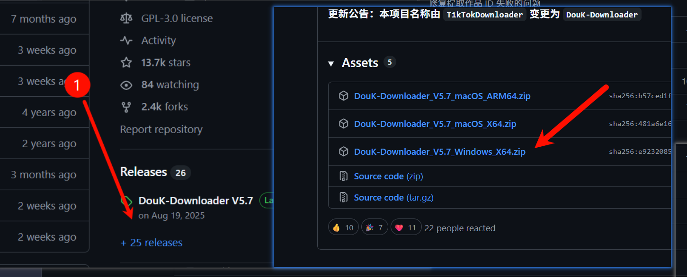
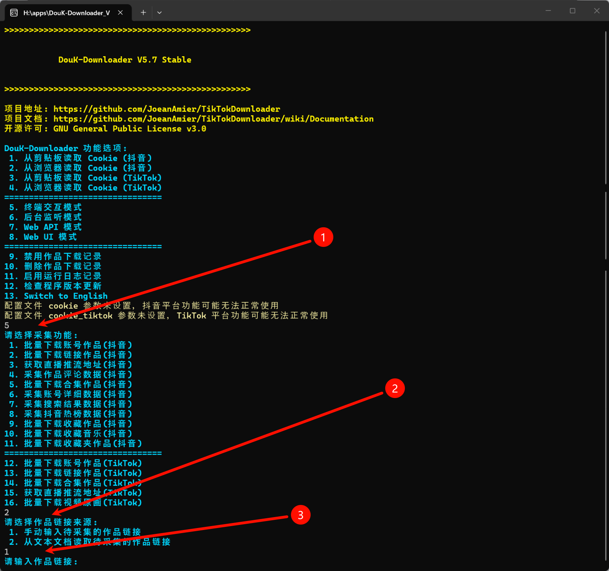
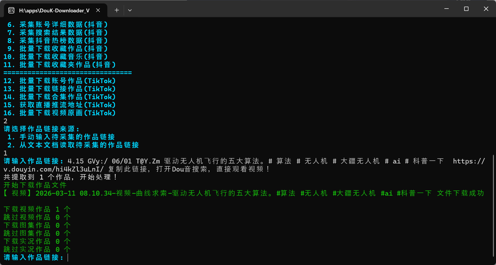
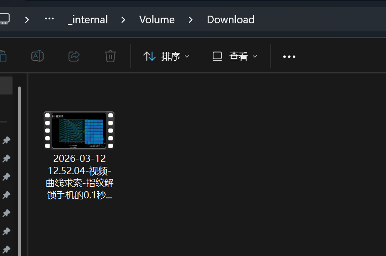
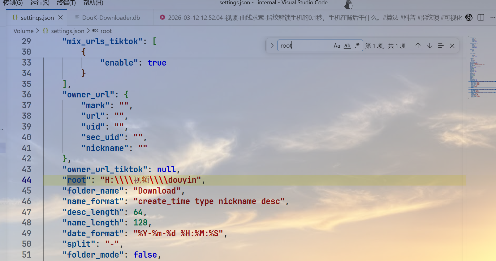
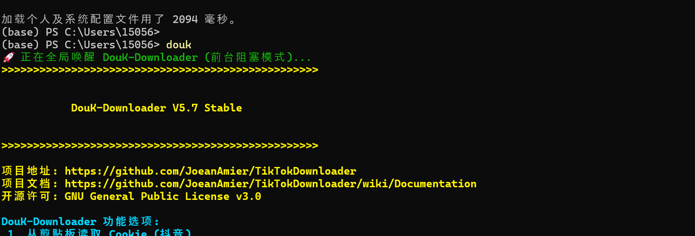
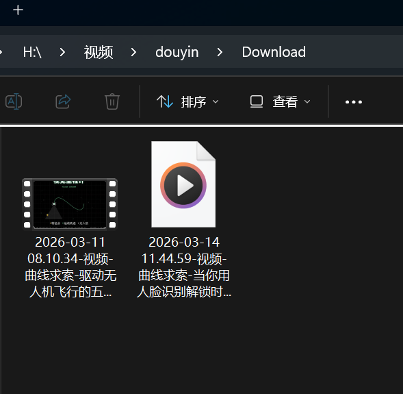

使用`TikTokDownloader`仓库和**shell脚本**配置了在powershell中输入抖音链接自动下载视频到指定目录

### 首先下载该仓库的exe文件
链接：`https://github.com/JoeanAmier/TikTokDownloader.git`

下载好文件打开后，双击main.exe运行依次输入5,2,1

、
### 打开抖音，复制地址
可以看到这个抖音视频是不能从官方下载的，此时我们复制链接，


### 输入链接回车

##### 在`DouK-Downloader_V5.7_Windows_X64\_internal\Volume\Download`相对目录下可以看到视频已经下载了


#### tips1:更改默认下载路径
进入`_internal\Volume`,打开里面的`settings.json`文件
查找root键，修改目标路径，注意需要使用`/`或者`\\\\`进行转义


#### tips2: 配置脚本自动打开main.exe并输入选项
随便打开一个powershell页面，cv以下内容，enter
哈基米给的这段代码的意思是在$profile 的位置创建了一个.psl文件，然后输入函数名就可以执行这个文件，而这个脚本文件可以完成打开main.exe和输入5,2,1这几个重复繁琐的动作。
##### 注意函数名以后会作为命令运行整个脚本，可以更改为顺手的命令

```powershell
# 1. 检查并创建 PowerShell 配置文件 (如果不存在)
if (!(Test-Path -Path $PROFILE)) {
    New-Item -ItemType File -Path $PROFILE -Force | Out-Null
    Write-Host "已为你创建 PowerShell 配置文件。" -ForegroundColor Yellow
}

# 2. 定义要注入的自定义函数代码 (前台阻塞 + 后台按键版)
$AliasCode = @"

# ==========================================
# 自定义快捷命令: DouK-Downloader 自动化启动 (防闪退完美版)
# ==========================================
function douk {
    `$exePath = "H:\apps\DouK-Downloader_V5.7_Windows_X64\main.exe"
    `$workDir = "H:\apps\DouK-Downloader_V5.7_Windows_X64"
    
    # 1. 动态生成一个 VBS 按键脚本到系统临时文件夹
    `$vbsPath = "`$env:TEMP\auto_keys.vbs"
    `$vbsCode = @'
Set WshShell = WScript.CreateObject("WScript.Shell")
WScript.Sleep 2000
WshShell.SendKeys "5{ENTER}"
WScript.Sleep 500
WshShell.SendKeys "2{ENTER}"
WScript.Sleep 500
WshShell.SendKeys "1{ENTER}"
'@
    Set-Content -Path `$vbsPath -Value `$vbsCode -Encoding Ascii
    
    Write-Host "🚀 正在全局唤醒 DouK-Downloader (前台阻塞模式)..." -ForegroundColor Green
    
    # 2. 调用 wscript 在系统后台静默执行按键脚本
    Start-Process -FilePath "wscript.exe" -ArgumentList `$vbsPath
    
    # 3. 强制切换到工作目录，并使用 & 符号在前台霸占运行
    # 这样可以确保 stdin (输入流) 永远连接着你的键盘，直到你手动退出程序
    Push-Location `$workDir
    & `$exePath
    
    # 4. 当你退出 main.exe 后，自动弹回原来的路径
    Pop-Location
}
"@

# 3. 将代码追加写入到配置文件中
Add-Content -Path $PROFILE -Value $AliasCode -Encoding UTF8
Write-Host "✅ 完美版配置已成功写入！" -ForegroundColor Green
Write-Host "👉 请重启当前 PowerShell 窗口，或者直接运行 '. `$PROFILE' 重新加载配置。" -ForegroundColor Cyan
Write-Host "🎉 之后在任何路径下输入 'douk' 即可实现无缝自动化下载！" -ForegroundColor Yellow 
```
比如我输入**douk**就能运行该程序并且自动输入5,2,1选项。

#### 完结撒花
最近看到一些图形化动画讲述各种技术原理，一口气视频等感觉非常有意思，就想下载下来自己试着制作。



```powershell
if (!(Test-Path -Path $PROFILE)) {
    New-Item -ItemType File -Path $PROFILE -Force | Out-Null
}

$AliasCode = @"
function douk {
    `$exePath = "H:\apps\DouK-Downloader_V5.7_Windows_X64\main.exe"
    `$workDir = "H:\apps\DouK-Downloader_V5.7_Windows_X64"
    `$vbsPath = "`$env:TEMP\auto_keys.vbs"
    `$vbsCode = @'
Set WshShell = WScript.CreateObject("WScript.Shell")
WScript.Sleep 2000
WshShell.SendKeys "5{ENTER}"
WScript.Sleep 500
WshShell.SendKeys "2{ENTER}"
WScript.Sleep 500
WshShell.SendKeys "1{ENTER}"
'@
    Set-Content -Path `$vbsPath -Value `$vbsCode -Encoding Ascii
    Start-Process -FilePath "wscript.exe" -ArgumentList `$vbsPath
    Push-Location `$workDir
    & `$exePath
    Pop-Location
}
"@

Add-Content -Path $PROFILE -Value $AliasCode -Encoding UTF8
Write-Host "Success! Restart PowerShell and type 'douk' to run." -ForegroundColor Green
```

