# sql
- 结构化查询语言 structured query language 
- odbc(open datebase connectivity)：开放性数据库互连
- DSN:(date source name;数据源名称)
  - ### DSN 是什么？（Data Source Name，数据源名称）
    DSN 就是你在 Windows 里给某个数据库取的一个“快捷连接名字”，相当于给数据库起了一个“昵称”，程序通过这个昵称就能找到对应的数据库。
    DSN 实际上保存了一组完整的连接信息，包括：
    - 使用哪个 ODBC 驱动（例如：Microsoft Access Driver (*.mdb, *.accdb)）
    - 数据库文件具体路径（例如：C:\Data\StudentScore.mdb）
    - 用户名、密码（如果有）
      - 超时设置、只读模式等高级选项
数据库分类： 

- CRUD(creat,read,update,delete)--对应：post,get,put,delete; 
- scheme是创建数据的模版，不同的数据需要创建不同的scheme(摘要)
- index(索引，目录):
# b站`猿人林克`MySQL学习
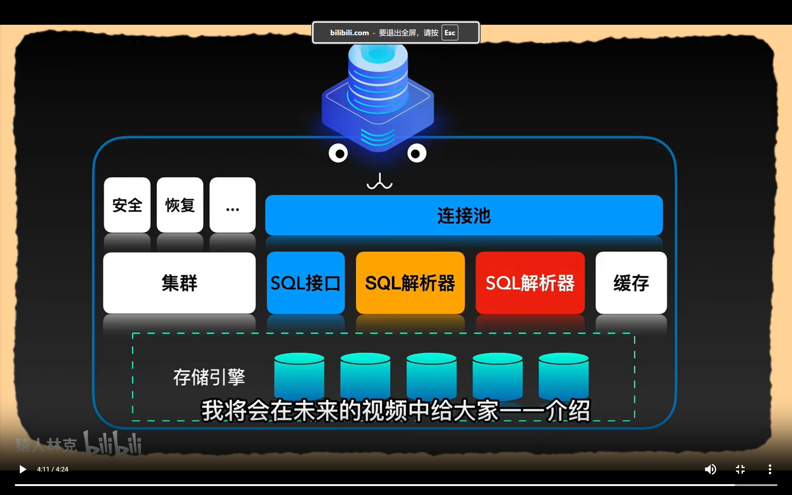
### 数据记录顺序
1.写入undo log，为了支持数据回滚，也是实现a（原子性）
2.写入buffer pool，等待写入磁盘，调用odirec之间写入，不经过os的page cache
3.写入redo log buffer中，并将操作立刻刷盘写入redo log中，mysql重启后会从redo log中恢复数据，实现了acid中的d(持久性)
4.进行binlog刷盘，binlog是二进制文件，记录ddl和dml操作，用于数据库主从同步，备份恢复，使用mysqlbinlog file_name查看文件内容
5.刷盘成功后，通知redo log，为本次事务打上commit标签，用于重启后数据恢复
- 为了支持数据回滚，写入`undo log`文件
- 为了防止断点内存内容消失，写入
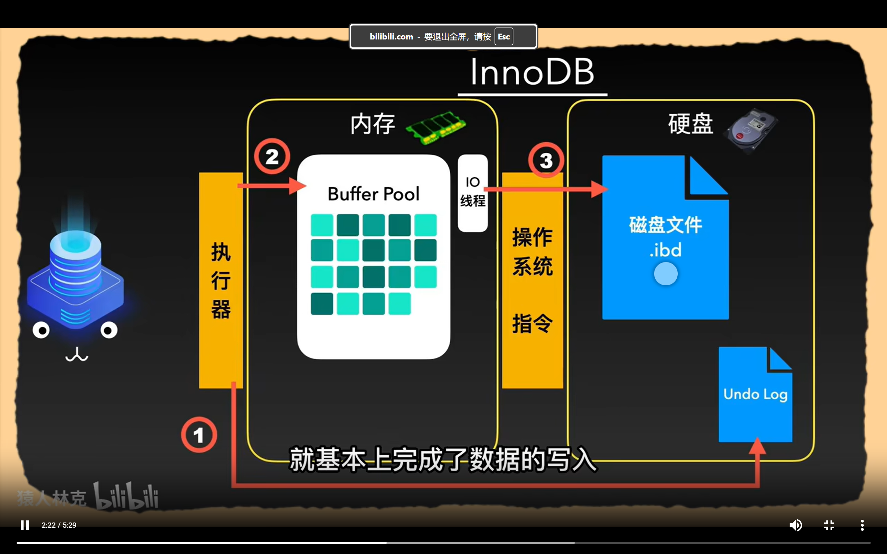
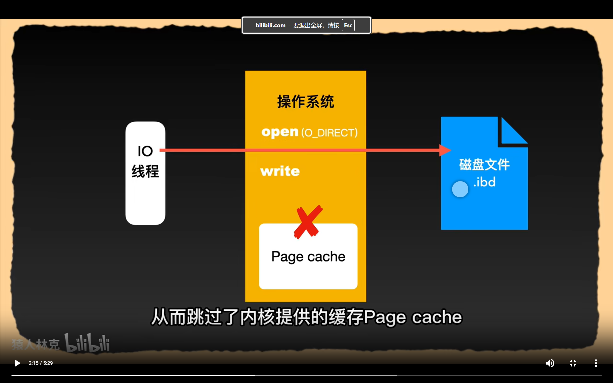
- 防止内存内容消失，写入redo log buffer文件并写入操作系统内存并刷盘
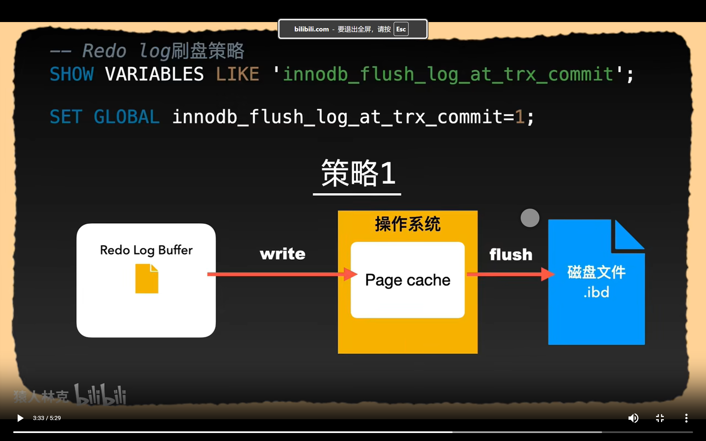
- 策略0会隔一秒才写入操作系统
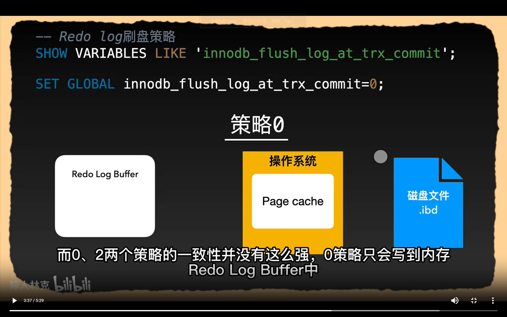
- 策略2
  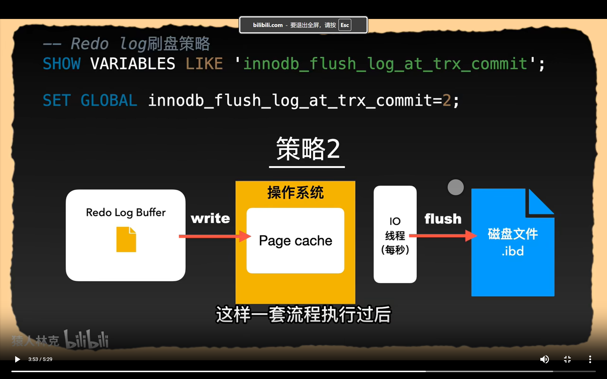
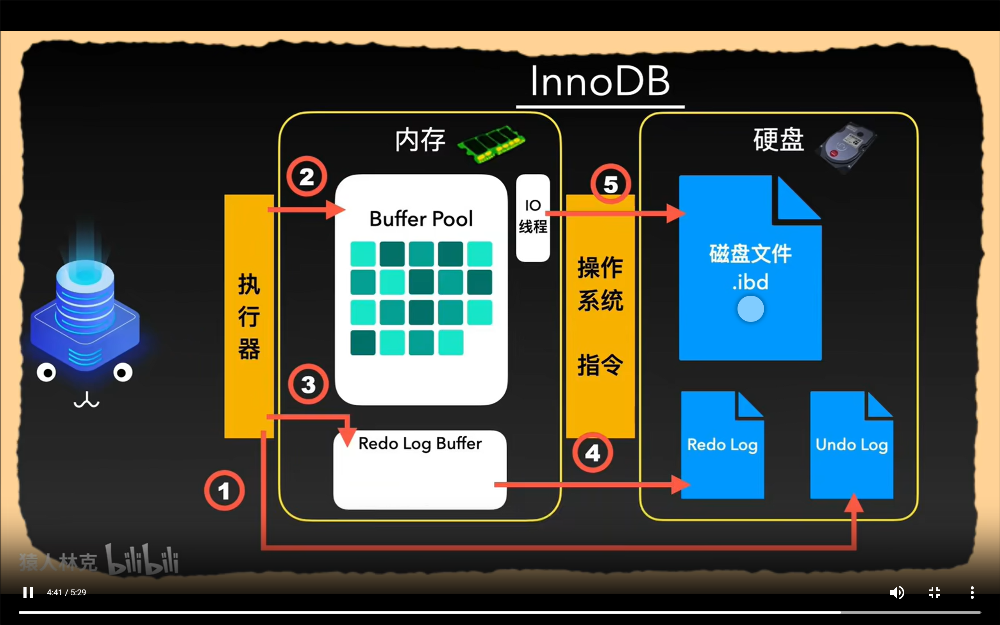
- biglog另一个模块
  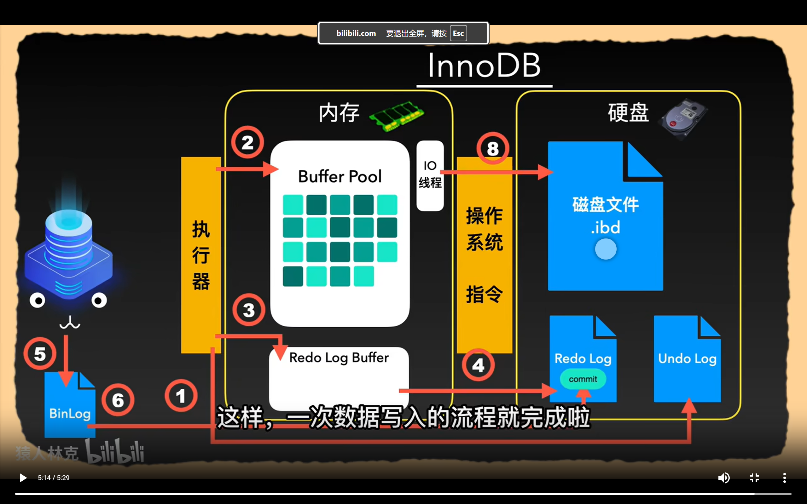
## 3 数据库的数据存储
- 在建立新表后，在data目录下面创建t.frm文件（较小)和t.ibd文件；	 
- 在5.7之后，会为每个表生成一个ibd文件，称为独立表空间，在此之前， 所有表的数据和索引存储在系统表空间（又叫共享表空间);
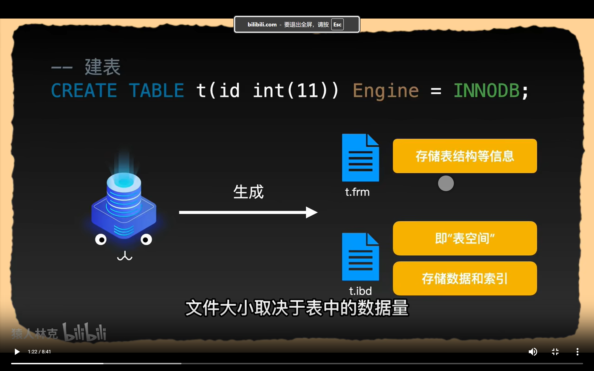
- 表空间分类
- 独立表空间比共享表空间具有可压缩，可传输优势
  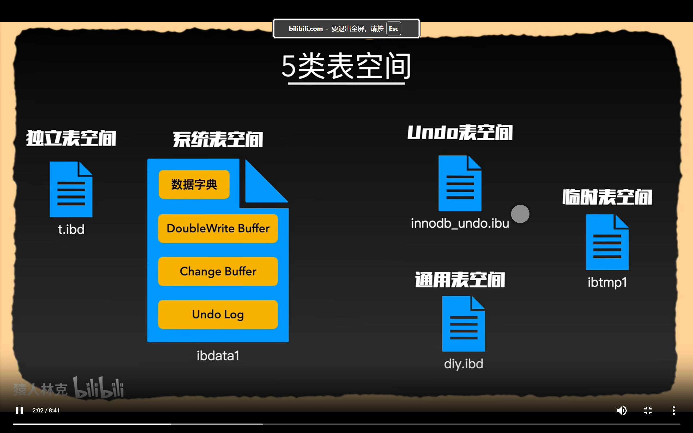	
  - 数据库以表->页->行的层次存储数据
  - 现在一般用dynamic行；但是一页只有16kb
  - 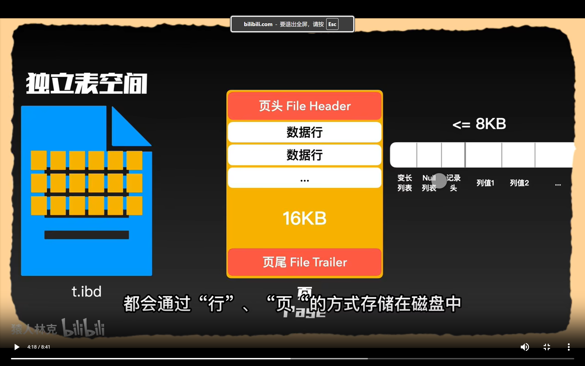
  - 为了方便读取，创建了区（1mb）；
  - 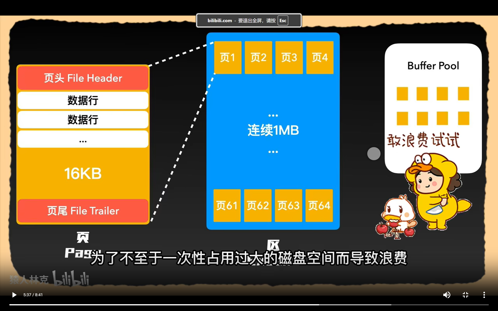
  - 初始是6个页（放在碎片区）；64个页形成一个区，256个区形成一个区组，第一个区组前四个首个区前四个特殊，其他前两个特殊
- 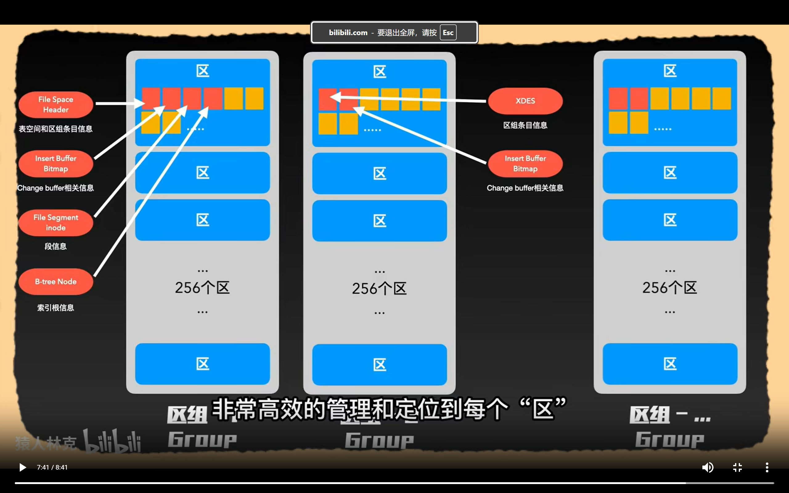
- 最后段不是物理结构，只是逻辑结构
- 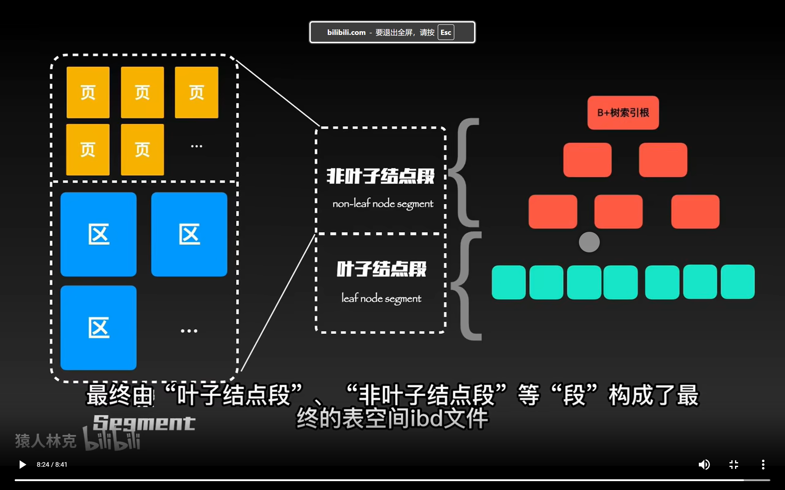
