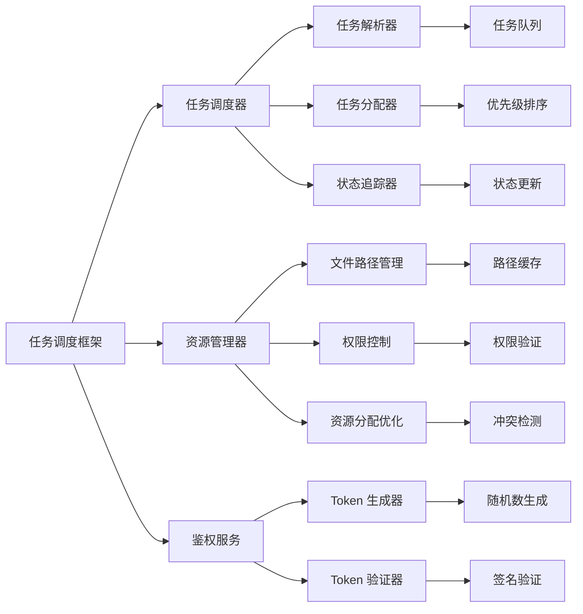
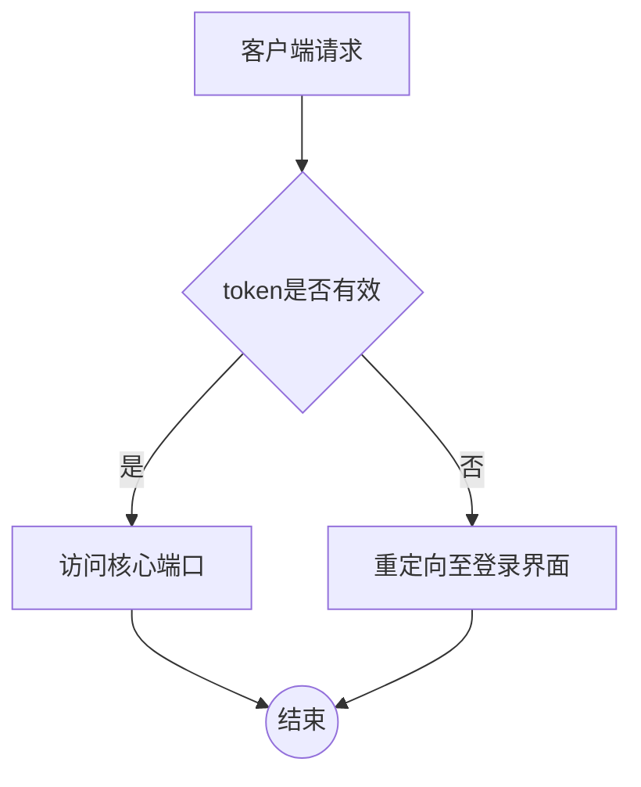
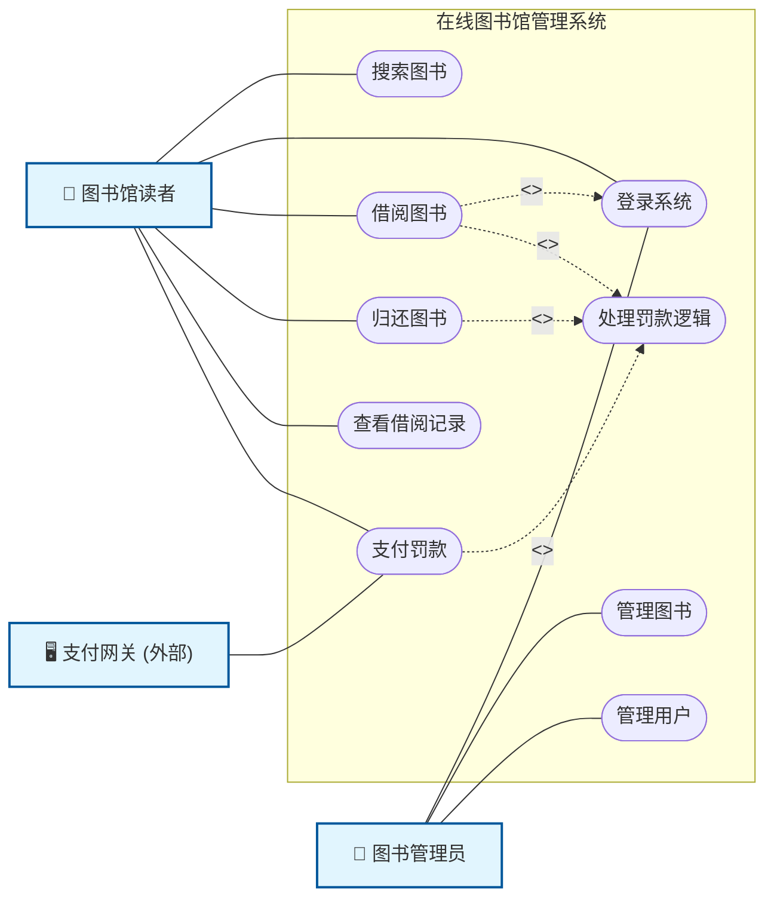

```mermaid
graph LR
    A[任务调度框架] --> B[任务调度器]
    A --> C[资源管理器]
    A --> D[鉴权服务]
    B --> E[任务解析器]
    B --> F[任务分配器]
    B --> G[状态追踪器]
    C --> H[文件路径管理]
    C --> I[权限控制]
    C --> J[资源分配优化]
    D --> K[Token 生成器]
    D --> L[Token 验证器]
    E --> M[任务队列]
    F --> N[优先级排序]
    G --> O[状态更新]
    H --> P[路径缓存]
    I --> Q[权限验证]
    J --> R[冲突检测]
    K --> S[随机数生成]
    L --> T[签名验证]
```

```mermaid
graph TD
	A[客户端请求] --> B{token是否有效}
	B -- 是 --> C[访问核心端口]
	B --否--> D[重定向至登录界面]
	C --> E((结束))
	D --> E
```

```mermaid
flowchart LR
    %% 定义参与者 (Actor)，使用 emoji 模拟图标以增加可读性
    Patron["👤 图书馆读者"]
    Librarian["👤 图书管理员"]
    Gateway["🖥️ 支付网关 (外部)"]
    %% 使用 subgraph 定义系统边界
    subgraph LibrarySystem ["在线图书馆管理系统"]
        %% 使用 (["文本"]) 语法生成类似椭圆形的用例节点
        Search(["搜索图书"])
        Login(["登录系统"])
        Borrow(["借阅图书"])
        Return(["归还图书"])
        History(["查看借阅记录"])
        Pay(["支付罚款"])
        ManageBooks(["管理图书"])
        ManageUsers(["管理用户"])
        HandleFines(["处理罚款逻辑"])
    end
    %% 修正：将所有带箭头的实线 (-->) 修改为无箭头的纯实线 (---)
    %% 参与者与用例的关联
    Patron --- Search
    Patron --- Login
    Patron --- Borrow
    Patron --- Return
    Patron --- History
    Patron --- Pay
    Librarian --- Login
    Librarian --- ManageBooks
    Librarian --- ManageUsers
    %% 外部系统
    Gateway --- Pay
    %% Include(包含) 和 Extend(扩展) 关系 (使用 -.-> 表示带箭头的虚线，并添加文字标签)
    %% 这些箭头是必要的，用来表示依赖的方向
    Borrow -. "<<include>>" .-> Login
    Borrow -. "<<include>>" .-> HandleFines
    Return -. "<<include>>" .-> HandleFines
    Pay -. "<<extend>>" .-> HandleFines
    %% 样式美化：给参与者节点加点底色
    classDef actorStyle fill:#e1f5fe,stroke:#01579b,stroke-width:2px;
    class Patron,Librarian,Gateway actorStyle;
```
